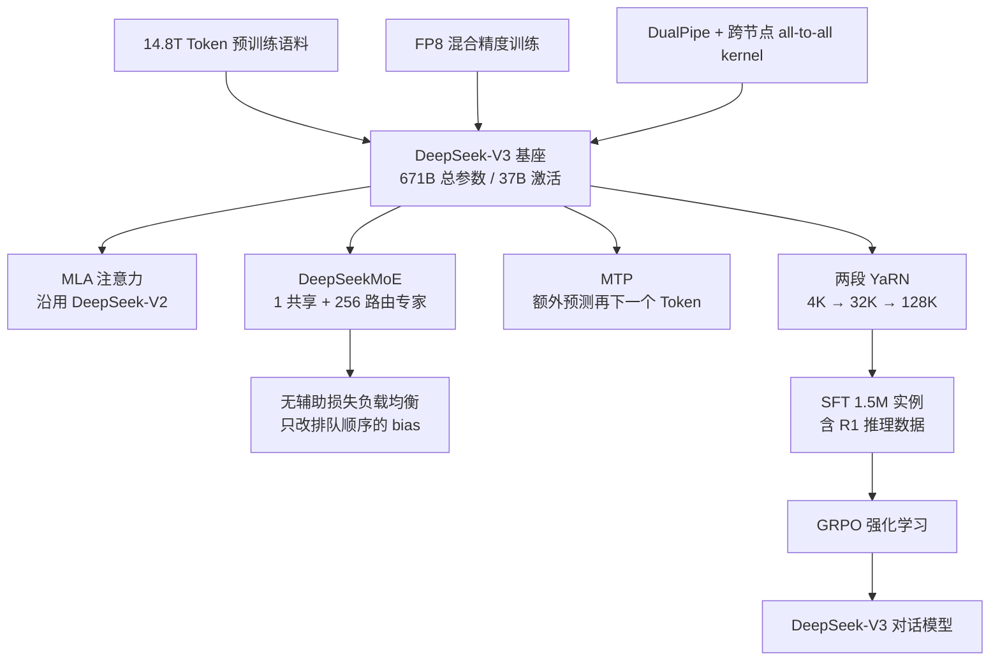
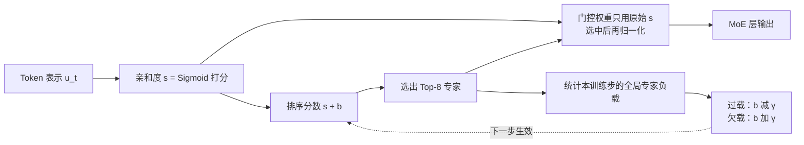
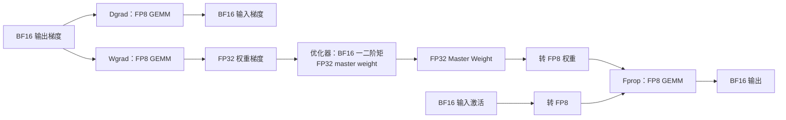
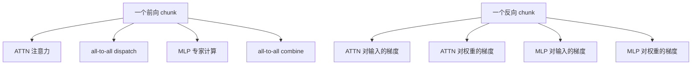
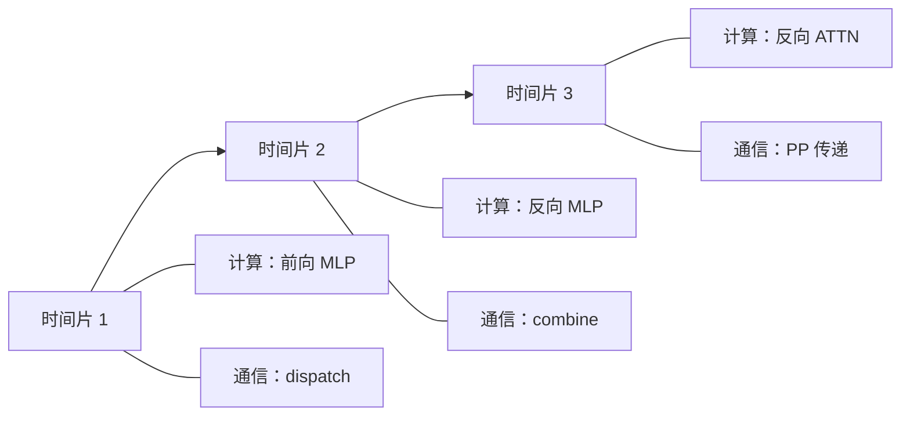
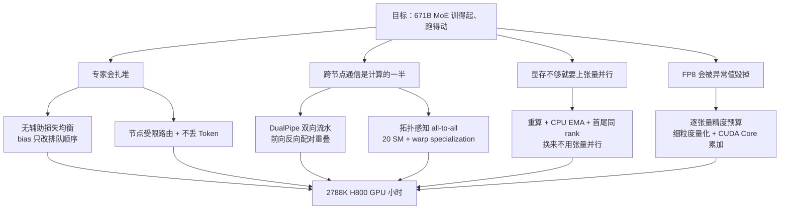

# DeepSeek-V3：671B 模型只花 278.8 万 GPU 小时，省在了哪里

<!-- release-date: 2024-12-26 -->

> 本文依据 DeepSeek-AI 的 **DeepSeek-V3 Technical Report**，即 arXiv:2412.19437v2（2025-02-18 修订版），共 53 页。这是撰稿时 arXiv 上的最新版本，官方仓库 README 也直接指向同一份 arXiv 原件。文中页码均指 PDF 自身的页码。凡是「报告写了什么」「我们如何解释它」「哪些是外部补充」，都会分开标注。

## 先说矛盾：混合专家说自己便宜，但便宜要在四个地方还回去

先看一个数字。报告说，DeepSeek-V3 的完整训练——预训练加上下文扩展加后训练——一共用了 278.8 万 H800 GPU 小时。按每 GPU 小时 2 美元的租用价折算，是 557.6 万美元。（PDF p.5）

这个数字之所以值得当成一整篇文章的主线，不是因为它便宜得离谱，而是因为它**不是靠某一个技巧省出来的**。它是四笔「本来要还回去的钱」被逐笔按住的结果。

要理解这四笔钱，先要理解一个前提。

DeepSeek-V3 是一个**混合专家模型**（Mixture-of-Experts，MoE）。普通的稠密模型每处理一个 Token（词元，模型读写文本时的基本小块）都要把全部参数跑一遍；MoE 则把前馈网络拆成很多个「专家」小网络，每个 Token 只唤醒其中几个。V3 总共有 6710 亿参数，但每个 Token 只激活 370 亿。（PDF p.1）

这看起来是白捡的便宜：参数量涨了，单个 Token 的计算量却没涨。但真做起来，这份便宜会在四个地方被收回去。

**第一笔：专家会扎堆。** 路由器如果学会了「什么 Token 都送给第 7 号专家」，其他专家就闲置，模型退化成一个小模型。这叫**路由塌缩**（routing collapse）。业界的标准解法是加一个**辅助损失**（auxiliary loss），逼着负载均匀。但辅助损失是一个与「把语言建模好」无关的额外目标，它会和主任务抢梯度。加得太轻不管用，加得太重伤性能。

**第二笔：专家分散在很多机器上。** 一个 Token 要用的专家可能在别的节点上，于是每一层都要做一次全体到全体的数据搬运（all-to-all）。报告说，跨节点专家并行让 V3 的**计算与通信之比大约是 1:1**——也就是说，如果不做任何重叠，一半的时间机器在等网络。（PDF p.12）

**第三笔：显存。** 参数多、激活多、优化器状态多。显存不够就得上张量并行（Tensor Parallelism，把一个矩阵横着切给多张卡），而张量并行又会带来新的通信。

**第四笔：数值精度。** 想用 FP8（8 位浮点）把计算量减半，但 FP8 只有 8 个二进制位，动态范围很窄。训练里只要出现少量异常大的数值，整个张量的缩放比例就会被拉歪，训练可能直接发散。

DeepSeek-V3 报告的价值，就在于它对这四笔账各给了一个具体、可复述的解法，并且都给出了代价。

## 一句话结论

DeepSeek-V3 不是一个新架构。它的注意力（MLA）和专家结构（DeepSeekMoE）都来自 DeepSeek-V2。

它真正新增的东西只有三样加一套系统：

- **无辅助损失负载均衡**：用一个不参与梯度的偏置项去调专家排队顺序，把「均衡」从损失函数里搬出来，变成一个控制器；
- **多 Token 预测（Multi-Token Prediction，MTP）**：训练时每个位置多学一个未来 Token，推理时还能顺手做投机解码；
- **FP8 混合精度训练**：报告称这是第一次在超大规模模型上验证 FP8 训练可行；
- **一整套让上面三件事跑得动的系统**：DualPipe 流水线、拓扑感知的 all-to-all kernel、极致省显存、prefill/decode 分离部署。

所以这篇报告最值得记住的不是某个名词，而是一种做法：

> **不要只问「这个方案跑不跑得通」，要问「它的代价会以什么形式出现，我能不能把这个代价挪到一个更便宜的地方」。**

## 几个会反复出现的名字

- **MLA（Multi-head Latent Attention，多头潜在注意力）**：把 Key 和 Value 压成一个低维潜向量再缓存，用来减小推理时的 KV Cache。它是 DeepSeek-V2 的贡献，**完整推导见 DeepSeek-V2 篇**。
- **DeepSeekMoE**：把专家切得更细，并且固定留出一部分「共享专家」让所有 Token 都走。同样来自 DeepSeek-V2，**机制见 DeepSeek-V2 篇**。
- **KV Cache（键值缓存）**：生成时把读过内容的中间结果留着，不必每出一个新 Token 就重算全部历史。
- **all-to-all（全体到全体通信）**：每张卡都要给其他所有卡发一份数据，也从所有卡收一份。MoE 的专家分布在不同卡上时，每层都要做两次。
- **PP / EP / DP / TP**：流水线并行、专家并行、数据并行、张量并行。V3 **训练时**用了前三种，刻意不用第四种；推理部署另有一套配置。（PDF p.12、p.19）
- **SM（Streaming Multiprocessor，流多处理器）**：GPU 上的基本计算单元。H800 有 132 个。（PDF p.20）

## 全景：V3 到底改了哪几层

这张图根据报告第 2、3、4、5 节重画，是**结构关系示意**，不表示时间顺序上的严格先后。（PDF p.6–35）

## 先把账单摊开

| 阶段 | H800 GPU 小时 | 折算美元 |
|---|---:|---:|
| 预训练 | 2664K | $5.328M |
| 上下文扩展 | 119K | $0.238M |
| 后训练 | 5K | $0.01M |
| **合计** | **2788K** | **$5.576M** |

（PDF p.5，Table 1；按 H800 每小时 2 美元估算）

几个可以自己验算的比例：

- 每训练 1 万亿 Token 需要 18 万 H800 GPU 小时；在 2048 张 H800 的集群上约 3.7 天。（PDF p.5）
- $180\text{K} \times 14.8 = 2664\text{K}$，与预训练那一行对得上。
- 整个预训练不到两个月。（PDF p.5）
- 上下文扩展只占总量的 4.3%，后训练只占 0.18%。**绝大部分成本发生在预训练**，这决定了后面所有优化的优先级。

### 账单里没有的东西

报告自己写得很清楚：上述成本**只包含 DeepSeek-V3 的正式训练，不包含此前在架构、算法或数据上的研究与消融实验**。（PDF p.5）

这一句非常重要。一个团队要做出 V3，需要先有 V2 验证 MLA 和 DeepSeekMoE，需要 15.7B 和 228.7B 两个规模的消融模型，需要 FP8 与 BF16 的对照训练。这些都不在 557.6 万美元里。

所以正确的说法是：**「用 557.6 万美元复现一次已知配方」是可信的；「用 557.6 万美元从零走到 V3」不是这份报告支持的结论。** 这是我们的判断，不是报告原话。

## 沿用的底盘：MLA 与 DeepSeekMoE

报告开门见山地说，V3 的注意力仍是 MLA，前馈网络仍是 DeepSeekMoE，两者都已在 DeepSeek-V2 上充分验证；除了明确提到的改动，其余细节都沿用 V2 的设置。（PDF p.6）

**MLA 的动机、低秩压缩推导和 KV Cache 收益，见 DeepSeek-V2 篇；DeepSeekMoE 的细粒度专家划分与共享专家设计，同样见 DeepSeek-V2 篇。** 这里只讲 V3 自己的增量。

### V3 在骨架上做的改动

**第一，路由分数换了函数。** V2 用 Softmax 算 Token 到专家的亲和度，V3 改用 Sigmoid，然后在被选中的那几个分数之间做一次归一化，得到最终门控值。（PDF p.9）

这个改动看起来很小，但它和后面的无辅助损失均衡是配套的。Softmax 的输出天然互相竞争（一个专家分数涨，别人必降）；Sigmoid 让每个专家独立打分，再对 Top-K 归一化。独立打分意味着**可以给某个专家单独加一个偏置，而不会自动压低所有其他专家**。这是我们的解读，报告没有把两者的因果关系写出来。

**第二，MLA 的具体尺寸。** 注意力头数 $n_h = 128$，每头维度 $d_h = 128$；KV 压缩维度 $d_c = 512$，Query 压缩维度 $d_c' = 1536$；携带 RoPE 的解耦维度 $d_h^R = 64$。（PDF p.22）

$d_c = 512$ 相对于 $n_h \times d_h = 16384$ 是 1/32。这就是 MLA 省 KV Cache 的直接来源。

**第三，MoE 的具体配置。** 61 层 Transformer，隐藏维度 7168。除了**前三层**保留普通前馈网络，其余所有前馈层都换成 MoE 层。每个 MoE 层有 1 个共享专家和 256 个路由专家，每个专家的中间维度是 2048；每个 Token 激活 8 个路由专家。（PDF p.22）

前三层保持稠密，是一个常见但值得注意的选择：最浅层处理的多是词法和符号层面的模式，让它们走确定的稠密路径，比让路由器在这里学一套复杂策略更稳。这是我们的解释。

**第四，节点受限路由（Node-Limited Routing）。** 每个 Token 最多被送到 $M$ 个节点，节点的选择依据是「该节点上专家亲和度最高的 $K_r/M$ 个分数之和」。V3 取 $M=4$。（PDF p.10、p.23）

**第五，不丢 Token。** 因为负载均衡做得住，V3 在训练和推理中都不丢弃任何 Token。（PDF p.10）这一点值得单独记住：很多 MoE 实现靠「专家满了就丢」来保证效率，而丢 Token 意味着一部分训练信号被静默扔掉。

## 核心设计一：无辅助损失负载均衡

这是 V3 三个算法贡献里最简洁、也最容易搬走的一个。

### 旧问题：治疗路由塌缩的药本身有副作用

前面说过，MoE 的专家会扎堆。传统解法是在训练目标里加一项辅助损失，惩罚负载不均。

问题在于，最终的损失函数变成了：

$$
\mathcal{L} = \mathcal{L}_{\text{语言建模}} + \alpha \cdot \mathcal{L}_{\text{均衡}}
$$

模型在优化时必须同时照顾两个目标。$\alpha$ 太小，均衡没效果；$\alpha$ 太大，模型为了让专家用得平均，会牺牲「把这个 Token 交给最合适的专家」这件事本身。报告直接引用了这一点：辅助损失太大会损害模型性能。（PDF p.9）

更深一层的问题是：**负载均衡本质上是一个系统约束，不是一个语言学目标。** 把它写进损失函数，等于让梯度下降去解决一个本来该由调度器解决的问题。

### 新设计：给每个专家一个只影响排队顺序的偏置

V3 给第 $i$ 个专家引入一个偏置 $b_i$。选专家时用 $s_{i,t} + b_i$ 排序，但真正乘到专家输出上的门控值，仍然用**没有偏置的**原始亲和度 $s_{i,t}$：

$$
g'_{i,t}=
\begin{cases}
s_{i,t}, & s_{i,t}+b_i \in \operatorname{Topk}\left(\{s_{j,t}+b_j \mid 1 \le j \le N_r\},\, K_r\right)\\
0, & \text{其他}
\end{cases}
$$

符号说明：$s_{i,t}$ 是第 $t$ 个 Token 对第 $i$ 个专家的亲和度，$N_r$ 是路由专家总数，$K_r$ 是每个 Token 激活的专家数，$\operatorname{Topk}$ 表示取分数最高的 $K_r$ 个。（PDF p.9，式 16）

### 为什么「只改排序、不改权重」是整个设计的关键

这一句是全节的核心，值得慢慢读。

如果偏置同时进入门控权重，那它就等价于给某个专家的输出乘一个人为放大的系数——模型会学到「这个专家的贡献被系统性高估了」，进而扭曲表示。

现在偏置只参与**谁进入前 8 名**这一次比较。一旦选定，权重完全由原始亲和度决定。

打个比方：这像一个排队叫号系统。有人排队太久（专家过载），系统就把他的号往后挪一挪；有人一直没人叫（专家欠载），系统就把他的号往前提一提。但**一旦轮到他，他要做的工作、他的工资、他被评价的方式，和别人完全一样**。号码顺序变了，工作内容没变。

也正因为 $b_i$ 不出现在任何乘法路径上，它**不需要梯度**。报告明确说偏置项只用于路由。（PDF p.9）

### 工作机制：一个没有梯度的控制器

这张图根据报告 2.1.2 节文字重画（PDF p.9），是**机制示意**，不是实测数据。

具体流程：训练中持续监控**每个训练步整个 batch** 上的专家负载；每步结束时，过载的专家把它的 $b_i$ 减去 $\gamma$，欠载的加上 $\gamma$。$\gamma$ 叫**偏置更新速度**（bias update speed）。（PDF p.9）

V3 的实际取值：前 14.3T Token 用 $\gamma = 0.001$，最后 500B Token 设为 0。（PDF p.23）

最后 500B 把 $\gamma$ 关掉，意思是训练末期冻结路由偏置，让模型在一个固定的路由策略下收敛。报告没有解释这么做的原因，这是我们从时间点推出的读法。

### 还留了一条极小的序列级损失

完全不管序列内部的均衡也有风险：整个 batch 平均下来很均衡，但某一条序列可能全都挤在两三个专家上。V3 因此保留一个**序列级均衡损失**：

$$
\mathcal{L}_{\text{Bal}} = \alpha \sum_{i=1}^{N_r} f_i P_i
$$

其中 $f_i$ 是这条序列里第 $i$ 个专家被选中的频率（乘上归一化系数 $N_r/(K_r T)$），$P_i$ 是这条序列上该专家归一化亲和度的平均值，$T$ 是序列 Token 数。（PDF p.9，式 17–20）

直觉上，$f_i P_i$ 在「频率高且分数也高」时最大，所以最小化它会打散扎堆。

关键是 $\alpha$ 的取值：**0.0001**。（PDF p.23）报告直说它只是「避免任何单条序列出现极端不均衡」。（PDF p.9）

这是一个很好的工程分寸感：不是「要么全靠辅助损失，要么完全不用」，而是**把主要机制交给控制器，只留一根极细的保险丝防止极端情况**。

### 收益：两个规模上的对照实验

报告在两个规模上做了消融，两组都只换均衡策略，训练数据和其他架构保持一致。（PDF p.26–27，Table 5）

| Benchmark | 小模型 基于辅助损失 | 小模型 无辅助损失 | 大模型 基于辅助损失 | 大模型 无辅助损失 |
|---|---:|---:|---:|---:|
| Pile-test (BPB，越低越好) | 0.727 | **0.724** | 0.656 | **0.652** |
| BBH | 37.3 | **39.3** | 66.7 | **67.9** |
| MMLU | 51.0 | **51.8** | **68.3** | 67.2 |
| HumanEval | 22.0 | **22.6** | 40.2 | **46.3** |
| MBPP | **36.6** | 35.8 | 59.2 | **61.2** |
| GSM8K | 27.1 | **29.6** | 70.7 | **74.5** |
| MATH | 10.9 | **11.1** | 37.2 | **39.6** |

小模型 15.7B 总参数 / 2.4B 激活，训练 1.33T Token；大模型 228.7B 总参数 / 20.9B 激活，训练 578B Token。（PDF p.27）

读这张表要诚实：**方向一致，但不是每一项都赢。** 小模型的 MBPP 掉了 0.8，大模型的 MMLU 掉了 1.1。报告的措辞是「在大多数评测上持续更好」，这个措辞是准确的。

另外必须记住一个边界：**这两个消融的最大规模是 228.7B，不是 671B。** 报告没有在 671B 上做无辅助损失与辅助损失的对照训练——那样等于把整个模型训两遍。所以「V3 用了这个策略」是事实，「在 671B 上它比辅助损失更好」是外推。

### 再往前一步：batch 级和序列级到底差在哪

报告做了一个很聪明的追问。无辅助损失策略和序列级辅助损失的真正区别，是**均衡的作用域**：前者看整个 batch，后者看每条序列。（PDF p.27）

batch 级是更宽松的约束。它不要求每条序列内部都均衡，于是专家可以按领域分化——处理代码的序列可以集中用代码专家。

为了验证是「作用域」而不是「有没有损失项」在起作用，报告又设计了一个 **batch 级辅助损失** 做对照。结果是（PDF p.27）：

| 模型规模 | 序列级辅助损失 | 无辅助损失 | batch 级辅助损失 |
|---|---:|---:|---:|
| 1B MoE 验证损失 | 2.258 | 2.253 | 2.253 |
| 3B MoE 验证损失 | 2.085 | 2.080 | 2.080 |

结论很干净：**在同等 batch 级均衡水平下，batch 级辅助损失和无辅助损失表现一样。** 也就是说，收益来自「把均衡范围从序列放宽到 batch」，而不是来自「取消损失项」。

这是这份报告里最有科研素养的一段。它主动否定了一个对自己更有利的叙事（「无辅助损失本身更优」），指出真正的变量是别的东西。

报告还配了一张专家负载图：在 Pile 测试集的 Wikipedia、Github、DM Mathematics 三个领域上，无辅助损失模型表现出更强的专家特化。（PDF p.28，Figure 9；全部层见附录 C，p.49–53）

### 代价与边界

报告自己列了 batch 级均衡的两个效率隐患（PDF p.27–28）：

1. **某些序列或小 batch 内部仍可能失衡**。V3 靠大规模专家并行和数据并行保证每个 micro-batch 足够大来规避。
2. **推理时的领域漂移会造成失衡**。训练时的 batch 混合了各种领域，线上一个用户可能连续问 200 个 SQL 问题。V3 靠部署时的冗余专家来处理（见后文推理部署一节）。

还有两个报告没展开的边界：

- $\gamma$ 是超参数，报告只给了 V3 的取值，没有给敏感性分析；
- 「每步统计全局负载」需要跨所有数据并行 rank 做一次同步。报告没有量化这个同步的开销。

### 可迁移启发

> **当一个约束是系统层面的、可测量的、并且有明确目标值时，优先考虑用控制器实现它，而不是加进损失函数。**

损失函数里的每一项都在和主目标抢梯度；控制器不抢。可以套用这个模式的场景很多：推荐系统的曝光公平性、检索的类目配额、多任务采样比例、限流。判断标准是三条——目标可测量、有明确基准值、调整动作不影响被调整对象的语义。

第二条启发更细，但同样值得记：**当你要给一个离散选择过程加干预时，先看清干预注入在「打分」还是「选择」环节。** 注入选择环节（改排序）通常不污染下游数值；注入打分环节（改权重）会。

## 核心设计二：多 Token 预测（Multi-Token Prediction，MTP）

### 旧问题：一个位置只学一个监督信号

标准语言模型训练是「看前面，猜下一个词」。序列上每个位置提供一个监督信号。

这有两个隐含的浪费。第一，信号密度低——一段文本的信息量，只被用来学「逐个位置的下一步」。第二，模型没有被要求做任何超过一步的规划：它只要保证下一个词像样就行。

报告给出的两条动机正是这个：MTP 让训练信号更密集，可能提高数据效率；同时可能让模型**预先规划**（pre-plan）自己的表示，以便更好地预测更远的 Token。（PDF p.10）

注意「may」这个词。报告在这里用的是假设语气，不是已证结论。

### 新设计：串行的预测链，而不是并排的多个头

Gloeckle 等人 2024 年的做法是：在主干顶上并排接 $D$ 个独立输出头，同时预测未来 $D$ 个 Token。

V3 不这么做。它用 $D$ 个**顺序**模块，每个模块预测再往后一个 Token，并且**保持完整的因果链**。（PDF p.10）

差别在哪？并排多头时，预测第 3 个未来 Token 的那个头，看不到「第 2 个未来 Token 是什么」这个信息；它只能从当前位置的表示硬猜。V3 的串行结构里，第 $k$ 层的输入包含了第 $k-1$ 层的输出表示，也包含了真实的第 $i+k$ 个 Token 的 embedding。所以它是在「已知前面都猜对」的条件下预测下一步，条件概率链是完整的。

### 公式：一层 MTP 模块在做什么

第 $k$ 个 MTP 模块由四部分组成：一个**与主模型共享**的 embedding 层、一个**与主模型共享**的输出头、一个自己的 Transformer 块 $\mathrm{TRM}_k$，和一个投影矩阵 $M_k \in \mathbb{R}^{d \times 2d}$。（PDF p.10）

第一步是把两样东西拼起来再压回 $d$ 维：

$$
h_i'^{k} = M_k\left[\operatorname{RMSNorm}(h_i^{k-1});\ \operatorname{RMSNorm}(\mathrm{Emb}(t_{i+k}))\right]
$$

- $h_i^{k-1}$：第 $i$ 个位置在上一深度得到的表示；当 $k=1$ 时，它就是主模型的输出表示；
- $\mathrm{Emb}(t_{i+k})$：真实的第 $i+k$ 个 Token 的词嵌入；
- $[\,\cdot\,;\,\cdot\,]$：拼接，所以拼完是 $2d$ 维，$M_k$ 再压回 $d$ 维。（PDF p.11，式 21）

第二步走一层 Transformer，第三步用共享输出头得到概率分布：

$$
h_{1:T-k}^{k} = \mathrm{TRM}_k\left(h_{1:T-k}'^{k}\right),
\qquad
P_{i+k+1}^{k} = \mathrm{OutHead}\left(h_i^{k}\right)
$$

$T$ 是输入序列长度。（PDF p.11，式 22–23）

这里有个容易看漏的细节：为什么切片是 $1:T-k$？因为第 $k$ 深度要预测第 $i+k+1$ 个 Token，序列末尾的最后 $k$ 个位置没有对应的目标，只能丢掉。

### 训练目标

每个深度算一次交叉熵，再平均、乘权重：

$$
\mathcal{L}_{\mathrm{MTP}}^{k} = -\frac{1}{T}\sum_{i=2+k}^{T+1}\log P_i^{k}[t_i],
\qquad
\mathcal{L}_{\mathrm{MTP}} = \frac{\lambda}{D}\sum_{k=1}^{D}\mathcal{L}_{\mathrm{MTP}}^{k}
$$

$P_i^k[t_i]$ 是第 $k$ 个模块给真实 Token $t_i$ 的预测概率，$\lambda$ 是权重系数。（PDF p.11，式 24–25）

V3 取 $D=1$——也就是除了下一个 Token，每个位置只多预测一个。$\lambda$ 前 10T Token 取 0.3，之后 4.8T Token 降为 0.1。（PDF p.22–23）

$\lambda$ 后期减半的读法是：训练早期需要更密的信号帮助表示成型，后期要把优化重心还给主任务。这是我们的解释，报告没写原因。

### 收益与它的不确定处

同样是两个规模的消融，只加一个 1 深度 MTP 模块，其余不变；推理时把 MTP 模块直接丢掉，所以**两边推理成本完全相同**。（PDF p.26，Table 4）

| Benchmark | 小模型 基线 | 小模型 +MTP | 大模型 基线 | 大模型 +MTP |
|---|---:|---:|---:|---:|
| Pile-test (BPB) | 0.729 | 0.729 | 0.658 | **0.657** |
| BBH | 39.0 | **41.4** | 70.0 | **70.7** |
| MMLU | 50.0 | **53.3** | **67.5** | 66.6 |
| DROP | 39.2 | **41.3** | 68.5 | **70.6** |
| NaturalQuestions | **22.7** | 22.3 | 27.2 | **28.5** |
| HumanEval | 20.7 | **26.8** | 44.5 | **53.7** |
| GSM8K | 25.4 | **31.4** | 72.3 | **74.0** |
| MATH | 10.7 | **12.6** | 38.6 | **39.8** |

小模型 15.7B/1.33T Token，大模型 228.7B/540B Token。（PDF p.26）

代码上的提升最显眼：大模型 HumanEval 从 44.5 到 53.7，涨了 9.2 分。这符合直觉——代码有很强的多步局部结构（`if` 后面大概率跟条件，括号要配对），提前一步的目标能直接帮上忙。这是我们的解释。

但同样要诚实：**大模型的 MMLU 掉了 0.9，小模型的 NaturalQuestions 掉了 0.4。** 而且这两个消融的规模也止于 228.7B，671B 上没有对照。

### 推理时的第二种用法：投机解码

MTP 模块在推理时可以直接丢掉，主模型独立工作。但也可以留着做**投机解码**（speculative decoding）——先用便宜的模块猜一个 Token，再让主模型一次性验证。

报告给的数字是：第二个 Token 的**接受率在 85%–90% 之间**，跨不同生成主题都稳定；由此带来约 **1.8 倍的 TPS（每秒 Token 数）**。（PDF p.35）

这里要理解为什么 85% 的接受率能换来 1.8 倍速度，而不是 1.85 倍：每一步要么一次出 2 个 Token（概率约 0.85），要么出 1 个。期望产出约 1.85 个 Token/步，但验证本身也有开销，所以实测 1.8 倍。这是我们的算法解读，报告只给了结果数字。

### 代价与边界

- **训练侧变贵**：多一个 Transformer 块的前向反向，多一份激活。报告没有给 MTP 带来的训练时间或显存增量。
- **$\lambda$ 要退火**：说明这个辅助目标和主目标并非完全同向。
- **$D=1$ 就停了**：报告没有说明为什么不试 $D=2$ 或更大，也没有给 $D$ 的消融。
- **收益不均匀**：代码数学明显，知识类基本持平甚至略降。

### 可迁移启发

> **给模型加一个「稍微超前一点」的预测目标，往往比加更多同类数据更便宜。**

关键是两个设计选择：第一，让辅助目标**共享主干的表示**（V3 共享 embedding 和输出头），这样它才能改善主干而不是自成一路；第二，让辅助模块在推理时**可丢弃**，这样它不进入线上成本。

满足这两条的辅助目标才是「免费的」。如果你的辅助头在推理时必须一起跑，那它就不是正则化，而是模型的一部分，要按模型的标准去评估。

## 核心设计三：FP8 混合精度训练

这是这篇报告最有迁移价值的部分，也是细节最多的一节。

### 旧问题：低精度的困难不在位数，在异常值

FP8 只有 8 个二进制位。常见的两种格式是 E4M3（4 位指数、3 位尾数）和 E5M2（5 位指数、2 位尾数）。位数少意味着能表示的数值范围窄。

标准做法是给整个张量算一个缩放因子：把张量里最大的绝对值缩放到 FP8 能表示的最大值。

这个做法的致命弱点是：**只要张量里有一个异常大的数，整个张量的缩放因子就被它绑架了。** 其余绝大多数正常数值被压到接近 0，量化误差急剧放大。

而大模型训练里，激活、权重、梯度都存在异常值。报告直接引用了这一现象，并指出：推理量化已经比较成熟，但在大规模语言模型**预训练**上成功应用低精度的研究还很少。（PDF p.14）

### 第一层决定：哪些算子不许降精度

V3 没有把全模型改成 FP8。以下组件保持原精度（BF16 或 FP32）：

- Embedding 模块；
- 输出头（Output Head）；
- MoE 门控模块；
- 所有归一化算子；
- 所有注意力算子。

同时，master weight（主权重）、权重梯度、优化器状态都保持更高精度。（PDF p.15）

真正跑 FP8 的是 Linear 算子的三个 GEMM：`Fprop`（前向）、`Dgrad`（对激活的反向）、`Wgrad`（对权重的反向）。理论上相比 BF16 计算速度翻倍。（PDF p.15）

这张图根据报告 Figure 6（PDF p.15）重画，是**数据流示意**，不含时间信息。

这里的选择逻辑值得单独说：留在高精度的都是**低计算量但高敏感度**的组件。Embedding 和输出头是查表和一次投影，占总 FLOPs 很小；归一化涉及求和与开方；注意力有 Softmax，指数运算对输入尺度极敏感。报告的原话是「一些低成本算子也可以用更高精度，对总训练成本影响可以忽略」。（PDF p.15）

**这条原则可以直接搬走：先按「计算量 × 敏感度」给每个算子分档，只把计算量大且鲁棒的那一档降精度。** 全模型统一精度是最容易实现、也最容易失败的做法。

### 第二层决定：量化粒度要跟着异常值的形状走

V3 用**细粒度量化**代替全张量缩放：

- **激活**：按 $1 \times 128$ 的 tile 分组，即「每个 Token 的每 128 个通道」共用一个缩放因子；
- **权重**：按 $128 \times 128$ 的 block 分组，即「每 128 个输入通道 × 每 128 个输出通道」共用一个缩放因子。（PDF p.16）

一个异常值现在只能污染它所在的那个小组，不再绑架整个张量。

### 为什么激活和权重的分组形状不一样

这一点很多解读会漏掉，但它揭示了设计的真实逻辑。

激活的异常值是**跟着 Token 走的**：某个特定 Token 在某些通道上数值特别大。所以分组必须是「单个 Token 内、跨少量通道」——也就是 $1 \times 128$，一个 Token 一行，绝不跨 Token 混在一起。

权重是训练出来的静态参数，没有「Token」这个维度，异常值分布相对均匀，用方块分组即可。

报告在附录里给出了直接证据。他们试过把 `Dgrad` 相关的所有张量都按 $128 \times 128$ 块量化（这样反向时只需转置，实现更简单）。结果是：**一个约 16B 的 MoE 模型在训练约 300B Token 后直接发散。** 报告的假设是，激活梯度在不同 Token 之间高度不均衡，存在「与 Token 相关的异常值」，块状分组无法处理。（PDF p.47–48）

这是一个非常有价值的负面结果：**量化分组的形状必须和异常值的结构对齐，不能为了实现方便而改。**

代价是实现上的麻烦：前向用 $1 \times 128$ 的 tile，反向计算需要 $128 \times 1$ 的 tile，同一份激活要换一种分组方式重新量化。为了不引入额外误差，这些缩放因子全部**取 2 的整数次幂**（round scaling）——因为 2 的幂次缩放在浮点数里只改指数位，不损失尾数。（PDF p.18）

### 第三层决定：Tensor Core 的累加精度不够用

这是全篇最「贴着硬件」的一段。

FP8 GEMM 会做大量乘加。V3 团队发现，**H800 的 Tensor Core 在 FP8 GEMM 里的累加只保留约 14 位精度**，远低于 FP32。（PDF p.17）

更具体的机制在硬件建议一节：Tensor Core 把 32 个尾数乘积按最大指数右移对齐后，只用每个乘积的最高 14 位相加，超出的位直接截断；累加进寄存器也是 14 位。（PDF p.21）

后果有多严重？报告给了一个可复现的测试：两个随机矩阵做 GEMM，内维 $K = 4096$ 时，**最大相对误差接近 2%**。（PDF p.17）而 $K$ 越大问题越严重，大模型训练恰恰是大 $K$ 的场景。

V3 的解法是**提升到 CUDA Core 累加**：Tensor Core 每累加 $N_C$ 个元素，就把部分和搬到 CUDA Core 的 FP32 寄存器上，用完整 FP32 精度继续累加。（PDF p.17，Figure 7b）

$N_C = 128$，相当于 4 次 WGMMA（Warpgroup 级矩阵乘加）指令。报告称这是「能显著改善精度而不引入明显开销的最小累加间隔」。（PDF p.17）

这个搬运会降低单个 warpgroup 的 WGMMA 发射率。但报告指出，H800 上通常有两个 WGMMA 并存：**一个 warpgroup 做提升操作时，另一个正好在做 MMA**，两者重叠，Tensor Core 利用率仍然很高。（PDF p.17）

细粒度量化的反量化开销也顺路解决了：per-group 的缩放因子本来就要乘回去，而现在部分和已经在 CUDA Core 上了，乘缩放因子几乎是顺手的事。（PDF p.17）

**这是一个很漂亮的耦合：一个为了精度引入的操作（提升到 CUDA Core），恰好成了另一个操作（反量化）的免费落脚点。**

### 三个小而关键的选择

**1. 全用 E4M3，不用混合格式。** 以往工作用 E4M3 做前向、E5M2 做反向（反向梯度动态范围更大，需要多一位指数）。V3 在所有张量上都用 E4M3，也就是**选更多尾数、更少指数**。报告的理由是：细粒度分组本身就在小组内共享指数位，已经补上了动态范围，所以可以把位数让给精度。（PDF p.17）

**2. 在线量化，不用延迟量化。** 传统做法维护一个历史最大绝对值的滑动记录来推测当前缩放因子。V3 直接对每个 $1 \times 128$ 激活 tile 或 $128 \times 128$ 权重块**当场**算最大绝对值。（PDF p.17–18）代价是多一次读，收益是缩放因子永远准确，框架也更简单。

**3. 一个特例格式 E5M6。** 注意力算子之后那个 Linear 的输入激活，同时还要参与注意力的反向，对精度更敏感。V3 给它们单独用了 E5M6 格式（5 位指数 6 位尾数，共 12 位，介于 FP8 和 BF16 之间）。（PDF p.18）

这三条合起来说明了一件事：**FP8 训练不是一个开关，而是一张逐张量的精度预算表。**

### 存储与通信也一起降精度

- **优化器状态**：AdamW 的一阶、二阶矩用 BF16 而不是 FP32，报告称没有观察到性能退化；但 master weight 和用于梯度累积的梯度仍是 FP32。（PDF p.18）
- **激活缓存**：MoE 里 SwiGLU 算子的输入被缓存为 FP8，输出在反向时重算。（PDF p.18）
- **通信**：MoE 上投影之前的激活量化成 FP8 再做 dispatch；下投影之前的激活梯度同理。但 **combine 方向保持 BF16**。（PDF p.18）

最后这一条不对称很重要。dispatch 是「把 Token 发出去」，每份数据只发一次；combine 是「把多个专家的结果加回来」，涉及**累加**。累加会放大低精度误差，所以留在 BF16。报告的原话是「保留 BF16 以维持训练流水线关键部分的精度」。（PDF p.18）

### 收益与它被验证到的规模

报告的核心证据是：与 BF16 基线相比，**FP8 训练的相对损失误差始终低于 0.25%**，处于训练随机性的可接受范围内。（PDF p.15）

这个对照实验做在两个规模上（PDF p.47）：

- 小规模：约 16B 总参数的 MoE，训练 1.33T Token；
- 大规模：约 230B 总参数的 MoE，训练约 0.9T Token。

**671B 上没有 BF16 对照组。** 这不是疏忽——把 V3 再用 BF16 训一遍要多花几百万美元。但作为读者必须记住：报告说「首次在超大规模模型上验证 FP8 训练的可行性和有效性」（PDF p.4），「可行性」是由 V3 训练成功本身证明的，而「与 BF16 等价」这个更强的结论，其直接证据止于 230B/0.9T。

### 代价与边界

- **实现复杂度极高**。三种分组形状、两套缩放因子路径、自定义累加间隔、E5M6 特例、2 的幂次舍入——这些都不是标准框架里现成的。
- **依赖具体硬件**。14 位累加是 Hopper 架构的特性，$N_C = 128$ 对应 4 次 WGMMA 也是。换一代硬件这些常数要重新测。
- **理论 2 倍不等于端到端 2 倍**。报告说的是「理论上使计算速度相比 BF16 翻倍」（PDF p.15），并没有给端到端加速比。因为注意力、归一化等仍在高精度，量化和反量化本身也要时间。
- **前向 $1\times128$ 与反向 $128\times1$ 的转换**是真实的额外内存操作，报告在硬件建议里把它列为希望硬件改进的点。（PDF p.21）

### 可迁移启发

> **低精度不是「把 dtype 改一下」，而是三件事的组合：哪些算子降、按什么形状分组、累加在哪里做。**

三件事里最容易被忽略的是第三件。很多人只关注「存成 FP8」，而累加精度往往是精度真正丢失的地方。做低精度实验时，先测一次「同样的矩阵在你的硬件上以目标精度做 GEMM，相对误差是多少」，再决定要不要上。

第二条：**别为了实现简单去改量化的分组形状。** 附录 B.2 的 300B Token 发散是一个昂贵的教训。

## 核心设计四：DualPipe，让流水线气泡和通信同时变小

### 旧问题：跨节点专家并行把计算通信比压到 1:1

V3 的整体并行配置是：16 路流水线并行（PP）、64 路专家并行（EP，跨 8 个节点）、ZeRO-1 数据并行（DP）。**刻意没有用张量并行。**（PDF p.12）

流水线并行的老问题是**气泡**：把模型按层切成 16 段放在 16 组卡上，第 1 段算完才轮到第 2 段，首尾必然有一段时间部分设备闲着。

而跨节点专家并行带来的通信量，让 V3 的计算通信比大约是 1:1。（PDF p.12）也就是说，如果不做重叠，理论峰值利用率不会超过 50%。

### 新设计：把一对前向和反向拼在一起执行

DualPipe 的核心动作是：**把一个前向 chunk 和一个反向 chunk 配对，让其中一个的通信藏在另一个的计算下面。**

为此先把 chunk 拆开（PDF p.12）：

反向被拆成「对输入的梯度」和「对权重的梯度」两半，这个拆法来自 ZeroBubble。（PDF p.12）为什么要拆？因为「对输入的梯度」是流水线上下游的依赖项，必须尽快算完传给上一段；「对权重的梯度」只影响本地参数更新，可以往后挪。**拆开之后调度器多了一块可以自由搬动的积木。**

然后调度器把这些块重排，并手工调节分给通信与计算的 SM 比例，使 all-to-all 和 PP 通信都能被完全隐藏：

图里每个「时间片」下面挂着的两项，表示它们在同一段时间里同时推进：计算流在算的时候，通信流也在搬数据。这张图根据报告 Figure 4（PDF p.12）的重叠思想重画，是**机制示意，不是 profile 得到的实测时长**——原图的块序更细，三个时间片的长度也不相等，这里只用来表达「谁和谁重叠」。

### 双向流水线：从两头同时喂数据

DualPipe 还做了一件事：**从流水线的两端同时喂 micro-batch**。（PDF p.12，Figure 5 给了 8 个 PP rank、20 个 micro-batch 的示例调度）

普通流水线是单向的，数据从设备 0 流到设备 7。双向流水线里，另一半 micro-batch 从设备 7 流向设备 0。两个方向的空闲时段正好互补，气泡被对方填掉。

### 账要连着代价一起算

报告给了一张对照表（PDF p.13，Table 2）：

| 方法 | 气泡 | 参数副本 | 激活内存 |
|---|---|---:|---:|
| 1F1B | $(PP-1)(F+B)$ | 1× | $PP$ |
| ZB1P | $(PP-1)(F+B-2W)$ | 1× | $PP$ |
| DualPipe | $\left(\frac{PP}{2}-1\right)(F\&B+B-3W)$ | 2× | $PP+1$ |

符号：$PP$ 是流水线段数，$F$ 是一个前向 chunk 的执行时间，$B$ 是一个完整反向 chunk 的时间，$W$ 是「对权重的梯度」那部分的时间，$F\&B$ 是一对互相重叠的前向反向的时间。

读法：

- 气泡里的 $PP-1$ 变成了 $\frac{PP}{2}-1$。这是双向喂数据的直接结果——每个方向只需要走半程。
- 括号里从 $F+B$ 变成 $F\&B+B-3W$。$F\&B$ 是重叠后的时间，比 $F+B$ 小；再减去 $3W$，因为三段「权重梯度」被挪出了关键路径。
- 代价写得很直白：**参数要存两份（2×），激活内存从 $PP$ 变成 $PP+1$。**

报告对 2× 参数的辩解是：因为训练时用了很大的 EP，参数本身已经被切得很散，多一份的绝对开销不大。（PDF p.13）这个辩解成立与否取决于具体配置，报告没给数字。

另外两个报告明确说到的性质（PDF p.13）：

- DualPipe 只要求流水线段数和 micro-batch 数能被 2 整除，不像 Chimera 那样要求 micro-batch 数能被段数整除；
- 气泡和激活内存都**不随 micro-batch 数增长**。

### 可迁移启发

> **流水线优化的第一步不是换调度算法，而是把任务拆得更细。**

DualPipe 的收益里有相当一部分来自「把反向拆成输入梯度和权重梯度」。拆开之后，调度器才有东西可搬。这个思路在任何有依赖关系的流水系统里都成立：**先找出哪些子步骤其实不在关键路径上，把它们变成可延后执行的独立单元。**

第二条：**通信要藏，就必须有另一件事同时在算。** 如果你的系统里计算和通信是严格交替的同一条逻辑链，再好的调度也藏不住——必须先制造出两条可以并行推进的链。DualPipe 制造这两条链的方式是把前向和反向配对。

## 跨节点 all-to-all：先认路由拓扑，再写 kernel

### 一个被硬件比例逼出来的路由约束

集群的拓扑是：节点内 8 张 H800 用 NVLink 和 NVSwitch 互联，节点之间走 InfiniBand（IB）。（PDF p.11）

关键的两个带宽数字：**NVLink 约 160 GB/s，IB 约 50 GB/s，前者大约是后者的 3.2 倍。**（PDF p.13）

V3 的通信方案是：一个 Token 要发往某个节点时，**先通过 IB 发一份到目标节点上「同一个节点内序号」的那张卡**，到达后立刻通过 NVLink 转发给真正持有目标专家的卡。（PDF p.13）

这个「先送到同号卡」的设计是为了让 IB 传输和 NVLink 转发能完全重叠，并且每个 Token 每个目标节点只占用一份 IB 带宽。

现在 3.2 这个比例就有了直接含义：**一个 Token 每往一个节点发一份 IB 流量，节点内的 NVLink 就能在同样的时间里把它转发给平均 3.2 个专家。** 所以配上「每个 Token 最多 4 个节点」的约束，理论上最多可以选 $4 \times 3.2 = 12.8 \approx 13$ 个专家，而通信代价与现在完全相同。V3 实际只用了 8 个。（PDF p.13–14）

**报告写了 3.2、4 节点、13 个专家上限这三个数字；「3.2 来自 160/50 这个带宽比」是我们的推导，报告把两者并列但没有明说因果。**

这段值得单独记住的原因是：**它把一个算法超参（每个 Token 用几个专家、最多跨几个节点）直接绑定到硬件的带宽比上。** 换一套网络，这两个数字就该重算。

### 20 个 SM 怎么够用

报告称，在这个通信策略下，**只需要 20 个 SM 就能打满 IB 和 NVLink 的带宽**。（PDF p.14）H800 一共 132 个 SM，所以通信只占约 15%。（PDF p.20）

实现上用了 **warp specialization**（线程束专职化）：把 20 个 SM 划成 10 个通信通道，dispatch 时分别由不同的 warp 负责 (1) IB 发送、(2) IB 转 NVLink 转发、(3) NVLink 接收；combine 时对应 (1) NVLink 发送、(2) NVLink 转 IB 转发并累加、(3) IB 接收并累加。每类任务分到的 warp 数按实际负载动态调整。（PDF p.14）

还有一层细节：因为通信 kernel 和计算 kernel 共享 GPU，V3 用了定制的 **PTX**（Parallel Thread Execution，NVIDIA 的底层并行指令集）指令并自动调优通信分块大小，**显著减少 L2 缓存占用和对其他 SM 的干扰**。（PDF p.14）

最后这一句是老手才会写的话：优化通信 kernel 时，不只要看它自己多快，还要看它**污染了多少共享资源**。L2 缓存被通信数据冲刷掉，受害的是同时在跑的计算 kernel。

### 可迁移启发

> **写通信 kernel 之前，先把拓扑的带宽比换算成「一份跨域流量能换多少份域内分发」。这个比值应该反过来约束你的算法参数。**

以及：**共享资源的干扰是隐性成本。** 在同一块芯片上同时跑两种 kernel 时，缓存、寄存器、带宽都是共享的；只测单个 kernel 的耗时会系统性低估真实开销。

## 省显存的三件小事，换来一件大事

V3 用了三个不起眼的技巧（PDF p.14）：

1. **重算 RMSNorm 和 MLA 上投影**。反向传播时重新算一遍，而不是把它们的输出激活一直存着。这两个操作都很便宜，重算的代价小，省下的激活内存大。
2. **EMA 放在 CPU 上**。为了在学习率衰减前提前估计模型性能，需要维护参数的指数滑动平均。V3 把 EMA 参数放在 CPU 内存里，每步之后异步更新，因此**既不占显存也不占训练时间**。
3. **MTP 模块与主模型共享 embedding 和输出头**。配合 DualPipe，把模型最浅的层（含 embedding）和最深的层（含输出头）**部署在同一个 PP rank 上**，于是这两组参数和梯度可以物理共享。

第三条尤其巧妙：共享参数只有在两个使用者位于同一张卡上时才真的省内存。DualPipe 的双向调度恰好让首尾层同处一个 rank，两个设计互相成全。

这三件小事换来的大事是：**V3 的训练全程不使用张量并行。**（PDF p.12）注意这只针对训练——推理部署里注意力部分仍然用了 TP4，见下一节。

张量并行会在每一层内部引入 all-reduce 通信，是分布式训练里最难藏的通信之一。能不用它，整个通信预算就宽松很多。

**可迁移启发：省显存的目的往往不是「跑得下」，而是「腾出一种并行方式不用」。** 评估一个省显存技巧时，要算的不是省了多少 GB，而是省下来之后能砍掉哪种通信。

## 推理部署：把 prefill 和 decode 拆成两种机器

生成有两个阶段，性质完全不同：

- **Prefill（预填充）**：一次性读完整个提示词。计算密集，可以并行处理很多 Token。
- **Decode（解码）**：一个一个往外吐 Token。每步只有一个 Token，瓶颈是显存访问而不是计算。

V3 把这两个阶段部署在不同的机器组上。（PDF p.18）

### 两套配置放在一起看

| | Prefill | Decode |
|---|---|---|
| 最小部署单元 | 4 节点 / 32 GPU | 40 节点 / 320 GPU |
| 注意力部分 | TP4 + 序列并行，DP8 | TP4 + 序列并行，DP80 |
| MoE 部分 | EP32 | EP320 |
| 每卡专家数 | 8 个原有 + 1 个冗余 | 1 个 |
| 冗余专家总数 | 32 | 64 张卡负责冗余与共享专家 |
| 通信方式 | IB 跨节点 + NVLink 节点内，同训练 | IB 直接点对点，配合 IBGDA |

（PDF p.19–20）

### Prefill：用冗余专家抹平线上热点

前面提过 batch 级负载均衡的第二个隐患：线上流量有领域漂移，某些专家会持续过热。

V3 的解法是**冗余专家**（redundant experts）：把高负载专家复制一份，额外部署到别的卡上。哪些专家算「高负载」，是根据线上部署时收集的统计数据决定的，并且**每隔一段时间（例如 10 分钟）重新调整一次**。（PDF p.19）

确定冗余专家集合后，还会在节点内重新安排专家的摆放位置，尽量均衡各卡负载，**同时不增加跨节点 all-to-all 开销**。（PDF p.19）

报告还提到一个正在探索的方向：**动态冗余**——每张卡存更多专家（例如 16 个），但每步只激活 9 个，每层 all-to-all 之前实时算一次全局最优路由方案。因为 prefill 阶段计算量本来就大，算这个路由方案的开销几乎可以忽略。（PDF p.19）

### Decode：把共享专家当成必选专家

解码阶段有个很聪明的简化：**把共享专家当作一个路由专家来看待**。于是每个 Token 相当于选 9 个专家，其中共享专家是一个「永远被选中的高负载专家」。（PDF p.20）

这样做的好处是，路由和调度逻辑不需要为共享专家写一套特例，all-to-all 的形状也统一了。这是我们的解读，报告只陈述了做法。

解码的其他特点（PDF p.20）：

- 每张卡只放一个专家，所以确定冗余专家后**不需要重新摆放**；
- 用 IB 直接点对点传输而不是走两跳，因为解码对延迟极敏感；
- 用了 **IBGDA**（GPU 直接发起 InfiniBand 通信，绕过 CPU）进一步降延迟；
- 每个专家的 batch 通常在 256 个 Token 以内，**瓶颈是显存访问而非计算**；因为只需要加载一个专家的参数，访存开销很小，所以分给 MoE 的 SM 可以很少，把 SM 留给注意力。

### 两个阶段的重叠对象不一样

两个阶段都用「同时处理两个 micro-batch」来隐藏通信，但重叠的对象不同：

- **Prefill**：用一个 micro-batch 的**注意力和 MoE 计算**，去盖住另一个的 dispatch 和 combine。（PDF p.19）
- **Decode**：注意力占的时间比例更大，所以改成用一个 micro-batch 的**注意力**，去盖住另一个的 dispatch + MoE + combine。（PDF p.20）

**同一个技巧，在两种负载画像下要重新配对。** 这是很实用的一条：重叠策略必须跟着「谁是耗时大头」变化，不能照抄。

### 代价：部署单元很大

报告把这一点放进了自己的限制里：**为了保证推理效率，V3 建议的部署单元相对较大，对小团队可能是负担。**（PDF p.35）

一个最小解码单元 320 张 H800。这不是一个小团队能拉起来的规模。所以 V3 权重开源，不等于每个人都能按官方方式高效地跑它。

## 给硬件厂商的四条建议

这一节容易被跳过，但它其实是全篇的「愿望清单」，反过来说明了哪些优化是被硬件逼出来的妥协。（PDF p.20–21）

**1. 把通信从 SM 上卸下来。** 现在 20 个 SM 在做四类事：IB 与 NVLink 之间转发并聚合、在 RDMA 缓冲区和输入输出缓冲区之间搬数据、执行 combine 的规约、管理分块传输时的细粒度内存布局。这些工作占用了宝贵的计算单元，而 Tensor Core 完全闲置。希望未来有 GPU 协处理器或网络协处理器（类似 NVIDIA SHARP）来接管。

同时希望**把 IB（scale-out）和 NVLink（scale-up）统一成一个域**，让计算单元用简单的 read / write / multicast / reduce 原语提交请求，不必区分两种网络。

**2. Tensor Core 的 FP8 累加精度要提高。** 前面说的 14 位截断问题。报告直言，把 128 次 FP8 乘法的结果搬到 CUDA Core 上用 FP32 累加「只是对 Hopper 架构硬件缺陷的一种妥协」。

**3. 原生支持 tile 级和 block 级量化。** 现在 GPU 只支持整张量量化。希望 Tensor Core 能直接接收缩放因子，在内部完成带分组缩放的 MMA，避免 Tensor Core 与 CUDA Core 之间频繁搬数据。

**4. 支持在线量化和转置 GEMM。** 希望把 FP8 转换和 TMA（Tensor Memory Accelerator）访问融合成一个操作，让量化在数据从全局内存搬到共享内存的路上就完成；也希望支持 warp 级的转换指令。报告还提出一个替代方向：**近内存计算**——把计算逻辑放在 HBM 附近，BF16 元素在读出时直接转成 FP8，可以把片外访存减少约一半。

转置那条是针对前面说的 $1\times128 \to 128\times1$ 问题：现在反向时要把矩阵读出、反量化、转置、重新量化、再写回 HBM。希望硬件能在 MMA 之前直接从共享内存做转置读取。

**这一节的阅读价值在于：它给出了「什么是真正的硬件瓶颈」的第一手判断。** 一个团队愿意花力气写出的 workaround，正是他们最想让硬件去掉的东西。

## 数据与预训练 recipe

### 数据做了哪些有方向的调整

相比 DeepSeek-V2，V3 的语料（PDF p.21–22）：

- 提高了数学和编程样本的比例；
- 把多语言覆盖扩展到英中之外；
- 改进数据处理流水线以减少冗余、同时保持语料多样性；
- 最终是 **14.8T 高质量 Token**（按 V3 自己的分词器计）。

**报告没有公开各来源的占比、去重阈值、质量模型、合成数据比例或污染检查细节。** 我们只能确定方向，不能从 14.8T 这个总数反推质量。

另外两个具体做法：

- **FIM（Fill-in-Middle，中间填充）**：用 Prefix-Suffix-Middle（PSM）结构组织数据，形如 `<|fim_begin|>前缀<|fim_hole|>后缀<|fim_end|>中间<|eos_token|>`，在文档级别应用，**比例为 0.1**。（PDF p.22）这让模型能根据上下文补中间的代码，而报告称它不损害正常的下一 Token 预测能力。
- **分词器**：字节级 BPE，词表 128K。（PDF p.22）

### 一个容易被忽略的对照：预训练不做跨样本 mask，SFT 做

这一点报告写在两个相隔很远的地方，值得放在一起看。

**预训练**：为保证数据完整性使用了文档打包（document packing），把多个文档拼进一条序列，但**没有采用跨样本注意力掩码**。（PDF p.22）也就是说，同一条打包序列里，后面的文档能看到前面文档的内容。

**SFT**：每条序列同样由多个样本打包而成，但**采用了样本掩码策略，确保这些样本彼此隔离、互不可见**。（PDF p.29）

同一个团队，同一个打包技术，两个阶段做了相反的选择。

我们的解读是：预训练阶段，让模型偶尔看到无关的前文其实是一种噪声正则，而且实现更简单、注意力 kernel 更快；SFT 阶段每条样本是一个明确的「指令—回答」单元，如果模型能看到上一个样本的回答，就可能学到「答案会出现在提示词之前」这种错误模式，直接污染指令跟随行为。**报告没有解释这个差异，以上是我们的推断。**

**这个对照本身是个好习惯：同一个技术选项在不同训练阶段可能有相反的最优解，不要因为「上一阶段这么做」就沿用。**

### 分词器的一个副作用，和它的补丁

V3 的新分词器引入了一类**把标点和换行合并在一起**的 Token。这提高了压缩率，但带来一个叫 **token boundary bias（Token 边界偏置）** 的问题。（PDF p.22）

具体是这样：如果训练时「句号 + 换行」总是作为一个 Token 出现，那么当模型遇到一个**结尾没有换行**的多行提示词时，最后那个句号就必须单独成 Token——这个组合模型在训练中很少见过。少样本（few-shot）评测的提示词恰恰经常这样结尾。

V3 的补丁很朴素：**训练时随机把一定比例的这类组合 Token 拆开**，让模型见过更多边界情况。（PDF p.22）

**这条经验适用范围很广：任何提高压缩率的合并操作，都会让「未合并形态」变成稀有分布。如果推理时可能出现未合并形态，训练时就要主动注入它。**

### 模型与训练超参放在一起看

| 配置项 | 取值 |
|---|---|
| Transformer 层数 | 61 |
| Hidden size | 7168 |
| 参数初始化标准差 | 0.006 |
| 注意力头数 $n_h$ / 每头维度 $d_h$ | 128 / 128 |
| KV 压缩维 $d_c$ / Query 压缩维 $d_c'$ | 512 / 1536 |
| RoPE 解耦维度 $d_h^R$ | 64 |
| 稠密前馈层 | 前 3 层 |
| 共享专家 / 路由专家 | 1 / 256 |
| 专家中间维度 | 2048 |
| 每 Token 激活路由专家 | 8 |
| 每 Token 最多节点数 $M$ | 4 |
| MTP 深度 $D$ | 1 |
| 总参数 / 激活参数 | 671B / 37B |
| 词表大小 | 128K |
| 预训练序列长度 | 4K |

（PDF p.22）

训练超参（PDF p.22–23）：

- **优化器**：AdamW，$\beta_1 = 0.9$，$\beta_2 = 0.95$，weight decay 0.1；
- **学习率**：前 2000 步从 0 线性升到 $2.2\times10^{-4}$；保持恒定直到消耗 10T Token；随后在 4.3T Token 上按余弦衰减到 $2.2\times10^{-5}$；最后 500B Token 里，前 333B 保持 $2.2\times10^{-5}$，剩余 167B 改为 $7.3\times10^{-6}$；
- **梯度裁剪范数**：1.0；
- **batch size**：前 469B Token 从 3072 逐步增到 15360，之后保持 15360；
- **专家部署**：每层的路由专家均匀部署在 8 个节点的 64 张 GPU 上；
- **偏置更新速度 $\gamma$**：前 14.3T Token 为 0.001，最后 500B 为 0；
- **序列级均衡损失 $\alpha$**：0.0001；
- **MTP 权重 $\lambda$**：前 10T Token 为 0.3，剩余 4.8T 为 0.1。

三个数字的巧合值得注意：$\gamma$ 归零、学习率进入最终常数段、MTP 权重降低，都发生在训练的最后阶段。**训练末期同时冻结路由、降低学习率、削弱辅助目标，是一套朝着「让模型在固定条件下安静收敛」的组合动作。** 这是我们的读法，报告没有把这三件事关联起来说。

### 长上下文：两段 YaRN，只作用在一条 key 上

预训练完成后，V3 用 **YaRN** 做上下文扩展，分两个阶段、每阶段 1000 步，把窗口从 4K 扩到 32K，再扩到 128K。（PDF p.23）

关键细节：YaRN **只作用在解耦的共享 key $k_t^R$ 上**。（PDF p.23）

这一条为什么值得注意？因为 MLA 把位置信息集中在一小组解耦维度上（$d_h^R = 64$，见 PDF p.22），其余内容向量走压缩潜空间，本来就不带绝对位置旋转。**位置外推因此只需要动真正编码位置的那一小部分，不必碰整个注意力。** 这是 MLA 结构带来的额外便利，是我们的解释。

但要说清一个细节：MLA 的解耦 Query $q_{t,i}^R$ 同样施加了 RoPE（PDF p.8，式 8），而报告说 YaRN 只用在 key 一侧。**报告没有解释为什么只改 key 不改 query**，我们也不做猜测。

两阶段的具体设置（PDF p.23）：

| 阶段 | 序列长度 | batch size | 学习率 | 步数 |
|---|---:|---:|---:|---:|
| 第一阶段 | 32K | 1920 | $7.3\times10^{-6}$ | 1000 |
| 第二阶段 | 128K | 480 | $7.3\times10^{-6}$ | 1000 |

YaRN 超参在两阶段完全相同：$s = 40$，$\alpha = 1$，$\beta = 32$，缩放因子 $\sqrt{t} = 0.1\ln s + 1$。学习率取 $7.3\times10^{-6}$，正好是预训练最后一段的学习率。（PDF p.23）

序列长度翻 4 倍、batch size 降到 1/4，说明**每步处理的总 Token 数保持不变**。这是很干净的做法：换的是序列形状，不是数据量。

结果是 Figure 8 的「大海捞针」（Needle In A Haystack，NIAH）测试，在 2K 到 128K 的所有长度、所有插入深度上全绿。（PDF p.23）关于这张图能证明什么，见后面评测一节。

## 后训练：先把 R1 的推理搬过来，再把风格收回去

### SFT 的推理数据是怎么造出来的

SFT 数据集有 **150 万条实例**，覆盖多个领域，每个领域用各自的数据构造方法。（PDF p.28）

推理类数据（数学、编程竞赛、逻辑题）的做法是这篇报告后训练部分最值得看的一段。

出发点是一个矛盾：**内部的 DeepSeek-R1 模型生成的推理数据准确率很高，但存在过度思考、格式糟糕、篇幅过长的问题。**（PDF p.28）目标是既要 R1 的准确率，又要常规格式的清晰简洁。

做法分四步（PDF p.28–29）：

1. 先为某个领域（代码、数学、通用推理）训练一个**专家模型**，用 SFT + RL 的组合流程。这个专家模型的角色是**数据生成器**，不是最终模型。
2. 对每个问题，构造两种 SFT 样本：一种是 `<问题, 原始回答>`；另一种是 `<系统提示词, 问题, R1 回答>`。系统提示词被精心设计，包含引导模型产生反思和验证行为的指令。
3. 进入 RL 阶段，用**高温采样**让模型生成融合两种模式的回答。报告称，经过数百个 RL 步之后，中间 RL 模型学会了**在没有显式系统提示词的情况下也能吸收 R1 的模式**。
4. RL 训练完成后，用**拒绝采样**从专家模型里筛出高质量 SFT 数据，用于训练最终模型。

第 3 步是整条链的关键：系统提示词像一个临时的脚手架，先在有提示的条件下把「反思—验证」这种行为诱导出来，再通过 RL 让这种行为**内化成模型的默认行为**，最后把脚手架撤掉。

**这是一条非常通用的能力迁移路径：先用显式提示把目标行为激发出来，再用 RL 把它固化，最后去掉提示。** 比直接在没有提示的情况下 SFT 目标行为要稳。这是我们的总结。

关于 R1 本身的强化学习方法、GRPO 在 R1 里的完整推导、以及冷启动到多阶段 RL 的设计，**见 DeepSeek-R1 篇**；这里只讲 V3 报告写到的这一段蒸馏流程。

### 非推理数据

创意写作、角色扮演、简单问答这类数据，用 **DeepSeek-V2.5** 生成回答，再由人工标注者核验准确性与正确性。（PDF p.29）

### SFT 的训练设置

微调 2 个 epoch，学习率按余弦衰减从 $5\times10^{-6}$ 降到 $1\times10^{-6}$。每条序列由多个样本打包而成，并用样本掩码保证互不可见。（PDF p.29）

### 奖励模型分成两类

**规则型奖励模型**：能用规则判定的问题就用规则。数学题要求把最终答案放进指定格式（例如方框里），然后用规则验证；LeetCode 类题目用编译器跑测试用例。报告的理由很直接——**规则验证不容易被操纵或利用**。（PDF p.29）

**模型型奖励模型**：用于有自由形式标准答案的问题（判断回答是否与标准答案一致），以及完全没有确定答案的问题（如创意写作）。这个奖励模型从 DeepSeek-V3 的 SFT 检查点训练而来。

一个值得记的细节：构造偏好数据时，**不仅给出最终奖励，还包含通向这个奖励的思维链**。报告称这有助于降低特定任务上 reward hacking 的风险。（PDF p.29）

直觉上，一个只输出分数的奖励模型很容易被找到捷径（比如学会「回答长就是好」）；要求它先写出理由，等于强迫它把判断建立在可检查的中间步骤上。这是我们的解释。

### GRPO 在 V3 里的位置

强化学习用 **GRPO（Group Relative Policy Optimization，组相对策略优化）**。报告明确说这是沿用 DeepSeek-V2 的做法。（PDF p.30）

它的核心思想是：不训练一个和策略模型一样大的价值网络，而是对同一个问题采样一组回答 $\{o_1, \dots, o_G\}$，用这组回答的奖励统计量当基线：

$$
A_i = \frac{r_i - \operatorname{mean}(\{r_1, \dots, r_G\})}{\operatorname{std}(\{r_1, \dots, r_G\})}
$$

$A_i$ 是第 $i$ 个回答的优势值，$r_i$ 是它的奖励。（PDF p.30，式 28）目标函数是带裁剪的比值形式，另加一项对参考模型的 KL 惩罚。（PDF p.30，式 26–27）

**GRPO 的完整推导、与 PPO 的对比、以及它的适用边界，见 DeepSeek-R1 篇。** 这里只需要知道 V3 用了它，并且 RL 阶段的提示词覆盖编程、数学、写作、角色扮演、问答等多个领域。（PDF p.30）

报告称，这样做不仅让模型更贴近人类偏好，还提升了基准表现，**尤其是在可用 SFT 数据有限的场景**。（PDF p.30）

### 自我奖励

对于无法用外部工具验证的通用场景，V3 采用 **constitutional AI** 的思路：用 DeepSeek-V3 自己的投票评估结果作为反馈来源。（PDF p.34）

报告的表述是这产生了「显著的对齐效果」，特别是在主观评测上。但**报告没有说明如何防止自我奖励带来的偏差、也没有讨论 actor 与 judge 同源的问题。** 这是阅读时必须保留的问号。

## 实验怎么证明

### Base 模型：同一套框架下的横向比较

所有模型都在 DeepSeek 内部评测框架里、用相同设置评测。（PDF p.24–25，Table 3）

| Benchmark | DeepSeek-V2-Base | Qwen2.5 72B Base | LLaMA-3.1 405B Base | DeepSeek-V3-Base |
|---|---:|---:|---:|---:|
| 激活参数 | 21B | 72B | 405B | 37B |
| 总参数 | 236B | 72B | 405B | 671B |
| Pile-test (BPB，越低越好) | 0.606 | 0.638 | **0.542** | 0.548 |
| BBH | 78.8 | 79.8 | 82.9 | **87.5** |
| MMLU | 78.4 | 85.0 | 84.4 | **87.1** |
| MMLU-Pro | 51.4 | 58.3 | 52.8 | **64.4** |
| DROP | 80.4 | 80.6 | 86.0 | **89.0** |
| HumanEval | 43.3 | 53.0 | 54.9 | **65.2** |
| GSM8K | 81.6 | 88.3 | 83.5 | **89.3** |
| MATH | 43.4 | 54.4 | 49.0 | **61.6** |
| CMMLU | 84.0 | **89.5** | 73.7 | 88.8 |
| RACE-Middle | 73.1 | 68.1 | **74.2** | 67.1 |

最有说服力的对比是与 LLaMA-3.1 405B Base：**V3 每个 Token 只激活 37B 参数，是 405B 的约 1/11**，却在多语言、代码、数学上明显更强。（PDF p.26）

但同样要看到弱项：Pile-test 的 BPB 略输 LLaMA-3.1（0.548 vs 0.542），CMMLU 略输 Qwen2.5-72B，RACE-Middle 明显落后。

还有一个**必须记住的归因边界**：这张表里 V3 相对 V2 同时改变了架构（无辅助损失均衡 + MTP）、模型规模（236B→671B）、训练 Token 数和数据质量。报告自己也是这么说的。（PDF p.25）**不能从这张表分离出任何单个组件的贡献。** 单组件的证据只在前面的消融表里，而那些消融的最大规模是 228.7B。

报告还提示：由于评测框架在几个月里有改动，**DeepSeek-V2-Base 的成绩与此前公布的结果略有出入**。（PDF p.25）这是一个很诚实的脚注，也提醒我们跨报告比较分数要小心。

### Chat 模型：强项和弱项都要读

所有模型输出长度限制在 8K；样本少于 1000 的评测用多个温度重复测试取稳健结果。（PDF p.31，Table 6）

| Benchmark | DeepSeek-V2.5-0905 | Qwen2.5 72B-Inst | LLaMA-3.1 405B-Inst | Claude-3.5-Sonnet-1022 | GPT-4o-0513 | DeepSeek-V3 |
|---|---:|---:|---:|---:|---:|---:|
| MMLU | 80.6 | 85.3 | **88.6** | 88.3 | 87.2 | 88.5 |
| MMLU-Pro | 66.2 | 71.6 | 73.3 | **78.0** | 72.6 | 75.9 |
| DROP (3-shot F1) | 87.8 | 76.7 | 88.7 | 88.3 | 83.7 | **91.6** |
| GPQA-Diamond | 41.3 | 49.0 | 51.1 | **65.0** | 49.9 | 59.1 |
| SimpleQA | 10.2 | 9.1 | 17.1 | 28.4 | **38.2** | 24.9 |
| LongBench v2 | 35.4 | 39.4 | 36.1 | 41.0 | 48.1 | **48.7** |
| HumanEval-Mul | 77.4 | 77.3 | 77.2 | 81.7 | 80.5 | **82.6** |
| LiveCodeBench (CoT) | 29.2 | 31.1 | 28.4 | 36.3 | 33.4 | **40.5** |
| Codeforces 百分位 | 35.6 | 24.8 | 25.3 | 20.3 | 23.6 | **51.6** |
| SWE Verified | 22.6 | 23.8 | 24.5 | **50.8** | 38.8 | 42.0 |
| Aider-Polyglot | 18.2 | 7.6 | 5.8 | 45.3 | 16.0 | **49.6** |
| AIME 2024 | 16.7 | 23.3 | 23.3 | 16.0 | 9.3 | **39.2** |
| MATH-500 | 74.7 | 80.0 | 73.8 | 78.3 | 74.6 | **90.2** |
| CNMO 2024 | 10.8 | 15.9 | 6.8 | 13.1 | 10.8 | **43.2** |
| C-SimpleQA | 54.1 | 48.4 | 50.4 | 51.3 | 59.3 | **64.8** |

读这张表的三条判断：

**强在数学和算法竞赛。** AIME 39.2、MATH-500 90.2、CNMO 43.2、Codeforces 百分位 51.6，都大幅领先。报告自己把这归因于从 R1 蒸馏的技术。（PDF p.32）

**弱在英文事实知识和软件工程。** SimpleQA 只有 24.9，落后 GPT-4o 的 38.2 和 Claude 的 28.4。报告的解释是资源分配：V3 把更多训练 Token 分给了中文知识，所以 C-SimpleQA 反而领先（64.8，比 Qwen2.5-72B 高 16.4 分）。（PDF p.32）SWE Verified 42.0 落后 Claude-3.5-Sonnet 的 50.8，报告也承认在工程类任务上不如 Claude。（PDF p.32）

**评测配置本身会影响结论。** SWE-Bench Verified 用的是 agentless 框架；Aider 用 "diff" 格式；LiveCodeBench 取 2024 年 8–11 月的题；AIME 和 CNMO 用温度 0.7、16 次平均；MATH-500 用贪心解码。（PDF p.31）**换一套 harness，Agent 类分数可能明显不同。**

另外，报告在正文里提到 Qwen2.5 的预训练语料是 18T Token，比 V3 的 14.8T 多 20%。（PDF p.32）这是一个有用的参照量。

### 开放式评测与判卷能力

用 GPT-4-Turbo-1106 当裁判做成对比较（PDF p.33，Table 7）：

| 模型 | Arena-Hard | AlpacaEval 2.0（长度控制胜率） |
|---|---:|---:|
| DeepSeek-V2.5-0905 | 76.2 | 50.5 |
| Qwen2.5-72B-Instruct | 81.2 | 49.1 |
| GPT-4o-0513 | 80.4 | 51.1 |
| Claude-Sonnet-3.5-1022 | 85.2 | 52.0 |
| **DeepSeek-V3** | **85.5** | **70.0** |

报告强调 V3 是**第一个在 Arena-Hard 上超过 85% 的开源模型**。（PDF p.33）

这里有一处报告自身的小矛盾值得记下来：同一页正文写 V3 对基线 GPT-4-0314 的胜率「超过 86%」，后面又写「首个超过 85%」，而 Table 7 给的数字是 **85.5**。（PDF p.33）三个说法里只有 85.5 是表里的实测值。**引用时应以表格为准。**

需要注意的是，这两个都是 LLM 当裁判的评测，AlpacaEval 用长度控制胜率来抵消「长答案更容易赢」的偏置，但裁判模型自身的偏好仍然存在。

判卷能力上，V3 在 RewardBench 的平均分 87.0，maj@6（6 次投票取多数）能到 89.6，与 GPT-4o 最好版本 86.7 和 Claude-3.5-Sonnet-1022 的 88.7 相当。（PDF p.34，Table 8）这为前面提到的「用 V3 自己的投票做反馈」提供了依据。

### 从 R1 蒸馏的收益，和它的长度代价

这个消融做在 DeepSeek-V2.5 上，基线是短思维链数据，对照组用专家检查点生成的数据。（PDF p.34，Table 9）

| 模型 | LiveCodeBench-CoT Pass@1 | 平均长度 | MATH-500 Pass@1 | 平均长度 |
|---|---:|---:|---:|---:|
| DeepSeek-V2.5 基线 | 31.1 | 718 | 74.6 | 769 |
| DeepSeek-V2.5 + R1 蒸馏 | **37.4** | 783 | **83.2** | 1510 |

这张小表信息量很大：**MATH-500 涨了 8.6 分，但平均输出长度几乎翻倍（769 → 1510）。**

报告把这称为「一个有趣的权衡」，并说为了在准确率和计算效率之间取得平衡，他们为 V3 精心挑选了蒸馏的配置。（PDF p.34）

**读法：推理能力蒸馏不是免费的，它的成本以输出长度的形式出现，直接转化成推理时的钱和延迟。** 评估这类技术时，必须把「每分准确率花了多少 Token」一起看。

### MTP 的推理侧收益

第二个 Token 的接受率 85%–90%，带来约 1.8 倍 TPS。（PDF p.35）前面已展开。

### NIAH 全绿意味着什么，不意味着什么

Figure 8 显示 V3 在 2K 到 128K 的所有上下文长度、所有文档深度上都表现良好。（PDF p.23）

必须准确理解这张图：**NIAH 测的是「能否在长文本中找回一个被插入的特定句子」，这是长上下文能力的下限，不是上限。** 它证明位置编码扩展没有崩，注意力还能覆盖到远处；它不证明模型能在 128K 文档上做多跳推理、跨段落综合或长程一致性。

更有信息量的是 LongBench v2 的 48.7 分（PDF p.31）——那是一个真正需要在长文本上推理的评测，48.7 分说明还有很大空间。报告没有把 NIAH 和 LongBench v2 放在一起讨论，**这个对照是我们加的。**

## 报告自己承认的限制

报告在结论里列了两条（PDF p.35）：

1. **推荐的部署单元相对较大**，对小团队可能是负担。
2. **端到端生成速度虽已达到 DeepSeek-V2 的两倍以上，仍有提升空间。**

报告认为这两条会随着更先进硬件的出现自然缓解。

未来方向列了四条（PDF p.35–36）：持续改进架构，**朝着高效支持无限上下文长度努力**，并尝试突破 Transformer 的架构限制；持续迭代训练数据的数量与质量，探索新的训练信号来源；探索模型的深度思考能力，扩展推理长度与深度；探索更全面、多维的评测方法，避免研究过程中出现只优化一组固定基准的倾向。

第一条和第三条正好是这个系列后续两条线的预告：长上下文那条通向 **DeepSeek-V3.2 篇**和 **DeepSeek-V4 篇**，深度思考那条通向 **DeepSeek-R1 篇**。

## 报告没有告诉我们的事

一份 53 页的技术报告不是完整的生产复现手册。以下内容 V3 报告没有公开或没有充分隔离：

- **数据**：各来源占比、过滤规则、去重阈值、质量模型、合成数据比例、污染检查方法；
- **归因**：671B 规模上，无辅助损失均衡、MTP、FP8 各自的独立贡献。消融的最大规模是 228.7B；
- **FP8 的等价性证据止于 230B/0.9T Token**，671B 没有 BF16 对照；
- **MTP 的开销**：训练时间和显存的增量、为什么 $D$ 停在 1；
- **系统开销的量化**：每步全局负载统计的同步成本、DualPipe 2× 参数副本的实际显存数字、通信 kernel 对计算 kernel 的干扰有多大；
- **训练稳定性的细节**：报告称「整个训练过程没有出现不可恢复的 loss spike，也没有回滚」（PDF p.1），但没有说明监控指标、判定标准，也没有给 loss 曲线。注意「不可恢复」这个限定词——它没有排除出现过可恢复的波动；
- **HAI-LLM 框架**本身没有开源，报告只描述了它做了什么；
- **RL 的超参**：GRPO 的 $\varepsilon$、$\beta$、组大小 $G$、训练步数、各领域提示词配比；
- **奖励模型的规模和训练细节**，以及自我奖励如何防止偏差；
- **后训练用的 5K GPU 小时如何分配**在 SFT 和 RL 之间；
- **R1 系列内部模型的身份**：报告只说「内部的 DeepSeek-R1 模型」和「专家模型」，没有给这些中间模型的配置。

## 最值得带回自己项目的八条启发

### 1. 系统约束用控制器实现，不要塞进损失函数

无辅助损失均衡的本质就是这件事。判断标准：目标可测量、有明确基准值、调整动作不改变被调整对象的语义。满足这三条，就应该做成控制器。

### 2. 干预要注入「选择」而不是「打分」

偏置只参与 Top-K 排序，不进入门控权重。这个区分让干预不污染下游数值。任何要给离散选择过程加约束的场景都适用。

### 3. 精度是一张逐张量的预算表，不是一个全局开关

按「计算量 × 敏感度」分档，只把计算量大且鲁棒的那一档降下去。同时记住：**累加精度往往才是真正丢精度的地方**，先测你的硬件在目标精度下的 GEMM 相对误差。

### 4. 量化分组的形状必须匹配异常值的结构

激活的异常值跟着 Token 走，所以按 $1\times128$ 分；权重没有 Token 维度，所以按 $128\times128$ 分。为了实现方便改成统一形状的后果，是 300B Token 后训练发散。

### 5. 拆得更细，调度才有东西可搬

DualPipe 的收益有相当一部分来自把反向拆成「输入梯度」和「权重梯度」。先找出哪些子步骤不在关键路径上，把它们变成可延后的独立单元。

### 6. 把硬件的带宽比换算成算法参数的上界

NVLink 是 IB 的 3.2 倍 → 一份跨节点流量可以在节点内分发给约 3.2 个专家 → 配上 4 节点上限，理论最多 13 个专家而通信代价不变。换网络就要重算。

### 7. 省显存的价值，要按「省下来能砍掉哪种通信」来计

V3 省显存的三个小技巧最终换来的是「全程不用张量并行」。这才是真正的收益，而不是省了多少 GB。

### 8. 能力迁移用「显式提示 → RL 固化 → 撤掉提示」三步走

用系统提示词把目标行为诱导出来，用 RL 让它内化，最后去掉提示。比直接 SFT 目标行为更稳。同一模式也适用于任何「先示范、再内化」的训练需求。

## 用一张图重新串起全文

这张图是我们对全文因果关系的归纳，不对应报告里的任何一张图。

## 关键词回看

- **MoE（Mixture-of-Experts，混合专家）**：把前馈层拆成很多专家，每个 Token 只激活其中几个。
- **路由塌缩（routing collapse）**：路由器把绝大多数 Token 送给少数专家，其余专家闲置。
- **无辅助损失负载均衡**：给每个专家一个只参与 Top-K 排序、不参与门控权重、不需要梯度的偏置项，按每步全局负载增减。
- **偏置更新速度 $\gamma$**：每步调整偏置的步长；V3 取 0.001，最后 500B Token 归零。
- **节点受限路由**：限制每个 Token 最多发往 $M$ 个节点，V3 取 4。
- **MTP（Multi-Token Prediction，多 Token 预测）**：用串行模块额外预测更远的 Token，保持完整因果链；V3 深度为 1。
- **投机解码（speculative decoding）**：先用便宜模块猜 Token，再由主模型批量验证；V3 第二 Token 接受率 85%–90%。
- **细粒度量化**：激活按 $1\times128$ tile、权重按 $128\times128$ block 各自算缩放因子。
- **提升到 CUDA Core 累加**：Tensor Core 每累加 128 个元素，就搬到 CUDA Core 用 FP32 继续累加，绕过 14 位累加限制。
- **E4M3 / E5M2 / E5M6**：不同的低精度浮点格式；V3 全用 E4M3，注意力后的 Linear 输入特例用 E5M6。
- **DualPipe**：把一对前向和反向 chunk 配对重叠、并双向喂 micro-batch 的流水线调度。
- **warp specialization（线程束专职化）**：让不同 warp 各自负责通信链路上的一个固定环节。
- **IBGDA**：GPU 直接发起 InfiniBand 通信，绕过 CPU，用于降低解码延迟。
- **冗余专家**：把线上高负载专家复制部署到多张卡，按统计数据定期调整。
- **YaRN**：位置编码外推方法；V3 只把它作用在 MLA 的解耦共享 key 上。
- **GRPO**：用同题多个采样的奖励统计量代替价值网络的强化学习算法（完整推导见 DeepSeek-R1 篇）。

## 最后的判断

DeepSeek-V3 报告最有价值的地方，不是它公布了一个 671B 的开源模型，而是它把「训练成本」当成一个可以逐项拆解的工程对象，并且每一项都给出了具体做法、具体数字和具体代价。

被实验直接支持的结论：

- 无辅助损失均衡在 15.7B 和 228.7B 上优于纯辅助损失方案，且真正的变量是**均衡的作用域从序列放宽到 batch**（1B/3B 模型的验证损失对照）；
- MTP 在两个规模上带来一致的方向性提升，代码任务上最明显，推理时可完全丢弃；
- FP8 训练在 ~16B/1.33T 和 ~230B/0.9T 上与 BF16 的相对损失误差低于 0.25%；
- 块状量化激活梯度会让 ~16B 模型在 300B Token 后发散。

只有作者观察、没有对照实验支持的：

- FP8 在 671B 上与 BF16 等价；
- 整个训练「没有出现不可恢复的 loss spike」——这是一个陈述，不是一个可复核的实验；
- 自我奖励带来「显著的对齐效果」；
- 无辅助损失均衡在 671B 上仍优于辅助损失方案。

完全没有公开的：数据配比与过滤、RL 超参、HAI-LLM 框架、各组件在最终模型上的独立贡献。

如果只记一句话，可以记：

> **让一个大系统变便宜，靠的不是找到一个更快的组件，而是找出每一处「为了得到 A 而不得不付出 B」的地方，然后逐个把 B 挪到更便宜的位置去。**

无辅助损失均衡把「均衡的代价」从梯度挪到了控制器；DualPipe 把「通信的代价」挪到了计算的影子里；细粒度量化把「低精度的代价」挪进了一个个 128 元素的小格子；prefill/decode 分离把「两种负载的代价」挪到了两组机器上。

这条思路后来在 **DeepSeek-V3.2 篇**（稀疏注意力）和 **DeepSeek-V4 篇**（百万上下文）里继续延伸；而 V3 报告里那段「从 R1 蒸馏推理能力」的流程，正是 **DeepSeek-R1 篇** 完整展开的那条线在 V3 上的落点。

## 资料与阅读边界

- **原始依据**：本地 `papers/DeepSeek/DeepSeek-V3.pdf`，即 arXiv:2412.19437v2（2025-02-18），53 页。撰稿时已核对 arXiv 版本历史：v1 为 2024-12-27，v2 为 2025-02-18，**v2 是最新版**，本文依据的就是它。官方仓库 [deepseek-ai/DeepSeek-V3](https://github.com/deepseek-ai/DeepSeek-V3) 的 README 也直接指向同一份 arXiv 原件，未另行托管更新的 PDF。
- **首发日证据**：`release-date` 取 **2024-12-26**。依据是官方发布公告 [🚀 Introducing DeepSeek-V3](https://api-docs.deepseek.com/news/news1226/)（页面标注日期 2024/12/26，同时宣布模型与论文全部开源、API 兼容不变），以及官方 API [变更日志](https://api-docs.deepseek.com/updates/) 中 2024-12-26 的条目「`deepseek-chat` 模型已升级为 DeepSeek-V3，API 保持不变」。同日官方站点也发布了 [Introducing DeepSeek-V3](https://www.deepseek.com/en/news/deepseek-v3/)。arXiv v1 的 2024-12-27 是论文提交日，不是模型首发日，因此不采用。
- **阅读方式**：全文 53 页做了文本提取用于检索，并对含公式、表格和图的关键页（p.7、10、12–13、15–16、23、26–27、34、47）做了逐页视觉核对。表格数字以视觉核对为准。
- **一处版式提示**：这份 PDF 里有两个图都被编号为 **Figure 10**——p.47 的「BF16 与 FP8 训练损失曲线对比」，以及 p.49–53 附录 C 的「专家负载图」。附录 C 正文写的「as demonstrated in Figure 10」指的是后者。引用时建议直接写页码，不要只写图号。
- **外部补充**：本文的外部信息只有两处，均已在上文标注来源——官方发布公告与官方 API 变更日志，仅用于确定首发日；arXiv 摘要页，仅用于确认版本历史。报告之外的第三方评测、复现结果或推测均未采用。
- **系列内引用**：MLA 与 DeepSeekMoE 的机制见 DeepSeek-V2 篇；GRPO 的完整推导与 R1 的强化学习方法见 DeepSeek-R1 篇；稀疏注意力见 DeepSeek-V3.2 篇；百万级上下文的后续设计见 DeepSeek-V4 篇。本文不重复展开这些内容。
