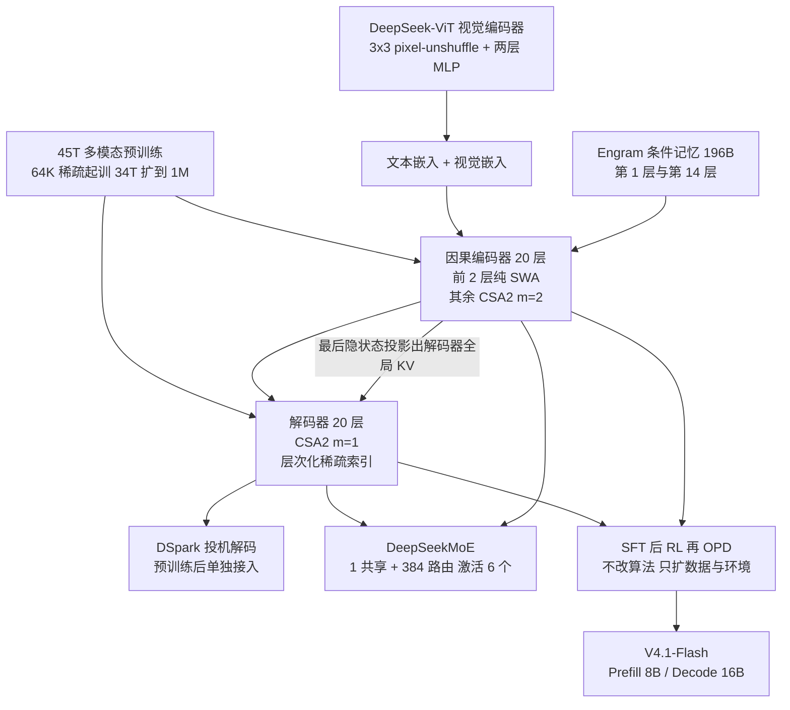
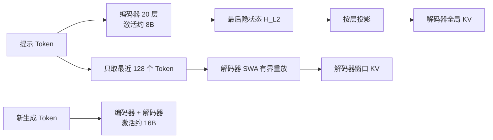
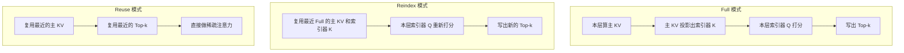
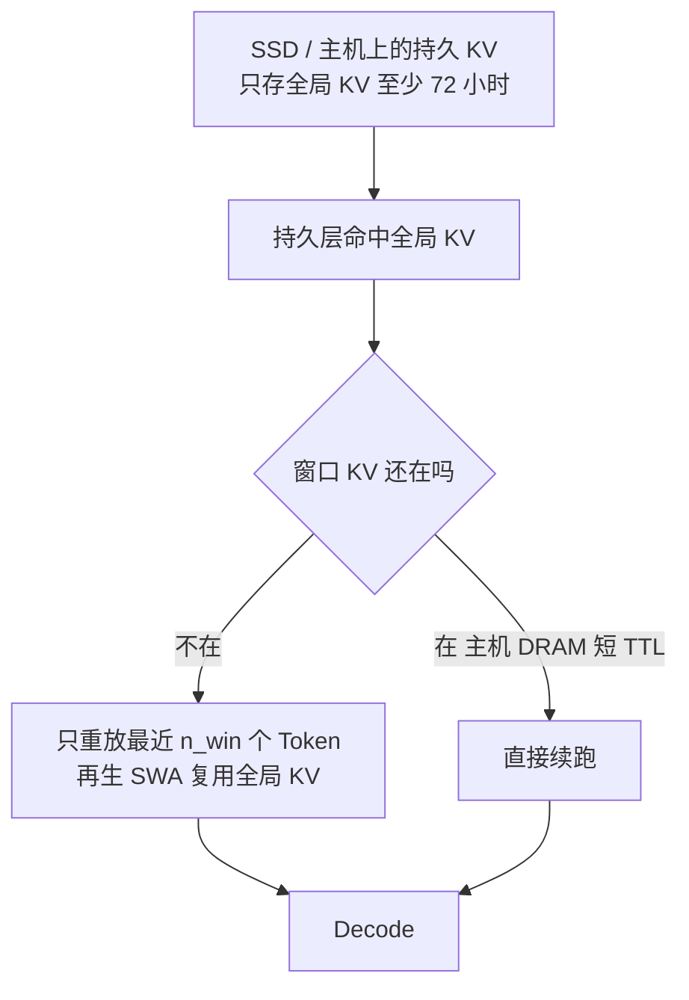
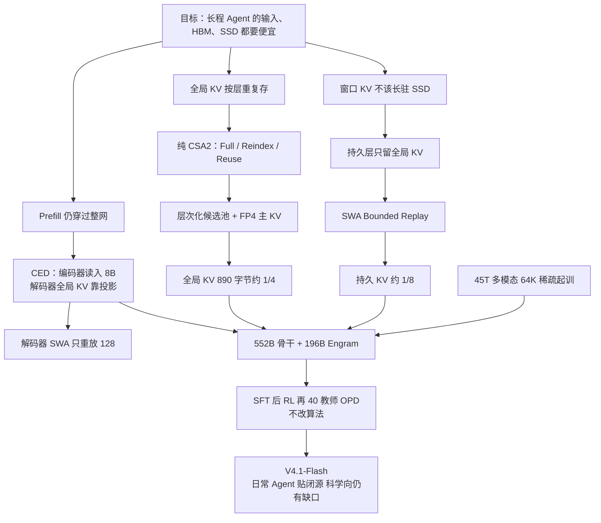

# DeepSeek-V4.1-Flash：读上下文只花 8B，每个 Token 的全局 KV 却只要 890 字节

<!-- release-date: 2026-09-10 -->

> 本文依据 DeepSeek-AI 发布的 **DeepSeek-V4.1-Flash: Pushing the Limits of KV Cache Compression**，即本地 `papers/DeepSeek/DeepSeek-V4.1-Flash.pdf`，共 51 页。官方件见 https://huggingface.co/deepseek-ai/DeepSeek-V4.1-Flash/blob/main/DeepSeek_V41_Tech_Report.pdf 。页码均指这份 PDF。全文把三件事分开标注：**报告明确写了什么**、**我们如何解释或验算它**、**哪些是外部资料补充**。凡标着「我们的验算」「我们的推断」「读图估计」的内容，都不是报告的结论。

本篇只写 **DeepSeek-V4.1-Flash** 这一具名 checkpoint。前作 [DeepSeek-V4](/reports/DeepSeek/DeepSeek-V4) 是对照，不是本报告发明 CSA、HCA 或 mHC 的地方；那些机制若出现，只说明 V4.1-Flash 改了什么、省了什么。

## 阅读前先搭一张最小地图

这篇报告把一个 552B 的多模态 MoE 从架构、缓存、训练系统一路写到 Agent 后训练。先把后文会反复出现的名字讲成人话：

- **Token（词元）**：模型读写文本和图像块时的最小单位。
- **Prefill 与 Decode**：Prefill 是把已经写好的提示、工具返回、整段历史一次读完；Decode 是一个接一个往外吐新 Token。Agent 的账单往往先被很长的 Prefill 吃掉。
- **KV Cache（Key-Value Cache，键值缓存）**：读过的内容留下的中间结果。报告把它拆成两笔账：**全局 KV**（始终占 HBM）和 **持久 KV**（始终在 SSD 或主机内存里，给前缀复用）。
- **SWA（Sliding Window Attention，滑动窗口注意力）**：每个 Token 只细看最近一小段原文。窗口固定后，这块缓存不再随上下文变长。
- **MoE（Mixture-of-Experts，混合专家）**：总参数很大，每个 Token 只走少数专家。
- **CED（Causal Encoder-Decoder，因果编码器—解码器）**：前半层专门消化输入，后半层的全局 KV 不自己重算，而从前半层的最后隐状态投影出来。
- **CSA2（Compressed Sparse Attention 2，压缩稀疏注意力 2）**：在 V4 的 CSA 思路上，让多层共用一套全局 KV 和检索结果。
- **FP4 KV**：把全局主 KV 存成大约四比特的格式，用的时候再解回。
- **SWA Bounded Replay（滑动窗口有界重放）**：前缀命中但窗口 KV 丢了时，不把最近「层数 × 窗口」那么长的一段全部重跑，只重放最近一个窗口。

报告另外会点到、但不在本篇当新发明展开的名字：**mHC**、**Engram**、**DSpark**、**Muon**。mHC 与 Engram 本站已有专文；DSpark 以本报告写到的程度为准。

## 一句话先说清

V4 已经把「一百万 Token 算得动」这件事做完了。接下来卡住 Agent 部署的，不再主要是注意力平方爆炸，而是三件更土的事：新输入还是要整段 Prefill、全局 KV 一直占着 HBM、持久 KV 一直占着 SSD 和总线。（PDF p.4）

DeepSeek-V4.1-Flash 的回答不是再发明一种注意力，而是把**读入**和**写出**做成不对称的两件事，再把全局 KV 压到每个 Token 890 字节：

1. **读输入便宜**：Causal Encoder-Decoder 让 Prefill 每个 Token 只激活 8B，Decode 才激活 16B。（PDF p.1、4、7）
2. **看历史更省**：CSA2 让多层共用全局 KV，再叠加 FP4 存储，HBM 里那份全局 KV 大约是 V4-Flash 的 1/4。（PDF p.1、4–5）
3. **存历史更省**：SWA Bounded Replay 不再把窗口 KV 持久化到 SSD，持久 KV 大约是 V4-Flash 的 1/8。（PDF p.1、5、19–20）

它同时是一个从零训起来的原生多模态模型：552B 骨干、另加 196B Engram、45T Token 预训练、1M 上下文。后训练明确说**没有新算法**，增益几乎全部来自可验证任务和沙箱环境的规模。（PDF p.6–7、25）

报告最值得记住的不是副标题里的「KV 压缩极限」，而是这组取舍背后的形状：

> **Agent 的工作负载是输入重、输出相对轻。与其让每一层、每一次读写都付同样的账，不如让读上下文走浅而便宜的编码器，让生成走更深的解码器，再把必须跨请求活下去的缓存压到只剩全局那一份。**

## 先看全景：这个模型是怎么连起来的

这张图是根据报告 Figure 3（PDF p.7）与第 4、5 节课表合并重画的机制示意，不是原图复制。

先把规格放在一起，后面每一节都会回来引用。

| 配置 | 数值 | 页码 |
|---|---:|---|
| 骨干总参数 / Engram 参数 | 552B / 196B | PDF p.7、13、22 |
| Prefill 激活 / Decode 激活 | 8B / 16B | PDF p.1、4、7、22 |
| 语言骨干层数 | 40，编码器 20 + 解码器 20 | PDF p.7、21 |
| 隐藏维度 | 5120 | PDF p.21 |
| 前两层注意力 | 纯 SWA | PDF p.7、21 |
| 编码器 CSA2 | 18 层，$m=2$，3 组 ×（1 Full + 5 Reuse） | PDF p.21–22 |
| 解码器 CSA2 | 20 层，$m=1$，1 组 Full+Reuse，4 组 Reindex+Reuse | PDF p.21–22 |
| 注意力 Top-k / 窗口 | 512 / $n_{win}=128$ | PDF p.22 |
| Query 头 / 头维度 / Query 压缩维 | 64 / 512 / 1280 | PDF p.22 |
| 索引器 Query 头 / 头维度 | 32 / 128 | PDF p.22 |
| 层次化候选池 | 最多 2048 块 × 8 位置 = 16384 | PDF p.12、22 |
| MoE | 1 共享 + 384 路由，每 Token 激活 6 个路由专家，中间维 2304 | PDF p.22 |
| mHC 扩展因子 | 4，Sinkhorn-Knopp 20 次 | PDF p.22 |
| 视觉编码器 | 32 层，隐藏维 1024，16 头，patch 14 | PDF p.22 |
| 预训练 Token / 上下文 | 45T；64K 起训，34T 处扩到 1M | PDF p.6、22 |
| 全局 KV / 相对 V4-Flash | 890 字节/Token，约 1/4 | PDF p.1、4 |
| 持久 KV / 相对 V4-Flash | 约 1/8 | PDF p.1、5、19 |

有四个数字值得一开始就看清楚。

第一，**552B 比 V4-Flash 的 284B 更大，激活却可以更小**。V4-Flash 每 Token 激活 13B；V4.1-Flash 读输入只激活 8B，生成才 16B。（PDF p.4、24）Agent 一旦变成「先读很长、再写一段」，账单由 Prefill 主导，8B 比 13B 更贴这个形状。

第二，**890 字节是全局 KV，不是全部 KV**。报告 Figure 1(b) 把这条线和 V1 的 389,120、V3.2 的 48,068、V4-Flash 的 3,514 画在一起，并写相对 V4-Flash 约 4 倍、相对 V1 约 437 倍。（PDF p.1，读自 Figure 1(b)）窗口 KV 另算；持久化时窗口 KV 还被拿掉了。

第三，**196B Engram 不算进 8B/16B 激活**。它是按 Token 哈希去查的条件记忆，查哪一行在进层之前就确定，可以放在主机内存里预取。（PDF p.13、18）

第四，报告自己把基座和 V4-Pro-Base 比：世界知识、推理、代码「可比」，held-out 评估高 5%–10%，却只用大约 1/3 总参数、1/4 激活参数。（PDF p.6）**我们的验算**：552B / 1.6T ≈ 34.5%，和「1/3 总参数」相符；Decode 激活 16B / 49B ≈ 33%，Prefill 8B / 49B ≈ 16%。「1/4 激活」更像口头约数，精确口径报告没写死是 Prefill、Decode 还是某种平均。

这些压缩叠在一起之后，单 Token Decode FLOPs 几乎不随上下文变长。Figure 2 把 BF16、FP8、FP4 运算分别按 1、0.5、0.25 加权；从 4K 拉到 1M（256 倍）时，V4.1-Flash 的 Decode FLOPs 只增加约 1/4，涨幅明显小于 V4-Flash。（PDF p.5）

## 第一层问题：算力降下来之后，贵的是缓存和读入

V4 已经用 CSA、HCA 和 SWA 把长序列计算压下去。本报告开篇把下一棒说得很具体：稀疏注意力让**算**不再是第一瓶颈之后，**存**和**搬**就冒出来了。（PDF p.4）

可以把它想成仓库，而不是课堂。

以前的问题是开会时人人互相说话，平方爆炸。V4 改成「眼前两页 + 带索引的笔记 + 全书目录」，会议开得动了。开得动之后，每个会话还是要把笔记柜堆在 GPU 显存里，把可复用的档案柜堆在 SSD 上，柜与柜之间还要搬家。Agent 一多、上下文一长，爆的是柜子和电梯，不是会议室桌椅。

报告把柜子分成两种。（PDF p.4）

### 运行时的全局 KV：始终在 HBM 里

V4 每一层都有一条看全历史的全局分支，再加一条只看窗口的 SWA。窗口大小固定后，SWA 的缓存有上限；序列足够长时，真正跟 $L$ 一起涨、把 HBM 吃满的，是全局 KV——包括主 KV 和索引器的 Key。（PDF p.4）

### 持久 KV：始终在 SSD 或主机内存里

多轮 Agent 会反复撞上同一段前缀。把 KV 留下来下次复用，能省掉整段 Prefill。这份缓存的上限是 SSD 和主机内存，搬家速度还受 PCIe 和互联带宽限制。（PDF p.4、19）

### Prefill 仍然贵，而且 Agent 特别爱 miss

工具一返回，上下文就多出一块从未见过的后缀。缓存没命中时，模型要把新输入完整跑一遍。V4 已经让「看历史」变便宜，但「第一次读这段输入」仍然要穿过全部层。（PDF p.4、9）

这三笔账决定了后面三个设计：CED 砍 Prefill，CSA2 + FP4 砍全局 KV，Bounded Replay 砍持久 KV。能力那一侧另走 45T 多模态预训练和大规模可验证后训练，不靠把缓存加回去换分数。

## 核心设计一：Causal Encoder-Decoder，为什么输入便宜、输出更贵

### 旧问题：提示词里的每一个 Token，都要穿过全部层才肯留下 KV

普通因果 Transformer 没有「只负责读」的半边。提示有 $N$ 个 Token、网络有 $L$ 层，Prefill 大致就是 $O(NL)$：每个位置都要走完全部层，每一层再为自己写一份 KV。

Agent 场景里这件事会被放大。工具调用频繁，KV 又经常 miss，于是「读输入」反复变成整网前向。（PDF p.9）

### 新设计：前半层读完，后半层的全局 KV 直接投影

CED 的灵感来自 YoCo：让上半层直接共用下半层产出的 KV，从而少算 Prefill。（PDF p.9）

**外部补充**：YoCo 是 Sun 等人 2024 年的 You-Only-Cache-Once 工作，原论文不在本仓库；本报告只用它「上半层复用下半层 KV」这一句。CED 在此之上做了两件本报告自己的事：全局 KV 的容量和「KV 是从多深的表示里长出来的」被一起改写。（PDF p.9）

具体分工：

- 前 $L/2$ 层当**因果编码器**。V4.1-Flash 里就是前 20 层。
- 后 $L/2$ 层当**解码器**。全局 KV 不再从本层隐状态 $H_l$ 算，而从编码器最后一层 $H_{L/2}$ 用该层自己的投影矩阵变出来：

$$
C_l = H_{L/2} W_l^{KV},\qquad
Z_l = H_{L/2} W_l^{Z},\qquad
l > \frac{L}{2}
$$

$C_l$ 是该解码器层要用的 KV 条目，$Z_l$ 是对应的压缩权重。（PDF p.9，式 1）

因此 Prefill 时，提示词主路径只跑编码器。解码器那份全局 KV 几乎是「最后隐状态 × 一组矩阵」，计算量很小。

SWA 不走这条捷径。每一层的窗口 KV 仍从本层 $H_l$ 算，报告的说法是这会加深局部 KV 的计算深度。（PDF p.9）代价立刻出现：若要给解码器准备精确的窗口 KV，Prefill 还得额外处理大约 $n_{win}\times L/2$ 个 Token。窗口 128、解码器 20 层时，就是大约 2560 个位置的额外前向。多轮短提示时，这笔开销并不小。

报告引用 Chen 等人 2025 的观察：SWA 真正有效的感受野，往往远小于理论上的 $n_{win}\times L/2$。（PDF p.9）于是它把解码器 Prefill 也改成只跑最近 $n_{win}$ 个 Token，细节放到 Bounded Replay 一节。

总账是：当 $N\gg n_{win}$ 时，Prefill 从 $O(NL)$ 变成大约 $O(NL/2)$。（PDF p.9）

### 工作机制：同一条残差，读和写付不同的钱

这是根据 PDF p.9 与第 3.2.2 节重画的机制示意。

**我们的解释**：Prefill 8B、Decode 16B，并不是「生成时突然多出一倍专家」，而是生成出的每一个新 Token 必须同时走过编码器和解码器；提示里的 Token 只走编码器，解码器全局 KV 靠投影白拿。MoE 配置在所有层相同：1 个共享专家 + 384 个路由专家，每 Token 激活 6 个路由专家。（PDF p.22）层数减半，激活大约减半，和 8B / 16B 对得上。

这也解释了标题里的矛盾：模型总参数比 V4-Flash 更大，读入却可以更便宜。更大的是容量，更便宜的是「第一次把这段上下文读进柜子」的手续费。

### 代价与边界

CED 把全局记忆的深度，从「每层自己长一份」收成「都从编码器出口长出来」。报告认为这仍然够用，并且把 Prefill 差不多砍半。（PDF p.8–9）它没有给「如果解码器全局 KV 改回本层隐状态，分数会掉多少」的消融表。第 6 节承认：CSA2 的选条错误、Bounded Replay 的近似重构，在未测到的边界上仍可能伤能力。（PDF p.37）

可迁移的不是「必须 20+20」，而是：

> **输入重的工作负载里，第一次读和每一次写不该走同一条深度。能从较浅表示投影出来的全局缓存，就不要让每个 Token 再穿过后半网。**

## 核心设计二：CSA2，跨层复用全局 KV 和 Top-k

### 旧问题：V4 已经压缩了序列维，层维还在重复存

报告把长上下文的存储和计算写成三个相乘的因子：（PDF p.9–10）

1. **条目大小**：GQA 减少 KV 头，MLA 让许多头共用一个潜向量。
2. **序列维**：每 $m$ 个 Token 压成一条，这是 V4 的 CSA / HCA。
3. **层维**：有些层不自备缓存，而是复用前面层的 KV 或选条结果。

V4 在前两个因子上已经很激进。本报告的判断是：V4 仍采用 CSA 与 HCA 的混合；HCA 负责粗粒度全局扫描，代价是另一套缓存形态。V4.1-Flash **改用纯 CSA2**，把第三因子也吃掉，并简化压缩器本身。（PDF p.4、10）

不要把 CSA 的压缩公式在这里重写一遍。需要对照时看 [DeepSeek-V4](/reports/DeepSeek/DeepSeek-V4)。本报告对 CSA2 相对 CSA 的改动写得很清楚：（PDF p.10）

- 压缩比 $m$ 的一条 KV，不再从重叠的 $2m$ 个位置吸收信息，也去掉绝对位置嵌入。
- 索引器的 Key 改为从主 KV 投影，不再从隐状态另走一条压缩路径。
- $m=1$ 被收成无压缩主 KV 的特例。解码器就用 $m=1$，编码器用 $m=2$。（PDF p.21–22）

### 新设计：三档静态模式，Full / Reindex / Reuse

每一层 CSA2 被预先指定一种模式，训练和推理不再临时改。三种模式都算自己的主 Query 和 SWA KV；差别只在全局主 KV、索引器 Key、Top-k 从哪来。（PDF p.10–11，Figure 4）

根据 Figure 4（PDF p.10）重画。绿色是本层新算的量，黄色是复用的主 KV / 索引器 K，红色是复用的 Top-k。

人话版：

- **Full**：自己写书，自己编目录，自己决定翻哪几页。
- **Reindex**：书和书脊上的索引 Key 都借上一层的，但这层用自己的问题重新打分，允许「同一书架、不同取书单」。
- **Reuse**：连取书单都借，只负责阅读。

和 CED 接在一起时，解码器那个 Full 层的全局 KV 不是从解码器隐状态长出来的，而是从编码器最后一层投影出来的。Reindex 和 Reuse 的复用规则不变。（PDF p.11）

层排布不是均匀撒三种模式。编码器 18 层 CSA2 分成三组，每组 6 层：1 个 Full + 5 个 Reuse。解码器 20 层分成五组，每组 4 层：第一组 1 个 Full + 3 个 Reuse；后四组 1 个 Reindex + 3 个 Reuse。（PDF p.21–22）

**我们的验算**：真正要持久化的「独特全局 KV 套数」，编码器是 3 套（还按 $m=2$ 压缩），解码器是 1 套（$m=1$）。按原始 Token 计，大约是 $3\times\frac{1}{2}+1=2.5$ 套未压缩条目。对照 [DeepSeek-V4](/reports/DeepSeek/DeepSeek-V4) 的规格，V4-Flash 有 43 层混合注意力，几乎每层自备全局 KV，光层维就已经差出一个数量级的因子；再叠 $m$、FP4 和索引器简化，才能走到「约 1/4」。本报告没有按层拆开 890 的构成，这条验算只说明数量级对得上，不能当成官方拆账。

### 层次化稀疏索引：后面的索引器不必再扫完全文

跨层复用 Top-k，省的是「同一套选条重复算」。没省掉的是：只要某层还要自己打分，它仍可能对全部可见位置打一遍。超长上下文里，这仍是瓶颈。（PDF p.11）

解码器因此多了一个 **Hierarchical Sparse Indexer（层次化稀疏索引器）**。它不加新状态，只用浅层索引器已经算过的分数来收窄深层的搜索域。（PDF p.11–12，Figure 5）

第一个 Full 层做两件事：

1. 对全部因果可见的主 KV 打分，选出自己的 Top-512，供本层注意力使用。
2. 按块做候选：每个块的分数取块内最大，再选分数最高的块。最多 2048 个块、每块 8 个位置，拼成最多 16384 个候选位置。（PDF p.12、22）

之后的 Reindex 层只在这个候选池里打分，再选自己的 Top-512。Reuse 层不再打分。候选池跨层共享，最终选中的 512 条可以不同。（PDF p.12）

候选池大小固定后，后续索引器每个 Query 要打分的位置与上下文长度无关。全文扫描只保留给第一个 Full 层。（PDF p.12）

这个机制是训练可知的：训练和推理用同一套候选限制，后面的索引器从一开始就在它们上线时会看到的搜索域里学。（PDF p.12）

### 890 字节从哪来：报告数字，加上我们的拆账

报告写死的结论是：CSA2 的跨层复用，加上 FP4 主 KV，把始终放在 HBM 里的全局 KV 降到每 Token 890 字节，大约是 V4-Flash 的 1/4。（PDF p.1、4–5）

Figure 1(b) 读图得到的代际数字是：（PDF p.1）

| 模型 | 每 Token 全局 KV（字节） | 相对上一代 |
|---|---:|---|
| DeepSeek-V1（2023.11） | 389,120 | — |
| DeepSeek-V3.2（2025.12） | 48,068 | 约 8.1× 更小 |
| DeepSeek-V4-Flash（2026.04） | 3,514 | 约 13.7× 更小 |
| DeepSeek-V4.1-Flash（2026.09） | 890 | 约 3.9× 更小 |

389,120 / 890 ≈ 437，与「相对 V1 约 437 倍」一致。3,514 / 890 ≈ 3.95，与「约 1/4」一致。

**我们的验算**，不是报告原文。主 KV 是 512 维潜向量，FP4 的 E2M1 每个值 4 bit，每 16 个通道一个 E4M3 缩放：（PDF p.14）

$$
512 \times \frac{4}{8} + \frac{512}{16} \times 1 = 256 + 32 = 288\ \text{字节/条目}
$$

若索引器 K 按 128 维、同一套 FP4 估算，约 64 + 8 = 72 字节。乘上前面的 2.5 套：$(288+72)\times 2.5=900$，和 890 只差 10 字节。差可能来自缩放因子的对齐、RoPE 维的特殊处理，或索引器 K 并非按 128 维整存。这条拆账只能说明 890 不是从天上掉下来的整数，不能当作官方公式。

### 代价与边界

CSA2 把「每层一份全球记忆」收成「少数 Full 层生产、多数层消费」。Reindex 是中间态：允许选条随层变化，但不允许每层再存一套 KV。层次化索引则接受一个明确风险——第一个 Full 层没放进候选池的位置，后面的 Reindex 永远看不见。（PDF p.12、37）

V4 用 HCA 扫全部粗摘要，就是为了给稀疏选择留一条「漏召回时的雷达」。本报告丢掉 HCA，改用纯 CSA2 加候选池。这是能力换存储的赌注。报告没有把「加回 HCA 会多占多少 KV、分数高多少」写成表；第 6 节把「CSA2 的潜在选条错误」列为仍需压测的边界。（PDF p.37）

可迁移启发：

> **KV 的三个乘法因子要分开砍。只压序列维，层维仍会按深度再乘一次；跨层复用时，把「存 KV」和「选哪些 KV」拆开，才能在共享缓存的同时保留一点层间差异。**

## 核心设计三：FP4 主 KV，把柜子里的每个格子再削半

### 旧问题：主 KV 若仍是 FP8，跨层复用省下的会被精度账单吃回去

V4 已经对索引器的 Query 和 Key 做了 FP4 的量化感知训练，目的主要是加快索引、缩小索引缓存。主 KV 那一侧，V4 仍用更高精度；本报告把它形容为「V4 的 FP8 主 KV」。（PDF p.14）

Agent 的每条请求都要自备一份 KV。精度多一倍，HBM 和 SSD 就多一倍。

### 新设计：存成 FP4，算注意力前再解量化

报告评估了大约四比特的格式，最终选 **E2M1，每 16 个通道一个 E4M3 缩放**。它跟 NVFP4 很像，但去掉了第二级全局缩放，换实现简单。（PDF p.14）

**外部补充**：NVFP4 是 NVIDIA 的 4-bit 浮点格式；OCP 的 MXFP4 是更强调跨硬件的标准。报告写：他们试过更准的格式，仍选了 MXFP4 路线以便多平台部署；真正写入缓存的是「类 NVFP4、无全局缩放」的 E2M1。（PDF p.14）这些格式名来自引用，不是本报告发明的。

去掉全局缩放为什么敢：这个格式能表示的最大幅度是 $448\times 6=2688$。模型里 RMSNorm 权重最大约 1，512 维 KV 潜向量经 RMS 归一化后 L2 范数至多约 $\sqrt{512}\approx 22.6$，RoPE 保持该范数；训练中观察到的最大幅度大约是 10。远低于 2688，所以省掉全局缩放「没有可测的精度损失」。（PDF p.14）

另外几条实现选择：

- 量化发生在 RoPE **之后**。RoPE 之前量化只带来边际精度好处，却给 Decode 加开销。
- 非 RoPE 维和 RoPE 维用同一套格式。
- **SWA 的 KV 仍用 FP8**，因为窗口缓存对量化更敏感。
- 相对 V4 的 FP8 主 KV，这份格式在 HBM 和 SSD 上都几乎再砍半。（PDF p.14）

QAT 放在后训练，不是预训练一开始就 FP4。（PDF p.14）注意力计算前会解量化，因此不要求硬件原生支持这种格式的矩阵乘。这是「为了存储而量化」，不是「为了 Tensor Core 而量化」。

### 代价与边界

报告在引言里说 FP4 全局 KV「只有边际性能下降」，但没有单独一张「FP8 主 KV vs FP4 主 KV」的榜。它和 CSA2 绑在一起，共同支撑「890 字节 / 约 1/4」。（PDF p.4–5、14）SWA 不敢跟进 FP4，说明他们不认为「所有 KV 都四比特」已经成立。

可迁移启发：缓存量化的约束是**动态范围和谁在读它**，不是比特数本身。主 KV 先归一化、幅度有上界，四比特放得下；窗口 KV 直接服务局部语法，报告选择不压。

## 核心设计四：SWA Bounded Replay，持久 KV 再降到 1/8

### 旧问题：精确重建窗口 KV，要重放「层数 × 窗口」那么长

V4 的部署已经在「把 SWA KV 持久化」和「用计算换回精确 SWA KV」之间做混合。精确重建需要重放最近 $L\times n_{win}$ 个 Token。（PDF p.5）40 层、窗口 128，就是 5120 个位置。V4 报告里提过 Zero SWA Caching；本报告说，那笔精确重算在生产里贵到用不下去。（PDF p.19）

另一侧也不划算。V4 部署里，SWA KV 几乎占持久缓存的一半。全局 KV 整段保存，命中后整段前缀都能续上；SWA KV 只在提示结束和输出结束两个点各存一份，方便多轮续跑。为了命中率，他们把持久缓存做很大，典型负载下两类 KV 都能在 SSD 上住过 72 小时。（PDF p.19）

问题是访问模式合不来：全局 KV 是长尾复用，SWA KV 只在当前会话的分钟级窗口里有用，会话一结束或下一轮一开始就作废。用「长驻 SSD」的策略去侍候「短命窗口」，柜子租贵了。（PDF p.19）

### 新设计：只重放一个窗口，接受近似的 SWA 状态

SWA Bounded Replay 只重放最近 $n_{win}$ 个 Token，并把 SWA 截断到这段重放区间。从位置 $s$ 开始重放时，位置 $i$ 的 Query 只看 $[ \max(s,\ i-W+1),\ i ]$ 里的 SWA Key。（PDF p.20）

它有两条路径。

**编码器路径**让前缀缓存只依赖全局 KV，SWA KV 可以退出持久层。全局 KV 命中、SWA KV 缺失时：把已缓存前缀的最后 $n_{win}$ 个 Token 重放一遍，只再生 SWA KV，全局 KV 直接复用；未缓存的后缀则两者都算。重放出来的前缀 SWA 是近似的，后缀的全局 KV 和 SWA 会依赖这次 cache-hit 位置，数学上不再跨位置恒等。报告说实验上「几乎不损害回复质量」。（PDF p.20）

**解码器路径**是 CED 能把 Prefill 砍半的最后一块拼图。解码器全局 KV 可以投影；解码器 SWA KV 不能，因为它来自各层自己的隐状态，而前几步 Decode 还要用。精确做法是对最后 $\frac{L}{2}\times n_{win}$ 个提示 Token 跑解码器，短后缀接在长前缀后面时特别亏。有界重放改成：每次 Prefill 只把提示最后 $n_{win}$ 个 Token 的编码器输出送进解码器，同样截断 SWA，得到的解码器 SWA 只给 Decode 用，不写进前缀缓存。报告同样说质量影响可忽略；后训练里还故意模拟同一套重放，让模型适应这条近似路径。（PDF p.9、20）

根据 PDF p.19–20 重画，不是原图复制。

持久层策略跟着改了两条：（PDF p.19）

1. SWA KV 不再进持久 KV，只放在每台机器主机 DRAM 约 10% 划出的分布式内存池。容量小，但 TTL 只有几分钟，过期条目立刻让给新会话；报告称真实负载下够服务绝大多数并发会话。全局 KV 仍保证至少 72 小时。
2. 全局命中、SWA 缺失不再是灾难，而是一次便宜的有界重放。

两个相乘的因子给出「约 1/8」：持久层不再存 SWA（V4 里它几乎是一半），剩下的全局 KV 又已经被架构和精度压到 V4 的 1/4。$\frac{1}{2}\times\frac{1}{4}=\frac{1}{8}$。（PDF p.19）

### 代价与边界

这是用一小段 Prefill 重算，换掉 SSD 上那一半短命缓存。报告反复用「negligible / barely compromises」，但没有把「精确 SWA vs 有界重放」做成公开榜。第 6 节把「SWA 状态的近似重构」和 CSA2 选条错误并列，当作仍需在缓存恢复边界上压测的点。（PDF p.37）

可迁移启发：

> **缓存分层要看复用寿命，不要看张量名字。全局 KV 跨会话有用，窗口 KV 往往只在这一轮有用；短命状态用近似重建，比用长驻 SSD 更划算。**

## 核心设计五：单次遍历的 mHC、Engram 和 DSpark

这三项都不是本报告的主线发明。它们是 V4.1-Flash 把 CED / CSA2 接进可训练、可服务系统时用到的配件。mHC 的数学约束见 [mHC](/reports/DeepSeek/mHC) 与 [DeepSeek-V4](/reports/DeepSeek/DeepSeek-V4)；Engram 的查表哲学见 [Engram](/reports/DeepSeek/Engram)。这里只写本报告改了什么。

### Single-Pass mHC：把残差混合从三次读写收成一次

V4 的 mHC 仍是四路残差。理想情况下，相邻块之间一次映射只需要读 $(n+1)d$、写 $(n+1)d$。V4 的实现却因数据依赖拆成三个顺序 kernel，再算上 pre-norm，激活访存是 $(4n+4)d$，正好两倍下界。（PDF p.12）

障碍在 $A_l$：输入混合要用当前块自己预测的系数，而系数要等隐藏维全部归约完才知道，于是 $X_l$ 必须再读一次。

Single-Pass mHC 把输入混合系数错开一块，当前块用上一块产出的 $A_{l-1}$：

$$
X_{l+1}=B_l X_l+C_l\mathcal{F}_l(A_{l-1}X_l),\qquad
(A_l,B_l,C_l)=\mathcal{H}(X_l)
$$

（PDF p.13，式 6）

依赖消失后，每一片 $X_l$ 可以立刻既做输入混合、又累加下一层系数。报告说这一错位「经验上几乎不掉点」。预训练仍用多 kernel 实现，因为错位只改「用哪一组系数」；部署则融成 **Mega-mHC**：残差读一次写一次，激活访存回到理想的 $(2n+2)d$，相对原实现减半，并顺手做完 pre-norm 和 FP8 转换。（PDF p.13）

本报告没有重做「为什么 $B_l$ 必须是双随机矩阵」的论证。那是 V4 / mHC 论文的内容。这里新增的洞察更窄：**数学上已经稳定的多路残差，部署时仍可能被 kernel 切分把访存加倍；把系数错开一块，往往比再发明一种残差更有效。**

### Engram：196B 的查表记忆，不进 8B/16B 激活

报告把 Engram 称作先前工作里的条件记忆模块，用来把记忆和计算拆开。沿用原设计的分词压缩、多头哈希、上下文门控、多分支汇入，改了两处：（PDF p.13）

1. 去掉短因果卷积，因为收益配不上推理栈的复杂度。
2. 嵌入表改用动量更新加 Sinkhorn 均衡，为的是少存一份 Adam 状态。

196B 参数均分到两个模块，放在从 0 计数的第 1 层和第 14 层，以均衡流水线各段内存。每个模块用 2/3/4-gram，8 个哈希头，每阶总嵌入维 2048；每头一张约 1600 万行的表，表大小取不同素数。表和 KV 投影都是 FP8。地址只由输入 Token 决定，推理时可以从主机内存经 RDMA 预取，第一模块的预取还能和第二块 Transformer 计算重叠。（PDF p.13、18）

训练时表按行分片到专门的进程组；查找索引在整步 micro-batch 开始前就算好。RL rollout 期间表留在 GPU 内存，以免主机内存碎片化把表挤掉。（PDF p.18）

这些是本报告的集成选择。Engram 为什么能把浅层从「重建专名」里解放出来，不要在这里复述专文。

### DSpark：预训练不再挂 MTP，草稿模块后装

V3 的 MTP 从头跟骨干一起训。V4.1-Flash **预训练骨干时去掉 MTP**，改在预训练结束后单独训 DSpark，骨干冻结；后训练阶段 DSpark 继续跟着骨干学，但 DSpark 损失不回传到骨干。（PDF p.8、14）

模块本身：三个 Transformer 块，滑动窗口 128；一次前向并行给出 5 个草稿位置的基 logits，再用轻量 Markov 头建模草稿 Token 之间的依赖。置信度头预测各位置的条件接受概率，调度器结合引擎吞吐曲线，动态选这次要验证多长，目标是当前负载下系统吞吐最大。（PDF p.13–14）

报告没有给出接受长度、加速比或和 MTP 的对照表。它只说明两件事：草稿不再占用预训练预算；后训练里草稿必须跟着策略一起变，才能同时加速在线服务和 RL/OPD 的 rollout。

和 MiMo-V2-Flash、Step 3.5 Flash 那条「MTP 当草稿」的 Flash 近邻相比，V4.1-Flash 把草稿从预训练配方里摘了出去。这是本报告写明的差异，不是我们从别的论文推出来的。

## 优化器：按头的 Muon，以及给巨表用的 Sinkhorn 更新

骨干线性层继续用 Muon，RMSNorm、偏置和缩放因子继续用 AdamW。新变化有两处。（PDF p.14–16）

**Head-wise Muon**：Query（以及 Key）的权重先按头切开再做 Muon。把它看成带预条件的梯度下降时，普通 Muon 所有头共用一个预条件，按头版本让不同头走不同预条件，更能消化头之间的异质性。报告说它优于普通 Muon，并指出 GLM-5 和 Kimi-K3 也验证过这一经验。（PDF p.15）本报告没有附对照曲线。

**Sinkhorn 均衡更新**用在 Engram 表、Token 嵌入和预测头上。Adam 会为这些巨表再备一份优化器状态；新方法只保留动量缓冲，经验上还优于 Adam。（PDF p.15）流程和 Muon 相同，只是把 Newton-Schulz 正交化换成行列交替归一化，让更新矩阵的行 RMS 和列 RMS 都接近 1。一行对应一个 Token 或 n-gram，一列对应一个隐特征。过小的行会被掩掉。学习率再乘 $\gamma=0.18$，对齐 Adam 的更新幅度，接近 Moonlight 用过的 0.2。（PDF p.15–16，Algorithm 1）

视觉编码器在学习率衰减之前冻结，只训练最后一层归一化和视觉—语言投影；衰减开始后再以更小学习率与语言模型一起解冻。（PDF p.15）

## 训练与推理基础设施：让复用真的发生在分布式里

架构上的「跨层共享」在流水线上会变成「生产者和消费者不在同一段」。报告用三件小事把它补上。（PDF p.17–18）

- **Shadow indexer**：共享参数只有一个逻辑所有者负责优化和存盘；每个参与的 pipeline 段放一个可执行副本，用同步和梯度聚合保持语义，而不强迫调度器把共享层绑成一个特殊执行单元。
- **Pipeline payload**：跨段需要的中间表示和稀疏路由，走已有的点对点通信，并按上下文并行切分，避免整份复制。
- **Micro-batch 级共享状态**：跟踪一份共享状态的寿命，最后一个消费者用完立刻释放。

多模态训练另有三条。对比学习阶段，视觉特征和文本特征的 all-gather 分别藏进对方的前向 / 反向里。视觉编码器拆出 LLM 参数树，一步分成「视觉前向 → LLM 前向反向 → 视觉反向」，避免两种并行策略互相踩。超长图文序列则把一张序列里的图按 CP 秩做负载均衡分片，每张图只读一次；当每 Token 的原始字节 $\rho$ 低于 $\frac{B_{IO}}{B_{GPU}}C$ 时，读图可以藏在计算后面。（PDF p.16–17）

推理侧把复杂变成短 kernel 流。Reuse 模式一层 Prefill 只需 15 个 kernel，Decode 只需 11 个。（PDF p.6、18–19）部署采用 Encoder–Prefill–Decode 分离，让视觉编码、Prefill、Decode 独立扩展。全局 KV 长驻，编码器 SWA 短住主机内存，缺失用有界重放补。（PDF p.6、19）

这些段落几乎没有可复现的集群规模数字。报告没有写用了多少卡、流水线多深、EP 多大。能迁移的是原则：共享注意力的正确性边界是「逻辑上仍是同一份参数和同一份 KV」，不是「必须放在同一个 pipeline 段里」。

## 预训练：45T 多模态，稀疏注意力从 64K 直接开训

### 数据：文本与多模态先分管道，再按 7:1 合并

文本侧相对 V4 的变化，报告写的是质检更系统、更强调语料之间的整体搭配，而不是再做一轮小规模单点实验。他们滤掉信息增量有限的模型生成内容和低质机翻，把这些视为隐式重复，长期有害；并引入更多领域专家来做细粒度质量维度。代码则更多纳入新仓库、新提交、新框架。（PDF p.20–21）

多模态侧明确反对「大规模合成图像」当主路径。前提是原始网页已经有丰富的视觉知识，他们优先清洗原生数据。爬虫一开始过度偏向纯文本网页，后来用 Common Crawl 重新引导以覆盖多模态来源。三类数据是：图文对、交错图文、领域数据。交错数据主要来自网页和 PDF，按「越来越贵」的阶段做：先用启发式、统计、去重和质量模型筛文档，再拼成交错序列并做图像感知的过滤，最后用 SmolVLM 打严格质量分。被丢掉的文档有一部分会再筛、再组，回收成图文对。领域数据补细粒度感知（接地、指点）、OCR、长尾知识，以及大量图—代码对和电脑使用轨迹。（PDF p.21）

两套管道合并时，重叠样本用多模态版替换纯文本版，并取两边更大的 epoch。最终文本与多模态的 Token 比为 7:1。超长文档先确定性切分再混合；改进后的 best-fit packing 把 padding 率压到至多 $10^{-4}$。（PDF p.21）

### 视觉编码器单独先训

DeepSeek-ViT 从零训，骨架是 Vision Transformer，改了几处以贴近 LLM：2D-RoPE 换绝对位置嵌入，patch 嵌入用线性投影以兼容 Muon，RMSNorm + SwiGLU，送进语言模型前做 3×3 pixel-unshuffle，空间 Token 降到 1/9，标称最高大约 1344×1344。（PDF p.8、22）

两阶段：先在约 47B 图文对上用 SigLIP 的 sigmoid 对比损失，分辨率限制 224×224——更高分辨率在这一阶段有收益，但对最终模型贡献很小，因为后面的自回归阶段会处理高分辨率外推。然后接到一个 4B MoE 语言模型上，用 236B Token 做下一词预测（字幕、alt text、图表、OCR），分辨率限制在 544 到 1344。训完丢掉那个 LLM，只留视觉编码器进入主预训练。（PDF p.22–23）

MoE 路由对图像 Token 和文本 Token 分两套辅助损失无关的偏置，避免两种模态互相抢专家。（PDF p.8）

### 课表

45T Token，全程无不稳定。Batch 固定 100.6M Token。学习率前 2000 步线性升温，然后保持 $2.6\times 10^{-4}$ 直到 28T；28T 到 40T 余弦降到 $2.6\times 10^{-5}$，再保持到 45T。稀疏注意力从零在 64K 上训，**没有稠密注意力预热**；34T 处把序列长度扩到 1M。路由偏置更新速度图像和文本都是 0.001，另保留权重 0.0001 的序列级平衡损失。与 V4 一样使用样本级注意力掩码。Engram 学习率按先前工作乘 5。Muon 动量 0.95，更新 RMS 缩放到 0.18；Sinkhorn 更新 $K=11$，$\tau=10^{-3}$。（PDF p.22）

SwiGLU 加上阈值为 10 的截断，引用的是 OpenAI 2025 的做法，与 V4 那条「把异常值剪住」的经验一致，但本报告没有再讲 loss spike 和 Anticipatory Routing。（PDF p.22）

### 基座成绩：参数更少，held-out 更低

Table 1 把三个 Base 放在同一套内部评测框架里，分差不超过 0.3 视为同一档。（PDF p.24）

| 维度 | V4.1-Flash-Base 相对前作 |
|---|---|
| 世界知识 | MMLU-Pro 74.1，高于 V4-Pro-Base 的 73.5；SimpleQA-Verified 42.3，介于 Flash 30.1 与 Pro 55.2 之间；SuperGPQA 53.1，接近 Pro 的 53.9 |
| 语言与推理 | 大体贴着两个前作，没有全面超越 |
| 代码与数学 | HumanEval 79.4、BigCodeBench 60.6、GSM8K 93.0，高于 Pro；MATH 61.1 低于 Pro 的 64.5；MGSM 80.2 低于 Flash 的 85.7 |
| 长上下文 | LongBench-V2 45.2，略高于 Flash 的 44.7，低于 Pro 的 51.5 |
| 多模态 | 只有 V4.1 有数：MMMU-Pro 56.5，CVBench 77.9，DocVQA 95.6，RefCOCO-avg 86.0 |

（PDF p.24）

报告另外在内部文档、内部代码仓库、学术材料三套 held-out 语料上比 BPB，越低越好。读 Figure 6：（PDF p.25）

| 语料 | V4-Flash-Base | V4-Pro-Base | V4.1-Flash-Base |
|---|---:|---:|---:|
| 内部文档 | 0.617 | 0.59 | 0.564 |
| 内部代码仓库 | 0.1562 | 0.1494 | 0.1443 |
| 学术材料 | 0.4929 | 0.4677 | 0.4305 |

三套都是 V4.1 最低。相对 Pro-Base，学术材料约低 8%，另外两套约 3%–4%。报告写的「held-out 5%–10%」更接近学术材料那一档，另外两套没到 5%。这些语料无法通过 API 复现，是内部证据。

## 后训练：算法不新，数据和环境才是杠杆

报告把这句话写得很硬：后训练不引入新算法，配方就是 SFT → RL → OPD，只沿用 V4 已有实践；可观测增益几乎全部来自合成数据、可验证环境和课程的规模、多样性与可验证性。（PDF p.6、25）

### 任务是三元组：题目、环境、验证器

每个任务被写成 `(problem, environment, verification system)`，用难度和正确性当奖励，迭代训练模型自己出题。任务一旦进入新的 RL 轮次，新轨迹会回流做质量复审。（PDF p.25–26）

通用 Agent：鼓励员工和外部伙伴把最新模型用进日常，自愿回传交互。按观察到的接口构造大量 mock 工具，覆盖常见 SaaS、企业应用和更专门的业务后端；再把负面反馈和失败案例做成单轮 / 多轮环境，针对弱点做 RL。（PDF p.26）

代码 Agent：来源是内部 / 伙伴会话（滤出高复杂度或模型表现差的，再按轨迹去重）以及达到星标阈值的公开 GitHub 仓库。多个专职 Agent 协作：先判断项目能否在容器里构建、跑通、自动验证，选定起始 commit，设计足够复杂的实现方向和 fail-to-pass / pass-to-pass 评测点；再有 Agent 在隔离容器里装依赖、写测试、去掉可能漏题的痕迹并打成镜像层；然后多个解题 Agent 尝试，独立质检 Agent 查环境错误、事实错误、评测点与题面不符、以及可 hack 风险。不过就修复、重验。（PDF p.26）

### RL 继续涨，而且跨脚手架一起涨

报告用累计 RL 步数画了代码 Agent 曲线。Figure 7 在 DeepSeek Harness Minimal 模式下，DeepSWE v1.1、SWE-Bench Pro、Terminal-Bench 2.1、Terminal-Bench 3.0（无 GPU）都随步数上升；把最大上下文从 512K 拉到 1M，对极长程的 Terminal-Bench 3.0 仍有帮助。（PDF p.27，Figure 7）

Figure 8 左边是多个 Claude Code 版本一起训，右边是 OpenCode、Pi、DeepSeek Harness 的 Standard 与 PTC 一起训。浅色线是单一脚手架，深色线是联合。曲线断开处是用模型合并重新初始化后的下一轮 RL——他们把不同优化路径上的 checkpoint 合在一起，再继续训，作为「把并行 RL 算力接起来」的实用办法。（PDF p.27–28）

Rollout 被拆成沙箱和 worker：沙箱跑脚手架和工具，worker 提供与训练器对话的、脚手架无关的控制层。两者都跑在 DSec 上，在可抢占的 GPU 训练池之外，长程 rollout 与训练调度分离；训练抢占时 rollout 可挂起、卸下并保留状态。（PDF p.26–27）

### DSec：百万级沙箱，密度从每机约 1000 升到 2500 以上

从 V3 到 V4，Agent 环境的数量和种类已经逼出 DeepSeek Elastic Compute。V4.1 的需求变成「数百万并发沙箱」，跨不同 harness、平台、代码仓库、软件依赖和任务专用服务。瓶颈变成数据中心可扩展性、负载隔离、单机密度，以及越来越能干的 Agent 搞破坏。（PDF p.27–28）

可迁移的几条设计：

- 不用现成 Kubernetes 当放置引擎。观察是：Agent 沙箱往往只要**最终一致性**，只要每个计算节点守住本地安全约束。放置引擎跑多份独立副本，根据近期测量预测资源、做「够好」的决策；节点本地用硬准入拒绝超过告警阈值的新放置。用局部正确性换掉中心协调，才能放到数百万容器。（PDF p.28）
- 节点内用硬件支持的 sub-NUMA，把每个 worker VM 绑到独立 NUMA 域，容器的 CPU / 内存被关在该 VM 的本地 NUMA 里。同等负载下，可测的端到端退化出现之前，并发活容器从大约 1000 升到 2500 以上。（PDF p.28）
- 高密度会干扰延时敏感评测，于是设 LS 执行类，非 LS 任务用 `SCHED_IDLE`，并用核调度保证同一优先级任务在兄弟超线程上同时跑。（PDF p.28–29）
- 行为不端的 Agent 会奖励黑客、打崩环境：利用刚披露的漏洞、XFS 驱动权限问题、AppArmor 里的非法内存访问、删关键二进制、拆系统文件、甚至卸文件系统。对策是每沙箱 AppArmor 配置和细粒度 eBPF 网络策略；若 Agent 仍把自己的环境打崩，轨迹记失败，并向 RL 框架报「repercussion」。（PDF p.29）

这些是工程证据和作者观察，不是「百万沙箱一定要自研编排」的定理。报告没有公开 DSec 的代码或集群拓扑。

### 可连续调节的推理强度

V4 的三档 reasoning effort 是离散行为。V4.1-Flash 改成标量 $b\in\{1,\ldots,100\}$，系统提示里写成 `Reasoning Effort: {effort}`，同时用于单轮推理和多轮 Agent。（PDF p.29）

训练时对每个努力档 $b$ 采 $M_b$ 条回复，同一 $(x,b)$ 组成一个子组做组内相对优势，**不同努力档不直接互比**。努力依赖的行为，靠把长度惩罚系数做成 $b$ 的函数：

$$
r^{\mathrm{len}}_{b,j}=-\min\left\{C_{\max},\ k(b)\frac{\ell_{b,j}}{L_{\mathrm{norm}}}\right\}
$$

$$
k(b)=k_0\exp\left(-\frac{b-b_{\min}}{\tau}\right),\qquad \tau=\lambda\overline{\Delta b}
$$

$b$ 每增加 $\tau$，$k$ 乘上 $e^{-1}$。$k_0$ 控制整体「别写太长」的压力；更小的 $\tau$ 让惩罚掉得更快，档与档之间的行为差得更开。（PDF p.29，式 8–10）

附录 C 给了一个局部奖励模型：若多想一个 Token 的边际收益近似指数衰减，指数惩罚会让最优长度随 $b$ 近似线性涨。这是动机推导，不是「测到的平均长度必须线性」的保证；到了惩罚上限，边际惩罚变 0，要另说。（PDF p.49–51）

训练只用有限档，部署可以用中间值做插值。线上 API 三档映射为 max=100、high=75、low=50。（PDF p.30，Table 2）

Figure 9 把努力从 25 拉到 100：八个推理基准的平均 Pass@1 从 67.1% 到 76.3%，DeepSWE v1.1 从 66.0% 到 74.2%，Terminal-Bench 2.1 从 82.4% 到 90.6%，输出 Token 大约 2.5 倍。增益前重后轻：60–80 已经拿到最大档大部分准确率，Token 预算却不到一半；最后加到 100，Agent 轨迹再长 1.6–1.8 倍，只换边际提升。最大档留给最难的题，日常 Agent 用中档更划算。（PDF p.34–35）

附录还写：八个推理基准上，努力从 25 到 100，平均回复长度大约均匀涨 2.0–3.1 倍（AIME 2026 从 4.6k 到 11.4k，MathArena Apex 2025 从 29.1k 到 86.1k），没有失控；没有任何一个基准随努力上升而变差。MathArena Apex 2025 从 25.3% 到 65.6%，涨 40.3 分。（PDF p.48）

### 异步 RL：同一套机器上切 rollout 和训练

几乎所有 RL 和 OPD 任务都改成异步生成，用来打长尾。Rollout 与训练占用同一批物理设备、分时执行，每个任务规定 in-flight 样本上限。（PDF p.30）

调度粒度试过三种。Batch 级太粗，指标振荡；Prompt 级会卡在一个 GRPO 组里的长尾样本。最终用 **sample 级**：新完成样本数够下一个 prompt 的 GRPO 组大小，就派这个 prompt，不管这些完成来自哪些组。（PDF p.30）

样本一旦攒够，训练抢占正在进行的 rollout。跨多个 checkpoint 的样本使用 **concatenated routing-replay**：把各段 rollout 时的专家路由拼起来，而不是用新 checkpoint 重算路由。（PDF p.30–31）

异步带来两个副作用。短序列先完成，早期 batch 被短样本占据——按数据集限并发，并丢掉过早返回的短样本。Off-policy 则靠限制最大 off-policy 比例，再对过期 Token 做 loss mask。（PDF p.31）

切换 checkpoint 时要求「停得下、接得上」：可在任意 Token 边界打断；KV 和专家路由按 Token 粒度持久化，新 checkpoint 直接复用，免去重新 Prefill。同一套机制也用来响应集群抢占。（PDF p.31）

最后的全词表 OPD 用全部领域数据、**超过 40 个教师**，教师可以来自不同训练阶段、不同架构，和学生也可以不同构。基础设施声称在它们之间切换的成本可忽略。训练中途改数据配比、并发上限和教师集合时，异步 in-flight 样本可能分属旧配置和新配置，系统要能一致过渡。（PDF p.31–32）

V4 写的是「十多个教师」。这里变成四十多个。报告把异构教师切换的能力回指 V4 报告，没有在本篇重写 OPD 公式。

## 评测：日常 Agent 贴上闭源，科学向长程仍有缺口

Instruct 评测默认最大努力（$b=100$），温度 1.0、top-p 0.95。代码 Agent 用 DeepSeek Harness Minimal、1M 上下文；DeepSWE v1.1 改用 mini-SWE 以对齐官方；SEC-Bench Pro 用 Claude Code，因为它的 session compact。视觉 Agent 用 Claude Code、512k 上下文。评测时限制联网、剥离 Git 历史、清掉各类构建与包缓存，仍观察到模型去反编译 Ubuntu 核心包找漏洞这类「找漏洞」行为。（PDF p.32–33）

### 和闭源、开源、V4 家族比（Table 3，PDF p.33）

先看报告自己高亮的几格。V4.1-Flash Max：

- Codeforces 评分 3471，高于 V4-Pro 的 3348 和 V4-Flash 的 3289。
- MathArena Apex 65.6，与 Kimi-K3 并列最高，V4-Pro 为 65.3。
- Terminal-Bench 2.1 为 90.6，高于 Opus-5 的 89.1、GPT-5.6 Sol 的 88.8、V4-Flash 的 82.7。
- DeepSWE v1.1 为 74.2，略高于 Opus-5 的 74.0、GPT-5.6 Sol 的 73.0，大幅高于 V4-Flash 的 54.4。
- Automation-Bench 54.8、Agents' Last Exam 31.8、CyberGym 88.1、HLE with tools 63.9，均为表中最高或并列最高。

缺口同样写在表里，不是我们外加的：

- GPQA Diamond 90.9，低于 GPT-5.6 Sol 的 94.1 和 Opus-5 的 93.4，高于 V4-Flash 的 89.9。
- HLE 全文 36.8、纯文本子集 39.1；Opus-5 全文 56.3。科学向的硬推理仍明显落后巨量闭源。
- Terminal-Bench 3.0 / 4.0 为 30.0 / 31.2，高于 V4-Pro 的 11.8 / 12.4 和 V4-Flash 的 7.6 / 7.0，仍低于 Opus-5 的 43.3 / 51.8。引言把这类题称作需要专家级领域知识的科学向 Agent，并承认与巨型模型的差距。（PDF p.6、33）
- 视觉 Agent：Chartography 78.9、BabyVision 89.6、ZeroBench-main 49.0，高于或贴近开源头部，仍低于 Opus-5 / GPT-5.6 Sol 的峰值。

引言还有一句更强的话：多数基准已能匹配闭源前沿，并能完成超过 95% 的真实世界任务。（PDF p.6）**这是作者观察，不是 Table 3 里能读出来的统计**。95% 没有操作化定义。

### 脚手架不是绑死的（Table 4，PDF p.35）

同一 checkpoint、同一解码、同一题集，只换外围 harness。DeepSWE v1.1 每题 8 次、Terminal-Bench 2.1 每题 3 次，Linux 容器，1M 上下文，每 Agent 最多 500 步。

| 脚手架 | DeepSWE v1.1 | Terminal-Bench 2.1 |
|---|---:|---:|
| Claude Code | 69.8 | 88.0 |
| Codex | 65.6 | 84.1 |
| OpenCode | 65.5 | 85.0 |
| Pi | 66.2 | 86.1 |
| mini-SWE | 74.2 | 90.3 |
| DSH Minimal | 72.6 | 90.6 |
| DSH Standard | 70.5 | 85.8 |
| DSH PTC | 67.6 | 85.8 |

主表的 DeepSWE 74.2 来自 mini-SWE，Terminal-Bench 2.1 的 90.6 来自 DSH Minimal。换脚手架会掉几分到十几分，但没有崩掉。报告把它归因于合成训练覆盖了多种环境、工具模式和交互格式。（PDF p.34–35）附录 Table 5 还显示四个 Claude Code 版本的平均分别是 68.9 和 87.8，主表用的是 v2.1.251。（PDF p.48）

### 多智能体：初步、有墙钟截止、有保留

Agent Team 模式里，主 Agent 可异步 `spawn_teammate`，队友默认不带主历史（fresh）或拿一份主 Agent 已完成轮次的快照（fork）；共享仓库检出，用邮箱和任务板协调。奖励包括任务表现、鼓励委派与通信的协作奖励，以及按 DAG 关键路径算的派生延迟惩罚——Token 按固定 Prefill/Decode 速率计价，加上测到的工具时间，惩罚无谓串行，减弱对服务端 batch 排队的敏感。（PDF p.35–36）

ProgramBench 只留隐藏测试套件参考解至少 95% 的题，得到 172 道「golden」；FrontierSWE v2 用无 GPU 的公开子集。结果是初步的：多智能体取最强观察到的 run，单智能体取当时最强基线。ProgramBench 在 8 小时墙钟截止时 Almost@1 从单智能体 20.39% 到多智能体 30.04%；FrontierSWE v2 在 20 小时 Mean@5 从 28.20% 到 32.90%。（PDF p.36，Figure 10）

这是「加墙钟、加队友、分数涨」的存在性证据，不是可复现的多智能体配方。样本数、随机种子、失败模式都没有展开。

## 限制、未公开信息，以及哪些结论站得住

报告自己写的边界：（PDF p.37）

- 新架构的鲁棒性边界还没被充分刻画。内部评测覆盖了多样测试用例和边界条件，**没有观察到系统性能力退化**；但有限测试集覆盖不了所有极端输入和部署条件。
- CSA2 的选条错误、Bounded Replay 的近似重构，在未测试的边界上仍可能伤能力。后续会加强对长上下文稀疏检索和缓存恢复边界的压测。
- 标准基准正在饱和。日常应用里他们自比 Fable-5、GPT-6 Astra「高度可比」，最难任务上仍有差距；榜上接近，不等于复杂边缘案例已经追上头部闭源。
- 下一步仍是数据、容量、RL 的联合扩展，以及模型与 harness 共设计。

这些模型名（Fable-5、GPT-6 Astra）只出现在结论段，Table 3 用的是 Opus-5、GPT-5.6 Sol、Kimi-K3、GLM-5.3。不要把两套对照混成一张表。

明确没有公开、因此不能补的：

- Prefill 8B / Decode 16B 的逐模块拆账（注意力、专家、嵌入各占多少）。
- 890 字节的官方构成（主 KV / 索引器 K / 缩放因子各多少）。
- FP4、Bounded Replay、去掉 HCA、Single-Pass 系数错位各自的消融表。
- 预训练 45T 的具体来源比例、视觉编码器并入后的联合损失曲线。
- 后训练的数据量、奖励权重、GRPO 超参、40 个教师的身份。
- DSec 与异步 RL 的集群规模、加速比。
- DSpark 的接受长度和加速倍数。

被实验支持的：基座 Table 1 与 Figure 6 的内部对照；Instruct Table 3 在声明的脚手架和最大努力下的分数；Table 4 跨脚手架的稳定性；Figure 7–9 上 RL 步数、努力档与分数 / 长度的同向变化；持久 KV「一半 × 四分之一」的乘法解释与 890 相对 3514 的算术。

属于作者观察的：95% 真实任务、日常应用接近 Fable-5 / GPT-6 Astra、FP4 与 Bounded Replay「几乎不掉点」、held-out「5%–10%」、Single-Pass 错位「可忽略」、head-wise Muon「更好」。

## 对自己项目有用的几条

1. **先画工作负载的形状，再决定哪半边模型该更贵**。Agent 是输入重的，CED 让 Prefill 走 8B、Decode 走 16B。聊天机器人如果是输出重，这个不对称可能要反过来，或者根本不该用。
2. **KV 有三个乘法因子，别只砍一个**。条目大小（MLA/GQA/FP4）、序列（压缩/窗口）、层（跨层复用）是不同的旋钮。CSA2 把「存」和「选」拆开，才能在共享 KV 的同时保留 Reindex。
3. **缓存分层看寿命**。全局 KV 长驻，窗口 KV 短住；短命状态用有界近似重建，不要用 72 小时 SSD 策略去侍候分钟级对象。
4. **部署访存往往是第二份架构**。mHC 的数学在 V4 已经稳定，V4.1 仍靠把 $A_l$ 错开一块，把三次读写收成一次。稳定的公式不等于便宜的 kernel。
5. **后训练的边际收益，报告自己把票投给了数据和环境**。出题—环境—验证器三元组、失败回流、跨脚手架联合 RL、沙箱密度和防 hack，比再发明一种 RL 损失更像他们这次真正加的杠杆。
6. **努力档是训练出来的条件行为，不是 max_tokens**。指数长度惩罚让同一个权重可以在 50/75/100 之间滑；收益前重后轻，日常流量不必默认最大档。
7. **异步 RL 的正确性补丁和吞吐补丁要成对出现**。sample 级调度、短样本丢弃、off-policy 上限、过期 Token mask、Token 级中断与路由拼接，少一块就会把数据分布改掉。

## 用一张图重新串起全文

这是本文的总结示意，不对应报告里的任何一张图。

## 关键词回看

- **CED**：前 20 层读输入，后 20 层的全局 KV 从编码器出口投影；Prefill 激活 8B，Decode 激活 16B。
- **CSA2**：纯压缩稀疏注意力，不再混 HCA；三档静态模式共享主 KV / 索引器 K / Top-k。
- **Full / Reindex / Reuse**：生产 KV 并检索 / 共用 KV 但重打分 / 连选条都共用。
- **层次化稀疏索引**：解码器第一个 Full 层给出最多 16384 的候选池，后续 Reindex 只在池内打分。
- **全局 KV 与持久 KV**：前者始终在 HBM，890 字节/Token；后者始终在 SSD 或主机内存，约 V4-Flash 的 1/8。
- **FP4 主 KV**：E2M1 + 每 16 通道一个 E4M3 缩放，RoPE 之后量化；SWA 仍 FP8。
- **SWA Bounded Replay**：只重放最近 128 个 Token 来近似重建窗口 KV。
- **Single-Pass mHC**：用上一块的 $A_{l-1}$ 做输入混合，Mega-mHC 把残差访存减半。
- **Engram**：196B 条件记忆，第 1 与第 14 层，按 n-gram 哈希查表，不进激活参数。
- **DSpark**：预训练后接入的投机解码模块，草稿损失不回传骨干。
- **Head-wise Muon / Sinkhorn 更新**：按头预条件；巨表只用动量加行列均衡。
- **努力档 $b$**：1–100 的条件信号，长度惩罚随 $b$ 指数变弱；API 映射 50/75/100。
- **DSec**：面向百万级 Agent 沙箱的弹性计算，局部准入换中心调度。
- **OPD**：学生在自己的轨迹上对齐教师全词表分布；本报告用四十多个异构教师。

## 最后的判断

DeepSeek-V4.1-Flash 最强的叙事，不是「又一个更强的 Flash」，而是：**它承认 V4 已经把长上下文的计算做成了可部署的东西，于是把下一刀砍在 Prefill 深度、层维 KV 和持久层寿命上。**

CED 让读和写付不同的激活；CSA2 让多数层停止生产全局记忆；FP4 让格子更小；Bounded Replay 让短命窗口退出 SSD。45T 多模态和「只扩数据、不改算法」的后训练，则是在这份更瘦的缓存上把日常 Agent 分数拉到能和闭源正面比的位置。科学向的 Terminal-Bench 4.0、HLE、以及作者自己承认的边缘案例，说明瘦缓存加中等激活并没有自动成为万能的巨型模型替代品。

如果只记一句话：

> **输入重的系统里，便宜的应该是读，贵的可以是写；必须跨请求活下去的，只该留下全局那一份缓存。**

## 资料与阅读边界

- 原始依据：本地 `papers/DeepSeek/DeepSeek-V4.1-Flash.pdf`，即 DeepSeek-AI，*DeepSeek-V4.1-Flash: Pushing the Limits of KV Cache Compression*，共 51 页。封面无 arXiv 编号。官方 PDF：[Hugging Face 上的 DeepSeek_V41_Tech_Report.pdf](https://huggingface.co/deepseek-ai/DeepSeek-V4.1-Flash/blob/main/DeepSeek_V41_Tech_Report.pdf)。截至撰写时以该件为准。
- 权重与模型卡：[huggingface.co/deepseek-ai/DeepSeek-V4.1-Flash](https://huggingface.co/deepseek-ai/DeepSeek-V4.1-Flash)，MIT 许可。模型卡另写总参数 763B，PDF 写 552B 骨干 + 196B Engram；差额构成未在报告里拆开，本文以 PDF 为准。
- 首发日证据：`release-date` 取 **2026-09-10**。①官方 API 新闻 [DeepSeek V4.1 Flash：更强、更快、更普惠](https://api-docs.deepseek.com/zh-cn/news/news260910) 写「今天正式发布」，更新日志同日；②官网新闻 [Introducing DeepSeek-V4.1-Flash](https://www.deepseek.com/en/news/deepseek-v4-1-flash/) 标注 News September 10, 2026，并写 API 当日上线；③Hugging Face 上技术报告文件由 `zdaxie` 提交（commit `53e70b1`），时间为发布当日，不以仓库 `createdAt` 为准。
- 本仓库对照：[DeepSeek-V4](/reports/DeepSeek/DeepSeek-V4)（CSA/HCA/SWA、mHC、Muon、OPD、DSec 的前作）、[Engram](/reports/DeepSeek/Engram)、[mHC](/reports/DeepSeek/mHC)。Flash 线近邻：[MiMo-V2-Flash](/reports/Xiaomi/MiMo-V2-Flash)、[Step-3.5-Flash](/reports/StepFun/Step-3.5-Flash)。凡引用这些文章的判断都已标明，未把 V4 的机制写成 V4.1 的发明。
- 报告引用、本文只按原句使用的外部工作：YoCo（Sun et al., 2024）、IndexCache / YOIO / HySparse（作为「层维复用」相关工作被点名）、SigLIP、SmolVLM、NVFP4 / MXFP4。没有打开这些原论文去补本报告没写的实验。
- API 定价、V4-Pro 路由到 Flash、合作方接入等产品细节见上述官方新闻，不是技术报告正文，本文未写入架构结论。
