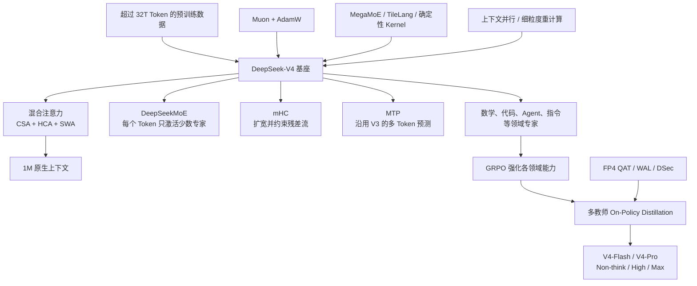
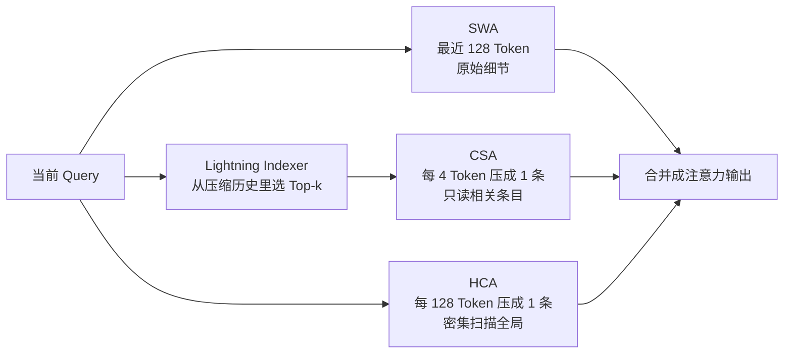
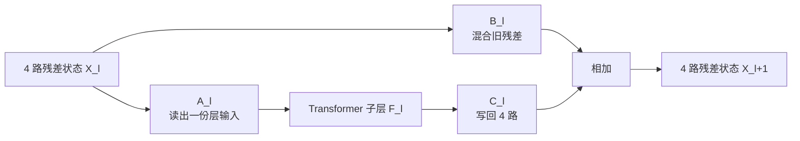
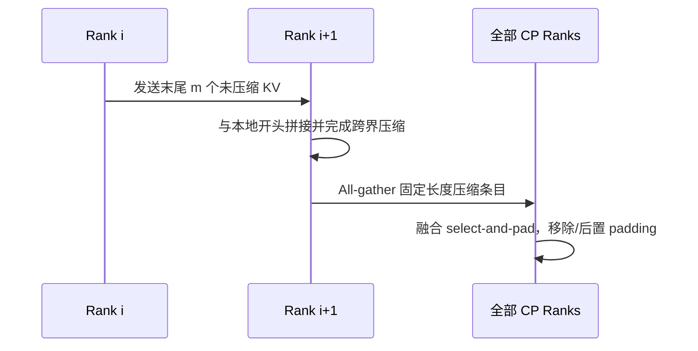
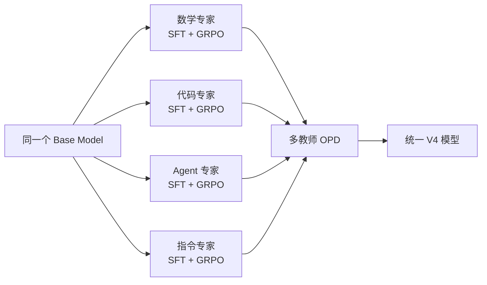
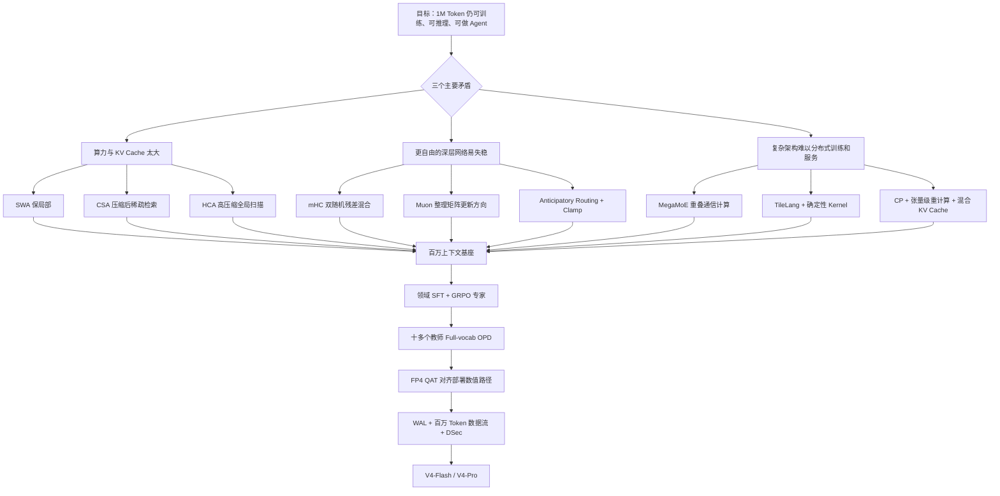

# DeepSeek-V4：把一百万 Token 从“能塞进去”变成“真的用得起”

> 本文依据 DeepSeek-AI 发布的 **DeepSeek-V4: Towards Highly Efficient Million-Token Context Intelligence**，即 arXiv:2606.19348v1、2026-04-26 的预览版。页码均指 PDF 本身的页码。文中会明确区分“报告写了什么”和“我们从中得到什么启发”。

## 一句话先说清

DeepSeek-V4 不是靠“把上下文长度参数改成 1M”得到的一百万 Token 模型。

它真正做的事情，是重新设计了一整条长上下文流水线：

- 用 **CSA** 把细节先压缩，再只找少数相关历史；
- 用 **HCA** 做更粗、更便宜的全局回看；
- 用一小段 **SWA** 补回眼前细节；
- 用 **mHC** 扩宽层与层之间的信息高速公路，同时给它装上护栏；
- 用 **Muon** 改善大矩阵的更新方向；
- 再用通信—计算融合、上下文并行、混合 KV Cache、FP4 QAT 和可恢复 rollout，把这些想法变成能训练、能服务的系统。

因此，V4 最值得记住的并不是某个孤立名词，而是一种工程思路：

> **不要让每个组件都保留最高分辨率。让局部细节、相关历史和全局轮廓分别走最合适的通道，再把它们拼起来。**

这也是全文最重要的 insight。

## 先看全景：V4 到底改了哪几层

两种规模是：

| 模型 | 总参数 | 每 Token 激活参数 | 层数 | 主要定位 |
|---|---:|---:|---:|---|
| DeepSeek-V4-Flash | 284B | 13B | 43 | 用更小的激活规模换成本效率 |
| DeepSeek-V4-Pro | 1.6T | 49B | 61 | 更强知识容量与复杂任务能力 |

这两个模型都不是每次把全部参数跑一遍。它们是 MoE 模型，只让与当前 Token 相关的一小部分专家工作。具体配置见后面的训练 recipe。（PDF p.24–25）

在一百万 Token 场景下，报告估算 V4-Pro 的单 Token 推理 FLOPs 只有 V3.2 的 27%，KV Cache 只有 10%；V4-Flash 更低，分别约为 10% 和 7%。这些是报告按其模型与精度配置得到的估算，不应直接理解为所有机器上的端到端延迟也同比下降。（PDF p.5）

## 第一层问题：一百万 Token 为什么难

### 难点一：注意力计算会爆炸

普通全注意力里，每个 Token 都要与前面的 Token 比较。若序列长度是 \(L\)，完整注意力矩阵大约有 \(L^2\) 个位置：

$$
\text{Attention compute} \propto L^2
$$

把上下文从 10 万扩到 100 万，不是“多算十倍”，而可能让这部分比较工作多到一百倍。

可以把它想成开会：

- 100 个人时，让每个人都与所有人交流，已经很吵；
- 100 万个人时，还要求人人互相讲话，会议根本开不起来。

所以必须改变交流方式，不能只换更快的 GPU。

### 难点二：KV Cache 会一直长

自回归生成时，旧 Token 的 Key 和 Value 会留在显存中，避免每生成一个新 Token 就重算全部历史。它叫 KV Cache。

普通做法的缓存量大致随上下文长度线性增长：

$$
\text{KV memory} \propto L \times \text{layers} \times \text{KV heads} \times \text{head dim}
$$

线性增长听起来没有平方增长可怕，但 \(L=1,000,000\) 时，常数已经巨大。更麻烦的是，Agent 服务通常要并发保存很多请求，显存会被历史记录迅速吃光。

### 难点三：模型“看得到”不代表“找得到”

即使系统勉强塞进一百万 Token，模型也可能在长文中找不到关键事实，或者只记得最近的内容。长上下文至少有三种需求：

1. **眼前细节**：刚才那行代码里变量名是什么？
2. **相关历史**：二十万 Token 前哪段日志解释了现在的报错？
3. **全局轮廓**：整本代码库或整场对话在做什么？

一种注意力模式很难同时经济地满足三件事。V4 的核心答案，就是按时间尺度分工。

## 核心设计一：CSA、HCA、SWA 组成三档记忆

先用一个人类记笔记的比喻：

- **SWA** 像眼前摊开的最近两页，细节完整；
- **CSA** 像带索引的章节笔记，先压缩，再只翻最相关的几页；
- **HCA** 像全书目录，每个大章节只有一条摘要，但每次都会扫一遍。

注意：图表达的是三种作用，不表示每一层同时跑三个完整分支。V4 会在层间交错使用 CSA 与 HCA，而两者都带小型滑动窗口分支。（PDF p.9–13、24–25）

### CSA：先把历史折叠，再做稀疏检索

CSA 是 **Compressed Sparse Attention**，直译是“压缩稀疏注意力”。它分两步：

1. 每 \(m\) 个历史 Token 压成一个 KV 条目；
2. 当前 Query 用轻量索引器打分，只选 Top-k 个压缩条目做真正注意力。

V4 的 \(m=4\)。所以一百万个原始 Token，先变成大约 25 万个压缩条目。之后 V4-Flash 每次选 512 个，V4-Pro 每次选 1024 个，而不是把 25 万个都送进昂贵的主注意力。（PDF p.24–25）

#### 压缩不是朴素平均

如果把四个 Token 简单求平均，“张三没有批准付款”可能被压成只剩“张三、批准、付款”，否定词被淹没。V4 使用可学习权重，让模型自己决定一个小块中什么更重要。

把复杂下标先拿掉，核心可以写成：

$$
c_i = \sum_{j \in \text{block }i} s_j \odot v_j,
\qquad
s = \operatorname{softmax}(z+b)
$$

- \(v_j\)：第 \(j\) 个 Token 提供的内容；
- \(z_j\)：模型根据内容算出的压缩权重；
- \(b_j\)：可学习的位置偏置；
- \(s_j\)：归一化后的权重；
- \(\odot\)：逐维相乘，因此不同特征维度可以保留不同 Token 的信息。

报告里的 CSA 实际使用两组内容 \(C^a,C^b\)，并让相邻压缩块的覆盖范围有重叠。一个压缩条目会吸收总计 \(2m\) 个位置的信息，但相邻条目复用其中一部分，所以条目数量仍约为原来的 \(1/m\)。这个重叠很像切视频时保留前后几帧：可以减轻信息恰好被块边界切断的问题。（PDF p.9–10，式 9–12）

#### Lightning Indexer：便宜地决定“该翻哪几页”

压缩后仍有 25 万条历史。如果主注意力全看，还是很贵。Lightning Indexer 先用低秩 Query 和压缩后的索引 Key 算一个便宜分数：

$$
I_{t,s}=
\sum_{h=1}^{n_h^I}
w_{t,h}^I\,\operatorname{ReLU}
\left(q_{t,h}^I \cdot K_s^{I,\text{Comp}}\right)
$$

不要被符号吓到。它只是说：

1. 用多个“小侦察员” \(h\) 分别判断第 \(s\) 段历史是否相关；
2. 负相关直接用 ReLU 截成 0；
3. 当前 Token 再给每个侦察员一个权重 \(w\)；
4. 分数相加，选最高的 Top-k。

例如当前问题是“为什么数据库迁移失败”，某个侦察员擅长找数据库对象，另一个擅长找错误栈。当前 Query 会动态决定更相信谁。索引器不是最终回答问题的人，它只是图书管理员，负责把可能有用的书搬到桌上。（PDF p.10，式 13–17）

真正的注意力随后只在选中的压缩 KV 上运行。这里使用共享 Key-Value 的 MQA：很多 Query 头共用一套压缩 KV，从而继续节省缓存。由于全部注意力头拼接后很宽，V4 又先分组降维，再投影回隐藏维度，避免输出投影本身成为新瓶颈。（PDF p.11，式 18–19）

### HCA：压得更狠，但把全局都扫一遍

HCA 是 **Heavily Compressed Attention**。它把每 \(m'\) 个 Token 压成一个条目，且 \(m'\gg m\)。V4 中 \(m'=128\)。（PDF p.11–12、24–25）

这意味着一百万 Token 会变成大约 7813 个“超级摘要”。HCA 不再做 Top-k，而是对这些摘要做密集注意力。

为什么 CSA 已经能检索，还需要 HCA？因为稀疏选择有一个天然风险：**索引器没选中，就永远看不到。** HCA 虽然丢掉了很多细节，却保留了低成本的全局通路。它更像雷达，不负责看清车牌，但可以提醒模型“很远的地方还有一个重要对象”。

HCA 的压缩式更简单：

$$
s = \operatorname{softmax}(z+b),
\qquad
c_i=\sum_{j=m'i}^{m'(i+1)-1}s_j\odot v_j
$$

与 CSA 相比，它不使用相邻块重叠，压缩率更高，也不再运行稀疏选择器。（PDF p.12，式 20–26）

### SWA：为什么已经压缩了，还要保留最近 128 个 Token

CSA/HCA 都只允许当前 Query 看已经完成的压缩块。当前 Token 所在的块还没凑满，不能生成最终压缩条目。若不补救，模型会看不到近在眼前的几个词。

此外，语言的局部依赖非常强。例如：

> `if user.is_admin and not ...`

此时“not”这种局部细节比十万 Token 前的摘要更重要。

所以 V4 给 CSA 和 HCA 都加了一条滑动窗口分支，保留最近 128 个未压缩 Token。它同时解决了块内因果性和局部高分辨率问题。（PDF p.13、24–25）

### 三条通道为什么比单一稀疏注意力更稳妥

| 需求 | 通道 | 保存的信息 | 主要风险 |
|---|---|---|---|
| 眼前精细语法与局部因果 | SWA | 最近原始 Token | 看不远 |
| 找远处具体证据 | CSA | 中等压缩后选出的相关块 | 索引器可能漏召回 |
| 保留全局主题与超远联系 | HCA | 高度压缩的全部历史 | 细节损失大 |

三个通道互相补短板。这里的设计非常值得迁移：如果你的任务同时需要局部精确与全局覆盖，通常不该强迫一个表示承担两种互相冲突的分辨率。

### 几个容易被忽略、但很聪明的配件

#### 1. Query 和压缩 KV 先做 RMSNorm

点积注意力的 logit 会受向量模长影响。训练到很大规模时，少量异常大向量就可能把 softmax 推到极端。V4 在核心注意力前对每个 Query 头和压缩 KV 做 RMSNorm，相当于先把音量拉到可控范围，再比较方向。（PDF p.12）

#### 2. 只有最后 64 维使用 RoPE

CSA/HCA 的压缩 KV 同时充当 Key 和 Value。如果所有维度都旋转，Value 加权求和后会携带绝对位置旋转。V4 只在最后 64 维施加 RoPE，并在注意力输出上做对应的逆向旋转，使输出更接近表达 Query 与 KV 的相对距离。（PDF p.13）

直觉上，这是给内容向量留出一大片“不随位置旋转的空间”，只拿小部分维度当位置罗盘。

#### 3. Attention Sink 允许模型选择“谁也不听”

普通 softmax 强制所有历史位置的权重加起来等于 1。即使历史都不相关，也必须把注意力分出去。Attention Sink 在分母里加一个可学习的虚拟出口：

$$
s_{h,i,j}=
\frac{e^{z_{h,i,j}}}
{\sum_k e^{z_{h,i,k}}+e^{z'_h}}
$$

因此真实历史位置的总权重可以小于 1，甚至接近 0。像做选择题时多一个“以上都不对”，可以避免模型被迫从垃圾候选里挑一个。（PDF p.13，式 27）

#### 4. KV 混合精度不是一句“全部 FP8”

RoPE 相关维度保留 BF16，其余 KV 使用 FP8；Lightning Indexer 的注意力计算进一步使用 FP4。报告称，和 head dimension 128 的 BF16 GQA8 相比，V4 在 1M 上下文中的 KV Cache 可降到约 2%。这个数字依赖 V4 的压缩比例、层配置和混合精度，不是单靠 FP8 得到的。（PDF p.13–14）

### 这套注意力真正付出的代价

“压缩 + 稀疏 + 全局摘要”并非免费午餐：

- 压缩一定可能丢信息；
- CSA 的上限受索引器召回率影响；
- HCA 能看到所有大块，却未必能恢复块内细节；
- 三种注意力、混合精度、分组投影和专用缓存让实现显著复杂；
- 论文自己的 MRCR 曲线也显示，检索性能在 128K 后开始下降，并没有做到长度完全无损。（PDF p.40）

所以更准确的结论是：V4 把一百万 Token 做到了**可用且相对经济**，不是让一百万 Token 与八千 Token 一样简单可靠。

## 核心设计二：mHC 给残差流扩路，但不让信号失控

### 先回忆普通残差连接

普通 Transformer 每层大致是：

$$
x_{l+1}=x_l+F_l(x_l)
$$

旧状态 \(x_l\) 像主干道，当前层 \(F_l\) 产生的新信息像一条匝道，两者相加后继续向前。这个设计让梯度有直达路径，是深层网络能训练的重要原因。

但普通残差流只有一条“车道”。所有层都在同一份状态上读写。Hyper-Connections（HC）提出：能不能把它扩成 \(n_{hc}\) 条车道，让不同层更灵活地读取、混合和写回？

V4 使用 \(n_{hc}=4\)，即残差状态从一个 \(d\) 维向量扩成四份 \(d\) 维状态。层内部本身仍处理 \(d\) 维，所以不是把每个 Transformer Block 粗暴放大四倍。（PDF p.7–8、24–25）

### HC 的总公式其实只做三件事

$$
X_{l+1}=B_lX_l+C_lF_l(A_lX_l)
$$

把它翻译成人话：

1. \(A_l\) 从四条旧车道中挑选、混合，组成这一层真正看到的输入；
2. \(F_l\) 运行正常的注意力或 MoE 层；
3. \(C_l\) 决定新结果写回哪几条车道；同时 \(B_l\) 决定旧车道如何重排和保留。

这个思路很诱人：残差宽度成为参数量、层数、隐藏维度之外的新扩展轴。但朴素 HC 有一个问题——每层都乘一个自由的 \(B_l\)，几十层叠起来后，信号可能越来越大，也可能互相抵消到几乎消失。论文报告它在深层堆叠时经常出现数值不稳定。（PDF p.8）

### mHC 的关键：把 \(B_l\) 限制成“双随机矩阵”

DeepSeek 没有放弃多车道，而是给车道调度矩阵加约束：

$$
B_l\ge 0,
\qquad
B_l\mathbf 1=\mathbf 1,
\qquad
\mathbf 1^TB_l=\mathbf 1^T
$$

含义是：

- 每个元素非负，不靠正负信号猛烈抵消；
- 每一行之和为 1；
- 每一列之和也为 1。

这类矩阵叫 doubly stochastic matrix，所有此类矩阵组成 Birkhoff polytope。名字很复杂，直觉很简单：**旧信息可以在车道之间重新分配，但不能凭空放大总流量，也不能让某条车道无限吞噬其他车道。**

例如：

$$
B=
\begin{bmatrix}
0.7 & 0.3\\
0.3 & 0.7
\end{bmatrix}
$$

它允许两路信息互相交换 30%，但每行每列仍为 1。与一个元素可能任意大、任意负的自由矩阵相比，它更像受控的调度器。

报告指出，这个约束使 \(\lVert B_l\rVert_2\le 1\)，所以残差变换是 non-expansive：它不会把输入的最大能量越放越大。更重要的是，双随机矩阵相乘后仍然是双随机矩阵。网络再深，约束仍能沿层叠保持。这就是“manifold-constrained”真正有用的地方。（PDF p.8，式 2）

### Sinkhorn-Knopp：怎样把任意矩阵变成双随机矩阵

模型先产生一个未经约束的 \(\widetilde B_l\)。然后：

1. 取指数，保证所有元素为正；
2. 把每列归一化到和为 1；
3. 再把每行归一化到和为 1；
4. 重复上述归一化。

$$
M^{(0)}=\exp(\widetilde B_l),
\qquad
M^{(t)}=T_r\left(T_c(M^{(t-1)})\right)
$$

V4 实际迭代 20 次。可以想象一张不断调平的表格：列刚调好时行可能又不平，来回校准，最终两边都接近 1。（PDF p.8，式 8；p.24–25）

输入映射 \(A_l\) 和输出映射 \(C_l\) 也分别通过 Sigmoid 限制为非负、有界值；\(C_l\) 使用 \(2\sigma(\cdot)\)。三组映射都由“静态参数 + 依赖当前输入的动态参数”组成，并用初始很小的门控系数控制动态部分。这使模型一开始接近稳定的静态连接，训练过程中再逐渐学会按输入调度车道。（PDF p.8，式 3–7）

### mHC 的可迁移启发

最值得借走的不是“四路残差”这个具体数字，而是：

> **想增加自由度时，不一定要在表达力和稳定性之间二选一。可以先增加自由度，再把危险的变换投影到一个有良好数学性质的集合里。**

这个模式也能用于路由概率、混合权重、状态转移矩阵等场景。先问“我们希望这个变换守恒什么、不能放大什么”，再选合适约束，比出问题后只调学习率更根本。

当然，mHC 仍有成本：四路残差增加激活内存和流水线阶段间通信。DeepSeek 用融合 Kernel、选择性重计算和修改后的 DualPipe 重叠来控制成本，最终报告的流水线 wall-time 开销仍为 6.7%。（PDF p.20）

## 核心设计三：Muon 不只缩放梯度，还整理大矩阵的方向

### 为什么大矩阵更新可能“挤在同一个方向”

Transformer 的大量参数是二维矩阵。普通 AdamW 主要按元素统计一阶、二阶动量。它很擅长调节每个坐标的步长，却不直接关心整个矩阵不同方向是否高度相关。

假设一个权重矩阵的更新，十个方向都在重复推动同一种变化，而另一些方向几乎没人管。单看每个元素，数值可能都正常；从矩阵几何看，更新却很“偏科”。

Muon 的核心动作是把带动量的更新矩阵近似正交化，让各个奇异方向的尺度更均衡。若矩阵的奇异值分解是：

$$
M=U\Sigma V^T
$$

理想正交化结果接近：

$$
O=UV^T
$$

这里把奇异值矩阵 \(\Sigma\) 的大小差异拿掉，保留左右方向 \(U,V\)。直觉上像把一支被压扁、拉长的箭头束重新梳成更均匀的刷子。

### 为什么不直接做 SVD

每一步训练都给海量矩阵做精确 SVD，代价太高。Muon 用 Newton-Schulz 迭代近似完成：

$$
M_k=aM_{k-1}
+b(M_{k-1}M_{k-1}^T)M_{k-1}
+c(M_{k-1}M_{k-1}^T)^2M_{k-1}
$$

公式看起来很长，本质是在反复做矩阵乘法，把不同奇异值推向 1。矩阵乘法正是 GPU 最擅长的工作。

V4 使用两段式共 10 次迭代：

- 前 8 次系数 \((a,b,c)=(3.4445,-4.7750,2.0315)\)，目标是快速靠近；
- 后 2 次改成 \((2,-1.5,0.5)\)，目标是稳稳落在 1 附近。

像停车：先快速驶近车位，再低速微调。如果全程只追求快，容易越过目标；全程只求稳，又浪费计算。（PDF p.14，式 28）

### V4 并没有“全模型一刀切 Muon”

Muon 用于大多数模块，但这些参数继续用 AdamW：

- Embedding；
- Prediction Head；
- mHC 的静态偏置和门控因子；
- 所有 RMSNorm 权重。

Muon 侧还使用 Nesterov 动量、权重衰减，并重新缩放更新矩阵的 RMS，以复用 AdamW 的学习率超参数。报告认为 Muon 带来更快收敛和更好训练稳定性；但它没有给出一个完全隔离其他变化的消融表，所以不能仅凭本报告量化“Muon 单独贡献了多少”。（PDF p.14）

V4 的注意力在 Query 与 KV 上直接做 RMSNorm，已经能压住 attention logits，所以 Muon 配置没有继续使用 QK-Clip。这里不是说 QK-Clip 普遍无用，而是新架构已经在更靠近问题的位置处理了同一风险。（PDF p.14）

### Muon 与 ZeRO 的冲突，反而揭示了一个通用系统原则

AdamW 是逐元素更新，ZeRO 很容易把同一个矩阵切成碎片，让不同 GPU 各算一部分。Muon 需要看到完整梯度矩阵才能正交化；如果矩阵被切碎，算法语义就变了。

DeepSeek 的解决方案不是硬套原来的 ZeRO，而是**以完整逻辑矩阵为分配单位**：

- 对稠密参数，用装箱算法把完整矩阵分配给不同 rank，尽量负载均衡；
- bucket 补齐到同样大小，报告称其设置下填充内存通常低于 10%；
- 数据并行规模更大时，在额外组内重复计算 Muon，用一点计算换更小 bucket；
- 对数量很多的 MoE 专家，按 down/up/gate 矩阵展平分组，但仍不切断任何逻辑矩阵；
- 同形状矩阵合并批处理 Newton-Schulz，提高硬件利用率。（PDF p.19–20）

MoE 梯度同步还使用随机舍入转成 BF16，使通信量减半。为避免低精度树形或环形累加误差，系统先 all-to-all 交换局部梯度，再在各 rank 本地用 FP32 求和。（PDF p.20）

这里的 insight 是：

> **分布式切分的边界必须尊重算法的数学原子。**

不能因为现有框架擅长按元素切，就假设所有优化器也能按元素切。先确定“什么对象必须完整”，再围绕它设计分片。

## 沿用但调整的骨架：DeepSeekMoE 与 MTP

V4 并不是把 V3 全部推倒重来。它保留 DeepSeekMoE 和同样的 MTP 配置，把创新预算集中在长上下文、残差与优化器上。（PDF p.6–7）

### MoE：参数可以很多，每个 Token 不必全跑

Flash 的每个 MoE 层有 1 个共享专家、256 个路由专家，每个 Token 激活 6 个；Pro 是 1 个共享专家、384 个路由专家，同样激活 6 个。（PDF p.24–25）

V4 的几个调整是：

- 路由亲和度从 `Sigmoid` 改为 `Sqrt(Softplus)`；
- 继续使用辅助损失无关的负载均衡，同时加一个很小的序列级均衡损失，防止单个序列内部极端扎堆；
- 移除路由目标节点数量限制，配套重做并行策略；
- 前三个 MoE 层使用基于 Token ID 的 Hash Routing，不再让最浅层为每个输入学习复杂路由。

最后一点很有启发：浅层看到的多是词法、符号等低级模式，哈希路由虽然不“聪明”，却便宜、稳定、天然分散。不是系统的每一层都需要同等动态性。（PDF p.7、24–26）

### MTP：让训练时预测不止下一个 Token

MTP（Multi-Token Prediction）让主干之外的模块学习更远几个 Token 的预测目标。V4 的深度仍为 1，沿用 V3 方案。大部分训练阶段 MTP loss 权重为 0.3，学习率开始衰减后降为 0.1。（PDF p.7、25–26）

报告没有在 V4 中重新证明 MTP 的独立收益，因此本文也不把它包装成 V4 新贡献。它更像已经验证过、继续保留的底盘。

## 只有架构还不够：V4 怎样把复杂设计跑起来

V4 报告有一个很好的现实感：模型结构写完只到半场。若 Kernel、通信、缓存、重计算和故障恢复没有共同设计，漂亮公式可能根本跑不动。

## MegaMoE：不要等通信结束，再开始计算

一个 MoE 层大致有四段：

1. `Dispatch`：把 Token 发到拥有目标专家的 GPU；
2. `Linear-1`：专家第一层矩阵乘；
3. 激活与精度转换；
4. `Linear-2` 后 `Combine`：把结果送回原处。

朴素执行像洗衣、烘干、折叠三批衣服：第一批全部洗完，才开始烘；全部烘完，才开始折。设备总有一部分在等。

DeepSeek 把专家切成多个 wave。第一波专家通信完成就立刻算，不等全部专家；稳定阶段里，上一波在回传、当前波在计算、下一波在接收。

```mermaid
gantt
    title MoE 专家波次的重叠直觉图
    dateFormat X
    axisFormat %s
    section Wave 1
    Dispatch :a1, 0, 2
    Compute  :a2, 2, 5
    Combine  :a3, 5, 7
    section Wave 2
    Dispatch :b1, 2, 4
    Compute  :b2, 4, 7
    Combine  :b3, 7, 9
    section Wave 3
    Dispatch :c1, 4, 6
    Compute  :c2, 6, 9
    Combine  :c3, 9, 11
```

报告中的真实实现进一步把 Dispatch、Linear-1、激活/FP8 Cast、Linear-2、Combine 融成单个 wave-pipelined mega-kernel。相对强非融合基线，一般推理加速 1.50–1.73 倍；RL rollout 和高速 Agent 服务等延迟敏感场景最高 1.96 倍。CUDA 实现以 MegaMoE 名义进入 DeepGEMM。（PDF p.15–16）

### 带宽不是越高越好，要看它能否被计算遮住

报告给出完全隐藏通信的条件：

$$
\frac{C}{B}\le \frac{V_{comp}}{V_{comm}}
$$

- \(C\)：峰值计算吞吐；
- \(B\)：互连带宽；
- \(V_{comp}\)：一段工作要做多少计算；
- \(V_{comm}\)：要搬多少数据。

对 V4-Pro 的一个 Token—专家对，报告估算要做 \(6hd\) FLOPs，却只通信 \(3h\) Bytes，于是右侧化简为 \(2d=6144\) FLOPs/Byte。也就是说，每 1 GB/s 互连带宽足以遮住约 6.1 TFLOP/s 的计算。超过平衡点后继续堆带宽，收益会递减。（PDF p.16）

这纠正了一个常见误区：**通信慢，不等于答案永远是买更高带宽。** 如果流水线能把通信藏在计算下面，真正瓶颈可能已经转移。应该优化的是比例和调度，不是单个硬件指标。

报告还指出两个系统—硬件协同问题：完全融合会同时压满计算、内存和网络，功耗墙可能接管瓶颈；细粒度 Dispatch 采用 GPU 主动从远端拉取，因为当前细粒度 push 的通知延迟太高。它还建议未来使用不含指数和除法的低成本激活，避免激活函数卡住 GEMM 流水线。（PDF p.16）

## TileLang：复杂模型不能靠几百个零散算子拼出来

CSA、HCA、mHC 如果直接用细粒度 Torch ATen 运算拼接，会产生几百个算子：每次启动有 CPU 开销，中间张量反复读写，优化也很难横跨算子边界。

V4 用 TileLang 编写大量融合 Kernel。它的价值不是“另一种 CUDA 语法”，而是让研究人员能较快试新注意力，同时还能在同一套代码里逐步优化到生产级。（PDF p.16–17）

### Host Codegen：GPU 太快时，Python 检查也会成为瓶颈

小 Kernel 本身可能只跑几微秒，但每次调用前的 dtype、shape、stride 检查若留在 Python，可能花几十甚至几百微秒。TileLang 同时生成设备 Kernel 和轻量 host launcher，把元数据检查与参数封装下沉到生成的 host code。报告称 CPU 侧验证开销可降到每次调用 1 微秒以下。（PDF p.17）

这是一条很容易漏掉的性能经验：优化到后期，不要只 profile GPU。固定的 host 调度成本不会随 GPU 变快而缩短，迟早会浮到水面。

### 用 Z3 证明索引安全，而不是只靠测试猜

高性能 Kernel 有大量整数索引：分块会不会越界？两个线程会不会发生内存冲突？动态 shape 下能否向量化？普通单元测试只能覆盖抽到的输入。

TileLang 把整数表达式送进 Z3 的量词自由非线性整数算术（QF_NIA）做形式分析，在合理资源限制下用几秒额外编译时间换来更强的布局推断、边界分析、barrier 插入和代码化简能力。（PDF p.17）

这里的启发是：编译器面对巨大输入空间时，“跑更多样例”与“证明一个性质”不是同一件事。关键安全条件适合交给形式化工具。

### 快不是默认牺牲精度

TileLang 默认关闭影响精度的 fast-math，近似 `exp/log/sin` 需要显式选择；需要严格 IEEE-754 时也提供明确舍入模式。它还尽量对齐主流 CUDA 工具链的代数化简、layout 和累加顺序，从而在需要时与手写 CUDA 做 bitwise 对齐。（PDF p.17–18）

## Batch Invariance 与 Determinism：同一个 Token 不应因为邻居不同而变

浮点加法不满足真正的结合律：

$$
(a+b)+c \ne a+(b+c)
$$

并行切法、线程到达顺序或 batch 排列一变，最低位就可能变化。单次差异很小，但在长训练和采样中会被放大。V4 希望做到：

- **Batch invariant**：同一个 Token 放在不同 batch 位置，输出仍逐位一致；
- **Deterministic**：相同输入重跑，计算顺序和结果一致。

它为此做了几件很具体的事：

- Attention 解码避免普通 split-KV；用两个 Kernel 分别处理完整 wave 与最后不满的 wave，并严格对齐累加顺序；
- 端到端用 DeepGEMM 替代不能保证 batch invariance 的传统 cuBLAS 路径；
- 稀疏注意力反向不让多个 SM 用 `atomicAdd` 随机竞争同一 KV 梯度，而是每个 SM 写独立 buffer，最后固定顺序求和；
- MoE 反向先确定 Token 顺序并隔离不同 rank 的 buffer；
- mHC 的小输出矩阵不得不用 split-k 时，先输出各分片，再运行确定性 reduction。（PDF p.18–19）

为什么值得花这么多工程？因为出现 loss spike 时，“重跑一次问题消失了”会让调试几乎无从下手。确定性不是洁癖，而是把随机事故变成可复现案件。

## 上下文并行：压缩块恰好跨 GPU 边界怎么办

Context Parallelism（CP）会把长序列切成连续片段，每个 rank 管一段。CSA 每 \(m\) 个 Token 压一次，HCA 每 \(m'\) 个压一次。但样本 packing 后，各序列长度不整齐，压缩块可能跨 rank 边界；不同 rank 得到的有效压缩条目数也不一样。

V4 用两阶段通信：

第一阶段只与邻居交换边界原料；第二阶段才 all-gather 已压缩结果。这个顺序非常关键：**能先本地压缩再全局通信，就不要把原始大张量全发出去。**（PDF p.20–21）

## Tensor-level Checkpointing：只重算真正值得丢掉的张量

传统 activation checkpoint 常以整个模块为单位：要么全留，要么整块重算。手写 forward/backward 可以细调，却会失去自动微分的便利。

V4 扩展 autograd，让开发者标记单个张量。框架用 TorchFX 从该张量向后追踪，找出恢复它所需的最小子图，并在反向恰当位置插入重算。实现会释放被标记张量的 GPU 内存，再让重算结果复用同一 storage pointer；共享 storage 的 reshape 输入输出还会自动去重。（PDF p.21）

这比“checkpoint 更多”更有价值：它把内存—计算权衡从模块级开关变成张量级预算问题。

## 混合 KV Cache：不同注意力不能硬塞进一种分页规则

V4 同时存在：

- CSA 主 KV；
- CSA Indexer KV；
- HCA KV；
- SWA 最近窗口；
- 尚未凑满压缩块的尾部原始状态。

它们大小、更新频率、淘汰规则都不同，已经破坏传统 PagedAttention“各层缓存结构相似、每块固定 Token 数”的假设。

DeepSeek 把缓存分成两部分：

1. **State Cache**：每个请求固定一小块，保存 SWA 与尚未完成压缩的尾部状态；
2. **Block KV Cache**：保存 CSA/HCA 已完成的压缩条目。

一个 block 覆盖的原始 Token 数取 \(\operatorname{lcm}(m,m')\)。这样 CSA 与 HCA 都能整齐地产生条目。以 V4 的 \(m=4,m'=128\) 为例，最小公倍数是 128：一个原始块对应 32 个 CSA 条目和 1 个 HCA 条目。（PDF p.22–23）

这是“数据结构与 Kernel 联合设计”的典型例子。不要先冻结一个通用缓存抽象，再逼所有注意力适配它；高性能 Kernel 的对齐条件本来就是数据布局的一部分。

## 磁盘 Prefix Cache：SWA 到底存不存，是一道成本选择题

共享系统提示、公共代码库等前缀若反复 prefill，会浪费计算。V4 把 CSA/HCA 已压缩 KV 存盘；命中前缀时复用所有完整压缩块，最后那个不完整块仍重算，因为原始尾部没有保存。（PDF p.23）

SWA 缓存约比压缩后的 CSA/HCA 大 8 倍，报告给出三档方案：

| 策略 | 存储 | 恢复计算 | 适合 |
|---|---|---|---|
| Full SWA Caching | 最大 | 最少 | 计算极贵、存储充足 |
| Periodic Checkpointing | 可调 | 可调 | 大多数需要折中场景 |
| Zero SWA Caching | 最小 | 最大 | 存储或写放大更敏感 |

周期 checkpoint 每隔 \(p\) 个 Token 存一次最近窗口，命中后从最近 checkpoint 重算尾部。Zero caching 完全不存 SWA；对 \(L\) 层模型，利用已缓存 CSA/HCA，只需重算最后约 \(n_{win}\cdot L\) 个 Token 的相关路径即可恢复最终窗口状态。（PDF p.23–24）

这个设计没有宣称某一档永远最好。它把部署场景中 SSD 带宽、写放大、计算单价和命中率显式变成参数。**好系统经常不是给唯一答案，而是把正确的取舍旋钮暴露出来。**

## 预训练：不只是“喂了 32T Token”

### 数据做了哪些有方向性的调整

V4 的语料在 V3 基础上继续构建，总规模超过 32T Token，包含数学、代码、网页、长文档等。报告特别提到：（PDF p.24）

- 过滤批量自动生成和模板化网页，降低模型坍缩风险；
- 数学与编程仍是核心数据；
- mid-training 加入 Agent 数据，增强代码 Agent 能力；
- 扩大多语言语料，补长尾文化知识；
- 更重视论文、技术报告等有独特信息价值的长文档；
- 保持 128K 词表，沿用 token splitting 与 FIM；
- 按来源更合理地 pack 文档，减少截断；
- 使用 sample-level attention mask，避免 packing 后不同样本互相偷看。

这里“超过 32T”不是数据质量的充分证明。报告没有公开各来源占比、去重阈值、质量模型、合成数据比例或污染检查细节。我们能确定的是方向，不能从总 Token 数反推出质量。

### 模型配置放在一起看

| 配置 | V4-Flash | V4-Pro |
|---|---:|---:|
| Transformer 层数 | 43 | 61 |
| Hidden size | 4096 | 7168 |
| 总参数 / 激活参数 | 284B / 13B | 1.6T / 49B |
| CSA 压缩率 \(m\) | 4 | 4 |
| CSA Top-k | 512 | 1024 |
| HCA 压缩率 \(m'\) | 128 | 128 |
| Query heads | 64 | 128 |
| Attention head dim | 512 | 512 |
| SWA window | 128 | 128 |
| 共享 / 路由专家 | 1 / 256 | 1 / 384 |
| 每 Token 激活路由专家 | 6 | 6 |
| mHC 宽度 | 4 | 4 |

Flash 前两层使用纯 SWA，之后交错 CSA/HCA；Pro 前两层使用 HCA，之后也交错。两者前三个 MoE 层均用 Hash Routing。（PDF p.24–25）

这张表揭示了一个重点：Flash 不是 Pro 简单同比缩小。它有更小的隐藏维度、层数、专家数、Query 头和 Top-k，连最前面两层注意力安排也不同。真实模型家族通常会为成本目标重新找平衡，而不是把每个维度乘同一个比例。

### 长度课程：先学走，再跑一百万 Token

两种模型都按：

$$
4K\rightarrow16K\rightarrow64K\rightarrow1M
$$

逐步扩展序列长度，而不是从第一天就用一百万 Token 训练。Flash 前 1T Token 先用 dense attention；到 64K 阶段才引入 sparse attention，并先安排一小段 Lightning Indexer warmup，再让稀疏注意力进入长期训练。Pro 的 dense 阶段更长，但引入 sparse attention 时也使用两阶段过程。（PDF p.25–26）

为什么合理？因为稀疏注意力有一个“鸡生蛋”问题：

- 主注意力需要索引器先找对位置；
- 索引器一开始还没学会找；
- 若一上来就完全依赖错误索引，关键位置收不到梯度，索引器也更难变好。

先用 dense attention 建立基本表示，再单独暖启动索引器，等于先给图书管理员一套可用分类法，再让它独立值班。

### 学习率、batch 与优化器 recipe

Flash 训练 32T Token，最大 batch 为 75.5M Token；学习率前 2000 step 线性 warmup，大部分训练保持 \(2.7\times10^{-4}\)，末期 cosine decay 到 \(2.7\times10^{-5}\)。（PDF p.25）

Pro 训练 33T Token，最大 batch 为 94.4M Token；峰值与末值分别为 \(2.0\times10^{-4}\) 和 \(2.0\times10^{-5}\)。（PDF p.25–26）

共同设置包括：

- AdamW：\(\beta_1=0.9,\beta_2=0.95,\epsilon=10^{-20}\)，weight decay 0.1；
- Muon：momentum 0.95，weight decay 0.1，更新 RMS 重缩放为 0.18；
- 辅助损失无关路由的 bias update speed 为 0.001；
- 序列级 balance loss 权重仅 0.0001；
- MTP loss 大部分时间为 0.3，学习率衰减后为 0.1。（PDF p.25–26）

这些数字适合用来理解 V4 的实际 recipe，不适合脱离模型规模直接复制到自己的训练中。尤其 batch 以 Token 计，无法与“多少条样本”简单互换。

## 训练稳定性：最有价值的部分，恰恰还没有完整理论

万亿参数 MoE 出现 loss spike 后，只回滚 checkpoint 并不解决根因。报告观察到 spike 与 MoE 层异常值一致出现，路由又会放大这种异常：某些专家收到异常 Token → 参数更新异常 → 路由更偏向异常专家 → 问题继续加剧。（PDF p.26）

DeepSeek 给出两种经验性止血方法。

### Anticipatory Routing：特征用现在，路由决定用过去

训练 step \(t\) 时，骨干用当前参数 \(\theta_t\) 算特征，但专家索引使用较旧参数 \(\theta_{t-\Delta t}\) 预先算好：

$$
\text{features}=f(x;\theta_t),
\qquad
\text{route}=r(x;\theta_{t-\Delta t})
$$

它把“表示变化”和“Token 立刻改投另一个专家”稍微解耦。像股票市场设置冷静期：价格仍在变化，但大规模资金调度不要对每个瞬时波动同步过激响应。

为避免同一步加载两套参数，系统在 \(t-\Delta t\) 就提前取到 step \(t\) 的数据，计算并缓存将来要用的路由索引。预计算只需一次 forward，并与 EP 通信重叠，启用期间 wall-clock 额外开销约 20%。（PDF p.26）

更聪明的是，它不是全程打开：系统自动监控 loss spike，发现异常时短暂回滚并启用 Anticipatory Routing，稳定一段时间后再回到普通训练。因只在事故窗口付费，总体额外开销可忽略。（PDF p.26）

这个设计的通用启发是：

> **昂贵的稳定机制不一定常驻。可以把它做成事故模式，由监控触发。**

但报告也明确承认，为什么延迟路由能稳定训练，目前缺少完整理论解释。它是有效经验，不是已证明的普适定理。（PDF p.26、44）

### SwiGLU Clamping：直接把异常值剪住

V4 把 SwiGLU 的线性分支限制在 \([-10,10]\)，门控分支只限制上界为 10。报告称这能消除异常值且未损害性能。（PDF p.26）

Clamping 看似朴素，却体现另一条实用原则：复杂系统失稳时，一边研究反馈环，一边也应在最危险的数值位置装保险丝。保险丝不是理论解释，但能阻止局部异常烧穿整个训练。

## 后训练全景：先把专家练深，再把能力合回一个模型

V4 的后训练不是把数学、代码、Agent、指令数据全部倒进同一个 RL 任务。它分两大段：（PDF p.5、28）

第一段允许不同领域使用自己的数据、reward 和训练配置，避免互相妥协；第二段通过 On-Policy Distillation 把能力收回同一个学生。它用“先分而治之、再蒸馏合并”替代 V3.2 的 mixed RL。（PDF p.28）

### Specialist Training：SFT 打底，GRPO 把成功标准推高

每个领域专家先在高质量领域数据上 SFT，再使用 GRPO 和领域 reward 做强化学习。报告没有公开所有领域的数据量、reward 权重和详细 GRPO 超参数，只说大体沿用先前工作。（PDF p.28）

这意味着我们知道流程形状，却无法仅凭本报告复刻其完整后训练。

### 三档 Reasoning Effort 不是推理时随便改一个 max_tokens

V4 同时训练三种行为：

| 模式 | 训练方式与输出 | 适合 |
|---|---|---|
| Non-think | 直接给总结，不展开长推理 | 日常、低风险、延迟敏感任务 |
| Think High | 使用思考 Token 后作答 | 复杂问题与计划 |
| Think Max | 更弱长度惩罚、更长 context，并注入专门系统指令 | 推理能力边界测试 |

三档专家在 RL 时使用不同长度惩罚和上下文窗口，再借助 `<think>`/`</think>` 格式统一到模型里。也就是说，Reasoning Effort 是**训练出的条件行为**，不只是线上把输出上限调大。（PDF p.29）

评测时 Non-think、High、Max 分别给 8K、128K、384K 上下文。报告显示 Max 通常在最难任务上更强，但简单任务不总是严格单调提升；更多 Token 只是更多计算预算，不保证每次都更聪明。（PDF p.36、39–41）

### Generative Reward Model：让打分也成为一次推理

数学答案、代码测试容易自动验证；写作、规划、复杂指令很难压成一个机械规则。传统 RLHF 常训练只输出一个标量的 reward model。V4 在 hard-to-verify 任务上使用带 rubric 的数据和生成式奖励模型（GRM），让评价者先推理再给判断；而且直接对 GRM 本身做 RL。（PDF p.29–30）

报告的特别之处是 actor 也原生承担 GRM 角色，使生成能力与评价能力共同优化。直觉上，它不是只学“怎么答”，也学“怎样检查一个答案为什么好”。少量但多样的人类标注被用作评价原则，而不是穷举所有答案。（PDF p.30）

不过，报告没有公开防止自我奖励偏差、reward hacking 或 actor 与 judge 同源偏见的完整机制。这是阅读时必须保留的边界。

### 工具调用：为什么选择带特殊 Token 的 XML

V4 使用 `<|DSML|tool_calls>` 等特殊 Token 和 XML 结构表达工具调用。报告称，XML 可减少 escaping 失败和工具调用错误。（PDF p.30）

这不是在争论“XML 永远优于 JSON”。重点是：工具协议同时是模型要学习的语言。明确的开始/结束特殊 Token 能把自然语言与结构化调用分开；参数还标明字符串与非字符串，减少模型猜类型。

### Interleaved Thinking：只在真正的工具链中保留完整思考历史

V3.2 在工具结果往返时保留思考，但新用户消息到来就清掉旧思考。V4 借助更长上下文，按场景分开处理：（PDF p.31）

- 真正 tool-calling 场景：跨工具轮次、甚至跨用户消息保留全部推理历史，适合长程 Agent；
- 普通对话：新用户消息到来仍丢弃旧推理，避免上下文被无价值思考塞满。

若 Agent 框架把工具交互伪装成普通 user message，可能不会触发工具通道，也就得不到这种持久化。报告建议这类架构继续使用 non-think 模型。（PDF p.31–32）

这个细节特别值得 Agent 工程借鉴：**消息角色与协议不是表面格式，它会改变模型的上下文管理语义。**

### Quick Instruction：复用一次 prefill，并行完成多个小判断

聊天服务常在正式回答前跑一堆小模型：要不要搜索？搜索词是什么？属于什么领域？需要多权威的来源？标题怎么写？每个小模型都重新读一遍用户长提示，重复 prefill。

V4 把 `<|action|>`、`<|query|>`、`<|authority|>`、`<|domain|>` 等专用 Token 直接接到同一输入后，让主模型复用已经算好的 KV Cache，执行这些辅助任务；有些任务还能并行。这既降低 TTFT，也免去维护额外小模型。（PDF p.32）

可以把它理解为：同一个人已经读完一份长合同，就顺便让他填“是否需法务、所属部门、检索关键词”几张小表，不要每张表都换一个新人从头读合同。

它的可迁移价值很高：当多个分类/路由任务共享同一长输入时，先考虑共享表示或 KV，而不是默认部署 N 个独立分类器。

## On-Policy Distillation：让学生在自己会走偏的地方请教老师

V4 最终使用十多个领域教师。学生不是只模仿教师预先生成的静态答案，而是先沿自己的策略产生轨迹，再让相关教师对学生实际到达的状态给出完整分布指导。（PDF p.32–33）

目标函数是：

$$
\mathcal L_{OPD}(\theta)=
\sum_{i=1}^{N}w_i
D_{KL}\left(\pi_\theta\,\|\,\pi_{E_i}\right)
$$

- \(\pi_\theta\)：学生；
- \(\pi_{E_i}\)：第 \(i\) 个领域教师；
- \(w_i\)：当前任务下该教师的重要程度；
- 使用 reverse KL，即“学生分布与教师分布有多不一致”。

### 为什么一定强调 on-policy

静态蒸馏像老师只批改标准范文。学生真正写作时可能在第三步走进一个奇怪分支，而训练数据里从没出现过这个状态。

On-policy 像让学生自己做题，做到哪里，老师就在哪里纠正。训练分布更贴近最终模型真正会访问的状态，可以直接处理学生自己的错误路径。

### 为什么要完整词表 logit，而不是只看抽中的 Token

一种便宜做法是：每个位置只看实际采样 Token 的教师/学生概率比，把它当 RL advantage。问题是一个样本只露出完整词表分布的一个点，梯度方差很大。

例如教师认为下一个词：

- “因此” 40%；
- “但是” 35%；
- “同时” 20%；
- 其他 5%。

若只采到“因此”，学生看不到教师对“但是”和“同时”也很认可。完整 logit distillation 保留所有候选概率，给出更稳定、更丰富的方向。V4 因此计算 full-vocabulary reverse KL，而不是单 Token 估计。（PDF p.33）

reverse KL 本身更强调学生当前有概率的区域：学生走到哪里，就在那附近听老师纠正。这与 on-policy 轨迹是同一种思想。

### OPD 的真正代价：教师越多，logit 越大

十多个教师，每个可能有万亿参数；词表又超过 10 万。若保存所有教师在所有位置的完整 logits，存储量会爆炸。

V4 的解决方法是：

1. 教师权重放在集中式分布式存储，需要时按 ZeRO 式分片加载；
2. 教师 forward 后只缓存最后一层 hidden state，不保存巨大 logits；
3. 训练时再加载对应 prediction head，临时重建 full logits；
4. 样本按 teacher index 排序，使一个 mini-batch 内每个教师 head 只加载一次，GPU 同时最多驻留一个 head；
5. 权重和 hidden state 异步搬运，TileLang Kernel 直接计算精确 KL 并减少临时内存。（PDF p.34）

这是一个非常漂亮的“存什么、算什么”交换：logits 维度等于词表，通常远大于 hidden state；最后一个投影相对整个教师 forward 又很便宜。所以保存可重建 logits 的最小充分中间量，比保存 logits 本身划算得多。

## FP4 QAT：不等模型练完，才突然让它适应低精度

V4 在后训练阶段加入 Quantization-Aware Training，量化两处：（PDF p.33–34）

1. 占显存大头的 MoE 专家权重使用 MXFP4；
2. CSA 索引器的 QK 路径使用 FP4，因为长上下文下它要缓存、读取并计算大量索引向量。

索引分数本身还从 FP32 降为 BF16。报告称 Top-k selector 因此加速 2 倍，同时保留 99.7% 的 KV 条目召回率。这里的 99.7% 是相对高精度选择结果的召回，不等于最终任务准确率 99.7%。（PDF p.33）

### “FP4 转 FP8 无损”到底是什么意思

优化器仍保留 FP32 master weight。训练 forward 时先把它量化成 FP4，再反量化到现有 FP8 计算框架。报告说这一步 FP4→FP8 在其权重条件下无损，因为 E4M3 FP8 比 E2M1 FP4 多两个指数位，只要一个 128×128 FP8 block 内各个 1×32 FP4 sub-block 的 scale 最大/最小比不超过某阈值，FP8 的动态范围就能完整吸收细粒度 scale。（PDF p.33–34）

“无损”仅指**已经量化成 FP4 的数值可被 FP8 表达**，不是说 FP32→FP4 没有量化误差。这个边界非常重要。

反向传播用 forward 中同一份 FP8 权重算梯度，再把梯度直接传回 FP32 master weight，相当于对量化操作使用 Straight-Through Estimator。rollout 与线上推理则直接运行真实 FP4，而不是模拟量化，减少训服偏差，也获得真实的内存与加载收益。（PDF p.34）

报告同时提醒，当前硬件上 FP4×FP8 与 FP8×FP8 的峰值 FLOPs 相同，因此 FP4 专家权重眼下更直接的收益是少占显存、少搬数据；若未来硬件充分支持，该运算理论上还可比 FP8×FP8 高约三分之一效率。这是面向未来硬件的理论判断，不是本报告已经测得的线上加速。（PDF p.5）

可迁移的原则是：如果部署一定要量化，就尽早让策略训练在真实部署数值路径上采样。否则 reward 优化的是“高精度模型的行为”，上线的却是另一个低精度策略。

## 可抢占 rollout：为什么从头重生成在数学上是错的

大集群会抢占低优先级任务，硬件也会失败。RL rollout 一条轨迹可能生成很久，失败后简单从头再来，看似只浪费算力，实际上还会改变数据分布。

原因是短回答更容易在中断前完成，长回答更容易被丢弃。反复从头生成，相当于对保留下来的样本施加隐藏的长度偏置：

$$
P(\text{sample survives}\mid\text{short})
>
P(\text{sample survives}\mid\text{long})
$$

V4 为每个请求维护 Token 粒度 Write-Ahead Log：每生成一个 Token 就追加记录。被抢占时暂停引擎并保存未完成请求的 KV Cache；恢复后从 WAL 和缓存继续。即使硬件彻底损坏，也能用 WAL 中已经生成的 Token 重做 prefill，重建 KV 后接着解码。（PDF p.34–35）

若推理完全 batch-invariant、deterministic，并固定采样随机种子，从头重放也可保持正确分布，但仍浪费全部已完成解码。因此 WAL 同时解决正确性与效率。（PDF p.35）

这个案例很值得记住：**容错策略可能悄悄变成数据采样策略。** 检查故障恢复时，不仅要问“任务能否完成”，还要问“幸存样本是否仍来自原分布”。

## 一百万 Token 的 RL 数据，不能把整条轨迹一直抱在内存里

V4 把 rollout 数据拆成：

- 轻量 metadata：长度、来源、布局等；
- 重型 per-token fields：Token 级别的 logprob、mask、reward 相关数据等。

全局 shuffle 和 packing 只加载 metadata；真正的 Token 字段通过共享内存 data loader 按需加载，一个 mini-batch 用完立即释放，避免节点内多份复制。设备上同时保留多少 mini-batch，则按工作负载动态选择，在吞吐与 I/O 重叠之间折中。（PDF p.35）

它体现了一条朴素但重要的数据工程原则：调度只需要轻信息，就别为了排座位先把所有乘客的全部行李搬上车。

## DSec：Agent 训练需要的不只是一个 Docker 容器池

Agentic RL 会运行代码、改文件、调用工具。任务可能只需一个无状态函数，也可能需要完整操作系统与强隔离。DeepSeek 构建 DSec（DeepSeek Elastic Compute），由 Rust 编写的 API gateway、每主机 Edge agent 和 Watcher 组成，运行在 3FS 上；报告称单集群管理数十万并发 sandbox。（PDF p.35）

### 同一个 API 后面放四种执行底座

| 底座 | 特点 | 典型用途 |
|---|---|---|
| Function Call | 预热容器池、无状态、几乎无冷启动 | 简单工具调用 |
| Container | Docker 兼容，EROFS 按需加载镜像 | 常规代码执行 |
| microVM | Firecracker，VM 级隔离 | 高密度且安全敏感 |
| fullVM | QEMU，支持任意 Guest OS | 完整系统与特殊环境 |

上层都用同一个 Python SDK，命令执行、文件传输、TTY 接口一致，换底座只需参数。（PDF p.35–36）

容器镜像把只读 EROFS 层放在 3FS，需要时才取数据块；microVM 用 overlaybd，共享远端只读基础层，写入落本地 copy-on-write。系统还减少虚拟化环境的重复 page cache，做内存回收与安全超卖，并降低容器 runtime 的 spinlock 争用。（PDF p.35–36）

### Trajectory Log 比普通日志多做了什么

DSec 为每个 sandbox 维护全局有序的轨迹日志，记录每次命令与结果。它有三个用途：（PDF p.36）

1. **Fast-forward**：训练恢复时，已经执行过的命令直接重放结果，不重复执行非幂等操作；
2. **Provenance**：每次状态变化都能追到来源与结果；
3. **Deterministic replay**：历史会话可按轨迹复现。

例如 Agent 已经执行“发起付款”，任务随后被抢占。普通做法重跑整个脚本可能付款两次；trajectory log 可返回第一次的已记录结果，让 Agent 快进到中断点。

DSec 的启发不局限于训练：任何长程 Agent 平台都应把“命令轨迹”看作一等数据，而不只是散落在 stdout 里的调试文本。

## 评测：哪些结论有证据，哪些还要保留问号

### Base 模型对比说明了什么

报告在同一内部评测框架中比较 V3.2-Base、V4-Flash-Base、V4-Pro-Base。几个代表结果如下：（PDF p.28）

| Benchmark | V3.2-Base | V4-Flash-Base | V4-Pro-Base |
|---|---:|---:|---:|
| MMLU-Pro | 65.5 | 68.3 | 73.5 |
| Simple-QA verified | 28.3 | 30.1 | 55.2 |
| HumanEval | 62.8 | 69.5 | 76.8 |
| LongBench-V2 | 40.2 | 44.7 | 51.5 |

Flash 每 Token 激活 13B 参数，小于 V3.2 的 37B，却在表中大多数项目更强；这支持“架构、数据和训练改进提高参数效率”的整体结论。但它仍不是严格归因实验：三者同时改变了注意力、数据、优化器和训练规模，不能从表中分离每个组件贡献。

### 1M 检索不是一条水平线

MRCR 8-needle 的平均 MMR 曲线大致是：（PDF p.40）

| 输入长度 | V4-Pro-Max | V4-Flash-Max |
|---:|---:|---:|
| 8K | 0.90 | 0.91 |
| 128K | 0.92 | 0.87 |
| 256K | 0.82 | 0.76 |
| 512K | 0.66 | 0.60 |
| 1024K | 0.59 | 0.49 |

曲线在 128K 内相对稳定，之后明显下滑。正确表述应是“在 1M 仍保留可观检索能力”，而不是“1M 内性能不下降”。

报告还在 MRCR 1M 和 CorpusQA 1M 上重测 Claude Opus 4.6 与 Gemini 3.1 Pro；V4-Pro-Max 在其配置下高于 Gemini、低于 Opus 的 MRCR，在 CorpusQA 高于 Gemini。GPT-5.4 因大量请求 API 失败没有纳入该长上下文比较。（PDF p.37–40）

### Reasoning Effort 证明“更多计算有用”，也证明它有成本

例如 V4-Pro 从 Non-think 到 High/Max：（PDF p.39）

- GPQA Diamond：72.9 → 89.1 → 90.1；
- LiveCodeBench：56.8 → 89.8 → 93.5；
- Terminal Bench 2.0：59.1 → 63.3 → 67.9；
- MRCR 1M：44.7 → 83.3 → 83.5。

但 High 到 Max 的边际收益因任务而异，MMLU-Pro 的 Max 只比 High 高 0.4，MCPAtlas Public 甚至是 74.2 → 73.6。Max 还会消耗更多 Token 和时间。正确策略不是默认拉满，而是按任务难度分配 test-time compute。

正式数学评测使用 Lean 4.28.0-rc1、编译器与语义 tactic 搜索，最多 500 次工具调用；更昂贵的版本先生成自然语言候选并自验证，再引导 formal agent，最终必须由严格 verifier 接受。报告展示 DeepSeek-V4 在其 frontier setup 的 Putnam-2025 达到 120/120，但这是包含显著计算扩展的系统成绩，不能等同于单次裸模型 Pass@1。（PDF p.36–40）

### Agent 成绩高度依赖 harness

代码 Agent 评测使用内部 harness，只提供 bash 与文件编辑工具，最多 500 步、512K context；搜索 Agent 也使用内部 web search/Python harness。工具定义、上下文管理、重试规则都会影响结果。（PDF p.37）

报告表中 V4-Pro-Max 的部分结果包括 SWE Verified 80.6、Terminal Bench 2.0 67.9、BrowseComp 83.4、Toolathlon 51.8。它在开放模型中很强，但并非每项超过闭源模型；例如表中 Opus 4.6 的 Terminal Bench 2.0 为 65.4，而 GPT-5.4 为 75.1，V4 是 67.9。（PDF p.38–39）

因此不要把“某个 Agent benchmark 更高”直接翻译成“所有真实软件工程任务更强”。先看工具、步数、上下文策略和环境是否一致。

### 真实任务评测更贴近产品，也更难独立复核

报告还覆盖：（PDF p.41–44）

- 中文功能写作与创意写作；
- 普通 RAG 与可多轮搜索的 Agentic Search；
- 跨 13 个行业的 30 个中文白领任务；
- 从 50 多位内部工程师收集约 200 个研发任务、筛选后保留 30 个的代码 Agent 集。

#### 写作：总体赢，不代表最难样本也赢

在内部中文功能写作集上，V4-Pro 对 Gemini-3.1-Pro 的总体 win rate 是 62.7% 对 34.1%；创意写作分成两个维度，V4 的 instruction-following win rate 为 60.0%，writing-quality win rate 为 77.5%。（PDF p.41、57–58）

但把范围缩到高复杂约束和多轮写作时，结果反过来：Claude Opus 4.5 为 52.0%，V4-Pro 为 45.9%，另有 2.0% tie。它说明聚合成绩可能被大量普通样本主导；要判断模型上限，必须单独看 hardest slice。（PDF p.41、58）

#### 搜索：Agentic Search 更强，但不是免费

DeepSeek 产品的 non-think 模式使用普通 RAG，thinking 模式允许 Agent 多轮搜索与抓取。在 869 条内部对比样本上，Agentic Search 相对 RAG 是 61.7% win、18.3% lose、20.0% tie，困难主观题上的优势最明显。（PDF p.42、55）

代价方面，Agentic Search 每题平均调用工具 16.2 次，prefill 13,649 Token、输出 1,526 Token；RAG 对应 prefill 10,453、输出 1,308 Token。报告强调多数工具调用可并行，因此调用 16.2 次不等于延迟线性放大 16.2 倍，但计算与工具基础设施成本仍然真实存在。（PDF p.42、55）

普通 RAG 内部对比中，V4-Pro 相对 V3.2 总体是 28.1% win、10.4% lose、61.5% tie；单值搜索和规划策略提升更明显，比较与推荐类相对接近。这比一句“全面变强”更有用：升级收益取决于搜索问题类型。（PDF p.42、55）

在内部白领任务上，V4-Pro-Max 相对 Opus-4.6-Max 的总体结果是 53% win、10% tie、37% lose，即 non-loss 63%。报告也诚实写出弱点：偶尔忽略格式约束，不擅长把很长输入压成极短摘要，幻灯片视觉排版仍需改进。（PDF p.42–43）

内部研发代码集上，V4-Pro-Max pass rate 67%，接近报告中的 Opus 4.5 70%，低于 Opus 4.6 Thinking 80%。对 85 位日常使用 V4-Pro 的 DeepSeek 开发者与研究者调查，52% 认为它可作为默认主力，39% 倾向可以，不到 9% 否定；受访者仍提到小错误、误解模糊提示与偶发过度思考。（PDF p.44）

这些内部任务很有产品参考价值，却缺少公开样本、完整 rubric 与独立复现。最稳妥的说法是“报告中的内部评测显示……”，而不是把它们当作外部已验证事实。

## 报告没有告诉我们的事

一篇 Technical Report 再长，也不是完整生产复现说明。V4 报告仍未公开或未充分隔离：

- 预训练数据配比、详细过滤器、去重与污染检查；
- 完整训练算力、GPU/NPU 数量、训练时长与总成本；
- CSA、HCA、mHC、Muon、数据变化各自独立贡献的完整消融；
- 稀疏索引器在真实任务中的分类型漏召回情况；
- 领域专家的数据量、全部 reward 设计、GRM 防偏差方法；
- OPD 每个教师的身份、任务路由与权重 \(w_i\)；
- DSec 和完整训练/推理框架的全部生产代码；
- Anticipatory Routing 与 SwiGLU Clamping 的充分理论解释。

报告结论也承认：为了降低一次性创新风险，V4 保留了许多先前验证的组件与技巧，导致架构相对复杂；未来希望提炼更本质、更简洁的设计。它还把稳定性理论、低延迟、多模态、更多稀疏维度和长程 Agent 列为后续方向。（PDF p.44–45）

这段自我限制很重要。V4 的价值不在于宣布架构问题已经结束，而在于给出一套能跑到百万上下文的当前解，并暴露下一批问题。

## 最值得带回自己项目的九条启发

### 1. 按信息时间尺度分工

局部细节、远程相关证据、全局轮廓不需要同一分辨率。日志分析、视频模型、长期记忆 Agent 都可以借鉴“窗口 + 检索 + 压缩全局摘要”的组合。

### 2. 先压缩再通信

Context Parallelism 中先处理跨边界的小尾巴，再 all-gather 压缩条目。任何分布式系统都该问：能否在发送前把数据变成更小、但仍够用的表示？

### 3. 增加表达力时，同时设计稳定集合

mHC 不只是增加残差车道；关键是把混合矩阵投影到闭合、非扩张的双随机矩阵集合。给新自由度配数学护栏，比事后调参更可靠。

### 4. 分片边界要尊重数学语义

Muon 需要完整矩阵，ZeRO 就不能继续随意切矩阵。框架抽象必须服从算法，而不是反过来让算法迁就旧抽象。

### 5. 冷启动阶段可以暂时使用更密、更稳的老师

稀疏索引器先在 dense attention 基础上 warmup。路由、检索、剪枝等离散选择器都可借鉴：先让表示学到基本能力，再逐步把昂贵密集路径关掉。

### 6. 贵的稳定机制可以事件触发

Anticipatory Routing 只在 loss spike 后短期开启。训练系统可以把“平时高吞吐”和“事故时强保护”做成两种状态，而不是永远为最坏情况付费。

### 7. 保存最便宜的可重建状态

OPD 不存超大 logits，只存最后 hidden state；磁盘 prefix cache 不一定存全部 SWA。先找“恢复目标所需的最小状态”，再决定存储与重算比例。

### 8. 容错必须检查统计偏差

rollout 中断后从头生成会偏向短样本。数据管线、在线实验、异步采样系统的恢复逻辑，都可能改变最终数据分布。

### 9. 可复现性是一种调试基础设施

Batch invariance、固定累加顺序与 trajectory log 都在做同一件事：让一次异常能被重新观察。规模越大，不能复现的错误越昂贵。

## 用一张图重新串起全文

## 关键词回看

- **CSA**：中等比例压缩 KV，再用 Lightning Indexer 选 Top-k 历史块。
- **HCA**：更高比例压缩 KV，但对所有压缩块做密集全局注意力。
- **SWA**：保存最近未压缩 Token，补局部细节与当前未完成块。
- **mHC**：多路残差状态 + 受双随机矩阵约束的稳定混合。
- **Birkhoff polytope**：所有非负、行列和均为 1 的矩阵构成的集合。
- **Sinkhorn-Knopp**：交替做行列归一化，把正矩阵推向双随机矩阵。
- **Muon**：对带动量的大矩阵更新做近似正交化的优化器。
- **MegaMoE**：把专家通信、GEMM、激活和回传按 wave 融成流水线 mega-kernel。
- **Batch invariance**：Token 输出不因 batch 中的位置或邻居改变而产生位级差异。
- **OPD**：学生在自己生成的轨迹上，与多个教师做 on-policy 分布对齐。
- **Full-vocabulary distillation**：使用整个词表 logits，而非只估计采样 Token。
- **QAT**：训练时就模拟/使用部署量化路径，让模型适应低精度误差。
- **WAL**：逐 Token 记录已生成结果，使 rollout 可正确续跑。
- **DSec**：面向 Agent 训练和评测的多底座弹性沙箱平台。

## 最后的判断

DeepSeek-V4 最强的叙事不是“我们做出了一个更大的模型”，而是：**它把信息分辨率、数值稳定、分布式边界、缓存形态和后训练数据流当作一个共同设计问题。**

CSA/HCA 负责少看但别瞎看，SWA 负责别丢眼前细节；mHC 让残差流更宽却不失控，Muon 让矩阵更新更整齐；MegaMoE、TileLang、CP 与混合 KV Cache 让这些结构能跑；OPD、FP4 QAT、WAL 与 DSec 又把能力合并、部署精度和长程 Agent 训练接了起来。

它也留下清楚的边界：1M 检索仍随长度下降，架构复杂，很多评测来自内部系统，多个稳定技巧只有经验没有完整理论。正因为这些限制被看见，这份报告才更适合作为设计材料，而不只是宣传数字。

如果只记一句话，可以记：

> **面对超大规模，不要只把同一条路修得更宽；先把不同信息、不同计算和不同风险分流，再在系统边界把它们重新接好。**

## 资料与阅读边界

- 原始依据：本地 `papers/DeepSeek/DeepSeek-V4.pdf`，DeepSeek-V4 预览版 Technical Report，arXiv:2606.19348v1。
- 官方发布说明：[DeepSeek-V4 Release](https://api-docs.deepseek.com/news/news260424/)。
- 报告给出的注意力实现：[DeepSeek-V4-Pro inference](https://huggingface.co/deepseek-ai/DeepSeek-V4-Pro/tree/main/inference)。阅读源码时应以具体 commit 为准；本文没有把源码中未写入报告的细节冒充论文结论。
- 报告给出的 MegaMoE 实现：[DeepGEMM PR #304](https://github.com/deepseek-ai/DeepGEMM/pull/304)。
- 外部实现补充：[vLLM 的 DeepSeek-V4 支持说明](https://github.com/vllm-project/vllm-project.github.io/blob/main/_posts/2026-04-24-deepseek-v4.md)。这只帮助理解部署接入，不是报告原文证据。
