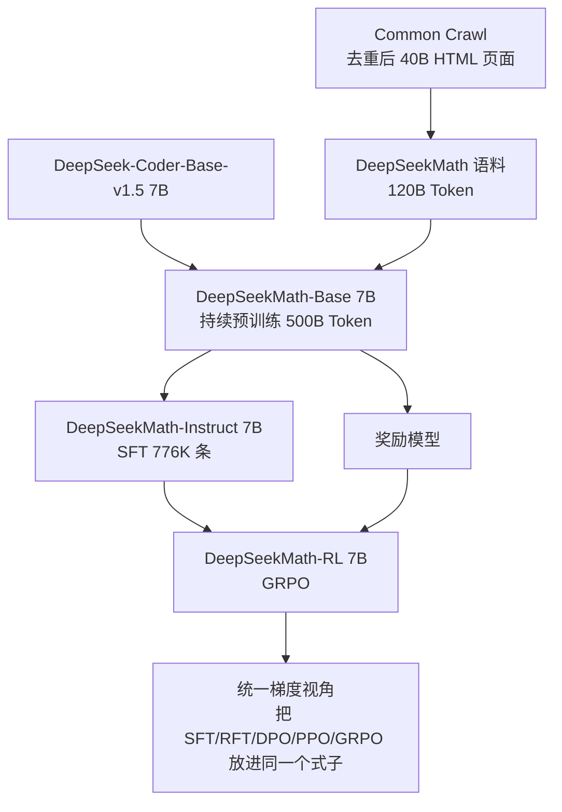
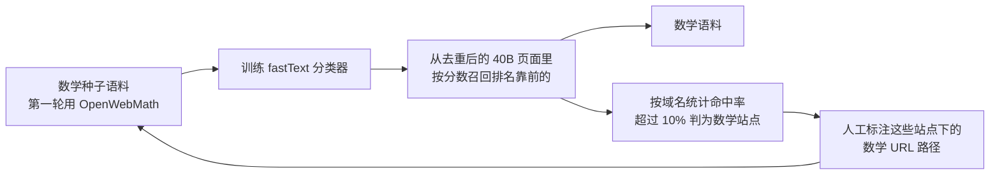
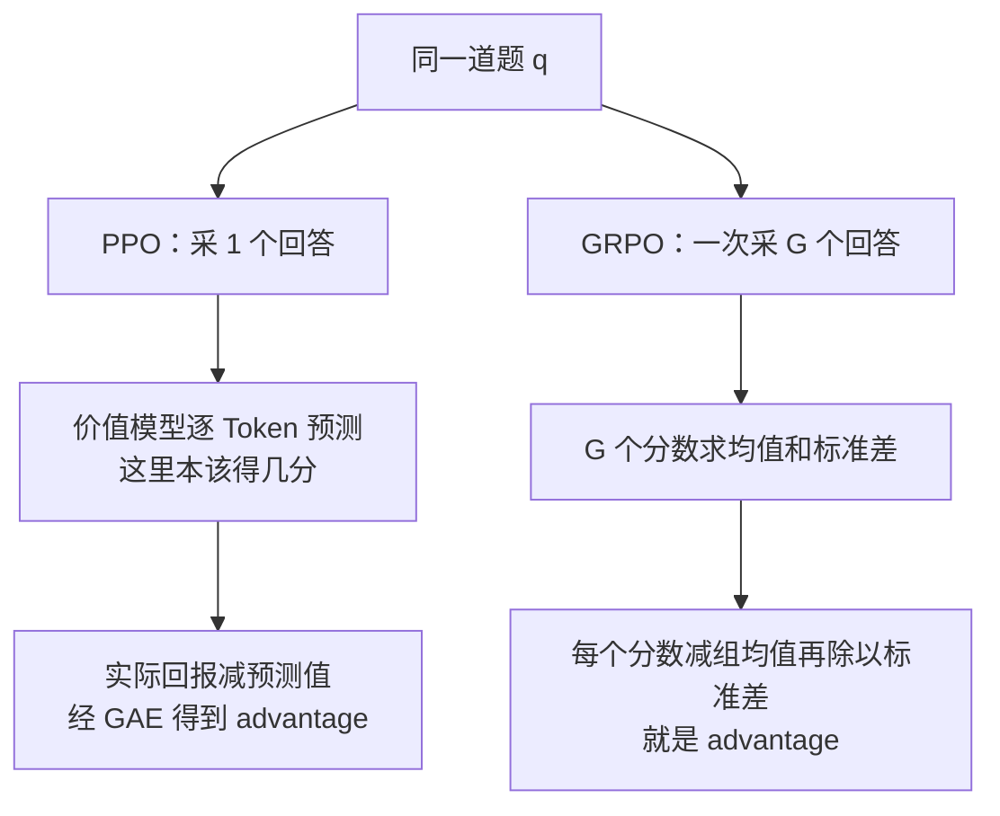
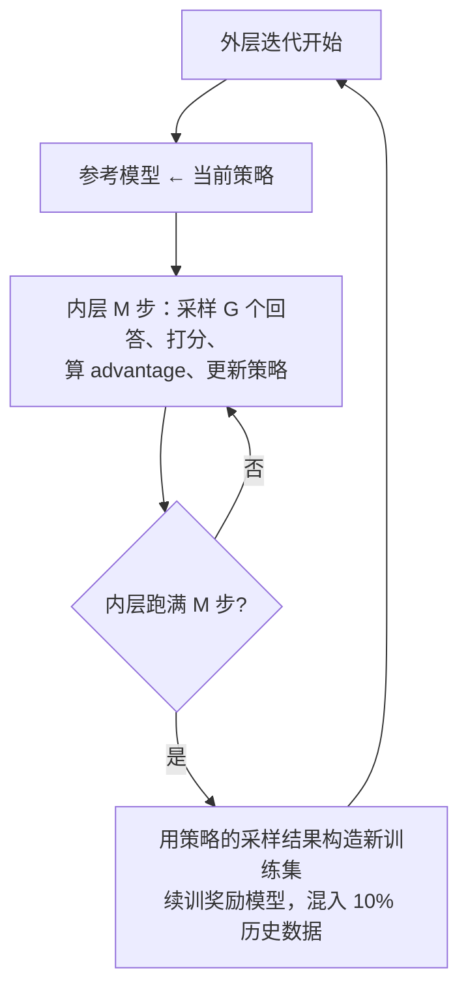

# DeepSeekMath：GRPO 的出处，和一条从 Common Crawl 捞数学语料的流水线

<!-- release-date: 2024-02-05 -->

> 本文依据 DeepSeek-AI 与清华大学、北京大学合作发布的 **DeepSeekMath: Pushing the Limits of Mathematical Reasoning in Open Language Models**，即 arXiv:2402.03300v3、封面页边标注日期 2024-04-27、共 30 页的版本。下文括号里的 `PDF p.N` 都指这份 30 页原件的文件页码。截至 2026-09-05 核验，arXiv 上的最新版本仍是 v3，与本地原件一致，无需替换。文中会明确区分三件事：论文写了什么、本文如何解释它、哪些是外部资料补充。

这篇论文在本站的位置比较特殊。仓库里已经有三篇文章都在讲「在 GRPO 的哪一步动刀」——DeepSeek-R1 篇讲它怎么把一个基座训成推理模型，DAPO 篇讲它的四项工程改动，GSPO 篇讲把重要性比抬到序列级——但源头一直缺席。**GRPO 就是在这篇论文里被提出来的。** 本文补的是这个源头，不重复下游三篇已经讲过的东西。

## 阅读前的最少背景

这篇论文横跨数据工程和强化学习两块，先把七个会反复出现的词说清楚。

- **Token（词元）**：模型处理文本的最小单位。一个汉字、一个英文单词或一个符号，都可能被切成一个或多个 Token。
- **持续预训练（continual pre-training）**：拿一个已经训好的模型，接着用新语料训下去，而不是从随机参数重头开始。
- **监督微调（Supervised Fine-Tuning，SFT）**：用人工整理好的「问题 + 标准答案」直接教模型模仿。
- **强化学习（Reinforcement Learning，RL）**：让模型自己生成回答，再用一个打分机制告诉它这次好不好，据此调整参数。
- **策略（policy）$\pi_\theta$**：就是那个正在被训练的语言模型本身，$\theta$ 是它的参数。RL 文献习惯把模型叫策略。
- **优势（advantage）**：这次回答的得分，比「本来该期待的水平」高多少。RL 更新参数靠的是这个差值，不是原始得分——因为如果所有回答都能得 8 分，那么得 8 分本身不含任何信息。
- **奖励模型（reward model，RM）**：一个专门给回答打分的模型，替代人工评分。

再补两个后面绕不开的名字：

- **近端策略优化（Proximal Policy Optimization，PPO）**：目前 LLM 强化学习最常用的算法，需要同时训练策略和一个估分用的价值模型。本站不单独收录 PPO，本文只讲它的哪个部件在长文本场景成了负担。
- **组相对策略优化（Group Relative Policy Optimization，GRPO）**：这篇论文提出的算法，也是本文的第一核心内容。全称里的 Group 指「同一道题一次采样出的那一组回答」。

## 一句话先说清

这篇论文其实交付了两样彼此独立的东西，很多人只记住了第二样。

**第一样是一条数据流水线。** 它证明了公开的 Common Crawl 网页里藏着大量高质量数学内容，并给出一套可以反复迭代把它们捞出来的方法：最终得到 120B Token 的数学语料，让一个 7B 模型在竞赛级 MATH 上拿到 51.7%，逼近当时的 GPT-4 和 Gemini-Ultra（PDF p.1）。

**第二样是 GRPO。** 它把 PPO 里那个和策略一样大的价值模型整个删掉，改用「同一道题采一组回答、拿组内平均分当基线」。

把两样连起来，论文的立场是：

> **7B 模型能在数学上逼近当时的闭源顶级模型，靠的不是参数量，而是语料质量加上一个更省资源的 RL 算法。**

论文自己的说法更克制：参数量不是数学推理能力的唯一决定因素，用高质量数据预训练的小模型也能有强表现（PDF p.3）。

## 这篇论文的两条线

这是根据 PDF p.5、p.8、p.10、p.15 的正文重画的机制示意图，不含时间轴或实测数据。左半边是数据与模型，右下角那一块是论文最后一节的分析工作，不产出模型。

一个容易被忽略的事实：**DeepSeekMath 不是从零训练的。** 它从 DeepSeek-Coder-Base-v1.5 7B 出发，继续训练 500B Token（PDF p.8）。为什么选一个代码模型当起点，论文专门做了消融，后面会讲。

## 第一部分：120B 数学语料是怎么捞出来的

这一部分值得慢慢看：论文把每一步的判据、超参数和停止条件都写了出来，是一份可以直接照着做的数据工程记录。

### 旧问题：数学语料要么太小，要么全是 arXiv

在 DeepSeekMath 之前，公开的数学语料大致有三种（PDF p.6）：

| 语料 | 规模 | 主要来源 |
|---|---:|---|
| MathPile | 8.9B Token | 超过 85% 是 arXiv 论文 |
| OpenWebMath | 13.6B Token | Common Crawl 里筛出的数学网页 |
| Proof-Pile-2 | 51.9B Token | OpenWebMath + 数学代码 10.3B + arXiv 28.0B |

三者都不大，而且重心明显偏向 arXiv 和英文。对一个想吃下 500B Token 的持续预训练来说，这些语料很快就会被重复好几轮。作为参照，论文最终拿到的 120B Token 大约是 Minerva 用的数学网页的 **7 倍**、OpenWebMath 的 **9 倍**（PDF p.3）。

论文的判断是：真正的富矿在 Common Crawl 本身，问题只是怎么把数学网页从几百亿页面里挑出来。

### 核心方法：让分类器和种子语料互相喂养

朴素做法是训一个分类器，跑一遍全网，结束。论文指出这样做的天花板在哪里：分类器是用种子语料训的，**种子语料多样性不够，分类器就只认得种子长什么样**，剩下的数学网页永远召不回来（PDF p.5）。

所以它做成了一个闭环，跑四轮。

这是根据 PDF p.5 的 Figure 2 与同页正文重画的机制示意图，节点顺序与原图一致，不含时间或数量。

逐步拆开看：

**第一步，训一个便宜的分类器。** 用 OpenWebMath 当种子，从里面随机取 50 万条当正例，再从 Common Crawl 取 50 万个网页当负例，训一个 fastText 模型。超参数论文全写了：向量维度 256、学习率 0.1、词 n-gram 最大长度 3、词最小出现次数 3、训练 3 个 epoch（PDF p.4）。

这里第一个值得学的取舍是：**分类器故意选了最便宜的那种。** fastText 是线性词袋模型，不是 BERT，也不是 LLM。因为它要在 400 亿个页面上跑一遍，单页成本必须压到极低。

**第二步，先把候选池压小。** 原始 Common Crawl 太大，论文先做基于 URL 的去重和近似去重，得到 400 亿个 HTML 页面（PDF p.5）。

**第三步，召回并卡阈值。** 用分类器给页面打分，按分数排序，只保留排在最前面的一部分。保留多少不是拍脑袋定的——论文分别按 top 40B、80B、120B、160B Token 四档做了预训练实验来评估，第一轮选择保留 top 40B（PDF p.5）。

**第四步，找到分类器漏掉的地方。** 这一步是整条流水线最聪明的设计。把整个 Common Crawl 按域名切成互不相交的集合（同一个 base URL 算一个域名），统计每个域名下有多少比例的页面在第一轮被召回了。**超过 10% 的域名，就判定为数学相关站点**，论文举的例子是 `mathoverflow.net`（PDF p.5）。

为什么这一步有用？因为一个数学站点上的页面，分类器可能只认出其中一部分。但只要认出的比例够高，就足以说明**整个站点值得再看一遍**。这是把「单页判断」升级成「站点判断」，用聚合信号纠正单点误判。

**第五步，人工只标 URL 路径，不标页面。** 找到数学站点之后，人工标注这些站点里哪些 URL 路径下是数学内容，例如 `mathoverflow.net/questions`（PDF p.5）。挂在这些路径下、但第一轮没被召回的页面，全部加进种子语料。

这里第二个值得学的取舍是：**人工标注的对象是路径规则，不是单个网页。** 标一条 `mathoverflow.net/questions` 可能一次性带回几十万个页面。人的时间花在产生杠杆的地方，而不是逐页打标签。

**第六步，什么时候停。** 四轮之后拿到 3550 万个数学网页，合计 120B Token。停下来的判据很干脆：第四轮里发现将近 98% 的数据在第三轮就已经收集到了，边际收益趋近于零，于是停止（PDF p.5）。

论文还顺带说了一句：这套方法不限于数学，也适用于代码等其他领域（PDF p.4）。

### 去污染：一个具体到可以照抄的规则

语料从网上捞，评测题也在网上，所以必须做去污染。论文给的规则很具体（PDF p.5）：

- 任何文本片段，只要含有一个 **10-gram** 与评测集里的任意子串完全相同，这段文本就从训练语料里删掉；
- 评测集里那些**短于 10 gram、但至少有 3 gram** 的文本，改用完全匹配来过滤含它的网页。

覆盖的评测集包括英文的 GSM8K、MATH，中文的 CMATH、AGIEval。

10-gram 这个粒度是有讲究的：太短会误杀大量正常文本（数学表达式里的常见短语很容易撞车），太长又拦不住换了几个字的改写题。论文没有给出这个阈值的消融，所以它是一个**工程选择**，不是被验证过的最优值。

### 语料到底好不好：一张表把四个语料放在同一条起跑线上

论文的验证方式很干净：拿同一个 DeepSeek-LLM 1.3B 模型，在四种语料上**各训 150B Token**，其余设置完全相同，然后比下游成绩（PDF p.6）。

训练设置也全部公开：HAI-LLM 框架，AdamW（$\beta_1=0.9$、$\beta_2=0.95$、weight decay 0.1），多段式学习率——2000 步 warmup 到峰值，训练进行到 80% 时降到峰值的 31.6%，到 90% 时降到峰值的 10.0%，峰值学习率 5.3e-4，batch 4M Token，上下文 4K（PDF p.6）。

结果是 Table 1（PDF p.6）：

| 数学语料 | 规模 | GSM8K | MATH | OCW | SAT | MMLU-STEM | CMATH | Gaokao 填空 | Gaokao 选择 |
|---|---:|---:|---:|---:|---:|---:|---:|---:|---:|
| 不做数学训练 | — | 2.9% | 3.0% | 2.9% | 15.6% | 19.5% | 12.3% | 0.8% | 17.9% |
| MathPile | 8.9B | 2.7% | 3.3% | 2.2% | 12.5% | 15.7% | 1.2% | 0.0% | 2.8% |
| OpenWebMath | 13.6B | 11.5% | 8.9% | 3.7% | 31.3% | 29.6% | 16.8% | 0.0% | 14.2% |
| Proof-Pile-2 | 51.9B | 14.3% | 11.2% | 3.7% | 43.8% | 29.2% | 19.9% | 5.1% | 11.7% |
| DeepSeekMath 语料 | 120.2B | 23.8% | 13.6% | 4.8% | 56.3% | 33.1% | 41.5% | 5.9% | 23.6% |

这张表有三个必须读出来的点：

**第一，领先是全面的，不是个别项。** DeepSeekMath 语料在八个 benchmark 上全部第一。

**第二，MathPile 那一行是个警告。** 它在八项里有七项比「完全不做数学训练」还差，CMATH 从 12.3% 掉到 1.2%，Gaokao 选择题从 17.9% 掉到 2.8%。这不是小幅波动，是崩塌。论文对这个现象的解释很含蓄——现有语料以英文为主，对中文数学推理帮助有限甚至有害（PDF p.7）。**本文的补充解释是**：MathPile 超过 85% 是 arXiv 论文，一个 1.3B 模型吃 150B Token 的 arXiv 排版语言，很可能被带偏了输出分布。论文没有做这个归因，所以只能当猜测。

**第三，也是最重要的：规模大不等于质量高。** 这一点论文单独用 Figure 3 证明了（PDF p.7）——在只训到 50B Token 时（这已经是 Proof-Pile-2 完整跑一个 epoch 的量），DeepSeekMath 语料训出的模型就已经超过 Proof-Pile-2。所以领先不是靠「更多数据多训几轮」堆出来的，**平均单位 Token 的质量本身就更高**。

Figure 3 还画出了另一件事：基线语料因为太小，训练中被重复了很多轮，曲线很快走平；DeepSeekMath 语料的曲线一直在爬（PDF p.7）。

### DeepSeekMath-Base 7B 的实际配方

有了语料，接下来是真正的模型。

- 起点：DeepSeek-Coder-Base-v1.5 7B；
- 训练量：500B Token；
- 数据配比：56% DeepSeekMath 语料、4% AlgebraicStack、10% arXiv、20% GitHub 代码、10% Common Crawl 的中英文自然语言；
- 峰值学习率 4.2e-4，batch 10M Token，其余沿用上面 1.3B 实验的设置（PDF p.8）。

这个配比里有两处反直觉的地方，论文都专门做了消融，下一节讲。

先看成绩（Table 2，PDF p.8）：

| 模型 | 规模 | GSM8K | MATH | OCW | SAT | MMLU-STEM | CMATH | Gaokao 填空 | Gaokao 选择 |
|---|---:|---:|---:|---:|---:|---:|---:|---:|---:|
| Minerva（闭源） | 540B | 58.8% | 33.6% | 17.6% | — | 63.9% | — | — | — |
| Mistral | 7B | 40.3% | 14.3% | 9.2% | 71.9% | 51.1% | 44.9% | 5.1% | 23.4% |
| Llemma | 34B | 54.0% | 25.3% | 10.3% | 71.9% | 52.9% | 56.1% | 11.9% | 26.2% |
| DeepSeekMath-Base | 7B | 64.2% | 36.2% | 15.4% | 84.4% | 56.5% | 71.7% | 20.3% | 35.3% |

论文强调的是：它在 MATH 上比其他开源基座高出 10 个百分点以上的绝对值，并且超过了参数量是它 **77 倍**的闭源模型 Minerva 540B（PDF p.8）。注意 OCW 一项 DeepSeekMath-Base 仍低于 Minerva 540B（15.4% 对 17.6%），论文没有回避这一格。

还有三组数字值得记住：

- **工具辅助解题**（Table 3，PDF p.9）：GSM8K+Python 66.9%、MATH+Python 31.4%，都超过 Llemma 34B 的 64.6% 与 26.3%；
- **形式化数学**（Table 3，PDF p.9）：miniF2F 的非形式转形式证明任务上，valid 25.8%、test 24.6%，同样超过 Llemma 34B；
- **通用能力**（Table 4，PDF p.9）：MMLU 从起点模型的 49.1% 涨到 54.9%，BBH 从 55.2% 涨到 59.5%。

最后一条是论文自己点出来的一个副产品：**数学训练顺带提升了通用语言理解和推理**（PDF p.10）。但代价也在同一张表里——HumanEval 从 43.2% 掉到 40.9%，MBPP 从 60.4% 掉到 52.6%。论文的说法是「有效保持了」代码能力（PDF p.10）；本文的读法是：靠 20% 的 GitHub 代码配比把损失压住了，但没有完全避免。

### 反直觉发现一：先训代码，数学会更好

这是论文自己列为主要贡献之一的发现，因为它回应了一个长期没有定论的问题——**代码训练到底提不提升推理能力？**

实验设计得很干净（PDF p.16）。用 DeepSeek-LLM 1.3B，比较四种训练路线，其中最关键的是那组**对照实验**：把「先训 400B 代码」换成「先训 400B 通用语料」，其他完全一样。这样才能区分「代码有用」和「多训 400B 什么都有用」。

Table 6（PDF p.16）的关键几行：

| 训练路线 | GSM8K | MATH | CMATH | GSM8K+Python | MATH+Python |
|---|---:|---:|---:|---:|---:|
| 不做持续训练 | 2.9% | 3.0% | 12.3% | 2.7% | 2.3% |
| 通用 400B → 数学 150B | 19.1% | 14.4% | 37.2% | 14.3% | 6.7% |
| **代码 400B → 数学 150B** | **21.9%** | **15.3%** | **39.7%** | 17.4% | 9.4% |
| 只训数学 150B | 20.5% | 13.1% | 37.6% | 11.4% | 6.5% |
| 代码 400B + 数学 150B 混合一起训 | 17.6% | 12.1% | 36.3% | **19.7%** | **13.5%** |

读出来的结论有三层：

1. **两阶段路线里，代码打底确实比通用语料打底更好**，五项全面领先（21.9 对 19.1、15.3 对 14.4 等）。这是论文的核心论据——不是「多训了 400B」，而是「训的是代码」。
2. **代码对「用 Python 解题」的帮助尤其大**，这一点不意外。
3. **混合训练和两阶段训练各有胜负**：混合训练在工具辅助那两项遥遥领先（19.7 与 13.5），但在不用工具的纯文本推理上反而更差（17.6 对 21.9）。论文给的猜测是 1.3B 模型规模太小，装不下代码和数学两种能力（PDF p.17）。

Table 7（PDF p.17）补上了另一半代价：两阶段训练里，第二阶段的数学训练会把代码能力打回去——HumanEval 从代码训练后的 25.0% 掉回 12.2%，MBPP 从 40.0% 掉回 17.0%。而混合训练能避免这个遗忘（HumanEval 29.3%、MBPP 39.4%）。

所以完整的结论应该是：**代码打底对数学有用，但两阶段会遗忘代码，混合训练能保住代码却牺牲纯文本数学。这是一个三方权衡，不是一个免费午餐。**

论文自己给的措辞很有分寸：这为长期问题提供了一个**部分**答案——我们相信代码训练确实提升推理，至少在数学推理上如此（PDF p.3）。

### 反直觉发现二：arXiv 论文没什么用

这一条更反直觉，因为几乎所有数学预训练工作都会加 arXiv。

论文用两个规模的模型（DeepSeek-LLM 1.3B 训 150B Token、DeepSeek-Coder-Base-v1.5 7B 训 40B Token）、两个 arXiv 语料（MathPile 8.9B、ArXiv-RedPajama 28.0B）交叉测了一遍（PDF p.17）。

Table 8 里 7B 模型那一组（PDF p.17）：

| arXiv 语料 | GSM8K | MATH | MMLU-STEM | CMATH |
|---|---:|---:|---:|---:|
| 不做数学训练 | 29.0% | 12.5% | 38.1% | 45.9% |
| MathPile | 23.6% | 11.5% | 35.8% | 37.9% |
| ArXiv-RedPajama | 28.1% | 11.1% | 35.2% | 42.6% |

Table 9 的形式化证明结果同样往下（PDF p.17）：miniF2F-valid 从 20.1% 掉到 16.8% 和 14.8%，miniF2F-test 从 21.7% 掉到 16.4% 和 11.9%。

**只训 arXiv，各项要么没有明显提升，要么变差。**

但论文紧接着自己踩了刹车，明确列出三个还没研究的口子（PDF p.18）：

1. 没测那些本研究没覆盖的数学相关任务，比如定理的「形式转非形式」；
2. 没测 arXiv 与**其他类型数据混合**时的效果；
3. 没测更大模型规模上 arXiv 是否才显出价值。

这三条很关键。注意 DeepSeekMath-Base 的最终配比里**仍然保留了 10% arXiv**（PDF p.8），论文没有解释这个矛盾。所以正确的读法是：**在这套实验条件下，只喂 arXiv 不能提升数学推理**，而不是「arXiv 是垃圾数据」。

论文自己写的是：这个结论有其局限，应当保留一点怀疑（PDF p.18）。

### 一个必须记住的实验边界

第 5 节的所有消融实验，用的**不是**最终那份 120B 语料，而是第二轮数据收集得到的 **89B Token 版本**（PDF p.15）。

这句话论文只写了一行，很容易漏掉，但它意味着：上面关于代码和 arXiv 的结论，是在一个比最终语料更小、更早的版本上得到的。它们的方向可信，具体数字不能和 Table 1、Table 2 混用。

## 第二部分：SFT，一段可以快速带过的中间环节

SFT 是从 Base 到 RL 之间的桥。论文写得不多，但数字都给了。

数据侧（PDF p.10）：共 **776K** 条训练样本，答案有三种格式——思维链（chain-of-thought，CoT，把推理过程一步步写出来）、程序思维链（program-of-thought，PoT，写一段程序算出答案）、工具集成推理（tool-integrated reasoning，自然语言推理和调用工具交替进行）。英文部分来自人工为 GSM8K 和 MATH 标注的工具集成解法，加上 MathInstruct 的子集和 Lila-OOD 的训练集；中文部分是 K-12 数学题，覆盖 76 个子主题。

训练侧（PDF p.10）：样本随机拼接到 4K 上下文，训 500 步，batch 256，恒定学习率 5e-5。

成绩（Table 5，PDF p.12）：DeepSeekMath-Instruct 7B 在 MATH 上不用工具拿到 46.8%，超过所有开源模型和一部分闭源模型至少 9 个百分点的绝对值；用工具接近 60%（57.4%）。

**这一节唯一需要记住的一句话是**：RL 阶段的起点就是这个模型，而它已经很强了。后面 GRPO 那 5 个百分点是加在一个高分基线上的，不是从零起步。

## 第三部分：GRPO——先讲矛盾，再讲算法

### 矛盾：PPO 的价值模型在长文本里同时很贵、又很难训准

PPO 是个 actor-critic 算法：一个 actor（策略模型）负责生成，一个 critic（价值模型）负责估分。它优化的目标是（PDF p.11，式 1）：

$$
\mathcal J_{PPO}(\theta)=\mathbb E\left[\frac{1}{|o|}\sum_{t=1}^{|o|}\min\Big(w_t A_t,\ \operatorname{clip}(w_t,\,1-\varepsilon,\,1+\varepsilon)A_t\Big)\right]
$$

其中 $w_t=\dfrac{\pi_\theta(o_t\mid q,o_{<t})}{\pi_{\theta_{old}}(o_t\mid q,o_{<t})}$ 是新旧策略在第 $t$ 个 Token 上的概率比，$A_t$ 是该 Token 的 advantage，$\varepsilon$ 是裁剪半径。$q$ 是题目，$o$ 是模型写出的整条回答，$|o|$ 是它的 Token 数。

**本文只解释这个式子里与 GRPO 改动相关的部分，不写成 PPO 教程。** 要注意的只有两件事：advantage $A_t$ 从哪来，以及它贵在哪里。

$A_t$ 由**广义优势估计（Generalized Advantage Estimation，GAE）** 算出，输入是每一步的奖励 $\{r_{\ge t}\}$ 和一个学出来的价值函数 $V_\psi$（PDF p.11、p.13）。同时，为了防止策略过度迎合奖励模型，标准做法是在每个 Token 的奖励里加一项 KL 惩罚（PDF p.13，式 2）：

$$
r_t=r_\varphi(q,o_{\le t})-\beta\log\frac{\pi_\theta(o_t\mid q,o_{<t})}{\pi_{ref}(o_t\mid q,o_{<t})}
$$

- $r_\varphi$ 是奖励模型；
- $\pi_{ref}$ 是参考模型，通常就是初始的 SFT 模型；
- $\beta$ 是 KL 惩罚系数。

**记住这个式子的位置**：KL 被加进了**奖励**里。GRPO 后面会把它搬走。

现在说矛盾。论文指出价值函数带来两个具体问题（PDF p.13）：

**问题一，它太贵。** 价值函数通常是一个和策略模型规模相当的模型。也就是说，训练 RL 时你实际上要同时供养两个大模型，显存和计算都翻倍。

**问题二，在 LLM 场景它很难训准。** 关键在这句话：**通常只有最后一个 Token 会被奖励模型打分。** 也就是说，一整条几百上千 Token 的回答，只在结尾拿到一个分数。但价值函数被要求在**每一个 Token 位置**都给出准确的预测——「写到这里，最终大概能得几分？」用一个末端信号去训练一个逐位置准确的估计器，本来就很困难。

用一个类比：让人只看到期末总分，就要求他准确说出学生在学期第 37 天的水平。信号极其稀疏，估计器却要求处处准确。

**这两个问题合起来的荒谬之处是**：你付出了双倍的模型成本，换来的却是一个在你最需要它的地方（长回答的中间过程）最不可靠的估计。

### 解法：不训估分员，让同组答案互相当尺子

GRPO 的思路一句话说完：**advantage 需要一个基线，而这个基线不一定要预测出来，可以直接测出来。**

对同一道题 $q$，一次采样 $G$ 个回答 $\{o_1,\dots,o_G\}$，用奖励模型打出 $G$ 个分数。**这一组分数的平均值，就是这道题的基线。** 高于平均的回答该被鼓励，低于平均的该被抑制。

这是根据 PDF p.13 的 Figure 4 与同页正文重画的机制示意图。原图还画了参考模型和奖励模型，这里只保留两条路线在 advantage 来源上的差别，不含实测数据。

论文还给了一个更深的理由，很容易被略过：**组内相对比较的方式，和奖励模型本身的训练方式是对齐的**（PDF p.13）。奖励模型通常就是在「同一道题的多个回答两两比较」这样的数据上训出来的。既然它天生擅长相对判断，那么用它做组内相对评分，比用它的绝对分数去回归一个价值函数更贴合它的能力。

### GRPO 的原始目标函数

论文的式 3 上下标很密，先定义两个中间量。

第 $i$ 个回答第 $t$ 个 Token 的**重要性比**：

$$
w_{i,t}(\theta)=\frac{\pi_\theta(o_{i,t}\mid q,o_{i,<t})}{\pi_{\theta_{old}}(o_{i,t}\mid q,o_{i,<t})}
$$

它衡量当前策略比采样时的旧策略多偏爱这个 Token 多少。

第 $i$ 个回答第 $t$ 个 Token 的**裁剪项**：

$$
\ell_{i,t}=\min\Big(w_{i,t}\hat A_{i,t},\ \operatorname{clip}(w_{i,t},\,1-\varepsilon,\,1+\varepsilon)\,\hat A_{i,t}\Big)
$$

$\hat A_{i,t}$ 是这个 Token 的 advantage，怎么算见下一节。

于是完整目标就是（PDF p.13，式 3）：

$$
\mathcal J_{GRPO}(\theta)=\mathbb E\left[\frac{1}{G}\sum_{i=1}^{G}\frac{1}{|o_i|}\sum_{t=1}^{|o_i|}\Big\{\ell_{i,t}-\beta\,\mathbb D_{KL}\big[\pi_\theta\,\|\,\pi_{ref}\big]\Big\}\right]
$$

逐项确认：

- 期望里的采样是 $q\sim P(Q)$、$\{o_i\}_{i=1}^{G}\sim\pi_{\theta_{old}}(O\mid q)$；
- $\frac{1}{G}\sum_i$ 是对一组的 $G$ 个回答求平均；
- $\frac{1}{|o_i|}\sum_t$ 是**在每个回答内部**按它自己的长度求平均；
- KL 项在花括号里面，也就是**逐 Token 施加**；
- $\varepsilon$ 和 $\beta$ 是超参数。

**这个式子的每一个部件，后来都被人动过刀。** 后面有专门一节做对照。

### KL 的两处改动：搬了位置，也换了形式

GRPO 对 KL 做了两件事，论文都写得很明确。

**第一，把 KL 从奖励里搬进损失里。** PPO 的做法是式 2——KL 混进 reward，然后交给 GAE 一起算 advantage。GRPO 直接把 KL 散度加到损失函数上，理由是这样**不会把 $\hat A_{i,t}$ 的计算搞复杂**（PDF p.13）。

这个改动有一个不显眼但实在的好处：advantage 的定义变干净了。在 PPO 里，$A_t$ 同时包含「答得好不好」和「偏离参考模型多少」两种信息；在 GRPO 里，$\hat A_{i,t}$ 只表示「在同组里排第几」，KL 是一项独立的正则。**两个本来不同的信号被拆开了。**

（顺带一提，DeepSeek-R1 报告里也提到 PPO 那种逐 Token KL 惩罚会随输出长度累积，可能隐式压制长回答；那一层讨论见本站 DeepSeek-R1 篇，本文不展开。）

**第二，换成一个恒为正的无偏估计。** GRPO 用的不是 $\log\frac{\pi_\theta}{\pi_{ref}}$，而是（PDF p.14，式 4）：

$$
\mathbb D_{KL}\big[\pi_\theta\,\|\,\pi_{ref}\big]=\frac{\pi_{ref}(o_{i,t}\mid q,o_{i,<t})}{\pi_\theta(o_{i,t}\mid q,o_{i,<t})}-\log\frac{\pi_{ref}(o_{i,t}\mid q,o_{i,<t})}{\pi_\theta(o_{i,t}\mid q,o_{i,<t})}-1
$$

这个形式来自 John Schulman 的一篇博客（论文引的是 Schulman 2020，PDF p.14）。它的性质论文只说了一句：**保证为正**。

**本文补充一层解释**：把 $u=\frac{\pi_{ref}}{\pi_\theta}$ 代进去，这个式子就是 $u-\log u-1$。对 $u>0$，这个函数在 $u=1$ 处取最小值 0，两侧都往上走，所以恒非负。而朴素的单样本估计 $\log\frac{\pi_\theta}{\pi_{ref}}$ 虽然期望正确，单个样本上却可能是负数——一个本该非负的量出现负值，会让训练信号很难解读。这是本文的说明，论文只给了结论。

### 结果监督与过程监督：$\hat A_{i,t}$ 到底怎么算

上面式 3 里的 $\hat A_{i,t}$ 带了 $t$ 下标，说明它允许逐 Token 不同。论文给了两种填法。

**结果监督（outcome supervision）**，也是最常见的那种（PDF p.14）。奖励模型只给整条回答一个分，得到 $\mathbf r=\{r_1,\dots,r_G\}$，做组内标准化：

$$
\tilde r_i=\frac{r_i-\operatorname{mean}(\mathbf r)}{\operatorname{std}(\mathbf r)}
$$

然后**把这个值赋给该回答的所有 Token**：$\hat A_{i,t}=\tilde r_i$。

也就是说，在结果监督下，同一条回答里每个 Token 的 advantage 完全相同。本站 DeepSeek-R1 篇转述的 R1 报告写法就是序列级的简化形式，对应的正是这种情形；**GRPO 的原始形态是逐 Token 的**，因为它还要容纳下面这种情况。

**过程监督（process supervision）**（PDF p.14）。用一个过程奖励模型给**每个推理步骤**的末尾打分。记 $index(j)$ 是第 $j$ 步的结束 Token 下标，$K_i$ 是第 $i$ 条回答的总步数，所有步骤分数集合记作 $\mathbf R$。同样做标准化：

$$
\tilde r_i^{index(j)}=\frac{r_i^{index(j)}-\operatorname{mean}(\mathbf R)}{\operatorname{std}(\mathbf R)}
$$

注意标准化是在**整个 $\mathbf R$** 上做的，不是在单条回答内部做的。

然后每个 Token 的 advantage 是它**之后**所有步骤的标准化奖励之和：

$$
\hat A_{i,t}=\sum_{index(j)\ge t}\tilde r_i^{index(j)}
$$

读法很直观：站在第 $t$ 个 Token 的位置，它要为后面还没发生的所有步骤负责。一个 Token 如果导致后面三步全错，它就承担这三步的负分。

**这里就是式 3 为什么必须写成逐 Token 的原因。** 结果监督下 $\hat A_{i,t}$ 退化成常数，过程监督下它真的随 $t$ 变化。

### 迭代式 RL：奖励模型也会过时

论文观察到一个问题：训练推进后，**旧的奖励模型可能不足以监督已经变强的策略**（PDF p.15）。策略学会了新的写法，而奖励模型没见过这些写法。

对策是 Algorithm 1（PDF p.14）里的外层循环：

这是根据 PDF p.14 的 Algorithm 1 与 p.15 的 4.1.4 节重画的机制示意图，不含时间或步数。

两个细节值得单独记：

- **重放机制里混入 10% 历史数据**（PDF p.15），目的是防止奖励模型只记住新分布、忘掉旧的判断标准；
- **每轮外层迭代都把参考模型重置为当前策略**（Algorithm 1 第 3 行）。这意味着 KL 约束的锚点在往前移——不是死死拴在最初的 SFT 模型上，而是每轮重新定义「不要偏离太远」的起点。

论文实测跑了两轮迭代，结论是迭代 RL 显著提升性能，**尤其是第一次迭代**（Figure 6，PDF p.20）。图上 GSM8K 的 iteration-0 在 85–87 之间震荡后收尾，iteration-1 抬到 87–88，iteration-2 接近 89；MATH 的 iteration-0 收在约 49，iteration-1 与 iteration-2 都落在 51–52。（这些是本文按图读出的近似值，论文正文与附录都没有给对应的数值表。）

### RL 的实际配置，以及一个关键的边界

DeepSeekMath-RL 的完整设置（PDF p.15）：

| 项目 | 取值 |
|---|---|
| 起点 | DeepSeekMath-Instruct 7B |
| RL 训练数据 | SFT 数据里 GSM8K 与 MATH 相关的 CoT 格式题，约 144K 道 |
| 奖励模型 | 基于 DeepSeekMath-Base 7B 训练，学习率 2e-5 |
| 策略学习率 | 1e-6 |
| KL 系数 $\beta$ | 0.04 |
| 每题采样数 $G$ | 64 |
| 最大生成长度 | 1024 |
| 训练 batch size | 1024 |
| 每次探索后的更新次数 | **1 次** |

结果（Table 5，PDF p.12）：GSM8K 从 82.9% 涨到 88.2%，MATH 从 46.8% 涨到 51.7%，CMATH 从 84.6% 涨到 88.8%，MGSM-zh 从 73.2% 涨到 79.6%。

论文特别强调一个点（PDF p.15）：**RL 只用了 GSM8K 和 MATH 的题**，其他 SFT 题目被刻意排除。所以 CMATH、MGSM-zh 这些提升属于**域外泛化**，不是在训练分布上的提升。这个实验设计比分数本身更有说服力。

**现在说那个边界，它非常重要，而且和下游三篇直接相关。**

表里最后一行写的是：策略在每次探索阶段之后只做**一次**更新（PDF p.15）。附录 A.1.6 推导 GRPO 梯度时，也明确写了「为简化分析假设 $\pi_{\theta_{old}}=\pi_\theta$」（PDF p.29）。

**本文的推论是**：在 DeepSeekMath 自己的 RL 配置里，$\pi_{\theta_{old}}$ 和 $\pi_\theta$ 在更新那一刻是同一份参数，所以重要性比 $w_{i,t}$ 恒等于 1，**裁剪机制实际上从未被触发**。GRPO 是在一个近似 on-policy 的条件下被验证的。

这不是论文的错——它的实验就是这么设置的。但它解释了为什么后来的工作全都在裁剪那一块动刀：**一旦把一批 rollout 数据切成多个 mini-batch 连续更新，$w_{i,t}$ 就不再是 1，式 3 里那些在原始论文中处于休眠状态的部件才开始真正起作用，并暴露出问题。** DAPO 和 GSPO 面对的正是这个原始论文没有进入的区域。

### 后来的变体到底动了哪几处

把式 3 摊开，一共有六个可以动刀的位置。这张表是本文对照原文与下游三篇整理的，用来定位，不展开变体机制。

| # | 位置 | 原始 GRPO 的形态（PDF 页） | 后来被谁改、改成什么 |
|---|---|---|---|
| 1 | 裁剪半径 | 上下界共用一个 $\varepsilon$（p.13，式 3） | DAPO 拆成 $\varepsilon_{low}$ 与 $\varepsilon_{high}$，只抬高上界。机制见本站 **DAPO 篇** |
| 2 | 组的构成 | 采到什么用什么，全对或全错的组照常参与（p.14） | DAPO 加了一条约束，要求一组里答对的个数严格在 0 和 $G$ 之间。见 **DAPO 篇** |
| 3 | 损失的分母 | $\frac{1}{G}\sum_i\frac{1}{\lvert o_i\rvert}\sum_t$，先句内平均再句间平均（p.13，式 3） | DAPO 改成全 batch 所有 Token 一起平均。见 **DAPO 篇** |
| 4 | 奖励的构成 | 只有奖励模型给的分（p.15） | DAPO 追加长度惩罚项。见 **DAPO 篇** |
| 5 | KL 正则 | 逐 Token 加在损失里，$\beta=0.04$（p.13、p.15） | DAPO 整项删掉。见 **DAPO 篇** |
| 6 | 重要性比的粒度 | 逐 Token 的 $w_{i,t}$（p.13，式 3） | GSPO 换成整条回答的几何平均 $s_i$，裁剪也整条整条地裁。见本站 **GSPO 篇** |

另外，GRPO 在推理模型训练里的完整应用、以及长思维链和反思行为的涌现，见本站 **DeepSeek-R1 篇**，本文不展开。

### 阅读原文时的三个笔误

逐页放大核对时发现三处不一致，会影响照着论文写代码的人：

1. **Algorithm 1 第 11 行**写的是「通过最大化 GRPO 目标（Equation 21）更新策略模型」（PDF p.14）。但式 21 是**梯度系数**，不是目标函数；目标函数是式 3（附录里重列为式 19）。
2. **式 20 与式 21** 里的条件概率写成了 $\pi_{ref}(o_{i,t}\mid o_{i,<t})$，**漏掉了题目 $q$**（PDF p.30）；同一份附录的式 19 是带 $q$ 的。
3. **式 12 的第二项**写成了 $\log\dfrac{\pi_\theta(o_{<t}^{-}\mid q,o_{<t}^{-})}{\pi_{ref}(o_{<t}^{-}\mid q,o_{<t}^{-})}$，被求概率的那个位置应该是 $o_t^{-}$ 而不是 $o_{<t}^{-}$（PDF p.29）。同一页的式 13 和式 14 都写对了，所以这是排版疏漏。

三处都不改变数学含义，但照抄公式时会踩到。

## 第四部分：统一梯度视角——理解 RL 家族最有用的一节

这一节是全文最容易被跳过、但迁移价值最高的部分。它把 SFT、RFT、DPO、Online RFT、PPO、GRPO 六种看起来完全不同的方法，塞进了同一个式子。

### 一个式子装下六种方法

论文的观察是：任何一种训练方法，对参数 $\theta$ 的梯度都可以写成这个形状（PDF p.18，式 5）：

$$
\nabla_\theta\mathcal J_{\mathcal A}(\theta)=\mathbb E_{(q,o)\sim\mathcal D}\left[\frac{1}{|o|}\sum_{t=1}^{|o|}GC_{\mathcal A}(q,o,t,\pi_{rf})\cdot\nabla_\theta\log\pi_\theta(o_t\mid q,o_{<t})\right]
$$

先看最右边那一项 $\nabla_\theta\log\pi_\theta(o_t\mid q,o_{<t})$。这是**所有方法共有的部分**：它指向「让模型更愿意写出 $o_t$ 这个 Token」的方向。梯度上升沿着它走，模型就更可能生成这个 Token。

所以整个式子的意思是：**每种方法都在给每个 Token 打一个分数，然后按这个分数的大小和正负，决定要把这个 Token 的概率推高还是压低、推多少。** 这个分数就是 $GC$（Gradient Coefficient，梯度系数）。

论文由此拆出三个部件（PDF p.18）：

1. **数据来源 $\mathcal D$**：训练数据从哪来；
2. **奖励函数 $\pi_{rf}$**：训练信号从哪来；
3. **算法 $\mathcal A$**：怎么把数据和奖励加工成梯度系数 $GC$。

**六种方法的差别，全部落在这三个部件上。** 这就是那个统一视角。

### 六种方法的梯度系数

下面这张表对应论文 Table 10（PDF p.19）和附录 A.1（PDF p.28–30）。$P_{sft}$ 表示 SFT 数据集的分布，$\pi_{sft}$ 是 SFT 之后的模型，$\pi_\theta$ 是在线训练过程中实时更新的策略。DPO 那一行的奖励函数，Table 10 写的是「规则」，附录 A.1.4 的正文写的是「通用领域用人类偏好，数学任务里可以是规则」，这里把两处合并写。

| 方法 | 数据来源 $\mathcal D$ | 奖励函数 | 梯度系数 $GC$ | 式号 |
|---|---|---|---|---|
| SFT | $q,o\sim P_{sft}(Q,O)$ | —（人工挑选） | 恒为 $1$ | — |
| RFT | $q\sim P_{sft}(Q),\ o\sim\pi_{sft}(O\mid q)$ | 规则 | $\mathbb I(o)$ | 式 10 |
| Online RFT | $q\sim P_{sft}(Q),\ o\sim\pi_\theta(O\mid q)$ | 规则 | $\mathbb I(o)$ | 式 10 |
| DPO | $q\sim P_{sft}(Q),\ o^{+},o^{-}\sim\pi_{sft}(O\mid q)$ | 规则或人类偏好 | 见下方式 14 | 式 14 |
| PPO | $q\sim P_{sft}(Q),\ o\sim\pi_\theta(O\mid q)$ | 模型 | $A_t$ | 式 18 |
| GRPO | $q\sim P_{sft}(Q),\ \{o_i\}_{i=1}^{G}\sim\pi_\theta(O\mid q)$ | 模型 | 见下方式 21 | 式 21 |

先把最简单的三个讲透，它们已经能说明整个视角的价值。

**SFT 的梯度系数恒为 1**（PDF p.28，式 6–7）。翻译成人话：**SFT 对每一个 Token 都同等用力地说「照抄」。** 它不区分这个 Token 好不好、重不重要，因为数据是人挑的，默认全对。

**RFT 的梯度系数是示性函数**（PDF p.28，式 10）：

$$
GC_{RFT}(q,o,t)=\mathbb I(o)=\begin{cases}1,&\text{这条回答的答案正确}\\0,&\text{这条回答的答案错误}\end{cases}
$$

也就是：**答对的整条照抄，答错的整条丢掉。** 拒绝采样微调（Rejection Sampling Fine-tuning，RFT）本质上就是「先自己做题，做对的当新教材」。

**Online RFT 和 RFT 的梯度系数完全一样**（PDF p.28，式 11）。唯一的差别在数据来源：RFT 的回答采自冻结的 SFT 模型 $\pi_{sft}$，Online RFT 采自实时更新的策略 $\pi_\theta$。

这三行放在一起，已经可以看出这个视角的威力：**这三个原本被当成不同技术介绍的东西，差别可以完全用两个旋钮描述。** 一个是梯度系数——恒为 1 还是 0/1；另一个是数据从哪来——人写的、冻结模型采的、还是实时策略采的。除此之外它们完全相同。

**DPO 的梯度系数**要复杂一些（PDF p.29，式 14）：

$$
GC_{DPO}(q,o,t)=\sigma\!\left(\beta\log\frac{\pi_\theta(o_t^{-}\mid q,o_{<t}^{-})}{\pi_{ref}(o_t^{-}\mid q,o_{<t}^{-})}-\beta\log\frac{\pi_\theta(o_t^{+}\mid q,o_{<t}^{+})}{\pi_{ref}(o_t^{+}\mid q,o_{<t}^{+})}\right)
$$

- $o^{+}$ 是被偏好的回答，$o^{-}$ 是被拒绝的回答，两者都采自 $\pi_{sft}$；
- $\sigma$ 是 sigmoid 函数，把括号里的值压到 $(0,1)$；
- 括号里是「当前模型比参考模型多偏爱差回答多少」减去「多偏爱好回答多少」。

**读法很直观**：如果模型已经把好回答推得很高、差回答压得很低，括号里就是一个很负的数，sigmoid 之后接近 0，梯度系数几乎为零——**这对样本已经学会了，不用再推。** 反过来，如果模型还在偏爱差回答，系数就接近 1，用力更新。DPO 自带一种「学会了就不再使劲」的自适应权重。

注意这个系数是**整对样本共享**的，同时乘在 $o^{+}$ 的正向梯度和 $o^{-}$ 的负向梯度上（PDF p.29，式 13）。

**PPO 的梯度系数就是 advantage 本身**（PDF p.29，式 18）：

$$
GC_{PPO}(q,o,t,\pi_{\theta_{rm}})=A_t
$$

这是在「每次探索后只更新一次」的假设下得到的——此时 $\pi_{\theta_{old}}=\pi_\theta$，重要性比恒为 1，min 和 clip 都可以去掉（PDF p.29，式 15–17）。

**GRPO 的梯度系数**（PDF p.30，式 21）：

$$
GC_{GRPO}(q,o,t,\pi_{\theta_{rm}})=\hat A_{i,t}+\beta\left(\frac{\pi_{ref}(o_{i,t}\mid q,o_{i,<t})}{\pi_\theta(o_{i,t}\mid q,o_{i,<t})}-1\right)
$$

（这里按式 19 的记法补回了条件里的 $q$，论文式 21 漏写，见上一节。）

第一项是组内相对 advantage，和 PPO 的 $A_t$ 位置对应。第二项是 KL 正则贡献的部分。

**这第二项从哪来，论文没有解释，本文补一段推导**（这是本文的推导，不是论文原话）。损失里的 KL 项是 $-\beta(u-\log u-1)$，其中 $u=\frac{\pi_{ref}}{\pi_\theta}$。对 $\theta$ 求导：

- $\nabla_\theta u=-u\,\nabla_\theta\log\pi_\theta$；
- $\nabla_\theta(-\log u)=\nabla_\theta\log\pi_\theta$；

两项相加得 $\nabla_\theta(u-\log u-1)=(1-u)\nabla_\theta\log\pi_\theta$，再乘上前面的 $-\beta$，正好得到 $\beta(u-1)\nabla_\theta\log\pi_\theta$，与式 21 的第二项一致。

它的行为也很好理解：当 $\pi_\theta$ 在某个 Token 上的概率**低于**参考模型时，$u>1$，这一项为正，把概率往回拉；反之为负，把概率往下压。**它是一根把策略拴向参考模型的弹簧，$\beta$ 是弹簧的劲度。**

### 从这张表读出的三件事

**第一，梯度系数的取值范围决定了方法的表达能力。** SFT 只有 $\{1\}$，RFT 只有 $\{0,1\}$，DPO 落在 $(0,1)$ 但靠式 13 的正负两个分支来区分推高和压低，PPO 和 GRPO 则是连续实数、**系数本身就可以为负**。

论文明确点出了 GRPO 和 Online RFT 的关键差别（PDF p.20）：**Online RFT 不惩罚错误回答，并且对所有正确回答一律用同样的力度强化。** GRPO 则按奖励值大小做差异化的强化和惩罚。Figure 5（PDF p.19）显示 GRPO 确实超过 Online RFT。

**第二，在线还是离线，是另一个独立的轴。** Figure 5（PDF p.19，模型是 DeepSeekMath-Instruct 1.3B）显示 Online RFT 明显超过 RFT。论文的解释很自然（PDF p.20）：训练早期策略和 SFT 模型还很像，两者采样差别不大；到后期策略已经跑远了，实时采样的优势才显现出来。

**第三，监督粒度也是一个轴。** Figure 5 里 GRPO+PS（过程监督）超过 GRPO+OS（结果监督），论文的结论是更细粒度、步骤感知的梯度系数确实有好处（PDF p.20）。

**所以这个视角真正的价值是**：它把「用哪个方法」这个二选一问题，拆成了三个可以分别调的旋钮——数据在线还是离线、奖励用规则还是模型、梯度系数是二值还是连续有正负。论文自己的总结是：在这个范式下，所有这些方法都可以被理解为直接的或简化的 RL 技术（PDF p.21）。

**必须留的问号**：Figure 5 的模型只有 1.3B，Figure 6 是 7B，两张图不能直接互相印证。而且论文没有给出这两张图的数值表，也没有报告随机种子数量。这些比较适合用来理解**机制**，不适合当精确的定量证据。

## 第五部分：RL 为什么 work——一个到今天还在被争论的结论

这一小节只有一页，但它是这篇论文影响最深远的观察之一。

论文的做法很简单：比较 DeepSeekMath-Instruct 7B（SFT 模型）和 DeepSeekMath-RL 7B（RL 之后）在两个指标上的差别（Figure 7，PDF p.21，温度 0.7）：

- **Pass@K**：采样 $K$ 次，只要有一次答对就算对。它衡量的是**模型能力的上限**——这道题它到底会不会。
- **Maj@K**：采样 $K$ 次后多数投票，看投票结果对不对。它衡量的是**模型分布的可靠性**——正确答案是不是它最常给出的那个。

结果是（PDF p.21）：

> **RL 提升了 Maj@K，但没有提升 Pass@K。**

论文的结论写得很直白：这些发现表明，RL 是通过让输出分布更稳健来提升整体表现的；换句话说，改进似乎来自**把正确回答从 TopK 里顶上来**，而不是**基础能力的提升**（PDF p.21）。

用一个类比：学生原本就会做这道题，只是十次里有三次会写岔。RL 没有教他新知识，而是让他从「偶尔做对」变成「稳定做对」。

这也让摘要里另一个数字有了正确的读法：DeepSeekMath 7B 在 MATH 上单次是 51.7%，对 64 个样本做自洽投票（self-consistency）能到 **60.9%**（PDF p.1）。那 9 个百分点正是 Maj@64 相对 Top1 的差距——**模型知道答案，只是不总是把它排在第一位。**

**这个结论的分量在于它是可证伪的，而且是作者自己给出的负面证据。** 一篇宣传自家 RL 方法的论文，主动指出这个方法可能没有扩展模型的能力边界，这在当时并不常见。

论文还进一步反思了原因（PDF p.21）：他们只用了指令微调阶段的题目，采样也只是朴素的 nucleus sampling，认为**这可能正是 RL 只提升了 Maj@K 的原因**。未来方向是在分布外题目上做 RL，并配合树搜索等更强的采样策略。

**必须说清楚的边界**：这是在一个 7B 模型、两个数学 benchmark、$K$ 最大到 64 的条件下得到的观察。它不构成「RL 永远不能扩展能力边界」的普遍结论。GRPO 后来在推理模型上表现出的行为，见本站 DeepSeek-R1 篇。

## 论文承认的限制，以及它没有公开的东西

### 论文自己写的限制（PDF p.22）

- **几何和定理证明明显弱于闭源模型**。论文说在他们的试跑里，模型**处理不了三角形和椭圆相关的问题**，怀疑是预训练和微调阶段的数据选择偏差；
- **少样本能力弱**。GPT-4 给了少样本示例后表现会提升，DeepSeekMath 的零样本和少样本表现差不多。论文归因于模型规模的限制；
- **arXiv 的结论有三个未研究的口子**（PDF p.18），前面已经列过。

### 论文没有公开或没有隔离的（本文核对后整理）

- **奖励模型的完整细节**。只说了「按 Math-Shepherd 的做法构造训练集」和「基于 DeepSeekMath-Base 7B、学习率 2e-5」（PDF p.15），没有给数据量、结构、评测结果；
- **过程奖励模型的具体来源与质量**。GRPO+PS 的实验用了过程奖励，但论文没有说这个 PRM 怎么训、有多准；
- **RL 阶段的训练成本**。没有 GPU 数量、墙钟时间、训练步数与算力；
- **消融的归因强度不足**。数据、代码打底、SFT、GRPO 四件事同时改变，Table 5 的 51.7% 无法拆解成各部分的贡献；
- **裁剪与 KL 系数没有扫描**。$\varepsilon$ 论文正文根本没给具体值，$\beta=0.04$ 也没有敏感性分析；
- **组大小 $G=64$ 没有消融**。这是 GRPO 最核心的超参数——组太小则基线噪声大，组太大则采样成本线性上升——论文没有讨论这个权衡；
- **数据流水线的人工成本**。标注了多少条 URL 路径、花了多少人力，论文没写；
- **各轮迭代的分别收益**。四轮召回每一轮增加了多少 Token、质量如何变化，论文只给了最终的 120B 和「第四轮 98% 重复」这一个数字。

还有一条在阅读时容易踩的坑：论文自己也点出，PRM800K 这种由训练有素的标注员精心标注的数据集，仍然含有约 **20%** 的错误标注（PDF p.22）。它被用来论证「未来需要对噪声奖励更鲁棒的 RL 算法」，但同时也提醒读者：**过程监督的收益，天然受限于过程标注的质量。**

## 可以带回自己项目的原则

**一、想扩大召回，就去修种子，不要只调阈值。**
分类器的能力上限由训练它的正例决定。当你发现召回不够时，第一反应通常是把阈值调低——但那只会带进噪声。DeepSeekMath 的做法是回头补种子的多样性，再重训分类器。这个循环适用于任何检索、去重、标注和数据清洗的场景。

**二、用聚合信号纠正单点判断。**
单个页面判错很正常，但「一个域名下有超过 10% 的页面被判为数学」是个很强的信号。当单点分类器不可靠时，找一个天然的分组维度（域名、用户、会话、设备），在组上做判断，往往比在单点上调模型更有效。

**三、人工标注要标在有杠杆的层级上。**
标一条 URL 路径规则，抵得上标几十万个页面。在设计标注任务时，先问一句：有没有一个更抽象的层级，标一次能覆盖很多实例？

**四、基线不一定要预测，可以直接测。**
这是 GRPO 最可迁移的一条。当你需要「一个参照水平」时，第一反应往往是训一个模型去预测它。但如果你能负担多次采样，直接用这批样本的经验分布当基线，通常更准也更便宜——而且不会引入一个新模型的误差。这条在 A/B 实验、异常检测、打分归一化里同样成立。

**五、把不同来源的信号拆开，不要合并成一个数。**
PPO 把 KL 惩罚混进奖励，advantage 就同时承载了两种含义。GRPO 把 KL 拆成独立的正则项，advantage 回归单一语义。任何时候你把两个来源不同的量加成一个数，都要问一句：下游还分得清它们吗？

**六、写下你的方法在哪个条件下被验证过。**
DeepSeekMath 的 GRPO 是在「每次探索只更新一次」的近似 on-policy 条件下测的，裁剪机制从未真正生效。这不是缺陷，但如果这个前提没有被写出来，后来的人就会在完全不同的条件下照抄它，然后困惑于为什么不 work。

**七、同时报告能力指标和稳定性指标。**
Pass@K 和 Maj@K 一起看，才发现 RL 动的是分布而不是能力。只看其中一个，会得到完全不同的结论。任何优化工作都应该问：我涨的这个数，是能力变强了，还是方差变小了？

## 关键词回看

- **DeepSeekMath 语料**：从 Common Crawl 迭代四轮召回得到的 120B Token 数学网页语料，共 3550 万个页面。
- **迭代召回**：训分类器 → 召回 → 按域名找漏网站点 → 人工标 URL 路径 → 扩充种子 → 重训分类器，如此循环。
- **域名命中率阈值**：某个域名下超过 10% 的页面在上一轮被召回，就判定这个域名是数学站点。
- **10-gram 去污染**：任何含有与评测集完全相同的 10-gram 的文本片段，从训练语料中删除。
- **GRPO（组相对策略优化）**：不训练价值模型，对同一道题采样 $G$ 个回答，用组内均值和标准差把奖励标准化成 advantage。
- **组内相对 advantage**：$\hat A_{i,t}$ 由 $\frac{r_i-\operatorname{mean}(\mathbf r)}{\operatorname{std}(\mathbf r)}$ 得到；结果监督下整条回答共用一个值，过程监督下逐步骤累加。
- **结果监督 / 过程监督**：只给整条回答一个分 / 给每个推理步骤一个分。后者的 advantage 是该 Token 之后所有步骤奖励之和。
- **KL 的位置**：PPO 把 KL 加进奖励，GRPO 把它作为独立正则加进损失，避免污染 advantage 的语义。
- **无偏 KL 估计**：$u-\log u-1$，其中 $u=\pi_{ref}/\pi_\theta$。恒非负，避免单样本估计出现负值。
- **迭代 RL**：跑一段时间后用策略的新采样续训奖励模型（混入 10% 历史数据），并把参考模型重置为当前策略。
- **统一梯度视角**：任何训练方法的梯度都可以写成「梯度系数 × $\nabla_\theta\log\pi_\theta$」，差别只在数据来源、奖励函数和梯度系数三处。
- **梯度系数（Gradient Coefficient，GC）**：决定每个 Token 被推高还是压低、推多少。SFT 恒为 1，RFT 是 0/1，PPO 是 $A_t$，GRPO 是组内 advantage 加 KL 弹簧项。
- **RFT / Online RFT**：拒绝采样微调；答对的照抄、答错的丢掉。两者只差在采样用的是冻结的 SFT 模型还是实时策略。
- **Pass@K / Maj@K**：采样 $K$ 次至少对一次的比例 / 多数投票的正确率。前者反映能力上限，后者反映分布可靠性。

## 最后的判断

这篇论文最值得记住的地方，不是 51.7% 这个分数。

**它真正做对的两件事，恰好代表两种不同的进步方式。**

第一件是**把一个被认为已经挖完的矿重新挖了一遍**。所有人都能访问 Common Crawl，但需要一套愿意跑四轮、愿意让人工去标 URL 规则、愿意用预训练实验来定阈值的流水线，才能从里面拿出 120B Token 的高质量数学语料。这里没有新算法，只有把一件笨事做到位。

第二件是**删掉了一个大家默认必须有的部件**。PPO 的价值模型贵、难训、而且在 LLM 场景最需要它的地方最不准。GRPO 的回答是：既然我们本来就要为同一道题采样很多次，为什么不直接用这些样本当基线？

至于哪些结论站得住，需要分档看：

- **被消融支持的**：DeepSeekMath 语料显著优于当时的三个公开数学语料（Table 1、Figure 3，同规模同 Token 数对照）；代码打底优于通用语料打底（Table 6，有对照组）；只训 arXiv 不提升数学推理（Table 8、Table 9，两个规模两个语料）；RL 提升 Maj@K 不提升 Pass@K（Figure 7）。
- **有实验但归因不完整的**：GRPO 优于 Online RFT、过程监督优于结果监督、迭代 RL 有效（Figure 5、Figure 6）。都只在一个模型、两个 benchmark 上测过，没有数值表和种子数。
- **只是作者观察或推测的**：数学训练顺带提升通用推理（Table 4 有数字，但没有隔离实验）；混合训练在小模型上受限于容量（论文自称 conjecture）；几何弱是数据选择偏差所致（论文自称怀疑）。
- **完全没公开的**：奖励模型与过程奖励模型的细节、RL 的训练成本、$G$ 与 $\beta$ 与 $\varepsilon$ 的敏感性、数据流水线的人力成本。

还有一条要说清楚：**这篇论文里的 GRPO，和今天大多数人用的 GRPO 已经不是同一个东西了。** 原始版本在近似 on-policy 条件下运行、裁剪从未触发、KL 系数 $\beta=0.04$ 保留在损失里、损失按每条回答自己的长度做平均、最大生成长度只有 1024。后来的长思维链训练把这些前提逐条推翻了，于是 DAPO 和 GSPO 才有了动刀的对象。

如果只记一句话：

> **当一个部件既昂贵又不准，先别急着把它训得更好——先问它是不是可以被一批样本的经验分布替代掉。**

## 资料与阅读边界

- 原始依据：本地 `papers/DeepSeek/DeepSeekMath.pdf`，即 arXiv:2402.03300v3，封面页边日期 2024-04-27，共 30 页。封面正式标题为 *DeepSeekMath: Pushing the Limits of Mathematical Reasoning in Open Language Models*，署名 DeepSeek-AI、清华大学、北京大学。
- 版本核验：[arXiv 论文页](https://arxiv.org/abs/2402.03300)。提交历史为 v1（2024-02-05）、v2（2024-02-06）、v3（2024-04-27）。截至 2026-09-05 核验，最新版本仍是 v3，与本地原件一致，**不需要替换 PDF**。
- `release-date` 依据：本文的主对象是 **DeepSeekMath 7B 这个真实发布过权重的模型**（论文以它命名，GRPO 是在训练它的过程中被提出来的），因此按流程取模型首次对外开放的日期。三个权重仓库 [deepseek-math-7b-base](https://huggingface.co/deepseek-ai/deepseek-math-7b-base)、[deepseek-math-7b-instruct](https://huggingface.co/deepseek-ai/deepseek-math-7b-instruct)、[deepseek-math-7b-rl](https://huggingface.co/deepseek-ai/deepseek-math-7b-rl) 在 HuggingFace 上的创建时间均为 2024-02-05（UTC），是已知最早的官方渠道。官方代码仓库 [deepseek-ai/DeepSeek-Math](https://github.com/deepseek-ai/DeepSeek-Math) 的首个 commit 是 2024-02-06，晚一天。arXiv v1 的提交时间同样是 2024-02-05，所以即使按「技术首次官方公开日」这条备用口径，取值也是同一天，两种读法不冲突。
- 跨篇参考：GRPO 在推理模型训练中的完整应用与能力涌现，见本站 **DeepSeek-R1 篇**；裁剪上界解耦、动态采样、Token 级损失与超长奖励整形，见本站 **DAPO 篇**；把重要性比抬到序列级，见本站 **GSPO 篇**。这三处本文只标出原始 GRPO 的形态，不展开变体机制。
- PPO 的原始来源：[Proximal Policy Optimization Algorithms](https://arxiv.org/abs/1707.06347)。本站不单独收录 PPO，本文只讲它的价值模型为什么在长文本场景成为负担。
- KL 估计式的来源：论文式 4 引自 [Approximating KL Divergence](http://joschu.net/blog/kl-approx.html)（John Schulman，2020）。这是外部补充，不是本论文的原创结论。
- 种子语料的来源：[OpenWebMath](https://arxiv.org/abs/2310.06786)。对比语料 [MathPile](https://arxiv.org/abs/2312.17120) 与 [Proof-Pile-2 / Llemma](https://arxiv.org/abs/2310.10631)。
- 分类器实现：论文脚注给出的是 [fastText](https://fasttext.cc)。
- 起点模型：[DeepSeek-Coder](https://arxiv.org/abs/2401.14196)，论文正文写作 DeepSeek-Coder-Base-v1.5 7B。
- 过程奖励做法的参考：论文的奖励模型训练集构造引自 [Math-Shepherd](https://arxiv.org/abs/2312.08935)。本文没有把该论文的细节冒充成 DeepSeekMath 的实现。
