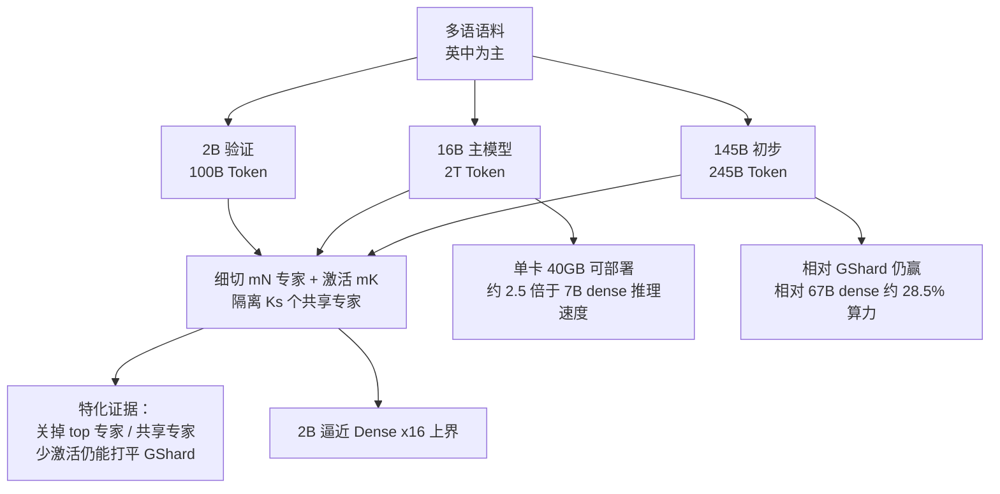

# 把专家切细、再留共享专家，特化才站得住

<!-- release-date: 2024-01-11 -->

> 本文依据 DeepSeek-AI 的 **DeepSeekMoE: Towards Ultimate Expert Specialization in Mixture-of-Experts Language Models**，即 arXiv:2401.06066v1（2024-01-11），共 33 页。截至核验 arXiv 只有 v1。页码均指这份 PDF。全文把三件事分开标注：**报告明确写了什么**、**我们如何解释或验算它**、**哪些是外部资料补充**。

## 读前先把几个词说成人话

这篇论文难读的地方，不是公式多，而是它把「专家」这个词拆开重新定价。后面所有表，都踩在「特化有没有发生」这一问上。

先把会反复出现的词说清楚：

- **Token（词元）**：模型读写文本时的最小单位。
- **Dense（稠密模型）**：每一层的全部参数，对每一个 Token 都要算一遍。参数翻倍，单次计算量大致也翻倍。
- **FFN（Feed-Forward Network，前馈网络）**：Transformer 块里注意力后面那个大的两层（或带门控的）全连接。常规 MoE 就是把这一层换成一排小网络。
- **MoE（Mixture-of-Experts，混合专家）**：把 FFN 拆成很多个小网络（专家）。每个 Token 只让其中少数几个干活。总参数可以很大，单次浮点运算却不必跟着涨。
- **路由（routing）**：按当前 Token 的隐状态，决定激活哪几个专家。得分最高的 $K$ 个叫 **top-$K$**。
- **专家特化（expert specialization）**：论文自己的目标。每个专家学到的知识尽量不重叠、尽量聚焦；反面是知识混杂和知识冗余（PDF p. 2）。
- **共享专家（shared expert）**：不经过路由器、每个 Token 都必经的那几个专家。论文把它们从路由池里隔离出来。
- **FLOPs（浮点运算次数）**：一次前向实际做了多少加减乘。本文拿它当训练和推理的算力账单，不拿总参数当账单。
- **负载均衡损失（load balancing loss）**：额外一项辅助损失，逼 Token 不要都挤进少数专家。

这篇不是后来 DeepSeek-V2 技术报告的复述。V2 沿用了这里的细粒度专家加共享专家，又另加了 MLA、设备受限路由等；那些是 **论文之后** 的事，见文末。本篇只写 2024-01 这篇论文做了什么。

对照时会点到两篇前作，但不搬它们的表：

- [Switch Transformers](/reports/Google/Switch-Transformers) 走 **top-1**，把路由收到每个 Token 只进一个专家；
- [Efficient Large Scale MoE](/reports/Meta/Efficient-Large-Scale-MoE) 跟的是 **GShard 式隔层 top-2**，问同样 FLOPs 下 MoE 何时赢过 dense。

DeepSeekMoE 的靶子不是「参数能不能涨到万亿」，也不是「微调账还不上」。它问的更窄：

> 常规 top-$K$ / $N$ 为什么难特化？把专家切细、再留出共享专家，特化能不能真的发生？发生之后，训练和推理各少花多少算力？

## 一句话先说清

2024 年初，MoE 已经能把总参数和每 Token 计算量拆开。Switch 证明 top-1 能训到万亿；GShard 式 top-2 是当时自回归 MoE 的默认写法。两边共享一个没被认真追问的假设：**专家保持和原来 FFN 一样大，$N$ 只有 8 或 16，每个 Token 只进 1–2 个。**

这篇论文认为，这个假设会让「专家」名不副实（PDF p. 2）：

1. **知识混杂（knowledge hybridity）**。专家太少、每个太大，分到同一个专家上的 Token 什么领域都有，一块参数被迫同时背几摊互不相干的知识。
2. **知识冗余（knowledge redundancy）**。语法、常识这类每个 Token 都要用的东西，会在多个专家里各存一份。

DeepSeekMoE 用两个动作分别对付这两个毛病，并且 **总专家参数和每次激活的计算量保持不变**（PDF p. 5，Figure 2 图注）：

1. **细粒度切分**：把 $N$ 个专家切成 $mN$ 个更小的，激活数从 $K$ 变成 $mK$，让「当前 Token 需要的知识」可以被更灵活地组合。
2. **共享专家隔离**：拿出 $K_s$ 个专家当共享专家，每个 Token 都走；路由专家少激活 $K_s$ 个，把公共知识从路由池里抽走。

摘要把结论写得很硬（PDF p. 1）：

- 2B 规模上，DeepSeekMoE 打平 **GShard 2.9B**（专家参数和专家计算都是 1.5 倍）；
- 同一个 2B，还逼近 **同总参 dense**——论文把这当成 MoE 的容量上界；
- 16B 打平 LLaMA2 7B，大约 **40%** 算力；
- 145B 相对 GShard 仍有明显优势，相对 DeepSeek 67B 大约 **28.5%**（半激活变体甚至 **18.2%**）算力。

对推理服务来说，口号不如边界要紧。你买到的是「同样激活算力下更专的专家，以及一份单卡 40GB 就能跑的 16B 权重」。你没有买到设备受限路由、无辅助损失均衡，也没有买到一份线上延迟表。那三样是论文之后的事。

### 一条阅读路线

如果只有半小时读原文，建议按这个顺序：

1. **p. 2 的两个毛病，p. 5 的 Figure 2**：先看清切细和共享是怎么叠到同一张算力账单上的。
2. **p. 6 式 (9)–(11)**：共享专家没有门控系数，路由专家才走 top-$K$。
3. **p. 7 的两类均衡损失**：专家级防坍缩，设备级防空转。2B / 16B 实际上只用了前一个。
4. **p. 10 Table 1、p. 11 Table 2**：2B 对 Hash / Switch / GShard，以及 GShard $\times 1.5$、Dense $\times 16$。
5. **p. 12 Figure 3，p. 13–14 Figure 4–6**：特化是不是真的发生了。这三张图比排行榜更要紧。
6. **p. 17 Table 3、p. 18 Table 4、p. 22 Table 6**：16B 的 40%，145B 的 28.5% / 18.2%。

附录 A 的超参总表、附录 B 的更大 GShard / Dense、附录 C 的 16B 训练曲线，第一次可以只当对照尺。

## 主要矛盾：名叫专家，其实在背大杂烩

论文没有从「我们做了一个 16B MoE」开场。它先承认 MoE 已经能在参数上涨的同时把计算按住，然后指出特化并没有自动发生（PDF p. 1–2）。

常规做法是：把 Transformer 里的 FFN 换成 MoE 层；每个专家和原来的 FFN 一样大；每个 Token 分给一个（Switch）或两个（GShard）专家（PDF p. 2、p. 4）。实践里专家数常常只有 8 或 16。于是两件事同时发生：

- 分到某个专家上的 Token 覆盖了太多不同知识，这块参数变成大杂烩，用的时候对不上号；
- 不同专家接到的 Token 又都需要同一份公共知识，于是这份知识被存了多份。

这两件事合在一起，就是论文说的「阻碍专家特化，使 MoE 到不了理论上界」（PDF p. 2）。理论上界在后文被操作化成一件很具体的事：把所有专家都变成共享专家、每个 Token 都跑遍，等价于一个总参相同的 dense。那是 MoE 容量的硬上界，因为稀疏模型不可能比「把全部专家都算一遍」更强（PDF p. 11）。

于是矛盾变成：

> dense 把「能记住多少」和「每次要算多少」焊在一起。旧 MoE 声称能拆开，但专家又大又少，拆开之后学到的是重复的大杂烩，不是互补的专长。DeepSeekMoE 要问的是：在 **同一份专家参数、同一份激活算力** 里，能不能把特化逼出来。

「用稀疏换规模」这句口号，必须被特化证据和三档算力账单分别定价。不能只用验证集损失宣布胜利。

## 先看全景：不是新注意力，是一次 FFN 的重新切块

这张图按 PDF p. 1–3、p. 5、p. 21 的叙事重画，是流程示意，不是论文原图。主路径不是新注意力——16B 和 145B 用的仍是普通多头注意力（PDF p. 15、p. 21）——而是「同一份算力账单里把专家切细、把公共知识抽走」。

贯穿三档模型的对照尺在附录 A 表 7（PDF p. 31）：

| 档 | 总参 | 层 / 宽 / 头 | 共享 + 路由（激活） | 相对专家尺寸 | 序列 / 学习率 |
|---|---:|---|---|---:|---|
| 验证 | 2.0B | 9 / 1280 / 10 | 1 + 63（激活 7） | 0.25 | 2048 / $1.08\times 10^{-3}$ |
| 主模型 | 16.4B | 28 / 2048 / 16 | 2 + 64（激活 6） | 0.25 | 4096 / $4.2\times 10^{-4}$ |
| 初步放大 | 144.6B | 62 / 4096 / 32 | 4 + 128（激活 12） | 0.125 | 4096 / $3.0\times 10^{-4}$ |

相对专家尺寸 0.25，意思是每个专家的中间维是标准 FFN 的四分之一。2B 和 16B 都把激活专家数配成「2 倍标准 FFN」：1 个共享 + 7 个路由，或 2 个共享 + 6 个路由，都是 8 个小专家，$\times 0.25 = 2$。145B 切得更细（0.125），4 个共享 + 12 个路由 = 16 个小专家，仍是 2 倍标准 FFN（PDF p. 8、p. 15、p. 21、p. 31）。

有两个和前作不同的排布，后面谈算力时会用到。

第一，**几乎每一层 FFN 都换成 MoE**。2B 是全部替换；16B 和 145B 只把第一层留成 dense，因为作者观察到第一层的负载均衡收敛特别慢（PDF p. 8、p. 15、p. 21）。这和 Switch / GShard 常见的「隔一层换一次」不是同一张图。本站那两篇已经写过隔层的通信含义，这里不重复。

第二，**16B 把一层里的全部专家放在同一张卡上**，用流水线并行把不同层放到不同设备，因此训练时不丢 Token、也不用设备级均衡损失（PDF p. 15）。专家并行、跨卡 all-to-all，是 145B 才打开的（PDF p. 21–22）。16B 能单卡部署，部分原因就是这套并行策略从一开始就没把一层专家拆到多卡。

## 核心设计一：细切，让组合数从一百变成四十亿

### 旧问题：专家又大又少，一个 Token 只能进一两间大屋

人话版：旧 MoE 像把一栋办公楼按楼层分给 16 个部门，每个访客只能进 1–2 层。来的人什么业务都有，每一层就变成杂货铺。你不能指望「法律部」只懂法律——分到那一层的人可能在问会计、问运维、问前台。

论文的原话更短：专家数有限时，分到某个专家的 Token 更可能覆盖多样知识，这块参数就会把很难同时用上的知识堆在一起（PDF p. 5）。

### 新设计：专家变小，激活变多，总账不变

做法是把每个专家 FFN 沿中间隐藏维切成 $m$ 份，中间维变成原来的 $1/m$；激活数同步乘 $m$，计算量不变（PDF p. 5–6）。Figure 2 的中间幅把这件事画成：原来 $N$ 个专家、top-2，切完变成 $2N$ 个更小的专家、top-4（PDF p. 5）。图里三幅的专家参数和计算量被作者明确写成「保持不变」。

切完之后，一层的输出是（PDF p. 6，式 6–8）：

$$
\mathbf{h}_t^{l}
=
\sum_{i=1}^{mN}
g_{i,t}\,
\mathrm{FFN}_i(\mathbf{u}_t^{l})
+
\mathbf{u}_t^{l}
$$

$g_{i,t}$ 只在亲和度最高的 $mK$ 个位置非零，等于对应的 $s_{i,t}$，其余为 0。亲和度仍是隐状态和专家质心的内积再 softmax：

$$
s_{i,t}
=
\mathrm{Softmax}_i
\bigl(
(\mathbf{u}_t^{l})^{\top}
\mathbf{e}_i^{l}
\bigr)
$$

符号的意思是：$\mathbf{u}_t^{l}$ 是注意力之后的隐状态，$\mathbf{e}_i^{l}$ 是第 $i$ 个专家的质心，$g_{i,t}$ 是稀疏门控。残差 $\mathbf{u}_t^{l}$ 加在所有专家输出外面。

### 工作机制：同一份算力，组合空间差了七个数量级

论文给的例子是 $N = 16$（PDF p. 6）：

- 常规 top-2：$\binom{16}{2} = 120$ 种组合；
- 每个专家切成 4 份，变成 64 选 8：$\binom{64}{8} = 4{,}426{,}165{,}368$ 种。

我们验算过这两个组合数，和原文一致。论文把这记成「组合灵活性的激增，有助于更准确、更有针对性的知识获取」（PDF p. 6）。

**我们如何解释它。** 组合数不是实验证据，是计数。它说明的是搜索空间变大了，不证明模型真的用上了这些组合。真凭据在 Figure 5 和 Figure 6：少激活几个小专家，仍然打得过 GShard 的完整 top-2。那才是「组合用上了」的实验，下一节再讲。

细切的代价也写在 16B 的选型里。作者没有把 16B 切得更细，因为专家太小会伤计算效率；他们说大于 16B 时还可以再切（PDF p. 15）。145B 相对尺寸从 0.25 收到 0.125，就是这句话的兑现（PDF p. 21、p. 31）。

### 可迁移启发

想让专家「专」起来，先问每个专家是不是太大。把中间维切小、把激活数按比例加回去，总 FLOPs 可以不动。自己做对照时，**同一行必须锁住总专家参数和激活专家参数**；只加专家数、同时把激活算力抬上去，比的就不是细切，是「多花钱」。

## 核心设计二：共享专家，把公共知识从路由池里抽走

### 旧问题：每个专家都在学同一份常识

即使组合变灵活了，路由专家仍可能各自存一份「句子怎么写、指代怎么解」的公共知识。论文把它叫做知识冗余：分到不同专家的 Token 可能需要同一类信息，于是多份参数收敛到同一件事上（PDF p. 6）。

### 新设计：几位专家不上路由器，每个 Token 都经过

从切细后的 $mN$ 个专家里，再隔离 $K_s$ 个作为共享专家。路由器不再管它们；每个 Token 确定性经过。为了算力不变，路由侧的激活数从 $mK$ 减到 $mK - K_s$（PDF p. 6，Figure 2(c)）。

完整一层写成（PDF p. 6，式 9–11）：

$$
\mathbf{h}_t^{l}
=
\sum_{i=1}^{K_s}
\mathrm{FFN}_i(\mathbf{u}_t^{l})
+
\sum_{i=K_s+1}^{mN}
g_{i,t}\,
\mathrm{FFN}_i(\mathbf{u}_t^{l})
+
\mathbf{u}_t^{l}
$$

注意第一项 **没有** $g_{i,t}$。共享专家的输出按 1.0 加进来，不乘门控。$g_{i,t}$ 只在剩余的路由专家里、对 top-$(mK-K_s)$ 非零。最终计数是：共享 $K_s$ 个，路由 $mN - K_s$ 个，非零门控 $mK - K_s$ 个（PDF p. 6）。

Figure 2 右幅把共享专家画成绿色、始终连到输入；路由器的 $K$ 从 4 收到 3，总计算量仍与左幅 top-2 对齐（PDF p. 5）。

### 它从哪来、这篇论文改了什么视角

论文自己写：共享专家隔离的原型可以记到 Rajbhandari 等人 2022 年的 DeepSpeed-MoE；关键差别是那边从工程出发，这边从算法出发（PDF p. 6）。

**我们如何解释它。** 工程视角常见的动机是：有一块每个 Token 都要算、而且就在本地的 FFN，可以拿来填通信空档。这篇 2024-01 的论文 **没有** 写 all-to-all 重叠——那是 V2 报告里的护栏四，标成论文之后。这边给出的算法动机更窄：把公共知识压进常驻专家，路由专家就不必每人存一份，特化才站得住。

共享和路由的配比，2B 上试过 1、2、4 个共享专家，Pile 损失分别是 1.808、1.806、1.811，差很小。作者取了略好的 1:3（共享 : 激活的路由），放大时沿用（PDF p. 12）。16B 是 2 共享 + 6 路由，145B 是 4 共享 + 12 路由，都是这个比（PDF p. 31）。

### 可迁移启发

公共知识和偏门知识不要抢同一组可路由参数。隔离几个必经专家，是在路由目标函数里做不到的硬约束：路由器再怎么学，也改不掉「每个 Token 都经过它们」。配比在这篇论文里不敏感，1:3 只是他们放大时的缺省，不是定律。

## 负载均衡：这篇论文写了什么，以及它没写什么

自动学的路由会失衡。论文点了两个后果（PDF p. 7）：

1. **路由坍缩**：模型总选少数专家，其余专家训不到；
2. 专家若分布在多张卡上，失衡会变成计算瓶颈。

对应两套损失，形状相同、粒度不同。

### 专家级：防坍缩

$$
\mathcal{L}_{\mathrm{ExpBal}}
=
\alpha_1
\sum_{i=1}^{N'}
f_i P_i
$$

其中 $N' = mN - K_s$，$K' = mK - K_s$（PDF p. 7，式 12–14）。$f_i$ 是第 $i$ 个路由专家实际接到的 Token 比例，再乘 $N'/K'$ 归一化；$P_i$ 是它在整段序列上的平均亲和度。指示函数在 $f_i$ 里，不可导；梯度从可导的 $P_i$ 走，并被「已经有多挤」的 $f_i$ 加权。哪个专家现在越挤，压它概率的力就越大。

### 设备级：防空转，而不是把每个专家都按死

论文写得很清楚：若目的只是减轻计算瓶颈，**不必在专家级上施加过严的均衡**，过严会伤效果。真正要齐的是各设备上的计算量（PDF p. 7）。把路由专家分成 $D$ 组、每组一张卡，设备级损失是组内 $f$ 的平均乘组内 $P$ 的和（PDF p. 7，式 15–17）。实践上专家级因子较小、设备级因子较大（PDF p. 7）。

三档模型实际怎么用，比公式更有信息量：

| 档 | 专家怎么放 | 专家级 $\alpha_1$ | 设备级 $\alpha_2$ | 丢 Token |
|---|---|---:|---:|---|
| 2B | 全部参数一张卡 | 0.01 | 不用 | 不丢（PDF p. 8） |
| 16B | 一层的全部专家同一张卡，层间流水线 | 0.001 | 不用 | 不丢（PDF p. 15） |
| 145B | 每层路由专家均匀放 4 张卡 | 0.003 | 0.05 | 正文没写丢（PDF p. 22） |

16B 把专家级因子收得很小，理由是：在他们的并行策略下，再加大这个因子 **不会提高计算效率，反而伤效果**（PDF p. 15）。这句话等于承认：16B 的均衡损失几乎只是坍缩保险，不是吞吐旋钮——因为专家根本没有跨卡。

2B 和 16B **明确写了不丢任何 Token**（PDF p. 8、p. 15）。容量因子、overflow、残差直通，是 Switch / GShard 那一系的主叙事，这篇验证实验没有走那条路。

### 论文之后才出现的两件事，不要读回 2024-01

这篇论文 **没有** 设备受限路由，也 **没有** 无辅助损失均衡。

- **设备受限路由**（先选 $M$ 台设备，再在这些设备的专家里做 top-$K$）出现在 2024-05 的 [DeepSeek-V2](/reports/DeepSeek/DeepSeek-V2)。V2 还加了第三项通信均衡损失，以及「共享专家计算重叠 all-to-all」。那些是细切之后、专家真正跨卡时才被迫发明的护栏。
- **无辅助损失负载均衡**（用偏置改排队顺序，把均衡从损失里搬出去）出现在 2024-12 的 [DeepSeek-V3](/reports/DeepSeek/DeepSeek-V3)。

本篇只记录 2024-01 写在纸上的两级辅助损失，以及「小模型不用设备级、不丢 Token」这个事实。后面两代怎么改，不回写进这些公式。

## 2B：同一份算力，先证明细切加共享比 GShard 值

验证实验把所有 MoE 都训成约 2B 总参、同一份 100B Token、同一套超参（PDF p. 8–9）。词表 8K，9 层，宽 1280，10 个注意力头。DeepSeekMoE 是 1 个共享 + 63 个路由，每个 0.25 倍标准 FFN，激活 1+7（PDF p. 8）。

### 先和同总参的旧 MoE 比

Table 1（PDF p. 10）是第一把尺。Dense 只有 0.2B，和 top-1 的 Hash Layer、Switch 激活量对齐；GShard 与 DeepSeekMoE 激活 0.3B，因为多开了一个专家。每 2K Token 的 FLOPs：Dense / Hash / Switch 是 2.9T，GShard / DeepSeekMoE 是 4.3T。

| 指标 | Dense | Hash | Switch | GShard | DeepSeekMoE |
|---|---:|---:|---:|---:|---:|
| 总参 / 激活 | 0.2B / 0.2B | 2.0B / 0.2B | 2.0B / 0.2B | 2.0B / 0.3B | 2.0B / 0.3B |
| Pile 损失 | 2.060 | 1.932 | 1.881 | 1.867 | **1.808** |
| HellaSwag | 38.8 | 46.2 | 49.1 | 50.5 | **54.8** |
| TriviaQA EM | 4.9 | 6.5 | 8.9 | 10.2 | **16.6** |
| NaturalQuestions EM | 1.4 | 1.4 | 2.5 | 3.2 | **5.7** |

表里每一项 DeepSeekMoE 都是最好。和 GShard 比，总参、激活参、FLOPs 都相同，差的只是切法。TriviaQA 从 10.2 到 16.6，是整张表里最刺眼的一格——闭卷问答吃的是「参数里到底记了什么」，正好是特化该兑现的地方。

Hash 和 Switch 是 top-1，激活更少（0.2B、2.9T FLOPs），本来就不该和 0.3B 的 GShard / DeepSeekMoE 直接比绝对值。论文自己的读法是：稀疏加总参已经明显强过同激活的 dense；GShard 因为多激活一个，略强于 Switch；然后 DeepSeekMoE 在与 GShard 对齐的账单上「压倒性」领先（PDF p. 9–10）。本站 Switch 那篇的叙事是 top-1 换通信和容量；这里不搬它的 T5 表，只借用 Table 1 这一行：在这份 2B 自回归对照里，top-1 没有赢过同总参的 top-2，更没有赢过细切。

### 再和 1.5 倍算力的 GShard、以及同总参 dense 上界比

Table 2（PDF p. 11）把账单故意做不齐，用来回答「要多大的 GShard、多大的 dense，才赶得上」。

|  | GShard $\times 1.5$ | Dense $\times 16$ | DeepSeekMoE |
|---|---:|---:|---:|
| 相对专家尺寸 | 1.5 | 1 | 0.25 |
| 专家（共享 + 路由） | 0+16 | 16+0 | 1+63 |
| 激活 | 0+2 | 16+0 | 1+7 |
| 专家总参 / 激活专家参 | 2.83B / 0.35B | 1.89B / 1.89B | 1.89B / 0.24B |
| 每 2K Token FLOPs | 5.8T | 24.6T | 4.3T |
| Pile 损失 | 1.808 | 1.806 | 1.808 |

三行 Pile 损失几乎同一条水平线。摘要里的「GShard 2.9B、1.5 倍专家参数和计算」，对应的就是这列 GShard $\times 1.5$：专家总参 2.83B，相对 DeepSeekMoE 的 1.89B 约为 1.5 倍；FLOPs 5.8T / 4.3T 同样约 1.35–1.5 倍（PDF p. 1、p. 11）。

Dense $\times 16$ 不是普通 1:2 注意力–FFN 配比的 dense。作者把 16 个共享专家、每个都等于标准 FFN 叠在一起，模拟「总 FFN 参数乘 16、而且每次全算」——这就是 MoE 容量的硬上界（PDF p. 11）。DeepSeekMoE 的专家总参与它相同（都是 1.89B），激活专家参只有它的 $0.24 / 1.89 \approx 13\%$，FLOPs 只有 $4.3 / 24.6 \approx 17.5\%$，Pile 损失 1.808 对 1.806。论文的原话是：至少在约 2B 参数、100B Token 这个尺度上，DeepSeekMoE 已经贴着 MoE 的理论上界（PDF p. 11）。

这两道除法是我们用表 2 算的，原文没有写成百分比。它要表达的判断仍然是原文的：稀疏几乎把 16 倍 FFN 容量都用上了，没有把参数浪费在重复的公共知识上。

附录 B 还有两张补表。GShard $\times 1.2$ 的 Pile 是 1.824，赶不上 1.808（PDF p. 31，Table 8）。把 DeepSeekMoE 加到 13.3B 专家总参、同样 100B Token，它已经明显超过 GShard $\times 1.5$（19.8B 专家总参）：HellaSwag 69.1 对 67.7，TriviaQA 38.2 对 36.7，HumanEval 9.8 对 6.1（PDF p. 32，Table 10）。放大之后，1.5 倍算力的旧切法反而不够用了。

### 消融：两招都干活，知识题上特别明显

Figure 3 把四档模型画在同一组柱上，总参和激活参对齐，纵轴按该项最好成绩归一化（PDF p. 12）：

- 蓝：GShard，0 共享 + 16 里激活 2；
- 黄：只加共享隔离，1 共享 + 15 里激活 1；
- 绿：再切一刀，1 共享 + 31 里激活 3；
- 橙：最细，1 共享 + 63 里激活 7。

HellaSwag、PIQA 上四档已经接近；ARC-easy / ARC-challenge 上细切开始拉开；TriviaQA、NaturalQuestions 上蓝柱掉到 0.6 以下，橙柱到 1.0。论文的读法是：共享隔离在多数基准上已有收益；粒度继续变细，总体持续变好（PDF p. 12）。

**我们如何解释它。** 闭卷问答对「参数里有没有记到那条事实」更敏感，对「公共语言建模能力」更不敏感。图上知识题的斜率最陡，和「特化发生了」是同一方向的证据，但还不是直接证据。直接证据是下一节三张针对专家的手术。

## 专家特化的证据：不是可视化，是三台手术

第 4.5 节的 DeepSeekMoE 2B，就是 Table 1 那个 1 共享、63 路由里激活 7 个的模型（PDF p. 13）。作者没有画出「专家 17 专门处理 Python、专家 42 专门处理中文成语」这种词表。他们做的是关掉、替换、减激活，看损失怎么崩。

### 手术一：盖住得分最高的路由专家

对每个 Token，先按路由概率盖住一定比例的头部专家，再从剩下的里面做 top-$K$。对照是 GShard $\times 1.5$，因为不盖的时候两边 Pile 损失同为 1.808，起点齐（PDF p. 13）。

Figure 4 的横轴是盖住比例：0、$1/16$、$2/16$、$3/16$、$4/16$。零点两条线叠在一起；盖住 $1/16$ 之后，DeepSeekMoE 的 Pile 损失跳到大约 7.5，GShard $\times 1.5$ 大约 5.5；到 $4/16$，前者接近 9，后者仍在 8 以下（PDF p. 13，读自 Figure 4）。论文的判断：DeepSeekMoE 对关掉头部路由专家更敏感，说明路由专家更不可替代、冗余更低；GShard $\times 1.5$ 更能扛，是因为专家参数里有更多重复（PDF p. 13）。

**我们如何解释它。** 纵轴从 1.8 跳到 7 以上，说明两边其实都依赖头部专家，不是「关掉也没事」。差别是相对的：同样的残废手术，细切加共享伤得更重。这支持「冗余更低」，不能支持「每个专家都学到了人类可解释的领域」。

### 手术二：共享专家不能用多开一个路由专家顶替

把共享专家关掉，再多激活一个路由专家，计算量不变。Pile 损失从 1.808 升到 **2.414**（PDF p. 13）。这个 2.414 已经差过 Table 1 里 0.2B dense 的 2.060。论文的判断：共享专家捕捉的是路由专家没有的基础性知识，不可替代（PDF p. 13）。

### 手术三：少激活几个，仍然打得过 GShard 的完整 top-2

Figure 5 把激活的路由专家从 3 个加到 7 个。GShard 完整 top-2 的 Pile 是一条水平虚线（约 1.867，与 Table 1 一致）。DeepSeekMoE 只激活 4 个路由专家时，已经落到这条线上；激活 7 个时到 1.808（PDF p. 14）。图上还标了「相同激活专家参数」的对照点。

更硬的一刀是从头训一个半激活模型：1 共享 + 63 路由里只激活 3 个，总专家参数与 GShard 相同，激活专家参数只有一半。Figure 6 上，六个基准它全部高于 GShard，TriviaQA 的柱差最大（PDF p. 14）。论文把这写成：激活专家里有效参数的比例，比 GShard 高得多（PDF p. 14–15）。

145B 档后来又做了一次「半激活」：DeepSeekMoE 142B 只有 2 共享 + 6 个路由被激活，仍然打过 GShard 137B，并在 18.2% 算力上贴近 DeepSeek 67B（PDF p. 22）。2B 上的 Figure 6 不是孤立现象。

这三台手术合在一起，是这篇论文对「特化」给出的全部实证。没有专家–词表热图，没有按领域统计的激活频率。证据链是行为学的：头部更不可替、共享不可替、更少激活仍够用。

## 16B：大约 40% 的算力，换一张单卡就能服务的权重

验证过特化之后，作者把总参加到 16.4B，数据加到 2T Token，词表加到 100K，对齐 LLaMA2 7B 的训练量（PDF p. 15）。配置见表 7：28 层、宽 2048、16 头、头维 128；除第一层外全部 MoE；2 共享 + 64 路由，激活 2+6；每个专家 0.25 倍标准 FFN；激活参数约 2.8B（PDF p. 15）。

优化器 AdamW，$\beta_1=0.9$，$\beta_2=0.95$，权重衰减 0.1。学习率热身 2K 步，在 80% 和 90% 进度各乘 0.316，峰值 $4.2\times 10^{-4}$。batch 4.5K 条、序列 4K，每步 18M Token，共 106,449 步，正好 2T（PDF p. 15）。没有 dropout。

### 对内：同一份 2T 语料，40.5% FLOPs 打平 DeepSeek 7B

Table 3（PDF p. 17）是最干净的架构对照：DeepSeek 7B dense 6.9B，同一语料、同样 2T Token。

|  | DeepSeek 7B | DeepSeekMoE 16B |
|---|---:|---:|
| 总参 / 激活 | 6.9B / 6.9B | 16.4B / 2.8B |
| 每 4K Token FLOPs | 183.5T | 74.4T |
| Pile BPB | 0.75 | 0.74 |
| HellaSwag | 75.4 | 77.1 |
| TriviaQA | 59.7 | 64.8 |
| NaturalQuestions | 22.2 | 25.5 |
| HumanEval | 26.2 | 26.8 |
| MMLU | 48.2 | 45.0 |
| CEval / CMMLU | 45.0 / 47.2 | 40.6 / 42.5 |

$74.4 / 183.5 = 40.5\%$，与表注「只有 40.5% 的计算」一致（PDF p. 17）。语言建模和知识密集型任务上 MoE 更好，论文把它联到「Transformer 的 FFN 擅长记知识」（PDF p. 17，引用 Dai 等人 2022 的 knowledge neurons）。选择题（MMLU、CEval、CMMLU）上落后。作者给的原因不是路由，而是 **注意力参数太少**：16B 大约只有 0.5B 注意力参数，DeepSeek 7B 有 2.5B；他们早先发现 DeepSeek 7B 换成 MQA 之后，MMLU 类任务同样会掉（PDF p. 17）。

**我们如何解释它。** 细切把算力预算几乎都留给了 FFN 专家，注意力成了窄通道。知识题因此受益，需要「在选项之间做结构比较」的多项选择就吃亏。这是同一套特化策略的一体两面，不是评测噪声。后续 V2 用 MLA 把 KV 压小、把头加多，走的是另一半账单，不在本篇范围内。

### 对外：39.6% FLOPs，多数基准超过 LLaMA2 7B

Table 4（PDF p. 18）：LLaMA2 7B 总参 6.7B，每 4K Token 187.9T FLOPs。$74.4 / 187.9 = 39.6\%$。总参是对方的 245%，激活参大约是对方的 $1/2.5$（PDF p. 18）。

多数英文本地理解持平或略好；数学和代码明显更好（GSM8K 18.8 对 15.5，HumanEval 26.8 对 14.6，MBPP 39.2 对 21.8），作者归到预训练语料里数学和代码更多（PDF p. 18）。中文四项全面领先，CHID 89.4 对 37.9，这是双语语料的直接后果，不是 MoE 结构的功劳。论文自己把这四条分开写了，不要混成「架构赢了中文」。

Figure 1 把 16B 放进 Open LLM Leaderboard，横轴是激活参数（PDF p. 2）。红星在约 2.8B 处，平均分贴近右上角的 LLaMA2 7B；其余开源 2–7B 点落在一条红虚线附近，16B 远在线上方。图注写：明显强过激活量相近的模型，与大约 2.5 倍激活参数的 LLaMA2 7B 相当。

### 对训练账单和推理账单分别意味着什么

训练侧：同样 2T Token，每 Token FLOPs 大约是 7B dense 的四成。稀疏没有减少需要看的数据量，减少的是看每个 Token 时要做的矩阵乘。16B 的墙钟论文没给；只给了 FLOPs。谈省训练成本时，要先问省的是 FLOPs 还是卡时——专家全放在一层所在的那张卡上，省的是计算，不是 all-to-all。

推理侧论文给了两句硬的（PDF p. 4、p. 17）：

- 16B 可以在 **单张 40GB GPU** 上部署，不用量化；
- 算子优化合适时，推理速度大约是 7B dense 的 **2.5 倍**。

**我们如何解释它。** BF16 下 16.4B 权重大约 33GB，塞进 40GB 留一点给 KV。7B dense 权重要小得多，但每个 Token 要跑完 6.9B；16B 每个 Token 只跑 2.8B。服务上这是典型的「用显存换算力」：必须把全部专家都放在卡上（否则要离线），但每次只算一小撮。单卡能跑，是因为 16B 根本没有把一层专家拆到多卡——和训练时的放置策略是同一件事。

这 2.5 倍是作者在「适当算子优化」前提下写的，没有模型、没有 batch、没有测试硬件表。不要读成所有框架上的端到端延迟。

## Chat 16B：这篇论文里，MoE 的对齐是做通了的

第 6 节要回应的是另一条旧结论：Artetxe 等人、Fedus 等人都认为 MoE 从微调里捞不到明显好处；Shen 等人的 Flan-MoE 则认为指令微调有效（PDF p. 19）。作者用同一份 1.4M 条 SFT 数据，把 LLaMA2 7B、DeepSeek 7B、DeepSeekMoE 16B 都做成 chat，比的是架构，不是数据（PDF p. 20）。数据覆盖数学、代码、写作、问答、推理、摘要等，英中为主（PDF p. 19）。超参：batch 1024 条、8 个 epoch、序列 4K 尽量打包、学习率恒定 $10^{-5}$、不开 dropout（PDF p. 19）。

Table 5（PDF p. 20）里，DeepSeekMoE Chat 16B 仍是 74.4T FLOPs 对两个 7B 的 183.5T / 187.9T，大约 40%。语言理解、BBH、RACE、GSM8K / MATH、TriviaQA 大体持平；HumanEval 45.7 对 DeepSeek Chat 7B 的 45.1、对 LLaMA2 SFT 7B 的 35.4；MBPP 46.2 对 39.0 / 27.8。中文三项仍大幅好于 LLaMA2 SFT。MMLU / CEval / CMMLU 仍落后 DeepSeek Chat 7B，但论文说 **SFT 之后差距在收窄**（PDF p. 20–21）。DROP 是一个清楚的例外：33.8 对 DeepSeek Chat 的 41.7，chat 设定下阅读理解没有跟上。

所以这篇论文对「MoE 能不能对齐」的回答是：在这份 1.4M 数据、同样配方下，可以做成一个算力约 40% 的双语 chat，代码甚至更好；选择题弱、DROP 弱，和 base 是同一类缺陷。它没有做 RLHF，也没有声称超过官方 LLaMA2 Chat——表注特意把他们的 LLaMA2 SFT 和官方 LLaMA2 Chat 区分开（PDF p. 20 脚注 3）。

## 145B 初步：相对 GShard 的优势还在，相对 67B 是 28.5%，半激活是 18.2%

第 7 节标题就写着 Ongoing。145B 只训了 245B Token，学习率热身之后保持恒定，是一次初步放大（PDF p. 21）。作者写：完整训练结束后计划公开；截至这篇 PDF，它还不是一个放出来的模型（PDF p. 21）。

配置：62 层、宽 4096、32 头、头维 128；第一层仍 dense；4 共享 + 128 路由，每个 0.125 倍标准 FFN，激活 4+12；总参 144.6B，激活约 22.2B。专家中间维对齐到 64 的倍数，所以比 GShard 137B 大约大 6%（PDF p. 21–22）。并行上第一次打开专家并行：每层路由专家均匀放在 4 张卡上，设备级因子 0.05，专家级 0.003（PDF p. 22）。

Table 6（PDF p. 22–23）四列必须一起读。

|  | DeepSeek 67B | GShard 137B | DeepSeekMoE 145B | 142B 半激活 |
|---|---:|---:|---:|---:|
| 总参 / 激活 | 67.4B / 67.4B | 136.5B / 21.6B | 144.6B / 22.2B | 142.3B / 12.2B |
| 专家 | — | 0+16，激活 0+2 | 4+128，激活 4+12 | 2+128，激活 2+6 |
| 每 4K Token FLOPs | 2057.5T | 572.7T | 585.6T | 374.6T |
| 训练 Token | 245B | 245B | 245B | 245B |
| Pile 损失 | 1.905 | 1.961 | 1.876 | 1.888 |
| HellaSwag | 74.8 | 72.0 | 75.8 | 74.9 |
| TriviaQA | 57.2 | 52.5 | 61.1 | 59.8 |
| MMLU | 45.1 | 26.3 | 39.4 | 37.5 |
| HumanEval | 23.8 | 17.7 | 19.5 | 23.2 |

$585.6 / 2057.5 = 28.5\%$，$374.6 / 2057.5 = 18.2\%$，与摘要括号里那句完全一致（PDF p. 1、p. 22）。论文的三条观察（PDF p. 22）：

1. 总参和计算都相近时，145B 明显强于 GShard 137B。MMLU 39.4 对 26.3，是表上最悬的一档，说明旧 top-2 在这个尺度上已经装不下该有的知识分工。
2. 整体上 28.5% 算力贴近 67B dense；知识题仍是 MoE 强项，选择题仍弱。
3. 半激活的 142B 没有落后太多，仍打过 GShard 137B，并在 18.2% 算力上对上 67B。这和 2B 的 Figure 6 同一句话。

245B Token 对 145B 总参来说偏少——16B 看了 2T。论文把这一档叫做 preliminary，MMLU 绝对值和 16B 的 45.0 比甚至更低，不要把它读成「已经训练完成的 145B 基座」。它要支撑的判断只有一个：细切加共享在百亿到千亿总参上仍然比 GShard 值，而且半激活这条路还在。

## 训练栈里写了什么、没写什么

基础设施一节给出的是框架名字和并行组合，不是可复现配方（PDF p. 8）。训练走 High-Flyer 的 HAI-LLM，叠了张量并行、ZeRO 数据并行、PipeDream 流水线，以及把数据和张量并行拼起来的专家并行。门控和跨专家线性层融合写了 CUDA / Triton kernel。硬件是 A100 或 H800 集群，节点内 NVLink（H800 加 NVSwitch），节点间 InfiniBand。

数据只说到「DeepSeek-AI 的大规模多语料，英中为主，含网页、数学、代码、出版物等」（PDF p. 7–8）。没有配比、没有去污、没有重复率。2B 从中抽 100B，16B / 145B 抽 2T / 245B。SFT 的 1.4M 条是内部数据。这些都不能当公开 recipe 用。

## 限制、边界，以及不要补进去的实现

论文自己已经划掉的，或我们读完必须留下的判断：

- **选择题弱是结构后果，不是没训够。** 16B 注意力约 0.5B 对 7B dense 的 2.5B；145B 的 MMLU 仍低于 67B。细切把预算给了 FFN。
- **145B 没有训完，也没有按计划以这个名字公开。** 正文只训了 245B Token，并写「最终版训完后计划公开」（PDF p. 21）。
- **特化证据是行为学的。** 没有专家内容可视化，没有按领域的激活直方图。
- **16B 的 2.5 倍推理速度没有测试协议。** 单卡 40GB 可部署是可核对的（权重体量对得上），倍数不是。
- **负载均衡在 16B 几乎不承担吞吐职能。** 专家不下卡，设备级损失和丢 Token 都关掉。
- **没有服务延迟、没有 batch 曲线、没有专家并行下的 all-to-all 体积。** 推理服务能搬走的，是「激活 2.8B、权重 16.4B、单卡可放」这组约束，不是一套 serving 系统。

## 可迁移启发

1. **特化不会随稀疏自动出现。** 专家又大又少时，稀疏只是把大杂烩复制了 $N$ 份。要专，先切小，再把公共知识从路由池里拿开。
2. **对照必须锁两本账。** 总专家参数一本，激活专家参数一本。DeepSeekMoE 2B 打平 GShard $\times 1.5$，靠的是这两本账都更省，而不是偷偷多算。
3. **上界要真的造出来。** Dense $\times 16$ 不是「再训一个普通大 dense」，是把全部专家都变成共享、每次全算。没有这根尺子，「接近上界」是空话。
4. **均衡损失的粒度要跟放置策略走。** 专家都在一张卡上，专家级因子只要防坍缩，加大只会伤效果。专家跨卡了，才需要设备级。16B 和 145B 的 $\alpha$ 差了一档，原因是放置，不是审美。
5. **共享专家是硬约束，不是损失项。** 路由器再强，也改不掉「每个 Token 都经过它们」。公共知识适合用硬约束，不适合用软惩罚去「希望别重复」。
6. **服务侧先问专家在不在一张卡上。** 16B 单卡 40GB、2.5 倍于 7B，前提是一层专家不拆。一旦专家并行，通信、设备受限路由、共享专家填空档才会变成真问题——那是 V2 的账单，不是这篇的。
7. **半激活是可用的推理旋钮。** 2B 从头训半激活仍赢 GShard；145B 的 142B 变体用 18.2% 算力贴近 67B。若线上能接受略降，少开几个路由专家是论文自己验证过的路，不必等新架构。

## 关键词回看

- **专家特化**：每个专家学到不重叠、聚焦的知识。本文用关掉、替换、减激活来量，不用词表热图。
- **知识混杂 / 知识冗余**：旧 top-$K$/$N$ 的两个毛病。专家又大又少导致前者，公共知识被多存导致后者。
- **细粒度切分**：$N\to mN$ 个更小专家，激活 $K\to mK$，总参和 FLOPs 不变，组合数急剧变大。
- **共享专家隔离**：拿出 $K_s$ 个必经专家，路由侧少激活 $K_s$ 个。共享项不乘门控。
- **MoE 容量上界**：Dense $\times 16$，即全部专家都共享、每次全算。2B 的 Pile 1.808 对 1.806。
- **1:3 配比**：共享 : 激活路由。2B 上 1/2/4 个共享差别很小，放大时沿用。
- **专家级 / 设备级均衡损失**：形状都是 $\sum f P$。小模型只用前者且系数很小；145B 才上后者。
- **40.5% / 39.6% / 28.5% / 18.2%**：16B 对 DeepSeek 7B、对 LLaMA2 7B，145B 对 67B，142B 半激活对 67B 的 FLOPs 比。
- **第一层保持 dense**：16B / 145B。作者观察到第一层负载均衡收敛特别慢。
- **单卡 40GB、约 2.5 倍**：16B 的部署与推理速度声明，没有更细的测试协议。

## 资料与阅读边界

### 本文依据的版本

- 本地原件：`papers/DeepSeek/DeepSeekMoE.pdf`，33 页。`pdfinfo` 给出 33 页、CreationDate 2024-01-12（CST），页边 `arXiv:2401.06066v1 [cs.CL] 11 Jan 2024`。
- 官方页：[arXiv:2401.06066](https://arxiv.org/abs/2401.06066)。截至核验只有 **v1**，提交于 2024-01-11 17:31:42 UTC，与用户指定的版本一致。
- 官方仓库：[deepseek-ai/DeepSeek-MoE](https://github.com/deepseek-ai/DeepSeek-MoE)。仓库 `created_at` 是 2024-01-02，但第一条可见 commit（`initial commit`，含 README、许可证与论文 PDF）是 **2024-01-11 02:35:17 UTC**。按本模块口径，空仓库创建日不算公开。
- `release-date` 取 **2024-01-11**。这篇是带公开权重的方法 / 模型论文，按「权重或 arXiv v1 中较早的官方公开日」。GitHub 正式内容和 arXiv v1 落在同一天；Hugging Face 权重仓库 [`deepseek-ai/deepseek-moe-16b-base`](https://huggingface.co/deepseek-ai/deepseek-moe-16b-base) 的 `createdAt` 是 2024-01-08，按流程 **不是** 首发日。权重文件提交在 2024-01-09，README 在 2024-01-11 才换成带论文链接的公开发布说明，更像预置后解禁。没有更早的官方博客或 API 上线记录。

### 与 DeepSeek-V2 报告的分工

[DeepSeek-V2](/reports/DeepSeek/DeepSeek-V2) 沿用细粒度专家 + 共享专家，但那篇的主线是 MLA 省 KV、以及 V2 自己的四道路由护栏。本篇不重写 V2 的 236B 配置、设备受限路由、通信均衡、Token 丢弃策略、共享专家重叠 all-to-all。V2 需要引用本架构时，应指回这里的 2024-01 实验，而不是把 16B / 145B 的表再抄一遍。

### 报告明确写了、本文覆盖了的部分

摘要与 Figure 1；第 1 节两个毛病与五项贡献；第 2 节通用 MoE 公式；第 3 节细切、共享、两级均衡损失与 Figure 2；第 4 节 2B 设定、Table 1–2、Figure 3–6、共享 / 路由比；第 5 节 16B 设定、Table 3–4、注意力参数解释、单卡部署；第 6 节 SFT 与 Table 5；第 7 节 145B 与 Table 6；第 8 节相关工作；第 9 节结论；附录 A 表 7；附录 B 表 8–10；附录 C Figure 7。

### 外部资料补充（不是 PDF 原文）

- 16B 权重与推理示例在 GitHub README 和 Hugging Face 的 [`deepseek-moe-16b-base`](https://huggingface.co/deepseek-ai/deepseek-moe-16b-base)、[`deepseek-moe-16b-chat`](https://huggingface.co/deepseek-ai/deepseek-moe-16b-chat)。公开 `config.json` 与论文一致的部分：`n_shared_experts = 2`、`n_routed_experts = 64`、`num_experts_per_tok = 6`、`first_k_dense_replace = 1`。`moe_intermediate_size = 1408`、`intermediate_size = 10944` 是权重里的实现尺寸，PDF 只写了相对尺寸 0.25，没有写这两个绝对中间维。
- 145B 没有以 DeepSeekMoE 145B 的名字放出权重。数月后的 DeepSeek-V2 是另一份报告里的另一组模型（236B 总参 / 21B 激活，带 MLA），不能当成这次「最终版 145B」的兑现。
- DeepSpeed-MoE 的共享专家写法见 Rajbhandari 等人 ICML 2022；PDF p. 6 已经点名，细节不在本 PDF 里。
- 本站对照：[Switch Transformers](/reports/Google/Switch-Transformers) 的 top-1 与容量因子、[Efficient Large Scale MoE](/reports/Meta/Efficient-Large-Scale-MoE) 的隔层 top-2 与微调例外。不要把 2024-01 这套细切读成 2021 年的 Switch，也不要把 16B 的 SFT 成功读成 Meta 那篇「微调是例外」的反例——数据、规模、是否指令微调都不在同一行。

### 原文没有公开、本文也不补的缺口

- 预训练与 SFT 的数据配比、过滤、重复率；
- 16B 2.5 倍推理速度的硬件、batch、框架与算子细节；
- CUDA / Triton 门控 kernel 与 HAI-LLM 的实现；
- 145B 完整训练的最终数字，以及曾经许诺的公开权重；
- 专家内容级别的可视化或领域激活统计；
- 设备受限路由、无辅助损失均衡、通信均衡损失、共享专家与 all-to-all 重叠——这些属于论文之后的 V2 / V3，本 PDF 没有。
