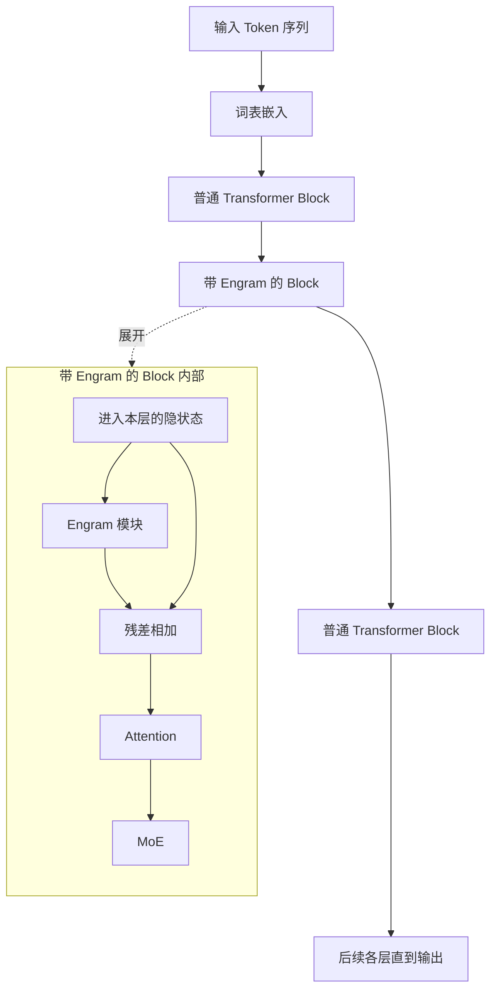
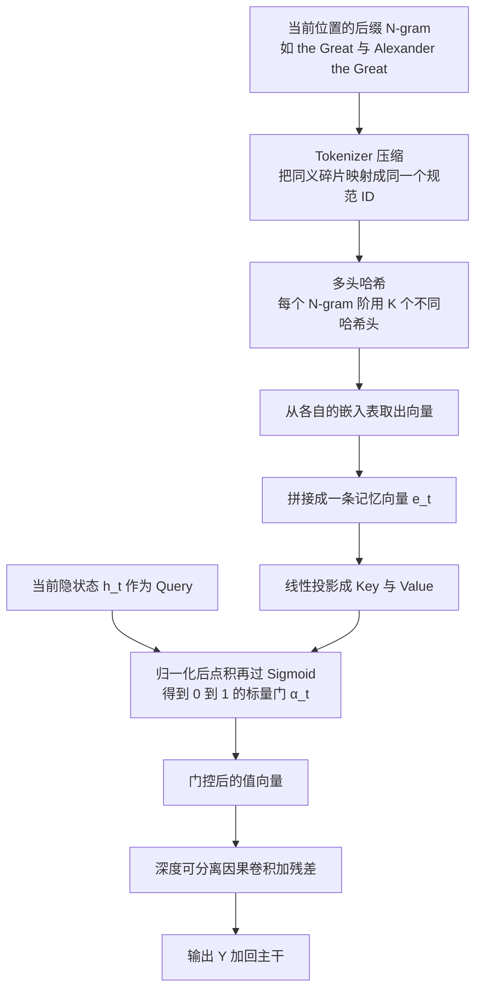
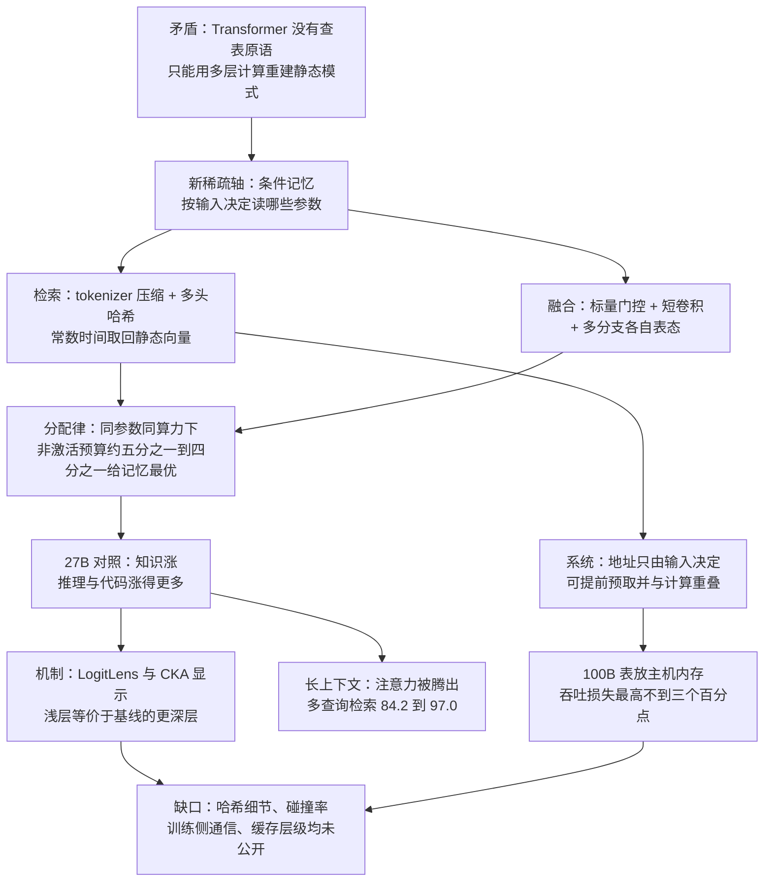

# Engram：给 Transformer 补上一条它一直没有的查表指令

<!-- release-date: 2026-01-12 -->

> 本文依据本地原件 `papers/DeepSeek/Engram.pdf`，即 **Conditional Memory via Scalable Lookup: A New Axis of Sparsity for Large Language Models**，arXiv:2601.07372v1，2026-01-12 提交，共 33 页（正文与参考文献 30 页，附录 3 页）。封面署名两家机构：北京大学与 DeepSeek-AI，末位作者 Wenfeng Liang（PDF p.1）。**动笔前已核对 arXiv 官方页**：该论文现有 v1（2026-01-12）与 v2（2026-07-12）两个版本，**本地原件是 v1，不是最新修订版**；本次按约定不替换原件，全文一律依据 v1，两版差异写在文末「资料与阅读边界」。页码均指 PDF 自身页码。本文会把三件事分开写：**论文明确写了什么**、**我们如何理解它**（凡属推算、换算或从图上读数，都会写明）、**外部资料补充**（会给出链接并标注）。

## 阅读前先认几个词

这篇论文的核心思想其实很朴素，但它借了不少来自搜索引擎、数据库和上古语言模型的词。先把关键概念翻成人话，后面正文就不必反复解释。

- **Token（词元）**：模型读写文本时的最小单位。一句英文会被切成十几个 Token，「Bucephalus」这种生僻词可能被切成三四个。
- **Embedding（嵌入向量）**：一张巨大的查找表。给一个整数编号，返回一条固定长度的向量。词表嵌入就是最常见的例子。
- **N-gram（N 元组）**：连续 N 个 Token 组成的小片段。「Alexander the Great」就是一个 3-gram。上世纪的统计语言模型基本都建立在数 N-gram 频次上。
- **MoE（Mixture-of-Experts，混合专家）**：把一层前馈网络拆成很多份「专家」，每个 Token 只激活其中几份。它让总参数量远大于每个 Token 实际算过的参数量。
- **Conditional computation（条件计算）**：上面这种「按输入决定算哪一部分」的稀疏方式。MoE 是它今天最主流的实现。
- **Conditional memory（条件记忆）**：这篇论文提出的名字，指「按输入决定读哪一部分」。它不多算，只多存。
- **常数时间查表**（$O(1)$ lookup）：不管表有多大，取一条记录的代价都一样。哈希表就是典型。
- **Hash collision（哈希碰撞）**：两个不同的东西被映射到同一个格子上，于是共用了同一条向量。
- **Gating（门控）**：一个 0 到 1 之间的开关值，决定某条信息以多大比例汇入主干。
- **HBM（High Bandwidth Memory，高带宽显存）**：GPU 上又快又贵又少的那块内存。它是所有「参数放不下」问题的根源。
- **Host memory / DRAM（主机内存）**：插在主板上的普通内存，容量大得多，但要经过 PCIe 总线才能送进 GPU。
- **Prefetch（预取）**：在真正需要一份数据之前就提前把它搬过来，让搬运时间藏在别的计算背后。

这篇论文自己造的名字只有一个：

- **Engram**：一个可以插进 Transformer 中间某几层的模块。它按当前位置的后缀 N-gram 做哈希查表，取出一条静态向量，再由当前隐状态决定这条向量以多大比例汇入残差流。「engram」在神经科学里指记忆在大脑中留下的物理痕迹。

本站的 [DeepSeek-V4 解读](/reports/DeepSeek/DeepSeek-V4) 依据 V4 自己那份报告，而那份报告的架构部分并没有出现 Engram，所以本篇是 Engram 这项技术在本站的唯一出处。文中会几次用到 mHC 与 DeepSeekMoE 的骨干细节，那两块分别看 [mHC 解读](/reports/DeepSeek/mHC) 与 [DeepSeek-V3 解读](/reports/DeepSeek/DeepSeek-V3)，本文不重复展开。

## 一句话先说清

Engram 想说的事，可以压缩成一句反问：

> 一个模型要认出「Diana, Princess of Wales」这个人，凭什么要花掉六层注意力和前馈网络？

论文在 §6.1 引用了一份别人做过的可解释性实验，把这个过程逐层摊开（PDF p.14，Table 3，原始来源是 Ghandeharioun 等人 2024 年的 PatchScope 工作）：

| 层 | 模型此刻「以为」最后一个 Token 是什么 |
|---|---|
| 1–2 | 英国的一个地区 |
| 3 | 欧洲的一个国家 |
| 4 | 一个女性君主头衔 |
| 5 | 威尔士亲王配偶的头衔 |
| 6 | 戴安娜王妃本人 |

上表是本文对 Table 3「Latent State Translation」一列的中文缩写，原表还有一列作者的人工解释，此处从略。

六层算下来，模型才把三个 Token 拼成一个专名。论文的判断是：这本质上是**在运行时重建一张本来就该是静态的查找表**，把宝贵的顺序深度浪费在了琐碎操作上（PDF p.2）。

于是它提出一条与 MoE 平行的新稀疏轴：

- MoE 做的是 **conditional computation**，按输入稀疏地激活**要算的参数**；
- Engram 做的是 **conditional memory**，按输入稀疏地读取**要取的参数**。

两者不是替代关系。论文用一个「稀疏预算分配」实验证明它们是**互补**的：在总参数和每 Token 计算量都锁死的前提下，把大约 20%–25% 的非激活参数从 MoE 专家挪给 Engram 查找表，验证损失最低；全给 MoE 或者全给 Engram 都更差（PDF p.8）。这条曲线是 U 形的，论文称之为 Sparsity Allocation 问题。

按这条分配律训出来的 Engram-27B，对照一个**同总参数、同激活参数、同数据、同顺序**的 MoE-27B，结果分成两层（PDF p.9）：

- 知识类涨了，这是预期之中：MMLU 57.4 → 60.4，CMMLU 57.9 → 61.9；
- **推理与代码涨得更多**，这是预期之外：BBH 50.9 → 55.9，ARC-Challenge 70.1 → 73.8，DROP 55.7 → 59.0，HumanEval 37.8 → 40.8，MATH 28.3 → 30.7。

论文对这个「意外」给出的解释是全文最有价值的部分：查表把浅层从静态重建里解放出来，等价于**加深了模型**；同时把局部依赖从注意力身上卸下来，注意力就能腾出容量去管全局。第二条在长上下文评测上兑现得很明显——RULER 的 Multi-Query NIAH 从 84.2 涨到 97.0（PDF p.11）。

最后还有一条纯系统层面的收益：Engram 的查表地址**只由输入 Token 序列决定**，和隐状态无关，因此在真正执行到那一层之前就能算出来。这让它可以被预取。论文把一张 100B 参数的表整个放在主机内存里跑推理，吞吐损失最高只有 2.8%（PDF p.17）。

几组贯穿全文的数字先放在这里，后面每一处都会回到出处：

| 项目 | 取值 | 出处 |
|---|---|---|
| 最大的对照模型 | Engram-27B，26.7B 总参 / 3.8B 激活 / 262B token | PDF p.9 |
| 其中记忆占多少 | 5.7B；Engram-40B 是 18.5B | PDF p.9 |
| 换来它的代价 | 路由专家从 72 个减到 55 个 | PDF p.9 |
| N-gram 阶与哈希头 | 只用 2-gram 与 3-gram，每阶 8 个哈希头 | PDF p.10 |
| 插在哪几层 | 30 层骨干的第 2 层与第 15 层 | PDF p.10 |
| 最优分配比 | 非激活参数预算的 20% 到 25% 给记忆 | PDF p.8 |
| 最大的系统实验 | 100B 参数的表整个放主机内存，吞吐损失不超过 2.8% | PDF p.17、p.18 |

阅读路线：想先弄清**它是什么**，读到「融合阶段之三」为止就够了；想弄清**为什么这样分配**，看「稀疏预算怎么分」；想弄清**为什么会有意料之外的收益**，看「两把机制分析的尺子」与「长上下文」两节；只关心**能不能落地**，直接跳到「系统这一侧」和「可以带走的几条」。

## 两种稀疏：一个省算力，一个省不了但也不花

先把两条轴摆在一起看，后面所有设计都是从这张对照里长出来的。

| | MoE（条件计算） | Engram（条件记忆） |
|---|---|---|
| 稀疏的对象 | 要计算的参数 | 要读取的参数 |
| 谁决定选哪个 | 隐状态经过路由器打分 | 输入 Token 的后缀 N-gram 经哈希 |
| 决定时刻 | 必须等到那一层算出来 | 拿到输入序列就知道 |
| 每 Token 增加的计算 | top-$k$ 个专家的完整前馈 | 几次查表加一次小矩阵乘 |
| 扩容的代价 | 参数必须驻留在能参与计算的位置 | 参数可以离开 GPU |
| 擅长的事 | 动态的、依赖上下文的组合推理 | 静态的、局部的、模式化的片段 |

这张表是本文对论文 §1、§2.5 与 §3 的归纳（PDF p.2、p.6、p.7），不是论文里的某一张表。

第三行是全文的枢纽。MoE 的路由必须等隐状态，所以它的通信永远只能在计算的关键路径上；Engram 的地址不等任何人，所以它的通信可以整个藏起来。论文把这一点提到「infrastructure-aware efficiency」的高度，说它是一等设计原则（PDF p.2）。

第五行是全文的野心。既然参数不必参与计算，它就不必待在 HBM 里。论文在 §2.5 明确说，这条性质让 Engram「绕开了 GPU 显存约束」（PDF p.6）。

### 先划清三条容易混淆的边界

「记忆」这个词很容易让人联想到别的东西。三条辨析放在前面，可以省掉后面一半的误解。**这一节是本文为读者加的对照，论文没有逐条这样写。**

**它不是 RAG。** 检索增强生成从模型外部拿回一段文本，塞进上下文，让注意力去读它。Engram 拿回来的是**参数**——一条在预训练里学出来的向量，直接加进残差流；它不占上下文长度，也不需要一个独立的检索器或索引服务。论文在相关工作里把 REALM、RETRO、PlugLM 这类做法归为非参数化记忆，并明确把 Engram 放在参数化那一侧（PDF p.20）。

**它不是 KV Cache。** KV Cache 缓存的是**这一次请求**算过的中间结果，请求结束就丢掉，而且它随上下文长度线性增长。Engram 的表是模型权重的一部分，所有请求共用，大小与上下文长度完全无关。两者唯一的相似之处，是都可以被放到 HBM 之外。

**它不是「把词表做大」。** 词表嵌入按**单个** Token 索引；Engram 按**连续两到三个** Token 的组合索引。这个差别才是它能记住「Alexander the Great 是一个整体」的原因。论文也特意说明，Engram 完全不动原有的输入嵌入和输出头（PDF p.3）。相关工作里的 Per-Layer Embeddings 与 DeepEmbed 扩的是前者，Engram 扩的是后者（PDF p.19）。

还有一条最容易被忽略的：**Engram 存的不是事实，是模式。** 它的键是表面形式上的 N-gram，不是语义。所以它记住的是「这几个 Token 经常连在一起出现，并且连在一起的时候该往某个方向推一把」，而不是一条可以被查询、被核对的知识条目。这也是为什么它不像 ROME、MEMIT 那样支持定点编辑——论文提到了那条模型编辑的研究线，但从没说 Engram 可编辑（PDF p.20）。

## 全景：一次 Engram 前向到底发生了什么

先看整体位置。Engram 不是替换某一层，而是**插在选定几层的最前面**，输出以残差方式加回主干，然后才走原本的注意力和 MoE（PDF p.4）。词表嵌入和输出端的 un-embedding 完全不动（PDF p.3，Figure 1 图注）。

这张图根据论文 Figure 1 与 Figure 2 重画（PDF p.3、p.5），画的是**机制顺序**，不代表各部分的耗时比例。图中「带 Engram 的 Block」在 27B 实验里出现两次，位置是第 2 层和第 15 层（PDF p.10）。

再看模块内部。论文把它拆成**检索**与**融合**两个阶段（PDF p.3）：

这张图根据论文 §2.2、§2.3 与 Figure 1 右侧重画（PDF p.3、p.4），是机制示意，不含任何实测数据。

### 拿一个句子走一遍

论文 Figure 1 用的例句是「Only Alexander the Great could tame the horse Bucephalus.」（PDF p.3）。**下面这一遍是本文按论文 §2.2 与 §2.3 的文字描述推演的流程，论文没有给出逐步的中间量。**

假设当前位置 $t$ 正好落在 `Great` 这个 Token 上。

1. **取后缀。** 往前数两个和三个 Token，得到两个键：`the Great` 是 2-gram，`Alexander the Great` 是 3-gram。注意它不看后面的 `could`——键永远只用左边的上下文，所以这个机制天然是因果的，训练时不需要额外的掩码。
2. **压缩。** 每个 Token ID 先过一遍规范化映射 $\mathcal{P}$。带前导空格的 `the` 和句首大写的 `The` 会折叠到同一个规范 ID 上，于是两种写法查到同一格，训练信号不被劈开。
3. **哈希。** 2-gram 那个键交给 8 个哈希头，得到 8 个下标；3-gram 那个键交给另外 8 个哈希头，再得到 8 个下标。一共 16 次查表，每次都是 $O(1)$，与表有多大无关。
4. **拼接。** 16 条片段拼成一条 1280 维的记忆向量 $\mathbf{e}_t$（PDF p.10）。这条向量此刻还是纯静态的——它只与这两个键有关，与这句话到底在讲什么无关。
5. **盘问。** 把当前隐状态 $\mathbf{h}_t$ 当 Query，把 $\mathbf{e}_t$ 投影成 Key 与 Value，算出一个标量门 $\alpha_t$。如果这句话确实在讲那位马其顿国王，门就打开；如果 `the Great` 在这里其实属于别的短语，或者这一格被哈希碰撞污染了，门就趋近于零。
6. **汇入。** 门控后的值过一段核长为 4 的因果卷积，加残差，最后整个加回主干，再走本层原本的注意力和 MoE。

对照论文 §6.5 的门控热力图：在这个例句上，激活最强的位置正是 `Great`（PDF p.19，Figure 7）。这与第 1 步用**后缀**的设定完全对上——门是在一个固定搭配**说完**的那一刻打开，而不是在它开始的时候。

**一个自然会冒出来的问题。** 既然 3-gram 已经覆盖了 `Alexander the Great`，为什么还要留着 2-gram？因为绝大多数位置并不处在一个三词固定搭配的末尾，2-gram 能覆盖的模式频次高得多。消融从反面印证了这个方向：在固定 1.6B 预算下把容量分一部分给 4-gram，验证损失反而略差，论文的推测是它稀释了更高频的 2/3-gram 模式所需的容量（PDF p.16）。

下面按这条链路逐段拆。

## 检索阶段之一：先把 tokenizer 的同义碎片合并

**旧问题。** 现代 subword tokenizer 的设计目标是**无损还原**，不是语义紧凑。于是 `Apple`、`apple`、`␣apple` 会拿到三个完全不同的整数 ID（PDF p.3）。对一个靠精确匹配来查表的机制来说，这是灾难：同一个词的三种写法会落到三个互不相干的格子里，每个格子只分到三分之一的训练信号。

**新设计。** 论文在查表之前加一层**词表投影**。它预先算好一个满射函数 $\mathcal{P}: V \to V'$，把原始 Token ID 折叠成规范 ID，依据是文本归一化后的等价性——具体做法是 NFKC 归一化加小写化等（PDF p.4）。

$$
x_t' = \mathcal{P}(x_t), \qquad g_{t,n} = (x_{t-n+1}', \ldots, x_t')
$$

这里 $x_t$ 是位置 $t$ 的原始 Token ID，$x_t'$ 是它的规范 ID，$g_{t,n}$ 是以位置 $t$ 结尾、长度为 $n$ 的**后缀 N-gram**。注意「后缀」两个字：Engram 永远只看当前位置往前数 $n$ 个，不看未来，所以它天然是因果的。

**效果。** 对论文使用的 128k tokenizer，有效词表规模下降 23%（PDF p.4）；附录 C 给出更精确的 23.43%（PDF p.33）。附录还列了合并最多的五组（PDF p.33，Table 6）：

| 排名 | 合并进来的原始 Token 数 | 规范 Token |
|---|---|---|
| 1 | 163 | 空格 |
| 2 | 54 | `a` |
| 3 | 40 | `o` |
| 4 | 35 | `e` |
| 5 | 30 | `i` |

163 种不同的空白字符全部折叠成一个，这一条就说明了问题：原始词表里有大量纯排版性质的区分，对「这是不是一个固定搭配」毫无帮助，却会把哈希空间切得粉碎。

**代价与边界。** 这一步是**不可逆的信息丢失**。`Apple` 和 `apple` 在 Engram 眼里变成同一个东西，大小写敏感的区分只能靠主干去恢复。论文没有讨论这个损失，也没有给出「压缩多少最好」的消融；它只做了「有 / 无」的对照，而去掉这一步是三个最伤性能的消融之一（PDF p.16）。

**可迁移启发。** 任何需要精确匹配的键，都值得先过一道归一化。这条在检索系统里是常识，但在模型内部很少有人做——因为大多数模块吃的是向量，不是 ID。一旦你在模型里引入了「按 ID 精确查表」的环节，tokenizer 的设计目标就和你的目标冲突了，必须显式补一层。

## 检索阶段之二：多头哈希，以及碰撞怎么办

**旧问题。** 所有可能的 3-gram 有多少种？按 128k 词表算是 $128000^3 \approx 2 \times 10^{15}$。直接给每一种分配一条向量是不可能的（PDF p.4 用的词是 intractable）。

**新设计。** 用哈希。对每个 N-gram 阶 $n$，准备 $K$ 个不同的哈希头；第 $k$ 个头把压缩后的上下文映射到一张嵌入表 $\mathbf{E}_{n,k}$ 的某一行：

$$
z_{t,n,k} \triangleq \varphi_{n,k}(g_{t,n}), \qquad \mathbf{e}_{t,n,k} = \mathbf{E}_{n,k}[z_{t,n,k}]
$$

其中 $\varphi_{n,k}$ 是确定性哈希函数，论文说实现上是一个轻量的**乘法加异或**哈希；每张表的大小 $M_{n,k}$ 取**质数**（PDF p.4）。质数是哈希表里减少周期性冲突的经典做法。

最终的记忆向量，是把所有取出来的片段首尾拼成一条长向量。论文原式写成一个双重拼接算子（PDF p.4），拆开看就是：

$$
\mathbf{e}_t \triangleq \big[\;\mathbf{e}_{t,2,1} \;\Vert\; \mathbf{e}_{t,2,2} \;\Vert\; \cdots \;\Vert\; \mathbf{e}_{t,N,K}\;\big] \in \mathbb{R}^{d_{\text{mem}}}
$$

$\Vert$ 表示拼接，外层下标跑遍 $n = 2, \ldots, N$，内层跑遍 $k = 1, \ldots, K$，一共 $(N-1)K$ 条片段。实验里 $N$ 取到 3（即只用 2-gram 和 3-gram），$K = 8$，所以每个位置一共查 $2 \times 8 = 16$ 次表；拼接后的总维度 $d_{\text{mem}} = 1280$（PDF p.10、p.31）。

**为什么是多头。** 单个哈希函数一定会碰撞，碰撞意味着两个毫不相干的短语共用同一条向量，模型没有任何办法把它们分开。用 $K$ 个独立哈希头就不一样了：两个短语要想彻底纠缠在一起，必须在**所有** $K$ 个头上同时撞到同一格，而这个概率随 $K$ 快速衰减。更重要的是，即使某一个头撞了，拼接出来的长向量里还有另外 $K-1$ 段是干净的，后面的门控和投影仍有机会把信号救回来。**换句话说，多头把「要么完全区分、要么完全混淆」的二元事故，变成了一个可以被下游模块容忍的渐变。** 这是 hash embedding 的标准思路，论文明确引了 Tito Svenstrup 等人 2017 年的工作（PDF p.4）。

这里还藏着一个和门控的配合：门控之所以有存在的必要，一部分原因正是哈希碰撞——论文在 §2.3 把「哈希碰撞或一词多义带来的噪声」明确列为门控要解决的问题（PDF p.4）。所以多头哈希和上下文感知门控是同一个问题的两道防线，一道降低碰撞概率，一道在碰撞真的发生时把它挡在主干之外。

**没有公开的部分。** 哈希函数的具体常数、每张表的实际 $M_{n,k}$、实测碰撞率，论文都没有给。$K = 8$ 这个取值也没有消融。**这是本文能确认的一处缺口**，不是论文没写清楚，而是它确实没有做。

**规模换算。** 附录 A 给出 Engram-27B 的「Engram Vocab Size」是 2262400，「Engram Dim」是 1280，Engram 层在第 2 和第 15 层（PDF p.31）。**本文的换算是**：$2262400 \times 1280 \times 2 \approx 5.79 \times 10^9$，与正文说的 5.7B 记忆参数吻合；Engram-40B 的 $7239680 \times 1280 \times 2 \approx 1.85 \times 10^{10}$，与 18.5B 吻合（PDF p.9）。所以那一行「Vocab Size」应当理解为**单个 Engram 模块里所有哈希表的总槽位数**，每个槽位存 $d_{\text{mem}}$ 宽的向量。这个口径论文没有明说，是本文从数字对上的。

## 融合阶段之一：让静态记忆先接受一次盘问

**旧问题。** 查出来的向量是**上下文无关的先验**。它只知道「Alexander the Great」这三个 Token 长什么样，不知道当前这句话里它是不是真的指那位国王。再加上哈希碰撞和一词多义，这条向量随时可能是噪声（PDF p.4）。如果直接加进残差流，坏的时候会污染主干。

**新设计。** 论文借了注意力的形状，但只留一个标量。当前隐状态 $\mathbf{h}_t$ 当 Query，取出来的记忆 $\mathbf{e}_t$ 同时当 Key 和 Value 的来源：

$$
\mathbf{k}_t = \mathbf{W}_K \mathbf{e}_t, \qquad \mathbf{v}_t = \mathbf{W}_V \mathbf{e}_t
$$

然后对 Query 和 Key 各做一次 RMSNorm 再点积，除以 $\sqrt{d}$，过 Sigmoid，得到一个落在 $(0,1)$ 的标量门：

$$
\alpha_t = \sigma\left(\frac{\mathrm{RMSNorm}(\mathbf{h}_t)^{\top}\,\mathrm{RMSNorm}(\mathbf{k}_t)}{\sqrt{d}}\right)
$$

门控后的值就是 $\tilde{\mathbf{v}}_t = \alpha_t \cdot \mathbf{v}_t$（PDF p.4）。

**这一步在做什么。** 两个向量都归一化之后再点积，量级就被压住了，剩下的基本是方向上的一致程度。**论文的说法是**：如果取出来的记忆和当前语境矛盾，$\alpha_t$ 会趋近于零，噪声被抑制（PDF p.4）。所以这个门不是「记忆有多重要」，而是「记忆和我现在说的是不是一回事」。RMSNorm 的作用论文归为梯度稳定性（PDF p.4）。

**证据。** §6.5 把 Engram-27B 的 $\alpha_t$ 画成热力图（PDF p.19，Figure 7）。激活最强的位置是多 Token 专名和固定搭配的**收尾处**：英文里是「Alexander the Great」「the Milky Way」「By the way」「Princess of Wales」，中文里是「四大发明」和「张仲景」（PDF p.18）。这与 Engram 用**后缀** N-gram 的设定完全一致——门在一个短语说完的那一刻打开。

这里有个细节值得记住：因为骨干用了 4 分支的 mHC，而 Engram 插在两层上，所以**每个 Token 其实有 8 个门控标量**；论文承认「不是每个分支都有可解释的激活模式」，图里展示的是与语义匹配相关性最强的那一个（PDF p.18，脚注 2）。这是作者自己标注的观察边界，不是被量化过的结论。

**代价。** 门是标量，不是逐维的。整条记忆向量要么大部分进来，要么大部分被挡掉，没有「只取其中一半维度」的余地。论文没有讨论这个取舍，也没有做「标量门 vs 向量门」的对照。

**可迁移启发。** 当你往一个模型里注入外部的、可能不可靠的信息时，与其在损失函数上加约束，不如让**模型自己判断这条信息可不可信**，并且把判断做成一个便宜的、可视化的标量。它既是性能手段，也是调试手段——上面那张热力图之所以能画出来，正是因为门是标量。

## 融合阶段之二：一段很短的因果卷积

门控之后还有一步。论文加了一段**深度可分离因果卷积**，核大小 $w = 4$，dilation $\delta$ 设成最大 N-gram 阶，激活用 SiLU（PDF p.4）：

$$
\mathbf{Y} = \mathrm{SiLU}\big(\mathrm{Conv1D}(\mathrm{RMSNorm}(\tilde{\mathbf{V}}))\big) + \tilde{\mathbf{V}}
$$

$\tilde{\mathbf{V}}$ 是整条序列的门控后值向量。论文给的理由是**扩大感受野、增加非线性**（PDF p.4）。dilation 设成最大 N-gram 阶，直觉上是让相邻几次查表覆盖的窗口不要过度重叠。

然后以残差方式加回主干：$\mathbf{H}^{(\ell)} \leftarrow \mathbf{H}^{(\ell)} + \mathbf{Y}$，之后才是本层原本的注意力和 MoE（PDF p.4）。

**这一步值多少。** 消融显示，去掉这段卷积只带来**边际**退化，是五个消融里最不痛的一个（PDF p.16）。**本文从 Figure 5 读到**，「w/o short conv」这个点几乎贴在参考配置的水平虚线上（PDF p.15）。论文自己也用了「marginally」这个词。

**本文的判断**：这是一个诚实的负面结果，论文没有藏。它同时说明，Engram 的收益主要来自「查得到」和「敢不敢用」，而不是来自查完之后的后处理。

## 融合阶段之三：装进多分支残差流

**背景。** 论文的默认骨干不是标准的单条残差流，而是把残差流扩成 $M$ 条并行分支的多分支结构，分支之间由可学习的连接权重调制。实验里用的是 **mHC**（Manifold-Constrained Hyper-Connections，流形约束超连接），$M = 4$（PDF p.5）。mHC 本身是 DeepSeek 另一篇工作（arXiv:2512.24880，见 PDF p.30 参考文献），本站有专篇 [mHC 解读](/reports/DeepSeek/mHC)，[DeepSeek-V4 解读](/reports/DeepSeek/DeepSeek-V4) 的核心设计二也讲过一轮。读这一节只需要记住一件事：残差流不止一条，而是 $M$ 条并排。

**问题。** Engram 本身与拓扑无关，但要接到 4 条分支上，就有个选择：每条分支各配一整套记忆表和投影，还是共用？各配一套太贵，共用又会让 4 条分支收到完全相同的注入，浪费了多分支的表达力。

**新设计。** 论文的折中是**共享表和 Value，分叉 Key**：一张稀疏嵌入表和一个 $\mathbf{W}_V$ 被所有 $M$ 条分支共用，但每条分支有自己的 $\mathbf{W}_K^{(m)}$，于是每条分支算出自己的门（PDF p.5）：

$$
\alpha_t^{(m)} = \sigma\left(\frac{\mathrm{RMSNorm}(\mathbf{h}_t^{(m)})^{\top}\,\mathrm{RMSNorm}(\mathbf{W}_K^{(m)}\mathbf{e}_t)}{\sqrt{d}}\right)
$$

$$
\mathbf{u}_t^{(m)} = \alpha_t^{(m)} \cdot (\mathbf{W}_V \mathbf{e}_t)
$$

也就是说，**同一条记忆被四条分支以四个不同的比例吸收**。内容是一份，判断是四份。

**顺带的系统收益。** 因为 $\mathbf{W}_V$ 和 $M$ 个 $\mathbf{W}_K^{(m)}$ 都是作用在同一条 $\mathbf{e}_t$ 上的线性投影，它们可以**拼成一次稠密的 FP8 矩阵乘**，把 GPU 的计算利用率吃满（PDF p.5）。这是一个很典型的「为了对齐硬件而选择的参数共享方式」。

**证据。** 「w/o multi branch」是所有消融里最伤的一个（PDF p.16）。注意这个消融的定义很讲究：它**保留** mHC 骨干，只把分支各自的门换成「在 pre-mapping 之后的隐状态上做一次统一注入」（PDF p.16）。所以它测的确实是「分支专属门控」的价值，不是「有没有多分支」的价值。

**可迁移启发。** 「内容共享、判断分叉」是一个便宜到不像话的表达力放大器。当你有一份要被多个消费者使用的公共资源时，先别急着复制它；试试只复制那个决定「用多少」的小头。参数增加量近似为零，但每个消费者都有了自己的态度。

## 稀疏预算怎么分：一条 U 形曲线

现在两条稀疏轴都在了，真正的问题是**怎么分钱**。

**形式化。** 论文定义三个量（PDF p.7）：

- $P_{\text{tot}}$：总可训练参数，不含词表嵌入与输出头；
- $P_{\text{act}}$：每个 Token 实际激活的参数，它决定训练的 FLOPs；
- $P_{\text{sparse}} \triangleq P_{\text{tot}} - P_{\text{act}}$：非激活参数，也就是「可以白拿的容量」。

分配比 $\rho \in [0,1]$ 指非激活预算里分给 MoE 专家的比例：

$$
P_{\text{MoE}}^{(\text{sparse})} = \rho\, P_{\text{sparse}}, \qquad P_{\text{Engram}} = (1 - \rho)\, P_{\text{sparse}}
$$

$\rho = 1$ 就是纯 MoE。$\rho < 1$ 意味着砍掉一些路由专家，把省下的参数变成 Engram 的槽位（PDF p.7）。

这个设定的关键在于它**同时锁死了总参数和每 Token 计算量**。MoE 减专家会掉 $P_{\text{tot}}$，Engram 加槽位会补回 $P_{\text{tot}}$ 而不动 $P_{\text{act}}$——因为每个 Token 只查固定条数的槽位，表再大也不多算（PDF p.7）。所以这是一个真正的 iso-parameter、iso-FLOPs 对照，不是「加了东西所以变好」。

**实验设置。** 两档算力，保持稀疏度 $P_{\text{tot}}/P_{\text{act}} \approx 10$（PDF p.7）：

| 算力预算 | $P_{\text{tot}}$ | $P_{\text{act}}$ | $\rho = 1$ 时的专家数 |
|---|---|---|---|
| $2 \times 10^{20}$ FLOPs | ≈ 5.7B | 568M | 106 |
| $6 \times 10^{20}$ FLOPs | ≈ 9.9B | 993M | 99 |

**结果。** 两档都是 U 形（PDF p.8，Figure 3 左）：

- 把 MoE 砍到只剩 $\rho \approx 40\%$——5.7B 模型只剩 46 个专家，9.9B 模型只剩 43 个——性能仍与纯 MoE 相当（PDF p.8）；
- 纯 MoE 不是最优。最好的位置在把 20%–25% 的稀疏预算给 Engram 处（PDF p.8）；
- 10B 档的具体数字：验证损失从 $\rho = 100\%$ 的 1.7248 降到 $\rho \approx 80\%$ 附近的 1.7109，$\Delta = 0.0139$（PDF p.8）；
- 两档的最优位置都在 $\rho \approx 75\%$–$80\%$，论文认为这说明分配偏好在所考察的尺度上是稳的（PDF p.8）。

U 形的两端各自失败，原因不同，论文写得很清楚（PDF p.8）：

- $\rho \to 100\%$：没有专门的静态记忆，只能靠深度和计算把模式重建出来，回到最初那个浪费；
- $\rho \to 0\%$：失去条件计算能力，依赖上下文的动态推理做不了。**记忆替代不了计算。**

**这里有个细节值得说破。** **本文从 Figure 3 左侧读到**，两档曲线上真正最低的**散点**都落在 $\rho \approx 85\%$，而不是 80%；论文取的是拟合曲线的最低位置（PDF p.6，Figure 3）。这个差别不影响结论方向，但它提醒读者：「$\rho \approx 75\%$–$80\%$」是一条**拟合出来的**建议值，不是被逐点验证过的最优点。论文也没有给这些点的随机种子重复。

**可迁移启发。** 当你手上有两种都能「加参数不加算力」的机制时，别只问哪个更好，要问**在锁死预算的前提下怎么分**。这类问题的答案通常是内点而不是端点，而且只有在严格 iso-FLOPs 的对照里才看得见——加一个模块然后说变好了，几乎什么都没证明。

## 把记忆当成一个可以单独拧的旋钮

上一节是固定预算下的切分，这一节问的是另一半：**如果不限制记忆预算，单独把表做大会怎样？**

**设置。** 固定一个 $P_{\text{tot}} \approx 3\text{B}$、$P_{\text{act}} = 568\text{M}$ 的 MoE 骨干，训练 100B token 以保证收敛；在它上面挂一张 Engram 表，把槽位数 $M$ 从 $2.58 \times 10^5$ 扫到 $1.0 \times 10^7$，最多加上约 13B 参数（PDF p.8）。

**对照。** OverEncoding，它的做法是把 N-gram 嵌入**平均**进词表嵌入（PDF p.8）。论文特意说明为什么不比 SCONE：SCONE 面向推理，带一个额外的 f-gram 模型和额外的训练 FLOPs，不满足严格的同算力约束（PDF p.8）。

**结果。** 验证损失随槽位数呈**对数线性**下降，在考察范围内是一条严格的幂律（PDF p.8，Figure 3 右）。两条线都在降，但 Engram 从同样的记忆预算里榨出的收益明显更大（PDF p.8）。

**这条结论的分量。** 它说明 Engram 提供了一个**可预测的扩容旋钮**：表越大，损失越低，而且不用多花一分算力。这正是「参数可以离开 GPU」那条性质的价值所在——如果扩容的边际收益是可预测的，而扩容的代价只是主机内存，那这条轴就可以一直拧下去。

**边界。** 这条幂律只在 3B 骨干、100B token、$10^7$ 槽位以内被验证过。论文没有说它在 27B 骨干或更大的表上还成立；Engram-40B 在部分任务上没有超过 Engram-27B，论文归因于训练不足（PDF p.11），这本身就说明大表需要更多 token 才能填满。

## 插一段：这篇论文一共用了五种骨干

读到这里很容易开始混淆，因为每一节的模型都不一样。把它们摊开对照一次，后面读结论会清楚很多。**这张表是本文从各节实验设置里汇总的，论文没有提供这样一张总表。**

| 用在哪一节 | 骨干规模 | 训练量 | 支撑的结论 | 出处 |
|---|---|---|---|---|
| 分配律，低算力档 | 5.7B 总参 / 568M 激活 | $2 \times 10^{20}$ FLOPs | U 形曲线，最优 $\rho$ 约 75% 到 80% | PDF p.7 |
| 分配律，高算力档 | 9.9B 总参 / 993M 激活 | $6 \times 10^{20}$ FLOPs | 同上，且最优位置跨档稳定 | PDF p.7 |
| 无限记忆扫描 | 3B 总参 / 568M 激活 | 100B token | 槽位数与损失的对数线性关系 | PDF p.8 |
| 结构消融与层扫描 | 12 层 3B MoE / 0.56B 激活 | 100B token | 三个关键部件；最佳插入位置 | PDF p.15 |
| 主实验与长上下文 | 26.7B 与 39.5B / 3.8B 激活 | 262B token | 全部下游指标、机制分析、RULER | PDF p.9、p.11 |
| 吞吐实测 | Dense-4B 与 Dense-8B | 不适用，只测推理 | offload 100B 表的开销 | PDF p.17 |

**这张表本身就是一条判断。** 论文最大的规模只有 26.7B 总参、3.8B 激活、262B token——按 2026 年的标准这是一个中等规模的验证，不是前沿模型规模。分配律那条 U 形曲线更是只在 5.7B 与 9.9B 两档上扫过。所以「最优 $\rho$ 约 75% 到 80%」这个结论，**没有在 27B 上被重新验证**；27B 实验用的 $\rho = 74.3\%$ 是直接沿用小规模结论的（PDF p.10）。这不是错误，论文自己也只说「在所考察的尺度上稳定」（PDF p.8），但引用这个数字时应该带上这条限制。

另一件事同样值得记住：**吞吐那一行的骨干和其它所有行都不一样。** 后面会专门讲。

## 27B 对照实验：收益出现在意料之外的地方

**四个模型，四条严格对齐的线**（PDF p.9、p.10）：

| | Dense-4B | MoE-27B | Engram-27B | Engram-40B |
|---|---|---|---|---|
| 总参数 | 4.1B | 26.7B | 26.7B | 39.5B |
| 激活参数 | 3.8B | 3.8B | 3.8B | 3.8B |
| 训练 Token | 262B | 262B | 262B | 262B |
| 专家（共享 + 路由，top-$k$） | — | 2 + 72（top-6） | 2 + 55（top-6） | 2 + 55（top-6） |
| Engram 参数 | — | — | 5.7B | 18.5B |

骨干配置在四者之间完全一致：30 层，hidden 2560，注意力用 MLA（32 头），FFN 经 mHC 连接、扩展率 4，优化器 Muon，序列长度 4096，批大小 1280，训练 50000 步，基础学习率 4e-4，负载均衡用无辅助损失方案（PDF p.10、p.31）。MLA 的出处见 [DeepSeek-V2 解读](/reports/DeepSeek/DeepSeek-V2)，DeepSeekMoE 与无辅助损失均衡见 [DeepSeek-V3 解读](/reports/DeepSeek/DeepSeek-V3)。

Engram 自己的配置（PDF p.10、p.31）：插在第 2 和第 15 层，N-gram 取 $\{2,3\}$，8 个哈希头，$d_{\text{mem}} = 1280$，$\rho = 74.3\%$；**嵌入参数单独用 Adam，学习率放大 5 倍，权重衰减设为 0；卷积参数零初始化**，以便训练一开始严格保持恒等映射。

那三个优化细节值得停一下。嵌入表是**极度稀疏更新**的——一个槽位可能几万步才被碰一次，用主干的学习率根本训不动，所以放大 5 倍；权重衰减对稀疏表是纯粹的伤害，因为没被访问的行会被无差别地衰减向零，所以关掉；卷积零初始化保证模块在第 0 步等于什么都不做，不会一上来就扰动一个已经调好的骨干。**这三条是本文的解读**，论文只陈述了做法，没有给理由。

**先看最外层的那一级台阶。** Dense-4B 与另外三个模型的激活参数完全相同，也就是每 Token 的计算量相同；差别只在于「有没有那些不参与计算的参数」。三个稀疏变体在**所有**基准上都显著超过 Dense-4B（PDF p.10）。这一级台阶不是这篇论文的贡献，它只是复现了「稀疏架构的 scaling 优于 dense」这条既有结论（PDF p.10），但它的作用是把后面那一级台阶的意义框住：Engram 要证明的不是「多加参数有用」，而是**在同样多的参数里换一种放法**有用。

**主表结果**（全部来自 PDF p.9，Table 1；下面只摘 MoE-27B → Engram-27B 的对照）：

| 类别 | 基准 | MoE-27B | Engram-27B | 变化 |
|---|---|---|---|---|
| 语言建模 | Pile（loss，越低越好） | 1.960 | 1.950 | −0.010 |
| 语言建模 | 验证集（loss，越低越好） | 1.634 | 1.622 | −0.012 |
| 知识 | MMLU | 57.4 | 60.4 | +3.0 |
| 知识 | MMLU-Redux | 60.6 | 64.0 | +3.4 |
| 知识 | MMLU-Pro | 28.3 | 30.1 | +1.8 |
| 知识 | CMMLU | 57.9 | 61.9 | +4.0 |
| 知识 | C-Eval | 58.0 | 62.7 | +4.7 |
| 知识 | CCPM | 79.6 | 87.1 | +7.5 |
| 知识 | TriviaQA（EM） | 48.8 | 50.7 | +1.9 |
| 知识 | PopQA（EM） | 19.2 | 19.4 | +0.2 |
| 推理 | BBH | 50.9 | 55.9 | +5.0 |
| 推理 | ARC-Challenge | 70.1 | 73.8 | +3.7 |
| 推理 | AGIEval | 38.6 | 41.8 | +3.2 |
| 阅读 | DROP（F1） | 55.7 | 59.0 | +3.3 |
| 阅读 | RACE-High | 75.4 | 78.2 | +2.8 |
| 代码 | HumanEval | 37.8 | 40.8 | +3.0 |
| 代码 | MBPP | 46.6 | 48.2 | +1.6 |
| 数学 | GSM8K | 58.4 | 60.6 | +2.2 |
| 数学 | MATH | 28.3 | 30.7 | +2.4 |

**三个必须说清的读法。**

第一，**验证损失只降了 0.012，下游却动辄涨三到五个点**。这两个数字看起来不成比例，但这正是论文想强调的：困惑度上的微小改善，如果发生在「专名与固定搭配」这类高频但低熵的位置上，会释放出被这些位置占用的表达能力，而这部分能力恰好在下游任务上放大。这是本文对论文 §4.2 与 §6.1 的连读理解，论文没有直接把两个数字挂钩。

第二，**涨幅最大的不是最像「知识」的那个**。TriviaQA 只涨 1.9，PopQA 只涨 0.2，而 CCPM（中国古诗匹配）涨了 7.5，BBH 涨了 5.0。如果 Engram 只是一个知识库，顺序应当反过来。论文正是拿这个反常来引出 §6 的机制分析。

第三，**Engram-40B 没有全面压过 Engram-27B**。HumanEval 40.8 → 38.4，MBPP 48.2 → 46.2，MATH 30.7 → 30.6，C3 63.6 → 61.8（PDF p.9）。论文的解释是训练不足，依据是「Engram-40B 与基线的训练损失差距在训练末期仍在扩大」（PDF p.11）。**这是作者的观察与推测，不是被实验证明的结论**——要证明它，需要继续训下去。

**一处需要提醒的不一致。** 摘要写的是「MMLU +3.4」（PDF p.1），而引言（PDF p.2）、§4.2 正文（PDF p.11）和 Table 1（PDF p.9）给的都是 +3.0。**本文的核对是**：+3.4 对应的其实是 MMLU-Redux（60.6 → 64.0）。这多半是摘要串行，不影响任何结论，但引用这篇论文的数字时应以表格为准。

**还有一件论文没做的事。** 全部对照都在 base 模型上完成，没有 SFT 或 RL 之后的结果。Engram 这种「静态模式记忆」在对齐训练后是被强化还是被覆盖，论文没有回答。

### 单点分数不可信，所以还有一张曲线图

主表只是 50k 步那一个时刻的快照，而下游基准在训练末期本来就会抖。论文自己也说，给出完整轨迹正是为了**削弱基准噪声的影响**（PDF p.11）。附录 B 因此画了 28 个基准在最后 10k 步（42k 到 50k）的逐点曲线，MoE-27B 用虚线、Engram-27B 用实线（PDF p.32，Figure 8）。

**本文从这张图上读到的是形状，不是数值**：绝大多数子图里，实线在整段区间上都稳定压着虚线，两条线没有交叉；只有 WinoGrande、PopQA、CruxEval-o 这几个方差本来就大的子图出现纠缠。论文没有给这张图配任何逐项文字。

**这件事为什么值得单独说。** 一个只有 262B token、模型不到 27B 的对照实验，如果只报最后一步的分数，读者完全有理由怀疑是运气。给出末段轨迹，等价于给出「这个差距不是某一步的抖动」的证据。它不能替代多种子重复实验——论文**没有**做多种子——但它是成本最低的一种缓解手段。

## 为什么查表会让推理变好：两把机制分析的尺子

上一节留下一个必须解释的现象。论文用两个可解释性工具去量它。

### 尺子一：LogitLens，看预测「多早定型」

**先说这把尺子本身。** LogitLens 的做法有点粗暴但很有效：Transformer 每一层的输出都和最终层的输出住在同一个残差流里，维度一样，所以可以**跳过后面所有层**，把第 5 层的隐状态直接丢进最终的 LM Head，硬看它此刻会预测出什么词。这样每一层都能得到一个「假如现在就停下来，我会说什么」的分布。

**做法。** 逐层做上面这件事，再算每一层的中间分布与模型**真正的**最终输出分布之间的 KL 散度。这个值衡量的是「这一层的表示离可以拿去预测还有多远」（PDF p.13）。KL 越小，说明这一层已经基本想好了；KL 大，说明后面还有很多工作要做。

**结果。** Engram-27B 和 Engram-40B 的逐层 KL 都系统性低于 MoE-27B，**差距在浅层最明显**，曲线下降得更陡（PDF p.13，Figure 4a；文字见 p.14）。

**解读。** 更早定型，意味着更少的层被花在「把碎片拼成实体」上。论文的措辞是：显式访问外部知识减少了所需的计算步数，让模型更早到达高置信度的有效预测（PDF p.14）。

### 尺子二：CKA，看浅层「相当于别人的第几层」

**做法。** CKA（Centered Kernel Alignment，中心化核对齐）是比较两组表示结构相似度的常用指标：

$$
\mathrm{CKA}(K, L) = \frac{\mathrm{HSIC}(K, L)}{\sqrt{\mathrm{HSIC}(K,K)\,\mathrm{HSIC}(L,L)}}
$$

符号拆开看并不吓人。$X$ 和 $Y$ 是两组表示，每一行是一个样本的隐状态。$K = XX^{\top}$ 就是「$X$ 里任意两个样本之间的内积表」，$L = YY^{\top}$ 同理，这两张表叫 Gram 矩阵，记录的是**样本之间的相对关系**而不是坐标本身。HSIC 是 Hilbert-Schmidt 独立性判据，可以粗略理解成「这两张关系表有多同步」。分母那一项把各自的尺度除掉，于是整个式子落在 0 到 1 之间（PDF p.14）。

**为什么要绕这一圈。** 两个不同模型的第 5 层，隐状态维度可能一样，但每一维代表什么完全不可比，直接算余弦相似度毫无意义。改成比较「样本之间的关系」，就绕开了坐标系不一致的问题：如果 A 模型觉得样本 1 和样本 2 很像、样本 1 和样本 3 不像，B 模型也这么觉得，那两者的表示结构就是相似的。

论文用小批量无偏估计，在 Few-NERD 数据集上取**命名实体最后一个 Token** 的隐状态来算（PDF p.14）。取命名实体这一点很关键——那正是 Engram 应该起作用的地方，换成随机 Token 这个实验就没有针对性了。

有了两两相似度矩阵 $S$ 之后，论文再定义一个**软对齐指标** $a_j$。先取一个中间量：令 $\mathcal{I}_j$ 表示与 Engram 第 $j$ 层最相似的 top-$k$ 个 MoE 层的下标集合，即让 $S_{i,j}$ 最大的那 $k$ 个 $i$。然后对这几层求加权质心：

$$
a_j = \frac{\sum_{i \in \mathcal{I}_j} S_{i,j} \cdot i}{\sum_{i \in \mathcal{I}_j} S_{i,j}}
$$

$k$ 取 5，用来滤掉低相似度噪声（PDF p.15）。$a_j$ 可以读作「Engram 的第 $j$ 层，相当于 MoE 的第几层」。

**结果。** 高相似度的对角线整体**向上偏移**，即在很大一段范围内 $a_j > j$。论文给的具体例子：**Engram-27B 第 5 层的表示，与 MoE 基线大约第 12 层最接近**（PDF p.15）。

**两把尺子合起来说的是同一件事**：Engram 没有增加层数，却让每一层站在了更高的位置上。论文把这叫做「增加了有效深度」（PDF p.15）。

**这条结论的强度。** 两个指标互相印证，且都是在实体 Token 上测的，方向一致。但要注意 CKA 本身的局限：它衡量的是表示结构的相似，不是功能等价；「第 5 层像第 12 层」不等于「第 5 层能做第 12 层能做的所有事」。论文用的词是 functionally equivalent，**本文认为这个措辞略强于证据**。

### 第三条线索：注意力被腾出来了

论文还有一个平行的解释：局部依赖被卸给查表之后，注意力就不必再花容量去处理近邻，可以专心管全局（PDF p.2）。这一条在下一节的长上下文实验里得到最直接的验证。

## 注意力被腾出来之后：长上下文

**实验协议的严谨之处。** 这一节的设计比结果本身更值得学。

论文先做了一个方法论上的观察：长上下文能力**不只由架构决定**，还与基座模型本身的质量强耦合。证据是同一个 Engram-27B 从 41k 步到 50k 步，长上下文成绩单调改善，而长上下文扩展阶段的算力预算是固定的（PDF p.12）。结论是：**要比架构，就必须对齐基座损失，而不是对齐训练步数**（PDF p.12）。

于是它挑了三个 Engram 检查点（PDF p.12）：

- **41k 步**（预训练损失 1.66）：只有基线 82% 的预训练算力，是「吃亏」设定；
- **46k 步**（预训练损失 1.63）：与训满的 MoE-27B **预训练损失相同**，是干净的 iso-loss 设定；
- **50k 步**（预训练损失 1.62）：与基线同算力，是常规的 iso-FLOPs 设定。

三者走**完全相同**的上下文扩展流程：YaRN，32768 上下文，5000 步，30B token 高质量长文本；超参 $s = 10$、$\alpha = 1$、$\beta = 32$、缩放因子 $f = 0.707$（PDF p.11）。扩展策略沿用 DeepSeek-V3 那一套（PDF p.11），细节见 [DeepSeek-V3 解读](/reports/DeepSeek/DeepSeek-V3)。

**两个评测集也值得先解释一句。** RULER 是合成长文本任务集，论文用了 14 个子集，归成 8 类：单针、多键、多值、多查询四种大海捞针，加上多跳变量追踪、常见词提取、高频词提取和问答（PDF p.12）。LongPPL 则不是普通困惑度——论文引用的那篇工作，标题直接就叫「长上下文语言建模的困惑度错在哪里」（PDF p.24 参考文献）；**论文正文没有解释它具体怎么改的**，只给了引用，所以本文也不替它展开。读者只需要知道：这里的 Perplexity 一列不是标准 PPL，跨论文比较这个数字没有意义。

**结果**（PDF p.11，Table 2；LongPPL 越低越好，RULER 越高越好）：

| 模型 | Book | Paper | Code | L-CoT | S | MK | MV | MQ | VT | CWE | FWE | QA |
|---|---|---|---|---|---|---|---|---|---|---|---|---|
| MoE-27B（50k， 1.63） | 4.38 | 2.91 | 2.49 | 14.16 | 100.0 | 88.0 | 92.7 | 84.2 | 77.0 | 4.5 | 73.0 | 34.5 |
| Engram-27B（41k， 1.66） | 4.37 | 2.92 | 2.50 | 14.26 | 99.6 | 88.3 | 93.0 | 89.5 | 83.2 | 3.8 | 99.6 | 44.0 |
| Engram-27B（46k， 1.63） | 4.19 | 2.84 | 2.45 | 13.59 | 97.6 | 89.0 | 95.5 | 97.0 | 87.2 | 4.3 | 98.6 | 37.5 |
| Engram-27B（50k， 1.62） | 4.14 | 2.82 | 2.44 | 13.41 | 99.3 | 89.3 | 96.5 | 97.0 | 89.0 | 5.9 | 99.3 | 40.5 |

**最有说服力的两行是中间那两行的对比。** 41k 的 Engram 只花了 82% 的预训练算力，LongPPL 与训满的基线**打平**（4.37 / 2.92 / 2.50 对 4.38 / 2.91 / 2.49），RULER 却已经明显更高（PDF p.11）。而 iso-loss 的 46k 版本，在多查询大海捞针上从 84.2 跳到 97.0，在多跳变量追踪上从 77.0 到 87.2（PDF p.12）。

**最戏剧性的一列是 FWE（高频词提取）**：73.0 → 98.6 / 99.3 / 99.6。三个 Engram 检查点全部接近满分，连吃亏的 41k 也是。**本文的观察是**：FWE 要求在长文里统计哪些词出现得最频繁，这几乎就是 N-gram 记忆的母语。论文正文没有单独讨论这一列。

**必须指出的一处过度概括。** Table 2 的图注写的是，在 iso-loss（46k）和 iso-FLOPs（50k）两种设定下，Engram-27B「在所有指标上都大幅超过基线」（PDF p.11）。但按同一张表：

- 单针大海捞针（S）列，基线是 100.0，而 46k 是 97.6、50k 是 99.3，**两个都更低**；
- CWE（常见词提取）列，基线 4.5，46k 是 4.3，**也更低**；而且这一列所有模型都在 3.8–5.9 之间，基本全崩，论文完全没有讨论。

正文 §5.2 的措辞要谨慎得多，只说在「复杂检索任务」上超过基线（PDF p.12）。**读这类表时，图注和正文不一致，应当以正文和表格本身为准。**

**还有一列不单调。** RULER 的 QA 列：41k 是 44.0，46k 是 37.5，50k 是 40.5（PDF p.11）。这与「长上下文成绩随预训练推进单调改善」的整体判断不符。论文那句话是对趋势的概括，不是逐列成立的断言；本文提出来，是为了提醒读者别把它当成逐指标的规律。

## 放在第几层：建模与系统互相拉扯

**这是全文最能体现算法与系统协同设计的一节。**

**建模侧想要早。** 早注入才能在骨干耗掉深度之前就把局部模式卸掉，与骨干天然的层次化处理顺序对齐（PDF p.16）。

**建模侧又想要晚。** 门控要用当前隐状态当 Query。太早的隐状态还没经过几轮注意力聚合全局上下文，多条分支之间也还没分化出足够的差异，门就判断不准（PDF p.16）。

**系统侧只想要晚。** Engram 越靠后，前面可用来遮挡 PCIe 传输的计算窗口就越长，越不容易让 GPU 停下来等数据（PDF p.6）。

**实验怎么定的。** 骨干换成一个 12 层、3B 总参、0.56B 激活的小 MoE，训练 100B token；基线验证损失 1.808。把固定 1.6B 的 Engram 预算合并成**单个**模块，从第 1 层扫到第 12 层（PDF p.15、p.16）。

结果（PDF p.16，数值来自正文；曲线见 p.15，Figure 5）：

- **第 2 层最好，验证损失 1.770**；第 1 层反而更差，之后随着插入点变深单调变差；
- 论文的解读很干脆：**一轮注意力就足以给出一个有意义的上下文化 Query**，同时又早到还来得及替掉底层的局部聚合（PDF p.16）。

更好的做法是分开放。把同样的 1.6B 拆成两个更小的模块（靠减小 $d_{\text{mem}}$ 实现），分别放在第 2 层和第 6 层，验证损失降到 **1.768**（PDF p.16）。论文说这既调和了早晚之争，又带来实际的系统好处——分层插入更利于利用内存层级（PDF p.16）。

27B 实验最终的选择是第 2 层和第 15 层（PDF p.10）。**本文注意到**：小规模消融的最优位置是 $\{2, 6\}$，12 层里的第 6 层是中点偏前；27B 是 30 层，$\{2, 15\}$ 的第 15 层正好是中点。论文没有说明这个换算依据，也没有在 27B 规模上重做位置扫描。

**这一节最值得带走的是它的形状，不是它的数字。** 三个约束指向不同方向，任何单一目标的优化都会给出错的答案；而正确答案不是在一维上找折中，是**换一个自由度**——从「放在哪一层」变成「拆成几块分别放哪几层」。

**可迁移启发。** 当你发现某个超参的最优值被两个相反的力夹住时，先别急着二分搜索，先问问这个东西能不能拆开。

## 拆掉哪个部件最疼

在同一个 3B 骨干上，论文以「$\{2,3\}$-gram，插在第 2 和第 6 层，1.6B 记忆，验证损失 1.768」为参考配置，逐个拆部件（PDF p.15、p.16）。

论文明确列出**三个最重要**的部件（PDF p.16）：

1. **多分支专属融合**——保留 mHC 骨干，但把分支各自的门换成统一注入；
2. **上下文感知门控**；
3. **Tokenizer 压缩**。

去掉任何一个，验证损失的退化都是最大的一档。另外两项影响小：去掉短卷积只有边际退化；把预算分一部分给 4-gram **反而略差**，论文的推测是在固定 1.6B 预算下，这会稀释掉更高频的 2/3-gram 模式所需的容量，但不排除表更大时高阶 N-gram 会变得有用（PDF p.16）。

**本文从 Figure 5 右侧读到**的顺序如下（PDF p.15）。需要强调：**论文没有给出这五个消融的数值表**，只有图上的五个标记和文字排序，所以下表只写相对位置，不写精确读数。

| 消融 | 改了什么 | 相对位置 | 论文怎么定性 |
|---|---|---|---|
| w/o multi branch | 保留 mHC 骨干，但把分支各自的门换成一次统一注入 | 离参考线最远 | 三个最重要之一 |
| w/o token compress | 不做词表规范化，直接拿原始 Token ID 做键 | 次远 | 三个最重要之一 |
| w/o gating | 去掉上下文感知门控 | 第三 | 三个最重要之一 |
| + 4-gram | 在固定 1.6B 预算下加入 4-gram | 略差于参考 | 稀释了高频模式 |
| w/o short conv | 去掉深度可分离因果卷积 | 几乎贴在参考线上 | 只有边际退化 |

五个点都落在参考线 1.768 与大约 1.775 之间（PDF p.15）。换句话说，**即使拆掉最重要的那个部件，它仍然明显好于 1.808 的纯 MoE 基线**——这说明「有一张查表」这件事本身就有价值，而那三个部件是把价值继续放大。这个层次关系在论文正文里没有点破，是本文从同一张图上读出来的。

**这三个「最重要」放在一起看很有意思。** 它们全都不是「记忆本身」，而是**围绕记忆的三道质量控制**：进表之前把键洗干净（压缩），出表之后判断可不可信（门控），汇入主干时让每条分支各自表态（多分支）。查表这件事本身是上世纪的技术；让它在 2026 年的模型里能用，靠的是这三道工序。

**一处需要留心的实验口径。** 这五个消融全部在 12 层 3B 的小骨干上做，参考配置是 $\{2, 6\}$ 两层注入；而 27B 主实验用的是 $\{2, 15\}$、更大的表、更长的训练。论文没有在 27B 上复核任何一个消融。所以「多分支专属门控最重要」这条结论，严格说只在小规模上被验证过。

## 把 Engram 的输出直接掐掉

**做法。** 推理时把稀疏嵌入的输出**完全抑制**，骨干保持不变，看各类任务还剩多少（PDF p.16）。

论文自己先声明了这个测法的问题：它制造了**训练与推理的不一致**，在复杂的混合能力任务上会引入噪声。所以它只重点分析敏感度谱的两端——事实知识和阅读理解（PDF p.16）。这是一个诚实的自我限制。

**结果**（PDF p.17，Figure 6；数值为保留的基线百分比）：

| 类别 | 各项 |
|---|---|
| 阅读理解 | C3 93%、RACE-Middle 89%、RACE-High 84%、DROP 81% |
| 常识推理 | HellaSwag 85%、ARC-Challenge 81%、PIQA 81% |
| 知识密集推理 | CMMLU 78%、MMLU 75%、MMLU-Pro 72% |
| 代码 | CruxEval 76%、MBPP 68%、HumanEval 58% |
| 算法推理 | BBH 67%、GSM8K 62%、MGSM 44%、MATH 36% |
| 事实知识 | TriviaQA-ZH 44%、PopQA 44%、TriviaQA 29% |

一条非常干净的谱。事实知识崩到 29%–44%，阅读理解保住 81%–93%（PDF p.17）。论文的结论是：**Engram 成了参数化知识的主要仓库**，而依赖上下文的任务主要靠骨干的注意力（PDF p.17）。

**这条证据的价值。** 它把「Engram 到底存了什么」从猜测变成了可测量的东西。同时它也说明，Engram 不是一个可有可无的旁路——训练完之后，模型已经把相当一部分知识**外包**给了它，拿掉就找不回来。

**这条证据的边界。** 因为存在训练-推理不一致，中间那几档（代码、算法推理）的数字很难解释：HumanEval 掉到 58%、MATH 掉到 36%，究竟是因为这些任务真的依赖 Engram，还是因为骨干被一个从未见过的输入分布打懵了？论文自己就是因为这个原因才只分析两端。**读者不应该把中间几档当成「依赖度」来引用。**

## 系统这一侧：确定性地址带来的自由

回到那条枢纽性质：**Engram 的检索下标只由输入 Token 序列决定**（PDF p.6）。MoE 的路由要等隐状态，Engram 不用。这一条推出两套完全不同的实现。

### 训练：把表切开，用 All-to-All 拼回来

表太大放不进单卡，就按标准模型并行切到所有 GPU 上。前向用一次 All-to-All 把需要的行收集过来，反向再用 All-to-All 把梯度分发回去（PDF p.6，Figure 2a 在 p.5）。这样总记忆容量随加速卡数量**线性增长**（PDF p.6）。

**论文没有给的**：训练侧的通信量、步时开销、All-to-All 与其它并行的重叠方式，一个数字都没有。这是一处明确的缺口。

### 推理：提前把数据搬过来

表整个放在主机内存里。因为下标在前向开始之前就知道，系统可以异步地通过 PCIe 把需要的行取过来，**用前面几层的计算把传输时间盖住**（PDF p.6，Figure 2b 在 p.5）。这也解释了为什么 Engram 不能放在第 0 层——放在第 0 层就没有任何计算可以用来遮挡，访存与计算被迫串行。论文在相关工作里正是拿这一点区分自己与 OverEncoding、SCONE：那些方法都把嵌入放在输入层（PDF p.19）。

### 再往上一层：利用 Zipf 分布做多级缓存

自然语言的 N-gram 服从 Zipf 分布，极少数模式占掉绝大多数访问（PDF p.6）。于是可以分级：高频条目放 GPU HBM 或主机 DRAM，长尾放 NVMe SSD（PDF p.6）。

**为什么偏偏是 Zipf 让这件事成立。** 一个多级缓存有没有用，取决于访问是不是集中。如果每个槽位被访问的概率差不多，那再大的缓存也只能覆盖它自己那点比例，分级毫无意义。Zipf 分布的性质恰好相反：排名越靠前的模式，出现频率下降得非常快，于是**很小一块高速存储就能吃掉很大一部分请求**。这也正是 Engram 的键选得好的地方——它的键是自然语言的 N-gram，而 N-gram 的 Zipf 性是语言学里被反复验证过的事实，不是这套系统人为制造出来的分布。

**注意：这一段是设计构想，不是已实现的实验。** 论文在 §6.4 明确说，它的吞吐实验**强制所有检索都走 PCIe**，没有用任何缓存（PDF p.17）。多级缓存只存在于 §2.5 的描述里，论文没有给命中率、没有给分级阈值、也没有给带缓存之后的实测吞吐。所以「Zipf 让开销更低」目前只是一个有理由相信、但没有被测量过的判断。

### 吞吐实测

**设置**（PDF p.17、p.18）：

- 推理框架基于 nano-vLLM，论文称它是工业级 vLLM 引擎的精简原型；vLLM 的论文见 [PagedAttention 解读](/reports/Berkeley/PagedAttention)；
- 骨干故意选**稠密**模型（Dense-4B 与 Dense-8B），为的是避开 MoE 专家并行的通信干扰，拿到干净的延迟基线；
- 往第 2 个 Transformer block 里插一个 **100B 参数**的 Engram 层，整张表常驻主机 DRAM；
- 硬件 NVIDIA H800，负载 512 条序列，长度服从 `Uniform(100, 1024)`。

**结果**（PDF p.18，Table 4）：

| 骨干 | 配置 | 吞吐（tok/s） |
|---|---|---|
| 4B-Dense | 基线 | 9,031.62 |
| 4B-Dense | + 100B Engram（CPU offload） | 8,858.28 |
| 8B-Dense | 基线 | 6,315.52 |
| 8B-Dense | + 100B Engram（CPU offload） | 6,140.02 |

论文说峰值损失只有 2.8%，出现在 8B 骨干上（PDF p.17）。**本文换算**：4B 上是 $(9031.62 - 8858.28)/9031.62 \approx 1.9\%$，8B 上是 $(6315.52 - 6140.02)/6315.52 \approx 2.78\%$，与论文一致。

论文还给了一条重要的定性判断：**每步的有效通信量取决于被激活的槽位数，而不是表的总大小**（PDF p.17）。这就是为什么 100B 的表和 10B 的表在传输上代价接近。论文并且强调，这是一个**保守**基线——真做了 Zipf 感知的缓存，开销还会更低（PDF p.17）。

**四条必须记住的限制。**

1. **测的不是训出来的那个模型。** 吞吐实验用的是 Dense-4B / Dense-8B，不是 Engram-27B。论文说明了理由（避开专家并行的干扰），但这意味着「<3% 开销」这个数字没有在真实的 MoE + Engram 组合上验证过。
2. **那张 100B 的表没有说被训练过。** 论文只说往第 2 个 block 里插了一个 100B 参数的 Engram 层来测吞吐；全文最大的**训练过**的 Engram 是 18.5B（PDF p.9）。这两个数字不应混为一谈。
3. **只有吞吐，没有延迟分解。** 首 Token 延迟、PCIe 实际占用、缓存命中率，都没有给。
4. **8B 比 4B 更疼，而不是更轻。** 直觉上骨干越大，可用来遮挡的计算窗口越长，开销应当越小；实测是反的（1.9% 对 2.8%）。论文没有解释这个现象。**本文的猜测**是 8B 骨干本身吞吐更低、每步耗时结构不同，但这只是猜测，论文没有提供分解数据。

**可迁移启发。** 一个模块的**地址什么时候可知**，往往比它算得多快更能决定它的系统上限。把「决策时刻」提前到能提前的最早点，你才有机会把搬运藏进计算。这条原则对推荐系统的特征拉取、对 RAG 的检索调度、对任何带外部存储的推理服务都成立。

## 它和已有的「大 embedding」路线差在哪

Engram 不是第一个想到「用大表换算力」的工作。论文在 §7 把邻居摆得很清楚（PDF p.19、p.20）：

| 路线 | 代表 | 与 Engram 的关键差别 |
|---|---|---|
| 超大词表嵌入 | Per-Layer Embeddings、DeepEmbed | 扩的是词表维度的容量，不是 N-gram 组合 |
| 合并高频多词表达 | SuperBPE | 在 tokenizer 层面把词组并成「超级词」 |
| 辅助编码模型 | SCONE | 面向推理，带额外模块与额外训练 FLOPs |
| 哈希 N-gram 嵌入 | OverEncoding、BLT | 最接近，但把嵌入放在输入层并用平均方式融合 |
| 参数化记忆层 | PKM、PEER、UltraMem、Memory Layers | 大规模稀疏 KV 存储，由隐状态寻址 |
| 非参数化记忆 | REALM、RETRO、PlugLM | 外部可编辑知识库，不进参数 |

论文自己总结了两条差异（PDF p.19）：

**第一条是评测协议。** 已有工作大多把 N-gram 嵌入当作外挂增强，没有在严格公平的协议下验证效率。论文点名说 OverEncoding 在稀疏 MoE 骨干上「即使在非等参数设定下也拿不到有意义的改善」（PDF p.19）。Engram 的做法是把条件记忆当成一等建模原语，放进 Sparsity Allocation 框架里，和严格 iso-parameter、iso-FLOPs 的 MoE 基线比。

**第二条是系统协同。** 已有方法把嵌入固定在第 0 层，访存与计算天然串行；Engram 有意注入更深的层，才换来通信与计算的重叠（PDF p.19）。

**本文的判断**：第二条是这篇论文真正独特的地方。第一条更像是「把别人做过的事做严谨」，价值很大但方法上不新；而「把模块位置当成一个同时受建模与延迟约束的变量」，是一个能推广到很多设计里的思路。

### 还有一条线索藏在相关工作里

论文在 §7 的最后整理了「Transformer 到底把知识存在哪」这条研究线，值得单独提一句，因为它其实是 Engram 在理论上的靠山（PDF p.20）：

- FFN 被广泛假设为 key-value 记忆：第一层像模式检测器充当「键」，第二层把具体信息投回残差流充当「值」；
- 由此有人识别出负责存储特定事实的「知识神经元」；
- 因果追踪方法把事实召回的信息流定位到了特定的 FFN 层；
- 再往下就是 ROME、MEMIT 这类可以直接改写事实关联而不必重训的模型编辑算法。

**把这条线和 Engram 并排看，逻辑就闭合了。** 如果 FFN 事实上已经在扮演一张 key-value 表，只是这张表的键是隐式的、分散的、需要靠好几层计算才能形成，那么最直接的做法就是**把它显式地建出来**：键改成明确的 N-gram，寻址改成一次哈希，形成过程从「多层计算」压成「一次查表」。Engram 做的正是这件事。

**但也别把这个类比推太远。** 论文只是把这条线放在相关工作里，**没有**做任何实验去证明 Engram 与 FFN 的 key-value 结构是同一个东西，也没有说 Engram 支持 ROME 那样的定点编辑。这段闭合是本文的理解，不是论文的论证。

## 想照着搭一个，论文给全了哪些参数

附录 A 的超参表比正文详细不少，值得单独摘一次。下表只列与 Engram 直接相关的行，全部来自 PDF p.31 的 Table 5，个别与正文重合的项在正文里也能找到（PDF p.10）。

| 配置项 | Engram-27B | Engram-40B |
|---|---|---|
| 记忆维度 $d_{\text{mem}}$ | 1280 | 1280 |
| 槽位总数 | 2262400 | 7239680 |
| 哈希头数 | 8 | 8 |
| 插入层 | 第 2、15 层 | 第 2、15 层 |
| N-gram 阶 | 2 与 3 | 2 与 3 |
| 与 mHC 联合 | 是 | 是 |
| Tokenizer 压缩 | 是 | 是 |
| 卷积零初始化 | 是 | 是 |
| 学习率倍数 | 5 倍 | 5 倍 |
| 权重衰减 | 0.0 | 0.0 |
| 嵌入优化器 | Adam | Adam |

骨干这边同样是公开的：30 层、hidden 2560、leading dense layer 1 层、RoPE 底数 10000、mHC 扩展率 4、序列长度 4096、词表 129280、批大小 1280、训练 50000 步、主干用 Muon、基础学习率 4e-4、step decay 调度、权重衰减 0.1（PDF p.31）。

**这张表的信息密度已经不低。** 靠它可以搭出模块的骨架：知道要建多少槽位、多宽、插在哪、用什么优化器。**但它不足以复现论文的数字**，因为缺三样东西：哈希函数的具体定义、每张子表的大小划分、以及预训练数据。前两样决定了同样的 2262400 个槽位怎么分给 16 张表，第三样决定了一切。

顺带一提，「leading dense layer 1 层」这一行解释了一个小细节：模型的第 1 层是稠密 FFN，Engram 插在第 2 层，也就是**紧跟着那个稠密层之后**。这与「一轮注意力就足以给出可用的门控 Query」是同一个观察的两面。

## 论文没有写的事

按流程，这些必须单独列出来，不能靠推测补上。

**架构细节：**

- 哈希函数 $\varphi_{n,k}$ 只说了是「乘法加异或」，没有给具体形式与常数（PDF p.4）；
- 每张表的实际大小 $M_{n,k}$ 只说取质数，没有给值（PDF p.4）；
- 实测碰撞率没有任何数字；
- 哈希头数 $K = 8$、$d_{\text{mem}} = 1280$ 都没有消融；
- 五个结构消融只有图，没有数值表（PDF p.15）。

**训练：**

- 训练侧的 All-to-All 通信量、步时开销、与其它并行的重叠策略，一个数字都没有（PDF p.6）；
- 预训练数据的构成完全没有描述，只说 262B token、四个模型同一份课程同一个顺序（PDF p.9）；
- 嵌入学习率放大 5 倍、关掉权重衰减，只有做法，没有依据也没有敏感度分析（PDF p.10）。

**规模与位置：**

- 27B 规模上没有重做插入位置的扫描，$\{2, 15\}$ 的来源未说明；
- 没有做「Engram 层数」的消融（1 个 vs 2 个 vs 更多）在 27B 规模上的版本；
- 无限记忆的幂律只在 3B 骨干、$10^7$ 槽位以内验证过（PDF p.8）。

**推理：**

- 吞吐实验用的是稠密骨干，不是 Engram-27B（PDF p.17）；
- 那张 100B 表没有说经过训练；
- 多级缓存（HBM / DRAM / NVMe）只是构想，没有实现与实测（PDF p.6、p.17）；
- 首 Token 延迟、PCIe 占用、缓存命中率都没有。

**下游：**

- 全部评测在 base 模型上，没有 SFT / RL 之后的结果；
- 没有讨论记忆表是否可编辑、可增量更新——它是参数化记忆，训练完就固定了；
- 没有讨论换 tokenizer 之后表是否还能用。

**权重与实现：** 官方仓库 [deepseek-ai/Engram](https://github.com/deepseek-ai/Engram) 只提供论文与一份演示代码，**没有发布模型权重**（外部核对，详见文末）。

## 可以带走的几条

### 1. 先问「这件事该不该用计算来做」

Engram 的起点不是「怎么让模型更强」，而是「模型正在用计算做一件本来该查表的事」。这个问题在很多系统里都成立：用模型做的正则匹配、用向量检索做的精确查找、用推理做的常量映射。**先分辨哪些子任务是静态的、局部的、高度模式化的，再决定给它们什么样的机制。**

依赖规模吗？不依赖。这条在任何尺寸上都可以问。

### 2. 加参数不加算力的机制不止一种，要问怎么分

U 形分配律的真正意义，是它把「MoE 还是记忆」这个二选一问题，变成了「按什么比例」的连续问题，并给出了一条可测量的曲线（PDF p.8）。**你的系统里如果有两种「白拿容量」的手段，它们的最优配比几乎一定是内点。**

依赖规模吗？部分依赖。$\rho \approx 75\%$–$80\%$ 这个具体数字只在两档小算力上验证过；但「做一次 iso-FLOPs 的分配扫描」这个动作，任何规模都做得起。

### 3. 注入外部信息时，让模型自己判断可不可信

一个标量门，归一化后点积再过 Sigmoid，几乎不花钱，却同时解决了三件事：抑制哈希碰撞噪声、处理一词多义、给出一个可以直接画成热力图的可解释信号（PDF p.4、p.19）。

依赖规模吗？不依赖。这是本文认为最值得直接抄走的一条。

### 4. 内容共享，判断分叉

一张表、一个 $\mathbf{W}_V$，配 $M$ 个 $\mathbf{W}_K^{(m)}$（PDF p.5）。参数几乎没多，但每条分支有了自己的态度；而且这几个投影还能拼成一次稠密 FP8 矩阵乘（PDF p.5）。

依赖规模吗？不依赖，但要有多消费者的结构才用得上。

### 5. 稀疏更新的参数，需要自己的优化器设置

嵌入表用 Adam 而不是主干的 Muon，学习率放大 5 倍，权重衰减设为 0，卷积零初始化（PDF p.10）。**一个槽位可能几万步才被访问一次；拿稠密参数的那套设置去训它，等于什么都没训。**

依赖规模吗？不依赖。任何带大稀疏嵌入的模型都会遇到，推荐系统里这是常识，但在 LLM 里常被忽略。

### 6. 模块的位置是一个同时受建模和延迟约束的变量

早注入建模好、门控差、系统窗口短；晚注入反过来（PDF p.6、p.16）。论文的解法不是折中，是**拆开分放**（PDF p.16）。

依赖规模吗？系统那一半依赖硬件拓扑；但「把位置当成受多方约束的变量而不是超参」这个思路不依赖。

### 7. 让地址尽早可知

这是整篇论文系统收益的唯一来源。**地址可知的时刻，决定了你能把多少搬运藏进计算。**

依赖规模吗？不依赖，但只有当你的模块确实要访问 GPU 之外的数据时才有价值。

### 8. 报数字时，把「测过的」和「构想的」分开

论文自己在这一点上做得不错：它明说吞吐实验用的是稠密骨干、强制走 PCIe、没开缓存（PDF p.17），也明说 Engram-40B 落后的部分「likely」是训练不足（PDF p.11）。但它的 Table 2 图注又写了「在所有指标上大幅超过基线」，而表里至少两列不成立（PDF p.11）。

**迁移方式**：自己写报告时，图注和摘要是最容易失守的地方，因为它们要短。短的地方最该逐条对表核一遍。

## 用一张图重新串起全文

这张图是本文对全文逻辑的归纳，不对应论文中的任何一张图。图中的定性表述对应下列精确数字：分配比 $\rho \approx 75\%$–$80\%$（PDF p.8）、多查询大海捞针 84.2 → 97.0（PDF p.11）、吞吐损失峰值 2.8%（PDF p.17）。

## 关键词回看

- **Conditional memory（条件记忆）**：这篇论文提出的新稀疏轴。按输入稀疏地**读取**参数，与 MoE 的按输入稀疏地**计算**参数互补。
- **Engram**：条件记忆的一个具体实现。后缀 N-gram 经 tokenizer 压缩与多头哈希查表，再由上下文感知门控汇入残差流。
- **Sparsity Allocation（稀疏分配）**：在总参数与每 Token 算力锁死的前提下，决定非激活预算在 MoE 专家与 Engram 槽位之间怎么切的问题。答案是 U 形曲线，最优 $\rho \approx 75\%$–$80\%$（PDF p.8）。
- **Tokenizer compression（词表压缩）**：查表之前把语义等价的 Token ID 折叠成规范 ID，128k 词表上有效规模降 23.43%（PDF p.33）。
- **Multi-head hashing（多头哈希）**：每个 N-gram 阶用 $K$ 个独立哈希头，降低碰撞的影响；实验取 $K = 8$（PDF p.10）。
- **Context-aware gating（上下文感知门控）**：隐状态当 Query、记忆当 Key/Value，归一化点积过 Sigmoid 得到标量门 $\alpha_t$；记忆与语境矛盾时趋近 0（PDF p.4）。
- **Effective depth（有效深度）**：LogitLens 的逐层 KL 与 CKA 的对角线上移共同支持的结论——Engram 的浅层表示相当于基线的更深层，例如第 5 层约等于第 12 层（PDF p.15）。
- **Iso-loss 设定**：比架构时对齐**基座预训练损失**而不是训练步数。Engram-27B（46k）与 MoE-27B（50k）的预训练损失都是 1.63（PDF p.11）。
- **Deterministic addressing（确定性寻址）**：检索下标只由输入 Token 序列决定，与隐状态无关，因此能在执行到那一层之前算出来并预取（PDF p.6）。
- **Zipf 分布与多级缓存**：少数 N-gram 占绝大多数访问，因此高频放 HBM/DRAM、长尾放 SSD。**这是构想，论文未实现也未实测**（PDF p.6）。
- **后缀 N-gram**：键永远只取当前位置往前的 $n$ 个 Token，不看未来，所以整个机制天然因果，不需要额外掩码（PDF p.4）。
- **$P_{\text{sparse}}$（非激活参数）**：总参数减去每 Token 激活参数，也就是「不花算力就能拥有」的那部分容量。分配比 $\rho$ 切的就是它（PDF p.7）。
- **Iso-parameter 与 iso-FLOPs**：对照实验同时锁死总参数和每 Token 计算量。这是整篇论文所有结论成立的前提，缺了它「加模块所以变好」什么都证明不了（PDF p.7）。
- **OverEncoding**：本文的主要对照方法。同样用哈希 N-gram 嵌入，但放在输入层、以**平均**的方式融进词表嵌入；论文称它在稀疏 MoE 骨干上拿不到有意义的改善（PDF p.8、p.19）。
- **RULER 与 LongPPL**：两套长上下文评测。RULER 是合成任务集，本文用了 14 个子集归成 8 类；LongPPL 是一种改造过的长文本困惑度，**不是标准 PPL**，跨论文比较无意义（PDF p.12）。
- **LogitLens**：把中间层隐状态直接送进最终 LM Head，看它此刻会预测什么，用来衡量表示离「可预测」还有多远（PDF p.13）。
- **CKA（Centered Kernel Alignment，中心化核对齐）**：通过比较样本之间的关系表而非坐标本身，来度量两组表示的结构相似度，因此可以跨模型比较（PDF p.14）。

## 最后的判断

这篇论文最值得记住的不是「加一张大表能涨点」，而是它把一个被默认了很多年的前提拿出来重新审视：**Transformer 的所有能力都必须由计算产生。** 一旦承认「有些东西查一下就够了」，后面的一整串结论——分配律是 U 形的、浅层等价于更深层、注意力被腾出来管全局、参数可以离开 GPU——都是从这一个前提松动之后自然长出来的。

**被实验支持的结论：**

- iso-parameter、iso-FLOPs、同数据同顺序的对照下，Engram-27B 全面优于 MoE-27B，验证损失 1.634 → 1.622，MMLU +3.0，BBH +5.0，HumanEval +3.0，MATH +2.4（PDF p.9）；
- 稀疏预算分配呈 U 形，纯 MoE 不是最优，两档算力的最优位置都在 $\rho \approx 75\%$–$80\%$（PDF p.8）；
- 记忆槽位数与验证损失在 $10^7$ 槽位以内呈对数线性关系，且优于 OverEncoding（PDF p.8）；
- LogitLens 的逐层 KL 与 CKA 的对角线上移互相印证，支持「有效深度增加」（PDF p.13、p.15）；
- 在对齐基座损失的设定下，长上下文检索大幅改善，多查询大海捞针 84.2 → 97.0（PDF p.11）；
- 掐掉 Engram 输出后，事实知识只剩 29%–44%，阅读理解保住 81%–93%（PDF p.17）；
- 100B 表放主机内存，稠密骨干上吞吐损失最高 2.8%（PDF p.18）。

**只是作者观察或推测的部分：**

- Engram-40B 在部分任务上不如 Engram-27B，归因于训练不足——依据只是「损失差距仍在扩大」，没有继续训练的证据（PDF p.11）；
- 「functionally equivalent to increasing the model's depth」这个措辞强于 CKA 能支持的结论，CKA 衡量的是表示相似而非功能等价（PDF p.15）；
- 4-gram 在固定预算下更差的原因（稀释高频 2/3-gram 容量）是推测，论文自己用了 likely，并留了余地（PDF p.16）；
- Zipf 多级缓存能进一步降低开销，是定性判断，没有实现（PDF p.6、p.17）；
- Table 2 图注称在所有指标上大幅超过基线，但单针 NIAH 与 CWE 两列不成立（PDF p.11）。

**完全没有公开的部分：** 哈希函数细节与碰撞率、表大小 $M_{n,k}$、$K$ 与 $d_{\text{mem}}$ 的消融、五个结构消融的数值、训练侧通信开销、预训练数据构成、27B 规模的位置扫描、多级缓存的实现、首 Token 延迟、SFT/RL 之后的表现、以及模型权重。

如果只记一句话，可以记：

> **稀疏不止一个方向。MoE 让参数「可以不被计算」，Engram 让参数「可以不在 GPU 上」；前者的地址要等隐状态，后者的地址在输入进来的那一刻就定了——而正是这个时间差，决定了它能不能把搬运藏进计算里。**

## 资料与阅读边界

- 原始依据：本地 `papers/DeepSeek/Engram.pdf`，**Conditional Memory via Scalable Lookup: A New Axis of Sparsity for Large Language Models**，arXiv:2601.07372**v1**，33 页。文中所有页码均指该 PDF 自身页码。
- 论文页：[arXiv:2601.07372](https://arxiv.org/abs/2601.07372)。官方提交历史为 v1（2026-01-12 09:54:49 UTC，394 KB）与 v2（2026-07-12 07:41:31 UTC，395 KB）。**本地原件是 v1，不是最新版**；本次按任务约定不替换原件，全文依据 v1。已核对的两版差异有两条：① 官方摘要在两版之间实质相同，全部门面数字（MMLU +3.4、CMMLU +4.0、BBH +5.0、ARC-Challenge +3.7、HumanEval +3.0、MATH +2.4、Multi-Query NIAH 84.2 → 97.0）逐条一致；② **作者名单从 14 人扩到 21 人**，v2 新增 Rui Tian、Chengqi Deng、Shangyan Zhou、Chenggang Zhao、Zhengyan Zhang、Yixu Wei、M.Y Xu 七位。**正文、表格、图与附录是否有改动，无法从官方摘要页判断**，需要下载 v2 原件才能确认，本文没有做这一步。因此请把本文所有页码与数字都理解为「v1 的」，**不排除 v2 有更新**；作者名单扩了七位这件事本身，也提示改动可能不只是排版。
- `release-date` 取 **2026-01-12**。理由：Engram 是一项技术方案，**没有任何对外开放的具名模型或权重**，官方仓库只提供论文与演示代码，因此按 `docs/10-基模报告流程.md` 第一节取「该技术首次官方公开日」。已核查的官方渠道中，最早的官方公开事件有两个，同在这一天：官方仓库 [deepseek-ai/Engram](https://github.com/deepseek-ai/Engram) 的首个提交 `init`（2026-01-12 09:11:09 UTC，外部核对：[commits API](https://api.github.com/repos/deepseek-ai/Engram/commits)），以及 arXiv v1 提交（2026-01-12 09:54:49 UTC）。**为什么不是其它候选日**：2026-07-12 是 v2 修订，按流程「首发日是不变事件，后续论文上传或修订不得回写」；2026-01-14 是仓库最后一次推送（合并一个拼写修正 PR），晚于首发；仓库 `createdAt` 为 2026-01-12 05:26:50 UTC，按流程仓库创建时间不作为首发日证据，但它与首发同日，不改变结论；部分媒体写的 2026-01-13 是转载日，非官方事件。
- 外部补充（**均为核验用途，不构成论文内容**）：
  - arXiv 官方页与提交历史：<https://arxiv.org/abs/2601.07372>；
  - 官方仓库：<https://github.com/deepseek-ai/Engram>——README 说明所提供代码是「演示版本，用于展示数据流」，**未发布模型权重**；
  - 仓库元数据与提交时间：<https://api.github.com/repos/deepseek-ai/Engram> 与 <https://api.github.com/repos/deepseek-ai/Engram/commits>；
  - mHC 论文编号 arXiv:2512.24880，取自本 PDF 参考文献（PDF p.30），未另行核对原文；
  - nano-vLLM 仓库地址取自本 PDF 脚注（PDF p.17）：<https://github.com/GeeeekExplorer/nano-vllm>。
- **本模块只依据 PDF。** 仓库里存在 `projects/模型架构/Engram/`（官方 repo 的本地副本），按 `docs/10-基模报告流程.md` 的规定，本文**没有**用它的源码现状补写论文内容；上面关于「只有演示代码、没有权重」的说法来自 GitHub 页面的公开描述，已标为外部补充。
- 本仓库内部交叉引用：mHC 见 [mHC 解读](/reports/DeepSeek/mHC) 与 [DeepSeek-V4 解读](/reports/DeepSeek/DeepSeek-V4) 的核心设计二；MLA 见 [DeepSeek-V2 解读](/reports/DeepSeek/DeepSeek-V2)；DeepSeekMoE、无辅助损失负载均衡与 YaRN 上下文扩展见 [DeepSeek-V3 解读](/reports/DeepSeek/DeepSeek-V3)；vLLM 见 [PagedAttention 解读](/reports/Berkeley/PagedAttention)。需要说明的是，**V4 那份报告的架构部分并没有出现 Engram**，所以本篇是 Engram 在本站的唯一出处，两篇之间不存在需要对齐的说法。这些交叉引用只用于给读者指路，不构成本篇的论据。
- 文中所有标为「本文换算」「本文的换算」「本文从图上读到」「本文注意到」「本文的观察」「本文的解读」「本文的判断」「本文的猜测」的内容，都是对论文数据的二次处理，不是论文原文结论；论文原文结论一律带 PDF 页码。
</content>
</invoke>
