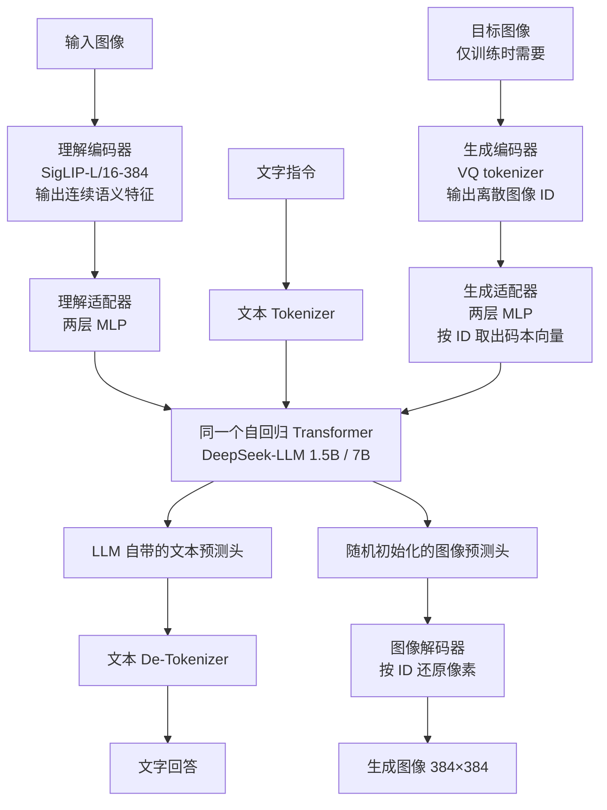
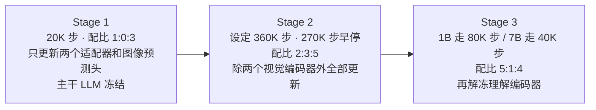
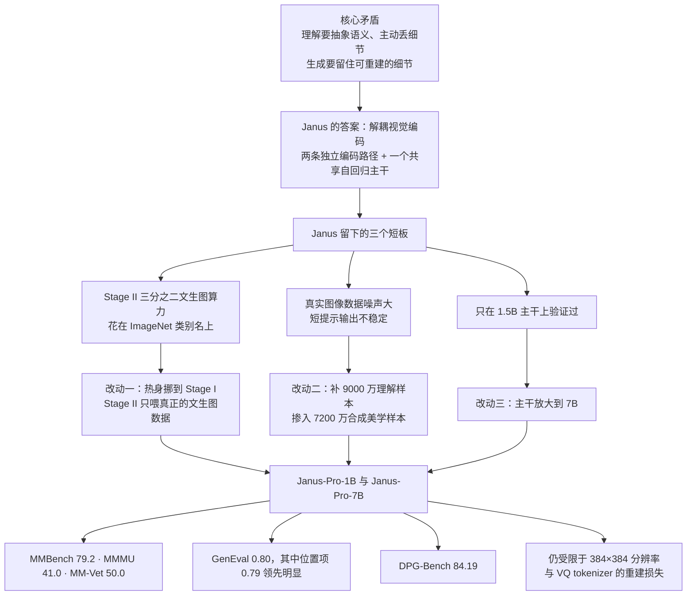

# Janus-Pro：看图和画图，为什么不能共用同一只眼睛

<!-- release-date: 2025-01-27 -->

> 本文依据 DeepSeek-AI 的 **Janus-Pro: Unified Multimodal Understanding and Generation with Data and Model Scaling**，即 arXiv:2501.17811v1（2025-01-29 提交）。经逐页比对，官方仓库 `deepseek-ai/Janus` 里的 `janus_pro_tech_report.pdf`（最后一次改动是 2025-01-28 的 fix typos）与该 arXiv 版本正文逐字相同、分页一致，因此本地件已经是最新官方版本。
>
> 全文页码指 PDF 自身页码（本报告 PDF 页码与印刷页码一致）。文中会区分三件事：报告写了什么、我们如何解释、哪些是外部补充。

## 先说清这条线上的几个词

这是本模块第一篇图像生成方向的解读。如果你之前只读过语言模型的报告，下面五个词值得先花两分钟。

- **视觉编码器**：把一张图变成模型能处理的一串向量的模块。不同的编码器留下的信息完全不同，这正是全文的核心冲突所在。
- **视觉 tokenizer**：一类特殊的视觉编码器，它不输出连续向量，而是把图像切成小块后，每块映射成一个**整数编号**。图像因此变成一串离散 ID，和文本的 Token 序列长得一模一样。
- **码本（codebook）**：视觉 tokenizer 背后那张查询表。表里有固定数量的候选向量，每个候选有一个编号。编码时找最接近的那个候选，记下编号；解码时按编号取回向量，再还原成像素。Janus-Pro 用的码本有 16384 个条目（PDF p. 5）。
- **自回归（autoregressive）生成**：一次预测下一个 Token，把刚预测出来的接回输入，再预测下一个。语言模型写字就是这样；把图像变成离散 ID 之后，画图也可以是这样。
- **扩散模型（diffusion model）**：另一条主流的图像生成路线。它从一张纯噪声图出发，反复去噪，整张图一起被修改。Stable Diffusion、DALL-E 3 都属于这一类。

再补一个贯穿全文的术语：**多模态理解**指看图回答问题（描述场景、认地标、读招牌上的字）；**视觉生成**在本报告里特指文生图（text-to-image），给一句话，输出一张图。

## 一句话先说清

Janus-Pro 不是一个新架构。

它的架构和上一代 Janus 完全相同（PDF p. 3）。它做的三件事写在摘要里：换训练策略、加训练数据、把主干放大（PDF p. 1）。

但这篇报告值得读，因为它把一个很好的问题摆在了台面上：

> **当一个模型既要看懂图、又要画出图时，这两件事需要的图像表示是互相冲突的。**

Janus 系列给出的答案叫**解耦视觉编码**：理解和生成各用一条独立的视觉编码路径，但共享同一个自回归主干。Janus-Pro 做的，是在这个已经定好的骨架上，把训练算力、数据配比和模型规模重新分配一遍，然后证明这套解耦方案能扩展。

顺带一提，Janus 是罗马神话里的双面神。报告没有解释命名，但这个"一个身体、两张脸"的结构就是全文的中心。

## 先看全景：这份报告实际写了多少

Janus-Pro 的技术报告只有 13 页，其中正文 8 页、参考文献 5 页。这个体量本身就是信息：它不是一份从零讲起的基座报告，而是一份**增量说明**，默认读者已经知道 Janus 是什么。

按原报告章节列一遍，就能看到篇幅花在了哪里：

| 报告章节 | PDF 页 | 讲了什么 |
|---|---|---|
| 摘要 + Figure 1 | p. 1 | 三句话概括三个改动；两张成绩图 |
| 引言 + Figure 2 | p. 2 | 问题陈述、Janus 的短板、头条分数、跨版本定性对比 |
| 2.1 架构 + Figure 3 | p. 3 | 解耦视觉编码的完整描述 |
| 2.2 优化训练策略 | p. 3–4 | 三阶段流程与两处修改 |
| 2.3 数据扩充 | p. 4 | 理解侧、生成侧各一段 |
| 2.4 规模扩充 | p. 4 | 一段 |
| Table 1 / Table 2 | p. 5 | 架构超参与训练超参 |
| 3.1 实现细节 | p. 5 | 全篇信息最密的一页 |
| 3.2 评测设置 | p. 5–6 | 七个理解基准、两个生成基准 |
| 3.3 与 SOTA 对比 + Table 3/4/5 | p. 6–7 | 三张主表，全篇唯一的定量证据 |
| 3.4 定性结果 + Figure 4 | p. 7–8 | 一整页样例展示 |
| 4 结论 | p. 9 | 两条限制，写得很坦率 |
| 参考文献 | p. 9–13 | 57 条 |

三件事值得先知道：

- **架构一节没有新东西。** 2.1 节开门见山说架构与 Janus 相同，所以整个"方法"部分实际是在讲怎么训练，不是讲模型是什么。
- **全篇没有一个公式。** 损失函数、图像 Token 的训练目标、两条路径的损失如何加权，一律没写。
- **全篇没有一次消融。** 三个改动从头捆到尾，最后只给一个合并结果。

所以读这篇时，把期待放在"一个已经定型的设计如何被调好"，而不是"一个新架构如何被发明出来"。这也是为什么本文的结构不按报告章节走，而是先讲清楚解耦这个设计本身，再看三处改动。

## 旧方案卡在哪：一只眼睛伺候两个打架的任务

报告在引言里只用了三句话交代问题（PDF p. 2）：多数统一模型对理解和生成使用**同一个视觉编码器**；这两个任务需要的表示不同；于是多模态理解的表现被拖累。

报告到此为止，没有再往下解释。下面这段展开是我们的解释，不是报告原文。

### 两个任务想从图里拿走的东西不一样

设想一张照片：一只金毛趴在木质门廊上，周围散着落叶。

**理解任务**想知道的是：这是一只狗，品种是金毛，它在门廊上，季节大概是秋天。为了回答这些问题，模型最好把"这是金毛"这个语义抽出来，同时**主动扔掉**每根毛的确切走向、每片叶子的精确位置。扔掉细节反而让模型更稳：换一个角度、换一个光线，它还该认出这是金毛。这种"对无关变化不敏感"的性质叫不变性，是理解任务想要的。

**生成任务**想要的正好相反。要把图重新画出来，就必须留住每根毛、每片叶子、每处阴影。任何被扔掉的细节都再也补不回来。

两个目标方向相反：一个要丢，一个要留。让同一个编码器同时满足，只能各让一步，最后哪边都不够好。报告观察到的"多模态理解表现不佳"，就是这场拉锯里理解那一侧的损失。

### 训练目标不同，留下的东西也不同

这个冲突还有一个更硬的来源，可以从两个编码器各自的出身看出来。

Janus-Pro 理解侧用的是 SigLIP（PDF p. 3、p. 5）。SigLIP 是拿海量"图片—描述文字"配对训练出来的，训练目标是让图像向量和对应文字向量靠近。所以它天然只保留"能用一句话说出来"的信息。

生成侧用的是 VQ tokenizer（PDF p. 3）。VQ tokenizer 的训练目标是**重建**：编码成 ID 再解码回来，要和原图尽量接近。所以它必须保留能还原像素的信息，哪怕这些信息没有任何语义。

两套编码器优化的是两个不同的损失函数。指望其中一个顺便干好另一件事，本来就不合理。

（本节关于 SigLIP 与 VQ 训练目标的说明属于外部背景补充；报告只说"两个任务需要的表示不同"，没有展开原因。）

## 解耦具体怎么做

Janus 的答案很直接：**别让它们共用编码器，但让它们共用主干。**

这张图按报告 Figure 3（PDF p. 3）重画，并补上了只写在 2.1 节正文里、Figure 3 未画出的两个适配器和图像预测头，以及只写在 3.1 节里的编码器型号与分辨率（PDF p. 5）。图中不含任何时间或性能信息，只表示模块连接关系。

三处需要说明的地方：

- 两条路径里的文本 Tokenizer 是同一个。Figure 3 画成两个框，只是为了分开表示两条数据流。
- 生成路径左下角那个"目标图像"上标注的**仅训练时需要**是我们加的。Figure 3 画的是训练时的数据流；推理时文生图从文字提示出发，自回归地吐出图像 ID，没有输入图像。报告没有单独画推理流程。
- 图像解码器下的"按 ID 还原像素"也是我们的注解。Figure 3 只写了 Image Decoder，报告正文完全没有描述这个解码器。

逐条对应到报告正文（PDF p. 3）：

**理解路径。** 用 SigLIP 编码器抽出高维语义特征，把二维网格摊平成一维序列，再经过一个理解适配器映射进 LLM 的输入空间。

**生成路径。** 用来自 LlamaGen 的 VQ tokenizer 把图像转成离散 ID，ID 序列摊平成一维后，用一个生成适配器把每个 ID 对应的码本向量映射进 LLM 的输入空间。

**汇合。** 两路特征和文本特征拼接成一条多模态特征序列，送进同一个 LLM。

**输出。** 除了 LLM 自带的预测头，另外用一个**随机初始化**的预测头负责图像预测。整个模型遵循自回归框架。

### 两个适配器为什么必须存在

SigLIP 的输出维度、VQ 码本的向量维度，和 LLM 的隐藏维度三者互不相同。适配器就是那个把三种"插头"改成同一种规格的转换器。报告说明两个适配器都是**两层 MLP**（PDF p. 5），这是全文关于适配器结构的唯一描述。

值得注意的是，适配器**不是**共享的。理解侧和生成侧各有一个。所以解耦发生在两个地方：编码器不同，进入主干前的映射也不同。

### 一张图变成多少个 Token

报告说生成编码器的下采样倍数是 16，图像统一处理成 $384\times384$（PDF p. 5）。

以此推算：

$$
\frac{384}{16}=24,
\qquad
24\times24=576
$$

也就是说，生成一张图大约要自回归地吐出 576 个图像 Token。理解侧用的 SigLIP-Large-Patch16-384，patch 大小 16、输入 384，同样得到 $24\times24=576$ 个 patch。

这两个 576 是我们从报告给出的分辨率和下采样倍数推算的，报告本身没有写出 Token 数。它有助于建立直觉：主干每处理一张图，要多消化五百多个位置，而上下文窗口只有 4096（PDF p. 5）。装两三张图，窗口就相当紧张了。

### 解耦的代价

报告没有讨论代价，下面是我们的判断。

解耦意味着模型里同时挂着两套视觉前端，参数和显存都要多付一份。它还意味着**理解侧看到的图和生成侧看到的图，在模型内部不是同一个东西**。想做"看一张图，然后改一改再画出来"这类跨路径任务时，两条路径之间没有天然的桥。报告没有做任何图像编辑或图生图的实验，也没有讨论这个问题。

## 自回归画图和扩散画图，分工差在哪

这一节是外部背景补充。报告只在两处间接触及这个分野：Table 3 和 Table 4 的表注都写着"使用外部预训练扩散模型的方法标记为 †"（PDF p. 6、p. 7）。也就是说，报告在意"你是不是把生成外包给了一个扩散模型"，但没有解释两条路线的差别。

### 扩散：整张图一起改，反复改很多轮

扩散模型从纯噪声出发，每一轮都对整张图做一次去噪，跑几十轮之后得到成品。它的两个特点是：

- 图像天然是连续量，不需要量化，因此不存在量化带来的信息损失；
- 它的训练目标（预测噪声或速度场）和语言模型的"预测下一个 Token"完全不是一回事。

第二点是统一模型的麻烦所在。想把扩散生成塞进一个语言模型里，要么在 LLM 之外挂一个独立的预训练扩散模型（表里打 † 的那批），要么在同一个网络里同时维护两套训练目标。

### 自回归：把画图变成"接着写下一个符号"

先用 VQ tokenizer 把图量化成离散 ID，画图就退化成"给定前面的 Token，预测下一个 Token"。这和写字是同一个动作、同一个损失、同一个主干。

代价也很清楚，而且报告在结论里明确承认了其中最重要的一条（PDF p. 9）：**量化必然引入重建损失**。原图里的某些细节在变成 ID 的那一刻就永久丢了，无论解码器多好都补不回来。报告举的例子是画面里占地很小的人脸，往往细节不足。

另一个代价报告没提：576 个 Token 必须一个接一个生成，不能像扩散那样整张图并行更新。

### Janus-Pro 为什么走自回归

报告只写了一句"整个模型遵循自回归框架"（PDF p. 3），没有说明理由。以下是我们的判断。

选自回归最直接的好处是**主干真的能共享**。理解和生成用同一个 Transformer、同一种损失、同一个训练循环，不需要在 LLM 旁边再养一个独立的生成模型，也不需要在一个网络里调和两套目标。所谓"减少模型冗余"（PDF p. 2 提到统一模型的这一好处），在自回归路线上才是彻底的。

一个可以在表里验证的旁证：Table 4 里 Transfusion 拿到 0.63、D-DiT 拿到 0.65，这两个是把扩散和自回归融在同一个模型里的方案，都低于 Janus-Pro-7B 的 0.80（PDF p. 7）。但这只是同一张表上的分数比较，报告没有做任何控制变量的对比实验，不能凭它断言"自回归路线更优"。

## Janus-Pro 相对 Janus 只改了三件事

架构一个字没动。改的是训练策略、数据和规模（PDF p. 1、p. 2）。

报告对 Janus 短板的诊断是（PDF p. 2）：Janus 只在 1B 参数规模上验证过，训练数据量有限、模型容量偏小，因此在**短提示的图像生成**上表现不佳，而且文生图质量**不稳定**。

"不稳定"是这篇报告里一个具体的、可以看图确认的问题。Figure 2（PDF p. 2）把 Janus 和 Janus-Pro-7B 在六条短提示上的输出并排放在一起。最能说明问题的是黑板那一格：提示要求写出 "Hello"，Janus 画出的是一团扭曲的字符，Janus-Pro 写出了可读的 "Hello"。图注说 Janus-Pro 在短提示下输出更稳定、画质更好、细节更丰富，并且能生成简单文字，分辨率 $384\times384$。

这是一组定性对比，不是统计结果。报告没有给出"稳定性"的量化指标，也没有说明这六个例子是怎么挑的。

把两代之间的差异摊开，是这样一张表（全部来自 PDF p. 1 至 p. 5）：

| 维度 | Janus | Janus-Pro | 出处 |
|---|---|---|---|
| 架构 | 解耦视觉编码 + 共享自回归主干 | 完全相同，一字未改 | p. 3 |
| LLM 主干 | 1.5B | 1.5B 和 7B 两档 | p. 4、p. 6 |
| Stage I 步数 | 较少，原值全文未公开 | 增加，最终为 20K 步 | p. 4、p. 5 |
| Stage II 的文生图数据 | 66.67% 的步数用 ImageNet 类别名当提示词 | 完全丢掉 ImageNet | p. 3、p. 4 |
| Stage III 数据配比 | 7:3:10 | 5:1:4 | p. 4 |
| 理解侧数据 | 基线 | 新增约 9000 万样本 | p. 4 |
| 生成侧数据 | 以真实数据为主，质量差、噪声大 | 掺入约 7200 万合成美学样本，真实与合成 1:1 | p. 4 |

这张表最该注意的是第一行：**架构完全没动。** 后面所有内容都是在一个固定的骨架上重新分配训练资源。

## 改动一：把训练算力挪到该去的地方

### 旧的三阶段流程

Janus 原本的训练分三阶段（PDF p. 3）：

- **Stage I**：只训练两个适配器和图像头，主干 LLM 不动；
- **Stage II**：统一预训练，除了理解编码器和生成编码器之外，其余参数全部更新；
- **Stage III**：监督微调，在 Stage II 基础上进一步解冻理解编码器。

### 旧流程里那个吃掉算力的设计

问题出在 Stage II。Janus 参照 PixArt 的做法，把 Stage II 的文生图训练拆成两半（PDF p. 3）：

1. 先用 ImageNet 数据训练，把**图像类别名当作提示词**（比如提示就是 "golden retriever"），目的是让模型先学会像素之间的依赖关系；
2. 再用正常的文生图数据训练。

实际实现里，**Stage II 的文生图训练步数有 66.67% 分给了第一部分**（PDF p. 3）。也就是三分之二的文生图算力，花在了拿类别名当提示词上。

报告的结论很直白：进一步实验发现这个策略不是最优的，并且导致了显著的计算浪费（PDF p. 4）。

### 两个修改

**修改一，Stage I 练久一点。** 增加 Stage I 的训练步数，让模型在 ImageNet 上练够。报告给出的发现是：**即使 LLM 参数保持冻结**，模型也能有效建模像素依赖，并根据类别名生成合理的图像（PDF p. 4）。

这句话是整个改动的支点。既然冻着主干就能学会像素依赖，那就没必要在解冻主干的 Stage II 里，用昂贵的全模型更新去重复干这件事。

**修改二，Stage II 只做正事。** Stage II 里彻底丢掉 ImageNet 数据，直接用正常文生图数据训练模型根据**稠密描述**作图。报告称这让 Stage II 更高效地利用文生图数据，训练效率和整体性能都变好（PDF p. 4）。

### Stage III 的配比也调了

Stage III 里多模态数据、纯文本数据、文生图数据的比例从 **7:3:10 改成 5:1:4**（PDF p. 4）。

换算成百分比（这一步是我们做的算术）：

| 数据类型 | 旧配比 7:3:10 | 新配比 5:1:4 |
|---|---:|---:|
| 多模态理解 | 35% | 50% |
| 纯文本 | 15% | 10% |
| 文生图 | 50% | 40% |

报告的说法是：稍微降低文生图数据的比例，就能在保住视觉生成能力的同时改善多模态理解（PDF p. 4）。

### 这条因果链的收益、代价和边界

**收益**：报告声称训练效率和整体性能都提升了。

**代价与边界**：报告**没有**给出任何隔离实验。它没说 Stage I 的步数从多少增加到了多少（只在 Table 2 里给出 Janus-Pro 的最终值 20K 步，Janus 的原值全文未出现），没有给出 Stage II 改动前后的对照曲线，也没有单独测量数据配比调整带来的分数变化。三个改动（训练策略、数据、规模）自始至终捆在一起，最终只呈现一个合并结果。

所以准确的说法是：**报告主张这些改动有效，但本报告没有提供把它们各自贡献分开的证据。**

### 可以带走的是什么

抛开具体数字，这一段的思路很值得迁移：

> **先问清楚"这个能力最便宜的学习位置在哪里"，再决定把它放到哪个阶段。**

Janus 的原设计把"学会像素依赖"这件事放在了全模型更新的阶段，成本最高。Janus-Pro 发现它在冻结主干的阶段就能学会，于是整体挪到前面。分阶段训练的价值，一半在于分阶段，另一半在于**每个能力都放在成本最低、又刚好够用的那个阶段**。

## 改动二：缺哪一类补哪一类

报告把数据扩充分成两侧（PDF p. 4）。

### 理解侧：补的是种类，不只是数量

Stage II 的预训练数据参照 DeepSeek-VL2，新增约 **9000 万**样本，包括图像描述数据（如 YFCC），以及表格、图表、文档理解数据（如 Docmatix）。Stage III 的监督微调数据也从 DeepSeek-VL2 引入了新类型：表情包理解、中文对话数据，以及专门用来改善对话体验的数据。

注意这批新增数据的构成：表格、图表、文档、表情包、中文对话。这些不是"更多的照片"，而是**原来覆盖不到的图像类型**。

### 生成侧：用合成数据换稳定性

这是报告里最有意思的一段。

**旧问题**：Janus 用的真实世界数据质量不佳、噪声很大，导致文生图不稳定，输出常常不好看（PDF p. 4）。

**新做法**：引入约 **7200 万**条合成美学数据，使统一预训练阶段的真实数据与合成数据比例达到 **1:1**（PDF p. 4）。报告说明这批合成数据的提示词是公开可得的，并引用了一个 Midjourney 提示词数据集作为例子。

**观察到的效果**：模型在合成数据上**收敛更快**，产出的文生图不仅更稳定，美学质量也显著提升（PDF p. 4）。

### 为什么合成数据在这里管用

这段解释是我们的，不是报告的。

网上抓来的真实图文对里，图片可能构图混乱、光线糟糕、和文字描述对不上。模型从中学到的是一个很宽、很杂的分布，采样时自然容易掉进难看的那一块。合成美学数据的图文对齐度和画面质量都被上游生成流程控制过，分布更窄更干净，模型更容易学到一个稳定的映射。

代价同样明显，而且报告完全没有讨论：

- 合成数据的美学风格来自生成它的那个上游模型，**模型会继承那种审美偏好**；
- 真实数据里的多样性和长尾内容会被稀释；
- 报告没有说明这 7200 万条合成图是用什么模型生成的、如何筛选、是否做过去重或污染检查。

### 关于"1:1"这个数字

需要说清楚：报告说的 1:1 是**统一预训练阶段**里真实与合成数据的比例（PDF p. 4），不是整个训练过程的比例，也不是训练语料的总规模。报告全文没有给出任何总 Token 数或总样本数，只给了两个增量：9000 万和 7200 万。

## 改动三：把主干从 1.5B 放大到 7B

报告的说法是（PDF p. 4）：Janus 用 1.5B 的 LLM 验证了视觉编码解耦的有效性；Janus-Pro 把模型放大到 7B，观察到**多模态理解和视觉生成两侧的损失收敛速度都比小模型显著变快**，认为这进一步验证了该方法的可扩展性。

这里有一个命名上的坑值得指出。模型叫 Janus-Pro-1B，但 Table 3 的 "# LLM Params" 列里它写的是 **1.5B**（PDF p. 6），2.4 节和 3.1 节也都说主干是 1.5B 的 DeepSeek-LLM（PDF p. 4、p. 5）。同时引言又说 Janus"在 1B 参数规模上得到验证"（PDF p. 2）。报告内部对这个数字的表述并不一致；以正文和表格为准，小号版本的语言主干是 1.5B，模型名里的 "1B" 是个约整。

关于扩展性这个结论，需要保留的边界是：报告给的证据是**训练损失的收敛速度**，不是一条参数量与最终性能的缩放曲线。只有两个点（1.5B 和 7B），中间没有更多规模，也没有做等算力对照。"验证了可扩展性"在这里是一个合理的观察，不是一条被拟合出来的规律。

## 训练配置：一份可以照着算的账

这一节的数字全部来自报告，是整篇里最实在的部分。

### 架构超参（PDF p. 5，Table 1）

| 配置 | Janus-Pro-1B | Janus-Pro-7B |
|---|---:|---:|
| 词表大小 | 100K | 100K |
| 嵌入维度 | 2048 | 4096 |
| 上下文窗口 | 4096 | 4096 |
| 注意力头数 | 16 | 32 |
| 层数 | 24 | 30 |

有两点值得注意。第一，**两个规模的上下文窗口都是 4096**，没有随模型放大。结合前面推算的一张图 576 个 Token，这个窗口对多图或长对话场景是明显的约束。第二，从 1.5B 到 7B，层数只从 24 增到 30，主要增长来自宽度（2048 到 4096）。

### 训练超参（PDF p. 5，Table 2）

| 超参 | Stage 1 | Stage 2 | Stage 3 |
|---|---|---|---|
| 学习率 | $1.0\times10^{-3}$ | $1.0\times10^{-4}$ | $4.0\times10^{-5}$ |
| 学习率调度 | 常数 | 常数 | 常数 |
| Warm-up 步数 | 600 | 5000 | 0 |
| 训练步数（1B） | 20K | 360K | 80K |
| 训练步数（7B） | 20K | 360K | 40K |
| Batch size | 256 | 512 | 128 |
| 数据配比 | 1:0:3 | 2:3:5 | 5:1:4 |

两个规模共用的设置：AdamW，$\beta_1=0.9$、$\beta_2=0.95$；weight decay 为 0.0；梯度裁剪 1.0。

几处值得停一下的地方：

**学习率调度全程是常数，不衰减。** 三个阶段各用一个固定值，靠阶段切换实现"降学习率"。这和语言模型常见的 cosine 衰减不同。

**weight decay 设成 0.0。** 报告没有解释。

**Stage 2 名义 360K 步，实际早停在 270K 步**（PDF p. 5）。也就是只跑了设定值的 75%。报告没有说明早停的判据。

**Stage 3 是 1B 和 7B 唯一不同的地方**：1B 跑 80K 步，7B 只跑 40K 步，正好一半。报告没有解释这个差异。

**数据配比逐阶段变化**，把三个阶段的意图暴露得很清楚（配比顺序为 多模态理解 : 纯文本 : 视觉生成，见 Table 2 图注，PDF p. 5）：

| 阶段 | 配比 | 理解 | 纯文本 | 生成 | 这个阶段在干什么 |
|---|---|---:|---:|---:|---|
| Stage 1 | 1:0:3 | 25% | 0% | 75% | 主干冻结，四分之三算力砸在让适配器和图像头学会像素依赖 |
| Stage 2 | 2:3:5 | 20% | 30% | 50% | 统一预训练，加入三成纯文本以保住语言能力 |
| Stage 3 | 5:1:4 | 50% | 10% | 40% | 微调，重心明确转向多模态理解 |

Stage 1 的纯文本占比是 0，因为主干本来就不更新，喂纯文本没有意义。Stage 2 突然给到 30%，可以理解为主干开始更新后，防止语言能力被图像数据冲淡的一道保险（这一句是我们的解释，报告未说明理由）。

### 训练流程一图

此图按报告 2.2 节（PDF p. 3、p. 4）与 Table 2、3.1 节（PDF p. 5）重画，只表示阶段顺序与各阶段的可训练范围，不含任何时间比例信息。

### 实现细节（PDF p. 5）

- 基础语言模型是 DeepSeek-LLM（1.5B 和 7B），最大支持序列长度 4096；
- 理解侧视觉编码器为 SigLIP-Large-Patch16-384；
- 生成编码器码本大小 16384，图像下采样倍数 16；
- 两个适配器都是两层 MLP；
- 所有图像统一到 $384\times384$；
- **理解数据**：把长边缩放到 384，短边用背景色 RGB (127, 127, 127) 补齐；
- **生成数据**：把短边缩放到 384，长边裁剪到 384；
- 训练中使用序列打包（sequence packing）提升效率；
- 各类数据按指定比例混合在**同一个训练步**里，而不是分步轮流；
- 训练与评测使用 HAI-LLM 框架，构建在 PyTorch 之上。

理解和生成对图像的预处理不一样，这个细节很容易被略过，但它恰好又是解耦思路的一次体现：理解侧宁可留白边也要**保住完整画面**（图里可能有一处关键信息在边缘），生成侧宁可裁掉边缘也要**保住构图不变形**（补出来的灰边会被模型学成一种画面元素）。这段因果解释是我们的，报告只给了做法。

顺带指出一个空白：报告提到使用序列打包，但**没有说明打包后是否用注意力掩码隔离不同样本**。这在语言模型训练里是个常见的坑，报告没有交代。

### 训练成本

报告写得很干脆（PDF p. 5）：1.5B 和 7B 的整个训练过程分别耗时约 **9 天**和 **14 天**，用 **16 个和 32 个节点**，每个节点配 **8 张 Nvidia A100 (40GB)**。

据此推算（这一步是我们做的算术）：

| 模型 | GPU 数 | 天数 | A100 卡·天 |
|---|---:|---:|---:|
| Janus-Pro-1B（1.5B 主干） | 128 | 9 | 1152 |
| Janus-Pro-7B | 256 | 14 | 3584 |

两个模型合计约 4736 A100 卡·天。用的还是 40GB 版本的 A100，不是更常见的 80GB。

这个量级值得记住：它比同期的语言基座报告低了好几个数量级。这既说明多模态微调路线的成本门槛确实低，也提醒我们不要用读语言基模报告的期待来读这一篇。报告没有给出总算力（FLOPs）、总 Token 数或折算成本。

## 实验：哪些结论站得住，哪些要打折

### 多模态理解（PDF p. 6，Table 3）

摘出几行关键对比：

| 模型 | LLM 参数 | POPE↑ | MME-P↑ | MMB↑ | SEED↑ | GQA↑ | MMMU↑ | MM-Vet↑ |
|---|---:|---:|---:|---:|---:|---:|---:|---:|
| LLaVA-v1.5（仅理解） | 7B | 85.9 | 1510.7 | 64.3 | 58.6 | 62.0 | 35.4 | 31.1 |
| ILLUME | 7B | 88.5 | 1445.3 | 65.1 | 72.9 | — | 38.2 | 37.0 |
| TokenFlow-XL | 13B | 86.8 | 1545.9 | 68.9 | 68.7 | 62.7 | 38.7 | 40.7 |
| Janus | 1.5B | 87.0 | 1338.0 | 69.4 | 63.7 | 59.1 | 30.5 | 34.3 |
| Janus-Pro-1B | 1.5B | 86.2 | 1444.0 | 75.5 | 68.3 | 59.3 | 36.3 | 39.8 |
| Janus-Pro-7B | 7B | 87.4 | 1567.1 | 79.2 | 72.1 | 62.0 | 41.0 | 50.0 |

报告的结论是"Janus-Pro 取得了总体最好的结果"，并具体指出 Janus-Pro-7B 在除 GQA 外的所有基准上都超过了 13B 的 TokenFlow-XL（PDF p. 6）。这条具体主张逐列核对下来是成立的。

但"总体最好"是一个聚合层面的说法。**逐列看的话，Janus-Pro-7B 在七项里赢了四项。**

- POPE：ILLUME 拿 88.5，高于 Janus-Pro-7B 的 87.4；
- SEED：ILLUME 拿 72.9，高于 Janus-Pro-7B 的 72.1；
- GQA：TokenFlow-XL 拿 62.7，高于 Janus-Pro-7B 的 62.0；同规模的纯理解模型 LLaVA-v1.5-7B 也是 62.0，打平。

ILLUME 和 Janus-Pro-7B 都是 7B。这说明在几个偏视觉细节和空间关系的基准上，解耦方案并没有拉开优势。报告没有讨论这三列。

还有一个报告没提的细节：**Janus-Pro-1B 的 POPE 是 86.2，比 Janus 的 87.0 低了 0.8**（PDF p. 6）。这是全表里唯一一处 Janus-Pro 相对前代的回退。POPE 测的是物体幻觉，即模型会不会说图里有实际不存在的东西。同规模下这一项变差，值得注意，但报告没有解释。

Janus-Pro-1B 到 Janus-Pro-7B 的提升是全面且明显的，尤其 MM-Vet 从 39.8 涨到 50.0、MMMU 从 36.3 涨到 41.0。这一列的对比相对干净，因为两者的训练策略和数据基本一致，主要变量就是规模（Stage 3 步数不同是另一个变量）。

另外，Figure 1(a) 的横轴写的是 "LLM Parameters (Billions)"（PDF p. 1）。也就是说，这张"性价比图"的横坐标只算语言主干，**不含 SigLIP 编码器和 VQ tokenizer 的参数**。这不是作弊，坐标轴标注得很清楚，但读图时要知道它比较的是什么。

### 这张表里被略过的一条重要证据

Table 3 上半部分是"仅理解"模型，下半部分是"理解 + 生成"的统一模型（PDF p. 6）。这个分组本身带着一个历史包袱：统一模型过去常在理解上输给同规模的纯理解模型，因为生成任务会抢走表示空间。这正是引言所说"多模态理解表现不佳"的老问题。

把同为 7B 的 Janus-Pro-7B 和 LLaVA-v1.5-7B 逐列比一遍：

| 基准 | LLaVA-v1.5-7B（仅理解） | Janus-Pro-7B（理解 + 生成） | 差值 |
|---|---:|---:|---:|
| POPE | 85.9 | 87.4 | +1.5 |
| MME-P | 1510.7 | 1567.1 | +56.4 |
| MMB | 64.3 | 79.2 | +14.9 |
| SEED | 58.6 | 72.1 | +13.5 |
| GQA | 62.0 | 62.0 | 0 |
| MMMU | 35.4 | 41.0 | +5.6 |
| MM-Vet | 31.1 | 50.0 | +18.9 |

六项赢、一项平，没有一项输。换句话说，在这组对比里，**同时会画图并没有让它的理解能力付出可见的代价**。这是全表最能支撑解耦思路的一条证据，而报告正文并没有把它讲出来（3.3 节只提了与 TokenFlow-XL 的对比）。

边界同样要说清楚：LLaVA-v1.5 是更早的模型，训练数据和配方都更旧，这不是控制变量实验。它能说明"统一模型不必然更弱"，不能说明"解耦本身贡献了多少"。

### 最接近对照的一组，仍然不是对照实验

引言把 Emu3 列在那批统一多模态模型里，并称这类方法多数共用同一个视觉编码器（PDF p. 2）。所以在这张表上，Emu3 是最接近"不解耦"参照物的一个。

| 基准 | Emu3-Chat（8B） | Janus-Pro-7B |
|---|---:|---:|
| POPE | 85.2 | 87.4 |
| MME-P | 1244 | 1567.1 |
| MMB | 58.5 | 79.2 |
| SEED | 68.2 | 72.1 |
| GQA | 60.3 | 62.0 |
| MMMU | 31.6 | 41.0 |
| MM-Vet | 37.2 | 50.0 |

Janus-Pro-7B 用更小的主干在全部七项上领先（PDF p. 6）。生成侧也一样：Emu3-Gen 的 GenEval 是 0.54、DPG-Bench 是 80.60，都低于 Janus-Pro-7B 的 0.80 和 84.19（PDF p. 7）。

这组数字看起来很有说服力，但两个模型的语言主干、训练数据和训练算力全都不同。它是同一张排行榜上的位次比较，不是"解耦对不解耦"的控制变量实验。报告没有做后者，本文也不把前者当成后者。

### 文生图：GenEval（PDF p. 7，Table 4）

GenEval 是一个把文生图拆成细项来查的基准。摘出关键行：

| 方法 | 单物体 | 双物体 | 计数 | 颜色 | 位置 | 颜色属性 | 总分↑ |
|---|---:|---:|---:|---:|---:|---:|---:|
| DALL-E 3 | 0.96 | 0.87 | 0.47 | 0.83 | 0.43 | 0.45 | 0.67 |
| SD3-Medium | 0.99 | 0.94 | 0.72 | 0.89 | 0.33 | 0.60 | 0.74 |
| Transfusion | — | — | — | — | — | — | 0.63 |
| Janus | 0.97 | 0.68 | 0.30 | 0.84 | 0.46 | 0.42 | 0.61 |
| Janus-Pro-1B | 0.98 | 0.82 | 0.51 | 0.89 | 0.65 | 0.56 | 0.73 |
| Janus-Pro-7B | 0.99 | 0.89 | 0.59 | 0.90 | 0.79 | 0.66 | 0.80 |

报告只引用了总分 0.80，说它超过所有其他统一模型和纯生成模型（PDF p. 7）。总分确实第一。但**这张表的分项才是最有信息量的地方，而报告完全没有讨论**。

拿 Janus-Pro-7B 和 SD3-Medium 逐项比：

- **位置**：0.79 对 0.33。这是压倒性的差距。位置项考的是"A 在 B 的左边"这类空间关系指令。
- **颜色属性**：0.66 对 0.60，Janus-Pro 领先。这一项考的是把正确的颜色绑到正确的物体上（"红色的球和蓝色的杯子"，而不是反过来）。
- **双物体**：0.89 对 0.94，Janus-Pro 落后。
- **计数**：0.59 对 0.72，Janus-Pro 明显落后。

这个模式很有解释力，下面是我们的判断。Janus-Pro 强在**理解指令的结构**（谁在哪、谁是什么颜色），弱在**把画面本身画准**（数量对不对、两个物体都画全没有）。这恰好对上它的构造：一个真正的语言模型主干负责解析指令，而画面质量受限于 $384\times384$ 的分辨率和 VQ 重建损失。

报告自己在结论里也承认了后半句的成因（PDF p. 9）。但它在正文里只报了总分，没有把这个"强在指令、弱在画面"的分野讲出来。

### 文生图：DPG-Bench（PDF p. 7，Table 5）

DPG-Bench 由 1065 条长而稠密的提示词组成，用来考察复杂语义对齐（PDF p. 6）。

| 方法 | 全局 | 实体 | 属性 | 关系 | 其他 | 总分↑ |
|---|---:|---:|---:|---:|---:|---:|
| DALL-E 3 | 90.97 | 89.61 | 88.39 | 90.58 | 89.83 | 83.50 |
| SD3-Medium | 87.90 | 91.01 | 88.83 | 80.70 | 88.68 | 84.08 |
| Janus | 82.33 | 87.38 | 87.70 | 85.46 | 86.41 | 79.68 |
| Janus-Pro-1B | 87.58 | 88.63 | 88.17 | 88.98 | 88.30 | 82.63 |
| Janus-Pro-7B | 86.90 | 88.90 | 89.40 | 89.32 | 89.48 | 84.19 |

Janus-Pro-7B 的 84.19 是全表第一，但只比 SD3-Medium 的 84.08 高 0.11。报告的措辞是"超过所有其他方法"（PDF p. 7），这在字面上成立，但 0.11 的差距不足以支撑任何强结论。

还有一个报告没提的细节：**在"全局"这一列，Janus-Pro-1B 的 87.58 高于 Janus-Pro-7B 的 86.90**。放大模型在这一项上没有单调变好。分项分数的非单调是常见现象，但既然报告用了"超过所有其他方法"这样的表述，读者也应该知道它内部并非处处单调。

需要注意 Table 5 的表注：**表里除 Janus 和 Janus-Pro 外全是专用生成模型**（PDF p. 7）。也就是说，这是一个统一模型和一批只干生成的模型同台的比较，Janus-Pro 在"还要兼顾理解"的前提下拿到第一，这个背景让分数更有分量。

### 定性结果：Figure 4 是展示，不是证据

Figure 4（PDF p. 8）占了整整一页，分五块：图像描述、地标识别（西湖三潭印月）、常识问答（Tom and Jerry 蛋糕）、文字识别（招牌上的 "Serving Soul since Twenty Twelve"），以及八张文生图样例。

这些例子说明模型能做什么类型的任务，但**它们是精选样例，不构成任何统计证据**。报告没有说明这些样例的挑选过程，也没有给出失败案例。3.4 节的正文（PDF p. 7）称生成的图"非常逼真"、"包含大量细节"，这是作者的定性评价。

Figure 2（PDF p. 2）的性质稍有不同：它是**同提示词、跨版本的并排对比**，能支撑"相对前代更稳定"这个方向性判断，但同样是六个精选例子，没有量化。

读生成类论文时，把"哪些图是证据、哪些图是展示"分清楚很重要。这篇报告里真正的证据只有三张表（Table 3、4、5），Figure 1 是这三张表的可视化，其余都是展示。

## 报告承认的限制，和报告根本没写的事

### 报告自己承认的（PDF p. 9）

结论一节写得相当坦率，两条限制都指向同一个根源：

1. **理解侧**：输入分辨率被限制在 $384\times384$，这影响它在 OCR 这类细粒度任务上的表现。
2. **生成侧**：低分辨率加上视觉 tokenizer 引入的重建损失，导致生成的图"语义内容丰富，但仍缺乏精细细节"。报告举的例子是画面里占地很小的人脸可能显得不够精细。

报告认为提高图像分辨率可以缓解这些问题。

值得对照的是：报告在 Figure 2（PDF p. 2）里把"能生成简单文字"当作一项改进展示（黑板上的 "Hello"），又在结论里承认 OCR 这类细粒度任务受分辨率所限。这两件事并不矛盾，但合起来给出的边界很清楚：**在大字、简单词上有进步，不等于能处理真实场景里的密集文字。**

### 报告没有公开的

这是一篇 13 页的短报告，缺口比篇幅更值得记住：

- **没有任何消融实验。** 训练策略、数据、模型规模三个改动从头到尾捆在一起，全文没有一个控制变量的对照表。这是最大的缺口。
- **没有 Stage I 步数的前后对比。** "增加了 Stage I 的训练步数"这个改动，只给出改后的值（20K），改前的值全文未出现，因此无法知道增加了多少。
- **没有训练语料总量。** 只给了两个增量（9000 万理解样本、7200 万合成图），没有总 Token 数、总样本数或数据来源占比。
- **合成数据的来源未公开。** 7200 万条合成美学图是用什么模型生成的、如何筛选、有无去重与污染检查，一概没写。只说提示词是公开可得的。
- **没有任何公式。** 全文没有一个数学表达式，损失函数、图像 Token 的训练目标、两条路径的损失如何加权，全部没有写。
- **没有推理侧的任何信息。** 采样策略、classifier-free guidance、温度、生成一张图需要多少时间或显存，一个字都没有。Table 3、4、5 的分数是在什么推理配置下测的，也没有说明。
- **VQ tokenizer 本身没有描述。** 只说"来自 LlamaGen"，没有说是否重新训练、是否随主干微调。
- **没有安全性、许可或使用限制的讨论。**
- **没有图像编辑、图生图、多图或视频的任何实验。**
- **序列打包是否做了样本间的注意力隔离，没有交代。**

## 可以带回自己项目的几条

### 一个表示扛不了两个相反的目标

这是全文最核心、也最容易迁移的一条。理解要不变性，生成要可重建性；一个要丢细节，一个要留细节。让同一个编码器同时满足，只能各让一步。

同样的模式在别处很常见：检索的向量和重排的向量、监控的聚合指标和告警的原始指标、给人看的摘要和给下游系统用的结构化输出。遇到"一个表示服务多个下游、每个下游都不太满意"时，先问的不该是"怎么把这个表示调得更好"，而是"这几个下游要的东西是不是根本冲突"。如果冲突，**拆表示、共享主干**往往比继续调参更根本。

### 能力要放在学得起的那个阶段

Janus 把"学会像素依赖"放在全模型更新的 Stage II，占掉三分之二的文生图算力。Janus-Pro 发现冻结主干就能学会，于是整体挪到 Stage I。

分阶段训练的价值不只在"分阶段"，更在于**每个能力都被放在成本最低、又刚好够用的那个阶段**。设计课程时值得逐项问一遍：这个能力最便宜的学习位置在哪里？我现在是不是在用一个昂贵的阶段做一件便宜的事？

### 数据不稳定时，先看分布宽度而不是数据量

Janus 的文生图不稳定，Janus-Pro 的解法不是"再抓一亿张真实图"，而是掺入等量的合成美学数据，把训练分布收窄、把图文对齐度提上去。

这个思路可以迁移到任何"平均还行、但偶尔输出很差"的系统。输出方差大，往往说明训练分布里有一大块低质量区域。补更多同源数据只会把这块区域一起放大；换成更干净、更窄的分布反而能压住方差。代价也要一起记住：**你会继承合成数据源的偏好，也会丢掉真实数据的长尾。**

### 分项分数比总分诚实

GenEval 的总分 0.80 只说明 Janus-Pro-7B 排第一。真正有用的信息在分项里：位置 0.79 对 SD3-Medium 的 0.33，计数 0.59 对 0.72。前者说明它的指令理解很强，后者说明它的画面执行受限于分辨率和量化。

自己做评测时，把分项留下来，并且**优先看自己输的那几项**。总分高只能证明当下不差；分项分布才告诉你下一步该改哪里。

### 参数量的口径要先说清楚

Figure 1(a) 的横轴是 "LLM Parameters"，不含视觉编码器。这不是问题，因为标注是清楚的。问题在于读者容易顺手把它当成整个模型的大小。

自己画性价比图时，把口径写在轴上；读别人的图时，先看轴的标签再看点的位置。

## 用一张图重新串起来

此图按报告 2.1 至 2.4 节（PDF p. 3–4）与 Table 3、4、5（PDF p. 6–7）重画，表示的是"问题 → 改动 → 结果"的逻辑关系，不表示训练顺序或时间。图中所有分数都是报告的实测值。

三处必须说清的边界：

- 最上面那个"核心矛盾"节点是我们的表述。报告原文只说"这两个任务需要的表示不同"（PDF p. 2），没有解释为什么不同。
- 三条短板到三条改动的一对一连线是**简化**。报告把"短提示不稳定"同时归因于训练数据有限和模型容量偏小（PDF p. 2），所以它其实同时指向改动二和改动三，图里为了可读只画了主要那条。
- 箭头表示的是报告的叙事逻辑，**不表示因果关系被实验验证过**。报告没有做任何消融，无法把三条改动各自的贡献分开。

## 关键词回看

- **解耦视觉编码**：理解和生成各用一条独立的视觉编码路径（编码器 + 适配器），但共享同一个自回归 Transformer 主干。这是 Janus 系列的核心设计，Janus-Pro 原样继承（PDF p. 3）。
- **理解编码器**：SigLIP-Large-Patch16-384，输出连续语义特征，训练目标是图文对齐（PDF p. 5）。
- **生成编码器 / 视觉 tokenizer**：来自 LlamaGen 的 VQ tokenizer，把图像变成离散 ID，训练目标是重建（PDF p. 3、p. 5）。
- **码本**：视觉 tokenizer 背后的查询表，Janus-Pro 的码本有 16384 个条目，图像下采样倍数 16（PDF p. 5）。
- **适配器**：两层 MLP，把视觉特征映射进 LLM 的输入空间。理解侧和生成侧各一个，不共享（PDF p. 3、p. 5）。
- **图像预测头**：LLM 自带的预测头之外，另加一个随机初始化的头，专门负责图像 Token 的预测（PDF p. 3）。
- **像素依赖建模**：Stage I 用 ImageNet 类别名当提示词做的那件事，目的是让模型先学会图像内部的空间统计规律（PDF p. 3、p. 4）。
- **数据配比**：多模态理解 : 纯文本 : 视觉生成，逐阶段为 1:0:3、2:3:5、5:1:4（PDF p. 5）。
- **合成美学数据**：约 7200 万条，与真实数据在统一预训练阶段按 1:1 混合，用来压住文生图的不稳定（PDF p. 4）。
- **GenEval**：文生图指令遵循基准，按单物体、双物体、计数、颜色、位置、颜色属性分项打分（PDF p. 6、p. 7）。
- **DPG-Bench**：Dense Prompt Graph Benchmark，1065 条长而稠密的提示词，考察复杂语义对齐（PDF p. 6）。
- **POPE**：物体幻觉基准，测模型会不会说图里有实际不存在的东西。Janus-Pro-1B 在这一项上相对 Janus 有小幅回退（PDF p. 6）。

## 最后的判断

Janus-Pro 的技术贡献是有限的，而且报告自己也没有假装它很大：架构完全沿用 Janus，改的是训练策略、数据和规模。它没有提出新算法，没有给出一个公式，也没有做一次消融。

但它值得作为这条线的入门读物，理由有两个。

第一，它把**解耦视觉编码**这个想法讲得足够干净。理解要抽象、生成要细节，这两件事在表示层面互相打架；解法不是把编码器调得更好，而是让它们各走各的路，只在主干处汇合。这个模式的适用范围远远超出多模态模型本身。

第二，它示范了一种很务实的改进方式：不动架构，只动**算力放在哪个阶段、数据补哪一类、规模开到多大**。Stage II 三分之二的文生图算力原本花在拿类别名当提示词上，把它挪到冻结主干的 Stage I，就是纯粹的效率回收，没有任何新技术。

它留下的边界同样清楚。$384\times384$ 的分辨率和 VQ 重建损失是两道硬墙，报告在结论里自己承认了。GenEval 的分项显示它强在指令理解、弱在画面执行。多模态理解上，同规模的 ILLUME 在 POPE 和 SEED 上仍然更高。而缺少消融，意味着"三个改动各自值多少"这个问题，靠这份报告回答不了。

如果只记一句话：

> **当一个模块被要求同时满足两个方向相反的目标时，先检查它们是不是真的能共存；不能共存的话，拆开表示、共享主干，往往比继续调参更根本。**

## 资料与阅读边界

- 原始依据：本地 `papers/DeepSeek/Janus-Pro.pdf`，即 arXiv:2501.17811v1，[arXiv 摘要页](https://arxiv.org/abs/2501.17811)。该 ID 至今只有 v1，无后续修订。
- 官方项目页与技术报告原件：[deepseek-ai/Janus](https://github.com/deepseek-ai/Janus)。仓库内的 `janus_pro_tech_report.pdf` 与 arXiv v1 正文逐字相同、分页一致。仓库 News 一节记录 Janus-Pro 于 2025-01-27 发布。
- 官方权重：[Janus-Pro-1B](https://huggingface.co/deepseek-ai/Janus-Pro-1B)、[Janus-Pro-7B](https://huggingface.co/deepseek-ai/Janus-Pro-7B)。两个仓库的权重文件提交时间均为 2025-01-27，这是本文 `release-date` 的依据。
- 前代模型 Janus（报告参考文献 [46]）：arXiv:2410.13848，"Decoupling Visual Encoding for Unified Multimodal Understanding and Generation"。本文只在报告引用它的地方提到它，没有把 Janus 论文里的细节当作本报告内容。
- 生成侧 VQ tokenizer 的出处（报告参考文献 [38]）：LlamaGen，arXiv:2406.06525。报告只说"使用来自该工作的 VQ tokenizer"，本文未补充该论文的实现细节。
- 理解侧编码器的出处（报告参考文献 [53]）：SigLIP，"Sigmoid Loss for Language Image Pre-Training"。
- 本文中标为"推算"的数字（每张图 576 个 Token、7:3:10 与 5:1:4 的百分比换算、A100 卡·天）都由报告给出的原始数字直接算得，报告本身没有写出这些结果。
- 本文中标为"我们的解释"或"外部背景补充"的段落（两个任务表示冲突的成因、自回归与扩散的分工、合成数据为何压得住方差、两侧图像预处理差异的理由）不是报告原话。报告在这些问题上只给了结论或做法，没有给理由。
