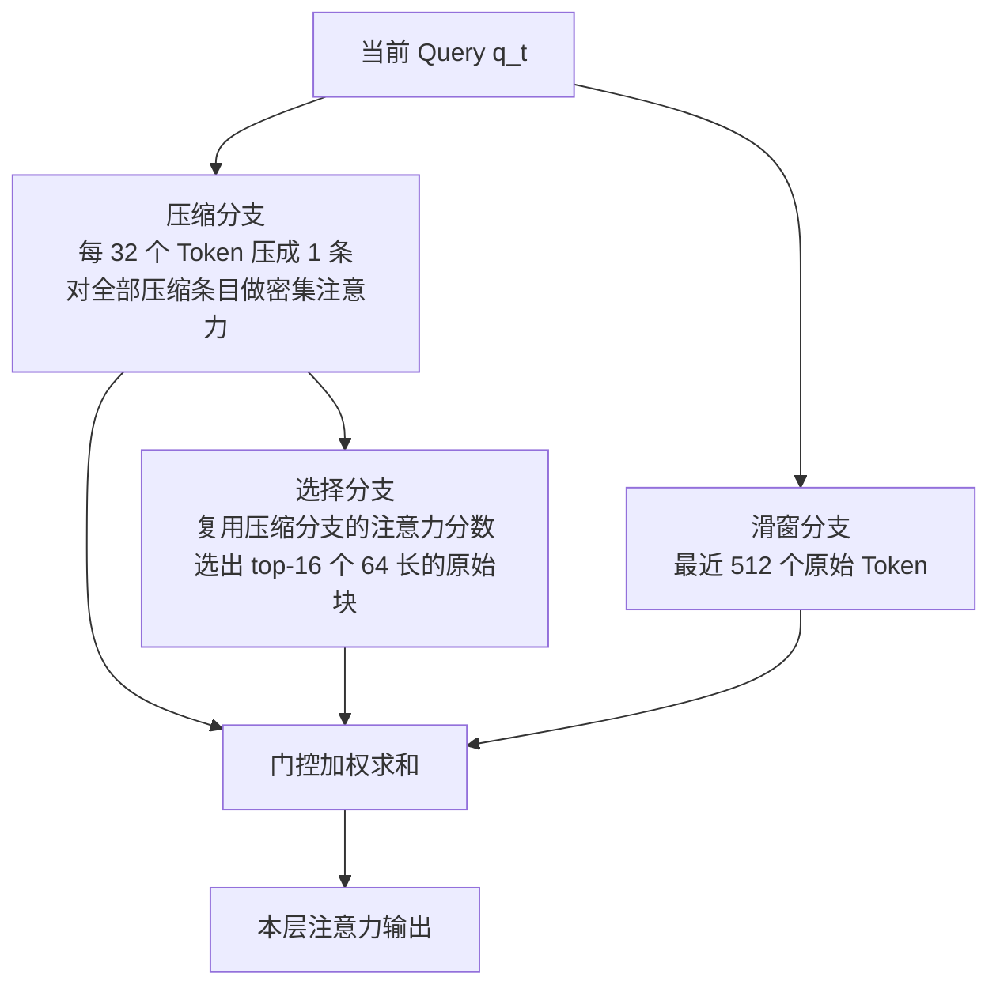
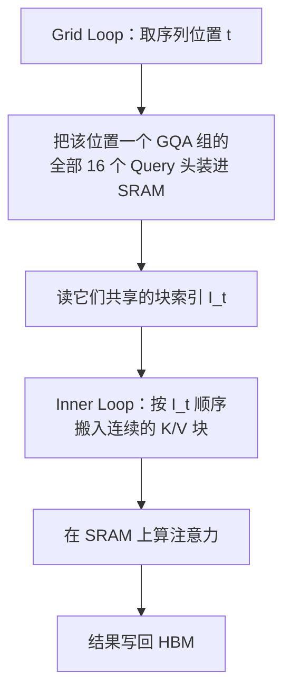
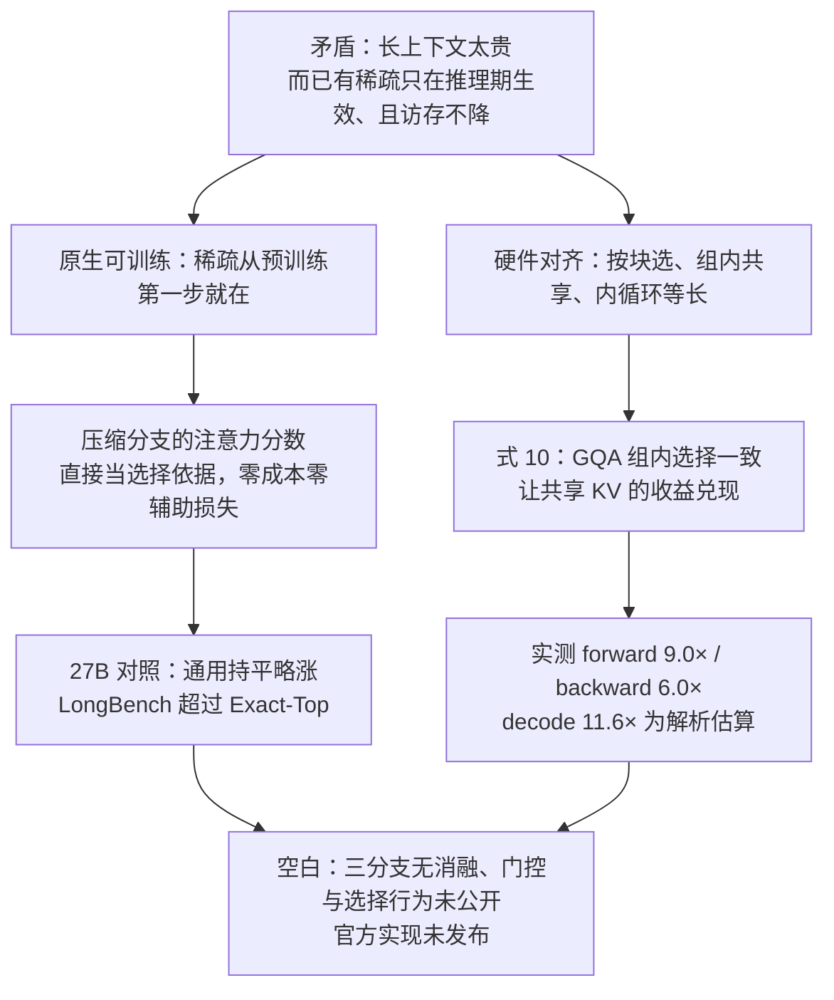

# NSA：稀疏注意力不该等到推理期才装上，也不该只在纸面上变快

<!-- release-date: 2025-02-16 -->

> 本文依据 DeepSeek-AI 等发布的 **Native Sparse Attention: Hardware-Aligned and Natively Trainable Sparse Attention**，即 arXiv:2502.11089v2、2025-02-27 修订版，共 25 页（正文与参考文献 20 页，附录 5 页）。封面署名三家机构：DeepSeek-AI、北京大学多媒体信息处理重点实验室 / PKU-Anker LLM Lab、华盛顿大学；第一作者 Jingyang Yuan 的贡献产生于在 DeepSeek-AI 实习期间（PDF p.1 脚注）。动笔前已核对 arXiv 官方页与官方 API：该论文只有 v1（2025-02-16）与 v2（2025-02-27）两个版本，**本地 PDF 就是最新的 v2**，不存在更新修订。页码均指 PDF 本身的页码。本文会把三件事分开写：**报告明确写了什么**、**我们如何理解它**（凡属推算、换算或图上读数都会写明）、**外部资料补充**（会给出链接并标注）。

## 阅读前先搭一张最小地图

这篇论文只讲注意力这一件事，但它借了不少系统领域的词。先把关键概念翻成人话。

- **Token（词元）**：模型读写内容时的基本小块。一百万字的文档会被切成上百万个 Token。
- **Query / Key / Value（查询 / 键 / 值）**：注意力的三个角色。Query 是当前 Token 的提问，Key 是每个历史位置的索引标签，Value 是它真正携带的内容。打分靠 Query 与 Key 做点积。
- **KV Cache（Key-Value Cache，键值缓存）**：生成时把算过的 Key 和 Value 留下来，避免每吐一个新 Token 就重算整段历史。
- **Prefill 与 Decode（预填充与解码）**：处理一个请求分两段。Prefill 一次性读完输入提示，Decode 随后逐个吐字。两段的硬件瓶颈完全不同，这是全文最重要的背景之一。
- **MHA / GQA / MQA**：Multi-Head Attention（多头注意力）里每个头有自己的一套 KV；Grouped-Query Attention（分组查询注意力）让一组内的多个 Query 头共用一套 KV；Multi-Query Attention（多查询注意力）是极端情形，所有头共用一套。GQA 和 MQA 的目的都是减少 decode 时要从显存搬运的 KV 数量。
- **FlashAttention**：把注意力按小块搬进片上高速缓存 SRAM、避免反复读写显存的实现方式。它算的是**精确**注意力，靠的是访存优化而非近似。**NSA 论文对它的定性是**：它「依赖连续的内存访问和按块计算才能达到高吞吐」（PDF p.5）——这是 NSA 用来批评按单 Token 选择的依据。需要说明的是，这句话是 NSA 的概括，FlashAttention 原文并没有把「内存访问必须连续」写成自己的前提条件；该结论更严格的依据是 FlashAttention 论文中按**非零块**比例计算复杂度的命题，详见本站 [FlashAttention 解读](/reports/Stanford/FlashAttention)。
- **Triton**：一种写 GPU 内核的语言，比手写 CUDA 容易，性能可以接近手写。论文的所有内核和它的对照基线都用 Triton 写，以保证公平。

这篇论文自己造的名字只有一个：

- **Native Sparse Attention（NSA，原生稀疏注意力）**：一种从预训练第一步就带着稀疏结构一起训练的注意力。它把历史分成三条并行通路——压缩、选择、滑动窗口——再用门控把三路输出合起来。

## 一句话先说清

NSA 想同时反对两件当时的主流做法。

**第一件：把稀疏当成推理期的补丁。** 绝大多数稀疏注意力方案，是拿一个已经用全注意力预训练好的模型，在推理时才开始跳过一些位置。论文说这会让模型偏离它自己的预训练优化轨迹（PDF p.4）。

**第二件：只报理论计算量的下降。** 论文在引言里说得很直白：很多方法拿不到与理论收益相称的实际加速（PDF p.2）。少算不等于少搬数据，而 decode 阶段真正卡住的是搬数据。

所以 NSA 的两条核心主张分别对着这两件事：

1. **Natively trainable（原生可训练）**：稀疏结构从预训练第一个 step 就在，前向和反向都有高效内核，因此训练本身也变便宜；
2. **Hardware-aligned（硬件对齐）**：按块选、按 GQA 组共享选择结果、内循环长度对齐，让节省下来的计算真的变成节省下来的时间。

论文的完整实验规模是：27B 总参数、3B 激活参数的 GQA + MoE 骨干，NSA 与全注意力基线用完全相同的配置各训一遍（PDF p.9-10）。

## 先看全景：一次 NSA 注意力发生了什么

这张图根据论文 §3.2、§3.3 与 Figure 2 重画（PDF p.3、6-8），画的是一次前向计算的**机制顺序**，不代表三条分支的耗时比例。图中的数字是论文实验采用的配置（PDF p.10）。注意从压缩分支到选择分支那条箭头——它是全文最关键的一条线，后面会专门讲。

三组必须先记住的数字，后面每一处都会回到出处：

| 项目 | 取值 | 出处 |
|---|---|---|
| 压缩块长 $l$ / 滑动步长 $d$ | 32 / 16 | PDF p.10 |
| 选择块长 $l'$ / 选中块数 $n$ | 64 / 16（其中 3 块写死） | PDF p.10 |
| 滑动窗口 $w$ | 512 | PDF p.10 |
| 骨干规模 | 27B 总参 / 3B 激活，30 层，hidden 2560 | PDF p.9 |
| 注意力配置 | GQA 4 组 × 16 头 = 64 头，$d_q=d_k=192$，$d_v=128$ | PDF p.9、13 |

## 第一层问题：长上下文到底卡在哪

### 卡点一：成本是平方增长的

标准注意力里，每个 Query 都要与它前面所有 Key 比一次。论文的式 (1) 和式 (2) 写的就是这件事（PDF p.5）：

$$
\mathbf o_t = \operatorname{Attn}(\mathbf q_t,\ \mathbf k_{:t},\ \mathbf v_{:t})
$$

$$
\operatorname{Attn}(\mathbf q_t,\mathbf k_{:t},\mathbf v_{:t})=\sum_{i=1}^{t}\frac{\alpha_{t,i}\mathbf v_i}{\sum_{j=1}^{t}\alpha_{t,j}},
\qquad
\alpha_{t,i}=e^{\frac{\mathbf q_t^{\top}\mathbf k_i}{\sqrt{d_k}}}
$$

式子本身很朴素：$\alpha_{t,i}$ 是当前 Query 与第 $i$ 个 Key 的相关度，$d_k$ 是 Key 的维度，除以 $\sqrt{d_k}$ 是为了不让点积随维度变大而失控。真正的问题在下标 $i$ 要跑遍 $1$ 到 $t$——序列翻十倍，比较工作翻一百倍。

### 卡点二：decode 阶段的延迟大头就在注意力上

论文给了一个很具体的判断：**理论估算表明，在 64k 上下文下做解码时，softmax 注意力占到总延迟的 70–80%**（PDF p.2）。

这句话值得停一下。它说的是 decode 而不是训练；它说的是延迟而不是 FLOPs；而且论文用的词是 "theoretical estimates"，没有给出这个估算的来源或推导。本文按"作者给出的估算"引用，不当作实测。

### 卡点三：为什么"少算了"却"没变快"

这是全文最值得学的一节。论文在 §3.1 先补了一个概念：**算术强度（arithmetic intensity）**，即一段计算的运算次数与访存字节数之比（PDF p.5）。

每张 GPU 都有一个由"峰值算力 ÷ 显存带宽"决定的临界算术强度：

- 高于这个阈值 → **compute-bound**，被算力卡住；
- 低于这个阈值 → **memory-bound**，被带宽卡住。

论文接着点明两个阶段的性质完全相反（PDF p.5-6）：

| 阶段 | 一次前向处理多少 Token | 算术强度 | 瓶颈 | 该优化什么 |
|---|---|---|---|---|
| 训练 / Prefill | 整段序列 | 高 | 算力 | 减少计算量 |
| Decode | 一个 Token | 低 | 带宽 | 减少访存量 |

Decode 每次只产生一个 Token，却要把整份 KV Cache 从显存读一遍。所以在 decode 里，"少算 90% 的乘法"如果没有同时"少读 90% 的字节"，延迟基本不会动。

这个区分是理解 NSA 一切设计选择的钥匙。

## 已有的路各自付什么代价：论文的两组批评

论文没有直接跳到自己的方案，而是先用整个第 2 节拆已有做法。它把批评分成两组。

### 第一组：推理期加速的幻觉（§2.1）

**问题 1：阶段受限的稀疏。** H2O 这类方法在自回归解码时稀疏，但 prefill 阶段仍要做昂贵的预处理（算注意力图、建索引）；MInference 反过来，只在 prefill 稀疏。结果是至少有一个阶段的成本与全注意力相当（PDF p.4）。

论文点出这为什么要命：书籍摘要、代码补全这类工作 prefill 占主导，长思维链推理则 decode 占主导。只优化一半，遇上另一半的负载就白搭。

**问题 2：与现代注意力架构不兼容。** 这一段是本文后面交叉核实的核心，先把论文原文的口径完整交代（PDF p.4）：

MQA 和 GQA 通过让多个 Query 头共享 KV，大幅缓解了 decode 的访存瓶颈。而在 Quest 这类方法里，**每个注意力头独立挑自己的 KV 子集**。论文承认，在 MHA 模型上这是没问题的——计算稀疏和访存稀疏都能拿到。但换到 GQA 架构上情况就变了：这时需要搬运的 KV 量，等于**同一个 GQA 组内所有 Query 头选择结果的并集**。

并集这两个字是关键。举一个本文构造的例子：一个组里 16 个头，每个头各选 16 个块。如果 16 个头选得很一致，并集可能只有 20 个块；如果各选各的，并集最多可以到 256 个块。计算量确实按每头 16 块算，但**从显存往 SRAM 搬的字节数按并集算**。于是论文的结论是：这类方法能减少计算操作，需要的 KV 访存却仍然偏高，散乱的访存模式与先进架构的高效访存设计相冲突。

### 第二组：可训练稀疏的迷思（§2.2）

**问题 3：事后加稀疏会掉性能。** 论文的理由是：后加的稀疏迫使模型偏离它预训练时走过的优化轨迹。它引用了一条很具体的证据——**注意力分数最高的 20% 位置，只覆盖了总注意力分数的 70%**（PDF p.4，引自 Chen et al. 2024b）。也就是说剩下 30% 的分数散在长尾里，直接砍掉并不无害；预训练模型里的 retrieval head 这类结构在推理期剪枝时是脆弱的。

**问题 4：训练本身也需要被加速。** 长文档预训练、长上下文微调、强化学习都要处理长序列，但已有稀疏方法基本只盯着推理，训练侧的计算难题没人解（PDF p.4）。

**问题 5：现有方法很难改成可训练的。** 论文给了两条具体路障：

- **不可训练的组件**：ClusterKV 用 k-means 聚类，MagicPIG 用 SimHash 选择。这些离散操作在计算图上是断点，梯度过不去，模型也就学不出更好的稀疏模式（PDF p.4）。
- **反向传播低效**：HashAttention 这类按单个 Token 粒度选择的方法，要从 KV Cache 里捞出大量互不相邻的 Token。这种非连续访存正好踩在 FlashAttention 的禁忌上——它依赖连续内存和按块计算才能跑满硬件。结果只能退回低利用率的实现，训练效率大幅下降（PDF p.5）。

把五个问题串起来，就得到 NSA 的设计约束清单：

1. 三个阶段（训练 / prefill / decode）都要真加速，不能拆东墙补西墙；
2. 选择的粒度必须是**连续的块**，才能用上 Tensor Core 和 FlashAttention 式的访存；
3. 在 GQA/MQA 上，选择结果必须**在组内保持一致**，否则访存收益被并集吃掉；
4. 不能引入不可微的聚类 / 哈希，也不能靠额外的辅助损失来学选择；
5. 前向和反向都要有高效内核。

NSA 的每一个设计选择，都能对回这份清单上的某一条。

## 总框架：把"看全部"换成"看一份重映射的紧凑集合"

论文的总框架只有四个式子，思路却很干净（PDF p.6）。

它不改注意力函数本身，而是替换掉喂给注意力的 KV。式 (3) 和式 (4) 说：

$$
\tilde K_t = f_K(\mathbf q_t,\mathbf k_{:t},\mathbf v_{:t}),
\qquad
\tilde V_t = f_V(\mathbf q_t,\mathbf k_{:t},\mathbf v_{:t})
$$

$$
\mathbf o_t^{*}=\operatorname{Attn}(\mathbf q_t,\ \tilde K_t,\ \tilde V_t)
$$

$f_K$ 和 $f_V$ 是"重映射策略"：给定当前 Query 和全部历史，产出一份更紧凑、信息密度更高的 KV。注意 $\tilde K_t$ 依赖 $\mathbf q_t$——这不是一份对所有 Query 都相同的静态压缩，而是每个 Query 各得一份。

然后式 (5) 允许同时用多种策略，再用门控合起来：

$$
\mathbf o_t^{*}=\sum_{c\in\mathcal C} g_t^{c}\cdot\operatorname{Attn}(\mathbf q_t,\ \tilde K_t^{c},\ \tilde V_t^{c})
$$

$\mathcal C=\{\text{cmp},\text{slc},\text{win}\}$，分别是压缩、选择、滑动窗口。$g_t^c\in[0,1]$ 是该分支的门控值，由输入特征经一个 MLP 加 sigmoid 得到（PDF p.6）。

这里有一个容易滑过去的细节：**$g_t^c$ 用的是 sigmoid，不是 softmax**。所以三个门控值不要求加起来等于 1，它们是三个各自独立的开关，而不是一个三选一的分配。三条分支各自内部做完整的 softmax 注意力，最后再加权相加。这与 MoBA 那种"被选中的块一起进同一个 softmax"是两种不同的合并方式。

最后式 (6) 定义总预算：

$$
N_t=\sum_{c\in\mathcal C}\operatorname{size}[\tilde K_t^{c}]
$$

论文说，靠保证 $N_t\ll t$ 来维持高稀疏率（PDF p.6）。

**本文换算**：代入论文配置（$l=32$、$d=16$、$l'=64$、$n=16$、$w=512$），

$$
N_t\approx \frac{t}{16}+16\times 64+512=\frac{t}{16}+1536
$$

在 $t=8192$ 时是 2048（占 25%），在 $t=65536$ 时是 5632（占 8.6%）。这两个数字与论文表 4 完全对上（PDF p.14），说明这个换算是对的。同时它也暴露了一件论文没有强调的事：**NSA 的稀疏率不是一个固定百分比，它随序列变长而变好**。后面讲加速比时还会回到这里。

## 分支一：压缩，把远处的历史折叠成摘要

论文的式 (7)（PDF p.6）：

$$
\tilde K_t^{\text{cmp}}=f_K^{\text{cmp}}(\mathbf k_{:t})=\left\{\varphi\!\left(\mathbf k_{id+1:id+l}\right)\ \middle|\ 0\leqslant i\leqslant \left\lfloor\frac{t-l}{d}\right\rfloor\right\}
$$

拆开读：

1. 沿序列切出长度为 $l$ 的块，相邻块之间的起点间隔是 $d$；
2. 每一块经过 $\varphi$ 压成一个 Key。$\varphi$ 是一个**可学习的 MLP，并且带块内位置编码**。

两个设计点值得单独讲。

**第一，$\varphi$ 是学出来的，不是求平均。** 论文只用了 "a learnable MLP with intra-block position encoding" 一句话（PDF p.6），没有给这个 MLP 的层数、宽度和位置编码形式。但"可学习"这三个字本身就是一条分水岭：朴素平均会把块内差异抹平，可学习的映射至少有机会让模型自己决定块里什么更重要，而块内位置编码让它知道"这条信息在块里靠前还是靠后"。

**第二，$d<l$ 意味着相邻压缩块是重叠的。** 论文明说这样做是为了"减轻信息碎片化"（mitigate information fragmentation，PDF p.6）。代入实验配置 $l=32$、$d=16$：每块 32 个 Token，每隔 16 个 Token 起一块，相邻块重叠一半。

为什么要重叠？可以想象切视频时保留前后几帧：如果块边界恰好把一句关键的话切成两半，不重叠的方案里这句话的两半会分别被稀释进两个不同的摘要；重叠的方案里至少有一个块完整地包含了它。

**代价**：重叠意味着压缩条目数量是 $t/d$ 而不是 $t/l$。$l=32$、$d=16$ 时，压缩比是 16:1 而不是 32:1。用一倍的条目数换边界鲁棒性，这个取舍论文没有做消融。

还有一件论文没有点破、但很重要的事：**压缩分支本身是密集的**。式 (8) 里 $\mathbf q_t$ 要与全部 $\lfloor (t-l)/d\rfloor+1$ 个压缩 Key 做注意力，一个都不跳。所以压缩分支的复杂度是 $O(t^2/d)$——仍然是平方，只是常数被压小了 16 倍。这是本文对式 (7)、式 (8) 的推算，论文没有做复杂度分析。后面讲 decode 访存时会看到这一项的实际后果。

## 分支二：选择，把最相关的几块原文捞回来

只有压缩摘要不够。如果问题是"第 37 万个 Token 处那个变量名是什么"，摘要里大概率没有。所以要有一条通路能读回原始的、未压缩的 Token。

### 为什么按块选，而不是按 Token 选

论文给了两条理由（PDF p.7）。

**理由一是硬件的。** 现代 GPU 对连续块访问的吞吐远高于随机索引读取，而且按块计算才能用满 Tensor Core。论文把这条写成加粗小标题：Blockwise selection is crucial to achieve efficient computation on modern GPUs。这一条其实是 §2.2 对 HashAttention 那条批评的正面回答——按 Token 选就注定要放弃 FlashAttention 式的实现。

**理由二是数据本身的。** 注意力分数在空间上是连续的：相邻的 Key 往往有相近的重要性。论文引了 MInference 的观察，也给了自己的证据：Figure 8 是他们从预训练好的 27B 全注意力模型上取的注意力图（PDF p.15），横轴是 KV 位置、纵轴是 Query 位置，颜色越亮注意力越高。图上能明显看到成条成块的亮区，而不是均匀撒开的孤立亮点。

这两条理由的关系很值得学：**硬件想要块，数据恰好也是块状的。** 如果数据本身是随机撒开的，硬件偏好就会变成精度上的硬伤；正因为两者对上了，按块选才既快又不太亏。

### 最漂亮的一步：重要性分数是免费的

这是全文最值得单独记住的设计。

选块要先给每块打分。问题是打分本身可能很贵——如果为此再跑一遍打分网络，省下来的计算就又还回去了。而且如果打分网络是新加的、与主注意力无关的模块，它没有直接的监督信号，就得配一个辅助损失来教它，这正是论文在 §6.1 批评过的路子（PDF p.15）。

NSA 的做法是：**分数不用另算，压缩分支算出来的中间结果就是分数。**

式 (8)（PDF p.7）：

$$
\mathbf p_t^{\text{cmp}}=\operatorname{Softmax}\!\left(\mathbf q_t^{\top}\tilde K_t^{\text{cmp}}\right)
$$

这就是压缩分支为了产出自己的输出，本来**就必须**算的那一步 softmax。$\mathbf p_t^{\text{cmp}}$ 的第 $i$ 个元素，是当前 Query 对第 $i$ 个压缩块的注意力权重——它天然就是"这一块有多相关"的度量。

这一步为什么关键，可以顺着因果链走一遍：

- **旧问题**：块重要性打分要么另加网络（贵，且需要辅助损失），要么用无参数启发式（论文实测召回率低）；
- **新设计**：把选择分数寄生在压缩分支的注意力分数上；
- **工作机制**：压缩分支的输出参与最终结果，因此 $\varphi$ 和 Query 投影都会收到主语言模型损失的梯度。$\varphi$ 学得越好，压缩 Key 越能代表整块，$\mathbf p_t^{\text{cmp}}$ 作为选择依据也就越准；
- **收益**：打分零额外成本，选择器零额外参数，不需要任何辅助损失；
- **代价与边界**：top-$n$ 这个排序操作本身仍然是不可微的。论文自己在 §6.1 就写着 "the selection operation is non-differentiable"（PDF p.15）。所以 NSA 并没有让离散选择变得可微，它是**绕开了这个问题**——把梯度接到产生分数的那条路上，而不是接到选择这个动作上。

这一点必须说清楚，因为它直接关系到"natively trainable"到底是什么意思，后面有专门一节。

### 压缩块与选择块粒度不一致时怎么办

论文允许压缩块长 $l$ 与选择块长 $l'$ 不同（实验里 $l=32$、$l'=64$）。这时要把压缩块上的分数折算到选择块上。式 (9)（PDF p.7）：

$$
\mathbf p_t^{\text{slc}}[j]=\sum_{m=0}^{\frac{l'}{d}-1}\ \sum_{n=0}^{\frac{l}{d}-1}\ \mathbf p_t^{\text{cmp}}\!\left[\frac{l'}{d}j-m-n\right]
$$

前提条件是 $l\leqslant l'$、$d\mid l$ 且 $d\mid l'$。

这个双重求和第一眼很吓人，代入实验数字就清楚了。**本文换算**：$l'/d=4$，$l/d=2$，所以 $m$ 跑 0 到 3、$n$ 跑 0 到 1，一共 8 项，落在 5 个相邻的压缩块索引上，其中中间 3 个各被数了两次。

为什么会这样？因为一个 64 长的选择块，被 5 个长度 32、步长 16 的重叠压缩块覆盖着；两端的压缩块只有一半落在这个选择块里，中间的完全落在里面。式 (9) 的双重求和正是在做这件事——按覆盖关系把分数聚起来，覆盖得多的压缩块自然贡献得多。

论文没有解释这个式子的直觉，也没有写清索引的偏移约定。本文只说结构，不替它补细节。

论文还补了一句更省事的情形：当 $l'=l=d$（即压缩块与选择块完全同构、且不重叠）时，$\mathbf p_t^{\text{slc}}=\mathbf p_t^{\text{cmp}}$，直接用，不用折算（PDF p.7）。

### 式 (10)：同一个 GQA 组里的头必须选一样的块

这是本文交叉核实任务的直接落点，先看论文原文怎么写（PDF p.7）：

> 对于采用 GQA 或 MQA、KV 缓存被多个 Query 头共享的模型，**必须确保这些头之间的块选择是一致的**（consistent block selection across these heads has to be ensured），以最小化 decode 时的 KV Cache 加载。

对应的式 (10) 是：

$$
\mathbf p_t^{\text{slc}'}=\sum_{h=1}^{H}\mathbf p_t^{\text{slc},(h)}
$$

其中 $(h)$ 是头的下标，$H$ 是一个组里的 Query 头数（实验里 $H=16$，PDF p.13）。

做法极其朴素：把组内所有头各自算出的块分数**直接相加**，得到一份组共享的分数，再拿它去做 top-$n$。于是这一组的 16 个头共用同一份选择列表。

为什么必须这样，回到 §2.1 的并集问题就懂了。GQA 的全部意义在于"一份 KV 被 16 个头复用，所以只搬一次"。如果 16 个头各选各的，从显存搬上来的 KV 是 16 份选择的并集，而每一条被搬上来的 KV 平均只被少数几个头用到——算术强度立刻塌下去，GPU 大部分时间在等数据。让 16 个头共用一份列表，搬一次就被 16 个头全用上，搬运成本才摊得开。

**代价**：这是精度上的一次真实让步。原本每个头可以有自己的关注偏好（这正是 retrieval head 之类结构的来源），现在被强行拉齐了。论文没有做"共享选择 vs 逐头选择"的精度消融，所以我们无法从本论文知道这一步亏了多少。这是一个明确的空白。

### top-n 选块，以及被写死的那 3 块

式 (11) 和式 (12)（PDF p.8）：

$$
\mathcal I_t=\left\{i\ \middle|\ \operatorname{rank}\!\left(\mathbf p_t^{\text{slc}'}[i]\right)\leqslant n\right\}
$$

$$
\tilde K_t^{\text{slc}}=\operatorname{Cat}\!\left[\left\{\mathbf k_{il'+1:(i+1)l'}\ \middle|\ i\in\mathcal I_t\right\}\right]
$$

选分数最高的 $n$ 块，把这些块里的**原始** Key 拼起来。注意这里取的是 $\mathbf k$ 而不是压缩后的 Key——选择分支读的是未压缩的原文，这正是它存在的意义。

但实验配置里藏着一句括号（PDF p.10）：$n=16$，**including fixed activating the 1 initial block and 2 local blocks**。也就是说 16 个名额里，第 1 块（序列开头）和最近 2 块是写死激活的，真正由分数决定的只有 13 个。

这一句只在实验设置里出现了一次，论文没有解释原因，也没有做消融。**本文的观察**是：写死开头那一块对应 attention sink（注意力汇聚点）的经验，写死最近两块对应局部性。它与论文在 §7.1 的自我定位存在一点张力——那里写着 NSA "不依赖预定义的稀疏模式，而是自动学习模式"（PDF p.16）。事实上 NSA 有相当多的固定结构：写死的 3 块、独立的滑窗分支、以及对全部压缩条目做密集注意力的压缩分支。更准确的说法是：**NSA 把一部分结构写死以保底，把另一部分留给模型学。** 这与 MoBA 明确主张的 less structure（少结构）是两种不同的取舍，后面会展开。

## 分支三：滑动窗口，以及一个反直觉的理由

滑窗分支本身很简单，就是保留最近 $w$ 个原始 Token（PDF p.8）：

$$
\tilde K_t^{\text{win}}=\mathbf k_{t-w:t},\qquad \tilde V_t^{\text{win}}=\mathbf v_{t-w:t}
$$

有意思的是论文给的理由。它不是说"局部信息重要所以要留"，而是反过来：

> 在注意力机制里，局部模式通常适应得更快，并且可能主导整个学习过程，从而阻碍模型有效地从压缩和选择 Token 中学习。（PDF p.8）

换句话说，滑窗分支的作用是**当避雷针**。如果不给局部信息一条专用通路，压缩和选择这两条分支会发现"只盯着最近几个 Token"就能把损失降得很低，于是走捷径，永远学不会真正的长程能力。把局部信息隔离到一条独立分支上，等于把这条捷径堵死，逼着另外两条分支去学它们该学的东西。

论文还把这个隔离做到了更彻底的程度：**三条分支各自拥有独立的 Key 和 Value**（PDF p.8）。它给的理由是进一步防止分支间的捷径学习，代价是"边际的计算开销"。

这里有一条论文没有算的账，本文必须点出来：**独立的 K/V 意味着显存里要放三套投影结果。** 论文全篇只报告 decode 时的**访存量**（表 4，PDF p.14），从头到尾没有报告 KV Cache 的**存储量**。而选择分支要能选中任何一个历史块，就必须把全长度的原始 K/V 都留着。所以：

> **NSA 减少的是每一步要搬多少 KV，不是要存多少 KV。**

这是本文的推论，不是论文原文，但它从式 (11)、式 (12) 可以直接推出——任何块都可能在下一步被选中，因此一个都不能丢。对工程选型很重要：如果瓶颈是 KV Cache 显存而不是访存带宽，NSA 的收益要重新评估，而论文没有提供这方面的任何数字。

## 于是回到核心主张：natively trainable 到底是什么意思

这是全篇最容易被误读的一个词，值得单独拆。

**它不是指 top-$n$ 变可微了。** 论文自己在 §6.1 写着选择操作是不可微的（PDF p.15）。

**它也不是指模型能在稀疏和稠密之间自由切换。** 论文全文没有这个主张，实验里也没有任何切换设置。NSA 是从第一步就用 NSA 训到底的。

**它实际指的是三件事的合集：**

1. **稀疏在预训练时就在。** 论文的对照实验里，NSA 模型和全注意力模型是两个从头训练、除注意力模块外配置完全一致的模型（PDF p.9-10）。这样模型的所有其他部分从一开始就是围着稀疏结构长起来的，不存在 §2.2 说的"偏离预训练轨迹"。
2. **不需要辅助损失来学选择。** 因为分数寄生在压缩分支上，梯度沿主损失自然流到 $\varphi$ 和 Query 投影。论文在 §6.1 实测了需要辅助损失的那条路（对标 SeerAttention 的思路），损失更差（PDF p.15，Figure 7）。
3. **反向传播也有高效内核。** 论文明确把 backward operator 列为两大创新之一（PDF p.3），并在 Figure 6 单独报了反向的加速（PDF p.13）。这是它和"只在推理期稀疏"的方案最实际的区别——训练也真的变便宜了。

用一张图把这条梯度路径画清楚：

这张图是本文对 §3.3.2 与 §6.1 的归纳（PDF p.7、15），画的是**梯度与依赖关系**，不是数据流顺序。实线表示有梯度通过，虚线表示只有前向依赖、没有梯度。它想说明的就是那句话：**梯度绕过了不可微的排序，接在了产生分数的那条可微通路上。**

**可迁移的启发**：当你的系统里有一个必须做的离散决策（路由、检索、剪枝、缓存淘汰），不要急着把它松弛成可微的近似，也不要急着给它配一个辅助损失。先问一句：**系统里有没有哪个已经被主损失监督着的中间量，可以直接当作这个决策的依据？** 如果有，你就同时省掉了参数、算力和一个需要调权重的损失项。

## 内核设计：让共享的选择结果真的兑现成带宽

算法上让一个组的头共选同一批块，只是拿到了兑现收益的资格。真正兑现还要靠内核。

论文在 §3.4 交代了前提（PDF p.8）：MHA 在 decode 时访存密集且低效，所以他们只面向 GQA、MQA 这类共享 KV 的架构做优化。压缩分支和滑窗分支的模式规整，现成的 FlashAttention-2 内核就能用；只有选择分支需要专门写。

难点在哪？如果照 FlashAttention 的常规做法，把时间上连续的一批 Query 装进 SRAM，就会踩坑——**同一批 Query 可能需要互不相交的 KV 块**（PDF p.8）。装进来一批 Query，却要为它们分别去取完全不同的 KV，访存立刻散掉。

NSA 换了一个分组维度：**不按时间连续切 Query，按 GQA 组切 Query。**

这张图根据论文 §3.4 的三条特性与 Figure 3 重画（PDF p.8-9），是**机制示意**，不含任何实测时间。

论文列的三条特性对应图上三段（PDF p.8-9）：

1. **Group-Centric Data Loading（按组取数据）**：内循环每次装入该位置上一个组的全部头的 Query $Q\in\mathbb R^{[h,d_k]}$，以及它们共享的块索引 $\mathcal I_t$。
2. **Shared KV Fetching（共享 KV 取数）**：内循环按 $\mathcal I_t$ **顺序**搬入连续的 K/V 块，内核块大小 $B_k$ 必须整除选择块长 $l'$（记作 $B_k\mid l'$）。这个整除条件不是装饰——它保证一个选择块能被整数个内核块干净地覆盖，不出现跨块的碎片读。
3. **Outer Loop on Grid（外循环交给网格调度）**：因为内循环长度正比于选中块数 $n$，而 $n$ 对每个 Query 块都几乎相同，所以 Query / 输出的外循环可以直接丢给 Triton 的 grid scheduler。

论文对这套设计的总结是：通过组内共享消除冗余的 KV 传输，并让各个 SM（流式多处理器）的计算负载均衡，从而达到接近最优的算术强度（PDF p.9）。

第 3 条特别值得抠一下。**"内循环长度几乎相同"这件事，是被算法设计特意保证的。** 每个 Query 都恰好选 $n$ 个块，不多不少。对比一下 §6.1 批评的聚类方案：ClusterKV 的簇大小不均，会导致算子优化困难和持续的负载不均，在 MoE 系统里还会让 EP 组的执行时间倾斜（PDF p.14）。NSA 用一个固定的 $n$ 换来了调度上的"什么都不用管"。

**可迁移的启发**：写高性能算子时，**让工作单元的长度可预测，往往比让每个工作单元更快更值钱**。固定 top-$n$ 看起来是一个算法上的粗糙决定，实际上是把负载均衡这个难题在算法层就消掉了。

## 实验：它证明了什么

### 预训练设置

骨干是 GQA + MoE：27B 总参数、3B 激活参数，30 层，hidden 2560。GQA 分 4 组、共 64 个注意力头，$d_q=d_k=192$、$d_v=128$。MoE 用 DeepSeekMoE 结构，72 个路由专家 + 2 个共享专家，top-k 取 6；为训练稳定，第一层的 MoE 换成 SwiGLU 形式的 MLP（PDF p.9）。

NSA 与全注意力基线用完全相同的配置，都在 8k 长度文本上训练，之后用 YaRN 在 32k 长度文本上做继续训练和监督微调以适应长上下文；两个模型都训到完全收敛（PDF p.10）。

**这里有一处论文自身的口径不一致，需要指出**：引言说预训练用了 **260B tokens**（PDF p.3），§4.1 说两个模型都在 **270B tokens** 的 8k 文本上预训练（PDF p.10）。两处指向同一组实验，论文没有解释差异。本文按有具体上下文的 270B 引用，并在此标出这处不一致供读者核对原件。

Figure 4 给了两条预训练损失曲线（PDF p.10），横轴到 60000 step。两条都平稳下降，NSA 全程略低于全注意力。**本文从图上看到**：曲线在 10000 step 附近有几处明显的向上尖峰，两个模型都有，论文正文没有讨论这些尖峰。

### 通用基准：稀疏没有掉点，反而略涨

Table 1（PDF p.10）：

| Benchmark | Full Attn | NSA | 差值 |
|---|---:|---:|---:|
| MMLU (5-shot) | 0.567 | 0.565 | −0.002 |
| MMLU-PRO (5-shot) | 0.279 | 0.286 | +0.007 |
| CMMLU (5-shot) | 0.576 | 0.587 | +0.011 |
| BBH (3-shot) | 0.497 | 0.521 | +0.024 |
| GSM8K (8-shot) | 0.486 | 0.520 | +0.034 |
| MATH (4-shot) | 0.263 | 0.264 | +0.001 |
| DROP (1-shot F1) | 0.503 | 0.545 | +0.042 |
| MBPP (3-shot) | 0.482 | 0.466 | −0.016 |
| HumanEval (0-shot) | 0.335 | 0.348 | +0.013 |
| **平均** | **0.443** | **0.456** | **+0.013** |

论文的读法是：NSA 在 9 项里赢了 7 项，推理类基准的提升最明显（DROP +0.042、GSM8K +0.034）。它给的解释是——稀疏预训练迫使模型聚焦于最重要的信息，可能通过过滤掉无关注意力路径上的噪声来提升性能（PDF p.11）。

**本文的读法要更保守一点**。这个解释论文自己用的词是 "potentially"，没有任何直接证据（比如注意力熵、噪声度量或对照消融）支撑。而且注意这些基准的样本长度大多在 8k 以内，此时 NSA 的稀疏率只有约 25%（本文换算，见前面 $N_t$ 一节），并没有真正稀疏起来。更稳的表述是：**在这个规模和这批数据上，NSA 没有以通用能力为代价换取稀疏；至于它为什么略好，本论文没有给出被验证的原因。**

论文自己在同一段也承认，NSA 在短序列上可能无法充分发挥效率优势（PDF p.11）。

### 长上下文：这是 NSA 唯一跑了同类稀疏基线的地方

Table 2（PDF p.11），LongBench 上与四个推理期稀疏方法及全注意力的对比：

| 方法 | 平均分 | 相对全注意力 |
|---|---:|---:|
| H2O | 0.303 | −0.134 |
| InfLLM | 0.383 | −0.054 |
| Quest | 0.392 | −0.045 |
| Exact-Top | 0.423 | −0.014 |
| Full Attn | 0.437 | — |
| **NSA** | **0.469** | **+0.032** |

对照口径论文交代得很清楚（PDF p.12）：为了公平，所有稀疏基线每个 Query 激活的 Token 数都设为 2560，这对应 NSA 处理 32k 序列时的**平均**激活数；照 StreamingLLM 的做法，这个预算里包含开头 128 个和最近 512 个 Token。另外，论文排除了 LongBench 里若干所有模型得分都很低的子集，但**没有说排除了哪些**。

**本文验算了 2560 这个数字**：32k 序列上，压缩条目数随位置从 0 涨到 $32768/16=2048$，平均是 1024；再加选择的 $16\times 64=1024$ 和滑窗的 512，正好 2560。这说明论文的对照口径是老实的——它按平均而不是按峰值给基线定预算。

这张表里最有意思的一行是 **Exact-Top**：它先算出完整的注意力分数，再按分数取 top-$n$ 个 Key。这是"选择质量"的理论上限——没有任何近似误差的选择器。它拿到 0.423，仍低于全注意力的 0.437，也远低于 NSA 的 0.469。

**本文的推论**：这个结果说明 NSA 的优势主要不是来自"选得更准"。如果只是选得准，它顶多逼近 Exact-Top。NSA 高出 Exact-Top 0.046，只能来自另一件事——**模型是带着稀疏一起训出来的**，其余部分与稀疏结构协同适配过。这恰好是论文"native"这个主张最有力的一条实验证据，比 Table 1 上那 0.013 的平均提升说服力强得多。论文正文的归因（PDF p.12）也是这个方向，本文认同并把它读成全文最关键的一个数字。

分项上，NSA 在多跳问答（HPQ +0.087、2Wiki +0.051）、代码理解（LCC +0.069）、段落检索（PassR-en +0.075）上相对全注意力的提升最大（PDF p.12）。它输的两项是 GovRpt（0.307 对 0.324）和 PassR-zh（0.550 对 0.560）。

Figure 5 是 64k 上下文的大海捞针热力图，全绿满分（PDF p.12）。**本文的判断**与 NIAH 这个任务本身的性质有关：全绿说明"64k 下不会崩"，不说明"64k 下检索能力很强"。而且这里有一处论文没有交代的事：模型的长上下文适配是在 **32k** 文本上用 YaRN 做的（PDF p.10），NIAH 却测到 **64k**。YaRN 的目标长度设成了多少、这算不算外推，论文没写。

### 长思维链推理：唯一一次后训练实验

论文想验证 NSA 能不能承接下游的复杂训练范式。因为小模型上强化学习效果有限，他们改用从 DeepSeek-R1 蒸馏：用 10B tokens 的 32k 长度数学推理轨迹做监督微调，得到 NSA-R 和 Full Attention-R 两个模型，在 AIME 24 上评测。采样温度 0.7、top-$p$ 0.95，每题生成 16 条取平均（PDF p.12）。

Table 3（PDF p.13）：

| 生成长度上限 | Full Attention-R | NSA-R | 差值 |
|---|---:|---:|---:|
| 8192 | 0.046 | 0.121 | +0.075 |
| 16384 | 0.092 | 0.146 | +0.054 |

论文的解释是：预训练出来的稀疏模式能有效捕捉复杂数学推导所需的长程逻辑依赖（PDF p.13）。

**本文必须给这张表加三条边界**：

1. 两列的绝对值都很低（最高 0.146）。AIME 这类竞赛集题量本身就小（论文没有写具体题数），每题只采 16 次，在这个准确率水平上方差不容忽视，而论文没有给置信区间或多次重复。
2. 论文只做了蒸馏，没有做强化学习，理由是"小规模模型上强化学习效果有限"（PDF p.12）。所以引言里提到的"长思维链推理"这个动机，只被半个实验闭合。
3. 附录 A 给了两道题的完整对照（PDF p.21-25）。**本文的观察**：第一道题里 NSA-R 用 2275 个思考 Token 得到正确答案 33，基线用了 9392 个思考 Token 反而算错（131）；第二道题 NSA-R 用 15147 个 Token 答对 25，基线用 16223 个 Token 答错。这两个例子很生动，但它们是精选的定性样例，不能当作统计证据。

## 效率数字：分母必须写清楚

这是本类论文最容易被误读的地方，也是本文认为最需要花笔墨的一节。

论文一共给了三个加速比，**它们的性质完全不同**：

| 数字 | 测的是什么 | 阶段 | 对照基线 | 性质 | 出处 |
|---|---|---|---|---|---|
| 9.0× | 注意力层前向的内核时间 | 训练 forward / prefill | Triton 版 FlashAttention-2 | **实测** | PDF p.13、图 6 |
| 6.0× | 注意力层反向的内核时间 | 训练 backward | 同上 | **实测** | PDF p.13、图 6 |
| 11.6× | 每步注意力的访存 Token 数之比 | decode | 全注意力的访存量 | **解析估算** | PDF p.14、表 4 |

### 实测的两个：9.0× 与 6.0×

测量环境是 8 卡 A100 系统，配置 GQA 组 $g=4$、每组 $h=16$ 头、$d_k=192$、$d_v=128$，NSA 参数与 §4 相同（PDF p.13）。

对照做得很讲究：**用 Triton 版的 NSA 内核对 Triton 版的 FlashAttention-2**，而不是拿 Triton 去比手写 CUDA。论文明说这是为了保证在同一后端上做公平的速度比较（PDF p.13）。这是值得学的做法——跨后端比速度，很容易把编译器差异当成算法收益。

Figure 6 给了四个长度上的加速比（PDF p.13）：

| 上下文长度 | 8k | 16k | 32k | 64k |
|---|---:|---:|---:|---:|
| 前向加速 | 2.1× | 3.8× | 6.3× | 9.0× |
| 反向加速 | 1.1× | 2.0× | 3.4× | 6.0× |

两条规律很清楚：加速随长度增长；**反向的加速始终明显低于前向**。8k 时反向只有 1.1×，基本等于没有。论文没有讨论后一条。**本文的推测**（论文未写，仅供参考）：反向要处理稀疏索引的梯度累加，且论文只在 Figure 3 画了前向的内核结构，反向内核的设计全文没有交代。

Figure 6 的柱子分三种：FlashAttention-2、Sparse Attention Kernel、Compression and Window Attention。**本文从图上读到**：64k 前向时 FlashAttention-2 约 990 ms，NSA 的两组柱子加起来约 110 ms，比值确实约 9。这些是图上读数，论文没有给数值表。

必须记住的限定：**这是注意力层的内核时间，不是端到端训练吞吐，也不是线上服务延迟。** 一个模型里还有 FFN、MoE、通信等等，注意力快 9 倍不等于训练快 9 倍。

### 解析估算的那个：11.6×

Table 4（PDF p.14）：

| 上下文长度 | 8192 | 16384 | 32768 | 65536 |
|---|---:|---:|---:|---:|
| 全注意力访存量（等效 Token 数） | 8192 | 16384 | 32768 | 65536 |
| NSA 访存量（等效 Token 数） | 2048 | 2560 | 3584 | 5632 |
| Expected Speedup | 4× | 6.4× | 9.1× | 11.6× |

表题写得很老实：这是**每次注意力操作在 decode 时的访存量**，"由于 decode 的低算术强度和 memory-bound 特性，**期望**加速比与访存量大致成线性"。

**本文完整验算了这张表**，结论很关键：

$$
\text{NSA 访存量}=\underbrace{\frac{s}{d}}_{\text{压缩条目}}+\underbrace{n\,l'}_{\text{选中 Token}}+\underbrace{w}_{\text{滑窗}}
=\frac{s}{16}+1024+512
$$

代入四个长度：$8192/16+1536=2048$；$16384/16+1536=2560$；$32768/16+1536=3584$；$65536/16+1536=5632$。四个数字与表完全一致。而"Expected Speedup"一列就是把上一行除以下一行：$8192/2048=4$、$16384/2560=6.4$、$32768/3584\approx 9.1$、$65536/5632\approx 11.6$。

所以这张表里的 **11.6× 是一个纯粹的算术比值，不是任何一次实测的延迟**。论文没有跑 decode 的实际计时。

这不是说这个数字没有意义——decode 确实是 memory-bound，访存量确实是第一性的近似。但它与 9.0×、6.0× 有本质区别：后两个包含了内核实现的真实开销（启动、索引、非满块、同步），前一个不包含任何实现开销。

**而 Figure 1 把这三个数字并排画在同一张柱状图上（PDF p.2），标题是 "Speed on Stages"，图注也只说 "achieves substantial computational speedup"，没有区分哪个是实测、哪个是估算。** 这是本文认为全文最需要读者自己加注的一处。

### 一个论文没算、但决定长期趋势的数

再看一次访存拆解：$s/16+1536$。

- 在 8k 时，压缩条目占 512，选择+滑窗占 1536——**选择分支是大头**；
- 在 64k 时，压缩条目占 4096，选择+滑窗仍是 1536——**压缩分支占了 73%**。

两项相等的临界点是 $s/16=1536$，即 $s=24576$。**本文推算**：超过约 24k 上下文之后，NSA 的 decode 访存就由压缩分支主导，而压缩分支是密集的、随长度线性增长的。

这个结论有两层含义：

1. NSA 的 decode 访存不是常数，它随上下文线性增长，只是斜率是 $1/16$；
2. **如果要把 NSA 推到远超 64k 的长度，下一个该优化的是压缩分支，不是选择分支。** 把 $n$ 或 $l'$ 调小收益有限，把压缩步长 $d$ 调大或者给压缩分支本身也加一层稀疏，才是杠杆所在。

论文没有做这个分析，也没有在超过 64k 的长度上测过任何东西。这是从它自己的式 (6) 和表 4 直接推出的，供读者自行判断。

顺带说一句：DeepSeek 后来在 V3.2 的 DSA 和 V4 的 CSA/HCA 里，正是往"给压缩后的历史再加一层检索"和"分层压缩率"这两个方向走的。本仓库已发布的 `reports/DeepSeek/DeepSeek-V3.2.md` 与 `reports/DeepSeek/DeepSeek-V4.md` 可以对照阅读。

## 作者自己走过的弯路：§6.1 值得单独读

很多论文的 Discussion 只是重复结论，NSA 的 §6.1 不是——它老实交代了设计 NSA 之前试过什么、为什么放弃（PDF p.14-15）。

### 弯路一：基于 Key 聚类的方案

以 ClusterKV 为代表：把同一簇的 Key/Value 存在连续内存里。理论上训练和推理都可行，但论文列了三条硬伤：

1. 动态聚类机制本身带来不小的计算开销；
2. **簇间不均衡会加剧算子优化难度**——尤其在 MoE 系统里，专家并行（EP）组的执行时间被拉偏，形成持续的负载不均；
3. 必须周期性重新聚类，还要配合分块顺序（chunk-sequential）的训练协议，实现上处处受限。

第 2 条特别值得记：**一个注意力方案的负载不均，会通过 MoE 的专家并行放大成整个集群的负载不均。** 这是把算法放进真实训练系统里才会浮现的问题，单看单卡 benchmark 看不出来。它也反过来解释了 NSA 为什么坚持固定的 $n$。

### 弯路二：另外两类分块选择

论文在一个 3B 模型上把两条替代路线跑成了对照实验（PDF p.15，Figure 7）：

**(a) 基于辅助损失的可学习选择。** 他们给每个 Token 加了额外的 Query、给每个块加了代表性 Key 来估计块重要性；用块内注意力分数的均值池化做块级监督信号，用 KL 散度监督块重要性预测。为了兼容高效 decode，Query 保持单个粒度而不是块平均。论文说这个思路与 SeerAttention 概念相近。

**(b) 无参数启发式选择。** 照 Quest 的做法，用 Query 与 Key 块的逐坐标 min-max 的乘积直接选，不引入任何新参数。他们还额外试了冷启动：前 1000 步用全注意力，之后再切到启发式分块选择。

Figure 7 的四条曲线（3B 模型，横轴到 30000 step）**本文从图上读到**的收敛顺序是：NSA 最低，全注意力次之，(a) 和 (b) 两条最高且基本贴在一起。论文的表述是两种方法都表现出更差的损失（PDF p.15）。论文没有给数值表。

对应到 §6.1 开头列的两条批评（PDF p.15）：(a) 因为选择不可微，只能靠辅助损失，增加算子开销且常常损害性能；(b) 启发式打分召回率低。

**这组实验的价值在于它是 NSA 唯一的"选择机制"消融。** 但要注意它换到了 3B 模型，与主实验的 27B 不是同一个规模，也没有报告这三种方案在 3B 上的效率差异。

### 弯路的反面：Figure 8 提供的正面依据

Figure 8 是他们从预训练好的 27B 全注意力模型上取的注意力图（PDF p.15）。横轴是 KV 位置（到约 1000），纵轴是 Query 位置（到约 250），颜色标尺是对数刻度的 −1 到 −3，亮色表示注意力值更高。图上能看到成条成片的亮区。

论文的结论很克制：这个块状聚集现象说明序列上相邻的 Token 可能与 Query 共享某种语义关系，**但这些关系的确切性质还需要进一步研究**（PDF p.15）。

这是一个很好的写作示范——用可视化支持设计动机，同时明确说明它只是启发，不是证明。

## 与同期方案的关系

### 与 MoBA：两条不同的取舍路线

NSA 的 arXiv v1 提交于 2025-02-16，MoBA 是 2025-02-18，相差两天（外部核对：[arXiv API](http://export.arxiv.org/api/query?id_list=2502.11089)、本仓库 `reports/Moonshot/MoBA.md`）。**NSA 的参考文献里没有引用 MoBA**（PDF p.17-20），两者是独立的同期工作。

下面这张对照表**只依据 NSA 原文与本仓库已发布的 MoBA 篇**，不引入任何双方未写的细节：

| 维度 | NSA | MoBA |
|---|---|---|
| 新增参数 | 有：压缩 MLP $\varphi$、门控 MLP、三条分支各自独立的 K/V（PDF p.6、8） | 无，门控是 mean pooling + 点积（MoBA 篇，PDF p.4） |
| 块代表向量 | 可学习 MLP，带块内位置编码（PDF p.6） | 参数无关的均值池化（MoBA 篇，PDF p.3） |
| 打分成本 | 零额外成本，复用压缩分支的注意力分数（PDF p.7，式 8） | 一次 $N\times h\times n$ 的稠密矩阵乘（MoBA 篇，Algorithm 1 第 5 行） |
| 头之间的选择 | **同一 GQA 组内强制一致**（PDF p.7，式 10） | 逐头独立（MoBA 篇记述其 $S\in\mathbb R^{N\times h\times n}$ 带头维度） |
| 局部信息 | 独立分支，独立 K/V，$w=512$（PDF p.8） | 当前块强制选中，进同一个 softmax，类比 shared expert（MoBA 篇，PDF p.4） |
| 分支合并 | 三路各自 softmax 后按 sigmoid 门控加权求和（PDF p.6，式 5） | 选中的块一起进一个 softmax，用 online softmax 合并（MoBA 篇，PDF p.4-5） |
| 与全注意力切换 | 论文未提出，也未实验 | 核心主张，三处可切换（MoBA 篇，PDF p.4、7-9） |
| 覆盖的阶段 | 训练 forward / backward 有实测，decode 有解析估算（PDF p.13-14） | 只有注意力层前向、prefill 场景（MoBA 篇，PDF p.9-10） |
| 是否与稀疏基线比过 | 比过：H2O、InfLLM、Quest、Exact-Top（PDF p.11） | 未比，只与全注意力比（MoBA 篇记述） |
| 结构预设 | 写死 3 个块 + 独立滑窗 + 密集压缩分支（PDF p.8、10） | 明确主张 less structure（MoBA 篇，PDF p.2） |

把这张表读成一句话：**两篇论文在"块稀疏 + top-k 选择"这个骨架上是一致的，分歧全在于愿意为硬件让渡多少自由度。** NSA 愿意加参数、写死几块、强制头共享，换来三个阶段都真加速；MoBA 坚持零参数、少结构，换来随时切回全注意力的自由，代价是 decode 阶段干脆不用它。

### 交叉核实：DeepSeek-V3.2 转述的那条"内核层面要求"

本仓库的 `reports/Moonshot/MoBA.md` 在"与同期方案的关系"一节留了一个明确的待办：`reports/DeepSeek/DeepSeek-V3.2.md` 记录了 DeepSeek 引用 NSA 得出的一条内核层面要求——**每个 KV 条目必须被多个 Query 头共享，计算才划算**；而 MoBA 是逐头独立做门控的，这个差异是否重要，待 NSA 篇解读后核实。

读完 NSA 原文，可以给出四条明确结论。

**第一，NSA 原文确实提出了这条要求，出现在三处，口径逐次收紧。**

- **PDF p.4，§2.1**：批评 Quest 式的逐头独立选择。原文承认它在 MHA 上同时具备计算稀疏与访存稀疏，但在 GQA 上，需要搬运的 KV 量等于**同一 GQA 组内所有 Query 头选择结果的并集**，于是"计算减少了，所需的 KV Cache 访存仍然相对偏高"。
- **PDF p.7，式 (10) 前后**：这是最正式的一次。原文用的是 **has to be ensured**——对于 GQA 或 MQA 这类 KV 被多头共享的模型，**必须确保**这些头之间的块选择一致，以最小化 decode 时的 KV Cache 加载。式 (10) 就是实现手段：把组内各头的块分数直接相加，得到一份组共享的分数。
- **PDF p.8-9，§3.4**：内核层面的落地。原文说"鉴于 MHA 访存密集且 decode 低效，我们聚焦于 GQA、MQA 这类共享 KV 的架构"，内核按 GQA 组装载 Query"因为它们共享同一批稀疏 KV 块"，并把收益归结为"通过组内共享消除冗余的 KV 传输"。

**第二，它是 NSA 这套内核的硬性前提，但作为一条普适原则它是有条件的。**

说它硬性，是因为 §3.4 的三条特性全都建立在"一个组共用一份索引列表"之上：没有共享列表，Shared KV Fetching 的顺序连续读就退化成散读，Outer Loop on Grid 依赖的"内循环长度几乎相同"也不再成立。式 (10) 不是可选优化，是这套内核能成立的结构前提。

说它有条件，是因为论文的条件句写得很清楚：这条要求的适用前提是"**对于 KV 已经被多个 Query 头共享的模型**"（GQA 或 MQA）。而且论文在 p.4 明确让步过一步——在 MHA 模型上，逐头独立选择是可以同时拿到计算稀疏和访存稀疏的。所以准确的表述不是"每个 KV 条目必须被多个 Query 头共享"，而是：**当架构已经靠多头共享 KV 来省访存时，稀疏选择就必须在同一个共享单位上做，否则并集会把这份共享收益吃掉。** 被要求"共享"的对象是**选择索引列表**，不是 KV 条目本身。

另外要补一条范围限定：这条要求的动机在原文里始终锚定在 **decode 的访存**（式 10 那句话的目的状语就是 "to minimize KV cache loading during decoding"）。训练和 prefill 是 compute-bound 的，并集问题在那里没有同等的杀伤力。

**第三，MoBA 篇现在那句转述基本准确，不构成事实错误，但建议补两个限定词。**

先说为什么不算错。MoBA 篇转述的对象是 `DeepSeek-V3.2.md` 里"DeepSeek 在 V3.2 报告里引用 NSA 得出的一条要求"，并且它已经明确写了这是 V3.2 报告的转述、不是 NSA 原文（MoBA 篇的"资料与阅读边界"一节写得很清楚）。就"NSA 确实提出过这条内核层面的要求"这一点而言，转述方向正确。而且 MoBA 篇在结论上很克制——它只指出差异存在、明说"待核实、本文不下结论"，没有据此评判 MoBA 的优劣。这个处理是稳的。

建议主维护者补的两个限定词是：

1. **条件性**：这条要求以"KV 已被多头共享的架构（GQA/MQA）"为前提，NSA 原文在 MHA 上明确让步过（PDF p.4）；
2. **对象**：被要求一致的是**选择索引**，而不是 KV 条目本身；实现方式是式 (10) 的组内分数求和（PDF p.7）。

**第四，这个差异对 MoBA 到底重不重要——本文的判断是：重要，但它落在 MoBA 已经主动避开的那个场景里。**

理由有两条，都可以从两篇论文自己的文本推出：

- MoBA 在全部评测里**只在 prefill 用 MoBA，decode 切回全注意力**（MoBA 篇记述其 PDF p.9）。而 NSA 这条要求的动机完全锚定在 decode 访存。所以在 MoBA 实际跑过的配置里，这条要求没有被触发。
- 但反过来说，它精确地解释了 MoBA 为什么**不能**简单地在 decode 用起来：MoBA 逐头独立门控，若基座是 GQA 模型，decode 时要搬的 KV 就是组内各头选择的并集，正好落进 NSA 在 p.4 批评 Quest 的那个情形。MoBA 论文只用"性能更好"四个字解释为什么 decode 切回全注意力（MoBA 篇记述），没有讨论访存维度；NSA 的分析给这个空白提供了一个结构性的候选解释。

这里补一条本仓库内部的交叉引用：MoBA 的实验基座是 Llama 3.1 8B，而本仓库已发布的 `reports/Meta/Llama-3.md` 记录，Llama 3 三个尺寸都使用 GQA、KV 头数均为 8（该文引 Llama 3 报告 PDF p.6）。**因此 MoBA 的基座属于 NSA 这条要求所针对的架构类别。** 这是内部交叉引用，不是 NSA 或 MoBA 任一论文的原文结论，也不足以推出"MoBA 在 decode 上一定更差"——没有人做过这个实验。它只说明这个差异不是纸上谈兵。

**一句话收口**：MoBA 篇那句转述**不需要修正为错误**，建议补上"条件性"和"对象是选择索引"两个限定；而它留下的那个问号可以合上了——差异真实存在，方向明确，但恰好落在 MoBA 自己没有主张的 decode 场景里。

## 论文没写、以及无法核实的

### 论文明确留下的边界

- **只有一个模型规模。** 27B / 3B 激活，没有 scaling law，没有更大或更小规模的复现。3B 那组只用于 §6.1 的选择机制对照（PDF p.15）。
- **只在 8k 预训练、32k 适配。** NIAH 测到 64k，效率测到 64k，但没有任何 128k 以上的实验（PDF p.10、12、13-14）。
- **长思维链只做了蒸馏，没做强化学习。** 论文自己给的理由是小规模模型上 RL 效果有限（PDF p.12）。
- **decode 速度没有实测。** 表 4 是访存量的解析估算（PDF p.14）。
- **LongBench 排除了部分子集，没说是哪些**（PDF p.12）。

### 论文没有写、本文也不替它补的空白

- **三条分支的独立消融完全没有。** 去掉压缩会怎样？去掉滑窗会怎样？只留选择会怎样？一个都没测。Figure 7 比的是整套替代方案，不是 NSA 自己的组件。
- **五个超参数（$l$、$d$、$l'$、$n$、$w$）没有任何消融。** 尤其 $d<l$ 这个重叠设计和"写死 1 个初始块 + 2 个局部块"，都是一句话带过。
- **"组内共享选择"的精度代价没有测。** 式 (10) 强制拉齐了组内 16 个头的关注，论文没有对照逐头选择的版本。
- **门控行为没有分析。** $g^{\text{cmp}}$、$g^{\text{slc}}$、$g^{\text{win}}$ 三个门在不同层、不同位置上怎么分配？有没有某条分支被学到接近关闭？一张统计图都没有。
- **选择行为没有可视化。** 模型实际倾向于选哪些块？会不会塌缩到少数几块？MoE 需要负载均衡损失来防专家塌缩，NSA 对块选择的类似风险没有讨论，也没有引入任何均衡机制。
- **反向内核的设计没有交代。** Figure 3 只画了前向（PDF p.9）。而反向的加速明显低于前向（8k 时仅 1.1×），恰恰是最需要解释的地方。
- **KV Cache 的存储量没有报告。** 三条分支独立 K/V 意味着更多存储，论文全篇只谈访存量。
- **$\varphi$ 和门控 MLP 的具体结构没有给。** "a learnable MLP with intra-block position encoding" 是全部信息（PDF p.6）。
- **预训练数据没有交代。** 只说 "real-world language corpora"（PDF p.2）。
- **效率测量的细节不全。** 只说 8 卡 A100（PDF p.13），没有精度、batch 配置、是否多卡并行、内核调优程度。
- **训练端到端吞吐没有报告。** 只有注意力层的内核时间。
- **Figure 4 的损失尖峰没有讨论**（PDF p.10）。

### 外部核实的部分

- **官方实现没有发布。** 检索 DeepSeek 官方 GitHub 组织未发现 NSA 相关仓库（外部核对：[DeepSeek-AI 组织仓库列表 API](https://api.github.com/orgs/deepseek-ai/repos)）。目前公开可见的实现都是第三方，例如 [fla-org/native-sparse-attention](https://github.com/fla-org/native-sparse-attention) 和 [lucidrains/native-sparse-attention-pytorch](https://github.com/lucidrains/native-sparse-attention-pytorch)。**本文没有阅读这些仓库的源码，也没有把其中任何实现细节当作论文结论。**
- **该论文后来获得 ACL 2025 最佳论文之一，收录于 ACL 2025 Long Papers**（外部补充：[ACL Anthology 2025.acl-long.1126](https://aclanthology.org/2025.acl-long.1126/)）。这是发表信息，不改变本文依据的 arXiv v2 内容。

## 可迁移的六条

### 1. 让离散决策寄生在一个已经被主损失监督的中间量上

NSA 最漂亮的一步是式 (8)：选择分数不是新算的，是压缩分支为了产出自己的输出本来就要算的（PDF p.7）。因此选择器零参数、零额外算力、零辅助损失。

**迁移方式**：系统里有路由、检索、剪枝、缓存淘汰这类离散决策时，先扫一遍已有的中间量。如果某个量已经在主损失的梯度路径上，并且语义上恰好表达"相关性"，就优先用它当依据，而不是新加一个打分头再配一个损失权重去调。

### 2. 分清"减少计算"和"减少访存"，再决定优化什么

论文用 §3.1 一整节讲算术强度，就是为了把 training/prefill 与 decode 的优化目标分开（PDF p.5-6）。它对已有方法最狠的一条批评，本质上就是"你减了计算，但没减访存，而 decode 是 memory-bound 的"。

**迁移方式**：任何"我们把复杂度从 $O(N^2)$ 降到 $O(N)$"的说法，都要追问一句：这个阶段被什么卡住？降下来的那部分是不是瓶颈？如果不是，账面收益不会变成延迟收益。

### 3. 稀疏化的粒度要与共享的粒度对齐

式 (10) 的道理可以推广：**当系统里某个资源已经被多个消费者共享时，针对它的动态决策必须在同一个共享单位上做**（PDF p.7）。否则消费者各做各的决定，实际成本按并集算，共享的意义就没了。

**迁移方式**：多租户缓存、批处理调度、连接池预取都适用同一条。先问"这份资源的共享单位是什么"，再让决策以那个单位为最小粒度。

### 4. 固定的工作量比更快的工作量更好调度

NSA 每个 Query 恰好选 $n$ 块，于是内循环长度几乎相同，外循环可以直接丢给 grid scheduler（PDF p.9）。而 §6.1 里被放弃的聚类方案，正是败在簇大小不均导致的持续负载不均，并且这种不均会被 MoE 的专家并行放大（PDF p.14）。

**迁移方式**：设计并行算法时，可预测的工作单元长度是一项被严重低估的资产。为它牺牲一点算法上的灵活度，通常是划算的。

### 5. 给容易走捷径的信号一条独立通路

滑窗分支存在的理由不是"局部重要"，而是"局部太容易学，会盖住别的"（PDF p.8）；论文还给三条分支配了独立的 K/V 来强化这个隔离。

**迁移方式**：多信号融合的模型里，如果某个信号又强又便宜（近期特征、热门项、高频词），它很可能吃掉其他分支的梯度。把它隔离到独立通路，比调损失权重更根本。

### 6. 报加速比时，把"实测"和"解析估算"分开写

NSA 的 9.0× / 6.0× 是实测内核时间，11.6× 是访存量比值（PDF p.13-14）。三者在 Figure 1 里并排出现且没有区分（PDF p.2）。

**迁移方式**：性能报告里明确标注每个数字的四要素——**测的是什么、哪个阶段、对照谁、在什么硬件上**；解析估算要单独标出来。混在一起时，最容易被引用的往往恰好是最没有实现开销的那个。

## 用一张图重新串起全文

这张图是本文对全文逻辑的归纳，不对应论文中的任何一张图。

## 关键词回看

- **NSA（Native Sparse Attention，原生稀疏注意力）**：压缩、选择、滑窗三分支并行，门控合并，从预训练第一步就带着稀疏一起训练。
- **Natively trainable（原生可训练）**：指稀疏在预训练时就存在、不需要辅助损失、前向反向都有高效内核；**不**指 top-$n$ 排序可微。
- **Hardware-aligned（硬件对齐）**：按连续块选择、按 GQA 组共享选择结果、内核块大小整除选择块长、内循环长度等长。
- **算术强度（arithmetic intensity）**：计算量与访存量之比。高于 GPU 临界值是 compute-bound，低于是 memory-bound。
- **压缩分支**：每 $d=16$ 个 Token 起一个长 $l=32$ 的重叠块，经可学习 MLP 压成一条；对全部压缩条目做**密集**注意力。
- **选择分支**：复用压缩分支的注意力分数作块重要性，取 top-$n$ 个长 $l'=64$ 的块，读**原始**未压缩 KV。
- **滑窗分支**：最近 $w=512$ 个原始 Token，独立 K/V，作用是防止局部模式盖住另外两条分支的学习。
- **式 (10) 组内分数求和**：把同一 GQA 组内各头的块分数相加，得到组共享分数，保证组内选择一致。
- **Exact-Top**：先算完整注意力分数再取 top-$n$ 的理想选择器，是"选择质量"的上限基线；NSA 在 LongBench 上高出它 0.046。
- **Expected Speedup**：表 4 中由访存 Token 数比值算出的期望加速，不是实测延迟。

## 最后的判断

NSA 最值得记住的不是"我们做了一个更快的注意力"，而是它把一个常被当作纯算法问题的东西，拆成了三件必须同时成立的事：**算法上要能选对、训练上要能学出来、内核上要能兑现。** 缺任何一件，前两件的收益都会在最后一步蒸发。

被实验支持的结论：

- 27B 规模、同配置对照下，NSA 的通用基准平均分 0.456 对全注意力 0.443，9 项里赢 7 项（PDF p.10）；
- LongBench 平均 0.469，高于全注意力 0.437，也高于理想选择器 Exact-Top 的 0.423（PDF p.11）——这是"原生训练"这条主张最有力的证据；
- 64k NIAH 全绿（PDF p.12）；
- 蒸馏后的 AIME 24 上，NSA-R 在 8k / 16k 两档都优于 Full Attention-R（PDF p.13），但绝对值很低、样本很小；
- 注意力内核在 64k 上前向快 9.0×、反向快 6.0×，对照 Triton 版 FlashAttention-2，8 卡 A100（PDF p.13）；
- §6.1 的 3B 对照里，辅助损失式选择和启发式无参数选择的损失都劣于 NSA（PDF p.15）。

只是作者观察或推测的部分：

- "稀疏预训练迫使模型聚焦重要信息、过滤噪声"——原文用词是 potentially，无直接证据（PDF p.11）；
- "decode 64k 时注意力占总延迟 70–80%"——原文称 theoretical estimates，未给推导（PDF p.2）；
- decode 的 11.6× 是访存量比值，不是实测延迟（PDF p.14）；
- 注意力分数呈块状聚集"可能"意味着相邻 Token 与 Query 共享语义关系——论文自己说确切性质有待研究（PDF p.15）。

完全没有公开的部分：三条分支的独立消融、五个超参数的消融、组内共享选择的精度代价、门控与块选择的实际行为、反向内核设计、KV Cache 存储量、$\varphi$ 的具体结构、预训练数据、端到端训练吞吐、以及官方实现。

如果只记一句话，可以记：

> **稀疏注意力真正的难点不是"跳过哪些位置"，而是让"跳过"这件事同时被训练看见、被显存看见、被调度器看见。NSA 的答案是：让选择依据免费地长在已有的计算里，让选择粒度对齐硬件的搬运粒度，再让每次选择的工作量固定不变。**

## 资料与阅读边界

- 原始依据：本地 `papers/DeepSeek/NSA.pdf`，**Native Sparse Attention: Hardware-Aligned and Natively Trainable Sparse Attention**，arXiv:2502.11089v2，25 页。
- 论文页：[arXiv:2502.11089](https://arxiv.org/abs/2502.11089)。官方页显示提交历史为 v1（2025-02-16 11:53:44 UTC）与 v2（2025-02-27 09:01:21 UTC），**v2 即最新版，与本地原件一致**（外部核对：[arXiv API](http://export.arxiv.org/api/query?id_list=2502.11089)）。
- `release-date` 取 **2025-02-16**。理由：NSA 是一项技术方案，从未作为可用产品对外开放，因此按流程取"该技术首次官方公开日"。已核查的官方渠道中，最早的官方公开事件是 arXiv v1 的提交（2025-02-16 11:53:44 UTC）；DeepSeek 官方 GitHub 组织**没有** NSA 仓库（外部核对：[组织仓库列表 API](https://api.github.com/orgs/deepseek-ai/repos)），因此不存在更早的仓库提交证据；DeepSeek 团队在社交平台的推广发生在 2025-02-18，晚于 arXiv v1。后续的 v2 修订与 ACL 2025 收录都不回写这个日期。
- 发表信息补充：[ACL Anthology 2025.acl-long.1126](https://aclanthology.org/2025.acl-long.1126/)。这是外部补充，不是论文原文内容。
- 第三方实现（**本文未读源码，不作为论文结论引用**）：[fla-org/native-sparse-attention](https://github.com/fla-org/native-sparse-attention)、[lucidrains/native-sparse-attention-pytorch](https://github.com/lucidrains/native-sparse-attention-pytorch)。
- 本仓库内部交叉引用：同期方案的对比只依据 `reports/Moonshot/MoBA.md` 的已发布内容；Llama 3 使用 GQA、KV 头数为 8 这条来自 `reports/Meta/Llama-3.md`；DeepSeek 后续的稀疏注意力演进见 `reports/DeepSeek/DeepSeek-V3.2.md` 与 `reports/DeepSeek/DeepSeek-V4.md`。这些是本仓库已发布文章的记述，不是 NSA 原文结论。
- 文中所有标为「本文换算」「本文推算」「本文从图上读到」「本文的观察」「本文的判断」的内容，都是对论文数据的二次处理，不是论文原文结论；论文原文结论一律带 PDF 页码。
