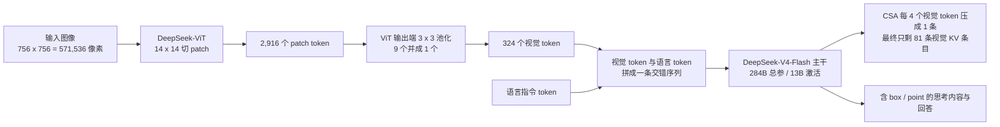
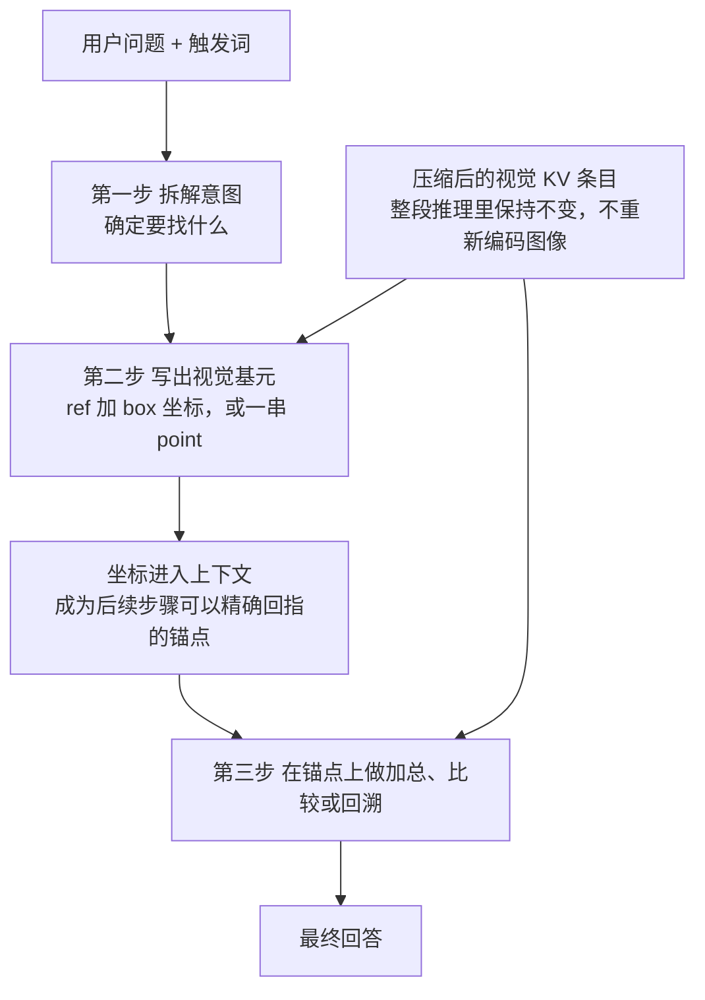
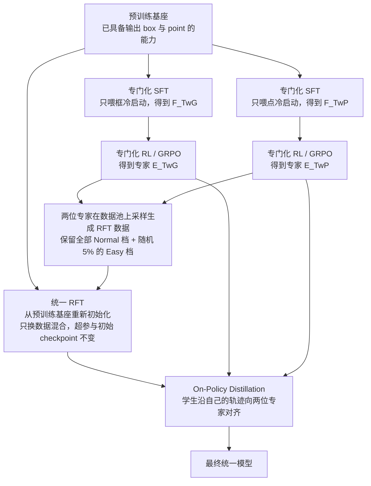

# Thinking with Visual Primitives：当坐标成为思考的最小单位

<!-- release-date: 2026-04-30 -->

> 本文依据 DeepSeek-AI 与北京大学、清华大学合作的技术报告 **Thinking with Visual Primitives**，本地原件为 `papers/DeepSeek/Thinking-with-Visual-Primitives.pdf`，共 25 页。这份工作没有 arXiv 编号，2026-04-30 通过 DeepSeek 官方 GitHub 仓库发布；该仓库随后被删除，正文末尾的资料一节说明了核对过程。页码均指 PDF 自身页码。文中会明确区分“报告写了什么”“我们从中推算出什么”和“外部补充”。

## 从三个模型做不好的小任务说起

先不谈任何新名词，看三件事。

第一件：给模型一张球队合影，问“图里有几个男人”。图很清楚，脸都能看见，但模型经常数错。

第二件：给一张迷宫图，问从起点能不能走到终点。线条粗、对比度高，看清完全没问题，模型还是会给出一个像模像样却走不通的路线。

第三件：给一团互相交叉的曲线，问“皇冠图标那根线连到哪里”。人类会用手指按着线慢慢挪，模型则常常在某个交叉点悄悄换到了另一根线上。

这三件事有一个共同点：**它们失败的地方都不在“看”，而在“记住自己刚才看的是哪一个”。**

报告把这件事讲得很直接：即使感知完美，多模态大模型在复杂空间布局或密集物体交互的任务上仍会出现逻辑崩塌（PDF p.1）。

## 两个差距：看不清，和说不准

要理解这篇报告，先要把两个词分开。

**感知差距**，英文 Perception Gap。它说的是模型看不清图上的细节。前沿模型的应对办法是高分辨率裁剪和动态切块，让模型能“看见”更细的东西（PDF p.1）。报告把 Thinking with Images 这一路做法归到这一类。

**指称差距**，英文 Reference Gap。这是这篇报告自己提出的概念：自然语言天然无法在连续的视觉空间里充当精确、无歧义的指针（PDF p.2）。

差别在哪里？举个例子。图里有六只一模一样的蓝色小球，你要让模型说清楚它现在数到的是哪一只。

用语言描述，它只能说“左边那只”“靠近圆柱的那只”“稍微偏后的那只”。当场景里同类物体一多，这些描述立刻互相重叠。模型在第三步引用“靠近圆柱的那只”时，已经不确定自己指的是不是第一步那只了。报告称这种情况会导致级联幻觉（PDF p.2）。

把分辨率提高一倍，六只球还是六只球，语言指针还是含糊。所以感知差距和指称差距是两个问题，堆像素解决不了后者。

### 报告对已有“把框写进思维链”工作的批评

坐标进入推理并不是全新想法。报告点名了三类已有工作，并说明自己和它们的区别（PDF p.2）：

- 它们主要把 grounding 当作**事后验证**手段，用来增强偏感知的任务；
- 它们大多局限在高分辨率基准上，那里的难点是“看见”而不是“推理”；
- 它们依赖人力密集的监督，难以扩大规模；
- 更关键的是，它们没有处理拓扑导航这类结构化推理，而在这类任务里视觉标记必须成为思考的介质本身，不能只是可核验的证据。

报告在这两处分别列了参考文献编号。把它们对照文末的参考文献展开，是这样一组名字（PDF p.1–2、p.23–25）：

- 被归入**感知差距**路线的是 DeepEyesV2、VLM-R³、Argus、OpenAI 的 o3 与 o4-mini、CogCoM、VGR，对应编号 [8]、[12]、[21]、[24]、[26]、[34]；
- 被归入**把框当事后验证**的是 GRIT、Visual CoT，以及一篇关于可追溯证据增强的视觉落地推理工作，对应编号 [6]、[27]、[32]。

这里只是把编号还原成名字，方便读者顺藤摸瓜；对这些工作的评价是报告自己的说法，本文不代为背书。

一句话概括这篇报告的立场：坐标不是推理结束后交出来的证明，而是推理过程中用来接着往下想的东西。

## 读下去需要的几个名词

后面会反复出现下面这些词，先用一句话各说清楚。它们大多不是这篇报告发明的，属于读这份材料的前置背景。

- **多模态大语言模型（Multimodal Large Language Model，MLLM）**：能同时接受图像和文字输入的大模型。
- **思维链（Chain-of-Thought，CoT）**：模型在给出最终答案前先写出的一段推理过程。
- **落地或接地（grounding）**：把一个语言概念对应到图像上的具体位置。这篇报告里，落地的产物就是一个框。
- **视觉编码器（Vision Transformer，ViT）**：把图像切成小块、再编码成一串向量的模型。每个小块叫 patch。
- **视觉 token**：图像编码后送进语言模型的那一串向量，数量直接决定图像占多少上下文。
- **KV 缓存（KV Cache）**：模型读过的内容留下的中间结果，用来避免每生成一个新 token 都从头重算。视觉部分的 KV 缓存越少，长上下文与并发服务就越便宜。
- **SFT（Supervised Fine-Tuning，监督微调）**：用带标准答案的数据直接教模型怎么答。
- **RL（Reinforcement Learning，强化学习）**：让模型自己生成，再按奖励函数打分，用分数引导它改进。
- **GRPO（Group Relative Policy Optimization）**：DeepSeek 系列常用的强化学习算法，同一道题采样一组答案，用组内相对好坏当优势信号。
- **RFT**：报告只用了缩写、没有展开。按它自己的描述——让模型大量采样、按难度筛掉一部分、再拿留下的样本做一次监督微调——对应的是常说的拒绝采样微调（Rejection sampling Fine-Tuning）这一类做法（本文推断）。
- **奖励模型（Reward Model，RM）**：给模型输出打分的模块，可以是规则程序，也可以是另一个模型。
- **生成式奖励模型（Generative Reward Model，GRM）**：先写一段评价推理、再给分的奖励模型，比只吐一个标量的传统奖励模型更适合难以机械判定的任务。

这篇报告真正新造的词只有两个：**指称差距**和**视觉基元**。其余都是拿来即用的现成部件。

## 视觉基元究竟是什么形式的对象

这是最容易被写空的地方，所以先把它落实。

报告选了计算机视觉里两种标准输出格式作为基元（PDF p.4）：

- **边界框**，bounding box：擅长表达一个具体物体的位置和尺度；
- **点**，point：更适合抽象的空间指代，比如运动轨迹或者拓扑推理问题。

它们在模型输出里长什么样？报告给了完整的格式定义（PDF p.6）。

框：

```text
<|ref|>TARGET<|/ref|><|box|>[[x1,y1,x2,y2],[x3,y3,x4,y4]...]<|/box|>
```

点：

```text
<|point|>[[x1,y1],[x2,y2]...]<|/point|>
```

其中 `<|ref|>`、`<|/ref|>`、`<|box|>`、`<|/box|>`、`<|point|>`、`<|/point|>` 都是词表里的特殊 token。坐标被归一化成 0 到 999 的离散整数；多个实例时，框按从左到右排序（PDF p.6）。

有三个设计细节值得单独拎出来。

**坐标归一化到 0–999，与图像实际像素尺寸解耦。** 模型不需要知道这张图是 640 宽还是 1024 宽，输出的都是同一套千分位坐标。代价是精度封顶在图像宽度的千分之一。

**多实例按从左到右排序。** 这让同一张图的正确答案只有一种书写顺序，冷启动数据可以逐条机械校验，RL 的格式奖励也才有判据。

**点格式不输出物体名字。** 报告说这是有意的：因为点要用来表达轨迹这类更抽象的概念，硬塞一个名字反而限制了它（PDF p.6）。

### 一个必须讲清楚的机制边界

报告里的插图有个容易误导人的排版：每个例子都并排放着“Original Image”和“Image with Visual Primitives”两张图（PDF p.8–12、p.19–22）。

看上去很像模型在推理中途把框画回图上，再重新看一遍。

**报告没有这样写。** 通读全文，视觉基元的生成方式只有一种：作为特殊 token 加坐标数字，自回归地写在思考内容里。报告从头到尾没有提到把基元渲染回图像、重新过一次 ViT、或者对图像做二次编码。带标记的那张图，是给人看的可视化，不是模型的输入。

那这些坐标是怎么被“消费”的？答案朴素但关键：**它们就躺在上下文里，和思考内容的其余文字一样被后续步骤读回来。** 模型第 2 步写下 25 个框，第 3 步做加总时，可以精确地回指其中第 17 个框，因为那 4 个数字是唯一的、不含歧义的。报告没有描述模型内部如何完成这次回指，这里说的是它在接口层面的效果。

这就是这套方法与两类既有做法的真正差别：

| 做法 | 推理中途发生了什么 | 额外代价 | 指称是否唯一 |
|---|---|---|---|
| 先 caption 再纯文本推理 | 图像被一次性转成一段文字，之后不再看图 | 一次描述的成本 | 否，只能靠语言描述区分同类物体 |
| 裁剪重看 / 画中画 | 截取子图重新编码，视觉 token 序列变长 | 每次重看都新增视觉 token 与一次编码 | 部分解决，但引用仍靠语言 |
| 本报告的视觉基元 | 只吐出坐标文本，图像编码一次都不重做 | 只增加思考里的坐标 token | 是，坐标本身就是唯一标识 |

上表中“先 caption 再推理”和“裁剪重看”两行是我们对既有范式的概括，用于对照；报告本身只明确批评了后者所属的感知差距路线以及把框当事后验证的工作（PDF p.1–2）。

理解了这一点，才能理解为什么这套方法和“极低视觉 token 预算”能同时成立：既然推理过程中不重新编码图像，视觉那部分的开销就是一次性的，可以压到很低。

## 全景：整个系统怎么连起来



这张图由我们根据报告的 Figure 2 架构图与 2.2 节文字重画（PDF p.3–4），表达的是数据流与三级压缩的关系，不是实测时序。

模型结构本身并不新奇：报告说它采用了与 LLaVA 类似的标准架构，图像过 ViT，视觉特征与语言指令拼成交错序列，再送进大语言模型（PDF p.3）。真正的重点在两侧——视觉侧的压缩有多狠，以及语言侧输出的是什么。

## 架构：为什么“想得更细”反而更省

### 三级压缩，一级比一级狠

语言主干用的是 DeepSeek-V4-Flash，284B 总参数、推理时 13B 激活参数的混合专家模型（PDF p.3）。视觉编码器是自研的 DeepSeek-ViT，从零训练，支持任意分辨率输入（PDF p.3）。

压缩分三级（PDF p.3–4）：

1. ViT 用 $14\times14$ 的 patch 切图；
2. 在 ViT 输出端做 $3\times3$ 空间 token 压缩，把相邻 9 个 patch token 沿通道维并成 1 个；
3. 进入 LLM 后，V4-Flash 自带的压缩稀疏注意力，也就是 Compressed Sparse Attention（CSA），把视觉 token 的 KV 缓存再压 4 倍。

CSA 是 DeepSeek-V4 报告里的机制，本站已有 [DeepSeek-V4 解读](/reports/DeepSeek/DeepSeek-V4) 详细讲过；这篇报告直接引用它，没有重新设计（PDF p.2、p.4）。

报告给了一个完整算例，输入是一张 $756\times756$ 的图（PDF p.4）：

| 阶段 | 这一步做了什么 | 剩下多少 | 本级压缩 |
|---|---|---:|---:|
| 原始图像 | — | 571,536 像素 | — |
| ViT patch 化 | 每 $14\times14$ 像素成一个 patch | 2,916 个 patch token | 196 倍 |
| ViT 输出端池化 | 相邻 $3\times3$ 个 patch token 并成一个 | 324 个视觉 token | 9 倍 |
| LLM 内的 CSA | 每 4 个视觉 token 的 KV 压成 1 条 | 81 条视觉 KV 条目 | 4 倍 |

报告称这条链路的整体压缩比是 $7{,}056\times$（PDF p.4）。

这个数字值得解释两句。它的分母是 KV 条目数，分子是**原始像素数**，不是 token 数——所以它并不能直接拿去和别的模型的“token 压缩率”比较。另外，$7056 = 14^2 \times 9 \times 4$，恰好是三级压缩之积（本文推算）。也就是说这不是某张图的巧合，而是一个与分辨率无关的常数。

### 视觉 token 数被硬性夹在 81 到 384 之间

报告有一个很容易被跳过的脚注：为了平衡性能与计算成本，ViT 输出的视觉 token 数被限制在 81 到 384 之间；分辨率落在这个范围外的图像会按原始长宽比缩放（PDF p.4 脚注 1）。

把它换算成像素（本文推算）：

- 下限 81 个 token 恰好对应 $378\times378$，因为 $378/14=27$、$27/3=9$、$9^2=81$；
- 上限 384 个 token 约对应 67.7 万像素，即 $384\times9\times14^2=677{,}376$，大约是 $823\times823$；
- 若要求 patch 网格是整数，正方形输入最大到 $798\times798$，合 361 个 token，因为再往上 $20\times20=400$ 已经超过 384。

这条约束直接连着报告自己承认的第一条限制：受输入分辨率所限，模型在精细场景下表现仍不理想，视觉基元偶尔不够准（PDF p.18）。**省 token 的代价不是抽象的，它就写在这个上限里。**

### Figure 1 的两组数字

报告开篇的 Figure 1 用一张 $800\times800$ 的图比较各家的 token 消耗（PDF p.2，图 1a，数值为读图与图内标注所得）：

| 模型 | 该图的 token / KV 条目 |
|---|---:|
| Gemma-4-31B | ~289 |
| 本报告模型 284B-A13B | ~361，其中约 90 条进入 KV cache |
| Qwen3-VL-235B-A22B | ~660 |
| GPT-5.4 | ~740 |
| Claude-Sonnet-4.6 | ~870 |
| Gemini-3-Flash | ~1100 |

图里只有本报告模型的柱子分成两段：实心的约 90 是 KV 条目，斜纹延伸到 361 是压缩前的 token 数。其余模型是单色柱，即压缩前后同一个数。

这三个数字彼此自洽（本文推算）：$800/14\approx57.1$，向下取整得每边 57 个 patch，全图 $57\times57=3249$ 个；除以 9 得 361 个视觉 token；再除以 4 得约 90 条 KV。

Figure 1(b) 是 7 个基准的平均分（PDF p.2）：本报告模型 77.2%、Gemini-3-Flash 76.5%、GPT-5.4 71.1%、Gemma-4-31B 69.7%、Qwen3-VL 68.1%、Claude-Sonnet-4.6 65.3%。图注明确说自建基准不计入，且这些分数只覆盖与本文研究焦点相关的评测维度，不代表各模型的整体能力。

我们把表 1 里 7 个公开基准的分数逐个平均，结果与图 1(b) 的六个数字完全对上（本文推算，见后文评测一节）。这同时确认了一件事：图 1(b) 平均的就是 CountQA、Pixmo-Count、MIHBench、SpatialMQA、EmbSpatial、CV-Bench、OmniSpatial 这 7 项，且 CountQA 取的是 EM 指标。

## 预训练：先教会“能指”，再教“会用”

报告把能力拆成两段。预训练只负责一件事：让模型具备输出视觉基元的基础能力（PDF p.4）。会不会用它来推理，是后训练的事。

### 为什么优先扩框，而不是点

已有公开数据集如 COCO 和 Pixmo-Points 有相对准确的标注，但规模不够、多样性也不足（PDF p.4）。所以必须自己造大规模数据。造哪一种？报告给了三条理由，全部倾向于框（PDF p.4）：

- **标注的确定性**：框紧贴物体，标注相对确定；点标注则天然含糊，物体内任何一个坐标都算合法，没有严格的真值。遇到遮挡时，本想指背景物体的点甚至可能落在前景遮挡物上。
- **任务可泛化性**：会输出框的模型可以轻松泛化到点，因为一个框本来就由左上、右下两个点定义，天然包含点表示。
- **信息更丰富**：点只提供定位，框还带宽高等几何信息，能支撑更复杂的推理。

这是一个很好的数据策略示例：**当两种标注形式存在包含关系时，优先扩规模的应该是那个可自动校验、且能推出另一个的形式。**

### 一条从 9.8 万个数据源到 4000 万样本的漏斗


这张图由我们根据报告 2.3.3 节文字重画（PDF p.5–6），四个数字均来自原文。

先看**采集**（PDF p.5）。他们大规模抓取多个网站上与框标注相关的数据。以 HuggingFace 为例，用官方 API 筛出打了 Object Detection 或 Grounding 标签的数据，按点赞、下载等热度做初筛，并且**严格排除所有验证集与测试集划分**，防止评测阶段的数据污染。数据集结构五花八门，他们用一个 LLM agent 去解析各仓库的 `README.md`，自动转成统一存储格式。抓取加去重后得到 97,984 个数据源。

再看**第一步语义评审**（PDF p.5）。传统数据过滤主要看框的几何精度，这一步专门看标签的语义是否成立，剔除三类致命缺陷：

- **无意义的机器码和乱码**：很多原始数据集保留了内部编号，比如纯数字类别 `0`、`1`。这类标签没有人类可读的语言语义，硬让模型去学会严重损害语言生成能力，直接丢弃。
- **无法泛化的私有实体**：比如 `MyRoommate` 这种人称，或者 `ID_Card_1` 这种私有标识。模型无法从孤立样本里泛化出一个非公众人物的视觉特征，所以严格过滤；广为人知的公众人物则保留。
- **含糊缩写与主观评价**：工业质检里常见的 `OK`、`NG` 缺乏具体的视觉描述性。一个光秃秃的 `OK` 极度含糊，因为“完好的苹果”和“完好的电路板”在视觉上毫无关联。

做法是：每个数据集抽 3 张图，让模型按上述判据打一个 0 到 10 的质量分，输出明确的 KEEP 或 DISCARD 并附理由。这一步从 97,984 保留下 43,141 个数据源。

然后是**第二步视觉几何评审**（PDF p.5–6），针对三类结构性标注缺陷：

- **严重漏标**：同一标签在图中有多个实例却只标了几个。抽样时若发现大规模漏标，例如漏标率超过 50%，整个数据集立刻丢弃。
- **严重截断与偏移**：框没有合理框住目标。这里用了差异化容忍策略——稍微松一点、带少量背景噪声的框可以接受，但切掉头部或车轮这种破坏关键视觉特征的严重截断绝不接受。
- **超大框问题**：一个框无意义地覆盖了超过 90% 的画面，通常说明这是把图像分类数据强行转成了检测数据。抽样批次里偶尔出现算可接受噪声，但如果 3 张抽样图里都出现，整个数据集判为缺乏有效定位信息并丢弃。

这一步从 43,141 保留下 31,701 个数据源。最后做类别均衡采样：每个数据集的每个类别随机抽 $N$ 张，类别图片不足 $N$ 就全留；由于一张图可能同属多个类别，聚合后再做全局去重。实际取 $N=1{,}000$，最终得到 4000 万以上高质量样本（PDF p.6）。

这条漏斗最值得借走的不是那几个数字，而是它的**评审粒度**：判定单位是数据源，不是单张图。抽 3 张图就决定整个数据集的去留，成本被压到可以扫完近 10 万个源。代价当然也明显——3 张样本的抽样噪声会让一些好数据集被误杀。这是规模化清洗必须接受的交换。

### 统一预训练

通用多模态数据以大规模网络抓取为主，而**不是**靠模型蒸馏出来的合成数据，比如合成图像描述；原始数据经过仔细整理，且他们不用大语言模型去改写数据内容（PDF p.6）。专用数据除了上面抓取过滤的部分，还并入了若干高质量公开数据集。整个预训练阶段消耗了万亿级别的多模态 token（PDF p.6）。

报告在这里的措辞很克制：只说“trillions of multimodal tokens”，没有给出配比、去重阈值或者各来源占比。我们只能确定方向，不能反推质量。

## 冷启动：四个任务为什么是这四个

预训练给了模型通用先验和基础的基元输出能力，但后训练需要一份小而高精度的冷启动数据，来把指令遵循和奖励学习引导到基元输出这个接口上（PDF p.7）。

构造原则有两条（PDF p.7）：

1. 监督目标要么来自标注（框和点），要么是程序生成的；
2. 尽可能配自动验证器，例如规则检查器，以降低标签噪声。

选了四个维度：计数、空间推理与通用视觉问答、迷宫导航、路径追踪（PDF p.7）。

### 四个任务的规模差得很远

| 任务 | 冷启动样本数 | PDF 页码 |
|---|---:|---|
| 计数 | 约 10,000 | p.8 |
| 空间推理与通用 VQA | 9,000 | p.9 |
| 迷宫导航 | 460,000 | p.11 |
| 路径追踪 | 125,000 | p.12 |

合计约 604,000 条，其中迷宫与路径追踪占了约 96.9%（本文推算）。

这个比例不是随口一提。前两个任务依赖真实图像和已有标注，扩量受限于人力与数据质量；后两个任务是**程序生成的**，可以任意合成图像、任意生成真值路径、任意做规则校验。**能被程序完全生成并校验的任务，天然可以做到大一到两个数量级的规模。** 如果你在设计自己的训练数据，这个不对称本身就是一条选题原则。

### 计数：把“数”拆成三步

模型数不准，尤其在密集场景。人类会用系统的扫描—累加策略，语言模型在物体一多时建立不起精确的对应关系（PDF p.7）。

报告把计数分成两类（PDF p.7）：粗粒度计数针对一般类别，比如“狗”；细粒度计数要求按属性或空间约束区分，比如“白色的狗”或“左边那只狗”。

**粗粒度计数**从多个密集检测数据集聚合数据，按三条判据过滤：避免物体密度过高、确保框足够大到能看清、真值框标注保持高召回。然后让一个多模态模型基于图像和框标注生成思考内容与简洁答案，思考内容遵循三步协议（PDF p.7）：

1. **意图分析**：确定目标类别；
2. **批量落框**：一次性用视觉基元定位所有候选物体。报告解释说粗粒度任务用批量落框更高效，因为它借力了模型本身的定位能力，同时避免重复枚举；
3. **统计求和**：在这些视觉基元的基础上做加总。

为了消除冷启动阶段的噪声，还有一道严格校验：思考内容里的所有框必须与元数据坐标严格对齐、符合预定义语法、并与最终数字一致（PDF p.7）。

**细粒度计数**因为缺公开数据集，自己搭了流水线（PDF p.7）：先用 GQA 的图像与场景图元数据，让多模态模型出题，记录真值物体 ID、被排除的负例 ID 和构造这道题的理由；再把图像、场景图、题目连同这些 ID 与理由一起喂回去，合成带视觉基元的推理链。与粗粒度不同的是，这里明确要求模型做**顺序扫描**，逐个核对每个候选是否满足细粒度约束（PDF p.8）。同一套方法还被用来构造真值为零的负样本，增强抗幻觉能力（PDF p.8）。

Figure 3 给了两个完整例子（PDF p.8）。粗粒度那个例子里，模型一口气写出 25 个框，然后按前排 4 人、中排 9 人、后排 8 人、两侧各 2 名教练的方式分组加总，得到 25。

### 空间推理与通用 VQA：真实场景不够难，就上合成场景

报告把空间推理和通用 VQA 合成一类，理由是这种整合能有效缓解纯语言描述里的指称歧义与语义漂移（PDF p.8）。

**真实场景**这部分同样基于 GQA 的图像与场景图，让模型围绕空间关系和物体交互出题并生成思考内容，流程是意图分析、物体落框、关系推断。为了在拥挤场景里消歧，模型被要求挑选有区分度的物体，并叠加多属性约束，比如把动作和属性组合起来唯一确定目标（PDF p.9）。

但 GQA 的关系结构相对简单，很难大规模生成复杂的多跳推理样本（PDF p.9）。所以他们又上了**合成场景**：用 CLEVR 工具链生成多跳推理数据。这个框架支持可控的物体密度、能生成问题，还能给出把每个推理步骤映射到物体级引用的程序执行轨迹。为了监督视觉基元的生成，他们按官方工具链把 3D 物体坐标投影成 2D 框（PDF p.9）。

这一步很值得注意：**CLEVR 的执行轨迹本来就是一串物体 ID，而视觉基元需要的正是“这一步在指哪个物体”。** 两者的结构天然对齐，所以合成场景不只提供了难度，还提供了逐步的落框真值。

另外还有**负样本增强**：构造被问物体或关系并不存在的样本，训练模型基于视觉证据给出“忠实拒答”，而不是编造（PDF p.9）。

### 迷宫导航：难度必须来自推理，不能来自看不清

纯语言的思维链很难准确描述不规则形状的轨迹，而点作为认知单元恰好适合这类问题（PDF p.10）。

生成方式（PDF p.10–11）：

- 用深度优先搜索、Prim、Kruskal 三种算法生成可解且非平凡的迷宫，三者生成的迷宫任意两格之间路径都很少，答案不能靠猜；
- 三种拓扑：矩形网格、由同心环与角向扇区组成的圆形迷宫、六边形蜂窝格；
- **不可解迷宫的造法很讲究**：先生成一个可解迷宫并拿到解路径，然后刻意在路径中段、避开靠近起点终点的位置补几堵墙。这样连通性是以不明显的方式被打断的，迷宫乍看可解，实际必须完整搜索才能确认无解；
- 视觉风格随机化：渐变墙、超粗墙、多种背景纹样、多种标记类型、小角度随机旋转，分辨率随机、长宽比连续采样、网格维度按比例调整，以防模型对特定视觉模式过拟合。

难度由网格大小控制。网格越大，模型要解析的格子越多、要跨越更长距离追踪连通性、要处理更多需要回溯的死胡同。报告的描述很具体：简单迷宫只要串起少数几次局部连通性检查，而 nightmare 难度需要在不丢失已探索区域记忆的前提下，持续组合数百次这样的基本操作（PDF p.11）。

关键的一句是：他们在每个难度上都强制了最低分辨率阈值，确保即使最难配置下视觉基元仍然可辨，从而保证**任务难度来自推理复杂度而不是视觉歧义**（PDF p.11）。这句话是整篇报告方法论上最讲究的一处——如果难度混入了看不清，那这个基准测的就不再是它声称要测的东西。

思考内容的合成方式是把深度优先搜索的探索过程口语化，包括前进和回溯，每一步都用点坐标锚定到图上，把“检查某格的墙是否连通”“前进到相邻格”“从死胡同退回”这些基元操作显式转成语言推理链（PDF p.11）。Figure 5 的例子里能看到完整的 10 步探索、两次回溯，以及最后给出的验证路径（PDF p.10）。

### 路径追踪：专门掐掉颜色这条捷径

图像由多条贝塞尔曲线组成，每条从一个带标签的起点连到一个带标签的终点。核心挑战是**交叉点消歧**：两线相交处，模型必须调用一个局部的几何连续性基元来判断哪一支才是目标曲线的延续（PDF p.11）。

为了确保这个基元真的被考到，他们做了两件事（PDF p.11–12）：

- 严格避免任何终点与无关线重叠或被无关线穿过，违反约束的配置直接丢弃重生成；
- 加入**统一风格模式**，所有线同色同粗，剥夺基于颜色的捷径，逼模型只能靠交叉处的曲率连续性判断。报告称这是对路径追踪基元是否被真正内化、而非用颜色匹配近似的一次直接检验。

难度随线数和曲率幅度自然增长。分辨率、长宽比、配色、线型、端点标记、背景全部随机化（PDF p.12）。

思考内容把追踪过程显式表示成沿目标曲线采样的坐标序列，并且**路点密度自适应曲线的局部几何**：平直段用较少的点，高曲率区域或密集交叉处用更细粒度的坐标，模拟人在视觉复杂区域会放慢速度、更加专注的行为（PDF p.12）。Figure 6 的例子里，一条线用了七十多个点来描（PDF p.12）。

这个自适应密度的设计很聪明：它把“注意力该放在哪”写进了监督信号本身，而不是指望模型自己悟出来。

## 一次推理里，坐标是怎么被生成和消费的

把上面几节合起来，一次典型推理是这样的：



这张图由我们综合报告的 Figure 3 至 Figure 6 冷启动样例与 2.2 节架构描述重画（PDF p.4、p.8–12），是机制示意，不代表实测时序或延迟。

### 跟着一个真实例子走一遍

报告 Figure 3 上半部分是一张球队合影，问题是数图里有多少个男人（PDF p.8）。模型的思考内容分三段：

第一段拆解意图：判断这是一张球队合影，需要把穿队服的球员和站在两侧穿常服的教练、工作人员一起算进来。

第二段一次性写出 25 个框，形如 `<|ref|>the men<|/ref|><|box|>[[13,228,116,714],[106,226,202,707],...]<|/box|>`，然后用一句话说明这些框覆盖了前排坐地上的、中排坐着或蹲着的、后排站着的，以及左右两侧共四位非球员。

第三段做加总：前排 4 人、中排 9 人、后排 8 人、左侧 2 人、右侧 2 人，$4+9+8+2+2=25$，答案是 25。

请注意第三段真正依赖的是什么。它不是重新看了一遍图，而是**在第二段自己写下的那 25 组坐标上做分组统计**。按我们的解读，坐标里的 $y$ 值区分了前排与后排，$x$ 值区分了左侧与右侧，分组这一步在数字上就能完成；报告没有逐步说明模型内部到底如何完成这次分组，这一句是本文的推断。

对照一下纯语言的做法：模型只能写“前排有几个人、中排有几个人”，而它凭什么知道自己没有把某个人同时算进两排？坐标给了它一个可以自洽检查的中间表示。**这就是“把手指按在图上”这个比喻的具体含义——不是重新看，而是有一个不会被记混的引用。**

Figure 5 的迷宫例子把这一点推得更远（PDF p.10）：模型在 Step 5 写下“这条路走不通，回溯到之前的岔口 `<|point|>[[260,372]]<|/point|>`”。回溯这个动作要求模型精确地回到某个之前访问过的位置。用语言说“回到刚才那个三岔路口”在有多个三岔路口时立刻失效；用一个坐标则永远不会指错。

有一点必须点明：报告在限制一节写道，当前的视觉基元能力**依赖显式的触发词来激活**，未来希望模型能根据上下文自主决定是否调用（PDF p.18）。所有配图里那个 `[Trigger_Placeholder]` 占位符就是它。报告没有公开触发词是什么。

所以这不是一个“模型自己想到该指一下”的系统，而是一个被显式打开的模式。这个边界很重要，直接影响它在真实产品里的可用形态。

## 训练信号：RL 为什么故意不去监督思考里的坐标

后训练采用“先训专家、再合并”的策略（PDF p.12）。

### 专门化 SFT：先把两种基元分家

这一阶段的训练数据由 70% 通用多模态与纯文本数据、30% 专用的视觉基元数据组成（PDF p.12）。

关键动作是：用框冷启动数据和点冷启动数据**分别**做 SFT，得到两个专门化模型 $F_{\text{TwG}}$ 和 $F_{\text{TwP}}$。报告给的理由是，在专用数据量相对较小时，这种分离能防止模式冲突（PDF p.13）。

想想也合理：框的输出范式是“先说物体名，再给一组框，从左到右排序”，点的输出范式是“不说名字，给一串几十上百个的坐标”。数据量小的时候混在一起训，模型很容易在两种格式之间摇摆。

### 专门化 RL：最重要的一个决定

两个模型各自独立做强化学习，算法用 GRPO，超参数沿用 DeepSeek-V4（PDF p.13）。

真正值得停下来想的是这一句：由于冷启动数据里思考内容中的视觉基元已经经过严格校验，**RL 阶段不再显式监督模型在思考过程中生成的视觉基元**（PDF p.13）。

为什么这么做？报告给的理由是可扩展性：这样收集 RL 数据时只需要图像、问题和最终答案，可获取数据的范围大幅扩宽（PDF p.13）。

这是一个非常干净的分工：

- **冷启动阶段**用少量、逐条校验过的数据把“怎么写坐标”这件事教死；
- **RL 阶段**只管结果对不对、格式合不合法、思考质量高不高，不再逐个核对坐标。

代价是什么？坐标在 RL 阶段是无监督的，模型完全可以学会写一堆看起来合法、其实位置不准的框，只要最终答案蒙对。报告没有直接量化这个风险，但它设计的三层奖励里有一部分就是冲着它去的。

### 三层奖励

奖励模型从三个角度并行监督：格式约束、质量约束、准确性约束。前两者跨任务共享，最后一项按任务定制（PDF p.13）。

**格式奖励模型**给 0 到 1 的分，按规则检查基元的表示格式是否正确。对框这一支还额外检查输出冗余，比如生成重复的框；报告说这有效缓解了 SFT 模型陷入无限刷框的问题（PDF p.13）。

“无限刷框”这个细节很有信息量：**当一个行为既能拿分又几乎没有成本时，模型一定会把它做到过量。** 只要多写一个框可能提高召回，模型就会一直写。格式奖励在这里当的是刹车。

**质量奖励模型**是一个基于语言模型的生成式奖励模型，输入思考内容和最终回答，从五个方面评估（PDF p.13）：

- 回答里是否存在冗余；
- 思考内容与最终回答是否一致；
- 视觉基元推理过程中是否自相矛盾；
- 输出框时所指的对象是否是有意义的实体；
- 是否出现奖励攻击行为，比如在回答里强行编造一个与自己预测完全一致的假真值去欺骗奖励模型。

最终输出 0.0、0.5、1.0 三档离散分数，并给出评分理由（PDF p.13）。

第四条和第五条正好对应上一节说的风险：**所指对象是否是有意义的实体**这一条，是报告里唯一直接约束思考中坐标语义合理性的机制；而奖励攻击那一条，说明他们在实践中确实见过模型伪造真值。这类“把见过的作弊手法写进评分表”的做法，比抽象地要求“回答要诚实”有用得多。

**准确性奖励模型**按任务分四种。

计数用规则奖励，给出的是平滑的信号而不是二值精确匹配（PDF p.13–14）：

$$
R(\hat y, y) = \alpha \cdot \exp\!\left(-\beta \cdot \frac{|\hat y - y|}{|y| + 1}\right)
$$

其中 $\hat y$ 是预测计数，$y$ 是真值计数。分母的 $|y| + 1$ 让奖励取决于**相对误差**，因此物体多的场景里小偏差更能被容忍。$\alpha$ 控制整体尺度，$\beta$ 控制衰减速度，实际取 $\alpha = 0.7$、$\beta = 3$，是凭经验选出来让学习信号平滑稳定的值（PDF p.14）。

举个例子体会一下：真值 25 时数成 24，相对误差是 $1/26 \approx 0.038$，奖励约 $0.7 \times e^{-0.115} \approx 0.62$；真值 3 时数成 2，相对误差是 $1/4 = 0.25$，奖励约 $0.7 \times e^{-0.75} \approx 0.33$（本文按公式推算）。同样差一个，在密集场景里罚得轻，在稀疏场景里罚得重。这符合直觉：数 25 个人差一个是手抖，数 3 个人差一个是没看懂。

空间推理与通用 VQA 用生成式奖励模型：把思考内容、最终回答、用户问题和真值答案一起喂进去，**独立地给思考过程和回答各打一分**，最终奖励取两者平均（PDF p.14）。

迷宫导航用规则奖励，是五项的加权组合（PDF p.14）：

| 分项 | 怎么算 | 适用范围 |
|---|---|---|
| 因果探索进度 | 顺序处理探索序列，遇到第一次穿墙即截断其后全部探索，因为后续在因果上已失效；再算已探索区域到终点的最短距离，得分为 1 减去该距离与真值路径长度之比 | 仅可解迷宫，不可解迷宫此项恒为 1 |
| 探索完整性 | 已探索区域数与全部可达区域数之比 | 仅不可解迷宫，可解迷宫此项恒为 1 |
| 穿墙惩罚 | 独立于上面的截断，扫描整条轨迹统计每一次穿墙转移，得分为 1 减去穿墙次数与迷宫全部合法转移数之比 | 两者都算 |
| 最终路径有效性 | 声称可解时必须给出具体路径，校验相邻格是否合法连通、路径是否从起点连续通到终点，二值分 | 仅可解迷宫 |
| 答案正确性 | 可解性判断是否与真值一致，二值分 | 两者都算 |

这套分解的目的是让奖励信号稠密且有信息量：模型每正确应用一次视觉基元都能拿到分，而不是只有最终二值答案才算数（PDF p.14）。

有两个设计特别值得学。第一，**因果截断**：第一次穿墙之后的探索全部作废，因为它建立在一个错误的连通性判断上。这防止模型靠“乱走一通刚好路过终点附近”骗分。第二，穿墙惩罚**独立于**因果截断单独统计。报告说得很直白：这样即使穿墙发生在探索很靠后的位置，也绝不是零成本的（PDF p.14）。两条规则一个管前、一个管后，堵住了同一个漏洞的两端。

路径追踪同样是规则奖励，四项加权求和（PDF p.14–15）：

- **轨迹准确度**，双向计算。正向：每个预测点到真值折线任意线段的最小距离，再对所有预测点求平均，惩罚偏离真实路径的点。反向：每个真值点到预测折线任意线段的最小距离，惩罚模型跳过曲线的某些部分导致的覆盖不全。最终取两个方向的平均。
- **端点准确度**：分别核对起点和终点，算预测坐标到真值框中心的距离，得分随距离衰减，超过容忍阈值归零。
- **轨迹连续性惩罚**：如果轨迹最后一个点与预测端点之间的距离超过阈值，施加固定惩罚，防止模型只描一小段就“跳”到一个猜出来的端点。
- **答案正确性**：最终答案里的端点标签是否与真值一致。

报告专门解释了为什么双向是关键：只用正向，模型可以只在起点附近输出几个安全的点；只用反向，则无法惩罚幻觉出来的绕路。两个方向合起来，才逼出完整且准确的坐标轨迹（PDF p.15）。

这是奖励设计里非常经典的一课：**单向的相似度度量几乎总有一个退化解，把它对称化通常比调权重更有效。**

### 只在“会一半”的题上做 RL

RL 前先扩数据池，用 SFT 冷启动模型对数据池做 rollout，每个样本采 $N$ 条。按奖励模型打分统计其中正确的条数，把数据分三档（PDF p.15）：

- **Easy**：$N$ 条全对；
- **Normal**：正确条数 $k$ 满足 $1 \le k < N$；
- **Hard**：$N$ 条全错。

只选 Normal 做 RL，确保训练过程中模型能收到有价值的监督信号（PDF p.15）。全对的题没有梯度信息，全错的题在 GRPO 里组内优势也会退化。这一步之后得到两个专家模型 $E_{\text{TwG}}$ 和 $E_{\text{TwP}}$。

报告没有公开 $N$ 的取值，也没有公开各分档的比例。

## 先分家再合并：统一 RFT 与在线策略蒸馏



这张图由我们根据报告 2.5 节文字与 Figure 2(b) 的流水线重画（PDF p.3、p.12–16）。图中从预训练基座直接指向统一 RFT 的那条边，是报告明确写出的重新初始化，不是示意。

### 统一 RFT 有一个很容易看漏的动作

两个专家在数据池上做 rollout 生成 RFT 数据，沿用前面的难度分档，保留全部 Normal 档样本，再随机抽 5% 的 Easy 档，用途是防止在过于简单的场景上灾难性遗忘（PDF p.15）。

然后是关键的一句：他们**从基础预训练模型重新初始化**来训练一个增强版 SFT 模型，训练配置与 SFT 冷启动阶段完全一致，包括训练超参数和初始 checkpoint，唯一的差别是更新后的训练数据混合（PDF p.15）。

也就是说，统一模型 $F$ 不是从两个专家继续训出来的，而是**回到起跑线，用专家产出的更好数据重跑一遍同样的配方**。

这个选择的好处很明确：合并两个已经分别偏向框和点的专家，很可能重新引入当初 SFT 分家要避免的模式冲突；从基座重来，则只是换了一份质量更高、更多样的数据，训练路径干净。它的代价是把专家在 RL 阶段学到的东西又丢掉了一部分——报告接下来的一句正好承认了这点。

### 在线策略蒸馏补上最后那段差距

尽管 RFT 模型 $F$ 相对两个冷启动模型有实质提升，但与专家模型 $E_{\text{TwG}}$、$E_{\text{TwP}}$ 相比仍有明显差距（PDF p.16）。

于是沿用 DeepSeek-V4 的做法，用在线策略蒸馏把专家能力汇进单个统一模型。做法是让学生模型**基于自己生成的轨迹**去学习教师模型的输出分布（PDF p.16）。目标函数是：

$$
\mathcal{L}_{\text{OPD}}(\theta) = \sum_{i=1}^{N} w_i \cdot D_{\text{KL}}\!\left(\pi_\theta \,\|\, \pi_{E_i}\right)
$$

其中 $w_i$ 是分给每个教师的权重，$D_{\text{KL}}$ 是反向 KL 散度损失，$\pi_\theta$ 是学生模型。实现上采用全词表 logit 蒸馏。实际只用了两个教师，就是 $E_{\text{TwG}}$ 和 $E_{\text{TwP}}$（PDF p.16）。

为什么强调 on-policy 和全词表？静态蒸馏只批改老师准备好的范文，学生真正跑起来时可能走进训练数据里没出现过的状态；而只看采样到的那一个 token，等于从教师的整个分布里只取一个点，方差很大。这两点的完整论证在 DeepSeek-V4 报告里，这篇报告直接引用，没有重新论证（PDF p.16）。

报告没有公开 $w_i$ 的取值，也没有公开教师采样的数据量。

### 精度与框架

模型用 HAI-LLM 训练和评测，那是一个基于 PyTorch 的轻量分布式训练框架（PDF p.16）。

其余实现细节（PDF p.16）：

- 预训练阶段序列长度 64K，FP8 精度；
- 后训练阶段序列长度扩到 256K；
- 专门化 SFT 与专门化 RL 用 FP8，为的是让领域专家发挥最大性能；
- 统一 RFT 与在线策略蒸馏阶段改用 FP4，具体是 MXFP4 量化。

这个安排本身有逻辑：教师要尽量准，所以用较高精度训；学生和蒸馏阶段跑的量更大、也更接近部署形态，所以降到 FP4。报告没有给出这个精度选择的消融或性能影响数据。

## 评测：哪些赢是真赢

### 评测集怎么搭

公开基准（PDF p.16）：计数用 CountQA 和 Pixmo-Count，后者用官方测试集；空间推理与通用 VQA 用 SpatialMQA、CV-Bench、EmbSpatial、OmniSpatial、MIHBench。

自建基准分三个维度（PDF p.17）：

- **DS_Finegrained_Counting**：报告认为 TallyQA 这类已有的细粒度计数基准常有标注错误和歧义，不适合严格评测。他们让多模态模型生成带属性或空间位置约束的计数题，刻意保证存在困难负例，即与目标同类但属性不同的物体，再经严格人工核验，最终保留 600 条高质量测试样本。
- **DS_Spatial_Reasoning**：从 CLEVR 验证集抽 1,000 道判断题和 1,000 道开放题，用模型为开放题生成合理干扰项转成选择题，方便自动化评测。
- **DS_Maze_Navigation** 与 **DS_Path_Tracing**：按 2.4.3 与 2.4.4 节同样的方法构造，各 2,000 条。

评测协议（PDF p.17）：因为部分老基准图像分辨率低，任何总像素数低于 640,000 的图像都会在保持长宽比的前提下上采样到该阈值；对支持配置推理预算的前沿模型，比如 GPT 和 Gemini-3-Flash，统一把思考预算设为 low。

### 表 1 全表

（PDF p.17，表 1。粗体为最佳，下划线为次佳。）

| 类别 | 基准（指标） | Gemini-3-Flash | GPT-5.4 | Claude-Sonnet-4.6 | Gemma4-31B | Qwen3-VL-235B-A22B-Thinking | 本报告模型 284B-A13B-Thinking |
|---|---|---:|---:|---:|---:|---:|---:|
| 计数 | CountQA（EM / RA@10） | **66.1 / 75.1** | 48.3 / 60.3 | 34.8 / 46.6 | 43.2 / 54.6 | 42.7 / 54.8 | 64.9 / 74.1 |
| 计数 | Pixmo-Count（EM） | 88.2 | 76.6 | 68.7 | 82.9 | 77.2 | **89.2** |
| 计数 | DS_Finegrained_Counting（EM） | 79.1 | 84.2 | 82.6 | 79.5 | 87.2 | **88.7** |
| 空间与 VQA | MIHBench（ACC） | 83.2 | 83.5 | 81.7 | 82.2 | 75.1 | **85.3** |
| 空间与 VQA | SpatialMQA（ACC） | 67.0 | 61.9 | 58.2 | 60.6 | 54.5 | **69.4** |
| 空间与 VQA | EmbSpatial（ACC） | 82.6 | 80.9 | 75.1 | 82.1 | **83.7** | **83.7** |
| 空间与 VQA | CV-Bench（ACC） | **88.6** | 87.5 | 85.1 | 87.5 | 88.1 | 88.4 |
| 空间与 VQA | OmniSpatial（ACC） | **59.6** | 58.8 | 53.2 | 49.4 | 55.3 | 59.5 |
| 空间与 VQA | DS_Spatial_Reasoning（ACC） | 93.2 | 81.1 | 97.2 | 77.2 | 96.8 | **98.7** |
| 拓扑推理 | DS_Maze_Navigation（ACC） | 49.4 | 50.6 | 48.9 | 49.8 | 49.6 | **66.9** |
| 拓扑推理 | DS_Path_Tracing（ACC） | 41.4 | 46.5 | 30.6 | 33.9 | 24.5 | **56.7** |

### 平均分是怎么来的

我们把上表 7 个公开基准的分数逐模型取平均（CountQA 取 EM），结果与 Figure 1(b) 的六个数字全部吻合（本文推算）：

| 模型 | 7 项平均 | Figure 1(b) 标注 |
|---|---:|---:|
| 本报告模型 | 77.2 | 77.2% |
| Gemini-3-Flash | 76.5 | 76.5% |
| GPT-5.4 | 71.1 | 71.1% |
| Gemma-4-31B | 69.7 | 69.7% |
| Qwen3-VL-235B-A22B | 68.1 | 68.1% |
| Claude-Sonnet-4.6 | 65.3 | 65.3% |

这说明图 1(b) 的口径是清晰的，也说明 77.2 与 76.5 之间只差 0.7 个点。

### 把赢的地方拆开看

11 行里，本报告模型独占最佳 7 项，另与 Qwen3-VL 并列最佳 1 项；Gemini-3-Flash 独占最佳 3 项（本文按表 1 的加粗统计）。

但把这 7 项独占最佳再拆一层：

- 在**公开基准**上赢的是 Pixmo-Count、MIHBench、SpatialMQA，另有 EmbSpatial 与 Qwen3-VL 并列；输给 Gemini-3-Flash 的是 CountQA、CV-Bench、OmniSpatial；
- 在**自建基准**上赢的是 DS_Finegrained_Counting、DS_Spatial_Reasoning、DS_Maze_Navigation、DS_Path_Tracing 四项，也就是四项全赢。

差距最大的两项恰好是自建的拓扑推理。两项里最强的对手都是 GPT-5.4：迷宫从它的 50.6 提到 66.9，描线从它的 46.5 提到 56.7。

这里必须说清一件事：**DS_Maze_Navigation 与 DS_Path_Tracing 是用训练数据同一套生成方法构造的**（PDF p.17）。对本报告模型来说这是域内评测，对其他所有模型来说是域外评测。报告自己在定性结果里的措辞也很诚实：在域内样本上，模型有能力识别并跟随路径（PDF p.18）；限制一节还写明当前模型的跨场景泛化能力有限（PDF p.18）。

所以正确的读法是：这两项证明了“基于点的视觉基元 + 程序化奖励”这条流水线在它自己定义的任务族上确实学到了东西，而不是证明模型在通用拓扑推理上超过了前沿模型。

### 一个更耐人寻味的数字

迷宫任务的输出是 `\boxed{True}` 或 `\boxed{False}`，是一道二选一的判断题（PDF p.10、p.22）。

看这一行的其他五个模型：49.4、50.6、48.9、49.8、49.6。**全部落在 50 附近，也就是掷硬币的水平**（本文推算，因为这是二值任务）。

报告的原话是：所有前沿模型在拓扑推理任务上都表现欠佳，说明多模态大模型的推理能力仍有很大提升空间（PDF p.17）。我们把它说得更具体一点：在这个基准上，前沿模型不是“差一点”，而是几乎没有信号。而本报告模型的 66.9 虽然明显高于随机，也远远谈不上解决了这个问题。

### 这场比较的几个前提

有三个前提会影响解读，报告都写了，值得复述：

- **推理预算被统一设为 low**（PDF p.17）。对 GPT 和 Gemini 这类支持配置思考预算的模型来说，这不是它们的上限配置。报告的目的是公平一致，但读者不该把表 1 理解为各家最强设定下的对比。
- **图像被统一上采样到至少 640,000 像素**（PDF p.17）。这个阈值恰好是 $800\times800$，也正好是 Figure 1 的实验设定。而本报告模型的视觉 token 上限约对应 67.7 万像素（本文推算），所以评测图像基本都跑在这个模型的分辨率天花板上。
- **所有模型都通过各自的 API、用同一套 prompt 评测**（PDF p.17，表 1 表注）。

### 定性结果里的两个观察

框这一支（PDF p.18，Figure 7 至 Figure 9）：模型在粗细粒度计数上表现良好，还表现出能力协同——能结合世界知识做视觉问答、能做反事实推理、能给出带空间坐标的可操作建议。报告特别提到一点：**尽管视觉基元相关的后训练数据里没有任何中文语料，模型仍能用中文思考和回答**，这继承自基座的多语言能力（PDF p.18）。Figure 8 里就有金门大桥、咖啡机操作、云南古镇三个中文例子（PDF p.20）。

点这一支（PDF p.18，Figure 10）：模型能给出迷宫的逐步探索轨迹和描线的顺序追踪轨迹，但报告限定在域内样本上说这句话。

这里有必要区分“报告写了什么”和“图里看着像什么”。定性小节只有两段文字，加起来不到二十行（PDF p.18），而配图占了四页（PDF p.19–22）。图里那些例子确实好看：识别金门大桥并联想到金州勇士、看着咖啡机给出拿铁制作步骤、解释一张水果与猫脸对比图为什么好笑、看密室场景建议搬椅子够钥匙。但这些是精选的展示样例，没有配任何成功率统计。**定性图能说明能力存在，不能说明能力稳定。**

其中最有信息量的一条反而是那句关于中文的观察：视觉基元的后训练数据里完全没有中文，模型却能用中文完成完整的落框推理（PDF p.18、p.20）。如果这个观察成立，说明视觉基元这套输出接口学到的是与语言无关的空间指代能力，而不是绑定在英文模板上的表面格式。报告没有给出跨语言的定量评测，所以这只能停在“作者观察”这一层。

## 报告没有告诉我们的事

先看报告自己承认的三条限制（PDF p.18）：

1. 受输入分辨率所限，精细场景下表现仍不理想，视觉基元偶尔不够精确。报告建议未来把这套框架与专门解决感知差距的方法结合，取得互补收益。
2. 当前的视觉基元能力依赖显式触发词激活。未来希望模型能根据上下文自主判断是否调用。
3. 用点作为视觉基元解决复杂拓扑推理仍是艰巨挑战，当前模型的跨场景泛化能力有限。

在这三条之外，我们读完 25 页认为还有这些缺口：

- **全文没有任何消融实验。** 我们在正文里搜不到 ablation 相关内容。这意味着报告没有提供“同一个基座、同一批数据、只去掉视觉基元”的对照组。因此表 1 的优势里，有多少来自视觉基元这个范式本身，有多少来自 V4-Flash 基座、4000 万条落框数据或者那 60 万条冷启动数据，无法从这份报告里分离。这是最大的一个缺口。
- **没有给出基座模型自身的分数。** 既没有 V4-Flash 加通用多模态训练的裸基线，也没有各阶段（SFT、RL、RFT、蒸馏）的逐步收益。所以“先分家再合并”这条流水线里每一步值多少，同样无法评估。
- **DeepSeek-ViT 的规模与训练细节未公开**：参数量、训练数据、训练目标都没写，只说是自研、从零训练、支持任意分辨率（PDF p.3）。
- **触发词是什么没有公开**，配图一律用 `[Trigger_Placeholder]` 代替（PDF p.8–12、p.19–22）。
- **奖励权重全部未公开**。迷宫和路径追踪的奖励都写成“加权组合”“加权求和”，但没有给出权重（PDF p.14–15）。
- **RL 与蒸馏的关键超参未公开**：rollout 条数 $N$、各难度档的样本比例、OPD 的教师权重 $w_i$、GRPO 的具体超参（只说沿用 DeepSeek-V4）（PDF p.13、p.15、p.16）。
- **训练算力、训练时长与成本完全没有提及。**
- **思考阶段的 token 开销没有量化。** Figure 1 只比了视觉 token，但写 25 个框、或者描一条线用七十多个点，都要消耗可观的输出 token。这套方法在视觉侧省下的和在思考侧花掉的，报告没有放在一起算过账。
- **自建基准与冷启动数据均未公开**。报告的官方仓库说明称计划在近期公开内部基准与部分冷启动数据（外部补充，见资料一节），但该仓库其后被删除，我们没有找到这些资源被公开的记录。

## 能带回自己项目的几条

### 先分清“看不清”和“说不准”

这是全篇最可迁移的一条。当你的多模态或 agent 系统出错时，先问一句：它是没看见，还是看见了但在下一步引用错了对象？

前者靠提高分辨率、加裁剪、换更强的编码器解决；后者靠给每个被引用的对象一个**唯一、机器可校验的标识**解决。两条路完全不同，混在一起排查会很久没有进展。

### 让中间产物具备唯一标识，而不是靠描述来指代

这套方法的本质，是把“靠自然语言描述指代对象”换成“靠坐标唯一标识对象”。

同样的思路在很多地方成立：网页 agent 用元素 ID 而不是“右上角那个蓝色按钮”，代码 agent 用文件加行号而不是“那个处理登录的函数”，长文档问答用段落编号而不是“前面提到的那段”。**只要同类候选可能超过一个，语言指代就会退化，而一个稳定的短标识几乎不花成本。**

### 中间产物是文本，就不必付重新编码的钱

坐标只是几个数字，所以模型可以一边推理一边随手写下几十个，图像编码一次都不用重做。相比之下，裁剪重看每次都要新增视觉 token 并重新过一遍编码器。

推广一点说：**如果一个中间产物能被压成短文本，就尽量别让它以重表示的形式回到输入。** 这条在设计 agent 的记忆、工具返回值和多轮上下文时反复适用。

### 冷启动教格式，RL 只管结果

报告用一份逐条校验过的小数据把输出格式教死，之后 RL 阶段就不再监督中间产物，只需要图像、问题、答案（PDF p.13）。这直接把可用的 RL 数据范围扩大了一大截。

这个分工可以照搬：**凡是能靠少量高精度数据固化的东西，不要留给 RL 去学；RL 的预算应该花在只有结果信号的地方。** 代价是中间产物在 RL 阶段失去监督，所以要额外设计像“所指对象是否是有意义的实体”这样的质量检查来兜底。

### 奖励要稠密，并且要对称

三个具体技巧值得单独记：

- 计数用指数衰减的相对误差，而不是二值精确匹配，让接近正确的预测只受轻罚；
- 迷宫奖励做成五项分解，让每一次正确的基元操作都能拿分，而不是只在最终答案上给一个 0 或 1；
- 路径追踪的轨迹相似度做成双向，因为单向度量总有退化解。

这三条合起来就是一句话：**当任务由很多步组成时，只在终点发奖励会浪费掉绝大部分可用信号。**

### 把见过的作弊手法写进评分表

质量奖励模型里有一条是专门检查模型是否“在回答里强行编造一个与自己预测完全一致的假真值”（PDF p.13）。这说明他们真的遇到过。

比起抽象地要求“不要作弊”，把具体作弊模式逐条列进评分标准要有效得多。你的评审 prompt 应该随着踩坑不断增长。

### 合成任务的天花板与地板都要控住

迷宫那一节有两个很讲究的动作：不可解迷宫从可解迷宫改造而来，堵墙位置避开起终点，让它乍看可解；每个难度都设最低分辨率阈值，确保难度来自推理而不是看不清（PDF p.11）。

**造合成基准时，既要防止题目太好猜，也要防止难度悄悄换成了另一种。** 这两件事都需要显式设计，不会自动发生。

### 合并多个专家时，考虑回到起跑线

统一 RFT 不是从专家继续训，而是从预训练基座重新初始化，只换数据（PDF p.15）。当多个专家的输出风格互相冲突时，用它们的产出当数据、回到干净起点重训，往往比直接融合权重或继续训更可控。代价是要靠后面的蒸馏把损失补回来。

## 关键词回看

- **感知差距（Perception Gap）**：模型看不清图上细节的问题，主流解法是高分辨率裁剪与动态切块。
- **指称差距（Reference Gap）**：自然语言无法在连续视觉空间里充当精确无歧义指针的问题，是本报告提出并主攻的瓶颈。
- **视觉基元（Visual Primitive）**：框与点两种空间标记，被提升为“思考的最小单位”，以特殊 token 加 0–999 整数坐标的形式写在思考内容里。
- **thinking with grounding / thinking with pointing**：分别指用框和用点来推理的两条支线，训练时先分家、最后合并。
- **CSA（Compressed Sparse Attention）**：DeepSeek-V4-Flash 自带的压缩稀疏注意力，本报告用它把视觉 token 的 KV 再压 4 倍。
- **冷启动数据（cold-start data）**：小而高精度、逐条校验的数据，用于把输出格式和推理模板固化下来。
- **难度分档（Easy / Normal / Hard）**：按 $N$ 条 rollout 的正确条数把数据分档，RL 只用 Normal 档。
- **格式 / 质量 / 准确性三层奖励**：分别管格式合法、思考质量、任务正确性，前两者跨任务共享。
- **生成式奖励模型（GRM）**：先推理再给判断的评分模型，本报告用它评空间推理与思考质量。
- **统一 RFT**：用两位专家产出的数据，从预训练基座重新初始化训练出的统一模型。
- **在线策略蒸馏（OPD）**：学生沿自己生成的轨迹、用全词表反向 KL 向多位教师对齐。

## 最后的判断

这篇报告最有价值的部分不是某个基准数字，而是它把一个常被含糊带过的失败原因拆了出来：**模型答错，未必是因为没看见，也可能是因为它在第三步已经不确定自己第一步指的是哪一个。**

它给出的解法在机制上非常朴素——让模型把坐标写进自己的思考里，之后就能精确地回指。既不重新编码图像，也不引入新模块，只是把词表里几个特殊 token 和一串 0 到 999 的整数用起来。正因为朴素，视觉侧那套激进的压缩才能和它共存：一次编码，几十条视觉 KV 条目，整段推理不再回头看图。

同时必须记住它的边界。这个能力目前要靠显式触发词打开；拓扑推理那两项最亮眼的成绩是域内评测；报告自己承认跨场景泛化有限；全文没有任何消融，因此范式本身的贡献无法与基座、数据规模分离。这不是一份宣布问题已解决的报告，而是一份把新问题定义清楚、并给出第一版可用解的报告。

如果只带走一句：

> **当推理需要反复引用同一批对象时，先给每个对象一个唯一、可校验的标识，再让推理在标识上进行——这比让模型看得更清楚更根本。**

## 资料与阅读边界

- **原始依据**：本地 `papers/DeepSeek/Thinking-with-Visual-Primitives.pdf`，25 页，PDF 内部构建时间为 2026-04-30。文中所有页码指该 PDF 页码。
- **身份核对**：封面标题为 Thinking with Visual Primitives，署名 DeepSeek-AI、北京大学、清华大学，共 17 位作者，其中 7 位标为核心贡献者，项目负责人为 Xiaokang Chen（PDF p.1）。这份工作**没有 arXiv 编号**，也不在 arXiv 上；它以技术报告形式通过 DeepSeek 官方 GitHub 仓库 `deepseek-ai/Thinking-with-Visual-Primitives` 发布。
- **版本核验**：该官方仓库现已返回 404，无官方替代或重发页面。我们比对了 HuggingFace 上的仓库镜像 [NodeLinker/deepseek-ai-Thinking-with-Visual-Primitives-deleted-repo](https://huggingface.co/datasets/NodeLinker/deepseek-ai-Thinking-with-Visual-Primitives-deleted-repo) 中的 PDF：与本地件的文本层逐字节一致，页数同为 25 页，构建时间同为 2026-04-30 17:14:57 CST。因此本地件与现存唯一可得的官方构建同版，不存在更新的官方版本，也不存在分页位移。
- **首发日依据**：官方仓库 README 的 News 一节写明 “2026.04.30: We have released the technical report detailing our approach.”，与 PDF 的构建时间一致。该 README 同时说明模型权重未公开发布、将在未来并入其基础模型，内部基准与部分冷启动数据计划后续公开。由于这篇工作所讲的模型从未通过任何官方渠道对外提供，按本站规则改用该技术首次官方公开日，故 `release-date` 取 **2026-04-30**。
- **外部补充（一）**：上述仓库 README 内容来自社区镜像 [mitkox/Thinking-with-Visual-Primitives](https://github.com/mitkox/Thinking-with-Visual-Primitives) 与前述 HuggingFace 镜像。这两处是镜像而非官方源，仅用于核对发布日期与权重开放状态，不作为报告内容的依据。
- **外部补充（二）**：报告引用的训练框架 HAI-LLM 出自幻方，说明见 [HAI-LLM 博客](https://www.high-flyer.cn/en/blog/hai-llm)（PDF p.16，参考文献 [7]）。这只是背景补充。
- **同系列参照**：报告直接引用 DeepSeek-V4 作为基座与 CSA、GRPO、OPD 的出处（PDF 参考文献 [3]），本站已有 [DeepSeek-V4 解读](/reports/DeepSeek/DeepSeek-V4) 可对照阅读；本文不把 V4 报告里的结论当作这篇报告的结论。
- **三层标注说明**：本文中凡标注 “PDF p. N” 的数字与结论均来自报告原文；凡标注“本文推算”的内容（token 与像素换算、$7056 = 14^2\times9\times4$、7 项平均分复核、冷启动样本占比、迷宫二值任务的随机基线、计数奖励的两个算例、表 1 的加粗统计）是我们在报告数据上做的算术，不是作者原话；凡标注“外部补充”的内容来自报告之外，已给出链接。
