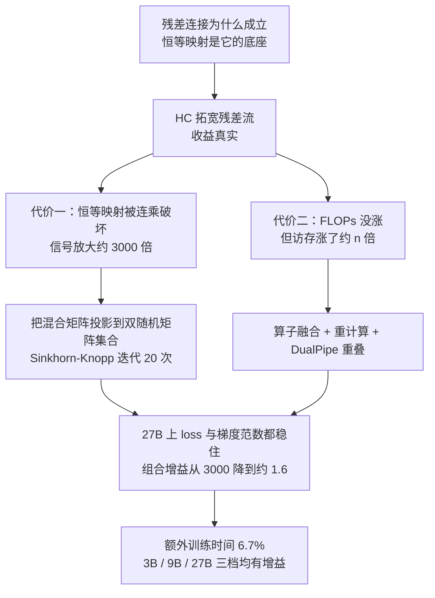
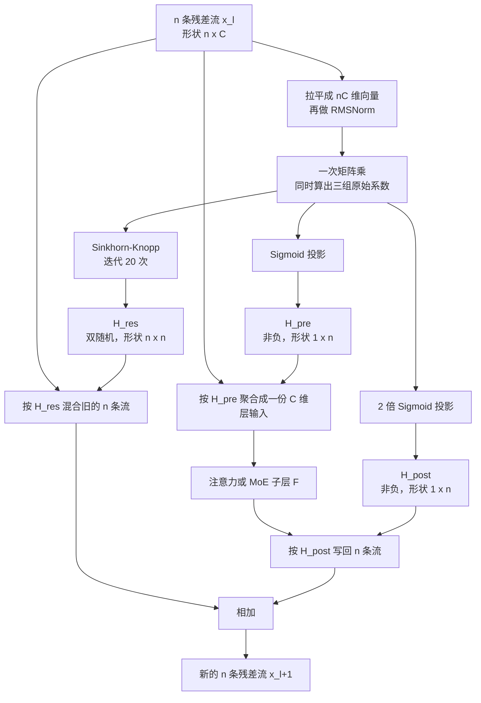
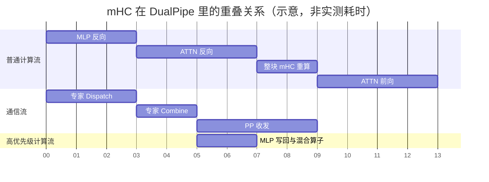

# mHC：残差流可以拓宽，但混合矩阵必须守恒

<!-- release-date: 2025-12-31 -->

> 本文依据本地 `papers/DeepSeek/mHC.pdf`，即 **mHC: Manifold-Constrained Hyper-Connections**，arXiv:2512.24880v2、2026-01-05 提交的修订版，共 19 页。页码均指 PDF 自身的页码。文中会区分三件事：**报告明确写了什么**、**我们怎么解释它**、**哪些是外部资料或本文推算**。
>
> 这是一篇技术论文，不是基模技术报告。它没有模型全貌，也没有对外发布的模型或权重。它只回答一个问题：**当有人把 Transformer 的残差流从一条拓宽成四条之后，训练为什么会炸，以及怎么用一个数学约束把它摁回去。** mHC 在百万上下文基座里怎么用，见 DeepSeek-V4 一篇；本篇是出处，只依据这份 PDF。

## 先把五个词说成人话

这篇论文的术语密度不高，但每一个都必须先讲清楚，否则后面所有推理都会悬空。

- **残差连接（Residual Connection）**：神经网络每一层不是把输入换掉，而是在输入上「加一笔」。写成一行就是「新状态 = 旧状态 + 本层算出来的增量」。这条加法是 ResNet 之后深层网络能训得动的根本原因。
- **恒等映射（Identity Mapping）**：字面意思是「原样映射」，即一个信号从浅层跑到深层，途中**一个数都不被改动**。残差连接的价值不在于加法本身，而在于加法留下了这样一条原样直达的通道。
- **残差流（Residual Stream）**：把上面那条加法沿层数串起来，就得到一条贯穿全网络的信息主干道。所有层都在这条主干道上读、算、写。它只有一条。
- **超连接（Hyper-Connections，HC）**：ByteDance 在 2024 年提出的做法（出处见文末资料，属外部补充；论文本身只以引用形式提及），把这条主干道从一条拓宽成 $n$ 条并行的通道，并且让每一层可以学习「从哪几条读、写回哪几条、旧的几条之间怎么互相混合」。收益是真的，问题也是真的。
- **流形约束（Manifold Constraint）**：「流形」在这里可以先当作「一个有良好数学性质的矩阵集合」来理解，不必先补微分几何。所谓流形约束，就是**不让某个学出来的矩阵在整个实数空间里乱跑，而是每一步都把它投影回那个集合里**。mHC 选的集合是「双随机矩阵」，下面会详细讲。

论文标题里的 `m` 就是 manifold（流形）。所以 mHC 的全名 Manifold-Constrained Hyper-Connections，直译是「被流形约束住的超连接」。

顺带说一个记号约定。论文把三个可学习映射写成 $\mathcal H^{\mathrm{pre}}_l$、$\mathcal H^{\mathrm{post}}_l$、$\mathcal H^{\mathrm{res}}_l$，花体加上下标读起来很累。本文统一简写成 $H^{\mathrm{pre}}_l$、$H^{\mathrm{post}}_l$、$H^{\mathrm{res}}_l$，含义与论文完全一致，只是去掉花体。

## 一句话先说清

超连接把残差流拓宽以后确实更强，但它给每一层塞进了一个**不受任何限制**的混合矩阵；几十层连乘之后，这些矩阵的乘积会把信号放大到三千倍，训练就炸了。

mHC 的做法不是退回单条残差流，也不是靠调学习率硬扛，而是：

> **保留多条残差流和层间混合的自由度，但强制那个混合矩阵只能落在「双随机矩阵」这个集合里——它非负、每行和为 1、每列和为 1，而且任意多个这样的矩阵相乘还是这样的矩阵。**

再加上一整套算子融合、重计算和流水线重叠，把这套多流设计的额外训练时间压到 6.7%（PDF p.4、p.9）。

所以这篇论文真正的贡献有两半，缺一不可：**一半是「给新自由度配一条守恒律」的架构思想，另一半是「让这条守恒律在真实集群上跑得起」的系统工程。** 只讲前一半，它就只是一个漂亮但昂贵的想法。

## 这篇论文的论证是一条直线

它的叙事非常规整，几乎没有旁支：

这张图是本文按论文第 1、3、4、5 节的论证顺序重画的机制示意图（依据 PDF p.3–14），不是实测时间轴；框里的数字来自论文正文。

**建议的阅读路线**：只想知道 mHC 是什么，读第四站就够；想理解它为什么必须存在，第三站不能跳；想判断能不能用在自己的训练里，第六站和第七站是重点；只关心和 DeepSeek-V4 的关系，直接跳到倒数第四节。

## 第零站：这篇论文站在哪张地图上

论文第 2 节先给了一张分类图，值得先看，因为它决定了 mHC 该和谁比（PDF p.4）。

深度学习的架构改进大致分两类：

- **微观设计（micro-design）**：管的是**计算块内部**，也就是特征在空间、时间、通道维度上怎么被处理。卷积曾经主导这一层，后来 depthwise separable、grouped convolution 做效率优化；Transformer 出现之后，注意力与 FFN 成了基本构件；为了压成本，注意力演化出 MQA、GQA、MLA 等高效变体，FFN 则被 MoE 稀疏化，从而在算力不成比例增长的前提下堆参数（PDF p.4–5）。
- **宏观设计（macro-design）**：管的是**块与块之间的拓扑**，也就是表示怎么在不同层之间传播、路由、合并（PDF p.4）。

这条分界线很有用。**过去几年绝大多数被广泛讨论的改进都发生在微观层**——注意力怎么算、专家怎么路由、KV 怎么压。宏观层自 ResNet 之后基本冻结在「一条残差流 + 逐层相加」这个形态上。

论文回顾了宏观设计的历史（PDF p.5）：ResNet 之后有 DenseNet 的密集连接、FractalNet 的多路径结构，Deep Layer Aggregation 进一步递归地聚合不同深度与分辨率的特征。最近这条线的关注点转向了**拓宽残差流本身**，论文一口气列了 Highway Transformer、层间注意力、DeepCrossAttention、LAuReL、DenseFormer、MUDDFormer、Residual Matrix Transformer 与 HC 等一系列工作。其中 HC 用可学习矩阵调节不同深度特征之间的连接强度，RMT 把残差流换成一个外积记忆矩阵，MUDDFormer 用多路动态密集连接优化跨层信息流（PDF p.5）。

论文对这一整条线给出的判断是统一的：**这些方法都损害了残差连接固有的恒等映射性质，因而引入不稳定、限制可扩展性；同时因为特征宽度扩大而带来显著的访存开销**（PDF p.5）。

于是 mHC 的定位就清楚了：它不打算发明一种新的连接拓扑，而是**给已经存在的那条拓宽路线补上缺的两件东西——恒等映射性质和硬件效率**。这也解释了为什么第七站的实验只比了基线、HC、mHC 三者：论文要证的不是「拓宽残差流有用」（HC 已经证过），而是「拓宽之后可以既稳又不贵」。

论文封面的图 1 用三张并排的示意图表达了同一件事（PDF p.1）：

| | (a) 普通残差连接 | (b) 超连接（HC） | (c) mHC |
|---|---|---|---|
| 残差流条数 | 1 | $n$ | $n$ |
| 层输入怎么来 | 直接就是 $x_l$ | 经 Pre Mapping $H^{\mathrm{pre}}_l$ | 经**投影后**的 Pre Mapping |
| 旧状态怎么进位 | 原样相加 | 经 Res Mapping $H^{\mathrm{res}}_l$ | 经**投影后**的 Res Mapping |
| 层输出怎么写回 | 直接相加 | 经 Post Mapping $H^{\mathrm{post}}_l$ | 经**投影后**的 Post Mapping |
| 有无恒等映射性质 | 有 | 无 | 恢复 |

图注写得很直白：与不受约束的 HC 不同，mHC 专注于**优化残差连接空间本身**，把矩阵投影到一个受约束的流形上以确保稳定（PDF p.1）。注意「优化的是连接空间，不是连接结构」这个说法——**mHC 没有增加任何一条新连线，它只是限制了已有连线的取值范围。**

## 第一站：残差连接凭什么撑了十年

### 一条加法在做什么

论文开篇就把最基础的形式摆出来（PDF p.3，式 1）：

$$
x_{l+1}=x_l+\mathcal F(x_l,W_l)
$$

这行公式在算「第 $l$ 层的输出」。$x_l$ 是本层输入，是一个 $C$ 维向量；$\mathcal F$ 是本层真正做事的那部分——注意力、前馈网络、卷积都可以；$W_l$ 是它的参数。所以整层做的事就是：**旧状态原样保留，再加上本层算出来的增量。**

论文特意指出，过去十年里 $\mathcal F$ 换了无数种，但这条加法的形态一直没变（PDF p.3）。这是一个值得先记住的事实：Transformer 时代改了注意力、改了 FFN、改了归一化位置，唯独这条加法没人动。

### 把加法沿层数展开

把式 1 递归代入自己，得到（PDF p.3，式 2）：

$$
x_L=x_l+\sum_{i=l}^{L-1}\mathcal F(x_i,W_i)
$$

$L$ 是较深的层，$l$ 是较浅的层。这行公式的意思是：**深层的状态 = 浅层的状态原封不动 + 中间每一层各自贡献的增量之和。**

论文强调，式 2 里那个孤零零的 $x_l$ 就是「恒等映射」（PDF p.3）。它的前面没有任何系数、没有任何矩阵，浅层信号一路直达深层，中途不被缩放也不被旋转。

### 恒等映射为什么是「性质」而不是「公式」

这里要多说一句，因为后面所有争论都建立在这上面。

恒等映射的价值不是「有一条加法」，而是**这条加法在任意深度上都不改变信号强度**。前向时，浅层的表示不会因为叠了三十层就变成原来的百分之一或一百倍；反向时，梯度也能沿这条路径原样回到浅层，不会指数衰减或爆炸。

换个说法：残差连接给网络装了一条**没有增益的旁路**。增益为 1 这件事，恰恰是它能扛住深度的原因。一旦这个 1 变成 1.1 或 0.9，乘上六十层就是约 300 倍或者约 0.002 倍（本文举例，非论文数据）。

论文用了一个更准确的词：在多条并行流的架构里，理想的恒等映射是一种**守恒机制**，它保证「跨流的平均信号强度在前向和反向中都保持不变」（PDF p.3）。请记住「守恒」这个词，它是 mHC 全部设计的目标函数。

## 第二站：超连接把一条车道改成 n 条

### HC 改的是「连接」，不是「计算」

超连接的想法是：既然残差流是全网络的信息主干道，那它只有一条会不会太窄？能不能拓成 $n$ 条并行的流，让不同层按需读写？

于是每层输入从一个 $C$ 维向量 $x_l$，变成一个 $n\times C$ 的矩阵（PDF p.5）：

$$
x_l=(x_{l,0}^\top,\dots,x_{l,n-1}^\top)^\top\in\mathbb R^{n\times C}
$$

注意一个容易误解的地方：**层内部仍然只处理 $C$ 维**。$n$ 条流不是把每个 Transformer Block 放大 $n$ 倍，而只是把「层与层之间存放状态的容器」变宽了。所以 HC 几乎不增加 FLOPs（PDF p.3）。论文把这称为「把残差流的信息容量与层输入维度解耦」——层输入维度直接决定算力开销，残差流宽度不决定（PDF p.6）。

单层传播写成（PDF p.3，式 3）：

$$
x_{l+1}=H^{\mathrm{res}}_lx_l+H^{\mathrm{post}\top}_l\mathcal F(H^{\mathrm{pre}}_lx_l,W_l)
$$

### 三个映射各管一件事

式 3 里出现三个可学习矩阵，形状都很小，各管一件事（PDF p.3、p.5）：

| 映射 | 形状 | 干什么 | 类比 |
|---|---|---|---|
| $H^{\mathrm{pre}}_l$ | $1\times n$ | 把 $n$ 条流聚合成一份 $C$ 维层输入 | 从 $n$ 条车道里取一份混合样本进厂 |
| $H^{\mathrm{post}}_l$ | $1\times n$ | 把层输出写回 $n$ 条流 | 决定产品分发到哪几条车道 |
| $H^{\mathrm{res}}_l$ | $n\times n$ | 把 $n$ 条旧流互相混合成新的 $n$ 条 | 车道之间的调度器 |

三个矩阵都由两部分系数相加得到：一部分是**静态映射**（与输入无关的可学习偏置），一部分是**动态映射**（由当前输入现算出来的）。HC 的原始写法是（PDF p.5，式 5）：

$$
\begin{aligned}
\tilde x_l&=\mathrm{RMSNorm}(x_l)\\
H^{\mathrm{pre}}_l&=\alpha^{\mathrm{pre}}_l\cdot\tanh(\theta^{\mathrm{pre}}_l\tilde x_l^\top)+b^{\mathrm{pre}}_l
\end{aligned}
$$

$H^{\mathrm{post}}_l$ 与 $H^{\mathrm{res}}_l$ 是同一个模子，只是投影矩阵和偏置的形状不同。符号逐个说明：$\theta$ 是把归一化后的隐状态投影成系数的线性层，$b$ 是静态偏置，$\alpha$ 是一个**可学习的标量门控因子，初值设得很小**（PDF p.5）。

$\alpha$ 初值很小这一点值得单独记住：它意味着训练一开始，动态部分几乎不起作用，网络先按一组接近固定的连接跑；随着训练推进，模型才逐渐学会「按当前输入调度车道」。附录给出的初值是 $\alpha=0.01$（PDF p.19）。

### 消融表：收益主要来自 $H^{\mathrm{res}}$

论文先做了一个前置实验，逐个打开三个映射，看训练 loss 相对全关闭时降低多少（PDF p.6，表 1）：

| 打开的映射 | 绝对 loss 差 |
|---|---:|
| 全部关闭 | 0.0 |
| 只开 $H^{\mathrm{res}}$ | −0.022 |
| $H^{\mathrm{res}}+H^{\mathrm{pre}}$ | −0.025 |
| 三个全开 | −0.027 |

关闭某个映射时用固定映射维持维度一致：$H^{\mathrm{pre}}$ 取全 $1/n$、$H^{\mathrm{post}}$ 取全 1、$H^{\mathrm{res}}$ 取单位矩阵（PDF p.6）。

这张表的读法很关键：**总收益 0.027 里有 0.022 来自 $H^{\mathrm{res}}$ 一个矩阵，占八成。** 也就是说，超连接真正值钱的部分是「让 $n$ 条残差流互相交换信息」，而不是「读入怎么取样、写回怎么分发」。

论文自己的结论是：这凸显了残差流内部有效信息交换的重要性（PDF p.6）。而本文要补一句读者容易忽略的推论——**麻烦也恰恰出在这个最值钱的矩阵上**。$H^{\mathrm{res}}_l$ 是唯一一个 $n\times n$、会被逐层连乘的矩阵，后面所有的不稳定都由它引起。收益最大的部件同时是风险最大的部件，这在系统设计里几乎是常态。

论文没有说明表 1 用的是哪个规模的模型、训练了多少 Token，只说是「前置实验」（PDF p.6）。所以这三个数字适合用来判断**相对重要性排序**，不适合当成任何规模下的绝对收益。

### 为什么这条路值得走

除了性能，HC 还提供了一个新的扩展方向。论文明确说：HC 让残差流宽度成为一根新的扩展轴，与预训练 scaling law 里传统的「模型 FLOPs」和「训练数据量」两根轴互补（PDF p.6）。

这个说法很有分量。过去要提升能力，路径基本是三条：加参数、加数据、加算力。HC 提出了第四条——**在几乎不增加 FLOPs 的前提下，加拓扑复杂度**。如果这条轴真的有效，它的性价比会非常好。论文全文的动机就是想把这条轴保住。

## 第三站：HC 交上来的两张账单

### 账单一：恒等映射被连乘吃掉了

把式 3 沿层数展开，就得到 HC 版本的式 2。原式（PDF p.3，式 4）的上下标很密，先定义一个中间量会好读很多。记从第 $l$ 层到第 $L$ 层的**组合残差映射**为：

$$
P_{l\to L}=\prod_{i=1}^{L-l}H^{\mathrm{res}}_{L-i}
$$

它就是把中间每一层的 $H^{\mathrm{res}}$ 依次乘起来。有了它，式 4 可以写成：

$$
x_L=P_{l\to L}\,x_l+\sum_{i=l}^{L-1}P_{i+1\to L}\,H^{\mathrm{post}\top}_i\mathcal F(H^{\mathrm{pre}}_ix_i,W_i)
$$

把它和式 2 并排看，差别只有一处，但这一处是致命的：

- 式 2 里，浅层信号项是 $x_l$，**前面什么都没有**；
- 式 4 里，浅层信号项是 $P_{l\to L}x_l$，**前面挂着几十个矩阵的乘积**。

因为 $H^{\mathrm{res}}_l$ 完全不受约束，$P_{l\to L}$ 必然偏离单位矩阵。论文的判断是：这个组合映射无法保持特征的全局均值，于是信号会**无界地放大或衰减**（PDF p.4）。

这就是「恒等映射被破坏」的确切含义。**不是残差连接不见了，而是那条本来增益为 1 的旁路，变成了一条增益未知的旁路。**

### Amax Gain Magnitude 到底在量什么

为了把「放大了多少倍」变成可测的量，论文定义了一个指标，叫 **Amax Gain Magnitude**（PDF p.6、p.7 图 3 注）：对一个矩阵 $M$，

$$
G^{\mathrm{fwd}}(M)=\max_i\Big|\sum_j M_{ij}\Big|,
\qquad
G^{\mathrm{bwd}}(M)=\max_j\Big|\sum_i M_{ij}\Big|
$$

前者取**最大绝对行和**，对应前向；后者取**最大绝对列和**，对应反向。数值全部按一条选定序列上的所有 Token 平均。

为什么行和管前向、列和管反向？论文没有展开，本文补一个直觉推导（**这段是本文的解释，不是论文原话**）：

- 前向时新的第 $i$ 条流是 $\sum_j M_{ij}x_j$。如果 $n$ 条流当前携带的信号大致同向，那么第 $i$ 条流的放大倍数就是第 $i$ 行的和。取所有行里最大的那个，就是最坏情况下的前向放大。
- 反向时梯度要乘 $M^\top$，行列互换，于是列和接管了同样的角色。

用最小的例子确认一下。取 $n=2$、

$$
M=\begin{bmatrix}1.5 & 0.8\\ 0.2 & 0.4\end{bmatrix}
$$

如果两条流当前都携带同一个向量 $v$，混合之后第一条流变成 $2.3v$、第二条流变成 $0.6v$——**行和 2.3 和 0.6 就是这两条流各自的放大倍数**，取绝对值最大的 2.3，就是这一层最坏情况下的前向增益。列和是 1.7 和 1.2，它们在反向时扮演同样的角色。

**理想值是 1。** 对一个双随机矩阵，行和与列和都恰好是 1，两个指标都精确等于 1——这正是 mHC 要达到的状态。也正因为如此，这个指标不只是「一个诊断量」，它同时就是**约束是否生效的直接读数**：图 7 里那条压在 1.0 上的直线，等价于「双随机条件在这一侧被精确满足」。

### 实测：27B 模型上放大了三千倍

论文在一个 27B 的 MoE 模型上把这两个指标画了出来（PDF p.7，图 3；模型配置见 PDF p.19）。图的横轴是层序号，把每个标准 Transformer Block 拆成注意力和 FFN 两层来数，所以 30 层的模型有 60 个层序号（PDF p.7 图 3 注）。

结论是：**组合映射的 Amax Gain Magnitude 峰值达到 3000，与理想值 1 相差三个数量级**，坐实了残差流爆炸（PDF p.6）。

图 3(a) 的单层映射反而没那么吓人——大部分层的增益就在 1 附近浮动，只有最后几层明显翘起来（本文从 PDF p.7 图 3(a) 读到）。这个对比很重要：**单看每一层都还算正常，问题是几十层乘起来。** 这也是这类不稳定难以在小规模实验里暴露的原因。

论文在图 8 里还直接把几个具体矩阵打印了出来（PDF p.14）。以 HC 为例：

- 第 1 层的 $H^{\mathrm{res}}$，四行的行和分别是 18.73、−15.29、−14.79、−15.88，四列的列和都是 −6.81；
- 第 30 层的 $H^{\mathrm{res}}$ 反而很接近单位矩阵，对角线是 0.94、0.89、0.81、0.87，但四行的行和是 0.84、0.67、0.49、0.96，已经明显小于 1；
- 完整 60 层的组合矩阵 $\prod_{i=1}^{60}H^{\mathrm{res}}_{61-i}$，行和是 −475.3、−462.8、509.1、−498.5，列和是 −259.2、−219.1、−228.2、−221.0。

这几个数字是本文从 PDF p.14 图 8 印出的数值读到的，论文正文没有逐个复述。把它们和图 3(b) 交叉核对可以确认一致：图 3(b) 里前向曲线在最深处约 500、反向曲线在最浅处约 250，正好对上 509.1 和 259.2。

顺便注意 HC 第 1 层那个矩阵的形态：**第一行全是正的大数、其余三行全是负的大数**。这就是论文强调「非负性可以防止正负系数互相抵消」的现实背景——不受约束的矩阵会自己长成这种正负对冲的样子，一旦某一侧稍微偏一点，抵消就失衡。

### loss 曲线在 12k step 抬头

理论分析之外还有直接的训练证据。论文以 mHC 为基准画 HC 的绝对 loss 差，发现 HC 在大约 12k step 出现一次预期之外的 loss 上冲，并且与梯度范数的不稳定高度相关（PDF p.6、p.7 图 2）。从图 2(a) 可以看到，这次上冲之后 HC 的 loss 差再也没有回到之前的水平（本文从 PDF p.7 图 2(a) 读到）。

这是一个很有代表性的失败模式：**它不是一开始就炸，而是训到一万多步才炸。** 小规模、短训练的验证会完全看不到它。

### 账单二：FLOPs 没涨，访存涨了 n 倍

第二张账单和数学无关，纯粹是硬件。

论文引用「内存墙」这个说法：现代模型架构的主要瓶颈之一是访存（I/O）成本，而它在架构设计阶段经常被忽略，却决定运行时效率（PDF p.7）。

针对 pre-norm Transformer，论文逐项列出了单层残差维护的每 Token 访存量（PDF p.8，表 2）：

| 方法 | 操作 | 读（元素数） | 写（元素数） |
|---|---|---|---|
| 普通残差 | 残差合并 | $2C$ | $C$ |
| 普通残差 | **合计** | $2C$ | $C$ |
| 超连接 | 计算三个映射 | $nC$ | $n^2+2n$ |
| 超连接 | 应用 $H^{\mathrm{pre}}$ | $nC+n$ | $C$ |
| 超连接 | 应用 $H^{\mathrm{post}}$ | $C+n$ | $nC$ |
| 超连接 | 应用 $H^{\mathrm{res}}$ | $nC+n^2$ | $nC$ |
| 超连接 | 残差合并 | $2nC$ | $nC$ |
| 超连接 | **合计** | $(5n+1)C+n^2+2n$ | $(3n+1)C+n^2+2n$ |

把 $n=4$ 代进去：读从 $2C$ 涨到约 $21C$，写从 $C$ 涨到约 $13C$。论文的结论是，HC 让访存成本**大致按 $n$ 的比例增加**，若不做算子融合，会显著拖慢训练吞吐（PDF p.7）。

表里每一行的来源其实都可以口算，这有助于理解后面的融合优化到底省了哪一笔（**以下逐项解读是本文补的，论文只给了表**）：

- **计算三个映射**：要读一遍 $n$ 条流（$nC$），写出三组小系数，一共 $n^2+2n$ 个数（$H^{\mathrm{res}}$ 占 $n^2$，另外两个各占 $n$）。
- **应用 $H^{\mathrm{pre}}$**：读 $n$ 条流加上 $n$ 个系数，写出一份 $C$ 维层输入。
- **应用 $H^{\mathrm{post}}$**：读一份 $C$ 维层输出加 $n$ 个系数，写出 $n$ 份。
- **应用 $H^{\mathrm{res}}$**：读 $n$ 条流加 $n^2$ 个系数，写出 $n$ 条新流。
- **残差合并**：把上面两个 $n$ 条流的结果读进来相加（$2nC$），写回 $n$ 条流。

关键在最后三行：**$n$ 条流被反复读写了好几遍**，而每一遍做的事情都极其简单。这正是融合的机会所在——如果把 $H^{\mathrm{post}}$、$H^{\mathrm{res}}$ 的应用和残差合并写在同一个 kernel 里，中间那两次 $nC$ 的写和 $2nC$ 的读就完全不必落回显存。第六站会看到论文正是这么做的。

这是一条很容易被忽略的账。**FLOPs 表上看不出任何变化，秒表上却慢了一大截。** 因为这些操作全都是线性的、算术强度极低的小算子，时间几乎全花在搬数据上。

### 还有两笔连带账

论文接着点了另外两笔（PDF p.7）：

1. **激活显存**。三个映射都带可学习参数，它们的中间激活必须留给反向传播。多流之后这部分显存显著变大，往往被迫上梯度检查点。
2. **流水线通信**。流水并行时相邻 stage 之间要传的残差状态变成 $n$ 份，通信量涨 $n$ 倍，气泡变大，吞吐下降。

把两张账单合起来看，HC 的处境是：**性能收益真实，但既不稳定又不划算。** mHC 的两半贡献，正好一半治稳定、一半治划算。

## 第四站：mHC 的答案是给矩阵挑一个集合

### 先说人话：双随机矩阵是什么

mHC 的核心动作只有一句：**不让 $H^{\mathrm{res}}_l$ 在整个 $\mathbb R^{n\times n}$ 里自由取值，而是每次都把它投影到「双随机矩阵」这个集合里。**

双随机矩阵（doubly stochastic matrix）的定义非常朴素（PDF p.8，式 6）：

$$
H^{\mathrm{res}}_l\mathbf 1_n=\mathbf 1_n,
\qquad
\mathbf 1_n^\top H^{\mathrm{res}}_l=\mathbf 1_n^\top,
\qquad
H^{\mathrm{res}}_l\ge 0
$$

$\mathbf 1_n$ 是长度为 $n$ 的全 1 向量，所以三个条件依次是：**每行加起来等于 1、每列加起来等于 1、每个元素非负**。

用车道调度的说法：旧的 $n$ 条流可以任意重新分配，但

- 不能凭空造出流量（行和固定为 1）；
- 不能让某条车道无限吞掉别人（列和固定为 1）；
- 不能靠一正一负猛烈对冲（元素非负）。

论文把这句话说得更准确：因为行和列的和都是 1，$H^{\mathrm{res}}_lx_l$ 就是输入特征的一个**凸组合**，于是特征均值被守恒、信号范数被严格约束，从而避免了消失或爆炸（PDF p.4）。

这里可以直接对上第一站说的「守恒」：

- **行和为 1** 意味着，如果 $n$ 条流当前携带同一个向量 $v$，那么混合之后每条流还是 $v$。也就是说，恒等映射在「各流一致」这个方向上被精确恢复了。
- **列和为 1** 意味着 $\mathbf 1^\top(Hx)=(\mathbf 1^\top H)x=\mathbf 1^\top x$，即跨流求和（因而跨流均值）在前向中一个数都不变。

这两条正好覆盖论文在 p.3 说的「前向与反向的跨流平均信号强度保持不变」。（上面这两行推导是本文补的，论文只给结论。）

### 为什么偏偏是它：三条性质对着三个风险

论文列了三条性质（PDF p.8），本文把每条性质对应到它治的那个病：

**性质一，范数保持。** 双随机矩阵的谱范数不超过 1，即 $\lVert H^{\mathrm{res}}_l\rVert_2\le 1$，因此这个映射是**非扩张的**（non-expansive），能有效缓解梯度爆炸（PDF p.8）。

「谱范数不超过 1」直白说就是：这个矩阵作用在任何向量上，都不会把向量的长度拉长。本文补一个为什么成立的思路：矩阵元素非负时，最大行和就是 $\lVert\cdot\rVert_\infty$、最大列和就是 $\lVert\cdot\rVert_1$，两者都等于 1，而谱范数不超过这两者的几何平均，于是 $\lVert H\rVert_2\le\sqrt{1\cdot 1}=1$。（这一步推导是本文补的，论文只给了结论。）

**性质二，乘法封闭。** 双随机矩阵集合对矩阵乘法封闭，所以组合映射 $P_{l\to L}=\prod H^{\mathrm{res}}$ 仍然是双随机矩阵，稳定性沿整个深度保持（PDF p.8）。

这条才是真正的杀招，也是「流形约束」三个字里最有用的部分。本文补一个一行证明：若 $A\mathbf 1=\mathbf 1$ 且 $B\mathbf 1=\mathbf 1$，则 $(AB)\mathbf 1=A(B\mathbf 1)=A\mathbf 1=\mathbf 1$；列的方向同理；非负乘非负仍非负。**所以约束不是「每层各自安全」，而是「任意深度的组合都安全」。** 第三站那个 $P_{l\to L}$ 的爆炸问题，在这里被从根上堵住了。

对照一下就明白差距有多大：只保证「每层谱范数 ≤ 1」的话，组合的范数上界是 1，但组合可以持续衰减到 0；而双随机的封闭性同时锁住了上界和守恒量，组合既不会爆也不会灭。

**性质三，几何解释。** 所有 $n\times n$ 双随机矩阵构成 **Birkhoff polytope（伯克霍夫多面体）**，它是所有置换矩阵的凸包。论文由此给出一个清晰的几何读法：残差映射是若干个「置换」的凸组合；反复作用这类矩阵会**单调地增加跨流的信息混合**，从而扮演一个稳健的特征融合机制（PDF p.8）。

「置换矩阵」就是纯粹的换位置：把第 1 条流搬到第 3 条、第 3 条搬到第 2 条，不缩放也不相加。凸包的意思是，学出来的矩阵最多只能是若干种换位方案的加权平均。**这个集合的边界恰好是「只换位、不放大」，中间是「越混越匀」，两端都没有危险区。**

### 一个 2×2 的例子

抽象定义看完，用最小的例子确认直觉。取

$$
H=\begin{bmatrix}0.7 & 0.3\\ 0.3 & 0.7\end{bmatrix}
$$

它允许两条流互相交换 30% 的信息，行和列都是 1。作用在 $(a,b)$ 上得到 $(0.7a+0.3b,\ 0.3a+0.7b)$：两条流之和还是 $a+b$，任何一条都没被放大。乘上它自己得到对角 0.58、非对角 0.42 的矩阵，仍然双随机——只是混得更匀了。

再看论文图 8 里 mHC 真实学出来的矩阵，形态完全吻合（PDF p.14，本文从图上读到）：

- 第 1 层的 $\mathcal P(H^{\mathrm{res}})$：0.67/0.09/0.03/0.22、0.26/0.48/0.26/0.00、0.03/0.24/0.00/0.73……混合很强；
- 第 30 层：对角线是 0.96、0.97、1.00、0.95，几乎就是单位矩阵；
- 完整 60 层的组合：每个元素都在 0.21–0.28 之间，也就是接近全 $1/4$ 的均匀矩阵，行和都是 1.00 或 1.01。

**这三张图连起来讲了一个故事**（以下是本文的观察，论文只说「mHC consistently yields stable results」，PDF p.14）：模型把大部分跨流混合放在最浅的几层完成，中后段的单层映射基本退化成恒等；而六十层乘完之后，组合矩阵收敛到均匀混合——这恰好是性质三预言的「反复作用会单调增加混合」。均匀矩阵的行和列和都精确为 1，所以它本身就是最安全的不动点。

### 顺手把 $H^{\mathrm{pre}}$ 与 $H^{\mathrm{post}}$ 摁成非负

论文额外对输入映射和输出映射施加非负约束，理由是**防止正负系数组合带来的信号抵消**，并把它也视为一种特殊的流形投影（PDF p.9）。

实现方式很轻（PDF p.9，式 8）：

$$
H^{\mathrm{pre}}_l=\sigma(\tilde H^{\mathrm{pre}}_l),
\qquad
H^{\mathrm{post}}_l=2\sigma(\tilde H^{\mathrm{post}}_l)
$$

$\sigma$ 是 Sigmoid，把任意实数压到 $(0,1)$；$H^{\mathrm{post}}$ 前面乘 2，把范围放到 $(0,2)$。带波浪线的量是投影前的原始候选，下一节会说它怎么算出来。

论文没有给这一项的单独消融，也没有解释 $H^{\mathrm{post}}$ 为什么需要更宽的 $(0,2)$ 而 $H^{\mathrm{pre}}$ 不需要。**本文的猜测是：$H^{\mathrm{pre}}$ 负责聚合 $n$ 条流去做层输入，取值偏小相当于自动做了一次平均，而 $H^{\mathrm{post}}$ 负责把层输出写回，若上限只有 1，写回强度会被系统性压低。这只是推测，论文未作说明。**

### 为什么不干脆让 $H^{\mathrm{res}}=I$

这是最容易冒出来的反问：既然恒等映射这么好，直接把 $H^{\mathrm{res}}$ 钉成单位矩阵不就完了？

论文的回答很直接：原始的恒等映射确实通过 $H^{\mathrm{res}}_l=I$ 保证了稳定，但它**从根本上排除了残差流内部的信息交换**，而这恰恰是多流架构价值的来源（PDF p.8）。

换句话说，钉成单位矩阵等于把第二站表 1 里那 −0.022 的收益全部退回去，只剩下一个更占显存的普通 Transformer。

论文还指出一个漂亮的退化关系：当 $n=1$ 时，双随机条件退化成标量 1，正好还原成原始的恒等映射（PDF p.8）。**所以 mHC 不是「残差连接的替代品」，而是「残差连接的严格推广」：把宽度从 1 拉到 $n$，同时把「系数必须是 1」推广成「矩阵必须双随机」。** 这个定位比「一个新模块」有说服力得多。

## 第五站：约束怎么落成可训练的一步

选定集合只是第一步。模型学出来的原始矩阵不会自动满足行和列和为 1，必须有一个可微、可在每次前向里跑的投影算法。

### Sinkhorn-Knopp：交替把行和列刷平

mHC 用的是 Sinkhorn-Knopp 算法（PDF p.4、p.9）。步骤朴素到可以口述：

1. 先取指数，把所有元素变成正数：$M^{(0)}=\exp(\tilde H^{\mathrm{res}}_l)$；
2. 把每一列归一化到和为 1；
3. 再把每一行归一化到和为 1；
4. 重复第 2、3 步。

写成一行就是（PDF p.9，式 9）：

$$
M^{(t)}=\mathcal T_r\big(\mathcal T_c(M^{(t-1)})\big)
$$

$\mathcal T_r$ 是行归一化，$\mathcal T_c$ 是列归一化。当 $t_{\max}\to\infty$ 时收敛到双随机矩阵；实践中 mHC 取 $t_{\max}=20$（PDF p.9、p.19）。

为什么要交替？因为刚把列刷平，行就又不平了；反过来也一样。所以只能来回校准，像调一张两个方向都要对齐的表格，来回几轮之后两边都逼近 1。

用 $\exp$ 而不是别的方式保证正性也有讲究：**它把「非负」这个不等式约束变成了一个处处可微、且永远严格为正的变换**，Sinkhorn 迭代因此可以整段放进自动微分里，不需要任何投影梯度或者拉格朗日乘子。（这句是本文的解释，论文只说「firstly makes all elements to be positive via an exponent operator」，PDF p.9。）

### mHC 的参数化跟 HC 差在两处

这是很多二手介绍会漏掉的一节。mHC 并不是「HC 的式 5 后面再接一个投影」，它连原始候选的算法都改了（PDF p.9，式 7）：

$$
\begin{aligned}
\vec x_l&=\mathrm{vec}(x_l)\in\mathbb R^{1\times nC},\qquad \vec x'_l=\mathrm{RMSNorm}(\vec x_l)\\
\tilde H^{\mathrm{pre}}_l&=\alpha^{\mathrm{pre}}_l\cdot(\vec x'_l\varphi^{\mathrm{pre}}_l)+b^{\mathrm{pre}}_l\\
\tilde H^{\mathrm{res}}_l&=\alpha^{\mathrm{res}}_l\cdot\mathrm{mat}(\vec x'_l\varphi^{\mathrm{res}}_l)+b^{\mathrm{res}}_l
\end{aligned}
$$

其中 $\mathrm{vec}(\cdot)$ 把 $n\times C$ 的隐状态**拉平**成一个 $nC$ 维长向量，$\mathrm{mat}(\cdot)$ 再把 $1\times n^2$ 的结果**重排**回 $n\times n$；投影矩阵的形状是 $\varphi^{\mathrm{pre}}_l,\varphi^{\mathrm{post}}_l\in\mathbb R^{nC\times n}$、$\varphi^{\mathrm{res}}_l\in\mathbb R^{nC\times n^2}$（PDF p.9）。

对比 HC 的式 5，两处改动很明确：

1. **归一化与投影的输入不同。** HC 对 $n\times C$ 的最后一维做 RMSNorm，再用 $\mathbb R^{1\times C}$ 或 $\mathbb R^{n\times C}$ 的投影按流处理；mHC 先把 $n$ 条流整个拉平成 $nC$ 维再归一化和投影。论文给的理由是「保留完整上下文信息」（PDF p.9）。**本文的理解是：既然 $H^{\mathrm{res}}$ 的任务是决定 $n$ 条流之间怎么调度，那么算这个决策时就应该同时看到全部 $n$ 条流的内容，而不是逐流分别看。**
2. **$\tanh$ 被去掉了。** HC 的式 5 每一行都套着 $\tanh$，负责把动态系数限制在有界范围内；mHC 的式 7 里没有 $\tanh$，因为有界性和非负性已经交给后面的 $\sigma$、$2\sigma$ 和 Sinkhorn-Knopp 来管（PDF p.5 对 p.9）。

第二点是本文对照两条式子得出的结论，论文没有专门说明这处删改。它其实体现了一个不错的设计经验：**当你在出口加了一个更强的约束，入口那个只为了「别太离谱」而存在的挤压函数就该拿掉，否则两层限制会互相拉扯，还白白多一次非线性。**

静态偏置 $b$ 和门控 $\alpha$ 的角色与 HC 一致，$\alpha$ 初值仍是 0.01（PDF p.19）。所以训练初期，$\tilde H^{\mathrm{res}}$ 几乎等于静态偏置，投影结果接近一个固定的双随机矩阵；动态调度是后来慢慢长出来的。

### 20 次迭代是近似，误差被画了出来

论文在稳定性分析里非常坦诚地承认了近似的后果（PDF p.14）：

> 理想情况下单层映射满足双随机约束，前向信号增益与反向梯度增益都应精确等于 1。但实际实现为了效率必须限制迭代次数。在本文的设置中使用 20 次迭代得到近似解。因此如图 7(a) 所示，反向梯度增益与 1 有轻微偏离。

图 7 的实测结果是：单层映射的前向增益是一条**精确压在 1.0 上的直线**，反向增益在 1.02–1.05 之间小幅浮动；组合映射的偏离会累积，但有界，最大约 1.6（PDF p.14；1.02–1.05 这个区间是本文从图 7(a) 读到的，论文只说「slightly」）。

**为什么恰好是前向精确、反向近似？** 本文的解释是：式 9 每一轮迭代的顺序是「先列归一化、再行归一化」，所以最后一次操作是行归一化，行和被精确刷成 1，列和只是近似。前向增益看行和，因此精确；反向增益看列和，因此有残差。图 7(a) 里前向那条完全笔直的线正是这个结构的直接后果。（论文没有作此说明，这是本文的推断。）

这个小细节有实际价值：**如果某天需要把误差挪到前向侧，只要把式 9 的行列顺序对调即可，不必增加迭代次数。**

组合映射那条曲线还有一个有意思的形状（本文从 PDF p.14 图 7(b) 读到）：横轴左端是跨 60 层的组合，右端是跨 1 层的组合；曲线在跨 20 层左右达到峰值 1.65，然后**在两端都回落到 1 附近**。乘的矩阵更多，偏离反而更小。本文认为这与性质三是一致的：矩阵乘得越多，组合越接近均匀矩阵，而均匀矩阵的行和列和精确为 1。论文只报告了最大值约 1.6，没有讨论这个非单调形状。

### 两条注记：「流形」这个词，和一个 16 变 9 的参数化

这两条论文都没有讨论，但对理解这个设计有帮助。**以下都是本文的注记，不是论文内容。**

**注记一：严格说，Birkhoff polytope 不是光滑流形。** 论文一直用「manifold」称呼双随机矩阵集合（PDF p.8），而多面体是有边界、有顶点、有棱的，顶点处并不光滑——那些顶点正是置换矩阵。不过在 mHC 的实现里这个措辞并不会造成问题：因为第一步是取 $\exp$，元素恒为正，之后的行列归一化也保持正性，所以 $H^{\mathrm{res}}_l$ 永远落在多面体的**相对内部**（所有元素严格大于 0），而相对内部确实是一个光滑的集合，梯度处处良好定义。换句话说，**这个参数化天然回避了不光滑的边界，代价是模型永远无法学到一个精确的置换矩阵（那需要某些元素恰好等于 0）。**

**注记二：$n^2$ 个参数只能表达 $(n-1)^2$ 个自由度。** $n\times n$ 的双随机矩阵满足 $2n$ 个线性约束（$n$ 个行和、$n$ 个列和），其中有一个是冗余的（行和总和等于列和总和），所以自由度是 $n^2-(2n-1)=(n-1)^2$。$n=4$ 时是 9。而模型算出来的 $\tilde H^{\mathrm{res}}_l$ 有 $n^2=16$ 个数。多出来的 7 个去哪了？

去处是 Sinkhorn 的**缩放不变性**：把 $\exp(\tilde H)$ 左乘、右乘任意正对角矩阵，Sinkhorn 的结果不变，而这样的对角缩放恰好有 $2n-1=7$ 个自由度。所以这套参数化是**冗余的**——多个不同的 $\tilde H^{\mathrm{res}}$ 会被投影到同一个 $H^{\mathrm{res}}$。

这不是错误，只是要知道两件事：一是投影后的有效表达力是 9 维而不是 16 维，讨论「残差混合有多少自由度」时应该按 9 算；二是这种冗余在优化上通常无害（参数可以在等价类内自由漂移），但它也意味着**参数本身没有唯一解，权重的数值不适合直接拿来做跨 run 的比较**。论文没有讨论这一点，图 8 里展示的也都是投影之后的矩阵，而不是原始参数。

### 一层 mHC 的完整前向

把这一节的所有部件接起来：

这张图由本文根据 PDF p.1 图 1(c) 与 p.9 的式 7–9 重画，是机制示意，不表示各步骤的真实耗时或执行顺序。

## 第六站：不做 infra，这套设计跑不起来

论文有近三分之一的篇幅在讲工程（第 4.3 节，PDF p.9–11）。这不是凑字数：第三站那张访存账单如果不还，mHC 就算数值上稳了，实际吞吐也会难看到没人愿意用。

### 优化一：把归一化的除法挪到矩阵乘之后

第一条优化极小但极典型。RMSNorm 作用在 $nC$ 维的长向量上时延迟很高，于是 mHC **把「除以范数」这一步重排到矩阵乘之后执行**，数学上完全等价，效率更好（PDF p.9–10）。

为什么等价？因为 RMSNorm 的缩放是一个标量除法，而矩阵乘是线性的：先除再乘，和先乘再除，结果一样。但代价差别很大——先除意味着要把整个 $nC$ 维向量读出、逐元素除、写回，再读进来做矩阵乘；后除只需要对矩阵乘之后那个很小的结果（长度 $n^2+2n$）做一次标量除法。

这条经验完全可以带走：**当归一化后面紧跟一个线性算子时，先算线性、再补上标量，往往能省掉一整趟对大张量的读写。**

重排之后的顺序落在式 14 到式 16 上（PDF p.10）：先算未归一化的矩阵乘 $\vec x_l\varphi_l$（式 14），再单独算出范数标量 $r=\lVert\vec x_l\rVert_2/\sqrt{nC}$（式 15），最后把 $1/r$、三个门控 $\alpha$ 和偏置 $b_l$ 一起作用在那组很小的系数上（式 16）。

论文说这里「融合了对 $\vec x_l$ 的两次扫描」（PDF p.10），指的就是式 14 和式 15——两者都要完整读一遍那个 $nC$ 维的长向量，一次为了矩阵乘，一次为了求范数。**分开写就是读两遍，融合之后只读一遍。** 反向同理：反向需要两次矩阵乘，论文同样把它们合成一个 kernel，理由明确写着「避免重复加载 $\vec x_l$」（PDF p.10）。

这里出现了一个很值得记住的模式：**「先归一化再线性」这种写法之所以自然，是因为它符合人的思考顺序；但硬件在意的是同一块大张量被读了几遍。** 一旦意识到范数只是个标量，重排就变成了一次免费的优化。

### 五个 kernel 的分工

mHC 一共写了五个专用算子，三个算系数、两个用系数（PDF p.9–10，式 10–19）：

| 算子 | 做什么 | 关键设计 |
|---|---|---|
| 系数算子一 | 一次矩阵乘算出三组原始系数 $\vec x_l\varphi_l$，同时算出范数标量 $r=\lVert\vec x_l\rVert_2/\sqrt{nC}$ | 把对 $\vec x_l$ 的两次扫描融进同一个 kernel，用矩阵乘单元吃满带宽；反向的两次矩阵乘也合成一个，避免重复加载 $\vec x_l$ |
| 系数算子二 | 把 $1/r$、三个 $\alpha$ 和偏置 $b_l$ 一起作用上去 | 都是小张量上的轻操作，顺手融成一个 kernel，主要省的是 kernel 启动开销 |
| 系数算子三 | 跑完整的 Sinkhorn-Knopp 迭代 | 单个 kernel 内完成；反向自己写了一个定制 kernel，**在片上重算中间结果并遍历整个迭代**，而不是把 20 轮中间态都存下来 |
| 应用算子一 | $\mathcal F_{\mathrm{pre}}:=H^{\mathrm{pre}}_lx_l$ | 聚合出层输入 |
| 应用算子二 | $\mathcal F_{\mathrm{post,res}}:=H^{\mathrm{res}}_lx_l+H^{\mathrm{post}\top}_l\mathcal F(\cdot,\cdot)$ | **把 $H^{\mathrm{post}}$、$H^{\mathrm{res}}$ 的应用与残差合并融成一步** |

论文给了融合的确切收益：应用算子二把读取元素数从 $(3n+1)C$ 降到 $(n+1)C$，写入元素数从 $3nC$ 降到 $nC$（PDF p.10）。代入 $n=4$，读取从 $13C$ 降到 $5C$，写入从 $12C$ 降到 $4C$，都是三分之一左右。

数据类型也做了区分（PDF p.10，式 10–13）：投影矩阵 $\varphi_l$ 用 tfloat32，隐状态 $\vec x_l$ 用 bfloat16，而三个 $\alpha$、偏置 $b_l$ 和所有系数中间量用 float32。**读法是：占内存大头的张量降精度，参与连乘和归一化的小系数保持高精度。** 这是很朴素但很有效的混合精度分工。

除了第一个算子，其余都用 **TileLang** 实现；论文说这个框架能简化复杂计算流程的 kernel 实现，让他们用最小的工程量吃满带宽（PDF p.10）。

Sinkhorn 反向那一条特别值得记住：**20 轮迭代的中间态如果全存下来，这一项的显存就是单轮的 20 倍；改成片上重算，代价只是多跑一遍很便宜的小矩阵归一化。**（这个倍数是本文按迭代次数推的，论文只说反向 kernel 会在片上重算并遍历整个迭代。） 这是「用重算换存储」在最小尺度上的一次应用。

### 优化二：重计算，只留每个块的第一层输入

多流残差在训练时的显存压力主要来自中间激活。mHC 的做法是：前向之后**直接丢掉 mHC 算子的中间激活**，反向时重新执行 mHC 算子把它们算回来——注意，重算的只是 mHC 那几个轻算子，**不包含昂贵的层函数 $\mathcal F$**（PDF p.10–11）。

于是对连续 $L_r$ 层组成的一个块，只需要保存块的第一层输入（PDF p.11，表 3）：

| 激活 | 大小（元素数） | 保存方式 |
|---|---:|---|
| $x_{l_0}$（块首输入） | $nC$ | 每 $L_r$ 层存一次 |
| $\mathcal F(H^{\mathrm{pre}}_lx_l,W_l)$（层函数输出） | $C$ | 每层都存 |
| $x_l$ | $nC$ | 块内临时量 |
| $H^{\mathrm{pre}}_lx_l$ | $C$ | 块内临时量 |
| $\mathrm{RMSNorm}(H^{\mathrm{pre}}_lx_l)$ | $C$ | 块内临时量 |

注意那个 $nC$ 与 $C$ 的对比：**要长期保存的多流状态只有块首一份，每层必须保留的只是 $C$ 维的层函数输出。** 这就是这套重计算真正省下来的东西。

### 一个可以手算的最优块长

$L_r$ 不能随便取，它有一个清楚的权衡：$L_r$ 越大，需要常驻的块首输入越少（一共 $\lceil L/L_r\rceil$ 块），但反向时一个块内同时活着的临时激活越多。论文直接把它写成一个最小化问题（PDF p.11，式 20）：

$$
L_r^*=\arg\min_{L_r}\Big[nC\times\Big\lceil\frac{L}{L_r}\Big\rceil+(n+2)C\times L_r\Big]\approx\sqrt{\frac{nL}{n+2}}
$$

方括号里第一项是常驻显存（$\lceil L/L_r\rceil$ 个块，每块存 $nC$ 个元素），第二项是重算时的瞬时显存（一个活动块内 $L_r$ 层，每层 $(n+2)C$ 个元素）。一个随 $L_r$ 递减、一个递增，所以有最优点；对 $x+a/x$ 这种形式取极值就得到根号解。

把 $n=4$、$L=30$（27B 模型的层数，PDF p.19）代进去，得到 $L_r^*\approx\sqrt{4\times30/6}=\sqrt{20}\approx4.5$（本文换算；论文没有给出具体取值）。论文接着说，流水并行有一条硬约束——**重计算块不能跨越流水 stage 边界**；而理论最优的 $L_r^*$ 通常正好接近每个 stage 的层数，于是他们干脆把重计算边界与流水 stage 边界对齐（PDF p.11）。

这是一处很舒服的工程巧合，但更值得学的是处理方式：**先把内存权衡写成一个能求解的表达式，再看它和已有的系统约束是否相容。** 而不是拍一个 $L_r$ 然后调。

### 优化三：把 mHC 的通信和重计算塞进 DualPipe 的缝里

大规模训练用流水并行来摊薄参数与梯度显存，mHC 沿用 DeepSeek-V3 的 DualPipe 调度（PDF p.11）。但多流残差带来两个新麻烦：

1. **跨 stage 的通信量按 $n$ 倍增长**，PP 的收发变重；
2. **stage 边界处要一次性重算整块 $L_r$ 层的 mHC 算子**，多出一坨不可忽略的计算。

论文的解法是扩展 DualPipe 调度（PDF p.11–12，图 4），具体动作有三条：

- **给 MLP 层的 $\mathcal F_{\mathrm{post,res}}$ 算子开一条专用的高优先级计算流**，避免它堵住通信流；
- **注意力层的长耗时算子不使用 persistent kernel**，这样被重叠进来的注意力计算可以被抢占，调度更灵活，同时保持计算单元的高利用率；
- **让重计算与流水通信解耦**，因为每个 stage 的起始激活 $x_{l_0}$ 本来就缓存在本地，不需要等任何跨 stage 的数据。

下面这张图是本文根据 PDF p.12 图 4 重画的**机制示意**。论文自己在图注里就写明「每个方块的长度只是示意，不代表真实耗时」（PDF p.12），因此这里的时间刻度同样只用来表达重叠关系，**不是任何实测数据**：

要点只有一个：**mHC 新增的那部分工作没有被排进主时间线，而是被塞进原本就存在的通信空档里。** 论文没有公布这三条改动各自省了多少时间。

### 最后的账单：6.7%

把三层优化叠起来，论文两次给出同一个结论：在 $n=4$ 的大规模模型上，mHC 只带来 **6.7% 的额外训练时间开销**（PDF p.4、p.9）。

这个数字要读准边界，否则很容易被放大成不实的宣称：

- 它是**内部大规模训练**的观测值，论文没有说明这个模型多大、用什么硬件、跑了多久；
- 它是**训练时间**开销，不是显存开销，也不是推理开销——论文全文没有给推理侧的成本分析；
- 它对应 $n=4$，论文没有给 $n=2$ 或 $n=8$ 的开销曲线；
- 它是**优化之后**的数字，论文没有给「不做这些优化会是多少」的对照，因此无法从本文反推每项优化的贡献。

本站 [DeepSeek-V4](/reports/DeepSeek/DeepSeek-V4) 报告里出现的也是同一个 6.7%，指流水线 wall-time 开销。两边一致，不冲突。

## 第七站：实验证明了什么，没证明什么

### 实验设置：四个模型，一个 $n$

论文训了四个模型，全部采用受 DeepSeek-V3 启发的 MoE 架构，HC 与 mHC 的扩展率都固定为 $n=4$（PDF p.12）。附录给了完整配置（PDF p.19，表 5）：

| 配置 | 3B | 9B | 27B | 3B（1T Token） |
|---|---:|---:|---:|---:|
| 总参数 | 2.97B | 9.18B | 27.0B | 2.97B |
| 激活参数 | 612M | 1.66B | 4.14B | 612M |
| 层数 | 12 | 18 | 30 | 12 |
| 隐藏维度 | 1280 | 1920 | 2560 | 1280 |
| 路由专家 / 激活 / 共享 | 64 / 6 / 2 | 64 / 6 / 2 | 72 / 6 / 2 | 64 / 6 / 2 |
| 注意力头数 | 16 | 24 | 32 | 16 |
| 批大小（序列数） | 320 | 512 | 1280 | 2560 |
| 训练步数 | 30000 | 50000 | 50000 | 100000 |
| 训练 Token | 39.3B | 105B | 262B | 1.05T |
| 基础学习率 | 8.6e-4 | 5.9e-4 | 4.0e-4 | 9.0e-4 |

四个模型共用的设置包括：注意力用 MLA、KV rank 512、head dim 128，位置编码 RoPE（维度 64、$\theta=10000$），归一化 RMSNorm（$\varepsilon$ 为 1e-20），序列长度 4096，词表 129280，负载均衡用 loss-free 方案，优化器 **AdamW**（$\beta=(0.9,0.95)$、weight decay 0.1），warmup 2000 步，学习率按 step 调度，在训练进度的 0.8 倍与 0.9 倍处各衰减一次，衰减系数依次为 0.316 与 0.1（PDF p.19）。

两个细节值得单独点出来：

- **优化器是 AdamW，不是 Muon。** 所以这篇论文里 mHC 的全部收益与稳定性证据，都是在 AdamW 下取得的。本站 [DeepSeek-V4](/reports/DeepSeek/DeepSeek-V4) 报告里 mHC 与 Muon 同时出现，那是 V4 的组合选择，不是这篇论文验证过的搭配。
- **前三档的数据量与参数成正比，第四档是固定 1T Token 的 3B。** 前三档用来看算力轴，第四档专门用来看 Token 轴（PDF p.12）。这两条曲线的含义完全不同，下面会分开读。

还有一个概念要先钉住：**「基线」到底是什么。** 论文说的是在基线、HC、mHC 三者之间做对照（PDF p.12），但没有单独定义基线。从上下文以及表 1 的口径看（表 1 里「全部关闭」这一行用的是 $H^{\mathrm{pre}}$ 取全 $1/n$、$H^{\mathrm{post}}$ 取全 1、$H^{\mathrm{res}}$ 取单位矩阵，PDF p.6），**基线应当指同一套 MoE 架构在不拓宽残差流时的普通版本**。这一点论文没有明写，读表 4 时要留个心眼。

### 27B：loss、梯度范数与八项下游

27B 是论文的主结果（PDF p.12）。

**训练稳定性**：mHC 有效缓解了 HC 的训练不稳定，相对基线取得 0.021 的最终 loss 下降；梯度范数分析也印证了这一点，mHC 的曲线明显好过 HC，形态与基线相当（PDF p.12，图 5）。

从图 5 可以读到更细的信息（本文从 PDF p.12 图 5 读到）：loss 差方面，HC 收在约 −0.017，mHC 收在约 −0.021，两条曲线在训练最初几千步几乎重合，一万步之后才逐渐拉开；梯度范数方面，基线最低最平稳，mHC 略高于基线，HC 全程最高且噪声最大，中后段也没有回落。**所以准确的说法是「mHC 的梯度范数接近基线」，而不是「和基线一样」。**

**下游评测**（PDF p.13，表 4）：

| Benchmark | 指标 | Shots | 基线 | HC | mHC |
|---|---|---|---:|---:|---:|
| BBH | EM | 3 | 43.8 | 48.9 | **51.0** |
| DROP | F1 | 3 | 47.0 | 51.6 | **53.9** |
| GSM8K | EM | 8 | 46.7 | 53.2 | **53.8** |
| HellaSwag | Acc | 10 | 73.7 | 74.3 | **74.7** |
| MATH | EM | 4 | 22.0 | **26.4** | 26.0 |
| MMLU | Acc | 5 | 59.0 | 63.0 | **63.4** |
| PIQA | Acc | 0 | 78.5 | 79.9 | **80.5** |
| TriviaQA | EM | 5 | 54.3 | 56.3 | **57.6** |

论文的表述是「mHC 全面优于基线，并在多数任务上超过 HC」，并特别点出相对 HC 在 BBH 上高 2.1、在 DROP 上高 2.3（PDF p.13）。

这张表有三件事必须读准：

1. **HC 相对基线的提升幅度，明显大于 mHC 相对 HC 的提升幅度。** 例如 BBH：基线 43.8 → HC 48.9 是 +5.1，HC → mHC 是 +2.1。**主要收益来自「拓宽残差流」这件事本身，mHC 的贡献是「让这件事在大规模下稳得住，并且顺手再多拿一点」。** 论文没有这样表述，这是本文的读法。
2. **八项里有一项是 HC 更好**：MATH 上 HC 26.4、mHC 26.0，论文的加粗也如实标在 HC 上。所以「全面超过 HC」是不成立的，论文自己用的词也是「majority」。
3. **只有 27B 有下游评测。** 3B 和 9B 只报告了 loss，没有 benchmark 结果。

还有一条使用注意事项：**这张表里的绝对分数不能拿去和公开模型横比。** 这个 27B 是一个总参数 27.0B、每 Token 只激活 4.14B、训练 262B Token、序列长度 4096 的基座（PDF p.19），既没有做指令微调，训练量也远小于任何一个正式发布的同名尺寸模型。表 4 的价值完全在**三列之间的相对差**，不在任何一列的绝对值。把 MMLU 63.4 当成「27B 模型的水平」是误读。

### 两条 scaling 曲线要分开读

论文用两张图论证可扩展性（PDF p.13，图 6）。

**算力轴（图 6a）**：横轴是训练算力，三个点分别对应 3B、9B、27B 三个计算最优配置。论文的结论是，性能优势在更高算力预算下依然稳固保持，**只有轻微衰减**（PDF p.13）。本文从图上读到的绝对 loss 差大致是：3B 约 −0.029、9B 约 −0.023、27B 约 −0.021；相对 loss 比大致在 98.5%–98.7% 之间波动。27B 那个点与正文写的 0.021 完全对得上，可以互相印证。

**Token 轴（图 6b）**：横轴是 3B 模型在那次 1T Token 训练中已消耗的算力，每个点是训练过程中的一个快照。这条曲线的形状与算力轴不同：本文从图上读到，绝对 loss 差从约 −0.024 一路收窄到约 −0.015，相对 loss 比从约 98.7% 升到约 99.15%。

**这一点必须说清楚**：算力轴上「优势基本不衰减」和 Token 轴上「同一个模型练得越久优势越小」是两件事，前者说的是换更大的模型仍然有效，后者说的是在固定模型上多喂数据会缩小差距。论文正文只写了「这些发现共同验证了 mHC 在大规模场景下的有效性」（PDF p.13），**没有讨论 Token 轴上的收窄**。上面这两组读数是本文从图 6 读出的近似值，论文正文没有给出这些数字。

保守的结论应该是：mHC 相对基线的优势在换更大模型时基本保持，但在同一模型上随训练时长有收窄趋势；这两条曲线都只到 27B / 1T Token，再往上论文只有一句「内部大规模训练进一步印证了这个结论」，没有给数据（PDF p.13）。

### 稳定性分析：从 3000 到 1.6

这是论文最有说服力的一组对照（PDF p.14）：

| 指标 | HC | mHC |
|---|---:|---:|
| 单层映射的前向增益 | 大部分层在 1 附近，末层明显翘起 | 精确等于 1.0 |
| 单层映射的反向增益 | 与前向同量级 | 1.02–1.05 |
| 组合映射的最大增益 | **约 3000** | **约 1.6** |

论文的原话是：mHC 把这个量级压低了**三个数量级**（PDF p.14）。HC 那一侧的 3000 出自 PDF p.6，mHC 这一侧的 1.6 出自 PDF p.14；表中「1.02–1.05」和 HC 单层的形态描述是本文从图 3(a) 与图 7(a) 读到的。

论文还补了一个观察：HC 里当最大增益变大时，**其他数值也倾向于同时变大**，说明不稳定是全路径普遍存在的，不是个别位置的异常；mHC 则始终给出稳定结果（PDF p.14）。这个区分很有价值——如果只是个别层出问题，装个保险丝剪一下就够了；全路径普遍偏离，就只能改结构。

### 把矩阵直接打印出来看

图 8 是本文最推荐读者亲自看一眼的一张图（PDF p.14）。它把 HC 与 mHC 在第 1、30、60 层的单层矩阵，以及三种跨度的组合矩阵，全部以数值形式印了出来，行和标在纵轴、列和标在横轴。

对照最直观的是最右侧那一列，也就是完整 60 层的组合矩阵（数值是本文从图上读到的）：

- **HC**：矩阵元素在 ±110 到 ±142 之间，行和是 −475.3、−462.8、509.1、−498.5，正负交错；
- **mHC**：矩阵元素全部落在 0.21–0.28，行和是 1.00、1.01、1.01、1.00。

一个是「六十层之后信号被放大五百倍且符号翻来覆去」，一个是「六十层之后变成一次近似均匀的混合」。**这张图比任何 loss 曲线都更直接地说明了约束在做什么。**

## 论文没有写的部分

一篇 15 页正文的技术论文不可能覆盖所有问题。逐条列出这篇论文**没有**提供的东西，比记住它提供了什么更有用：

- **$n$ 的消融**。全文所有实验都固定 $n=4$，没有 $n=2$、$n=8$ 的性能或开销曲线，因此无法判断残差宽度这根「新扩展轴」自身的 scaling 形状。
- **Sinkhorn 迭代次数的敏感性**。$t_{\max}=20$ 只被称为「一个实践取值」（PDF p.9），没有 5 次、10 次、50 次的对照，也没有给出迭代次数与最终 loss 的关系。
- **非负约束的单独消融**。$H^{\mathrm{pre}}$ 与 $H^{\mathrm{post}}$ 的非负化只有一句理由，没有实验支撑。
- **与其他宏观拓扑方案的横向对比**。相关工作里提到了 MUDDFormer、Residual Matrix Transformer、DenseFormer 等（PDF p.5），但实验只比了基线、HC、mHC 三者。
- **6.7% 的构成**。没有说明算子融合、重计算、DualPipe 三部分各贡献多少，也没有未优化版本的对照数字。
- **硬件与规模细节**。「内部大规模训练」既没说模型多大、也没说用了多少卡、跑了多久。
- **推理侧成本**。全文只讨论训练开销。多流残差在推理时同样要多搬数据，论文没有分析。
- **显存实测**。表 3 与式 20 都是解析式，没有给实测的显存节省数字。
- **随机种子与重复实验**。所有曲线都是单次运行，没有误差带；HC 那次 12k step 的 loss 上冲是否可复现、是否与种子有关，论文没有说明。
- **绝对 loss 值**。全文只报告相对基线的 loss 差，从未给出任何一次训练的绝对 loss。
- **为什么图 7(b) 的偏离是非单调的**。论文只报了最大值 1.6。

结论一节还留了两个方向：双随机矩阵只是**一种**流形选择，框架本身容纳其他几何约束；作者希望 mHC 能重新点燃社区对宏观架构设计的兴趣（PDF p.15）。**换句话说，作者自己也把这篇论文定位成一个开口，而不是一个终点。**

### 「换一个流形」意味着要满足什么

论文说框架可以容纳其他几何约束，用来在**可塑性与稳定性之间取得更好的权衡**（PDF p.15），但没有点名任何候选。**以下是本文根据论文自己列的三条性质推出来的判据，不是论文内容。**

任何一个替代集合，至少要同时过三关：

1. **对组合封闭。** 这是第四站性质二的要求，也是最硬的一关：如果集合对矩阵乘法不封闭，那么单层再安全，几十层的乘积也会跑出集合，第三站那个爆炸问题会原样回来。**但光过这一关还不够**——下面两个集合都对乘法封闭，却各自败在别处：「谱范数不超过 1 的矩阵」只锁住了上界，允许信号一路衰减到 0；「行和为 1 但可以有负元素」的随机矩阵集合放弃了非负性，正负对冲的风险回来了。
2. **投影可微且便宜。** 约束要在每一次前向里执行，投影算法必须能塞进自动微分、不引入新超参、并且在小矩阵上跑得飞快。Sinkhorn-Knopp 满足这三点，很多更「漂亮」的几何投影不满足。
3. **包含足够的表达力。** 集合必须真的允许跨流交换信息，否则就退回到 $H^{\mathrm{res}}=I$，第二站那 −0.022 的收益全部消失。

三关放在一起，就能看出双随机矩阵为什么不容易被替换：上面两个反例都卡在第一关之后，而双随机集合三关都过。**本文没有系统枚举候选集合，所以说不出「只有它能满足」**；但至少可以说，「换一个流形」听上去很自由，真正三条都过的选项并不好找——这是这篇论文里容易被一句话带过、其实很吃设计判断的一步。

## 边界：mHC 到了 DeepSeek-V4 是什么样

这两篇材料讲的是同一项技术的两个阶段，读的时候要分清各自的范围。

**记号先对齐。** V4 报告用 $X_{l+1}=B_lX_l+C_lF_l(A_lX_l)$ 描述同一件事，与本篇的对应关系是：

| 本篇（mHC 论文） | DeepSeek-V4 报告 | 作用 |
|---|---|---|
| $H^{\mathrm{pre}}_l$ | $A_l$ | 从 $n$ 条流读出层输入 |
| $H^{\mathrm{res}}_l$ | $B_l$ | 混合旧的 $n$ 条流 |
| $H^{\mathrm{post}\top}_l$ | $C_l$ | 把层输出写回 $n$ 条流 |

同一个东西换了名字，公式含义一致，两边没有矛盾。

**分工也很清楚**：

- **本篇负责「为什么」**：恒等映射为什么重要、HC 为什么破坏它、双随机为什么是对症的集合、20 次迭代留下多大误差、这套设计在 3B/9B/27B 上分别值多少 loss。这些内容 V4 报告都没有——它只需要说明自己用了这项技术。
- **V4 报告负责「在一个真实基座里怎么用」**：$n_{hc}=4$ 落在 43 层与 61 层的两档模型上、mHC 的静态偏置与门控因子被排除在 Muon 之外改用 AdamW、mHC 的小输出矩阵在不得不用 split-k 时要走确定性 reduction、以及它在整条百万上下文流水线里的位置。这些是 V4 的工程决定，**不是本篇论文的内容**。

**两处需要留意的差异**（本文的核对）：

1. **优化器不同。** 本篇的全部实验用 AdamW（PDF p.19），V4 用 Muon 训练大多数模块。所以「mHC + Muon」这个组合的稳定性，本篇没有验证过。
2. **6.7% 的语境不同但数值一致。** 本篇说的是内部大规模训练的额外训练时间（PDF p.4、p.9），V4 报告说的是流水线 wall-time 开销。两边同为 6.7%，不冲突，但也不要把它当成一个在任何配置下都成立的常数。

需要跨代对照时请以 V4 那篇为准；本篇只依据这份 PDF，不用 V4 的说法回填这篇论文没写的内容。

## 想复现 mHC，论文已经写死的七件事

上面把「论文没写的」列了一遍，这里反过来列一遍「论文写死了的」。如果要按这篇论文实现一遍 mHC，下面七项是有明确出处、不需要猜的：

1. **扩展率 $n=4$**，HC 与 mHC 都一样（PDF p.12、p.19）。
2. **门控因子初值 $\alpha=0.01$**，三个映射共用同一个初值（PDF p.19）。这决定了训练初期动态部分几乎不起作用。
3. **Sinkhorn-Knopp 迭代 20 次**，每轮的顺序是先列归一化、再行归一化（PDF p.9，式 9；p.19）。顺序决定误差落在列和一侧。
4. **投影函数固定**：$H^{\mathrm{pre}}$ 用 $\sigma$，$H^{\mathrm{post}}$ 用 $2\sigma$，$H^{\mathrm{res}}$ 用 Sinkhorn-Knopp（PDF p.9，式 8）。
5. **参数化要先拉平再归一化**：把 $n\times C$ 的隐状态 $\mathrm{vec}$ 成 $nC$ 维再做 RMSNorm 和投影，投影矩阵形状是 $\mathbb R^{nC\times n}$ 与 $\mathbb R^{nC\times n^2}$；**式 7 里没有 $\tanh$**（PDF p.9）。这是 mHC 与 HC 式 5 的实质差别，照抄 HC 的参数化会得到不同的东西。
6. **数据类型分工**：投影矩阵 tfloat32、隐状态 bfloat16、门控与偏置与所有系数中间量 float32（PDF p.10，式 10–13）。
7. **重计算块长的选法**：$L_r^*\approx\sqrt{nL/(n+2)}$，且块边界**不得跨越流水并行的 stage 边界**（PDF p.11，式 20）。

反过来，下面这几项论文**没有**写死，实现时必须自己决定：三个 $\alpha$ 是否共享、静态偏置 $b$ 的初始化方式、Sinkhorn 反向的数值稳定处理细节、以及推理阶段是否仍需每步跑满 20 次迭代。

## 可以带走的六条

### 1. 给新自由度配一条守恒律，而不是配一个更小的学习率

这是全文最值钱的一句。HC 增加自由度之后出现的不稳定，第一反应通常是调学习率、加梯度裁剪、加 warmup。mHC 选择了另一条路：**先问「这个变换应该守恒什么」，再找一个天然满足它的集合，把变换永远投影进去。**

判断标准也很清楚——不是「这个集合听起来高级」，而是它是否同时满足三点：包含你想要的行为（信息交换）、排除你怕的行为（无界放大）、**并且对你的组合方式封闭**（这里是矩阵乘法）。第三点最容易被忽略，也最关键。

### 2. 逐层安全不等于整网安全

单层的 Amax 增益基本在 1 附近，六十层的组合却能到 3000（PDF p.6–7）。这个落差提醒的是一类普遍错误：**只验证单元的局部性质，不验证组合之后的性质。** 学习率调度、归一化位置、路由温度、量化缩放，都有同样的陷阱。设计时要直接问「把 $L$ 个我串起来会怎样」。

### 3. 约束的实现方式决定它能不能被训练

同样是「要求非负且行列和为 1」，用投影梯度、用拉格朗日乘子、用惩罚项都可以，但只有 $\exp$ 加交替归一化这条路是**处处可微、无额外超参、且能整段塞进自动微分**的。设计约束时，可微性和实现成本要和数学性质一起考虑，否则约束会变成训练流程里的一块补丁。

### 4. 近似解要知道误差落在哪一侧

20 次 Sinkhorn 迭代得到的是近似双随机矩阵，行和精确、列和近似（PDF p.14 与式 9）。知道误差落在列和一侧，就知道它影响的是反向而不是前向；想换一侧，只要调整迭代内部的行列顺序。**任何用有限步迭代实现的约束，都应该问清楚「误差落在哪个量上」，而不是笼统地说「近似满足」。**

### 5. FLOPs 不变的改动，照样可能很贵

HC 几乎不增加 FLOPs，却把每 Token 的访存从 $2C$ 读、$C$ 写抬到约 $21C$ 读、$13C$ 写（$n=4$，PDF p.8）。**只看 FLOPs 评估架构改动，会系统性低估所有「宽而浅」的设计。** 提出新连接方式、新缓存布局、新归一化位置时，都应该同时列一张访存表。

### 6. 重计算的粒度可以比模块更细

mHC 的重算对象不是整个 Transformer Block，而是「除了层函数 $\mathcal F$ 以外的那几个轻算子」（PDF p.10–11），Sinkhorn 反向更是细到「片上重跑 20 轮迭代」。**判断标准不是「这块大不大」，而是「重算它的代价与它占的显存之比」。** 便宜且占地方的中间量，全都值得丢掉重算。

## 关键词回看

- **残差流（residual stream）**：贯穿全网络、被每一层读写的信息主干道；HC 把它从 1 条拓宽成 $n$ 条。
- **恒等映射（identity mapping）**：浅层信号原样直达深层的性质，等价于「那条旁路的增益恒为 1」。
- **超连接（Hyper-Connections，HC）**：拓宽残差流并引入三个可学习映射的做法；收益主要来自 $n\times n$ 的 $H^{\mathrm{res}}$。
- **组合残差映射**：$P_{l\to L}=\prod H^{\mathrm{res}}$，HC 不稳定的直接来源。
- **Amax Gain Magnitude**：最大绝对行和（管前向）与最大绝对列和（管反向），理想值为 1。
- **双随机矩阵（doubly stochastic matrix）**：非负、行和为 1、列和为 1 的矩阵；对乘法封闭。
- **Birkhoff polytope（伯克霍夫多面体）**：所有双随机矩阵构成的集合，等于置换矩阵的凸包。
- **非扩张（non-expansive）**：谱范数不超过 1，作用后向量长度不会变长。
- **Sinkhorn-Knopp**：先取指数保证正性，再交替做行、列归一化，把正矩阵推向双随机矩阵；mHC 迭代 20 次。
- **扩展率 $n$**：残差流的条数，本篇全部实验固定为 4。
- **$L_r$（重计算块长）**：连续多少层共用一份保存的块首输入，最优值约 $\sqrt{nL/(n+2)}$。
- **DualPipe**：DeepSeek-V3 提出的流水线调度，mHC 在它之上加了高优先级计算流与解耦的整块重算。

## 最后的判断

这篇论文最好的地方，是它把一个架构问题**降维成了一个集合选择问题**。

「多条残差流会不稳定」听起来是个需要大量调参和经验的问题；mHC 把它翻译成「这个 $n\times n$ 矩阵应该住在哪个集合里」，然后指出这个集合必须满足三件事——包含信息交换、排除无界放大、对乘法封闭。双随机矩阵刚好三条都占，于是问题就解决了。**从「调参」变成「选集合」，这是这篇论文真正的方法论贡献。**

它同样值得肯定的是不回避工程。第 4.3 节那三层优化（融合、重算、重叠）没有一条是数学上有趣的，但缺了它们，6.7% 会变成一个没人能接受的数字，这个想法也就传不出去。**一个架构创新的实际命运，往往由它的访存表决定，而不是由它的公式决定。**

需要保留的问号也很清楚：$n$ 只试了 4，迭代次数只试了 20，最大规模只到 27B 与 1T Token，横向对比只有一个 HC，所有曲线都是单次运行，Token 轴上优势还在收窄，MATH 上 HC 甚至更好。**这些都不是缺陷指控，而是阅读时该守的边界——这篇论文证明的是「在 27B 以内、$n=4$、AdamW 的设定下，双随机约束确实把 HC 从不可用救成了可用并且更好」，不是「残差流宽度是一根已经验证到底的扩展轴」。**

如果只记一句：

> **想给系统增加自由度时，先想清楚这个自由度必须守恒什么；然后找一个天然守恒、且对你的组合方式封闭的集合，每一步都把变量投影回去。护栏应该长在数学里，不应该长在超参数里。**

## 资料与阅读边界

- 原始依据：本地 `papers/DeepSeek/mHC.pdf`，**mHC: Manifold-Constrained Hyper-Connections**，DeepSeek-AI，arXiv:2512.24880v2，共 19 页。
- 论文页与版本核验：[arXiv:2512.24880](https://arxiv.org/abs/2512.24880)。官方提交历史为 v1（2025-12-31 14:16:26 UTC）与 v2（2026-01-05 16:51:18 UTC），截至 2026-09-06 核验，**v2 就是最新版，与本地原件一致，不需要替换**。
- `release-date` 取 **2025-12-31**。理由：mHC 是一项技术方案，从来没有作为可用产品或具名模型对外开放，因此按流程取「该技术首次官方公开日」。已核查的官方渠道中最早的事件是 arXiv v1 的提交；DeepSeek 官方 GitHub 组织**没有** mHC 仓库（外部核对：[组织仓库列表 API](https://api.github.com/orgs/deepseek-ai/repos)，该组织的仓库列表里没有任何与 mHC 对应的条目），因此不存在更早的仓库提交证据；本地的 `DeepSeek-V2.pdf`、`DeepSeek-V3.pdf`、`DeepSeek-V3.2.pdf` 全文都没有出现 hyper-connection、Birkhoff 或 Sinkhorn，可佐证更早的 DeepSeek 官方报告没有先行披露这项技术。后续的 v2 修订、被 DeepSeek-V4 引用、以及本站改稿都不回写这个日期。
- 超连接（HC）的原始出处：[Hyper-Connections, arXiv:2409.19606](https://arxiv.org/abs/2409.19606)，作者 Defa Zhu 等，ByteDance，ICLR 2025。**本文对 HC 的全部描述都取自 mHC 论文的转述（PDF p.3、p.5–7），没有读 HC 原文补写细节。** 这条链接只用于标明出处与归属。
- 恒等映射的原始出处：论文引用的是 [Identity Mappings in Deep Residual Networks, arXiv:1603.05027](https://arxiv.org/abs/1603.05027)（He et al., 2016b，PDF p.3）。
- Sinkhorn-Knopp 的原始出处：Sinkhorn and Knopp, *Concerning nonnegative matrices and doubly stochastic matrices*, Pacific Journal of Mathematics, 21(2):343–348, 1967（PDF p.17 参考文献）。
- TileLang 的出处：[arXiv:2504.17577](https://arxiv.org/abs/2504.17577)（PDF p.18 参考文献）。DualPipe 与 loss-free 负载均衡均来自 DeepSeek-V3，见本站 [DeepSeek-V3](/reports/DeepSeek/DeepSeek-V3)。
- 本站相关解读：mHC 在真实百万上下文基座里的用法见 [DeepSeek-V4](/reports/DeepSeek/DeepSeek-V4)；基线架构里的 MLA 见 [DeepSeek-V2](/reports/DeepSeek/DeepSeek-V2)；DualPipe 与 MoE 训练框架见 [DeepSeek-V3](/reports/DeepSeek/DeepSeek-V3)。这些是本仓库已发布文章的记述，不是本篇论文的结论。
- 论文之后发生了什么（**外部补充，非论文内容**）：DeepSeek-V4 技术报告已把 mHC 用于其两档基座，引用记为 Xie et al., 2026；社区也出现了后续参数化工作，例如 [go-mHC, arXiv:2604.02309](https://arxiv.org/abs/2604.02309)（2026-04-02，第三方作者，用广义正交随机矩阵直接参数化双随机矩阵）。**本文没有阅读这些后续工作的正文，列出只是标明这条线还在延伸。**
- 文中所有标为「本文从图上读到」「本文的解释」「本文的推断」「本文的观察」「本文的读法」「本文的猜测」的内容，都是对论文材料的二次处理，不是论文原文结论；论文原文结论一律带 PDF 页码。凡文中说「论文没有写」的地方，都已在对应章节逐页核对过，不做补写。
