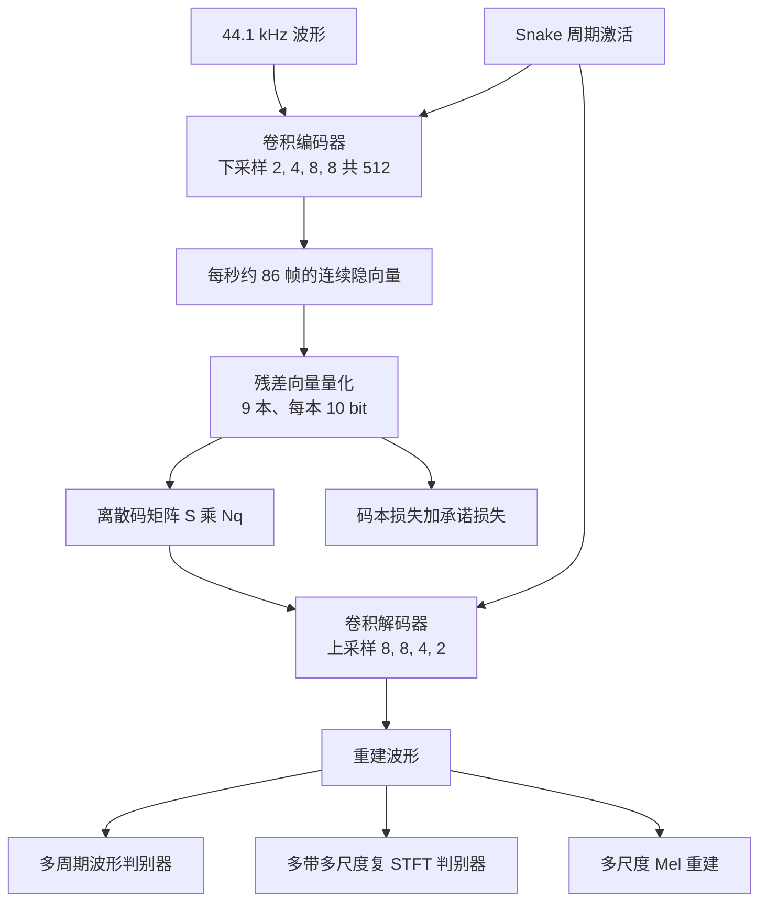

# DAC：通用音频要进语言模型，先得有一套不浪费码本的离散压缩

<!-- release-date: 2023-06-12 -->

> 本文依据 Descript, Inc. 的 **High-Fidelity Audio Compression with Improved RVQGAN**，即 [arXiv:2306.06546](https://arxiv.org/abs/2306.06546) 的 2023-10-26 修订稿，共 14 页。NeurIPS 2023 spotlight。封面水印为 `arXiv:2306.06546v2 [cs.SD] 26 Oct 2023`。动笔前已核 arXiv 提交历史：首发 2023-06-11 00:13:00 UTC（83 KB），修订 2023-10-26 22:17:49 UTC（113 KB）。本地 `papers/Descript/DAC.pdf` 即这一修订稿，`pdfinfo` 为 14 页、letter、425982 字节，未换文件。页码均指这份 PDF。全文把三件事分开写：**论文明确写了什么**（带页码）、**我们如何解释或验算它**（凡属推算、换算或读图都会写明）、**哪些是外部资料补充**（给链接并标明）。
>
> 并列一作是 Rithesh Kumar 与 Prem Seetharaman，其余作者 Alejandro Luebs、Ishaan Kumar、Kundan Kumar，单位都是 Descript, Inc.。通讯 `papers@descript.com`，代码仓写在首页脚注（PDF p.1–2）。
>
> `release-date` 取 **2023-06-12**。这篇文章讲的是一套开源神经音频 codec 及其权重，按「模型 / 系统首次官方可用」取值，不取论文上传日。证据是官方仓 [descriptinc/descript-audio-codec](https://github.com/descriptinc/descript-audio-codec)：仓库 `created_at` 为 2023-06-12 19:00:34 UTC；首条公开提交 `a436c61` 的说明是 *Prepare code for public release*（2023-06-12 21:49:59 UTC）；同日 21:52:37 UTC 打出 GitHub Release `0.0.1`，并挂上 `weights.pth`（44.1 kHz、8 kbps 权重）。Hugging Face `descript/descript-audio-codec` 的 `createdAt`（2023-05-23）按本模块规则不是首发日；该仓 `weights.pth` 的文件提交是 2023-06-13 15:45:14 UTC，晚于 GitHub Release。arXiv 首发是 2023-06-11，当时公众还拿不到权重。2023-10-26 修订、NeurIPS 开会、PyPI `1.0.0`（2023-07-20）、后来的 24 kHz / 16 kHz 权重，一律不回写。

## 读之前：这篇会反复用到的词

这篇论文的门槛不在新网络骨架，而在「离散压缩」这件事为什么会失败。先说人话。

- **采样率**：一秒钟切成多少个波形点。CD 音质是 44.1 kHz，也就是每秒 44100 个点。论文要压的就是这种全频带音频，不是电话音质。
- **码率（bitrate）**：压缩后每秒用多少 bit。8 kbps 就是每秒大约 8000 bit。论文里的目标码率是上限，因为同一套模型还能少用量化器、跑更低码率（PDF p.3）。
- **Token（词元）**：语言模型一次读写的基本小块。音频这边，token 不是字，而是某一帧音频对应的离散编号。
- **码本（codebook）**：一本有限的「向量词典」。编码器给出一个连续向量，量化器在词典里找最近的那一条，只记下它的编号。
- **向量量化（Vector Quantization，VQ）**：把连续向量换成码本里最近邻的那一条。一本 10 bit 的码本最多 1024 条，选中哪一条就是一个离散 token。
- **残差向量量化（Residual Vector Quantization，RVQ）**：第一本码本只抓住最粗的结构，剩下的误差交给第二本，再剩下的交给第三本。多本叠起来，才能在不太长的序列上凑够码率。
- **码本崩溃（codebook collapse）**：词典里很多条目从来没被选中。广告码率是按「本数 × 每本 bit 数」算的，真正用上的 bit 却少一截。
- **量化器 dropout（quantizer dropout）**：训练时随机只用前几本码本，好让同一套权重在推理时既能跑满码率，也能少用几本。
- **对抗训练**：生成器要骗过判别器。音频这边，判别器听的是波形或频谱，用来压人工痕迹。
- **Mel 谱 / STFT**：把波形变成「时间–频率」图。Mel 更接近人耳；STFT 幅度谱更直接，但丢掉相位。
- **SI-SDR**：一种对缩放不敏感的波形误差。论文用它当相位重建好不好的旁证（PDF p.7）。

论文自己反复出现的五个名字：

- **Improved RVQGAN / DAC（Descript Audio Codec）**：这篇提出的通用神经音频压缩模型。论文正文多写 Improved RVQGAN，开源仓和后来社区叫 DAC。
- **Snake 激活**：一种带周期项的激活函数，$\operatorname{snake}(x)=x+\frac{1}{\alpha}\sin^{2}(\alpha x)$。$\alpha$ 控制周期分量的频率（PDF p.4）。
- **因式分解码本（factorized codes）**：查表在低维做，真正写进网络的嵌入仍是高维。
- **多带多尺度复 STFT 判别器**：在多个时间尺度上看复数频谱，并且把频谱切成子带分别打分。
- **码率效率（bitrate efficiency）**：各码本在大测试集上的熵之和，除以全部码本的标称 bit 数。接近 100% 才算把广告码率用满（PDF p.7）。

## 一句话先说清

音频语言模型不能直接吞波形。44.1 kHz 意味着每秒大约四万四千个采样点，序列太长，自注意力付不起。于是先要把波形压成更短的离散 token。

当时这条路上已经有 SoundStream 和 EnCodec：卷积编码器、RVQ、对抗损失，一条模型还能切不同码率。论文认为它们只部分满足需求。具体卡住的是三件事（PDF p.2）：

1. GAN 式生成常见的音调伪影、音高 / 周期伪影，以及高频建不真，听得出来不是原声；
2. 往往针对语音或音乐单域，泛音频吃力；
3. 码本崩溃，广告码率没有真正用上。

DAC 的回答不是再发明一种量化器家族，而是把图像域已经验证过的码本技巧，和声码器里已经验证过的周期先验、对抗与重建损失，收成一套**单一通用**模型：

> **44.1 kHz 进，大约 8 kbps 的离散 token 出，压缩大约 90 倍；语音、音乐、环境音走同一套权重。**

摘要把贡献收成这一句。后文会把「90 倍」的算术摊开，也会说明 8 kbps 是目标上限，不是每一帧都正好 8000 bit（PDF p.1、p.3）。

这也是全文最值得记住的 insight：

> **离散压缩的瓶颈，常常不是「码本太少」，而是「写在纸上的 bit 没有被用到」。先把码本用满，再谈对抗和重建。**

## 报告地图：14 页各写了什么

这是一篇技术论文，不是基模报告。没有大规模预训练 recipe，也没有推理服务。密度最高的是第 3 节的五处改法和第 4 节的消融、对照表。

| 报告章节 | PDF 页 | 讲了什么 | 密度 |
|---|---|---|---|
| 标题、摘要、署名 | p.1 | 约 90 倍、8 kbps、单一通用模型；开源代码与权重 | 高 |
| §1 引言 | p.1–2 | 为什么音频要先离散化；SoundStream / EnCodec 的伪影与码本问题；五条贡献 | 高 |
| §2 相关工作 | p.2–3 | MelGAN / HiFi-GAN / UnivNet / BigVGAN；VQ-VAE codec；不需要 loss balancer | 中 |
| §3 起 + Table 1 | p.3 | 卷积编解码 + RVQ；采样率、步幅、帧率、码本数、压缩倍数 | 高 |
| §3.1 Snake | p.3–4 | 周期先验；替换 Leaky ReLU | 高 |
| §3.2 + Figure 1 | p.4 | 码本崩溃；低维查表 + L2 归一化；不再需要 k-means 与随机重启 | 高 |
| §3.3 + Figure 2 | p.4–5 | 量化器 dropout 伤满码率；改成以概率 $p$ 启用；粗细码分层 | 高 |
| §3.4 判别器 | p.5 | 多周期波形判别器 + 多带多尺度复 STFT 判别器 | 高 |
| §3.5 损失 | p.5 | 多尺度 Mel、HingeGAN、特征匹配、码本 / 承诺损失；**固定权重，不用 balancer** | 高 |
| §4.1–4.2 数据 | p.5–6 | 语音 / 音乐 / 环境音来源；全频带均衡采样 | 高 |
| §4.3–4.4 配方与指标 | p.6–7 | 76M 参数、训练超参、ViSQOL / Mel / STFT / SI-SDR / 码率效率、MUSHRA 设置 | 高 |
| Table 2 + §4.5 | p.7–8 | 逐项消融 | 高 |
| Table 3–4、Figure 3–5 + §4.6 | p.8–10 | 对 EnCodec / Lyra / Opus；44.1 kHz 与 24 kHz 对齐设置；分域听感 | 高 |
| §5 结论与限制 | p.10 | 开源；深伪；环境音与部分乐器仍差 | 高 |
| 参考文献 | p.11–13 | — | — |
| 附录 A | p.14 | 修改后的码本查找与 $L_{\mathrm{VQ}}$ | 高 |

三件事先知道：

- **主表数字全部以这份 PDF 为准。** EnCodec 自己的论文另有主表，本篇不搬；DAC Table 3、Table 4 里出现的 EnCodec / Lyra / Opus 数字，是作者用公开实现在自己的测试集上跑出来的（PDF p.8）。
- **Table 2 第一行不是最终模型。** 它是消融基线，量化器 dropout 为 1.0；最终模型同一套结构，但 dropout 改成 0.5，并且用更大 batch、训更久（PDF p.7–8）。
- **MUSHRA 只对 EnCodec。** 没有低通锚点，也没有把 Opus、Lyra 放进听感图（PDF p.7、p.9）。

## 旧矛盾：语言模型要离散 token，旧 RVQGAN 却既有伪影又浪费带宽

生成高分辨率音频难，是因为维度高，而且结构同时存在于很多时间尺度。论文把常见做法写成两段：先预测某种中间表示（例如 Mel 谱），再从中间表示还原波形；或者用 VAE 把中间变量学出来（PDF p.1）。

离散潜变量更对口语言模型。Transformer 已经能在文本、图像、音频、音乐上建模复杂离散分布；难的是前面那步：**如何把波形变成既短、又真、又通用的离散码**（PDF p.1–2）。

论文给压缩模型列了三条必须满足的性质（PDF p.2）：

1. 高保真、少伪影；
2. 高压缩，并且在时间上大幅下采样，丢掉听不见的细节、留下高层次结构；
3. 单一模型覆盖语音、音乐、环境音，以及不同编码格式（例如 mp3）和不同采样率。

SoundStream 和 EnCodec 走的都是 VQ-GAN：全卷积编解码、RVQ、对抗损失加多尺度谱重建。它们部分满足上面三条，但论文点名了两类失败（PDF p.2）：

- GAN 生成的老问题：音调伪影、音高与周期伪影、高频建不真；
- 往往为语音或音乐定制，泛音频不行。

第 3 节又补上第三类失败，而且给了图：即使用 k-means 初始化和随机重启，EnCodec 在 24 kbps、以及「同一套码本学习方法的 Proposed」仍然码本利用率不足（PDF p.4，Figure 1）。

于是矛盾可以收成一句：

> 下游已经准备好用语言模型建模离散码；上游 codec 却既听得出假，又把写在规格表上的 bit 浪费掉。

DAC 不另起炉灶。它仍用 SoundStream 那套全卷积编解码和 RVQ，改的是激活、查表、dropout、判别器和损失怎么加权（PDF p.3）。

## 先看全景：一条卷积、一套 RVQ、两路判别器

这张图根据 §3、§4.3 重画（PDF p.3、p.6），是**机制示意**，不是实测延迟。

人话版流水线只有四步：

1. 编码器把波形在时间上压 512 倍，44.1 kHz 变成大约每秒 86 帧；
2. 每一帧用 9 本 10 bit 码本做残差量化，得到离散 token；
3. 解码器按相反的步幅把 token 变回波形；
4. 训练时，多尺度 Mel、对抗、特征匹配、码本损失一起拉，权重写死。

最终模型 76M 参数：编码器 22M，解码器 54M，解码器宽度 1536。消融里还试过解码器宽度 512（31M）和 1024（49M）（PDF p.6）。

编解码器的基本块是：一层带步幅的卷积（上采样或下采样），后面接残差卷积，中间插入 Snake（PDF p.6）。论文没有另画网络图，也没有写出每层通道数。

## 8 kbps 和约 90 倍：口径先算清楚

Table 1 把压缩规格摊成一行（PDF p.3）：

| Codec | 采样率（kHz） | 目标码率（kbps） | 步幅 | 帧率（Hz） | 10 bit 码本数 | 压缩倍数 |
|---|---:|---:|---:|---:|---:|---:|
| Proposed | 44.1 | 8 | 512 | 86 | 9 | 91.16 |
| EnCodec | 24 | 24 | 320 | 75 | 32 | 16 |
| EnCodec | 48 | 24 | 320 | 150 | 16 | 32 |
| SoundStream | 24 | 6 | 320 | 75 | 8 | 64 |

符号按正文：采样率 $f_s$，编码器步幅 $M$，RVQ 层数 $N_q$，帧率 $S=f_s/M$，离散码矩阵形状 $S\times N_q$（PDF p.3）。

**本文验算**，这些整数是怎么对上的。

步幅 $2\times 4\times 8\times 8=512$，与配方一致（PDF p.6）。$44100/512=86.1328\ldots$，表里取整成 86 Hz。

一本 10 bit 码本每帧 10 bit，9 本就是 90 bit 每帧。用表内取整帧率：

$$
86\times 9\times 10=7740\ \text{bit/s}
$$

大约 7.74 kbps，论文写成 8 kbps。正文明确说：表里的目标码率是上限，因为模型支持可变码率（PDF p.3）。

压缩倍数要对的是未压缩 PCM。论文没写「按 16 bit 算」，但 91.16 对得上：

$$
\frac{44100\times 16}{86\times 9\times 10}=\frac{705600}{7740}\approx 91.16
$$

摘要写「约 90 倍、8 kbps」，Table 1 写 91.16。两者不是两套实验，只是摘要取整、表格按取整帧率除出来。若把分母直接改成 8000 bit/s，会得到 88.2 倍——那是另一种口径，**不是表内数字**。

帧率为什么重要：后面若用语言模型建模这些码，序列长度随帧率走。86 Hz 已经比 EnCodec 24 kHz 配置的 75 Hz 略高，但 DAC 用 9 本而不是 32 本，而且采样率是 44.1 kHz 不是 24 kHz。论文的比较点是：**压缩倍数更高，音质还更好**（PDF p.3）。

Table 3 里 Proposed 的 1.78 / 2.67 / 5.33 / 8 kbps，正文没有写「分别用了几本」。**本文按码本数折算**：$\frac{2}{9}\times 8\approx 1.78$，$\frac{3}{9}\times 8\approx 2.67$，$\frac{6}{9}\times 8=5.33$，满 9 本对应 8。这与 RVQ dropout「只用前 $n$ 本」的用法一致，但属于推算，不是表注。

## 核心设计一：Snake，先把周期先验写进激活

### 旧问题

波形、尤其是浊音和乐音，周期很强。非自回归生成已经能出高保真音频，但仍常出现刺耳的音高 / 周期伪影。Leaky ReLU 这类常见激活外推周期信号差，音频合成的分布外泛化也差（PDF p.3–4）。

### 新设计

把生成器里的激活换成 Snake（Liu 等人提出，BigVGAN 引进音频）（PDF p.4）：

$$
\operatorname{snake}(x)=x+\frac{1}{\alpha}\sin^{2}(\alpha x)
$$

$\alpha$ 控制周期分量的频率。公式要读的不是「又一个激活」，而是：线性通路还在，$x$ 本身能过；额外加一项有频率的起伏，网络不必全靠权重去拟合振荡。

### 收益

Table 2 里，其它都不变、只把 snake 换成 relu：Mel 从 1.09 升到 1.17，ViSQOL 从 3.96 降到 3.83，SI-SDR 从 9.12 掉到 6.92。码率效率仍是 99%。论文说这是架构消融里影响最大的一项，并与 BigVGAN 的观察对齐：周期先验有助于波形生成（PDF p.7）。

### 代价与边界

Snake 不解决码本崩溃，也不保证高频相位。它只是让生成器更容易写出周期性。最终模型仍用最大解码器宽度 1536 加 Snake；宽度 1024 的指标已经接近基线，宽度 512 全面略差（PDF p.7）。

### 可迁移启发

若生成对象本身有强周期（语音、乐音、电网、振动），先问激活有没有把「会振荡」写进归纳偏置，再去加判别器。Table 2 显示：同样 99% 码率效率，周期激活主要改的是 SI-SDR，也就是波形和相位，不是「有没有把码本用满」。

## 核心设计二：残差量化怎么工作，以及码本崩溃怎么治

### 人话版 RVQ

先不要看附录公式。把一帧编码器输出想成一个高维向量 $z$。

一本 10 bit 码本只能从 1024 个候选里挑一个最近邻，记成 $e_{k_1}$。这一下通常抓得住最粗的音色、音高轮廓，但会留下误差 $z-e_{k_1}$。

第二本码本不去量化 $z$，去量化这份残差，得到 $e_{k_2}$。第三本再量化新残差。九本叠完，重建是

$$
\hat z \approx e_{k_1}+e_{k_2}+\cdots+e_{k_{9}}
$$

每一本只往下记一个 0 到 1023 的整数。一帧 9 个整数，就是语言模型稍后要建模的那一列 token。

论文还观察到：RVQ 加上量化器 dropout 之后，码会按「从最重要到最不重要」排。只用前几本重建，能看见粗结构；后面的本往上加细尺度细节。作者认为这对在码上再训分层生成模型有用，例如把前几本当成 coarse token、后几本当成 fine token（PDF p.5）。这里点名的下游是 AudioLM、MusicLM 一类分层音频语言模型，以及 VALL-E 这类 codec 语言模型（PDF p.3、p.5）。**那些工作自己的主表不在本篇，本文不搬。**

### 旧问题：广告码率是假的

朴素 VQ-VAE 很容易码本崩溃：初始化差，一大部分条目从未被选中。有效码本变小，等于悄悄降低目标码率，重建变差（PDF p.4）。

近期音频 codec 的补丁是：k-means 初始化，再对长期不用的条目做随机重启。论文说，即使用这套方法，24 kbps 的 EnCodec，以及「Proposed w/ EMA」（同一套码本学习）仍然利用率不足（PDF p.4，Figure 1）。

Figure 1 的纵轴是每个码本的熵（bit），横轴是码本序号，统计来自大测试集的使用频率。10 bit 码本的理论上限是 10 bit。读图（不是表内打印数字）：Proposed 与 Proposed（24 kbps）的点几乎贴在 10 bit 附近；EnCodec 和 Proposed w/ EMA 从大约第 5 本开始往下掉，后面能掉到大约 8.8 bit（PDF p.4）。

### 新设计：低维查表，高维嵌入

补丁来自图像域的 Improved VQGAN，不是音频论文内部发明。两招（PDF p.4）：

1. **因式分解码本**：查表在低维（8 维或 32 维）做，码字嵌入仍在高维（1024 维）。直觉：用最能解释方差的主成分去找邻居，而不是在高维里被无关坐标吵死。
2. **L2 归一化**：编码向量和码本向量都先归一化，欧氏距离变成余弦相似度，训练更稳。

查完之后，用原来的 VQ-VAE 码本损失和承诺损失即可，不再需要 k-means 和随机重启。梯度穿过查表用直通估计（PDF p.4–5）。

附录把修改后的量化写成（PDF p.14）：

$$
z_q(x)=W_{\mathrm{out}}e_k,\qquad
k=\arg\min_j\bigl\|\ell_2(W_{\mathrm{in}}z_e(x))-\ell_2(e_j)\bigr\|_2
$$

$z_e(x)$ 是编码器输出。$W_{\mathrm{in}}$ 把它投到码本维度 $M$，$W_{\mathrm{out}}$ 再把选中的码字投回编码器维度 $D$，且 $M\ll D$。论文把形状写成 $W_{\mathrm{in}}\in\mathbb{R}^{D\times M}$、$W_{\mathrm{out}}\in\mathbb{R}^{M\times D}$（PDF p.14）。按正文的乘法 $z_{\mathrm{proj}}=W_{\mathrm{in}}z_e$，更自然的形状应是 $M\times D$；**本文按「低维查表、高维写回」读机制，不把这一处矩阵摆放当成可独立复现的实现细节。**

损失是标准的两截（PDF p.14）：

$$
\begin{aligned}
z_{\mathrm{proj}}(x)&=W_{\mathrm{in}}z_e(x)\\
L_{\mathrm{VQ}}
&=\bigl\|\mathrm{sg}[\ell_2(z_{\mathrm{proj}}(x))]-\ell_2(e_k)\bigr\|_2^2
+\beta\bigl\|\ell_2(z_{\mathrm{proj}}(x))-\mathrm{sg}[\ell_2(e_k)]\bigr\|_2^2
\end{aligned}
$$

$\mathrm{sg}$ 是 stop-gradient。第一项把码本拉向编码，第二项把编码拉向码本。§3.5 给出的权重是码本损失 1.0、承诺损失 0.25，也就是这里的 $\beta=0.25$（PDF p.5、p.14）。

### 收益

Table 2 把「Proj.」和「EMA」放在同一组。EMA（EnCodec 那套）Mel 1.11、STFT 1.84、ViSQOL 3.94、SI-SDR 8.33、码率效率 97%；投影查表对应的基线是 1.09、1.82、3.96、9.12、99%（PDF p.7）。差距主要在 SI-SDR 和码率效率，与 Figure 1 一致。

查表维度本身很敏感。同样是投影查表（PDF p.7）：

| 查表维度 | Mel ↓ | STFT ↓ | ViSQOL ↑ | SI-SDR ↑ | 码率效率 ↑ |
|---:|---:|---:|---:|---:|---:|
| 2 | 1.44 | 2.08 | 3.65 | 2.22 | 84% |
| 4 | 1.20 | 1.89 | 3.86 | 7.15 | 97% |
| 8 | 1.09 | 1.82 | 3.96 | 9.12 | 99% |
| 32 | 1.10 | 1.84 | 3.95 | 9.05 | 98% |
| 256 | 1.31 | 1.97 | 3.79 | 5.09 | 59% |

8 维最好。2 维和 256 维都会让码率效率塌掉。论文给的机制是：有效带宽变低，生成器变弱，判别器更容易「赢」，生成器就学不会高音质（PDF p.8）。

### 代价与边界

因式分解让实现更简单，但多了两张投影矩阵，查表维度成了新超参。维度不是越大越好。256 维的码率效率只有 59%，比完全关掉对抗还差（对抗关掉时是 62%）。这说明「表示更宽」和「查表更好」不是一回事。

### 可迁移启发

任何 VQ 模型都可以先画一张「每本码本的熵」。若后面几本掉下去，先不要加码本，先问查表空间是不是过高或过低。音频、图像、动作 tokenizer 都适用。另一条：对抗训练不只美化听感，Table 2 显示它也在**逼码本把 bit 用完**。

## 核心设计三：量化器 dropout 改成掷硬币，而不是每步都丢

### 旧问题

SoundStream 引入量化器 dropout，好让单一模型支持可变码率。$N_q$ 决定码率。每个训练样本随机抽 $n\in\{1,2,\ldots,N_q\}$，只用前 $n$ 本（PDF p.4）。

副作用：满带宽重建变差。Figure 2 的横轴是码率，纵轴是 Mel 重建损失，四条线对应 dropout 概率 0、0.25、0.5、1.0（PDF p.4）。读图：概率 0（从不 dropout）在 8 kbps 最低，但在 1 kbps 附近 Mel 损失大约 3.5，远高于其它线；概率 1.0（每个样本都随机少用码本）低码率最好，满码率最差。

### 新设计

不是每个样本都 dropout，而是每个样本以概率 $p$ 启用这套随机少用码本的程序。$p=0.5$ 时，低码率接近「总是 dropout」的基线，满码率又缩小了与「从不 dropout」的差距（PDF p.4）。

Table 2 把 $p$ 写成数字（PDF p.7）：

| dropout $p$ | Mel ↓ | STFT ↓ | ViSQOL ↑ | SI-SDR ↑ | 码率效率 ↑ |
|---:|---:|---:|---:|---:|---:|
| 0.0 | 0.98 | 1.70 | 4.09 | 10.14 | 99% |
| 0.25 | 0.99 | 1.69 | 4.04 | 10.00 | 99% |
| 0.5 | 1.01 | 1.75 | 4.03 | 9.74 | 99% |
| 1.0 | 1.09 | 1.82 | 3.96 | 9.12 | 99% |

最终模型取 $p=0.5$。作者的理由很工程：0.0 的满码率最好，但少用码本时重建差，下游生成不好用（PDF p.8）。

同表还有一行 24 kbps、$p=1.0$：Mel 0.73、STFT 1.62、ViSQOL 4.16、SI-SDR 13.83、效率 99%。音质超过所有 8 kbps 配置。最终模型仍训 8 kbps，是为了把压缩率推上去（PDF p.8）。

### 可迁移启发

「一个模型覆盖多个预算」几乎总要在最高预算上付钱。不要默认「训练时随机掉层级一定免费」。先画预算–质量曲线，再决定以多大概率启用可变预算，而不是把 dropout 写成永远发生。

## 核心设计四：判别器听相位、听子带，而不只听幅度谱

### 旧问题

多尺度波形判别器（MSD）和多周期波形判别器（MPD）能抬音质，但生成频谱仍可能糊，高频过平滑。UnivNet 的多分辨率频谱判别器（MRSD）能打这些伪影，BigVGAN 还发现它有助于减音高 / 周期伪影。但它看的是幅度谱，相位被丢掉了；高频在高采样率下仍然难（PDF p.5）。

### 新设计

两路一起用（PDF p.5–6）：

- **MPD**：周期 $[2,3,5,7,11]$，来自 HiFi-GAN；
- **复数、多尺度、再切子带的 STFT 判别器**：窗长 $[2048,1024,512]$，hop 为窗长的 $1/4$；子带边界 $[0.0,0.1,0.25,0.5,0.75,1.0]$，也就是 5 段。

复数频谱保留相位，判别器可以惩罚相位误差。切子带的理由是：判别器能专门盯某一段频率，给生成器更强梯度；这也有助于减混叠。解码器上采样本身会引入明显混叠，分带判别器更容易抓住这些幅度很小的伪影（PDF p.5、p.8）。

对抗损失用 HingeGAN，外加判别器特征图上的 L1 特征匹配（PDF p.5）。

### 收益，以及哪些数字几乎不动

Table 2 的判别器消融不要只看 Mel。关掉所有对抗、只留重建：Mel 1.13、STFT 1.92、ViSQOL 4.12、SI-SDR **1.07**、码率效率 **62%**。谱距离变化不大，但 SI-SDR 和效率崩了。论文说这种音频有明显嗡声，因为没学会重建相位（PDF p.7–8）。

把 5 个子带收成 1 个：SI-SDR 9.07，相对基线 9.12 只差一点点，其它指标几乎持平。论文仍留下多带，因为看频谱时高频混叠更少；混叠幅度小，客观指标几乎看不见（PDF p.8）。

去掉 MPD、只留 5 带 STFT：SI-SDR 9.04。把 MPD 换成 MelGAN 的单尺度波形判别器：SI-SDR 8.51。所以 MPD 留下的理由是波形 / 相位，不是 Mel（PDF p.7–8）。

### 可迁移启发

客观谱距离可以「看起来还行」，相位和码本利用率已经死了。音频 tokenizer 的消融至少要同时看：谱距离、波形误差、码本熵。只报 Mel，会把「没对抗」那一行误判成还能用。

## 核心设计五：损失怎么加权，以及为什么不用 loss balancer

### 重建：多尺度 Mel，最短 hop 是 8

Mel 重建能稳住训练、加快收敛；多尺度谱损失则逼模型在多个时间尺度上对频率负责。DAC 把两件事合成一条：对窗长 $[32,64,128,256,512,1024,2048]$ 的 Mel 谱做 L1，hop 为窗长的 $1/4$。最短 hop 因此是 8。论文特别说，这个最短 hop 有助于建很快的瞬态，音乐里很常见（PDF p.5）。

EnCodec 用类似形式，但 L1 和 L2 都要，Mel bin 固定 64。DAC 认为固定 bin 数会在短窗上打出频谱空洞，于是 bin 数改成 $[5,10,20,40,80,160,320]$，与上面的窗长一一对应，并且「用肉眼检查过」（PDF p.5）。

消融里，若换成单尺度高 hop Mel（80 bin、窗长 512）：SI-SDR 从 9.12 掉到 7.68。主观上，镲片、蜂鸣 / 警报、歌声这类东西明显更好——这句话对应的是**保留多尺度**的模型，不是单尺度那一行（PDF p.8）。

### 码本

仍是原始 VQ-VAE 的码本损失加承诺损失，直通估计回传（PDF p.5）。

### 固定权重，不用 balancer

权重是（PDF p.5）：

| 项 | 权重 |
|---|---:|
| 多尺度 Mel | 15.0 |
| 特征匹配 | 2.0 |
| 对抗 | 1.0 |
| 码本 | 1.0 |
| 承诺 | 0.25 |

HiFi-GAN / BigVGAN 里 Mel 常用 45.0。论文说自己只是按多尺度份数和 $\log_{10}$ 底数做了缩放。**明确不用 EnCodec 那种按判别器梯度尺度自动调权重的 loss balancer**（PDF p.3、p.5）。

相关工作把这列为与 EnCodec 的三条关键差异之一：Snake、低维查表、固定权重的稳定配方。作者认为这套改动让有效带宽接近最优，因而能在大约 3 倍更低的码率上超过 EnCodec（PDF p.3）。3 倍对应的是 8 kbps 对 24 kbps，不是听感分的 3 倍。

### 可迁移启发

多目标 GAN 不一定要上自适应 balancer。先把各损失的数值尺度对齐（这里是 Mel 的尺度份数和对数底），再把权重写死，消融才比较得动。Balancer 把「这项该不该要」和「此刻梯度有多大」缠在一起，Table 2 那种一次改一个旋钮的实验会变脏。

## 数据与训练：全频带不是 resample 到 44 kHz 就完了

### 数据从哪来

训练数据按三域拼（PDF p.5–6）：

- 语音：DAPS、DNS Challenge 4 的干净语音、Common Voice、VCTK；
- 音乐：MUSDB、Jamendo；
- 环境音：AudioSet 的 balanced 与 unbalanced 训练段。

全部 resample 到 44 kHz。训练时切短片段，响度归一到 -24 dB LUFS。唯一的增强是随机整体移相。测试集是 3000 条 10 秒片段，三域各 1000：AudioSet 评估段、DAPS 留出的 F10 / M10、MUSDB 测试划分（PDF p.6）。

论文没写总小时数，也没写各语料的采样比例数字。

### 均衡采样要解决的是「平均真实带宽」

数据文件头是 44 kHz，不等于内容有 22.05 kHz 的能量。语音尤其如此，Common Voice 常常原本只有 8–16 kHz。作者发现：在这种混合真实带宽上直接训，模型往往重建不到某个频率以上，而那个阈值正好对应数据集的平均真实采样率（PDF p.6）。

做法（PDF p.6）：

1. 把数据源分成两类：确认含到目标奈奎斯特频率 22.05 kHz 的全频带源，以及带宽不明的源；
2. 每个 batch 保证抽到全频带样本；
3. 每个 batch 里语音、音乐、环境音条数相等。

去掉均衡采样：Mel 仍是 1.09，但 STFT 从 1.82 升到 1.94，ViSQOL 3.89，SI-SDR 8.89。经验观察是重建上限大约 18 kHz，对应 MPEG 一类有损编码常保的最高频率，而这类编码构成了数据的绝大部分。加上均衡之后，全频带和带宽受限音频都能建（PDF p.7–8）。

### 训练配方

消融：batch 12，25 万步，单卡大约 30 小时。最终模型：batch 72，40 万步。片段长度 0.38 秒。生成器和判别器都用 AdamW，学习率 $1\times 10^{-4}$，$\beta_1=0.8$，$\beta_2=0.9$，每步衰减 $\gamma=0.999996$（PDF p.6）。

0.38 秒在 44.1 kHz 大约 16758 个采样点，再按 512 下采样大约 33 帧。论文没写这个换算，**属于本文验算**。它解释了为什么配方能在单卡上转起来：对抗训练看的是很短的片段，不是整首曲子。

## 实验怎么证明

### 指标在测什么

客观五项（PDF p.6–7）：

| 指标 | 它实际在看 |
|---|---|
| ViSQOL | 用谱相似度估计的听感 MOS |
| Mel 距离 | 与训练时同一套多尺度 Mel 配置 |
| STFT 距离 | 窗长 2048 与 512 的对数幅度谱，更盯高频 |
| SI-SDR | 波形误差，旁证相位 |
| 码率效率 | 大测试集上各码本熵之和 / 标称总 bit |

主观：类 MUSHRA，有隐藏参考，**没有**低通锚点。10 名专家听众，每人评 12 条随机 10 秒，三域各 4 条。听感图比较的是 Proposed 的 2.67 / 5.33 / 8 kbps 对 EnCodec 的 3 / 6 / 12 kbps（PDF p.7）。

### 消融：最终模型站在哪一行

Table 2 第一行是消融基线：宽度 1536、Snake、MPD、5 带 STFT、多尺度 Mel、查表维 8、投影码本、dropout 1.0、8 kbps、均衡采样。指标 1.09 / 1.82 / 3.96 / 9.12 / 99%。最终模型同一套旋钮，只把 dropout 改成 0.5，并且按 §4.3 用 batch 72 训 40 万步（PDF p.7–8）。

可以把消融收成一张「动了什么、伤了什么」：

| 改动 | 主要伤到的指标 | 论文给出的机制 |
|---|---|---|
| relu 替换 snake | SI-SDR 9.12 → 6.92 | 缺少周期先验 |
| 关掉对抗 | SI-SDR 1.07，效率 62% | 没学相位，码本也没被用满 |
| 单尺度 Mel | SI-SDR 7.68 | 短时瞬态和高频 |
| 查表维 2 或 256 | 效率 84% / 59% | 有效带宽下降，判别器压过生成器 |
| EMA 码本 | SI-SDR 8.33，效率 97% | 后面几本仍崩溃 |
| 总是 dropout | 满码率 Mel / SI-SDR 变差 | 可变码率税 |
| 不均衡采样 | STFT、SI-SDR，高频到约 18 kHz | 平均真实带宽把模型带偏 |

这些是 Table 2 加正文的对应关系，不是另一次实验（PDF p.7–8）。

### 主对照：不要去 EnCodec 论文里找这些数字

Table 3 是作者用公开实现对 EnCodec、Lyra、Opus 的客观评估，测试集是上面那 3000 条，带宽列是各系统能表示的最高频率（PDF p.8–9）：

| 系统 | 码率（kbps） | 带宽（kHz） | Mel ↓ | STFT ↓ | ViSQOL ↑ | SI-SDR ↑ |
|---|---:|---:|---:|---:|---:|---:|
| Proposed | 1.78 | 22.05 | 1.39 | 1.95 | 3.76 | 2.16 |
| Proposed | 2.67 | 22.05 | 1.28 | 1.85 | 3.90 | 4.41 |
| Proposed | 5.33 | 22.05 | 1.07 | 1.69 | 4.09 | 8.13 |
| Proposed | 8 | 22.05 | 0.93 | 1.60 | 4.18 | 10.75 |
| EnCodec | 1.5 | 12 | 2.11 | 4.30 | 2.82 | -0.02 |
| EnCodec | 3 | 12 | 1.97 | 4.19 | 2.94 | 2.94 |
| EnCodec | 6 | 12 | 1.83 | 4.10 | 3.05 | 5.99 |
| EnCodec | 12 | 12 | 1.70 | 4.02 | 3.13 | 8.36 |
| EnCodec | 24 | 12 | 1.61 | 3.97 | 3.16 | 9.59 |
| Lyra | 9.2 | 8 | 2.71 | 4.86 | 2.19 | -14.52 |
| Opus | 8 | 4 | 3.60 | 5.72 | 2.06 | 5.68 |
| Opus | 14 | 16 | 1.23 | 2.14 | 4.02 | 8.02 |
| Opus | 24 | 16 | 0.88 | 1.90 | 4.15 | 11.65 |

读这张表时有三条边界：

1. **8 kbps 的 DAC 对 24 kbps 的 EnCodec**：Mel 0.93 对 1.61，STFT 1.60 对 3.97，ViSQOL 4.18 对 3.16，SI-SDR 10.75 对 9.59，带宽还是 22.05 kHz 对 12 kHz。这就是「大约 3 倍更低码率仍然超过」的主证据（PDF p.3、p.9）。
2. **Opus 24 kbps 并不是每一格都输。** Mel 0.88、SI-SDR 11.65 优于 DAC 8 kbps 的 0.93 与 10.75；DAC 赢在 STFT 和 ViSQOL，以及 22.05 kHz 对 16 kHz 的带宽。论文的总括句是「在全部码率上、客观加主观都超过，同时建模宽得多的 22 kHz 带宽」（PDF p.8）。主观图并没有把 Opus 画进去。
3. Lyra 9.2 kbps 的 SI-SDR 是 -14.52，带宽只有 8 kHz，和全频带 DAC 不是同一类重建任务。

Figure 3 是 44 kHz 听感。读图：参考线大约在 80 分以上；Proposed 从大约 2.7 kbps 的 40 多分升到 8 kbps 的将近 70 分；EnCodec 从 3 kbps 的 20 多分升到 12 kbps 的大约 40 分；Proposed 全程高于 EnCodec，但 8 kbps 仍明显低于参考。论文自己写：即使最高码率也没到参考，还有改进空间；最终模型指标仍低于消融里那个 24 kbps 模型，剩下的缺口也许能靠提高最大码率补（PDF p.9）。这些分值是读图，图上没有打印数字。

### 对齐 EnCodec 配置：把采样率也改成 24 kHz

为了挡住「你只是采样率更高」这种解释，作者按 EnCodec 的规格再训一套：24 kHz、24 kbps、步幅 320、32 本 10 bit 码本（PDF p.9）。Table 4：

| 系统 | 码率（kbps） | 带宽（kHz） | Mel ↓ | STFT ↓ | ViSQOL ↑ | SI-SDR ↑ |
|---|---:|---:|---:|---:|---:|---:|
| Proposed@24kHz | 1.5 | 12 | 1.48 | 2.24 | 4.04 | 0.32 |
| Proposed@24kHz | 3 | 12 | 1.24 | 2.01 | 4.23 | 4.44 |
| Proposed@24kHz | 6 | 12 | 1.00 | 1.78 | 4.38 | 8.44 |
| Proposed@24kHz | 12 | 12 | 0.74 | 1.54 | 4.51 | 12.51 |
| Proposed@24kHz | 24 | 12 | 0.49 | 1.33 | 4.61 | 16.40 |
| EnCodec | 1.5 | 12 | 1.63 | 2.69 | 3.98 | 0.02 |
| EnCodec | 3 | 12 | 1.46 | 2.54 | 4.16 | 2.99 |
| EnCodec | 6 | 12 | 1.30 | 2.39 | 4.30 | 6.06 |
| EnCodec | 12 | 12 | 1.15 | 2.28 | 4.39 | 8.44 |
| EnCodec | 24 | 12 | 1.05 | 2.21 | 4.42 | 9.69 |

24 kbps 上，SI-SDR 16.40 对 9.69，Mel 0.49 对 1.05。这是同一带宽、同一码率下的配方差距。Figure 4 的听感同样是 Proposed 全程高于 EnCodec，比较用的样本都 resample 到 24 kHz（PDF p.9）。

### 分域：语音最好，环境音更差

Figure 5 把 MUSHRA 按语音、音乐、环境音拆开。读图：三条里 Proposed 都高于 EnCodec；语音离参考最近；环境音的参考线本身也高，但 Proposed 与参考的缺口更大；音乐居中（PDF p.10）。正文把这件事写成限制：按域切片后，虽然三域都超过对照，但语音最好，环境音问题更多；钟琴、合成器一类乐器也建不完美（PDF p.10）。

论文没有给出分域的客观表，只有这三张听感图。

## 开源了什么，论文之后多了什么

论文承诺代码、模型、试听，并鼓励读者去听（PDF p.2、p.10）。脚注链接是：

- 代码：`https://github.com/descriptinc/descript-audio-codec`
- 试听：`https://descript.notion.site/Descript-Audio-Codec-11389fce0ce2419891d6591a68f814d5`

**以下是外部补充，不是 PDF 正文。** 官方仓在 2023-06-12 公开训练与推理代码，并在 Release `0.0.1` 放出 44.1 kHz、8 kbps 的 `weights.pth`。随后 2023-06-21 的 `0.0.4` 增加 24 kHz 权重，2023-07-05 的 `0.0.5` 增加 16 kHz，2023-07-20 的 `1.0.0` 另挂 44 kHz、16 kbps。当前下载入口把这四套写成：

- 44 kHz / 8 kbps → tag `0.0.1`
- 24 kHz / 8 kbps → tag `0.0.4`
- 16 kHz / 8 kbps → tag `0.0.5`
- 44 kHz / 16 kbps → tag `1.0.0`

16 kbps 变体和 16 kHz / 24 kHz 权重都不在 14 页 PDF 的主实验里。PDF 只在消融中出现过 24 kbps、以及 Table 4 的 24 kHz 对齐配置。不要用今天仓里的型号表去改写 Table 1。

Hugging Face `descript/descript-audio-codec` 是镜像备份，model card 写明权重原址仍在 GitHub；`descript/dac_44khz` 是 2024 年才出现的 Transformers 封装，更不是首发。

## 限制、未公开，以及不要过度解读的地方

论文自己写下的限制（PDF p.10）：

- 让全频带生成建模更容易，也会让深伪更容易。作者提到水印、或训一个「是否经过本 codec」的分类器，都只是可能性，文中没有做。
- 不是完美重建。环境音更差；钟琴、合成器一类乐器建不完美。
- 8 kbps 听感仍低于参考；消融里 24 kbps 更好，暗示缺口可能是码率不够，不是结构已经到顶。

没有公开、因而不能装成有的：

- 训练总小时数、各语料精确配比、GPU 型号与总卡时（只写了消融单卡约 30 小时）；
- 编码器每层通道数、Snake 的 $\alpha$ 是标量还是按通道学；
- MUSHRA 的逐点分数表（只有带 95% 置信区间的图）；
- 分域客观指标；
- 流式 / 因果延迟、实时因子、显存；
- 在 AudioLM / MusicLM / VALL-E 上替换 tokenizer 的实验——相关工作只说「可以当 drop-in」，没有下游表（PDF p.3）。

Table 3 的 Opus 24 kbps 提醒：若只比 Mel 或只比 SI-SDR，传统 codec 在更窄带宽上仍可能更好看。DAC 的主张绑定在「更宽带宽 + 离散 token 可进语言模型」上，不是「任意码率、任意指标全面碾压 Opus」。

## 可迁移启发

**先测码本熵，再加层。** Figure 1 和码率效率把「广告 bit」和「有效 bit」拆开。tokenizer、MoE 专家、向量检索里的 codebook，都可以先画利用率。

**查表空间有甜区。** 8 维优于 2 维也优于 256 维。最近邻发生的空间，不必等于下游要用的嵌入空间。

**对抗不只是为了好看。** 关掉对抗，效率从 99% 掉到 62%。GAN 在这里也是在给码本加使用压力。

**可变预算要收税。** dropout 从 1.0 改到 0.5，是承认「一个权重包打所有码率」会伤最高档。需要可变码率时，用概率启用，而不是每步都启用。

**标签采样率不等于内容带宽。** 均衡采样是数据工程，不是模型结构。混合真实带宽的数据集，会把生成器的有效奈奎斯特频率拉到平均值。

**权重可以写死。** 固定 Mel / 对抗 / 码本比例，加上尺度对齐，不必上 balancer。这样消融才归因得清。

**客观指标要成套。** Mel 好看、SI-SDR 和熵已经死，是「没对抗」那一行的教训。音频重建至少同时看谱、波形、码本。

## 关键词回看

- **Improved RVQGAN / DAC**：44.1 kHz、约 8 kbps、约 90 倍、单一通用模型。
- **RVQ**：残差一本一本补细节；前几本粗、后几本细。
- **码本崩溃**：条目闲置，有效码率低于标称码率。
- **因式分解码本 + L2 归一化**：低维查表、高维嵌入，余弦距离。
- **Snake**：激活里写进周期。
- **量化器 dropout 概率 $p$**：最终取 0.5，折中满码率和低码率。
- **多带复 STFT 判别器**：听相位、听子带、打混叠。
- **多尺度 Mel，最短 hop 8**：建瞬态。
- **固定损失权重**：Mel 15、特征匹配 2、对抗 1、码本 1、承诺 0.25；不用 balancer。
- **码率效率**：熵之和 / 标称 bit，目标约 100%。
- **均衡采样**：每个 batch 保证全频带，并且三域条数相等。

## 最后的判断

DAC 没有发明 RVQ，也没有发明对抗声码器。它盯住的是一句容易被「我们已经在用 EnCodec」盖过去的话：

> **离散 token 的质量，首先取决于那些 token 有没有把标称带宽用完；听感伪影往往是利用率不足之后的表面症状。**

哪些结论有表或图：

- 44.1 kHz、步幅 512、86 Hz、9 本 10 bit、压缩 91.16，见 Table 1（PDF p.3）。
- 投影查表把码本熵维持在接近 10 bit，EMA / EnCodec 后面几本掉下去，见 Figure 1 与 Table 2 的 99% 对 97%（PDF p.4、p.7）。
- Snake 对 SI-SDR 的贡献大于改解码器宽度，见 Table 2（PDF p.7）。
- 对抗同时决定相位和码本效率，见「只留重建」那一行（PDF p.7–8）。
- dropout 0.5 是满码率与低码率的折中，见 Figure 2 与 Table 2（PDF p.4、p.7）。
- 8 kbps DAC 在自己的测试集上客观超过 24 kbps EnCodec，见 Table 3；同一 24 kHz 规格下配方差距更大，见 Table 4（PDF p.9）。
- 听感高于 EnCodec、低于参考，语音好于环境音，见 Figure 3–5（PDF p.9–10）。

哪些是作者观察或定位：

- 「可以当 AudioLM / MusicLM / VALL-E 的 drop-in tokenizer」没有下游表（PDF p.3）。
- 「剩下的听感缺口也许能靠提高最大码率补」来自 24 kbps 消融更好，不是已做的最终模型（PDF p.9）。
- 多带判别器留下的理由主要是看频谱、而不是客观表（PDF p.8）。

哪些没有公开：总数据量、逐层通道、MUSHRA 数值表、分域客观指标、流式延迟、下游语言模型替换实验。

如果只带走一条设计原则：

> **先让每一个标称 bit 真的被用到，再去调听感。码本空间、对抗、可变码率税和真实带宽采样，是四件会把有效码率偷走的事；DAC 的配方是把这四件分别钉死。**

## 资料与阅读边界

**原件与版本**

- 本地原件：`papers/Descript/DAC.pdf`，标题 **High-Fidelity Audio Compression with Improved RVQGAN**，14 页，封面水印 `arXiv:2306.06546v2 [cs.SD] 26 Oct 2023`，页脚 *37th Conference on Neural Information Processing Systems (NeurIPS 2023)*。
- 版本核对：[arXiv 摘要页](https://arxiv.org/abs/2306.06546) 提交历史为 2023-06-11 00:13:00 UTC（83 KB）与 2023-10-26 22:17:49 UTC（113 KB）。评论栏：Accepted at NeurIPS 2023 (spotlight)。截至撰写时最新即 2023-10-26 这一版，本地件就是它。`pdfinfo`：14 页，letter，425982 字节，CreationDate 2023-10-30。
- 署名：Rithesh Kumar\*、Prem Seetharaman\*、Alejandro Luebs、Ishaan Kumar、Kundan Kumar，单位 Descript, Inc.。\* 为同等贡献。

**首发日证据**

`release-date` 取 **2023-06-12**。对象是开源 codec 加权重，按模型 / 系统首次官方可用：

1. GitHub 仓 [descriptinc/descript-audio-codec](https://github.com/descriptinc/descript-audio-codec) `created_at`：2023-06-12 19:00:34 UTC。
2. 首条提交 `a436c61` *Prepare code for public release*：2023-06-12 21:49:59 UTC。
3. Release [`0.0.1`](https://github.com/descriptinc/descript-audio-codec/releases/tag/0.0.1) `published_at`：2023-06-12 21:52:37 UTC，资产 `weights.pth`（306717287 字节）同分钟上传。这是 44.1 kHz、8 kbps 权重首次可下载。

不取的日期：arXiv 首发 2023-06-11（尚无权重）；Hugging Face 仓 `createdAt` 2023-05-23（空仓）；HF `weights.pth` 提交 2023-06-13（晚于 GitHub）；一作推文 2023-06-13（事后宣布）；24 kHz 权重 2023-06-21；16 kHz 权重 2023-07-05；PyPI / GitHub `1.0.0` 2023-07-20；arXiv 修订 2023-10-26；NeurIPS 2023 开会。

**文中图表与公式**

- Table 1：压缩规格（PDF p.3）。
- Figure 1：各码本熵（PDF p.4）。
- Figure 2：dropout 与 Mel–码率曲线（PDF p.4）。
- Table 2：消融（PDF p.7）。
- Table 3、Figure 3：44.1 kHz 客观与听感（PDF p.9）。
- Table 4、Figure 4：24 kHz 对齐配置（PDF p.9）。
- Figure 5：分域听感（PDF p.10）。
- Snake 定义在 §3.1（PDF p.4）；附录 A 为查表与 $L_{\mathrm{VQ}}$（PDF p.14）。
- 正文 Mermaid 是按 §3 / §4.3 重画的机制示意，不含实测时间。

**外部补充，不是 PDF 正文**

- 官方仓与四套权重 tag，见上一节「开源了什么」。
- 试听页：[Descript Audio Codec](https://descript.notion.site/Descript-Audio-Codec-11389fce0ce2419891d6591a68f814d5)。
- Hugging Face 镜像 [descript/descript-audio-codec](https://huggingface.co/descript/descript-audio-codec)（冗余备份）；Transformers 封装 [descript/dac_44khz](https://huggingface.co/descript/dac_44khz) 建于 2024-06-18，不能当作 2023 年首发。
- 本站知识库 `knowledge/05-多模态/04-音频/音频编解码.md` 把 DAC 放进神经 codec 谱系。那一篇讲的是家族关系，**不是**本篇的证据来源；本篇数字只回这份 14 页 PDF。
