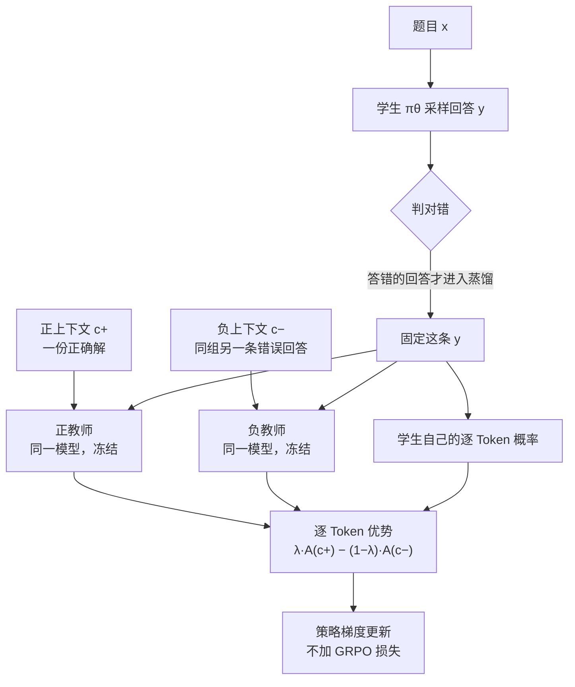

# 一拉一推：把自蒸馏里的「答对」和「姿态」拆开

<!-- release-date: 2026-09-18 -->

> 本文依据 ETH Zurich 与 Max Planck Institute for Intelligent Systems（MPI-IS）的 **On Repulsive and Attractive Teachers: Separating Correctness from Behavior in Self-Distillation**，即 arXiv:2609.21561v1（2026-09-18 提交），共 16 页（PDF p. 1）。页码均指这份 PDF 的物理页码。全文把三件事分开标注：**论文明确写了什么**、**我们如何解释它**、**哪些是外部资料补充**。

## 读前先把几个词说成人话

这篇论文只有 9 页正文，另有 2 页参考文献和 5 页附录（PDF p. 1–9、p. 10–11、p. 12–16），没有新架构，也没有大表格。它难读的地方在于：同一个「蒸馏信号」换个符号、换个条件，意义就完全变了。先把会反复出现的词说清楚。

- **Token（词元）**：模型读写文本的最小单位。本文所有信号都是「每个 Token 一个分数」。
- **Rollout（采样轨迹）**：模型针对一道题自己生成的一整段回答。
- **RLVR（Reinforcement Learning with Verifiable Rewards，可验证奖励的强化学习）**：让模型答题，程序判对错，对的给奖励。缺点是一整段回答只拿到 1 个标量奖励，信息很稀。
- **GRPO（Group Relative Policy Optimization，组相对策略优化）**：RLVR 的主流做法。同一道题采多条回答，按组内相对好坏给整段回答打分。本文把它当基线。
- **On-policy distillation（同策略蒸馏）**：学生先自己答，老师再逐 Token 给学生这条回答打分。好处是学生在自己真正会走的路径上被纠正，并且每个 Token 都有信号（PDF p. 1）。
- **Self-distillation（自蒸馏）**：老师和学生是**同一个模型**。老师之所以「更懂」，是因为它多看了一段学生看不到的**特权信息（privileged information）**，例如报错信息、参考答案或一条成功的尝试（PDF p. 1）。
- **SDPO（Self-Distillation Policy Optimization）**：本文沿用的自蒸馏基准做法，最小化学生与自教师之间的逆 KL 散度（PDF p. 4）。
- **行为偏移（behavioral shift）**：本文的核心概念。特权信息不仅改变老师「知道什么」，还会改变老师「怎么说话」：看了完整答案的老师会更简短、更笃定，更少出现「等等，好像不对」这类检查和探索（PDF p. 1–2）。
- **Thinking mode（思考模式）**：Qwen3 这类混合模型可以先在 `<think>…</think>` 里写推理过程再作答，也可以直接作答（PDF p. 6）。

## 一句话先说清

自蒸馏的承诺很诱人：不需要更强的外部老师，只要让模型「偷看一眼答案」，它自己就能当老师，给每个 Token 一份稠密的训练信号，比 GRPO 只给 1 个标量高效得多（PDF p. 1）。

问题在于，偷看答案的老师不只是更「对」，它还更「自信」。把这样的老师蒸馏给学生，学生学到的一部分是正确性，另一部分是「少犹豫、写短一点」的说话姿态。在推理任务上，后者会压掉探索和自我纠错（PDF p. 2、p. 4）。

已有的补救是**反过来**：远离看过正确答案的老师，即把 KL 从最小化改成最大化（AntiSD、Rebellious Student）。这样做确实能鼓励探索，但它们都还挂着一个 GRPO 损失来兜住正确性，并需要额外的稳定机制（PDF p. 2）。

这篇论文做的是一次**隔离实验**：把 GRPO 拿掉，只看自蒸馏信号本身会做什么。结论分 3 层（PDF p. 2）：

1. **单独的排斥主要是在改行为。** 无论远离看了正确答案的老师，还是远离看了错误答案的老师，回答都会失控变长，最终因截断而崩溃。
2. **排斥带来的「提升」其实是误开了思考模式。** 从非思考模式出发，排斥把混合模型推回它本来就有的思考模式，但从没超过直接打开思考模式的基线。
3. **对比自蒸馏不靠 GRPO 也能稳定。** 靠近「看了正确答案的老师」，同时远离「看了错误答案的老师」，2 位老师共有的行为偏移大体抵消，剩下的信号更贴近正确性。它在非思考、纯指令、已在思考 3 种模型上都改善了推理表现，回答长度保持稳定。

### 一条阅读路线

如果只有半小时读原文，建议按这个顺序：

1. **p. 2 的 Figure 1**：一张二维示意图说完全文主张，横轴是行为，纵轴是正确性。
2. **p. 4–5 式 (3)–(8)**：同一个 Token 级优势换符号就是排斥，2 位老师相减就是对比；$\lambda=\tfrac12$ 时学生项精确消去。
3. **p. 3 的 Figure 2 与 p. 7 的 Figure 4**：排斥如何误开思考模式、又如何因长度爆炸而崩溃。
4. **p. 8 的 Figure 5、p. 9 的 Figure 6**：对比目标在纯指令模型与已在思考的模型上也有效，排除「只是开了思考模式」。
5. **p. 12–14 附录 A**：Token 级信用分配到底重不重要（池化与打乱），以及特权上下文里要不要保留思考过程。

附录 B（p. 14–16）的超参表第一次可以只当对照尺。

## 主要矛盾：老师偷看答案之后，变的不只是「知道什么」

先讲旧方法卡在哪。

同策略蒸馏和自蒸馏之所以流行，是因为它们把 RLVR「一整段回答 1 个奖励」的稀疏信号换成了「每个 Token 1 个分数」（PDF p. 1）。论文引用的背景包括 Thinking Machines Lab 的同策略蒸馏博客、Cursor 的 Composer 2.5 后训练，以及已部署模型的持续适配（PDF p. 1、p. 10）。

但自蒸馏的老师是「同一个模型 + 特权上下文」。特权上下文给得越完整，老师的行为就偏得越厉害（PDF p. 2）：

- SDPO 原本适合代码反馈场景，因为报错信息只指出局部错误，不泄露完整解法；
- 如果把一份完整正确解放进上下文，老师会明显偏向简短、笃定的回答，压低不确定性表达、检查与探索，可能导致过度自信（PDF p. 2，引 Kim 等人 2026b）。
- Harne 等人 2026 发现，给更模糊的上下文（提示或通用技能）能减轻这种偏差，但信号也随之变弱（PDF p. 3）。

于是矛盾是：

> 特权信息越完整，老师越「对」，但同时越「自信」。蒸馏把两者一起传给学生。我们想要前者，不想要后者，而单一老师的信号无法把它们分开。

AntiSD 和 Rebellious Student 的思路是「既然老师压制探索，那就反着学」。论文认为这种反转本身的作用还没被看清：它们同时有 GRPO 在奖励「探索成功」的回答，AntiSD 还有一个按熵触发的门控来稳定训练（PDF p. 3）。你无法分辨提升来自反转信号，还是来自 GRPO。

这篇论文要回答的问题更窄：

> 把 GRPO 拿掉以后，吸引和排斥各自到底改变了什么？是推理**能力**，还是推理**行为**？

## 先看全景：一条回答，2 位老师，逐 Token 相减



这张图按 PDF p. 4–5 的式 (1)–(8) 与 p. 14 的上下文选择规则重画，是机制示意，不是论文原图。有 3 个细节容易漏：

- **老师不生成新回答。** 老师只是在学生那条回答的每个位置上重新算一遍下一 Token 分布（PDF p. 4）。
- **老师是冻结的。** 老师参数从起始 checkpoint 初始化，EMA 更新率为 0（PDF p. 15）。
- **只蒸馏答错的回答。** 附录写明，3 个自蒸馏目标都只蒸馏「2 种上下文都能找到的错误回答」（PDF p. 14）。正文则说，只有一侧上下文的组直接跳过（PDF p. 6）。

$\lambda$ 取 3 个值，就得到论文比较的 3 个目标（PDF p. 5、p. 16）：

| 目标 | $\lambda$ | 正教师权重 | 负教师权重 | 含义 |
|---|---:|---:|---:|---|
| Attractive（吸引） | 1 | 1 | 0 | 只靠近看了正确解的老师，即 SDPO |
| Repulsive（排斥） | 0 | 0 | 1 | 只远离看了错误解的老师 |
| Contrastive（对比） | 0.5 | 0.5 | 0.5 | 两者等权 |

表中权重与学习率同见 Table 3（PDF p. 16），3 个目标都不含辅助 GRPO 损失。唯一例外是开篇的诊断实验（Figure 2）：那里的排斥对象是**看了正确解**的老师，用来复现 AntiSD 的排斥项（PDF p. 6、p. 12）。

## 地基：同策略自蒸馏怎么给一个 Token 打分

### 旧问题：标量奖励太稀

GRPO 对一整段回答只给 1 个分数。几千个 Token 里哪些是功臣、哪些是罪魁，它说不清。同策略蒸馏换了一种问法：让老师看着学生的这条回答，逐个位置判断「这个 Token 我会不会这么写」。

### 新设计：学生和老师看同一段前缀，老师多看一段特权上下文

给定题目 $x$，学生采样一条回答 $y\sim\pi_\theta(\cdot\mid x)$。同一个模型再多看一段特权上下文 $c$，就成了自教师。在第 $t$ 个位置，两者的下一 Token 分布是（PDF p. 4，式 1）：

$$
p_S^t=\pi_\theta(\cdot\mid x,\,y_{<t}),
\qquad
p_c^t=\pi_{\bar\theta}(\cdot\mid x,\,c,\,y_{<t})
$$

$\bar\theta$ 是老师参数，在学生更新时视为常数。沿用 SDPO，训练目标是学生与老师之间逐位置的逆 KL 散度之和（PDF p. 4，式 2）：

$$
\mathcal{L}_{\mathrm{SD}}(\theta;c)
=
\mathbb{E}_{y\sim\pi_\theta(\cdot\mid x)}
\Big[
\sum_{t=1}^{|y|}
D_{\mathrm{KL}}\big(p_S^t\,\|\,p_c^t\big)
\Big]
$$

### 工作机制：每个 Token 的优势就是一个对数概率比

逐 Token 的逆 KL 更新，可以写成「老师对学生的对数概率比」这样一个 Token 级优势（PDF p. 4，式 3）：

$$
A_t^{\mathrm{SDPO}}(c)=\log p_c^t(y_t)-\log p_S^t(y_t)
$$

人话版：老师比学生更愿意写出这个 Token，它就得到正优势、被强化；老师比学生更不愿意写，它就被压低（PDF p. 4）。推导论文指向 Hübotter 等人 2026 的 SDPO。

**一个口径提醒。** 上面用逆 KL 只是为了讲清楚。论文所有实验实际用的是「采样 Token 版的广义 JSD」，混合系数 $\alpha=0.5$（PDF p. 4、p. 15），实现直接取自 SDPO 代码库（PDF p. 15）。这个 JSD 变体的具体公式正文没有写出。因此下文所有「优势等于某个对数比」的推导，都是逆 KL 口径下的直觉，不是实验里逐字使用的数值。

## 核心设计一：吸引与排斥，只差一个符号


### 旧问题：看过答案的老师，讨厌「等等」

论文在 Figure 3 里放了一句学生回答：「Wait—actually, that's not quite the way to go.」（PDF p. 4）。看过完整解的老师知道正确路线，所以对「Wait」这种要回头检查的 Token 给出很低的概率。按式 (3)，这些 Token 得到负优势。吸引式蒸馏于是在逐 Token 层面系统地压掉犹豫、检查和换路（PDF p. 4）。

论文的判断是：更短的回答可能有利于知识型任务，但会伤害需要探索与自我纠错的推理任务（PDF p. 4）。

### 新设计：把 KL 从最小化改成最大化

吸引式最小化式 (2)，把学生拉向老师；排斥式最大化同一个散度，把学生推离老师。Token 级优势只差一个负号（PDF p. 4，式 4）：

$$
A_t^{\mathrm{attr}}(c)=A_t^{\mathrm{SDPO}}(c),
\qquad
A_t^{\mathrm{rep}}(c)=-A_t^{\mathrm{SDPO}}(c)
$$

于是老师越不喜欢的 Token，在排斥下越被奖励。Figure 3(b) 里，同一批「Wait」「that」「quite」从红变蓝（PDF p. 4）。

### 排斥信号的致命之处：它奖励的是「不像老师」，不是「更对」

论文在 3.3 节点出了关键的一步（PDF p. 5）：如果排斥主要起的是**行为引导**作用，那么远离一位看了**正确**答案的老师并不合理，因为你同时也在远离正确性。更合理的是远离一位看了**错误**答案的老师。

**我们如何解释它。** 把式 (4) 展开看：$A_t^{\mathrm{rep}}=\log p_S^t(y_t)-\log p_c^t(y_t)$。这个信号奖励的是「学生比老师更想写的 Token」。它只说明这个 Token 偏离了老师的风格，并不说明这个 Token 更接近正确答案。当偏离的最便宜方式是「多写一点、多犹豫一点」时，长度就会被一路推高。这正是下一节诊断实验看到的现象。此处是我们在逆 KL 口径下的直觉，论文实验用的是 JSD 变体。

## 诊断实验：排斥「看起来有效」，其实是误开了思考模式


### 实验设定

起点是 Qwen3-4B，用对话模板关掉思考模式：模板在提示末尾放一个空的 `<think></think>`，模型就直接作答（PDF p. 6）。目标是远离一位 **看了正确解** 的老师，也就是 AntiSD 的排斥项，并且不加 GRPO（PDF p. 3、p. 6、p. 12）。图注没有单独写训练集；从 28k 训练上限和 A.1 把它当作与 5.2 节同设定的对照来看，应当也是 DeepMath 高难子集（PDF p. 3、p. 12），这是我们的推断。

### 看到了什么：3 个阶段

Figure 2 图注把训练分成 3 段，并用曲线颜色标出（PDF p. 3）：

1. **稳定期**：训练准确率在约 37%–48% 之间徘徊（读自 Figure 2，PDF p. 3），图上标注为「moving away from correct solution」。
2. **进入思考**：大约第 15 步起（读自 Figure 2，PDF p. 3），回答长度开始上升，模型开始**自己再输出一个 `</think>`**，尽管模板里已经放了空的思考块。评测准确率随之跳升，但峰值（约 66%）仍低于思考模式基线（约 72%）。以上两数读自 Figure 2（PDF p. 3）。
3. **截断主导**：回答长度继续涨到 28k 的训练上限，截断比例冲到接近 100%，训练准确率塌到接近 0，评测准确率在第 30 步跌到约 22%（读自 Figure 2，PDF p. 3）。

论文对第 2 段的解释是：排斥把行为推向「表达不确定、多探索」，这恰好唤醒了模型本来就有的思考模式（PDF p. 6）。评测始终没有超过思考基线，这支持「表面提升主要是找回了已有的推理先验」这一解读（PDF p. 6）。

### 对照：换一个没有思考模式的模型，提升就消失了

为了区分「学到新能力」和「激活已有能力」，附录 A.1 在 Qwen3-4B-Instruct-2507（纯指令模型，没有显式思考模式）上重跑同一个目标（PDF p. 12）。设定与 5.2 节完全相同（PDF p. 12）。

| 训练步 | 评测平均准确率 | 训练回答长度 |
|---:|---:|---|
| 0 | 63.8% | 3.8k Token |
| 10 | 63.6% | — |
| 20 | 64.2% | 9.3k Token |

数据均见 PDF p. 12。评测从未超过初始值；第 22 步之后截断比例飙升，第 29 步达到 100%，训练与评测准确率都塌到 0；全程没有任何回答输出思考标签（PDF p. 12）。

论文的 Takeaway 4 说得很直接：没有休眠的思考模式可唤醒时，远离看了正确解的老师不带来任何提升，只会把回答拉长直到截断终结训练（PDF p. 12）。

**我们如何解释它。** 这 2 组实验合起来，是对 AntiSD 类方法的一次拆解：在混合模型上，排斥信号的「收益」几乎可以全部归到误开思考模式；在纯指令模型上，它只剩长度膨胀。原方法里真正兜住正确性的，很可能是那个 GRPO 损失。这是基于隔离实验的推断，论文没有直接复现带 GRPO 的 AntiSD 做对照。

## 核心设计二：对比自蒸馏，让 2 位老师共有的偏移互相抵消


### 旧问题：单一老师的信号里，正确性和行为焊在一起

吸引信号 = 正确性 + 「变简短笃定」；排斥信号 = 「变啰嗦犹豫」 + 一点说不清的方向。只要只有 1 位老师，就无法把这 2 种成分拆开。

### 新设计：让 2 位老师都「看过一份解」，只在对错上不同

构造 2 个条件策略：一个看正确解 $c^+$，一个看错误解 $c^-$（PDF p. 5，式 5）：

$$
p_+^t=\pi_{\bar\theta}(\cdot\mid x,\,c^+,\,y_{<t}),
\qquad
p_-^t=\pi_{\bar\theta}(\cdot\mid x,\,c^-,\,y_{<t})
$$

论文的设想是：如果 2 份上下文在行为上相似，那么「看过一份完整解」带来的那部分行为偏移，2 位老师是共有的；把负教师的信号从正教师里减掉，共有的偏移就消掉，剩下的只和正确性有关（PDF p. 5）。

每个前缀上的组合目标是（PDF p. 5，式 6）：

$$
\mathcal{L}_\lambda^t(\theta)
=
\lambda\,D_{\mathrm{KL}}\big(p_S^t\,\|\,p_+^t\big)
-
(1-\lambda)\,D_{\mathrm{KL}}\big(p_S^t\,\|\,p_-^t\big),
\qquad
\lambda\in[0,1]
$$

对应的 Token 级优势是 2 个 SDPO 优势之差（PDF p. 5，式 7）：

$$
A_t^{\mathrm{ctr}}
=
\lambda\,A_t^{\mathrm{SDPO}}(c^+)
-
(1-\lambda)\,A_t^{\mathrm{SDPO}}(c^-)
$$

### 工作机制：$\lambda=\tfrac12$ 时，学生自己的那一项精确消失

平衡取 $\lambda=\tfrac12$ 时，2 个优势里的 $-\log p_S^t(y_t)$ 正好抵消（PDF p. 5，式 8）：

$$
A_t^{\mathrm{ctr}}
=
\tfrac12\big(A_t^{\mathrm{SDPO}}(c^+)-A_t^{\mathrm{SDPO}}(c^-)\big)
=
\tfrac12\log\frac{p_+^t(y_t)}{p_-^t(y_t)}
$$

读法很简单：这个 Token 在「看了正确解」的老师眼里比在「看了错误解」的老师眼里更可能，就奖励；反之就压低（PDF p. 5）。

论文在这里分清了两件事（PDF p. 5）：

- **学生项的抵消是精确的**，这是代数事实；
- **老师行为偏好的抵消程度**取决于这些偏好在 2 种上下文里有多「共有」，这只能靠实验看。

**我们如何解释它。** 把 $\lambda$ 一般化展开，逆 KL 口径下 $A_t^{\mathrm{ctr}}=\lambda\log p_+^t-(1-\lambda)\log p_-^t+(1-2\lambda)\log p_S^t$。$\lambda=1$ 时残留 $-\log p_S^t$，即 SDPO；$\lambda=0$ 时残留 $+\log p_S^t$，信号会奖励学生本来就偏爱的 Token，这和排斥里看到的自我强化式长度膨胀方向一致。只有 $\lambda=\tfrac12$ 时，信号完全不依赖学生自己的概率，变成 2 位老师之间的纯对数比。这个展开是我们做的，论文只写了 $\lambda=\tfrac12$ 的情形，也没有扫描其他 $\lambda$。

另一个值得记住的点：Figure 1 里那一圈红色扇形，图注解释为「错的方式远多于对的方式」（PDF p. 2）。这就是为什么单独远离一个错误解不是一个有方向的信号：远离一个错误，可以走向无数个别的错误。对比目标用正教师提供方向，用负教师扣掉行为偏移。

### 和同类工作的边界

论文把自己放在 2 条线的交叉处（PDF p. 3）：

| 工作 | 老师条件 | 是否挂 GRPO | 论文怎么描述 |
|---|---|---|---|
| SDPO、SDFT、OPSD | 特权信息 | 否 | 用特权信息从学生自身构造老师 |
| RLSD | 特权信息 | 是 | 用老师信号给奖励驱动的更新重新加权 |
| SRPO | 特权信息 | 是 | 答对的样本走 GRPO，答错的走 SDPO |
| AntiSD、Rebellious Student | 正确解，反向 | 是 | 反转老师信号鼓励探索；AntiSD 另有熵触发门控 |
| CEPO、RLCSD | 正确解与错误解对比 | 是 | 用对比信号调制基于奖励的训练 |
| 本文 | 正确解与错误解对比 | **否** | 单独研究对比自蒸馏目标本身 |

表格内容均来自相关工作一节（PDF p. 3）。本站日常研读里有 SRPO 一篇，可对照「对的走 GRPO、错的走 SDPO」的路由思路。

## 实验怎么搭：3 个设定回答 3 个问题

论文把实验组织成 3 个问题（PDF p. 6）：

- **Q1**：从非思考模式出发的混合模型上，各目标引起什么行为偏移，这些偏移怎样影响表现？
- **Q2**：在没有显式思考模式的纯指令模型上，对比自蒸馏还有效吗？
- **Q3**：在已经处于思考模式的模型上，对比自蒸馏还能再提升吗？

| 设定 | 章节 | 模型 | 思考模式 | 训练任务 | 正上下文 | 负上下文 |
|---|---|---|---|---|---|---|
| 非思考数学 | 5.1 | Qwen3-4B | 关 | DeepMath 高难子集 | 数据集专家解，去掉思考过程 | 同组另一条错误回答 |
| 纯指令数学 | 5.2 | Qwen3-4B-Instruct-2507 | 无 | DeepMath 高难子集 | 同上 | 同上 |
| 已思考字谜 | 5.3 | Qwen3-4B | 开 | Reasoning Gym 的 Group Anagrams | 模型自己的首条正确回答，保留思考过程 | 模型自己的错误回答，保留思考过程 |

设定来源见 PDF p. 6、p. 14、p. 16。Group Anagrams 要求把由相同字母组成的单词分组，例如 `[tea, bat, eat, tab]` 变成 `[[tea, eat], [bat, tab]]`（PDF p. 8 脚注 2）。

评测方面，数学用 6 个基准的宏平均准确率：AIME24、AIME25、AIME26、AMC23、HMMT25、MATH-500；字谜按 4 个难度段评测（PDF p. 6）。回答预算：数学训练与评测 28k Token，字谜训练 24k Token（PDF p. 6）。论文另外跟踪回答长度、截断比例，以及混合模型的思考标签闭合比例，并与思考模式基线对比（PDF p. 6）。

## 结果一：非思考模式下，对比稳步提升，排斥先冲后崩


这里的排斥对象已经换成**看了错误解**的老师（PDF p. 6）。论文对 4 条曲线的描述（PDF p. 6–7）：

- **Repulsive**：把模型推进思考模式，评测急升，但始终低于思考基线；回答长度快速增长、不收敛，最终触及上限，截断导致训练与评测一起崩溃。
- **Attractive**：训练准确率上升，但评测基本持平，回答变短。
- **Contrastive**：训练和评测都稳步提升，回答长度缓慢增长，始终远低于上限。

**我们从图上还读出了什么。** 以下均为读图估计，不是论文给出的数字（读自 Figure 4，PDF p. 7）：

- 评测起点约 38%；Contrastive 到第 80 步约 55%，GRPO 约 49%，Attractive 约 37%；思考模式基线约 72%。
- 所以在这个设定下，对比目标**高于 GRPO**，但**仍明显低于直接打开思考模式**。论文的 Takeaway 1 只说它「提升表现并控制长度」，没有声称超过思考基线（PDF p. 7）。
- 右下子图里，Contrastive 的思考标签闭合比例全程贴着 0。这说明它的提升**不是**靠误开思考模式得来的，和 Repulsive 形成直接对照。
- 同一幅子图里，远离**错误解**老师的 Repulsive 同样误开了思考模式，峰值约 70%。这印证论文的主张：排斥引起的行为偏移不取决于老师看的是正确解还是错误解（PDF p. 2）。

## 结果二：纯指令模型上，对比的收益不能归因于开思考


这个模型没有显式思考模式可以误开，是检验「对比的收益是不是只是开思考」的关键对照（PDF p. 7）。

论文的描述（PDF p. 7–8）：

- **Repulsive**：训练和评测一开始都上升，但伴随回答长度快速增长，最终触及预算、截断崩溃。全程没有任何一次运行输出 `<think>` 标签：这里的排斥只是拉长回答，没有切换到任何思考模式。
- **Attractive**：回答保持简短，训练准确率上升，评测基本不变。和混合模型一样，训练任务上更好不等于评测更好。
- **Contrastive**：训练和评测全程提升，回答长度缓慢增长，远低于预算。

**读图补充。** 评测起点约 63.8%（与 A.1 的第 0 步一致，PDF p. 12）；Repulsive 在第 20 步前后冲到约 71% 后崩溃；Contrastive 到第 60 步约 71%；GRPO 在 62%–67% 之间来回，第 60 步约 62%；Attractive 在 62%–64% 之间（读自 Figure 5，PDF p. 8）。要注意纵轴被放大了，整个图覆盖的只是约 10 个百分点的区间。

Takeaway 2（PDF p. 8）：对比自蒸馏在没有思考模式可唤醒的模型上同样有效，所以它的收益超出了「切换进思考模式」。

## 结果三：已在思考的模型上，对比仍能再提升


这里思考从一开始就开着，「唤醒休眠模式」这个解释彻底不成立（PDF p. 8）。

论文的描述（PDF p. 8–9）：

- **Repulsive**：前期提升速度与 GRPO 大致相当，但只维持到约第 12 步，之后回答长度快速增长、截断崩溃。即使模型已经在写思考过程，排斥仍在继续鼓励更长的回答。
- **Attractive**：回答变短，但和数学实验不同，这次训练和评测都提升。论文据此指出：更短的回答在这个设定里不一定妨碍学习。
- **Contrastive**：训练和评测都稳步提升，回答长度缓慢增长，远低于上限；相对初始思考基线的提升说明，即使已经开了思考，它仍然有效。

**读图补充。** 评测起点约 47%（即思考基线）；到第 50 步，Contrastive 约 76%，GRPO 约 77%，Attractive 约 74%（读自 Figure 6，PDF p. 9）。在这个设定里，对比目标与 GRPO 大体打平，并没有明显胜出。

### 3 个设定合起来怎么读

| 设定 | Attractive | Repulsive | Contrastive | 与 GRPO 相比（读图） |
|---|---|---|---|---|
| 非思考数学 | 训练升、评测平、回答变短 | 误开思考，冲高后截断崩溃 | 训练评测都升，长度缓增 | 高于 GRPO，但低于思考基线 |
| 纯指令数学 | 训练升、评测平、回答短 | 无思考标签，长度膨胀后崩溃 | 训练评测都升，长度缓增 | 高于 GRPO |
| 已思考字谜 | 训练评测都升、回答变短 | 约第 12 步后截断崩溃 | 训练评测都升，长度缓增 | 大体打平 |

定性结论来自 PDF p. 6–9；最后一列是我们读 Figure 4–6 的估计，论文正文没有给出任何数值对比表，也没有正面声称超过 GRPO。

## 附录 A.2：信号的价值在「落在哪个 Token 上」


### 要排除的怀疑

对比目标在已思考模型上也有效。一种可能是：它其实只是一个序列级的有符号信号，逐 Token 的分配无关紧要（PDF p. 12）。

### 做法：把优势在窗口里抹平

把每条回答切成连续的 $w$ 个 Token 一窗，窗内取平均，再把平均值赋回窗内每个 Token（PDF p. 13，式 9）：

$$
\bar A_t^{(w)}=\frac{1}{|W_t|}\sum_{s\in W_t}A_s^{\mathrm{ctr}}
$$

$W_t$ 是包含位置 $t$ 的窗口。$w=1$ 时就是原来的逐 Token 优势；另一个极端是整条回答共用一个标量，更新退化成序列级策略梯度（PDF p. 13，式 10）。$w$ 取 1、10、100、1,000 与整条回答，数据与目标不变（PDF p. 13）。

### 结果

- 窗口越大，学习越差。整条回答共用一个值时，50 步内训练得分没有任何提升（PDF p. 13）。
- 小窗口基本保住收益：窗口 10 只比逐 Token 学得稍慢，准确率相近，回答更短（PDF p. 13）。

论文随即指出一个混淆因素：正负 2 项大量抵消，所以窗内平均优势本来就接近 0，池化可能只是在稀释信号（PDF p. 13）。为此加了一个更强的对照：**在每条回答内部随机打乱 Token 优势**。这样优势的分布不变，但与产生它的 Token 不再对齐（PDF p. 13）。

| 第 50 步 | 训练准确率 | 训练回答长度 |
|---|---:|---:|
| 优势与 Token 对齐 | 85.5% | 12.2k Token |
| 回答内打乱 | 62.2% | 6.1k Token |

数据见 PDF p. 13。Takeaway 5：细粒度信用分配效果最好；2 位老师提供的是「功劳应该记在哪里」的信息，不只是一个序列级的有符号更新（PDF p. 13）。

**我们如何解释它。** 打乱对照是这篇论文里设计得最干净的一刀：它保留了优势的全部统计量，只破坏了位置对应关系。85.5% 对 62.2% 的差距（PDF p. 13），直接说明对比信号的价值在「哪个 Token 该被奖或罚」，而不在「整条回答总体是好是坏」。这也是它和 GRPO 的本质区别。

## 附录 A.3：特权上下文里保不保留思考过程，决定模型想多久


5.3 节的字谜实验让 2 位老师都看模型自己的回答，并保留思考过程。附录分 2 步消融：先去掉特权上下文里的思考过程；再把正上下文换成数据集的专家解（PDF p. 13）。

| 特权上下文 | 前 10 步思考长度 | 训练末思考长度 |
|---|---|---|
| 自己的回答，保留思考（基线） | 6.0k–6.2k Token | 约 12.8k Token |
| 自己的回答，去掉思考 | 6.0k–6.2k Token | 约 1.2k Token |
| 专家解，去掉思考 | 6.0k–6.2k Token | 约 0.6k Token |

数据见 PDF p. 13–14。截断解释不了这个差异：3 组运行里从未闭合思考块的比例都低于 2%，并且全程输出格式良好的 `<think>` 块（PDF p. 14）。

Takeaway 6（PDF p. 14）：特权上下文决定了模型推理多久。保留模型自己的思考过程，推理会随训练变长，并给出最高的准确率；去掉它会把思考段压向 0；换成专家示范会加剧这一效果。

**我们如何解释它。** 这组消融直接触到对比目标的前提。3.3 节说「当 2 份上下文在行为上相似时」共有偏移才会抵消（PDF p. 5）。在字谜上，正负上下文都是模型自己的带思考回答，风格最接近；一旦正上下文换成风格不同的专家解，老师们对「要不要长篇思考」的偏好就不再对称，残留的行为偏移立刻显现为思考长度塌缩。回看数学实验，正上下文是专家解、负上下文是模型自己的回答，2 者都去掉了思考过程，但来源不同，风格本来就不完全匹配（PDF p. 6、p. 14），这可能也是非思考数学设定里对比目标仍远低于思考基线的原因之一。后半句是我们的推测，论文没有做这个归因。

还有一个缺口：Takeaway 6 说保留思考「给出最高的准确率」（PDF p. 14），但 Figure 9 只画了思考长度和未闭合比例，附录里没有对应的准确率曲线或数字。

## 训练配方：写得很全，可以照着复现

实现建在 SDPO 代码库上，训练用 verl，采样用 vLLM（PDF p. 15）。更新全部参数，优化器 AdamW，系数 $(0.9,\,0.999)$（PDF p. 15）。每个采样批次 256 条回答（32 道题 × 8 条），分成 4 个 64 条的小批次（PDF p. 15）。关闭熵正则和对参考策略的 KL 正则（PDF p. 15）。

3 个自蒸馏设定的超参（Table 2，PDF p. 16）：

| 参数 | 非思考数学 | 纯指令数学 | 已思考字谜 |
|---|---|---|---|
| 模型 | Qwen3-4B | Qwen3-4B-Instruct-2507 | Qwen3-4B |
| 思考模式 | 关 | 关 | 开 |
| 训练题数 | 10,000 | 10,000 | 2,200 |
| 最大提示长度 | 4,096 | 4,096 | 4,096 |
| 最大训练回答长度 | 28,672 | 28,672 | 24,576 |
| 教师重提示预算 | 10,240 | 10,240 | 16,384 |
| 模型上下文上限 | 40,960 | 40,960 | 40,960 |
| 每批题数 / 每题采样 / 每小批题数 | 32 / 8 / 8 | 32 / 8 / 8 | 32 / 8 / 8 |
| 每批训练轮数 | 1 | 1 | 1 |
| 采样温度 / top-p | 1.0 / 1.0 | 1.0 / 1.0 | 1.0 / 1.0 |
| 散度 / JSD 混合系数 | JSD / 0.5 | JSD / 0.5 | JSD / 0.5 |
| 教师 EMA 更新率 | 0 | 0 | 0 |
| 蒸馏优势裁剪 | 无 | 无 | 无 |
| 重要性比裁剪 | 2.0 | 2.0 | 2.0 |
| 学习率 | $5\times10^{-7}$ | $5\times10^{-7}$ | $5\times10^{-7}$ |
| 预热步数 / 之后调度 | 10 / 恒定 | 10 / 恒定 | 10 / 恒定 |
| 权重衰减 / 梯度裁剪范数 | 0.01 / 1.0 | 0.01 / 1.0 | 0.01 / 1.0 |

GRPO 基线另有一套设置（PDF p. 15）：学习率 $2\times10^{-6}$；组相对优势不除以组内标准差，同 Dr. GRPO；非对称比率裁剪，下界偏移 0.2、上界偏移 0.28，同 DAPO；采用 SDPO 实现里的 Token 重要性采样校正，阈值 2.0。注意 GRPO 的学习率是自蒸馏目标的 4 倍（PDF p. 15–16），论文没有解释这一差异，也没有给出学习率扫描。

### 数据与上下文

- **DeepMath**：取 `zwhe99/DeepMath-103K` 训练集，以 `r1_solution_1` 为专家解；筛选难度至少 8 的题，用种子 0 打乱，去掉思考过程，核对专家答案，选出 10,000 道训练题，难度落在 8 到 10（PDF p. 14）。
- **Group Anagrams**：用 Reasoning Gym 每个难度段程序化生成 1,000 道题；用 Qwen3-235B-A22B-FP8 开思考生成专家解，温度 1.0、top-p 0.95、top-k 20、最大长度 32,768，保留思考过程，只保留专家解正确的题（PDF p. 14）。

Group Anagrams 数据量（Table 1，PDF p. 15）：

| 字谜组数 | 每组单词数 | 训练 | 评测 |
|---|---|---:|---:|
| 5–26 | 2–5 | 800 | 100 |
| 7–34 | 2–5 | 750 | 100 |
| 8–42 | 2–5 | 650 | 100 |
| 10–50 | 2–5 | 0 | 100 |
| 合计 | | 2,200 | 400 |

最难的一段训练题数为 0（PDF p. 15），所以字谜评测的 4 个难度段里有一段属于训练分布之外。论文没有单独报告这一段的结果。

正负教师共用同一个提示模板（PDF p. 14–15）：

```text
{prompt}

This is an example for a response to the question:
{solution}

Now answer with a response of your own, including the thinking
process:
```

### 评测协议

数学评测题数与采样数（Table 4，PDF p. 16）：

| 基准 | 数据集 | 题数 | 采样回答数 |
|---|---|---:|---:|
| MATH-500 | `math-ai/math500` | 128（子集） | 512 |
| AIME 2024 | `math-ai/aime24` | 30 | 120 |
| AIME 2025 | `math-ai/aime25` | 30 | 120 |
| AIME 2026 | `math-ai/aime26` | 30 | 120 |
| AMC 2023 | `math-ai/amc23` | 40 | 160 |
| HMMT February 2025 | `MathArena/hmmt_feb_2025` | 30 | 120 |
| 合计 | | 288 | 1,152 |

MATH-500 只取前 128 行（PDF p. 15）。每题采 4 条回答，温度 0.6、top-p 0.95、关闭 top-k；每个 checkpoint 共 1,152 条数学生成和 1,600 条字谜生成（PDF p. 15）。每个基准内的准确率是 4 条回答正确率的均值，即 mean@4；字谜评测只有原生得分等于 1 才算对（PDF p. 15）。评测截断长度与训练预算一致：字谜 24,576，数学 28,672（PDF p. 15）。

**我们如何解释它。** 宏平均把 30 道题的 AIME 和 128 道题的 MATH-500 等权相加（PDF p. 6、p. 16）。AIME 一道题的对错就是约 3.3 个百分点，mean@4 能压一部分方差，但小基准仍会让曲线抖动。Figure 5 右上 GRPO 的来回起伏，可能部分来自这里。

## 限制、边界与没公开的部分

论文自己承认或我们读完必须留下的判断：

- **规模只有 4B。** 3 个设定都是 Qwen3-4B 家族（PDF p. 16）。结论里把「扩展到更大模型」列为未来工作（PDF p. 9）。
- **没有数值结果表，也没有误差带。** 主结果全部是训练曲线；正文没写每个设定跑了几个随机种子，曲线上也没有置信区间。文中带精确数值的只有附录 A.1–A.3（PDF p. 12–14）。
- **没有正面声称超过 GRPO。** 从图上看，对比目标在 2 个数学设定里高于 GRPO，在字谜上大体打平；论文的结论措辞是「可以作为独立替代」，不是「更好」（PDF p. 9）。
- **非思考数学设定里仍低于思考基线。** 对比目标没有追上直接打开思考模式（读自 Figure 4，PDF p. 7）。对一个本来就有思考模式的模型，最简单的做法仍是打开它。
- **只研究了 $\lambda=\tfrac12$。** 论文把「用不同方式平衡2 位老师」列为未来工作（PDF p. 9），正文没有 $\lambda$ 扫描。
- **抵消程度只能靠实验判断。** 学生项的抵消是精确的，老师行为偏好的抵消取决于 2 份上下文有多相似（PDF p. 5）。A.3 显示去掉思考过程并把正上下文换成专家解后，训练末思考长度从约 12.8k 掉到约 0.6k（PDF p. 13–14）。
- **只蒸馏答错的回答。** 3 个目标都只在错误回答上产生信号（PDF p. 14）。答对的回答对自蒸馏目标不贡献梯度，而 GRPO 基线会使用整组回答。这一点影响对比的公平性，论文没有讨论。
- **实验用的散度与讲解用的不同。** 讲解用逆 KL，实验用采样 Token 版广义 JSD（PDF p. 4、p. 15），JSD 下的优势形式正文没有写出。
- **没有独立代码仓。** 论文只说实现建在 SDPO 代码库上（PDF p. 15），没有给出本文自己的代码链接。

## 可迁移启发

1. **特权信息是一把双刃剑，先问它改变了老师的哪一面。** 自蒸馏里老师看到的上下文不只提供知识，还提供说话方式。做自蒸馏或任何「带参考答案的奖励模型」时，先检查老师在风格上被推向了哪里：更短、更笃定，还是更啰嗦。
2. **想消掉一个共有偏差，就造一个只在目标维度上不同的对照。** 正负教师都「看过一份完整解」，区别只在对错。相减以后，「看过解」带来的风格被扣掉。这是差分设计的老思想，可以迁移到奖励模型去偏、LLM-as-judge 去长度偏好等场景。
3. **反转一个信号之前，先确认它奖励的是什么。** 排斥奖励的是「不像老师」，不是「更对」。在有休眠能力的模型上，它会触发意外的模式切换并制造虚假的提升。评估任何「鼓励探索」的方法时，都要有一个「直接打开已有能力」的基线，例如本文的思考模式基线。
4. **长度是最先出问题的指标，要和准确率一起盯。** 3 个设定里，排斥的崩溃都先表现为长度逼近上限，然后截断比例飙升。训练监控里把长度、截断比例、格式标签（如 `</think>` 闭合）和准确率放在一起看，能提前发现行为漂移。
5. **Token 级信号的价值要用「打乱对照」来证明。** 池化会混入「稀释」这个混淆因素；打乱保留分布、只破坏对齐，才是干净的检验。自己做稠密奖励或过程奖励时，这个对照成本很低，却能直接回答「稠密到底有没有用」。
6. **构造老师上下文时，让正负上下文风格对称。** A.3 显示保留模型自己的思考过程最能维持推理长度，换成专家解会让思考塌缩。落到工程上：尽量用模型自己同组的回答做正负上下文，少用风格差异大的外部示范。
7. **依赖特定条件的部分不要直接搬。** 本文结论建立在 4B 模型、高难数学与合成字谜、固定 $\lambda=\tfrac12$ 上。大模型、代码或 Agent 任务上是否同样抵消，论文没有验证。

## 关键词回看

- **同策略自蒸馏**：同一模型既当学生又当老师，老师多看一段特权上下文，在学生自己的回答上逐 Token 打分。
- **特权信息 / 行为偏移**：老师看到的额外上下文；它同时改变老师「知道什么」与「怎么说」。
- **吸引式（Attractive，$\lambda=1$）**：最小化逆 KL，靠近看了正确解的老师，即 SDPO；压掉探索，回答变短。
- **排斥式（Repulsive，$\lambda=0$）**：最大化逆 KL，远离老师；鼓励犹豫与探索，长度失控，最终截断崩溃。
- **误开思考模式**：排斥把非思考模式下的混合模型推回思考模式，表面提升但从未超过思考基线。
- **对比式（Contrastive，$\lambda=\tfrac12$）**：靠近正教师、远离负教师；学生项精确消去，优势等于 2 位老师的对数概率比的一半。
- **Token 级信用分配**：池化窗口越大越差，打乱后 85.5% 掉到 62.2%（PDF p. 13），说明信号的价值在位置上。
- **思考上下文**：保留模型自己的思考过程，推理变长；去掉或换成专家解，思考塌缩。

## 资料与阅读边界

### 本文依据的版本

- 本地原件：`papers/ETH/Repulsive-Self-Distillation.pdf`，16 页，页边标注 `arXiv:2609.21561v1 [cs.LG] 18 Sep 2026`（PDF p. 1）。
- 官方页：[arXiv:2609.21561](https://arxiv.org/abs/2609.21561)。截至核验只有 v1，提交于 2026-09-18，主分类 cs.LG，另列 cs.AI。
- `release-date` 取 2026-09-18。这是一篇只讲公开技术的方法论文，没有发布模型或权重，按「技术首次官方公开日」取 arXiv v1 提交日。
- 作者：Anton Baumann、Akmal Ashirmatov、Leo Schmidt-Traub、Frederike Lübeck、Jonas Hübotter、Thomas Kleine Buening、Andreas Krause；全部隶属 ETH Zurich，Frederike Lübeck 同时隶属 MPI-IS（PDF p. 1）。论文标注为 Preprint，未写会议录用信息（PDF p. 1）。

### 本文覆盖的部分

摘要；第 1 节动机与 3 条主要发现，Figure 1；第 2 节相关工作；第 3 节式 (1)–(8) 与 Figure 3；Figure 2 诊断实验；第 4 节实验设定；第 5 节 3 组实验与 Figure 4–6、Takeaway 1–3；第 6 节结论与未来工作；附录 A.1–A.3 与 Figure 7–9、Takeaway 4–6；附录 B 的数据构造、教师模板、Table 1–4 与评测协议。Figure 7 的数值以 A.1 正文数字呈现，未单独配图。

### 外部资料补充（不是 PDF 原文）

- 论文首页写有一篇伴随博客，链接指向 `self-distillation.github.io` 下的页面（PDF p. 1）。博客内容未能核实，本文不引用其中任何说法。
- SDPO 代码库链接为 [lasgroup/SDPO](https://github.com/lasgroup/SDPO)（PDF p. 15 脚注 3）；本文未另行核对该仓库内容。
- 本站日常研读里的 SRPO 一篇解读了论文相关工作中引用的 SRPO（Li 等人 2026），可作为「自蒸馏与 GRPO 混合」路线的对照。

### 原文没有公开、本文也不补的缺口

- 每个设定的随机种子数与误差带；
- 主结果的数值表，以及与 GRPO 的正式数值对比；
- 采样 Token 版广义 JSD 的完整公式与对应优势形式；
- $\lambda\neq\tfrac12$ 的扫描，以及自蒸馏与 GRPO 学习率差异的依据；
- A.3 中「保留思考给出最高准确率」对应的准确率曲线或数字；
- Group Anagrams 最难一段（训练中未出现）的单独结果；
- 本文自己的代码仓库与训练算力。
