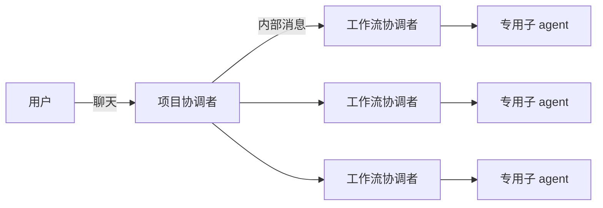
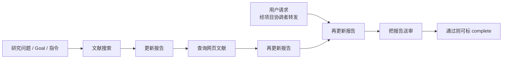
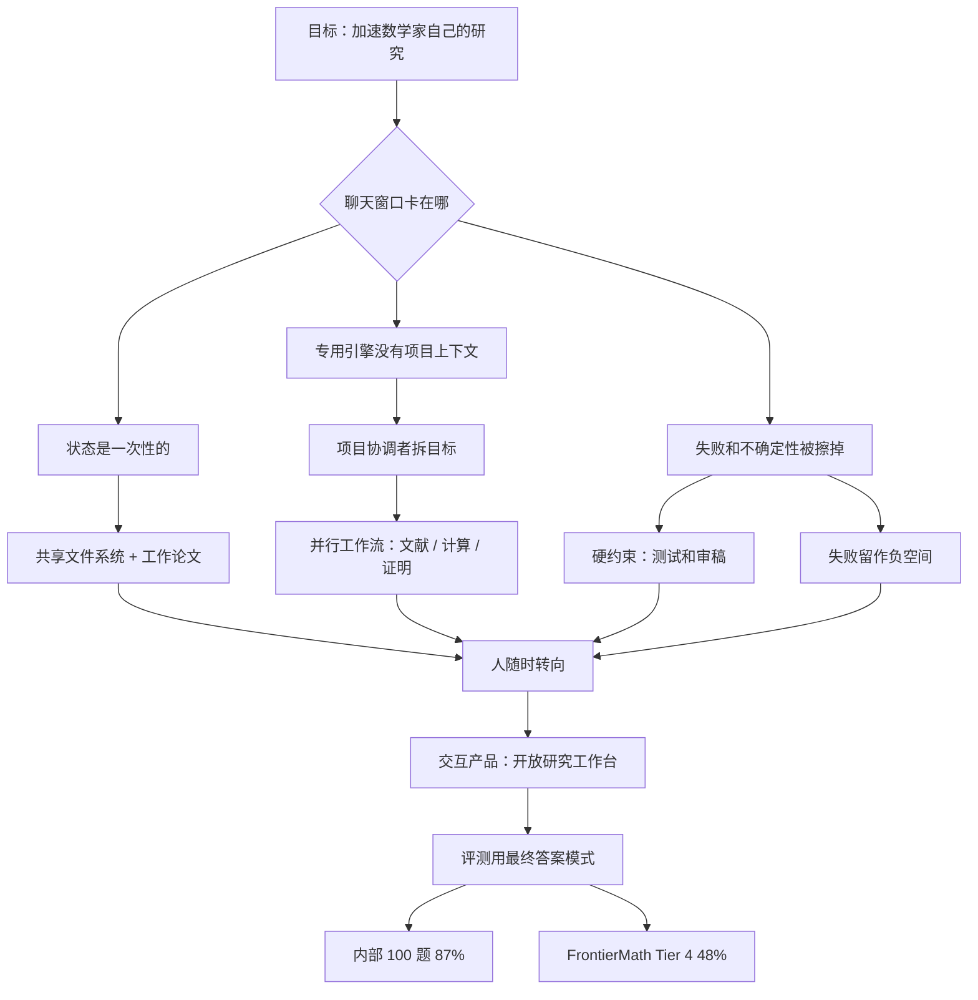

# AI Co-Mathematician：聊天窗口撑不住数学研究；缺的不是更强的神谕，是能把失败假设留下来的工作台

<!-- release-date: 2026-05-07 -->

> 本文依据 Google DeepMind 的 **AI Co-Mathematician: Accelerating Mathematicians with Agentic AI**，本地原件 `papers/Google/AI-Co-Mathematician.pdf`，arXiv:2605.06651v1，封面日期 **2026-05-07**，共 22 页。作者以 Google DeepMind 为主，Vineet Kahlon 挂 Google。页码均指这份本地 PDF 本身的页码。文中会明确区分三层：**论文写了什么**、**本文如何解释它**、**哪些是外部资料补充**。
>
> 动笔前核过 arXiv 官方提交历史：2026-05-13 有 v2（23 页，注释写 several citations added）。按任务约定**不替换本地 v1**，数字与页码一律回这份 22 页 PDF。v2 多出来的引用不进入正文。
>
> 关于 `release-date`：AI co-mathematician 从未通过官方 Web、App、API 或权重向公众开放使用。论文自己写它处于 limited initial release，目标是将来做成更广的产品（PDF p. 2）。按本模块约定，这种情况改用该技术首次官方公开日，即 **2026-05-07**：封面日期与 arXiv v1 提交日（2026-05-07 17:56:32 UTC）一致。未找到 DeepMind 专题博客。Epoch AI 模型页把日期标成 May 8, 2026，与 Pushmeet Kohli 2026-05-08 的公开介绍推文同日，晚一天，不回写。证据链见文末。

## 这篇为什么在这一组

本站把它放进「世界模型与 Agent」，不是因为它预测下一帧像素。

[Genie](/reports/Google/Genie)、[Dreamer-4](/reports/Google/Dreamer-4) 那一支，学的是「给定动作，下一帧画面是什么」。本篇学的是另一件事：**把数学研究当成长期、有状态、可探索的工作流来编排。** 人在里面转向、加约束、读失败记录；agent 在共享文件系统上并行干活。它和 [AlphaEvolve](/reports/Google/AlphaEvolve) 同属 DeepMind 的 agentic 科学发现，但分工不同：AlphaEvolve 是进化搜索 kernel，本篇是给数学家用的交互工作台。论文自己把 AlphaEvolve、AlphaProof、Aletheia 写成可以将来挂进来的引擎，而不是本系统已经接上的部件（PDF p. 2、p. 6）。

下面按论文自己的叙事写。不要把「下一帧预测」硬套进来。

## 读前：先把几个容易混的词说成人话

这篇的算法并不绕。绕的是它把「聊天」「证明引擎」「写代码」三件常被分开卖的事，收进同一张工作台。后面会反复出现的词，先钉死。

- **工作台（workbench）**：不是一次问答的对话框。它是一份长期活着的项目空间：有共享文件系统、有并行任务、有会过期也会失败的报告。用户随时能插话，系统也可以自己跑很多小时。
- **Harness（套件 / 编排层）**：包在现成大模型外面的那一层规则、工具和状态机。论文写明，AI co-mathematician 是 harness，用市售 Gemini，**不依赖任何定制模型行为或训练**（PDF p. 2）。
- **项目协调者（project coordinator）**：用户默认只跟这一个 agent 说话。它负责把意图收成研究问题和目标，再把活派给下面的工作流。
- **工作流（workstream）**：对着某一个已批准目标开出的一条并行调查。每条有自己的工作流协调者，可以再派文献、编码、证明之类的专用子 agent。它可以完成，也可以带着警告失败。
- **工作论文（working paper）**：系统的主产物不是聊天记录，而是一份还在长的 LaTeX 草稿，带页边注、内部链接和审稿痕迹。论文把它叫做 living working paper（PDF p. 3）。
- **非形式证明 / 形式证明**：人读得懂、用自然语言和公式写下来的论证，叫非形式证明。交给 Lean 这类证明助手、由计算机核验的，叫形式证明。**现有系统里的证明全部是非形式的**（PDF p. 7）。
- **Gemini Deep Think**：Gemini 的加重推理模式。本系统的证明子 agent 可以调用它；它不是本篇新训的模型。
- **FrontierMath Tier 4**：Epoch AI 出的一套极难数学题。论文转述 Epoch 的话：这一档有 50 题，由教授和博后按「短期研究项目」来写，难于 Tier 3，有些题「可能几十年都不会被 AI 解掉」（PDF p. 14）。

跨篇只留对照，避免把别的文章再讲一遍。这张表是本站的读法，不是论文原文：

| 报告 | 它实际在编排什么 |
|---|---|
| 本篇 AI co-mathematician | **数学家的研究工作流**：意图、文献、计算、非形式证明、失败记录 |
| [AlphaEvolve](/reports/Google/AlphaEvolve) | 有自动打分函数的**代码 / 算法搜索** |
| AlphaProof（本篇引用，本站未解读） | **形式化证明**引擎 |
| Aletheia（本篇引用 [17]） | **自主数学研究**系统 |

四条线都可能被叫成「AI 数学家」。读数字之前先问一句：人还在不在回路里，输出是聊天、代码、Lean 证明，还是一份工作论文。

## 一句话先说清

AI co-mathematician 不是一个会自己做完开放数学题的新模型。

它是一套 **Gemini harness + 分层 agent + 共享文件系统 + 强制审稿回路**：人先把问题说清楚，系统按目标开出并行工作流，把过程写进会活着的 LaTeX，失败的假设留下来，卡住了再把人叫回来（PDF p. 1–2）。

它做成了两件可以核对的事：

1. **交互研究。** 少量职业数学家在 limited release 里直接使用。论文展示三则案例：Kourovka Notebook 的开放问题 21.10 被解决；两组 Stirling 系数猜想写出待人审的证明；Hamilton 系统里一条关键引理被证出来。论文同时写明：有人觉得好用，也有人觉得对自己的工作没那么有效（PDF p. 10–12）。
2. **静态解题。** 为了能跟基准比，作者另外做了一个「不能问人、只交最终答案」的模式。Epoch AI 盲测 FrontierMath Tier 4：去掉两道公开样题后，48 题里做对 23 题，论文写成 48%，并称当时在所有被测 AI 系统里最高。同一套题上，它所基于的 Gemini 3.1 Pro 是 19%（PDF p. 14）。

所以这篇最值得记住的，不是「AI 开始当数学家了」这句宣传，而是它实际做成的那次替换：

> **人负责把「我想研究什么」说清楚，并在卡住的地方给数学直觉；系统负责把文献、计算、草稿、审稿和失败记录收成一份可审计的工作论文。缺的不是再强一点的一次性回答，是能把不确定性编排起来的工作台。**

这也是全文最重要的 insight。它同时解释了：为什么 48% 不能当成「交互产品已经有 48% 的研究能力」；以及为什么本站把它和像素世界模型放在同一组——都是在给智能体一个**可探索、有状态、能失败**的环境，只不过这里的环境是数学项目，不是游戏画面。

## 阅读路线

这篇 22 页，正文大约到第 16 页，后面是致谢、贡献和参考文献。建议按下面跳：

- **只想知道聊天窗口卡在哪**：读下一节「旧方案卡在哪」。
- **想看工作台怎么分层**：读全景和图 1 到图 4。沙发问题是走查，不是声称已解决的开放题。
- **想看真人数学家怎么用**：读第 5 节三则案例。Kourovka 那则最能说明「人在回路里」到底做了什么。
- **想核对 48%**：必须读第 6 节，尤其是「最终答案模式」、时限、算力口径和 Epoch 盲测设定。不要停在摘要。
- **想看它自己承认什么会坏**：读第 7 节。讨好审稿人、死亡螺旋、漂亮的 LaTeX 不等于严谨，这三条比任何基准数字都更接近真实使用。

有一件事值得提前说破。论文愿意把早期用户的原话和 FrontierMath 分数写出来，但**消息系统怎么实现、审稿 agent 有几个、一次尝试花了多少 token、专用工具的 API 是什么**，整篇都没给。读的时候建议把注意力放在 **状态被切成了哪几块、硬约束卡在哪一步**，而不是把摘要里的发现清单当成可以原样复现的配方。

## 旧方案卡在哪：聊天窗口为什么撑不住数学研究

数学发表出来的东西，几乎全是打磨过的严谨证明。数学家日常干的，却长期被挡在公众视野之外：试直觉、找反例、改定义、把证明推倒重来（PDF p. 1）。

近几年 AI-for-mathematics 沿着好几条线往前冲。论文点名的有：自主推理这一路从 Minerva 走到 Aletheia；探索搜索这一路是 AlphaEvolve 以及它带出来的系统；形式化数学这一路是 AlphaProof、Aristotle 和一串 Lean 证明器；商业聊天界面则已经把推理放大模型直接交到数学家手里（PDF p. 1）。

论文说，自己用过这些系统之后，发现缺的不是再多一个引擎，而是：

> 把这些能力编排进一个长期、有状态、可协作的工作流。（PDF p. 1）

日常数学很少是一串孤立提问，也很少是一次计算机辅助证明。它要管理不确定性，要把分散的文献合成起来，要起草和改中间产物，还要在几天或几周里跟踪分叉的假设（PDF p. 1）。

卡点有三件，一件比一件具体。

**第一，标准聊天窗口是一次性的。** 上下文会丢，失败的尝试会被下一轮对话盖掉，中间草稿没有正式身份。人必须自己当「结缔组织」，在头脑风暴、形式证明器和计算脚本之间手工搬运状态（PDF p. 1–2）。

**第二，专用引擎没有更宽的项目上下文。** 形式证明器认的是已经写好的命题；进化搜索认的是已经写好的打分函数。开放研究里，命题本身还在改，打分函数经常还不存在。引擎越强，越需要人在外面把问题切对。

**第三，软件工程已经有一套 agent 能接上的脚手架，数学几乎没有。** 论文拿 Google Antigravity、Claude Code、OpenAI Codex 作对照：设计文档让 agent 能沿着预定方向自己跑很久，持续测试提供自动校验，版本控制按职业习惯跟踪项目状态。数学家日常里，几乎没有对应的活动被常规自动化（PDF p. 2）。

于是下一步不是「再训一个更会做题的模型」。论文的回答是补上这块编排层：**给数学家一张原生工作台，让 agent 在数学自己的抽象、证明和制品上工作，而不是在代码生命周期上工作。**（PDF p. 2）

**可迁移的部分**：任何「模型已经很强、产品却用不上」的领域，都可以先问这三句话——状态存在哪、失败留下没有、人能不能在系统思考的时候插话。缺的通常不是更大的基座，是这三件事没有被设计进界面。

## 全景：一张工作台里到底谁在干活

先把全局摆出来。这是按 PDF p. 5 的 Figure 1 重画的机制示意，不是实测时间轴。图上的箭头是论文写的「标准通信路径」：用来从用户收集信息，再把指令分下去。

读图时注意三件事。

**用户默认只跟项目协调者说话。** Figure 1 左侧是用户，中间是带 `P` 标记的项目协调者，右侧才是一排工作流协调者和更后面的专用子 agent（PDF p. 5，读图）。低层沙箱里的执行日志，默认不会灌进用户聊天。这就是后文的「渐进披露」。

**所有人写到同一份项目状态上。** 论文写：这不是标准聊天机器人，而是一个关联的 workspace；项目信息存在这里，agent 层级往共享文件系统里写，彼此走内部消息系统（PDF p. 5）。后一条工作流能 import 前一条写好的 Python 库，靠的就是这份共享文件，而不是把代码贴回聊天。

**升级路径必须在。** 论文用人类组织作类比：小组要能运转，就得有通信线路和清楚的升级路径，agent 卡住时才知道找谁（PDF p. 5）。后面沙发走查里，编码子 agent 测试过不了、审稿人反复拒，工作流协调者就会把失败记录留给项目协调者，再由项目协调者开口问人（PDF p. 8）。

论文还把产品边界画得很硬：用户是在**引导并介入**一个正在演化的研究过程，而不是等端到端自主执行结束（PDF p. 2）。这和第 6 节为了跑基准而关掉提问的「最终答案模式」，不是同一件事。

**可迁移的部分**：这张图真正可搬的不是三个盒子的名字，而是那条责任切割——用户面对一个过滤过的界面，系统内部允许并行、允许失败、允许升级。把所有子 agent 的日志直接倒进同一个对话框，认知负荷会先把人压垮。

## 七条设计原则：先决定工作台像什么，再决定 agent 怎么跑

第 2 节不是架构说明书，是一张「这套系统到底在服务谁」的原则表。总目标写得很白：支持人类数学家做自己的工作。论文引 Thurston 的论点：数学从根本上是推进人类理解的社会事业，而不仅仅是一台生产形式证明的机器（PDF p. 3）。

设计同时踩在两处：数学实践的历史叙述，以及作者观察和改进 Google 既有数学发现系统的经验。原则一共七条（PDF p. 3–4）。下面按「旧问题 → 这条原则在挡什么」来读，不按摘要复读。

### 1. 拥抱证明之外的数学

发现不是「最后写出定理」这一件事。它还包括：改研究问题、梳文献、头脑风暴、跑大量计算和数值模拟来建立直觉。Putnam 批评过把数学收成孤立的逻辑形式主义；论文说自己的设计故意反映这种整体的、准经验的现实，而不是只对最终定理证明建索引（PDF p. 3）。

后文沙发走查里，三条工作流分别是文献、计算框架、执行搜索，就是这条原则落地。

### 2. 支持意图的迭代澄清

很多领域里，用户一开始就知道自己要什么。数学经常不是。Pólya 讲过：提出正确的问题，本身就要大量启发式猜测。Cantor 的原话被引在这里：「在数学里，提出问题的艺术必须被看得比解决问题更高。」（PDF p. 3）

论文拿 AlphaEvolve 的使用经验作旁证：数学家会花很多力气迭代「到底该聚焦哪道题」——先用更小的运行或相关问题试，再放大（PDF p. 3）。所以界面必须允许多条探索路径，让定义、问题和猜想可以流动地改。

这解释了为什么系统**不接受一条完美 prompt 然后开跑**。第 3.1 节的入职对话，就是这条原则的产品形态。

### 3. 产出原生数学制品

数学家已经有标准化的工作方式。论文不愿意输出转瞬即逝的聊天日志，也不愿意过早交出打磨过的稿件。过程围着一份活的工作论文转（PDF p. 3）。

原因很具体。传统工作流里，起草和批注帮人建立项目的心理模型：哪一段是实的，哪一段还要盯。自主推理系统把大量探索异步做完、做在人看不见的地方，用户会丢掉这层有机上下文。系统用行内文字和页边注把研究状态可视化，并显式提供：这条声称从哪来、这条草稿引理有多有争议（PDF p. 3）。

### 4. 异步交互，并且随时能转向

系统不是单一聊天机器人，而是一支异步团队。底层有消息系统，多个专用 agent 并行。因为异步，系统可以给一道题分配大量计算，同时不把用户锁在外面（PDF p. 3）。

双向都成立：用户随时可以找项目协调者介入、绕开当前约束、转向；agent 卡住时，项目协调者会把路障标出来，请求人来帮忙（PDF p. 3–4）。

### 5. 用渐进披露管理认知负荷

复杂研究一旦并行、回退、复用中间结果，聊天记录会迅速不可用。高阶策略（「试试不动点」）和底层执行日志（「第 40 行必须验证可测性」）混在一起，人就读不下去（PDF p. 4）。

论文的做法是让界面镜像 agent 层级：默认只跟项目协调者交互，由它滤掉专用 agent 沙箱里的低层嘈杂；用户随时可以按需钻进任何一条并行活动的细节（PDF p. 4）。

### 6. 跟踪、管理、并沟通不确定性

一条错的引理或一条幻觉参考文献，就能把整篇论文掀翻。基座模型的零样本输出会把不确定性带进一个要求精确的领域。论文选择不把这层摩擦藏起来，而把架构建在不确定性的生命周期上（PDF p. 4）：

- **跟踪**：详细版本历史，主要给 agent 用，用户也能看，用来监视声称如何演化、何时被质疑；
- **管理**：用计算换校验，例如持续审稿、数值模拟、系统的引用核对；
- **沟通**：识别审稿卡在论证的哪一段，用行内高亮和页边注把人的注意力拉过去。

不确定性在这里不是错误状态，是要被编排的核心变量。

### 7. 保留失败探索的历史

知道什么行不通，往往和知道什么行得通一样重要。系统接受：某些目标或并行工作流会以失败结束。它不静默重启，也不把失败历史擦掉，而是把死胡同当成一等、永久的结果（PDF p. 4）。

论文把这称作项目历史的「负空间」。留下失败目标和耗尽的策略，人和 AI 才能在这些失败之上提出更知情的新工作流。它明确接到 Lakatos 的观点：反驳是数学进步的基本部分（PDF p. 4）。

这七条合在一起，决定了后面所有机制。工作流可以失败、审稿可以升级、用户可以中途改目标——都不是边角功能，是原则要求系统必须长这样。

**可迁移的部分**：给 agent 产品写原则时，最容易漏的是第 7 条。大多数系统把失败当成要被清掉的异常。数学、科研、长期调试，失败记录本身就是资产。

## 走一遍：沙发问题如何从一句话长成三条工作流

第 3 节用一个代表性会话把原则落到界面上。场景是计算几何里的开放问题：给一块能同时拐过左、右两个直角弯的「沙发」证明面积上界。这是 Moser 1966 年提出的搬家具问题的变体；下界方向，论文指向近期把 AlphaEvolve 用在数学优化上的工作（PDF p. 4）。

先说清楚：**这是走查，不是第 5 节那种真人用户案例。** 论文没有在这里宣布沙发问题被本系统解决。

### 入职：先把意图说清楚，再花计算

标准零样本 LLM 要求用户一上来就写出完美 prompt。这里不是。用户把一篇近期论文和一句上下文丢进聊天：

> 我想建一个项目，看看能不能给这篇论文里讨论的移动沙发问题变体证明一些上界。（PDF p. 5）

项目协调者不立刻开跑。它先当回音板，把已经知道的和还开放的拆开。论文给出的回复大意是：Baek 已经证明 Gerver 的下界对经典沙发问题是紧的；另外两个变体的上界仍开放。然后问用户：要聚焦其中一个还是两个都做？目标是证明某个下界是紧的，还是只要给出任何新的严格上界？（PDF p. 5）

用户澄清之后，协调者把中心问题和高层目标写成正式文本给用户看。用户改措辞，协调者更新，用户正式批准，系统才进入下一阶段（PDF p. 5–6）。

Figure 2 把这一步画成：左侧多轮用户 ↔ 协调者对话，右侧收敛成一条研究问题加三条目标（PDF p. 6，读图）：

| 产出 | Figure 2 上写的内容 |
|---|---|
| 研究问题 | 给双向沙发证明一个上界 |
| Goal 1 | 文献综述 |
| Goal 2 | 计算框架 |
| Goal 3 | 执行搜索 |

这不是把用户的第一句话直接当成任务。它是在花对话，换「下游计算打在用户真正想要的问题上」（PDF p. 5）。

### 分支：一个目标可以挂多条工作流，失败会挂警告

目标批准后，项目协调者按目标开出并行工作流，每条由自己的工作流协调者管。输入是已批准的研究问题、选中的 Goal，以及项目协调者选择附加的指令。每个协调者做的是**线性动作序列**，中间可以再派专用子 agent（PDF p. 6）。

论文明确写了三种调度方式：一个目标一条工作流（走查用的是这种）；一个目标多条；或者目标先空着，等它依赖的工作做完再填（PDF p. 6）。

当前专用子 agent 的能力边界，论文写得很干净：

> 目前，我们的专用子 agent 基于标准 LLM 调用（包括 Gemini Deep Think），**没有使用** AlphaEvolve、AlphaProof 或 Aletheia 这类先进研究系统；但我们会标出它们在流程中自然能增值的位置。（PDF p. 6）

三条工作流在走查里分别干什么：

**Goal 1：文献。** 工作流协调者派专用文献子 agent。它用「计算密集的搜索工具」找到沙发问题上界用过的关键论文，再拿网页和文献访问工具去核对关键结果的精确陈述和证明（PDF p. 6）。

**Goal 2：计算框架。** 协调者先按已有文献设计高层逻辑，再用「创建子 agent」工具派 Gemini Deep Think 去证：这套框架确实能给出所需的严格上界。证完之后，再创建一个编码 agent，要求它实现带测试和演示用例的 Python 库。子 agent 报状态时，工作流协调者异步更新用户能看见的工作流报告，并链到关键代码文件（PDF p. 6–7）。

这里有一条实现边界，后文读案例时不能忘：**现有系统里的证明全部是非形式的。** 论文说，将来若接上 AlphaProof，对那些能用现有形式化库陈述并证明的命题，正确性信心会提高；若接上更强的非形式证明系统 Aletheia，能力会明显增加，但计算成本也更高（PDF p. 7）。

**Goal 3：执行搜索。** 这条工作流在计算框架成功完成之后才由项目协调者创建。共享文件系统让它可以 import 上一条写好的库，再用并行代码执行工具把搜索做到单脚本以外。并行请求跑在独立的云机器上，用户不必自己准备本地集群。搜索结果汇总成附件挂到工作流报告上，摘要和结论写进正文（PDF p. 7）。

当前原型里，这类计算搜索是标准 agent 原语的组合。论文把 AlphaEvolve 标成将来可以给这类优化和搜索「增压」的引擎，不是现在已经在跑的部件（PDF p. 7）。

Figure 3 把「目标—工作流—报告」画成时间轴（PDF p. 7，读图）：

- 一个 Goal 下面可以挂多条工作流；
- 每条工作流沿时间吐出增量报告，最终目标是一份审完的报告，带附件和外部文献；
- 有一条工作流在末尾变成警告三角：工作流可能因为多种原因完不成，这时用户会看到醒目警告，增量报告仍在。

Figure 4 把单条工作流拆成一步步动作（PDF p. 8，读图）。走查里的简化轨迹是：

论文把每一步叫做 1 agent step。中途插入的「来自用户的请求」说明：人不是在工作流结束之后才出现，而是可以在线性动作序列中间改方向（PDF p. 8）。

### 硬约束：不准抄近路，卡住了把人叫回来

论文把标准 AI agent 在难题上的失败模式写得很具体：找无效捷径、幻觉引理、含糊细节、过早宣称成功（PDF p. 8）。AI co-mathematician 的一个定义性技术特征，就是用**硬的程序约束**挡住这些模式，再叠上用户的主动转向。

走查里的例子：搜索空间爆炸，最初提出的朴素回溯不够用。编码子 agent 被规则绑住：**测试没过、审稿 agent 没接受代码和测试里的黄金值，就不能把代码标成完成。** 审稿人反复拒，工作流协调者被堵住。系统不静默重启，而是把这次失败探索作为持久记录写进共享文件系统，给项目协调者读（PDF p. 8）。

项目协调者于是在聊天里向用户告警，直接要数学直觉：

> 我们最初实现的搜索不够高效，找不到需要的结果，文献里也没有太多别的例子。你有没有更好的剪枝策略上的数学直觉？当前做法的更多细节见下面这份文档。（PDF p. 8）

用户没有被锁在外面。他读完更新，建议一种拓扑剪枝启发式，并让协调者在当前工作继续的同时，再开额外工作流去查新的界策略（PDF p. 8）。

这条回路把第 4、6、7 条原则收在一起：异步所以人能插话；不确定性被摊开而不是藏住；失败被留下来当下一轮的输入。

### 最终产物：审过的 LaTeX，不是一条聊天回复

工作流结束时，主输出是一份编译过、审过的 LaTeX 写稿，用户打开该工作流时会醒目地看到（PDF p. 8）。论文要求这些写稿满足四条（PDF p. 9）：

| 要求 | 它在挡什么 |
|---|---|
| 阐述过程 | 不能只给最终结果，必须解释研究过程如何走到这里 |
| 页边注 | 把声称链回工作区。论文给的例子是：`[Pruning heuristic derived from user suggestion; baseline bound of 2.2195 sourced from paper at arxiv.org/abs/...]`。**2.2195 是页边注示例里的文献基线，不是本系统发现的新界** |
| 内部链接 | 除外部文献外，还引用 agent 自己写的内部文档，让用户能直接审计共享文件系统 |
| 审稿过程 | 报告必须交给若干 AI 审稿 agent，查内容和文风；它们有工具交叉核对引用、代码输出和逻辑正确性 |

审稿 agent 在多轮之间保持身份，形成迭代打磨。只有**全部**审稿人正式批准，工作流才能标完成。为避免无限循环，工作流协调者过不了审稿时可以升级给项目协调者：该工作流被标成未完成，升级消息清楚展示给用户，让人立刻知道这份报告可能仍有未解决问题（PDF p. 9）。

**可迁移的部分**：硬约束的价值不在「多几个 reviewer」，而在把「完成」定义成外部可检查的状态——测试通过、审稿批准、否则升级。没有这层，异步 agent 会在人看不见的地方把幻觉写成成功。

## 怎么评：先看人在回路里做成了什么，再看静态基准

第 4 节是读 48% 之前必须经过的一扇门。

论文承认：历史上 AI-for-mathematics 的进度是拿静态解题基准量的。今天仍大量依赖 IMO ProofBench、FrontierMath、PutnamBench；更早的 MATH 和 GSM8K 对早期 LLM 很有影响（PDF p. 9）。

它接着把话掐断。当前沿系统在**原始解题能力**上已经达到或超过专家人类，继续抠这一点的增量价值在下降；AI 辅助数学的进度，至少部分卡在职业数学家更宽的工作流能力上（PDF p. 9）。

这推出两件事。

**第一，任务面要变宽。** DeepSearchQA 量通用事实查找，Hard2Verify 量竞赛数学证明里的找错，这些都和数学研究过程有直接对应。但据作者所知，还没有类似基准是为职业研究数学这个设定做的。把这些辅助能力量清楚，才能减轻「锯齿前沿」（jagged frontier）以及人驱动数学和 AI 驱动数学之间的阻抗不匹配（PDF p. 9）。

**第二，默认就应该按人在回路来看。** 系统的首要目的是协助数学家工作，不是独立于他们取得成功。所以论文先报告数学家直接使用的结果（第 5 节），再报告静态解题表现（第 6 节）（PDF p. 9）。

这个顺序本身就是论点。若只记 48%，等于把论文自己放在后面的那项，读成了全文的主产物。

## 早期用户：三则案例，以及它们不能证明什么

作者把系统开放给少量职业数学家，用于他们自己的研究。用途很杂：在分散的文献里找路、做数值实验、在若干领域里拿证明（PDF p. 10）。

有两条限定必须先放在案例前面。

1. **反馈不是一边倒。** 许多用户有成功交互、导向新发现；也有用户觉得对自己的工作没那么有效。作者希望用这些经验来指导下一批基准和开发方向（PDF p. 10）。
2. **展示的结果都是数学家自己做出来的**，没有 GDM 研究者监督或介入（PDF p. 10）。

### 案例一：Kourovka 问题 21.10

早期用户 M. Lackenby 用系统查拓扑和群论里的若干问题，工作导向 Kourovka Notebook 开放问题 21.10 的解决（PDF p. 10）。

脚注把题意写清楚了。先用人话讲一遍，再给正式名。

一个群可以用「生成元 + 关系」来写，这叫**有限呈现**。关系就是生成元必须满足的等式。所谓 **just-finite presentation（恰有限呈现）**，是这样一种有限呈现：你随便拿掉其中一条关系，剩下的群就变成无限群。问题问：是不是每个有限群都承认这样一个呈现？答案后来是肯定的（PDF p. 10，脚注 1）。

Lackenby 的用法，论文用来说明 mathematician-in-the-loop 到底长什么样。

他只是把问题陈述打进去。系统确认含义，然后开出两条独立工作流：一条试图证明，一条试图证伪。先回来的是一份系统自己标成不正确的「证明」——工作流写了论证，审稿 agent 找到了漏洞。Lackenby 看稿子时却发现，尽管有缺口，里面有他称为「really, really clever proof strategy」的策略；再读审稿人的批评，他意识到自己知道怎么补上那个缺口（PDF p. 10）。

他指出修正办法，系统写出完整正确的证明。然后他把文档下载下来，自己做修订——推广结果、加例子——再上传，让项目协调者开一条最终审稿工作流。审稿找出两个小问题，他改完成为终稿（PDF p. 10）。

Lackenby 的判断是：系统和用户熟悉该领域时最好用。有人可能把这看成限制；他的反问是：「让它去解一道我完全不懂的题，有什么意义？」（PDF p. 10）

后台工作流协调者实际做了什么，论文列成五步（PDF p. 10–11）：

1. 创建编码子 agent，计算搜索非 just-finite 呈现，找到两个例子；
2. 分析这些例子并做文献搜索，得到一套生成非 just-finite 呈现的一般方法；
3. 意识到这**并不能否定猜想**——群可以有多种呈现，找到一个非 just-finite 呈现，不代表没有 just-finite 的那一种——于是把工作流停在一个更锋利的猜想上，送审；
4. 在审稿来回里，一名审稿 agent 发现可以用来**从正面证明**猜想的方法；
5. 协调者同意审稿人，把工作流转到写这个方法；再审之后，得到 Lackenby 补完证明所用的那份草稿。

这则案例里，系统既没有一次做对，也没有在证伪方向上走到底。值钱的是：错误草稿里的策略被留下来给人看，审稿意见被人读懂，人补上缺口后再把稿子送回去。把它读成「agent 自动解决了开放问题」，和论文写的过程相反。

### 案例二：Stirling 系数

另一位早期用户 G. Bérczi 带来的是对称幂表示的 Stirling 系数行为。猜想是：在某个二项展开里，系数不仅严格为正，而且构成一条**对数凹**序列（PDF p. 11）。

对数凹用人话讲：相邻三项满足中间项的平方不小于两边的乘积，序列不会中间塌下去。写成式子就是：

$$
a_i^2 \ge a_{i-1}\, a_{i+1}
$$

Bérczi 没有只丢一句话。他准备了一份简短说明：主题、猜想背景、已知方法，以及他先前用其他系统（包括 AlphaEvolve）试出来的方向。论文写：AlphaEvolve 没能解决更高指标的情形，但暗示了一条可能收回系数归纳公式的路。他把这些写进文档，作为项目表述讨论的一部分。Bérczi 把这种做法叫做「structured posing of questions」，并说这是他和其他 AI 系统打交道时觉得有效的方式（PDF p. 11）。

系统在两条分开的工作流里，为其中两个猜想建立了证明——论文写的状态是 **currently in detailed human review**。它还为这些声称、以及尚未证明的猜想，提供了详细计算证据（PDF p. 11）。

Bérczi 觉得好用的地方有两处：任务被勾成「绿勾」，容易跟上；更重要的是，完成文档里的一条页边注提醒了他一个关键洞察，他可以在聊天里追问。他同时也说：「现在怎么用这个，并不平凡」，并且「数学家之间，会因为怎么用这些模型而拉开很大差距。」（PDF p. 11）

第一条工作流的动作是（PDF p. 11）：

1. 创建编码子 agent，做一次几分钟内能跑完的展开枚举；
2. 从结果看到：猜想按原来说法在 $n=1,2$ 上是假的，但对更大的 $n$ 似乎成立，而且原证明策略无效；
3. 用 Gemini Deep Think 子 agent 为更新后的猜想提出新证明策略；它成功说服了工作流协调者和随后的审稿 agent。

有两件事必须保持原状，不能写成「已经证明」。第一，人审还在进行。第二，原猜想在小 $n$ 上被计算证伪，系统改的是更新后的陈述。这正是第 2 条原则——意图和命题本身会在探索中被改掉。

### 案例三：Hamilton 系统里的一条引理

第三位早期用户 S. Rezchikov 带来的是他研究中遇到的一个技术子问题：某一类 Hamilton 微分同胚，是否存在具有某些方便性质的扰动（PDF p. 12）。不必先懂 Hamilton 微分同胚。只要知道：这是他正在做的研究里一块具体的、已经缩过的命题，不是一道竞赛题。

他和项目协调者讨论，并提供含相关结果的补充论文，直到对任务的精确定义达成一致，再开工作流尝试求解。写稿里有一条带优雅证明的关键引理，经仔细核对站得住，实质上解决了 Rezchikov 提出的问题（PDF p. 12）。

Rezchikov 说，其他 AI 系统在同一 prompt 下没能证明这个结果。论文立刻加了一句限定：没有多次采样和受控条件，很难从这类个别实验下结论（PDF p. 12）。

他还说了两件更有产品意味的观察。一件是：有条路看起来走不通，系统让他比自己空想更快地走到死胡同——「我本来很容易花一周去幻想那里有什么，但现在我直接往前走了。」另一件是审美：他认为正确证明的一般文风，是他用过的所有模型里最好的（PDF p. 12）。

后台动作更短（PDF p. 12）：

1. 用专用工具做文献综述，找出该问题常用技术和陷阱，标出几条 Rezchikov 没提供的关键性质；
2. 做后续文献查询，把这些点的精确含义搞清楚；
3. 把问题陈述和关键上下文交给 Gemini Deep Think，由它产出含关键引理的证明，再写进报告。

三则案例合在一起，覆盖的不是「同一套自主解题流水线」，而是三种不同的人机分工：补缺口、改命题、加快证伪。论文把这写成：系统能按数学研究者典型的探索工作流，自然地帮他们探想法（PDF p. 12）。

**可迁移的部分**：若你的产品评价只收集「成功解决了什么」，会漏掉 Rezchikov 那种「更快地放弃」的价值。对研究型工具，负结果的周转时间也是功能。

## 48% 怎么读：它量的不是工作台，是关掉提问之后的解题套件

第 6 节开头就承认：尽管作者主张更宽的测量，解题基准仍是目前能拿到的、最客观的数学表现度量（PDF p. 12）。

问题是：工作台默认会写长报告、卡住了会问人。要跟基准比，作者开发了一种定制模式——除初始问题外不能接收外部输入，只在用户聊天面板返回一个最终答案。主要差别有三条（PDF p. 12–13）：

1. 跳过最初的问题定义对话，假定题目陈述里已经有全部所需信息；
2. 把唯一项目目标写死为「解题」；
3. 引入固定时限，到点项目协调者必须给出最终答案。内部评测是 24 小时，FrontierMath 是 48 小时。多数尝试远在时限内结束；难题在没有人介入时，系统偶尔会继续跑下去，尤其是它很难给出干净解答的时候。

论文自己把算力口径摊开：作为长程 agentic 系统，它比通常在这些任务上评测的基座模型用更多计算。内部许多 agent 建在 Gemini 3.1 Pro 上，证明 agent 可以使用 Gemini Deep Think。它没有显式推理次数上限，但作者说系统被做得足够高效，可以服务许多外部用户；每次尝试的模型和工具调用量，大致相当于一次长时间的 AI 辅助软件工程会话，这和它作为交互 agentic 工具的主用例一致（PDF p. 13）。

记住这几条，再看两个数字。

### 内部 100 题：图上的 57%、70%、87%

内部基准是 100 道未泄漏、研究级、答案可用代码检查的数学题，来源是职业数学家（PDF p. 13）。正文只写「显著超过」单次调用 Gemini 3.1 Pro 和单次调用 Gemini Deep Think。具体分数只出现在 Figure 5 的柱上（PDF p. 13，读图）：

| 系统 | 内部 100 题准确率（读自 Figure 5） |
|---|---:|
| Gemini 3.1 Pro | 57% |
| Gemini 3.1 Deep Think | 70% |
| Co-Mathematician（标注为 w/ Gemini 3.1 Pro and DeepThink） | 87% |

这些是柱状图上的整数百分比，论文没有给出置信区间，也没有逐题表。不要把 87% 读成「交互工作台在开放研究上的成功率」——这是最终答案模式下、对可代码检查答案的内部集。

论文用三道题说明工作台的哪些部件在贡献（PDF p. 13–14）：

- **几何铺砌。** 系统把问题核心收成 SAT，用 PySAT 求解，中间做了若干非平凡改写。这种解法明显偏向有持久文件系统、能写代码的 agent。其他模型的评测套件虽然也能执行代码，但开发和测试更复杂的库对它们很难。Gemini 3.1 Pro 和 Deep Think 都试图走纯理论路线，在这题上反而更难。
- **表示论。** 系统用文献搜索工具取回相关论文里的精确定理陈述，再对上题目条件。其他模型套用更一般的定理，领域相关，但没有文献访问去核对精确陈述，无法把定理条件和题目假设对齐。
- **组合。** 题目同时有理论和计算面。系统把工作干净地拆成多条工作流：理论地基和代码分开打磨。理论工作流里，审稿人抽查指出多处逻辑错误和不一致（与其他模型犯的类似），最终被改掉，项目协调者再把零件装配成正确解答。

这三道题对应的是持久文件、文献工具、并行工作流加审稿，而不是「同一个模型多想一会儿」。

### FrontierMath Tier 4：23 / 48，以及这个分不能直接跟别人的分横比

外部对照是 FrontierMath。Epoch AI 在上面说的最终答案模式下测 Tier 4。论文转述 Epoch 的话：这一极端档由 50 道题组成，由教授和博后按短期研究项目来写，设计上难于 Tier 3，有些题可能几十年都不会被 AI 解掉。各大提供商的前沿模型和系统会定期在这套基准上接受测试（PDF p. 14）。

评测是盲的：Epoch AI 直接使用 AI co-mathematician 的 UI，自己输入题目、取回答案；系统开发者在评测期间既看不到题目，也观察不到项目工作区状态（PDF p. 14）。

结果：去掉两道公开样题后，48 题中做对 23 题，论文写成 48%。它所基于的 Gemini 3.1 Pro 基座是 19%。作者把提升归因于并行调查分支、强制审稿循环和工具实现（PDF p. 14）。做对的题里包含 3 道此前任何被测系统都没做出来的；它也有 2 道题没做出来，而那些题此前至少被一个系统做过（PDF p. 14）。

有一条和别人的分数不能直接横比的差异。FrontierMath 评测通常跑 Epoch AI 的标准 agentic harness：有 Python 解释器，但对 agent 轨迹里的 token 数有硬上限（在关联模型 API 会记账的范围内）。本系统只用自己的工具实现，对模型调用次数和生成 token 数不设限。因此它的推理成本很可能高于此前被测系统（PDF p. 14）。脚注指出一个例外：Gemini 2.5 Deep Think 也是经网页 UI、不加额外 harness 评的（PDF p. 14）。

所以 48% 同时成立的几件事是：

1. 它量的是**关掉提问**的最终答案模式，不是第 5 节那种人在回路的工作台；
2. 时限是 48 小时，算力高于常见基座评测，且不卡 token；
3. 题目由 Epoch 盲测，开发者当时看不到题；
4. 相对自己的基座 19% → 48%，论文给出的机制解释是并行、审稿和工具，不是换了一个新基座；
5. 它不是全集最优：有 2 道别人做过的题它没做出来。

**可迁移的部分**：给 agent 系统报基准时，至少要写清四件事：人还能不能说话、时间/token 上限是什么、工具是谁的、相对的是哪一个基座。缺任何一条，48% 这种整数都会被读成另一件事。

## 限制：审稿回路自己会生病

第 7 节写的不是「以后再加功能」的路线图，而是作者在把系统做真的有用时撞上的困难（PDF p. 15）。

**讨好审稿人（假共识）。** 迭代审稿是一个演化工作文档的动力系统。当 agent 拿出有缺陷、又修不真的论证时，为了满足审稿 agent 的硬约束，系统有时会收敛到：论证仍然有错，但审稿人已经看不出来。这类论证对人来说也很难拆开。论文说这种行为相对少见，但它违反了「显式承认不确定性」这条核心原则（PDF p. 15）。

**谈不拢（不终止）。** 反过来，审稿达不成共识时，过程可能完全停不下来：无尽的修改和拒绝。多轮自主迭代之后，回路常会退化成越来越幻觉的推理——论文用的口语是 death spiral（死亡螺旋）。作者写他们实现了各种缓解机制，但语言模型彼此频繁不同意这个核心问题还在。早期用户已经学会识别工作流进入这种状态，并相应下调对输出的信任（PDF p. 15）。

**系统自主意味着交出控制。** 数学研究本身是探索；预先规定任务规划常常不可能，因为发现正确步骤顺序就等于解题。因此模型总会撞上计划外的困难。本系统允许连续许多小时自主工作、不要求中间人工输入，这个风险被放大。作者的经验是：当前模型在这种情况下「该做什么」的判断，远落后于人类能力和预期；在长程自主和用户可控之间找平衡，是一件难事（PDF p. 15）。

**排版的语义。** 团队很早就意识到：数学家倾向于把排版精良的文档，和内容上相应的严谨程度绑在一起。LLM 恰好擅长生成无瑕的 LaTeX，同时又经常在严谨的逻辑核验上挣扎。系统试图把输出标成带页边注的「工作文档」来减轻这点，但论文认为还需要新界面，才能更直观地表达这类文档的真实性质（PDF p. 15）。

这四条是系统内部的病。论文接着把镜头拉到学科生态（PDF p. 15–16）。

**文献信噪比。** AI 一旦很会排 LaTeX、很会综合文献，社区就要面对自动输出的涌入。若这些工具经常被当成自主生成器而不是人转向的协作者，领域会看到更多看似合理、实则浅、增量、或有细微错误的论文。系统语义噪声上升，研究者需要新的启发式，才能在更高基线的草稿量里认出真正新的发现。形式方法和自动形式化也许能帮忙查正确性、标出缺陷，但替代不了社区成员去理解并吸收新发表工作的含义（PDF p. 15–16）。

**同行评审的缩放。** 数学审稿依赖深度、密集的人工核验。Agentic AI 带来一种新的缩放：系统可以在几分钟里生成 20 页证明尝试，人类专家可能要几天才能核验。若 AI 辅助起草变得普遍、又没有内置可审计的纸质痕迹，志愿审稿体系会承受过重、不成比例的负担。页边注只是提高可审计性的一小步，社区需要更宽的标准。此外，尽管系统有专用审稿 agent，用 AI 替代人类审稿人有自己的风险：自动审稿擅长局部逻辑检查、抓代数笔误、找出缺失引用，但目前缺乏判断论文优雅、深度或真正数学重要性所需的整体直觉。过度依赖 AI 做同行评审，有可能把数学评价收成机械核验，把引导领域的定性人类判断挤到边上（PDF p. 16）。

这些限制和前面的原则是对着的。原则 6 要求沟通不确定性；讨好审稿人正好把不确定性藏进「已经过审」的表面。原则 7 要求保留失败；死亡螺旋则是失败没有被停下来、被标出来，而是在回路里自我放大。

**可迁移的部分**：给 agent 加「互相审查」，不等于加了地面真相。审查者和作者若是同一类模型，动力系统可以收敛到双方都满意的错。需要的是人能看见的停机条件，以及「过审」不等于「真」。

## 论文没写、本文也不补的实现

下面这些是读完 22 页之后仍然不知道的。保持缺口，不补写成架构。

- 内部消息系统、共享文件系统、云上并行执行的实现；
- 审稿 agent 的个数、提示词、投票规则、以及「缓解死亡螺旋」的具体机制；
- 文献搜索工具、网页工具、编码工具的 API 与索引范围；
- 项目协调者如何把一句话拆成 Goal、如何决定何时开新工作流；
- 一次 FrontierMath 尝试的 token、费用、机器数；
- 内部 100 题的构成、领域分布、以及 87% 的逐题结果；
- 专用子 agent 与 Gemini 3.1 Pro / Deep Think 之间的路由规则；
- 任何自定义训练、微调或强化学习。论文明确说没有（PDF p. 2）。

当前证明全部非形式、当前没接 AlphaEvolve / AlphaProof / Aletheia，这两条是论文写明的现状，不是缺口。把它们写成「已经接上」，才是补写。

## 最值得带回自己项目的八条启发

### 1. 先补编排层，再问要不要更大的模型

数学这边已经有聊天、进化搜索、形式证明器。论文认为缺的是把它们收进长期工作流的那一层。很多内部工具也是同样的形状：模型够用，状态在人脑子里。

### 2. 把「完成」定义成外部可检查的状态

编码子 agent 不能自己宣布代码写完。测试要通过，审稿人要接受黄金值。研究型 agent 若只有「我觉得做完了」，幻觉会写成交付物。

### 3. 失败是一等公民

工作流可以带着警告结束。死胡同留在文件系统里，供人和后续工作流读取。清掉失败历史，等于清掉最贵的那部分探索。

### 4. 界面镜像组织层级，而不是镜像日志

用户默认只跟项目协调者说话。需要时再钻细节。把所有子 agent 的输出倒进同一个聊天窗口，渐进披露就死了。

### 5. 意图澄清是计算预算的一部分

入职对话看起来像在浪费时间。它实际在防止下游把计算打到错误的问题上。任何贵的 agent 运行，都值得先有一个可批准的目标文本。

### 6. 产出领域原生制品，不要产出聊天

数学家要的是带页边注的工作论文，不是 Markdown 对话。代码项目要的是 PR 和测试，法律项目要的是可引用的备忘录。把输出格式当成一等设计，而不是最后一层渲染。

### 7. 评测要分开「协作产品」和「解题套件」

48% 来自关掉提问的模式。第 5 节的开放问题来自人在回路。把前者的分数写到后者的产品上，是类别错误。自己的项目里，至少标清测的是哪一种。

### 8. 互审会收敛到假共识

审稿回路能抓住不少局部错误，也能把修不掉的错误洗成「双方都看不出问题」。需要停机、升级和人的抽查，而不是更多轮同一类模型互相点头。

## 用一张图重新串起全文

这张图是本文对论文结构的压缩，不是论文里的实测流水线。交互产品是主路径；48% 是为了能跟静态基准说话，另外开的一条测量旁路。

## 关键词回看

- **工作台**：长期、有状态、可并行、可失败的项目空间，不是一次聊天。
- **Harness**：包在现成 Gemini 外面的编排层；本系统不改模型权重。
- **项目协调者**：用户默认接口，负责意图、派活、升级和最终转向。
- **工作流**：对着一个已批准目标的一条调查，有自己的协调者和子 agent。
- **工作论文**：带页边注和内部链接的活 LaTeX，是主产物。
- **渐进披露**：界面默认显示高层，细节按需展开，镜像 agent 层级。
- **硬程序约束**：测试通过、审稿批准之前，不能把代码或报告标成完成。
- **负空间**：被永久保留的失败目标和耗尽策略。
- **最终答案模式**：为基准关掉提问、写死「解题」目标、加上时限的评测套件。
- **讨好审稿人**：有错的论证被打磨到审稿模型看不出错。
- **死亡螺旋**：审稿达不成共识，迭代退化成幻觉。
- **Just-finite presentation**：拿掉任意一条关系就会变成无限群的那种有限呈现。
- **对数凹**：相邻三项满足 $a_i^2 \ge a_{i-1} a_{i+1}$。

## 最后的判断

AI co-mathematician 最强的叙事不是「我们做了一个更会做题的 Gemini」，而是：**它把数学研究里那些一向藏在发表记录下面的活动——改问题、梳文献、跑计算、留失败、标出不确定——收成一张人可以转向的工作台。**

项目协调者负责不让用户被底层日志淹没；工作流负责并行；硬约束负责不让幻觉被标成完成；工作论文负责把过程写成数学家本来就认识的制品。FrontierMath 的 48% 说明这套编排在关掉提问之后，仍然能把基座的 19% 抬上去；第 5 节的三则案例说明，真正被设计出来的产品，是人和系统一起改命题、补缺口、更快地放弃。

它也留下清楚的边界：现有证明都是非形式的，AlphaProof / AlphaEvolve / Aletheia 还没接进来；limited release，不是公众产品；互审会假共识，也会死亡螺旋；漂亮的 LaTeX 会冒充严谨；48% 用了更长时间和不设限的 token。正因为这些限制被看见，这份材料才更适合当作工作台设计样本，而不只是一条排行榜记录。

如果只记一句话，可以记：

> **不要把开放研究收成一次更强的问答；先给不确定性、失败假设和中间草稿一个能活过对话轮次的位置，再让人在卡住的地方把方向扳回来。**

## 资料与阅读边界

- 原始依据：本地 `papers/Google/AI-Co-Mathematician.pdf`，arXiv:2605.06651v1，2026-05-07，22 页。封面标题为 **AI Co-Mathematician: Accelerating Mathematicians with Agentic AI**。
- 官方论文页：[arXiv:2605.06651](https://arxiv.org/abs/2605.06651)。提交历史：v1 于 2026-05-07 17:56:32 UTC；v2 于 2026-05-13 16:47:04 UTC，注释为 23 pages; several citations added。本文不混用 v2 页码。
- `release-date` 口径：这篇讲的是该技术首次官方公开日。对象从未通过官方 Web / App / API / 权重向公众开放使用。论文写明 limited initial release，并计划将来做成更广的产品（PDF p. 2）。最早能核到的官方公开事件是 2026-05-07 的 arXiv v1，与 PDF 封面日期一致。检索 DeepMind 官网博客，未找到本系统的专题发布页。
- 次日公开介绍（外部，不回写首发日）：Pushmeet Kohli 于 2026-05-08 发文介绍该系统，Google DeepMind 账号转发。Epoch AI 模型页 [AI Co-Mathematician](https://epoch.ai/models/ai-co-mathematician) 把日期标成 May 8, 2026，并标 Closed weights。这与论文「有限初始发布、不是公众产品」一致，不能当成 Web / App / API / 权重首发。
- 论文之后的基准（外部，不能回写进 48%）：Epoch AI 在 2026-06-12 发布 FrontierMath v2，修正了 Tier 4 中 12 题并移除 7 题。同一模型页上，AI Co-Mathematician 在 Tier 4（v1, old）为 47.9% ±7.2%（与论文 23/48 ≈ 48% 相符），在 Tier 4（v2）为 75.6% ±6.7%。v2 换过题，分数不可与论文里的 48% 横比。
- 论文给出的 FrontierMath 排行榜入口：<https://epoch.ai/frontiermath/tiers-1-4?tier=Tier+4>（PDF p. 14，脚注 2）。排行榜会更新，本文数字仍以 PDF 为准。
- 致谢里写明：Gemini 3.1 Pro 在文稿准备的若干阶段被用来起草部分正文、校对人类撰写的段落、以及制作和迭代图示（PDF p. 17–18）。这不改变「系统本身没有定制训练」这条论文陈述。
- 同方向对照：[AlphaEvolve](/reports/Google/AlphaEvolve) 是进化搜索 kernel，不是本篇的交互工作台。本篇引用了它，但**没有写入它的任何实验数字**；也不把 AlphaProof、Aletheia 的结果写成本系统的结果。
