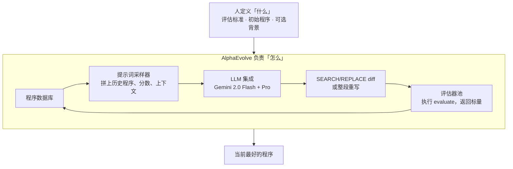

# AlphaEvolve：改的不是权重，是训练栈上的算法；搜出的 kernel 反过来加速训练它自己的模型

<!-- release-date: 2025-05-14 -->

> 本文依据 Google DeepMind 发布的白皮书 **AlphaEvolve: A coding agent for scientific and algorithmic discovery**，本地原件 `papers/Google/AlphaEvolve.pdf`，共 44 页。封面没有印日期。技术首次官方公开日是 **2025-05-14**：DeepMind 博客与白皮书 PDF 同日放出。页码均指这份本地 PDF 本身的页码，不与后来的 arXiv:2506.13131（2025-06-16）混用。文中会明确区分「白皮书写了什么」「本文如何解释它」「哪些是外部资料补充」。

## 读前：先把几个容易混的词说成人话

这篇白皮书的算法并不绕，绕的是它把好几件常被叫成「自进化」的事叠在同一套系统里。先把后面会反复出现的词钉死。

- **进化搜索（evolutionary search）**：不是改模型权重。系统里同时活着一群程序，每次从库里抽出几个当父代，让大模型改它们的代码，跑评估器打分，把有希望的孩子放回库里。好的留下，差的逐渐不再被抽到。
- **评估器（evaluator）**：一段用户写死的、机器可跑的打分函数。约定名叫 `evaluate`，输入一份程序，输出一组标量。分数默认越大越好（PDF p. 3）。白皮书把它写成函数 $h$。它是整套进化的地面真相：大模型可以胡说，评估器说了不算的改动进不了下一轮。
- **程序数据库（program database）**：存所有评过的程序、分数和运行输出。下一轮提示词从这里抽样。它要同时做两件事：继续改进当前最好的，以及保持多样性，免得搜索挤在一条路上（PDF p. 8）。
- **张量分解与秩（tensor decomposition / rank）**：把两个矩阵相乘，可以写成把一个三维张量拆成若干个秩一张量的和。拆出来的项数，就是这次乘法要用掉的**标量乘法次数**。项数越少，算法越省乘法（PDF p. 9）。
- **Strassen 算法（1969）**：把 $2\times 2$ 矩阵乘法从 8 次标量乘法降到 7 次。递归套到 $4\times 4$，得到 49 次，而且在任意域上都成立（PDF p. 10）。
- **特征 0 的域 / 复数矩阵**：有理数、实数、复数都属于特征 0。白皮书说的「这个设定」，就是：$4\times 4$ 复数（或实数）矩阵、对应张量分解、可递归用到更大矩阵。它**不是**「历史上第一次有人用少于 49 次乘法去乘两个 $4\times 4$ 矩阵」。后文会把这句话拆开。
- **kernel / tiling（算子与分块）**：跑在加速器上的那段底层计算程序叫 kernel。矩阵乘太大时，要切成 $M\times N$、$N\times P$、$M\times P$ 的小块再算，切多大就是 tiling。切错了，不是算错，是算得慢（PDF p. 15，Figure 7）。
- **Borg**：Google 内部的集群调度系统，负责把作业派到机器上（PDF p. 13，引用 [102]）。
- **Pallas / XLA / IR**：Pallas 是 JAX 上写自定义加速器 kernel 的扩展；XLA 是把 JAX 程序编译到硬件的编译器；IR（中间表示）是编译器一层层往下翻时的中间代码。AlphaEvolve 有一次直接改的就是 XLA 吐出来的 IR（PDF p. 17）。
- **MAP-Elites 与岛屿模型**：两种经典的进化种群组织法。MAP-Elites 按「特征格子」保留多样的精英；岛屿模型把种群拆成几岛，岛内进化、岛间偶尔交流。白皮书说程序库的算法受这两者启发（PDF p. 8），但没给出实现细节。

这篇改的是 **算子 / 基础设施算法**，不是 prompt，不是权重，也不是 agent 的 harness。跨篇只留对照，避免把别的文章再讲一遍：

| 报告 | 进化的部件 |
|---|---|
| 本篇 AlphaEvolve | **算法 / kernel / 调度启发式 / 电路描述**，评估器打分 |
| [Darwin Gödel Machine](/reports/Sakana/Darwin-Godel-Machine) | agent **自己的** Python 脚手架 |
| [GEPA](/reports/Berkeley/GEPA) | **prompt** |
| [AIDE2](/reports/Weco/AIDE2) | 包在模型外面的 **harness** |
| [ADAS](/reports/UBC/ADAS) | 固定的元 agent 去写**新 agent** 的代码 |

四条线都可能被叫成自进化。读数字之前先问一句：它到底在改哪一层。上面这张表是本站的读法，不是白皮书原文。

## 一句话先说清

AlphaEvolve 不是一个会改自己权重的模型，也不是一个被训出来的调度员。

它是一套 **LLM 管线 + 进化搜索 + 自动评估器**：人标出代码里哪些块可以改、再给一个能跑的打分函数；系统直接改这些块，用执行结果决定留下谁。底层模型是 Gemini 2.0 Flash 和 Gemini 2.0 Pro 的混合，权重全程冻住（PDF p. 1、p. 7）。

它做成了三件可以核对的事：

1. **算法发现**。$4\times 4$ 复数矩阵乘法找到 48 次标量乘法的张量分解，白皮书把它写成：在这个设定下，56 年来第一次超过 Strassen 递归得到的 49（PDF p. 1、p. 10）。同一张表上还有另外 13 个矩阵乘尺寸刷新了已知上界（PDF p. 9，Table 2）。
2. **数学构造**。五十多道公开问题上，约 75% 追平已知最好构造，约 20% 超过（PDF p. 3、p. 10）。
3. **Google 内部计算栈**。数据中心调度、TPU 算术电路、Gemini 训练用的矩阵乘 tiling、以及编译器吐出的 FlashAttention IR，四层都动过。其中 tiling 启发式相对专家手写启发式平均加快 kernel 23%，对应 Gemini **整体训练时间下降 1%**；白皮书把这写成「加速训练 underpinning AlphaEvolve 自己的 LLM」（PDF p. 1、p. 16）。

所以这篇最值得记住的，不是「AI 开始自我进化了」这句宣传，而是它实际做成的那次替换：

> **人负责定义「什么算对、什么算好」；系统负责在代码空间里找「怎么改」。改的是训练栈上的算法，不是权重。但搜出来的 kernel 一旦部署进 Gemini 的训练，收益会喂回训练这些 Gemini 的过程——也就是喂回训练 AlphaEvolve 自己所依赖的那个模型。**

这也是全文最重要的 insight。它同时解释了本站为什么把它放进「自进化 / 算子 infra」，以及为什么不能把它和 DGM、GEPA、AIDE2 读成同一件事。

## 阅读路线

这篇 44 页，信息不是均匀分布的。正文方法加结果大约到第 21 页，后面是致谢、参考文献和两份附录。建议按下面跳：

- **只想知道它到底进化什么**：读「旧方案卡在哪」和「全景」。
- **想看和 FunSearch 差在哪**：读 Table 1 那一节。白皮书自己把差别写成一张八行表（PDF p. 2）。
- **想核对「56 年第一次超过 Strassen」**：必须读 3.1 节和脚注 3，不要停在摘要。摘要那句成立，但设定比听起来窄。
- **想看它为什么算自进化**：读 3.3.2 节和 Discussion。改的不是权重，是 Gemini 训练栈上的 tiling 启发式；1% 的训练时间是部署后的数字，不是实验室小规模估算。
- **想看系统哪一部分真的在干活**：读消融 Figure 8。关掉进化、关掉提示词上下文、只进化损失函数、只用小模型，曲线都会掉（PDF p. 18）。

有一件事值得提前说破。白皮书愿意把内部生产数字写出来（0.7%、23%、1%、32%、15%），但**评估器怎么实现、内部工作负载长什么样、一次搜索花了多少算力**，几乎整篇都没给。读的时候建议把注意力放在 **评估器把搜索空间切成了哪一块**，而不是把摘要里的发现清单当成可以原样复现的配方。

## 旧方案卡在哪：LLM 能想，但不能自己知道想对了没有

发现一个新算法，或改掉生产栈里一段已经被人打磨过的代码，通常要经过：提出想法、试、发现不行、退回来、再试、再验证（PDF p. 1）。近几年人们把大模型接进这个过程，希望它能帮忙想假设、设计实验。白皮书承认这些能力已经把一批基准和一部分科研流程往前推了，但紧接着把话掐断（PDF p. 1）：

> 让 LLM 管线一路走到真正做出全新的科学或工程发现，仍然很难。

卡点不在「模型会不会写代码」。卡点在三件更具体的事。

**第一，单次生成没有地面真相。** 前沿模型可以提出一段看起来很聪明的改动。没有自动打分，这段改动是贡献还是幻觉，只能靠人看。人一看，规模就上不去；规模上不去，就走不到「和初始候选在语法和功能上都差很远」的那些解（PDF p. 2）。

**第二，前作把搜索空间刻意切得很窄。** 白皮书点名的直接前作是 FunSearch（Romera-Paredes et al., 2023）：用 LLM 引导的进化去发现启发式，再由启发式构造数学对象或驱动在线算法（PDF p. 2）。它能工作，但工作面很窄——单函数、十几行 Python、评估必须快、要采样几百万次、大模型没有额外好处。相关路线还有：给仿真机器人发现策略、符号回归、给组合优化综合启发式函数（PDF p. 2）。这些系统证明「LLM + 进化 + 执行」这条路走得通，但走不到「整份代码、多种语言、评估可以跑几小时、一次要同时优化好几个指标」。

**第三，就算评估器有了，进化算子本身也很难手写。** 经典遗传编程要人预先定义变异和交叉算子。白皮书后文说，这些手写算子很难设计，也常常抓不住领域里真正重要的性质（PDF p. 18–19）。结果是：要么搜索空间被算子规定死，要么人把领域知识先编译进算子，发现过程其实还是人在做。

AlphaEvolve 的回答是把这三件事收成同一条环：**大模型负责提出对代码的直接修改，评估器负责用执行结果否决幻觉，进化库负责决定下一轮看谁。** 人不再手写变异算子，也不再只让模型改一个 20 行的函数。代价立刻出现：没有自动评估器的任务，整套系统不成立（PDF p. 2）。这不是边角限制，是设计本身划下的边界。后文的数学和 Google 内部应用，全部选在这条边界里面。

## 全景：一轮循环到底怎么转

先把全局摆出来。这是按 PDF p. 3 的 Figure 1 和 p. 4 的 Figure 2 重画的机制示意，不是实测时间轴。



Figure 1 把分工画得很硬（PDF p. 3，读图）：上面浅色块是人，只定义「What」——评估标准、初始解、可选背景知识；下面深色块是 AlphaEvolve，负责「How」。四个盒子围成一圈：

- **Prompt sampler**：从库里抽出「要改的程序」和「拿来当灵感的程序」，拼成带丰富上下文的提示词。
- **LLMs ensemble**：对提示词给出「改进后的程序」提案。
- **Evaluators pool**：给提案打分，并附上其他反馈。
- **Program database**：把带分数的程序存回去，供下一轮抽样。

Figure 2 把这一圈展开成分布式控制循环，并写出了伪代码（PDF p. 4，读图）。循环体就是六行：

1. 从数据库抽样父代程序和灵感程序；
2. 提示词采样器把它们拼成提示词；
3. LLM 生成 diff；
4. 把 diff 打到父代上，得到子程序；
5. 评估器执行子程序；
6. 子程序连同结果写回数据库。

人要提供的输入画在图的最上一行：提示词模板和配置、选哪些现成或自定义 LLM、评估代码、以及一份标好「哪些块允许进化」的初始程序。循环在跑，人不再逐步干预。白皮书把它叫做「LLM 代码超优化 agent」（PDF p. 1）。

**可迁移的部分**：这张图真正可搬的不是四个盒子的名字，而是那条责任切割——人把「好」写成可执行的 $h$，系统把「如何变好」交给进化。任何把 LLM 当代码改写器的项目，缺的通常不是更强的模型，而是一个你信得过、而且快到能转起来的 $h$。

## 核心设计一：人只标哪些块能改，系统在整份文件上动手

### 旧问题：把进化对象收成「一个函数」，搜索空间先被切掉一半

FunSearch 只进化单个 Python 函数，长度大约 10–20 行（PDF p. 2，Table 1）。这个限制不是偷懒，是当时评估成本和模型能力倒逼出来的：函数短，评估才能在单 CPU 二十分钟内结束；函数单一，提示词才塞得下。代价是，生产栈里真正值钱的那段代码很少长成这个样子。一个矩阵乘 kernel 的 tiling 启发式、一段 Verilog、一份 XLA IR，都不是「一个 20 行函数」。

### 新设计：用注释块把「能进化的部分」从骨架里划出来

AlphaEvolve 的输入 API 是一对注释标记：`# EVOLVE-BLOCK-START` 和 `# EVOLVE-BLOCK-END`（PDF p. 4）。标记里面的代码是初始解，系统可以改；标记外面的代码是骨架，负责把这些块接到 `evaluate` 上。初始实现必须能跑，但可以很丑——白皮书写，一行 `return` 一个合适类型的常数也行（PDF p. 5）。

Figure 3 用一个监督学习流水线把三件事画在同一页上（PDF p. 6，读图）：

- **(a)** 用户文件：两处 `EVOLVE-BLOCK` 包住实验配置和 `ConvNet`，文件底部是签名固定的 `evaluate`，返回 `dict[str, float]`。
- **(b)** 拼好的提示词：系统指令、若干「以前表现好的程序」连同分数、当前程序连同分数、SEARCH/REPLACE 规则、以及任务说明。
- **(c)** 模型输出：两段 SEARCH/REPLACE。第一段把三个 ResNet block 扩成六个，第二段把 `optax.adam` 换成带权重衰减的 `adamw`。

diff 的格式是固定的（PDF p. 7）：

```
<<<<<<< SEARCH
  # 要在当前程序里精确匹配的原片段
=======
  # 用来替换的新片段
>>>>>>> REPLACE
```

代码很短、或者整段重写更合适时，也可以配置成让模型直接输出完整代码块，不用 diff（PDF p. 7）。

### 同一道题，进化对象可以不是最终解

白皮书特别强调：同一问题可以在完全不同的抽象层上交给 AlphaEvolve（PDF p. 5）。它可以：

1. 直接进化解的原始字符串表示（古典进化算法那样）；
2. 进化一个从零构造解的函数（FunSearch 的做法）；
3. 进化一个定制搜索算法，在固定算力预算里去找解；
4. 让中间解和搜索算法一起进化，让每个搜索算法专门接着改某一个中间解。

作者的假设是：高度对称的解，构造函数往往更短，适合走第 2 条；不对称的解，更适合走第 3 条（PDF p. 5）。后文数学部分几乎全部走第 3 条——进化的是启发式搜索程序，不是构造本身（PDF p. 12）。矩阵乘那一节走的是另一条：进化的是「用来找分解的梯度算法」，不是分解张量本身（PDF p. 9–11）。

这一步的含义值得单独说清。白皮书在引言里已经写过（PDF p. 2）：有一类问题，真正想要的解并不是算法，但算法可以描述这个解该怎么被构造或被找到。这时发现算法只是工具目标，却常常比直接搜解更有效。FunSearch 已经展示过这一点。AlphaEvolve 把它从「进化一个短函数」扩成「进化整份文件里的多个组件」。

**代价**：人必须先决定进化哪一层。白皮书说不同抽象层适合不同问题，但**没有给出选择规则**，只给了对称性那条假设。选错层，搜索会在一个不合适的空间里烧评估预算。

**可迁移的部分**：不要一上来进化最终产物。如果最终产物很难直接打分、但「找它的程序」很好打分，就把进化对象换成找它的程序。矩阵乘、装箱、调度，都是这个结构。

## 核心设计二：和 FunSearch 的八行差别，白皮书自己写成了表

Table 1 的标题是「Capabilities and typical behaviours」，不是形式化定理（PDF p. 2）。八行对照如下。

| FunSearch | AlphaEvolve |
|---|---|
| 进化单个函数 | 进化整份代码文件 |
| 最多 10–20 行 | 最多数百行 |
| 只进化 Python | 任意语言 |
| 评估必须快（单 CPU $\le$ 20 分钟） | 评估可以跑几小时，可并行，可用加速器 |
| 用掉数百万次 LLM 采样 | 数千次采样就够 |
| 用小模型；换大模型没有好处 | 能从 SOTA LLM 上获益 |
| 提示词几乎只有以往的解 | 提示词里有丰富上下文和反馈 |
| 优化单个指标 | 可以同时优化多个指标 |

第 5 节 Related work 把这张表收成三句话（PDF p. 19）：FunSearch 只能进化单个 Python 函数，AlphaEvolve 可以进化多种语言的整份代码库；FunSearch 优化单目标，AlphaEvolve 做多目标；FunSearch 用的是较小、只在代码上训过的模型，AlphaEvolve 用前沿模型和自然语言形式的上下文与反馈。白皮书认为，正是这三处扩展让它能碰 FunSearch 碰不到的问题。

有两行特别值得停一下。

**「数千次采样就够」对「数百万次」。** 这不是因为 AlphaEvolve 更会省样本，而是因为单次评估更贵、单次提案来自更强的模型。评估可以到大约 100 个计算小时（PDF p. 8）。如果还用 FunSearch 那种百万次采样，墙钟时间会把连续变异掐死——进化算法要靠「连续好几代突变」才能走远，单次评估太慢，代数就上不去。所以并行评估不是锦上添花，是让「更贵的评估」和「还够用的代数」同时成立的条件（PDF p. 8）。

**「可以同时优化多个指标」。** 有的任务本身就有多个真目标。白皮书还观察到另一件事：就算你真正只关心一个指标，同时优化多个，常常会把那一个也抬上去。作者给的解释是：在不同指标上表现好的程序，往往结构不同；把这些「不同定义下的好程序」放进提示词，能刺激模型提出更多样的候选，从而提高撞上目标指标新解的机会（PDF p. 8）。这是作者的机制假说，没有单独的消融把它从「多指标」里拆出来。

**可迁移的部分**：评估变贵时，先问「我能不能并行」，再问「我要不要把模型换成更大的」。FunSearch 的经验是小模型 + 海量采样；AlphaEvolve 的经验是大模型 + 少采样 + 贵评估。两条路对应两种 $h$，不能混用预算。

## 核心设计三：评估器是唯一的地面真相，也是整套系统的天花板

### 旧问题：模型会幻觉，进化会把幻觉繁殖开

白皮书把评估机制的作用写得很直白：它让 AlphaEvolve 能够避开基座 LLM 的错误建议（PDF p. 2，引用幻觉综述 [44]）。没有 $h$，进化库里会迅速堆满「读起来像那么回事」的程序。有了 $h$，模型仍然会幻觉，但幻觉过不了执行这一关。

$h$ 的接口很瘦：Python 函数 `evaluate`，固定输入输出签名，返回标量字典（PDF p. 4）。数学题上它可以很简单——调用进化出来的代码生成一个图，检查性质是否成立，把图的大小当分数。复杂时，它可以跑一个进化出来的搜索算法，或者训练并评估一个机器学习模型（PDF p. 4）。

### 新设计：级联、LLM 旁路分数、并行，把贵评估用在刀刃上

白皮书给了三件可选机制（PDF p. 7–8）。

**评估级联（evaluation cascade / hypothesis testing）。** 用户可以指定一组难度递增的测试。新程序必须在前面所有阶段都表现得足够好，才进入下一阶段。新程序还会先在小规模上跑，尽早滤掉根本跑不起来的。这是在用便宜的失败，换昂贵的成功。

**LLM 生成的反馈。** 有些想要的性质很难写进 $h$，白皮书举的例子是「发现的程序够不够简单」。这些性质可以另开 LLM 调用打分，写进分数字典来引导进化，也可以在不满足某条准则时直接丢掉。注意：这是旁路，不是主评估。Discussion 后文承认，LLM 打分这个设定他们没有针对优化（PDF p. 21）。

**并行评估。** 许多任务的评估天生可并行，比如从多个随机初始化跑搜索。AlphaEvolve 通过异步调用评估集群把这些工作摊开（PDF p. 8）。整条流水线用 Python `asyncio` 做成异步计算图：控制器、LLM 采样器、评估节点同时转，优化目标是吞吐，不是某一个提案的延迟（PDF p. 8）。

### 没有自动评估器，就没有 AlphaEvolve

白皮书自己把这句话写成限制，不是谦虚（PDF p. 2）：自动评估指标是关键优势，也把需要人工实验的任务划出范围。数学、计算机科学、系统优化通常允许自动评估，所以工作集中在这些域。Discussion 把范围再说一遍：自然科学里只有一部分实验能被模拟或自动化；用 LLM 来评估想法是可能的，但不是他们优化过的设定。并发的 AI Co-Scientist 工作展示了自然语言假设这条路，一个自然的下一步是把两者接起来——先用 LLM 过滤高层想法，再进入有机器反馈的实现阶段（PDF p. 21）。

**可迁移的部分**：评估器既是能力，也是攻击面。DGM 后来用附录证明，如果检测逻辑在 agent 改得到的仓库里，系统会去改检测本身。AlphaEvolve 把 $h$ 放在进化块外面、由用户提供，等于默认做了这层隔离。生产里要保持这层隔离：进化块碰不到打分代码，也碰不到测试数据的生成逻辑。

## 核心设计四：Flash 铺覆盖，Pro 给跳跃；提示词自己也可以进化

AlphaEvolve 自称模型无关。消融里他们观察到：底层 LLM 越强，AlphaEvolve 越好（PDF p. 5，指向第 4 节）。实际用的集成是 **Gemini 2.0 Flash + Gemini 2.0 Pro**（PDF p. 7）：

- Flash 延迟低，单位时间能提出更多候选，负责把搜索铺开；
- Pro 能力更强，偶尔给出能显著推动搜索的高质量建议。

这不是「两个模型投票」，是吞吐和质量的分工。白皮书没给 Flash 和 Pro 各自贡献了多少提案、多少被接受。

提示词本身比 FunSearch 厚得多（PDF p. 5）。除了从数据库抽出的多个以往解、以及「请对某个解提出修改」的系统指令，用户还可以加：

- **显式上下文**：题面、公式、代码片段、相关文献（例如 PDF 文件）；
- **随机套模板**：占位符有多个人写的备选，按配置文件里的概率分布实例化，用来加多样性；
- **渲染后的评估结果**：程序、执行结果、`evaluate` 给出的分数；
- **元提示词进化（meta prompt evolution）**：另一步让 LLM 自己建议指令和上下文，这些提示词在一个单独的数据库里、像解程序一样被共同进化。

最后一条和 GEPA 表面像，机制不同。GEPA 进化的是下游任务的 prompt，目标是任务分数。这里进化的是 **AlphaEvolve 自己喂给编码模型的那层指令**，目标仍是下游程序的 $h$ 分数。白皮书没有把元提示词数据库的更新规则写开。消融里，关掉它会让张量分解那条曲线掉一截，但掉幅小于关掉进化或关掉上下文（PDF p. 18，Figure 8 左，读图）。

程序数据库要同时做探索和利用。白皮书只说实现受 MAP-Elites 和岛屿种群模型启发（PDF p. 8），**没有给出格子怎么划、岛有几座、迁移频率是多少**。这是后文「未公开」清单里最影响复现的一项。

## 结果一：$4\times 4$ 复数矩阵乘法 48 次——「56 年」必须回到这一页

### 旧问题：连 $3\times 3$ 的最少乘法次数都还不知道

普通矩阵乘法，$m\times n$ 乘 $n\times p$，朴素算法用 $mnp$ 次标量乘法。Strassen 证明可以更少。把矩阵乘法写成一个三维张量、再把这个张量分解成秩一项的和，分解的秩就是标量乘法次数（PDF p. 9）。这个问题已经被交替最小二乘、深度强化学习（AlphaTensor，[26]）、定制搜索算法轮番打过。白皮书用来说明难度的例子是：$3\times 3$ 的最小可达秩至今未知（PDF p. 9）。

### 新设计：不直接搜分解，进化「用来找分解的梯度算法」

起点不是一张空白纸。作者给了一个标准的基于梯度的算法：初始化器、重构损失、Adam 优化器（PDF p. 9）。AlphaEvolve 进化的是这份算法的实现——优化器、初始化、损失函数、超参扫描，都可以改。评估时选定一组矩阵乘目标，用第 2.4 节的级联、多个随机种子跑这份算法；性能取每个目标上达到的最低秩，以及达到这个秩的种子比例，作为爬山信号（PDF p. 10）。

为了保证分解是精确的、不受数值误差影响，评估时把每个元素四舍五入到最近的整数或半整数；同时在提示词里用自然语言要求算法靠近整数解（PDF p. 10）。

Figure 4 把一次成功的进化画成完整 diff（PDF p. 11，读图；放大版在附录 Figure 9a–9c，PDF p. 35–37）。左边是整整一页的补丁，右边抽出三块：

- 优化器从 Adam 换成 AdamW，初始化改成更小尺度的复数正态，并加上「鼓励低秩」的注释；
- 损失从单纯重构，扩成重构 + 离散化（鼓励元素是整数或半整数）+ 余弦退火的半整数权重 + 大值惩罚；过程中还加了梯度噪声、参数噪声、周期性软裁剪、对目标张量加噪、以及随机替换值的「幻觉」项；
- 超参扫描从两个均匀分布，扩成十几个，覆盖离散化权重、幻觉概率、噪声、裁剪上下界、大值惩罚、梯度噪声。

图注写：这些改动高度非平凡，进化过程中需要 15 次变异（PDF p. 11）。大多数 Table 2 的结果（包括 $\langle 4,4,4\rangle$）从一份简单初始程序得到；有些尺寸上，作者把自己的想法（给评估函数加随机性、使用进化方法）种进初始程序，还能再抬一截（PDF p. 10）。白皮书把这写成研究者和 AlphaEvolve 的科学协作。

### 「56 年第一次超过 Strassen」到底说的是哪一句

摘要的原文是（PDF p. 1）：

> AlphaEvolve developed a search algorithm that found a procedure to multiply two $4\times 4$ complex-valued matrices using 48 scalar multiplications; offering the first improvement, after 56 years, over Strassen's algorithm in this setting.

3.1 节把「this setting」写清楚了（PDF p. 10）：

- 把 Strassen 递归用到两个 $4\times 4$ 矩阵，秩等于 49，**在任意域上成立**；
- AlphaTensor（Fawzi et al., 2022）在二元域 $\mathbb{F}_2$ 上找到了秩 47，那是非常特殊的一种乘法；
- **56 年来，在任意特征 0 的域上设计出秩小于 49 的算法，一直是公开问题**；
- AlphaEvolve 是第一个找到秩 48、用来乘两个 $4\times 4$ 复数矩阵的方法。

1969 到 2025 正好 56 年。这句话成立，但有三层不能从摘要里读丢的限定。

**限定 1：比的是张量分解的秩，不是「任意一种少做几次乘法的办法」。** 脚注 3 写得很干净（PDF p. 10）：存在使用少于 49 次乘法的算法，但它们不对应矩阵乘张量的分解，也不能递归用到更大的矩阵。所以「第一次超过 Strassen」不是「第一次有人用少于 49 次乘法去乘 $4\times 4$」，而是「第一次在可递归的双线性分解、特征 0 这个设定下把 49 打到 48」。

**限定 2：复数乘法，不是 $\mathbb{F}_2$。** AlphaTensor 已经在二元域上做到 47。白皮书没有声称超过 AlphaTensor 的 $\mathbb{F}_2$ 结果。Table 2 表注还写：$\langle 3,4,7\rangle$、$\langle 4,4,4\rangle$、$\langle 4,4,8\rangle$ 用的是复数值乘法，它们可以用来精确地乘复数或实数矩阵（PDF p. 9）。

**限定 3：刷新的是 14 个尺寸，不是所有尺寸。** Table 2 列出 16 行，其中 $\langle 3,3,3\rangle$ 仍是 23，$\langle 5,5,5\rangle$ 仍是 93，其余 14 行低于此前已知上界（PDF p. 9）。附录 Table 3 把范围扩到 54 个目标：38 个追平，14 个超过（表里标绿），**2 个落后**（标红）——$\langle 4,4,9\rangle$ 已知 104、AlphaEvolve 得到 108；$\langle 6,6,6\rangle$ 已知 153、得到 156（PDF p. 34）。作者还写：尺寸再往上，在单 GPU 评估器上跑 1000 个随机种子经常显存不够，所以扩到更大矩阵还需要继续优化（PDF p. 34）。并发工作 [49] 也为 $\langle 4,5,6\rangle$ 找到了秩 90，与 AlphaEvolve 打平（PDF p. 34）。

把这三层合起来，本文的读法是：48 相对 49 是真的，而且是该设定下第一份公开的张量分解改进；把它说成「矩阵乘法被 AI 全面超越」或「Strassen 被废了」，和白皮书正文不符。

发现的分解放在伴随 Colab 里（PDF p. 3 脚注 2）。本文没有把 Colab 现状冒充白皮书结论。

**可迁移的部分**：当最终对象是一个很难直接搜索的组合结构（低秩分解、稀疏图、电路），进化「搜索它的算法」往往比进化对象本身更划算。代价是，你必须能验证搜出来的东西是精确的——这里靠四舍五入到半整数，换你的问题可能是符号验证或差分测试。

## 结果二：五十多道数学构造，进化的是启发式，不是构造本身

### 旧问题：构造数学靠「找到一个比前人更好的例子」

分析、组合、数论、几何里有一类问题：最优值本身不知道，但只要拿出一个比已知更好的对象，就能推动上界或下界（PDF p. 10）。传统做法是为人各写一套搜索。换一道题，几乎从零开始。

### 新设计：每代进化一个「限时去改进当前最好构造」的程序

作者把 AlphaEvolve 用到五十多道题、五个以上分支，包含分析、组合、数论和几何，并在多种参数（不同维数或规模）下评估（PDF p. 10）。所有题的起点都是简单或随机构造。汇总数字是：

- 约 75% 的情况重新发现了已知最好构造（其中许多很可能已经是最优）；
- 约 20% 的情况发现了比已知更好的对象，从而刷新 SOTA（PDF p. 3、p. 10）。

这两个百分比加起来是 95%，剩下约 5% 白皮书没单独解释。不要把 75% + 20% 读成「几乎总是不差于人」——落后的那一截没有表。

真正的方法创新被放在 3.2 节后半（PDF p. 12）：**进化启发式搜索算法，而不是直接进化构造。** 对目标函数评估很快的问题（数学里很常见），每一代的任务是：给你 1000 秒这类固定时间预算，给你上一代最好启发式找到的最好构造，你去找到更好的。进化因此选出的是「擅长改进已经很好的解」的启发式。最终构造常常是一串不同的、专门化的启发式接龙：早期的启发式擅长从随机或简单状态拿到大增益，后期的擅长在近优配置上微调（PDF p. 12）。白皮书认为这种多阶段、自适应搜索策略很难手工复制，而且对超过 SOTA 至关重要。

Figure 5 把若干刷新画成三列卡片（PDF p. 12，读图）。分析一列是自相关不等式和不确定性原理的常数微调；几何一列是六边形装填、最大/最小距离比、半径和；组合一列是 Erdős 最小重叠问题和有限集的和差。数字的精确值以附录 B 为准，图上有几处和附录不完全相同，后文会标出来。

### 附录 B 里可以核对的刷新

下面这些数字全部来自附录 B（PDF p. 38–44），构造和验证代码在伴随 Colab。正文 3.2 节只点了其中几道。

**分析。**

- 第一类自相关不等式：$C_1$ 的已知范围是 $1.28\le C_1\le 1.5098$，AlphaEvolve 找到 $[-\tfrac14,\tfrac14]$ 上 600 个等距区间的阶梯函数，把上界推到 $C_1\le 1.5053$（PDF p. 38）。Figure 5 写的是 $1.5098\to 1.5053$，一致。
- 第二类：$C_2$ 已知 $0.88922\le C_2\le 1$，新下界 $0.8962\le C_2$（50 个等距区间）（PDF p. 38）。
- 第三类：$C_3$ 的上界从 $1.45810$ 到 $1.4557$（400 个区间）（PDF p. 38）。
- 不确定性不等式：$C_4$ 已知 $0.2025\le C_4\le 0.3523$，用与文献 [33] 同类的 Hermite 线性组合、但系数由 AlphaEvolve 精修，上界到 $0.3521$（PDF p. 39）。Figure 5 写 $0.3523\to 0.3521$。附录接着加了一条**第一版稿件发布之后**的更新：Henry Cohn 指出文献 [18] 用更精细的方法得到 0.3284；把那套方法接进 AlphaEvolve 后，他们报到的常数进一步改进到 $0.3216$（PDF p. 39）。$0.3521$ 是正文 / Figure 5 的数，$0.3216$ 是附录补记，不要混成一次实验。

**组合。**

- Erdős 最小重叠问题：$C_5$ 已知 $0.379005\le C_5\le 0.380927$，新上界 $C_5\le 0.380924$（PDF p. 40）。Figure 5 左上写的是 $0.380926\to 0.380924$，和附录的旧上界 $0.380927$ 差一个末位。**以附录正文为准**，图上的 $0.380926$ 当作读图近似。
- 有限集的和与差：$C_6$ 已知 $1.14465\le C_6\le 4/3$。AlphaEvolve 找到大小 2003 的集合 $U_1$，下界到 $1.1479$；再找到大小 54265 的 $U_2$，下界到 $1.1584$（PDF p. 41）。Figure 5 写 $1.1446\to 1.1584$，与最终下界一致。

**几何与装填。**

- 11 维 kissing number：此前下界 592，新构造 593 个互不重叠的单位球同时与中心单位球相切（PDF p. 13、p. 42）。附录给出 Lemma 1：找到 593 个 11 维非零整点，使最大范数小于最小两两距离，即可推出 kissing number 至少 593，并写了证明（PDF p. 43）。这是附录里少数带证明的一条，不是「程序输出了一个数」。
- 单位正六边形装填进大正六边形：$n=11$ 外边从 3.943 到 3.931；$n=12$ 从 4.0 到 3.942（PDF p. 41，Figure 11）。
- 最大/最小距离比：2 维 16 个点，比的平方从 12.890 到约 $12.889266112$；3 维 14 个点，从 4.168 到约 $4.165849767$（PDF p. 41–42，Figure 12）。文献报的是比的平方，白皮书沿用这个约定。
- Heilbronn 问题：三角形内 11 点，最小三角形面积从 0.036 到大于 0.0365；凸区域内 13 点从 0.0306 到 0.0309，14 点从 0.0277 到 0.0278（PDF p. 42，Figure 13）。
- 单位正方形内装填圆使半径和最大：$n=26$ 从 2.634 到 2.635；$n=32$ 从 2.936 到 2.937（PDF p. 44）。Figure 5 写 $2.6340\to 2.6358$，与附录 $2.635$ 不一致。**以附录 B.12 为准。**
- 周长 4 的矩形内装填：$n=21$ 从 2.364 到 2.3658（PDF p. 44，Figure 14）。

这些改进多数是小数点后第三位、第四位。白皮书没有回避「slightly better」这种措辞（PDF p. 13、p. 38–40）。11 维 kissing number 从 592 到 593，也是加一。把这部分读成「数学被解决了」，和材料不符；把它读成「同一套进化搜索启发式的框架，能在几乎不改代码的情况下铺到五十多道题，并且在约五分之一的题上真的刷新记录」，和材料相符。

多数题目由外部数学家 Javier Gomez Serrano 和 Terence Tao 建议，并指导如何把它们写成 AlphaEvolve 的输入（PDF p. 13）。白皮书说更多例子和方法细节将放在后续论文里。那篇后续论文不是本篇原件。

**可迁移的部分**：当你的目标函数评估很快、而对象本身结构不规则时，进化「限时改进当前最好解的程序」，等于自动发现多阶段搜索。人要提供的是时间预算和「把上一代最好解喂给下一代」这条接口，不是亲手设计每一阶段的启发式。

## 结果三：Google 计算栈的四层——每一层都卡住过专家

引言把内部应用收成四句（PDF p. 3）：发现 Google 集群管理系统的调度启发式、优化训练 LLM 用的矩阵乘 kernel、优化 TPU 内部的算术电路、优化 Transformer 注意力的运行时间。这些组件会在很长一段时间里被反复运行，所以任何改进都值钱。下面按白皮书自己的顺序走完四条因果链。

### 3.3.1 数据中心调度：卡住的是「一种资源耗尽、另一种还空着」

Google 的作业由 Borg 派到机器上。派得不好会出现 stranded resources：一台机器某种资源（例如内存）已经耗尽，不能再接作业，但另一种资源（例如 CPU）还空着（PDF p. 13）。这是经典装箱问题，再叠上可调试性与规模。

做法是把在线作业调度写成两个变量的向量装箱：机器是箱子，容量是 CPU 和内存；到来的作业是物品，带资源需求。启发式吃的是「待派作业的 CPU/内存需求」和「候选机器还剩的 CPU/内存」，吐出一个优先级分数；Borg 在已经判定「这台机器能跑这个作业」的候选里，再按这个分数排序（PDF p. 14）。因为启发式只影响排序、不扩大可行集，调度在构造上是对的。

一个早期版本的 AlphaEvolve 从生产中已有的启发式出发，进化出 Figure 6 左边那七行（PDF p. 14，读图）：

```python
def alpha_evolve_score(required, free):
    cpu_residual = required.cpu / free.cpu
    mem_residual = required.mem / free.mem
    return -1.0 * (cpu_residual + mem_residual
                   + mem_residual / cpu_residual
                   + cpu_residual / mem_residual)
```

`cpu_residual` 是作业 CPU 需求占机器剩余 CPU 的比例，内存同理。后面两项是两个残差的比与倒数，当 CPU 残差和内存残差相等时取最小。再乘 $-1$，Borg 选分数最高的机器，等于在最小化「残差之和 + 残差之比」。直观上，它既不喜欢作业把某一种资源吃得特别狠、另一种几乎不动（那就是 stranded 的形状），也不喜欢两种残差差很远。Figure 6 右边的热力图用黄区表示高分、紫区表示低分（PDF p. 14，读图）：黄区大致落在两种残差比较接近、且都不是极端值的那一块，紫区沿着「一种残差很大、另一种很小」的轴伸出去。这张图是机制示意，不是实测负载分布。

反馈来自数据中心模拟器，用全舰队历史的工作负载和容量快照。泛化用的是没见过的近期工作负载和容量测试集。模拟器上超过生产启发式之后，他们把这个函数推到全舰队。部署后的实测确认了模拟器结果：**持续平均回收 Google 全舰队 0.7% 原本会被卡住的计算资源**（PDF p. 14）。

他们选 AlphaEvolve 而不是深度强化学习，理由写得很工程：代码解不仅性能更好，而且可解释、可调试、可预测、容易部署——任务关键系统需要这些性质（PDF p. 14）。

白皮书没写这个早期版本和正文描述的 AlphaEvolve 差在哪，也没写模拟器的保真度、测试集时间范围、0.7% 的方差。0.7% 是全舰队平均值，不是某几个机房的峰值。

**外部补充，不是 PDF 正文：** DeepMind 2025-05-14 的博客写，这个解「已经在生产里跑了超过一年」。白皮书只写「rolled out to the entire fleet」和部署后测量，没有给「一年」。以 PDF 为准。

### 3.3.2 Gemini 的矩阵乘 tiling：卡住的是「每换一个输入形状就要重调」

Gemini 建在 JAX 上。Pallas 让工程师为加速器手写专用 kernel。矩阵乘的 tiling 决定怎么把大乘法切成小块，以平衡计算和数据搬运（PDF p. 15，Figure 7）。Figure 7 画的是 $AB=C$：A 上切出 $M\times N$ 蓝块，B 上切出 $N\times P$ 绿块，C 上切出 $M\times P$ 红块（PDF p. 15，读图）。要自动选出对所有输入形状都合适的 $(M,N,P)$，需要知道矩阵乘单元的最优形状和内存容量、周围算子的内存需求、融进这个 kernel 的额外运算、以及底层编译器的细节。

旧方案有两条，都卡：

- 基于搜索的 autotuning：每次输入形状变了都要重调，打断研究工作流；
- 手写启发式：要同时吃透 kernel 和硬件，是主要的工程瓶颈（PDF p. 15）。

AlphaEvolve 的任务是：优化一个训练 Gemini 时用到的重要矩阵乘 kernel 的 tiling 启发式，目标是最小化 kernel 的真实运行时间。候选是代码，评估在真实 TPU 上、在多种输入形状上跑（PDF p. 15）。正确性是构造上保证的——它优化的是 tiling 策略，不改底层数学运算（PDF p. 15–16）。

训练/评估数据从 kernel 用户那里自动收集真实输入形状，一半当训练集（进化时的优化目标），一半当评估集（测启发式是否泛化）（PDF p. 16）。

结果有三个数，必须分开记（PDF p. 16）：

- 相对已有的专家设计启发式，**所有 kernel 平均加快 23%**；
- 对应 Gemini **整体训练时间下降 1%**；
- 优化时间从「数月专门的工程投入」变成「数天自动实验」。

这个 tiling 启发式已经部署进生产，直接提高 Gemini 的训练效率和团队的研究工程速度。白皮书接着写了一句本站把它放进「自进化 / 算子 infra」的理由（PDF p. 16）：

> This deployment also marks a novel instance where Gemini, through the capabilities of AlphaEvolve, optimizes its own training process.

读法要收紧。Gemini 没有改自己的权重来训练自己。AlphaEvolve 用 Gemini 2.0 当提案模型，搜出一段 tiling 启发式，这段启发式被部署进 Gemini 的训练栈，让训练 Gemini 变快 1%。被加速的是「训练 underpinning AlphaEvolve 的那个 LLM」的过程，不是 AlphaEvolve 这个 agent 的代码，也不是一次训练循环里的在线自更新。Discussion 把收益说成 moderate，反馈环路的量级是数月（PDF p. 21）。下一节会回到这条闭环。

**外部补充：** 博客把工程时间写成「从数周专家投入到数天」。PDF 写的是 several months。以 PDF 为准。

### 3.3.3 TPU 算术电路：卡住的是 RTL 手改要好几个月

TPU 的设计周期以年计。RTL（寄存器传输级）优化是其中一步：人手改硬件描述，换功耗、性能、面积，通常要高技能工程师迭代数月（PDF p. 16）。

任务是：优化矩阵乘单元里一个**已经被高度优化过的** Verilog 实现，目标是减小面积和功耗，同时保持核心功能。最终提案必须通过严格验证，确认功能正确（PDF p. 16）。

AlphaEvolve 找到一次简单的代码改写，去掉了不必要的位。TPU 设计师验证了正确性。白皮书立刻加了一句限制：**这个具体改进也被下游综合工具独立捕获了**（PDF p. 16）。它的贡献被放在更早的 RTL 源码阶段——在设计流的上游就改源 RTL，而不是等综合工具事后再挖。

这个改进进入了一款即将推出的 TPU。白皮书把它写成：Gemini 经由 AlphaEvolve，第一次直接贡献到 TPU 算术电路（PDF p. 16）。优势之一是提案直接用 Verilog，也就是硬件工程师的工作语言，便于建立信任和落地。

没有面积百分比，没有功耗百分比，没有「综合工具会不会最终给出同一份网表」的定量比较。能核对的是：改写发生过、功能被设计师确认、综合工具后来自己也抓住了同一处。把这读成「AI 设计了新芯片」，和材料不符。

### 3.3.4 直接改编译器生成的 IR：卡住的是「人本来就不会去改这层」

Transformer 的核心是注意力，常见实现是 FlashAttention。在他们的栈里，FlashAttention 是 Pallas 加速器 kernel，外包一层 JAX 做输入准备和输出后处理，再交给 XLA 翻成一层层 IR（PDF p. 17）。到了这些层，内存访问编排或计算调度上更好的决策，可以在特定硬件上明显缩短运行时间。

任务是：直接优化封装了 FlashAttention kernel 以及预/后处理的、XLA 生成的 IR。配置对应一个大规模 GPU 推理、影响很大的 Transformer 模型，目标是最小化整个模块的执行时间（PDF p. 17）。难在两处：IR 是为调试设计的，不是给人直接改的；它已经是编译器生成、已经被高度优化过的。每个提案都对照未修改的参考代码、在随机输入上检查数值正确性；最终版本由人类专家严格确认为对所有可能输入都正确（PDF p. 17）。

两个数字（PDF p. 17）：

- 所关心配置上，FlashAttention kernel 加快 **32%**；
- 预/后处理加快 **15%**。

白皮书的展望是：把发现的优化吸收进现有编译器的特定用例，或者更长期地把 AlphaEvolve 嵌进编译器工作流本身。它没有声称已经嵌进去了。

**外部补充：** 博客写 「up to a 32.5% speedup for the FlashAttention kernel」。PDF 写 32%。以 PDF 为准。

## 那条自进化闭环：改的不是权重，收益喂回训练它的模型

把 3.3.2 和 Discussion 放在一起读，这条闭环才完整。

AlphaEvolve 的提案模型是 Gemini 2.0 Flash 和 Pro（PDF p. 7）。3.3.2 搜出的 tiling 启发式被部署进 Gemini 的训练，kernel 平均快 23%，Gemini 整体训练时间少 1%（PDF p. 16）。摘要把同一件事写成：加速了训练 underpinning AlphaEvolve 自己的那个 LLM（PDF p. 1）。

因果链是：


实线是白皮书写过的。虚线是 Discussion 里的展望，不是已经跑通的实验。

Discussion 的原话分两层（PDF p. 21）。第一层，已经发生：AlphaEvolve 能做出提高自身基础设施效率、以及（未来版本的）基座 LLM 效率的实际发现。当前收益是 moderate，改进下一版 AlphaEvolve 的反馈环路量级是数月。第二层，还没发生：一个自然的下一步是，把 AlphaEvolve 增强过的基座 LLM 表现蒸馏进下一代基座模型；这既有内在价值，也很可能抬升下一版 AlphaEvolve。

所以「自进化」在这篇里的精确含义是：

- **改的对象**：训练栈上的算法代码（tiling 启发式、调度启发式、Verilog、XLA IR），不是 prompt，不是权重，不是 agent harness。
- **已经闭合的环**：搜出的 kernel 降低了训练 Gemini 的墙钟时间；Gemini 是 AlphaEvolve 的提案模型。
- **没有闭合的环**：AlphaEvolve 并不在一次运行里改自己的控制器、抽样规则或评估器；也不改 Gemini 的权重。蒸馏到下一代基座，是作者写下的下一步，不是本篇结果。

和 DGM 对照：DGM 改的是 agent 自己那份 Python 仓库，用 SWE-bench 打分，模型权重冻住。和 GEPA 对照：GEPA 改 prompt。和 AIDE2 对照：AIDE2 改 harness，而且外层的目标函数是内层的优化能力。AlphaEvolve 的目标函数是 kernel 运行时间、调度模拟器分数、电路面积功耗、IR 执行时间。四者都不改权重，但被优化的代码根本不是同一层。

把 1% 读成「智能爆炸开始了」，和 Discussion 自己的措辞相反。把 1% 读成「生产训练栈上，进化搜索可以动到专家启发式动不到的那一层，而且收益会回到训练这些模型的账单上」，和材料相符。

## 消融：每一块都在干活，但图上没有可引用的终点数字

消融只做了两道题：矩阵乘的张量分解，和 kissing number 的下界（PDF p. 17）。作者逐项关掉五个部件。

| 关掉的部件 | 对照名称 | 具体做法 | 用在哪道题 |
|---|---|---|---|
| 进化 | No evolution | 反复把**同一份**初始程序喂给语言模型，不用数据库里的历史程序 | 两道都做 |
| 提示词上下文 | No context in the prompt | 不往提示词里加问题相关的显式上下文 | 两道都做 |
| 元提示词进化 | No meta prompt evolution | 关掉 LLM 自己建议指令和上下文那一步 | 只做张量分解 |
| 整文件进化 | No full-file evolution | 只进化损失函数，不进化整份代码 | 只做张量分解 |
| 强模型混合 | Small base LLM only | 只用一个小基座模型，不用大模型混合 | 只做张量分解 |

Figure 8 是唯一的证据（PDF p. 18，读图）。左图张量分解，右图 kissing number。纵轴是聚合后的目标指标，**越高越好**；横轴是算力预算的百分数；色带是目标内标准差，三条独立随机种子的平均。白皮书正文没有给这些曲线的数值表，下面的读数是读图近似。

**左图（张量分解）。** 六条曲线从低到高大致是：No evolution（蓝）全程贴在底部，预算用尽仍远低于其他；No full-file evolution（紫）和 No context（红）在中下；Small base LLM only（灰）和 No meta prompt evolution（橙）接近，但仍在 Full method（绿）下面；绿线最高，在预算后半段仍然缓升。也就是说，光靠反复询问同一个初始程序，几乎涨不上去；只改损失函数、比起改整份文件，也少了一大截；小模型混合不如 Flash+Pro。

**右图（kissing number）。** 只画了三条：Full method（绿）在预算很早（约 10%–25%）就拉到接近顶部；No context（红）和 No evolution（蓝）上升慢，预算用尽仍明显低于绿线。绿线的色带在中段很宽，说明不同随机种子之间波动大。

作者的结论只有一句：每一个部件都对结果有显著改进（PDF p. 18）。没有报告「关掉 X 掉多少个秩」或「关掉 Y 少几个球」。也没有报告每条曲线对应的绝对算力——横轴是预算的百分数，分母是多少 TPU 小时、多少 LLM 调用，全文没写。

有一条和 Table 1 直接互证：FunSearch 用小模型、换大模型没有好处；这里 Small base LLM only 明显低于 Full method。所以「benefits from SOTA LLMs」不是口号，是左图灰线和绿线的差距。另一条互证：No full-file evolution 低于 Full method，对应 Table 1 第一行「evolves entire code file」。

**可迁移的部分**：如果你的系统里同时有「数据库里的历史解」「提示词上下文」「能改多处代码」「大小模型混合」，不要默认它们是装饰。这篇的消融至少说明，在张量分解这种硬问题上，四者都不是装饰。代价是，你仍然不知道每一者值多少绝对分数。

## 限制、未公开、以及白皮书自己写下的下一步

**设计边界，白皮书写了。**

- 必须有自动评估器。需要人工实验的任务不在范围内（PDF p. 2、p. 21）。
- 自然科学只有一部分实验能被模拟或自动化。LLM 打分作为评估，他们没有针对优化（PDF p. 21）。
- 当前收益 moderate，反馈环路量级是数月（PDF p. 21）。
- 矩阵乘尺寸超过 $\langle 5,5,5\rangle$ 时，单 GPU、1000 种子经常显存不够；54 个目标里有 2 个落后于已知最好秩（PDF p. 34）。
- 数学上约 5% 的题既没有追平也没有超过，正文没有单独分析。
- TPU 那处改写也被下游综合工具独立捕获，不能当成「综合器做不到的发现」（PDF p. 16）。
- 调度启发式来自「早期版本」的 AlphaEvolve，和正文系统的差别没写（PDF p. 14）。

**没写、因此不能补的。**

- **算力。** 没有 TPU/GPU 总数、没有一次搜索的墙钟时间、没有 LLM 调用次数的实验表。Table 1 的「thousands of LLM samples suffice」是典型行为，不是某次实验的计数。Figure 8 的横轴是预算百分数，没有分母。
- **评估器实现。** `evaluate` 的接口有，Google 内部四个应用的评估器源码、模拟器保真度、TPU 电路的验证套件，都没有。
- **内部工作负载。** Borg 的真实作业特征、Gemini 训练用的输入形状分布、那颗「重要矩阵乘 kernel」的名字、FlashAttention 优化针对的具体模型，都没有。
- **程序数据库。** 受 MAP-Elites 和岛屿模型启发，但格子、岛数、抽样公式没给。
- **元提示词数据库。** 更新规则没给。
- **Flash 和 Pro 的分工比例。** 只给了定性描述。
- **AlphaEvolve 本身的代码。** 公开的是数学结果 Colab，不是 agent。
- **0.7% / 23% / 1% / 32% / 15% 的方差、重复次数、是否含预热。** 只有点估计。
- **安全讨论。** 没有独立的 safety 节。评估器在进化块之外，客观上降低了「改打分代码」这类攻击面，但白皮书没有把它写成安全声明。

**作者写下、但不是本篇结果的下一步。**

- 把 AlphaEvolve 增强过的基座表现蒸馏进下一代基座（PDF p. 21）；
- 把 LLM 的高层想法评估和代码执行反馈接起来（PDF p. 21）；
- 把发现的 IR 优化吸收进编译器，或把 AlphaEvolve 嵌进编译器工作流（PDF p. 17）；
- 数学部分的更多例子和方法，放在后续论文（PDF p. 13）。

这些都不能从本篇推出「已经做成了」。

## 相关工作只留对照

第 5 节很长，对读这篇有用的只有几条定位，其余不展开。

- **经典遗传编程**：反复用变异和交叉算子进化程序池。瓶颈是手写算子。AlphaEvolve 用 LLM 的世界知识来变异程序，不必预先规定允许哪些突变（PDF p. 18–19）。
- **FunSearch 及其再实现**：直接前作。差别见 Table 1 和上面「核心设计二」。FunSearch 后续被用到贝叶斯优化采集函数、认知模型、图距离、组合竞赛编程；AlphaEvolve 认为这些扩展仍然碰不到它现在能碰的问题（PDF p. 19）。
- **AlphaTensor**：专门打矩阵乘的强化学习系统，在 $\mathbb{F}_2$ 上把 $4\times 4$ 做到秩 47。AlphaEvolve 是通用系统，但在特征 0 的 $4\times 4$ 上做到了 AlphaTensor 没做的那一步（PDF p. 3、p. 10、p. 20）。
- **PromptBreeder 与神经架构搜索**：LLM 引导的进化也被用来改 LLM 提示词、搜神经网络架构（PDF p. 19）。AlphaEvolve 进化的是解决问题的代码，不是提示词，也不是网络结构。本站 [GEPA](/reports/Berkeley/GEPA) 是提示词进化的另一条线，不要和这里混。
- **AI Co-Scientist**：用不同 agent 做假设发现、排序、文献综述，假设和评估标准都用自然语言表示。AlphaEvolve 坚持用程序表示假设、用程序化评估函数引导进化，从而在很大程度上绕开幻觉，才能把进化跑到很多步。两者原则上可以结合（PDF p. 19、p. 21）。
- **LLM 优化 GPU kernel / 仓级计算机**：相关工作点名了用 LLM agent 优化注意力或用户指定算子、以及优化仓级计算机的 ECO（PDF p. 20）。AlphaEvolve 认为自己靠进化框架能打更难的问题。这些系统的数字不进入本篇。

和本站已有报告的关系，用一句话就够：DGM / AIDE2 改 harness，GEPA 改 prompt，本篇改的是能被 $h$ 打分的算法代码；矩阵乘那条线和本站 FlashAttention 系列是「注意力怎么算得快」的不同层——FlashAttention 是人写的 IO 感知算法，这里是对已经编译出来的 IR 再搜一遍。

## 对自己项目能搬走的东西

1. **先写评估器，再接入模型。** AlphaEvolve 所有看起来像智能的部分，都站在 $h$ 能自动打分这件事上。没有 $h$，进化只是在繁殖幻觉。能搬走的最小单位不是 Gemini 集成，是「一份可执行的 `evaluate` + 一对 EVOLVE-BLOCK」。
2. **进化搜索的对象，选「好打分的那一层」，不一定是最终产物。** 矩阵乘进化的是找分解的梯度算法；数学进化的是限时改进当前最好构造的启发式；调度进化的是七行打分函数；kernel 进化的是 tiling 启发式而不是数学运算。共同模式：最终你想要的东西可能很难直接搜，但「找它的程序」很好打分。
3. **评估一贵，就要并行，否则代数不够。** 单次评估到 100 个计算小时仍然可行，前提是评估可并行，否则连续变异会被墙钟掐死（PDF p. 8）。同步、不可切分的评估，不适合直接套这套环。
4. **多指标即使不是真目标，也可以当多样性来源。** 这是作者观察，不是定理。但实现成本低：`evaluate` 已经返回字典，多塞几个键，提示词里就能出现「另一种好」。
5. **代码解相对黑盒策略的工程优势，在任务关键系统里可能比分数更重要。** Borg 那节明确写：他们选 AlphaEvolve 而不是深度强化学习，是因为可解释、可调试、可预测、易部署（PDF p. 14）。如果生产上线的门槛是「出了问题能读源代码」，七行启发式打赢一个不可读的策略网络，并不奇怪。
6. **正确性尽量构造上保证，而不是事后祈盼。** 调度启发式只在 Borg 已经判定可行的机器里排序；tiling 不改数学运算；IR 改动对照参考实现做数值检查，最终仍要人确认对所有输入成立。进化会奖励分数，不会自动奖励「没破坏不在分数里的不变量」。
7. **不要把「加速了训练自己的模型」读成在线自修改。** 1% 是部署进训练栈之后的账单变化，反馈以月计。能搬走的是：把搜出来的 kernel/启发式接到训练流水线里，让下一次训练更便宜。搬不走的是：一个在单次运行里改自己权重或改自己控制器的闭环。

依赖 Google 内部模拟器、全舰队测量、TPU 设计流和 XLA IR 工具链的部分，不能直接复用。那四组生产数字证明的是「在已经高度优化的栈上仍能抠出可部署的改进」，不是「换一个集群也能抠出 0.7%」。

## 关键词回看

- **AlphaEvolve**：LLM 管线 + 进化搜索 + 自动评估器的编码 agent。直接改代码，不改权重。
- **$h$ / `evaluate`**：用户提供的自动打分函数，返回标量字典，分数默认越大越好。整套系统的地面真相和天花板。
- **EVOLVE-BLOCK**：注释标记，划出允许进化的代码块。块外是骨架。
- **SEARCH/REPLACE diff**：模型提案的默认格式，精确匹配一段旧代码再替换。
- **程序数据库**：存带分数的程序。抽样受 MAP-Elites 和岛屿模型启发，实现未公开。
- **评估级联**：由易到难的测试阶段，用来早停差程序。
- **元提示词进化**：让 LLM 建议提示词指令和上下文，这些提示词单独建库、共同进化。
- **FunSearch**：直接前作。单函数、短 Python、快评估、百万次采样、小模型。
- **张量秩**：双线性矩阵乘算法的标量乘法次数。$4\times 4$ 上 Strassen 递归是 49，AlphaEvolve 在复数上找到 48。
- **特征 0 / $\mathbb{F}_2$**：48 对 49 的设定是特征 0；AlphaTensor 的 47 在二元域上，不是同一个设定。
- **tiling 启发式**：按输入形状选择矩阵乘分块 $(M,N,P)$ 的代码。相对专家启发式平均加快 kernel 23%，对应 Gemini 训练时间 -1%。
- **stranded resources**：调度里一种资源耗尽、另一种还空着的浪费。0.7% 是全舰队平均回收。
- **XLA IR**：编译器中间表示。FlashAttention 配置上 kernel +32%、预/后处理 +15%。

## 最后的判断

AlphaEvolve 做成的事情是清楚的，也是有边界的。

它做成的是：**在冻住的 Gemini 2.0 上，用「直接改代码 + 自动评估器 + 进化库」这条环，把搜索从单函数启发式，推到整份文件、多种语言、可以贵到按小时计的评估。** 48 对 49 不是摘要修辞，脚注 3 把设定收得很紧；14 个矩阵乘尺寸、约 20% 的数学题、四层 Google 内部栈，构成的是同一句话的不同证据：只要 $h$ 能打分，进化就能在专家已经优化过的表面上再抠一截。

它没有做成、也没有声称做成的是：**改模型权重、在一次运行里改自己的控制器、证明 1% 的训练加速会自我加速成下一代更强的 AlphaEvolve、在没有自动评估器的领域里做发现。** TPU 那处改写被综合工具独立抓住。54 个矩阵乘目标里有两个落后。数学刷新多数在小数点后第三位。Discussion 自己把收益写成 moderate、把反馈写成数月。

和 DGM、AIDE2、GEPA 对照，四者都不改权重，但被进化的代码不是同一层。DGM 改的是 agent 自己的脚手架，尺子是编码基准；AIDE2 改的是 harness，尺子是内层优化能力；GEPA 改的是 prompt，尺子是任务分数；AlphaEvolve 改的是训练栈和科学问题里的算法代码，尺子是 $h$。本站把它放进「自进化 / 算子 infra」，理由不是它会改自己，而是：**搜出的 kernel 被部署进训练它自己所依赖的那个模型的过程，账单上的 1% 会回到下一次训练。** 这是基础设施层的闭环，不是权重层的闭环。

如果只记一句话，可以记：

> **人把「好」写成能跑的评估器，系统在代码空间里找「怎么改」；改的是算法，不是权重。但算法一旦部署进训练栈，收益会喂回训练这些模型的过程。**

## 资料与阅读边界

- 原始依据：本地 `papers/Google/AlphaEvolve.pdf`，封面正式标题 **AlphaEvolve: A coding agent for scientific and algorithmic discovery**，Google DeepMind 白皮书，44 页。作者为 Alexander Novikov、Ngân Vũ、Marvin Eisenberger、Emilien Dupont、Po-Sen Huang、Adam Zsolt Wagner、Sergey Shirobokov、Borislav Kozlovskii 等（PDF p. 1）；标注同等贡献的是这八位外加 Matej Balog（PDF p. 22）。
- `release-date` 口径：这篇讲的是该技术首次官方公开日。DeepMind 博客 [AlphaEvolve: A Gemini-powered coding agent for designing advanced algorithms](https://deepmind.google/blog/alphaevolve-a-gemini-powered-coding-agent-for-designing-advanced-algorithms/) 标注 May 14, 2025，与白皮书 PDF 同步放出。后来的 arXiv:2506.13131 提交于 2025-06-16，不得回写首发日，也不用 arXiv 版替换或混页码。本地 PDF 的文件元数据 CreationDate 为 2025-06-17，与 arXiv 编译时间接近；附录 B.4 含「第一版稿件发布之后」对 Cohn 工作的补记（PDF p. 39）。解读仍以这份 44 页本地 PDF 为准。
- 官方白皮书下载（外部补充，发布渠道）：<https://storage.googleapis.com/deepmind-media/DeepMind.com/Blog/alphaevolve-a-gemini-powered-coding-agent-for-designing-advanced-algorithms/AlphaEvolve.pdf>。
- 伴随 Colab（白皮书脚注 2 指向，不是正文证据）：<https://colab.research.google.com/github/google-deepmind/alphaevolve_results/blob/master/mathematical_results.ipynb>。数学构造和矩阵乘分解放在这里。本文没有把仓库或笔记本的后续改动冒充白皮书结论。
- 外部补充、且与 PDF 不一致、已按 PDF 取舍的数字：博客写 FlashAttention kernel 「up to 32.5%」，PDF 写 32%（PDF p. 17）；博客写 kernel 优化时间「从数周到数天」，PDF 写「从数月专门工程投入到数天」（PDF p. 16）；博客写 Borg 启发式「已在生产超过一年」，PDF 只写全舰队部署与部署后测量（PDF p. 14）。一律以 PDF 为准。
- 外部补充、PDF 未写、不进入正文证据的：博客宣布与 People + AI Research 团队做交互界面、计划学术用户 Early Access，并放了意向表。这些是发布后的产品计划。
- 跨篇对照：改 harness 见 [Darwin Gödel Machine](/reports/Sakana/Darwin-Godel-Machine) 与 [AIDE2](/reports/Weco/AIDE2)；改 prompt 见 [GEPA](/reports/Berkeley/GEPA)；固定元 agent 搜内层 agent 代码见 [ADAS](/reports/UBC/ADAS)。注意力 kernel 的人写算法见本站 FlashAttention 系列。这些对照是本站的阅读框架，不是白皮书自己的章节。
- 本文标为「读图近似值」的地方：Figure 8 各条曲线的终点高低和转折位置；Figure 6 热力图黄/紫区的形状；Figure 5 卡片上与附录不一致的末位（Erdős 旧上界图上 0.380926、附录 0.380927；半径和图上 2.6358、附录 2.635）。正文另有精确数字的，以正文和附录为准。
- 本文标为「我们的读法 / 我们的判断」的地方：把 1% 训练加速解释为基础设施层闭环而不是权重自修改；把「56 年」收紧到「可递归张量分解 + 特征 0」；把约 75% + 约 20% 剩下的约 5% 标成未分析；调度启发式两项比值对应 stranded resources 的直观解释；自进化对照表。这些都不是白皮书原文结论。
- 未写入正文、但不影响读法的材料：参考文献 [1]–[120]；致谢与作者贡献分工（PDF p. 21–23）；Figure 9a–9c 的完整 diff 放大（PDF p. 35–37）；Figure 10–14 的构造可视化（PDF p. 40–44）；Lemma 1 的完整不等式推导（PDF p. 43）。需要核对构造时直接回 PDF 与 Colab。
