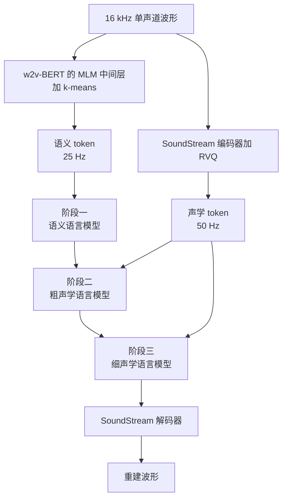

# AudioLM：音质要细、结构要长，一种离散码扛不住，于是先写语义再写声学

<!-- release-date: 2022-09-07 -->

> 本文依据 Google Research 的 **AudioLM: a Language Modeling Approach to Audio Generation**，即 arXiv:2209.03143v2、2023-07-26 修订、共 11 页。封面水印为 `arXiv:2209.03143v2 [cs.SD] 26 Jul 2023`。作者十一人：Zalán Borsos、Raphaël Marinier、Damien Vincent、Eugene Kharitonov、Olivier Pietquin、Matt Sharifi、Dominik Roblek、Olivier Teboul、David Grangier、Marco Tagliasacchi、Neil Zeghidour，单位一律写作 Google Research（PDF p. 1）。页码均指这份 11 页 PDF 本身。动笔前已核对 [arXiv 官方页](https://arxiv.org/abs/2209.03143) 与提交历史：v1 于 2022-09-07 13:40:08 UTC，v2 于 2023-07-26 03:52:36 UTC；截至 2026-09-11 核验，最新版本仍是 v2，与本地原件一致。v2 对应 IEEE/ACM TASLP 第 31 卷、2523–2533 页（DOI [10.1109/TASLP.2023.3288409](https://doi.org/10.1109/TASLP.2023.3288409)，期刊上线 2023-06-21）。全文把三件事分开写：**论文明确写了什么**（带页码）、**本文如何解释它**（凡属推算、换算或图上读数都会写明）、**外部资料补充**（会给出链接并标注）。
>
> 这是一篇技术论文，不是基模报告。它没有向公众开放权重、API 或产品接口，讲的是**把音频生成写成语言模型任务**这一套做法：混合离散化、三阶段自回归、无文本语音续写、无乐谱钢琴续写。按「该技术首次官方公开日」，`release-date` 取 **2022-09-07**（arXiv v1）。Google Research 博客 [AudioLM: a Language Modeling Approach to Audio Generation](https://research.google/blog/audiolm-a-language-modeling-approach-to-audio-generation/) 标注 October 6, 2022，晚于 arXiv v1，按手册不回写。演示页见 [项目页](https://google-research.github.io/seanet/audiolm/examples/)。

## 读之前需要的最少背景

后面会反复出现同一组零件。先说人话，再给名字。

- **Token（词元）**：模型读写时的基本小块。文本里一个 token 常对应一个子词；这里一个 token 对应一小段声音的离散编号。
- **自回归语言模型**：每次只预测下一个 token，条件是已经写出的全部历史。文本 GPT 是这样训的；AudioLM 把同一件事搬到声音上。
- **神经音频编解码器（neural audio codec）**：先把波形压成很低速率的离散码，再从码还原波形。本文用的是 SoundStream。
- **残差向量量化（Residual Vector Quantization，RVQ）**：不是一次量化完，而是一层一层量化残差。第一层抓住最粗的形状，后面各层补越来越细的误差。
- **自监督语音表示**：不靠转写，只靠音频自己的结构学特征。本文用的是 w2v-BERT：一边做对比学习，一边做掩码语言建模。
- **ABX**：测「这两个音素三元组，模型能不能听出中间那个音素不一样」。越低越好。例如 “bit” 对 “bet”。
- **ViSQOL**：用计算模型近似「听起来像不像原声」的重建质量分，越高越好。本文用的是 16 kHz 的 speech 模式。

这篇论文自己反复出现的名字只有一套：

- **语义 token（semantic tokens）**：从 w2v-BERT 中间层做 k-means 得到的粗码，负责长期结构。
- **声学 token（acoustic tokens）**：SoundStream 的 RVQ 码，负责能还原的细节。
- **粗声学 / 细声学（coarse / fine）**：把 RVQ 的前 $Q'$ 层和后 $Q-Q'$ 层拆开，分两个语言模型来写。

## 一句话先说清

2022 年的音频生成卡在一个很具体的矛盾上：**一种离散码很难同时又好听、又讲得通。**

编解码器给出的码能把波形还原得很像，但上面训出来的语言模型会开始咿呀学语；自监督语音码能抓住音素和句法，但从它还原的声音几乎没法听。WaveNet 一类波形模型在没有音素或 MIDI 强条件时，也会生成无结构的音频（PDF p. 1）。GSLM 这类「无文本 NLP」能说出像样的句子，却被锁在干净录音的单一说话人上，音质也有限（PDF p. 2）。

AudioLM 的答案不是再发明一种「两头都好」的码，而是承认这两种码各管一件事，再把语言模型拆成三段：

> **先用语义码把整段话的结构写完，再用粗声学码补上是谁、在什么样的房间里说，最后用细声学码把编解码器的压缩痕迹抹掉。**

它要证明的不是「音频也可以 next-token」，而是：**只要把「说什么」和「听起来像什么」拆开，短到 3 秒的 prompt 就能续写出听感接近真人、内容又讲得通的语音；同一套骨架换到钢琴上，也不需要乐谱。**

## 旧方案卡在哪：好听和讲得通互相拆台

音频同时活在好几层抽象上。语音有声学、音素、韵律、句法、语义；音乐有瞬时的非平稳波形，也有旋律、和声、节奏这种跨很多秒的结构（PDF p. 1）。合成的时候这些层会打架：追求波形保真，模型就容易忘掉结构；追求结构，波形又还原不回来。尤其是没有转写、没有 MIDI 这类强监督的时候。

相关工作把当时的路线收成三条，每条都缺一块（PDF p. 2）：

| 路线 | 代表 | 有的 | 缺的 |
|---|---|---|---|
| 高保真波形合成 | WaveNet、对抗声码器、扩散 | 信号质量接近真声 | 没有强条件时会变成无结构的咿呀 |
| 自监督离散单元 + 语言模型 | GSLM、「无文本 NLP」 | 能生成有句法的语音 | 音质有限，且锁在单一干净说话人 |
| 高码率编解码器 + 自回归 | Perceiver AR 建在 SoundStream 码上；Jukebox 分层音乐 | 信号质量或时间连贯性里能占一头 | 钢琴的时间结构仍可改进；Jukebox 有明显伪影 |

还有一个更硬的计算事实。标准自注意力的代价随序列长度平方增长，大约 $10^3$ 个 token 还撑得住；原始波形撑不住——16 kHz 的一秒钟已经是 16000 个采样点（PDF p. 2–3）。所以必须先把波形映射到紧凑的离散空间，再在那个空间里做语言模型，最后映射回去。图像和长视频已经这么干过；音频要补的，是找到一套**既短、又还还原得回去、又还带着长期结构**的码。

论文的判断是：现成的 tokenizer 给不出「三个都要」的单一码，但可以给两种互补的码（PDF p. 3）。

## 全景：两种 token，三个语言模型

框架只有三块，tokenizer 和 detokenizer 都是预先训好再冻住的，和语言模型解耦（PDF p. 3）：

1. **Tokenizer**：把单声道波形 $x\in\mathbb{R}^{T}$ 编成离散序列 $h=\operatorname{enc}(x)$，长度 $T'\ll T$，通常短两到三个数量级。
2. **只解码器 Transformer**：最大化 $\prod_{t=1}^{T'} p(h_t\mid h_{<t})$，推理时自回归吐 $\hat h$。
3. **Detokenizer**：$\hat x=\operatorname{dec}(\hat h)$，把码还原成波形。

真正的设计在 tokenizer 里是两路并行，语言模型里是三阶段串联：

这是根据 PDF p. 3 的 Figure 1 与 p. 5 的 Figure 2 重画的**机制示意图**，不是实测时间轴。箭头表示数据依赖，不表示墙钟耗时。默认配置下，每一个语义 token 对应阶段二的 $2Q'$ 个粗声学 token、阶段三的 $2(Q-Q')$ 个细声学 token；那个 2 来自 SoundStream 的帧率是 w2v-BERT 的两倍（PDF p. 5）。

## 声学 token：SoundStream 把波形压成每秒 50 帧的 RVQ 码

SoundStream 是一个端到端神经编解码器，低码率下明显优于 Opus、EVS 这类非神经编解码器（PDF p. 3）。卷积编码器把 16 kHz 波形映成 50 Hz 的连续嵌入，也就是每 20 ms 一帧，采样率降到原来的 $16000/50=320$ 分之一。每一帧再用 $Q$ 层残差向量量化，每层词表大小 $N$。论文给的例子是 $N=1024$、$Q=4$（PDF p. 3）：

$$
50\times 4\times \log_2 1024 = 2000\ \text{bps}
$$

波形 $x$ 于是变成码矩阵 $Y\in\{1,\ldots,N\}^{T_A\times Q}$，其中 $T_A=T/320$。卷积解码器把离散码先变回连续嵌入，再还原波形。训练用重建损失加对抗损失。

主实验里他们把 $Q$ 加到 12 层，每层词表仍是 1024，于是码率变成 6000 bps，每秒 600 个声学 token；卷积块的步幅是 $(2,4,5,8)$（PDF p. 6）。12 层再按 $Q'=4$ 切开：前 4 层给阶段二（2000 bps），后 8 层给阶段三（再加 4000 bps，凑满 6000）。Table I 显示这一步把 ViSQOL 从 3.3 提到 3.9（PDF p. 4）。

**RVQ 的层级本身就在暗示后面为什么要拆阶段。** 论文写：粗量化器恢复的是说话人身份、录音条件这类声学属性，细量化器才补波形细节（PDF p. 4）。这不是额外训出来的解耦，是残差量化的天然顺序——第一层必须先解释掉能量最大的残差。

为了让 $Q$ 层码表在语言模型里不相撞，他们把 $Y$ 按行优先（时间为主序）展平，再加一层偏移（PDF p. 4）：

$$
o_i=\bigl((i-1)\bmod Q\bigr)\cdot N
$$

第 $q$ 层的编号被平移到 $[(q-1)N,\,qN)$。展平后的序列长度是 $T_A\cdot Q$。后文省略偏移，默认编号已经错开。

## 语义 token：w2v-BERT 中间层的 k-means 编号

w2v-BERT XL 是 0.6B 参数的 Conformer，预训练目标是掩码语言建模损失加对比损失（PDF p. 3、6）。它本来可以微调去做识别或语音翻译；AudioLM 不用它的下游头，只用预训练好的表示来抓住长期结构。

具体做法（PDF p. 3–4）：

1. 取 MLM 模块的某一中间层，得到 1024 维、25 Hz（每 40 ms 一帧）的连续向量；
2. 每个维度先做成零均值、单位方差，再跑 k-means；
3. 用质心编号当语义 token。

论文特别写了一句：量化前做这步标准化，音素可分性会明显变好（PDF p. 3）。得到的序列是 $z=(z_1,\ldots,z_{T_S})\in\{1,\ldots,K\}^{T_S}$，其中 $T_S=T/640$。当 $T=16000$、$K=1024$ 时，码率是 250 bps（PDF p. 3）。这套抽取方式和 GSLM 从 HuBERT 取离散单元是同一类做法，论文自己点了这个相似（PDF p. 3）。

层号和簇数不是随便拍的。他们在 LibriSpeech dev-clean 上看 ABX、sWUGGY、sBLIMP，再加一小轮听感（PDF p. 6，Figure 3）：

- 左图扫 MLM 模块第 6 到第 9 层的未量化嵌入 ABX，第 7 层是谷底；
- 右图固定第 7 层，簇数从 256 扫到 2048。sWUGGY 几乎持平，sBLIMP 在中等簇数处略高、2048 处回落。

最终取第 7 层、$K=1024$。图上没有印出精确读数，本文不从曲线上估数字。

## Table I 把矛盾钉死

为了让两种码能放在同一张表里比，他们对两种表示都用残差向量量化后的嵌入来算 ABX：w2v-BERT 一侧用对应质心，SoundStream 一侧用量化器输出。ABX 脚本来自 Libri-Light，分数报在 LibriSpeech dev-clean 上。重建质量则是另训一个 SoundStream 解码器，从该种 token 还原 16 kHz 波形，再算 speech 模式的 ViSQOL（PDF p. 4）。

| 离散化 | 码率 | ABX 说话人内 / 跨说话人（↓） | ViSQOL（↑） |
|---|---:|---:|---:|
| 语义（w2v-BERT） | 250 bps | 6.7 / 7.6 | 1.1 |
| 语义（w2v-BERT） | 6000 bps | 5.6 / 6.2 | 1.4 |
| 声学（SoundStream） | 2000 bps | 22.4 / 28.7 | 3.3 |
| 声学（SoundStream） | 6000 bps | 17.8 / 26.6 | 3.9 |

来源：PDF p. 4，Table I。

两件事同时成立：

1. **声学码好听、但音素几乎分不清。** 6000 bps 的 ViSQOL 已经到 3.9，ABX 仍在 17.8 / 26.6。
2. **语义码音素分得很清、但还原几乎失败。** 即便把码率拉到和声学码一样的 6000 bps，ViSQOL 也只有 1.4，ABX 却能到 5.6 / 6.2。

**这就是「一种码扛不住」的全部证据。** 码率不是瓶颈——同一码率下，两边的短板换不走。语义码本来就不是为可逆合成优化的，论文在相关工作里已经把这一点说死：这类表示「很难反演，因而不能直接用于合成」（PDF p. 2）。

他们还做了一个更刺耳的对照：只在声学 token 上训一个只解码器 Transformer，用 4 秒 prompt 续写。录音条件和说话人能保住，语言内容却对不上，常常像咿呀学语（PDF p. 4）。项目页把这组样本单独标成 “Generation without semantic tokens”。**没有语义码，声学语言模型会记住音色，忘掉句子。**

所以混合离散化不是把两种码拼成一条更长的序列，而是让它们分工：语义码保证长期一致，声学码在语义码的条件下保证能听（PDF p. 3–4）。

## 分层建模：先写完结构，再写音色，最后补细节

假设是（PDF p. 4）：

- 语义 token 负责长期一致性——语音里是语言内容，音乐里是旋律和节奏；
- 声学 token 负责高质量合成——波形细节。

于是采用分层：先对整段序列建模语义 token，再用它们当条件去预测声学 token。论文给了两条理由（PDF p. 4）：

1. **条件独立。** 给定过去的语义，当前语义应当不再依赖过去的声学：

$$
p(z_t\mid z_{<t},\,y_{<t})\;\approx\;p(z_t\mid z_{<t})
$$

2. **每段序列更短。** 比起把语义和声学交错成一条序列，分阶段可以把单次注意力看到的长度压下来，训练和推理都更便宜。

三个阶段各用一个独立的只解码器 Transformer，训练时都是「看见该阶段已经写出的全部真值 token，预测下一个」（PDF p. 4）。默认语音配置 $Q=12$、$Q'=4$，于是每个语义 token 对应 8 个粗声学 token、16 个细声学 token（PDF p. 5）。

### 阶段一：语义建模

只建模 $p(z_t\mid z_{<t})$。这一段是整套系统的「大纲」：语音里是音素到句法到语义，钢琴里是局部旋律到和声节奏（PDF p. 4）。

### 阶段二：粗声学建模

在整段语义序列 $z$ 的条件下，只预测前 $Q'$ 层 RVQ（PDF p. 4）：

$$
p\bigl(y_t^{q}\mid z,\,y_{<t}^{\le Q'},\,y_t^{<q}\bigr),\qquad q\le Q'
$$

对应的训练序列把语义码全部放在最前面，然后按时间展开粗声学码：

$$
\bigl(z_1,\ldots,z_{T_S},\; y_1^{1},\ldots,y_1^{Q'},\; y_2^{1},\ldots,y_{T_A}^{Q'}\bigr)
$$

训练时第一个要预测的 token 是 $y_1^{1}$，也就是第一帧的最粗一层。展平方式仍然是行优先：同一帧先写完 $Q'$ 个粗码，再进下一帧。

### 阶段三：细声学建模

在全部粗码的条件下，预测后 $Q-Q'$ 层（PDF p. 4–5）：

$$
p\bigl(y_t^{q}\mid y^{\le Q'},\,y_{<t}^{>Q'},\,y_t^{<q}\bigr),\qquad q>Q'
$$

也就是：当前细码可以看整段粗码、过去各帧已经写出的细码、以及当前帧里更粗的那些细码。这一阶段的目标是去掉阶段二还剩的有损压缩痕迹（PDF p. 5）。

阶段二和阶段三本来可以合成一个模型。拆开是为了限制一次要处理的序列长度，并且用上另外两条条件独立（PDF p. 5）：

- 细码在给定粗码之后，不再依赖语义码，所以阶段三可以**丢掉全部语义 token**；
- 细的声学细节主要由粗码在局部决定，所以阶段三可以在**互不重叠的 3 秒切片**上跑，序列目标长度不再绑死阶段三，也可以放心地把 $Q$ 加厚来换音质。

**这三条独立假设合在一起，才是「三个模型而不是一个模型」的理由。** 不是因为 Transformer 叠三份更好看，而是因为每一条假设都删掉了一大段条件。删掉的条件就是省掉的序列长度。

### 三种推理方式

训练完之后，条件给得不同，生成形态就不同（PDF p. 5）。

**无条件生成。** 先无条件采样全部语义码 $\hat z$，再当条件去采样声学码。项目页上的样本在说话人、韵律、录音条件上都会变，但语言内容仍然有句法和语义（PDF p. 5）。

**声学生成。** 语义码 $z$ 从测试句 $x$ 里抽真值，只采样声学码。生成句的说话人会变，口说内容却跟原句转写对得上。这是后面 Table II、Table III 的实验设置，用来证明「语义码抓住了内容」（PDF p. 5）。

**续写。** 这是主应用。对短 prompt $x$ 抽出语义前缀 $z_{\le t_s}$ 和粗声学前缀 $y_{\le t_a}^{\le Q'}$，然后（PDF p. 5）：

1. 阶段一自回归写出 $\hat z_{>t_s}$；
2. 把完整语义 $(z_{\le t_s},\hat z_{>t_s})$ 和 prompt 的粗声学拼在一起，送给阶段二，采样后续粗码；
3. 阶段三在粗码上补细码；
4. prompt 的声学码和采样出的声学码一起交给 SoundStream 解码器，得到波形 $\hat x$。

语音续写用 3 秒 prompt；钢琴续写用 4 秒（PDF p. 6、9）。

这是根据 PDF p. 5 第三节 D 重画的**机制示意图**。阶段二看到的是「整段语义 + prompt 粗声学」，不是只看 prompt 语义——新内容的结构已经在阶段一写完，阶段二负责给新内容配上和 prompt 一致的声学外壳。

## 数据、模型和训练 recipe

论文用两个任务展示框架的通用性：语音续写，以及钢琴续写（PDF p. 5）。评测用的 prompt 分别来自未见过的说话人和未见过的演奏，所以续得像，就意味着泛化，而不是背训练句。

### 语音数据

所有组件——SoundStream、w2v-BERT、k-means、三个 Transformer——都在 Libri-Light 的 unlab-60k 上训，大约 60k 小时英语语音（PDF p. 5）。先前 GSLM 一类工作常用其中 6k 小时的干净子集训语言模型；AudioLM 故意走更吵、更多样的 60k 小时，并认为这降低了数据清洗成本（PDF p. 6）。

### 三个 Transformer 规格相同

每阶段都是（PDF p. 6）：

| 项 | 取值 |
|---|---|
| 层数 | 12 |
| 注意力头 | 16 |
| 嵌入维 | 1024 |
| 前馈维 | 4096 |
| Dropout | 0.1 |
| 位置编码 | T5 风格相对位置编码 |
| 每阶段参数 | 0.3B |

训练时随机裁成等效 30 秒、10 秒、3 秒，分别对应三个阶段；前两个阶段还沿用 GSLM 的做法，去掉语义 token 的连续重复（PDF p. 6）。每个阶段用 16 块 TPUv4、batch size 256，训 1M step。

推理用温度采样，三阶段温度分别是 0.6、0.8、0.6，论文说这是多样性和语义一致性之间的折中（PDF p. 6）。语音续写的 prompt 固定 3 秒。

**论文没写的几件事**（本文核对后的缺口，不是论文结论）：学习率、优化器、词表是否把语义码和声学码做成联合 embedding、连续重复到底删掉多少、SoundStream 本身的参数量。0.3B × 3 只覆盖三个语言模型；冻住的 w2v-BERT XL 另有 0.6B，编解码器大小未给。

### 钢琴数据是另一套权重

钢琴实验把 AudioLM 的**全部组件**在内部 40k 小时钢琴数据上重训，演奏水平从入门到专家，声学条件很杂，内容从音阶练习到名曲（PDF p. 9）。超参与语音相同，只有声学侧改了：3 层量化、每层词表 $2^{14}$，音质已经够好，于是**不再跑阶段三**，阶段二直接预测全部 3 层声学码（PDF p. 9）。推理时从 Maestro 数据集取 4 秒 prompt。

## 语义码里有没有「字」：用 ASR 当探针

设置是「声学生成」：语义码从原句抽取真值，只采样声学码，跑阶段二和阶段三（PDF p. 6）。如果语义码真的抓住了语言内容，生成句用 ASR 转写，应当贴近原转写。

评测集是 LibriSpeech test-clean 里 4 到 10 秒的样本，从 5.4 小时里留下 2.2 小时；每句声学生成重复三次。ASR 是 Conformer Transducer-L。对照是 GSLM 的 unit-to-speech，词表 200，来自 HuBERT，这是 GSLM 论文里重合成误差最低的一档（PDF p. 6）。

| | 原声 | SoundStream 重建 | AudioLM 声学生成 | GSLM unit-to-speech |
|---|---:|---:|---:|---:|
| CER | 0.8 | 0.9 | 3.4 | 2.9 |
| WER | 2.5 | 2.6 | 6.0 | 6.6 |

来源：PDF p. 6，Table II。

论文从这张表读出两件事（PDF p. 7）：

1. 语义内容被语义 token **完整抓住**——声学生成的转写紧跟原转写；
2. 采样 SoundStream 码再解码，转写质量仍然可用。

错误主要来自专有名词，其次是句末 token 没有出现在该出现的位置；声学生成还会合成出不同的录音环境，背景噪声也会拖累 ASR。SoundStream 重建的误差和原声几乎一样（CER 0.9 对 0.8，WER 2.6 对 2.5），所以 Table II 里 AudioLM 相对原声多出来的那些错误，主要来自「语义码 → 声学码」这一步，不是来自编解码器（PDF p. 7）。

和 GSLM 比，WER 6.0 对 6.6，CER 3.4 对 2.9，整体相近。但 GSLM 只合成单一干净音色；AudioLM 在变说话人、变房间的同时把内容保住了。这是同一张表里最容易漏掉的不对称。

## 声学码里有没有「人」：说话人分类器

反过来的假设：说话人身份和录音条件主要在声学 token 里（PDF p. 7）。

定性上，同一组语义码反复采样声学码，会得到很多不同的说话人和房间。定量上，他们训了一个卷积说话人分类器，输入是 log-mel（25 ms 窗、10 ms 跳、64 个 mel 箱），裁成 1 秒；六块卷积，通道 $[64,128,256,256,512,512]$，沿时间和频率用 $3\times 1$ 和 $1\times 3$ 核，ReLU 加批归一化，通道加倍时两边做 stride 2 的 max pool。超过 1 秒的序列，推理时用 1 秒窗、250 ms 跳，再把预测聚合。训练数据是 LibriSpeech train-clean-100 并上 test-clean 的未压缩原声，共 291 个说话人，90% / 10% 划分。分类器在划分出的评估集上几乎完美，而且对 SoundStream 有损压缩仍然稳健（PDF p. 7）。

| | SoundStream 重建 | 声学生成（语义真值） | 续写（3 秒 prompt） |
|---|---:|---:|---:|
| 说话人分类准确率 | 100.0% | 3.2% | 92.6% |

来源：PDF p. 6，Table III。续写那一列在 PDF p. 8 才解释：3 秒 prompt 续 7 秒，分类器只打续写段，不含 prompt。

3.2% 要连着分母读。随机猜是 $100/291\approx 0.3\%$（PDF p. 7 写成 0.3%）。3.2% 高于随机，但远远谈不上「认出同一个人」——语义码几乎不携带说话人。92.6% 则说明：prompt 里同时给了语义前缀和声学前缀之后，续写会把说话人保住。

论文还加了两条**主观观察**，不是分类器数字（PDF p. 7）：同一组语义码采样出的不同句子，节奏和语调只有很小变化，说明韵律主要在语义码里，声学码有一点贡献；采样出的录音条件则差异很大，说明房间和噪声主要在声学码里。

把 Table II 和 Table III 并在一起，分工被实验钉住了：

| | 主要在语义码 | 主要在声学码 |
|---|---|---|
| 口说内容 | 是（WER 6.0 仍可读） | 否 |
| 说话人 | 否（3.2%） | 是（续写 92.6%） |
| 录音条件 | 否 | 是（观察） |
| 韵律 | 主要是 | 有少量贡献（观察） |

「是 / 否」这一列是本文按两张表整理的；韵律和录音条件那两行，论文自己也标成主观评估。

## 语言模型有没有学到词法和句法

语义码抓住内容，还不等于语言模型在这些码上学会了「哪一个音更像词、哪一句更像合法英文」。他们用 Zero Resource Challenge 2021 的两个零样本指标（PDF p. 7）：

- **sWUGGY**：一对真词和假词（如 brick / blick），模型有没有把更高的概率分给真词。开发集 10000 对，四种音色合成；另报一个只保留 LibriSpeech 词表内真词的 in-vocab 子集。
- **sBLIMP**：一对合法 / 非法句（如 the dogs sleep / the dog sleep），模型有没有把更高概率分给合法句。开发集 6300 对，同样四种音色。

判定方式是比较对数似然。sBLIMP 的正例平均更短，会偏向打出更高成功率，所以所有实验都按序列长度把对数似然归一化（PDF p. 7）。脚注给了不归一化的对照：AudioLM 的 sBLIMP 会变成 67.5，超过音素 topline 的 66.8（PDF p. 8）。

对照分成三组：有文本监督的 topline、非因果模型、因果模型。AudioLM 是因果的，只有因果组才和它同一生成设定。

| 模型 | sWUGGY 全部 | sWUGGY in-vocab | sBLIMP |
|---|---:|---:|---:|
| 强制对齐 topline（有文本） | 92.2 | — | 63.7 |
| 音素 topline（有文本） | 97.9 | — | 66.8 |
| BERT baseline（非因果） | 67.7 | 75.6 | 56.1 |
| HuBERT-only（非因果） | 70.9 | 79.8 | 59.5 |
| Harwath 等（非因果） | 67.6 | 75.4 | 56.7 |
| CPC-BERT（非因果） | — | 80.0 | 59.9 |
| van Niekerk 等（因果） | 64.3 | 72.3 | 54.0 |
| GSLM（因果） | — | 68.7 | 57.1 |
| **AudioLM（因果）** | **71.5** | **83.7** | **64.7** |

来源：PDF p. 8，Table IV。加粗是论文在「无文本监督」里标的最好分数。

读法（PDF p. 8）：

- 无文本监督里，AudioLM 的两个 sWUGGY 切分都最高；sBLIMP 相对此前最好的 CPC-BERT（59.9）相对提升 8%。
- sBLIMP 64.7 甚至超过了用强制对齐音素转写训出来的监督 topline 63.7。
- 和同为因果、同为无文本的 GSLM 比，in-vocab sWUGGY 83.7 对 68.7，sBLIMP 64.7 对 57.1，差距比「和非因果 SOTA 比」更大。

这些分数测的是阶段一的语义语言模型，不经过声学生成。它回答的是「离散语义码上的语言建模有没有学到词法和句法」，不是「合成语音好不好听」。

## 3 秒 prompt 能不能续成同一个人

词法句法加上说话人分类，才构成「听起来像续写」的两半。做法是：从 LibriSpeech test-clean 里 4 到 10 秒的句子裁 3 秒 prompt，每个 prompt 生成三条 7 秒续写，分类器只打续写段（PDF p. 8）。Table III 最后一列 92.6%，论文写成「高于 92%」（PDF p. 8）。

语义码几乎没有说话人信息，但 prompt 同时提供语义前缀和声学前缀之后，身份被保住了。这和阶段二的设计一致：新内容的语义由阶段一自由写，声学外壳由 prompt 的粗码来锚定。

## 人耳分不清，分类器分得清

说话人准确率不能覆盖「句子通不通、接得自然不自然、有没有合成痕迹」。他们做了一轮主观测试（PDF p. 8）：

- 从 LibriSpeech test-clean 里至少 10 秒的句子随机抽 100 条，全部截成恰好 10 秒，避免 padding；
- 一半是原声，但先用 SoundStream 压到和 AudioLM 相同的码率，压缩痕迹不能当线索；
- 另一半取开头 3 秒当 prompt，生成恰好 7 秒续写，拼回 10 秒；
- 10 名通过英语能力筛查的评分人；明确告知每条的前 3 秒是真人，判断只看 3 秒之后；
- 共 1000 个评分。

任务同时考三件事：生成内容的语义和句法、续写和 prompt 在说话人 / 韵律 / 录音条件上是否连贯、有没有生成伪影（PDF p. 8）。

正确标出「原声还是合成」的成功率是 **51.2%**。二项检验相对纯随机的 50%，$p=0.23$，**没有统计显著差别**（PDF p. 8）。

这个数字很容易被读成「AudioLM 已经过图灵测试」。论文自己的口径更窄：在**非配对、固定 10 秒、前 3 秒已知为真**的设置下，平均听者分不出短语音续写和真声。它没有说长样本、配对 AB 测、或专家听音师也分不出。

正因为人耳不好使，他们才训了一个检测器（PDF p. 8–9）。网络结构和说话人分类器相同，改成二分类：原声（同样先经过 SoundStream）对 AudioLM 续写（不含 prompt）。训练数据来自 LibriSpeech train-clean-100，1 秒裁剪；长序列的推理方式和说话人分类器相同。平衡评估集上准确率 **98.6%**（PDF p. 9）。

论文由此写下那句对照：**对人耳几乎不可分，对一个简单音频分类器却非常容易**（PDF p. 9）。两个数字必须一起读。51.2% 说的是误用风险真实存在；98.6% 说的是至少对**这一版 AudioLM 自己的续写**，检测是可行的。它不是通用深度伪造检测器——论文没有在别的合成系统上测过。

## 钢琴：没有乐谱，语义码仍然在管结构

语音上的解耦（内容 vs 说话人）会让人误以为语义 / 声学只对语言成立。钢琴实验就是用来拆这个误解的（PDF p. 9）。

对照很干净：同一套 4 秒 Maestro prompt，一边是只在声学 token 上训的模型，一边是完整 AudioLM。两边音质同样高；只有完整框架的续写在旋律和时间结构上站得住。项目页把两组样本并排给出。

主观测试：10 名评分人，15 对 20 秒续写，同一 prompt。评分人在 **83.3%** 的配对里更喜欢 AudioLM（PDF p. 9）。

论文把这张偏好表读成一条比语音更强的主张（PDF p. 9）：

> 分层建模从语义到声学，不仅通过把语言内容和说话人身份分开而有利于语音生成，更一般地，通过显式解耦长期结构和局部声学细节，改进了音频生成。

**钢琴实验没有客观指标。** 没有等价于 WER、ABX 或 sBLIMP 的旋律 / 和声正确率，只有 15 对、10 人的偏好。证据强度和语音那一侧不对称。这是本文的判断，不是论文的自我限制声明。

## 论文自己划的边界

结论和第 VI 节把能做的和该担心的摊开了（PDF p. 9）。

**结论里点名的后续方向**，论文做了鼓励、没有做实验：多语言语音、复调音乐、一般音频事件；以及把 AudioLM 接到编码器—解码器里，做有条件任务，例如 TTS、语音到语音翻译（PDF p. 9）。

**更广泛影响**写得比很多 2022 年的生成论文更具体（PDF p. 9）：

- 建模语音时，AudioLM 继承文本语言模型的全部问题，包括反映底层数据里的社会偏见；详细讨论指向 PaLM 那篇；
- 训练数据里代表性不足的群体，续写可能在口音、方言上和 prompt 不一致；
- 短语音续写还能保住说话人和韵律，可能被用来欺骗生物识别，或假冒特定说话人。

缓解手段就是第 IV-H 节那个 98.6% 的分类器。论文把它称作「负责任 AI 实践方向上的重要一步」，没有说它已经够用。

**实验设置里已经能看见、但正文没有当成限制来写的**，本文核对后补在这里：

1. 语音只覆盖英语有声书域（Libri-Light / LibriSpeech）；钢琴是内部数据加 Maestro prompt。
2. 主观测只覆盖恰好 10 秒、非配对、前 3 秒已知为真；没有长样本、没有配对 AB、没有专家听音。
3. 续写质量没有 WER——Table II 的 WER 是声学生成（语义真值），不是 3 秒续写。
4. 没有推理延迟、吞吐、FLOPs，也没有和 WaveNet / Jukebox / Perceiver AR 的同任务自动指标并排。
5. 检测器只针对本模型、本码率、SoundStream 压缩后的对照；没有跨模型、跨码率。
6. 语义 6000 bps 那一行怎么从 25 Hz 的 k-means 凑到 6000 bps，正文没有写清实现。
7. 三个语言模型如何共享或拼接词表，没有写。

## 外部补充：论文之后，这套分层被接到了哪

**以下全部是外部资料，不是 AudioLM 论文写的。**

- **MusicLM**（[arXiv:2301.11325](https://arxiv.org/abs/2301.11325)，2023-01-26）把 AudioLM 的语义 / 声学分层接到文本条件上，用 MuLan 做音乐—文本联合嵌入，生成数分钟的 24 kHz 音乐。项目页写明 “Building on AudioLM”。AudioLM 论文结论里「接到编码器—解码器做有条件任务」这句话，MusicLM 是同一实验室几个月后交出的实例。本文不把 MusicLM 的分数写进来。
- **[VALL-E](/reports/Microsoft/VALL-E)** 沿用「神经 codec 上的语言建模」，但任务是 TTS：内容条件是音素，不是 w2v-BERT 语义码。
- **[Moshi](/reports/Kyutai/Moshi)** 把语义和声学收进同一个生成模型，并明确拿 AudioLM 的三阶段当对照。
- **[DAC](/reports/Descript/DAC)** 讨论 RVQ 加量化器 dropout 之后码会按从粗到细排列，并点名 AudioLM / MusicLM 这类分层音频语言模型是下游。
- Google 博客（2022-10-06）补充了论文没写的发布态度：工作仅供研究，当时没有更广泛放出的计划；并提到未来可能探索音频水印。分类器的 51.2% 和 98.6% 与论文一致。
- 官方没有随论文开源训练代码或权重。演示只在 [项目页](https://google-research.github.io/seanet/audiolm/examples/)。

今天的音频语言模型默认行为、默认 tokenizer、默认是否分阶段，已经和 2022 年这份论文不一样。两边不需要对齐。本篇只负责回答 v2 写了什么。

## 可迁移启发

### 1. 互相冲突的目标，先拆表示，再拆模型

Table I 是全文的发动机：同一码率下，语义码和声学码的短板换不走。AudioLM 没有去训一个「ViSQOL 和 ABX 都第一」的 tokenizer，而是让每个 tokenizer 做它已经能做的事，把冲突上交给生成顺序。

可迁移的问法是：你的系统是不是在强迫一个表示同时当索引又当像素？若两个指标在同一张表上对打，先分通道，再分层预测，往往比再加大码率有效。

### 2. 条件独立假设要能删掉序列，而不是只写在引言里

三个阶段各自删掉一大段条件：语义不看声学、细声学不看语义、细声学只看局部。每一条都直接变成更短的 Transformer 输入，以及阶段三那种按 3 秒切片扩长度的能力。

如果分层只换了模块名字、条件一个没删，序列长度就不会掉，分层就是空的。值得问：**这一层的独立假设，到底让模型少看了哪些 token？**

### 3. RVQ 的残差顺序，可以直接当成生成顺序

粗层先解释能量最大的残差，于是说话人、房间落在前几层，细节落在后几层。AudioLM 没有另训一个「内容编码器 / 音色编码器」，它借用了量化器已经学到的顺序。阶段二 / 阶段三的切分 $Q'=4$，就是把这个顺序写成了两个语言模型的分界。

任何 RVQ / 多码本离散化，在上面再接生成模型之前，都值得先做一次 Table I 式的探针：单独用前几层能恢复什么、后几层又补上什么。

### 4. 冻住 tokenizer，让语言模型只做语言建模

SoundStream 和 w2v-BERT 预先训好再冻住，「解耦 tokenizer 和语言模型，简化训练」（PDF p. 3）。代价是两端不能联合优化，语义码的不可逆性也无法被生成目标反哺。收益是：换数据域（语音 → 钢琴）时，可以整套重训 tokenizer；换生成目标时，不必重训 0.6B 的 w2v-BERT。

这是 2022 年能把实验跑起来的工程选择，不是一条永远正确的原则。后来不少工作会把 codec 和 LM 联合训，或把语义、声学收进同一个模型——那是在这条 freeze 边界之外长出来的。

### 5. 「人分不出」和「机器分得出」可以同时为真，必须同时做

51.2% 和 98.6% 不是互相取消的结果。前者说明误用面真实，后者说明至少对这一版模型，检测面也真实。生成论文如果只报听感 MOS、不报可检测性，等于只写了能力的一半。反过来，只报检测准确率、不报听感，也会让人低估滥用风险。

检测器的边界同样要写清：白盒、同分布、同压缩。把它说成通用鉴伪，是在论文没做的方向上加戏。

### 6. 通用性要用「换域、不换骨架」来证明，而不是用更大的语音表

钢琴实验几乎没有改超参，只改了 RVQ 层数和词表，并且因为 3 层已经够好就关掉阶段三。骨架能在无文本语音和无乐谱钢琴之间共用，这件事本身比 83.3% 的偏好数字更有迁移价值：分层的对象是「结构 vs 细节」，不是「音素 vs 音色」。

## 关键词回看

- **混合离散化（hybrid tokenization）**：语义码抓长期结构，声学码抓可逆细节，不强迫一种码两头都好。
- **语义 token**：w2v-BERT MLM 第 7 层、25 Hz、k-means $K=1024$，约 250 bps；音素可分、不可逆。
- **声学 token**：SoundStream RVQ，50 Hz；主实验 12 层 × 1024，6000 bps，每秒 600 个码。
- **RVQ**：残差向量量化。粗层先走，细层补残差；AudioLM 把这个顺序写成阶段二 / 阶段三。
- **条件独立**：给定过去语义，当前语义不再看声学；给定粗声学，细声学不再看语义。
- **三阶段只解码器 Transformer**：语义 → 粗声学 → 细声学，每阶段 0.3B，T5 相对位置编码。
- **声学生成**：语义码取真值，只采样声学。用来证明语义码抓住内容（WER 6.0）。
- **续写**：3 秒语音或 4 秒钢琴 prompt，先续语义再续声学。说话人分类 92.6%。
- **sWUGGY / sBLIMP**：零样本文法探针。AudioLM 无文本监督下分别到 71.5 / 83.7 和 64.7。
- **ABX / ViSQOL**：Table I 的两根轴。一个测音素可分，一个测重建听感，两者对打。

## 最后的判断

AudioLM 的贡献不是「音频也能 GPT」。2021 年的 GSLM 已经在离散语音单元上做过语言模型。它真正做的是把一个被当成 tokenizer 问题的矛盾，改写成一个**生成顺序问题**：

- Table I 证明一种码不能同时好听和可分；
- 条件独立假设把这个矛盾翻译成三个更短的序列；
- RVQ 的残差顺序给了粗 / 细切分一个不必另训的依据；
- 语音上的 WER、说话人分类、sWUGGY / sBLIMP、51.2% 听感，和钢琴上的 83.3% 偏好，分别支撑「内容在语义、身份在声学、结构在分层」这三句话。

它的边界同样清楚：英语有声书、内部钢琴、10 秒非配对听感、续写没有 WER、检测器只针对自己、没有延迟数字、没有开源。51.2% 说明短续写已经跨过普通人耳的阈值；98.6% 说明至少这一版还可以被抓住。两件事在 2022 年同时成立，后面整条音频生成线都是在这条阈值之上做条件和效率。

如果只记一句话，可以记：

> **当两个指标在同一张表上对打时，不要再找一种两头都好的码。让一种码写大纲，另一种码写音色，生成顺序比码本形状更重要。**

## 资料与阅读边界

- **原始依据**：本地 `papers/Google/AudioLM.pdf`，**AudioLM: a Language Modeling Approach to Audio Generation**，arXiv:2209.03143v2，共 11 页（正文与结论约 9 页、参考文献 2 页）。PDF 内嵌水印 `arXiv:2209.03143v2 [cs.SD] 26 Jul 2023`。本文所有页码指这份 PDF 的页码。
- **版本核验**：[arXiv:2209.03143](https://arxiv.org/abs/2209.03143)。提交历史两版：v1 于 2022-09-07 13:40:08 UTC（1,183 KB），v2 于 2023-07-26 03:52:36 UTC（375 KB）。**截至 2026-09-11 核验，最新版本仍是 v2，与本地原件一致，无需替换。** 本文按 v2 写，没有逐页对照 v1 与 v2 的文字差。
- **正式发表**：IEEE/ACM Transactions on Audio, Speech, and Language Processing，第 31 卷，2523–2533 页，期刊上线 2023-06-21，DOI [10.1109/TASLP.2023.3288409](https://doi.org/10.1109/TASLP.2023.3288409)。本地这份是 11 页 arXiv v2，与 TASLP 页数（2523 到 2533 共 11 页）一致。本文没有逐页比对 IEEE 正式版 PDF 与 arXiv v2。
- **`release-date` 取 2022-09-07**。理由：AudioLM 没有对外提供的模型、API 或产品，按手册取该技术首次官方公开日。已核查渠道里最早的公开事件是 arXiv v1（2022-09-07 13:40:08 UTC）。**为什么不是其他候选日**：① Google Research 博客标注 October 6, 2022，晚于 v1；② 项目页在 2022-09-08 已有公开传播记录，不早于 v1；③ TASLP 上线 2023-06-21 与 arXiv v2（2023-07-26）都是后续事件，不回写；④ Hugging Face `createdAt` 按手册禁用。
- **演示与博客**（外部，已在正文标注）：[项目页](https://google-research.github.io/seanet/audiolm/examples/)；[Google Research 博客，2022-10-06](https://research.google/blog/audiolm-a-language-modeling-approach-to-audio-generation/)。博客中的 51.2% 与 98.6% 与论文一致；「暂不更广泛放出」和「未来可能做音频水印」只出现在博客，不是论文正文。
- **外部补充清单**（均已在正文中标注，不与论文内容混用）：MusicLM [arXiv:2301.11325](https://arxiv.org/abs/2301.11325) 及其[项目页](https://google-research.github.io/seanet/musiclm/musicfx/)；后作见 [VALL-E](/reports/Microsoft/VALL-E)、[Moshi](/reports/Kyutai/Moshi)、[DAC](/reports/Descript/DAC)。
- **未公开 / 无法核实的缺口**：三个语言模型的优化器与学习率、语义码与声学码的词表拼接方式、语义 6000 bps 那一行的具体量化实现、SoundStream 参数量、连续重复语义码删了多少、续写本身的 WER、钢琴的客观结构指标、检测器的跨模型泛化、推理延迟与训练墙钟、v1 与 v2 的逐句差异、IEEE 正式版与 arXiv v2 的逐页差异。
- **跨篇参考**：VALL-E 把同一套 codec 语言建模改成有音素条件的 TTS；Moshi 把语义和声学收进同一个生成模型，并用 AudioLM 三阶段当对照；DAC 从 tokenizer 一侧解释 RVQ 为何天然适合粗到细的分层生成。这几处 AudioLM 论文本身都没有展开。
