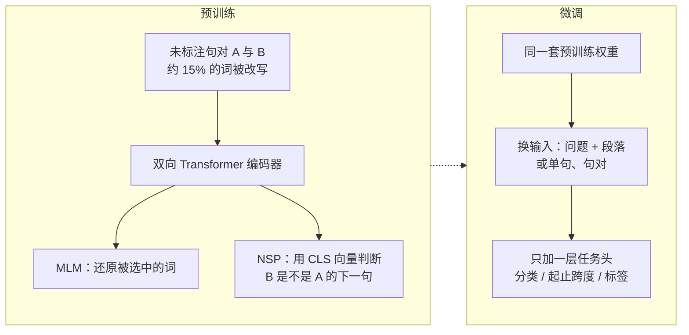
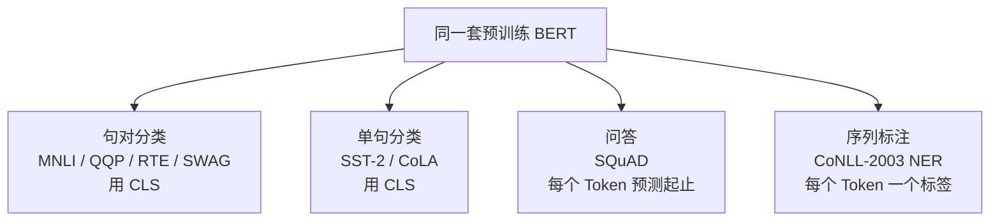
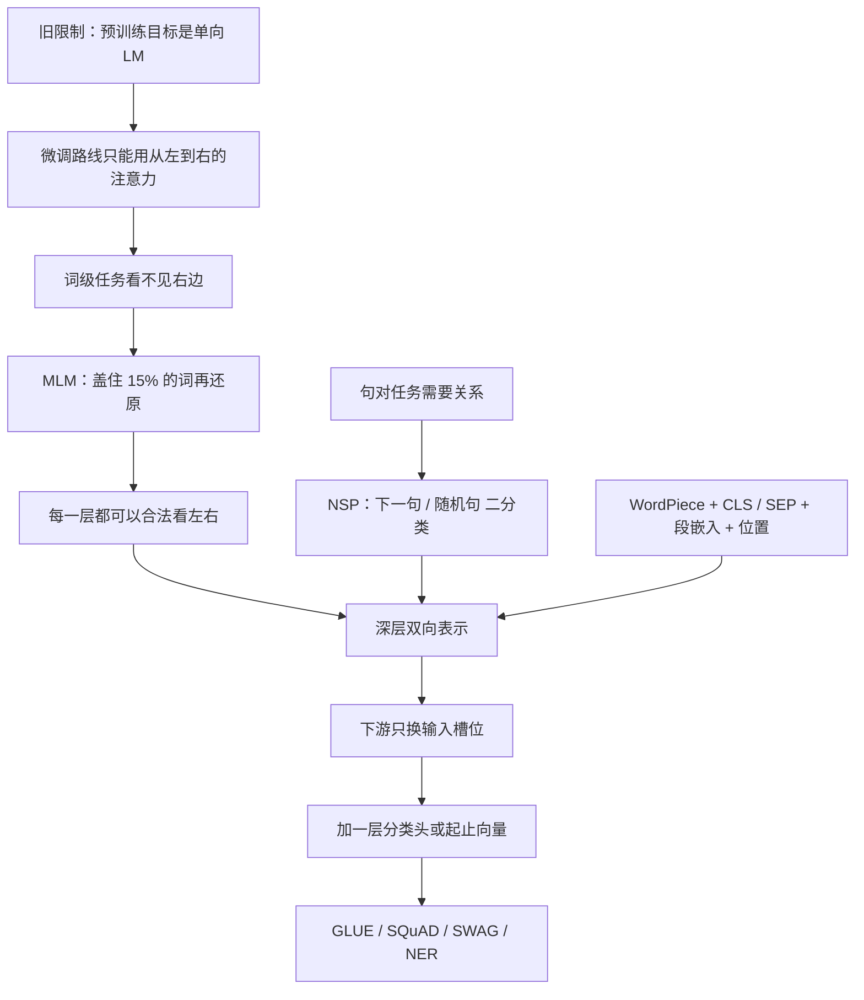

# BERT：双向预训练之后，微调为什么只需要再加一层

<!-- release-date: 2018-10-31 -->

> 本文依据 Google AI Language 的 **BERT: Pre-training of Deep Bidirectional Transformers for Language Understanding**，即 arXiv:1810.04805v2（2019-05-24），共 16 页。截至核验 arXiv 最新仍是 v2。页码均指这份 PDF。全文把三件事分开标注：**论文明确写了什么**、**我们如何解释它**、**哪些是外部资料补充**。

## 阅读前先认识几个词

这篇论文的门槛不高，但后面会反复用到同一组概念。先说人话，再给名字。

- **Token（词元）**：模型读写文本时的最小单位。一个英文单词可能被切成一块，也可能被切成 `play` 和 `##ing` 两块。
- **WordPiece**：一种把词切成子词的方法。词表里没有的长词，就拆成词表里有的小块，前面加 `##` 表示「这是后半截」。
- **自注意力（self-attention）**：序列里每个位置都去问「我该重点看哪些位置」。双向注意力允许看左右两边；从左到右的注意力只允许看自己左边。
- **预训练（pre-training）**：先在大量无标注文本上训练一个通用模型，让它学会语言本身。
- **微调（fine-tuning）**：把预训练好的参数拿来当起点，用下游任务的少量标注数据继续训练。
- **特征式（feature-based）**：预训练模型冻住，只把它的输出当额外特征，接到另一个任务专用网络上。ELMo 走这条路。
- **完形填空（Cloze）**：把句子里的词挖掉，根据上下文猜回去。BERT 的掩码语言模型就是把这件事做成预训练目标。

这篇论文自己反复出现的五个专有名字是：

- **BERT（Bidirectional Encoder Representations from Transformers）**：用 Transformer 编码器做深层双向预训练的语言表示模型。
- **MLM（Masked Language Model，掩码语言模型）**：随机盖住一些词，让模型根据左右上下文还原它们。
- **NSP（Next Sentence Prediction，下一句预测）**：判断第二段文本是不是第一段在原文里的下一句。
- **BERT_BASE / BERT_LARGE**：论文主要报告的两个规格，110M 与 340M 参数。
- **[CLS] / [SEP] / [MASK]**：三个特殊符号。`[CLS]` 放在序列最前面，用来做整句分类；`[SEP]` 切开两段文本；`[MASK]` 是预训练时盖住词的占位符。

## 一句话先说清

BERT 不是「又一个更大的语言模型」。

它要解决的矛盾更具体：当时最好的微调方案（OpenAI GPT）在预训练时只准每个词看自己左边。句子级任务已经吃亏，词级任务更吃亏——问答要同时看问题和段落，命名实体要同时看前后词。论文认为，**单向这个限制，把预训练表示的能力卡住了**（PDF p. 1）。

BERT 的回答是两步：

1. 用 **MLM** 躲开「自己看见自己」的作弊路径，让每一层都能同时吃左右上下文；
2. 用 **NSP** 让模型额外学会两段文本之间的关系。

因为表示本身已经是深层双向的，下游任务不再需要为问答、推理、分类各做一套复杂网络。论文的原话是：预训练好的 BERT 只要再加一个输出层，就可以微调成各种任务的先进模型，不必对网络结构做实质改动（PDF p. 1）。

所以这篇最值得记住的，不是某个新注意力公式，而是一种后来被整个基模时代沿用的训练结构：

> **先在无标注文本上把「读懂」这件事一次做贵、做深；下游任务只负责把读懂的结果接到自己的标签上。**

## 先看全景：同一套 BERT，预训练和微调几乎同构

论文 Figure 1 把整套方法画成左右两半（PDF p. 3）。左边是预训练，右边是微调。中间那条虚线的意思是：**除了最上面的输出层，两边用的是同一套网络。**



这张图是机制示意，根据 PDF p. 3 Figure 1 重画，不代表实测时间。图里预训练画的是「句对 + 掩码」，微调画的是问答：问题走句子 A 的段嵌入，段落走句子 B 的段嵌入，输出变成答案的起止位置。论文强调两点（PDF p. 3）：

- 不同下游任务都从**同一份**预训练参数初始化，但每个任务会得到一份**各自微调过的**模型；
- 微调时**所有参数都更新**，不是只训顶上那一层。

两个主要规格写在第 3 节（PDF p. 3）：

| 模型 | 层数 $L$ | 隐层 $H$ | 注意力头 $A$ | 前馈宽度 | 参数量 |
|---|---:|---:|---:|---:|---:|
| BERT_BASE | 12 | 768 | 12 | 3072 | 110M |
| BERT_LARGE | 24 | 1024 | 16 | 4096 | 340M |

前馈宽度一律取 $4H$（PDF p. 3 脚注 3）。BERT_BASE 的尺寸是故意对齐 OpenAI GPT 的，方便比的是注意力方向，而不是参数量（PDF p. 3）。

## 第一层问题：单向预训练到底卡在哪

### 旧问题一：从左往右读，右边的证据用不上

先看一个不需要任何新名词的例子。

句子是 `I accessed the bank account`。要理解这里的 `bank` 是「银行」而不是「河岸」，真正有用的词是后面的 `account`。

从左到右的语言模型在预测或编码 `bank` 时，只看得到 `I accessed the`。右边那半句要等到以后才出现。论文把 OpenAI GPT 的限制写得很具体：Transformer 的自注意力里，每个词只能看它左边的词（PDF p. 1）。

这对两类任务伤害不一样：

- **句子级任务**（推理、释义）：整句意思被截成「只能往左看」，已经次优；
- **词级任务**（问答、命名实体）：每个位置都需要左右两边，单向几乎是在残缺信息上做决定。

论文认为第二种更严重（PDF p. 1）。问答里，问题在前、段落在后，答案词必须同时看见问题和自己周围的段落。

### 旧问题二：不是没有人做过「两边都看」，而是看得不够深

2018 年已经有两条成熟路线，论文把它们放在第 2 节（PDF p. 1–2）。

**特征式**，代表是 ELMo。它分别训练一个从左到右的语言模型和一个从右到左的语言模型，再把两边的向量拼起来，当作下游专用网络的额外特征（PDF p. 2）。它是双向的，但论文称之为**浅层拼接**：左右两个模型各自独立训练，并没有在每一层里把两边的信息融合（PDF p. 2）。

**微调式**，代表是 OpenAI GPT。它几乎不加任务专用参数，把预训练好的 Transformer 整网拿去微调（PDF p. 1）。结构已经很接近后来大家熟悉的「预训练加微调」，但它的预训练目标仍是从左到右的语言模型，所以表示本身是单向的。

两条路共享同一个预训练目标：单向语言模型（PDF p. 1）。论文的判断是：这个目标限制了微调路线能用的网络结构，也限制了预训练表示的上限（PDF p. 1）。

**我们如何解释它。** 可以把 ELMo 想成两个人各写一份读书笔记，最后把两份笔记订在一起；BERT 想成同一个人从第一页开始就可以前后翻着读。前者左右信息要到最后才见面，后者从第一层就开始见面。论文 Figure 3 把三种结构画在一起：BERT 的箭头左右都连，GPT 的箭头只朝左，ELMo 是两列独立的 LSTM 在顶上拼接（PDF p. 13）。三种里，只有 BERT 的表示在**每一层**都同时由左右上下文决定（PDF p. 13）。

### 旧问题三：不能把「两边都看」直接套进普通语言模型

一个很自然的念头是：既然双向更强，把语言模型的条件从「左边」改成「左右两边」不就行了？

论文明确说不行。标准条件语言模型只能从左训到右，或从右训到左。如果每一层都允许双向条件，目标词会在多层网络里间接「看见自己」，模型就可以走捷径，把要预测的词复制出来（PDF p. 4）。

**我们如何解释它。** 设要预测位置 $i$ 的词。第 1 层里，位置 $i$ 可以注意位置 $j$，位置 $j$ 也可以注意位置 $i$。到了第 2 层，位置 $i$ 的向量里已经混进了自己原来的内容。再让模型「根据上下文预测位置 $i$」，答案已经漏在输入里。所以双向不是把掩码去掉就得到的，必须先把目标词从输入里拿掉。

这就是 MLM 出现的原因。论文说它受 Taylor 1953 年 Cloze 任务的启发（PDF p. 1）。

## 相关工作里真正要带走的，是两条路线的分界

第 2 节不是一份参考文献清单。它在为 BERT 的设计权做铺垫。

特征式这条线从词向量讲起：Brown 等人的类别 n-gram、Mikolov 的 word2vec、Pennington 的 GloVe，再到句子向量、段落向量（PDF p. 2）。ELMo 把「一个词一个向量」推进到「同一个词在不同句子里向量不同」，并在问答、情感、命名实体上刷新了当时的先进结果（PDF p. 2）。Melamud 等人的 context2vec 也用左右上下文预测中间词，但和 ELMo 一样是特征式，不是深层双向（PDF p. 2）。

微调式这条线更年轻。早期只预训练词嵌入；后来 Dai 和 Le、ULMFiT（Howard 和 Ruder）、OpenAI GPT 开始预训练整段编码器，再拿到下游任务上微调（PDF p. 2）。好处是从零学习的参数很少。GPT 因此在 GLUE 的许多句子级任务上拿到了此前的先进结果（PDF p. 2）。

还有第三条旁路：从有监督的大数据集做迁移，比如自然语言推理和机器翻译；计算机视觉里则是 ImageNet 预训练再微调（PDF p. 3）。BERT 没有走有监督迁移，它要证明的是：**无监督的深层双向预训练，已经足够把任务专用架构压到一层。**

论文自己的三个贡献写在引言末尾（PDF p. 2）：

1. 双向预训练对语言表示很重要。GPT 用单向语言模型；ELMo 用两个独立单向模型的浅层拼接；BERT 用 MLM 做成深层双向。
2. 预训练表示减少了对大量手工任务架构的需求。BERT 是第一个在大批句子级和词级任务上都靠微调拿到先进结果的表示模型。
3. 十一项 NLP 任务刷新先进结果。代码和预训练模型放在 `https://github.com/google-research/bert`。

## 核心设计一：一个编码器，三种相加的输入

### 架构几乎就是 Transformer 编码器

BERT 的主体是多层双向 Transformer 编码器，实现基于 Vaswani 等人 2017 年的原版，以及 `tensor2tensor` 库（PDF p. 3）。论文自己说用法已经很常见、实现几乎和原版一样，所以不重复讲注意力公式，让读者去看原论文和 *The Annotated Transformer*（PDF p. 3）。

脚注 4 补了一句术语：文献里常把双向 Transformer 叫「Transformer 编码器」，把只看左边的版本叫「Transformer 解码器」，因为后者可以用来生成文本（PDF p. 4）。BERT 是编码器。它不做从左到右逐词生成，它做的是给整段输入一次算出每个位置的表示。

和 GPT 的关键差别只有注意力掩码：BERT 的每个词可以看全序列，GPT 的每个词只能看左边（PDF p. 3）。尺寸对齐之后，消融时就可以问：成绩差来自「能不能看见右边」，而不是来自「谁的层数更多」。

### 输入必须能表示单句，也能表示句对

下游任务有的吃一句（情感分类），有的吃两句（推理、问答）。论文把输入设计成「一段 Token 序列里塞进一句或两句」（PDF p. 4）。这里的「句子」不是语言学上的句子，可以是任意连续文本跨度；「序列」才是送进 BERT 的那一串 Token（PDF p. 4）。

具体规则（PDF p. 4–5）：

1. 用 WordPiece 嵌入，词表 30,000。
2. 每个序列第一个 Token 永远是 `[CLS]`。它对应的最终隐向量 $C \in \mathbb{R}^{H}$ 当作整句的汇总，专门给分类任务用。
3. 句对打包进同一序列，中间和末尾放 `[SEP]`。
4. 另外给每个 Token 加一段可学习的段嵌入：属于句子 A 还是句子 B。
5. 再加位置嵌入。

于是一个 Token 的输入向量是三项之和。论文 Figure 2 用 `my dog is cute [SEP] he likes play ##ing` 把这件事画出来（PDF p. 5）：

$$
E_i = E_{\text{token}}(x_i) + E_{\text{segment}}(s_i) + E_{\text{position}}(i)
$$

这是按 Figure 2 与第 3 节正文重建的写法，论文没有把它印成编号公式。图里 `playing` 被切成 `play` 和 `##ing`，位置下标从 0 编到 10，句子 A 全是 $E_A$，句子 B 全是 $E_B$（PDF p. 5）。

附录后来写：预训练时 90% 的步用长度 128，剩下 10% 用长度 512，「来学习位置嵌入」（PDF p. 13）。所以位置编码是可学习的，最大长度 512。论文没有把它和 Transformer 原论文的正弦位置编码做对比，我们也不补。

**对自己项目的用处。** 这套输入的要点不是三个嵌入本身，而是：**预训练阶段就把「单句 / 句对」这一种接口练会。** 微调时，释义的两句、推理的前提和假设、问答的问题和段落，都只是把 A、B 两个槽位换上不同内容（PDF p. 5）。接口稳定，任务头才能薄。

## 核心设计二：MLM，让双向合法

### 旧问题

上一节已经说了：双向注意力加上「预测看见的词」，模型会作弊。

### 新设计

论文的做法非常直：随机盖住一部分输入 Token，再预测这些被盖住的词，称为 masked LM，也就是文献里的 Cloze（PDF p. 4）。被盖住位置的最终隐向量 $T_i$ 送进词表上的 softmax，和普通语言模型一样；区别是**只预测被选中的位置，不重建整句**（PDF p. 4）。这一点和去噪自编码器不同。

所有实验里，每个序列随机盖住 15% 的 WordPiece Token（PDF p. 4）。

### 工作机制：15%，以及 80 / 10 / 10

如果每次都换成 `[MASK]`，预训练和微调会对不齐——微调时根本不会出现 `[MASK]`（PDF p. 4）。所以数据生成器先随机选出 15% 的位置；若第 $i$ 个词被选中，再按三种方式改写（PDF p. 4）：

| 操作 | 比例 | 例子（附录 A.1，PDF p. 12） |
|---|---:|---|
| 换成 `[MASK]` | 80% | `my dog is hairy` → `my dog is [MASK]` |
| 换成随机词 | 10% | `my dog is hairy` → `my dog is apple` |
| 保持原词 | 10% | `my dog is hairy` → `my dog is hairy` |

然后用 $T_i$ 去预测原来的词，损失是交叉熵（PDF p. 4）。

论文没有把 MLM 写成编号公式。按这段文字，它可以写成：设被选中的位置集合为 $\mathcal{M}$，改写后的序列为 $\tilde{x}$，

$$
\mathcal{L}_{\text{MLM}} = -\sum_{i \in \mathcal{M}} \log p_\theta(x_i \mid \tilde{x})
$$

只在 $\mathcal{M}$ 上求和，这就是「15% 的位置承担全部语言建模压力」。

附录还补了两个数字（PDF p. 12）：

- 随机替换只占全部 Token 的 1.5%（15% 里的 10%），论文认为这不至于伤害语言理解；
- 编码器事先不知道哪些词要被预测、哪些被换成了随机词，所以必须给**每一个**输入 Token 都保留一份可用的上下文表示。

保持原词的那 10%，论文写明目的是：把表示往「实际观察到的词」上偏（PDF p. 12）。

### 收益与代价

收益：每一层都可以合法地看左右，双向不再作弊。论文认为深层双向模型严格强于单向模型，也严格强于左右两个单向模型的浅层拼接（PDF p. 4）。

代价有两笔，论文自己写了：

1. 预训练和微调的表面形式不一致，所以才需要 80 / 10 / 10（PDF p. 4）；
2. 每个 batch 只预测 15% 的词，可能需要更多预训练步才能收敛（PDF p. 12–13）。附录 C.1 用实验回答了第二笔：MLM 比从左到右的模型收敛得略慢，但绝对精度几乎从一开始就更高（PDF p. 16）。

**对自己项目的用处。** 想让模型看「未来」的位置，不能只改注意力掩码，必须改目标函数，让答案不出现在输入里。80 / 10 / 10 则是一个更一般的补丁：**预训练时人为加入的特殊符号，如果微调时不会出现，就不要 100% 依赖它。**

## 核心设计三：NSP，专门练句对关系

### 旧问题

问答和自然语言推理依赖「两句话之间是什么关系」。普通语言模型并不直接练这件事（PDF p. 4）。

### 新设计

NSP 是一个二分类。构造预训练样本时，句子 A 后面的 B 有两种来源（PDF p. 4）：

- 50% 的时候，B 真的是 A 在原文里的下一句，标签 `IsNext`；
- 50% 的时候，B 是语料里随机抽的一句，标签 `NotNext`。

判断用的是 `[CLS]` 对应的向量 $C$（PDF p. 4，Figure 1）。任务可以从任何单语语料自动生成，不需要人工标注。

附录给了两个具体样本（PDF p. 13）：

```text
[CLS] the man went to [MASK] store [SEP]
he bought a gallon [MASK] milk [SEP]
Label = IsNext

[CLS] the man [MASK] to the store [SEP]
penguin [MASK] are flight ##less birds [SEP]
Label = NotNext
```

最终模型在这个预训练任务上能到 97%–98% 准确率（PDF p. 4 脚注 5）。但脚注 6 立刻限制了读法：$C$ 在没有微调时**不是**一个有意义的句子向量，因为它是跟着 NSP 训出来的（PDF p. 4）。

预训练总损失是「平均 MLM 似然 + 平均 NSP 似然」（PDF p. 13）。

### 它和前人句向量目标的差别

论文承认 NSP 接近 Jernite 等人和 Logeswaran 与 Lee 的表示学习目标。差别是：那些工作只把**句子向量**迁到下游；BERT 把**全部参数**迁过去，用来初始化整个下游模型（PDF p. 5）。

第 5.1 节用消融证明 NSP 对问答和推理有帮助，后面单独讲数字。这里先记住论文自己的定位：MLM 负责词的双向表示，NSP 负责句对关系，两件事不要混成一个目标。

**对自己项目的用处。** 下游任务如果明显依赖「两段输入的关系」，预训练里最好有一个**廉价、可自动构造**的关系目标。至于这个具体的 NSP 是不是最好的关系目标，论文认为它简单且有用；后来的工作有不同结论，那是外部补充，见文末。

## 预训练数据与训练配方

语料是 BooksCorpus 的 8 亿词，加上英文维基百科的 25 亿词（PDF p. 5）。维基百科只取正文段落，丢掉列表、表格和标题。论文特别强调：必须用**文档级**语料，而不是打乱的句子级语料（例如 Billion Word Benchmark），这样才能抽出长的连续序列（PDF p. 5）。两项相加，附录写成 33 亿词（PDF p. 13）。

附录 A.2 把样本构造和优化器写全了（PDF p. 13）：

- 从语料抽两段文本当「句子」，合起来长度 $\le 512$；第一段用 A 嵌入，第二段用 B 嵌入；B 有一半是真下一句。
- 先做 WordPiece，再做 15% 均匀掩码，**不考虑**一个词被切成多块之后要不要整词一起盖。
- batch 为 256 条序列。论文按长度 512 把吞吐写成 $256 \times 512 = 128{,}000$ tokens / batch，一共 1,000,000 步，大约 40 个 epoch。
- 优化器是 Adam，学习率 $1 \times 10^{-4}$，$\beta_1=0.9$，$\beta_2=0.999$，L2 权重衰减 0.01；前 10,000 步 warmup，之后线性衰减。
- 所有层 dropout 0.1。激活函数用 GELU 而不是 ReLU，这一点是跟着 OpenAI GPT 的（PDF p. 13）。

为了省计算，90% 的步用长度 128，最后 10% 才用 512 来学位置嵌入。原因写得很直：注意力对长度是平方的，长序列格外贵（PDF p. 13）。

硬件：BERT_BASE 用 4 个 Cloud TPU（共 16 个芯片），BERT_LARGE 用 16 个 Cloud TPU（共 64 个芯片），各训 4 天（PDF p. 13）。

论文没写的：维基百科具体哪一次 dump、BooksCorpus 的清洗规则、TPU 型号与并行切分、混合精度。这些不要补。

**我们如何解释它。** 这套配方已经具备后来基模预训练的骨架：文档级无标注数据、固定步数、warmup 加衰减、用序列长度做两阶段课程。它还没有后来的「万亿 Token、多语言、指令数据」。规模大约是 33 亿词、一百万步，和今天的基模差了几个数量级；结构上却已经是「先贵一次预训练」。

## 核心设计四：微调为什么只加一层

### 旧问题

句对任务当时的常见做法，是先各自编码两段文本，再上一个双向交叉注意力，例如 decomposable attention 和 BiDAF（PDF p. 5）。问答系统尤其如此：问题一套网络，段落一套网络，中间再设计对齐层。

### 新设计

BERT 把两段文本拼成一条序列，自注意力本身就会在问题和段落之间做双向交叉注意（PDF p. 5）。编码和对齐被合成一次前向。

每个任务只做两件事：把任务输入对上预训练时的 A / B 槽位，再接一个任务输出层，然后端到端微调全部参数（PDF p. 5）。论文列了四种对应关系：

| 预训练槽位 | 下游输入 |
|---|---|
| 句子 A、句子 B | 释义的句对 |
| 句子 A、句子 B | 推理的假设与前提 |
| 句子 A、句子 B | 问答的问题与段落 |
| 句子 A、空的 B | 单句分类或序列标注 |

输出端同样只有两种接法（PDF p. 5）：

- 词级任务（标注、问答）：每个位置的 $T_i$ 送进输出层；
- 分类任务（蕴含、情感）：`[CLS]` 的 $C$ 送进输出层。

附录 Figure 4 把四种接法画成四张小图（PDF p. 15）：句对分类、单句分类、问答起止跨度、序列标注。任务专用模型 = BERT + 一层输出，从零学习的参数很少。



这张图根据 PDF p. 15 Figure 4 重画，表达的是「输出头怎么接」，不是四套不同的编码器。

### 分类头的公式

GLUE 微调只新增分类权重 $W \in \mathbb{R}^{K \times H}$，$K$ 是标签数。损失就是（PDF p. 5）：

$$
\log \operatorname{softmax}(C W^{\top})
$$

$C$ 是 `[CLS]` 的最终隐向量。没有任务专用的 LSTM，没有注意力对齐模块，没有 CRF（命名实体那一节明确说没用 CRF，PDF p. 9）。

### 问答头的公式

SQuAD v1.1 只新增两个向量：起始向量 $S \in \mathbb{R}^{H}$ 和结束向量 $E \in \mathbb{R}^{H}$（PDF p. 6）。第 $i$ 个词是答案起点的概率为

$$
P_i = \frac{e^{S \cdot T_i}}{\sum_j e^{S \cdot T_j}}
$$

终点用 $E$ 做同样的事。跨度 $i$ 到 $j$ 的分数是 $S \cdot T_i + E \cdot T_j$，在 $j \ge i$ 里取最大者（PDF p. 6）。训练目标是正确起止位置的对数似然之和。

SQuAD v2.0 允许「段落里没有答案」。论文的做法仍然不加新模块：把无答案当成起止都落在 `[CLS]` 上，无答案分数 $s_{\text{null}} = S \cdot C + E \cdot C$，有答案的最好跨度分数超过 $s_{\text{null}} + \tau$ 才输出答案，$\tau$ 在开发集上调（PDF p. 7）。

SWAG 是四选一常识续写。构造四条「原句 + 候选续写」，唯一新增的参数是一个向量，和 $C$ 做点积得到每个选项的分数，再过 softmax（PDF p. 7）。

### 收益、代价、边界

论文把微调的成本写得很低：文中所有结果最多用 1 个 Cloud TPU 训 1 小时，或用 GPU 训几小时；SQuAD 大约 30 分钟就能到开发集 F1 91.0%（PDF p. 5 及脚注 7）。超参搜索空间也很小：batch 16 或 32，学习率 $5 \times 10^{-5}$、$3 \times 10^{-5}$、$2 \times 10^{-5}$，epoch 2 到 4，dropout 仍是 0.1（PDF p. 13–14）。大数据集对超参不敏感；小数据集更敏感，所以可以穷举开发集（PDF p. 14）。BERT_LARGE 在小数据集上有时不稳定，论文用多次随机重启、同一预训练检查点、不同数据打乱和分类头初始化来选最好的（PDF p. 6）。

**我们如何解释「为什么只加一层」。** 不是分类头有魔力。是因为预训练已经把三件下游真正需要的能力写进了表示：

1. 每个词的向量已经融合了左右上下文（MLM）；
2. 两段文本已经被放进同一次自注意力里（输入表示 + NSP）；
3. `[CLS]` 已经被训练成「看整段、做判断」的位置（NSP）。

下游头只是在读这些已经算好的向量。任务专用架构曾经负责的「对齐、融合、看两边」，现在是预训练的一部分。

边界也清楚。论文自己说：不是所有任务都能轻易表示成 Transformer 编码器加一层，所以特征式路线仍有位置（PDF p. 9）。微调还要求整网都能放进设备；特征式可以把昂贵表示先算一遍，上面换便宜模型反复做实验（PDF p. 9）。

## 实验：十一项任务，证明「加一层」够用

第 4 节报告 11 项 NLP 任务的微调结果（PDF p. 5）。下面只保留论文用来支撑主张的数字，并标页码。完整 GLUE 分项见 Table 1。

### GLUE：句子级理解

GLUE 是一组多样化的自然语言理解任务（PDF p. 5）。微调统一用 `[CLS]` 的 $C$，batch 32，3 个 epoch，学习率从 $5 \times 10^{-5}$、$4 \times 10^{-5}$、$3 \times 10^{-5}$、$2 \times 10^{-5}$ 里按开发集选（PDF p. 6）。

Table 1 的测试集（由评测服务器打分，PDF p. 6）：

| 系统 | MNLI-(m/mm) | 平均 |
|---|---|---:|
| 此前非 OpenAI 的先进结果 | 80.6 / 80.1 | 74.0 |
| BiLSTM+ELMo+Attn | 76.4 / 76.1 | 71.0 |
| OpenAI GPT | 82.1 / 81.4 | 75.1 |
| BERT_BASE | 84.6 / 83.4 | 79.6 |
| BERT_LARGE | 86.7 / 85.9 | 82.1 |

BERT_BASE 和 BERT_LARGE 相对此前先进结果的平均准确率提升分别是 4.5% 和 7.0%（PDF p. 6）。官方 GLUE 榜上 BERT_LARGE 是 80.5，当时 OpenAI GPT 是 72.8，也就是摘要里那句 7.7 个点（PDF p. 1、p. 6）。MNLI 作为最大、最常被引用的任务，绝对准确率提升 4.6%（PDF p. 6）。

Table 1 的「平均」不含 WNLI。论文认为这个子集构造有问题，提交过的系统都不如「永远猜多数类」的 65.1 基线，为了对 GPT 公平而排除（PDF p. 6 脚注 8，PDF p. 15）。每个规格只向评测服务器交了一次测试结果（PDF p. 6 脚注 9）。

小数据集上 BERT_LARGE 相对 BASE 的优势更大，例如 CoLA 从 52.1 到 60.5，RTE 从 66.4 到 70.1（PDF p. 6）。论文把「模型越大越好，哪怕标注很少」留到第 5.2 节展开。

### SQuAD v1.1：词级跨度

SQuAD v1.1 有 10 万条众包问答对，要求在维基百科段落里标出答案跨度（PDF p. 6）。微调 3 个 epoch，学习率 $5 \times 10^{-5}$，batch 32（PDF p. 6）。

Table 2（PDF p. 7）：

| 系统 | Dev EM / F1 | Test EM / F1 |
|---|---|---|
| 人类 | — / — | 82.3 / 91.2 |
| 当时榜首集成 nlnet | — / — | 86.0 / 91.7 |
| BERT_BASE 单模型 | 80.8 / 88.5 | — |
| BERT_LARGE 单模型 | 84.1 / 90.9 | — |
| BERT_LARGE 单模型 + TriviaQA | 84.2 / 91.1 | 85.1 / 91.8 |
| BERT_LARGE 集成 + TriviaQA | 86.2 / 92.2 | 87.4 / 93.2 |

最好系统相对榜首：集成 +1.5 F1，单模型 +1.3 F1。单模型 BERT 的 F1 已经超过此前的集成榜首（PDF p. 6）。不加 TriviaQA 只掉 0.1–0.4 F1，仍然大幅领先已有系统（PDF p. 7）。集成是 7 套不同预训练检查点与微调种子（PDF p. 7）。

这组数字支持的主张很窄、也很硬：**问答这种最依赖「左右都看」的任务，用一层起止向量就够了。** 不需要 BiDAF 式的专用对齐网络。

### SQuAD v2.0：允许没有答案

BERT_LARGE 单模型测试集 EM 80.0、F1 83.1，相对此前最好系统 +5.1 F1（PDF p. 1、p. 7 Table 3）。这个模型没有用 TriviaQA。微调 2 个 epoch，学习率 $5 \times 10^{-5}$，batch 48（PDF p. 7）。

无答案被收成 `[CLS]` 上的一个特殊跨度，仍然没有新模块。

### SWAG：常识续写

SWAG 有 11.3 万条句对补全，四选一（PDF p. 7）。BERT_LARGE 测试集 86.3，超过作者基线 ESIM+ELMo 27.1 个点，超过 OpenAI GPT 8.3 个点（PDF p. 7 Table 4）。人类专家 85.0、五人标注 88.0，测的是 100 条样本（PDF p. 7）。微调 3 个 epoch，学习率 $2 \times 10^{-5}$，batch 16。

## 消融：到底是双向、NSP，还是模型更大？

第 5 节把主张拆开测。额外消融在附录 C。

### 预训练任务：去掉 NSP，再改回从左到右

Table 5 用 BERT_BASE 的数据、微调方案和超参，只改预训练目标（PDF p. 8）。数字是开发集：

| 预训练 | MNLI-m | QNLI | MRPC | SST-2 | SQuAD F1 |
|---|---:|---:|---:|---:|---:|
| BERT_BASE（MLM + NSP） | 84.4 | 88.4 | 86.7 | 92.7 | 88.5 |
| No NSP（仍是 MLM） | 83.9 | 84.9 | 86.5 | 92.6 | 87.9 |
| LTR & No NSP | 82.1 | 84.3 | 77.5 | 92.1 | 77.8 |
| LTR & No NSP + BiLSTM | 82.1 | 84.1 | 75.7 | 91.6 | 84.9 |

论文读这张表的方式（PDF p. 8）：

- 去掉 NSP，QNLI、MNLI、SQuAD 明显变差。NSP 对句对任务不是装饰。
- 再改成从左到右的语言模型（微调时也保持只看左边，否则预训练和微调又错位），所有任务都更差，MRPC 和 SQuAD 掉得尤其多。
- 在 LTR 顶上加一个随机初始化的双向 LSTM，SQuAD 从 77.8 回到 84.9，但仍然远低于双向预训练的 88.5，而且 GLUE 更差。

LTR & No NSP 被写成「直接可比的 OpenAI GPT」，但用的是 BERT 更大的数据、输入表示和微调方案（PDF p. 8）。也就是说，双向本身有贡献，不是「我们数据更多」这一条能解释完的。

论文也考虑过 ELMo 那种「一个 LTR 加一个 RTL，拼起来」。它列出三条反对（PDF p. 8）：贵一倍；问答里从右到左的模型无法让答案条件于问题；每一层都不能同时用左右，严格更弱。

**实验支持的结论：** 在这篇论文的设定里，MLM 带来的深层双向，比 NSP 的贡献更大；NSP 主要帮句对任务。这两条都有对照表。

**作者观察：** 深层双向严格强于浅层拼接。这是论证，不是另一次对照实验。

### 模型大小：小任务也跟着变大

Table 6 扫层数、隐层、头数，其余超参和训练过程不变（PDF p. 8–9）。开发集是 5 次随机重启的平均：

| $L$ | $H$ | $A$ | MLM 困惑度 | MNLI-m | MRPC | SST-2 |
|---:|---:|---:|---:|---:|---:|---:|
| 3 | 768 | 12 | 5.84 | 77.9 | 79.8 | 88.4 |
| 6 | 768 | 3 | 5.24 | 80.6 | 82.2 | 90.7 |
| 6 | 768 | 12 | 4.68 | 81.9 | 84.8 | 91.3 |
| 12 | 768 | 12 | 3.99 | 84.4 | 86.7 | 92.9 |
| 12 | 1024 | 16 | 3.54 | 85.7 | 86.9 | 93.3 |
| 24 | 1024 | 16 | 3.23 | 86.6 | 87.8 | 93.7 |

更大的模型在四个数据集上严格更好，包括只有 3,600 条标注、和预训练任务很不一样的 MRPC（PDF p. 8）。论文认为，这是第一次比较有说服力地表明：只要预训练足够充分，把模型做到当时看来「极端」的尺寸，对**很小的**下游任务也有大提升（PDF p. 8–9）。对照是：Vaswani 等人最大的编码器是 $L=6, H=1024, A=16$、约 100M；当时文献里他们找到的最大 Transformer 是 $L=64, H=512, A=2$、235M。BERT_BASE 110M，BERT_LARGE 340M（PDF p. 8）。

先前 ELMo 把双向语言模型从 2 层加到 4 层，下游效果好坏参半；context2vec 把隐层从 200 加到 600 有用，再加到 1,000 就没了。论文的解释是：那些工作是特征式，下游还有很多随机初始化的任务参数；微调式几乎不新增参数，所以更能吃到更大预训练表示的表达力（PDF p. 9）。

这是作者的假设，不是直接对照实验。

### 特征式仍然成立

第 5.3 节把 BERT 接到 CoNLL-2003 命名实体识别上，用来回答：不微调整网，行不行（PDF p. 9）。输入用保留大小写的 WordPiece，并带上数据提供的最大文档上下文；当成标注任务，但不用 CRF；一个词被切成多块时，只用第一块的表示（PDF p. 9）。

特征式做法：抽出一层或多层激活，**不更新 BERT 参数**，上面接一个随机初始化的两层、768 维双向 LSTM，再接分类层（PDF p. 9）。

Table 7（PDF p. 9）：BERT_LARGE 微调测试集 F1 92.8，当时先进结果 CSE 是 93.1。特征式最好的是「拼接最后四层」，开发集 F1 96.1，只比整网微调的 BERT_BASE 96.4 低 0.3。论文的结论：BERT 对微调和特征式都有效（PDF p. 9）。

### 附录：步数与掩码策略

Figure 5 问两个问题（PDF p. 16）：

1. 真的需要 $128{,}000$ tokens/batch $\times$ 1,000,000 步吗？需要。BERT_BASE 从 50 万步走到 100 万步，MNLI 大约再高 1.0 个点。
2. MLM 是否因为每步只预测 15% 的词而收敛得更慢？略慢，但绝对精度几乎立刻超过从左到右的模型。

Table 8 扫掩码策略（PDF p. 16）。微调对策略相当鲁棒：100% 都换成 `[MASK]`，MNLI 仍是 84.3，对 80 / 10 / 10 的 84.2 几乎没差。特征式 NER 则不然：100% `[MASK]` 掉到 94.0，混合策略是 94.9。全部换成随机词也不好，MNLI 83.6。论文的解释和正文一致：混合策略是为了减小预训练与微调的错位；特征式没有机会在微调里把表示调整回来，所以更怕错位（PDF p. 16）。

## 结论里，论文把自己的贡献收成一句

第 6 节很短。它先承认：语言模型迁移学习的近期进展，已经说明丰富的无监督预训练是许多语言理解系统的组成部分，连低资源任务也能从深层**单向**架构里受益（PDF p. 9）。BERT 的主要贡献是把这条发现推广到深层**双向**架构，让同一个预训练模型成功处理一大类 NLP 任务（PDF p. 9）。

十一项任务、一层输出头、两份规格，全部用来支撑这一句。

## 论文没有写的，以及后来发生了什么

下面这些**不是 2018–2019 这篇论文的内容**。把它们标成外部补充，是为了说明 BERT 怎样支撑后来的基模训练，以及哪些零件后来被换掉。不要把它们写回「论文证明了什么」。

- **NSP 后来被质疑。** Liu 等人的 RoBERTa（[arXiv:1907.11692](https://arxiv.org/abs/1907.11692)）在更充分的优化下发现，BERT 的下一句预测目标没有帮助，甚至有害；他们改用同一文档里的连续全文。T5 也报告过类似观察。这是对 NSP 这一设计的后续修正，不是对 Table 5 在 BERT 原设定下那些数字的否定。Table 5 仍然成立：在 BERT 自己的数据、步数和超参下，去掉 NSP 会伤害 QNLI / MNLI / SQuAD。
- **编码器预训练变成了基模训练的模板，生成路线后来换了骨架。** BERT 把「大规模无监督预训练 + 小数据微调」做成默认流程。后来的基模仍然是这个两段式，只是预训练目标从 MLM 换成了从左到右的下一个词预测，骨架从编码器换成了解码器。GPT-3 把微调进一步弱化成上下文里的提示（本站有 [GPT-3 解读](/reports/OpenAI/GPT-3)）；再往后才接上指令微调和人类反馈强化学习。BERT 贡献的是两段式本身，不是今天解码器基模的目标函数。
- **整词掩码、多语言、更小模型，是开源仓库后来的增量。** 官方仓库在 2018-11-03 放出中文和多语言模型，2019-05-31 放出 Whole Word Masking，2020-03-11 放出 24 个更小规格。这些都不在 v2 论文的实验表里。
- **论文中的预训练代码不是后来开源的那份 Python。** 官方 README 写明：论文用的原代码是 C++，开源的 `create_pretraining_data.py` 按论文描述生成数据，但不是原文那一套。不要把仓库里的实现细节当成论文原文。

论文自己也留下缺口，这些是 PDF 里就缺的，不是后续工作：

- 没有公开预训练用的清洗后语料，也没有文档级切分的完整规则；
- 没有把 NSP 和「同一文档连续段 / 主题预测」做对照，只有「有 NSP / 没 NSP」；
- 没有报告训练曲线以外的算力账（FLOPs、墙钟时间分解、通信）；
- `[CLS]` 向量被明确写成「不微调就不是句向量」，但论文没有另给一套通用句向量基准；
- 生成式任务不在范围内。BERT 是编码器，不是对话模型。

## 最值得带回自己项目的八条

### 1. 先指出旧目标函数限制了网络结构，再换目标函数

BERT 没有先抛 MLM 这个名字。它先写：单向语言模型迫使 GPT 只能用从左到右的注意力，这对词级任务很伤（PDF p. 1）。新目标是对这个限制的回答。写设计时同理：先写清楚「现在这个损失让模型不能做什么」。

### 2. 双向不是改掩码，是改「答案是否出现在输入里」

普通双向 LM 会让目标词在多层里看见自己（PDF p. 4）。任何「既要看未来、又要预测当前」的训练，都要先把当前从输入里拿掉。MLM、后续的 span corruption、一部分扩散式目标，都在做同一件事。

### 3. 预训练接口要覆盖下游接口

单句和句对在预训练里就用 `[CLS]`、`[SEP]`、段嵌入区分（PDF p. 4–5）。微调才能只换槽位、不换骨架。今天把「对话、工具、多模态」塞进同一个序列，是这条原则的放大，不是另一套哲学。

### 4. 预训练里人为引入的符号，不要在微调里突然消失

`[MASK]` 只在预训练出现，所以不能 100% 依赖它，才有 80 / 10 / 10（PDF p. 4、p. 16）。特征式比微调更怕这种错位。任何「训练时有、推理时无」的技巧（dropout 以外的占位符、教师强迫、噪声注入）都可以借这张表。

### 5. 任务专用架构能删掉，前提是表示里已经有它负责的能力

问答头只是两个点积向量（PDF p. 6）。它成立，是因为自注意力已经在问题和段落之间做过双向交叉注意（PDF p. 5）。删模块之前要问：被删掉的计算，预训练做过了吗？

### 6. 用同一尺寸对齐，再比「方向」而不是「谁更大」

BERT_BASE 故意做成和 GPT 一样大（PDF p. 3）。Table 5 的 LTR 对照又固定了数据、输入和微调（PDF p. 8）。没有这两步，双向的贡献会被「我们训得更久、数据更多」淹没。附录 A.4 自己列出了其余差别：BERT 多了维基百科、batch 更大、`[CLS]` / `[SEP]` 在预训练阶段就出现、微调学习率按任务选（PDF p. 14）。论文把这些差别隔离之后，仍然把大部分收益归给两个预训练任务和它们使能的双向性。

### 7. 小任务也能吃大模型，前提是预训练充分、新增参数很少

Table 6 里 3,600 条的 MRPC 仍然随模型变大而变好（PDF p. 8–9）。这是后来「先训一个大基座，再在小数据上特化」的早期证据。它依赖微调式，而不是特征式上面再堆一个大任务网络。

### 8. 文档级语料不是细节，是 NSP 和长序列的前提

论文明确拒绝打乱的句子级语料（PDF p. 5）。没有文档边界，就没有「下一句」，也没有长连续跨度。今天做长上下文预训练，仍然要先问数据是不是被切碎了。

## 用一张图把因果链收回来



这张图是本文对第 1、3、4、5 节的因果链重建，不是论文里的现成流程图。

## 关键词回看

- **BERT**：用 Transformer 编码器做深层双向预训练，再用同一套参数加一层头去微调。
- **MLM**：随机选 15% 的位置，按 80 / 10 / 10 改写，只在这些位置上预测原词。它让双向注意力不再作弊。
- **NSP**：判断第二段是不是第一段的下一句，用 `[CLS]` 向量做二分类。论文认为它对 QA 和 NLI 有帮助。
- **WordPiece**：30,000 词表的子词切分，`playing` 会变成 `play ##ing`。
- **[CLS] / [SEP] / [MASK]**：分类汇总结点、句对分隔符、预训练掩码占位符。
- **段嵌入（segment embedding）**：告诉模型当前 Token 属于句子 A 还是句子 B。
- **feature-based / fine-tuning**：冻住预训练模型当特征，对整网继续训练。BERT 两条都做了，主结果走微调。
- **BERT_BASE / BERT_LARGE**：12 层 768 维 12 头 110M，对 24 层 1024 维 16 头 340M。
- **GLUE / SQuAD / SWAG**：句子理解套件、段落抽跨度问答、四选一常识续写。
- **Cloze**：挖空填词。MLM 的前身，不是 BERT 发明的任务形态。

## 最后的判断

论文明确写了、并且被实验托住的，是下面几条：

- 单向预训练限制了微调路线能用的结构，尤其伤害词级任务（PDF p. 1）；
- MLM 使深层双向合法，LTR 对照在 SQuAD 上从 88.5 F1 掉到 77.8（PDF p. 8）；
- NSP 对 MNLI / QNLI / SQuAD 有帮助，但幅度小于「双向 vs 单向」（PDF p. 8）；
- 同一套预训练参数，加一层头，就在 GLUE 80.5、SQuAD v1.1 测试 F1 93.2、SQuAD v2.0 测试 F1 83.1、SWAG 86.3 上刷新当时先进结果（PDF p. 1、p. 6–7）；
- 更大的预训练模型对小数据集也有帮助（PDF p. 8–9）；
- 特征式拼接最后四层，只比整网微调低 0.3 F1（PDF p. 9）。

只是作者观察、没有单独对照的，包括：深层双向严格强于左右拼接；微调式比特征式更能消化大模型。

完全没有公开的，包括清洗后的预训练数据、原版 C++ 预训练实现、NSP 与其它句对目标的对比。

所以对这篇论文最准确的读法，不是「Google 做了一个 340M 的双向 Transformer」，而是：

> **它证明了：只要预训练目标允许每一层同时看见左右，下游任务就可以把专用架构丢掉，只剩一层头。**

这正是后来基模训练仍在用的那张施工图。预训练可以换成下一个词预测，微调可以换成指令和人类反馈，编码器可以换成解码器；「先在无标注数据上把表示做通用，再在下游用很少的新参数去特化」，这一条从 BERT 起就没有被推翻。

如果只记一句话，可以记：

> **双向不是看见更多词，而是换一个不会泄露答案的目标；目标换对了，微调才加得起一层。**

## 资料与阅读边界

- 原始依据：本地 `papers/Google/BERT.pdf`，即 Devlin、Chang、Lee、Toutanova，**BERT: Pre-training of Deep Bidirectional Transformers for Language Understanding**，[arXiv:1810.04805](https://arxiv.org/abs/1810.04805) 的 v2，2019-05-24 提交，16 页。已核验 arXiv 投稿历史：v1 为 2018-10-11，v2 为 2019-05-24，v2 是当前最新版；本地 PDF 页眉为 `arXiv:1810.04805v2 [cs.CL] 24 May 2019`。v2 是 NAACL 2019 相机就绪稿，不是另一篇论文。
- 首发日证据：BERT 是对外可用的模型加代码。GitHub 仓库 [google-research/bert](https://github.com/google-research/bert) 的首次完整提交 [fe35475](https://github.com/google-research/bert/commit/fe354751d7de010f60d362ae8d9343849ec39456) 信息为 `Initial BERT release`，作者时间 2018-10-31T15:19:12Z，包含 TensorFlow 代码与指向预训练权重的 README。这是代码和权重首次通过官方渠道公开。Google Research 官方博客 [Open Sourcing BERT](https://research.google/blog/open-sourcing-bert-state-of-the-art-pre-training-for-natural-language-processing/) 标注 November 2, 2018，文中写「This week, we open sourced」。按「最早的官方公开事件」取 GitHub 提交日 2018-10-31，不取博客日，也不取 v2 / NAACL 修订日。权重目录名 `gs://bert_models/2018_10_18` 是打包日期，不能证明当天已经对外可下载。
- 论文自己给出的代码位置：`https://github.com/google-research/bert`（PDF p. 2）。
- 论文省略不写、让读者去看的骨架：[Attention Is All You Need](https://arxiv.org/abs/1706.03762)，Vaswani 等人 2017。本站库存为 `papers/Google/Transformer.pdf`，解读页尚未发布。
- 论文用来对齐的微调式前作：Radford 等人，*Improving Language Understanding by Generative Pre-Training*，OpenAI，2018。
- 论文用来对照的特征式前作：Peters 等人，*Deep contextualized word representations*（ELMo），NAACL 2018。
- **外部补充**，NSP 的后续修正：Liu 等人，*RoBERTa: A Robustly Optimized BERT Pretraining Approach*，[arXiv:1907.11692](https://arxiv.org/abs/1907.11692)。不是本 PDF 的结论。
- **外部补充**，两段式预训练在解码器基模上的后续形态：本站 [GPT-3 解读](/reports/OpenAI/GPT-3)。GPT-3 论文本身不是 BERT 的实验证据。
