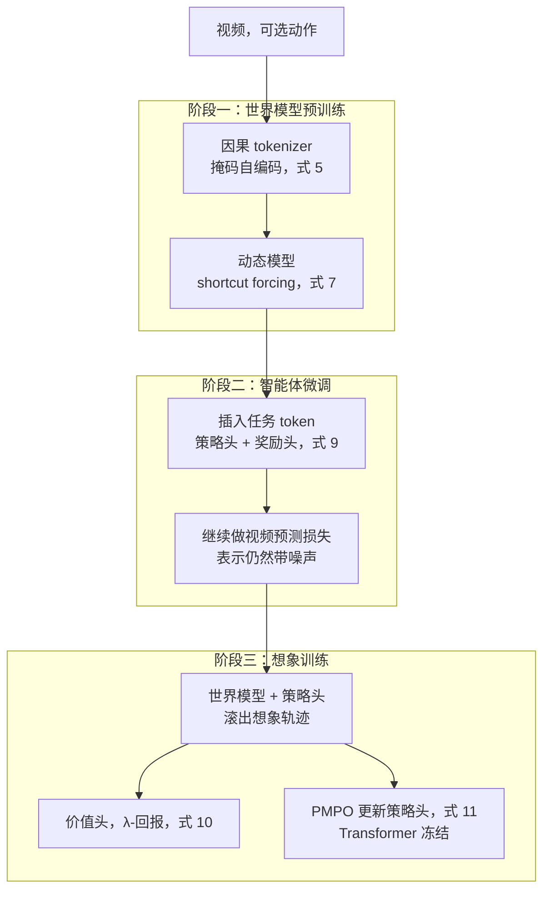
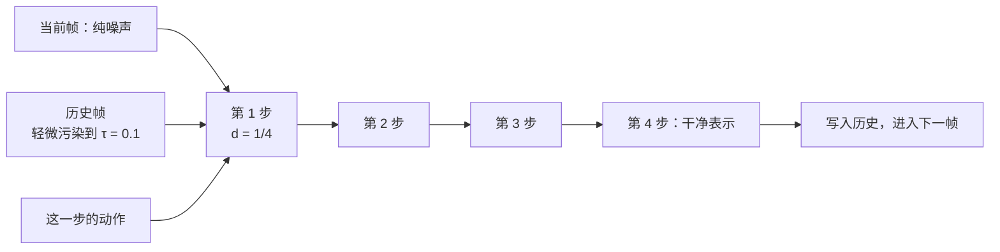
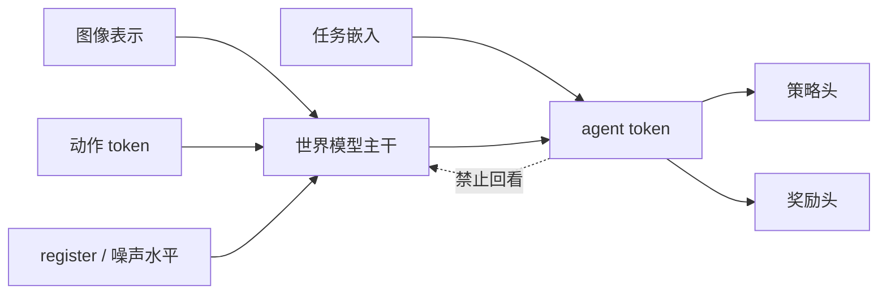

# Dreamer 4：世界模型必须又快又准，智能体才能只在想象里学会挖钻石

<!-- release-date: 2025-09-29 -->

> 本文依据 Google DeepMind 的 **Training Agents Inside of Scalable World Models**，本地原件是 arXiv:2509.24527v1（2025-09-29 提交），共 32 页。作者 Danijar Hafner、Wilson Yan、Timothy Lillicrap，项目页 [danijar.com/dreamer4](https://danijar.com/project/dreamer4/)。页码一律指这份本地 PDF 自身的页码。动笔前已核 arXiv 官方页：提交历史只有 v1，因此未换件。
>
> 文中会明确区分三层：**报告写了什么**、**我们如何解释或推算**、**哪些是外部资料补充**。外部补充一律标出来源并给链接。
>
> 关于 `release-date`：Dreamer 4 从未通过官方 Web、App、API 或权重向公众开放使用——论文、项目页和作者推文都只提供论文与演示视频，没有下载入口。按本模块约定，这种情况改用**该技术首次官方公开的日期**。最早的官方公开事件是 2025-09-29 的 arXiv v1（当天 09:42:27 UTC 提交）；作者 @danijarh 于次日 2025-09-30 发推并放出项目页。取前者。证据链见文末。

## 先把矛盾问对：为什么「能生成视频」还不够训练智能体

先不谈任何新名词。站内已经有两篇世界模型方向的解读，它们各自卡在不同的缺口上：

- [Genie](/reports/Google/Genie)（初代）：互联网视频没有动作标签，所以它从相邻帧的差异里挤出一套只有 8 个码的「按键」。
- [Cosmos](/reports/NVIDIA/Cosmos)：机器人不能靠摔跤学习，所以它先用视频学一个通用世界副本，再接到具体身体上。

Dreamer 4 卡的是第三道墙。

报告开篇把两条既有路线并排放在一起（PDF p.2）：

- **Dreamer 3 这类世界模型智能体**：在游戏和机器人上又快又准，但架构吃不下复杂的真实数据分布。
- **Genie 3 这类可控视频模型**：用扩散 Transformer 在多样真实视频和游戏上训练，能生成多样场景和简单交互，但仍然学不会物体交互和游戏机制的精确物理；而且常常要很多块 GPU 才能实时模拟一个场景。

两句话合起来就是一个死结：

> **训练智能体需要的世界模型，必须同时满足「准到能当真仿真器」和「快到能在一块卡上滚出大量想象轨迹」。现有两条路各占一头，中间是空的。**

准而不快，想象训练的吞吐不够，策略刷不出足够的错误经验。快而不准，想象里的物理是假的，策略会在真实环境里摔跤。报告把这件事说得很具体：Minecraft 里挖钻石需要从原始像素里选出超过 20,000 步鼠标和键盘动作（PDF p.1）；人玩大约 20 分钟，对应约 24,000 步（PDF p.10）。世界模型如果会把方块「自动补全」成一座玩家没砌过的墙，或者把合成台界面幻觉成另一套物品，智能体在里面再练一万步也是在学错的游戏。

Dreamer 4 押的注是：先把世界模型做到单卡实时、交互足够准，再把策略完全放进这个模型里用强化学习练。它声称的结果是——**第一个纯离线、不与环境交互就在 Minecraft 挖到钻石的智能体**，数据量约为 OpenAI VPT 离线智能体的 1/100（PDF p.2）。

这里必须先把一件容易混的事写死。附录 F 自己写得很清楚（PDF p.29）：

| | Dreamer 3（Nature，报告引用为 [1]） | Dreamer 4（本篇） |
|---|---|---|
| 怎么挖到钻石 | **从零在线交互**，约 1.4K 小时环境互动（PDF p.16，表 3） | **纯离线**，只用固定的承包商录像，评测前不碰环境 |
| 输入 | 64×64 低分辨率图 + 背包状态 | 360×640 高分辨率图，没有背包向量 |
| 输出 | 鼠标、键盘，外加抽象合成动作 | 只有低层鼠标和键盘，合成必须走游戏 UI |
| 世界模型 | 循环状态空间模型（RSSM）：RNN + 变分目标 | 块因果 Transformer + shortcut forcing |

这是两个不同设定，不是同一件事的升级版。Dreamer 3 证明「在线交互够狠，轻量世界模型也能挖到钻石」；Dreamer 4 证明「如果世界模型够强，离线录像也能挖到」。后文凡是提到钻石，都会标明是哪一种。

## 六个词，先各用一句话说清

这是本模块第三篇世界模型方向的解读。下面这些词大多不是这篇发明的，属于读这份材料的前置背景。

- **世界模型（World Model）**：给定到目前为止看到的画面和这一步的动作，预测下一帧（或下一帧的压缩表示）的模型。它和普通视频生成模型的根本差别只有一条：**能不能在中途接受控制**。Genie 把它写成 $\hat x_{t+1}=f(x_{1:t},u_t)$，Cosmos 把扰动写得更宽，本篇的动态模型做的是同一件事，只不过预测对象是 tokenizer 压出来的连续表示，而不是像素。
- **想象训练（imagination training）**：不把策略放到真实环境里试错，而是让世界模型自己滚出一条条「假经历」，策略只在这些假经历上做强化学习。报告把第三阶段就叫这个名字（PDF p.4，算法 1）。
- **离线（offline）**：训练过程中不允许再向环境要新数据。想象训练里的强化学习是 on-policy 的——策略在世界模型里采样自己的动作——但真实 Minecraft 一次都没跑过，所以整条流水线仍是离线方法（PDF p.11）。
- **流匹配（flow matching）**：扩散模型的一种写法。训练时把干净数据和纯噪声按比例掺在一起，让网络预测「从噪声指向数据」的速度向量；生成时从纯噪声出发，沿着这个速度一步步走回数据。
- **Shortcut 模型（shortcut models）**：在流匹配的网络上再加一个输入——「请你这一步跨多大」。这样推理时可以主动选择用 2 步或 4 步走完全程，不必再做单独的蒸馏阶段。
- **行为克隆（Behavioral Cloning，BC）**：最朴素的模仿学习——看专家在某一帧按了什么，就让策略拟合那个动作。本篇用它给策略打底，再用想象里的强化学习往上挖。

本篇新提出、需要单独记住的名字只有一个：**shortcut forcing（捷径强迫）**。它不是 shortcut 模型的别名，而是「把 shortcut 模型接到按时间逐步去噪的序列上，并且改成预测干净表示」。后文会把它走完一条因果链。

## 一句话先说清

Dreamer 4 不是一个更会画 Minecraft 的视频模型，也不是 Dreamer 3 换了 Transformer 皮肤。

它真正做的事情是三条叠在一起的约束：

1. 世界模型要准到能模拟「敲方块、合成、开船、进传送门」这类物体交互；
2. 世界模型要快到单卡超过 Minecraft 的 20 FPS，才能拿来做人机试玩和大规模想象训练；
3. 策略只在这个世界模型里用强化学习改进，评测时才第一次进入真实游戏。

规模上，报告训练的是 **2B 参数**——tokenizer 400M，动态模型 1.6B——跑在 256 到 1024 块 TPU-v5p 上，每卡 batch 1，用 FSDP 切分（PDF p.9）。Minecraft 上动态模型用 256 个空间 token、192 帧上下文、256 的 batch 长度；真实世界视频则用 512 个空间 token、96 帧上下文、128 的 batch 长度（PDF p.9）。

如果只记一句话，可以记：

> **智能体能不能纯靠录像学会一件很难的事，瓶颈往往不在策略算法，而在世界模型够不够格当仿真器。**

## 先看全景：三个阶段，同一台 Transformer

报告把训练写成三个阶段（PDF p.4，算法 1）：

这张图由我们根据算法 1 与 Figure 2 的文字重画（PDF p.4），表达的是阶段依赖，不代表实测时长或并行方式。

两个模块共用同一套**块因果 Transformer（block-causal transformer）**（PDF p.4，Figure 2）：

- **因果 tokenizer**：把视频压成连续表示。编码器看部分被遮住的图像 patch 和一组学出来的潜 token，经低维投影和 tanh 挤过瓶颈，解码器再还原 patch。注意力在时间上是因果的，所以可以一帧一帧解，不必等整段视频到齐。
- **交互动态模型**：在「动作 / shortcut 的噪声水平与步长 / tokenizer 表示」交织的序列上做去噪，用 shortcut forcing 预测干净表示。

预训练之后，并不另训一个策略网络。报告的做法是：**往已经训好的动态 Transformer 里再插进任务 token**，从这些 token 上长出策略、奖励和价值三个头（PDF p.4）。

多个模态、多个损失怎么加在一起？报告用各损失的 RMS（均方根）的滑动估计做归一化，避免某一项把别的项淹没（PDF p.4）。

## 和站内已有的世界模型解读怎么分工

| | Genie（初代） | Cosmos | Dreamer 4 |
|---|---|---|---|
| 想解决的缺口 | 动作标注太贵 | 世界仿真器写不出来 | 世界模型不能又准又快，想象训练落不了地 |
| 控制信号从哪来 | 从视频里**学**出 8 个潜动作 | 后训练时**给**进来（文本 / 位姿 / 动作） | 数据集里的鼠标键盘；无动作视频则用一个学出来的占位嵌入 |
| 主要用途 | 生成可玩环境 | 给机器人当数字世界 | 在模型里用强化学习训练策略 |
| 交付形态 | 一篇方法，未发权重 | 开源平台，权重开放 | 一篇方法，未发权重 |

所以本篇不需要解决 Genie 那个「没有动作标签」的问题——VPT 承包商数据自带鼠标键盘。它要解决的是另一头：有了动作之后，世界模型能不能精确到拿来当仿真器，并且便宜到可以在想象里做强化学习。Genie 3 在本篇里是作为「可控视频模型」的代表被点名的（PDF p.2、p.12），和站内那篇 2024 年的初代 Genie 不是同一份工作。

## 核心设计一：shortcut forcing——少走几十步，还不让误差在时间上堆起来

这是全文最需要讲清楚的一块。只记住名词没有用。

### 旧问题

普通扩散 / 流匹配生成一帧要走很多步。报告给的起点是：一个朴素的 diffusion forcing Transformer，每帧 64 个采样步，单卡 H100 只有 0.8 FPS，连 Minecraft 的 20 FPS 都摸不到（PDF p.15–16，表 2）。

把采样步砍到 4 步，速度来到 9.1 FPS，但 FVD 从 306 炸掉到 875（PDF p.15，表 2）。FVD（Fréchet Video Distance，弗雷歇视频距离）是视频生成常用的分布距离，**越低越好**。4 步之所以崩，是因为网络是按「一小步的速度」训练的，你硬让它跨一大步，离散化误差会写进每一帧；交互式生成还是**一帧接一帧**，前一帧的误差会变成后一帧的历史，于是越滚越歪。

视频模型通常的补救是再做一次蒸馏，把 64 步的老师压成 4 步的学生。那要两阶段训练，而且老师本身就已经很贵。

### 新设计：三块积木叠在一起

shortcut forcing 由三块现成积木拼成，报告在第 2 节先把它们讲完，再在 3.2 节改一刀（PDF p.3、p.5–6）。

**第一块：流匹配。** 信号水平 $\tau\in[0,1]$ 决定数据和噪声掺多少：$\tau=0$ 是纯噪声，$\tau=1$ 是干净数据（PDF p.3，式 1）：

$$
x_\tau=(1-\tau)x_0+\tau x_1,\qquad x_0\sim\mathcal{N}(0,I),\qquad x_1\sim\mathcal{D}
$$

网络预测从噪声指向数据的速度 $v=x_1-x_0$，损失是这个速度的均方误差。推理时从 $x_0$ 出发，用步长 $d=1/K$ 走 $K$ 步（PDF p.3，式 2）：

$$
x_{\tau+d}=x_\tau+f_\theta(x_\tau,\tau)\,d
$$

**第二块：shortcut 模型。** 网络不但看 $\tau$，还看「这一步请跨多大」的 $d$。最小步 $d_{\min}$ 仍用流匹配；更大的 $d$ 用自蒸馏——两次半步合成一次整步，梯度在教师那一侧停住（PDF p.3，式 3）。步长按 2 的幂采样，$d_{\min}=1/K_{\max}$（PDF p.3，式 4）。好处是**一个训练阶段**就能在推理时选 2 步或 4 步，不必另做蒸馏。

**第三块：diffusion forcing。** 序列里每一个时间步可以有不同的噪声水平。于是每个位置既是去噪任务，又是后面位置的历史（PDF p.3）。推理时就可以「历史几乎干净、只生成下一帧」。

把三块接起来，还缺一刀。shortcut 模型默认预测速度，叫 **v-prediction（速度预测）**。报告说，这个选择在「一次生成整块图像或整段视频」时很好；但按帧逐步生成长视频时，网络会输出高频细节，微小误差会随时间累积（PDF p.6）。

于是他们改成预测干净表示本身，叫 **x-prediction（数据预测）**。

### 工作机制

动态模型的输入是交织在一起的动作 $a$、离散信号水平 $\tau$、步长 $d$，以及被污染的表示 $\tilde z$；输出是干净表示 $\hat z_1$（PDF p.6，式 6）：

$$
\hat z_1=f_\theta(\tilde z,\tau,d,a),\qquad \tilde z=(1-\tau)z_0+\tau z_1
$$

注意这里有两个「时间」：$t$ 是序列里的第几帧，$\tau$ 是这一帧被污染到什么程度。两者不要混。

最小步仍在 $x$ 空间做流匹配，直接对干净表示回归。更大的步要做 bootstrap：先把网络的 $x$ 预测换成速度，走完两个教师步，再把损失乘 $(1-\tau)^2$ 换回 $x$ 空间，使两项损失量级相当（PDF p.6，式 7 及脚注）。论文印刷的式 7 把两次教师步写成步长 $2d$；第 2 节回顾原 shortcut 时教师步是 $d/2$。机制是同一件事——两大半步合成一步——这里按论文印刷的公式引用，不擅自改符号。

还缺一个权重。低 $\tau$（更吵）时，流匹配会退化成预测数据集均值，bootstrap 的目标又是确定的、更好优化。报告不想把容量浪费在这些容易的位置上，于是给了一个随 $\tau$ 线性升高的 **ramp 权重**（PDF p.6，式 8）：

$$
w(\tau)=0.9\tau+0.1
$$

$\tau=0$ 时权重是 0.1，$\tau=1$ 时是 1.0。人话就是：**越接近干净数据的位置，越认真学。**

推理时每帧走 $K=4$ 步，对应 $d=1/4$；并且把已经生成的历史再轻微污染到 $\tau_{\mathrm{ctx}}=0.1$，让模型对自身的小瑕疵有容错（PDF p.6）。

这张图由我们根据 3.2 节推理段重画（PDF p.6），是机制示意，不代表实测延迟。

### 收益

表 2 把这一刀的效果写得很硬（PDF p.15）：

- 只把 64 步改成 4 步：FVD 306 → 875，质量崩了；
- 加上 shortcut 模型：FVD 回到 329，几乎回到 64 步的水平，速度仍是 9.1 FPS；
- 再换成 x-prediction、x 空间损失、ramp 权重：FVD 329 → 326 → 151 → 102。

也就是说，**4 步能用，主要是 shortcut 救回来的；长程不崩，主要是 x-prediction 和 ramp 救回来的。** 报告自己的对照是：同样走完后面那些架构改动之后，如果仍用 v-space 的预测和损失，FVD 是 124；换成 x-space 之后是 57（PDF p.16）。

Figure 8 把 shortcut forcing 和 diffusion forcing 放在同一套 x 空间损失加 ramp 权重下比采样步数：shortcut forcing 用 4 步就接近 diffusion forcing 用 64 步的质量，报告称之为 **16 倍加速**（PDF p.16，Figure 8）。

### 代价与边界

- 4 步并不是免费午餐。表 2 里「Fewer sampling steps」单独一行的 FVD 是 875，说明**不改目标、只砍步数，一定崩**。shortcut 是在训练时就把「大步」当作一等公民来学。
- x-prediction 的好处是报告的观察加假设：他们假设 $x$ 空间的目标更有结构，因此更不容易输出会累积的高频误差（PDF p.16）。这不是定理。
- 历史仍要加 $\tau_{\mathrm{ctx}}=0.1$ 的噪声。这说明模型对自己生成的表示并不完全信任——这是一种工程补丁，也暗示误差并没有被完全消灭，只是被控制在可容忍的范围。

### 可迁移启发

> **当生成必须按时间逐步进行、而每一步的误差会变成下一步的输入时，不要只优化「单步看起来像」；要把「走大步」和「预测更有结构的量」写进训练目标。**

任何滚动预测都适用：运动规划、长期时间序列、自回归世界模型。v-prediction 适合一次出整块；x-prediction 适合一条会越滚越长的链。shortcut 则适合「推理预算是硬约束、但你不想再开一个蒸馏阶段」的场合。

## 核心设计二：为了单卡实时，Transformer 被拆成「空间密、时间稀」

shortcut forcing 把每帧的前向次数从 64 降到 4。如果每一层还在全部时空 token 上做密集注意力，4 次仍然太贵。

### 旧问题

块因果 Transformer 的推理受两头限制：MLP 的 FLOPs，以及长上下文 KV Cache 的显存带宽（PDF p.8）。视频 token 数量很大——附录里 Minecraft 一帧 pad 成 384×640、patch 16×16，就是 960 个 tokenizer token，再被收成 256 个动态模型空间 token；上下文 192 帧（PDF p.25）。把这些 token 全部两两做注意力，长上下文根本跑不到实时。

### 新设计

骨架是带时间和空间两个轴的 2D Transformer，时间上做因果掩码：同一帧内的 token 可以互看，也可以看过去，不能看未来（PDF p.8）。起点是现代 Transformer 的标配：层前 RMSNorm、RoPE、SwiGLU，再加上 QKNorm 和 attention logit soft capping 来稳住训练（PDF p.8）。

然后连砍三刀（PDF p.8）：

1. **空间注意力和时间注意力分开**，不再做全体 token 的密集注意力。
2. **每 4 层才做一次时间注意力**。Figure 2 画的就是三层 Space + 一层 Causal Time，重复 $L/4$ 次（PDF p.4）。
3. **动态模型的注意力全部用 GQA（Grouped Query Attention，分组查询注意力）**：多个 Query 头共用同一组 Key-Value，KV Cache 再缩一截。

训练长度上，他们不一次训到最长，而是**短 batch 和长 batch 交替**，最后再只在长 batch 上微调（PDF p.8）。短的用来加快步进，长的用来让中间指标和生成结果更接近最终模型。batch 长度必须**长于**模型的上下文长度，否则 Transformer 会过拟合「上下文开头总是视频第一帧」，没法生成任意长度（PDF p.8）。

Minecraft 上两条长度是 $T_1=64$ 和 $T_2=256$，上下文 $C=192$，确实 $256>192$（PDF p.25）。

### 收益：表 2 后半段在证明什么

表 2 从「Alternating batch lengths」往下，证明的不是目标函数，而是**把省下来的时间换成容量**（PDF p.15）：

| 改动 | 每步训练秒数 | 推理 FPS | FVD（越低越好） | 这一行实际证明了什么 |
|---|---:|---:|---:|---|
| 到 ramp 权重为止 | 9.8 | 9.1 | 102 | 目标函数已经能用 4 步出图 |
| + 交替 batch 长度 | 1.5 | 9.1 | 80 | 同样 48 小时墙钟内学得更多、更好 |
| + 每 4 层才做长上下文 | 0.6 | 18.9 | 70 | 时间层变稀，速度和质量一起涨 |
| + GQA | 0.5 | 23.2 | 71 | 速度再涨，质量几乎不掉 |
| + 时间因子化的长上下文 | 0.4 | 30.1 | 91 | 速度到顶，质量回退 |
| + register tokens | 0.5 | 28.9 | 91 | FVD 没变；报告说肉眼看时间一致性更好 |
| + 空间 token 128 | 0.8 | 25.7 | 66 | 把速度预算换成容量，质量回来 |
| + 空间 token 256 | 1.7 | 21.4 | 57 | 最终档：刚过 20 FPS，FVD 最低 |

起点那一行是 $N_z=64$ 空间 token、$K=64$ 采样步的朴素 diffusion forcing，FVD 306、0.8 FPS（PDF p.15）。终点是 FVD 57、21.4 FPS。报告的评测协议是：每个消融训 48 小时，无条件生成 1024 条 384 帧（约 20 秒）的视频，动作来自一个固定的 BC 策略，再切成 16 帧小段算相对 holdout 集的 FVD（PDF p.15）。

有两处特别值得读：

- **时间注意力变稀，FVD 反而从 80 降到 70。** 报告的解释是空间注意力的归纳偏置让计算集中在当前帧（PDF p.16）。这和「更强的全时空注意力一定更好」相反，和站内 Genie 那篇 ST-transformer 的经验同类。
- **register tokens 不降 FVD，他们仍留下了。** 依据是定性观察而不是表上的数字（PDF p.16）。读消融时要把「表能证明的」和「作者看到的」分开。

最终单卡 H100 上 Dreamer 4 报 21 FPS，超过游戏 20 FPS 的 tick（PDF p.12–13，表 1）。上下文 192 帧 / 20 FPS = 9.6 秒，是表 1 里前作 0.8–1.6 秒的 6 倍（PDF p.12）。

### 代价

空间层看不到别的帧，大多数时间层根本不存在。跨时间又跨位置的关系必须靠那 1/4 的时间层和层叠间接建立。表 2 里「Time factorized long context」已经展示了这种代价：FPS 冲到 30.1，FVD 从 71 回到 91（PDF p.15）。他们能加空间 token 把质量救回来，是因为速度先被砍出了余量；换一个已经很满的预算，这刀不一定划得来。

### 可迁移启发

> **先用结构把推理打到实时预算以下，再把省下的步数和时间用来加容量。不要在一个已经跑不动的骨架上堆 token。**

「每 4 层才做一次昂贵的那种注意力」是可直接抄的。Llama 4 的相关观察被报告当作依据引用（PDF p.8，参考文献 [39]），说明这条归纳偏置已经被不止一个团队用在生产模型上。

## 核心设计三：因果 tokenizer——连续瓶颈，而不是离散码本

动态模型吃的不是像素。中间那个表示从哪来，决定了后面能预测多细、能不能一帧一帧交互。

### 旧问题

交互推理要求：**当前帧必须在下一帧到来之前就能解码**。非因果的视频 tokenizer 会拿未来帧帮忙压当前帧，训练时重建更好，推理时却没法逐帧用。Genie 的 ST-ViViT 已经是因果的，但它走离散 VQ 码本；本篇要给 shortcut forcing 提供连续表示，离散码对扩散式去噪不是最顺的接口。

### 新设计

每个时间步是「当前图像的 patch token + 一组学出来的潜 token」。编码器之后，从潜 token 上线性投到更窄的通道，过 tanh，得到瓶颈表示；解码器再投回去，和另一组学出来的 token 拼在一起还原 patch（PDF p.5）。tanh 把表示限制在 $(-1,1)$，后面的扩散过程才有一个有界的数据空间。

多模态时注意力是不对称的（PDF p.5）：

- 编码器：潜 token 可以看所有模态，每个模态只看自己；
- 解码器：每个模态看自己和潜变量，潜变量只看自己。

训练是重建：MSE 加 0.2 倍的 LPIPS（感知损失），两项同样走 RMS 归一化（PDF p.5，式 5）。输入 patch 按 $p\sim U(0,0.9)$ 随机丢掉，换成一个学出来的嵌入——这就是掩码自编码（Masked Autoencoding，MAE）。$p$ 会取到 0，所以训练分布覆盖了推理时「什么都不遮」的情况（PDF p.5）。

Minecraft 上的具体尺寸（PDF p.25）：原图 360×640，零填充到 384×640，patch 16×16 得到 960 个 token；tokenizer 瓶颈是 $N_b=512$ 个 token、每个 $D_b=16$ 维，再 reshape 成动态模型的 $N_z=256$ 个空间 token、每个 32 维。

### 收益与边界

报告对 MAE 只给了一句定性结论：它改善了动态模型生成视频的空间一致性（PDF p.5）。没有单独的 tokenizer 消融表，所以我们只知道他们觉得有用，不知道去掉 MAE 会掉多少 FVD。

连续表示加 tanh 是为后面的 shortcut forcing 服务的：扩散在有界连续空间上做，比在离散码上做更直接。代价是表示不再是「可解释的码本编号」，也不能像 Genie 那样把动作限制成 8 个离散按键——本篇的动作来自数据，不需要从表示里挤。

### 可迁移启发

> **tokenizer 的因果性和它输出的是连续还是离散，要倒过来由下游怎么用决定，而不是先选一个流行的 VQ。**

下游若是逐步扩散 / 流匹配，连续有界表示更顺；下游若是自回归分类，离散码更顺。MAE 的 $p$ 覆盖到 0，是为了让训练分布含住推理分布——这条比「用不用 MAE」这个开关更值得抄。

## 核心设计四：想象训练——世界模型冻结，只让策略在假经历里超越录像

世界模型准了、快了，还只是仿真器。智能体要在里面学会比数据集更好的策略。

### 旧问题

纯行为克隆会被数据集的策略分布锁死。VPT 的离线智能体就是前车：即使看了 270K 小时打好标签的 YouTube 录像，微调后也只稳定走到木棍这一档（PDF p.12、p.16）。想再往前，传统做法是让智能体进真实环境试错。报告把这个选项明确拿掉：物理机器人上，半成品策略在线交互往往不安全，场景也难重置，奖励更难实时给（PDF p.10）。

### 新设计：先插入不会污染世界模型的任务通道

阶段二在动态 Transformer 里插入 **agent token（智能体标记）**，和图像表示、动作、register token 交织。这些 token 的输入是任务嵌入，上面接 MLP，做策略和奖励预测（PDF p.6–7）。

关键的注意力限制：**agent token 可以看自己、也可以看所有其他模态；其他模态一律不准看回来**（PDF p.6–7）。

这张图由我们根据 3.3 节文字重画（PDF p.6–7），是机制示意。

为什么禁止回看？报告写的理由是避免世界模型的**因果混淆**：未来画面只应被动作改变，不应被「当前任务是挖钻石还是砍树」直接改变（PDF p.6–7）。否则模型可能学会「任务是挖钻石，于是下一帧直接出现钻石」，而不是「任务是挖钻石，于是策略去选挖掘动作，世界再按动作演化」。

策略和奖励用 **多 token 预测（Multi-Token Prediction，MTP）**，长度 $L=8$，一次预测从现在起 8 步的动作和奖励（PDF p.7，式 9）：

$$
\mathcal{L}(\theta)=-\sum_{n=0}^{L}\ln p_\theta(a_{t+n}\mid h_t)-\sum_{n=0}^{L}\ln p_\theta(r_{t+n}\mid h_t)
$$

同时保留预训练设定：表示仍然带噪声，视频预测损失继续加，避免世界模型在这一阶段丢掉生成能力（PDF p.7）。奖励头沿用 Dreamer 3 的 **symexp twohot**——先把奖励做符号指数变换，再在离散区间上预测——用来覆盖不同数量级的稀疏奖励；策略头按动作空间选分类或逐维伯努利（PDF p.7）。Minecraft 里键盘是 23 维二元，鼠标按 VPT 的方式做 $\mu$-law、每轴 11 个箱，再枚举成 $11\times 11=121$ 类（PDF p.10、p.25）。

阶段三才是想象训练。价值头和一份冻结的策略副本（行为先验）被加进来；**只更新策略头和价值头，Transformer 冻住**（PDF p.7）。脚注说微调整个 Transformer 有一点点好处，但更贵，而且必须同时保住动态、先验和奖励损失，否则这些功能会漂（PDF p.7）。

想象轨迹从阶段一二用过的数据集上下文出发，每个上下文只滚一条——和前代 Dreamer「同一上下文滚很多条」不同，目的是多样性优先、省显存（PDF p.7）。滚动时：flow 头出表示，策略头出动作，奖励头和价值头给这条假经历打分。

价值头学的是折扣回报，让策略的视野超出想象地平线。训练用 TD 学习拟合 $\lambda$-回报，$\gamma=0.997$，$c_t$ 标记非终止（PDF p.7，式 10）：

$$
R_t^\lambda=r_t+\gamma c_t\bigl((1-\lambda)v_{t+1}+\lambda R_{t+1}^\lambda\bigr),\qquad R_T^\lambda=v_T
$$

策略头不再用前代 Dreamer 的回报归一化加熵正则，改用 **PMPO（Preference Matching Policy Optimization，偏好匹配策略优化）**（PDF p.7–8）。PMPO 只看优势 $A_t=R_t^\lambda-v_t$ 的符号，不看幅度。于是不同任务即使回报尺度差几个数量级，也不会有一个任务把梯度抢走；也不再需要把回报标准化（PDF p.7）。

具体做法：把 batch 里所有想象状态按优势正负分成 $D^+$ 和 $D^-$，最小化（PDF p.8，式 11）

$$
\mathcal{L}(\theta)=\frac{1-\alpha}{|D^-|}\sum_{i\in D^-}\ln\pi_\theta(a_i\mid s_i)-\frac{\alpha}{|D^+|}\sum_{i\in D^+}\ln\pi_\theta(a_i\mid s_i)+\frac{\beta}{N}\sum_{i=1}^{N}\mathrm{KL}\bigl[\pi_\theta(\cdot\mid s_i)\,\|\,\pi_{\mathrm{prior}}\bigr]
$$

$\alpha=0.5$ 让好坏两集一样重要，$\beta=0.3$ 是行为先验的较弱系数。第一项没有负号：最小化它等于**压低**负优势动作的概率；第二项带负号：最小化它等于**抬高**正优势动作的概率。和原版 PMPO 不同，这里的 KL 是 $\mathrm{KL}[\pi_\theta\|\pi_{\mathrm{prior}}]$，方向反过来，为的是把策略拴在「还算像人」的动作空间里（PDF p.8）。三项都以 nat 计，报告说相对比例在实践中很稳（PDF p.8）。

### 收益

后文离线钻石实验会给出数字。这里先记下机制上的两个后果：

- 世界模型在阶段三冻住，策略无法通过「把仿真器改得更好骗」来降损失。这和 Genie 用 stopgrad 保护潜动作是同一类闸门。
- PMPO 不管优势幅度，多任务不需要回报归一化。Dreamer 3 用过归一化和熵正则；报告把两者的差别写在附录 F（PDF p.29）。

### 代价与边界

- Transformer 冻住意味着想象训练**不能**顺便把世界模型在策略分布上对齐。策略一旦走出数据集，世界模型可能进入自己没见过的状态。报告没有测这个分布偏移有多大。
- 每个上下文只滚一条，多样性好、对同一开局的价值估计方差更大。报告没做「一条对多条」的消融。
- 反向 KL 把策略拴在 BC 先验附近：这能抑制胡乱探索，也可能挡住真正需要「不像人」的捷径。钻石成功率最后只有 0.7%（PDF p.12），这个拴绳是不是过紧，报告没有单独消融。

### 可迁移启发

> **往一个已经会预测世界的模型里接策略时，先问：任务信息有没有一条不该存在的捷径，直接改写了下一帧？** 如果有，就把这条通道做成单向的。

「符号优势 + 反向 KL 拴在 BC 先验上」适合离线、多任务、回报尺度混乱的场景。它的代价是探索被拴住，需要用任务课程或提示序列把智能体领到稀疏奖励附近——本篇正是这么做的。

## 实验一：纯离线钻石——和 Dreamer 3 的在线钻石不是一件事

### 任务有多长

Minecraft 钻石挑战是长程控制：程序化生成的 3D 世界、原始像素、低层鼠标键盘，中间要采集、合成、换工具、挖到指定深度。人大约 20 分钟拿到钻石，约 24,000 步（PDF p.10）。评测协议跟 VPT：60 分钟一局，随机世界、空背包，必须通过游戏 UI 合成，共 1000 局（PDF p.9–10）。

报告强调，此前拿到钻石的智能体都借助了**在线交互**：Dreamer 3 从零在线约 1.4K 小时；VPT 的 RL 版本在 270K 小时网页视频之外还加了 194K 小时在线强化学习（PDF p.16，表 3）。本篇把在线这一列清零，只留 VPT 承包商数据 2.5K 小时（精确到 2541 小时，PDF p.9、p.25）。

### 数据怎么用

任务和稀疏二元奖励来自 VPT 数据里已有的事件，共 20 个训练任务（PDF p.10、p.27，表 4）。评测时用一张线性提示表，按顺序切换任务，把智能体从砍木头领到挖钻石；最后一项 `mine_diamond` 的计数是 $\infty$，一直挖到时间结束（PDF p.27，表 6）。数据混合是 50% 均匀序列 + 50% 完成了某个任务的相关序列；BC 损失只打在相关序列上，动态损失只打在均匀序列上，避免相关序列把生成分布拧歪（PDF p.10）。任务用 one-hot，报告说换成文本嵌入很容易（PDF p.10）。

### 对照是谁

报告比了六种智能体（PDF p.11），附录表 7、表 8 实际列了八列，多出来的是 VPT 预训练原版，以及一个不带任务条件的 WM+BC（PDF p.28）：

- **VPT（pretrained / finetuned）**：文献里最强的鼠标键盘 Minecraft 智能体。离线设定下有两个无条件 BC 策略，都在 270K 小时合成标注的 YouTube 上训练，其中一个再在「早期游戏」子集上微调。报告采用微调版，因为它明显更好（PDF p.11）。
- **BC（notask）**：从零做 MTP 行为克隆，无任务条件，数据只用承包商里的相关子集。和 VPT 最直接可比：VPT 用承包商数据训动作标注器再去标 YouTube，这个 BC 直接拟合承包商动作（PDF p.11）。
- **BC**：同样的过滤承包商数据，加上任务条件，评测时用提示序列领路（PDF p.11）。
- **VLA（Gemma 3）**：按 VLA 配方，把视觉语言模型 Gemma 3 在相关序列上做 MTP 微调。Gemma 3 的预训练算力和数据远大于本篇其他模型，且原生看过图像（PDF p.11）。
- **WM+BC**：Dreamer 4 在想象训练之前的 BC 策略。世界模型先在**全部**承包商数据上预训练，再微调策略、奖励和动态损失（PDF p.11）。
- **Imagination RL / Dreamer 4**：把 WM+BC 放进世界模型做强化学习。尽管在模型里是 on-policy 的，真实环境零交互，仍是离线方法（PDF p.11）。

### 表 7 证明了什么：越难的里程碑，想象训练的优势越大

表 7 是 1000 局里拿到各物品的成功率（%），加粗是距最高分 5% 以内（PDF p.28）：

| 物品 | VPT 预训练 | VPT 微调 | BC 无任务 | WM+BC 无任务 | BC | VLA | WM+BC | Dreamer 4 |
|---|---:|---:|---:|---:|---:|---:|---:|---:|
| 原木 | 81.9 | 84.3 | 71.4 | 92.6 | 97.3 | 98.5 | 99.6 | 99.1 |
| 木板 | 30.6 | 65.3 | 68.6 | 91.6 | 95.7 | 98.3 | 99.6 | 98.9 |
| 合成台 | 1.7 | 4.7 | 63.8 | 90.6 | 93.5 | 97.2 | 99.1 | 98.5 |
| 木棍 | 30.3 | 52.6 | 62.4 | 90.1 | 95.0 | 97.7 | 98.9 | 98.7 |
| 木镐 | 0.0 | 0.0 | 33.8 | 77.3 | 86.5 | 94.1 | 97.3 | 96.6 |
| 圆石 | 4.8 | 6.9 | 32.0 | 77.4 | 83.9 | 91.6 | 97.2 | 95.9 |
| 石镐 | 0.0 | 0.0 | 8.8 | 38.4 | 53.8 | 76.7 | 89.4 | 90.1 |
| 铁矿 | 0.1 | 0.1 | 3.6 | 22.0 | 26.5 | 46.3 | 62.9 | 66.7 |
| 熔炉 | 0.0 | 0.0 | 4.0 | 28.0 | 16.2 | 42.4 | 51.1 | 58.1 |
| 铁锭 | 0.1 | 0.1 | 0.2 | 1.2 | 4.3 | 22.5 | 27.8 | 39.5 |
| 铁镐 | 0.0 | 0.0 | 0.0 | 0.1 | 0.6 | 11.2 | 16.9 | 29.0 |
| 钻石 | 0.0 | 0.0 | 0.0 | 0.0 | 0.0 | 0.0 | 0.0 | **0.7** |

这张表至少证明四件事，不能读成「Dreamer 4 全面最高」：

1. **VPT 微调版卡在木棍。** 木棍 52.6%，木镐 0%。它拿到的少量石头、铁矿、铁锭，报告归因于爬行者爆炸和战利品箱这类边角（PDF p.12）。现代 BC 直接拟合承包商动作，已经明显超过它——合成台从 4.7% 到 63.8%。所以「100× 更少数据」的对照，一部分来自数据用法（承包商真动作 vs YouTube 合成标签），不只来自世界模型。
2. **世界模型表示比 Gemma 3 更适合做这个环境里的决策。** WM+BC 在石镐上 89.4%，VLA 76.7%；铁镐 16.9% 对 11.2%。Gemma 3 预训练远更贵，但视频预测学到的环境理解，迁到策略上比通用视觉语言表示更对口（PDF p.12）。这是 Figure 4 左图要讲的故事。
3. **任务条件很值钱。** BC 无任务的石镐只有 8.8%，加上任务条件变成 53.8%。提示序列等于在评测时把长程任务拆开——这是评测协议的一部分，不是智能体自己发现的课程。
4. **想象训练几乎只在后半程发力。** 原木到木镐，WM+BC 常常略高于 Dreamer 4（原木 99.6 对 99.1，木镐 97.3 对 96.6）。从石镐开始反超，铁镐 16.9 → 29.0，钻石 0 → 0.7。报告自己的观察是：里程碑越难，想象训练相对 BC 的提升越大（PDF p.12）。

0.7% 是 1000 局里大约 7 次成功。这确实是「第一个纯离线挖到」，量级仍然很小。报告没有把这个数字包装成「已经会挖钻石」，正文只写 obtains diamonds in 0.7% of episodes（PDF p.12）。

### 表 8 证明了什么：同样成功，它更快

表 8 是成功局里到达该物品的平均分钟数；成功率低于 0.5% 的格子留空，避免样本太少（PDF p.28）：

| 物品 | VPT 预训练 | VPT 微调 | BC 无任务 | WM+BC 无任务 | BC | VLA | WM+BC | Dreamer 4 |
|---|---:|---:|---:|---:|---:|---:|---:|---:|
| 原木 | 9.1 | 6.3 | 11.9 | 5.4 | 1.8 | 2.2 | 1.2 | 0.9 |
| 木板 | 25.2 | 14.2 | 12.2 | 5.9 | 4.3 | 3.4 | 2.1 | 2.0 |
| 木棍 | 32.0 | 24.0 | 13.3 | 6.7 | 6.4 | 5.0 | 3.1 | 2.9 |
| 合成台 | 41.4 | 27.5 | 17.1 | 8.0 | 9.5 | 7.2 | 4.6 | 4.4 |
| 木镐 | — | — | 18.8 | 11.6 | 11.4 | 9.8 | 5.7 | 5.0 |
| 圆石 | — | — | 19.6 | 12.7 | 13.3 | 12.1 | 6.7 | 5.6 |
| 石镐 | — | — | 23.5 | 15.7 | 15.8 | 14.5 | 8.9 | 6.7 |
| 铁矿 | — | — | 28.9 | 17.5 | 20.9 | 23.5 | 14.3 | 9.9 |
| 熔炉 | — | — | 29.4 | 19.7 | 24.5 | 24.7 | 16.1 | 11.0 |
| 铁锭 | — | — | — | 30.5 | 28.8 | 30.8 | 17.2 | 12.4 |
| 铁镐 | — | — | — | — | 29.1 | 31.1 | 17.0 | 13.3 |
| 钻石 | — | — | — | — | — | — | — | 20.7 |

这张表证明的是另一件事：**想象训练不只让更多局成功，还让成功来得更早。** Dreamer 4 在所有有数字的行上都是最快（加粗规则是距最快 5% 以内，它几乎全中）。铁镐从 WM+BC 的 17.0 分钟降到 13.3；钻石成功局平均 20.7 分钟，和人类平均 20 分钟同一量级（PDF p.10、p.28）。

VLA 在铁镐上要 31.1 分钟，比带任务的 BC（29.1）还慢一点——通用预训练帮它提高了成功率（11.2% 对 0.6%），但没有帮它把动作序列走得更干净。

### 「100× 更少数据」这句话成立到哪一步

表 3 把实验设定并排放平（PDF p.16）：

| 智能体 | 输入 | 动作 | 离线 | 网页视频 | 在线 |
|---|---|---|---:|---:|---:|
| Dreamer 3 | 64×64 + 背包 | 键盘、相机、抽象合成 | — | — | 1.4K 小时 |
| VPT（RL） | 128×128 | 键盘、鼠标 | 2.5K | 270K | 194K |
| VPT（BC） | 128×128 | 键盘、鼠标 | 2.5K | 270K | — |
| Dreamer 4 | 360×640 | 键盘、鼠标 | 2.5K | — | — |

$270\mathrm{K}/2.5\mathrm{K}=108$，报告说 100×（PDF p.2、p.16）。这个对照的对象是 **VPT 的离线 BC**，不是 VPT 的 RL 版，更不是 Dreamer 3。Dreamer 3 用的数据更少（1.4K 小时），但那是在线交互，动作空间还带抽象合成，输入还带背包（PDF p.16、p.29）。附录 Figure 10 把三张输入图并排：Dreamer 3 的 64×64 几乎看不清 UI，VPT 的 128×128 能看见背包格子，Dreamer 4 的 360×640 连合成配方文字都在（PDF p.29）。**分辨率本身就是任务的一部分**——本篇要求走游戏 UI 合成，低分辨率根本看不清格子。

## 实验二：人在世界模型里玩——这才是「准不准」的硬证据

FVD 只说生成视频像不像数据集。人坐进去用鼠标键盘做任务，才能测「交互对不对」。

协议是：人拿到任务描述，世界模型从一张起始帧开始，人在模型里实时玩（PDF p.12，Figure 5）。任务覆盖挖坑、砌墙、砍树、放船并骑上、转身再看回来、合成台和熔炉交互等。对照是 Oasis、Lucid-v1、MineWorld（PDF p.12）。**不能直接对比 Genie 3**：Genie 3 只支持相机动作加一个泛化的「交互」键，Minecraft 需要完整鼠标键盘（PDF p.12）。

表 1（PDF p.12；Oasis large 的 FPS 是按公开信息折算到单卡 H100，正文写大约 5，表里写 5）：

| 模型 | 参数量 | 分辨率 | 上下文 | 单卡 FPS | 16 项任务 |
|---|---|---|---|---:|---|
| MineWorld | 1.2B | 384×224 | 0.8s | 2 | 未测（不能实时交互） |
| Lucid-v1 | 1.1B | 640×360 | 1.0s | 44 | 0/16 |
| Oasis（small） | 500M | 640×360 | 1.6s | 20 | 0/16 |
| Oasis（large） | 未公开 | 360×360 | 1.6s | ~5 | 5/16 |
| Dreamer 4 | 2B | 640×360 | 9.6s | 21 | **14/16** |

附录 Figure 12–14 把同一套 16 个任务的生成轨迹逐行展示（PDF p.30–32）。我们按图上的勾叉核对，和表 1 一致：

- **Lucid-v1 全红。** 画面发散，或直接忽略交互：放火把变成全黑、开船漂进虚空、传送门变成不相关的风景（PDF p.13、p.30）。
- **Oasis large 过了 5 项**：吃苹果、放三根火把、补窗户、放门并走出去、种甘蔗并倒水（PDF p.31）。砌墙会在放了几块之后幻觉出一大片玩家没砌过的结构——报告把这种失败模式叫「自动补全」，认为它说明模型没懂游戏机制（PDF p.13）。
- **Dreamer 4 过了 14 项**，包括切物品、放/敲方块、打怪、放船并骑、进传送门（PDF p.13、p.32）。失败的两项从图上看是：**合成木镐**（合成 UI 上物品不稳定，和正文说的背包物品有时会变一致），以及 **转 360 度再进房子**（上下文只有 9.6 秒，转一圈再看回来，模型没有义务还记得门在哪）。

MineWorld 用并行解码，必须提前知道未来动作，官方界面也是如此，所以不能做这种「人边玩边给动作」的评测，表 1 的成功列是破折号（PDF p.13）。Lucid-v1 虽然 44 FPS 最快，但 0/16 说明**实时和交互正确是两件事**。

Figure 5 举的砌 3×3 木板墙是同一对比的特写：Dreamer 4 把墙砌成正确形状；Oasis 中途改手持物并幻觉出额外结构；Lucid 墙面崩掉（PDF p.11）。

这段评测的边界必须说清：任务是作者选的，判定是作者看视频打勾，**没有第三方人类评测协议，也没有盲评**。14/16 是很强的定性差距，但不是一个可复现的 benchmark 分数。报告自己也承认：背包、合成、熔炉界面大体正确，鼠标运动大体能跟，但物品有时会变含糊或随时间改变（PDF p.13）。世界模型远不是游戏的完整克隆，短记忆和不精确的背包是明确写出来的限制（PDF p.18）。

## 实验三：少量带动作的视频，就能给无标签录像装上「按键」

世界模型的一个长期许诺，是从没有动作的网页视频里学物理，再用少量带动作的数据把某个身体接地进去。4.3 节是报告自己称为「据我们所知第一次受控评测」的一次验证（PDF p.14）。

指标：给 320 帧上下文，做 16 步动作条件生成，在 holdout 上比 PSNR 和 SSIM。数字都是相对值，归一化到「完全没有动作」和「用上全部动作」之间（PDF p.14）。

### 左图证明：知识主要来自无动作视频

全部 2541 小时视频都给模型看，动作只给其中 0 / 10 / 100 / 1000 / 2541 小时。没动作时，动态模型吃一个学出来的占位嵌入（PDF p.5、p.14）。动作按数据集**时间顺序**取前若干小时，因此比随机打乱覆盖的世界和玩家更少——这是一个更严的设定（PDF p.14）。

结果（PDF p.14）：

- 10 小时动作：达到「全动作模型」的 53% PSNR、75% SSIM；
- 100 小时动作：85% PSNR、100% SSIM。

Figure 7 左图的横轴是 0、10、100、1000、2500，曲线在 100 小时附近已经接近饱和（PDF p.14）。人话：**2500 小时录像里，真正用来学「这个按键会怎样」的只有 100 小时；其余 2400 小时负责把世界长什么样、东西怎么动先看熟。**

### 右图证明：动作条件能外推到从未见过按键的维度

他们把 VPT 仔细切成主世界 vs 下界 / 末地。下界是熔岩和红色方块，末地是黄色方块和黑色塔，纹理、方块、地形都和主世界不同（PDF p.14、p.25）。为避免玩家从下界带回方块造成泄漏，他们丢掉以长时间自由玩为主的 VPT 子集 6 和 7，再按物品事件把每段 5 分钟录像归类：一旦出现下界 / 末地物品，整段划到那一边。这样主世界划分里没有下界 / 末地轨迹；另一边偶尔掺一点主世界，实践中很少。他们还人工抽查过主世界划分（PDF p.25）。

训练时两个划分的**视频都看**，动作只给主世界。评测则在下界 / 末地上做动作条件生成——这些维度的按键模型从未见过（PDF p.14）。先前的一次实验：如果连下界视频都不看，只看主世界，下界起始帧的生成分数会很差（PDF p.15）。

结果：达到「全动作模型」的 76% PSNR、80% SSIM（PDF p.15）。

这证明的不是「没有动作也能控」，而是：**动作条件是一种可以迁移的接地方式。** 模型在无动作视频里见过下界长什么样，再把「主世界里向前走 / 挥镐」的含义搬过去。这和 Genie「从纯视频里学按键」方向相反：Genie 连按键都没有，按键是学出来的；这里按键是真的鼠标键盘，缺的是它们在新场景里的配对。

边界：Minecraft 三个维度仍是同一个游戏、同一套控制。搬到「网页上的真实物理 → 某款机器人」要跨的域比这大得多。报告把它写成「为从多样无标签网页视频学习仿真器铺路」（PDF p.14），这是方向声明，不是已经完成的迁移。

## 实验四：真实视频只用来回答「这套世界模型能不能离开方块世界」

机器人用的是 SOAR：180 小时，含遥操作示范和在线 RL 轨迹，所以既有成功也有失败；7 维相对末端执行器动作，256×256，5 FPS，动态模型 512 个空间 token、上下文 96、batch 长度 32 与 128（PDF p.25）。Figure 6 展示反事实交互：捡起物体、把碗翻过来、把球按到盘子上、挪毛巾、把碗扔掉（PDF p.13）。报告的定性判断是：物理看起来准，并且克服了现有视频模型的因果混淆（PDF p.13）。

Epic Kitchens 100：100 小时第一人称厨房视频，45 个厨房，测试集是同一厨房里的不同任务；256×256，10 FPS，动态模型配置与机器人相同（PDF p.25）。Figure 9 是从 holdout 上下文接着往下生成：洗碗、灶台、切菜、煮锅，多段第一人称手部操作（PDF p.26）。**这两份真实数据都没有任务成功率，也没有 FVD 表。** 它们在这篇里的角色是「看一眼是否崩」，不是第二个钻石挑战。

## 相关工作里，报告把自己放在哪

第 5 节分四条线（PDF p.17），读的时候可以当成定位声明：

- **Minecraft 智能体**：钻石是长期焦点。VPT 用 2.5K 小时承包商数据去标 270K 小时网页视频，离线 BC 偶尔拿到木镐，再加 194K 小时在线 RL 才拿到钻石和钻石镐。Dreamer 3 从零在线 1.4K 小时，动作用的是 MineRL 竞赛空间（含抽象合成）。本篇的定位是：只要那 2.5K 小时承包商数据，低层鼠标键盘，高分辨率图（PDF p.17）。
- **世界模型智能体**：从 Dyna、PILCO、E2C、Visual Foresight、World Models、PlaNet 到 Dreamer 系列。基于 Transformer 或扩散的世界模型在离散控制上样本效率高，但容量有限，只适用于相对简单的仿真环境（PDF p.17）。
- **可扩展世界模型**：Genie 3 生成多样场景、模拟相机运动和简单交互；PlayerOne、PEVA 条件化更细的人体运动；Oasis、Lucid、MineWorld 从鼠标键盘学 Minecraft。Oasis 能抓到简单机制、在专用硬件上实时；Lucid 预测很快发散；MineWorld 慢于实时。GameNGen、DIAMOND、GAIA 分别做 Doom、CS:GO、驾驶。报告的判词是：这些模型仍然难以把复杂物体交互预测到「够用来做想象训练」的精度（PDF p.17）。
- **快速生成**：MaskGIT、扩散蒸馏、一致性模型、shortcut 模型、Mean Flow，以及视频上的稀疏注意力。报告说这些工作大多**不支持交互式推理**，其中不少技术和本篇互补。原文把 complementary 印成了 complimentary（PDF p.17）。

## 报告自己承认的限制

讨论节写得很短，但边界清楚（PDF p.18）：

- 世界模型远不是游戏的完整克隆，尤其因为**短记忆**和**不精确的背包预测**。Minecraft 因此仍是未来世界模型和智能体研究的理想基准。
- 时间一致性被钉在 9.6 秒上下文上（PDF p.13）。转一圈再看回来，失败是结构决定的，不是调参没调好。
- 钻石 0.7%，铁镐 29%。离线设定被打通了，任务本身没有被「解决」。
- 未来方向被写成：在通用互联网视频上预训练、给世界模型和智能体加长期记忆、接入语言理解、用少量在线校正数据、自动发现目标来拆长任务（PDF p.18）。每一条都对应上面一个没做的缺口。

另外一些限制不在「限制」小节，但同样硬：

- 人机交互 16 项是作者自选、作者打分（PDF p.12–13、p.30–32）。
- 消融表 2 每个点只训 48 小时，不是把每个变体都训到收敛（PDF p.15）。
- 真实机器人与厨房只有定性生成，没有控制任务数字（PDF p.13、p.26）。
- 没有公开代码、权重、训练步数、学习率或完整超参表。附录 A 给了数据切分和 token 尺寸，没给优化器配方。
- 没有报告把智能体放到真实机械臂上闭环的实验。SOAR 只用来训世界模型做反事实生成。

## 报告没有写的

以下是核对全文与附录后确认的缺口，不是「写了但我们没找到」：

- tokenizer、MAE 概率、tanh 瓶颈、agent token 单向注意力、PMPO 的 $\alpha/\beta$、反向 KL、每上下文一条 rollout、冻结 Transformer，都没有单独消融。
- 没有把「世界模型在策略分布外会不会崩」量化。
- 没有人类评测员、没有与 Genie 3 的定量对比（报告说明了动作空间对不上）。
- 没有把 0.7% 的钻石成功局做失败分析：那 7 局是怎么走通的，993 局卡在哪。
- 没有官方权重或交互 demo 之外的可下载模型。项目页是视频和论文链接。

## 可迁移启发

### 一、先问仿真器够不够格，再问策略算法

钻石结果里，WM+BC 已经把铁镐做到 16.9%，VLA 是 11.2%，带任务的 BC 是 0.6%。想象训练再把它推到 29% 并挖出钻石。换句话说，**大部分跃迁发生在「用世界模型的表示做 BC」这一步，而不是最后的 RL。** 换一个不准的仿真器，PMPO 没有用武之地。

### 二、逐步生成时，预测「更干净的量」，并在训练里学会走大步

shortcut forcing 的三刀对应三个失败模式：步数太多（流匹配）、大步没见过（shortcut）、误差在时间上高频累积（x-prediction + ramp）。不要只抄「4 步生成」这个结果，要抄「推理时会遇到的误差，必须成为训练目标的一部分」。

### 三、把速度预算明确换成容量

表 2 后半段是一份可以照着做的菜单：先把时间注意力变稀、KV 变小，FPS 冲过目标；质量若回退，再加空间 token 买回来。register tokens 这种「表上没有、肉眼有」的部件，要单独标记成未证实，不要和 FVD 混着报功。

### 四、任务通道必须是单向的

agent token 能看世界、世界不能看任务，是为了防止「因为任务是挖钻石所以下一帧出现钻石」。任何「世界模型 + 条件策略」的系统都有这条捷径。单向注意力比事后加正则更干净。

### 五、离线强化学习把探索拴在 BC 先验上，就要用课程把智能体领到稀疏奖励附近

PMPO 的反向 KL 和评测时的提示序列是配套的。没有提示序列，长程钻石任务的探索空间是 20,000 步鼠标键盘。报告没有展示「去掉提示序列还能不能挖到」，所以我们不能把 0.7% 理解成智能体会自己规划整条技术树。

### 六、用少量有标签数据给大量无标签数据接地，前提是无标签数据已经覆盖了目标域的外观

100 小时动作 + 2400 小时无动作，以及「主世界动作 → 下界外观」，两条证据指向同一个条件：模型必须先在无动作视频里见过那个世界。没见过下界视频时，报告自己说生成分数会很差（PDF p.15）。网页视频 → 机器人这条路，缺的可能不是动作标注器，而是「无动作视频是否已经覆盖了机器人要去的那个世界」。

## 关键词回看

- **世界模型**：动作条件下预测下一帧或下一帧表示；本篇的动态模型在 tokenizer 的连续表示上做这件事。
- **想象训练**：策略只在世界模型滚出的轨迹上做强化学习，真实环境零交互。
- **离线钻石挑战**：本篇提出的设定——只用固定录像、评测前不进环境，从原始像素用鼠标键盘挖到钻石。
- **流匹配**：按 $\tau$ 混合噪声与数据，网络预测速度向量。
- **Shortcut 模型**：网络同时看噪声水平和请求步长，用两次半步蒸馏一次整步，从而在一个训练阶段里支持少步生成。
- **Diffusion forcing**：序列中每个时间步可以有不同噪声水平，使逐步交互生成成为可能。
- **Shortcut forcing**：本篇的组合——diffusion forcing 的序列噪声模式 + shortcut 的少步生成 + x-prediction 与 ramp 权重，避免长程累积误差。
- **x-prediction / v-prediction**：预测干净数据还是预测速度；前者被本篇选来做按帧滚动。
- **块因果 Transformer**：同一帧内双向、跨帧因果；空间层和时间层分开，每 4 层才做一次时间注意力，动态模型用 GQA。
- **因果 tokenizer**：MAE + 连续 tanh 瓶颈，按帧编码解码。
- **Agent token**：插入动态 Transformer 的任务通道，单向注意力避免因果混淆。
- **MTP**：一次预测未来多步动作和奖励。
- **PMPO**：只按优势符号更新策略，正负两集分别平均，再加到 BC 先验的反向 KL。
- **FVD**：视频分布距离，越低越好；表 2 的质量列。
- **VPT**：OpenAI 的 Video PreTraining；本篇用它的承包商数据，不用它的 270K 小时网页视频和在线 RL。

## 最后的判断

Dreamer 4 值得记住的不是「Minecraft 又被刷了一次」，而是它把一个经常被口号化的句子写成了可检验的工程约束：

> **世界模型若要承担训练智能体的责任，就必须同时跨过「交互精度」和「单卡实时」两道门槛；少一道，想象训练都只是演示。**

证据结构支持这个读法。最硬的三块数字各管一扇门：表 2 管「快而还准」（FVD 306 → 57，0.8 → 21 FPS）；表 1 和附录人机任务管「交互是不是真的」（14/16 对 5/16 和 0/16）；表 7、表 8 管「准了之后策略有没有变强」（铁镐 16.9% → 29%，钻石 0 → 0.7%，并且更快）。无标签视频那一节是方向证据：100 小时动作就能接地，动作条件还能搬到下界——它没有直接贡献钻石数字，但解释了这套世界模型为什么把「未来用网页视频」写进讨论。

它也留下清楚的边界，而且大多是报告自己划的。0.7% 不是通关；9.6 秒记忆不是长期一致性；背包物品会漂；真实机器人没有闭环控制数字；人机 16 项是作者自选自评；代码和权重未发布。Dreamer 3 的在线钻石和本篇的离线钻石必须分开记——前者证明轻量世界模型加在线交互够用，后者证明可扩展世界模型加离线数据开始够用。两者都还没有把「任意长程、任意身体」做成常规。

如果只带走一句话：

> **先把世界模型做成一块卡上能玩、交互不会自动补全的仿真器，再把策略放进去练；否则想象训练优化的是一个错误的游戏。**

## 资料与阅读边界

- **原始依据**：本地 `papers/Google/Dreamer-4.pdf`，即 arXiv:2509.24527v1，2025-09-29 提交，32 页。[arXiv 摘要页](https://arxiv.org/abs/2509.24527) 的提交历史只有 v1，因此本文未换件。全文页码引用均指这份 PDF。
- **官方项目页**：[danijar.com/project/dreamer4](https://danijar.com/project/dreamer4/)，含论文链接、评测视频和与 Oasis / Lucid 的并排试玩。项目页不提供权重或 API。
- **`release-date` 的取值依据**：Dreamer 4 没有官方 Web / App / API / 权重发布。Google DeepMind 官网检索未见对应博客。最早官方公开事件是 arXiv v1：Submitted on 29 Sep 2025，09:42:27 UTC。作者 @danijarh 于 [2025-09-30 17:07 UTC](https://x.com/danijarh/status/1973072288351396320) 发推介绍，并给出项目页与论文链接，时间晚于 arXiv。按「对象从未对外可用、文章只讲公开技术 → 取最早官方公开事件」，取 2025-09-29。Hugging Face Papers 的 `createdAt` 未采用。
- **站内对照**：[Genie](/reports/Google/Genie) 提供本模块对「世界模型」的基准定义，讲的是 2024 年初代；本篇正文对比的 Genie 3 是 2025 年另一份工作（报告参考文献 [7] 为 DeepMind 博客）。[Cosmos](/reports/NVIDIA/Cosmos) 提供 Physical AI 与世界基础模型的术语。Dreamer 3 的 Nature 论文是本篇参考文献 [1]，细节以本篇附录 F 与表 3 的转述为准；不要把那篇的在线钻石数字读进本篇实验。
- **本文明确标为解释而非原话的内容**：shortcut forcing 里「$x$ 空间目标更有结构因此少累积高频误差」是报告的 hypothesis（PDF p.16）；agent token 单向注意力「防止任务直接改写下一帧」是报告原话的展开；PMPO 反向 KL「可能挡住不像人的捷径」是我们的边界讨论；表 2 各行「证明了什么」是我们对级联消融的读法；100 小时动作「负责接地、其余负责外观与物理」是对 4.3 节结果的概括。
- **本文明确标为读图所得的内容**：附录 Figure 12–14 的 16 项勾叉与表 1 交叉核对；Figure 7 曲线在 100 小时附近饱和（精确百分比以正文为准，不以读图插值替换）。
- **外部补充，不冒充论文**：作者推文线程用于核对项目页公布日期；[Genie 3 官方博客](https://deepmind.google/blog/genie-3-a-new-frontier-for-world-models/) 仅用于说明本篇「不能直接对比 Genie 3」时对方是什么。社区里后来出现的非官方 PyTorch 复现（例如 lucidrains/dreamer4、nicklashansen/dreamer4）**不是**论文内容，本文不拿它们补写任何实现细节。
