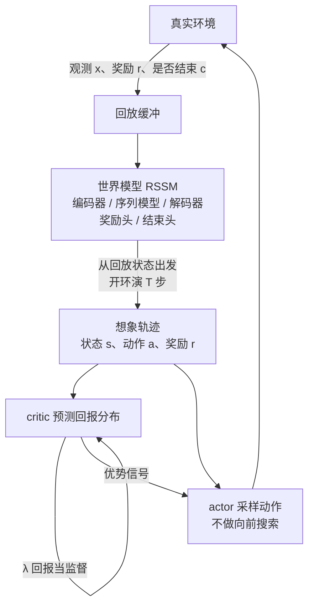

# DreamerV3：换个领域就要调参，世界模型终于做成了开箱即用的通用算法

<!-- release-date: 2023-01-10 -->

> 本文依据 Google DeepMind 的 **Mastering diverse control tasks through world models**（doi:[10.1038/s41586-025-08744-2](https://doi.org/10.1038/s41586-025-08744-2)），本地原件是 *Nature* 640, 647–653（2025）正式版，Received 2024-04-05，Accepted 2025-02-05，Published online 2025-04-02，Open Access CC BY 4.0，共 19 页。同一工作的预印本是 [arXiv:2301.04104](https://arxiv.org/abs/2301.04104)（标题为 *Mastering Diverse Domains through World Models*，v1 于 2023-01-10 提交，v2 于 2024-04-17）。页码一律指本地 19 页 PDF 自身的页码，禁止与旧 arXiv 页码混用。检索未见针对该 doi 的官方勘误；文中数字以这份 Nature 正式版为准。
>
> 文中会明确区分三层：**报告写了什么**、**我们如何解释或推算**、**哪些是外部资料补充**。外部补充一律标出来源并给链接。
>
> 关于 `release-date`：DreamerV3 是一篇算法论文，对象不是可下载的产品模型。Google DeepMind 官方博客检索未见单独的 DreamerV3 发布帖。按本模块约定，这种情况改用**该技术首次官方公开日**，取 arXiv v1 提交日 **2023-01-10**。作者推文、开源代码仓与 Nature 发表都更晚。证据链见文末。

## 先把问题问对：强化学习为什么换个领域就要重调

先不谈任何新名词。假设你手里有一套在机器人走路任务上调得很好的强化学习算法。现在换去做 Atari 游戏，再换去做稀疏奖励的开放世界。

每一次，你都得重新拧旋钮。

论文把这件事写成整个领域的瓶颈：把强化学习算法应用到足够新的任务上——比如从电子游戏搬到机器人——需要大量精力、专业知识和算力去调超参；这种脆弱性既挡住了新问题，也挡住了算力很贵、根本调不起的模型（PDF p.1）。PPO 成了默认选项，但要拿到更高分，人们往往换上针对连续控制、离散动作、稀疏奖励、图像输入、空间环境或棋类的专用算法（PDF p.1）。

所以这篇论文真正要打的，不是某一个基准的新高分。它要打的是这句话：

> **同一套超参，能不能在完全不同的领域里都超过那些专门为该领域调过的算法。**

作者给出的第三代 Dreamer，声称在 8 个领域、超过 150 个任务上做到了这一点（PDF p.1、p.4）。开箱即用时，据作者所知，它还是第一个不靠人类数据或课程、从零在 Minecraft 里挖到钻石的算法（PDF p.1）。

## 和站内已有的世界模型解读怎么分工

站内已经有两篇世界模型方向的解读：[Genie](/reports/Google/Genie) 和 [Cosmos](/reports/NVIDIA/Cosmos)。三篇不要互相打架，先把「世界模型」这条定义对齐，再看各自卡在哪。

Genie 把世界模型收窄成：给定动作，预测下一帧画面。它和普通视频生成模型的差别只有一条——**能不能在中途接受控制**。Cosmos 沿用同一条，只是把「动作」放宽成对世界的扰动，扰动可以是文本、位姿或控制指令。

Dreamer 满足这条定义。它的解码器确实能从潜变量重建画面：给 5 帧上下文和完整动作序列，模型开环预测 45 帧（PDF p.4，图 3）。差别在**用法**：

| | Genie（初代） | Cosmos | DreamerV3（本篇） |
|---|---|---|---|
| 世界模型预测什么 | 下一帧画面 | 下一帧画面 | 下一时刻的潜变量、奖励和是否结束；画面重建是辅助 |
| 控制信号从哪来 | 从无标注视频里学出 8 个潜动作 | 下游场景给进来 | 环境自带的真动作 |
| 学出来之后干什么 | 交给人玩、或当动作标签去克隆策略 | 给机器人当数字世界 | 在想象出来的潜变量轨迹上训练 actor 和 critic |
| 要解决的缺口 | 动作标注太贵 | 手写仿真器写不出来 | 换域就要调参 |

所以本篇不需要解决 Genie 那个「没有动作标签怎么办」，也不需要解决 Cosmos 那个「通用世界底座怎么接到真机器人上」。**它要解决的是：已经有动作、已经能交互，怎样让同一套世界模型加策略，在完全不同的信号尺度上都不崩。**

提醒一个命名习惯：正文多数时候只写 Dreamer。Methods 说，需要区分代际时才称 DreamerV3；DreamerV1 限于连续控制，DreamerV2 在 Atari 上超过人类，DreamerV3 才做到跨基准开箱即用（PDF p.8）。本文跟随 Nature 正文，一般写 Dreamer，需要点名代际时写 DreamerV3。

## 读之前：八个词先各用一句话说清

这一篇的行话密度不低。下面这些词大多不是这篇发明的，属于读这份材料的前置背景。

- **世界模型（world model）**：给定到目前为止的观测和这一步的动作，预测接下来会发生什么。Genie 把它收窄成「预测下一帧」；本篇的世界模型预测的是压缩后的内部状态和奖励，画面重建只是把这个内部状态学扎实。
- **循环状态空间模型（Recurrent State-Space Model，RSSM）**：世界模型的具体结构。一边用循环网络记住历史（确定性状态 $h_t$），一边用一个离散随机变量 $z_t$ 表示「这一帧里还不确定的东西」。两者拼在一起就是模型状态。
- **想象训练（imagination training）**：不把 actor 放到真实环境里试错，而是让世界模型在内部「演」出未来的状态轨迹，actor 和 critic 只在这条假轨迹上学习。
- **演员（actor）与评论家（critic）**：actor 是策略网络，看到当前模型状态就采样一个动作；critic 是价值网络，判断从这个状态出发预期能拿到多少回报。交互时只采样 actor，不做向前搜索（PDF p.3）。
- **回报（return）**：从现在起，把未来奖励按折扣加总。本篇折扣因子 $\gamma=0.997$（PDF p.3）。
- **自由比特（free bits）**：KL 散度低到某个阈值就不再惩罚。本篇把这条阈值设成 1 nat $\approx$ 1.44 bits（PDF p.2）。
- **对称对数（symlog）**：同时压缩大正数和大负数的对数变换，原点附近近似恒等，所以小信号几乎不被碰。
- **回放比（replay ratio）**：每从环境里采集一步，拿多少步已有数据来做梯度更新。它是算力和数据效率之间的旋钮（PDF p.6、p.9）。

本篇真正新放到一起的，不是上面任何一个零件，而是：**把归一化、平衡和变换这三类稳健技巧钉死成一套固定超参，让三件套在跨域时不必重调。**

## 一句话说清 Dreamer 做了什么

Dreamer 同时训练三个网络（PDF p.1–2）：

1. **世界模型**：把感官输入压成离散表示，并预测「如果采取这个动作，下一刻的表示、奖励和是否结束会怎样」。
2. **critic**：在世界模型演出来的抽象轨迹上，判断每个状态值多少。
3. **actor**：选择能走到高价值状态的动作。

三个网络一边和环境交互、一边从回放里学，训练是并发的（PDF p.2）。要让同一套超参打过 150 多个任务，三个网络都必须能吞下完全不同的信号量级，并在各自的损失项之间保持平衡（PDF p.2）。

如果只记一句话，可以记：

> **世界模型负责把环境变成一台可微分的内部模拟器；actor 和 critic 只在这台模拟器里练习；真正让它跨域不崩的，是把所有「会随环境尺度一起漂」的量都钉死。**

规模上，默认模型是 2 亿参数，每套实验跑在单张 Nvidia A100 上（PDF p.4、p.8）。Minecraft 那一项是 1 张 GPU、9 天（PDF p.6）；表里写的是 8.9 个 GPU 日（PDF p.14）。

## 全景：真实交互只负责采集，练习发生在想象里

这张图由我们根据报告图 1 与 Learning algorithm 一节重画（PDF p.2–3），表达的是数据流和职责，不代表实测时序或并行方式。

图 1 把训练拆成左右两半（PDF p.2）：

- **左半，世界模型学习**：编码器把 $x_t$ 压成离散 $z_t$，序列模型用循环状态 $h_t$ 和动作 $a_t$ 预测下一步的 $z$，解码器再把 $z_t$ 重建成 $\hat x_t$，用来把表示学扎实。
- **右半，actor–critic 学习**：从某一时刻起不再看真实画面，只沿着世界模型预测的 $\hat z_t$ 和 $r_t$ 往前走，actor 出动作，critic 出价值。

交互时的动作来自 actor 的直接采样，没有 MuZero 那种向前搜索（PDF p.3）。**世界模型是内部模拟器，不是在线规划器。**

## 世界模型：先把画面变成可预测的内部状态

### 旧问题

要让智能体在「脑子里」预演未来，必须先有一个能一步步往前滚的环境模型。直接在像素上滚代价高，而且不同环境的画面复杂度差几个数量级：复杂场景里有大量与控制无关的细节，简单图形里每个像素都可能决定输赢。以往的世界模型必须按视觉复杂度去改表示损失的权重（PDF p.2）。**这个权重一旦要随环境改，固定超参就做不到。**

### 新设计

本篇把世界模型做成 RSSM（PDF p.2）。人话版只有两句话：

1. 编码器看当前画面 $x_t$ 和历史 $h_t$，抽出一个离散随机变量 $z_t$——它表示「光靠历史还猜不准、必须看这一帧才能知道的东西」。
2. 序列模型不看画面，只看上一刻的 $h_{t-1}$、$z_{t-1}$ 和动作 $a_{t-1}$，更新历史 $h_t$，并预测这一刻的 $z_t$ 会是什么。

$h_t$ 和 $z_t$ 拼在一起，就是模型状态 $s_t \doteq \{h_t, z_t\}$（PDF p.3）。奖励、是否结束、画面重建，都从这个状态读出。

写成式子之前，先记住六个部件各自干什么（PDF p.2）：

$$
\begin{aligned}
h_t &= f_\phi(h_{t-1}, z_{t-1}, a_{t-1}) && \text{序列模型} \\
z_t &\sim q_\phi(z_t \mid h_t, x_t) && \text{编码器} \\
\hat z_t &\sim p_\phi(\hat z_t \mid h_t) && \text{动力学预测} \\
\hat r_t &\sim p_\phi(\hat r_t \mid h_t, z_t) && \text{奖励预测} \\
\hat c_t &\sim p_\phi(\hat c_t \mid h_t, z_t) && \text{结束预测} \\
\hat x_t &\sim p_\phi(\hat x_t \mid h_t, z_t) && \text{解码器}
\end{aligned}
$$

波浪号表示从对应分布采样。$z_t$ 来自一组 softmax 分布构成的向量，采样步用直通梯度（straight-through gradient）回传（PDF p.2）。图像走卷积编解码，向量观测走多层感知机；动力学、奖励、结束预测也是多层感知机（PDF p.2）。

### 工作机制：三条损失，两条梯度闸

给定一段长度为 $T$ 的回放序列，世界模型端到端最小化三项（PDF p.2）：

$$
\mathcal{L}(\phi) \doteq \mathbb{E}_{q_\phi}\!\left[\sum_{t=1}^{T}\bigl(\beta_{\mathrm{pred}}\mathcal{L}_{\mathrm{pred}}(\phi)+\beta_{\mathrm{dyn}}\mathcal{L}_{\mathrm{dyn}}(\phi)+\beta_{\mathrm{rep}}\mathcal{L}_{\mathrm{rep}}(\phi)\bigr)\right]
$$

三项的权重钉死为 $\beta_{\mathrm{pred}}=1$、$\beta_{\mathrm{dyn}}=1$、$\beta_{\mathrm{rep}}=0.1$（PDF p.2）。

预测损失让解码器、奖励头、结束头把当前状态解释清楚：

$$
\mathcal{L}_{\mathrm{pred}}(\phi) \doteq -\log p_\phi(x_t \mid z_t,h_t)-\log p_\phi(r_t \mid z_t,h_t)-\log p_\phi(c_t \mid z_t,h_t)
$$

结束头用逻辑回归；解码器和奖励头用后面要讲的 symlog 平方损失（PDF p.2）。

真正决定「表示长什么样」的是后两项，它们是同一条 KL 散度的两个方向，闸门位置相反（PDF p.2）：

$$
\begin{aligned}
\mathcal{L}_{\mathrm{dyn}}(\phi) &\doteq \max\bigl(1,\,\mathrm{KL}[\mathrm{sg}(q_\phi(z_t \mid h_t,x_t)) \parallel p_\phi(z_t \mid h_t)]\bigr) \\
\mathcal{L}_{\mathrm{rep}}(\phi) &\doteq \max\bigl(1,\,\mathrm{KL}[q_\phi(z_t \mid h_t,x_t) \parallel \mathrm{sg}(p_\phi(z_t \mid h_t))]\bigr)
\end{aligned}
$$

人话是：

- **动力学损失**：冻结编码器抽出的 $z_t$，逼序列模型去猜它。序列模型因此学会「不看画面也能预测下一步」。
- **表示损失**：冻结序列模型的预测，逼编码器把 $z_t$ 抽得更好猜。表示因此不会变成「画面压缩得很漂亮、但完全不可预测」的码。

`sg(·)` 是停止梯度。两边各冻一侧，才不会出现「编码器把信息藏起来、预测器跟着偷懒」或者「预测器把表示拉成对自己方便、对人无意义的码」。表示损失还让他们能用因子化的动力学预测器，想象训练时采样更快（PDF p.2）。

KL 下面还有一道夹子：$\max(1,\cdot)$。这就是自由比特。KL 已经低于 1 nat 时，这两项关掉，学习全部回到预测损失上（PDF p.2）。

为什么必须有这道夹子？如果没有，优化器可以走一条退化路：让动力学极其好猜，但 $z_t$ 不再携带关于输入的信息（PDF p.2）。夹子把「足够好猜」封顶，剩下的容量必须拿去解释画面和奖励。

先前的世界模型必须按场景复杂度去改表示损失的权重（PDF p.2）。复杂场景要更强的正则，把无关细节挤掉；简单图形要更弱的正则，才能保住单个像素。本篇的答案是：**自由比特加上很小的 $\beta_{\mathrm{rep}}=0.1$，把这条权衡从「按环境手调」变成「固定超参」。** 向量观测再先做一次 symlog，避免大输入把重建梯度撑爆，进一步稳住这条权衡（PDF p.2）。

分类分布还掺了 1% 均匀分布、99% 网络输出，让编码器与动力学预测器不可能变成确定性分布，从而避免 KL 尖峰（PDF p.3）。这就是后文超参表里的 latent unimix（PDF p.17）。

### 收益

- 同一套世界模型损失在视觉复杂度和向量观测之间都能用，不再按环境改 $\beta_{\mathrm{rep}}$。
- 学到的 $h_t$ 近似马尔可夫，actor 和 critic 不必自己再记长期依赖（PDF p.3）。
- 开环视频预测说明表示里确实装着环境结构：迷宫和四足机器人上，5 帧上下文加动作序列，可预测 45 帧（PDF p.4，图 3）；Minecraft 上同样设置见扩展数据图 1（PDF p.11）。

### 代价与边界

- **重建不是任务目标。** 图 3 和扩展数据图 1 是定性展示。Minecraft 的开环预测在水面、洞穴里会糊，论文没有给预测误差的定量曲线。
- **想象视野是短的。** 主文把预测视野写成 $T=16$（PDF p.3）；超参表把 Imagination horizon 写成 $H=15$（PDF p.17）。两者可能是「16 个时间点 / 15 步转移」的计数差，论文没有解释。无论取哪个，都远短于 Minecraft 一局最多 36,000 步（PDF p.5）。长程信用必须靠 critic 的自举，而不是靠世界模型把整局演完。
- **离散 $z_t$ 的码数随模型变。** 扩展数据表 4 给出每组潜变量的码数是 $d/16$，默认 2 亿参数时为 64（PDF p.16）。潜变量组数在这份 19 页 PDF 里没有写，补在 Supplementary Information 中，本文拿不到。

### 可迁移启发

> **当两条损失互相拉扯时，先问哪一侧该被钉死。** 本篇用停止梯度把「可预测」和「有信息」拆成两个方向，再用自由比特把「足够好」封顶。任何「压缩表示 + 预测未来」的系统都可以套：表示既不能太好猜（没信息），也不能太难猜（后面的模型学不会）。

## 想象训练：actor 和 critic 不碰真实环境

### 旧问题

模型无关的强化学习必须在真实环境里试错。真实环境慢、贵、而且奖励尺度完全不统一。有了世界模型之后，直觉上应该能在模型里练习——但这件事一直不稳（PDF p.1）。不稳的根源很具体：critic 要回归的目标依赖它自己的预测；actor 的熵正则该多大，取决于奖励又有多密、又有多大。

### 新设计

actor 和 critic **只**从世界模型演出来的抽象轨迹里学行为（PDF p.3）。交互时，动作就是 actor 的一次采样，没有向前看。

从回放里的真实表示出发，世界模型和 actor 一起生成一条想象轨迹：模型状态 $s_{1:T}$、动作 $a_{1:T}$、奖励 $r_{1:T}$、结束标志 $c_{1:T}$（PDF p.3）。critic 预测的是回报的分布，读出时取期望 $v_t \doteq \mathbb{E}[v_\psi(\cdot \mid s_t)]$。

为了把视野 $T$ 之后的奖励也算进去，他们用自举的 $\lambda$ 回报（PDF p.3）：

$$
\begin{aligned}
R_t^\lambda &\doteq r_t + \gamma c_t\bigl((1-\lambda)v_t + \lambda R_{t+1}^\lambda\bigr) \\
R_T^\lambda &\doteq v_T
\end{aligned}
$$

$c_t \in \{0,1\}$ 是结束标志：一结束，后面的价值就不再加。超参表里 $\lambda=0.95$，$\gamma=0.997$，对应的折扣视野 $1/(1-\gamma)=333$（PDF p.17）。

critic 用最大似然去拟合这条 $\lambda$ 回报的分布（PDF p.3）：

$$
\mathcal{L}(\psi) \doteq -\sum_{t=1}^{T} \ln p_\psi(R_t^\lambda \mid s_t)
$$

输出不是高斯，而是指数分箱的分类分布——后面 symexp two-hot 那一节会讲为什么。critic 损失打在两条轨迹上：想象轨迹的权重 $\beta_{\mathrm{val}}=1$，回放轨迹的权重 $\beta_{\mathrm{repval}}=0.3$（PDF p.3）。回放那条用想象轨迹起点的 $R_t^\lambda$ 当作在线价值标注，再沿着回放奖励算 $\lambda$ 回报（PDF p.3）。

因为 critic 在回归依赖自身预测的目标，他们让 critic 向自己参数的指数滑动平均靠拢。这类似 DQN 的目标网络，但算回报时仍用当前 critic（PDF p.3）。奖励头和 critic 的输出权重矩阵初始化为零，避免训练一开始就幻造出巨大奖励、把学习推迟（PDF p.3）。超参表把这条 critic EMA 衰减写成 0.98（PDF p.17）。

### actor：把回报尺度钉到大约 $[0,1]$，但留下稀疏度

actor 要最大化回报，同时用熵正则探索。麻烦在于：熵该有多强，既取决于奖励有多大，也取决于奖励有多密。理想情况是——奖励稀疏就多探索，奖励密集就多利用；同时，探索量不该被环境把奖励乘上 1000 这种任意缩放带着跑（PDF p.3）。

他们把熵系数钉死为 $\eta=3\times 10^{-4}$，为此需要把回报归一化到大约 $[0,1]$（PDF p.3）。减一个偏移不影响 actor 梯度，所以只需除以范围 $S$。为了避免稀疏奖励下把函数近似的噪声放大，**只有幅度超过 $L=1$ 的回报才被缩小，小回报原样不动**（PDF p.3）。离散和连续动作都用 Reinforce（PDF p.3）：

$$
\mathcal{L}(\theta) \doteq -\sum_{t=1}^{T}\mathrm{sg}\!\left(\frac{R_t^\lambda-v_t}{\max(1,S)}\right)\log\pi_\theta(a_t \mid s_t)+\eta\,H[\pi_\theta(a_t \mid s_t)]
$$

$S$ 不能取「这一批里最小到最大」。随机化环境里，偶尔一局能拿到别人拿不到的高分，用极值会把回报除得太小。他们改用第 5 到第 95 百分位，再做衰减 0.99 的指数滑动平均（PDF p.3）：

$$
S \doteq \mathrm{EMA}\bigl(\mathrm{Per}(R_t^\lambda,95)-\mathrm{Per}(R_t^\lambda,5),\,0.99\bigr)
$$

这和常见的「归一化优势」不是同一件事。归一化优势会把回报和熵始终放在同一量级，不管当前够不够得到可观回报；稀疏时把优势放大，噪声会压过熵正则，探索停滞。按标准差归一化奖励或回报，在奖励几乎恒为零时标准差接近 0，奖励会被放得过大。约束优化去追一个固定平均熵，稳健但稀疏时探索慢、密集时收敛偏低。作者说这些做法都找不到跨域稳定的超参（PDF p.3–4）。**带下限的回报归一化**才同时满足：稀疏时探索快，密集时也能收敛到高分（PDF p.4）。

### 收益

- actor 的熵系数可以固定，不再随奖励尺度改。
- 小回报不被放大，稀疏环境里的噪声不会把探索冲掉。
- 百分位范围抗住了多峰和离群回报。

### 代价与边界

- **Reinforce 对双方都用，没有重参数化技巧的对照。** 连续动作本可以用重参数化，论文选择统一成 Reinforce，没有给这条消融。
- **$L=1$ 是一条硬阈值。** 它把「什么叫小回报」写死了。如果某个环境的有意义回报天然就在 $10^{-3}$ 量级，这条阈值会把它们当成「已经够小、不必再除」。论文没有讨论这种环境。
- **critic 的 EMA 正则和零初始化只有机制说明，没有单独消融数字。** 图 6 的消融打包的是「回报归一化」和「symexp two-hot」，不是这两条实现细节（PDF p.6）。

### 可迁移启发

> **归一化时先问：你想抹掉的是尺度，还是频率。** 优势归一化把两者一起抹掉；标准差归一化在稀疏时会把频率信息放大成噪声。本篇只除以「回报有多大」，并且对已经很小的量不动。任何「既有稀疏信号又有任意缩放」的损失都可以套这个模子。

## 稳健预测：把梯度从信号尺度上解耦

这一节是跨域能成立的第三根柱子。世界模型要重建观测、预测奖励；critic 要预测回报。这些量的尺度跨环境可以差几个数量级（PDF p.4）。

### 旧问题

大目标用平方损失会散；L1 和 Huber 会让学习停滞；按滑动统计量做归一化会引入非平稳（PDF p.4）。三条路都不适合「同一套超参打所有环境」。

### 新设计一：symlog 平方误差

网络不直接预测 $y$，而是预测 $\mathrm{symlog}(y)$；读出时再做逆变换（PDF p.4）：

$$
\mathcal{L}(\theta) \doteq \tfrac12\bigl(f(x,\theta)-\mathrm{symlog}(y)\bigr)^2,\qquad \hat y \doteq \mathrm{symexp}\bigl(f(x,\theta)\bigr)
$$

普通对数处理不了负数，所以他们从双对称对数族里取了一对互逆函数，并命名为 symlog / symexp（PDF p.4）：

$$
\begin{aligned}
\mathrm{symlog}(x) &\doteq \mathrm{sign}(x)\,\log(|x|+1) \\
\mathrm{symexp}(x) &\doteq \mathrm{sign}(x)\,(\exp(|x|)-1)
\end{aligned}
$$

大正数和大负数都被压扁，优化可以很快把预测推到需要的大值；原点附近它近似恒等，小目标几乎不被碰（PDF p.4）。先前有人给 critic 用过不对称变换，作者说在跨域平均上不如这一对（PDF p.4）。

向量观测的编码器输入和解码器目标都走 symlog（PDF p.4）。

### 新设计二：symexp two-hot

奖励和回报是带噪声的目标。网络输出一组指数分箱上的 softmax，预测值是箱位置的加权平均（PDF p.4）：

$$
\hat y \doteq \mathrm{softmax}(f(x))^{T} B,\qquad B \doteq \mathrm{symexp}([-20\,\ldots\,+20])
$$

加权平均可以落在两个箱子之间，所以网络能输出支撑区间里的任意连续值（PDF p.4）。训练目标是 two-hot：一个标量被编码成长度为 $|B|$ 的向量，只有最靠近的两个箱子非零，权重按距离线性分配，和为 1（PDF p.4）。损失是带软标签的交叉熵：

$$
\mathcal{L}(\theta) \doteq -\mathrm{twohot}(y)^{T}\log\mathrm{softmax}(f(x,\theta))
$$

关键性质：**梯度只取决于箱子上的概率，不取决于箱子对应的连续值，从而把梯度大小从信号尺度上彻底解开**（PDF p.4）。

主文把奖励头和 critic 用的损失写成「synexp two-hot」（PDF p.4），后文和超参表都写 symexp（PDF p.8、p.17）。按公式，这就是同一套 $\mathrm{symexp}$ 分箱，主文那一处是排印笔误（本文判断）。

Methods 把 two-hot 的第 $i$ 个分量写清楚了（PDF p.9）。先找到满足 $b_k \le x < b_{k+1}$ 的那两个相邻箱子，再按到两端的距离分配权重。输出权重零初始化，避免一上来就幻造奖励和价值（PDF p.9）。指数分箱跨越很多数量级时，求和顺序会影响期望读出：正负箱子要分开、从小到大加，再合并；论文让读者去看源码实现（PDF p.9）。

### 收益

这两套变换让观测重建、奖励预测和价值预测都可以用固定超参（PDF p.4）。消融里，去掉 symexp two-hot（改回 Huber）会掉分，重要性排在 KL 平衡 + 自由比特和回报归一化之后（PDF p.6，图 6a）。

### 代价与边界

- **分箱范围 $[-20,20]$ 经 $\mathrm{symexp}$ 之后是 $\pm(e^{20}-1)$，大约 $\pm 4.85\times 10^{8}$。** 论文没有讨论溢出这个范围会怎样，也没有给箱子个数。
- **观测走 symlog 平方，奖励和回报走 two-hot，是两种不同的解耦。** 前者仍是回归，只是在压缩后的空间里；后者连回归都取消了，改成分类。论文没有解释为什么观测不也走 two-hot。

### 可迁移启发

> **与其改损失函数去迁就大数，不如先问：梯度有没有必要看见那个大数。** two-hot 把「预测对不对」变成「概率质量放对箱子没有」，数值再大也不进梯度。任何会遇到跨数量级目标的回归头都可以先试这一步。

## 把三件稳健技巧收成一张清单

Methods 把 DreamerV3 相对前两代的改动收成四类（PDF p.8）。其中真正支撑「固定超参」的是第一类：

| 类别 | 具体做法 | 它钉死的是什么 |
|---|---|---|
| 稳健技巧 | 观测 symlog；KL 平衡 + 自由比特；RSSM 与 actor 的 1% unimix；百分位回报归一化；奖励头和 critic 的 symexp two-hot | 信号尺度、KL 退化、零概率、熵与回报的相对大小 |
| 网络结构 | block GRU、RMSNorm、SiLU | 大循环状态的参数量与激活尺度 |
| 优化器 | 自适应梯度裁剪、LaProp（先 RMSProp 再动量） | 损失权重改了不必重调裁剪阈；Adam 偶发的不稳 |
| 回放 | 更大容量、在线队列、存储并回写潜状态 | 想象训练的起点质量和实现方便 |

后三类是让默认 2 亿参数跑得动的工程选择。消融图 6a 定量打过的，是第一类里的观测 symlog、回报归一化、symexp two-hot、以及 KL 平衡 + 自由比特（PDF p.6）。unimix、LaProp、block GRU 没有出现在那张消融图里。

## Minecraft：开箱即用挖到钻石，这句话成立到哪一步

这一节是全篇最强的叙事，也是最需要把限定词留住的地方。

### 任务本身有多难

每一局 Minecraft 都在一个随机生成的无限三维世界里。一局打到玩家死亡，或最多 36,000 步、相当于 30 分钟；这段时间里要从稀疏奖励中发现 12 件物品，靠采集和合成往上爬（PDF p.5）。有经验的人类大约 20 分钟拿到钻石（PDF p.5）。作者把这 12 个里程碑写成：原木、木板、木棍、工作台、木镐、圆石、石镐、铁矿、熔炉、铁锭、铁镐、钻石（PDF p.9）。每件物品每局只奖一次 $+1$，智能体必须学会把某些物品采多次才能做下一件（PDF p.9）。另外对每个失去的心 $-0.01$、每个恢复的心 $+0.01$，但作者说没有研究过这是否有用（PDF p.9）。

环境基于 MineRL v0.4.4，游戏版本 1.11.2（PDF p.9）。观测是 $64\times 64\times 3$ 的第一人称图像、400 多种物品的背包计数、本局背包历史峰值（用来告诉智能体已经达成哪些里程碑）、当前装备的 one-hot，以及生命、饥饿、氧气的标量（PDF p.9）。控制频率 20 Hz（PDF p.9）。

### 动作空间不是键盘鼠标，敲方块被加速了

这两条限定必须先说，否则「从零挖到钻石」会被读成 VPT 那个设定。

MineRL 竞赛环境给的是一套复杂的字典动作。作者把它压成 25 个离散动作，列在扩展数据表 7（PDF p.10、p.19）：空操作、攻击、四个转视角、四个走、向前跳、放土、合成木板 / 木棍 / 工作台 / 木镐 / 石镐 / 铁镐、放置工作台、装备三种镐、合成熔炉、放置熔炉、炼铁锭。跳跃动作同时按下跳和前进，因为离散动作一次只能选一个，单按跳只能原地跳（PDF p.10）。

敲方块在原版里要连续按住左键几秒，20 Hz 下是几百步。对一个均匀的 25 路策略，已经对准一块木头时敲开的概率是 $1/25^{400}\approx 10^{-560}$（PDF p.10）。作者认为「学会连续几百步按同一个键」不是 Minecraft 作为 AI 挑战的核心，于是跟随先前工作加快了破坏速度，让方块在几步内就能敲开（PDF p.10）。调过的基线在这个环境里仍然很难，说明加速之后任务没有变简单到随便就能解（PDF p.10）。

他们还修了原版环境的几个坑：敲开钻石矿有时物品弹进背包、有时掉在地上，原版在敲开时就结束一局，导致很多成功轨迹拿不到奖励——他们改成死亡或 36,000 步才结束；跳跃键按得太快会被游戏丢掉，他们按住 200 ms；俯仰角限制在 120° 以免奇点（PDF p.9）。

和两条著名基线的动作空间对比，论文自己写得很清楚（PDF p.10）：

- **Voyager**：用 MineFlayer 脚本库的高层动作，比如「自动探索直到找到某种资源」「在 32 米内自动开采指定材料」，观测也是高层语义而不是图像。
- **VPT**：用鼠标移动来合成，不加速敲方块，比 MineRL 竞赛动作空间更难，但更容易对齐人类数据；它还设计了 121 种注视鼠标动作和 4,230 种有意义按键组合的分层动作空间。
- **本篇**：推荐在想要简单设定时用 MineRL 竞赛环境加这 25 个离散动作；给语言模型用 Voyager；有人类数据时用 VPT。

所以「从零、不靠人类数据」成立，但**动作抽象程度和敲方块速度都比 VPT 宽松**。论文没有回避这一点。

### 结果

因为这个域训练时间长，精细调参本身就不现实，所以他们把默认超参直接套上去（PDF p.5）。图 5 和扩展数据图 2 是主要证据（PDF p.6、p.12）：

- 据作者所知，Dreamer 是第一个从稀疏奖励、不靠人类数据或课程、完成全部 12 个钻石里程碑的算法（PDF p.6）。
- **所有** Dreamer 智能体都在 1 亿环境步内发现了钻石；对比的 PPO、Rainbow、IMPALA 能推进到铁镐，但没有一个发现钻石（PDF p.5–6）。Minecraft 跑了 10 个种子，就是为了可靠报告「有多少次跑出了钻石」（PDF p.8）。
- 聚合分数：Dreamer 回报 9.1，PPO 5.1，IMPALA 7.1，Rainbow 6.3（PDF p.13，扩展数据表 1）。回报上限是 12 个里程碑各 +1，外加生命值的小奖励，所以 9.1 的意思是：平均能走到铁这一档，钻石本身仍然稀。
- 算力对照：VPT 用 720 张 GPU 跑 9 天、先行为克隆再强化学习才拿到钻石；Dreamer 用 MineRL 竞赛动作空间、1 张 GPU 跑 9 天、没有人类数据（PDF p.6）。

扩展数据图 2 按物品拆开看成功率（PDF p.12，以下为读图所得，正文没有表格）：Dreamer 在原木到石镐上明显高过三条基线，并且在铁矿、铁锭、铁镐、钻石上仍在 1 亿步附近继续爬。钻石的「每局获得率」纵轴上限是 1%，曲线在后期大约爬到百分之一的量级——和「每个种子都发现过、但并不是每局都挖到」这两句话同时成立。

作者项目页还写过「第一颗钻石出现在 3,000 万环境步，约 17 天游戏时间」。这句话**不在**这份 19 页 Nature PDF 里，只作为外部补充，见文末。

### 这句话该怎么读

「第一个不靠人类数据从零挖到钻石」在论文自己的限定下成立：MineRL 竞赛动作空间、加速敲方块、稀疏的 12 段里程碑奖励、默认超参、10 个种子全部成功。把它读成「在和人类玩家相同的键盘鼠标上、不加速、从像素端到端挖到钻石」，就读过头了。VPT 走的是后一条更难的路，但用了人类数据和 720 张 GPU（PDF p.6、p.10）。

## 跨域数字：一张表对八个领域

评测设计是：拿 Dreamer 的固定超参，去和文献里为该基准专门设计和调过的最好方法比；再加一条高质量、同样固定超参的 PPO，超参选来让它跨域尽量强，并在 ProcGen 上复现过官方调优 PPO 的分数（PDF p.4）。所有 Dreamer 智能体各用一张 A100（PDF p.4）。公开实现声称能复现全部结果（PDF p.4），代码在 https://github.com/danijar/dreamerv3（PDF p.10）。

八个领域覆盖连续 / 离散动作、视觉 / 低维输入、稠密 / 稀疏奖励、不同奖励尺度、二维 / 三维、程序化生成（PDF p.4）。图 4 是条形图总览，精确数字在扩展数据表 1（PDF p.5、p.13）：

| 基准 | 分数口径 | Dreamer | PPO | 调优专家 A | 调优专家 B |
|---|---|---:|---:|---|---|
| Minecraft | 回报 | **9.1** | 5.1 | IMPALA 7.1 | Rainbow 6.3 |
| DMLab | 封顶均值 | **71** | 36 | IMPALA（10× 数据）66 | R2D2+（10× 数据）65 |
| ProcGen | 归一化均值 | **72** | 43 | PPG 65 | Rainbow 55 |
| Atari | 玩家中位数 | **830** | 180 | MuZero 693 | Rainbow 223 |
| Atari100k | 玩家均值 | **125** | 11 | IRIS 105 | TWM 96 |
| BSuite | 任务均值 | **66** | 49 | Boot DQN 60 | DQN 54 |
| DMC Vision | 任务均值 | **802** | 206 | DrQ-v2 705 | TD-MPC2 634 |
| DMC Proprio | 任务均值 | **843** | 205 | DMPO 834 | TD-MPC2 825 |

这张表由扩展数据表 1 转写（PDF p.13）。几点读法：

- **Dreamer 在 8 项里 7 项是最高，DMC Proprio 以 843 对 DMPO 的 834，论文正文写成「匹配」该基准的当时最好水平**（PDF p.5）。表上 843 > 834，和「匹配」并不矛盾——差距很小，而且 DMPO、TD-MPC2 是为连续控制调过的。
- **PPO 在所有领域都明显落后。** 这是「通用且固定超参」这条对比里最干净的一列：同一套 PPO 超参跨域，同一套 Dreamer 超参跨域。
- **DMLab 的对照给了基线 10 倍数据。** Dreamer 在 1 亿帧上超过 IMPALA 和 R2D2+ 在 10 亿步上的成绩，论文写成超过 1,000% 的数据效率收益；并提醒这些基线本就不是为数据效率设计的（PDF p.5）。
- **Atari 上超过 MuZero，用的算力只是其一部分**（PDF p.5）。具体倍数正文没给。
- **Atari100k 上 EfficientZero 仍是该设定的最好，但它做了在线树搜索、优先回放、超参调度，并且会提前重置关卡来增加数据多样性，比较困难**（PDF p.5）。去掉这些复杂性之后，Dreamer 超过剩下的 IRIS、TWM、SimPLe 和模型无关的 SPR（PDF p.5）。扩展数据表 3 把协议差异摊开：Dreamer 的玩家均值 125、中位数 49；TWM 均值 96、中位数 51——**Dreamer 赢在均值，中位数略低于 TWM**（PDF p.15）。Dreamer 没有在线规划、数据增强、非均匀回放、单独超参、提高分辨率、生命信息、提前重置、单独评估局（PDF p.15）。
- **BSuite 有 23 个环境、共 468 种配置**，专门测信用分配、奖励尺度稳健、随机性、记忆、泛化和探索；Dreamer 在尺度稳健这一类上相对先前算法提升尤其明显（PDF p.5）。
- **Visual Control 上超过专门靠数据增强吃视觉的 DrQ-v2 和 TD-MPC2**（PDF p.5）。作者还点了一句：TD-MPC2 的代码对视觉输入做了数据增强和帧堆叠，论文里没写，但对它的成绩至关重要；训练时间是本体感觉 1.3 天、像素 8.0 天（PDF p.8）。

各基准的步数预算、动作重复、环境实例、回放比、GPU 日和模型大小在扩展数据表 2（PDF p.14）：

| 基准 | 任务数 | 环境步 | 动作重复 | 实例 | 回放比 | GPU 日 | 模型 |
|---|---:|---:|---:|---:|---:|---:|---|
| Minecraft | 1 | 1 亿 | 1 | 64 | 32 | 8.9 | 2 亿 |
| DMLab | 30 | 1 亿 | 4 | 16 | 32 | 2.9 | 2 亿 |
| ProcGen | 16 | 5,000 万 | 1 | 16 | 32 | 8.3 | 2 亿 |
| Atari | 57 | 2 亿 | 4 | 16 | 32 | 7.7 | 2 亿 |
| Atari100k | 26 | 40 万 | 4 | 1 | 128 | 0.1 | 2 亿 |
| BSuite | 23 | — | 1 | 1 | 1024 | 0.5 | 2 亿 |
| DMC Vision | 20 | 100 万 | 1 | 16 | 256 | 1.2 | 2 亿 |
| DMC Proprio | 20 | 100 万 | 1 | 16 | 1024 | 1.5 | **100 万** |

默认模型是 2 亿参数；本体感觉控制是表上唯一改小的，用了 100 万参数（PDF p.8、p.14）。回放比按步数预算来选：数据越少、回放比越高。Atari 上回放比 32、动作重复 4、batch 形状 $16\times 64$，相当于每 128 个环境步一次梯度，2 亿环境步共 150 万次梯度（PDF p.9）。

协议上，有既定标准的都跟标准走：Atari 57 个游戏加 sticky action；ProcGen 用 hard 和无限关卡集；Minecraft 他们自己把评测口径定为 1 亿步时的回合回报，约等于 100 天游戏内时间（PDF p.8）。种子：Dreamer 和 PPO 每个基准 5 个，BSuite 10 个（基准要求），Minecraft 10 个；曲线是均值，阴影是一个标准差（PDF p.8）。默认 16 个环境实例；BSuite 和 Atari100k 用 1 个，Minecraft 用 64 个远程 CPU worker（PDF p.8）。

PPO 对照不是稻草人。他们用 Acme 里的高质量实现，按文献建议调了 epoch 批量、学习率、熵系数，折扣因子对齐 Dreamer，网络用 IMPALA 结构，minibatch 尽量塞满一张 A100；并在 ProcGen 上验证达到或略超过 PPO 作者公布的高度调优实现（PDF p.8）。同等回放比下训练时间和 Dreamer 相当；回放比 32 时大约比 Dreamer 快 10 倍，因为它本来就更少复用经验（PDF p.8）。Minecraft 上额外跑了调过的 IMPALA 和 Rainbow，因为文献里还没有成功的端到端从零学习报告（PDF p.8）。

## 消融：每一项都只在一部分任务上致命

图 6a、6b 在 14 个多样任务的均值上看稳健技巧和学习信号（PDF p.6）。单任务曲线在 Supplementary Information，不在这 19 页里。

**稳健技巧**（图 6a）：每一项都对平均分有贡献，最显著的是世界模型目标里的 KL 平衡 + 自由比特，其次是回报归一化和奖励 / 价值的 symexp two-hot（PDF p.5–6）。作者给的读法很重要：**每一项都只在任务的一个子集上关键，在别的任务上可能几乎没影响**（PDF p.5）。所以「去掉全部」掉得最狠，但你不能从均值曲线反推出「每一项在每一个任务上都必要」。

**学习信号**（图 6b）：停掉价值梯度、停掉奖励和价值梯度、停掉重建梯度，三条都画了。结论是 Dreamer 的性能主要建立在世界模型的无监督重建损失上，而先前大多数算法主要靠奖励和价值预测梯度（PDF p.6）。这条发现被用来暗示未来可以在无监督数据上预训练世界模型（PDF p.5）。

读图时注意纵轴是「14 个任务均值的回报百分比」，横轴是环境步的百分比（PDF p.6）。具体数值正文没有表，本文不引用读图近似值当作精确数字。

## 缩放：模型更大，不但分更高，数据也更省

他们在 Crafter 和一个 DMLab 任务上训了 6 档模型，从 1,200 万到 4 亿参数，以及不同回放比（PDF p.5–6）。超参在这些档位之间仍然固定，包括学习率和 batch size（PDF p.8）。

图 6c、6d 的结论（PDF p.6）：

- 固定超参下，学习在比较过的模型大小和回放比上都稳健。
- **模型变大，最终分数变高，而且达到同样行为所需的环境交互变少。**
- 增加梯度步数（提高回放比）进一步减少所需交互。

这是给使用者的可预测旋钮：想要更高分或更少交互，加参数或加回放比，不必重搜超参（PDF p.6）。

模型大小由隐藏维 $d$ 参数化，大约按 1.5 倍一档，在 2 的幂和 1.5 倍 2 的幂之间交替，好让张量形状是 8 的倍数（PDF p.8）。扩展数据表 4（PDF p.16）：

| 参数量 | $d$ | 循环单元 $8d$ | 卷积通道 $d/16$ | 每组潜变量码数 $d/16$ |
|---|---:|---:|---:|---:|
| 100 万 | 64 | 512 | 16 | 4 |
| 1,200 万 | 256 | 2,048 | 16 | 16 |
| 2,500 万 | 384 | 3,072 | 24 | 24 |
| 5,000 万 | 512 | 4,096 | 32 | 32 |
| 1 亿 | 768 | 6,144 | 48 | 48 |
| 2 亿 | 1,024 | 8,192 | 64 | 64 |
| 4 亿 | 1,536 | 12,288 | 96 | 96 |

MLP 隐藏单元等于 $d$；序列模型有 $8d$ 个循环单元，切成 8 块，每块大小等于 MLP；最靠近数据的卷积通道和每组潜变量码数按 $d/16$ 走；隐藏层数和潜变量组数跨档固定（PDF p.8）。注意 100 万这一档的卷积通道表里是 16，不是 $64/16=4$，和表头公式不一致，码数那一列倒是 4。论文没有解释这个例外。

缩放实验的边界也要说清（本文判断）：

- 只在 Crafter 和一个 DMLab 任务上做过，不是 150 个任务的缩放定律。
- 纵轴是任务回报，不是世界模型预测误差，所以「更大更强」指的是下游控制，不是开环预测更准。
- 1,200 万到 4 亿是等超参、变宽度，不是等算力最优曲线。

## 实现上还有几处不显眼、但跨域靠它们才跑得住

### block GRU

序列模型是带块对角循环权重的 GRU，8 块，为的是循环单元可以很多、参数和计算却不按平方涨（PDF p.9）。每一步送进 GRU 的是 $z_t$ 的线性嵌入、动作 $a_t$ 的线性嵌入，以及循环状态本身，好让块与块之间能混合（PDF p.9）。图像用步长 2 的卷积压到 $6\times 6$ 或 $4\times 4$ 再展平，解码用转置卷积，输出加 sigmoid；向量观测先 symlog 再走三层 MLP；actor 和 critic 也是三层 MLP，奖励头和结束头是一层 MLP（PDF p.9）。

### LaProp 和自适应梯度裁剪

自适应梯度裁剪：某个张量的梯度超过对应权重矩阵 L2 范数的 30% 就裁，默认 $\epsilon=10^{-3}$（PDF p.9）。它把裁剪阈从损失尺度上解开，改损失或改损失权重时不必重调裁剪（PDF p.9）。优化器用 LaProp，$\epsilon=10^{-20}$，$\beta_1=0.9$，$\beta_2=0.99$：先做 RMSProp 归一，再动量平滑，而不是像 Adam 那样对原始梯度同时算动量和归一化（PDF p.9）。作者说这个改动允许更小的 $\epsilon$，并避开了他们在 Adam 下偶尔看到的不稳（PDF p.9）。

扩展数据表 5 是那套跨域固定超参的完整清单（PDF p.17）。不用退火、优先回放、权重衰减或 dropout（PDF p.9）。

| 名称 | 符号 | 取值 |
|---|---|---|
| 回放容量 | — | $5\times 10^6$ |
| Batch 大小 / 长度 | $B$ / $T$ | 16 / 64 |
| 激活 | — | RMSNorm + SiLU |
| 学习率 | — | $4\times 10^{-5}$ |
| 梯度裁剪 | — | AGC(0.3) |
| 优化器 | — | LaProp（$\epsilon=10^{-20}$） |
| 重建 / 动力学 / 表示损失权重 | $\beta_{\mathrm{pred}},\beta_{\mathrm{dyn}},\beta_{\mathrm{rep}}$ | 1 / 1 / 0.1 |
| 潜变量 unimix / 自由 nat | — | 1% / 1 |
| 想象视野 | $H$ | 15 |
| 折扣视野 | $1/(1-\gamma)$ | 333 |
| Return $\lambda$ | $\lambda$ | 0.95 |
| critic 损失 / 回放损失权重 | $\beta_{\mathrm{val}},\beta_{\mathrm{repval}}$ | 1 / 0.3 |
| critic EMA 正则 / 衰减 | — | 1 / 0.98 |
| actor 损失权重 / 熵系数 / unimix | $\beta_{\mathrm{pol}},\eta$ | 1 / $3\times 10^{-4}$ / 1% |
| 回报归一化 $S$ | $S$ | $\mathrm{Per}(R,95)-\mathrm{Per}(R,5)$ |
| 回报归一化下限 / 衰减 | $L$ | 1 / 0.99 |

主文把预测视野写成 $T=16$（PDF p.3），这张表写成 $H=15$（PDF p.17）。引用时两处都要看。

### 回放：在线队列加均匀采样，潜状态写进缓冲

每个 minibatch 先装不重叠的在线轨迹，再用回放里均匀采样的轨迹填满（PDF p.9）。采集时把潜状态存进回放，用来初始化世界模型在回放轨迹上的滚动；训练滚动得到的新潜状态再写回缓冲（PDF p.9）。他们发现优先回放也能提升 Dreamer，但实验里为了实现简单选择均匀回放（PDF p.9）。

回放比的定义是：不考虑动作重复，每从环境采集一步、拿多少步已有数据来训练。再除以 minibatch 的时间步数和动作重复，才是梯度步对环境步的比（PDF p.9）。

### PPO 对照的超参

扩展数据表 6 列出了那条跨域 PPO 的固定超参（PDF p.18）：观测和奖励都归一化，奖励按标准差裁到 10，epoch 批量 $64\times 256$，3 个 epoch，minibatch 大小 8、长度 256，策略信任域 0.2，不做价值信任域，做优势归一化，熵系数 0.01，折扣 0.997，GAE $\lambda=0.95$，学习率 $3\times 10^{-4}$，梯度裁剪 0.5，Adam $\epsilon=10^{-5}$。

## 报告自己把 Dreamer 放在哪条线上

通用算法这条线：PPO 稳健但吃数据、常低于专用方法；MuZero 在离散动作上做规划，但作者没发实现、组件复杂、难复现；Gato 用一个模型拟合多任务专家演示，但不能自主改进。Dreamer 的定位是：固定超参、不需要专家数据、实现开源（PDF p.6）。

世界模型这条线：PILCO、E2C、Visual Foresight 是早期用动力学模型做强化学习的工作；PlaNet 做出了准到能从像素规划的潜动力学；IRIS 和 TWM 把 transformer 接进来；R2I 用结构化状态空间模型做长记忆；TD-MPC2 学确定性动力学，把策略网络和经典规划结合起来，并且用了 Dreamer 的百分位回报归一化（PDF p.6）。

Minecraft 这条线：MineRL 提供竞赛环境和人类数据集；VPT 录承包商的键盘鼠标做行为克隆再强化学习；Voyager 用语言模型调 MineFlayer 的高层命令（PDF p.6）。Dreamer 不走人类数据，也不走高层脚本。

这些对照是定位，不是逐项复现。MuZero 没发实现，算力「只是其一部分」没有倍数；Gato 不能自主改进是定性对比。

## 报告没有写的，和报告写了但这份 PDF 里没有的

Supplementary Information 在 Nature 页面上随文提供，不在这 19 页本地 PDF 里。论文多次把「单任务分数和训练曲线」「Atari 的随机 / 人类参考分」「与 VPT、Voyager 的补充对照」指到那里（PDF p.5、p.8）。本文不从旧 arXiv 附录里把那些数字搬过来冒充 Nature 版。

这份 19 页里确认没有的：

- **潜变量组数、two-hot 箱子个数、卷积层数。** 表 4 只给了每组码数和通道数。
- **单任务分数。** 只有 8 个领域的聚合分。
- **开环预测的定量误差。** 图 3 和扩展数据图 1 是样例。
- **unimix、LaProp、block GRU、零初始化、critic EMA 的单独消融。**
- **真实机器人。** 连续控制是 DeepMind Control Suite 的仿真。
- **跨域共享一个世界模型。** 结论里把「学一个跨域的单一世界模型」写成未来方向（PDF p.7），本篇实验是每个任务一个智能体、同一套超参。
- **从互联网视频教世界知识。** 同样是结论里的未来方向（PDF p.7），本篇没有做。
- **官方权重。** 代码开源，论文说算法自己通过与仿真环境交互产生经验、不使用外部数据集，训练曲线数据点在代码仓里（PDF p.10）。GitHub 仓的免责声明写明那是基于开源 DreamerV2 代码的再实现，与 Google 或 DeepMind 无关——这是外部补充，见文末。

主文和扩展数据之间有几处对不上，引用时要知道：

- 想象视野：主文 $T=16$（PDF p.3），表 5 的 $H=15$（PDF p.17）。
- 主文一处写成 synexp two-hot（PDF p.4），其余地方是 symexp。
- 表 4 表头写卷积通道 $=d/16$，但 100 万参数那一档是 16 不是 4（PDF p.16）。
- 扩展数据图 1 图注有英文语法错误（“the predicts”）（PDF p.11），不影响内容。

## 可迁移启发

### 一、固定超参的真正工作，是找出所有「会随环境一起漂」的量

Dreamer 能开箱即用，不是因为 RSSM 这个结构突然变强了，而是因为作者把跨域会漂的东西列出来，逐项钉死：重建目标的尺度（symlog）、KL 的退化与尖峰（自由比特、unimix、$\beta_{\mathrm{rep}}=0.1$）、回报的尺度与频率（百分位归一化加下限）、奖励和价值的梯度（two-hot）、裁剪阈与损失权重的耦合（AGC）。

> **想做通用算法，先写一张「哪些量会随任务改变」的清单，再决定每一项是归一化、截断、换损失，还是干脆不让它进梯度。**

### 二、两条互拉的损失，用停止梯度拆成两个方向

动力学损失冻编码器、表示损失冻预测器。一边保证「能预测」，一边保证「有信息」。自由比特再把「足够好」封顶。这比调一个 $\beta$ 更稳，因为 $\beta$ 必须随场景复杂度改，而夹子和停止梯度不用。

### 三、归一化时分开处理尺度和频率

只除以回报有多大，并且对已经很小的量不动。稀疏时不会把噪声放大到压过熵；密集时不会因为标准差很大就把有效信号削平。这比「一律标准化」更接近「探索多少应该看有没有奖励可拿，而不是看奖励乘了多少倍」。

### 四、让最强的监督信号来自任务无关的重建

消融表明性能主要靠世界模型的无监督重建，而不是奖励和价值梯度（PDF p.6）。含义是：表示的形状由「能否解释观测」决定，策略只是在这份表示上读出动作。想把世界模型拿去预训练，这条分工是前提——如果表示主要由奖励梯度塑造，换任务就得重学表示。

### 五、给使用者的旋钮要单调

模型从 1,200 万加到 4 亿，分数单调升、数据需求单调降；回放比升高，数据效率升高（PDF p.6）。这种「加资源就变好、而且不必重调」比单点 SOTA 更有工程价值。它依赖前面那些稳健技巧已经把训练稳住；没有那些夹子，加模型不一定单调。

### 六、把「第一个」写清楚限定条件

Minecraft 的结果之所以站得住，是因为论文同时写了动作空间、敲方块加速、奖励结构和算力对照。迁移到自己的工作里：宣布里程碑时，把环境简化了什么、没简化什么放在同一段。

## 关键词回看

- **世界模型**：给定动作预测未来；本篇预测的是潜变量和奖励，画面重建是辅助。
- **RSSM**：循环状态 $h_t$ 记历史，离散随机变量 $z_t$ 记当前不确定的信息，合起来是模型状态。
- **想象训练**：actor 和 critic 只在世界模型滚出来的抽象轨迹上学习；交互时 actor 直接采样，不做搜索。
- **KL 平衡**：同一条 KL 的两个方向，停止梯度各冻一侧。
- **自由比特**：KL 低于 1 nat 就关掉动力学 / 表示损失。
- **unimix**：分类分布掺 1% 均匀，避免零概率和 KL 尖峰。
- **symlog / symexp**：双对称对数及其逆，压缩大正负值、保留小信号。
- **symexp two-hot**：指数分箱上的软分类，把回归梯度从目标尺度解开。
- **百分位回报归一化**：用 5%–95% 分位差做除数，低于 1 的回报不除。
- **回放比**：每采集一步训练多少步，是算力换数据效率的旋钮。
- **block GRU**：8 块对角循环权重，让记忆单元变多但参数不按平方涨。
- **LaProp**：先 RMSProp 再动量，配合 AGC。

## 最后的判断

DreamerV3 值得记住的不是「Minecraft 挖到了钻石」，也不是「Atari 中位数 830」。钻石实验是一个被仔细限定过的里程碑：25 个抽象动作、敲方块被加速、12 段稀疏奖励、默认超参、10 个种子全部成功。Atari 上超过 MuZero 是强结果，但算力倍数没给，单任务曲线也不在这 19 页里。

真正被实验托住的，是另一句话：**跨域不稳定的根源，是一大串会随环境尺度一起漂的量；把它们逐项钉死之后，同一套世界模型加 actor–critic 可以在 8 个领域超过专用算法。** 图 6 的消融和 6 档模型缩放是这条话的硬证据；扩展数据表 1 是它的广度证据。

它也留下清楚的边界，而且大多是论文自己写的：想象只有十几步，长程靠 critic 自举；每个任务仍是一个独立智能体，并没有学一个跨域共享的世界模型；没有真机器人；Minecraft 不是 VPT 那个键盘鼠标设定。Supplementary Information 里的单任务曲线，这份本地 PDF 没有收录。

本文的判断是：**这篇论文的贡献在「把稳健技巧做成固定超参的系统工程」，不在新的世界模型结构。** RSSM、想象训练、离散潜变量都来自前代。新的是一张「哪些量会漂」的清单，以及证明这张清单钉死之后，专用算法在各自场地上不再有明显优势。

如果只带走一句话：

> **通用强化学习不是搜到一组万能超参，而是把所有会随任务改变的尺度，从优化问题里拿掉。**

## 资料与阅读边界

- **原始依据**：本地 `papers/Google/DreamerV3.pdf`，即 *Nature* **Mastering diverse control tasks through world models**，doi:[10.1038/s41586-025-08744-2](https://doi.org/10.1038/s41586-025-08744-2)，*Nature* 640, 647–653（2025），Published online 2025-04-02，Open Access。全文页码引用均指这份 19 页 PDF。PMC 开放版本：[PMC12003158](https://pmc.ncbi.nlm.nih.gov/articles/PMC12003158/)。检索未见该 doi 的 Author Correction 或 Publisher Correction。
- **预印本对照**：[arXiv:2301.04104](https://arxiv.org/abs/2301.04104)，标题为 *Mastering Diverse Domains through World Models*。v1 于 2023-01-10 18:12:16 UTC 提交（2,210 KB），v2 于 2024-04-17 17:41:20 UTC（2,520 KB）。本文数字不以 arXiv 为准；v2 与 Nature 正式版在实验主张上同属一篇工作，正式标题、页码和聚合分数以 Nature 为准。
- **`release-date` 的取值依据**：DreamerV3 从未作为具名产品模型通过官方 Web、App、API 或权重向公众开放使用。GitHub 仓 [danijar/dreamerv3](https://github.com/danijar/dreamerv3) 是作者的开源再实现，`created_at` 为 2023-01-14T12:08:18Z，README 写明「based on the open source DreamerV2 code base. It is unrelated to Google or DeepMind」。Google DeepMind 官方博客检索未见 DreamerV3 专帖。因此按本模块约定改用该技术首次官方公开日，取 arXiv v1 提交日 **2023-01-10**。作者推文 [danijarh/status/1613161946223677441](https://twitter.com/danijarh/status/1613161946223677441) 解码为 2023-01-11T13:12:33Z，晚于 arXiv 提交。Nature 发表于 2025-04-02，更晚，不回写该日期。作者项目页：[danijar.com/project/dreamerv3](https://danijar.com/project/dreamerv3/)。
- **Supplementary Information**：Nature 页面声明 online version 含补充材料，doi 同上。本地 19 页 PDF 不含这部分；单任务曲线、Atari 参考分等因此无法从原件核对。
- **代码**：论文 Code availability 指向 https://github.com/danijar/dreamerv3（PDF p.10）。本文没有把源码里未写入 Nature 正文的实现细节冒充论文结论。
- **本文明确标为读图所得的内容**：扩展数据图 2 中各物品成功率的大致量级、图 5b 钻石每局获得率的纵轴量级。这些数字正文没有表。
- **本文明确标为判断的内容**：主文 synexp 为 symexp 的排印笔误；$T=16$ 与 $H=15$ 可能是计数差；表 4 中 100 万参数档卷积通道与 $d/16$ 公式不一致。
- **外部补充**：作者项目页写第一颗钻石出现在 3,000 万环境步、约 17 天游戏时间，Nature 正文只写所有智能体在 1 亿步内发现钻石。项目页列出的 Nature 同期新闻：[d41586-025-01019-w](https://www.nature.com/articles/d41586-025-01019-w)。**Dreamer 4 是 2025-09 的后续论文，Nature 这篇里没有它；本文所有数字与结论只来自上述这一篇，未使用 Dreamer 4 的结果。**
