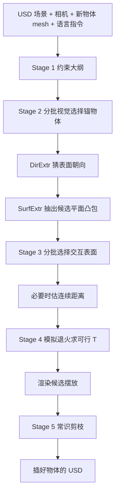
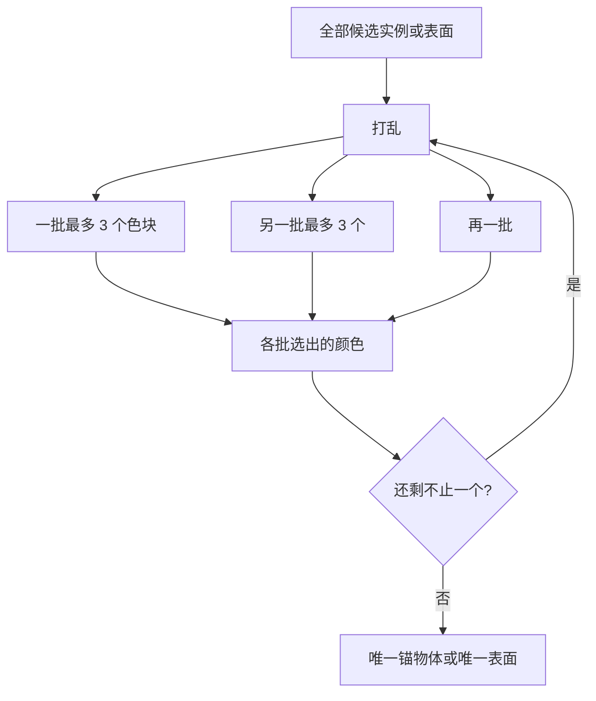

# FirePlace：不微调 3D，把「书放书架上」落成可解的表面约束

<!-- release-date: 2025-03-06 -->

> 本文依据 Google DeepMind 与 Stanford 合作的 **FirePlace: Geometric Refinements of LLM Common Sense Reasoning for 3D Object Placement**，即 [arXiv:2503.04919v1](https://arxiv.org/abs/2503.04919)（2025-03-06 19:34:15 UTC，32 页）。动笔前核过 arXiv 官方提交历史：目前只有 v1。本地件封面水印为 `arXiv:2503.04919v1 [cs.CV] 6 Mar 2025`，32 页，与官方唯一版一致，**未做替换**。CVPR 2025 Open Access 是 11 页相机就绪（会议录 13466–13476，DOI [10.1109/CVPR52734.2025.01257](https://doi.org/10.1109/CVPR52734.2025.01257)）；本文数字一律回这份 32 页 PDF 的页码，不混用会议录页码，也不用更短的 OA 件替换本地附录。
>
> 全文页码指 PDF 自身页码。标题页是第 1 页；正文第 2–11 页页脚印着 `2` 到 `11`，与 PDF 页码一致。第 12 页起是 Supplementary Material，附录自己从 `1` 再编页，引用时仍用打开这份 PDF 看到的页码（附录首页是 PDF p. 12，最后一页 Figure 30 是 PDF p. 32）。
>
> `release-date` 取 **2025-03-06**。FirePlace 是方法论文，没有向公众开放的产品模型、API 或官方权重。按「技术首次官方公开日」：arXiv v1 是目前能核到的最早官方公开事件。项目页 [https://fireplace3d.github.io/](https://fireplace3d.github.io/) 自称 **CVPR 2025 Highlight**（不要写成 Best Paper）；作者推文于 2025-03-26 才贴出该网址，晚于 arXiv。截至撰写，项目页只有 Paper 与 Twitter 链接，**未找到官方代码仓**。Hugging Face Papers 页的日期只是 arXiv 日期，**不用仓库 `createdAt`**。
>
> 单位：第一作者 Ian Huang 挂 Stanford University，脚注写 Work done during an internship at DeepMind，通讯 `ianhuang@cs.stanford.edu`。Yanan Bao、Karen Truong、Howard Zhou、Cordelia Schmid、Alireza Fathi 挂 Google DeepMind；Leonidas Guibas 双挂 Stanford 与 DeepMind。目录按企业主导放在 `Google`，Stanford 合作写在正文，不另建学校目录。
>
> 文中始终区分三件事：**报告写了什么**、**本文如何解释**、**哪些是外部补充**。凡是从图里读出来的、从项目页 / 会议页补进来的、或者对照同方向已发布报告得出的，都会当场说明。
>
> 边界说明：同方向已发布的 CAST 是**单张 RGB 拆成可站住的分件场景**；SpatialLLM、Video-3D-LLM 是 **LMM 的 3D 空间问答 / 把场景当视频理解**。索引里尚未发布的 LayoutVLM、Global-Local-Tree-Search 也是室内 3D 布局，但问题粒度不同：FirePlace 吃的是**已经建好的 USD 场景**，任务是按语言指令插入一件新 mesh，不是从空房间生成，也不是从照片重建。可以对照这条粒度差异，**不要把那些篇的人评、秒数或分数读成本报告的实验**。

## 旧方法吃包围盒，书架这种东西会摆错

先把矛盾摊开，再上名词。

往一间已经摆好的客厅里加一件东西，听起来像「把坐标填进表格」。报告认为这件事同时要两种完全不同的能力：高层面知道「为什么该放这儿」，低层面知道「这块板、这面墙、这把椅子的几何到底长什么样」（PDF p. 2）。现成的多模态大模型常识够用，但 3D 空间和细粒度几何是短板；常见对策是拿大量 3D 数据去微调（PDF p. 2）。FirePlace 走另一条路：**不微调 3D，把现成 MLLM 接到几何工具上。**

输入四样东西，输出一份改过的场景（PDF p. 2）：

- 一份 Universal Scene Descriptor（USD）场景，里面已经有一批 3D 资产；
- 一个能看见这间房间的相机位姿；
- 一件要插进去的新物体 mesh；
- 一句语言指令，比如「把相框放到房间角落的架子上」。

输出是插好物体的 USD，方法节把它收成一个世界坐标系下的变换矩阵 $T$（PDF p. 3）。

旧的 LLM 摆放系统在已有复杂场景里会缺三件事（PDF p. 2）：

**细粒度几何。** LayoutGPT、Holodeck 这一路主要吃物体的**包围盒**。盒子能表达「桌子在沙发左边」，表达不了「书要落在架子某一层的搁板上」。搁板的关键表面在盒子内部。按盒子来，书会被送到整架的顶面，而不是某一层能承重的平面。

**指得到具体实例。** 「挂到墙上」「放到椅子上」在复杂房间里不够。四面墙、两把看起来差不多的椅子，正确选择取决于上下文。旧方法要么预设墙的布局，要么假定实例无关紧要、或者构造时已经指定好了（PDF p. 2）。

**最后一刀不管好不好看。** 几何上能放，不等于好看、好用、不挡路。旧方法往往在求出一个满足盒子约束的位姿后就停了（PDF p. 2）。

所以 FirePlace 要做的不是「再训一个更懂 3D 的多模态模型」。它把摆放改写成三件事（PDF p. 1）：**(1) 从场景里抽出细粒度几何；(2) 把常识写成可解的几何约束；(3) 渲染后用常识剪枝。**

同方向已经发布的几篇，正好把这条改写衬出来。CAST 问的是照片里的物件如何长全、对齐、站住；SpatialLLM 问的是模型看图能不能判断方位和碰撞；Video-3D-LLM 问的是 3D 场景能不能当成带位置的视频来读。FirePlace 站在另一头：场景几何已经在 USD 里，缺的是**把一句人话落到正确的那块表面上**。本文的对照只到问题粒度，数字一律以本 PDF 为准。

## 读之前只需要这几个词

下面这些词正文都会用到。这一节是读前背景，不全是报告自己定义的。

**USD**：报告写的是 Universal Scene Descriptor（PDF p. 2）。业界通行名是 Pixar 的 Universal Scene Description，同一套场景文件思路。本文按报告用词写 USD，不把它当成另一种格式。它是显式 3D 场景：物件、网格、材质、层级都在文件里，不是一张图，也不是隐式场。

**MLLM（Multimodal Large Language Model，多模态大语言模型）**：能同时看图和读文字的大模型。本报告方法与全部基线都用 Gemini-1.5 Pro，**不微调 3D**（PDF p. 6）。它负责写约束、选物体、选表面、估距离、看渲染图做剪枝；真正的 3D 计算交给几何工具和求解器。

**包围盒（bounding box）**：把物体整个罩住的轴对齐或有朝向的盒子。盒子外面没有几何，盒子内部的搁板、椅面、靠背对它都是空的。旧方法把约束写在盒子上，所以「书在架子上」会退化成「两个盒子叠在一起」。

**交互表面（interaction surface）**：报告把参与约束的那块几何收成三维里的**平面凸包**，包住法向相近的那些三角面（PDF p. 4）。书架某一层的搁板、椅子的坐垫、墙的可见立面，都是这种表面，不是整件物体的外壳。

**锚物体（anchor object）$O_A$ 与可动物体（transformable object）$O_T$**：约束总是写在「已经在场景里的那件」和「正要插入的那件」之间（PDF p. 3–4）。锚物体是架子、墙、窗台；可动物体是书、相框、盆栽。

**几何约束 / 能量**：每条约束是一个二元函数，吃两块交互表面，吐出一个损失；满足时为 0（PDF p. 5）。求解器把这些损失加起来，对 $T$ 做模拟退火。报告后来说的 **Energy Score** 不是求解器自己的停判，而是：生成出来的约束，有多大比例在**艺术家给的真值位姿**上能量已经低于 $0.01$（PDF p. 6、p. 13）。

**视觉选择（visual selection）**：不把物体名字丢给模型，而把候选涂成不同颜色，让模型报颜色名来「指」（PDF p. 4–5）。选项一多，MLLM 会明显变差，所以有后面的分批流程。

**Batched Visual Selection（分批视觉选择）**：一次最多让模型看 $m$ 个选项，赢的留下，再进入下一轮，直到剩一个（PDF p. 5，Algorithm 2）。系统默认 $m=3$（PDF p. 8、p. 17）。

**常识剪枝（plausibility pruning）**：几何上可行的位姿可能有好几个。把它们渲染出来，先让模型写出「好摆放长什么样」，再两两比较，留下更符合美观、功能和可达性的那个（PDF p. 5）。

**可行（feasible）与合理（plausible）**：报告把前者定义为满足几何约束，后者定义为还要通过美观、功能、可达性这类常识（PDF p. 2）。流水线先保证可行，再从可行集合里挑合理。

## 一句话先说清

FirePlace 的主张只有一句：**现成 MLLM 不必微调 3D；它把语言指令写成约束大纲，用视觉选择把「哪把椅子、哪块板」落到真表面，用求解器找出几何上站得住的一批位姿，再渲染出来用常识做最后一刀。**

它不是「一个网络喷出整间房子」，也不是「让 LLM 直接吐坐标」。方法节把它叫成一条视觉思维链，五段（PDF p. 3–5，Figure 2）：

1. 看场景渲染和指令，写出约束大纲：用哪条约束、锚物体哪块表面、新物体哪块表面；
2. 在实例分割掩码上分批指认锚物体；
3. 抽出法向相符的候选平面，再分批指认真正参与接触的那一块；
4. 必要时让模型估连续参数（距离），用模拟退火求一批可行变换；
5. 渲染这些变换，用常识剪枝得到最终的 $T$。

规模上，全文**没有**训练参数量，因为 MLLM 是现成的 Gemini-1.5 Pro。附录写端到端大约 **30 秒到 2 分钟** 摆一件，随场景里已有物体数量和抽出的表面数量变；实验渲染走 CPU，作者认为换成 GPU 渲染可能更快（PDF p. 12）。这些是作者给出的范围，**不是**一张按场景规模测过的耗时表。

## 报告地图：32 页里各写了什么

先摊开篇幅。这份报告主文 11 页，方法集中在第 3–5 页；定量主表只有三张，大量提示词、失败案例和图像输入实验在附录。

| 报告章节 | PDF 页 | 讲了什么 | 密度 |
|---|---|---|---|
| 标题、摘要、Figure 1 | p. 1 | 输入三件套；插入物体标红 | 高 |
| §1 引言 | p. 2 | 三个缺口；USD 输入输出；三项贡献 | 高 |
| §2 相关工作 + §3 起 | p. 3 | 从零生成 vs 插入已有场景；问题形式化；Stage 1 | 高 |
| Figure 2 + Algorithm 1 + §3.2 | p. 4 | 五段流水线；表面抽出与选择 | 高 |
| §3.3–3.5 + §4.1 起 | p. 5 | 剪枝、六条约束、分批选择、评测设定 | 高 |
| Figure 3 + Table 1 + 基线设定 | p. 6 | 定性大图；主表五指标；Gemini-1.5 Pro | 高 |
| Figure 4 + Table 2 + §4.2–4.3 | p. 7 | 对人 Holodeck；人评；消融起笔 | 高 |
| Figure 5 + Table 3 + §4.4–§5 | p. 8 | 对人 LayoutGPT；五刀消融；结论 | 高 |
| 致谢 + 参考文献起 | p. 9 | SpatialVerse / Manycore 场景资产 | 中 |
| 参考文献续 | p. 10–11 | 引用条目 | — |
| 附录目录 + §6–7 + Figure 6–7 | p. 12 | 延迟、失败模式、规范空间假设 | 高 |
| §8–11 起 | p. 13 | 能量 / 合理性指标怎么读 | 高 |
| Figure 8 + 表面抽出几何 + §12 起 | p. 14 | 1–4 分示例；DBSCAN 凸包 | 高 |
| Figure 9 + §13–14 起 | p. 15 | 分批选择示意；约束公式；基线适配 | 高 |
| Holodeck 约束库 + §15–16.1 起 + Figure 10 | p. 16 | 场景物体数分布；评测数据怎么做 | 高 |
| Figure 11–13 + Table 4 + §16.2 | p. 17 | 消融定性；batch size 曲线；图像输入主表 | 高 |
| Figure 14 + §17–18 | p. 18 | 图像输入定性；MLLM 当裁判 | 中 |
| Table 5–6 | p. 19 | 图像 / 文本输入的 MLLM 胜率 | 中 |
| Figure 15–16 | p. 20 | 约束可视化：挂电视、放边几 | 中 |
| Figure 17–20 | p. 21–22 | 更多约束可视化 | 中 |
| Figure 21–30 | p. 23–32 | 合理性量表、约束文档、全部提示词 | 中 |

读正文前先知道这几件事，后面才不会把「报告写了」和「我们以为它写了」混在一起：

- **没有官方代码、没有权重、没有训练配方。** 这是一条推理期流水线。
- **模拟退火的温度、步数、以及「低于某个标量阈值就收进候选集」的那个阈值，正文和附录都没给。** 能量指标用的 $0.01$ 是评测口径，不要自动当成求解器阈值（PDF p. 5–6、p. 13）。
- **主表 Table 1 的 Ours 与消融表 Table 3 的 Ours 对不上。** 前者 Mean L2 69.89、Energy 0.42；后者 L2 62.52、Energy 0.34（PDF p. 6、p. 8）。报告没有解释。本文两处都按原表抄，不合成一套数字。
- **人评与 Gemini 一致性有两个写法：** 正文 89.82%（PDF p. 7），附录 89.92%（PDF p. 13）。差 0.1 个百分点。本文叙述用正文，并记下附录。
- **约束库的函数名也不完全统一。** §3.4 写 InfrontPlane，附录 Figure 22 给模型的文档写成 Above，Figure 15 的可视化标签也是 Above（PDF p. 5、p. 20、p. 24）。本文把它们当成同一类「沿法向分侧」的约束来讲，不假装报告自己统一了命名。
- **§13 写了五条约束的公式，FarFrom 有定义、没有实现公式**（PDF p. 5、p. 15）。
- **余弦相似度阈值、DBSCAN 参数、合并表面的距离阈值、主实验每条任务采样几次，一个都没给。**

因此这篇解读的重心不放在复现配方，而放在**三道锁：表面而不是盒子、指得到实例、可行之后还要合理。**

阅读路线：先看矛盾和全景，再按流水线走四个核心设计（抽表面 → 分批指认 → 约束求解 → 常识剪枝），然后是主表、消融、附录里的图像输入和缺口。**如果只有十五分钟，读「旧方法吃包围盒」「核心一」「核心二」「核心四」和「实验」五节就够了。**

## 全景：常识写大纲，几何求解，渲染后再用常识挑

按 Figure 2（PDF p. 4）和 §3 重画。这张图只表示模块怎么连，**机制示意，不是实测耗时或精度**。

报告把这条链收成「视觉思维链」（PDF p. 3）：MLLM 始终在做离散选择和常识判断，连续几何交给工具。Stage 1 和 Stage 5 主要吃常识；Stage 2–4 是 3D 推理，负责把大纲落到可计算的表面上（Figure 2 底部的色条也是这么切的，PDF p. 4）。

方法的形式化很短。场景 $D=\{o_1,o_2,\ldots\}$，新物体 $O_T$，指令 $l$，求一个 $T$，使得 $D'=D\cup\{T(O_T)\}$ 最符合 $l$（PDF p. 3）。FirePlace 不直接回归 $T$，而是先生成约束大纲 $G$，再把 $G$ 里每一条三元组变成一条真正可求值的约束。

## 核心一：细粒度几何——关键面往往在盒子里面

### 旧问题：包围盒把「能放东西的那一层」吃掉了

把物体收成盒子，约束就只能写在盒子的六个面上。报告举的例子很具体：书放到架子上，真正起作用的是某一层搁板的顶面和深度，不是整架包围盒的顶面（PDF p. 2，Figure 1）。椅背、扶手、L 形桌面是同一类失败：接触发生在盒子内部，或者发生在盒子某个面只覆盖一部分的地方。

这不是渲染不好看，是表示选错了。后续无论用多强的 LLM 写「on top of shelf」，求解器看到的仍是两个盒子。

### 新设计：先猜朝向，再按法向抽出平面凸包

对大纲里的每一条 $(f, t_A, t_T)$，FirePlace 并不一上来就回归平面方程。它分两步把文本描述变成几何（PDF p. 4，Algorithm 1）：

1. **DirExtr**：渲染锚物体 / 新物体，让 MLLM 从六个主方向里选出这块表面朝哪——左、右、前、后、上、下（PDF p. 13–14）。「椅子的坐垫」朝上，「电视的背面」朝墙。
2. **SurfExtr**：用几何算法，按面法向与该方向的余弦相似度过滤三角面，把面中心沿该法向投影，再用 DBSCAN 按「高度层」聚类；每一簇投影到同一层，拟合一块平面凸包（PDF p. 14）。

每一块候选表面因此是「法向已知、边界是凸包」的平面片，不是整件 mesh，也不是盒子。

候选往往会很多。报告的工程补丁有两条（PDF p. 14）：距离近的片保留面积更大的那块，先合并；再把**朝向相同的包围盒面**也加进候选集，因为有些约束用盒子面就够了。然后才进入下一节的视觉选择，让模型在涂色的候选里指出真正该用的那一块。

### 工作机制

可以把它想成：模型负责说「跟窗台的顶面接触」，工具负责把窗台 mesh 上所有朝上的连通平面片摊开来。Figure 2 的 Stage 3 就是这件事——提取方向是 down / up，matplotlib 画出若干候选片（PDF p. 4）。附录 Figure 20 更极端：桌子是 L 形，必须抽到真正的桌面，而不是整张桌子包围盒的顶面，否则台式机的接触和「不要悬出桌沿」都会写错（PDF p. 22）。

### 收益、代价、边界

收益是表达力。书可以落到某一层搁板，相框可以贴到指定那面墙，玩偶可以坐在椅面上而不是椅背包围盒顶上。消融把抽出的交互表面换成「朝向相同的包围盒面」之后，可见性从 0.87 掉到 0.79，合理性从 2.94 掉到 2.89；作者的定性观察是：物体经常放不进架子，或放不进被大盒子包住、高度还不一致的平面（PDF p. 8，Table 3 的 $-$ Geometry）。

有一个反直觉的数字：$-$ Geometry 的 Energy 反而更高（0.44 vs 0.34）。报告的解释是，盒子约束更少、更容易在真值位姿上被满足，所以「约束相对真值的命中率」会升高，但这是表达力变差的副作用，不是几何更好（PDF p. 8）。**这是作者对表的解释，不是另一次独立实验。**

代价和边界都在「规范空间」这个假设上。表面是在物体自己的规范坐标系里抽的，并假定「规范空间朝上的面，变换到世界里还朝上」。附录 Figure 7 给了一个失败：架子被艺术家在世界系里转过，朝上的规范面其实已经不是世界里的承重面，书被摆到了架子底下（PDF p. 12–13）。余弦阈值、DBSCAN 半径、合并距离，报告都没写。

### 可迁移启发

只要关键几何在包围盒内部，就不要让语言模型在盒子上做空间推理。更稳的拆法是：**模型只负责说出「哪一类表面、朝哪」，连续几何由网格算法交出来。** 六个离散方向已经够用在家具摆放上；真要处理斜面，报告说改提示、加方向即可（PDF p. 13），但实验没做。

## 核心二：实例视觉选择——选项一多，模型就会指错

### 旧问题：文字 caption 分不清「哪把椅子」

Holodeck 这类基线靠物体 caption 加 ID 来选锚物体（PDF p. 7、p. 16）。房间里有两扇看起来差不多的白柜、四面墙、若干抱枕时，「白色柜子」这种句子会撞车。报告还引用了 V* 的观察：视觉选项一多，多模态模型选对的能力会明显下降（PDF p. 5）。

FirePlace 把「指物体」和「指表面」都做成看图选择题，但选择题本身的题量就是坑。场景直方图显示，单间里的物体、建筑构件都可以到几十上百（PDF p. 16，Figure 10）。一次把全部掩码涂上颜色给模型，等于把考卷印成一百个色块。

### 新设计：每次最多看 $m$ 个，赢的留下再比

Batched Visual Selection 是递归分批（PDF p. 5，Algorithm 2）：

- 候选多于 $1$ 个时先打乱，再切成大小为 $m$ 的批；
- 每一批内部让模型选出匹配目标描述 $t$ 的那些，合并；
- 重复直到只剩一个。
- 若当前集合已经小于 $m$，就在这一个小集合里直接选最好的。

系统默认 $m=3$（PDF p. 8、p. 17）。锚物体这一侧，一批里最多三个实例被涂成不同颜色，模型报颜色名；表面那一侧，最多三块候选平面叠在原 mesh 上，同样报颜色（PDF p. 5、p. 15）。提示允许回答 `none`：这一批里没有锚物体（PDF p. 26，Figure 24）。

按 Figure 9（PDF p. 15）和 Algorithm 2（PDF p. 5）重画。这张图只表示选择怎么分层，**机制示意，不是实测耗时或调用次数**。

报告把它放进「推理期算力换准确率」这一路，引用了 repeated sampling 和 test-time compute 的工作，以及作者自己的 BlenderAlchemy（PDF p. 5）。**这些是外部动机，不是 FirePlace 自己测过的缩放定律。** FirePlace 真正测过的，是把 $m$ 从 3 提到 6、20、50、100（PDF p. 17）。

### 工作机制

Figure 9 是一个物体不多的房间：三批里模型分别选了青色、粉色、以及「这批没有」；下一轮只比较青和粉，最终落到黄色那件白柜（PDF p. 15）。分割掩码来自 USD 渲染，不是另训一个分割网络（PDF p. 13）。所以这条能力绑定「场景已经是分件资产」——这正是 USD 输入的前提，也是它和单张 RGB 重建路线的差别。

### 收益、代价、边界

去掉视觉选择、改回 caption 选择（Table 3 的 $-$ Vis. Select.）：Mean L2 从 62.52 升到 67.61，Energy 从 0.34 掉到 0.25，可见性和合理性也略降（PDF p. 8）。报告的解释是：约束写到了错误实例上，对真值位姿就不成立了。

把分批关掉、一次看最多 100 个选项（$-$ Vis. Scale.）更狠：L2 83.95，合理性 2.55，Energy 0.19。报告说这三列比去掉细粒度几何、去掉剪枝、去掉视觉选择还差（PDF p. 8）。Figure 13 的曲线方向一致：batch size 变大，Min / Mean L2 上升，Energy 和 Plausibility 下降（PDF p. 17）。**图上带色带，没有把每个 $m$ 的精确数字制成表，本文不从图上读假精确值。**

代价是调用次数。物体越多，分批轮次越多，延迟越高；附录把「30 秒到 2 分钟」的主要变量之一就写成锚物体候选数（PDF p. 12）。$m=3$ 是准确率和调用次数的折中，报告没有给出「为什么是 3 而不是 4」的搜索过程。Algorithm 2 在 $|C|<m$ 时才直接决出胜者，等于 $m=3$ 时三个候选仍会再进一轮——实现细节如此，报告没讨论这个边界。

### 可迁移启发

让 MLLM 在许多视觉选项里做单选题，不要把全部选项画进同一张图。**把题量当成推理期超参：每次只看得过来的几个，用淘汰赛换准确率。** 这不依赖 3D。任何「在图上指哪个实例」的流程都可以先问：模型这一眼要看几个色块？报告的证据只覆盖家具场景和 Gemini-1.5 Pro，换模型、换 $m$，数字不能照搬。

## 核心三：约束大纲与求解——模型写关系，求解器写坐标

### 旧问题：让 LLM 直接吐位置，空间会漂

LayoutGPT 让模型直接写包围盒的位置和朝向。报告的定性对照是：物体相交、漂在空中、挂到画面外（PDF p. 8，Figure 5）。更晚的 Holodeck、SceneCraft 一类改成「先写约束再求解」，这是对的，但约束仍写在盒子上，细的部件关系写不进去（PDF p. 3）。

另一头，如果完全不用约束、只随机撒 100 个位姿再让模型看图挑，Table 3 的 $-$ Constraints 说明这条路走不通：Mean L2 124.11，可见性只剩 0.24，合理性 1.95（PDF p. 8）。常识能做最后一刀，做不了从零搜索整个 SE(3)。

### 新设计：大纲是三元组，库只有六条平面约束

Stage 1 并不输出坐标。给定指令 $l$、约束库 $F$、场景渲染 $H_R(D)$，模型产出一组三元组 $G=\{(f,t_A,t_T)\}$（PDF p. 3）：

- $f$ 是库里的哪条约束；
- $t_A$ 是锚物体表面的文字，例如「白色柜子的顶面」；
- $t_T$ 是新物体表面的文字，例如「屏幕的底边」。

附录 Figure 23 的提示还加了硬规则：列表必须以 Contact 开头——先问「新物体贴着什么、哪块面贴着」；距离一律用厘米，并假定场景是真实尺寸（PDF p. 25）。Figure 2 的例子是窗台上的两只动物：Contact（动物底面，窗台顶面）加 NoOverhang（同一对表面），防止屁股坐在窗台外面（PDF p. 4）。

§3.4 的库一共六条，都是二元函数，吃两块表面，满足时损失为 0（PDF p. 5）：

| 函数 | 报告的含义 |
|---|---|
| `Parallel` | 两块表面平行 |
| `CloseTo` | 两块表面的最大距离不超过 `dist` |
| `FarFrom` | 两块表面的最小距离至少 `dist` |
| `InfrontPlane` | $p_2$ 在 $p_1$ 法向的「正侧」 |
| `Contact` | 两块表面接触 |
| `NoOverhang` | $p_1$ 投影完全落在 $p_2$ 内，用来禁止悬出边缘 |

附录 Figure 22 给模型看的文档把 InfrontPlane 写成了 `Above`，并强调「不保证俯视图重叠」（PDF p. 24）。Figure 15 挂电视时同时用了 Contact、Above、FarFrom（PDF p. 20）。本文按「分侧 / 在上方」理解，不把两个名字当成两条不同的数学约束。

连续参数 $\pi$ 只出现在 CloseTo 和 FarFrom 上，就是那段距离（PDF p. 14）。模型看着场景渲染和两块涂色表面来估，单位厘米（PDF p. 29，Figure 27）。

### 工作机制

大纲落地之后，Algorithm 1 对每一条三元组走完「选锚物体 → 猜朝向 → 抽表面 → 选表面 → 估 $\pi$」，得到一组真正可求值的约束 $R$（PDF p. 4）。然后对变换 $T$ 最小化损失和：

$$
\{T_i^\ast\}=\arg\min_T\sum_{(f,s^A,s^T,\pi)\in R} f\bigl(s^A,\,T(s^T),\,\pi\bigr)
$$

求解器是模拟退火，写法上「跟 Infinigen Indoors 一样」（PDF p. 5，引用 [36]）。低于某个标量阈值的解作为可行集合进入 Stage 5。**阈值、退火温度、迭代步数，报告没写。**

附录 §13 把几条损失写具体了（PDF p. 15）。设 $n_1,n_2$ 为两块表面的法向：

- **Parallel**：$n_1^\top n_2$ 靠近 $1$ 或 $-1$ 都算平行（方向相反也行）。
- **CloseTo**：$k\cdot\max(d(p_1,p_2)-\mathrm{dist},0)$，文中 $k=0.1$；§3.4 把 $d$ 说成最大距离。
- **InfrontPlane**：看从 $p_1$ 顶点指向 $p_2$ 顶点的方向与 $n_1$ 的关系；公式按附录抄，这里不把 OCR 缝隙补成另一种定义。
- **Contact**：`InfrontPlane(p1,p2) + InfrontPlane(p2,p1)`，接触或共面时最小。
- **NoOverhang**：把 $p_1$ 投影到 $p_2$ 所在平面，在投影区域内采 1000 个点，看有多少落在 $p_2$ 内部；全部在内时损失为 0。

FarFrom 在 §3.4 和 Figure 22 有文字定义，**§13 没有对应公式**。距离函数 $d$ 在 CloseTo 里也没有写成具体的点到集合距离。这些都按「没写」处理。

### 收益、代价、边界

主表上 FirePlace 的 Energy 是 0.42，Holodeck 是 0.22，LayoutGPT 不用约束所以是 N/A（PDF p. 6，Table 1）。Energy 衡量的是「模型写出的约束有没有覆盖艺术家那一个真值」，不是「求出的 $T$ 能量有多低」。附录把它比成约束的 precision：过约束或写错约束，真值上的能量就下不来（PDF p. 13）。杯子放桌上如果只写了 Parallel、没写 Contact 和 NoOverhang，真值上 Parallel 仍为 0，Energy 看起来还行，但求解器会给出一堆悬空的平行解——那是下一节合理性分数要抓的「recall」问题。

库很小。报告认为这六条平面约束组合起来，能覆盖 Holodeck / SceneCraft 那类旧约束的大部分（PDF p. 5）。附录失败案例立刻打脸：库里**没有相交约束**，花盆会嵌进已有物体；椅子只写了和地面接触，没写和邻椅靠背平行，于是朝向乱掉（PDF p. 12，Figure 6）。提示虽然强制 Contact 开头，并不保证模型会把该写的 Parallel、CloseTo 写全。

求解器本身是黑盒。和 Holodeck 对比时，报告说两边用**同一套求解器和同一套参数**（PDF p. 16），但参数仍然没写出来。可迁移的是「模型写约束、求解器写坐标」这条分工，不是某次退火的超参。

### 可迁移启发

空间任务里，能写成可检验损失的，就不要让语言模型回归连续量。**模型的输出应停在离散的关系类型、要指的那块表面、以及少数几个有单位的标量；连续位姿交给已有求解器。** 库不必大，但缺哪一类失败（相交、朝向、悬出）要在失败案例里诚实写出来——FirePlace 自己就在附录里把相交缺口写明了。

## 核心四：常识剪枝——可行集合里，再看一眼好不好用

### 旧问题：几何过关，仍可能挡路、悬边、不好看

窗台那组动物玩偶，Stage 4 能给出好几个都满足 Contact 和 NoOverhang 的解；有的靠边缘、有的更居中（PDF p. 4、p. 7）。书在桌面上接触成立，但仍可能悬出桌沿——几何约束没写全时，求解器不会替你补常识（PDF p. 12，Figure 6 右）。旧方法在求出一个可行解后往往直接结束（PDF p. 2）。

### 新设计：先写「好摆放长什么样」，再在渲染图上做视觉选择

Stage 5 把每个可行 $T_i^\ast$ 插进场景里渲染，再跑一轮视觉选择，任务换成「哪一张更合理」（PDF p. 5）。报告明确写了顺序：先让模型生成评判标准（美观、功能、可达性），再看成对渲染图做选择。做法沿 BlenderAlchemy（PDF p. 5，引用 [20]）。

评测用的合理性分数是另一件事，不要和剪枝混在一起。分数由 Gemini 打，1 分差、4 分好，量表在 Figure 21（PDF p. 6、p. 23）：

- 1：完全看不见，或明显漂浮 / 相交；
- 2：看得见，但和参考差很多；
- 3：物理上说得通，和参考有差别但不是质变；
- 4：物理成立，并且照顾功能、可达性、美观。

Figure 8 按 1–4 分各给了四组例子（PDF p. 14）。这是**评测器**的提示，不是 Stage 5 剪枝自己的提示；Stage 5 的成对比较提示，报告没有单独贴出来。

### 工作机制

剪枝吃的是渲染，不是损失值。所以它能处理「约束没写出来、但人一看就不对」的情况：例如若干可行解里哪个更居中、哪条过道还走得通。它处理不了「所有可行解都已经错」——约束集合如果根本没碰到正确那块板，剪枝只是在错误集合里挑一个不那么难看的。

### 收益、代价、边界

Table 3 的 $-$ Com. Sense 直接拿可行解当最终解：合理性从 2.94 掉到 2.60，可见性和 Energy 几乎不动（0.87 / 0.34 对 0.87 / 0.34）（PDF p. 8）。这正是报告想要的解耦：剪枝不改几何是否成立，改的是人看是否顺眼。人评里，在有明确胜者的样本上，合理性分数与人的判断一致率为 89.82%（PDF p. 7；附录写成 89.92%）。

失败也写得很具体。Figure 6 右：书和桌面接触了，但悬出桌沿，剪枝没删掉（PDF p. 12）。作者把这类失败部分归到「东西相对于房间太小」。剪枝仍然是 MLLM 看图，选错锚物体、选错表面的问题会遗传到这里（PDF p. 12）。

代价是又一轮渲染和又一轮模型调用。附录说计算时间里很大一块花在渲染候选摆放上，实验只用 CPU（PDF p. 12）。候选集有多大、每条任务留几张图给剪枝，报告没写。

### 可迁移启发

几何求解器保证的是「能放」，不是「该放」。**把常识检查放在能看见结果的那一层：渲染或仿真之后，而不是写进所有损失。** 损失写不全是常态；用一次看图剪枝补「没写出来的美观和可达性」，比把美学编成又一条能量更实际。前提是前面的可行集合还算干净——剪枝救不了写错的约束。

## 实验证明了什么，又没证明什么

### 评测怎么做

50 个由人类专家设计的、带固定相机的写实 3D 场景。每条任务先选出一件可动物体 $O_T$，用语言标注它在场景里的摆法 $l$，再把这件物体从场景里拿掉，剩下的当作输入 $D$。50 个场景共得到 **266 条摆放任务**（PDF p. 5–6）。场景是 USD，含网格、建筑构件和写实材质；资产来自 Manycore Tech 的 SpatialVerse 团队（PDF p. 9、p. 16）。可动物体多为家具（椅、桌、冰箱）和装饰（书、相框、墙饰），故意选「对错取决于有没有指对锚物体、有没有写对约束」的那些（PDF p. 16）。

五条指标（PDF p. 5–6）：

1. **Min L2（cm，越低越好）**：每条任务多次尝试里，平移与真值最近的那一次的 L2。
2. **Mean L2（cm，越低越好）**：多次尝试的平均平移 L2。
3. **Energy（越高越好）**：生成出的约束里，有多大比例在真值位姿上能量 $<0.01$。
4. **Plausibility（1–4，越高越好）**：Gemini 按 Figure 21 的量表打分。
5. **Visibility（$[0,1]$，越高越好）**：摆好之后，新物体在渲染里能被看见的比例。

「多次尝试」具体几次，主实验没写。消融里随机基线是 100 次（PDF p. 8）。L2 只比平移、不比旋转，报告也没解释为什么。

基线是 LayoutGPT 和 Holodeck，因为它们同样用大模型常识，但正好缺 FirePlace 宣称的三件事（PDF p. 6）。两边都拿到 Gemini 根据**单物体渲染**写的 caption，并被要求在「场景里已有这些物体」的前提下写约束或坐标。Holodeck **只用** Constraint-based Layout Design Module；盒子约束包括 FaceTo、near（50–150 cm）、far（$\ge 150$ cm）、infront / sideof / leftof / rightof / behind / ontop，以及两种中心对齐（PDF p. 16）。LayoutGPT 输出 CSS 风格的 `FURNITURE {length, width, height, left, top, depth, orientation}`（PDF p. 32）。方法与两条基线全部用 Gemini-1.5 Pro（PDF p. 6）。和 Holodeck 比时，求解器相同（PDF p. 16）。

### 主表：文字指令、266 条任务

Table 1 数字从 PDF p. 6 抄。LayoutGPT 不用约束，Energy 为 N/A。

| 指标 | LayoutGPT | Holodeck | FirePlace |
|---|---:|---:|---:|
| Min L2 error cm（↓） | 89.01 | 113.17 | 48.39 |
| Mean L2 error cm（↓） | 132.96 | 137.60 | 69.89 |
| Visibility（↑） | 0.79 | 0.63 | 0.88 |
| Plausibility（↑） | 2.14 | 2.13 | 2.95 |
| Energy（↑） | N/A | 0.22 | 0.42 |

报告的文字总结是：L2 大约是基线的一半，另外三列也全面更高（PDF p. 7）。Holodeck 的定性失败被写成两类：书放到架子上时盒子表示不够用；靠 caption 选锚物体选错（PDF p. 7，Figure 4）。LayoutGPT 的失败是相交和明显不合理的坐标（PDF p. 8，Figure 5）。

这些数字支撑的是：**在这 266 条「先拿走再放回去」的任务上，相对这两个 LLM 盒子基线，FirePlace 的平移更近、更看得见、Gemini 打分更高、写出的约束也更常在真值上成立。** 它们不支撑「已经达到可用的室内设计质量」——Mean L2 仍有约 70 cm。它们也不支撑相对其他 3D 布局论文的排序，那些论文的测试集不是这 266 条。

### 人评：30 人、2075 对

随机抽 FirePlace、LayoutGPT、Holodeck 的输出，做成左右随机的掩码渲染对，附上原指令。30 名参与者、2075 组两两比较，三条轴：物理是否合理（有没有漂）、语义是否对齐指令、常识（美观、功能、可达性）（PDF p. 7）。Table 2 从 PDF p. 7 抄：

| | Physics | Semantics | Com. Sense |
|---|---:|---:|---:|
| 胜 Holodeck | 60.27% | 65.70% | 62.08% |
| 平 Holodeck | 19.69% | 20.77% | 19.81% |
| 胜 LayoutGPT | 76.02% | 76.10% | 76.42% |
| 平 LayoutGPT | 11.39% | 11.47% | 11.22% |

报告说：领先明显；当没有明显更好时，人倾向于打平（PDF p. 7）。没有单独列出「负」的百分比，三列胜加平都不到 100%，剩下的就是输。人评细则、每对比较是否独立、参与者是否专家，除「30 人、2075 对、三条轴」之外没再写。

### 消融：五刀都在同一张表上

Table 3 从 PDF p. 8 抄。表头 L2 按表注是 **mean L2**。再次提醒：这张表的 Ours 与 Table 1 的 Ours 不是同一组数字，报告没解释。

| 设定 | L2（↓） | Vis（↑） | Plaus.（↑） | Energy（↑） |
|---|---:|---:|---:|---:|
| Ours | 62.52 | 0.87 | 2.94 | 0.34 |
| $-$ Constraints | 124.11 | 0.24 | 1.95 | N/A |
| $-$ Vis. Select. | 67.61 | 0.82 | 2.85 | 0.25 |
| $-$ Geometry | 63.44 | 0.79 | 2.89 | 0.44 |
| $-$ Com. Sense | 66.08 | 0.87 | 2.60 | 0.34 |
| $-$ Vis. Scale. | 83.95 | 0.84 | 2.55 | 0.19 |

被这张表撑住的判断：

- 没有几何约束、只靠随机撒点再看图挑，可见性会崩到 24%。
- 视觉选择、细粒度表面、常识剪枝、分批缩小题量，每一刀都在至少一列上往下掉。
- 剪枝几乎只动合理性；Energy 不动，符合「剪枝不改约束是否成立」。
- 分批是这四列里伤得最重的一刀之一。

没被撑住的：Table 1 与 Table 3 的 Ours 差多少来自采样次数、随机种子还是子集。定性 Figure 11–12 展示大衣进衣柜、瓶子上柜，去掉约束会漂、去掉剪枝会和已有物体重叠（PDF p. 17）——**这是作者选的例子，不是量化。**

### 附录里的图像输入，是加戏不是主任务

因为大纲生成也走 MLLM，指令可以换成「一张示范摆放图」，让模型写出类似约束再摆（PDF p. 18，§17）。提示词相应改成塞图而不是塞文本。Table 4（PDF p. 17）：

| 指标 | LayoutGPT | Holodeck | FirePlace |
|---|---:|---:|---:|
| Min L2 error cm（↓） | 126.19 | 91.25 | 43.69 |
| Mean L2 error cm（↓） | 166.11 | 136.51 | 68.84 |
| Visibility（↑） | 0.69 | 0.59 | 0.88 |
| Plausibility（↑） | 2.31 | 1.99 | 2.92 |
| Energy（↑） | — | 0.17 | 0.38 |

注意：图像输入下 Holodeck 的 Min L2 优于 LayoutGPT（91.25 vs 126.19），和 Table 1 的文字输入方向相反。报告没有讨论这个翻转。Figure 14 的定性是：输出会跟示范图的语义走，最终位置可以和示范不同（PDF p. 18）。

§18 再用 Gemini-1.5 Pro 当裁判做两两比较。文本输入 Table 6：FirePlace 对 LayoutGPT 胜率 0.70，对 Holodeck 0.72；图像输入 Table 5：两列都是 0.72（PDF p. 19）。这是**同一家模型既当选手又当裁判**。人评已经给过另一套偏好，附录这张表只能当一致性旁证，不能当成独立第三方。

## 限制、没写的，以及还不该当成已经解决的事

附录 §6 把延迟写成主要限制：除 Stage 4 求解外，每一步都在调 MLLM；30 秒到 2 分钟一件，随已有物体数和抽出表面数变；渲染占了不少时间，实验用 CPU（PDF p. 12）。没有 GPU 数字，没有按物体数分桶的表。

失败模式三条（PDF p. 12，Figure 6）：

1. **相交**：库没有「尽量别穿模」的约束；
2. **欠约束**：只写了和地面接触，没写和邻椅平行，椅子朝向漂；
3. **剪枝没救回来**：接触成立但悬边。

再加上：选错锚物体或选错表面（继承自 MLLM）；规范空间朝向与世界朝向不一致（Figure 7）。作者预期随 MLLM 变强，选错会缓解——**这是展望，没有按模型代际测过。**

社会影响一节很短：不预期额外负面，只继承现有 MLLM 的偏见（PDF p. 13）。没有偏见评测。

实现上仍是黑盒的，按「报告没写」列出：

- 官方代码、权重、USD 场景与 266 条任务是否公开；
- 模拟退火超参、候选集能量阈值、每条任务采样次数；
- 面法向余弦阈值、DBSCAN 参数、合并表面的距离阈值；
- FarFrom 的公式、CloseTo 里 $d(\cdot)$ 的精确定义；
- Stage 5 剪枝自己的提示词（评测量表在 Figure 21，不是剪枝提示）；
- 主表与消融表 Ours 不一致的原因。

## 可迁移启发汇总

这些做法不依赖 Gemini-1.5 Pro 这个名字，也不依赖 SpatialVerse 这批资产。

**表示要匹配接触发生的地方。** 接触在盒子内部，就抽表面；接触在盒子外面，盒子约束才够用。FirePlace 甚至把盒子面留作候选之一，而不是教条地只用细表面。

**语言模型停在离散选择。** 关系类型、朝向六选一、颜色名、少数带单位的距离，是它做得比较稳的输出；SE(3) 坐标不是。

**选择题的题量是推理期超参。** 分批不是装饰。在这套实验里，一次看 100 个选项比拿掉细几何还伤。

**常识检查放在能看见结果之后。** 先求解可行集合，再渲染剪枝。损失写不全时，看图比把美学编进能量现实。

**评测要把「约束写对了没有」和「看起来对不对」拆开。** Energy 抓过约束 / 写错，Plausibility 抓欠约束。只用 L2 会对「杯子放桌上有很多合理位置」不公平；只用看图打分又会放过写错但仍好看的解。

**现成 MLLM 加工具，不等于零代价。** 不微调 3D 的代价是每一步都在调用模型和渲染。30 秒到 2 分钟一件，对交互式编辑可能刚好，对批量铺房间会贵。

## 关键词回看

- **USD**：显式分件场景文件；FirePlace 的输入输出都在这层，不是隐式场。
- **包围盒 vs 交互表面**：盒子罩住整件物体；交互表面是法向一致的平面凸包，对应搁板、椅面、墙。
- **约束大纲 $G$**：$(f,t_A,t_T)$ 三元组，文本还没落到网格上。
- **锚物体 $O_A$ / 可动物体 $O_T$**：已经在场景里的参照，以及正在插入、被 $T$ 变换的那件。
- **DirExtr / SurfExtr**：先让模型选六个主方向之一，再按法向聚类抽凸包。
- **Batched Visual Selection**：一次最多看 $m$ 个色块的淘汰赛，默认 $m=3$。
- **可行 / 合理**：约束能量低，对美观、功能、可达性过关。流水线先前者、后后者。
- **Energy Score**：生成约束在真值位姿上低于 $0.01$ 的比例，不是求解器阈值。
- **Plausibility Score**：Gemini 1–4 分量表；与人评在有明确胜者时约 89.82% 一致。
- **Gemini-1.5 Pro**：方法与基线共用的现成 MLLM，不微调 3D。

## 最后的判断

FirePlace 被实验撑住的核心，不是「又一个会摆家具的大模型」。Gemini-1.5 Pro 是现成的。它真正做的是**给不会 3D 的 MLLM 装上三件外部工具：抽表面、解约束、看渲染图。**

有数字支撑的结论：

- 266 条文字任务上，Min L2 48.39 cm、Mean L2 69.89 cm，对照 LayoutGPT 89.01 / 132.96、Holodeck 113.17 / 137.60；可见性 0.88、合理性 2.95、能量 0.42（Table 1，PDF p. 6）。
- 30 人、2075 对比较，三条轴都胜两条基线（Table 2，PDF p. 7）。
- 去掉约束、视觉选择、细表面、剪枝、分批，同一张消融表上都能看到对应列变差（Table 3，PDF p. 8）。
- 图像示范输入下主指标仍全面领先（Table 4，PDF p. 17）。

只被演示、没有被单独量化的：

- 相交失败、欠约束失败、规范空间旋转失败各占评测集多少；
- 30 秒到 2 分钟如何随物体数变化；
- 主表和消融表 Ours 为什么不是同一行数字。

实现上仍是黑盒的：官方代码、求解器超参、表面抽出阈值、266 条任务和 USD 资产是否可复现。

和同方向已发布报告放在一起，FirePlace 的位置其实很清楚。CAST 问的是照片里的东西如何变成能站住的分件网格；SpatialLLM 问的是模型看图能不能判断方位；Video-3D-LLM 问的是 3D 能不能当视频读。FirePlace 问的是：**几何已经在文件里了，一句人话怎样落到正确的那块板上，并且最后看起来像人会摆的那样。** 它不生成没给的房间，也不从 RGB 重建。它把「插入一件资产」当成约束落地问题。

如果只记一句话：

> **别让多模态模型猜坐标。让它写出要哪条关系、指到哪块表面，把连续位姿交给求解器，再把渲染图交回给常识做最后一刀——包围盒够不到的接触，只能写在表面上。**

## 资料与阅读边界

**原件与版本核验**

- 本地 PDF：`papers/Google/FirePlace.pdf`，即 [arXiv:2503.04919v1](https://arxiv.org/abs/2503.04919)，2025-03-06 19:34:15 UTC，32 页，43,833 KB。
- 版本核对：arXiv 官方提交历史目前只有 v1。本地件 32 页，左侧水印 `arXiv:2503.04919v1 [cs.CV] 6 Mar 2025`，与官方唯一版一致，**未做替换**。
- 会议：CVPR 2025 Highlight。项目页自称 Highlight：[https://fireplace3d.github.io/](https://fireplace3d.github.io/)。相机就绪 11 页：[CVPR Open Access](https://openaccess.thecvf.com/content/CVPR2025/html/Huang_FirePlace_Geometric_Refinements_of_LLM_Common_Sense_Reasoning_for_3D_CVPR_2025_paper.html)，会议录 13466–13476，DOI [10.1109/CVPR52734.2025.01257](https://doi.org/10.1109/CVPR52734.2025.01257)。本文不采用 11 页件的页码。
- 许可：arXiv 页标注 CC BY 4.0。

**首发日证据**

- 方法论文，无官方模型 / API / 权重向公众开放，故取技术首次官方公开日。
- arXiv v1：2025-03-06 19:34:15 UTC，提交者 Ian Huang。这是能核到的最早全文公开。
- 项目页在 2025-03-26 的作者推文中才被贴出（[Ian Huang 的介绍帖](https://x.com/IanHuang3D/status/1905021827552063850) 及同日跟帖里的 website 链接），晚于 arXiv，不能提前 `release-date`。
- 截至撰写，项目页无 Code 链接；未找到官方 GitHub 实现。不用 GitHub / Hugging Face `createdAt`。

**报告直接引用、正文用到的方法**

- Gemini-1.5 Pro，Gemini Team 等，2023（本 PDF 的唯一 MLLM）。
- LayoutGPT，Feng 等，NeurIPS 2024（直接吐包围盒位姿的基线）。
- Holodeck，Yang 等，CVPR 2024（盒子约束 + 求解器的基线；本实验只用其 Constraint-based Layout Design Module）。
- Infinigen Indoors，Raistrick 等，CVPR 2024（模拟退火求解器的写法来源 [36]）。
- BlenderAlchemy，Huang 等，2024（看渲染图做 MLLM 剪枝的前作 [20]）。
- V*，Wu 与 Xie，2023（视觉选项变多则变差的观察 [48]）。
- GPT-4V 作为文生 3D 评测器，Wu 等，CVPR 2024（合理性分数的灵感 [49]）。

**外部补充，不是本 PDF 内容**

- USD 的业界全称是 Universal Scene Description（Pixar）；报告写的是 Universal Scene Descriptor。同一类文件，不另当一种格式。
- Highlight 身份以项目页自称为准；不要升级成 Best Paper。CVPR 会议本身晚于 2025-03-06。
- 截至撰写未找到官方实现。若遇见同名 Fireplace / Fire3D 仓库，它们不是这篇 CVPR 论文的代码，不能用来复述论文主张。

**同方向已发布解读（只对照问题粒度）**

- `reports/ShanghaiTech/CAST.md`：单张 RGB → 分件网格对齐并站住，是重建，不是往已有 USD 里插入。
- `reports/JohnsHopkins/SpatialLLM.md`：LMM 的 3D 方位与碰撞问答，不输出变换矩阵。
- `reports/CUHK/Video-3D-LLM.md`：把 3D 场景当位置感知视频来理解。

索引中尚未发布的 `LayoutVLM`、`Global-Local-Tree-Search` 同属室内 3D 布局，问题分别偏向可微优化和树搜索生成场景；**不要把它们的实验数字读进本篇。**
