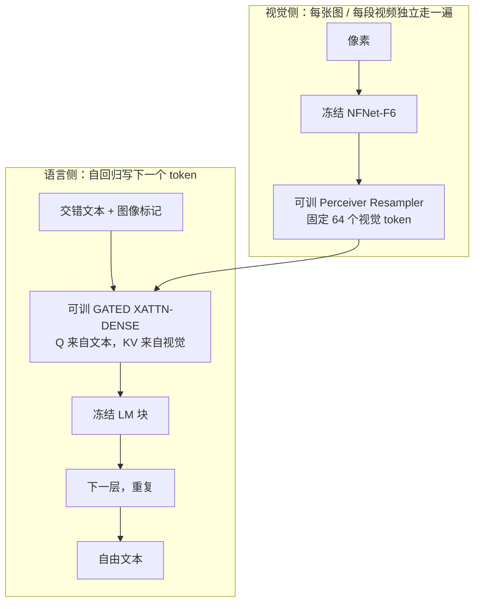

# Flamingo：冻住两端，只训一座桥，交错图文上的少样本视觉语言

<!-- release-date: 2022-04-28 -->

> 本文依据 DeepMind 的 **Flamingo: a Visual Language Model for Few-Shot Learning**，即 [arXiv:2204.14198](https://arxiv.org/abs/2204.14198) 的 2022-11-15 修订版 v2，NeurIPS 2022，共 54 页。页码均指这份 PDF 自身页码。封面水印为 `arXiv:2204.14198v2 [cs.CV] 15 Nov 2022`。v1 提交于 2022-04-29 16:29:01 UTC；v2 修订于 2022-11-15 23:07:37 UTC。截至 2026-09-11 核验，arXiv 当前仍是 v2，本地原件即该版，**没有换过 PDF**。全文会区分三件事：报告明确写了什么、我们如何解释它、哪些是外部资料补充。凡是外部补充都会给出链接并明确标注。
>
> 这是一篇方法与模型论文。Flamingo 本身没有向公众开放权重、API 或产品接口。按「技术首次官方公开日」，`release-date` 取 **2022-04-28**：DeepMind 官方博客 [Tackling multiple tasks with a single visual language model](https://deepmind.google/discover/blog/tackling-multiple-tasks-with-a-single-visual-language-model/) 标注 April 28, 2022，正文写「Today, in the preprint of our paper, we introduce Flamingo」。arXiv v1 是次日 2022-04-29。按手册取更早的官方公开事件，因此卡片日期是博客日，不用 v2、NeurIPS 或后续修订回写。Hugging Face 仓库的 `createdAt` 按本模块规则禁用。
>
> 单位：论文署名 DeepMind。目录按企业主导放在 `Google`，DeepMind 写在正文，不另建实验室目录。
>
> **同方向边界**：后作 [Qwen3-Omni](/reports/Alibaba/Qwen3-Omni) 已发布。那条线是 Thinker-Talker 全模态（听、说、读、写），不是本文这种「冻结视觉编码器 + 冻结语言模型 + 可训桥」的少样本视觉语言模型，也不是把图文收成统一 token 的早期融合。本文只在方法粒度上标出这条差异，**不把 Qwen Omni / VL 的延迟表、参数量或基准分写进本文实验**。

## 旧路只有两条，交错图文和视频都走不通

先把矛盾摊开，再上名词。

2022 年要把「看」接到「说」上，常见做法只有两条（PDF p. 3）。

**第一条：从头训一个视觉语言模型。** 先在大量监督数据上预训练，再为每个下游任务微调。成功微调往往要成千上万条标注，还要按任务调超参，算力和数据都贵。更麻烦的是：每来一个新任务，几乎就要再训一遍。这种模型很难只看几条示范就改主意。

**第二条：把图压成一个向量，去对齐已经训好的语言模型。** 对比学习这条路（CLIP、ALIGN 一类）能做零样本分类和检索：给一张图、一组候选文字，打相似度就行。可是它只吐分数，不生成语言。开放式的看图问答、描述场景、多轮视觉对话，它接不住。视频更麻烦：帧数一变，那个「一个向量」就更说不清该代表哪一段。

还有一条当时已经有人走、但少样本仍然不好的路：视觉条件语言生成。模型能写字了，可论文自己说，它们在标注很少的时候还没有交出好成绩（PDF p. 3）。

所以 Flamingo 要回答的不是「能不能把图送进语言模型」，而是一句更具体的话：

> **已经有了很强的视觉编码器和很强的语言模型。能不能冻住两端，只训一座桥，让同一个模型在任意交错的图、视频和文字上，靠几条示范就做新任务？**

论文的主张是能。家族三档：Flamingo-3B、Flamingo-9B、Flamingo-80B。16 个图文 / 视频任务上，少样本全面超过当时的零样本 / 少样本方法；其中 6 个任务只用 32 条示范、不改权重，就超过当时用成千上万条标注微调出来的 SOTA（PDF p. 3–4、7，Figure 2、Table 1）。这 6 个是哪几个、数字是多少，后面会回到 Table 1 逐项对。

## 读前先认这几个零件

后面会反复出现这些名字。第一次读只要记住括号前的人话。

- **视觉语言模型（Visual Language Model，VLM）**：吃图或视频，吐自由文本。Flamingo 还要求输入可以是图、视频和文字任意交错的一段 prompt（PDF p. 3–4）。
- **少样本 in-context learning（上下文学习）**：不改权重。把几条「图 / 视频 + 期望回答」拼进 prompt，再跟一条查询，让模型续写。论文明确对标 GPT-3 的文本少样本（PDF p. 4、6）。
- **冻结（frozen）**：预训练好的模块参数锁死，反向传播不更新。Flamingo 冻的是视觉编码器和语言模型；可训的是中间那座桥（PDF p. 4–5）。
- **NFNet-F6**：Normalizer-Free ResNet 的 F6 规格，论文用作冻结视觉编码器。它先在图文对上做对比学习，再冻住交给 Flamingo（PDF p. 5）。
- **Perceiver Resampler（Perceiver 重采样器）**：不管输入是一张图还是一段视频、分辨率怎么变，都压成固定数量的视觉 token。Flamingo 压成 64 个（PDF p. 5）。
- **GATED XATTN-DENSE（门控交叉注意力 + 前馈）**：插在冻结语言模型层与层之间的新块。文本当 Query，视觉 token 当 Key / Value；输出乘上一个从 0 开始学的 $\tanh$ 门，再加回残差（PDF p. 5，Figure 4）。
- **交错图文（interleaved vision-text）**：一段序列里图和字穿插出现，不是「一张图配一句 caption」。网页就是这种东西。
- **M3W（MultiModal MassiveWeb）**：论文自己爬的交错网页数据，大约 4330 万个文档（PDF p. 6、47）。
- **Chinchilla**：DeepMind 的计算最优语言模型。Flamingo-80B 的语言主干是冻结的 70B Chinchilla（PDF p. 5–6、28）。
- **shot**：prompt 里给模型看的示范条数。0-shot、4-shot、32-shot 是主表的三档。论文的 0-shot 并不是完全空 prompt，后面会单独说。

## 一句话先说清

Flamingo 的主张只有一句：**冻住已经很强的视觉编码器和语言模型，只从零训练 Perceiver Resampler 和门控交叉注意力，在交错网页和图 / 视频–文本对上做下一 token 预测；训完之后，同一套权重靠 prompt 里的几条示范，就能做看图问答、描述、视频理解和多轮视觉对话。**

它不是把图离散成 token 再和文字排成一条统一序列。视觉特征根本不进语言模型的输入座位，而是挂在层与层之间，让每一层文本状态按需去查。

它也不是后来那种「一个模型既听又说」的全模态系统。输入是图或视频加文字，输出只有文字。

## 报告地图：这篇 54 页到底铺了什么

论文正文 10 页，其余是附录。数字和关键机制有一半在附录里。对应关系如下，避免只追着摘要写。

| 论文位置 | 讲什么 | 本文落在哪 |
|---|---|---|
| 摘要、Figure 1–2、§1 | 矛盾、16 任务少样本、6 个任务对微调 SOTA | 开篇矛盾、主表 |
| §2.1、附录 A.1.1、B.1.3 | NFNet 视觉编码器、对比预训练、Perceiver | 核心设计一、二 |
| §2.2、Figure 4、附录 A.1.2 / A.1.4 | 门控交叉注意力、三档规模 | 核心设计三、六 |
| §2.3、附录 A.1.3 | 每次只看上一张图的 mask | 核心设计四 |
| §2.4、附录 A.3、F | M3W / ALIGN / LTIP / VTP | 核心设计五 |
| §2.5、附录 A.2、B.1.5 | 少样本 prompt、开闭卷、0-shot 口径 | 少样本 prompting |
| §3.1、Table 1 | 16 任务主表 | 实验 |
| §3.2、Table 2、附录 B.2.2 / Table 8 | 微调补 5 个 SOTA | 微调补充 |
| §3.3、Table 3、附录 B.3 / Table 10 | 消融 | 消融 |
| 附录 B.2.1 / Table 7、B.2.3 / Table 9 | 分类落后、对比编码器检索 | 限制、视觉编码器 |
| §5、附录 D、E | 幻觉、序列长度、闭源、偏见与毒性 | 限制 |
| 附录 C、Figure 13 | 定性对话与失败案例 | 限制 |

标题页是 PDF 第 1 页。正文页脚印着 `2` 到 `10`，与 PDF 页码一致。第 11–20 页是参考文献，第 21 页是 NeurIPS checklist，第 22 页起是附录；附录自己从 `1` 再编页，引用时仍用打开这份 PDF 看到的页码。

## 先看全景：冻住的两端，可训的中间

论文 Figure 3 把整张图分成左视觉、右语言（PDF p. 4）。左边每张图或每段视频走一遍冻结视觉编码器，再被 Perceiver Resampler 收成固定长度；右边是冻结语言模型，层前插上从零初始化的门控交叉注意力。雪花标记表示冻住，空白块表示从零训练。

这张图是机制示意，根据 PDF p. 4 Figure 3 重画，不代表实测延迟。读这张图时抓住三件事：

1. **视觉不进语言模型的 token 座位。** `<image>` 只是文本里的占位，真正的视觉向量走侧路交叉注意力。
2. **每张图单独编码。** 多图、多视频不是拼成一张超级特征图，而是各自变成 64 个 token，再靠 mask 决定当前文本能看哪一组。
3. **生成目标始终是下一个文本 token。** 视觉只是条件。公式是（PDF p. 4，式 1）：

$$
p(y \mid x) = \prod_{\ell=1}^{L} p(y_\ell \mid y_{<\ell},\, x_{\le \ell})
$$

$y_\ell$ 是第 $\ell$ 个文本 token，$y_{<\ell}$ 是它前面的字，$x_{\le \ell}$ 是到这个位置为止允许看到的图或视频。$p$ 由整个 Flamingo 参数化。

三档模型的参数账在附录 Table 5（PDF p. 28）。视觉编码器和 Resampler 三档共用同一份，变的是冻结 LM 和门控层的宽度、以及门控层插入的密度。

| 模型 | 冻结 LM | 冻结视觉 | 门控层（插入频率） | Resampler | 总计 |
|---|---:|---:|---|---:|---:|
| Flamingo-3B | 1.4B | 435M | 1.2B（每层） | 194M | 3.2B |
| Flamingo-9B | 7.1B | 435M | 1.6B（每 4 层） | 194M | 9.3B |
| Flamingo-80B | 70B | 435M | 10B（每 7 层） | 194M | 80B |

正文把 3B 那档的新增可训参数说成 1.4B，把 9B 说成 1.8B（PDF p. 29）：那是门控层加 Resampler 的合计，和 Table 5 拆开写并不矛盾。80B 那档论文简称 Flamingo（PDF p. 5–6）。

可训参数并不是「一座小桥」。3B 那档新增和冻结 LM 几乎 1:1；80B 那档新增 10B，大约是总参数的八分之一。后面会看到，论文靠降低插入频率来控制这笔账。

## 核心设计一：视觉编码器为什么冻住，还为什么是 NFNet

### 旧问题：视觉前端如果弱，后面再怎么接都补不回来

桥再巧妙，也只能搬运编码器已经看见的东西。论文把视觉编码器做成对比学习预训练的 NFNet-F6，冻住再用（PDF p. 5）。对比目标跟 CLIP 一样，是图到文、文到图两项交叉熵之和，带可学习温度（PDF p. 30，式 3–4）。

它在 ALIGN 和 LTIP 上从零训。训练分辨率 $288 \times 288$，联合嵌入 1376 维，batch 16384，在 512 块 TPUv4 上做 120 万次参数更新，每次更新含两次梯度计算；学习率从 $10^{-3}$ 线性降到 0（PDF p. 30）。Flamingo 正文阶段把输入提到 $320 \times 320$，论文引用 CNN 可以提高测试分辨率的观察，并强调视觉编码器冻住，所以分辨率上涨的反传成本很小（PDF p. 29）。

### 工作机制：它是特征提取器，不是分类器

编码器最后一阶段吐出二维空间网格，展成一维序列。视频则按 1 FPS 逐帧独立编码，加上学出来的时间位置编码，再展平（PDF p. 5）。Flamingo 主模型只用对比模型的视觉塔，不用它的文字塔（PDF p. 30）。

对比模型自己的零样本检索写在 Table 9（PDF p. 35）。Flickr30K 文搜图 R@1 为 79.5，超过 Florence 的 76.7、ALIGN 的 75.7、CLIP 的 68.7；COCO 图搜文 R@1 为 65.9，超过 Florence 的 64.7。ImageNet 零样本分类则到不了当时对比学习 SOTA：他们的 NFNet-F6 是 77.9，BASIC 是 85.7（PDF p. 33，Table 7）。论文自己的解释是：BASIC 这类模型在带标签的 JFT-3B 上优化分类，而 Flamingo 需要的是能抓住整场场景的特征，所以他们更看重检索而不是 ImageNet（PDF p. 34）。

### 消融：换成 CLIP，整体掉 5.8 个点

Table 3 在 Flamingo-3B、4-shot、DEV 五任务上比视觉骨干（PDF p. 8）。总体分是各任务分数除以 Table 1 里对应微调 SOTA 再平均。NFNet-F6 基线 70.7；换成公开的 CLIP ViT-L/14（224 分辨率）掉到 64.9，差 5.8；换成更小的 NFNet-F0 掉到 62.7，差 8.0。视觉编码器从随机初始化训，总体分 57.8；从对比预训练出发再解冻，也只有 68.1，而且更贵（PDF p. 35，Table 10）。

所以冻住视觉不是省事的借口。消融支持的判断是：**先把视觉塔在对比目标上训强，再锁死，比在 Flamingo 阶段一起改更划算。**

### 可迁移启发

如果你已经有一个在图文对上训好的视觉塔，Flamingo 给的默认动作是冻住它，而不是「接到语言模型上再全量开训」。要动分辨率，可以只在冻住的 CNN 上提测试分辨率。代价是：对比目标和生成目标并不一样，后面分类任务会还这笔账。

## 核心设计二：Perceiver Resampler 把可变视觉压成固定 token

### 旧问题：网格大小随分辨率和帧数变，交叉注意力会爆

一张图的空间网格已经不小。视频再乘上帧数，Key / Value 长度会直接打进每一层交叉注意力。如果把这些特征一股脑拼进语言模型的输入序列，上下文预算会被视觉吃光——这是后来投影路线的核心痛。Flamingo 选了另一条：视觉不进序列，但交叉注意力仍然要读视觉。于是必须先把「可变、很长」收成「固定、很短」。

### 新设计：一组学出来的 latent，去读全部视觉特征

Perceiver Resampler 学 $R$ 个 latent query（论文主模型 $R = 64$），用 Transformer 去交叉注意视觉特征，输出长度等于 latent 个数，与输入分辨率、视频帧数无关（PDF p. 5、23，Figure 5）。

和 DETR / 原版 Perceiver 有一处不同：从 latent 算出来的 Key、Value，会拼到视觉特征的 Key、Value 后面。论文说这样略好（PDF p. 23）。时间位置编码加在每一帧的特征上；**不加显式空间网格位置编码**，因为他们观察到没提升，并猜测 CNN 已经把空间信息写进通道（PDF p. 23）。

伪代码的核心是（PDF p. 23）：

$$
x \leftarrow x + \operatorname{Attention}(q=x,\, kv=[x_f;\, x])
$$

$x$ 是那 64 个 latent，$x_f$ 是展平后的时空视觉特征，$[x_f; x]$ 表示拼接。再加一层前馈，重复 6 层。三档模型的 Resampler 超参相同：6 层、隐维 1536、16 头、Squared ReLU，大约 194M 参数（PDF p. 25、28，Table 4–5）。

图像当作 $T = 1$ 的视频。训练时视频抽 8 帧、1 FPS；推理时送到 30 帧、3 FPS，靠线性插值时间位置编码撑住（PDF p. 29）。论文没把「8 帧训、30 帧测」写成一条被单独消融的定律，只把它当作工程设定。

### 收益和代价

收益是交叉注意力的视觉侧长度被钉死在 64。一张高分辨率图和一段 30 帧视频，对语言模型来说都是 64 个 Key / Value。这是 Flamingo 能同时吃图和视频的前提。

代价是压缩是硬瓶颈。64 个 token 要覆盖整张图或整段视频，细小文字、局部属性、密集物体，都可能在这一步被丢掉。论文主表里 TextVQA 32-shot 只有 37.9，对微调 SOTA 54.7 差一截（PDF p. 7，Table 1），和这条瓶颈是同一方向的现象；论文没有单独证明「就是 Resampler 害了 OCR」，不要把表上的落后直接因果化。

消融里，同样参数预算下，MLP 和普通 Transformer 都慢于、且弱于 Perceiver（总体分 66.6 / 66.7，对 70.7）（PDF p. 8）。Resampler 本身也不是越大越好：中等规模最好，再加大到 Large，总体分从 70.7 掉到 69.0，和 LM 一起放大时还会不稳，所以三档模型都保守地用同一份中等 Resampler（PDF p. 35）。

### 可迁移启发

「可变视觉 → 固定 query」这件事，后来很多连接器都在做。Flamingo 的要点不是 64 这个数字，而是：**压缩发生在昂贵的语言层交叉注意力之前，而且压缩器本身要小、三档共用。** 你的任务如果是细粒度 OCR 或密集定位，64 可能不够；如果是场景级描述和少样本问答，它把预算花在了语言侧。

## 核心设计三：门控交叉注意力怎么插进冻结 LM

### 旧问题：新层一插进去，预训练语言能力会被打乱

冻结 LM 是为了保住已经买很贵的语言先验。如果在残差流里突然加一层随机初始化的交叉注意力，第一步的输出就不再是原来的语言模型。少样本靠的恰恰是这份语言先验——示范写在文字里，模型要会续写。

### 新设计：$\tanh$ 门从 0 出发，训练起点等于原 LM

论文在冻结的 LM 块之间插入 GATED XATTN-DENSE（PDF p. 5，Figure 4）。一块里有两段可训计算，然后才是原来的自注意力和前馈：

$$
\begin{aligned}
y &\leftarrow y + \tanh(\alpha_{\text{xattn}}) \cdot \operatorname{Attention}(q=y,\, kv=x) \\
y &\leftarrow y + \tanh(\alpha_{\text{dense}}) \cdot \operatorname{FFW}(y)
\end{aligned}
$$

随后是冻结的自注意力和冻结前馈。$\alpha$ 是每层一个可学标量，初始化为 0。因为 $\tanh(0) = 0$，初始化时新层对残差的贡献恒为 0，整网输出和原 LM 一致（PDF p. 5）。

Query 来自当前文本隐状态，Key / Value 来自 Resampler 的视觉 token。视觉信息不是「写进 prompt」，而是每一层文本状态去查阅。

附录 Figure 6 画了 Flamingo-3B 全部 24 层的 $|\tanh(\alpha)|$ 随训练从 0 长起来，越深的层绝对值往往越大；论文自己说，激活在门之前的尺度也可能随深度变，不能从这张图推出「深层更需要视觉」（PDF p. 23–24）。

### 为什么要 gated，不要 vanilla，也不要 grafting

Table 3 第（iii）（iv）行（PDF p. 8）：

- 去掉 0 初始化的 $\tanh$ 门，总体分从 70.7 掉到 66.5，降 4.2%，而且训练会不稳。
- 换成原版 Transformer 解码器那种 VANILLA XATTN，总体分 66.9，可训参数从 3.2B 降到 2.4B。
- 换成 GRAFTING：冻结 LM 原样叠完，再在输出上从零训一叠自注意力 + 交叉注意力，总体分 63.1。

论文比较的是这三种「怎么把视觉接到冻结 LM」，不是和后来把视觉 token 投影进输入序列的路线做同配置对照。后者是论文之后的故事，不要把这篇的消融读成「交叉注意力永远优于投影」。

### 插多密？这是表达力和显存的交易

每层都插最好，但也最贵。Table 3 第（v）行：只在中间插一块，总体分掉到 59.8；每 4 层插一次，训练加速约 66%，总体分只掉 1.9% 到 68.8；每 2 层一次是 68.2（PDF p. 8–9）。于是最终规格是：3B 每层都插，9B 每 4 层，80B 每 7 层——在硬件约束下尽量多插（PDF p. 9、28）。

Table 4 把宽度写死（PDF p. 25）：

| 模型 | 门控层数 / 隐维 / 头 | 冻结 LM 层数 / 隐维 / 头 |
|---|---|---|
| Flamingo-3B | 24 / 2048 / 16 | 24 / 2048 / 16 |
| Flamingo-9B | 10 / 4096 / 32 | 40 / 4096 / 32 |
| Flamingo-80B | 12 / 8192 / 64 | 80 / 8192 / 64 |

冻结 LM 用 GeLU；新加的 Transformer 用 Squared ReLU，论文说比 GeLU 好（PDF p. 25）。键值维度是 $D/H$（Resampler 为 96，门控层和 LM 为 128），前馈隐维 $4D$。

### 冻住 LM 是在防灾难性遗忘

Table 3 第（viii）行：LM 从随机初始化一起训，总体分 57.8，掉 12.9%；从预训练出发再解冻，62.7，掉 8.0%。论文把后者称为灾难性遗忘：新目标把语言预训练冲掉了（PDF p. 9）。附录还试过把 MassiveText 加进混合、解冻 LM 一起训，仍然不如冻住（总体分 68.6 对 70.7），而且还要算语言侧梯度；对 80B 来说，冻住意味着大约 90% 的权重不用更新（PDF p. 36）。

### 可迁移启发

往冻结大模型里插新模块，**初始化必须让新模块开始时是恒等映射**。$\tanh(\alpha)$、$\alpha=0$ 是一种具体做法；后来的零初始化门、缩放残差，动机相同。另一条更硬的教训：少样本如果依赖语言先验，解冻 LM 去迁就视觉，可能会把先验丢掉。冻得越死，桥就要越有表达力——这就是 3B 每层都插、80B 仍要 10B 新参数的原因。

## 核心设计四：交错图文与视频，每次只看上一张图

### 旧问题：多图 prompt 里，当前这句话该看哪张图？

少样本的 prompt 是「图、字、图、字……」穿插的。如果每个文本 token 都对之前所有图像做交叉注意力，有两个麻烦。一是算力随图数涨。二是图像之间没有显式编号，模型不容易分清「这句话对应哪张图」。更麻烦的是训练和测试的图数不同：训练为了省算力，交错样本最多只留 5 张图；测试却希望用到 32-shot（PDF p. 6）。

### 新设计：交叉注意力只看最近一张，更早的图走语言模型自注意力

论文给每个文本位置定义函数 $\varphi$：它指向「这个位置之前最近的那张图 / 那段视频」，没有图就是 0。交叉注意力用 mask 实现——当前 token 只看见 $\varphi(\ell)$ 那一组 64 个视觉 token（PDF p. 6、24，Figure 7）。更早的图并没有消失：它们已经写进前面文本位置的隐状态，可以经 LM 自注意力间接过来。

网页预处理会插入 `<image>` 标记，并在图像前和文档末插入学出来的 `<EOC>`（end of chunk）token（PDF p. 6、24）。生成时碰到 `<EOC>` 就停（PDF p. 25）。

### 消融：看全部历史图像会更差

Table 10 第（ii）行：交叉注意力改为看见所有之前的图像，总体分从 70.7 掉到 63.5，差 7.2%（PDF p. 35）。论文给的解释是没有显式手段区分不同图像。他们试过把标记改成 `<image 1>`、`<image 2>`，或给每张图加绝对索引嵌入，在训练图数和测试图数不一致时都不如「只看上一张」稳（PDF p. 35–36）。

这就是 5 张图训练、32 张图测试仍然能涨分的结构原因。Figure 2 右侧显示，从 0 到 32 shot，三条尺寸曲线都在涨，最大的模型更能吃更多 shot（PDF p. 3、8）。

网页上图和字谁先谁后并不知道。训练时以 $p_{\text{next}} = 1/2$ 随机决定文本去看「上一张」还是「下一张」，当作数据增强；消融里这个随机比永远看上一张或下一张略好（PDF p. 27、36）。

### 图像和视频在结构上是同一件事

对 Resampler 来说，图像是 $T=1$，视频是 $T>1$ 的时空网格。主模型没有单独的视频骨干。训练混合里有 VTP 视频–文本对；拿掉它，所有视频任务都掉，总体分从 70.7 到 67.3（PDF p. 8）。所以「能吃视频」不是推理时的开关，是训练数据里真的有视频，加上 Resampler 能消化可变 $T$。

### 可迁移启发

想让 shot 数在训练和推理之间浮动，不要把「看见哪些图」设计成随图数变化的全局注意力。Flamingo 的做法是：**交叉注意力局部、单图；跨图依赖交给已经存在的语言自注意力。** 代价是多图比较、多图计数这类真正需要同时盯几张图的任务，只能绕道文本隐状态，表达力有上限。

## 核心设计五：M3W 等交错网页数据，少样本是训出来的

### 旧问题：只有「一张图一句 caption」，模型学不会 in-context

配对数据能教会「看见这张图，写一句描述」。它教不会「前面已经有三对图文示范，请按同样格式回答第四张」。少样本是一种序列技能，训练分布里要有交错。

### 数据长什么样

论文用三类网页数据，都不含为机器学习专门标注的任务数据（PDF p. 4、6）：

| 数据 | 形态 | 规模 | 作用 |
|---|---|---|---|
| M3W | 整页交错图文 | 4330 万文档、1.85 亿张图、182 GB 文本（PDF p. 47） | 少样本的主要来源 |
| ALIGN | 图–alt-text 对 | 18 亿（PDF p. 6） | 大规模配对，噪声大、句子短 |
| LTIP | 图–长描述对 | 3.12 亿，平均 20.5 个 token，ALIGN 平均 12.4（PDF p. 6、27） | 更长、更干净的描述 |
| VTP | 视频–句子对 | 2700 万段，平均约 22 秒（PDF p. 6） | 视频 |

M3W 的采集对标 MassiveWeb：滤非英文、滤显式内容，按 DOM 把图插回纯文本位置，丢掉过小、过长宽比、单色图，以及滤完之后已经没有图的文档（PDF p. 27）。每个文档随机截 $L = 256$ 个 token，最多留 $N = 5$ 张图（PDF p. 6）。配对数据会在文本前加 `<image>`、后加 `<EOC>`，好和 M3W 的句法对齐（PDF p. 6、27）。

LTIP 和 VTP 从不到十个「高质量、描述更丰富」的网站爬；ALIGN 大但噪。去重方面：LTIP / ALIGN 对 ImageNet、COCO、OK-VQA、VQAv2、Flickr30k、VisDial 的训练和评测集做了近邻去重；**没有**对 VizWiz、HatefulMemes、TextVQA 去重，因为这三项是训完才评的。M3W 没有按图去重，抽查 1.85 亿张图后，与上述评测集的近重复 1314 张、精确重复 125 张。VTP 不是 YouTube / Flickr 来源，未做视频去重（PDF p. 28）。

### 怎么混：加权求和 + 梯度累积

训练最小化各数据集期望负对数似然的加权和（PDF p. 6，式 2）：

$$
\sum_{m=1}^{M} \lambda_m \cdot \mathbb{E}_{(x,y)\sim \mathcal{D}_m}\Big[-\sum_{\ell}\log p(y_\ell \mid y_{<\ell}, x_{\le \ell})\Big]
$$

四套数据的 $\lambda_m$ 是 M3W 1.0、ALIGN 0.2、LTIP 0.2、VTP 0.03，小模型上试出来之后固定（PDF p. 29）。更新方式是对所有数据集累积梯度，而不是 round-robin 轮流各走一步；Table 3 里 round-robin 总体分 62.9，对累积的 70.7（PDF p. 8）。

优化器是 AdamW，全局范数裁剪 1，Resampler 无权重衰减，其余可训参数权重衰减 0.1。学习率 5000 步线性升到 $10^{-4}$，然后保持恒定——他们说衰减没有好处。默认训 50 万步。实现是 JAX / Haiku，TPUv4。80B：1536 块芯片、15 天、16 路 Megatron 切分嵌入 / 自注意力 / 交叉注意力 / 前馈，NFNet 不切，ZeRO stage 1 切优化器状态；可训参数和优化器累加器用 float32，激活和梯度 bfloat16（PDF p. 29、21）。

**论文没有给出 Flamingo 阶段的 token 总量，也没有给出 80B 最终的各数据集 batch size。** 消融用的是 M3W 256、ALIGN 512、LTIP 512、VTP 64（PDF p. 35）。不要把消融 batch 写成 80B 的配方。Checklist 写明代码和数据是专有的（PDF p. 21）。

配对文本还会以 0.5 概率在前面加一个空格，对抗子词分词器对「词首是否有空格」的敏感；视觉侧有随机左右翻转和颜色增强（PDF p. 29）。

### 消融：拿掉 M3W，少样本几乎塌掉

Table 3 第（i）行，总体分 70.7 为参照（PDF p. 8–9）：

| 改动 | 总体分 | 总体分下降（论文口径） |
|---|---:|---|
| 去掉 M3W | 53.4 | 超过 17%（PDF p. 8–9） |
| 去掉图文对 | 60.9 | 9.8%（PDF p. 9） |
| 去掉视频–文本对 | 67.3 | 3.4 分，且视频任务全掉 |
| 图文对换成 LAION | 66.4 | 略降 |
| 语言模型改在 C4 上预训练 | 62.8 | 7.9%，问答掉得更明显（PDF p. 36） |

论文把这件事说得很硬：交错数据和配对数据是不同物种，少样本靠交错，描述质量靠配对，视频靠 VTP。只用公开 LAION-400M 加 CLIP ViT-L/14，总体分 54.7；M3W + LAION + VTP 加 CLIP，64.9，仍低于他们自己的数据加 NFNet-F6（PDF p. 36）。这是可复现性参考，不是主模型。

### 可迁移启发

想要 in-context 少样本，只堆图文对不够。训练序列里必须出现「多张图和多段字按任务格式排在一起」。权重 $\lambda_m$ 和累积梯度是脏活，但对总体分的影响可以到十几个百分点。数据质量方面，LTIP 比 ALIGN 小约 6 倍，对比预训练里单独训 LTIP 却全面强于单独训 ALIGN，说明在他们的规模上质量可以压过数量（PDF p. 36–37）。

## 核心设计六：3B / 9B / 80B 怎么缩放

缩放策略很明确（PDF p. 6、28）：

1. 冻结视觉编码器和可训 Resampler **固定**，三档同一份；
2. 冻结 LM 沿 Chinchilla 家族从 1.4B、7B 到 70B；
3. 门控层跟着 LM 变宽，同时用插入频率把新增参数按住。

插多密的决策在小模型上做完再迁移（PDF p. 28）。Figure 2 右侧：更大的模型、更多的 shot，聚合表现都更好；最大模型更能利用 16 和 32 shot（PDF p. 3、8）。这和 GPT-3 的少样本缩放是同一形状，论文也是这么引的。

不要把 3.2B / 9.3B / 80B 读成「可训参数三档」。真正随规模涨、并且在推理时每层都跑的，是冻结 LM；新增的 1.4B / 1.8B / 10B 是为了让视觉进得去。3B 那档新增和 LM 等量，是因为每层都插；80B 若仍每层插，门控参数会失控，所以改成每 7 层一次。

## 少样本 prompting：新任务写成一段交错 prompt

训完之后不改权重。给定若干条 support（图或视频 + 期望文本）和一条 query，按随机顺序把 support 拼在 query 前面（PDF p. 6、25，Figure 8）。

两种任务格式（PDF p. 25、32）：

- 看图写字：`Output: {回答}`
- 问答 / 视觉对话：`Question: {问题} Answer: {回答}`

例外只有两个。HatefulMemes 要利用题面自带的 OCR 文本，prompt 改成 `is an image with written: "{meme_text}" on it. Is it hateful? Answer: {yes/no}`——这是唯一显式把 OCR 文字喂进去的数据集。TextVQA 反而**不用**官方 OCR 转录，只靠模型自己认字。RareAct 是纯零样本，动词改成第三人称，名词前加冠词（PDF p. 32）。

开卷用 beam search，默认束宽 3，生成到第一个 `<EOC>`。闭卷则把每个候选答案接在 query 后面，用模型对数似然排序（PDF p. 25）。定性样例改用贪心解码，图注写明是为了更快（PDF p. 37）。

**0-shot 的口径要读附录。** 他们不用「想一句任务说明」当零样本，因为调 prompt 本身就要标注。做法是：放两条该任务的**纯文本**示范，把对应的图拿掉。只用一条文本示范会让模型严重偏向模仿那一条；多于两条只有边际好处，所以统一用两条（PDF p. 26）。闭卷任务则观察到连一条文本示范都不需要。因此主表里的 0-shot 不是「空 prompt」，是「两条不带图的文字示范」。

当 support 集大到塞不进 prompt（分类任务每类都有图）时，他们用 RICES：用冻结视觉编码器的特征，按与 query 的相似度检索近邻，再按相似度从低到高排，让最像的那条紧挨 query，以减轻语言模型更相信最近示例的近因偏差（recency bias）。闭卷还可以对排列做 6 次随机置换，平均对数似然（PDF p. 26、33）。

评测超参几乎不按任务交叉验证。论文引用 Perez 等人的批评：在少样本里调超参，等于偷偷多用了 shot（PDF p. 32）。DEV 五任务（COCO、OKVQA、VQAv2、MSVDQA、VATEX）用于开发期做决定，估计可能偏乐观；另外 11 个任务在训练结束后才看，用来估计无偏少样本表现（PDF p. 7）。ImageNet 和 Kinetics700 也在 DEV 里，但主表 16 任务指的是多模态语言任务，分类另见表 7。

## 实验怎么证明：16 个任务，以及那 6 个超过微调 SOTA 的数字

主证据是 Table 1（PDF p. 7）。一个 Flamingo-80B，同一套权重，0 / 4 / 32 shot。下面只抄 80B 和两列对照：当时最好的零 / 少样本方法，以及用任务数据微调的 SOTA（括号里是微调用的标注量级）。指标因任务而异，见表后说明。

| 任务 | 模态 | 0-shot | 4-shot | 32-shot | 当时少样本 SOTA | 微调 SOTA（数据量） |
|---|---|---:|---:|---:|---:|---:|
| OKVQA | 图 | 50.6 | 57.4 | **57.8** | 43.3（16-shot） | 54.4（10K） |
| VQAv2 | 图 | 56.3 | 63.1 | 67.6 | 38.2（4-shot） | 80.2（444K） |
| COCO | 图 | 84.3 | 103.2 | 113.8 | 32.2（0-shot） | 143.3（500K） |
| MSVDQA | 视频 | 35.6 | 41.7 | **52.3** | 35.2（0-shot） | 47.9（27K） |
| VATEX | 视频 | 46.7 | 56.0 | 65.1 | — | 76.3（500K） |
| VizWiz | 图 | 31.6 | 39.6 | 49.8 | — | 57.2（20K） |
| Flickr30K | 图 | 67.2 | 75.1 | **75.4** | — | 67.4（30K） |
| MSRVTTQA | 视频 | 17.4 | 23.9 | 31.0 | 19.2（0-shot） | 46.8（130K） |
| iVQA | 视频 | 40.7 | 44.1 | **45.3** | 12.2（0-shot） | 35.4（6K） |
| YouCook2 | 视频 | 60.1 | 74.5 | 86.8 | — | 138.7（10K） |
| STAR | 视频 | 39.7 | 42.4 | **42.2** | 39.4（0-shot） | 36.7（46K） |
| VisDial | 图 | 52.0 | 55.6 | 55.6 | 11.6（0-shot） | 75.2（123K） |
| TextVQA | 图 | 35.0 | 36.5 | 37.9 | — | 54.7（20K） |
| NextQA | 视频 | 26.7 | 30.8 | **33.5** | — | 25.2（38K） |
| HatefulMemes | 图 | 46.4 | 68.6 | 70.0 | 66.1（0-shot） | 79.1（9K） |
| RareAct | 视频 | **60.8** | — | — | 40.7（0-shot） | — |

粗体是 32-shot（RareAct 只有 0-shot）超过对应微调 SOTA 的格子。指标：OKVQA / VQAv2 / VizWiz / TextVQA 为 VQA 准确率；COCO / Flickr30K / VATEX / YouCook2 为 CIDEr；MSVDQA / MSRVTTQA / STAR 为 top-1；iVQA 为该数据集准确率；VisDial 为 NDCG；NextQA 为 WUPS；HatefulMemes 为 ROC AUC；RareAct 为 mWAP（PDF p. 31，Table 6）。NextQA 在 Table 6 归视频；Table 1 表头印刷挤在一起，这里按 Table 6。

**以 Table 1 的数字核对，32-shot 超过微调 SOTA 的是这 6 个：**

| 任务 | Flamingo 32-shot | 微调 SOTA | 微调数据 | 数据倍数（约） |
|---|---:|---:|---:|---:|
| OKVQA | 57.8 | 54.4 | 10K | 310 倍 |
| MSVDQA | 52.3 | 47.9 | 27K | 840 倍 |
| Flickr30K | 75.4 | 67.4 | 30K | 940 倍 |
| iVQA | 45.3 | 35.4 | 6K | 190 倍 |
| STAR | 42.2 | 36.7 | 46K | 1440 倍 |
| NextQA | 33.5 | 25.2 | 38K | 1190 倍 |

摘要和贡献写「约 1000 倍更少的任务数据」（PDF p. 1、4）。这是粗口径：STAR、NextQA、Flickr30K、MSVDQA 靠近或超过这个量级，OKVQA 约 300 倍，iVQA 只有约 190 倍。不要把「千倍」套到全部 6 个任务上。

有一处原文不一致，需要写明。Figure 2、引言、贡献和第 3.1 节都写 **6 个任务**（PDF p. 3、4、7）；Table 1 图注写 **seven tasks**（PDF p. 7）。按表内数字数，32-shot 超过微调 SOTA 的就是上面 6 个；RareAct 没有微调对照，VisDial 的 32-shot 列与 4-shot 同为 55.6，附录说明 VisDial 单条示范就含 21 句对话，32-shot 会到 4096 至 8192 token，超过 LM 预训练的 2048，所以结果封顶在 16-shot（PDF p. 38）。本文以 6 为准，并把 Table 1 图注视为笔误。

读这张表还要记住几条边界：

- 16 个任务上，4-shot 已经全面超过当时公开的零 / 少样本方法（PDF p. 7）。这是相对「少样本基线」的 SOTA，不是相对微调 SOTA。
- DEV 五任务（COCO、OKVQA、VQAv2、MSVDQA、VATEX）参与过设计选择，其中只有 OKVQA 和 MSVDQA 进入上面那 6 个；另外 4 个（Flickr30K、iVQA、STAR、NextQA）在 held-out 的 11 个里（PDF p. 7）。
- 不是 shot 越多越好。STAR 的 4-shot 是 42.4，32-shot 是 42.2；Flickr30K 从 4-shot 的 75.1 到 32-shot 的 75.4，几乎饱和。
- 开放式生成任务（caption、问答）和闭卷评分任务混在一张表里，不能跨列比绝对数值。

3B / 9B 的同表数字也在 Table 1。趋势与 Figure 2 一致：同 shot 下 80B 几乎全面高于 9B，9B 高于 3B。例如 COCO 32-shot：3B 99.0、9B 106.3、80B 113.8；VQAv2 32-shot：57.1、60.4、67.6。HatefulMemes 0-shot 是反例：80B 46.4，低于 9B 的 57.0 和 3B 的 53.7，4-shot 之后 80B 才回到 68.6、70.0（PDF p. 7）。论文没有单独解释这一格。

## 微调补充：给得起标注时，这座桥还能再涨

少样本是主线。论文另外验证：标注不设上限时，微调最大号 Flamingo 能再涨，并在 5 个当时没靠少样本打过 SOTA 的任务上取得新 SOTA：VQAv2、VATEX、VizWiz、MSRVTTQA、HatefulMemes（PDF p. 8，Table 2）。

做法要点（PDF p. 33–34）：LM 仍然冻住，训的还是预训练时那些 Flamingo 层；输入从 $320 \times 320$ 提到 $480 \times 480$；**视觉编码器这次解冻**，论文认为和高分辨率有关。学习率在 $3 \times 10^{-8}$ 到 $1 \times 10^{-5}$ 里按任务网格搜，batch 8 或 16。这是高计算成本路径，还要调超参，和「prompt 里放 32 条示范」不是同一档部署。

Table 2 / Table 8 里几笔关键账（PDF p. 8、34）：

| 任务 | 32-shot | 微调 Flamingo | 当时 SOTA |
|---|---:|---:|---:|
| VQAv2 test-dev / test-std | 67.6 / — | **82.0 / 82.1** | 81.3 / 81.3 |
| VATEX | 65.1 | **84.2** | 81.4 |
| VizWiz test-dev / test-std | 49.8 / — | **65.7 / 65.4** | 57.2 / 60.6 |
| MSRVTTQA | 31.0 | **47.4** | 46.8 |
| HatefulMemes test seen | 70.0 | **86.6** | 84.6 |
| COCO | 113.8 | 138.1 | 149.6 |
| YouCook2 | 86.8 | 118.6 | 138.7 |
| VisDial | 56.8 | 61.8 | 75.2 |
| TextVQA valid / test-std | 36.0 / — | 57.1 / 54.1 | 54.7 / 73.7 |

COCO、YouCook2、VisDial、TextVQA test-std 没有超。论文承认他们只优化对数似然，不用 CIDEr 优化、不用 VisDial 的稠密标注微调、也不做模型集成；带 dagger 的 SOTA 往往用了这些任务特有把戏（PDF p. 8、34）。所以「微调再拿 5 个 SOTA」是在「单模型、不直接优化测试指标」这个限制下的句子。VQAv2 从 32-shot 的 67.6 到微调的 82.0，说明 in-context 在数据充足时不是性能上限。

## 分类任务：少样本 VLM 打不过对比学习

附录 Table 7 把 ImageNet 和 Kinetics700 单独拿出来（PDF p. 33）。Flamingo-80B 用 RICES 从最多 5000 条 support 里挑 16 条、每类 5 张，再加 prompt 集成，ImageNet top-1 77.3，Kinetics700 top-1/5 平均 64.2。随机挑 16 条只有 66.4 / 51.2。RICES 相对随机在 ImageNet 上高 9.2 个百分点（16 条、从 5000 里挑）（PDF p. 33）。

但对比学习基线更高：他们自己的 NFNet-F6 零样本 ImageNet 77.9，已经略高于 Flamingo 的 77.3；公开对比 SOTA 85.7，微调 SOTA 90.9。Kinetics700 同样：CLIP 69.6，微调 89.0，Flamingo 64.2。论文把这写成结构性限制：对比目标直接优化检索，分类是检索的特例；语言建模目标不是（PDF p. 10、38）。**不要用主表 16 任务的少样本 SOTA，去暗示 Flamingo 也赢了 ImageNet。**

## 限制：闭源、幻觉、序列长度、安全

论文第 5 节和附录 D、E 把限制写得比摘要直。

**官方实现不公开。** Checklist：代码和数据是专有的（PDF p. 21）。Model Card 写模型日期 March 2022，主要用途是研究，明确排除有害或欺骗性的视觉条件生成，并说下游应用前要做针对该应用的安全与公平缓解（PDF p. 45）。训练数据来自网页，滤了性明示内容，但种族歧视、性别歧视和其他有害内容仍在；也可能含个人信息（PDF p. 46–47）。

**继承语言模型的弱点。** 因果建模比双向更弱；对长于训练长度的序列泛化差；语言建模样本效率低（PDF p. 10、38）。VisDial 是具体例子：32-shot 会到 4096–8192 token，超过 Chinchilla 的 2048，16-shot 到 32-shot 相对掉约 30%，所以主表封顶（PDF p. 38）。开放式对话里会出现幻觉和没有视觉根据的猜测。Figure 13 给了三类失败：只看问题、不看图就编一个像那么回事的答案；用无关问题对抗性地把模型问崩；答案在输入里根本决定不了，模型仍然猜（PDF p. 42）。这是定性例子，没有量化率。

**in-context 不是免费午餐。** 好处是几乎不用调超参、几十条样本就能用、只做推理。坏处是对示范的格式、顺序、选例敏感，推理成本随 shot 线性涨（能复用 prompt 时），绝对性能在过了几十条之后缩放不好。梯度微调则要小心过拟合，且往往要上千条才稳。论文认为两者该互补，而不是互相取代（PDF p. 10、38）。

**接口到不了的任务。** 输出是文本。边界框、光流、连续空间里的稠密预测，它开箱不能做。音频等其他模态也没有（PDF p. 38 附近附录讨论）。

**偏见与毒性是初步检查，不是清白证明。** Table 12 用 Zhao 等人的 COCO 性别 / 肤色划分看 CIDEr（PDF p. 44）。0-shot 女–男差 +0.029（$p=0.52$），深–浅肤色差 +0.091（$p=0.25$）；32-shot 分别为 +0.030（$p=0.54$）和 −0.025（$p=0.76$）。论文用不等方差双尾 t 检验，最低 $p=0.25$，不能拒绝「均值相等」。他们立刻写明：没拒绝零假设，不等于证明没有差异，更大样本仍可能检出来。Perspective API 给 COCO 生成描述打毒性，有些被标成潜在有毒，人工看并不明显；作者说在「适合工作场合」的图上没见到有毒输出，但 NSFW 图或有毒文字仍可能引出问题，上线前要再做（PDF p. 44）。性别偏见还指向 Chinchilla 在 Winogender 上的分析：比前作少，但还在（PDF p. 43）。

**正面用途和风险是同一枚硬币。** 少样本降低了非专家用视觉模型的门槛，VizWiz、HatefulMemes 被写成辅助视障和识别仇恨内容的方向；同一能力也可以被用来做恶意应用。没有图时，Flamingo 退回语言模型行为，因此带上 LM 的攻击面（PDF p. 10、43）。他们也提到：少样本本身可以用来做低资源的过滤、拒答或 red team（PDF p. 44–45）。这是方向，不是这篇论文里已经做成的产品。

## 论文之后发生了什么（外部补充）

以下不是本 PDF 的实现或数字来源。

DeepMind **没有**开放 Flamingo 权重。社区随后做了复现。OpenFlamingo（[arXiv:2308.01390](https://arxiv.org/abs/2308.01390)，代码 [mlfoundations/open_flamingo](https://github.com/mlfoundations/open_flamingo)）用公开的 CLIP ViT-L/14 和开源语言模型搭同一类「冻结两端 + 交叉注意力」架子，作者自报在 7 个视觉语言数据集上平均达到对应 Flamingo 的 80% 到 89%。这些分数、数据（LAION、Multimodal C4）和骨干都不是 2022 年这篇 PDF 里的东西，**不能写进上面的实验表，也不能当成「Flamingo 官方实现」。**

后来开源 VLM 多数改走「视觉 token 投影进语言模型输入、并在指令阶段解冻或 LoRA 语言模型」的路。那是另一组论文的对照实验，不是 Flamingo 自己做的。读本篇只需要记住：Flamingo 证明了「冻住两端、只训桥、用交错网页买少样本」在 2022 年走得通；它没有证明这是唯一或永远最优的接法。

## 读完之后留下的判断

实验真正撑住的是这些：

1. **同一套 80B 权重，在 16 个图 / 视频–语言任务上，4-shot 就全面超过当时的零 / 少样本方法**（Table 1）。
2. **其中 6 个任务，32 条示范、不改权重，超过当时的微调 SOTA**。任务和数字就是上一张对照表，不是摘要里那句「千倍」的修辞。
3. **这座桥的几块零件都有消融**：M3W、梯度累积、$\tanh$ 门、Perceiver、NFNet-F6、冻结 LM，拿掉任何一块，DEV 五任务的 4-shot 总体分都会掉。消融在 3B、更小 batch、更短日程上做，不是 80B 的再跑一遍。
4. **标注充足时还可以微调再涨**，并在 5 个任务上拿到新 SOTA；论文自己限制了「单模型、不优化测试指标」。

只是作者观察、或证据较弱的：

- 开放式视觉对话「开箱即用」。Figure 1、11 是精选定性样例，解码还改成了贪心。
- 幻觉、无根据猜测的频率。只有 Figure 13 的例子。
- 性别 / 肤色 CIDEr 无显著差异。样本和检验力都不够当成「公平」。

论文没公开、本文也不补的：

- 权重、代码、M3W / LTIP / VTP 本身；
- Flamingo 阶段的 token 总量、80B 最终 batch size、完整超参网格；
- 端到端延迟、吞吐、单张图的 FLOPs。能写的卡时只有：对比视觉塔 512 块 TPUv4、120 万次更新；80B Flamingo 1536 块 TPUv4、15 天。

可迁移、而且不依赖 80B 的设计原则就几条：

> **先把单模态的贵模型训好并冻住；用 0 初始化的门把新模块接进去，避免第一步毁掉旧能力；在昂贵注意力之前把可变视觉收成固定预算；用交错数据、而不是更多成对 caption，去买 in-context 少样本；让训练时的图数和测试时的 shot 数可以不同。**

Flamingo 没有把分类、定位、开源复现和全模态生成一次做完。它把 2022 年那条具体矛盾走通了：交错图文上的少样本，不必从头训，也不必把图压成一个向量。

## 关键词回看

- **冻结视觉编码器 + 冻结 LM + 可训桥**：Flamingo 的结构立场。视觉是 NFNet-F6，语言是 Chinchilla，桥是 Resampler 加门控交叉注意力。
- **Perceiver Resampler**：可变时空网格 → 64 个视觉 token。
- **GATED XATTN-DENSE**：层间交叉注意力，乘 $\tanh(\alpha)$，$\alpha$ 从 0 长起。
- **单图因果 mask**：当前文本只交叉注意上一张图，跨图靠 LM 自注意力。
- **M3W**：交错网页，少样本能力的数据来源。
- **in-context few-shot**：不改权重，把示范写进交错 prompt；0-shot 在本篇里是两条不带图的文字示范。
- **16 任务少样本、6 任务对微调 SOTA**：主结论。6 个任务是 OKVQA、MSVDQA、Flickr30K、iVQA、STAR、NextQA。

## 参考与日期证据

- 论文：Alayrac 等，**Flamingo: a Visual Language Model for Few-Shot Learning**，NeurIPS 2022，[arXiv:2204.14198](https://arxiv.org/abs/2204.14198)。本地 `papers/Google/Flamingo.pdf` 为 v2，54 页。
- 官方博客（`release-date` 依据）：[Tackling multiple tasks with a single visual language model](https://deepmind.google/discover/blog/tackling-multiple-tasks-with-a-single-visual-language-model/)，2022-04-28。同日 DeepMind 账号发推介绍模型。
- 排除的更晚日期：arXiv v1 2022-04-29；v2 2022-11-15；NeurIPS 会议录 2022-11-28。这些都不回写首发日。
- 外部补充，非本 PDF 来源：OpenFlamingo [arXiv:2308.01390](https://arxiv.org/abs/2308.01390)。
