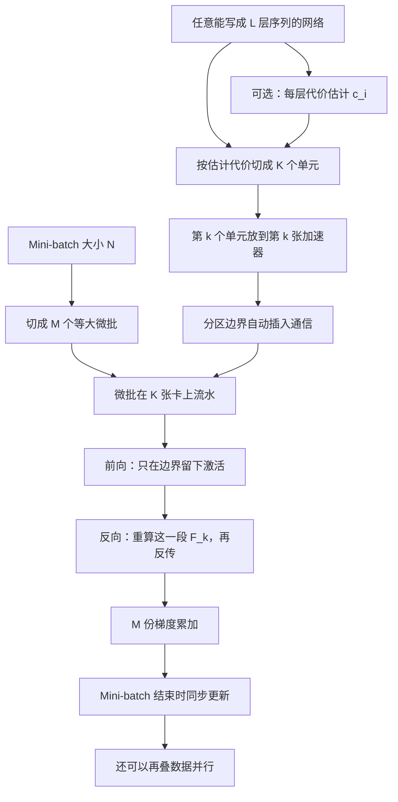
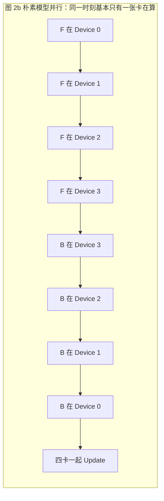
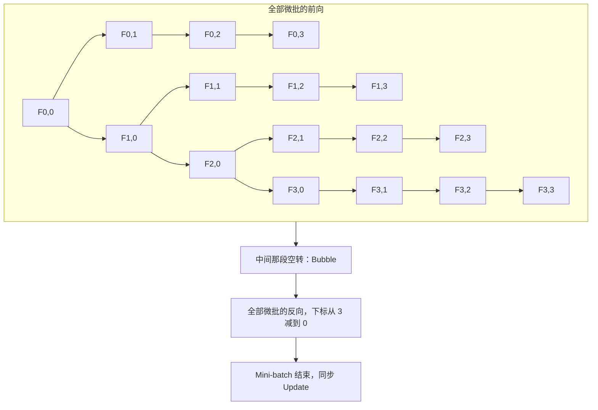

# GPipe：按层切开大网，微批流水线让加卡不必改梯度

<!-- release-date: 2018-11-16 -->

> 本文依据 Google / Google Brain 的 **GPipe: Easy Scaling with Micro-Batch Pipeline Parallelism**，即 arXiv:1811.06965 **v5**（2019-07-25），共 11 页。封面水印为 `arXiv:1811.06965v5 [cs.CV] 25 Jul 2019`。页码均指这份 PDF。全文把三件事分开标注：**报告明确写了什么**、**我们如何解释或验算它**、**哪些是外部资料补充**。
>
> 动笔前核过 [arXiv 提交历史](https://arxiv.org/abs/1811.06965)：v1（2018-11-16，653 KB）、v2（2018-11-19）、v3（2018-11-20）、v4（2018-12-12）、v5（2019-07-25，779 KB）。本地件就是官方最新的 v5，未做替换。**数字一律用 v5**，不混用 v1。v1 封面标题是 *GPipe: Efficient Training of Giant Neural Networks using Pipeline Parallelism*，摘要里 ImageNet top-1 写 **84.3%**；v5 封面改成 *Easy Scaling with Micro-Batch Pipeline Parallelism*，摘要改成 **84.4%**。arXiv 摘要页至今仍显示旧标题，NeurIPS 2019 正式发表也沿用旧标题（会议录 103–112 页）。本文 H1 用中文可读标题，英文题名以 v5 封面为准。
>
> 作者是 Yanping Huang、Youlong Cheng、Ankur Bapna、Orhan Firat、Mia Xu Chen、Dehao Chen、HyoukJoong Lee、Jiquan Ngiam、Quoc V. Le、Yonghui Wu、Zhifeng Chen。v5 封面只印 `@google.com` 邮箱，不另写单位行。v1 把部分作者标成 Google Brain、部分标成 Google。v5 比 v1 多了 Bapna、Firat、Mia Xu Chen、Yonghui Wu 四人，并整节补上多语翻译。目录按主要归属放在 Google。
>
> `release-date` 取 **2018-11-16**。GPipe 是训练库论文，没有对外可用的产品模型。按「技术首次官方公开日」取 arXiv v1。NeurIPS 开会日、v5 修订日和 2019-03-04 的 [Google AI 博客](https://research.google/blog/introducing-gpipe-an-open-source-library-for-efficiently-training-large-scale-neural-network-models/) 都不回写。那篇博客仍写 84.3%，属于 v5 之前的公开文本。
>
> 这份 11 页 PDF **没有附录**。正文三处写「见 supplementary material」，那些细节不在本地页码里。NeurIPS 2019 会议页另有 6 页 Supplemental，下文凡是从那份附件取出的，都标成外部补充，不用 `(PDF p. N)`。

## 读前先认识几个词

这篇论文的门槛不在公式，在于它同时用了「模型怎么切」和「一个训练步怎么走」两套词。先说人话。

- **加速器（accelerator）**：论文里的 GPU 或 TPU。一篇里两种硬件都出现，读表时先看这一列是哪种。
- **层（layer）**：网络里可以单独写出前向函数 $f_i$ 和参数 $w_i$ 的一段。卷积、残差块、Transformer 层，在这篇里都只是「一层」。
- **分区 / 单元（partition / cell）**：把连续若干层捆在一起，放到一张加速器上。第 $k$ 个单元的前向是 $F_k$，反向是 $B_k$。
- **Mini-batch（小批量）**：一次参数更新看到的全部样本，大小记作 $N$。同步 SGD 的更新单位是它，不是下面的微批。
- **Micro-batch（微批）**：把一个 mini-batch 再切成 $M$ 等份。流水线一次只推一份微批，梯度先攒着，等 $M$ 份都算完再更新。
- **朴素模型并行（naive model parallelism）**：层切到多卡上，但一个 mini-batch 仍然整份走完前向再走反向。因为层与层有依赖，同一时刻往往只有一张卡在算。
- **流水线气泡（pipeline bubble）**：后一级在等前一级，加速器空转的那段时间。
- **Re-materialization / re-computation（重计算）**：前向时丢掉大部分中间激活，反向时把这一段前向再算一遍。论文两套名字混用，指同一件事。
- **同步 mini-batch SGD**：一个 mini-batch 内所有微批用同一份权重做完前反向，梯度加总之后才改参数。切成几段，不改变这次更新的数学对象。

论文自己反复出现的专有设定：

- **GPipe**：一个流水线并行 **库**，不是一种新网络。接口只要三件事：分区数 $K$、微批数 $M$、以及 $L$ 层的顺序定义（PDF p. 3）。
- **Lingvo**：它落地的框架（PDF p. 2，文献 [16]）。
- **AmoebaNet-B (18, 512)**：557M 参数的图像模型，输入 $480\times 480$，用来证明「切开之后质量还在」（PDF p. 5）。
- **$T(L,H,A)$**：编码器 $L$ 层、解码器 $L$ 层、前馈隐层 $H$、注意力头 $A$ 的 Transformer。模型维度固定 1024。所以「128 层」对应 $T(64,\cdot,\cdot)$，不是编码器 128 层（PDF p. 6 脚注 1）。

如果你只想记一句话：

> **单卡装不下时，不要先去改编译器或重写模型。能写成一层接一层，就可以按层切开；再用微批把流水线填上，梯度在整个 mini-batch 上累积。加卡改变的是放置，不是这次 SGD 在优化什么。**

## 一句话先说清

2018 年已经看得很清楚：模型更大，图像和语言的质量都会涨（PDF p. 1–2、图 1）。卡住的不是「要不要做大」，是 **一张加速器的内存做不大**。当时多数模型并行又绑死架构：为某一种卷积或某一种矩阵乘专门改基础设施，换任务就作废（PDF p. 1）。

GPipe 要做的事更窄，也更硬：

> **任何能表达成层序列的网络，按层切到不同加速器上；把 mini-batch 切成 micro-batch 做流水；用同步梯度累积保证切成几段都不改更新语义。**

摘要里的成绩单是（PDF p. 1）：

- 图像：557M 参数 AmoebaNet，ImageNet-2012 top-1 **84.4%**；
- 翻译：单个 6B、128 层 Transformer，语料覆盖 100 种以上语言，质量超过当时所有双语基线。

对训练系统来说，口号不如边界要紧。你买到的是「加卡不必改算法语义」和一条几乎线性的吞吐曲线。你没有买到 1F1B 日程，也没有买到把单层矩阵乘切到多卡上的张量并行。这两件事这篇 PDF 都没写，后文会单独钉死。

### 一条阅读路线

如果只有半小时读原文，建议按这个顺序：

1. **p. 3 图 2**：朴素模型并行为什么空转，微批流水线把空转填到哪里，梯度在末尾一次性更新。
2. **p. 3 §2.2**：同步累积。这是「与分区数无关」这句话的全部依据。
3. **p. 4 §2.3**：重计算的显存公式，气泡率 $O((K-1)/(M+K-1))$，$M\ge 4K$ 时气泡可忽略。
4. **p. 4–5 表 1–3**：8 加速器大约 25 倍更大的网；Transformer 四倍卡大约 3.5 倍加速；没有高速互联也能接近线性。
5. **p. 5–6 表 4**：557M、四分区、单裁 84.4% / 97%。
6. **p. 6–7 图 3、表 5**：6B 多语 Transformer；深度对低资源更有用；大批次还能再涨一点。
7. **p. 8 §6**：和 Mesh-TensorFlow 的 SPMD、和当时的 PipeDream 各让了什么。

## 报告地图：11 页里各写了什么

先摊开篇幅。这是一篇系统论文，没有新注意力公式，也没有完整的预训练 recipe。密度最高的是第 2 节的切法和第 3 节的表。

| 报告章节 | PDF 页 | 讲了什么 | 密度 |
|---|---|---|---|
| 标题、摘要 | p. 1 | 库、几乎线性加速；557M / 84.4%；6B 多语 Transformer | 高 |
| §1 + 图 1 | p. 1–2 | 模型容量与质量强相关；任务无关的模型并行 | 高 |
| §2 起 + 图 2 | p. 2–3 | Lingvo；层序列接口；朴素并行 vs 微批流水线 | 高 |
| §2.2–2.3 | p. 3–4 | 同步累积、BatchNorm 口径、重计算、气泡公式 | 高 |
| 表 1 + §3 前半 | p. 4–5 | 最大模型：AmoebaNet 1.8B、Transformer 83.9B | 高 |
| 表 2–3 + §3 后半 | p. 5 | TPU / 无 NVLink GPU 上的归一化吞吐 | 高 |
| §4 + 表 4 | p. 5–6 | ImageNet 84.4%；七个迁移数据集 | 高 |
| §5 + 图 3 + 表 5 | p. 6–8 | 103 语言、深宽权衡、可训练性、大批次 | 高 |
| §6 | p. 8–9 | SPMD 通信贵；PipeDream 异步、要存多版本权重 | 高 |
| §7 + 参考文献 | p. 9–11 | 效率 / 灵活性 / 可靠性三句话；无附录 | 低 |

11 页 PDF 里没有编号算法环境，算法写在 §2.2 的叙述里。也没有附录。

## 主要矛盾：单卡装不下，旧模型并行又绑死架构

论文没有从「我们做了一条新流水线」开场。它先指出一条已经走通、但越来越贵的路（PDF p. 1–2）：

- 图像上，近年代表性模型的容量大约涨了 36 倍，top-1 跟着涨。图 1a 的红点是这篇的 84.4%，图注写成 550M 参数的 AmoebaNet（PDF p. 2）。正文和摘要写的是 557M。同一份 PDF 里这两个数并存，本文正文用 557M，550M 只当作图注。
- 语言上也一样。图 1b 的红点是 128 层、6B 的 Transformer（PDF p. 2）。

硬件没有跟着涨。论文举的是 2014 年 Nvidia K40 的 12 GB 到 2018 年 V100 的 32 GB（这一句在 v1 引言里更完整；v5 把硬件账压成「内存限制和通信带宽迫使把模型切开」，PDF p. 1）。于是大模型必须切到多张加速器上。

切法当时有三条难看的路（PDF p. 1–2）：

1. 为特定架构写专用模型并行，换任务就作废；
2. 追求效率，牺牲灵活性；
3. 追求灵活性，训练效率上不去。

矛盾因此变成：

> 研究者想加卡就把模型做大，但不想每换一个网络就重写并行算法，更不想因为切成几段，这次梯度就变成另一种更新。

GPipe 的回答是把「放置」和「优化语义」拆开。放置可以随 $K$ 变；一次更新仍然是这个 mini-batch 的同步梯度。

## 先看全景：它不是新网络，是一条按层切的流水线

这张图按 PDF p. 2–4 的叙事重画，是机制示意，不是论文原图，也不表示实测耗时。主路径不是新层，而是「层序列 → 分区 → 微批流水 → 同步更新」。

有三个旋钮贯穿全文，必须先分清：

| 旋钮 | 符号 | 改它会怎样 | 论文认为该不该改语义 |
|---|---|---|---|
| 分区数 | $K$ | 模型按层切到更多卡 | 不该。梯度应对 $K$ 不变 |
| 微批数 | $M$ | 气泡变小，单步微批变瘦 | 吞吐变，更新对象仍是整个 mini-batch |
| Mini-batch 大小 | $N$ | 一次更新看到多少样本 | 这才是 SGD 的数学对象 |

后文所有「与分区数无关」，说的都是 $K$，不是 $M$。BatchNorm 在训练时按微批统计，已经说明 $M$ 不是完全无感的（PDF p. 3）。

## 朴素模型并行为什么会空转

图 2a 把一个四层网络画成四张卡（PDF p. 3）。$F_k$ 是第 $k$ 个单元的复合前向，$B_k$ 既依赖上一层传来的 $B_{k+1}$，也依赖自己前向留下的 $F_k$。这是反向传播的普通依赖，不是 GPipe 发明的。

图 2b 是朴素切法（PDF p. 3）。一个 mini-batch 必须整份走完 $F_0\to F_1\to F_2\to F_3$，再整份走完 $B_3\to B_2\to B_1\to B_0$，最后四张卡一起 Update。时间轴上大部分格子是空的：Device 3 在等 Device 0–2 算完前向，Device 0 在等后面三张卡算完反向。

这是根据论文图 2b 重画的 **机制示意**（PDF p. 3），不是实测时间。原文用空白格子表示空转，这里用箭头顺序表达同一件事。

论文把后果写得很硬：顺序依赖导致严重低利用率（PDF p. 3）。加卡几乎买不到并行，只买到「模型勉强塞得下」。

这就是后面微批要填的洞。不是通信模型写错了，是 **计算图本身是一条链**，一份数据在链上一次只能占用一个环节。

## 核心设计一：把 mini-batch 切成微批，让不同卡同时干不同份数据

图 2c 把同一个四段模型的一份 mini-batch 切成 4 个微批（下标 0, 1, 2, 3）（PDF p. 3）。Device 0 算完 $F_{0,0}$ 立刻把激活传给 Device 1，自己转去算 $F_{0,1}$。四张卡可以同时处理不同微批。

关键日程必须按原图读，不要后来的日程倒推：

- 左边一整块是 **全部前向**：$F_{k,m}$ 按微批下标递增；
- 中间标了 **Bubble**；
- 右边一整块是 **全部反向**：$B_{k,m}$ 按微批下标递减；
- 末尾一列是四张卡一起 **Update**。

这是根据论文图 2c 重画的 **机制示意**（PDF p. 3）。原图用色块长度表示时间，这里只保留「先全前向、再全反向、最后更新」这一条日程。论文当时 **没有** 后来叫 1F1B 的「做一个前向就还一个反向」交错，也没有交错 1F1B。图 2c 不是那种图。

用户要指定的接口只有三个量（PDF p. 3）：

1. 分区数 $K$；
2. 微批数 $M$；
3. $L$ 层的顺序和定义，每层给出 $w_i$、$f_i$，可选给出代价 $c_i$。

切分算法尽量让各单元的估计代价方差最小，好让各段耗时对齐（PDF p. 3）。边界上自动插入通信原语，只传激活，不传整份权重。

前向时，大小为 $N$ 的 mini-batch 被切成 $M$ 个等大微批，在 $K$ 张加速器上流水。反向时，每个微批的梯度按 **同一份** 前向用过的模型参数来算。一个 mini-batch 结束，把 $M$ 份梯度累加，再更新所有加速器上的参数（PDF p. 3）。

人话版：微批是为了让链上的各个环节同时有活干。它们不是 $M$ 次独立的 SGD。一次更新仍然只发生在 mini-batch 边界上。

### 可迁移启发

若你的模型本来就能写成层序列，先问能不能按层切开，再问一个训练步能不能切成彼此独立的微批。能，这篇的流水线才用得上。若计算图不是一条链——比如单层内部就要把一张巨大矩阵切到多卡——GPipe 明确假定「单层先得装进一张加速器」（PDF p. 8）。

## 核心设计二：同步累积，所以梯度与分区数无关

「与分区数无关」不是一句口号，是同步 mini-batch SGD 的直接推论（PDF p. 2–3）。

一次更新的对象是整个 mini-batch 的梯度。$K$ 只决定「第几层住在哪张卡上」。只要：

- 每个微批用同一份权重做完前向和反向；
- $M$ 份梯度在更新前加总；
- 不加异步的中间更新；

那么切成 2 段还是 8 段，这次更新在数学上仍是这份大小为 $N$ 的 mini-batch 的梯度。论文原话：gradient updates using GPipe are consistent regardless of the number of partitions，因此研究者可以靠加加速器把模型做大（PDF p. 2）。结论第 7 节把这件事收成第三条属性 **Reliability**（PDF p. 9）。

**我们如何解释它。** 这句话的成立条件是「更新发生在 mini-batch 边界，而且所有微批看见同一份权重」。它保证的是对 $K$ 不变，不是对 $M$ 不变，也不是对 BatchNorm 统计口径不变。

论文自己把 BatchNorm 的裂缝写出来了（PDF p. 3）：

- 训练时，充分统计量在 **每个微批** 上算，必要时再跨 replica 同步；
- 评估时，用整个 mini-batch 上滑动平均出来的统计量。

第 6 节把这类「必须看整个 batch」的层写成当前限制：微批切分需要额外策略，BatchNorm 就是例子（PDF p. 8–9）。

所以保证的代价要一起记：

| 代价 | 论文写在哪 | 为什么付这笔账 |
|---|---|---|
| 必须等 $M$ 个微批都走完才更新 | 图 2c、§2.2 | 否则就不是这份 mini-batch 的同步梯度 |
| 前向和反向之间有气泡 | §2.3 | 先灌满、再排空，链的两端必然空一段 |
| 激活要额外处理 | §2.3 | 图 2c 先全前向再全反向，多份微批的边界激活会同时活着 |
| BatchNorm 训练统计跟着微批走 | §2.2、§6 | 微批不是原来的 mini-batch |
| 单层必须先装进一张卡 | §6 及脚注 3 | 它不切单次矩阵乘 |

脚注 3 给的退路是：把一次矩阵乘拆成更小的、**按层顺序** 摊到多层上（PDF p. 8）。这不是张量并行。张量并行会把同一次矩阵乘同时铺到多卡，并用 AllReduce 一类通信拼回来；GPipe 把那种做法归到 Mesh-TensorFlow 的 SPMD 对照里（PDF p. 8）。

### 可迁移启发

若你要「加卡不改收敛」，先锁死更新边界：一个 mini-batch 只能有一次参数更新，微批只是计算编排。不要把分区数 $K$ 和微批数 $M$ 当成同一个旋钮。$K$ 是放置，$M$ 是填气泡。BatchNorm、对比学习、任何依赖整批统计的层，都要单独规定微批口径，不能假装没发生。

## 核心设计三：重计算，把激活从「整网整批」收到「边界 + 当前微批」

没有重计算时，算 $b_i$ 既要上一层的 $b_{i+1}$，也要缓存的 $f_i(x)$，峰值激活按 $O(N\times L)$ 走（PDF p. 4）。网络一深，激活比参数先爆。

GPipe 的做法（PDF p. 4）：

- 前向时，每张加速器 **只保存分区边界上的输出激活**；
- 反向时，第 $k$ 张卡把复合前向 $F_k$ 再算一遍，当场恢复这一段需要的中间量。

峰值激活因此写成

$$
O\left(N + \frac{L}{K}\times\frac{N}{M}\right)
$$

其中 $N/M$ 是微批大小，$L/K$ 是每个分区里的层数（PDF p. 4）。

**我们如何解释它。** $N$ 这一项来自边界激活：图 2c 要等全部前向结束才开始反向，边界上每一份微批的输出都得留到自己的反向到来，份数是 $M$，每份大小是 $N/M$，乘起来仍是 $O(N)$。第二项是重算当前这一段时，这一分区内部、**当前这一份微批** 的激活。$M$ 变大，第二项变小，不是变大。

这一点必须按原文公式读。后人常说「GPipe 的激活随微批数线性涨」。**那不是这份 PDF 给出的式子**，也不要拿后来系统论文里的二手数字填进来。这份 PDF 已经把重计算算进峰值，并且明确写了 $O(N+(L/K)(N/M))$。

表 1 给出单卡上的实测账（PDF p. 4）。Naive-1 是不用 GPipe 的顺序版本。Pipeline-1 是一张加速器上开 GPipe（因此主要吃到的是重计算和切微批，还没有跨卡流水）：

| 设定 | 模型 | 参数 | 参数内存 | 峰值激活 |
|---|---|---:|---:|---:|
| Naive-1 | AmoebaNet-D (18, 208) | 82M | 1.05 GB | 6.26 GB |
| Pipeline-1 | AmoebaNet-D (18, 416) | 318M | 3.8 GB | 3.46 GB |

激活从 6.26 GB 收到 3.46 GB，单卡因此能从 82M 放到 318M（PDF p. 4）。每个参数按 12 字节计，因为训练用了 RMSProp（PDF p. 4 表注）。

重计算不是免费的。论文在讨论气泡时补了一句：反向里的重算可以提前调度，不必等更早层的梯度到来，所以实测气泡比光看公式更乐观（PDF p. 4）。这仍是在图 2c 那种「先全前向、再全反向」里做重叠，不是换了一种日程。

### 可迁移启发

流水线并行和重计算是配套的。只切开不重算，边界激活和层内激活会一起涨；只重算不切开，模型参数仍然塞不进多卡。GPipe 把两招绑在同一个库里，不是因为实现方便，是因为显存账必须两笔一起算。

## 气泡率：公式在 PDF 里，经验阈值是 $M\ge 4K$

图 2c 中间那段空白，论文叫 bubble overhead（PDF p. 4）。把气泡时间摊到 $M$ 个微步上，写成

$$
O\left(\frac{K-1}{M+K-1}\right)
$$

（PDF p. 4）

经验观察：当 $M\ge 4\times K$ 时，气泡几乎可以忽略（PDF p. 4–5）。原因有两条：分母里 $M$ 足够大；重算可以提前塞进等待。

**我们如何解释它。** 分子 $K-1$ 是灌满 / 排空一条 $K$ 段流水线时，两端必然空出的级数。分母 $M+K-1$ 是把灌满时间也算进总步数。后来邻文常把这种「先全前向再全反向」的气泡比简化成 $(p-1)/m$，那是 $M\gg K$ 时的近似，**不是** 这篇的原式。本站已发布的 [Ultra-Scale Playbook](/reports/HuggingFace/Ultra-Scale-Playbook) 用的就是简化式，并给这种日程起名 AFAB；那是 2025 年的操作手册，不要读回 2018 年这份 PDF。

表 2 把「$M$ 太小会怎样」写成数字（PDF p. 5）。归一化吞吐，每种模型以 $K=2,M=1$ 为 1。每段分到一张加速器。必要时会改 batch 大小以塞进内存——所以这张表不是严格的弱缩放。

| $M$ | AmoebaNet $K=2$ | $K=4$ | $K=8$ | Transformer $K=2$ | $K=4$ | $K=8$ |
|---|---:|---:|---:|---:|---:|---:|
| 1 | 1 | 1.13 | 1.38 | 1 | 1.07 | 1.3 |
| 4 | 1.07 | 1.26 | 1.72 | 1.7 | 3.2 | 4.8 |
| 32 | 1.21 | 1.84 | 3.48 | 1.8 | 3.4 | 6.3 |

读这张表只需抓住三行事实（PDF p. 5）：

1. $M=1$ 等于没有流水线。吞吐几乎不随 $K$ 涨，说明同一时刻基本只有一张卡在算。这是图 2b 的数字版。
2. $M$ 至少是 $K$ 的 4 倍时，气泡才被压下去。Transformer 在 $M=32$、$K$ 从 2 到 8（四倍加速器）时，吞吐从 1.8 到 6.3。$6.3/1.8=3.5$，这就是摘要和正文反复说的「四倍加速器最多约 3.5 倍」（PDF p. 1、p. 5）。
3. AmoebaNet 同样 $M=32$ 只走到 3.48 / 1.21 ≈ 2.9 倍，因为各层计算量不均。论文把「几乎线性」留给层间更齐的 Transformer，把「次线性」留给 AmoebaNet（PDF p. 5）。

负载不均是图 2c 的隐藏前提。图注假定各段画得一样长。正文立刻说：不同层的内存和 FLOPs 常常差很多，启发式切分会切歪，更好的切分算法还能再挖一点（PDF p. 4）。

### 可迁移启发

先把 $M$ 加到大约 $4K$，再抱怨吞吐不线性。$M=1$ 的对照在这张表里已经宣判：加卡而不切微批，买到的只是放置，不是并行。层间不齐时，不要指望流水线自己把负载抹平。

## 接口：它说自己是库，跑在 Lingvo 上

第 2 节标题就是 **The GPipe Library**（PDF p. 2）。论文反复称它为 library，不是某种必须改编译器的新运行时。实现放在 Lingvo 框架下（PDF p. 2，文献 [16]）。核心设计被认为一般适用，也可以搬到 Caffe、MXNet、PyTorch（PDF p. 2，文献 [17–19]）。

接口被写成「extremely simple and intuitive」（PDF p. 3）：层序列、$K$、$M$。例子指向 supplementary material。**这份 11 页 PDF 里没有示例代码，也没有 API 列表。**

**外部补充，不是这份 PDF 的内容。** 2019-03-04 的 Google AI 博客写「The core GPipe library has been open sourced under the Lingvo framework」。代码后来出现在 [`tensorflow/lingvo` 的 `lingvo/core/gpipe.py`](https://github.com/tensorflow/lingvo/blob/master/lingvo/core/gpipe.py)。它不是一个可以脱离 Lingvo 单独 `pip install` 的库。NeurIPS 2019 Supplemental 里的示例甚至用过匿名名 `TensorPipe`，不要和正文里的 GPipe 当成两个系统。本模块只依据 PDF 讲设计，不把仓库现状写进论文原意。

## 规模：8 加速器大约 25 倍更大的网

表 1 分上下两块（PDF p. 4）。上块是 AmoebaNet，下块是 Transformer。先把硬件口径钉住，因为表头和正文有一处对不上。

正文写：AmoebaNet 的最大模型实验跑在 **Cloud TPUv2**，每加速器 8 GB，输入固定 $224\times 224$，mini-batch 128（PDF p. 4）。Transformer 跑在 **Cloud TPUv3**，每核 16 GB，词表 32k，序列长度 1024，batch 32；每层模型维 2048、前馈 8192、32 个注意力头，靠加层做大（PDF p. 5）。

表 1 上块的表头却印着 **NVIDIA GPUs (8GB each)**（PDF p. 4）。8 GB 对得上 TPU v2 单核，对不上当时的 P100（16 GB）。P100 出现在表 3，而且明确写了没有 NVLink（PDF p. 5）。**我们的判断，不是论文原话**：上块表头更像残留，正文的 Cloud TPUv2 才是这组最大模型数字的硬件。v1 正文也写的是 TPU-v2。下面引用表 1 数字时，硬件以正文为准。

AmoebaNet 最大模型（PDF p. 4）：

| 设定 | 结构 | 参数 | 参数内存 | 峰值激活 |
|---|---|---:|---:|---:|
| Naive-1 | (18, 208) | 82M | 1.05 GB | 6.26 GB |
| Pipeline-1 | (18, 416) | 318M | 3.8 GB | 3.46 GB |
| Pipeline-2 | (18, 544) | 542M | 6.45 GB | 8.11 GB |
| Pipeline-4 | (36, 544) | 1.05B | 12.53 GB | 15.21 GB |
| Pipeline-8 | (72, 512) | 1.8B | 24.62 GB | 26.24 GB |

8 张加速器放到 1.8B，论文写成「比不用 GPipe 大约 **25×**」（PDF p. 4–5）。我们的除法：$1.8\times 10^9 / 82\times 10^6 \approx 22$。25× 是论文自己的写法，不是这道除法的四舍五入结果。论文立刻解释为什么不是完美线性：AmoebaNet 各层参数不均（PDF p. 5）。

Transformer 最大模型（PDF p. 4）：

| 设定 | 层数 | 参数 | 参数内存 | 峰值激活 |
|---|---:|---:|---:|---:|
| Naive-1 | 3 | 282.2M | 11.7G | 3.15G |
| Pipeline-1 | 13 | 785.8M | 8.8G | 6.4G |
| Pipeline-8 | 103 | 5.3B | 59.5G | 50.9G |
| Pipeline-32 | 415 | 21.0B | 235.1G | 199.9G |
| Pipeline-128 | 1663 | 83.9B | 937.9G | 796.1G |

单卡上重计算给出 2.7× 更大的模型（$785.8/282.2\approx 2.78$）。128 个分区放到 83.9B，论文写成相对单卡 **298×**（PDF p. 5）。$83.9\times 10^9 / 282.2\times 10^6 \approx 297$，对得上。Transformer 几乎按加速器数线性放大，因为每层参数量和输入大小相同（PDF p. 5）。

这两块表不要混：25× 是 AmoebaNet、8 加速器、相对 Naive-1；298× 是 Transformer、128 分区、相对单卡。硬件分别是 TPU v2 和 TPU v3。输入分辨率也不是后文 ImageNet 质量实验的 $480\times 480$。

## 通信：没有高速互联，吞吐曲线仍然接近线性

GPipe 只在分区边界传激活张量，所以论文声称即使加速器之间没有高速互联，也能有效放大（PDF p. 4）。

表 3 把这句话放到单机多块 **NVIDIA P100、没有 NVLink** 上验证，数据走 PCI-E 的 device-to-host 再 host-to-device（PDF p. 5）。$M$ 固定 32。AmoebaNet 用 D (18, 128)，Transformer 用 24 层。

| | AmoebaNet $K=2$ | $K=4$ | $K=8$ | Transformer $K=2$ | $K=4$ | $K=8$ |
|---|---:|---:|---:|---:|---:|---:|
| $M=32$ | 1 | 1.7 | 2.7 | 1 | 1.8 | 3.3 |

$K$ 从 2 到 8 是四倍卡：AmoebaNet 2.7×，Transformer 3.3×（PDF p. 5）。论文的读法是：这和有高速互联的 TPU 上看到的「接近线性」同类，设备间带宽不再是模型并行的瓶颈，因为跨设备只在边界传激活（PDF p. 5）。

**我们如何解释它。** 表 3 没有给出绝对带宽或通信占比，只给出相对吞吐。它支持的判断是「边界激活比 SPMD 那种每层 AllReduce 便宜」，不是「通信开销为零」。第 6 节把 SPMD 的对照写得更直：Mesh-TensorFlow 把单次矩阵乘切到多卡，靠大量 AllReduce 拼回来，于是更依赖高速互联（PDF p. 8）。

### 可迁移启发

流水线并行省的是 **跨卡传权重**，不是所有通信。若你的切法让每一层都做一次集合通信，GPipe 这条「没有 NVLink 也能接近线性」的证据就搬不过去。先问通信发生在边界还是发生在每一层内部。

## 图像：557M AmoebaNet，ImageNet top-1 是 84.4%

质量实验不是表 1 那种「最大能塞多大」。这里把通道加宽，输入拉到 $480\times 480$，得到 **557M** 的 AmoebaNet-B (18, 512)，超参跟 AmoebaNet 原文 [12] 相同，网络切成 **4 个分区**（PDF p. 5）。单裁验证：

- top-1 **84.4%**
- top-5 **97%**

（PDF p. 5）

v1 写的是 84.3% top-1 / 97.0% top-5，结构名还曾写成 AmoebaNet-B (6, 512)。**本文只用 v5 的 84.4% 和 (18, 512)。**

然后用这份 ImageNet 预训练权重做迁移（PDF p. 5–6）。改最后一层 softmax 的类别数，新层随机初始化，其余层从 ImageNet 来。训练时输入仍是 $480\times 480$，随机水平翻转，加上 cutout。其余超参与 ImageNet 相同，细节指向 supplementary。表 4 是 5 次微调的平均单裁测试准确率（PDF p. 6）：

| 数据集 | 训练 / 测试 | 类数 | 准确率 % | 此前最好 % |
|---|---:|---:|---:|---|
| ImageNet-2012 | 1,281,167 / 50,000 | 1000 | 84.4 | 83.9 [12]（85.4\* [27]） |
| CIFAR-10 | 50,000 / 10,000 | 10 | 99.0 | 98.5 [26] |
| CIFAR-100 | 50,000 / 10,000 | 100 | 91.3 | 89.3 [26] |
| Stanford Cars | 8,144 / 8,041 | 196 | 94.6 | 94.8\* [26] |
| Oxford Pets | 3,680 / 3,369 | 37 | 95.9 | 93.8\* [29] |
| Food-101 | 75,750 / 25,250 | 101 | 93.0 | 90.4\* [30] |
| FGVC Aircraft | 6,667 / 3,333 | 100 | 92.7 | 92.9\* [31] |
| Birdsnap | 47,386 / 2,443 | 500 | 83.6 | 80.2\* [32] |

带 \* 的此前最好，要么用了非公开 Instagram 数据（Mahajan 等人 85.4%），要么用了私有 JFT-300M，要么本身不是「从零训」的对照。Real 等 [12] 和 Cubuk 等 [26] 的基线是从零训的。论文把 CIFAR-10 误差收到 1%、CIFAR-100 收到 8.7%，并引用 Kornblith 等人的观察：更好的 ImageNet 模型迁移更好（PDF p. 6）。

这节要证明的不是新的图像算法，是：**切开之后，大卷积网仍然训得动，质量还在涨。** 超参沿用 AmoebaNet 原文，等于在说 GPipe 没有为了并行去改优化语义。

## 翻译：单个 6B、128 层模型对 103 种语言

第 5 节把灵活性从卷积换到序列模型（PDF p. 6）。语料是 102 种语言↔英语的平行文档，合计 **250 亿** 训练样本，每种语言从 $10^4$ 到 $10^9$ 条不等（PDF p. 6，文献 [37]）。论文声称这是机器翻译里第一次：一个够大的 NMT 模型可以同时学会 100 多个语言对的映射，并且对所有语言都超过各自的双语模型（PDF p. 6）。引言更具体：超过逐对训练的 **350M** 双语 Transformer Big，覆盖 100 个语言对（PDF p. 2）。

对照尺是单个 Transformer，同时在两个方向放大（PDF p. 6）：

- 深度：加层；
- 宽度：加前馈隐层、加注意力头（以及注意力通道），做法类似 Shazeer 等人的 Mesh-TensorFlow 论文 [34]。

起点是 400M 的 Transformer Big，$T(6,8192,16)$，词表 64k（PDF p. 6）。图 3 拿它和四台更大的多语模型比（PDF p. 6–7）：

| 模型 | 参数 | 分区数 |
|---|---:|---:|
| $T(6,8192,16)$ | 400M | 正文没写切到几张卡 |
| $T(24,8192,16)$ | 1.3B 深 | 4（正文写 $T(24,8192,32)$，与此处 16 头不一致，见下） |
| $T(12,16384,32)$ | 1.3B 宽 | 2 |
| $T(32,16384,32)$ | 3B | 8 |
| $T(64,16384,32)$ | 6B | 16 |

128 层、6B 就是 $T(64,16384,32)$：编码器 64 + 解码器 64。采样用多语 BERT 那种基于温度的策略（PDF p. 6）。

分区那一句把 1.3B 深模型写成 $T(24,8192,32)$（PDF p. 6），同一页前文和后文深度权衡都写 $T(24,8192,16)$。**我们的判断**：16 头是贯穿图 3 的规格，32 更像分区那一句的笔误。本文叙述用 $T(24,8192,16)$。

350M 与 400M 也不要捏成同一个模型。引言的 350M 是 **逐对训练的双语** Transformer Big；§5 的 400M 是 **多语** 起点 $T(6,8192,16)$，词表 64k。双语词表和多语词表不是同一套，参数对不上很正常。

图 3 的横轴按训练数据量从多到少排语言，纵轴是相对双语基线的 $\Delta$BLEU（PDF p. 7）。读图能抓住的形状，正文没有给出逐语言的精确 BLEU：

- 从 400M 加到 1.3B，所有语言都明显涨；
- 从 1.3B 加到 6B 还在涨，尤其高资源（图左侧），但 1.3B → 3B → 6B 已经是递减回报；
- 低资源（图右侧）相对双语基线的增益很大，论文把它读成多语训练的迁移（PDF p. 7）。

深度 vs 宽度，参数都钉在 1.3B（PDF p. 7）：

- 宽：$T(12,16384,32)$
- 深：$T(24,8192,16)$

高资源上两者差不多；低资源上深模型大幅领先。论文的观察是：加深度可能更有利于泛化，也可能加强向低资源任务的迁移（PDF p. 7）。这是作者观察，不是单独的消融表。

深度带来可训练性问题（PDF p. 7）。大尺度实验里，尖峭激活（正峰度）加上数据噪声，训几千步后预测会变得极尖、怕噪声，出现非有限或过大的梯度，把已经学到的进度毁掉。两招合在一起才稳住：

1. 按 Zhang 等人 [38]，把所有 Transformer 前馈层的初始化按层数缩小；
2. 对 softmax 前的 logit 做幅度裁剪。

大批次是另一条轴（PDF p. 7–8）。数据并行被写成放大训练最简单的办法。他们把标准 Transformer Big 的 batch 从每批 260K token 加到 4M，看高资源德英的验证损失和 BLEU。优化超参与前面实验相同。论文称 4M token / batch 是当时文献里 NMT 用过的最大 batch（PDF p. 8）。表 5（PDF p. 7）：

| Batch | BLEU | Loss (NLL) |
|---|---:|---:|
| 260K | 30.92 | 2.58 |
| 1M | 31.86 | 2.51 |
| 4M | 32.71 | 2.46 |

两个指标都随 batch 变好。作者相信再加大还可能有收益（PDF p. 8）。这张表测的是 Transformer Big 的数据并行极限，**不是** 6B 模型自己的 batch。不要把 32.71 BLEU 读成 6B 多语模型的分数。

数据集、双语基线、训练配置和优化超参，正文再次指向 supplementary（PDF p. 6）。11 页里没有学习率表，也没有每种语言的条数。

## 第 6 节：和 SPMD、PipeDream 各让了什么

第 6 节把 GPipe 放回 2018–2019 年的模型并行菜单里（PDF p. 8）。核心想法都是把网络切成计算单元放到不同设备上，但朴素切法利用率低、通信容易成为瓶颈。当时的两条出路是 SPMD 和流水线。

**Mesh-TensorFlow 的 SPMD**（PDF p. 8）：把数据并行那种 SIMD 思路推广到别的张量维。单次矩阵乘可以随加速器数线性变大，于是单层参数也可以线性变大。代价是大量 AllReduce 去拼每次并行矩阵乘的输出，所以更依赖高速互联。能被高效切开的算子种类也受限。卷积按通道切不划算，因为通道之间几乎是全连接；按空间切又要处理 halo。想靠 SPMD 加深度，就要把每一层切到更多卡上，通信再涨一截。

**流水线这一支**（PDF p. 8）：论文点名 PipeDream（文献 [48]，arXiv:1806.03377）。GPipe 对它的概括是：把前向流水起来，并与反向交错，目的是提高利用率、降低参数服务器的通信。GPipe 批评的是 **异步反向带来的权重过时**；为了算准梯度，PipeDream 要在每张加速器上保留多版本参数，反而妨碍把模型做大。

这段对照里的 PipeDream，是这篇论文当时引用的那一版异步流水线。它不是后来同步的 1F1B，也不是交错 1F1B。后两种日程这篇 PDF 里没有出现。

GPipe 给自己的定位（PDF p. 8）：

- 微批先流水，整个 mini-batch 只做一次同步更新；
- 和重计算绑在一起，才能把 $M$ 加得足够大，从而压气泡，同时不必走异步更新；
- 模型大小随加速器数线性放大；
- 跨设备通信只发生在每个微批的分区边界，开销边缘，所以没有高速互联也能用。

限制也写在同一页（PDF p. 8–9）：

- 当前假定单层装得进一张加速器；
- 必须看整批的层（BatchNorm 是例子）需要额外策略。

结论把三句话再报一遍（PDF p. 9）：**Efficiency** 几乎线性加速；**Flexibility** 任何层序列；**Reliability** 同步梯度下降，训练对分区数一致。

## 论文写了什么、没写什么

### 被实验支撑的结论

- 朴素按层切会严重空转；把 mini-batch 切成微批，不同卡才能同时干活（PDF p. 3、图 2；PDF p. 5、表 2 的 $M=1$ 行）。
- 同步累积之后，更新对象是整个 mini-batch。论文把「对分区数一致」写成设计保证（PDF p. 2–3、p. 9）。
- 重计算把单卡 AmoebaNet 从 82M 放到 318M；8 加速器放到 1.8B，论文写成约 25×（PDF p. 4–5）。
- Transformer 在 128 分区放到 83.9B，约 298×；层间整齐时最大模型随卡数线性（PDF p. 5）。
- $M\ge 4K$ 时气泡几乎可忽略。Transformer 四倍加速器最多约 3.5×（表 2，$M=32$，$K=2\to 8$，$6.3/1.8$）（PDF p. 5）。
- 没有 NVLink 的 P100 上，同样四倍卡：AmoebaNet 2.7×，24 层 Transformer 3.3×（PDF p. 5）。
- 557M AmoebaNet-B (18, 512)、四分区、单裁 ImageNet top-1 84.4%、top-5 97%（PDF p. 5–6）。
- 单个 6B、128 层多语 Transformer 相对双语基线全面上涨，低资源一侧迁移更明显（PDF p. 6–7、图 3）。这是读图结论，正文没有逐语言 BLEU 表。

### 只是作者观察、没有单独成表的

- 更深的 1.3B 比同样参数的宽模型更利于低资源（PDF p. 7）。
- 尖峭激活加数据噪声会毁掉深度模型的训练，缩小前馈初始化和 logit 裁剪可以缓解（PDF p. 7）。没有报裁剪阈值。
- Transformer Big 的 batch 从 260K 加到 4M，德英 BLEU 从 30.92 到 32.71（PDF p. 7–8）。不要当成 6B 模型的分数。
- 启发式切分会切歪，更好的切分算法还能再挖（PDF p. 4）。没有把切分算法写成伪代码。

### 报告自己承认的限制

- 单层必须先装进一张加速器（PDF p. 8）。
- 依赖整批统计的层，微批切分需要额外策略（PDF p. 8–9）。
- 层间不齐时加速是次线性的（PDF p. 5）。
- 气泡在 $M$ 不够大时不可忽略（PDF p. 5）。
- 11 页 PDF 把接口示例、ImageNet 训练细节、翻译数据与超参都推到 supplementary，而本地 PDF 没有附录。

### 论文根本没有写的东西

下面这些不要从今天的三维并行倒推回去：

- **没有 1F1B 日程。** 图 2c 是全部前向、再全部反向、再同步更新。论文当时还没有后来那些「做一个前向就还一个反向」的日程，也没有交错 1F1B、零气泡流水线。
- **没有张量并行的实现细节。** 对照的是 Mesh-TensorFlow 那种把单次矩阵乘切到多卡、靠 AllReduce 拼回来的 SPMD。脚注 3 的「把一次矩阵乘拆小、按层顺序摊开」也不是张量并行。
- 没有序列并行、上下文并行、专家并行。
- 没有优化器状态切分、没有 ZeRO 式的参数分片。
- 没有把激活随 $M$ 线性增长写成一条要消灭的定律。原文峰值激活公式里，$M$ 出现在分母上。
- 没有服务延迟、没有推理流水线。
- 没有完整的学习率、步数、墙钟和碳排。

## 正文指向、但不在这 11 页里的补充材料

**以下全部是外部资料补充。** 来源是 NeurIPS 2019 会议页的 6 页 Supplemental，不是本地 `GPipe.pdf` 的页码。只用来补上正文三处「见 supplementary」的空洞，不把附件里的讨论段读成 v5 正文结论。

接口示例：把网络写成层列表，再交给流水线层。附件用单元测试检查不同分区数下梯度范数是否一致（附件给的参考值是 0.269997，误差 $10^{-6}$）。示例代码里的类名是匿名期的 `TensorPipe`，不要另当成一个库。

图像训练：AmoebaNet-B (18, 512) 用 RMSProp（decay 0.9，$\epsilon=0.1$），$L_2$ 为 $4\times 10^{-5}$，标签平滑 0.1，辅助头权重 0.4，drop-path 跟 NasNet，最后一层 dropout 0.5。学习率每 3 个 epoch 乘 0.97，初始学习率是 $0.00125\times$ batch size。迁移学习在各数据集上另选学习率和 $L_2$，用 20% 训练数据做 hold-out，再重复 5 次。

「对分区数一致」的实验：AmoebaNet-D (6, 256) 训 35 个 epoch，对照官方实现 5 次的均值和标准差；GPipe 在 1、2、4、8 个分区上的最终准确率落在均值的 1.6 个标准差内。这是附件里真正动手核过的一致性证据，正文只有设计陈述。

翻译数据：每种语言从约 35k 到 20 亿条不等。双语主模型是大约 **375M** 的更大 Transformer Big，共享 32k SPM 词表，优化器 Adafactor。多语用温度 $T=5$ 采样，64k 词表，字符覆盖率 0.999995。375M 可以解释正文引言里那个四舍五入的 350M，不要和多语 400M 起点混用。

## 论文之后：日程换了，同步更新这一条还在

**以下全部是外部资料补充，不是这篇 PDF 的内容。这篇 GPipe 论文当时还没有那些日程。**

后来训练系统把图 2c 那种「先全前向、再全反向」叫做 AFAB / flush-and-fill，并在它后面接上同步 1F1B 和交错 1F1B。邻文 [Ultra-Scale Playbook](/reports/HuggingFace/Ultra-Scale-Playbook) 把这条演进写成操作手册：1F1B **不减小气泡**，它减小的是同时活着的激活份数；交错才靠把每张卡切成 $v$ 个层块去压气泡，代价是通信量乘 $v$。那些公式和热力图属于 2025 年那本书，不要当成 2018 年 GPipe 已经测过的数。

本站知识库「并行策略」也按后来的日程写过 GPipe → 1F1B → interleaved 1F1B。那是今天的对照表。若把「峰值要攒 $m$ 份激活」读回这篇 PDF，会和 PDF p. 4 的重计算公式打架。两边不要对齐。

PipeDream 在这篇里是异步对照（PDF p. 8）。后来还有同步版本的流水线，不再靠多版本权重来抵消过时。那是后话。不要用后人的「GPipe 激活随微批线性涨」二手数字，冒充原文表 1。

Mesh-TensorFlow 那条 SPMD 路，后来在大规模训练里以张量并行的名字继续走。GPipe 只论证了「按层切、边界传激活」在没有高速互联时仍然划算。它没有论证张量并行不该用。

## 和本站其他文章接起来

- 2017 年的层序列从哪来：本站 [Transformer](/reports/Google/Transformer) 是 $T(L,H,A)$ 的零件图。GPipe 把那种编码器—解码器当成「可以按层切」的例子，不改注意力公式。
- 2018 年另一条把单层切开的路：第 6 节对照的 Mesh-TensorFlow，后来的 Switch Transformer 仍走专家并行 + SPMD，见 [Switch Transformers](/reports/Google/Switch-Transformers)。GPipe 切的是层，Switch 切的是专家。不要把 25× 和万亿参数放进同一张账单。
- 2025 年怎么把流水线放进五维并行：见 [Ultra-Scale Playbook](/reports/HuggingFace/Ultra-Scale-Playbook)。那本书把 GPipe 日程叫 AFAB，并明确写了后继日程。本篇只负责 2019 年 7 月这份 PDF 当时证明了什么。

索引里尚未发布的 Megatron-LM、ZeRO、零气泡流水线，也是后继系统。它们的加速比、显存公式和批评，一律不读进本文。

## 能带走的六条

### 1. 先把「放置」和「这次 SGD 在优化什么」拆开

GPipe 最值得学的不是「流水线」这个词，是它拒绝让 $K$ 改写更新语义（PDF p. 2–3）。微批可以流水，权重必须等到整个 mini-batch 结束才动。加卡如果悄悄变成异步更新，你已经不在优化原来那个目标。

### 2. 链状计算图的并行，靠的是同一条链上同时走多份数据

图 2b 失败，是因为一份数据在层间有依赖。图 2c 成功，是因为四份微批可以分别停在四段上（PDF p. 3）。若你的热点根本不是层间依赖，而是单层内部的巨型矩阵乘，这篇给的是脚注 3 和 SPMD 对照，不是一张现成的切法。

### 3. 气泡公式要带着分母读

$O((K-1)/(M+K-1))$ 已经把灌满时间算进去（PDF p. 4）。经验阈值 $M\ge 4K$ 是这篇的操作建议，不是定律。表 2 的 $M=1$ 行说明：加卡而不加微批，吞吐几乎不动。

### 4. 重计算不是流水线的附件，是峰值激活公式的一部分

原文峰值是 $O(N+(L/K)(N/M))$（PDF p. 4）。单卡 AmoebaNet 的激活从 6.26 GB 收到 3.46 GB，模型才能从 82M 放到 318M。讨论 GPipe 显存时，先把重计算算进去，再谈微批份数。

### 5. 「几乎线性」有前提：层要齐，$M$ 要够，测的是相对吞吐

3.5× 绑在 Transformer、TPU、表 2、$M=32$、$K=2\to 8$，而且必要时会改 batch 大小（PDF p. 5）。AmoebaNet 同样条件只有大约 2.9 倍。没有 NVLink 的 3.3× 是另一张表、另一种模型深度。离开这些分母就不能当通用加速比。

### 6. 任务无关，不等于层无关

「任何层序列」是灵活性的上界（PDF p. 1、p. 9）。下界写在第 6 节：单层先得装进一张卡；BatchNorm 这类整批算子要另写口径。卷积和 Transformer 能共用同一套库，是因为两者都被改写成了层序列，不是因为流水线真的不看架构。

## 关键词回看

- **层序列 / cell**：网络写成 $L$ 层，连续层捆成 $K$ 个单元，每单元一张加速器（PDF p. 3）。
- **Mini-batch / micro-batch**：更新单位 vs 流水单位。大小 $N$ 切成 $M$ 等份（PDF p. 3）。
- **同步累积**：微批梯度加总后才更新，保证对 $K$ 一致（PDF p. 2–3）。
- **朴素模型并行**：按层切但不切微批，利用率被顺序依赖打穿（PDF p. 3、图 2b）。
- **Bubble**：$O((K-1)/(M+K-1))$，经验上 $M\ge 4K$ 可忽略（PDF p. 4）。
- **Re-materialization**：只存边界激活，反向重算 $F_k$。峰值 $O(N+(L/K)(N/M))$（PDF p. 4）。
- **Lingvo**：GPipe 作为库落地的框架（PDF p. 2）。
- **SPMD / Mesh-TensorFlow**：把单次运算切到多卡，通信是 AllReduce，和边界传激活不是一路（PDF p. 8）。
- **PipeDream（这篇里的那一版）**：前反向交错的异步流水线，权重过时，要存多版本（PDF p. 8）。
- **$T(L,H,A)$**：编码器 $L$ + 解码器 $L$ 的 Transformer。6B 对应 $T(64,16384,32)$（PDF p. 6）。

## 最后的判断

这篇论文的价值不在发明「把模型切到多卡」——参数服务器和各种专用模型并行已经切过。它的价值在于看清了当时卡住普及的那一个假设：**要做大，就得为这个架构写一套并行算法，并且接受切法改写优化语义。**

打破假设的办法很小：层序列、$K$、$M$、同步累积、边界上重计算。换来的是卷积和 Transformer 共用一个库，8 加速器上大约 25 倍更大的 AmoebaNet，四倍卡上最多约 3.5 倍的 Transformer 吞吐，以及 ImageNet 84.4% 和 6B 多语翻译这两张质量收据。

它留下的边界同样清楚。图 2c 那种先全前向再全反向，气泡只能靠加大 $M$ 来摊。单层装不进一张卡，它只给了一句脚注。BatchNorm 的统计跟着微批走。3.5× 和 25× 都绑在具体模型和硬件上。11 页把训练细节推到补充材料，本地 PDF 读不到切分代码，也读不到每种语言的条数。

如果只带走一句：

> **加卡应该只改放置，不改这次梯度是什么。微批是用来填那条层间的链，不是用来把一次 SGD 拆成 $M$ 次不同的更新。**

## 参考资料与边界

- 原始依据：本地 `papers/Google/GPipe.pdf`，即 [arXiv:1811.06965v5](https://arxiv.org/abs/1811.06965)，2019-07-25 修订，11 页。封面标题 *GPipe: Easy Scaling with Micro-Batch Pipeline Parallelism*。arXiv 至今最新是 v5。
- 正式发表：NeurIPS 2019，Vancouver，会议录页码 103–112，题目沿用 v1 的 *Efficient Training of Giant Neural Networks using Pipeline Parallelism*。[会议页](https://proceedings.neurips.cc/paper/2019/hash/093f65e080a295f8076b1c5722a46aa2-Abstract.html)。本地 PDF 是 arXiv v5，页码 1–11，**不是** 103–112。会议页另有 6 页 Supplemental，上文已标明哪些数字来自那里。
- `release-date` 取 **2018-11-16**：arXiv v1 公开日。v5 修订日、NeurIPS 开会日和 2019-03-04 博客都不回写。
- v1 不要混用的数字：ImageNet top-1 **84.3%**（v5 为 84.4%）；封面标题不同；v1 摘要还没有 6B 多语翻译；v1 用 AmoebaNet-B (6, 512) 这个结构名，v5 改为 (18, 512)。
- 官方博客（不要把 84.3% 读进 v5 正文）：[Introducing GPipe](https://research.google/blog/introducing-gpipe-an-open-source-library-for-efficiently-training-large-scale-neural-network-models/)，2019-03-04。
- 代码（论文之后的落地，不是 PDF 原件）：[tensorflow/lingvo `gpipe.py`](https://github.com/tensorflow/lingvo/blob/master/lingvo/core/gpipe.py)。
- 同期对照，数字不要读进本篇：[PipeDream arXiv:1806.03377](https://arxiv.org/abs/1806.03377)；[Mesh-TensorFlow](https://arxiv.org/abs/1811.02084)。
