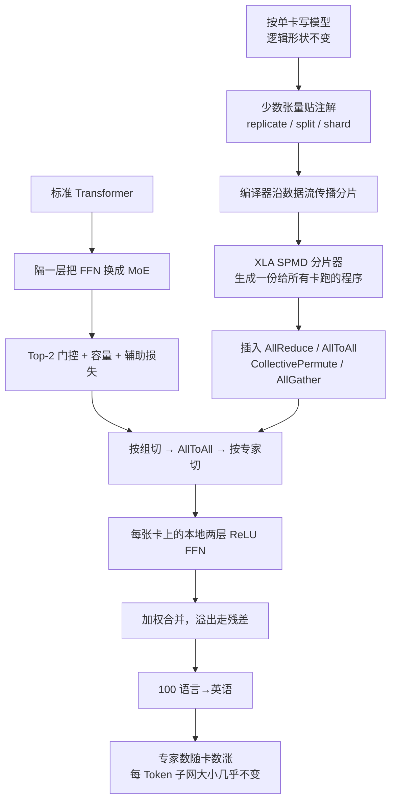

# GShard：不手写并行，用注解和稀疏专家把翻译模型做到 6000 亿

<!-- release-date: 2020-06-30 -->

> 本文依据 Google 的 **GShard: Scaling Giant Models with Conditional Computation and Automatic Sharding**，即 arXiv:2006.16668 **v1**（2020-06-30），共 35 页。封面水印为 `arXiv:2006.16668v1 [cs.CL] 30 Jun 2020`。截至核验 [arXiv 提交历史](https://arxiv.org/abs/2006.16668) 只有 v1，本地件就是这份。页码均指这份 PDF。全文把三件事分开标注：**报告明确写了什么**、**我们如何解释或验算它**、**哪些是外部资料补充**。
>
> 作者是 Dmitry Lepikhin、HyoukJoong Lee、Yuanzhong Xu、Dehao Chen、Orhan Firat、Yanping Huang、Maxim Krikun、Noam Shazeer、Zhifeng Chen。封面只印 `@google.com` 邮箱，不另写单位行。目录按主要归属放在 Google。
>
> `release-date` 取 **2020-06-30**。GShard 是编译器注解加稀疏专家的技术论文，没有对外可用的产品模型。按「技术首次官方公开日」取 arXiv v1。
>
> 这份 35 页 PDF **含附录 A.1–A.4** 。附录写了扁平束搜索解码、翻译超参、通用 `shard()` API，以及卷积 / 窗口算子的 halo 交换。下文必须覆盖，不把附录当可选项。

本站已有同实验室前作 [GPipe](/reports/Google/GPipe)：那是按层切开的流水线库。GShard 走的是另一条路——自动分片加 MoE。不要把 GPipe 的 ImageNet 84.4%、557M AmoebaNet 写进这篇的成绩单。后作 [Switch Transformers](/reports/Google/Switch-Transformers) 把 top-2 收成 top-1，再把稀疏语言模型推到万亿；本文只负责 2020 年 6 月这份 PDF 当时证明了什么，不搬 Switch 的万亿 dense-FLOPs 对照表。

## 读前先把几个词说成人话

这篇论文难读的地方，不是公式多，而是它同时讲两套东西：一套是「模型怎么稀疏」，一套是「编译器怎么切」。后面所有表，都踩在这两套词上。

先把会反复出现的词说清楚：

- **Token（词元）**：模型读写文本时的最小单位。
- **Dense（稠密模型）**：每一层的全部参数，对每一个 Token 都要算一遍。参数翻倍，单次计算量大致也翻倍。
- **MoE（Mixture-of-Experts，混合专家）**：把某一层的前馈网络拆成很多个小网络（专家）。每个 Token 只让其中少数几个干活。总参数可以很大，单次浮点运算却不必跟着涨。
- **条件计算（conditional computation）**：按输入决定「算哪一部分」，而不是每次把整张网跑完。MoE 是它在这篇里的实现。
- **专家容量（expert capacity）**：一个 batch 里每个专家最多接多少 Token。接满了，多出来的 Token 从残差连接「漏」过去，这一层等于没走专家。
- **分片注解（sharding annotation）**：在张量上贴一张标签，告诉编译器「这一维切开」或「整份复制」。注解不改逻辑形状，用户仍按完整张量写代码。
- **SPMD（Single Program Multiple Data，单程序多数据）**：所有设备跑同一份程序，各自拿不同的数据片。和它对照的是 **MPMD（Multiple Program Multiple Data）**：每张卡一份专用图，设备一多，图就线性膨胀。
- **XLA**：Google 的加速器编译器。TensorFlow、JAX、PyTorch 等前端都会把图降到 XLA HLO，这篇的分片器就做在这一层。
- **AllToAll**：每张卡把自己的数据切成多份，各送一份给别人，再把收到的拼回来。MoE 里「按组切」改成「按专家切」，靠的就是它。

论文自己反复出现的几个专有设定：

- **GShard**：一套轻量注解 API，加上 XLA 编译器里的 SPMD 分片扩展。它不是一种新网络（PDF p. 1、p. 3）。
- **MoE Transformer**：隔一层把 Transformer 的前馈换成位置级混合专家，编码器和解码器都这样改（PDF p. 4、图 3）。
- **Top-2 门控**：每个 Token 最多进两个专家。第二名还要过一道随机门，权重太小就省掉（PDF p. 5–7，算法 1）。
- **M4（Massively Multilingual, Massive Machine Translation）**：用这份系统去做 100 种语言到英语的翻译（PDF p. 14）。
- **`replicate` / `split` / `shard`**：三种注解。复制、沿一维切开、按设备分配表做更细的多维切开（PDF p. 8、p. 31–32）。

如果你只想记一句话：

> **先把模型写成「好像有一张无穷大的卡」，只在少数张量上贴切开或复制的标签；编译器生成一份给所有卡跑的程序。真正让参数能涨、计算不必等比例涨的，是隔层 top-2 专家。**

## 一句话先说清

2020 年已经看得很清楚：模型更大，质量会涨。卡住的不是「要不要做大」，是三件事同时发生（PDF p. 1–2）：

1. 算力账单跟着深度和宽度至少线性涨，再叠通信，实际常常超线性；
2. 换一种并行，就要把模型代码迁到专用框架，编程难度绑死架构；
3. 图表示本身会随设备数膨胀，编译时间先撑不住。

GShard 要做的事更窄，也更硬：

> **不要再手写一种并行。用轻量注解加编译器扩展，让现有模型代码几乎不用改就能表达多种切法；再用稀疏门控混合专家做条件计算，把多语翻译 Transformer 扩到 6000 亿以上参数。**

摘要里的成绩单是（PDF p. 1）：

- 用自动分片，把带稀疏门控混合专家的多语翻译 Transformer 扩到超过 6000 亿参数；
- 2048 块 TPU v3，4 天训完；
- 100 种语言到英语，质量明显超过当时的 prior art。

图 1 把账单写得更具体（PDF p. 2）：参数从 37.5B 涨到 600B 是 **16倍** ，端到端训练成本从 6 个 TPU v3 core-year 涨到 22 个，是 **3.6倍** 。600B 那一档用 2048 核训 4 天，总成本 22 个 TPU v3 core-year；把 100 个双语基线全训一遍要 29 个。当时最好的单 dense Transformer（2.3B，∆BLEU 6.1）用 [GPipe](/reports/Google/GPipe) 在同样 2048 核上训了 6 周，合计 235.5 个 TPU v3 core-year。

对训练系统来说，口号不如边界要紧。你买到的是「参数可以单独涨、编译时间不随卡数爆炸」，以及一张 100 语言到英语的 BLEU 表。你没有买到一份开源的完整编译器，也没有买到非翻译下游任务。这两件事这篇 PDF 都没写，后文会单独钉死。

### 一条阅读路线

如果只有半小时读原文，建议按这个顺序：

1. **p. 2 图 1**：16 倍参数、3.6 倍成本、4 天 / 22 core-year 对上 29 和 235.5。
2. **p. 4 图 2、p. 5 图 3**：SPMD 为什么编译时间是常数；隔层 MoE 怎么插进 Transformer。
3. **p. 6–7 算法 1**：容量、分组、辅助损失、第二专家的随机路由。
4. **p. 8–9**：`split` / `replicate` 那几行绿底注解。用户改的就是这几行。
5. **p. 16 图 6**：100 语言的 ∆BLEU 趋势，高资源吃容量、低资源吃共享。
6. **p. 17 表 1、p. 19 表 2–3**：规格、样本效率、墙钟。
7. **p. 20–23 图 7–9、表 4**：每卡显存几乎不随专家数涨；步时 16 倍模型只涨 1.7 倍。
8. **p. 31–35 附录**：扁平束搜索、超参、`shard()`、卷积 halo。知道编译器在窗口算子上付了什么代价即可。

## 报告地图：35 页里各写了什么

先摊开篇幅。这是一篇系统加架构论文。新网络公式不多，密度最高的是第 2 节的门控、第 3 节的编译器，和第 4 节的翻译表。

| 报告章节 | PDF 页 | 讲了什么 | 密度 |
|---|---|---|---|
| 标题、摘要 | p. 1 | 注解 API + XLA 扩展；600B+；2048 TPU v3 / 4 天；100 语言→英语 | 高 |
| §1 + 图 1 | p. 1–3 | 三道卡：架构绑定、超线性成本、图膨胀；16× / 3.6× | 高 |
| §1.2 + 图 2 | p. 3–4 | 次线性缩放、抽象层、SPMD 对 MPMD | 高 |
| §2 + 图 3 + 式 (1)–(3) | p. 4–5 | 隔层 MoE、top-2、专家是两层 ReLU 前馈 | 高 |
| §2.2 后半 + 算法 1 | p. 5–7 | 容量、分组、辅助损失、随机第二专家 | 高 |
| 算法 2 + 复杂度 | p. 7–8 | einsum 写出整层；每卡 FLOP 近似 $O(1)$ | 高 |
| §3.2 | p. 8–10 | `replicate` / `split` / `shard`；传播启发式；手写与自动混用 | 高 |
| §3.3 + 图 4–5 | p. 10–14 | 通信原语、Einsum 三种切法、不齐分片、halo | 高 |
| §4.1–4.3 | p. 14–16 | M4、网页语料、T(96L) 对照 | 高 |
| 图 6 + 表 1 | p. 16–17 | ∆BLEU 趋势与规格表 | 高 |
| §4.4–4.5 + 表 2–3 | p. 17–19 | 深度、容量瓶颈、样本效率、墙钟 | 高 |
| §5 + 图 7–9 + 表 4 | p. 20–23 | 显存、步时、AllReduce / AllToAll | 高 |
| §6–7 | p. 23–25 | 相关工作、结论 | 中 |
| 参考文献 | p. 26–31 | 含 GPipe、Shazeer 2017 MoE、Mesh-TF、ZeRO、Megatron-LM | 低 |
| 附录 A.1–A.2 | p. 31 | 扁平束搜索；Adafactor / SentencePiece | 中 |
| 附录 A.3–A.4 | p. 31–35 | `shard()`、设备拓扑、卷积 halo 与 dilation | 高 |

## 主要矛盾：质量要涨，算力、编程、编译三件事一起卡

论文没有从「我们做了一个 6000 亿 MoE」开场。它先指出一条已经走通、但越来越贵的路（PDF p. 1–2）：

- 视觉和语言上都看到：模型容量涨，质量跟着涨；
- 最终质量对数据、算力、模型大小呈幂律；
- 训练效率——用多少算力、多少墙钟打过当时最好系统——经常被漏掉。

然后它枚举四道具体的卡（PDF p. 2–3）：

1. **架构绑定的模型并行**。TensorFlow / PyTorch 当时有朴素的图划分，但顺序依赖会让卡空转。要做大，用户往往得把代码迁到 Mesh-TensorFlow 或 GPipe 这类专用框架。
2. **计算成本相对模型大小超线性**。加宽加深至少让步时线性涨；再按层或按算子切开，通信和负载不齐会把账继续抬高。加卡本身解决不了。
3. **巨型模型的图表示**。层间划分或算子内划分到 $D$ 张卡，图节点可以是 $O(D)$；`Gather` / `Transpose` 一类通信甚至到 $O(D^2)$。构图和编译时间先炸。
4. **手写划分策略**。图级划分要处理流水线依赖，算子级划分要处理「部分结果怎么加回来、数据片怎么重排」。换一层，通信就得跟着改，涟漪效应。

矛盾因此变成：

> 研究者想把模型做大，但不想每换一个网络就重写并行，更不想因为卡数变多，编译时间先变成新的墙。同时，如果只靠加宽加深，计算账单会把「做大」这条路封死。

GShard 的回答拆成三句（PDF p. 3）：

1. **次线性缩放**：用条件计算，让每个输入只激活一个子网络；
2. **抽象的力量**：模型描述和划分实现分开，用户只标少数张量；
3. **可扩展的编译器**：用 SPMD 生成一份程序，编译时间不随卡数涨。

## 先看全景：它不是一座新注意力，是一条「注解 → 编译 → 稀疏前馈」的链



这张图按 PDF p. 3–9、p. 14–16 的叙事重画，是机制示意，不是论文原图，也不表示实测耗时。主路径不是新注意力，而是「注解让编译器切图 → 隔层专家让参数单独涨」。

有三个旋钮贯穿全文，必须先分清：

| 旋钮 | 改它会怎样 | 论文认为它改的是什么 |
|---|---|---|
| 专家数 $E$（常与卡数 $D$ 绑在一起） | 总参数涨，每 Token 激活的子网几乎不涨 | 容量。高资源语言最吃这个 |
| 深度 $L$（12 / 36 / 60） | 共享子网变长，样本效率变好 | 迁移。低资源语言最吃这个 |
| 分片注解 | 同一份模型代码可以换切法 | 放置。不该改数学对象 |

后文所有「次线性」，说的都是：参数涨得比每步浮点运算快。通信不是零，它按 $\sqrt{D}$ 涨（PDF p. 8、p. 22）。

## 核心设计一：隔一层换成 top-2 专家

### 旧问题：加宽加深会把步时至少线性抬上去

当时把 Transformer 做大，通行做法是加层、加宽、或者搜结构（PDF p. 15）。同实验室的 GPipe 已经用流水线把一个 128 层、60 亿参数的多语 Transformer 训起来，高资源和低资源都有收益。GShard 承认这条路满足「通用翻译」的愿望，但把它归进第 1 节的训练效率问题：稠密放大，计算账单跟参数走。

条件计算的旧答案是 Shazeer 等人 2017 年的位置级稀疏门控 MoE，当时接在 RNN 翻译和语言模型上（PDF p. 3、p. 4）。这篇要做的，是把它接到 Transformer 的前馈上，并且让门控在数百万 Token、数千专家时还能并行。

### 新设计：每隔一层前馈，换成一排专家

图 3 把改法画成人能跟上的样子（PDF p. 5）。左边仍是标准编码器：自注意力 → 残差归一化 → 前馈 → 残差归一化，重复 $N$ 次。中间把每隔一层的前馈换成 MoE：一排 $\mathrm{FFN}_1 \ldots \mathrm{FFN}_E$，前面加一个门控。右边是上卡之后的样子—— **MoE 层按专家切开，其余层整份复制** 。解码器的改法类似，只是多一层交叉注意力。

「每隔一层」不是装饰。后文实验里，12 层对应原来的 6 个编码器层加 6 个解码器层；36 层和 60 层按同样节奏插专家（PDF p. 17）。注意力始终是稠密的。真正被稀疏化的，只有一半前馈。

每个专家仍是标准的两层前馈，激活是 ReLU（PDF p. 4，式 (2)）：

$$
\mathrm{FFN}_e(x_s) = w_{o,e} \cdot \operatorname{ReLU}(w_{i,e} \cdot x_s)
$$

门控给出每个专家一个非负权重 $G_{s,e}$，大多数是 0。层输出是被选中专家的加权和（PDF p. 4，式 (1)(3)）：

$$
G_{s,E} = \mathrm{GATE}(x_s), \qquad
y_s = \sum_{e=1}^{E} G_{s,e} \cdot \mathrm{FFN}_e(x_s)
$$

论文选择每个 Token **最多进两个专家** （PDF p. 5）。这就是后文 Switch 要收成 top-1 的那根轴。这篇自己没拿 top-1 做对照，不要把 2021 年的那张表读回来。

### 工作机制：容量、分组、辅助损失、随机第二专家

朴素 top-$k$ 会塌。多数 Token 挤进少数专家，忙的专家缓冲区爆掉，闲的专家根本训不到（PDF p. 5）。顺序扫描可以做均衡，但 $N$ 是百万量级、$E$ 是千量级，门控本身就会变成 $O(NE)$ 的串行热点。

算法 1 用四件事把这道门做成可并行的（PDF p. 6–7）：

**1. 专家容量。** 一个训练 batch 有 $N$ 个 Token，每个最多进两个专家，于是每个专家的容量设成 $O(N/E)$。门控给每个专家一个计数器 $c_e$。两个首选专家都满了，这个 Token 的 $G_{s,E}$ 退化成全零，表示 $x_s$ 沿残差原样传到下一层（PDF p. 6）。

**2. 局部组派发。** 整个 batch 均分成 $G$ 组，每组 $S = N/G$ 个 Token，组与组独立并行。每组分到的每专家容量是 $2N/(G\cdot E)$。这样容量约束仍在，负载在组之间也被切开。

**3. 辅助损失。** 跟着 Shazeer 2017，总损失是

$$
L = \ell_{\mathrm{nll}} + k \cdot \ell_{\mathrm{aux}}
$$

$c_e / S$ 是分到专家 $e$ 的 Token 比例，作者想压它的均方。但 $c_e$ 来自 top-2，不可微，于是用每专家平均门控 $m_e$ 代替其中一个因子（PDF p. 6，算法 1 第 13 行）：

$$
\ell_{\mathrm{aux}} = \frac{1}{E} \sum_{e=1}^{E} \frac{c_e}{S} \cdot m_e
$$

常数 $k$ 的具体数值，这篇 PDF **没有写** 。

**4. 随机第二专家。** 输出是加权平均。如果第二名的门控 $g_2$ 已经很小，再占一个容量槽不划算。于是在容量允许的前提下，以正比于 $g_2$ 的概率派发第二专家：抽 $\mathrm{uniform}(0,1)$，当 $2\cdot g_2$ 大于这个随机数才写入（PDF p. 6–7，算法 1 第 17–20 行）。第一名只要还有容量，就会写入；计数器在写入与否之后都会加一。

第一名和第二名的门控还会先做一次归一化：$g_1 \leftarrow g_1/(g_1+g_2)$，第二名同理。所以真正乘到专家输出上的，是这两个相对权重，不是原始 softmax 里的两个分量。

### 收益：子网大小几乎不随专家数涨

每个训练样本是一对子词序列。训练和推理时，每个 Token 只激活 MoE Transformer 的一个子网络，子网大小大致不随每层专家数变化（PDF p. 4）。这就是第 1.2 节说的次线性计算。

算法 2 把整层写成几条 einsum，下划线标出要切开的维（PDF p. 8）。假设每卡 Token 数 $N/D = O(1)$、组数 $G = O(D)$、专家数 $E = O(D)$、每组每专家容量 $C = O(1/D)$，则整层浮点运算是

$$
O(D^2)_{\mathrm{softmax}} + O(D)_{\mathrm{gating}} + O(D)_{\mathrm{dispatch}} + O(D)_{\mathrm{FFN}}
$$

每卡 softmax 是 $O(D)$，但实践中 $D \ll H$ 且 $D < S$，会被别的项盖住，于是每卡 FLOP 可以看成 $O(1)$（PDF p. 8）。通信不是常数，按 $O(\sqrt{D})$ 涨，第 5 节用 AllToAll 微基准验证。

$C$ 至少是 1，所以「$E$ 跟着 $D$ 涨、$C$ 跟着 $1/D$ 降」这条公式不能无限用下去。论文认为它够撑到数千专家（PDF p. 8 脚注 2、p. 21）。

### 代价和边界

- 训练用 **float32** 存权重和激活，为的是稳定。1 万亿档 `MoE(2048E, 60L)` 试过 bfloat16 激活，靠人工诊断能训，但数值不稳， **结果没有放进论文** （PDF p. 16）。
- 专家数在实验里绑死到卡数，只是为了简单，不是硬约束（PDF p. 16）。
- 溢出 Token 走残差。全文没有给出溢出率。
- 门控里的 `Cumsum`、`ArgMax` 是内存受限甚至串行的，2048 专家时仍不到 MoE+Transformer 层时间的 10%，但已经可见（PDF p. 21–22）。

### 对自己的项目有什么用

若你在稠密前馈和 MoE 之间犹豫，这篇给的不是「专家越多越好」，而是两根分开的轴：专家数主要给高资源任务加容量，深度主要给低资源任务加共享。路由上，top-2 不是装饰——第二名带随机门，是在用容量换一点探索。容量满了就走残差，等于承认负载均衡做不到完美。这些机制后来被 Switch 收成 top-1，那是后话；2020 年这份 PDF 的主模型就是 top-2。

## 核心设计二：三种注解，逻辑形状不动

### 旧问题：换切法就要改模型代码

第 3 节把实现拆成三步：先把模型写成线性代数，再给张量贴划分标签，最后让编译器产出并行程序（PDF p. 6）。注意力可以沿 batch 切开、权重复制；MoE 专家太大，只能按专家切开。整网在这两种模式之间来回切。如果把通信写进模型，换一层就要改一处。

### 新设计：`replicate`、`split`、`shard`

GShard 在 TensorFlow / Lingvo 里暴露的 API 是这三件（PDF p. 8）：

- **`replicate(tensor)`**：整份复制到每个分区。非 MoE 层的权重常用它。
- **`split(tensor, split_dimension, num_partitions)`**：沿一个维切开，第 $i$ 片放在第 $i$ 张卡上。分区数不能超过设备数。
- **`shard(tensor, device_assignment)`**：`split` 的一般化，可切多个维，并指定每一片放哪张卡。细节在附录 A.3。

调用这些函数 **只加注解，不改用户程序里的逻辑形状** 。不齐分片、填充，都不是用户的事（PDF p. 9）。

切哪一维是开放的：batch（数据并行）、特征、专家、甚至图像的空间维，都可以用同一套 API。因为注解是按张量走的，模型不同部分可以有不同切法。这正是 MoE 层和稠密层能交替的原因，也是附录里大图空间划分能复用同一套机制的原因（PDF p. 9）。

算法 2 对应的用户改动，论文用绿底标出，几乎就是三行（PDF p. 9）：

```text
inputs = split(inputs, 0, D)          # 沿组维 G 切开
wg = replicate(wg)                    # 门控权重复制
...
dispatched_expert_inputs = split(..., 0, D)  # 派发后再沿专家维 E 切开
```

输入按组切开、门控权重复制；派发 einsum 之后，再把分片从 $G$ 维改到 $E$ 维。$D$ 是设备数。用户仍然在完整形状上写 einsum。

### 工作机制：传播、混用、反向也能推断

用户不必给每个张量贴标签。通常只需标少数关键算子（这篇里主要是 Einsum），其余由编译器的启发式推断。反向图往往是前端自动生成的，用户根本拿不到那些张量，所以缺失分片必须能被推断出来（PDF p. 9 及脚注 3）。

传播是一次迭代数据流分析：从用户标过的算子出发，向操作数和使用者对齐，尽量减少重新分片。整数规划或机器学习也可以做这件事，论文明确说 **自动分片赋值不是本文重点，留作未来工作** （PDF p. 9）。

编译器推断不够时，允许手写划分和自动划分混用。典型场景是 `Gather`：XLA / TensorFlow 的算子定义不带「下标只在本分区内打乱」这种运行时知识，编译器只能保守地加通信。用户若知道这一点，可以把张量从自动模式切到手写模式，本地 `Gather` 完再切回去（PDF p. 9–10）。派发那条 one-hot einsum，也可以改成这种手写 `Gather`。接口名字是 `auto_to_manual_spmd_partition` 和 `manual_to_auto_spmd_partition`。

附录 A.3 把 `shard()` 写具体（PDF p. 31–32）。`device_assignment` 是和数据张量同秩的整数数组，元素个数等于分区数，每个元素是占用对应切片的设备 ID。例如形状 `[3, 16, 64]` 的三维张量，分配表形状 `[1, 2, 4]`，则每片形状是 `[3, 8, 16]`。图 10 用 2×4 切一张二维张量：左边按 mesh 拓扑把同一行放在相邻设备上，右边按树拓扑把同一行放在同一子树里。通信发生在行方向时，这两种赋值的跳数不一样。

### 收益和代价

收益是第 1.2 节说的「抽象的力量」：开发者按单卡写，编译器按注解和自己的启发式做语义保持的变换（PDF p. 3）。换切法不必重写模型。

代价写在同一页：启发式对齐相邻算子，不保证全局最优；用户仍要在「关键张量」上做出正确选择。派发之后那次从 $G$ 到 $E$ 的 `split`，就是一次必须由人标出的重新分片。

### 对自己的项目有什么用

若你的框架已经能把图降到一套较小的算子，值得学的不是这三个函数名，而是「注解不改逻辑形状」。用户始终和完整张量打交道，不齐、halo、填充都沉到编译器。若你做不到这一点，所谓自动分片很容易退化成「把切分算术写回模型」。混用入口也很关键：语义比 IR 更强的地方，允许人插手，总比让编译器保守加一圈 AllToAll 便宜。

## 核心设计三：XLA 里的 SPMD 分片器

### 旧问题：MPMD 会让图随卡数膨胀

图 2 用一次点积沿收缩维切开、四张卡、AllReduce 求和当例子（PDF p. 4）。左边 MPMD：每张卡一份 `slice → dot → all-reduce`，图节点随设备线性涨。右边 SPMD：一份程序，用 `dynamic-slice` 按分区号取自己那一片，再做本地 `dot` 和 AllReduce。编译时间不依赖设备数。

这不是风格偏好。第 1 节已经把 $O(D)$ / $O(D^2)$ 的图当成基础设施墙（PDF p. 2）。脚注 4 直接说：MPMD 按图 2 那种方式无法扩展（PDF p. 10）。

### 新设计：在 HLO 上按算子降成「每卡一份」

分片器做在 XLA 里（PDF p. 10）。多个前端（TensorFlow、JAX、PyTorch、Julia）已经能把图降到 XLA HLO；HLO 算子集比 TensorFlow 小得多，实现分片器的负担也小。论文认为同样的技术可以搬到 ONNX、TVM Relay、Glow IR，但本文只实现了 XLA 这一条。

SPMD 强迫所有设备跑同一份程序，通信模式因此是规则的。分片器用的集合通信是 MPI 风格的四件套（PDF p. 11）：

| 原语 | 做什么 | 在这篇里的用途 |
|---|---|---|
| **CollectivePermute** | 按源–目的对点对点送 | 改分片的设备顺序；halo 交换 |
| **AllGather** | 按指定顺序拼接各卡张量 | 分片张量变成复制张量 |
| **AllReduce** | 逐元素规约（如求和） | 收缩维切开后的部分和 |
| **AllToAll** | 各卡沿一维切开，交叉发送再拼接 | 从一个分片维改到另一个分片维 |

TPU 网络上 AllReduce 随分区数增长成本近似常数；AllToAll 次线性。第 5.2 节给数字。

### 工作机制：Einsum 的三种通信

分片器的核心是按算子、按输入输出上的分片标签，把「完整大小」降成「一片大小」（PDF p. 11）。逐元素算子几乎无事可做。真正要通信的，这篇用 Einsum（XLA 里的 Dot）讲清楚，因为 MoE 层几乎全是它。

Einsum 的三个维（PDF p. 11）：

- **Batch 维**：左右操作数和输出都有，天然可并行；
- **收缩维**：只在操作数里，输出里被求和掉；
- **非收缩维**：只在某一个操作数和输出里，也是并行维。

传播优先让左右操作数和输出在 batch 维上对齐，因为那样可以零通信。对齐不上时，有三种模式，对应图 4（PDF p. 12）：

1. **重新分片。** MoE 派发（算法 2 第 3 行）要在 Einsum 之后换切开的维。先沿 $G$ 做本地 batch 并行 Einsum，再用 AllToAll 把结果改到 $E$ 维。图 4a。
2. **累积部分结果。** 沿收缩维切开时，本地结果是部分和，用 AllReduce 加回来。图 4b。
3. **循环里切片。** 两个操作数都沿各自的非收缩维切开时，不能直接本地乘。复制其中一个可以，但那份操作数必须塞进单卡内存。塞不下，就两边都保持切开，用循环每次算结果的一片，用 CollectivePermute 把输入片转一圈。类似 Cannon 算法。全程没有完整大小的张量。图 4c。

### 更脏的部分：不齐、静态配置、halo

SPMD 的麻烦是：一份程序要覆盖所有分区，又不能按运行时设备号写一堆分支——分支会让程序体积爆炸（PDF p. 12–13）。XLA 还要求形状静态。于是不齐和窗口算子都得靠填充、切片、掩码来「假装每卡形状一样」。

**不齐分片。** 维长除不尽分区数时，形状向上取整，填充区的值可以是任意的。需要正确性时，再填入已知单位元。例子：Reduce-Add 沿长度 15 的维切成 2 份，第二份多一列，用 `Iota + PartitionId` 和全形状上界比较，把多出来的那列掩成 0（PDF p. 13）。

**静态算子配置。** Convolution 的 padding / stride / dilation 是静态的，但最左分区和最右分区该垫的边不一样。分片器宁可让某些分区多算一点，再把无关部分切掉。附录 A.4 展开。

**Halo 交换。** 窗口算子（Convolution、ReduceWindow）的相邻分区需要重叠输入，用 CollectivePermute 换 halo。图 5a。`Slice` / `Pad` 会改形状、因而改分片边界，也当成一种 halo（图 5b）。`Reverse`、`Reshape` 在逻辑上不一定改大小，但不齐加静态形状仍可能要换数据：`[3, 2] → [6]`、输入按第一维不齐切成 `[2, 2]`、输出切成 `[3]`，输入的填充到输出里消失了，必须像 Slice 那样补一次 halo（图 5c，PDF p. 13–14）。

这些数据整理算子很多。论文靠 TPU 上的融合，以及 slice / pad 的代码外提，把运行时开销压到通常可忽略，卷积网上掩码和填充很重时也如此（PDF p. 14）。

### 收益、代价、失败模式

收益是编译时间近乎常数，才能上到数千分区（PDF p. 10）。第 5 节用 16 到 2048 分区的微基准说明：AllReduce 近似 $O(1)$，AllToAll 近似 $O(\sqrt{D})$，2048 对 16 时 $D$ 涨 128 倍，AllToAll 只涨约 9 倍（PDF p. 22–23）。

失败模式论文写了这些：

- 自动分片赋值只是启发式，改进不是本文重点（PDF p. 9）；
- $C \ge 1$，专家数不能按当前公式无限跟卡数涨（PDF p. 21）；
- 操作数分片对不上的 Matmul，每卡计算和通信都是 $O(D)$——不是分片算法低效，是完整算子本来就是 $O(D^2)$（PDF p. 23，表 4 后两行 Matmul）；
- 窗口 dilation 若右操作数也切开（常见于步进卷积的梯度），实现比 base dilation 简单，但 **细节跳过了** （PDF p. 35）；
- 1 万亿档的数值不稳，结果不报告（PDF p. 16）。

### 对自己的项目有什么用

若你在编译器里做切分，这篇最值得搬的是：先固定一小撮集合通信，再让每个算子的降级都落到这几个原语上。Einsum 三种模式几乎覆盖后来所说的数据并行、张量并行和专家并行的通信形状。halo 则提醒：空间维一切开，静态形状会立刻变成「每卡 halo 大小不同」。用最大 halo 交换、再按分区号 DynamicSlice、再掩掉非法区，是这份附录反复使用的套路。

## 实验：100 种语言到英语，质量涨、成本次线性

### 任务为什么选翻译

第 4 节把验证场景定成大规模多语机器翻译，简称 M4（PDF p. 14）。多语翻译本身是多任务：一个网络同时做很多语言对。成功有两根尺——高资源语言不能被挤掉，低资源语言要吃到正迁移。语言一多，正迁移帮低资源，容量瓶颈伤高资源。把模型做大，就是在「多语带来的共享」和「大规模带来的容量」之间找平衡。

手写「哪些层共享、哪些层按语言分开」，搜索空间随语言数爆炸。条件计算被当成可学习的布线：每个 Token 自己决定走哪些专家，事先不必知道语言亲缘（PDF p. 14）。

一句被二手材料经常引用的话在这里： **600B 的 GShard 模型可以在 25 万步、不到 4 天内处理 1 万亿 Token** （源侧，子词切分后，PDF p. 14 及脚注 7）。论文还提到可以把翻译模型扩到超过 1 万亿参数，同时保持训练时间实际可做；主结果表里的 1T 那一行没有质量数字。

### 数据和基线

训练语料是网页挖掘的内部平行文档，100 种语言与英语双向，合计 250 亿条。覆盖广、噪声大、领域杂，语言之间呈很陡的幂律：高资源十亿级，低资源数万级（PDF p. 15）。细节指向前作 GPipe 和 Arivazhagan 等人 2019 的多语翻译论文。

评测只做 **100 种语言→英语** ，大约 130 亿条用于训练。相对此前同一数据集的工作，哈萨克语和拉丁语到英语被排除在评测之外（PDF p. 15 及脚注 8）。

双语基线是每种语言一对一的独立模型，按数据量在 Transformer-Big 或 Transformer-Base 上调 batch 和 dropout。图 6 不画绝对 BLEU，而把基线放在 $y=0$，画多语模型相对它们的 ∆BLEU。横轴从左到右按训练数据从多到少排（PDF p. 15–16）。

另一条对照是稠密 96 层编码器–解码器 `T(96L)`，用 GPipe 流水线在同一数据上训。2048 块 TPU v3，收敛超过 6 周，处理 1 万亿以上 Token（约 30 万步、每步约 400 万 Token），预算 235.5 个 TPU v3 core-year。论文称它超过原来 GPipe 的 `T(128L)`（64+64 层、隐层 16384、32 头），是最强的单 dense 基线（PDF p. 15 及脚注 10–11）。

**不要和本站 GPipe 文里的 6B / 84.4% 混用。** 那篇的图像数字和这条 `T(96L)` 不是同一张表。GShard 只用 `T(96L)` 的 2.3B、∆BLEU 6.1、6 周、235.5 core-year。

### 模型家族

表 1 把深度和每层专家数当成两个旋钮（PDF p. 17）：

| Id | 模型 | 每层专家 | 专家总数 | TPU v3 核 | 编+解层 | 参数 |
|---|---|---:|---:|---:|---:|---:|
| (1) | MoE(2048E, 36L) | 2048 | 36684 | 2048 | 36 | 600B |
| (2) | MoE(2048E, 12L) | 2048 | 12228 | 2048 | 12 | 200B |
| (3) | MoE(512E, 36L) | 512 | 9216 | 512 | 36 | 150B |
| (4) | MoE(512E, 12L) | 512 | 3072 | 512 | 12 | 50B |
| (5) | MoE(128E, 36L) | 128 | 2304 | 128 | 36 | 37B |
| (6) | MoE(128E, 12L) | 128 | 768 | 128 | 12 | 12.5B |
| * | MoE(2048E, 60L) | 2048 | 61440 | 2048 | 60 | 1T |

深度试了 12 / 36 / 60；每层专家试了 128 / 512 / 2048。卡数绑死到每层专家数。每个 MoE 实验都训到看见 1 万亿 Token，用这个检查点评测。到这一点都没有过拟合迹象，训练损失若继续训还会降（PDF p. 17）。

附录 A.2 把共享超参写死（PDF p. 31）：模型维 1024，前馈和 MoE 隐层 8192，16 头，注意力 key / value 维 128，输入 / 残差 / 注意力 dropout 均为 0.1。优化器 Adafactor：分解二阶矩、$\beta_1=0$、$\beta_2=0.99$ 且带 $1-t^{-0.8}$ 日程、更新裁剪阈值 1.0、学习率 1.0、1 万步后平方根衰减。词表是 SentencePiece：源侧覆盖 102 种语言、大小 64000，目标侧英语 32000。

图 1 横轴写的是 37.5B / 150B / 600B，表 1 对应行是 37B / 150B / 600B。同一份 PDF 里 37B 和 37.5B 并存。本文规格表用表 1 的 37B，图 1 的 16× 仍按图注的 37.5B → 600B 来读。

**我们如何解释它。** 36 层、隔层专家，应有 18 个 MoE 层。$18\times 128=2304$、$18\times 512=9216$，和表一致；$18\times 2048=36864$，表上写 36684。12 层应有 6 个 MoE 层，$6\times 2048=12288$，表上写 12228。60 层 $30\times 2048=61440$，一致。2048 专家那两行差了几十到一百，本文按表抄，不自行改。

### 图 6：质量随规模涨，高资源和低资源吃的不是同一根轴

图 6 把每种模型画成一条相对双语基线的 ∆BLEU 趋势，并用窗口 10 做了平滑（PDF p. 16）。表就嵌在图里：

| Id | 模型 | BLEU 均 | ∆BLEU 均 | 参数 |
|---|---|---:|---:|---:|
| (1) | MoE(2048E, 36L) | 44.3 | 13.5 | 600B |
| (2) | MoE(2048E, 12L) | 41.3 | 10.5 | 200B |
| (3) | MoE(512E, 36L) | 43.7 | 12.9 | 150B |
| (4) | MoE(512E, 12L) | 40.0 | 9.2 | 50B |
| (5) | MoE(128E, 36L) | 39.0 | 8.2 | 37B |
| (6) | MoE(128E, 12L) | 36.7 | 5.9 | 12.5B |
| * | T(96L) | 36.9 | 6.1 | 2.3B |
| * | 双语基线 | 30.8 | — | 100×0.4B |

读图，不读平滑后的精确逐点（PDF p. 16 图 6）：

- 左侧高资源（每语言 10 亿以上例）：`T(96L)` 和 12.5B 浅层 MoE 都只比双语基线高约 2–3 BLEU；600B 大约在 8 附近。容量不够时，多语对高资源是负担。
- 右侧低资源（每语言约 1 万例）：所有曲线都往上走。`T(96L)` 能到约 11；600B 到约 15。共享帮低资源。
- 600B（蓝）几乎全程最高；150B 深层（绿）紧跟其后，均 ∆BLEU 12.9，和 600B 的 13.5 只差 0.6。

正文把趋势收成四句（PDF p. 17–18）：

1. **更深，两边都涨。** 专家数固定，12 层加到 36 层，高资源和低资源都有近似恒定的加性收益，平均 2–3 BLEU（对表 3 最后一列）。
2. **容量瓶颈松了，收益才明显。** 同为 12 层：128 → 512 专家，100 语言平均 BLEU **+3.3** ；再 512 → 2048，只有 **+1.3** 。作者推测，就这份参数化、语言数和数据量而言，瓶颈在 128 到 512 专家之间。瓶颈没松之前，加深度也帮得少。
3. **更多专家，高资源更赚。** 12 层和 36 层都能看到：加专家对高资源的增益更大，低资源出现收益递减。专家多了，共享子网的比例下降，迁移带宽变窄。
4. **深而稠密，更会向低资源迁移。** `T(96L)` 和浅层 `MoE(128E, 12L)` 在中高资源上差距几乎恒定，到低资源时稠密深模型把差距拉开。共享比例 100% 时，迁移带宽最大。论文写：同样的低资源迁移质量可以用 `MoE(36E, 128L)` 做到，它有 370 亿参数。

**我们如何解释它。** 表 1 里 370 亿那一行是 `MoE(128E, 36L)`，没有 `MoE(36E, 128L)`。结合「37 billion」和「深度有助于低资源」，这应是把 $E$ 和 $L$ 写反了。本文按 `MoE(128E, 36L)` 理解，并标明原文符号对调。

### 训练效率：更深更省样本，最大模型 4 天

表 2 看的是训到指定交叉熵（不含辅助损失）要看见多少十亿 Token（PDF p. 18–19）：

| Id | 模型 | 核数 | 到 0.7 | 到 0.6 | 到 0.5 |
|---|---|---:|---:|---:|---:|
| (1) | MoE(2048E, 36L) | 2048 | 82 | 175 | 542 |
| (2) | MoE(2048E, 12L) | 2048 | 176 | 484 | 1780 |
| (3) | MoE(512E, 36L) | 512 | 66 | 170 | 567 |
| (4) | MoE(512E, 12L) | 512 | 141 | 486 | — |
| (5) | MoE(128E, 36L) | 128 | 321 | 1074 | — |
| (6) | MoE(128E, 12L) | 128 | 995 | — | — |

三倍深度，大约用 2 到 3 倍少的 Token 打到同一训练损失。`MoE(128E, 12L)` 到 0.7 要 9950 亿 Token，`MoE(128E, 36L)` 只要 3210 亿，约 3 倍。512 和 2048 专家上同样的 12 对 36。同深比较：128 → 512 专家，到 0.7 所需 Token 显著下降；再往 2048 加，样本效率和 512 档接近。这和「瓶颈在 128–512」那句对得上。

表 3 看墙钟（PDF p. 19）：

| Id | 模型 | 核数 | 步/秒 | batch（Token） | TPU core-year | 天数 | BLEU 均 |
|---|---|---:|---:|---:|---:|---:|---:|
| (1) | MoE(2048E, 36L) | 2048 | 0.72 | 4M | 22.4 | 4.0 | 44.3 |
| (2) | MoE(2048E, 12L) | 2048 | 2.15 | 4M | 7.5 | 1.4 | 41.3 |
| (3) | MoE(512E, 36L) | 512 | 1.05 | 1M | 15.5 | 11.0 | 43.7 |
| (4) | MoE(512E, 12L) | 512 | 3.28 | 1M | 4.9 | 3.5 | 40.0 |
| (5) | MoE(128E, 36L) | 128 | 0.67 | 1M | 6.1 | 17.3 | 39.0 |
| (6) | MoE(128E, 12L) | 128 | 2.16 | 1M | 1.9 | 5.4 | 36.7 |
| * | T(96L) | 2048 | — | 4M | 235.5 | 42 | 36.9 |

600B 用 2048 核训 4 天，平均 BLEU 最高，总成本 22.4 个 TPU year。摘要、图 1 图注和结论写成 22；表 3 写成 22.4。脚注 14：core-year 就是核数乘以按年计的墙钟。`T(96L)` 用同样 2048 核，要十倍以上的 235.5，质量还落在多数 MoE 后面。

图 1 把 37.5B / 150B / 600B 三档画在一起（PDF p. 2，读图）：红线质量从约 8 升到约 13 再略升到约 13.5，蓝线墙钟从约 17 天降到约 11 天再到 4 天，黑点划线成本从 6 年升到 15 年再到 22 年。图注写明：37.5B → 600B 是 16 倍参数，6 → 22 年是 3.6 倍计算。100 个双语基线合计 29 个 TPU v3 core-year。

结论把效率对比收成一句：600B 的 22 个 TPU v3 core-year，对照 100 个双语基线的 29 个（PDF p. 25）。单模型比一百个双语模型便宜，质量还高一截。

## 性能：每卡显存几乎不随专家数涨，步时 16 倍模型只涨 1.7 倍

第 5 节把系统账从翻译质量里拆出来（PDF p. 20）。主结论两句：专家变多时，每卡显存大致常数；从 128 卡扩到 2048 卡（模型 16 倍），步时只涨 1.7 倍。

### 显存

SPMD 之后，三类占用的每卡大小在专家数增加时都是常数（PDF p. 20）：

- 复制的权重（稠密 Transformer 前馈等）；
- 切开的权重（MoE 前馈；门控投影是 $O(E)$，实践中足够小，选择复制，对峰值几乎无影响，脚注 15）；
- 激活（前向留下、反向还要用的层输出）。

图 7 是每卡 GB（PDF p. 20，读图）：

- `MoE(*, 12L)` 三档（128 / 512 / 2048 专家）总柱都在约 4 GB，权重约 2 GB、激活约 2 GB，专家数几乎看不见；
- `MoE(2048E, 24L)` 总柱约 9 GB；
- `MoE(2048E, 36L)` 约 12 GB，权重和激活大约对半；
- `MoE(2048E, 60L)` 总柱约 14 GB，但激活反而比 36L 矮——权重涨到约 9.5 GB，激活回到约 4.5 GB。

层数让权重和激活都线性涨。超出单卡时，编译器自动重计算部分激活。这就是 60L 激活比 36L 小的原因。重计算占周期的 28%（36L）和 34%（60L）；12L 和 24L 装得下，是 0%（PDF p. 20）。

### 步时分解

图 8 只画前向，反向结构类似（PDF p. 21）。每档两根柱：Roofline 和 Measured。Roofline 假设算力 / 内存带宽 / 互联都能跑到 100% 峰值，是乐观上界。128 专家时实测超过 Roofline 的 70%；扩到 2048 专家（16 倍），设备时间涨 1.7 倍，仍有 Roofline 的 48%。

读图 8 的颜色（PDF p. 21）：

- 浅蓝色 MoE 前馈和黄色 Transformer 前馈是大头，随专家数几乎不涨——每卡这两块被设计成常数；
- 青色「MoE dispatch and combine」是 AllToAll，128 专家约占 MoE+Transformer 时间的 16%，2048 专家约占 36%，绝对时间大约 3.75 倍；
- 橙色 Gate cumsum 随专家数线性可见，但 2048 时仍不到 10%；
- 绿色 Gate Einsum 从 128 到 2048 大约 2 倍。

稠密部分：前馈和投影是大矩阵乘，实验里超过 85% 峰值 FLOPS；注意力主要是 batch matmul，短序列时吃内存带宽，只到 30% 以上峰值 FLOPS（PDF p. 21）。

门控里，softmax 前的投影是 $O(D)$，但很小；派发 / 合并那两条 einsum 用 one-hot 实现 Gather，复杂度 $O(GC)=O(1)$。真正重的是把「每个 Token 选了哪些专家」的 one-hot，用串行 Cumsum 反成「每个专家收了哪些 Token」的 one-hot（PDF p. 21–22）。

### 通信微基准

图 9 从 16 画到 2048 分区，双对数，8 MB 和 32 MB 两种载荷（PDF p. 23）。AllReduce 大致水平，抖动来自拓扑是方是长、是环面还是 mesh。AllToAll 沿 $O(\sqrt{N})$ 参考线往上走。论文的推导是：每卡发送量固定时总数据 $d=O(D)$，平均跳数 $h=O(\sqrt{D})$，链路数 $l=O(D)$，带宽受限则

$$
t = \frac{dh}{l} = O(\sqrt{D})
$$

延迟受限也是 $O(h)=O(\sqrt{D})$。2048 对 16，$D$ 涨 128 倍，AllToAll 只涨约 9 倍。这是图 4a 那种「先本地 Einsum、再 AllToAll 改维」敢用的原因。

AllGather 在输入固定时输出是 $D$ 倍，通信 $O(D)$。CollectivePermute 是一对一，源和目的安排得近就是 $O(1)$（PDF p. 22）。

表 4 把常见算子的每卡计算和通信收成一张查询表（PDF p. 22）。加法、沿 batch 的 Matmul、沿空间维切开的卷积，每卡都是 $O(1)$ 计算；派发 Einsum 的通信是 $O(\sqrt{D})$ 的 AllToAll。两条操作数分片对不上的 Matmul 是例外：完整算子 $O(D^2)$，每卡 $O(D)$。复制一个操作数会变成 AllGather（那份必须装进单卡）；循环切片则变成 CollectivePermute。

## 附录必须覆盖的四件事

35 页里有 5 页附录。正文多处把实现细节指向这里，不读附录会漏掉解码、超参和编译器在卷积上真正做了什么。

### A.1 扁平束搜索（PDF p. 31）

解码用带长度归一化的束搜索，引用 Wu 等人 2016 的 GNMT。自回归，输出长度 $m$ 就要把解码器堆栈顺序跑 $m$ 次。每个解码器 MoE 层都有派发 / 合并，也就是跨设备通信。 **推理用的集群和卡数与训练相同。** 没有延迟表，没有更小的推理拓扑。

束假设被压成一条交错的扁平序列，解码器自注意力掩码改成「每个假设只看自己的位置」。每个自注意力层维护的 key / value 也做同样变换。这样每次束扩展不必重排已经算好的 key / value，只重排表示当前活跃假设的 0/1 掩码。代价是注意力变长 $k$ 倍。论文认为，增量解码常被内存带宽卡住；扁平化是用一次「算力内存比略高」的长序列点积，换掉「点积 + key/value 重排」两次低比值操作，访问的内存总量不变。引用的是 Shazeer 2019 的 *One write-head is all you need*。

### A.2 翻译实验细节（PDF p. 31）

正文第 4.3 节指向这里。共享结构、Adafactor、SentencePiece 三组超参已在上文「模型家族」里列出。这里只补一句边界：源侧词表覆盖 102 种语言，评测是 100 种语言到英语；多出来的语言覆盖和双向语料怎么进词表，附录没再拆。

### A.3 通用 `shard()`（PDF p. 31–32）

除 `replicate()` / `split()` 外，用户或编译器可以用 `device_assignment` 做更细的多维切开，目的是减少数据搬运。图 10 的 mesh 对树，是在说：同样 2×4 切一张二维张量，行方向要通信时，应该让同一行落在拓扑上相邻的设备。注解 API 通用，赋值仍要看设备拓扑。

### A.4 卷积和窗口算子（PDF p. 32–35）

GShard 能切卷积的空间维，声称足以支撑大图和 3D 体数据，引用 Cheng 等人 2019 的 Cloud TPU 空间划分博客。用户侧仍然只有两行注解（PDF p. 32）：

```text
inputs = split(inputs, 3, D)   # [N,C,H,W] 沿 W 切开
kernel = replicate(kernel)
conv = conv2d(inputs, kernel)
```

编译器会把空间维上的分片传到后续层和反向。剩下的篇幅全是 SPMD 在窗口算子上的脏活：Convolution、ReduceWindow 都要 halo，而 halo 大小每卡可以不同，CollectivePermute 却要静态形状。

图 11 用一个没有 dilation 的例子说明「非恒定 halo 很常见」（PDF p. 33）。4 路切一段卷积：基长 12、窗口 3、两端各垫 1、步长 2；每卡输入 3、输出 2。右 halo 是 $(1,2,3,4)$，即 $\mathrm{partition\_id}+1$。分区 1 要产出 2 个输出，需要从分区 0 拿 0 个元素、从分区 2 拿 2 个。

图 12 把通用 halo 收成四步（PDF p. 33）：

1. 按所有分区的最大左 / 右 halo 做一次交换（例子里左 1、右 3）；
2. 和本地基座拼接；
3. 按分区号 DynamicSlice 出真正需要的区域（分区 2：左 0、右 2）；
4. 把越界区掩成单位元（分区 3 有 4 个非法元素，掩成 0）。

窗口配置要处理 stride、低/高 padding、base dilation、window dilation。Base dilation 分三种（图 13，PDF p. 34–35）：

1. $\mathrm{stride}\times\mathrm{per\_shard\_window\_count}$ 能被 dilation 整除：所有分区在第一个数据元之前垫同样多，可以用同一份低 padding，halo 在未膨胀基座上做，右界化成 $a\cdot i+b$。
2. $\mathrm{stride}=1$ 但不能整除：各分区低 padding 不同，而窗口算子的 padding 是静态的。所有位置都是合法窗口起点，于是用最大低 padding 让每卡都算够，再在输出上 DynamicSlice。右界不能化成 $a\cdot i+b$。
3. stride 不是 1 也不能整除：合法窗口起点会被 stride 跳过，无论选哪个低 padding 都会有分区算错。办法是基座用最大低 padding，再把窗口本身加大，用 `Pad + DynamicSlice` 给每卡不同的窗口 padding，把非 padding 窗口元素对齐到该卡想要的起点。

Window dilation：右操作数若复制，只影响有效窗口大小；若右操作数也切开（步进卷积的梯度常见），比 base dilation 简单，因为右边没有低/高 padding。 **实现细节跳过** （PDF p. 35）。

附录到此结束。没有更多实验，也没有开源清单。

## 相关工作里，这篇把自己放在哪

第 6 节按几条线收（PDF p. 23–24）：

- 模型缩放：同家族加宽加深往往更好；跨家族也看到更大容量既拟合更好也泛化更好。Shazeer 2017 的 690 亿 RNN-MoE、Brown 等人 2020 的 1750 亿稠密模型被点名。
- 并行：数据并行是框架标配；模型并行需要流水线（GPipe、PipeDream）或算子级切开（Mesh-TensorFlow、FlexFlow）。GShard 把自己标成后者，用来把专家并行到很多设备。
- 自动并行：Mesh-TensorFlow 要用户在 Python 库里重写计算；GShard 在编译器里按轻量注解切，不要求重写模型。FlexFlow 搜最优切法，GShard 管的是「有了注解之后怎么变换」。Weight-update sharding 被看成 GShard 的一个特例。Zero 把权重、激活、优化器状态分开切，扩到 1700 亿；GShard 声称更一般——不区分这些张量，靠注解就能表达那些切法，并扩到超过 1 万亿、探索更多设计。
- 条件计算：路由可以按难度、按预算，或按可学习的稀疏专家。这篇扩展的是 Shazeer 2017 那条。

**本批同期、本站没有专文的两篇** ，只按原文引用处理：Megatron-LM 出现在样本效率那句「更深更省样本」的文献 [56]（PDF p. 18）；Zero 出现在相关工作 [83]（PDF p. 24）。它们的加速比、显存公式和后继系统，一律不读进本文。

## 限制、失败模式，以及论文没写的

### 论文写了的限制

- 1 万亿档 `MoE(2048E, 60L)` 用 bfloat16 激活能训，但不稳，结果不报告（PDF p. 16）。
- 自动分片赋值是启发式，改进留作未来（PDF p. 9）。
- 专家容量公式要求 $C\ge 1$，不能按当前设定无限加卡（PDF p. 21）。
- 门控里的 Cumsum / ArgMax 吃内存甚至串行，2048 专家时已占可见时间（PDF p. 21–22）。
- 分片对不上的大 Matmul，每卡是 $O(D)$，要用复制或 Cannon 式循环（PDF p. 23）。
- 窗口 dilation 的实现细节跳过（PDF p. 35）。
- 图 6 趋势线经过窗口 10 平滑；没有逐语言 BLEU 表。
- 辅助损失系数 $k$ 没有给数值。

### 论文根本没有写的东西

下面这些不要从今天的 MoE 基座倒推回去：

- **没有开源完整编译器或注解库。** 正文指向 XLA 文档和 Lingvo，没有仓库、没有发布清单。
- **没有非翻译下游。** 没有语言模型困惑度，没有 GLUE / SuperGLUE，没有视觉主结果。空间划分只作为 API 能力出现。
- **没有推理延迟、吞吐、解码 batch 下的容量因子。** 附录只说推理和训练用同一集群、同一卡数。
- **没有专家特化分析。** 没有「某专家是否偏向某语言」的图。路由被宣传为从数据里学，但学到了什么没展示。
- **没有溢出率、没有路由随训练变尖的曲线。**
- **没有 GPU 数字。** 全部是 TPU v3。
- **没有碳排、电费、美元成本。** 账单的单位是 TPU v3 core-year。
- **没有和 top-1 的对照。** 那是 Switch 的表，不要搬进来。

## 论文之后：注解这条路进了编译器，路由被后人收成 top-1

**以下全部是外部资料补充，不是这篇 PDF 的内容。**

2021 年同一批作者把分片器写成更完整的 GSPMD，并在 [Google Research 博客](https://research.google/blog/general-and-scalable-parallelization-for-neural-networks/) 里称它是基于 XLA 的开源自动并行系统，已接到 TensorFlow 和 JAX。博客把 GShard-M4、LaMDA、BigSSL、ViT 列为应用。那张效率表里的 GShard-M4 是 577B、32 层、1024 块 TPUv3、46.8% FLOPS 利用率—— **配置和 2020 年这份 600B / 36 层 / 2048 核不是同一行** ，不要回写进本文表 1。

后作 [Switch Transformers](/reports/Google/Switch-Transformers) 明确把普及障碍写成复杂、通信、训练不稳，并把 GShard 的 top-2 收成 top-1。它的万亿规格、T5 骨架、bfloat16 选择性精度，都是 2021 年的实验，不是 2020 年 6 月这份 PDF 已经测过的数。

Meta 的 [Efficient Large Scale MoE](/reports/Meta/Efficient-Large-Scale-MoE) 跟的是 GShard 式隔层 top-2，问的是同样训练 FLOPs 下 MoE 何时赢过 dense。那篇的加速比和微调例外，不要搬进本文。

2025 年的 [Ultra-Scale Playbook](/reports/HuggingFace/Ultra-Scale-Playbook) 把专家并行放进五维并行的操作手册。那是教学材料。GShard 当时还没有「五维」这个词；它证明的是：注解加 SPMD，足够把专家维切到 2048 张 TPU 上。

XLA SPMD 后来也进了 PyTorch/XLA。那是编译器的下游产品史。这篇 2020 年的论文只把分片器描述成 XLA 扩展，没有写 PyTorch API。

## 和本站其他文章接起来

- 2017 年的零件图：本站 [Transformer](/reports/Google/Transformer) 是编码器–解码器的层序列。GShard 不改注意力公式，只把一半前馈换成专家。
- 2018 年同实验室的流水线： [GPipe](/reports/Google/GPipe) 按层切、微批填气泡。GShard 把它当成稠密放大的对照（`T(96L)` / 原 `T(128L)`），自己走算子级 SPMD。不要把 84.4% 和 600B 放进同一张账单。
- 2021 年把 top-2 收成 top-1： [Switch Transformers](/reports/Google/Switch-Transformers)。Switch 的隔层专家继承自这里；路由、精度、下游任务是另一篇文章。
- 2022 年按 FLOPs 配对的自回归对照： [Efficient Large Scale MoE](/reports/Meta/Efficient-Large-Scale-MoE)。它声明跟 GShard 的隔层 top-2，不跟 Switch 的隔层 top-1。
- 2025 年怎么把专家并行放进五维： [Ultra-Scale Playbook](/reports/HuggingFace/Ultra-Scale-Playbook)。本篇只负责 2020 年 6 月这份 PDF 当时证明了什么。

## 能带走的六条

### 1. 先把「模型写成什么样」和「卡上怎么切」拆开

GShard 最值得学的不是 MoE 这个词，是它拒绝让并行实现渗进模型代码（PDF p. 3、p. 8–9）。用户看到的形状始终是完整的。切法是张量上的标签。换切法如果必须改 einsum 字符串，抽象就已经漏了。

### 2. 编译时间也是墙，SPMD 砍的是图膨胀

MPMD 让节点随 $D$ 涨，通信多的算子可以到 $O(D^2)$（PDF p. 2、图 2）。一份程序加 `PartitionId` 上的动态切片，才能把编译从「卡数的函数」变成近乎常数。今天写并行，除了问算得动算不动，还要问图编译不编译得完。

### 3. 参数和每步计算可以不是同一张账单，但通信不是零

隔层 top-2 让子网大小几乎不随专家数涨，每卡 FLOP 被写成 $O(1)$（PDF p. 4、p. 8）。图 1 的 16× 参数 / 3.6× 成本，是这张账单的实证。AllToAll 按 $\sqrt{D}$ 涨，2048 专家时已经占 MoE+Transformer 时间的 36%（PDF p. 22）。稀疏不是免费的，免费的是「专家权重不必每张卡都放一份」。

### 4. 高资源吃容量，低资源吃共享，两根轴不要拧成一根

128 → 512 专家平均 +3.3 BLEU，再往 2048 只有 +1.3；12 → 36 层则几乎是恒定的 2–3 点（PDF p. 17–18）。浅层专家很多，高资源涨得多；深而稠密，低资源迁移更好。调 MoE 时先问任务落在哪一侧，再决定加专家还是加层。

### 5. 负载均衡是容量硬切，不是只靠一项辅助损失

算法 1 里，真正拦住「所有 Token 挤进同一个专家」的是每专家容量和分组配额；辅助损失只提供可微的压力；第二专家还可能被随机门丢掉（PDF p. 6–7）。溢出走残差，等于接受有 Token 这一层白走。不要只抄 $\ell_{\mathrm{aux}}$ 那一行，就以为均衡已经做完。

### 6. 注解通用，不等于编译器在所有算子上都同样轻松

`split` 可以切空间维，卷积例子只有两行（PDF p. 32）。附录随后用了四页写非恒定 halo、三种 dilation。静态形状强迫「先按最大 halo 换、再切、再掩」。把 API 的通用性和窗口算子的失败模式一起读，才不会以为空间划分是免费的。

## 关键词回看

- **GShard**：轻量分片注解 + XLA SPMD 扩展，不是一种新网络（PDF p. 1、p. 3）。
- **条件计算 / MoE Transformer**：隔一层把前馈换成位置级专家，每个 Token 只激活一个子网（PDF p. 4–5，图 3）。
- **Top-2 门控**：最多两个专家；第二名按 $2g_2$ 随机决定是否占用容量（PDF p. 6–7，算法 1）。
- **专家容量 / 分组派发**：每专家 $O(N/E)$，再按组切成 $2N/(G\cdot E)$；满了走残差（PDF p. 6）。
- **辅助损失**：$\ell_{\mathrm{aux}}=\frac{1}{E}\sum (c_e/S)\,m_e$，加到负对数似然上，系数 $k$ 未给出（PDF p. 6–7）。
- **`replicate` / `split` / `shard`**：复制、沿一维切、按设备表多维切；不改逻辑形状（PDF p. 8、p. 31–32）。
- **SPMD 对 MPMD**：一份程序对每卡一份图；编译时间近乎常数（PDF p. 4 图 2、p. 10）。
- **AllToAll / AllReduce**：改分片维、累加部分和。TPU 上后者 $O(1)$，前者 $O(\sqrt{D})$（PDF p. 11、p. 22–23）。
- **Halo 交换**：窗口算子和不齐整形用 CollectivePermute 换重叠区，再 DynamicSlice、再掩码（PDF p. 13、p. 33）。
- **M4**：100 种语言→英语；600B、2048 核、4 天、22.4 core-year；双语基线合计 29（PDF p. 2、p. 14、p. 19）。

## 资料与阅读边界

### 本文依据的版本

- 本地原件：`papers/Google/GShard.pdf`，35 页，页边 `arXiv:2006.16668v1 [cs.CL] 30 Jun 2020`。`pdfinfo` 给出 35 页、CreationDate 2020-07-01（与 v1 上传日对应的本地时区）。
- 官方页：[arXiv:2006.16668](https://arxiv.org/abs/2006.16668)。截至撰写时只有 v1（2020-06-30 10:42:02 UTC，3323 KB），与本地页数一致。
- `release-date` 取 **2020-06-30**。这篇文章讲的是一项公开技术，按「该技术首次官方公开日」取值，用 arXiv v1。

### 报告明确写了、本文覆盖了的部分

第 1 节引言与图 1；第 2 节隔层 MoE、式 (1)–(3)、算法 1；第 3 节算法 2、注解 API、SPMD 分片器、图 2 / 4 / 5、通信原语；第 4 节 M4、图 6、表 1–3；第 5 节图 7–9、表 4；第 6 节相关工作；第 7 节结论；附录 A.1 扁平束搜索；附录 A.2 翻译超参；附录 A.3 `shard()` 与图 10；附录 A.4 卷积 halo、图 11–13、三种 base dilation。

### 外部资料补充（不是 PDF 原文）

- 动笔前核过 arXiv 提交历史，确认只有 v1。
- 本站相关解读：[GPipe](/reports/Google/GPipe) 是同实验室流水线前作，本文只用 GShard PDF 里的 `T(96L)` 数字，不搬 ImageNet 84.4%。[Switch Transformers](/reports/Google/Switch-Transformers) 是 2021 年后作，top-1，不搬它的万亿 FLOPs 表。[Efficient Large Scale MoE](/reports/Meta/Efficient-Large-Scale-MoE) 是 2022 年隔层 top-2 的自回归对照。[Ultra-Scale Playbook](/reports/HuggingFace/Ultra-Scale-Playbook) 是 2025 年五维并行手册。
- 论文之后的 GSPMD 开源与博客，见上一节「论文之后」。那是 2021 年的系统，配置数字不回写 2020 年的表。

### 原文没有公开、本文也不补的缺口

- 完整编译器 / 注解 API 的代码发布；
- 辅助损失系数 $k$、溢出率、逐语言 BLEU；
- 1 万亿档不稳发生在哪些层、多频繁；
- 专家是否语言特化、路由是否随训练变尖；
- 推理延迟、解码时的容量因子、更小推理拓扑；
- 非翻译下游；
- 窗口 dilation 切开右操作数时的实现；
- GPU 上的同等实验。
