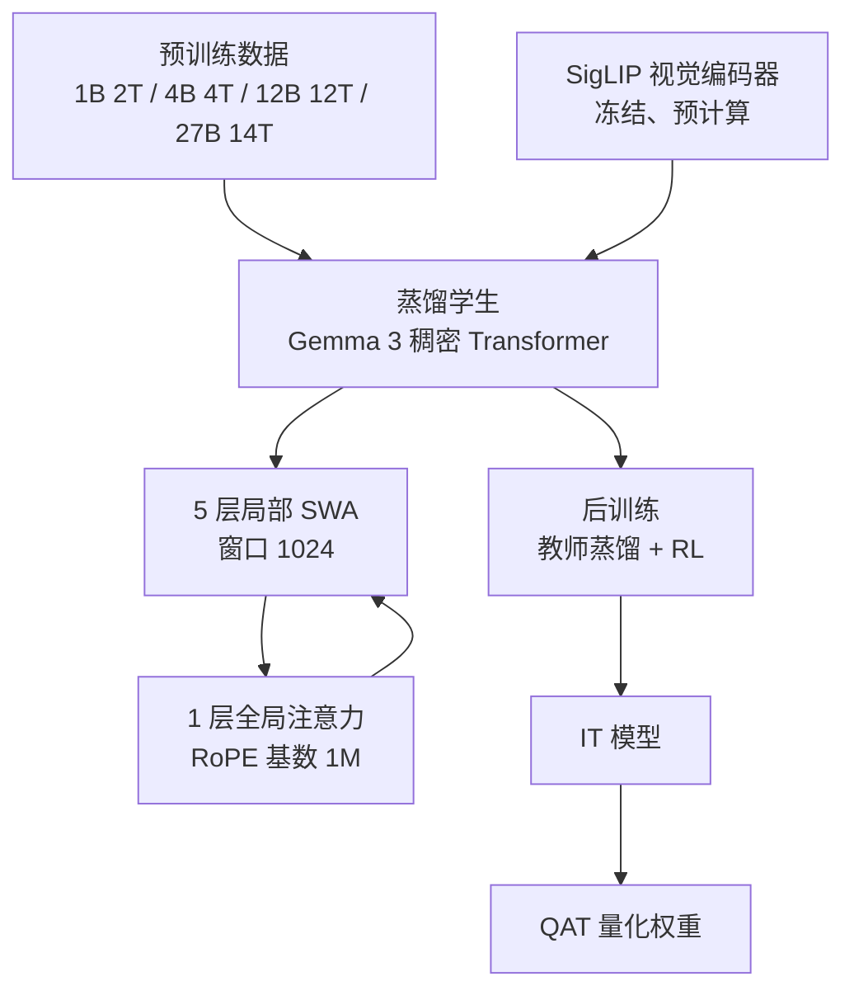
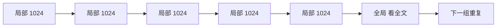
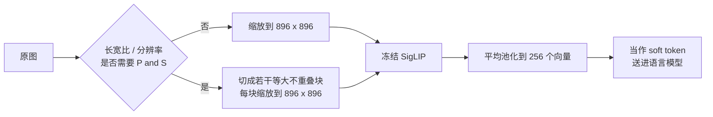
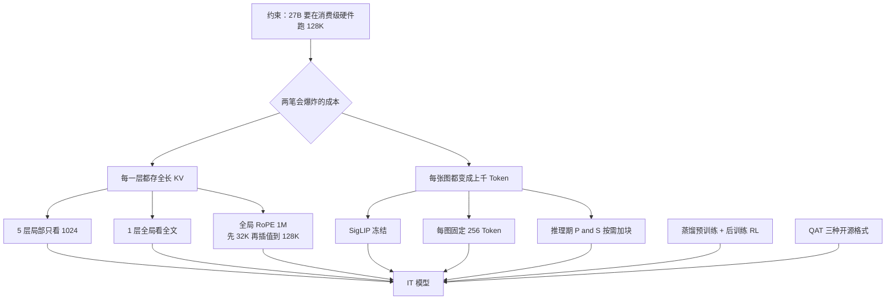

# 五个局部层养一个全局层：Gemma 3 怎样把 128K 的 KV 压下来

<!-- release-date: 2025-03-10 -->

> 本文依据 Gemma Team, Google DeepMind 发布的 **Gemma 3 Technical Report**，即 arXiv:2503.19786v1（2025-03-25），共 25 页。封面日期 2025-03-12。截至核验 arXiv 只有 v1，本地原件无需更换。页码均指 PDF 本身。全文把三件事分开标注：**报告明确写了什么**、**我们如何解释或验算它**、**哪些是外部资料补充**。

## 阅读前先认识几个词

这篇报告的门槛不高，但有几个词从头到尾都在用。先说人话，再给名字：

- **Token（词元）**：模型读写内容时的最小单位。一个汉字、一个英文单词、一小块图像，都可能被切成一个或多个 Token。
- **KV Cache（Key-Value Cache，键值缓存）**：模型每读过一个 Token，就把它的中间结果存下来，生成下一个 Token 时不必重算。上下文越长，这份缓存越大。
- **局部注意力 / 全局注意力**：局部层只看当前位置附近一小段；全局层可以看完整段上下文。前者缓存封顶，后者随长度线性涨。
- **滑动窗口注意力（Sliding Window Attention，SWA）**：局部注意力的一种实现。窗口宽度固定，当前位置只与最近 $W$ 个 Token 做注意力。
- **GQA（Grouped-Query Attention，分组查询注意力）**：许多 Query 头共用同一组 Key/Value 头，用来先砍一刀每层缓存的常数。
- **蒸馏（distillation）**：学生不直接学「正确答案」，而是学一个更大教师模型给出的概率分布。
- **SigLIP**：一种把图像编码成向量的视觉编码器，是 CLIP 的变体，用 sigmoid 损失做图文对齐。

这篇报告最常出现的五个专有名字是：

- **5:1 交错**：每 5 层局部滑动窗口注意力，配 1 层全局注意力，且第一层是局部层。
- **Pan and Scan（P&S，平移扫描）**：推理时把一张大图或非正方形图切成若干块，每块再送进固定分辨率的视觉编码器。
- **QK-norm**：对 Query 和 Key 做归一化，用来替换 Gemma 2 的 soft-capping。
- **QAT（Quantization-Aware Training，量化感知训练）**：用很短的微调，把量化误差练进去，而不是训练完再压。
- **IT / PT**：instruction-tuned（指令微调）与 pre-trained（预训练）两种权重。

## 一句话先说清

Gemma 3 不是一篇「我们把上下文参数改成 128K」的报告。

它是一篇 **「128K 会把 KV Cache 撑爆，所以我们不让每一层都去看全文」** 的报告。

旧方案里，每一层都要给每一个 Token 存一份 Key 和 Value。上下文从 8K 拉到 128K，缓存就涨 16 倍。消费级显卡上，这份缓存很快会比模型权重还贵。Gemma 3 的回答很干脆：

> 大多数层只准看最近 1024 个 Token；每 6 层里只留 1 层去看全文。

视觉输入也被放进同一套账单里：一张图固定压成 256 个 Token，需要读小字或奇怪长宽比时，再在推理阶段用 P&S 多花几份预算。语言基模仍是主干，视觉是为长上下文服务的附件，不是另一篇文章。

因此这篇报告最值得记住的不是「它多了一个视觉编码器」，而是一种分层付费的方式：

> **随长度增长的成本，只允许出现在少数全局层上；其余层把窗口锁死，视觉 Token 也先锁死。**

## 先看全景：四个尺寸，一条 KV 策略

这张图是机制示意，依据 PDF p. 1–4 的架构与训练描述，不代表实测时间。

四个公开尺寸是 1B、4B、12B、27B。报告 Table 1 把参数拆成三列（PDF p. 2）：

| 模型 | 视觉编码器 | Embedding 参数 | 非 Embedding 参数 |
|---|---:|---:|---:|
| 1B | 0 | 302M | 698M |
| 4B | 417M | 675M | 3,209M |
| 12B | 417M | 1,012M | 10,759M |
| 27B | 417M | 1,416M | 25,600M |

表注写「词表有 256k 条」（PDF p. 2）。后文 tokenizer 一节又写「词表有 262k 条」（PDF p. 3）。这是报告自己的两处口径，我们不替它抹平。1B 没有视觉编码器，其余三个尺寸共用同一个编码器，训练时冻结（PDF p. 2）。

上下文长度：4B / 12B / 27B 支持 128K Token，1B 只有 32K（PDF p. 2）。设计目标写得很明确：跑在手机、笔记本和消费级 GPU 上（PDF p. 1）。

## 第一层问题：把窗口改成 128K，账单会先爆

### 旧问题

自回归生成时，每读过一个 Token，每一层都要把它的 Key 和 Value 留下来。缓存大致是：

$$
\text{KV memory} \propto L \times n_{\text{layers}} \times n_{\text{kv heads}} \times d_{\text{head}} \times 2
$$

$L$ 是上下文长度，最后的 $\times 2$ 是 Key 和 Value 各存一份。注意力计算还有 $L^2$ 的部分，但报告真正盯住的是推理时这份缓存（PDF p. 1）。

可以把它想成开会：

- 8K 个人时，让每一层都给每个人建一份档案，已经很占柜子；
- 128K 个人时，还要求每一层都建全套档案，柜子会先于会议室被占满。

对千亿模型来说，权重远大于缓存，这笔账不痛。对要跑在一张消费级卡上的 27B 来说，情况正好反过来：**上下文一长，缓存会变成和权重同级、甚至更贵的东西。** 报告开篇就把这件事点出来：长上下文的挑战是推理时 KV Cache 的内存爆炸（PDF p. 1）。

### 新设计的方向

Gemma 2 已经在用局部/全局交错，但比例是 1:1，局部窗口 4096（PDF p. 7）。Gemma 3 把两个旋钮同时拧紧：

1. 局部层占比从一半提到六分之五；
2. 局部窗口从 4096 缩到 1024。

于是真正随 $L$ 增长的，只剩下那六分之一的全局层。

## 核心设计一：5:1 交错，局部窗口锁在 1024

### 报告写了什么

层的排布是（PDF p. 2）：

- 5 层局部滑动窗口自注意力，配 1 层全局自注意力；
- 第一层是局部层；
- 局部层的跨度只有 1024 个 Token；
- 因此「只有全局层才看长上下文，每 5 个局部层配 1 个全局层」（PDF p. 1）。

机制示意，依据 PDF p. 1–2 的文字；报告没有给出层数排布图，这里只表示「5 个局部层配 1 个全局层」这一比例。Gemma 2 用的是 1:1。

其余骨架沿用前两代：decoder-only Transformer、GQA、RMSNorm 的 pre-norm 与 post-norm。和 Gemma 2 的一个具体差别是：用 QK-norm 替换 soft-capping，依据是 Dehghani、Wortsman 与 Chameleon 的工作（PDF p. 2）。

位置编码也按层类型分开（PDF p. 2、p. 7）：

- 全局层 RoPE 基数从 10k 提到 1M；
- 局部层保持 10k；
- 先用 32K 序列预训练，再在预训练末段把 4B / 12B / 27B 扩到 128K，并按 Chen 等人的位置插值做 RoPE 重缩放，缩放因子取 8。

### 工作机制：为什么 5:1 不会把长程能力砍掉

直觉上，把五分之六的层改成「只看最近 1024 Token」，模型应该会忘掉远处的事。报告用两组消融回答这件事，对象都是纯文本的小模型，不是最终的 27B。

**比例几乎不影响困惑度。** Figure 3 在 2B 和 9B 上扫 1:1、3:1、5:1、7:1，验证集困惑度几乎不动，连 7:1 也只是轻微变化（PDF p. 6）。Gemma 2 用 1:1，Gemma 3 用 5:1。

**窗口也可以显著缩小。** Figure 4 在 2B 上扫 512、1024、2048、4096。窗口从 4096 降到 1024，困惑度同样几乎不动（PDF p. 6–7）。图例写的是 `L:G=1:1` 与 `L:G=3:1`；正文一句写成「1:1 和 1:3」，和全文「局部:全局」的记法打架。读这张图时以图例的 `L:G` 为准。

这两张图合在一起，说的是一件反直觉的事：**常规语言建模并不需要每一层都看见全文。** 眼前的词序、局部语法，1024 个 Token 的窗口就够大多数层用。真正需要「翻到很久以前那一页」的能力，可以集中养在少数全局层里。

这也解释了为什么他们敢把比例从 1:1 推到 5:1。如果验收指标只是困惑度，5:1 和 1:1 看起来差不多；省下的是推理内存，不是训练损失。

### KV 到底降了多少：报告给的图，和 496 KiB 对照

报告用两张图讲内存，数字都来自一个 **2B 纯文本**消融，不是 27B 的实测。

Figure 5 比较 32k 预填充时「模型权重 vs KV Cache」（PDF p. 7）：

- 「global only」是 Gemma 1 和 Llama 那类全层全局注意力，KV 相对权重的开销约 **60%**；
- Gemma 2 的配置是 `1:1, sw=4096`；
- 换成 `1:3` 且 `sw=1024` 之后，开销降到 **15% 以下**。

这里有一处必须说清楚。Figure 5 横轴写的是 `1:1` 和 `1:3`，正文说「1:3 且 sw=1024」。按 KV 柱从左到右递减来看，这里的 `1:3` 只能读成「全局更少」，也就是 3 个局部层配 1 个全局层，和 Figure 3 的 `Local:Global = 3:1` 是同一件事、两种写法。报告自己没有统一记号。更重要的是：**最终采用的 5:1 并没有出现在 Figure 5 里。** 15% 这个数字属于 3:1 + 1024，不是 5:1 的实测。

Figure 6 才画 5:1。它比较「2B、L:G=5:1、sw=1024」和「2B 纯全局」的 KV 随上下文长度的变化（PDF p. 7）。纯全局那条线从 1K 到 128K 近似直线往上冲，到 128K 时大约 6000 MB 量级；5:1 那条明显被压平。报告没有在正文里给 128K 处的精确 MB 数，读图能看到的是形状：全局方案随 $L$ 线性爆炸，5:1 方案把增长率砍掉一大截。

**496 KiB/token 不在 PDF 里。** 它是本仓库知识库和索引里用的对照基准，口径是「假如 27B 每一层都按全长存 bf16 的 KV」。下面是我们按官方开源配置做的验算，不是报告原文。

外部补充来源：Google DeepMind 的 [`gemma` 仓库](https://github.com/google-deepmind/gemma) 里 `Gemma3_27B` 的配置为 62 层、16 个 KV 头、`head_dim=128`。

$$
2 \times 16 \times 128 \times 62 \times 2\,\text{B} = 507{,}904\,\text{B} = 496\,\text{KiB/token}
$$

单条 128K（按 $131{,}072$）上下文就是约 62 GiB。一张 80 GB 的 H100，**只按这个上界算，光缓存就吃掉大半张卡**，权重还没放。这就是索引那句「496 KiB/token 的 KV cache 对照基准」要钉住的数：它衡量的是「什么优化都不做」时的规模，方便和 MLA、线性混合那些「每 Token 只有几十 KiB」的模型横比。

按 5:1 推，62 层里全局层是第 6、12、……、60 层，共 10 层。真正随长度增长的部分大约是：

$$
\frac{10}{62} \times 496\,\text{KiB} \approx 80\,\text{KiB/token}
$$

局部层的缓存封顶在 1024，不随 128K 再涨。所以上界 496 KiB 和「实际随长度涨的那部分」差了大约六倍。跨模型比较 KV/token 时，必须先统一口径：滑窗模型的公开数字常常是上界，线性混合模型的公开数字往往只数全局层。

报告 Table 3 给的是另一组数：32,768 上下文下，权重加 KV 的占用量，KV 按 8 bit 计（PDF p. 3）：

| 模型 | bf16 权重 | bf16 +KV | Int4 权重 | Int4 +KV |
|---|---:|---:|---:|---:|
| 1B | 2.0 | 2.9 | 0.5 | 1.4 |
| 4B | 8.0 | 12.7 | 2.6 | 7.3 |
| 12B | 24.0 | 38.9 | 6.6 | 21.5 |
| 27B | 54.0 | 72.7 | 14.1 | 32.8 |

27B 在 bf16 下 KV 额外占 18.7 GB。这个数字对不上上面 496 KiB 的纯公式（32k 全长 bf16 约 15.5 GiB），也对不上「已计入 5:1」的估算。报告没有写 Table 3 有没有把滑窗封顶算进去、有没有额外对齐或激活缓冲。**把它当成他们公布的部署占用量，不要强行和 496 KiB 对账。**

### 长上下文是后加的，不是从零训到 128K

他们没有用 128K 序列从头预训练（PDF p. 7）。流程是：

1. 先在 32K 上预训练；
2. 预训练结束时把 4B / 12B / 27B 扩到 128K，并做 RoPE 重缩放，因子 8；
3. 全局层基数改 1M，局部层仍是 10k。

Figure 7 画了重缩放前后、不同上下文长度上的平均困惑度（PDF p. 7）。带 long context 的实线可以撑到 128K；再往 256K、512K 走，曲线迅速变差。报告原话是：模型能泛化到 128K，但继续拉长会迅速退化。

这是一条很具体的边界：**5:1 解决的是 128K 的内存，不是任意长度的质量。** 位置插值把已经学会的 32K 几何外推到 128K，过了这个点，报告自己的图就不撑了。

### 收益、代价与边界

收益是明确的。在 2B 消融里，KV 随长度的增长被明显压平；32k 下相对权重的缓存开销从约 60% 降到 15% 以下（3:1 + 1024 那一档）。语言建模困惑度对比例和窗口都不敏感。

代价报告量化得很少。5:1 意味着任意两个远距离 Token，中间隔了五层只能靠局部窗口接力。精确检索理论上更依赖那少数全局层。报告**没有**给大海捞针或 RULER 对 1:1 / 3:1 / 5:1 的消融，只有最终模型在 32K / 128K 上的成绩（见评测节）。所以「5:1 对检索无伤害」目前不是被这组消融支持的结论，只是作者用困惑度做完选择之后的默认设定。

可迁移的启发：**先把「随上下文增长的成本」和「不随上下文增长的成本」分开，再只对前者动刀。** 验收时不要只用困惑度调比例——报告自己的图已经证明，困惑度会告诉你 7:1 也行。

## 核心设计二：视觉不是第二模态，是另一笔 Token 预算

语言基模方向仍写一篇。视觉在 Gemma 3 里的位置，是「怎样把图像变成可控数量的 Token，以免把刚刚省下的 KV 再花回去」。

### 旧问题

一张高分辨率图如果按 patch 原样送进语言模型，Token 数会轻松上千。128K 的窗口看起来宽裕，但图像、多图、视频帧会把预算吃掉，而且视觉编码器本身还按固定正方形分辨率工作。非正方形图被拉变形，小字会糊，小物体会消失（PDF p. 2）。

### 新设计：冻结的 SigLIP + 固定 256 个向量 + 推理时再切图

报告的视觉栈有三句话（PDF p. 1–2、p. 8）：

1. 用约 400M 的 SigLIP 编码器（Vision Transformer，CLIP 损失的变体）。Table 1 记的是 417M，正文写 400M variant，差 17M，报告没有解释。
2. 输入是缩放到 $896 \times 896$ 的正方形图。编码器在视觉助手数据上微调过，然后在 4B / 12B / 27B 之间**共享，并在训练中冻结**。
3. 每张图被压成固定的 **256 个** soft token。更高分辨率的编码器靠平均池化把输出收到 256；896 这一档用的是 $4 \times 4$ 池化。

1B 没有这条视觉通路。

训练时他们把图像的 embedding **预先算好**，语言模型直接吃这些向量，视觉编码器不进入训练步进，因此「给语言模型训练不加成本」（PDF p. 3）。

机制示意，依据 PDF p. 2、p. 8。P&S 是推理期开关，可以关掉换速度。

### Pan and Scan：需要读字的时候才加钱

P&S 只在推理时启用（PDF p. 2）。算法是自适应切窗：把图分成覆盖全图、大小相等、互不重叠的块，每块缩到 $896 \times 896$ 再送编码器。只在必要时启用，并控制最大切块数。报告没有写最大块数、是否保留一张全局缩略图、块与块之间有没有重叠。这些实现细节未公开。

它要解决的就是固定 256 Token 带来的盲区：长收据、海报、宽表、图里的小字。Figure 1 是一张超市收据的问答示例，27B IT 能把切片肉的价格和 18% 小费算出来（PDF p. 2）。这张图本身就是在说：视觉任务经常是「读小字」，不是「看大场景」。

Table 7 用短程 2B 模型扫编码器输入分辨率（PDF p. 8）：

| 分辨率 | DocVQA | InfoVQA | TextVQA |
|---:|---:|---:|---:|
| 256 | 31.9 | 23.1 | 44.1 |
| 448 | 45.4 | 31.6 | 53.5 |
| 896 | 59.8 | 33.7 | 58.0 |

分辨率越高越好，尤其是文档类。他们仍然把输出锁在 256 个 Token：编码器可以看更细的格子，语言模型只收固定长度的摘要。

Table 8 是 P&S 的开关对照，4-shot，验证集，预训练 checkpoint（PDF p. 8）。正文有一处写成「27B IT」，表注写成预训练 checkpoint，以表注为准：

| | DocVQA | InfoVQA | TextVQA |
|---|---:|---:|---:|
| 4B | 72.8 | 44.1 | 58.9 |
| 4B + P&S | 81.0 | 57.0 | 60.8 |
| 增益 | +8.2 | +12.9 | +1.9 |
| 27B | 85.6 | 59.4 | 68.6 |
| 27B + P&S | 90.4 | 76.4 | 70.2 |
| 增益 | +4.8 | +17.0 | +1.6 |

InfoVQA 跳得最厉害。报告的解释是：收益出现在长宽比变化大、或需要读图中文字的任务上（PDF p. 8）。这和「256 Token 是默认预算、P&S 是按需加钱」完全一致。

### 它怎样服务长上下文

一张图 256 个 Token，相对 128K 窗口是小头。但多图、短视频会线性叠加。Table 17 的视频评测用 16 帧均匀取样（PDF p. 22），也就是大约 $16 \times 256 = 4096$ 个视觉 Token，还没算文本。如果每帧再开 P&S，预算会继续涨。

所以视觉设计的主轴不是「把图看得多细」，而是 **先把视觉 Token 变成常数，再留一个推理期阀门**。这和 5:1 是同一类决策：默认路径要便宜，贵的路径显式、可选、可关。

报告没写的东西同样重要：视觉编码器的训练数据、冻结前微调的步数、P&S 最大块数、多图在 128K 里如何排布。这些都不补。

## 核心设计三：预训练就是蒸馏，而且要蒸馏很久才该用大教师

### 数据与 tokenizer

预训练「大致沿用 Gemma 2 的蒸馏配方」，Token 预算略增，用来覆盖图像和文本的混合，并提高多语言比例（PDF p. 3）：

| 模型 | 预训练 Token |
|---|---|
| 1B | 2T |
| 4B | 4T |
| 12B | 12T |
| 27B | 14T |

多语言同时加了单语数据和平行数据，语言不均衡用 Chung 等人 2023 的策略处理（PDF p. 3）。过滤包括：降低不当或危险输出、去掉部分个人信息和敏感数据、评测集去污染、降低复述风险、以及一层质量重加权（Sachdeva 等人 2024）（PDF p. 3）。

Tokenizer 与 Gemini 2.0 相同：SentencePiece，数字分开切，保留空白，带 byte-level 编码，词表 262k，对非英语更均衡（PDF p. 3）。和 Table 1 的 256k 对不上，已在前面记下。

### 蒸馏怎么做

具体做法只有一段（PDF p. 3）：

1. 每个 Token 按教师概率加权，采样 256 个 logits；
2. 学生用交叉熵去拟合教师在这 256 个位置上的分布；
3. 没采到的 logits，教师目标概率置零，再重新归一化。

它不是把整张词表的教师分布都搬过来。262k 的词表上，完整蒸馏会非常贵；256 个位置是一个明确的计算预算。没被抽中的词，教师那边直接当成不可能。这是一种有偏的近似：高频、教师认为重要的词更容易进这 256 个槽，长尾被丢掉。

教师是谁、多大、学生是否同时学真实 next-token 标签，报告都没写。

### 小教师还是大教师，取决于你训多久

常见经验是：训小模型时，用小一点的教师更好，因为较差教师自带正则。报告怀疑这些研究的训练都太短，正则效应盖过了教师质量（PDF p. 7–8）。

Figure 8 让同一个学生分别跟一个大教师和一个小教师学，横轴是训练 Token 数（PDF p. 8）。纵轴是相对困惑度差，越负表示大教师越好。短程训练时小教师领先；Token 变多之后曲线翻到大教师一侧，而且差距继续拉大。

这是全文最干净的一条训练 insight：

> **教师该多大，是训练时长的函数，不是学生尺寸的函数。** 短跑用小教师当正则，长跑才配得起大教师的信息量。

教师的具体尺寸没有公开，所以这张图给的是方向，不是可复现的配比。

## 后训练：把数学、对话和指令跟随一次抬起来

预训练模型变成 IT 模型，靠的是「相对前代改进过的后训练」（PDF p. 4）。报告点名的技术有：

- 改进版知识蒸馏，教师是一个更大的 IT 模型（Agarwal 等人 2024；Anil 等人 2018；Hinton 等人 2015）；
- 一层 RL 微调，基于改进版的 BOND、WARM、WARP。

奖励函数用来提高有用性、数学、代码、推理、指令跟随和多语言，同时压低有害性（PDF p. 4）。来源包括：

- 用人类反馈训练、再做权重平均的奖励模型（WARM）；
- 代码执行反馈；
- 解数学题的真实奖励。

数据过滤去掉：含个人信息的样本、不安全或有毒的模型输出、错误的自我身份数据、重复样本。加入鼓励「在上下文中标注出处、适度对冲、必要时拒答」的子集，可以提高事实性指标，且「不损害其他指标」（PDF p. 4）。最后半句是因果陈述，报告没有给对应的分数表。

格式上有两处实用细节（PDF p. 4）：

- 文本都以 `[BOS]` 开头，而且必须在分词之后显式加上，或用 tokenizer 的 `add_bos=True`。不要把字符串 `"[BOS]"` 拿去分词。
- PT 生成结束时输出 `<eos>`，IT 输出 `<end_of_turn>`。微调哪一种，就要补哪一种结束符。IT 的回合格式是 `<start_of_turn>user` / `<start_of_turn>model`（Table 4，PDF p. 4）。

报告**没有**写 SFT 数据量、RL 步数、奖励权重、教师 IT 模型是哪一个。BOND / WARM / WARP 只给了论文名，没有把算法在 Gemma 3 上的改动写开。

外部补充：官方开发者博客把后训练说成四个组件——从更大 instruct 模型蒸馏、RLHF、RLMF（数学的机器反馈）、RLEF（代码的执行反馈）。见 [Introducing Gemma 3: The Developer Guide](https://developers.googleblog.com/en/introducing-gemma3/)（2025-03-12）。这比 PDF 好读，但是博客口径，不能冒充报告原文。

## 量化：5,000 步把部署格式练进去

除了原始 checkpoint，他们还提供量化版（PDF p. 3）。做法是对每个模型再微调一小段，通常 5,000 步，用非量化 checkpoint 的概率当目标，数据同时贴近预训练和后训练分布。格式跟着最流行的开源推理引擎走（点名 llama.cpp），只做三种权重表示：

- per-channel int4；
- per-block int4（`Int4 blocks=32`）；
- switched fp8（表里写作 SFP8）。

Table 3 已在前面。27B 从 bf16 的 54.0 GB 压到 int4 的 14.1 GB，这是「能不能放进一张 24 GB 消费卡」的分界线。报告没有给量化前后同一基准的对照分数，所以「QAT 保质量」在这份材料里只是方法描述，不是被实验支持的结论。

外部补充：2025-04-18 的官方博客 [Gemma 3 QAT Models](https://developers.googleblog.com/en/gemma-3-quantized-aware-trained-state-of-the-art-ai-to-consumer-gpus/) 用同一组 54 GB → 14.1 GB 的数字，宣传 27B int4 可以放进 RTX 3090。那是发布后的部署说明，不是 PDF 里的评测。

## 训练基础设施：芯片数公开，时长和 FLOPs 没有

Table 2（PDF p. 3）：

| 模型 | TPU | 芯片数 | Data | Seq. | Replica |
|---|---|---:|---:|---:|---:|
| 1B | TPUv5e | 512 | 16 | 16 | 2 |
| 4B | TPUv5e | 2,048 | 16 | 16 | 8 |
| 12B | TPUv4 | 6,144 | 16 | 16 | 24 |
| 27B | TPUv5p | 6,144 | 24 | 8 | 32 |

软件栈（PDF p. 3–4）：优化器状态用 ZeRO-3 的一个实现分片；跨 pod 用 Pathways 做 data replica reduction；编程范式是 JAX + Pathways 的单控制器；分区器 GSPMD，编译器 MegaScale XLA。

单控制器的意思是：不是每张卡跑一份相同程序再互相协调，而是一个控制进程描述整个分布式计算。报告把这套栈当作沿用，没有展开新的并行策略。训练时长、迭代数、总算力全部没有。

## 实验怎么证明：先看作者的两句口号，再看表

摘要和引言把后训练成绩收成两句话（PDF p. 1）：

- Gemma3-4B-IT **competitive with** Gemma2-27B-IT；
- Gemma3-27B-IT **comparable to** Gemini-1.5-Pro across benchmarks。

下面用 Table 6 核对这两句。数字全部来自 PDF p. 6，IT、zero-shot。

### 4B-IT 对 Gemma2-27B-IT：数学跳级，知识没有

| 基准 | Gemma 3 4B | Gemma 2 27B | 谁高 |
|---|---:|---:|---|
| MATH | 75.6 | 55.6 | 4B |
| HiddenMath | 43.0 | 14.8 | 4B |
| FACTS Grounding | 70.1 | 62.4 | 4B |
| MMLU-Pro | 43.6 | 56.9 | 27B |
| Global MMLU-Lite | 54.5 | 68.6 | 27B |
| LiveCodeBench | 12.6 | 20.4 | 27B |
| Bird-SQL | 36.3 | 46.7 | 27B |
| GPQA Diamond | 30.8 | 34.3 | 27B |
| SimpleQA | 4.0 | 9.2 | 27B |

「competitive」成立的地方主要是数学和事实接地。知识类、代码类、多语言知识，4B 仍然明显小于 27B。后训练把小模型的推理表现抬了起来，没有把世界知识也蒸馏到同一水平。把这句口号读成「4B 全面追上上一代 27B」是错的。

### 27B-IT 对 Gemini-1.5-Pro：数学贴近，知识差一截

| 基准 | Gemma 3 27B | Gemini 1.5 Pro | 谁高 |
|---|---:|---:|---|
| MATH | 89.0 | 86.5 | Gemma |
| HiddenMath | 60.3 | 52.0 | Gemma |
| Bird-SQL | 54.4 | 54.4 | 平 |
| MMMU (val) | 64.9 | 65.9 | 接近 |
| LiveCodeBench | 29.7 | 34.2 | Gemini |
| MMLU-Pro | 67.5 | 75.8 | Gemini |
| FACTS Grounding | 74.9 | 80.0 | Gemini |
| Global MMLU-Lite | 75.1 | 80.8 | Gemini |
| GPQA Diamond | 42.4 | 59.1 | Gemini |
| SimpleQA | 10.0 | 24.9 | Gemini |

数学上 27B 可以跟 1.5 Pro 比，甚至更高；GPQA 和 SimpleQA 差得很远。「comparable across benchmarks」是作者的概括，表格显示的是 **STEM 近、知识远**。Gemini 2.0 Pro 在同一张表上几乎全面更高，报告没有用 27B 去对 2.0 Pro 喊 comparable。

### 人类盲评：Arena Elo 1338

Table 5 是 LMSys Chatbot Arena 的 Elo，27B IT 为 1338（+8/-9），初步结果日期 2025-03-08（PDF p. 4–5）。同一张表示意性摘几行：

| 排名 | 模型 | Elo | 开放 | 类型 |
|---:|---|---:|---|---|
| 6 | DeepSeek-R1 | 1363 | 是 | MoE 671B/37B |
| 9 | Gemma-3-27B-IT | 1338 | 是 | Dense 27B |
| 13 | DeepSeek-V3 | 1318 | 是 | MoE 671B/37B |
| 18 | Gemini-1.5-Pro-002 | 1302 | 否 | — |
| 28 | Llama-3.1-405B-Instruct | 1269 | 是 | Dense 405B |
| 59 | Gemma-2-27B-it | 1220 | 是 | Dense 27B |

报告强调：1338 高于若干大得多的开放模型，也显著高于 Gemma 2 的 1220。同时写明：**Elo 不计视觉能力**，表里这些模型大多也没有视觉（PDF p. 5）。这是文本偏好盲评，不是多模态榜。

### 预训练探针：加了视觉，多数能力仍在涨

Figure 2 用雷达图概括 Gemma 2 与 Gemma 3 预训练模型在科学、代码、事实性、多语言、推理、视觉上的相对位置（PDF p. 6）。细节在附录 Table 9–14（PDF p. 20–21）。作者的观察是：尽管加了视觉，多数类别仍有提升，多语言是这一代的重点。他们自己加了一句保留：即使做了去污染，探针仍有污染风险，更硬的结论不好下（PDF p. 6）。

STEM 与代码的预训练表（Table 10，PDF p. 20）值得单独看一眼：4B / 12B 相对同档 Gemma 2 有稳定提升，27B 在 HumanEval 上是 48.8，Gemma 2 27B 是 51.2，**这一项没有超过前代**。报告正文也承认 27B 的代码提升不如 4B 和 12B 那么清楚（PDF p. 20）。

### 长上下文：能用 128K，但 IT 比 PT 更怕 128K

Table 15（PDF p. 22）：

| | 4B PT | 12B PT | 27B PT | 4B IT | 12B IT | 27B IT |
|---|---:|---:|---:|---:|---:|---:|
| RULER 32K | 67.1 | 90.6 | 85.9 | 61.4 | 80.3 | 91.1 |
| RULER 128K | 51.7 | 80.7 | 72.9 | 46.8 | 57.1 | 66.0 |
| MRCR 32K | 44.7 | 59.8 | 63.2 | 49.8 | 53.7 | 63.2 |
| MRCR 128K | 40.6 | 56.9 | 60.0 | 44.6 | 49.8 | 59.3 |

27B IT 的 RULER 从 32K 的 91.1 掉到 128K 的 66.0；PT 从 85.9 掉到 72.9，掉得少一些。也就是说，**后训练没有把长上下文检索一起抬上去，有的指标还掉了。** 5:1 让 128K 装得进内存，不自动等于 128K 上的检索和 PT 一样稳。

### 视觉与视频

IT 多模态（Table 16，PDF p. 22，默认带 P&S）：27B 的 MMMU val 64.9、DocVQA 86.6、InfoVQA 70.6、MathVista testmini 67.6。和 Gemini 1.5 Pro 的 MMMU 65.9 接近，已在 Table 6 出现过。

预训练视觉（Table 11，PDF p. 20，无 P&S）和「按 PaliGemma 2 协议再微调」（Table 12，PDF p. 21）是另一组对照。报告的观察是：Gemma 3 在文档理解上甚至超过更大的 PaliGemma 2；因为视觉侧做了平均池化，4B / 12B 在 $896 \times 896$ 上的迁移成本大约是 PaliGemma 2 9B / 27B 的十分之一（PDF p. 21）。VQAv2 和 COCO caption 上 PaliGemma 2 略好。这不是「全面超过专用视觉模型」，是「文档类更强、通用 caption 略弱」。

视频不是独立模态。Table 17 用 0-shot、16 帧均匀取样（PDF p. 22）：27B 的 Perception Test MCVQA 58.1、ActivityNet-QA 52.8。报告没有把视频写成第三条输入通路，它就是「多帧图像」。

## 记忆、安全与限制

### 记忆率显著低于前代

第 6 节沿用 Gemma 2 的方法：从训练语料均匀抽前缀 50、后缀 50，测可发现提取（PDF p. 8–9）。完全匹配叫 exact，编辑距离 10% 以内叫 approximate。

Figure 9 用对数纵轴比较 Gemma 3 与更早的 Gemma / Gemini / PaLM（PDF p. 9）。Gemma 3 四档都明显更低；4B / 12B / 27B 之间差别不大，1B 更低。approximate 大约是 exact 的 24 倍。用 Google Cloud Sensitive Data Protection 去扫被判定为记忆的输出，**所有 Gemma 3 尺寸都没有扫到个人信息**（PDF p. 9）。SDP 是高召回、假阳性很多的规则，报告认为这是在高估，因此「低于检测阈值」是他们愿意下的结论。

脚注强调：他们不声称模型「装有」训练数据的副本，只是在统计上有时能生成与训练数据相匹配的文本（PDF p. 8）。

### 安全：有政策、有流程，几乎没有分数

第 7 节对齐 Google 的安全政策，禁止类别包括：儿童性虐待与剥削、可能导致伤害的个人身份信息、仇恨与骚扰、危险或恶意内容、露骨性内容、违背科学或医学共识的医疗建议（PDF p. 10）。预训练做了安全过滤；微调同时用 SFT 和 RLHF 把模型推离不良行为。

Assurance 评测用大量合成对抗查询，由人工标注是否违规。结论是 violation rate「significantly low」（PDF p. 10），没有给百分比。CBRN 相关知识用内部闭卷选择题评估，结论是「这些领域的知识低」（PDF p. 10），同样没有分数。他们的治理判断是：考虑到已经有许多更强的开放模型，这次发布对整体风险格局的影响可以忽略（PDF p. 10）。

ShieldGemma 2 是用 Gemma 3 做的 4B 图像安全分类器，输出危险内容、露骨性内容、暴力三个标签（PDF p. 9）。它是伴随产物，不是本报告的模型。

作为读者的判断：**安全这一节是作者陈述加流程说明，不是这份 PDF 提供的可核对证据。**

### 报告承认的能力边界

正文没有单独的 Limitations 清单，边界散落在几处：

- 1B 没有视觉，上下文只有 32K（PDF p. 2）；
- 128K 之外困惑度迅速变差（Figure 7，PDF p. 7）；
- 探针可能仍被污染（PDF p. 6）；
- Arena 不计视觉（PDF p. 5）；
- P&S 可关，关了就回到固定 896 正方形的盲区（PDF p. 2）；
- 开放权重一旦放出不可收回，所以评估策略是「把更强模型测透，常常就够给更弱模型托底」（PDF p. 10）。

## 报告没有告诉我们的事

按重要性排：

- **层数、KV 头数、隐藏维度**：PDF 的参数表只有视觉 / embedding / 非 embedding 三列，没有层配置。496 KiB 只能从官方权重配置反推。
- **5:1 对检索任务的消融**：困惑度和 KV 图都有，RULER / 大海捞针没有按比例扫。
- **教师模型身份与大小**、蒸馏是否同时学真实标签。
- **数据配比**：网页、代码、数学、图像、各语言各占多少，没有。
- **训练时长与总算力**。
- **后训练的数据量、步数、奖励权重**。
- **P&S 的最大切块数和是否保留全局缩略图**。
- **量化的质量代价**：没有量化前后对照表。
- **Table 3 的 KV 口径**：是否计入滑窗封顶、是否含额外缓冲，没写。
- **词表 256k 与 262k 两处写法**，没有勘误。

这些缺口里，有些是体裁选择——Gemma 3 的读者首先是要部署的人，所以内存表、回合格式、QAT 格式写得很具体。但它也意味着：**这份报告不够用来复现 Gemma 3。** 它是一份清楚的架构说明和一份合格的成绩单，不是完整训练配方。

## 外部补充：首发日、官方配置、后续 270M

以下内容**不来自 PDF**，只用于补规格和时间线。

**首发日。** Google 官方 [Gemma releases](https://ai.google.dev/gemma/docs/releases) 记 2025-03-10 发布 Gemma 3 的 1B / 4B / 12B / 27B，同日发布 ShieldGemma 2。官方博客 [Gemma 3: Google’s new open model based on Gemini 2.0](https://blog.google/technology/developers/gemma-3/) 和开发者指南都是 2025-03-12。按「任一官方渠道中最早的公开可用事件」，`release-date` 取 **2025-03-10**。Hugging Face 仓库的 `createdAt` 不是首发日。封面 2025-03-12、arXiv 2025-03-25 都是事后文档。

**官方配置。** [`google-deepmind/gemma`](https://github.com/google-deepmind/gemma) 里四个尺寸是：

| 模型 | 层数 | $d_{model}$ | Q 头 | KV 头 | $d_{head}$ | 局部窗口 |
|---|---:|---:|---:|---:|---:|---:|
| 1B | 26 | 1,152 | 4 | 1 | 256 | 512 |
| 4B | 34 | 2,560 | 8 | 4 | 256 | 1024 |
| 12B | 48 | 3,840 | 16 | 8 | 256 | 1024 |
| 27B | 62 | 5,376 | 32 | 16 | 128 | 1024 |

注意力模式是 5 个 `LOCAL_SLIDING` 加 1 个 `GLOBAL` 循环，与报告一致。有一处和 PDF 不完全相同：报告把局部窗口写成 1024，官方实现里 1B（以及后来的 270M）是 512。视觉侧 SigLIP 输入 896、patch 14、每图 256 个 Token，与报告一致。

**270M。** 官方日志在 2025-08-14 增加 Gemma 3 270M，是后续成员，不是本报告对象。官方 model card 写它预训练 6T Token，上下文 32K，文本 only。家族首发日仍取 2025-03-10。

**知识截止。** 官方 model card 写训练数据截止 2024 年 8 月。PDF 没写。

**论文之后。** 同目录的 Gemma 4 解读覆盖 2026 年那一代：5:1 被保留，但又叠了 p-RoPE、键当值、跨层共享 KV、thinking mode 和 encoder-free。那些是后文，不要读回这篇的「报告写了什么」。

## 最值得带回自己项目的五条

### 1. 先问哪一层必须看见全文

Gemma 3 没有发明新的注意力公式。它做的是承认：大多数层并不需要 $L$ 这么长的视野。任何长会话、长日志、长视频系统都可以先数「有几层在存全长状态」，再决定优化谁。

### 2. 用困惑度调 KV 比例，一定会调得太省

Figure 3 和 Figure 4 已经展示：语言建模对 5:1 和 1024 窗口几乎无感。如果线上任务是精确检索，必须另测大海捞针一类指标。报告自己没做这组消融，反而提醒我们不要重复这个盲区。

### 3. 教师大小跟训练时长绑定

短程蒸馏里，较差教师的正则可能赢；训到足够长，大教师才会把信息量兑现。不要把「小模型配小教师」当成与时长无关的定理。

### 4. 多模态先锁 Token 数，再留一个贵的阀门

256 是默认账单，P&S 是按需加钱。分辨率消融和 P&S 开关表都说明：文档和读字任务吃的是空间分辨率，不是「再加一个模态」这个口号。

### 5. 部署格式要进训练闭环，并且跟着生态走

5,000 步 QAT、三种 llama.cpp 熟悉的表示，目标不是数学上最优的量化，而是用户不用换工具链就能把 27B 塞进一张消费卡。开放权重模型的量化选型，本质是选交集。

## 用一张图把账单重新串起来

机制示意，依据 PDF p. 1–4、p. 7–8。

## 关键词回看

- **5:1 交错**：5 层局部 SWA 配 1 层全局注意力，第一层为局部层。
- **滑动窗口 1024**：局部层只在最近 1024 个 Token 上做注意力，缓存封顶。
- **496 KiB/token**：27B 按「所有层 × 全长 × bf16」算的 KV 上界，来自官方配置验算，不在 PDF 里。
- **QK-norm**：用 Query/Key 归一化替换 Gemma 2 的 soft-capping。
- **位置插值 + 双基数 RoPE**：全局 1M、局部 10k，预训练末段按因子 8 扩到 128K。
- **SigLIP + 256 soft token**：冻结视觉编码器，每图固定 256 个向量。
- **Pan and Scan**：推理时按需切等大块，解决固定 896 正方形的变形和糊字。
- **256-logit 蒸馏**：每个 Token 只跟教师分布里采样出的 256 个位置学。
- **WARM / WARP / BOND**：后训练 RL 引用的三条权重平均与 Best-of-N 蒸馏工作。
- **QAT**：约 5,000 步，产出 per-channel int4、per-block int4、switched fp8。

## 最后的判断

Gemma 3 真正被实验托住的结论有三条。

第一，局部/全局比例和窗口大小，在困惑度上很不敏感，所以 5:1 + 1024 作为内存优化是站得住的；2B 的 KV 曲线也被压平了。第二，后训练把数学抬得很高：4B 的 MATH 超过上一代 27B，27B 的 MATH 超过 Gemini 1.5 Pro。第三，视觉侧「固定 256 + 推理期 P&S」在文档和信息图上有清晰的开关增益。

只是作者观察、或表格并不完全支持口号的，有：4B 全面 competitive 于 Gemma2-27B（知识类明显落后）；27B comparable 于 Gemini-1.5-Pro across benchmarks（GPQA / SimpleQA 差距大）；5:1 对长上下文检索无伤害（没有按比例的检索消融，IT 的 RULER 128K 还掉了）。

完全没有公开的，是层配置、教师身份、数据配比、后训练规模、P&S 的硬参数，以及量化的质量代价。

如果只记一句话，可以记：

> **128K 不是把窗口改大，而是禁止大多数层去看全文；视觉也先变成 256 个 Token，贵的分辨率只在推理时按需买。**

## 资料与阅读边界

- 原始依据：本地 `papers/Google/Gemma-3.pdf`，Gemma 3 Technical Report，arXiv:2503.19786v1（2025-03-25 提交）。封面日期 2025-03-12。arXiv 目前只有 v1，与本地原件一致：<https://arxiv.org/abs/2503.19786>。
- 官方发布日志：[Gemma releases](https://ai.google.dev/gemma/docs/releases)（记 2025-03-10 首发 1B / 4B / 12B / 27B），`release-date` 依据。
- 官方发布公告：[Gemma 3: Google’s new open model based on Gemini 2.0](https://blog.google/technology/developers/gemma-3/)（2025-03-12）。
- 官方开发者指南：[Introducing Gemma 3: The Developer Guide](https://developers.googleblog.com/en/introducing-gemma3/)（2025-03-12），后训练四组件与对话格式的补充来源。
- 官方规格：[Gemma 3 model card](https://ai.google.dev/gemma/docs/core/model_card_3)、开源实现 [google-deepmind/gemma](https://github.com/google-deepmind/gemma)。层数、KV 头、1B 窗口 512、270M 均来自这两处，报告本身没有写。
- 同仓近邻：`reports/Google/Gemma-4.md` 讲的是一代之后的部署账，5:1 被保留但叠了新手段；不要把那篇的 encoder-free / MoE / thinking mode 读回 Gemma 3。
- 文中标注为「我们的验算」的 496 KiB/token 与全局层 80 KiB/token，不是报告原文，读者应以 PDF 和图为准。
