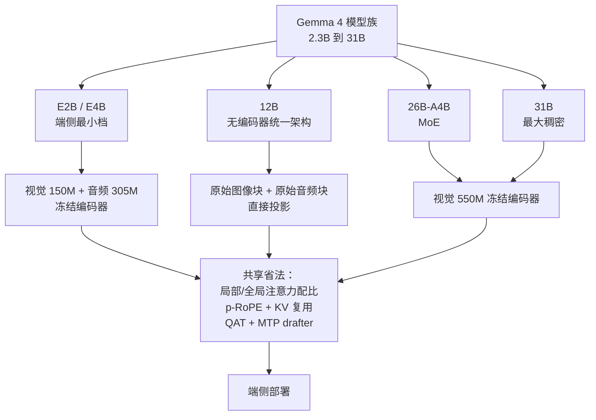
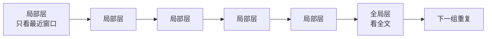
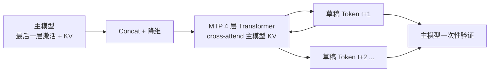
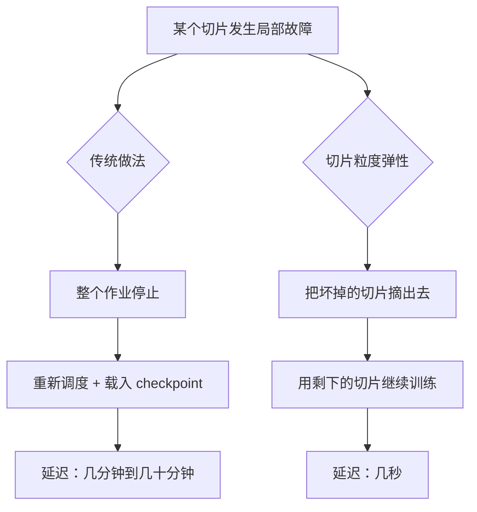
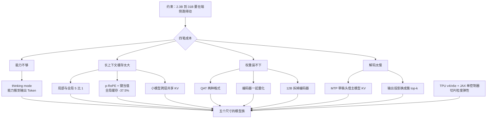

# Gemma 4：参数加不动了，就把成本搬到别处

<!-- release-date: 2026-03-31 -->

> 本文依据 Google DeepMind 的 **Gemma 4 Technical Report**，即 arXiv:2607.02770v2（2026-07-24 提交，本地 PDF 与 arXiv 最新版一致），封面日期 2026-06-19，正文 8 页、连附录共 17 页。页码均指 PDF 本身的页码。文中会明确区分「报告写了什么」「我们如何解释它」和「外部资料补充」。

## 阅读前先认识几个词

这篇报告的门槛不高，但有几个词从头到尾都在用。先说人话，再给名字：

- **Token（词元）**：模型读写内容时的最小单位。一个汉字、一个英文单词、一小段音频，都可能被切成一个或多个 Token。
- **KV Cache（Key-Value Cache，键值缓存）**：模型每读过一个 Token，就把它的中间结果存下来，生成下一个 Token 时不必重算。上下文越长，这份缓存越大。
- **Dense（稠密）与 MoE（Mixture-of-Experts，混合专家）**：稠密模型每次都要把全部参数跑一遍；MoE 模型把一部分参数拆成很多「专家」，每个 Token 只激活其中少数几个。总参数可以很大，单次计算却不必。
- **Encoder（编码器）**：把图像或音频先转成模型能读的向量的那个前置网络。它通常是一个独立训练的小模型，挂在语言模型前面。
- **Quantization（量化）**：把权重和激活值从高精度（如 16 位）压到低精度（如 4 位甚至 2 位），用一点精度换显存和速度。

这篇报告最常出现的五个专有名字是：

- **thinking mode（思考模式）**：模型在正式回答前，先输出一段推理轨迹。
- **p-RoPE（partial Rotary Position Embedding，部分旋转位置编码）**：只对一部分特征维度施加旋转位置编码，其余维度不带位置信息。
- **QAT（Quantization-Aware Training，量化感知训练）**：训练阶段就把量化误差算进去，而不是训练完再压。
- **MTP drafter（Multi-Token Prediction drafter，多 Token 预测草稿头）**：挂在主模型旁边的一个小头，负责先猜出接下来的几个 Token，交给主模型一次性验证。
- **encoder-free（无编码器）架构**：不再挂独立的视觉/音频编码器，把原始图像块和原始音频块直接投影进语言模型的嵌入空间。

## 一句话先说清

Gemma 4 不是一篇「我们把模型做得更大了」的报告。

它是一篇 **「我们不能把模型做大，所以把成本一件件搬到别的地方」** 的报告。

整个模型族只有 2.3B 到 31B（PDF p. 1）。这个规模区间的读者不是数据中心，而是一台笔记本、一部手机、一块边缘芯片。在这里，最稀缺的资源不是训练算力，而是**部署时那几 GB 的内存和用户能忍受的延迟**。

于是 Gemma 4 把「省」这件事拆成了五条互不重叠的路线：

| 成本项 | 传统做法的问题 | Gemma 4 的搬运方向 |
|---|---|---|
| 推理能力 | 只能靠堆参数 | 搬到**输出的 Token**上：thinking mode |
| 长上下文内存 | KV Cache 随长度线性膨胀 | 搬到**缓存结构**上：局部/全局配比 + p-RoPE + 键当值 + 跨层共享 |
| 权重内存 | 训练完再压，掉点 | 搬到**训练过程**里：QAT |
| 解码延迟 | 一次只出一个 Token | 搬到**草稿头**上：MTP + 投机解码 |
| 多模态参数 | 挂两个独立编码器 | 搬到**主干**里：12B 的 encoder-free 架构 |

因此这篇报告最值得记住的不是某一个组件，而是一种取舍方式：

> **当参数预算被锁死时，先问「这项成本能不能换个地方付」，而不是问「这个模块能不能再优化一点」。**

## 先看全景：五个尺寸，一张成本账

这张图是机制示意，依据 PDF p. 1–4 的架构描述与 Table 1，不代表实测数据。

### 参数表怎么读

报告的 Table 1 把每个尺寸的参数拆成五列（PDF p. 2）：

| 模型 | 音频编码器 | 视觉编码器 | Embedder | Einsums（主干矩阵） | Drafter |
|---|---:|---:|---:|---:|---:|
| E2B | 305M | 150M | 400M + 2,340M | 1,870M | 76M |
| E4B | 305M | 150M | 670M + 2,820M | 3,940M | 77M |
| 12B | 无 | 无 | 1,000M | 10,890M | 400M |
| 26B-A4B | 无 | 550M | 740M | 24,500M（激活 2,800M） | 430M |
| 31B | 无 | 550M | 1,410M | 29,290M | 500M |

词表 262k 条（PDF p. 2）。

这张表有两个地方值得停一下。

第一，**Einsums 就是主干 Transformer 的那些矩阵**。Google 的 JAX 代码里习惯用 einsum 算子来写注意力和前馈层，所以参数统计直接沿用了这个名字。

第二，**「有效参数」是怎么算出来的**。以下是我们的推算，不是报告原文：把 Embedder 的第一个数字加上 Einsums，就得到官方对外宣传的规模。

- E2B：400M + 1,870M ≈ 2.3B
- E4B：670M + 3,940M ≈ 4.6B（报告写 4.5B）
- 31B：1,410M + 29,290M = 30,700M = 30.7B

被排除在外的是：视觉/音频编码器、草稿头，以及 E2B/E4B 那个额外的巨大 Embedder 项（2,340M 与 2,820M）。报告说明这一项是 **per-layer embeddings（逐层嵌入）**，沿用自 Gemma 3n，正因为有它，E2B 和 E4B 的「有效 2.3B / 4.5B」是从「总量 5B / 8B」里算出来的（PDF p. 2）。

这件事本身就是一条设计信息：**逐层嵌入是可以被单独安置的参数**。它不参与每一步的密集矩阵乘法，所以厂商愿意把它从「有效参数」里摘出来单独计价。至于它在推理时具体如何调度（常驻内存、按层流式载入还是别的），报告没有写。

有一处对不上：报告正文说 MoE 版本是 3.8B 激活参数（PDF p. 1），而 Table 1 的激活列是 740M + 2,800M ≈ 3.5B（PDF p. 2）。报告没有解释这个差额，我们也不替它补。

### 训练用了多少芯片

| 模型 | TPU | 芯片数 | Data 分片 | Seq 分片 | Replica |
|---|---|---:|---:|---:|---:|
| E2B | v6e | 4,096 | 16 | 8 | 32 |
| E4B | v6e | 6,144 | 16 | 16 | 24 |
| 12B | v4 | 12,288 | 16 | 16 | 48 |
| 26B-A4B | v6e | 6,144 | 16 | 16 | 24 |
| 31B | v6e | 10,240 | 16 | 16 | 40 |

数据来自 PDF p. 2 的 Table 2。注意报告给的是**芯片数和分片方式，不是训练时长、不是总算力、也不是训练了多少 Token**。这三个数字全篇都没有出现。

## 第一层问题：小模型的成本账，和千亿模型完全不同

要理解 Gemma 4 的每一个选择，先要接受一件事：**它的敌人不是训练预算，是部署内存。**

千亿级 MoE 模型的报告（比如同仓的 DeepSeek-V3 与 Kimi K3 两篇解读）通常在解决三个问题：怎么把上万张卡喂饱、怎么让专家通信不拖后腿、怎么让训练不崩。Gemma 4 的报告几乎不谈这些。它只有一页 infra，而把大量篇幅给了四个数字：**权重占多少 GB、KV Cache 占多少 GB、编码器占多少 MB、解码一步要多久。**

报告的 Table 3 把这笔账摊开了（PDF p. 3，单位 GB，32k 上下文，KV 列为 int8 缓存的额外开销）：

| 模型 | bf16 权重 | 量化后权重 | +KV Cache |
|---|---:|---:|---:|
| E2B | 4.6 | 0.8（移动端量化） | +0.05 |
| E4B | 9.0 | 2.3（移动端量化） | +0.14 |
| 12B | 24.0 | 7.65（Q4_0） | +0.28 |
| 26B-A4B | 52.0 / 7.6 | 16.2 / 2.8（Q4_0） | +0.28 |
| 31B | 64.0 | 19.2（Q4_0） | +1.10 |

26B-A4B 那一格的两个数字是「总参数 / 激活参数」。

这张表解释了整篇报告的动机。E4B 的 bf16 权重是 9.0 GB，装不进大多数手机；量化到 2.3 GB 就装得进了。31B 的 bf16 是 64 GB，需要专业卡；量化到 19.2 GB，一块消费级显卡就能跑。**这不是百分之几的优化，这是「能不能跑」的分界线。**

同时注意 KV Cache 那一列：在 32k 上下文下它只有 0.05 到 1.10 GB，看起来微不足道。但这已经是做完全部优化之后的数字，而且上下文还只有 32k。真实用法要到 128k 甚至 256k，那时这一列会跟着长。所以报告才要在注意力结构上先动手。

## 省法一：长上下文的账，主要不在权重，在 KV Cache

### 旧问题

自回归生成时，每读过一个 Token，模型就要把它在每一层的 Key 和 Value 存下来。这份缓存大致是：

$$
\text{KV memory} \propto L \times \text{layers} \times \text{KV heads} \times \text{head dim} \times 2
$$

$L$ 是上下文长度，最后的 $\times 2$ 是因为 Key 和 Value 各存一份。

对千亿模型来说，权重远大于缓存，KV Cache 只是零头。对一个量化后只有 2.3 GB 的 E4B 来说，情况正好翻过来：**上下文一长，缓存会和权重一样贵，甚至更贵。** 报告开篇就把这件事点了出来：上下文一旦拉长，KV Cache 会出现内存爆炸（PDF p. 1）。

### 新设计：四道减法叠在一起

Gemma 4 没有发明新的注意力机制，而是把四种已知手段按尺寸配好，叠着用（PDF p. 1–2）：

| 手段 | 具体设定 | 谁在用 | 它省的是什么 |
|---|---|---|---|
| 局部/全局配比 | 局部滑动窗口 : 全局注意力 = 5:1，E2B 为 4:1 | 全部 | 减少**需要存全长缓存的层数** |
| 键当值 | 全局层里 values = keys | 12B、26B-A4B、31B | 每个全局层少存一份 Value |
| p-RoPE | 全局层 $p=0.25$，局部层用普通 RoPE | 全部 | 见下方推算 |
| 跨层共享 KV | 比例 20/35（E2B）、18/42（E4B） | E2B、E4B | 多层复用同一份缓存 |

另外，RoPE 的频率基数在全局层设为 1M，在局部层设为 10k（PDF p. 2）。

先说最容易理解的一条：**局部/全局配比**。

滑动窗口层只看最近的一小段，所以它的缓存不随上下文变长而增长；全局层要看到全文，缓存才随 $L$ 线性膨胀。把两者按 5:1 交错，就意味着每 6 层里只有 1 层需要背全长的包袱。

机制示意，依据 PDF p. 1–2 的文字描述；报告没有给出层数排布图，这里只表示「5 个局部层配 1 个全局层」这一比例关系。E2B 用的是 4:1。

再说**键当值**。普通注意力里，每个 Token 要算出三样东西：Query（我在找什么）、Key（我是什么，用来被找）、Value（找到我之后拿走什么）。Gemma 4 在全局层里直接令 Value 等于 Key，于是缓存里只需要存一份。

报告为此引用的依据是 Kayyam 等人 2026 年的 *Do transformers need three projections? systematic study of qkv variants*（arXiv:2606.04032，PDF p. 10 参考文献）。也就是说，这不是 Gemma 4 首创的结论，而是它选择采纳的一项已有研究。**报告没有给出这一项单独的质量损失消融。**

### 那 37.5% 是怎么来的

报告两处提到这个数字，说法略有不同：

- p. 1 说：结合 KV cache sharing 与全局层的键当值，这些优化把全局 KV Cache 占用**最多**降低 37.5%。
- p. 2 说：在全局层用 $p=0.25$ 的 p-RoPE、局部层用普通 RoPE，**有效地**把全局 KV Cache 降低 37.5%。

报告没有写这个数字的推导过程。下面是**我们的推算，不是报告原文**，读者可以当成一种自洽的解释，但不应该当成论文结论：

普通全局层要存 Key 和 Value 两份，记作 2 个单位。p-RoPE 取 $p=0.25$，意思是只有 25% 的特征维度施加旋转位置编码，剩下 75% 不带位置信息。而 Value 是不该被旋转的。于是：

- 那 75% 不旋转的维度上，Key 和 Value 完全一样，可以直接复用，不必重复存；
- 那 25% 旋转的维度上，注意力需要旋转后的 Key，Value 需要旋转前的原值，两者不同，得各存一份。

$$
1.0\ (\text{Key}) + 0.25\ (\text{Value 的额外部分}) = 1.25
$$

相对原来的 2 个单位，正好省下 37.5%。这个推算同时用上了 p-RoPE 和键当值两件事，因此能解释为什么 p. 1 和 p. 2 会把功劳分别记在不同项上。

### 跨层共享 KV 的记法，报告没有定义

E2B 和 E4B 不做键当值，改做跨层共享，比例写作 20/35 和 18/42（PDF p. 2）。

报告只给了这两个分数，**没有说明分子分母各代表什么**。最自然的读法是「共 35 层中有 20 层复用了别层的 KV 缓存」，但报告既没有给层数，也没有给共享的拓扑（是复用相邻层、还是复用某个固定层）。这里保留不确定性，不替它填空。

### 收益、代价与边界

收益是明确的：全局层缓存降三成多，加上 5:1 的配比，长上下文的内存曲线被压平了一大截。

代价报告没有量化。键当值等于给注意力加了一条硬约束——一个 Token 「被检索时的身份」和「被取用时的内容」被迫相同。直觉上这会损失一点表达力。报告引用了外部研究作为依据，但没有给出 Gemma 4 自己的对照实验。

值得注意的是，**长上下文表格（Table 9，PDF p. 8）是在不开 thinking 的条件下测的**，而文本能力表格（Table 5，PDF p. 5）默认开 thinking。两张表不能直接互相印证。

### 可迁移的启发

这一组设计最值得借鉴的不是任何单项技巧，而是它的**分层记账方式**：先把「随上下文增长的成本」和「不随上下文增长的成本」分开，再只对前者动刀。任何做长会话、长日志、长视频的系统，都可以先画这条分界线，再决定优化谁。

## 省法二：量化不是训练完再压，而是训练时就练

### 旧问题

先训练一个 bf16 模型，再直接压到 4 位甚至 2 位，模型在训练时从没见过这种数值误差，质量会掉。掉多少不可控，是端侧部署最讨厌的一件事。

### 新设计：QAT，并且只做两种格式

Gemma 4 用量化感知训练产出可直接部署的低精度权重，并且明确只押注两种表示（PDF p. 3）：

- **移动端量化**：per-channel 的低位宽权重（int2 与 int4 混用），激活值 int8。
- **Q4_0 量化**：分块量化，就是 `llama.cpp` 生态里最常见的那种 Q4_0。

报告写明这个选择的理由是「基于最流行的开源量化推理引擎（例如 llama.cpp）以及高效的硬件支持」（PDF p. 3）。

这句话本身是一条产品判断：**它不是挑数学上最优的量化格式，而是挑生态里已经跑得动的格式。** 一个只有论文里能复现的量化方案，对开放权重模型是没有价值的。

还有一处很实用的细节：为了让 fp16 推理也稳定，他们在**每个块上加了一个标量 scale，把激活值的范围约束进 fp16 能表示的区间**（PDF p. 3）。fp16 的动态范围比 bf16 窄得多，激活值一旦超出就会溢出成 inf。用一个标量把范围拉回来，是成本极低的护栏。

### 编码器也一起量化

这一节容易被跳过，但它给出了报告里最扎实的一组端侧数字（PDF p. 4）：

- 150M 视觉编码器做 W8A8（权重和激活都量化到 8 位）：前向总内存从 400 MB 降到 200 MB（含端侧编译开销），**2 倍**；相对 Gemma 3n，在较新硬件上端侧延迟降低 **44%**。
- 音频编码器：激活降到 8 位，权重按层簇分别取 2、4、8 位；磁盘占用从 Gemma 3n 的 390 MB 降到 87 MB，**减少 78%**。

「权重按层簇取不同位宽」是个值得记住的做法：不是全模型一个位宽，而是承认**不同层对精度的敏感度不同**，让不敏感的层扛 2 位。报告没有公开是怎么决定哪一簇取几位的。

### 代价与边界

报告说量化「对质量影响很小」（PDF p. 1 的原话是 minimal impact on quality），但**全篇没有给出量化前后同一 benchmark 的对照分数**。Table 5 到 Table 9 的所有成绩，都没有标注是 bf16 还是量化版本跑的。所以「影响很小」目前只是作者陈述，不是这份报告里被实验支持的结论。

音频那组数字倒是间接给了证据：Table 7 显示 Gemma 4 E2B/E4B 的音频编码器磁盘占用比 Gemma 3n 少 78% 的同时，转写和翻译指标还都变好了（PDF p. 7）。但那是跨代对比，混合了架构改进和量化两件事，不能单独归因给量化。

### 可迁移的启发

两条。第一，**部署精度要进训练闭环**，不要等训练结束再当作后处理。第二，**格式选择要跟着生态走**：开放权重模型的量化格式选型，本质是选一个用户不用改工具链就能跑起来的交集。

## 省法三：让一个小草稿头替主模型先跑

### 旧问题

自回归解码一次只出一个 Token。模型再小，也要为每个 Token 完整跑一遍全部层。端侧的瓶颈往往不是算力，而是**每一步都要把权重从内存搬进计算单元**。搬一次只算一个 Token，太亏。

投机解码（speculative decoding）的思路是：让一个便宜的小模型先猜几个 Token，再让主模型一次性验证这几个猜测。猜对就白赚，猜错就退回。

### 新设计：跨注意力到主模型 KV 的自回归草稿头

Gemma 4 给每个尺寸都训练了一个 MTP 草稿头（PDF p. 4）。它的结构是：

- 有自己独立的 embedder；
- 主体是 4 层 Transformer，**cross-attend 到主模型的 KV**；
- 输入是主模型上一步的最后一层激活值，加上 Token 嵌入；
- 逐个自回归地生成后续 Token。

机制示意，重画自 PDF p. 3 的 Figure 1，只保留数据流向；原图还画了三个时间步的展开。

**为什么要 cross-attend 主模型的 KV？** 报告给出的收益很具体：这样做免除了草稿头自己做 MTP prefill 的需要，并且支持任意草稿长度（PDF p. 4）。翻译成人话——草稿头不需要把前文再读一遍建自己的缓存，它直接借用主模型已经算好的那份。省掉的正是投机解码里最容易被忽略的那笔开销。

草稿头的规模也按主模型分档（PDF p. 4）：模型维度在 E2B/E4B 上是 256，在 26B-A4B 和 31B 上是 1024；4 层里有三层局部注意力、一层全局注意力。

### 一个很聪明的小优化

草稿头每生成一个 Token，最后都要做一次「投影到整个词表」的矩阵乘法。词表有 262,000 条，这一步在小草稿头里反而成了主要开销——因为草稿头本身只有几十 M 参数，输出投影却要面对 26 万维。

Gemma 4 的做法是：**把「投影到全词表」换成「在 Token 簇上做 top-k」**，最终矩阵乘法从 $d \times 262{,}000$ 降到 $d \times 4096$，同时保持相近的接受率（PDF p. 4）。

这是个典型的「瓶颈换了位置就要重新测量」的例子：主模型上无足轻重的输出层，在草稿头上变成了大头。

### 代价与边界

报告**没有给出任何接受率数字，也没有给出端到端的加速倍数**。它只说 top-k 方案「保持相近的接受率」，但相近于什么、原始接受率是多少，都没有写。Table 1 里草稿头的参数量（76M 到 500M）是它唯一量化过的成本。

外部补充：Google 官方的 Gemma 发布变更日志显示，MTP 草稿头是在模型首发两周后（2026-04-16）单独发布的（<https://ai.google.dev/gemma/docs/releases>）。这解释了为什么它在报告里更像一个附加组件，而不是与主模型深度耦合的设计。

### 可迁移的启发

**让辅助模块借用主模块已有的状态，而不是自己重建一份。** 草稿头借 KV、避免 prefill，本质和缓存复用、增量计算是同一类思路。任何「主流程 + 旁路加速器」的系统都可以先问：旁路真的需要自己的完整上下文吗？

## 省法四：多模态不一定需要一个独立的编码器

这是 Gemma 4 最有研究味道的一节。

### 默认路线：冻结的编码器

除 12B 外的四个尺寸都挂着独立的视觉编码器；音频编码器只有 E2B 和 E4B 有（PDF p. 2 的 Table 1）：

- **视觉**：E2B/E4B 用 150M 编码器，26B-A4B 和 31B 用 550M 编码器。两者都是 ViT（Vision Transformer），patch size 都是 16。附录 Table 10 给出结构（PDF p. 16）：550M 版本 $d_{model}=1152$、$d_{MLP}=4304$、16 个头、27 层；150M 版本是 768 / 3072 / 12 头 / 16 层。
- **音频**：E2B/E4B 用 305M 编码器，40ms 一块，输入是 Mel 滤波器组特征。结构基于 USM（Universal Speech Model），两层降采样卷积加十二层 Conformer。相比 Gemma 3n **参数减少 55%（680M → 305M）**，且不使用向量量化，语言模型直接吃编码器输出的连续表示（PDF p. 2–3）。

关键的一句是：**这些编码器在预训练时权重是冻结的**（PDF p. 3）。也就是说语言模型学着去适应编码器，而不是反过来。

视觉这边还有一个实用设计：**支持可变长宽比**。图像不是被粗暴地拉成正方形，而是按 Algorithm 1 做保长宽比的缩放，再切成 patch（PDF p. 16）。最大 Token 数被限制在 70、140、280、560、1120 五档（PDF p. 2）。

附录 Figure 2 给了个具体例子（PDF p. 16）：一张 572×1024 的图（1:1.79），在 `patch_size=16`、`pooling_kernel_size=3`、`max_soft_tokens=10` 的设定下，先缩放到 96×192（1:2），切成 72 个 16×16 的 patch，经视觉编码器后做 3×3 池化，最终变成 **8 个 soft token** 送进语言模型主干。

从 572×1024 的像素到 8 个 Token——这就是端侧多模态的现实：**Token 数就是钱，分辨率必须是一个可调的旋钮，而不是固定值。**

### 12B 的路线：把编码器整个拆掉

Gemma 4 12B 是从零开始训练的，走的是一条完全不同的路（PDF p. 3）：

| | 有编码器（E2B/E4B/26B/31B） | 无编码器（12B） |
|---|---|---|
| 视觉输入 | 图像 → 150M/550M ViT → soft token | 48×48×3 的 RGB patch → **一次大矩阵乘法（35M 参数）** |
| 视觉位置信息 | 编码器内的 2D-RoPE + 2D 绝对位置嵌入 | 直接给 patch 表示加 **2D 坐标位置嵌入**，再过一层 LayerNorm |
| 音频输入 | 40ms 块 → Mel 特征 → 305M USM Conformer | 16kHz 原始音频切 40ms 块 → **640 维向量 → 直接投影** |
| 音频位置信息 | 编码器内部处理 | **不需要**：音频本身就是时间序列 |

550M 的视觉编码器被换成了 35M 的一次矩阵乘法。305M 的音频编码器被**完全丢弃**（报告用的词是 entirely discarded）。

报告给出的动机是：这样做免除了对独立编码器的需要，并减少内存碎片（PDF p. 1）。

**「减少内存碎片」这个理由值得单独品一下。** 在端侧，一个独立的编码器意味着一块单独分配、单独调度、单独量化、单独编译的内存区域。把它折叠进主干，省下的不只是那 550M 参数，还有运行时的一整套分配与切换开销。这是一个**部署视角的理由，不是建模视角的理由**——这恰恰说明了 Gemma 4 的设计是从哪一端出发的。

### 证据强度

报告为这条路线提供的证据是 Table 8（PDF p. 7）：12B 在 FLEURS（转写）和 CoVoST（翻译）上的多语言成绩。表注的结论是：不配专用音频编码器，也能拿到有竞争力的音频到文本表现。

拿几个数字对照（FLEURS 字错误率，越低越好）：12B 英语 0.063，E4B 0.065，E2B 0.080（PDF p. 7）。翻译方向（CoVoST，越高越好）：12B 的 ja→en 是 26.4，E4B 是 25.5。

所以 12B 确实比 E4B 略好。**但这不是一次干净的消融实验**：12B 比 E4B 大了两倍多，两者的对比同时混入了规模差异和架构差异。报告没有训练一个「有编码器的 12B」作为对照。因此「无编码器可以做到有竞争力」是被支持的，「无编码器不比有编码器差」则**没有**被这份报告证明。

另外，26B-A4B 和 31B 都没有音频能力（Table 1 里它们的音频编码器列是空的，PDF p. 2）。外部补充：官方 model card 确认 31B 明确标注 No Audio，26B-A4B 也只支持文本和图像（<https://ai.google.dev/gemma/docs/core/model_card_4>）。**也就是说，这个模型族里能听的只有 E2B、E4B 和 12B。** 报告本身没有把这一点讲明白。

### 可迁移的启发

**一个模块该不该独立存在，答案可能不在建模质量，而在部署形态。** 当边界带来的调度、量化、内存管理成本超过它带来的模块化收益时，合并进主干可能更划算。反过来说，在服务器端这条账算下来的结论完全可能相反。

## 省法五：能力可以来自输出的 Token

### 设计

Gemma 4 引入了 thinking mode：模型在回答前先输出一段推理轨迹（PDF p. 1）。这是整个模型族在数学和代码上跳级的主要来源。

后训练部分报告写得极其克制。原话是：预训练模型用「和 Gemma 3 类似的后训练方法」变成指令模型，**一个显著的不同就是加入了 thinking mode**（PDF p. 5）。

它公开的具体内容只有两项。

**第一，数据过滤。** 后训练数据里过滤掉：含个人信息的样本、不安全或有毒的模型输出、错误的自我身份认知数据、重复样本。另外，加入鼓励「在上下文中标注出处、适度对冲、必要时拒答」的数据子集，可以提升事实性指标，**而不损害其他指标**（PDF p. 5）。

最后半句是这一节里唯一带因果的实验性陈述，但报告没有给对应的分数表。

**第二，PT 与 IT 的格式差异。** 所有模型共用同一个 tokenizer，其中一部分控制 Token 专门留给指令格式。预训练模型（PT）在生成结束时输出 `<eos>`，指令模型（IT）输出 `<turn|>`。要微调哪一种，就得补上对应的结束 Token（PDF p. 5）。

附录 Table 11 给出了完整的控制 Token 清单（PDF p. 17）：

- 开启思考模式：`<|think|>`
- 函数声明：`<|tool>declaration:...<tool|>`
- 函数调用：`<|tool_call>call:...<tool_call|>`
- 思考轨迹：`<|channel>thought ...<channel|>`
- 角色回合：`<|turn>system`、`<|turn>user`、`<|turn>model`
- 回合结束：`<turn|>`

另外报告特别提醒：`[BOS]` 要在分词之后显式加上，或者用 tokenizer 的 `add_bos=True`，**不要把 `[BOS]` 这几个字符当成文本去分词**（PDF p. 17）。

值得注意：**thinking mode 是靠在开头的 system 回合里放一个 `<|think|>` 打开的**，不是靠一个 API 参数，也不是靠提示词（PDF p. 17）。思考轨迹走的是独立的 `channel` 标记，和正式回答在 Token 层面就是分开的。

对使用者来说这意味着两件事：思考轨迹可以被工具链干净地剥离；同时，**开不开思考是训练时就写进格式协议的能力，不是运行时的一个开关**。

### 证据

Table 5 的对比很有说服力（PDF p. 5，全部为 thinking 模式，Gemma 3 27B 为非 thinking）：

| 基准 | 31B | 26B-A4B | 12B | E4B | E2B | Gemma 3 27B |
|---|---:|---:|---:|---:|---:|---:|
| MMLU Pro | 85.2 | 82.6 | 77.2 | 69.4 | 60.0 | 67.6 |
| AIME 2026（无工具） | 89.2 | 88.3 | 77.5 | 42.5 | 37.5 | 20.8 |
| LiveCodeBench v6 | 80.0 | 77.1 | 72.0 | 52.0 | 44.0 | 29.1 |
| Codeforces Elo | 2150 | 1718 | 1659 | 940 | 633 | 110 |
| GPQA Diamond | 84.3 | 82.3 | 78.8 | 58.6 | 43.4 | 42.4 |
| IFEval | 98.9 | 98.5 | 97.2 | 96.7 | 94.6 | 90.4 |
| Tau2 – retail | 86.4 | 85.5 | 77.6 | 67.1 | 34.6 | 6.6 |

Codeforces Elo 从 110 涨到 2150，AIME 从 20.8 涨到 89.2——这类跳跃在推理密集任务上非常典型，也正是 thinking mode 最擅长的地方。

### 但这个对比要小心读

**这是「开思考的新模型」对「不开思考的旧模型」**，不是 thinking mode 的消融实验。报告没有给出 Gemma 4 关闭 thinking 时的分数，因此**无法从这份报告里分离出「thinking 贡献了多少」和「模型本身变强了多少」**。

一个佐证是 Table 9：长上下文成绩是在不开 thinking 的条件下测的（PDF p. 8），Gemma 4 在那里的优势就没有 Table 5 这么夸张。E4B 在 RULER 128k 上是 86.6，Gemma 3 27B 是 66.0，差距明显但不是数量级。

## 训练与基础设施：报告写了什么，没写什么

### 预训练

报告对预训练只有半页（PDF p. 3），要点四条：

- 训练方式「和 Gemma 3 类似」。
- 数据是网页文档、代码、图像、音频（音频仅用于 E2B、E4B 和 12B），**截止日期 2025 年 1 月**。
- Tokenizer 直接用 Gemini 的那一套：SentencePiece，数字单独切分，保留空白，带 byte-level 编码，词表 262k 条。
- 过滤做了三件事：benchmark 去污染、降低不当或不安全内容的风险、降低原文复述（recitation）的风险。

关于 tokenizer 来自 Gemini，报告只写了这一句，没有展开 Gemini 的设计。同仓的 `papers/Google/Gemini-2.5.pdf` 尚未解读，这里也不替它展开。

**没有写的东西比写了的多**：训练了多少 Token、多长时间、总算力多少、数据各类占比多少、多语言配比如何、图像和音频各占多少，全都没有。

### 后训练

见上一节。除了「和 Gemma 3 类似 + thinking mode + 数据过滤」，报告**没有提到任何强化学习、奖励模型或蒸馏**。全篇搜不到 distillation、reward、RL 相关的方法描述。

这是一个需要如实说明的空白。当前模型的能力有很大一部分来自后训练，而这份报告在这里几乎没有内容。我们不替它补。

### 基础设施

TPU v4 和 v6e，配置见前文的 Table 2（PDF p. 2、p. 4）。软件栈是（PDF p. 5）：

- 优化器状态用 **ZeRO-3** 的一个实现做分片；
- 跨 pod 训练时，通过数据中心网络做 **data replica reduction**，走 **Pathways**；
- 编程范式是 JAX + Pathways 的**单控制器**（single controller）模型；
- 分区器用 **GSPMD**，编译器用 **MegaScale XLA**。

单控制器是这套栈最有辨识度的地方：不是每张卡跑一份相同的程序各自协调（SPMD 的多控制器模式），而是一个控制进程描述整个分布式计算，由编译器和运行时去展开。

## 弹性训练：局部故障不该让整个作业停下

报告在这件事上只写了两句话（PDF p. 4），但它是同仓其他篇都没有覆盖过的工程点，值得展开。

### 旧问题

大规模训练作业跑在成千上万块芯片上。芯片会坏，机架会掉线，网络会抖。

传统做法是：任何一处出问题，整个作业停下，从最近的 checkpoint 重启。这笔代价包括——检测故障、把作业调度回去、重新分配拓扑、重新载入 checkpoint、重放丢掉的那些步。**几分钟到几十分钟是常态**，而且规模越大，故障越频繁，这笔税就越重。

### 新设计：Slice-Granularity Elasticity（切片粒度弹性）

Gemma 4 的较大模型使用了这项来自 Gemini 团队的机制。报告说的是：它允许在发生**局部故障**时，用**更少的 TPU 芯片「切片」继续训练**（PDF p. 4）。

理解它的关键是 TPU 的组织方式：芯片不是一盘散沙，而是被组织成若干个 slice（切片），每个 slice 是一组物理上互联的芯片。报告没有说明一个 slice 具体包含多少芯片，也没有说明 Table 2 里的 Replica 列（E2B 是 32，31B 是 40）与 slice 是不是一一对应，这里不做等同。

所以这个机制的思路是：

机制示意，依据 PDF p. 4 的文字描述；报告没有给出流程图，两条分支的延迟量级取自报告原文的描述：从许多分钟降到几秒。

### 收益

报告只给了一个数字，但这个数字很有分量：**重配置把中断造成的延迟从「许多分钟」降到「几秒」**（PDF p. 4）。

这为什么可能？以下是我们的解释，报告没有展开：它跳过了最贵的那几步——不重新调度整个作业、不重新载入 checkpoint、不重放已完成的步。数据并行的复制组本来就是可增可减的，少一个复制组只相当于全局批大小小了一点，训练可以带着这个变化继续走。

### 代价与边界

报告**没有**回答的问题很多，这里必须说清：

- 少了切片之后，全局批大小怎么处理？是等比例缩小，还是让剩下的切片多跑几个 micro-batch 补齐？报告没写。
- 坏掉的切片修好后怎么加回来？报告没写。
- 一次训练里平均触发多少次？累计挽回多少 goodput（有效训练吞吐）？报告没写。
- 这项机制引用的是 Gemini Team (2025)，即 Gemini 2.5 报告（PDF p. 9 参考文献）。它的实现细节在那篇里，不在这篇里。按本篇的边界，这里只转述 Gemma 4 说了什么，不展开 Gemini。

另外，报告的措辞限定了范围：**只有较大的模型用了它**，具体是哪几个尺寸没有点名。

### 可迁移的启发

这是全篇最容易迁移到普通工程项目的一条：

> **把「容错」的粒度设计得比「整个作业」更细。**

任何长时间运行的分布式任务——批处理管线、分布式训练、大规模爬取、离线索引构建——都可以问同一个问题：出现局部故障时，我是必须整体重启，还是可以把坏掉的那部分摘出去接着跑？

这个能力不是免费的，它要求任务本身对「工作单元数量变化」是鲁棒的。数据并行天然满足这个条件（少一个复制组只是批变小），所以这一招在数据并行维度上最好用。换成模型并行或流水并行维度，同样的招式就不成立了——**这是它的适用边界，而不是普适方案。**

## 实验怎么证明：先看条件，再看排名

### 人类盲评：Arena

报告的 Table 4 是 Arena Text 的 Elo 榜快照，**日期是 2026 年 6 月 19 日**，正好是 PDF 封面日期（PDF p. 4）。摘几行：

| 排名 | 模型 | Elo | 95% CI | 开放权重 | 类型 | 参数/激活 |
|---:|---|---:|---|---|---|---|
| 1 | Claude Fable 5 | 1508 | ±9 | 否 | - | - |
| 15 | GLM 5.1 | 1475 | ±6 | 是 | MoE | 744B / 40B |
| 36 | DeepSeek V4 Pro Thinking | 1458 | ±5 | 是 | MoE | 1.6T / 49B |
| **43** | **Gemma 4 31B** | **1451** | ±8 | 是 | Dense | 31B |
| 44 | Kimi K2.5 Thinking | 1450 | ±4 | 是 | MoE | 1T / 32B |
| 57 | Qwen 3.5 397B-A17B | 1444 | ±4 | 是 | MoE | 397B / 17B |
| **61** | **Gemma 4 26B-A4B** | **1438** | ±8 | 是 | MoE | 26B / 4B |
| 157 | Gemma 3 27B | 1366 | ±4 | 是 | Dense | 27B |

**这张表要怎么读才不算复读排行榜？**

报告自己的措辞是准确的：Gemma 4 31B 是「榜上领先的稠密开放模型」（PDF p. 4）。它没有说自己是最强开放模型。

真正值得注意的是**参数效率**：31B 的 Elo 是 1451，和 1T 参数的 Kimi K2.5 Thinking（1450）在同一个置信区间里，比 397B 的 Qwen 3.5（1444）还高一点。差距在 ±8 和 ±4 的置信区间内，严格说是统计上难以区分——但「31B 与 1T 难以区分」这件事本身，就是这份报告想说的全部。

也要看清代价：31B 排第 43，前面有 42 个模型。它不是最强的，它是**在这个参数量上最强的**。这是两句完全不同的话。

关于 Gemma 3 27B 排第 157、Elo 1366：这是同一时刻的快照，说明一代之内 Elo 涨了 85 分。但 Arena 榜单会随时间漂移，**这个对比只在 2026-06-19 这个快照下成立**。

### 静态基准：一代内的跨越

前面已经列过 Table 5。这里补几条读表时容易被跳过的判断。

报告说「E2B 大致匹配 Gemma 3 27B 的表现，参数少 10 倍」（PDF p. 6）。核对一下：

- 若按有效参数算，2.3B 对 27B，约 11.7 倍，说法成立；
- 若按总参数算，5.1B 对 27B，约 5.3 倍。

所以这个 10 倍用的是有效参数口径。而且「大致匹配」也是有输有赢的：E2B 在 AIME（37.5 对 20.8）、LiveCodeBench（44.0 对 29.1）、Tau2-retail（34.6 对 6.6）上大幅领先，但在 MMLU Pro（60.0 对 67.6）、MMMLU（67.4 对 70.7）、Tau2-airline（31.0 对 39.0）上落后（PDF p. 5）。

**规律很清晰：推理密集的任务上小模型靠 thinking 反超，知识密集的任务上参数量仍然说话。** 这条规律对选型很有用——如果你的任务主要是查事实，参数量还是硬通货。

### 视觉：分辨率是一个可见的旋钮

报告给了同一批视觉基准的两个分辨率版本，这是它最有价值的一组对照（PDF p. 6 与 p. 17）：

| 基准 | 31B @1120 | 31B @280 | E4B @1120 | E4B @280 |
|---|---:|---:|---:|---:|
| MMMU Pro | 76.9 | 75.8 | 52.6 | 51.4 |
| MATH-Vision | 85.6 | 83.4 | 59.5 | 59.2 |
| InfographicVQA | 92.0 | 82.8 | 70.0 | 54.8 |
| OmniDocBench 1.5（越低越好） | 0.131 | 0.201 | 0.181 | 0.307 |

**这张表的信息量很大。** 从 1120 个视觉 Token 降到 280 个（约 4 倍的节省）：

- MMMU Pro 和 MATH-Vision 几乎没掉（31B 掉 1.1 和 2.2 分）；
- InfographicVQA 掉得很惨（31B 掉 9.2 分，E4B 掉 15.2 分）；
- OmniDocBench 显著变差。

原因不难理解：图表理解和文档解析要读图里的小字，**分辨率就是信息本身**；而学科推理题主要看整体构图，降分辨率损失有限。

对做端侧应用的人，这就是一条可以直接用的规则：**视觉 Token 预算不该是全局常数，应该按任务类型分档。** 报告没有把这条规则写成结论，但它的两张表把证据摆出来了。

顺带核对一处：报告说「E4B 在所有视觉评测上追平或超过 Gemma 3 27B」（PDF p. 6）。核对 Table 6，E4B 在 InfographicVQA 上是 70.0，Gemma 3 27B 是 70.6——**略低，不是追平**。差距很小，但这句概括不够严谨。

### 音频：更小的编码器，更好的成绩

Table 7 对比 Gemma 4 与 Gemma 3n 的同尺寸版本（PDF p. 7）。报告的总结是：翻译上 E2B/E4B 相对提升 12% / 10%，转写上提升 17% / 12%，同时音频编码器的磁盘占用减少 78%（390 MB → 87 MB）。

具体到 FLEURS 的平均字错误率：Gemma 4 E2B 是 0.090，Gemma 3n E2B 是 0.108；Gemma 4 E4B 是 0.075，Gemma 3n E4B 是 0.085（PDF p. 7）。

这是全篇**最干净的一组跨代对比**：同一档尺寸、同一批评测、同一个前代基线。但它仍然把架构改进和量化混在一起，无法单独归因。

Table 8 是 12B 的音频成绩，用途已在前面讨论过。

### 长上下文：优势真实，但有明显裂缝

Table 9（PDF p. 8，全部不开 thinking）：

| 基准 | 上下文 | 31B | 26B-A4B | 12B | E4B | E2B | Gemma 3 27B |
|---|---|---:|---:|---:|---:|---:|---:|
| RULER | 32k | 96.8 | 97.3 | 96.4 | 95.2 | 83.0 | 91.1 |
| RULER | 128k | 96.4 | 89.8 | 91.2 | 86.6 | 70.4 | 66.0 |
| LOFT 文本检索 | 128k | 79.5 | 66.3 | 66.4 | 58.5 | 50.5 | 8.6 |
| GraphWalks | <128k | 82.3 | 72.6 | 71.0 | 50.9 | 4.1 | 32.8 |
| MTOB eng→kgv | ~128k | 52.9 | 50.0 | 45.1 | 37.8 | 15.4 | 41.0 |
| MTOB eng→kgv | ~256k | 54.3 | 48.9 | 41.9 | - | - | - |

三条判断：

**第一，31B 在 128k 上几乎不掉。** RULER 从 32k 的 96.8 到 128k 的 96.4，只掉 0.4。而 Gemma 3 27B 从 91.1 掉到 66.0。这是这一代最实在的进步。

**第二，小模型在长上下文上会崩。** E2B 的 GraphWalks 只有 4.1（Gemma 3 27B 是 32.8），MTOB eng→kgv 只有 15.4（Gemma 3 27B 是 41.0）。也就是说，**长上下文能力不是靠结构就能白送给小模型的，它仍然要参数量兜底。**

**第三，报告的概括在一处不够准确。** 正文说「Table 9 显示 Gemma 3 27B 与 Gemma 4 之间在长上下文能力上有一次跨越，E4B 超过 Gemma 3 27B」（PDF p. 6）。但在 MTOB eng→kgv 的 ~128k 上，E4B 是 37.8，Gemma 3 27B 是 41.0——E4B 更低。E4B 在 RULER、LOFT、GraphWalks 上确实领先，但「超过」这个词对 MTOB 不成立。

MTOB 是「用一本语法书学一门低资源语言」的任务，考的是从超长文档里做归纳，和检索类任务的能力结构不同。**这正好说明「长上下文」不是一种能力，是一组能力。**

## 安全与责任：写了立场，没有写分数

报告第 5 节给了完整的安全叙事（PDF p. 6–8）：与内部安全团队合作、对齐 Google 的 AI 原则、明确列出四类禁止内容（儿童性虐待材料、危险内容、露骨性内容、仇恨言论与骚扰）、训练数据过滤个人信息、遵循 Frontier Safety Framework。

有一条方法细节值得记：**所有安全测试都是在不开安全过滤器的情况下做的**，目的是评估模型本身的固有行为，而不是外挂过滤器的效果（PDF p. 8）。这是一个诚实的做法。

但整节**没有任何一个分数**。所有结论都是定性表述——「在每一类内容安全上相对前代都有大幅改进」「策略违规极少」「不合理拒答保持在低水平」。既没有基准名，也没有数字，更没有对比表。

作为读者的判断很简单：**这一节的内容是作者陈述，不是这份报告提供的证据。**

## 报告没有告诉我们的事

这份报告只有 8 页正文，缺口相当多。按重要性排：

- **训练规模全部缺失**：预训练 Token 数、训练时长、总算力、成本，一个都没有。只有芯片数和分片方式。
- **数据配比全部缺失**：网页、代码、图像、音频各占多少，多语言怎么配，没有写。
- **后训练几乎是空的**：没有强化学习、没有奖励模型、没有蒸馏、没有 SFT 数据规模。只有「和 Gemma 3 类似」加 thinking mode 和一段数据过滤描述。
- **没有任何消融实验**：thinking mode、p-RoPE、键当值、跨层 KV 共享、encoder-free，五项核心设计都没有单独的对照实验。所有对比都是「Gemma 4 对 Gemma 3」的整体跨代对比。
- **量化的质量代价没有量化**：说「影响很小」，但没有给量化前后的同基准分数。
- **MTP 的收益没有量化**：没有接受率，没有加速倍数。
- **上下文长度没有写**：正文从未说明各尺寸支持多长上下文，只能从评测表的 32k/128k/256k 反推。
- **弹性训练缺少统计**：只有「几分钟降到几秒」，没有触发频率和累计 goodput 收益。
- **跨层 KV 共享的记法没有定义**：20/35 和 18/42 是什么意思，报告没说。
- **两处概括与自己的表格不完全一致**：E4B 在 InfographicVQA 与 MTOB eng→kgv 上都低于 Gemma 3 27B。

需要说明的是，这些缺口有相当一部分是**报告体裁的选择**，不一定是隐瞒。Gemma 4 的定位是发权重给开发者用，报告的目标读者是要部署它的人，不是要复现它的人。所以它把篇幅给了内存表、量化格式、控制 Token 和会话协议——**这些是使用者当天就要用到的东西**。

但这也意味着一件事：**这份报告不足以复现 Gemma 4。** 它是一份优秀的部署说明和一份合格的设计概览，不是一份训练配方。

## 外部补充：报告之外的规格与时间线

以下内容**不来自 PDF**，来自 Google 官方渠道，用于补齐报告的空白，不能与报告原文混为一谈。

来源：官方 model card（<https://ai.google.dev/gemma/docs/core/model_card_4>）、官方发布变更日志（<https://ai.google.dev/gemma/docs/releases>）、官方博客（<https://blog.google/innovation-and-ai/technology/developers-tools/gemma-4/>）。

| 尺寸 | 上下文长度 | 支持模态 | 官方标注参数 |
|---|---|---|---|
| E2B | 128K | 文本 / 图像 / 音频 | 2.3B 有效（含嵌入 5.1B） |
| E4B | 128K | 文本 / 图像 / 音频 | 4.5B 有效（含嵌入 8B） |
| 12B Unified | 256K | 文本 / 图像 / 音频 | 11.95B |
| 26B-A4B | 256K | 文本 / 图像（无音频） | 25.2B 总 / 3.8B 激活，128 个专家中激活 8 个 + 1 个共享 |
| 31B | 256K | 文本 / 图像（无音频） | 30.7B |

许可证是 Apache 2.0，这是 Gemma 系列的一次重要变化：前几代用的是 Gemma Terms of Use，Gemma 4 换成了标准开源许可。知识截止 2025 年 1 月，与报告一致。

发布时间线也解释了报告的形态：

| 日期 | 事件 |
|---|---|
| 2026-03-31 | Gemma 4 首发（E2B、E4B、26B-A4B、31B），官方发布日志记录的公开发布日 |
| 2026-04-02 | 官方博客宣布模型可用，写明可从 Hugging Face、Kaggle 或 Ollama 获取权重 |
| 2026-04-16 | MTP 草稿头单独发布 |
| 2026-06-03 | Gemma 4 12B Unified 发布 |
| 2026-06-19 | 技术报告封面日期，Arena 快照日期 |
| 2026-07-02 / 07-24 | arXiv v1 / v2 |

**这份报告是在三次发布之后，回过头来一次写完的。** 这解释了为什么 12B 的 encoder-free 架构读起来像一个独立的研究分支，也解释了为什么 MTP 草稿头缺少与主模型联合的端到端数据。

首发日有两个官方来源，相差两天：Google 的[官方发布日志](https://ai.google.dev/gemma/docs/releases)记为 2026-03-31，官方博客则是 2026-04-02。同样的两天偏移在 Gemma 3 上也出现过（日志 2025-03-10，博客 2025-03-12），说明这是「权重与文档先上线、博客随后官宣」的固定节奏，而不是记错。

本文的 `release-date` 取 **2026-03-31**：那个页面是 ai.google.dev 上专门记录各尺寸公开发布的开发者文档，属于官方渠道，而首发日的口径是**任一官方渠道中最早发生的公开可用事件**，不是最广为人知的那次官宣。

顺带记一个反例，避免后来者踩：**Hugging Face 权重仓库的 `createdAt` 不能当首发日证据**。Gemma 4 各尺寸的仓库建于 2026-03-02 与 03-11，Gemma 3 建于 2025-03-01，都远早于两个官方日期——权重仓库是提前建好、发布当天才解禁的。

## 最值得带回自己项目的六条

### 1. 先问成本能不能换个地方付

Gemma 4 的五条省法，没有一条是「把某个模块做得更好」，全都是「把这项成本搬到另一个更便宜的维度」。推理能力搬到输出 Token，权重精度搬到训练过程，草稿计算搬到主模型的 KV。做优化前先列一张成本表，往往比直接调参更有效。

### 2. 把随规模增长的成本和固定成本分开

局部/全局注意力配比之所以有效，是因为它准确识别了「只有全局层的缓存随上下文增长」。任何系统都可以先画这条线，再决定优化谁。

### 3. 部署格式的选型跟着生态走

只押注移动端量化和 Q4_0 两种格式，理由写得很直白：这是开源推理引擎和硬件已经支持的。对要发给别人用的东西，**能被现成工具链直接消费**比理论最优更重要。

### 4. 辅助模块应该借用主模块的状态

MTP 草稿头 cross-attend 主模型的 KV，因此不需要自己 prefill，也不限制草稿长度。凡是「主流程 + 旁路」的结构，都值得问一句：旁路真的需要自己那份完整状态吗？

### 5. 模块边界的成本要算进部署形态

12B 拆掉编码器的理由之一是「减少内存碎片」。这是一个只有在端侧才成立的理由。反过来说：在服务器端，同一笔账算出来的结论完全可能是保留编码器。**边界该画在哪里，取决于它最终跑在哪。**

### 6. 容错粒度可以比整个作业更细

切片粒度弹性把故障恢复从「几分钟」降到「几秒」，靠的是承认数据并行的复制组本来就可增可减。这一招在数据并行维度上成立，换到模型并行就不成立——**它是一个有明确适用边界的技巧，不是普适方案。**

## 用一张图重新串起全文

## 关键词回看

- **thinking mode**：回答前先输出推理轨迹，靠 system 回合里的 `<|think|>` 标记开启，走独立的 channel。
- **p-RoPE**：只对一部分特征维度施加旋转位置编码，Gemma 4 在全局层取 $p=0.25$。
- **键当值（values = keys）**：全局注意力层里直接用 Key 充当 Value，缓存少存一份。
- **per-layer embeddings（逐层嵌入）**：沿用自 Gemma 3n 的额外嵌入参数，不计入「有效参数」。
- **QAT（量化感知训练）**：训练时就带上量化误差，产出可直接部署的低位宽权重。
- **Q4_0**：分块 4 位量化，llama.cpp 生态里最常见的格式。
- **MTP drafter**：4 层小 Transformer，cross-attend 主模型 KV，为投机解码生成草稿 Token。
- **encoder-free 架构**：不挂独立编码器，把原始图像 patch 与原始音频块直接投影进语言模型嵌入空间。
- **USM Conformer**：Gemma 4 有编码器版本使用的音频编码器骨架，两层降采样卷积加十二层 Conformer。
- **Slice-Granularity Elasticity（切片粒度弹性）**：局部故障时摘掉坏切片、用剩余切片继续训练，把中断延迟从分钟级降到秒级。
- **单控制器（single controller）**：JAX + Pathways 的编程范式，一个控制进程描述整个分布式计算。

## 最后的判断

Gemma 4 报告的价值，和它的篇幅不成正比。

它没有提出一个惊人的新机制。p-RoPE、键当值、QAT、投机解码、MoE，每一件都是已有工作。它做的是另一件事：**把这些手段按「端侧部署」这一个目标重新配好比例，然后把账算给你看。**

被实验充分支持的结论有：31B 在 128k 长上下文上几乎不掉分；一代之内推理类基准跨越很大；量化后的编码器更小同时成绩更好；31B 在人类盲评里和参数量大几十倍的模型处在同一区间。

只是作者观察、没有独立证据的有：量化对质量影响很小；无编码器架构与有编码器架构相当；安全性全面改进。

完全没有公开的有：训练规模与成本、数据配比、后训练方法、所有消融实验、MTP 的实际加速比。

还有两处它自己的表格不完全支持自己的概括——E4B 在 InfographicVQA 和 MTOB eng→kgv 上都略低于 Gemma 3 27B。这不影响大结论，但提醒我们：**表格永远比正文的形容词可靠。**

如果只记一句话，可以记：

> **当你不能把模型做大时，真正的工作是把每一笔成本重新分配到最便宜的那个维度上——并且诚实地记录你为此付了什么。**

## 资料与阅读边界

- 原始依据：本地 `papers/Google/Gemma-4.pdf`，Gemma 4 Technical Report，arXiv:2607.02770v2（2026-07-24 提交）。版本已核对，本地 PDF 与 arXiv 当前最新版一致：<https://arxiv.org/abs/2607.02770>。
- 官方发布日志：[Gemma release dates](https://ai.google.dev/gemma/docs/releases)（记 2026-03-31 首发四个尺寸），`release-date` 依据。
- 官方发布公告：[Gemma 4: Byte for byte, the most capable open models](https://blog.google/innovation-and-ai/technology/developers-tools/gemma-4/)（2026-04-02），权重获取渠道与能力口径的依据。
- 官方 12B 发布公告：[Introducing Gemma 4 12B](https://blog.google/innovation-and-ai/technology/developers-tools/introducing-gemma-4-12b/)（2026-06-03）。
- 官方规格来源：[Gemma 4 model card](https://ai.google.dev/gemma/docs/core/model_card_4)、[Gemma releases](https://ai.google.dev/gemma/docs/releases)。上下文长度、专家数量、许可证与发布时间线均来自这两处，报告本身没有写。
- 报告引用但未展开的外部工作：p-RoPE 来自 Barbero 等人 2025 年的 ICLR 论文；键当值来自 Kayyam 等人 2026 年的 *Do transformers need three projections?*（arXiv:2606.04032）；tokenizer 与切片粒度弹性来自 Gemini Team 2025，即 `papers/Google/Gemini-2.5.pdf`，该篇尚未解读，本文只转述 Gemma 4 说了什么。
- 路线对照参考同仓已成文的解读：DeepSeek-V3 Technical Report 解读、DeepSeek-V2 Technical Report 解读（千亿 MoE 与 KV Cache 压缩的另一条路线）、Kimi K3 Technical Report 解读、Qwen3 Technical Report 解读。本文没有重讲这些机制。
- 文中标注为「我们的推算」的两处（有效参数的加法、37.5% 的来源）不是报告原文，读者应以 PDF 为准。
