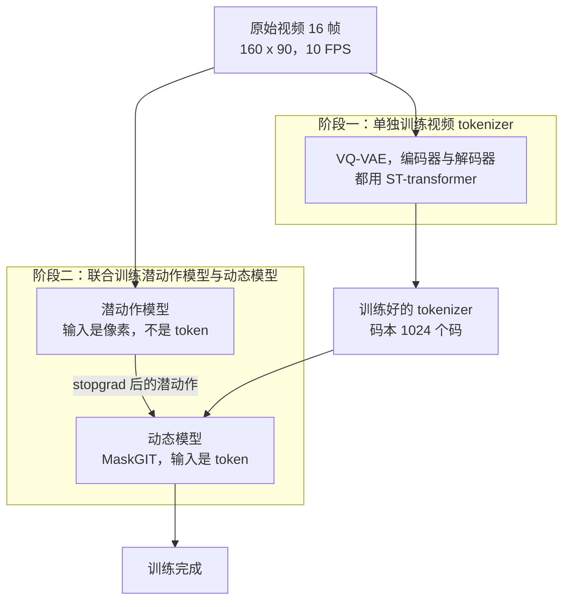
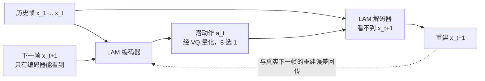
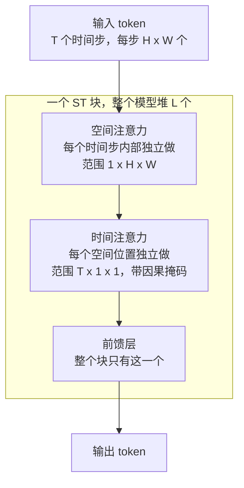
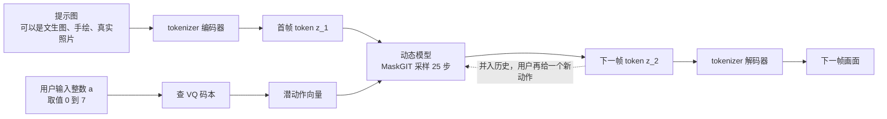
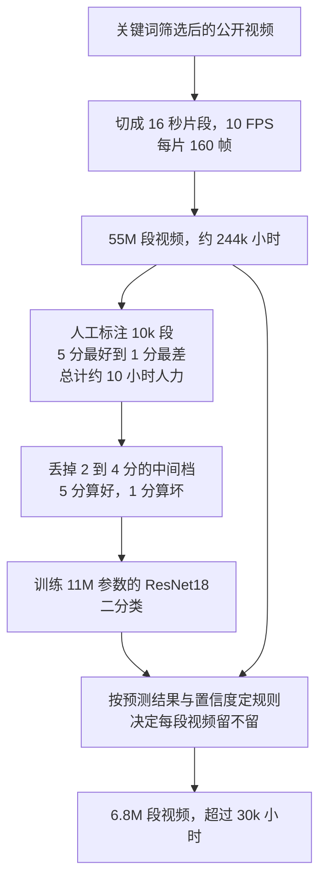
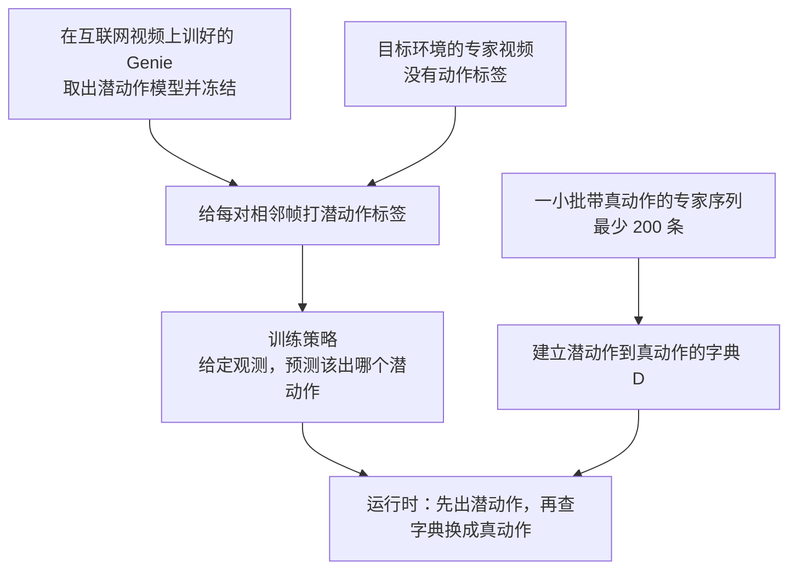

# Genie：一个动作标签都没有，它是怎么学出「按键」的

<!-- release-date: 2024-02-23 -->

> 本文依据 Google DeepMind 的 **Genie: Generative Interactive Environments**，本地原件是 ICML 2024 正式收录版（PMLR v235，第 4603–4623 页），共 21 页；同一篇工作的预印本是 arXiv:2402.15391v1（2024-02-23 提交，27 页）。页码一律指本地 PDF 自身的页码。文中会明确区分「报告写了什么」「我们如何解释或推算」和「外部资料补充」。
>
> 关于 `release-date`：Genie（第一代）从未通过官方 Web、App、API 或权重向公众开放使用——报告在 Impact Statement 里自己写明，团队选择不发布训练好的 checkpoint、训练数据集，也不发布数据样例（PDF p.9）。按本模块的约定，这种情况改用**该技术首次官方公开的日期**，即 2024-02-23：Google DeepMind 官方论文页把这篇的发表日期标为 February 23, 2024，与 arXiv v1 的提交日一致。证据链见文末。
>
> 另外，本地 PDF 首页页眉留着 Google DeepMind 内部模板的 `Proprietary + Confidential` 字样。这只是排版残留，正式收录进 ICML 会议论文集的版本里同样带着它，不代表这份材料不公开。

## 先把问题问对：什么叫「可交互」

先不谈任何新名词，做一个思想实验。

你手里有一个很强的视频生成模型。你给它一句「一个像素小人在洞穴里跑」，它吐出一段十六秒的视频，画面很漂亮，物理也大体说得过去。

现在你按一下键盘的左键。

什么都不会发生。

这就是视频生成模型和「环境」之间那道墙。视频生成模型接受的控制信号是**整段级别的**：一句文本、一张首帧、一个风格标签。你在开头把话说完，它把整段视频交给你，中间没有你插话的位置。

而一个游戏、一个仿真器、一个机器人训练环境，控制信号是**逐帧级别的**：你在第 37 帧按左键，第 38 帧的画面必须因此不同。

报告用一张只有三行的表把这件事讲得很干净（PDF p.2，表 1）：

| 模型类别 | 训练需要什么数据 | 可控粒度 |
|---|---|---|
| 世界模型 World Models | 视频 + 动作 | 帧级 |
| 视频模型 Video Models | 视频 + 文本 | 段级 |
| Genie | 只要视频 | 帧级 |

这张表就是整篇论文的论点。前两行是既有的两条路：想要帧级可控，就得有动作标签；只有视频和文本，就只能做到段级可控。Genie 声称的是第三种组合——**只用视频训练，却拿到帧级可控**。

## 六个词，先各用一句话说清

这是本模块第一篇世界模型方向的解读，后面会反复出现的词先在这里说人话。它们大多不是这篇论文发明的，属于读这份材料的前置背景。

- **世界模型（World Model）**：能够在给定动作的条件下预测下一帧画面的模型。它和「视频生成模型」的根本差别只有一条：**能不能在中途接受控制**。
- **动作标签（action label）**：某一帧到下一帧之间，操作者实际执行了什么。游戏里就是按了哪个键，机器人里就是发了什么控制指令。互联网视频普遍没有这个东西。
- **Token 与 tokenizer**：模型不直接吃像素，先把画面切成小块、编码成一串离散符号，这些符号叫 token，做这件事的模块叫 tokenizer。token 越少，后面的模型越跑得动。
- **VQ-VAE（Vector Quantized Variational Autoencoder，向量量化自编码器）**：一种把连续向量强行映射到「有限个候选向量」之一的自编码器。那份候选清单叫**码本（codebook）**，清单长度就决定了这个变量最多能有几种取值。Genie 用它把动作限制成 8 种。
- **自回归（autoregressive）**：一次生成一步，把生成结果接回输入，再生成下一步。Genie 的画面就是这样一帧一帧长出来的。
- **行为克隆（Behavioral Cloning，BC）**：最朴素的模仿学习——收集专家的「观测到动作」配对，用监督学习让策略去拟合它。文中用它来检验学出来的动作到底靠不靠谱。

要小心一个容易搞混的地方：**潜动作（latent action）并不是这篇论文造的词**。报告自己在相关工作里就点了好几项更早使用潜动作的工作（PDF p.8）。这篇真正新提出的名字只有 **生成式可交互环境（generative interactive environment）** 这个类别，以及 **ST-ViViT** 这个他们给自家 tokenizer 起的称呼。其余都是现成部件。

## 世界模型这条线到底在做什么

「世界模型」这个词现在被用得很泛，先按报告自己的定义收窄一下。

报告把世界模型定义为「能够在动作输入条件下预测下一帧」的一类模型（PDF p.8）。也就是说，它学的是一个函数：

$$
\hat x_{t+1} = f(x_{1:t},\ u_t)
$$

其中 $x_{1:t}$ 是到目前为止看到的画面，$u_t$ 是这一步执行的动作，$\hat x_{t+1}$ 是模型预测的下一帧。

它有什么用？报告给的理由很实在：这类模型可以用来训练智能体，让智能体在**不真正接触环境**的情况下学策略（PDF p.8）。真实机器人摔一次很贵，真实游戏跑一局很慢，而模型里可以跑得又快又便宜。

问题出在训练数据上。要学 $f$，你手上每一段视频都必须配一条动作序列 $u_{1:T}$。而这种数据只能从「你自己控制的环境」里录：你写一个仿真器，让 agent 在里面跑，动作是你自己发出去的，所以你知道它是什么。

互联网上有海量视频。但那些视频没有动作标签。

于是整个领域被卡在一个尴尬的位置上：**数据最多的地方，恰恰是标注最缺的地方**。报告点名的几项同期工作都在用不同方式绕这个坑（PDF p.8）：

- **GAIA-1 与 UniSim**：分别做自动驾驶和机器人操作的世界模型，但都需要文本和动作标签；
- **VPT**：先请人玩游戏并录下按键，用这批带标注的数据训一个逆动力学模型，再拿它去给互联网规模的视频自动打上动作标签，最后用打好标签的数据训策略。
- **PVG（Playable Video Generation）**：这条线已经在用「潜动作」的思路了，但报告说它们针对的是领域特定的静态样例，不是从提示生成全新环境（PDF p.8）。

VPT 的路子很聪明，但它有一个绕不开的前提：**你得先有人类的真实按键数据**。这批数据决定了动作空间是什么、有几个动作、每个动作意味着什么。换一个领域，就得重新采一批。

Genie 问的是更狠的一个问题：**能不能一条动作标签都不要？**

## 一句话说清 Genie 做了什么

Genie 从纯视频里学出一套「按键」，然后把这套按键交给你。

具体说，它同时学三样东西（PDF p.1、p.3）：

1. **潜动作模型（Latent Action Model，LAM）**：看相邻两帧之间发生了什么变化，把这个变化压缩成一个离散代码。这些代码就是学出来的「按键」，一共只有 8 个。
2. **视频 tokenizer**：把画面压成离散 token，让后面的自回归模型跑得动。
3. **动态模型（dynamics model）**：拿着「历史画面 token + 这一步的按键」，预测下一帧的 token。

推理时最有意思的一步是：**整个潜动作模型被扔掉，只留下那本 8 个条目的密码本**（PDF p.3）。用户输入一个 0 到 7 之间的整数，系统去密码本里查出对应向量，喂给动态模型。于是「按键」这件事就成立了。

如果只记一句话，可以记：

> **动作标签不一定要从外部拿。如果一个变量被放在「只有它能解释画面差异」的位置上，模型会自己把动作的含义填进去。**

规模上，报告最终训练的 Genie 是：动态模型 10.1B 参数，加上 tokenizer 与潜动作模型，合计 10.7B 参数，训练了 942B 个 token（PDF p.5）。摘要里写的「11B 参数」是这个数的四舍五入说法（PDF p.1）。

顺带一提，报告写的 tokenizer 200M、潜动作模型 300M、动态模型 10.1B 三项直接相加是 10.6B，与文中的 10.7B 差 0.1B，应该是各项分别四舍五入造成的（本文推算，PDF p.5）。

## 全景：两个训练阶段，三个模块

报告明确写了训练顺序：**先单独训视频 tokenizer，再拿训好的 tokenizer 去联合训练潜动作模型和动态模型**。而且潜动作模型是**直接从像素**学的，动态模型是**在 token 上**学的（PDF p.3）。

这张图由我们根据报告 2.1 节文字与 Figure 3（PDF p.3）重画，表达的是训练阶段与数据流的依赖关系，不代表实测时长或并行方式。报告只写了「先训 tokenizer，再联合训练另外两个模块」，没有明说第二阶段 tokenizer 是否完全冻结，图中按两阶段的字面顺序画。

三个模块的职责可以这样对齐：

| 模块 | 它回答的问题 | 参数量 | 页码 |
|---|---|---:|---|
| 视频 tokenizer | 这一帧长什么样，怎么用最少的符号写下来 | 200M | p.5 |
| 潜动作模型 | 从这一帧到下一帧，发生了什么「操作」 | 300M | p.5 |
| 动态模型 | 给定历史和这个操作，下一帧应该是什么 | 10.1B | p.5 |

参数量的分布已经说明了重心：**绝大部分算力花在「预测下一帧」上，学动作只花了 3% 不到**。这一点后面还会回来。

## 潜动作模型：把动作定义成「唯一能解释差异的东西」

这是整篇论文的核心，也是最容易被写空的地方，所以我们把它拆到机制层面。

### 旧问题

动作标签昂贵且不可迁移。你想让模型学会「按左键会怎样」，就得有人真的按过左键并留下记录。

### 新设计

报告的做法只有两句话（PDF p.3）：

- **编码器**读入所有历史帧 $x_{1:t}=(x_1,\cdots,x_t)$ **以及下一帧** $x_{t+1}$，输出一串连续的潜动作 $\tilde a_{1:t}$；
- **解码器**读入所有历史帧 $x_{1:t}$ 和潜动作 $\tilde a_{1:t}$，预测下一帧 $\hat x_{t+1}$。

注意这两句话的不对称：**编码器能看到未来，解码器看不到**。

这张图由我们根据报告 Figure 5 与 2.1 节文字重画（PDF p.3），是机制示意，不含实测数据。

### 工作机制：为什么这样就能挤出动作

把训练目标写清楚就明白了。解码器要重建 $x_{t+1}$，但它手上只有两样东西：历史 $x_{1:t}$，和一个很窄的向量 $\tilde a_t$。

历史里没有 $x_{t+1}$ 的信息——如果有，就不需要动作了。所以**所有「历史无法预测的那部分变化」，必须由 $\tilde a_t$ 承担**。报告的原话是：由于解码器只能访问历史和潜动作，$\tilde a_t$ 应当编码过去到未来之间**最有意义的变化**（PDF p.3）。

这就是信息瓶颈的标准用法。你不需要告诉模型「动作」是什么，你只需要在架构上留一个洞，并且保证这个洞是唯一的通路。

关键在于洞要足够窄。报告用 VQ-VAE 把潜动作离散化，并把码本大小 $|A|$ 限制到 8（PDF p.3）。为什么要这么小？报告给了两个理由：**允许人类可玩**，以及**进一步强化可控性**（PDF p.3）。

第一个理由是产品性的：8 个动作正好能映射到手柄上几个按钮，128 个动作没人玩得动。第二个理由是技术性的：洞越窄，模型越不可能把「下一帧的具体像素」偷偷塞进去。

把这个失效模式算一遍就更清楚了（本文推算）。8 个码意味着 $\tilde a_t$ 每一步最多携带 $\log_2 8 = 3$ 比特。而一帧 160×90 的画面，光是按 tokenizer 的配置就有约 920 个 token、每个 token 从 1024 个码里选，信息量在 $920 \times \log_2 1024 = 9200$ 比特这个量级。

3 比特对 9200 比特，差了三千多倍。**在这个比例下，潜动作根本不可能承载画面本身，它只能承载「这一步做了哪一类操作」。** 这就是瓶颈起作用的机制：不是模型「愿意」学动作，而是它除了学动作没有别的选择。

反过来想：如果把码本放大到几万个码、或者干脆用一个不量化的高维连续向量，最优解就会滑向「把 $x_{t+1}$ 压缩进去」——解码器重建得完美，潜动作却退化成一个画面缩略图，什么动作语义都没有。**离散化不是为了省显存，它是这条设计成立的必要条件。**

### 两个容易漏掉的实现选择

**第一，解码器故意做得很轻，而且不复用动态模型。** 报告说，用一个轻量解码器来学潜动作，比直接拿动态模型来当解码器更好；这个 LAM 解码器只是为了给潜动作模型提供训练信号，推理时完全不用（PDF p.3）。

这一步的含义值得掂量。如果用 10.1B 的动态模型当解码器，它自己的建模能力足够强，很可能不太依赖 $\tilde a_t$ 也能把下一帧猜得八九不离十——那样潜动作就学不出东西。**用一个弱的解码器，反而逼着潜动作携带更多信息**。报告只说了「we found it to be beneficial」，没有给这项的消融数字，所以这个解释是我们的推断。

**第二，推理时整个潜动作模型被丢弃，只留 VQ 码本**（PDF p.3）。这是「学出来的接口」和「用起来的接口」的分离：训练时潜动作是被推断出来的，推理时它是被用户指定的。

### 收益

- 训练数据的门槛从「视频 + 动作」降到「只要视频」，可用数据量直接放大到互联网规模；
- 动作空间是学出来的，不需要为每个新领域重新设计。报告在机器人数据上用**完全相同**的超参训了一版，同样学出了区分度明显的动作（PDF p.6）。

### 代价与边界

这里必须说清楚，否则「世界模型」就写空了。

**动作个数是硬上限。** 8 个就是 8 个。附录里有一句很重要的话：增加码的数量（也就是动作数量）是有好处的，代价是**对人类和 AI 智能体的可玩性下降**（PDF p.17）。报告没有给出不同 $|A|$ 的定量对比，所以我们只知道存在这个权衡，不知道曲线长什么样。

**动作的语义不可指定。** 你没法要求第 3 号动作是「跳」。报告能做的只是事后观察：在平台游戏上，四个动作被观察到分别对应 left、right、jump、no-op（PDF p.16，Figure 17）；在机器人数据上，三个动作被观察到对应 down、up、left（PDF p.7，Figure 13）。这是定性观察，报告**没有**给出「动作语义一致性」的量化指标。

**「一致性」的证据是间接的。** 报告说动作的含义在不同输入之间保持一致，理解潜动作的映射「就像学习一个新手柄上的按钮」（PDF p.4）。最硬的证据其实来自后面的行为克隆实验，而不是来自生成样例——这一点我们放到后面讲。

### 可迁移启发

这个设计模式可以脱离视频用：

> **当你需要一个「原本要靠标注才能得到」的中间变量时，先问：能不能把它放到一个位置上，使得只有它能解释输入与输出之间的差异？**

日志异常归因、A/B 实验的处理效应、推荐系统里的「用户意图」，都可以套这个模子。要点有三条：**通路必须唯一**（不能有旁路把信息漏过去）、**容量必须受限**（否则退化成复制）、**另一侧的模型不能太强**（否则它绕过你的中间变量也能拟合）。

## 视频 tokenizer：为什么必须把时间带进来

### 旧问题

自回归生成视频之前，得先把帧压成离散 token。以往的做法大多只做**空间压缩**：每帧独立编码，时间关系交给后面的模型处理（PDF p.4）。

这样做的问题是，压缩过程本身丢掉了运动信息。一个像素小人在第 5 帧和第 6 帧的位置差了两格，如果两帧各自独立编码，这个「差两格」的事实要靠后面的模型从两串 token 里重新推断。

### 新设计

Genie 的 tokenizer 是 VQ-VAE，但**编码器和解码器都用 ST-transformer**，把时间动态一起编进去（PDF p.4）。报告把这个结构叫 ST-ViViT。

由于 ST-transformer 的因果性，每个离散编码 $z_t$ 都包含视频中所有此前帧 $x_{1:t}$ 的信息（PDF p.4）。

这个性质很重要，它意味着 tokenizer 的输出不是「一帧的静态描述」，而是「到这一帧为止的状态描述」。

### 与 C-ViViT 的分歧

Phenaki 用的 C-ViViT 也是时间感知的 tokenizer，但报告说它计算开销大，成本随帧数**二次增长**；而 ST-ViViT 的主导项随帧数**线性增长**（PDF p.4）。

消融数据支持了这个判断（PDF p.8，表 3。三种 tokenizer 用相近参数量、patch size 10、batch 128、序列长 16，再用同一套动态模型与潜动作模型对比）：

| tokenizer | 参数量 | 显存 | FVD（越低越好） | $\Delta_t$PSNR（越高越好） |
|---|---:|---:|---:|---:|
| ViT（只做空间） | 230M | 0.3GB | 114.5 | 1.39 |
| C-ViViT | 225M | 1.6GB | 272.7 | 1.37 |
| ST-ViViT（Genie 的方案） | 205M | 0.9GB | 81.4 | 1.66 |

这张表很干净：ST-ViViT **参数最少、生成质量最好、可控性最好**，显存居中。

C-ViViT 的表现值得单独说一句。它用的是完整时空注意力，理论表达力最强，显存也最高，结果却最差。报告给的解释是它**倾向过拟合**，训练时需要很强的正则，这可能解释了它明显偏低的性能（PDF p.8）。

这是一个很有代表性的现象：**在数据规模和正则条件给定时，更强的表达力不自动等于更好的结果**。归纳偏置有时候是在帮你省数据。

### 边界

三个 tokenizer 只在这一组固定配置下比过一次，报告没有给出不同数据规模、不同 patch size 下的对照，也没有说明它们各自的最优正则设置是否都调过。所以更准确的读法是：**在这份配置下 ST-ViViT 赢了**，而不是「时空 tokenizer 普遍优于全时空 tokenizer」。

## 动态模型：MaskGIT、stopgrad，和一个反直觉的加法

动态模型是三个模块里最大的一个，但它的设计反而最「常规」：一个 decoder-only 的 MaskGIT transformer（PDF p.4）。

真正值得讲的是三个细节。

### 细节一：训练时随机遮住一半以上的 token

在每个时间步 $t$，模型读入 token 化的视频 $z_{1:t-1}$ 和潜动作 $\tilde a_{1:t-1}$，预测下一帧 token $\hat z_t$；损失是预测 token 与真值 token 之间的交叉熵（PDF p.4）。

训练时，输入 token $z_{2:T-1}$ 会按一个**从 0.5 到 1 之间均匀采样**的遮蔽率被随机遮住（PDF p.4）。

为什么最低也要遮掉一半？因为推理时模型面对的是**全部遮住**的下一帧——它必须从零开始把整帧填出来。如果训练时只遮 15%，模型学到的是「补全少量空缺」，和推理任务对不上。把遮蔽率的下界抬到 0.5，训练分布才覆盖得住推理分布。

推理时，每一帧用 25 步 MaskGIT 采样，温度 2，随机采样（PDF p.5）。也就是说，一帧不是一次生成完的，而是分 25 轮逐步把 token 填满。

### 细节二：潜动作进来时带 stopgrad

报告写得很轻，只在一句话里：动态模型读入的是 token 化视频和 **stopgrad 之后的**潜动作（PDF p.4）。

stopgrad 的意思是：动态模型的梯度不会回传到潜动作模型。

这个选择的后果很直接。潜动作模型只对**自己那条重建路径**负责，不会被动态模型的损失牵着走。如果没有这道闸，10.1B 的动态模型完全可能把潜动作空间「拉」成一个方便它自己降低损失、但对人类毫无意义的编码。

报告没有做这一项的消融，所以「stopgrad 保护了动作语义」是我们的解释，不是论文结论。但它和前面「用轻量解码器」的选择指向同一个意图：**刻意不让最强的那个模块去决定动作空间长什么样**。

### 细节三：动作用加法接入，不是拼接

报告点名了一个常见做法：训练世界模型时，通常把 $t$ 时刻的动作**拼接**到对应帧上（PDF p.4）。

Genie 不这么做。它在潜动作模型和动态模型里都把潜动作当作**加性嵌入（additive embedding）** 处理，报告称这有助于提升生成的可控性（PDF p.4）。

为什么加法可能更好？拼接会把动作放进一个独立的维度子空间，模型可以选择基本忽略它；加法则把动作直接叠到每个位置的表示上，动作的影响无处可躲。这个解释是我们的推断，报告只给了结论，没有给消融数字。

## ST-transformer：这套架构能成立的成本前提

前面三个模块全都建立在同一个骨架上。这一节讲它，因为**没有这个骨架，前面的设计根本跑不动**。

### 旧问题

视频的 token 数量非常大。报告直接给了量级：视频可以包含高达 $O(10^4)$ 个 token（PDF p.2）。而 transformer 的注意力显存开销是二次的。

这个量级不是虚指。我们可以从报告自己的数字反推出来（本文推算）：报告说 batch 128 / 256 / 448 分别对应 1.9M / 3.8M / 6.6M 个 token（PDF p.5），三者相除都指向**每个训练序列约 14,720 个 token**；再除以 16 帧，得到**每帧约 920 个 token**。

这个数还能交叉验证两次：

- $512 \times 125{,}000 \times 14{,}720 = 942{,}080{,}000{,}000$，正好是报告说的 942B token（PDF p.5）；
- $256 \times 200{,}000 \times 14{,}720 \approx 754\text{B}$，与附录说的「750B 训练 token」吻合（PDF p.18）。

三处独立数字全部对上，说明 14,720 这个推算是可靠的。而 $920 = 40 \times 23$，正好是 160 宽、90 高的帧按 patch size 4 切出来的网格（$160/4=40$，$90/4$ 向上取整为 23），与报告给的分辨率和 patch size 自洽（本文推算，PDF p.4–5、p.18）。

### 新设计

ST-transformer 由 $L$ 个时空块组成，每个块里是**交错的空间注意力层和时间注意力层，后面跟一个前馈层**（PDF p.2）：

- **空间层**：在每个时间步内部，对 $1 \times H \times W$ 个 token 做注意力；
- **时间层**：对同一个空间位置、跨 $T$ 个时间步的 $T \times 1 \times 1$ 个 token 做注意力，并且带因果掩码。

这张图由我们根据报告 Figure 4 与 2 节文字重画（PDF p.2–3），是结构示意，不代表实测开销。注意报告特别说明：块里**只在空间和时间两部分之后放一个前馈层，省掉了空间之后的那个前馈层**，为的是把参数预算让给模型的其他部分，他们观察到这样明显改善结果（PDF p.3）。

### 收益有多大

报告只给了定性结论：主导计算复杂度的空间注意力层，随帧数**线性**增长而非二次增长（PDF p.2）。我们可以把账算出来（本文推算）。

设一段视频有 $T$ 帧、每帧 $N = H \times W$ 个 token。完整时空注意力的代价正比于：

$$
(TN)^2 = T^2 N^2
$$

ST-transformer 的代价则是两部分之和——空间层是 $T$ 次规模为 $N$ 的注意力，时间层是 $N$ 次规模为 $T$ 的注意力：

$$
T \cdot N^2 + N \cdot T^2
$$

两者相除：

$$
\frac{T N^2 + N T^2}{T^2 N^2} = \frac{1}{T} + \frac{1}{N}
$$

代入 Genie 的实际配置 $T=16$、$N=920$，得到约 $0.0625 + 0.0011 \approx 6.4\%$。也就是说，同样的 token 数下，ST 结构的注意力开销大约只有完整时空注意力的十六分之一。

表 3 里 C-ViViT 的显存是 ST-ViViT 的 1.8 倍（PDF p.8），方向与这个式子一致。不过要注意，显存里还包含权重和其他激活，实测倍数不会等于上面这个纯注意力的比例。

### 代价

省下来的东西是有代价的：**空间层看不到别的帧，时间层看不到别的位置**。一个物体从画面左边移动到右边，这种「跨位置又跨时间」的关系，必须靠多层堆叠间接建立，不能在一层里一步到位。

报告没有测量这个损失。它只报告了最终指标好，没有给出「如果用完整时空注意力，同样算力下会怎样」的对照——表 3 里的 C-ViViT 参数相近但**算力预算不相近**，所以那不是一个干净的等算力对比。

## 推理：把学出来的接口交到用户手上

训练讲完了，看运行时（PDF p.4）。

这张图由我们根据报告 Figure 8 与 2.2 节文字重画（PDF p.4），是机制示意，不代表帧率或延迟。

几个必须点出来的事实：

- **用户给的是一个整数，不是一个向量**。玩家在 $[0, |A|)$ 里挑一个离散值，系统用它去索引 VQ 码本（PDF p.4）。
- **第一次玩的时候，没人知道哪个数字对应什么**。报告很坦率：初次与模型交互时，并不清楚每个潜动作会如何影响下一帧的生成；但他们发现每个动作的含义在不同输入之间保持一致，因此解读潜动作的映射就像学习一个新手柄上的按钮（PDF p.4）。
- **提示帧的数量可以不止一张**。报告在脚注里说明，模型可以在不同数量的提示帧上条件化，正文只是拿一张图举例（PDF p.4 脚注 1）。
- **可以复现，也可以改写**。把数据集里的起始帧和推断出的动作一起喂回去，就能重新生成原视频；改动作，就得到全新的轨迹（PDF p.4）。

最后这一条其实是潜动作模型「学对了」的一个便宜自检：如果推断出的动作序列能把原视频复现出来，说明这条窄通路确实装下了帧间变化。

### 「约 1 FPS」这个数字是从哪来的

报告只说 Genie 目前运行在大约 1 FPS，需要未来的进展才能达到适合交互的帧率（PDF p.9），没有给硬件配置和延迟拆解。但把已知的三个数放在一起，量级就清楚了（本文推算）：

- 每生成一帧要跑 **25 步** MaskGIT 采样（PDF p.5）；
- 每一步都是动态模型的一次完整前向，而序列里有多达 16 帧、约 14,720 个 token；
- 动态模型有 **10.1B** 参数（PDF p.5、p.19）。

也就是说，**一帧画面的成本大约是一次大模型前向的 25 倍**。语言模型生成一个 token 只需要一次前向，Genie 生成一帧需要 25 次；而这一帧在交互上只对应用户的一次按键。

这也直接指出了三个可以拧的旋钮：减少 MaskGIT 步数（牺牲画质）、缩短上下文（牺牲一致性）、缩小模型（牺牲能力）。报告没有报告任何一档的实测结果，所以这里只是把成本结构写出来，不是给出优化方案。

## 数据：30k 小时是从 244k 小时里筛出来的

Genie 的主数据集叫 Platformers，来自公开互联网上的 2D 平台跳跃游戏视频。

### 采集规则

报告把筛选条件写得很具体（PDF p.16）：

- 标题包含与 2D 平台游戏相关的关键词；
- 标题或描述必须含有一个动作词，例如 speedrun、playthrough；
- 标题不得包含否定词，例如 movie、unboxing。

三条规则各司其职：第一条定题材，第二条保证这是**实际游玩过程**而不是预告片，第三条排除同名的电影与开箱视频。选关键词时他们还人工抽查过结果，确认产出的主要是 2D 平台游戏画面（PDF p.16）。

每段视频切成 16 秒、10 FPS 的片段，也就是每片 160 帧。这一步得到 55M 段视频，约 244k 小时（PDF p.16）。

### 质量过滤：用 10 小时人力换一个分类器

报告说，数据集里很多视频质量很差，影响了模型性能，于是他们做了一条可扩展的过滤流水线，方法参考 VPT（PDF p.16）。

「高质量」的定义是：画面清楚展示游玩过程，且不含菜单界面、主播人脸这类干扰物（PDF p.16）。

这张图由我们根据报告附录 B.1 重画（PDF p.16–17），四个数量与人力投入均为原文数字。

这条流水线里有两个动作特别值得学。

**第一，把中间档整段扔掉。** 只用 5 分和 1 分训分类器，2 到 4 分的样本全部删除（PDF p.17）。中间档是标注噪声最大的地方——不同标注者对「还行」的判断差异远大于对「很好」和「很差」的判断。**扔掉最模糊的样本，比想办法给它们定一个精确阈值更划算**。

**第二，最终决定不是「分类器说好就要」，而是「按预测结果与置信度定一条规则」**（PDF p.17）。报告没有公开这条规则的具体阈值。

### 结果

过滤后剩下 6.8M 段视频、超过 30k 小时，只有原始数据集的**十分之一出头**（PDF p.17）。

而报告给的对照是（PDF p.17，表 4）：

| 数据集 | 模型参数量 | FVD（越低越好） |
|---|---:|---:|
| 原始数据集（55M 段） | 580M | 61.4 |
| 过滤后数据集（6.8M 段） | 580M | 54.8 |

**用十分之一的数据，训出更好的模型。** 报告把这条结论和 VPT、DINOv2 的发现放在一起，称之为质量胜过数量（PDF p.17）。

要注意这张表的边界：它用的是 580M 参数的模型，不是最终的 11B；而且只报了 FVD 一个指标，没有报可控性。所以它证明的是「在这个规模上，过滤有效」，不是「过滤在任何规模上都有效」。

另外，报告没有公开被过滤掉的游戏分布、关键词全表、有没有做去重、以及训练集与展示样例之间的重叠检查。

### 第二份数据：机器人视频

为了验证方法的通用性，报告还用了 RT-1 的机器人数据集：约 130k 条机器人演示，加上一份仿真数据，再加上此前工作的 209k 条真实机器人 episode（PDF p.5）。

关键的一句是：**他们不使用这些数据集里的任何动作，只把它们当作视频**（PDF p.5）。这批数据本来是有动作标签的，作者刻意不用——这样才构成对「无需动作标签」的干净验证。

在这份数据上，报告说他们用**在 Platformers 上找到的最佳超参**训了一个 2.5B 模型，测试集 FVD 82.7；模型不但学会了机械臂的控制，还学会了各种物体的交互与形变（PDF p.6）。Figure 12 展示了一个薯片袋在机械臂反复施力下被压变形的十步轨迹（PDF p.7）。

「超参不用重调」这一条，比 FVD 数字更值得记。**它说明潜动作这套机制没有依赖平台游戏的领域先验**——如果换个领域就得重新搜一遍超参，那这个方法的通用性就要打折扣。

顺带指出一个报告自己没有并排放的对照：消融表里 Robotics 上 1B 的像素输入模型 FVD 是 136.4（PDF p.8，表 2），而这个 2.5B 模型是 82.7（PDF p.6）。两者相差近一半。但报告没有说明这两个 FVD 是否在同一个划分、同一套评测协议下算的（82.7 明确写了是 test split，表 2 没写），所以**不能**把它当成一条干净的规模收益证据（本文判断）。

## 训练规模：数字全表

把散落各处的配置汇总（PDF p.5、p.17–19）：

| 项目 | 取值 | 页码 |
|---|---|---|
| 视频 tokenizer 参数量 / patch size / 码本 | 200M / 4 / 1024 个码，嵌入维 32 | p.5 |
| 潜动作模型参数量 / patch size / 码本 | 300M / 16 / 8 个码，嵌入维 32 | p.5 |
| 序列长度 / 帧率 / 分辨率 | 16 帧 / 10 FPS / 160×90 | p.4–5 |
| 训练精度与稳定性技巧 | bfloat16，动态模型用 QK norm | p.5 |
| 推理采样 | 每帧 25 步 MaskGIT，温度 2，随机采样 | p.5 |
| 最终 Genie 动态模型 | 10.1B，48 层，36 头，$d_{model}$ 5120，k/q 128 | p.19 |
| 最终训练配置 | batch 512，125k 步，256 块 TPUv5p | p.5 |
| 最终训练算力 | $6.6 \times 10^{22}$ FLOPs | p.19 |
| tokenizer 优化器 | AdamW + cosine decay，300k 步，lr 恒定 3e-4，warmup 10k | p.18 |
| 动态模型优化器 | max lr 3e-5，min lr 3e-6，$\beta_1=0.9$，$\beta_2=0.9$，weight decay 1e-4，warmup 5k | p.18 |

有两个对比很有意思。

**tokenizer 的 patch size 是 4，潜动作模型的 patch size 是 16。** patch 边长差 4 倍，意味着同一帧切出来的 patch 数量差 16 倍——潜动作模型看到的空间网格比 tokenizer 粗得多（本文推算）。报告没有解释这个选择。我们的推断是：判断「这两帧之间发生了什么操作」不需要像素级细节，粗网格既够用又便宜；而且瓶颈只有 3 比特，输入再精细也传不过去。但这只是推断，报告未做消融。

**tokenizer 的学习率上下限都是 3e-4**（PDF p.18，表 8），也就是实际上不衰减；而动态模型是 3e-5 衰减到 3e-6。两者相差一个数量级，且策略不同。报告没有解释。

另外，报告还提到 tokenizer 训练时**扩大解码器比扩大编码器更有效**，增大 batch size 只有边际收益（PDF p.17）；表 6 给的对照是 batch 64 时 PSNR 35.7，batch 384 时 36.5，而算力从 $4.22\times10^{20}$ 涨到 $2.57\times10^{21}$（PDF p.17）。六倍算力换 0.8 个 PSNR，这就是「边际」的具体含义。

## Scaling：证明了什么，没证明什么

### 报告做了两组实验

**模型规模**：固定 tokenizer 和潜动作模型的架构，把动态模型从 40M 扩到 2.7B。所有模型都用 batch 256、训 200k 步，每次运行共 750B 个训练 token（PDF p.5、p.18）。

完整配置表（PDF p.19，表 10）：

| 参数量 | 层数 | 头数 | $d_{model}$ | k/q size | 训练硬件 | 训练时长 | FLOPs |
|---:|---:|---:|---:|---:|---|---|---:|
| 41M | 18 | 8 | 512 | 64 | 64 TPUv2 | 3 天 | $2.05\times10^{20}$ |
| 96M | 16 | 16 | 768 | 64 | 64 TPUv2 | 6 天 | $3.58\times10^{20}$ |
| 192M | 20 | 18 | 1024 | 64 | 64 TPUv2 | 9 天 | $6.4\times10^{20}$ |
| 404M | 21 | 12 | 1536 | 128 | 64 TPUv2 | 18 天 | $1.2\times10^{21}$ |
| 811M | 20 | 20 | 2048 | 128 | 128 TPUv3 | 7 天 | $2.2\times10^{21}$ |
| 1.6B | 28 | 22 | 2560 | 128 | 128 TPUv3 | 12 天 | $4.04\times10^{21}$ |
| 2.7B | 36 | 22 | 3072 | 128 | 256 TPUv3 | 16 天 | $6.91\times10^{21}$ |

**Batch 规模**：固定一个 2.3B 的模型（34 层、20 头、$d_{model}$ 2560），只改 batch，取 128 / 256 / 448，分别对应 1.9M / 3.8M / 6.6M 个 token（PDF p.5、p.19）。

结论是：模型每增大一档，最终训练损失就一致下降；增大 batch 也带来类似的正向收益（PDF p.5，Figure 9）。

### 这组实验的边界，比结论更值得记

**第一，纵轴是训练损失，不是生成质量。** Figure 9 的三张图画的都是 training loss（PDF p.5）。报告**没有**给出 FVD 或 $\Delta_t$PSNR 随模型规模变化的曲线。「损失下降」和「视频更好看、更可控」之间的关系，这篇报告没有测。

**第二，横轴的算力只由模型大小决定。** 因为所有 scaling 点都是 200k 步、batch 256、750B token，模型越大算力越大，两者是绑死的。所以这不是一条等算力最优曲线（compute-optimal frontier），而是**等 token 数下的模型规模对照**。想从这张图读出「给定算力应该选多大模型」，读不出来。

**第三，硬件不是常量。** 表 10 里 41M 到 404M 用 64 块 TPUv2，811M 和 1.6B 用 128 块 TPUv3，2.7B 用 256 块 TPUv3（PDF p.19）。batch 实验里三个 batch 分别跑在 64 TPUv3、128 TPUv3 和 64 TPUv5p 上（PDF p.19）。报告明说 batch 实验「三次运行的唯一差别是硬件」——但严格说，硬件不同意味着数值行为也可能不同，这个对照不是完全干净的。

**第四，所有对照实验都不在最终模型的规模上做。** batch 实验用的是 2.3B，两张消融表用的是 1B 到 2.5B，scaling 实验最大只到 2.7B（PDF p.5、p.8、p.19），而最终 Genie 的动态模型是 10.1B。也就是说，**报告里几乎所有可比较的数字都来自 1B–2.7B 量级，10.1B 那一档只有定性展示**。

**第五，Figure 9 的具体数值只能读图。** 我们从图里读到的最终训练损失量级在 0.0018 到 0.0025 之间，随模型增大单调下降（PDF p.5，读图所得）。报告正文没有给这些数值的表格，所以本文不引用精确值。

## 两个指标，各自只说了一件事

报告用两个指标衡量视频生成（PDF p.5）。

**FVD（Frechet Video Distance）** 衡量视频保真度，也就是生成质量。报告引用的理由是它与人类对视频质量的评价有较高一致性（PDF p.5）。

**$\Delta_t$PSNR** 是报告自己定义的可控性指标：

$$
\Delta_t \text{PSNR} = \text{PSNR}(x_t, \hat x_t) - \text{PSNR}(x_t, \hat x_t')
$$

其中 $x_t$ 是真值帧，$\hat x_t$ 是用**从真值帧推断出的**潜动作生成的帧，$\hat x_t'$ 是用**随机采样的**潜动作生成的帧。所有实验取 $t=4$（PDF p.5）。

翻译成人话：**用「对的动作」生成的帧，比用「乱按的动作」生成的帧，更接近真实画面多少。** 差值越大，说明动作真的在起作用。

这个指标设计得很巧，但它的边界必须说清楚：

- 它衡量的是「动作**有没有**影响画面」，不是「动作影响得**对不对**」。一个把 8 个动作全都映射成「画面剧烈抖动」的模型，也能拿到很高的 $\Delta_t$PSNR。
- 它依赖 PSNR，而 PSNR 是逐像素指标，对轻微位移非常敏感。
- 报告只在 $t=4$ 上报告，没有给出随 $t$ 变化的曲线。

更重要的是：**报告全篇没有人类评测。** 「可玩性」「动作语义一致」这些说法，靠的是作者展示的样例和读者自己看图，没有一个量化的人类研究支撑。这是这篇论文最大的证据缺口之一（本文判断，依据是报告的实验节与附录里都没有出现人类评测协议）。

## 消融：两张表各证明了一件不同的事

### 潜动作模型该看像素，还是看 token

这是一个很自然的工程问题：既然已经有 tokenizer 了，潜动作模型为什么不直接吃 token？省一次编码，还共享表示。

报告认真比了（PDF p.8，表 2）：

| 潜动作模型输入 | 数据集 | 参数量 | FVD（越低越好） | $\Delta_t$PSNR（越高越好） |
|---|---|---:|---:|---:|
| token | Platformers | 2.3B | **38.8** | 1.33 |
| 像素（Genie） | Platformers | 2.5B | 40.1 | **1.91** |
| token | Robotics | 1B | 257.8 | 1.65 |
| 像素（Genie） | Robotics | 1B | **136.4** | **2.07** |

这张表最值得注意的地方是**它没有全赢**。在 Platformers 上，token 输入的 FVD 反而更好（38.8 对 40.1）。报告的处理方式是诚实承认：token 输入模型在 Platformers 上取得了略低的 FVD，但这个优势在 Robotics 上没有保持；更重要的是，两个环境下 token 输入的可控性都更差（PDF p.7–8）。

报告给的解释是：一些关于视频动态和运动的信息可能在 tokenization 过程中丢失了，因此让潜动作模型直接读原始视频是有益的（PDF p.8）。

这个解释和前面 tokenizer 那节是一致的：tokenizer 是为了**重建质量**优化的，它保留的是「画面长什么样」，不保证保留「画面怎么变的」。

要提醒一个对照的不干净处：Platformers 那两行参数量是 2.3B 和 2.5B，不完全相等（PDF p.8）。差距不大，但严格说这不是等参数对照。

### 这两张消融表合起来说明的事

表 2 和表 3 讲的其实是同一个主题的两面：

- 表 3 说：**tokenizer 必须带时间**，否则可控性和保真度都掉；
- 表 2 说：**潜动作模型不能只看 tokenizer 的输出**，否则可控性掉。

合起来的结论是：运动信息很脆弱，压缩链条上每多一道，它就少一点。**谁需要运动信息，谁就应该尽量靠近原始信号。**

## 潜动作的第二个用途：拿它去训智能体

这一节是全篇论证里最硬的一块证据，但很容易被当成附带成果读过去。

### 实验怎么做的

思路是：**如果学出来的潜动作真的是「动作」，那它应该能当作动作标签用。**

流程是（PDF p.7、p.19）：

1. 取一个在互联网视频上训练好的 Genie，把它的潜动作模型**冻结**；
2. 拿一批目标环境里的专家视频（**没有动作标签**），用冻结的潜动作模型给每一对相邻帧打上离散潜动作 $a_t \leftarrow \text{LAM}(x_t, x_{t+1})$；
3. 训练一个策略 $\pi(a_t \mid x_t)$，预测专家在观测 $x_t$ 下会采取哪个潜动作；
4. 推理时需要把潜动作转成真动作。用**一小批**带真动作标注的专家序列 $\langle x_t, u_t, x_{t+1}\rangle$，用潜动作模型算出 $a_t$，建一张字典 $D$，把每个潜动作映射到对应的真动作列表；
5. 执行时：$a_t \sim \pi(x_t)$，再取 $u_t \sim D[a_t]$。

这张图由我们根据报告 3.3 节与附录 E.1 重画（PDF p.7、p.19），是流程示意，不含实测数据。

评测环境是 Procgen 的 CoinRun，分 easy 和 hard 两档；对照是拿得到专家真动作的 oracle 行为克隆模型（上界）和随机智能体（下界）（PDF p.7）。专家数据来自一个用 R2D2 训练的智能体（PDF p.19）。

### 结果

报告的结论是：基于潜动作的策略**达到了与 oracle 相同的分数**，并且只需要少至 200 条专家样本就能完成适配，尽管它几乎肯定从未见过 CoinRun（PDF p.7）。

Figure 15 的曲线（PDF p.7，以下数值为读图所得，报告正文未给表格）：

- **easy 档**：oracle 约 54.5%，随机约 33.5%；潜动作策略在 0 条专家标注时约 25%，100 条时跳到约 47%，之后在 50% 到 55% 区间波动；
- **hard 档**：oracle 约 51.5%，随机约 25%；潜动作策略在 100 条时约 45%，之后稳定在 50% 上下。

纵轴是 100 次采样中解出的关卡百分比，跨 5 个随机种子平均，带 95% 置信区间（PDF p.7）。

### 为什么这个实验比生成样例更有说服力

报告自己点出了关键：这提供了学到的潜动作是一致的证据，**因为从潜动作到真动作的映射不包含任何关于当前观测的信息**（PDF p.7）。

这句话值得慢读。字典 $D$ 是一张查表，输入只有潜动作编号，没有画面。如果同一个潜动作编号在不同画面下意思会变，这张查表就不可能工作。**它能工作，就说明潜动作的语义是全局稳定的。**

对比一下：生成样例里「同一个动作在四张不同起始帧下都让角色向左」是靠人眼看图判断的，而这个实验把「一致性」变成了一个**可以掉分的数值任务**。

### 边界

- CoinRun 是 2D 平台跳跃环境，和训练数据的题材同类。报告说模型「几乎肯定从未见过 CoinRun」，这指的是这个具体游戏，不是这个游戏类型。跨到完全不同的动作空间（比如连续控制的机械臂）会怎样，报告没有测。
- oracle 本身只有 50% 出头。也就是说，「达到 oracle 水平」的天花板不高，这个任务本身没有被解掉。
- 策略网络本身用的是 ST-ViViT 编码器，序列长 4，batch 16（PDF p.20）；oracle 在推理时有 10% 概率随机采样动作会表现更好（PDF p.20）——这些细节说明两边的调优程度未必完全对等。

## 「第一个」和「基础世界模型」这两个说法，各自成立到什么程度

摘要里有两个很强的措辞，值得逐个对着证据看一遍。

**「第一个以无监督方式从无标注互联网视频训练出来的生成式可交互环境」**（PDF p.1）。这句话里的限定词一个都不能去掉。潜动作本身不是新想法——报告自己在相关工作里点名了 PVG 这条线，那里的潜动作同样用于控制从视频里学出的世界模型（PDF p.8）。真正的差别报告也写清楚了：PVG 及相关工作面对的是**领域特定的静态样例**，而不是通过提示生成全新环境；把方法推到这个尺度需要非平凡的架构改动，用**放弃归纳偏置**换来一个通用方法（PDF p.8）。

所以更准确的读法是：**新的不是「潜动作」这个零件，而是「潜动作 + 互联网规模数据 + 可提示生成」这个组合**。

**「在 11B 参数量级，Genie 可以被视为一个基础世界模型」**（PDF p.1）。这个判断的依据是什么？报告给的证据是它表现出基础模型的典型性质——可以拿一张没见过的图当提示，创造并进入完全想象出来的虚拟世界（PDF p.2）。定性证据是三类分布外提示都能玩起来：文生图产物、手绘草图、真实照片（PDF p.6，Figure 10）。

这条证据链是**定性的**。报告没有做泛化能力的量化评测，也没有和任何别的模型做过并排对比——全文没有出现一张跨模型的性能表。所以「基础世界模型」在这篇里是一个**定位声明**，不是一个被测量出来的结论（本文判断，依据是全文实验节只有内部消融与 scaling，没有外部基线对照）。

值得注意的是，报告本身并没有回避这一点。它把「这是个新范式」和「这个具体模型还很弱」分开写了：结论一节把 16 帧记忆、约 1 FPS、会幻觉三条限制摆得很直白（PDF p.9）。**一篇论文最有说服力的时候，往往是它自己划边界比读者更狠的时候。**

## 报告自己承认的限制

报告的结论一节写得很直接（PDF p.9）：

- **会幻觉出不真实的未来**。Genie 继承了自回归 transformer 的一些弱点。
- **只有 16 帧的记忆**。这使得在长时程上保持环境一致变得困难。16 帧、10 FPS，就是 1.6 秒。你走出画面再走回来，模型没有义务记得原来那里有什么。
- **大约 1 FPS**。报告写「Genie currently operates around 1FPS」，需要未来的进展才能达到适合交互的帧率。也就是说，按一次键要等一秒。

这三条限制里，第二条是架构直接决定的：序列长度就是 16，时间注意力的范围就是这 16 帧。第三条是成本决定的：每帧要跑 25 步 MaskGIT 采样（PDF p.5），而模型有 10.1B 参数。

还有一条不在「限制」小节、但同样是硬约束的：**分辨率 160×90**（PDF p.4）。这个数字比大多数手机截图都小。

## 报告没有写的

区分「报告没做」和「报告做了但没说」很重要。以下都是本文核对全文与附录后确认的缺口：

- **没有任何人类评测**。可玩性、动作语义、交互体验全部靠样例展示。
- **没有 $|A|$ 的定量消融**。只有附录一句「增加码数有好处，代价是可玩性下降」（PDF p.17），没有数字。
- **没有 tokenizer 和潜动作模型的 scaling 曲线**。scaling 实验只扩动态模型，另外两个模块的架构是固定的（PDF p.5）。
- **没有 FVD 随模型规模的曲线**。scaling 只报训练损失。
- **没有公开 FVD 的评测协议细节**：参考分布是哪一批视频、采样多少条、用哪个特征提取网络，都没写。所以表 2、表 3、表 4 里的 FVD 只能横向比较，不能和别的论文的 FVD 数字对照。
- **没有 stopgrad、加性嵌入、轻量解码器这三项的消融**。它们都只有一句结论。
- **没有代码、权重、数据集，也没有数据样例**。报告在 Impact Statement 里明说这是有意选择，理由是希望先与研究社区和游戏社区充分沟通，确保未来的发布是尊重、安全和负责任的（PDF p.9）。
- **没有失败案例分析**。全文没有展示一个生成崩坏的例子。

报告给的补偿是附录 F 的**可复现小例子**：在 Procgen CoinRun 上收集 10M 条转移（hard 模式、随机策略、种子 0 到 10,000、每关 1,000 步），用**一块中端 TPU 或 GPU、一周之内**训完一套完整的 tokenizer + 潜动作模型 + 动态模型（PDF p.20）。tokenizer 用 batch 48 条长度 16 的序列（合 768 张图），三天跑完 300k 步，能塞进 16G 显存；潜动作与动态模型再并行训 200k 步，batch 36 条序列合 576 张图（PDF p.20–21）。

这个小例子的动作码本是 6 个，不是主实验的 8 个（PDF p.21，表 16）。报告没有解释为什么。

**把「我们不发布模型」和「我们给你一份能在一块卡上跑通的配方」放在一起看，这是一个有分寸的处理方式**：核心资产不放，但让别人能验证方法本身是否成立。

## 读原件时会撞到的几处不一致

这一节是给真的会去翻 PDF 的人准备的。我们逐页核对时发现几处对不上的地方，先说清楚哪些是原本就有的、哪些是会议版新出现的。

- **机器人模型的参数量有两个说法**。同一页上，3.2 节开头写「在 Robotics 数据集上训练的更小的 **1.3B** 模型」，往下几段又写「我们在 Robotics 数据集上训练了一个 **2.5B 参数**的模型」（PDF p.6）。逐页比对显示，arXiv v1 在第一处只写「a smaller model」没有给数字，**1.3B 是会议版新加上去的**，而它与同页的 2.5B 冲突。表 2 里 Robotics 那两行标的是 1B，但那是消融用的独立模型，不是这个（PDF p.8）。
- **一处图号引用错了**。3.2 节说机器人模型的动作一致性「如 Figure 17 所示」（PDF p.6），但 Figure 17 是 Platformers 的动作示例（PDF p.16），机器人的是 Figure 13（PDF p.7）。arXiv v1 这里写的是 Figure 13，**这个错误是会议版重排图号时引入的**。
- **Figure 1 和 Figure 2 在两个版本里互换了**。会议版的 Figure 1 是 Diverse trajectories、Figure 2 是 A whole new world；arXiv v1 正好相反。其余图号与全部 17 张表的编号在两版之间一致。
- **TPU 型号写法不统一**。正文写 256 块 TPUv5p（PDF p.5），附录同一件事写 256 TPUv5（PDF p.19）。两个版本都是这样。
- **表 17 有一行标签重复**。CoinRun 动态模型的架构行列了 `num_layers 12`、`d_model 512`、`num_layers 8`，第三行按上下文应为头数（PDF p.21）。两个版本都是这样。

这些都是小瑕疵，不影响主结论，但如果你引用数字，得知道该引哪个。

## 可迁移启发

### 一、缺标注时，先找「唯一能解释差异的位置」

潜动作模型不是靠更聪明的标注工具解决问题的，它是靠**架构安排**：把一个窄变量放在信息通路的咽喉上，剩下的交给优化器。

要复用这个模式，三个条件缺一不可：通路唯一、容量受限、另一侧不能太强。Genie 三条都做到了——解码器看不到未来、码本只有 8 个、解码器故意做得轻。

### 二、不要让最强的模块去定义中间表示

stopgrad 和轻量解码器指向同一件事：**10.1B 的动态模型如果能影响动作空间，动作空间就会被优化成对它方便的样子，而不是对人方便的样子。**

任何「一个大模型 + 一个可解释中间层」的系统都会遇到这个张力。工程上的对策是切断梯度、限制容量、或者干脆用一个弱模块来定义那个中间层。

### 三、压缩链条上每多一道，运动信息就少一点

表 2 和表 3 是同一个道理的两面。tokenizer 是为重建优化的，它保「像什么」不保「怎么变」。所以需要运动信息的模块要尽量靠近原始信号。

推广一步：**任何有损中间表示都是有偏好的。用它之前先问，它是为了什么目标被优化的，你要的东西在不在那个目标里。**

### 四、数据清洗的粒度决定了它能不能扩到互联网规模

10 小时人力标 10k 段视频，蒸馏成一个 11M 参数的分类器，再去筛 55M 段。**人力用在定义标准上，不用在执行标准上。**

配套的两个小技巧同样值得抄：扔掉中间档，以及最终决定用「预测 + 置信度」而不是硬阈值。

### 五、省算力的结构要能算出省了多少

ST-transformer 的价值不在于「交错空间和时间注意力」这个想法本身，而在于它把开销比例压到了约 $1/T + 1/N$。有了这个式子，你才能判断在自己的 $T$ 和 $N$ 下值不值。

反过来，代价也是可预期的：跨位置又跨时间的关系需要多层堆叠。**先把省下的和牺牲的都写成式子，再决定要不要用。**

### 六、把「一致性」变成一个会掉分的任务

行为克隆实验是全篇最好的方法论示范。「动作语义一致」原本是个靠看图判断的软说法；改成「用一张不含观测的查表把潜动作换成真动作，看策略能不能拿分」之后，它变成了硬证据。

**当你的系统有一个「看起来对」的性质时，去找一个下游任务，让这个性质不成立就会掉分。**

## 关键词回看

- **世界模型（World Model）**：在动作条件下预测下一帧的模型；传统做法需要「视频 + 动作」配对数据。
- **生成式可交互环境（Generative Interactive Environment）**：这篇论文提出的类别，只用视频训练却支持帧级控制。
- **潜动作（latent action）**：从相邻帧差异中无监督学出的离散代码，Genie 里一共 8 个。
- **潜动作模型（LAM）**：编码器看历史加下一帧、解码器只看历史，用重建误差逼出潜动作；推理时只保留 VQ 码本。
- **VQ-VAE**：把连续潜变量量化到有限码本的自编码器，是「动作只能有 8 个」这一约束的实现方式。
- **ST-transformer**：交错空间注意力与时间注意力，空间层只在单帧内、时间层只在单个位置跨帧，块内只保留一个前馈层。
- **ST-ViViT**：用 ST-transformer 做编解码器的视频 tokenizer，是这篇的命名。
- **MaskGIT**：非自回归的掩码生成方式，一帧分多轮逐步填充 token，Genie 推理时每帧 25 步。
- **stopgrad**：切断梯度回传，这里用来防止动态模型影响潜动作空间。
- **FVD**：视频保真度指标，越低越好。
- **$\Delta_t$PSNR**：报告自定义的可控性指标，衡量「用对的动作」与「用随机动作」生成结果的差距。
- **行为克隆（BC）**：用专家数据监督学习策略；这里用来验证潜动作的一致性。

## 最后的判断

Genie 值得记住的不是「11B 参数的世界模型」，而是它换了一个提问方式。

同期的世界模型都在问「怎么获得更多带动作标签的数据」。VPT 的回答是先雇人打标签再放大；GAIA-1 和 UniSim 的回答是在有标注的领域内做深。Genie 的回答是：**不要动作标签，把动作定义成「历史解释不了的那部分变化」，让优化器自己填。**

这个换问法带来的连锁反应贯穿全篇：因为不需要标签，训练数据可以是互联网上的 30k 小时游戏录像；因为动作是学出来的，同一套超参可以直接搬到机器人视频上；因为潜动作是全局一致的离散码，它还能反过来当作动作标签去训智能体。

它也留下了清楚的边界，而且大多是报告自己写的：160×90 的分辨率、16 帧的记忆、约 1 FPS 的速度、8 个动作的上限、没有人类评测、没有权重也没有数据。scaling 实验只证明了「模型越大训练损失越低」，没有证明「模型越大生成越好、越可控」。

本文的判断是：**这篇论文的贡献主要在「问题的提法」和「潜动作这个机制」上，而不在最终模型的能力上。** 判断依据是报告自身的证据结构——最硬的定量结果（表 2、表 3、表 4、Figure 15）全部集中在机制验证上，而 11B 模型只有定性展示和一个 FVD 数字。这不是缺陷，是这篇工作在 2024 年初所处的阶段。

如果只带走一句话：

> **想要一个可控的系统，先设计出那个「唯一能解释差异」的变量，再想办法让它足够窄、足够稳、并且不被下游最强的模块改写。**

## 资料与阅读边界

- **原始依据**：本地 `papers/Google/Genie.pdf`，即 ICML 2024 正式论文集版本，[PMLR v235, pp. 4603–4623](https://proceedings.mlr.press/v235/bruce24a.html)。全文页码引用均指这份 21 页 PDF。
- **预印本对照**：[arXiv:2402.15391v1](https://arxiv.org/abs/2402.15391)，2024-02-23 提交，27 页，arXiv 上只有 v1 一个版本。本文逐页比对了两版，实质差异写在「读原件时会撞到的几处不一致」一节；其余全部是排版与图号重排。
- **`release-date` 的取值依据**：Genie（第一代）没有任何官方的 Web、App、API 或权重发布，报告在 Impact Statement 里明确说明团队选择不发布 checkpoint、数据集与数据样例（PDF p.9）；[官方项目页](https://sites.google.com/view/genie-2024/home) 只有论文链接与样例视频，没有下载、试用或 API 入口。因此按本模块约定改用该技术首次官方公开日，取 Google DeepMind [官方论文页](https://deepmind.google/research/publications/60474/) 标注的 February 23, 2024，与 arXiv v1 的提交日期一致。
- **首页 `Proprietary + Confidential` 字样**：这是 Google DeepMind 内部模板的残留，arXiv v1 和 ICML 正式收录版都带着它。它不代表材料的公开状态。
- **代际位置（外部补充）**：Genie 之后 Google DeepMind 还有独立发布的后续代际工作，属于各自独立的论文与产品，不在本文范围内；本文所有数字与结论只来自上述这一篇 2024 年的论文，未使用任何后续代际的材料。
- **本文明确标为推算的内容**：每序列 14,720 token 与每帧 920 token 的反推、ST 结构相对完整时空注意力约 $1/T + 1/N$ 的开销比、10.6B 与 10.7B 的 0.1B 差额来自四舍五入、潜动作模型 patch size 16 的用意、stopgrad 与轻量解码器的作用机制、加性嵌入优于拼接的原因。这些是我们的解释与计算，不是报告原话。
- **本文明确标为读图所得的内容**：Figure 9 的训练损失量级区间，以及 Figure 15 中 oracle、随机基线与潜动作策略的百分比数值。报告正文没有给出这些数字的表格。
