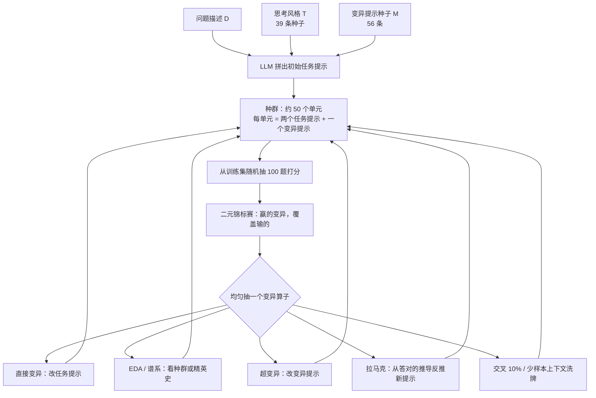
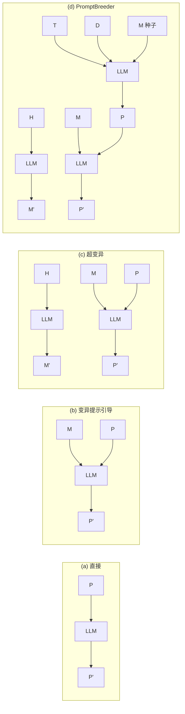

# PromptBreeder：权重冻住，进化的是两层 prompt；APE 三轮就停，自指的变异提示让搜索继续走

<!-- release-date: 2023-09-28 -->

> 本文依据 Google DeepMind 的 **Promptbreeder: Self-Referential Self-Improvement Via Prompt Evolution**，即 arXiv:2309.16797v1、2023-09-28 首次公开的 64 页版本。作者是 Chrisantha Fernando、Dylan Banarse、Henryk Michalewski、Simon Osindero、Tim Rocktäschel。页码均指本地 `papers/Google/PromptBreeder.pdf`。截至 2026-09-10 核验，arXiv 仍只有 v1，与本地原件一致。该工作后来收入 ICML 2024（PMLR 235:13481–13544）；本文不混用会议版页码，所有数字都回这篇 arXiv PDF。
>
> 全文严格分三层：**论文明确写了什么**（带 PDF 页码）、**我们如何解释它**（推理与类比，会写明）、**外部资料补充**（带链接）。论文把名字写成 PROMPTBREEDER / Promptbreeder；本站文件名与索引用 PromptBreeder。

## 读前先把这几个词说成人话

这篇论文的门槛不在公式，在于它同时用了提示词工程、进化算法和「自指」三套词。后面不再反复解释。

**它在优化什么：**

- **任务提示（task-prompt / $P$）**：拼在问题前面、用来改变模型答题方式的那句话。最小可以是 `"Let's think step by step"`，也可以是两段依次用的长指令。
- **变异提示（mutation-prompt / $M$）**：专门用来改任务提示的那句话。它自己不答题，它告诉模型「把这条指令改成什么样」。
- **超变异提示（hyper-mutation prompt / $H$）**：再上一层，用来改变异提示。论文里写死的一条是 `"Please summarize and improve the following instruction:"`（PDF p.8）。
- **思考风格（thinking-style / $T$）**：一组通用认知启发式，比如 `"Let's think step by step"`、拆解问题、反过来想。它只在初始化（以及零阶超变异）时被抽到，用来把问题描述改写成多样的起点。
- **问题描述（problem description / $D$）**：人对这个任务的第一句说明，例如 `"Solve the math word problem, giving your answer as an arabic numeral."`。它是进化的种子，不是最终提示词。
- **提示词策略（prompt strategy）**：推理时怎么用这些任务提示。论文的默认策略是两段依次用：第一段 $+$ 问题 → 中间推导；中间推导 $+$ 第二段 → 最终答案（PDF p.5 脚注 2）。拓扑从头到尾冻住，进化的只是各段的文字。
- **进化单元（unit of evolution）**：种群里的一个个体。通常是「两个任务提示 $+$ 一个变异提示」；少样本设定再加 2–3 条答对过的推导（PDF p.17）。任务提示和变异提示是一对一绑定的。

**它怎么学：**

- **适应度（fitness）**：从训练集里随机抽 100 道题，看这个任务提示答对多少（PDF p.5）。打分用的是训练集，不是测试集。
- **表型 / 推导过程（phenotype / workings out / context）**：模型在某道题上、被任务提示条件化之后实际写出来的那段推理。论文把这几个词当同义词用（PDF p.17）。
- **二元锦标赛（binary tournament）**：从种群里抽两个，留下适应度高的那个，把它变异，用变异后的副本覆盖失败者（Harvey, 2011；PDF p.5）。
- **世代（generation）**：把种群随机两两配对、全部比完一轮。种群 50 时，一轮大约 25 场对决（PDF p.8、p.27）。

**它明确不改什么：**

- **权重 $\theta$**：全程冻住。没有梯度，没有微调，也没有 soft prompt。论文把这一点写成相对自指权重矩阵的优势：不必为「改自己」再加一套参数（PDF p.1–2）。

这篇改的是 **prompt**，而且是两层：任务提示，以及负责变异它们的变异提示。跨篇只留对照，避免把别的文章再讲一遍：

| 报告 | 进化的部件 | 和本篇的差别 |
|---|---|---|
| 本篇 PromptBreeder（2023） | **两层 prompt**（任务提示 $+$ 变异提示） | 适应度是训练集上的标量正确率；变异靠另一条 prompt，不读失败轨迹 |
| [GEPA](/reports/Berkeley/GEPA) | **prompt**（复合系统里按模块） | 2025 年的反思式 $+$ 按实例帕累托；吃的是评测函数吐出的文字，不是标量。不要拿它的数字给本篇加戏 |
| [ADAS](/reports/UBC/ADAS) | 内层 **agent 的代码** | 外层元 agent 冻住，用代码搜工作流 |
| [AIDE2](/reports/Weco/AIDE2) | 包在模型外面的 **harness** | 外层优化的是内层的优化能力 |
| [AlphaEvolve](/reports/Google/AlphaEvolve) | **算法 / kernel** | 同一家实验室更晚的工作，评估器打分的是可执行代码，不是提示词 |

四条线都可能被叫成自进化。读数字之前先问一句：它到底在改哪一层。上面这张表是本站的读法，不是论文原文。

## 一句话先说清

手工写的思维链（Chain-of-Thought，CoT）和「先计划再求解」（Plan-and-Solve，PS）能把大模型的推理拉起来，但具体怎么措辞，对分数的影响可以非常大（PDF p.1）。Automatic Prompt Engineer（APE）想把这件事自动化，却发现「再选几轮收益递减，三轮之后质量就稳定了」，于是放弃了迭代版 APE（PDF p.1）。

PromptBreeder 的回答是：不要只生成一批候选再挑一次。维持一个种群，用训练集打分，让大模型当变异算子；更关键的是，**负责产生变异的那句话自己也要进化**。论文把后者叫做自指（self-referential）：它不只在改进任务提示，也在改进「改进任务提示的方式」（PDF p.1）。

在 PaLM 2-L 上，零样本 PromptBreeder 的 GSM8K 是 83.9，超过同一模型上的 APE 77.9 和 OPRO 80.2；StrategyQA 从 Plan-and-Solve 的 50.0 拉到 71.8（PDF p.2，Table 1）。ETHOS 仇恨言论分类上，进化出的两段长提示拿到 89，手工那句 `"Determine whether a text contains hate speech"` 只有 80（PDF p.9）。

所以本文的判断是：

> **PromptBreeder 证明的不是「提示词已经可以替代训练」，而是：在权重冻住、又有带标签的训练集可打分时，把搜索从「一条固定的变异指令」升级成「变异指令本身也进种群」，手工 CoT 那种看起来合理的句子就不再是最优的，APE 那种三轮就收敛的搜索也不再是上限。**

它同时留下清楚的边界：拓扑冻住、适应度必须靠训练集、一次运行要上千次打分、少样本里任务提示经常漂成胡话。后文会把这些拆开。

## 阅读路线

这篇 64 页，正文方法加结果大约到第 9 页，后面是参考文献和很长的附录。信息不是均匀分布的。建议按下面跳：

- **只想知道它到底进化哪一层**：读「旧方案卡在哪」和「全景」。
- **想看自指和普通「让 LLM 改一改提示词」差在哪**：读 Figure 2 那一节，以及超变异。
- **想核对主表数字**：必须读 Table 1 的脚注。带括号的是 text-davinci-003 的引用值，不是作者用 PaLM 2-L 复现的；带星号的数据集被对半切成了训练 / 测试。
- **想看「不进化变异提示」会怎样**：读附录 L 和 Figure 4，不要停在正文那句「去掉任何自指算子几乎都有害」。
- **想看它在仇恨言论任务上走到哪**：读 ETHOS 那一节。89 对 80 是有标签分类的数字，不是一条可直接上线的审核规则。

附录 C 的 56 条变异提示和附录 D 的 39 条思考风格，本文只概括类别，不整本粘贴。

## 旧方案卡在哪：手工提示词是次优的，APE 三轮就停

### 矛盾一：同一类策略，换一句措辞分数就跳

引言的起点很具体。提示词已经是基础模型下游表现的中心环节：它影响推理、多模态、工具使用，也可以用来做蒸馏和模拟智能体（PDF p.1）。但这些策略几乎都是人手写的。Madaan & Yazdanbakhsh（2022）被引来说明：具体怎么措辞，对效用可以有戏剧性的影响（PDF p.1）。

相关工作把当时的手工策略排成一条线（PDF p.3–4）：

- **CoT**：在少样本里给出中间推理步骤。
- **Zero-shot CoT**：一句 `"Let's think step by step"`，让模型自己写思维链。
- **Self-Consistency / Tree of Thoughts / Graph of Thoughts**：从一条链扩成多条，再扩成图。
- **Plan-and-Solve**：先写计划再执行。
- **Least-to-Most**：先拆子问题再合成。
- **Self-Refine**：生成 → 反馈 → 再改。

这些方法有一个共同结构：人先发明一种「该怎么想」的模板，再把它写成自然语言。模板是领域无关的。论文的假说正好相反——针对手头这个领域，自动搜出来的提示词应该能超过这些通用句（PDF p.4）。

Table 1 把这个假说先用数字钉住。同一套 PaLM 2-L 上，零样本 Plan-and-Solve 的 GSM8K 是 59.0，改进版 PS+ 是 60.5；PromptBreeder 是 83.9（PDF p.2）。StrategyQA 上 PS / PS+ 停在 50.0 / 50.1，PromptBreeder 是 71.8。CommonsenseQA 上 PS 是 77.9，PS+ 反而掉到 73.3，PromptBreeder 是 85.4。

也就是说：**「先计划再求解」这种看起来更完整的句式，并不保证比短句更好；在 PaLM 2-L 上，PS+ 相对 PS 在 MultiArith、CSQA、AQuA 上都更差**（PDF p.2、p.9）。手工打磨过的「更好的那句」，换模型之后未必还是更好的那句。

### 矛盾二：APE 想自动化，却在第三轮停住

APE（Zhou et al., 2023）已经在做自动提示词工程：用一条生成提示从输入–输出例子反推任务，再用另一条变异提示去改候选（PDF p.4）。问题出在迭代。Zhou 等人发现「再选几轮收益递减，质量大约三轮就稳定」，于是放弃了迭代版 APE（PDF p.1）。

论文把原因归结为多样性崩掉：候选越来越像，再选也选不出新东西（PDF p.4）。它给自己开出的药方是四件 APE 没有同时做的事（PDF p.4）：

1. 用思考风格把变异提示组合成任务相关的初始化；
2. 在线继续变异那些变异提示；
3. 使用会看整个种群和精英历史的特殊算子；
4. 显式做多样性维持。

OPRO 和 EvoPrompt 是同期工作，论文把差别写得很短（PDF p.4）：

- **OPRO**：一条复杂的、固定的变异提示，在一小块固定训练集上打分。它当时用 `"Take a deep breath and work on this problem step-by-step"` 在 GSM8K 拿到 80.2。PromptBreeder 用更不像人话的 `"SOLUTION"` 拿到 83.9。
- **EvoPrompt**：变异和交叉提示都冻住；初始化需要一整群人手写的、针对任务的提示词，而不是一句问题描述。

两条对照共同缺的那一层，就是本文要讲的自指：变异提示自己不进进化。

### 矛盾三：改权重的自指，规模对不上现代 LLM

论文把思想来源接到 Schmidhuber：神经网络的「程序」是它的权重矩阵，这个程序原则上可以改自己、也可以改「自己怎么改自己」（PDF p.1）。自指权重矩阵、Gödel Machine 都在这条线上。代价立刻出现：要额外的参数去改模型的全部参数，而越来越多的 LLM 还藏在 API 后面（PDF p.1、p.4）。

PromptBreeder 的替换是：把 LLM 的「程序」看成提示词（PDF p.2）。改提示词，以及改「改提示词的方式」，都不碰权重。收益是能在 API 模型上跑；代价是搜索空间变成自然语言，适应度必须靠外部打分函数——通常就是一张带标签的训练集。

## 全景：一轮循环到底改哪两层



这是按 PDF p.3 Figure 1 与第 3 节重画的**机制示意**，不含实测时间。图里的 50、100、10% 是论文写明的默认值（PDF p.5、p.8）。

再用论文 Figure 2 的四档，把「自指」从弱到强排一次（PDF p.7）：



(a) 是「让模型改写 $P$」；(b) 加了一条冻住的 $M$；(c) 让 $H$ 去改 $M$，这已经是自指；(d) 再加思考风格、问题描述和多种群初始化。PromptBreeder 落在 (d)。**权重在这四档里都没出现。**

一次适应度评估里，两段任务提示是这么接的（PDF p.5 脚注 2）：

$$
\text{working out} = \mathrm{LLM}(P_1 + Q),\qquad
\text{answer} = \mathrm{LLM}(\text{working out} + P_2)
$$

变异本身是字符串拼接再续写（PDF p.5）：

$$
P' = \mathrm{LLM}(M + P),\qquad
M' = \mathrm{LLM}(H + M)
$$

加号就是拼接。没有梯度，没有强化学习的 advantage，也没有 GEPA 那种对失败轨迹的文字反思。选择压强全部来自那 100 道训练题的正确率。

## 初始化：多样性必须在第一代就灌进去

以 GSM8K 为例。问题描述是 `"Solve the math word problem, giving your answer as an arabic numeral."`（PDF p.5）。因为 Plan-and-Solve 用两段提示，每个进化单元也进化两段任务提示，外加一条变异提示（PDF p.5）。

每一段初始任务提示的做法是：随机抽一条变异提示、随机抽一条思考风格，拼到问题描述后面，让 LLM 续写。控制串是 `INSTRUCTION:` 和 `INSTRUCTION MUTANT:`，用来逼出「这是改写后的指令」这种续写（PDF p.5）。抽到的那条变异提示会跟着这个单元走完全程，和它的任务提示绑死。

附录 E 的 Table 4 给了一批真正被写出来的起点，已经能看出搜索空间有多野（PDF p.22）：

- 正经的：把文字先变成代数方程再解；
- 还算合理的：画图、拆成小问题；
- 已经跑偏的：解释为什么系统性问题不是原因、`Do NOT use words to write your answer.`

这不是噪声，是设计。APE 那种「从例子反推一条像样的指令」会把种群一出生就挤到同一句附近。PromptBreeder 故意用思考风格把第一代打散。后文消融会显示：去掉这一步，是所有自指部件里伤害最大的（PDF p.9、p.63）。

少样本设定还要再装 2–3 条答对过的推导当上下文（PDF p.17）。没有问题描述的任务（指令归纳那 24 个）则用 APE 式的「我给朋友一条指令和五个输入」来启动（PDF p.35）。

## 适应度、种群、世代：打分在训练集上，选择是锦标赛

默认超参写在第 4 节和附录 J.2（PDF p.8、p.27）：

| 项目 | 取值 |
|---|---|
| 种群 | 50 个单元 |
| 世代 | 通常 20–30；附录按「每代 25 场对决」把 1–2k 次打分换算成 20–40 代 |
| 适应度 | 训练集上随机 100 题的准确率 |
| 选择 | 二元锦标赛：赢的变异，覆盖输的 |
| 底层模型 | PaLM 2-L |
| 三种采样角色 | Redescriber（写新提示词，最多 50 token，温度 1.0–2.0 并可进化）；Inducer（第一段 $+$ 问题，最多 30 token，温度 0.0）；Evaluator（第二段出答案，最多 5 token，温度 0.0） |

没有官方训练 / 测试划分的四个数据集（MultiArith、AddSub、SingleEq、SVAMP）被随机对半切开，一半当训练，一半当测试（PDF p.2 表注、p.27）。GSM8K、AQuA、CSQA、SQA、ETHOS 用各自原有的划分。

打分批次每次随机重抽，这是它和 OPRO「一小块固定训练集」的明确差别（PDF p.4）。直觉上，固定小集容易过拟合那几道题的措辞；随机批次逼着提示词在整个训练分布上还能用。论文没有单独消融「随机批次 vs 固定小集」，所以这是设计主张，不是一张对照表。

多样性维持有三件，附录写它们是在陷入局部最优时才用（PDF p.27–28）：

1. 在提示词前头塞大约 50 个随机字符；
2. 按 BERT 嵌入做适应度共享（fitness sharing）；
3. Redescriber 的温度在 $[1.0, 2.0]$ 初始化，每次复制加 $[-0.2, 0.2]$ 的均匀噪声。

EDA 算子里还有一道硬过滤：两条任务提示的 BERT 余弦相似度超过 0.95，就只留一条进列表（PDF p.6）。

**一次运行有多贵，论文没给 token 数、也没给墙钟时间。** 下面这行是本文按附录数字做的乘法，不是原文：1–2k 次适应度评估 $\times$ 每次 100 题 $\times$ 每题两次前向（Inducer $+$ Evaluator），仅打分就大约 $2\times 10^5$ 到 $4\times 10^5$ 次推理调用，还没算 Redescriber 的变异调用。这是它能超过三轮 APE 的物质条件，也是它不能当「零成本提示词技巧」来用的原因。

## 自指：改的不只是任务提示，还有「怎么改」

附录 F 把「自指」写成一条因果链：某个部件（这里是提示词）通过一个依赖自身状态的过程，编码并可能改进自己（PDF p.23）。论文列了六条通路：

1. 初始任务提示是 LLM 参数的函数；
2. 初始变异提示也是；
3. 子代任务提示是父代、变异提示和 LLM 的函数（直接变异、EDA）；
4. 子代变异提示是父代变异提示和 LLM 的函数（超变异）；
5. 推导过程是任务提示和 LLM 的函数（推理）；
6. 子代任务提示还可以是推导过程和 LLM 的函数（拉马克）。

前两条说的是「模型里已经藏着怎么写提示词的知识，初始化只是把它抽出来」。真正让系统在运行中改自己的，是 3、4、6。论文紧接着写了一句比口号重要的限制（PDF p.23）：

> PromptBreeder 会发明新的变异方式，但**不会发明新的（辅助）评估方式**——全程只用外部指定的适应度函数。

这和「开放式的人类思维」差了一截，也和后来会改评估器、改 harness、改 agent 代码的系统不在同一层。论文自己把这条写成「我们的算法在一个关键方面并不自指」（PDF p.23）。

它还警告了两条病态（PDF p.23）：无约束地把模型输出喂回自己，会脱轨（derailment）或掉进吸引子。温度更高有助于逃出吸引子。理想状态是：既要对当前任务足够相关，又要留一点「盒子外面」的想法。种群、随机批次、九类算子、随机前缀，都是在给这套自指过程加阻尼，而不是把模型关进一个空的自对话环。

超变异被明确接到「可进化性的进化」（evolution of evolvability）和 Population Based Training：PBT 改的是学习率这类超参，这里改的是变异提示（PDF p.7 脚注 4）。

## 五类变异算子：每一类改哪一层、为什么需要

论文写「九个算子、五个大类，每次复制只均匀抽一个」（PDF p.6）。正文 3.2 节实际点名的是：零阶 / 一阶直接变异、EDA、EDA 按适应度排序、谱系变异、零阶超变异、一阶超变异、拉马克变异，再加上交叉与上下文洗牌。交叉被写成「某个变异算子用完之后，另有 10% 概率发生」（PDF p.8），所以它不像另外几个那样被均匀抽中。Table 8 只报了七个，没有交叉和上下文洗牌。「九」和列表对不齐。本文按正文点名的机制讲，不替它凑满九个。

用这五类的理由，论文接到顿悟学习：多样的重新描述是解决问题的关键（PDF p.6）。翻译成人话：同一道数学题，被说成「画图」「不要用词」「解释给小孩听」，会把模型推进不同的推理格式。算子的工作就是反复换框。

### 第一类：直接变异——改任务提示这一层

**零阶提示词生成。** 不看任何父代。把问题描述拼上 `"A list of 100 hints:"`，让模型写出新提示，取第一条 hint（PDF p.6）。它的用处是纠偏：搜索如果漂得太远，这个算子能把种群拉回和原问题描述相关的区域，类似课程学习里的均匀重采样。

**一阶提示词生成。** 这是标准的无性变异：变异提示（论文示例里印成红）拼到父代任务提示（蓝）后面，LLM 续写出 $P'$（PDF p.6）。和初始化几乎一样，只是不再拼思考风格。没有这一类，就没有遗传算法意义上的「从父母到孩子」。

### 第二类：EDA 与谱系——改的还是任务提示，但条件从「一个父母」变成「一群」

三个算子共享一个想法：只看一个父母，看不到种群里已经出现的模式。

**EDA 变异。** 把当前种群的任务提示过滤、编号，让 LLM 把列表续下去（PDF p.6）。过滤用 BERT 余弦，阈值 0.95。列表随机打乱，**刻意不把适应度数字给模型看**——预实验里模型看不懂这些数字，只会抄列表里的条目（PDF p.6 脚注 3）。这和当时「LLM 是通用模式机」的说法是反着的，论文把它留给未来。

**EDA 按适应度排序。** 过滤之后按适应度升序排列。提示词却告诉模型这是降序，并说「最后一个最好，它更像倒数第二个，而不像第一个」（PDF p.7）。论文承认这是在对模型撒谎。原因是近因效应：LLM 更爱模仿列表末尾。如果末尾恰好是最好的，续写就会挤在精英附近。升序排列 $+$ 「我告诉你这是降序」，是用矛盾换多样性。

**谱系变异。** 每个单元存一份「曾经当过种群精英」的时间线，按时间顺序（不做多样性过滤）喂给模型，标题是 `"GENOTYPES FOUND IN ASCENDING ORDER OF QUALITY"`（PDF p.7）。理由：从坏到好的梯度，可能比当前种群的横截面更强。Table 8 里这个算子在 GSM8K 上排第二，26% 的子代超过父母（PDF p.28）。

### 第三类：超变异——改的是变异提示这一层

这是自指真正落下来的地方。前两类再怎么花，改的都是任务提示；超变异改的是搜索过程本身。

**零阶超变异。** 问题描述 $+$ 随机一条思考风格 → 新的变异提示 $M'$，再用 $M'$ 去改当前任务提示（PDF p.7）。它和初始化用的是同一套配方，作用是把思考风格库里的知识持续灌进搜索算子，而不是只在第 0 代用一次。

**一阶超变异。** 把 $H=$ `"Please summarize and improve the following instruction:"` 拼到现有 $M$ 上，得到 $M'$，立刻用 $M'$ 去改该单元的任务提示（PDF p.8）。这样一次评估就能看到：这条新变异提示有没有生出更好的任务提示。适应度仍然只打在任务提示上，变异提示是间接被选上的——谁能生出更好的 $P$，谁留下。

Table 7 有一个很好看的闭合：GSM8K 一次运行里，最成功的变异提示恰恰是 `"Please summarise and improve the following instruction"`，成功率 24.13%（PDF p.28）。也就是说，超变异用的那句 $H$，自己后来变成了最好的 $M$。自指在这里不是比喻，是一条真的被选中的字符串。

Table 8 把零阶超变异排在所有算子第一：42% 的子代超过父母（PDF p.28）。一阶超变异 23%，排第三。**「不进化变异提示」会怎样，要等消融那一节才有跨任务的证据；Table 8 只说明在 GSM8K 这次运行里，超变异经常生得出更好的孩子。**

### 第四类：拉马克变异——从表型反推基因型

拉马克主义在生物学里是错的，在提示词进化里却是一个很具体的操作：拿一段**已经答对**的推导（表型），让模型倒推出「当时那条指令大概是什么」（基因型）。论文把它接到 STaR、APO 和 APE 的指令归纳（PDF p.8）。

模板是（PDF p.8）：

```text
I gave a friend an instruction and some advice. Here are the correct
examples of his workings out + <<correct working out>> + The instruction was:
```

附录 H 给了一条完整例子：两道 AQuA 选择题的正确推导后面，模型续写出「仔细读、理解术语、明智选择、再检查」这种四步提示（PDF p.24）。论文说这一类在问题描述缺失、不够、或具有误导性时特别关键（PDF p.8）。ETHOS 消融会把这句话变成数字：问题描述被换成毫无信息的 `"Solve the Problem"` 时，去掉拉马克，分数从 81.6 掉到 64.6（PDF p.64）。

Table 8 里拉马克在 GSM8K 上最低，只有 6.3%（PDF p.28）。这不矛盾。数学题的问题描述已经很清楚，「从推导反推指令」不是主路径；描述一旦含糊，它就变成主路径。算子的价值取决于任务，不取决于它在 GSM8K 排第几。

### 第五类：交叉与上下文洗牌——改的是单元之间的组合，以及少样本里的示范

**交叉。** 某个变异算子用完之后，10% 概率把一个任务提示换成种群里按适应度比例抽到的另一个（PDF p.8）。变异提示不做交叉。它解决的是：两个单元分别搜到了有用的半截，需要一个办法把半截拼回去。注意这不是 GEPA 那种按模块的系统感知合并——这里没有模块结构，只是整段替换。

**上下文洗牌。** 少样本单元里那几条「答对过的推导」也会被进化（PDF p.8）。列表只收正确推导；评估时把它们放在任务提示前面，当作「推导应该长这样」的示范。列表满了，新的正确推导会随机替换一条。另外有 10% 概率按最大列表长度的倒数，整表重采。

附录 J.5 起的少样本个例把这件事的副作用写得很直白：上下文会主导适应度，任务提示经常漂成胡话，对分数的决定性还不如那几条示范（PDF p.28）。AddSub 少样本跑了 1600 次变异之后，两段任务提示变成了 `"The mutant"` 和 `"mutant"`，中间夹着游戏按键说明和阅读理解练习，答案却仍然算对（PDF p.28–29）。SVAMP 少样本的 Prompt 0 是一段日期 `"08-02-2013 - 09-02-2013"`（PDF p.34）。

这是一个必须留下的观察，不是彩蛋：**少样本设定下，进化找到的往往是「能引出正确格式的上下文」，不是一句人能读懂的指令。** 零样本的 `"SOLUTION"` 和少样本的 `"mutant"` 是同一类现象的两端。

## 种子清单只讲类别：56 条变异提示、39 条思考风格

附录 C、D 把初始化用的种子全列出来了。它们不是运行中进化出来的产物，是人写的启动池。作用是把第一代打散，并给零阶超变异提供原料。

变异提示大约 56 条，可以收成六类（PDF p.18–20）：

1. **换说法**：创造性改写、讲给小孩听、当好老师、禁止复用原词；
2. **故意跑偏**：更有趣、自欺、出人意料的转折、矛盾、幽默、比喻、诗体；
3. **加结构**：更具体、要观点、多视角、比较、补上下文、拆复杂问题；
4. **换解题姿势**：可视化、回忆类似题、拆小步、讲给别人听、从答案倒推、先休息；
5. **纠错口吻**：哪里错了、`CORRECTION =`、这段通不通；
6. **元提示**：什么叫好的变异问题、给 LLM 的提示该长什么样。

思考风格大约 39 条，可以收成四类（PDF p.21–22）：

1. **科学方法**：做实验、列点子、量进度、简化、问假设和风险；
2. **有名字的认知风格**：批判、创造、协作、系统、风险分析、反思；
3. **问题类型诊断**：技术的还是概念的、有没有物理约束、是不是人的行为、是不是设计题、紧不紧急；
4. **相对当前最优的反事实**：假设现在最好的解全错、忽略它另起一条。最后两条直接就是 CoT 和 Plan-and-Solve 的种子句。

不要把这份清单当成「提示词大全」。进化真正留下的，往往不是种子里最像人话的那几条。GSM8K 零样本最后赢的是 `"SOLUTION"`（PDF p.26）。

## 实验怎么证明

### 主表：先分清谁和谁在比

Table 1 在 PDF 第 2 页。先把读表规则放在数字前面，否则会高估归因：

1. **带括号的数不是作者用 PaLM 2-L 跑的。** 它们直接引自 Plan-and-Solve 论文，底层是 text-davinci-003（PDF p.2 表注）。
2. **带星号的四个数据集被对半切开。** MultiArith*、SingleEq*、AddSub*、SVAMP* 的测试集不是原论文常用的那份完整测试集（PDF p.2 表注）。
3. **OPRO 只填了 GSM8K 一格。** 80.2 是 OPRO 发布时用 `"Take a deep breath..."` 拿到的数（PDF p.4）；其他任务是破折号。
4. **没有误差棒，没有随机种子次数，没有多次独立运行的均值。**
5. **少样本并不是全面优于零样本。** GSM8K 少样本 83.5，低于零样本 83.9；AddSub 少样本 87.1，低于零样本 87.8（PDF p.2）。

同一模型、同一套切分上，零样本这一行才是主对照：

| 方法（均为 PaLM 2-L，零样本） | MultiArith* | SingleEq* | AddSub* | SVAMP* | SQA | CSQA | AQuA | GSM8K |
|---|---:|---:|---:|---:|---:|---:|---:|---:|
| PS | 97.7 | 90.6 | 72.4 | 83.8 | 50.0 | 77.9 | 40.2 | 59.0 |
| PS+ | 92.5 | 94.7 | 74.4 | 86.3 | 50.1 | 73.3 | 39.4 | 60.5 |
| APE | 95.8 | 82.2 | 72.2 | 73.0 | 38.4 | 67.3 | 45.7 | 77.9 |
| OPRO | — | — | — | — | — | — | — | 80.2 |
| PB | **99.7** | **96.4** | **87.8** | **90.2** | **71.8** | **85.4** | **62.2** | **83.9** |

少样本 PB：100.0、98.9、87.1、93.7、80.2、85.9、64.6、83.5（PDF p.2）。

几处值得单独读：

- **GSM8K 是对 APE / OPRO 最干净的一刀。** 三者都在 PaLM 2-L 上，APE 77.9 → OPRO 80.2 → PB 83.9。论文还强调 PB 赢的那句是不直观的 `"SOLUTION"`（PDF p.4、p.26）。
- **StrategyQA 的跳变最大。** PS / PS+ 在 50 附近，APE 掉到 38.4，PB 零样本 71.8、少样本 80.2。常识推理上，通用数学句式帮不上忙，领域自适应才帮得上。
- **AQuA 从 40 附近到 62.2。** 这是选择题，输出空间更窄，但手工 PS+ 在 PaLM 2-L 上只有 39.4，连 text-davinci-003 上的 46.0 都没到。
- **AddSub 是 PS+ 换模型之后变差的例子。** text-davinci-003 上 PS+ 是 92.2，PaLM 2-L 上只有 74.4。PB 把它拉回 87.8，仍低于 davinci 上的手工 PS+。跨模型搬提示词会掉点，这张表自己就画出来了。
- **MultiArith 上 PS 已经 97.7，PB 99.7。** 天花板任务上还能再挤一点，但说服力主要不在这里。

PoT 和 Auto-CoT 作者没有在 PaLM 2-L 上重跑，理由是 PS / PS+ 已是 Plan-and-Solve 论文里最好的提示（PDF p.28）。所以 Table 1 里这两行只能当「另一篇文章、另一个模型」的背景，不能当同模型对照。

### 进化出来的零样本提示词长什么样

Table 6 是各任务最好的两段零样本任务提示（PDF p.26）。摘几条就能看清「最优」不必像人话：

| 任务 | Prompt 1 | Prompt 2 |
|---|---|---|
| GSM8K | `SOLUTION"` | （空） |
| AQuA | `Do a simple computation.` | `MATH WORD PROBLEM CHOICE (A) (B) (C) (D) or (E).` |
| AddSub | 认真读题、选运算 | `You know what's cool? A million dollars.` |
| SVAMP | `visualise solve number` | 把答案框成阿拉伯数字 |
| SQA | 一次考虑一个视角 | 然后回答 yes / no |
| CSQA | 选 A–E | 回忆类似题 |

引言还引用过一条更长的 GSM8K 提示，从 `"Show all your working."` 数到第五点「字要写清楚」（PDF p.2），并指向附录 J。附录 J 里实际给出的 GSM8K 少样本个体是另一条（「不用计算器……」外加 `1, 2, 3, 4`，PDF p.32）；Table 6 的零样本最优又是 `"SOLUTION"`。三处对不上。本文分别引用，不把它们合成同一条提示词。

能确定的只有论文自己强调的那件事：对 LLM 敏感的是具体字符串，不是人类读起来像不像一条好指令（PDF p.4）。`"SOLUTION"` 和 `"A million dollars."` 能赢，是适应度函数选出来的，不是作者的审美。

### 一次典型运行：适应度可以连涨两千次评估

附录 B 的 Figure 3 画的是指令归纳里的 word-in-context：判断一个同形词在两句话里是不是同一个意思（PDF p.17–18）。横轴是评估次数，到 2000；纵轴是适应度。蓝点是个体，红线是种群均值。均值从接近 0 爬到大约 80，右侧同步列出当时的精英两段提示，从含糊的 `as follows:` 逐步变成「判断这个词在两句里意思是否相同，yes 或 no」。

论文把这张图当成对 APE「三轮停滞」的反例（PDF p.9）。读图时要注意：大量蓝点始终贴在底部，种群均值涨，不代表每个个体都在涨。二元锦标赛会保留失败者直到被覆盖，多样性维持也会故意留下差的。红线向上，说的是「搜索还在动」，不是「已经收敛到一个干净的解」。

### 哪些算子真的在生出更好的孩子

Table 8 统计的是 GSM8K 一次运行里，「子代适应度超过父母」的比例（PDF p.28）：

| 算子 | 超过父母的比例 |
|---|---:|
| 零阶超变异 | 42% |
| 谱系变异 | 26% |
| 一阶超变异 | 23% |
| EDA 按序 | 12.7% |
| 直接变异 | 12% |
| EDA | 10.7% |
| 拉马克 | 6.3% |

论文的结论是「所有算子都重要，包括带来自指的超变异」（PDF p.9）。更谨慎的读法是：在这次 GSM8K 运行里，改变异提示的两个算子确实经常生得出更好的任务提示；拉马克很少，但不为零。这张表没有交叉、没有上下文洗牌，也没有跨任务。

Table 7 是同一运行里最成功的变异提示（PDF p.28）：总结并改进（24.13%）、拆成简单句（17.8%）、讲给小孩听（16.2% / 10.0%）、以及零阶用的 `"100 hints"` / `"A list of 100 hints"`（4.3% / 3.4%）。赢的几条几乎都在做同一件事：把指令变短、变清楚、变可执行。花哨的「出人意料的转折」没有出现在这张短榜上。

### 消融：不进化变异提示，会怎样

附录 L 的设定比主实验小：种群 10，200 次评估，约 20 代（PDF p.63）。指标不是测试准确率，而是「在对应世代，消融 run 的适应度有多大比例高于完整算法」。Figure 4 的读法必须先看图注（PDF p.63）：

- 0%：去掉它无所谓；
- 接近 $-100\%$：去掉它，同等进度上适应度更低 → 这个部件有用；
- 接近 $+100\%$：去掉它反而更高 → 这个部件有害。

四列从左到右是：去掉超变异（不再改变异提示）、去掉拉马克、去掉思考风格引导的任务提示初始化、去掉「从 56 条里随机抽变异提示」（改成永远用 `"Please summarize and improve..."`）。

热图上几乎全是负的。伤害最大的一列是「SR task-prompt」，也就是初始化时不再用思考风格重写任务提示：CS_STRATEGY_QA $-80$，SVAMP $-74$，GSM $-73$，MULTIARITH $-71$（PDF p.63，读自 Figure 4）。这和正文「最大收益来自初始化时对任务提示的重新描述」一致（PDF p.9）。

**超变异那一列全部为负**：ADDSUB $-13$，GSM $-37$，MULTIARITH $-62$，STRATEGY_QA $-61$（PDF p.63）。在这张小规模热图上，「不进化变异提示」会让搜索变差，没有一个任务因为冻住 $M$ 而变好。

唯一被论文点名为有害的，是第四列在 GSM8K 上的 $+41$（PDF p.9、p.63）：初始化时从 56 条变异提示里随机抽，对 GSM8K 有害。换成永远用那句「总结并改进」，GSM8K 更好。这和 Table 7 对得上——那句本来就是 GSM8K 上最成功的 $M$。AQUA_DEV 的 $+1$、MULTIARITH 的 $+9$ 也是弱正，但论文只把 GSM8K 写成那一个例外。

消融的边界也要写明：种群 10 不是 50，200 次评估不是 1–2k，指标不是测试集分数，热图里没有 CSQA、也没有 ETHOS。它适合用来看「去掉哪一层会伤搜索」，不适合用来估计 Table 1 里每一分是哪个算子贡献的。

### ETHOS：领域自适应能走多远，边界在哪

正文把 ETHOS 当成「复杂、领域特定的长提示」测试（PDF p.9）。手工基线是问题描述原句 `"Determine whether a text contains hate speech"`，80 分；进化出的两段长提示 89 分（PDF p.9）。附录 J.1 给出了这两段（PDF p.27），结构可以收成：

- Prompt 1：什么算仇恨言论——贬低性词语、负面概括、煽动暴力、消灭某一群体的愿望，以及种族 / 性别 / 性取向等敌意语言；
- Prompt 2：操作步骤——识别目标群体、识别有害言论、评估语境；并加了一句，幽默或讽刺即使含有伤害性语言，也可能不算仇恨言论。

这是适应度函数在 ETHOS 标签上搜出来的分类规则，不是一篇法律意见。论文没有讨论标签怎么来、假阳性、也没有讨论「讽刺例外」会不会把真正的攻击放过去。能确定的只有：相对那句短基线，更长、更可操作的定义在这份数据上分数更高。

附录 L 还做了一个更苛刻的版本：问题描述改成毫无信息的 `"Solve the Problem"`，完整算法仍有 81.6（PDF p.64）。去掉拉马克掉到 64.6；只留上下文变异是 68.7；加回在线变异 70.4；再加回随机变异提示 73.7（PDF p.64）。描述一旦被掏空，从表型反推指令就变成主路径。这也是对「必须有一句写对的问题描述才能起步」的反驳——有标签就够启动，描述只是加速器。

仇恨言论任务的边界，本文这样划：

- 它测的是**分类准确率**，不是生成、不是审核系统上线；
- 适应度仍然是训练集打分，标签错了，提示词会跟着学错；
- 进化出来的定义会把「某一群体」写进指令里，这是数据里的范畴，不是 PromptBreeder 发现的道德理论；
- 论文把它写成能力展示（「能做精细的领域自适应」），没有写成安全方法。

### 指令归纳：21 / 24，但对照模型并不相同

附录 K 在 APE 用过的 24 个指令归纳任务上跑少样本 PromptBreeder（PDF p.35）。结论是：PaLM 2-L **没有**做指令微调，仍然在 21 / 24 个任务上追平或超过 APE，最大高 21 个百分点（PDF p.35）。Table 9 在 PDF 第 36 页。

读这张表必须把四列拆开：

| 列 | 是什么 |
|---|---|
| Zero-shot / Few-shot APE | 已发表数字，模型是 text-davinci-002 |
| PE using APE prompts | 作者把 PromptBreeder 改成 APE 的初始化 $+$ APE 那条冻住的变异提示 `"Generate a variation of the following instruction while keeping the semantic meaning"`，模型换成 PaLM 2-L |
| Few-shot PE | 完整 PromptBreeder，PaLM 2-L |

「21 / 24」比的是第四列和已发表的 APE，**底层模型不同**。更干净的同模型对照是第三列 vs 第四列：APE 那条冻住的变异提示在未做指令微调的 PaLM 2-L 上经常崩掉（First Letter 1、List Letters 0、Word in Context 6），完整 PromptBreeder 把它们拉回 100、99、65（PDF p.36）。

两个明确输掉已发表 APE 的任务是 Common Concept（0 对 32）和 Formality（7 对 70）（PDF p.36）。论文没有分析为什么。能说的只是：不是所有指令归纳任务都被这套算子覆盖。

## Related work：只留对照

第 2 节按三条线定位，这里只保留读这篇需要的差别（PDF p.3–4）。

**手工提示词策略。** CoT、Zero-shot CoT、PS、Least-to-Most、Self-Refine、ToT、GoT：领域无关、人手设计。PromptBreeder 用同一套系统去适配不同领域，不发明新的推理拓扑。

**会改参数的方法。** Soft Prompt、用 CoT 自生成再微调、STaR。论文引用 Zhou et al. 的论点：更新全部或一部分 LLM 参数，模型越大越难扩，API 模型根本动不了（PDF p.4）。PromptBreeder 站在梯度无关这一侧。

**其他自动提示词优化。** Auto-CoT / Automatic-CoT 搜的是少样本思维链；APE 有生成提示和变异提示，但不在线进化变异提示，也没有种群级多样性；OPRO 一条复杂变异提示 $+$ 固定小训练集；EvoPrompt 冻住变异 / 交叉，还要人手写一群初始提示。PromptBreeder 多出来的就是：变异提示进种群、多种群算子、随机批次打分。

**自指与开放式。** 自指权重矩阵和 Gödel Machine 改参数；Picbreeder 有人在环里进化图像。PromptBreeder 把底物换成自然语言，并且无人在环。论文还把它写成从「从数据里学」到「学该从什么数据里学」的过渡（PDF p.4）——少样本上下文洗牌，就是在选示范。

GEPA、ADAS、AIDE2、AlphaEvolve 都是这篇之后的工作，上面跨篇表已经定位，这里不把它们的数字写进来。

## 限制：论文写了的，和它没写但表里能看见的

**写了的：**

- 提示词拓扑冻住，只改内容，不改「几段、是否条件触发、能不能互相辩论」（PDF p.9）。未来工作才提到 N 段条件式提示、苏格拉底式自我对弈。
- 不发明新的评估方式，只用外部适应度（PDF p.23）。
- 相对人类思维仍然很窄：没有语调、意象、多模态，也没有多层重叠的选择过程（PDF p.9）。
- 少样本里任务提示会漂成胡话，真正被选择的是上下文（PDF p.28）。
- 预实验里模型看不懂适应度数字（PDF p.6）。
- 自指过程会脱轨或掉进吸引子（PDF p.23）。

**没写、但读表能看见的：**

- **必须有带标签的训练集。** 没有 100 道可打分的题，锦标赛转不起来。这不是实现细节，是算法的地面真相。
- **调用次数很多。** 论文只写 1–2k 次适应度评估，不给总 token、不给费用、不给墙钟。
- **生成长度被卡得很死。** 推导最多 30 token，答案最多 5 token（PDF p.27）。`"SOLUTION"` 能赢，和这个长度上限可能有关——模型写不了长推理，提示词就进化成「直接出答案」的开关。这是本文的推测，论文没有做「放长 max tokens」的对照。
- **Table 1 的跨模型括号、对半切分、无误差棒。** 见上文读表规则。
- **消融是小种群、短预算、非测试指标。** 不能直接解释主表的分差。
- **没有官方代码。** PDF 和 arXiv 页面都没有给出仓库。后来出现的第三方复现是外部工程，不能当成原文配方。
- **附录 G 的 CSQA 问题描述抄成了 AQuA 那句「解选择题数学应用题」**（PDF p.23）。这是原文笔误。主实验 CSQA 的 85.4 仍然以 Table 1 为准，不拿这句错误描述去解释分数。

## 可迁移的部分

能直接拿走的，不是 `"SOLUTION"` 这五个字符，而是几条关于「语言空间里怎么搜」的设计原则。

**第一，迭代挑最优会停，种群加多样性才继续走。** APE 三轮停滞是多样性崩掉，不是模型不会写提示词。任何「生成一批、选最好、再生成」的流程，都该先问：第三轮的候选是不是已经在抄第一轮。

**第二，变异算子本身值得进搜索。** 冻住一条「请改写得更清楚」很快会用尽。把 $M$ 和 $P$ 绑在同一个单元里，用下游任务提示的分数间接选 $M$，是这篇真正可复用的结构。它不依赖 PaLM，也不依赖那 56 条种子。

**第三，适应度数字不一定要给模型看。** 作者发现给了反而抄列表（PDF p.6）。排序、撒谎说升序是降序、只给精英时间线，都是在用语言模型的近因偏差，而不是假装它懂标量。

**第四，问题描述可以很差，只要表型能反推。** 拉马克算子是「没有说明书、只有对错例子」时的退路。ETHOS 的 `"Solve the Problem"` 实验把这条说死了。

**第五，少样本进化很会钻示范的空子。** 如果你真正想要的是一条可部署、人能读的系统提示，少样本设定可能会交出一堆胡话外加几条高分上下文。零样本约束更接近「只要指令」。

**不要直接搬的：** 种群 50、100 题批次、温度 1.0–2.0、max tokens 50/30/5，都没有扫描曲线。换模型、换任务，这些数字大概率要重调。仇恨言论那两条长提示更不能当通用审核规则。

## 关键词回看

- **任务提示 $P$**：条件化 LLM、用来答题的那句话；通常两段依次用。
- **变异提示 $M$**：用来改 $P$ 的那句话；和 $P$ 一对一绑在同一个进化单元里。
- **超变异提示 $H$**：用来改 $M$ 的那句话；论文写死为「请总结并改进」。
- **自指**：不只改进任务提示，也改进改进它们的方式；底物是自然语言，不是权重。
- **二元锦标赛**：抽两个，赢的变异，覆盖输的。
- **适应度**：训练集上随机 100 题的准确率；不是测试集，也不是文字反馈。
- **EDA 变异**：让 LLM 续写经过多样性过滤的种群列表。
- **谱系变异**：把该单元历史上的精英按从差到好排列，让 LLM 顺着这条梯度往下写。
- **拉马克变异**：从答对的推导反推新的任务提示。
- **思考风格**：初始化用的认知启发式种子，39 条。
- **APE 的三轮停滞**：迭代选择收益递减，被归因于多样性损失。
- **`"SOLUTION"`**：GSM8K 零样本进化出的最优任务提示；用来说明人对「好指令」的直觉不可靠。

## 最后的判断

PromptBreeder 最硬的贡献，不是又一个提示词优化器名字，也不是 GSM8K 上那 3.7 分（83.9 对 OPRO 的 80.2）。它是把「LLM 的程序是提示词」这句话做成了一套能跑的双重进化：外层的任务提示对训练集负责，内层的变异提示对「还能不能生出更好的任务提示」负责。APE 停在第三轮，是因为内层冻住了；手工 CoT / PS+ 在 PaLM 2-L 上不再是最优，是因为外层被搜过了。

实验支持的是这一句，不是更强的那句。「自进化」在这篇里改的就是 **prompt**，而且权重从头到尾没动。StrategyQA 从 50 到 71.8、ETHOS 从 80 到 89、消融里去掉超变异全面变差，都和这句一致。少样本漂成 `"mutant"`、Common Concept 掉到 0、必须有标签才能打分，也和这句一致。

它没有打开开放式的自我改进。拓扑冻住，评估函数冻住，一次运行要上千次调用。后来的 GEPA 会把失败轨迹写成话再反思，ADAS 会用代码搜 agent，AIDE2 会改 harness——那些都是这篇之后、换了一层底物的故事。读 2023 年这篇，只要记住它真正换掉的那一块：

> **提示词工程的上限，往往不是人想不出更漂亮的句子，而是「改句子的那个句子」自己没有被搜索。冻住权重可以；冻住变异提示，搜索很快就会停。**

## 资料与阅读边界

- 原始依据：本地 `papers/Google/PromptBreeder.pdf`，即 arXiv:2309.16797v1，2023-09-28，64 页。
- arXiv 页面：<https://arxiv.org/abs/2309.16797>。提交历史只有 v1（2023-09-28 19:01:07 UTC）。`release-date` 取该技术首次官方公开日 2023-09-28；对象是这项公开技术，不是某个已发布的基座权重。
- 会议版（外部补充，本文不用它的页码）：ICML 2024，PMLR 235:13481–13544，<https://proceedings.mlr.press/v235/fernando24a.html>。
- PDF 与 arXiv 均未给出官方代码仓库。第三方复现（如 <https://github.com/vaughanlove/PromptBreeder>）是论文之后的工程，算子覆盖不全，不能与 Table 1 / Figure 4 混用。
- 跨篇：[GEPA](/reports/Berkeley/GEPA) 是后来的反思式 $+$ 帕累托提示进化；[ADAS](/reports/UBC/ADAS) 用代码搜 agent；[AIDE2](/reports/Weco/AIDE2) 改 harness；[AlphaEvolve](/reports/Google/AlphaEvolve) 改算法 / kernel。正文用来标明「这篇改的是两层 prompt」这条边界，不拿它们的数字给本篇加分。
- 重画的图：「一轮循环」按 Figure 1 与第 3 节；「四档自指」按 Figure 2。都是机制示意，不含实测时间。Figure 3、Figure 4 的读数是对着 PDF 页面读的。
- 本文标为「我们的理解 / 判断」的地方：调用次数的乘法估算；max tokens 过短可能偏好 `"SOLUTION"`；少样本胡话是在钻示范空子；「九个算子」与正文列表对不齐；引言那条长 GSM8K 提示在附录 J 找不到对应个体。这些都不是论文原文的结论。
