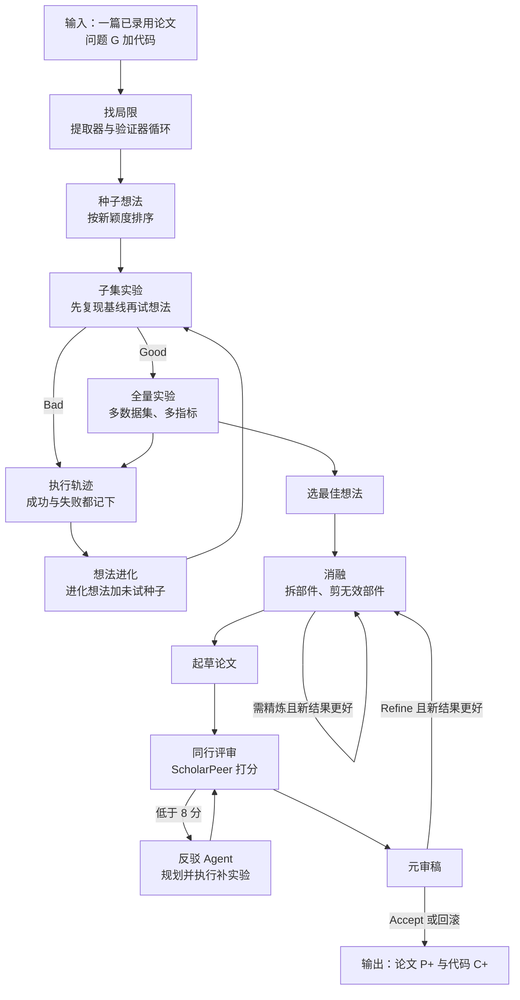

# ScientistTwo：从一篇顶会论文出发，让多个 Agent 自己做出下一篇

<!-- release-date: 2026-09-17 -->

> 本文依据 Google Cloud AI Research（联合滑铁卢大学）的 **ScientistTwo: Pioneering the Human Knowledge Frontier with Autonomous AI**，即 arXiv:2609.19644v1（2026-09-17 提交，封面日期 2026-09-18），共 71 页。页码均指这份 PDF 的物理页码。这是一篇系统论文，不是基模报告：没有训练任何模型，它做的是把现成的大模型和编码 Agent 组织成一条「做研究」的流水线。全文把 3 件事分开写：**论文明确写了什么**（带页码）、**我们如何解释或验算它**（会写明）、**外部资料补充**（给出处并标注）。

## 读前先把几个词说成人话

这篇论文没有难公式，难的是它同时牵涉 3 层东西：被研究的那篇人类论文、做研究的一群 Agent、给结果打分的另一群 Agent。先把词分清。

- **自动研究 Agent（autonomous research agent）**：给它一个研究问题，它自己读、自己想点子、自己写代码跑实验、自己写论文。本文的对象 ScientistTwo 就是这样一套系统（PDF p. 1）。
- **人类 SOTA（human state-of-the-art）**：本文里特指「作为输入的那篇已录用论文里的方法」。ScientistTwo 的任务是在它的代码和基准上做出更好的方法（PDF p. 2、p. 6）。
- **多 Agent（multi-agent）**：不是一个大模型从头干到尾，而是把研究拆成十几个角色，每个角色一个专门的 Agent：找局限的、想点子的、写代码的、挑毛病的、写论文的、审稿的（PDF p. 4，Figure 3）。
- **Critic（评审 Agent）**：每一步产出之后，专门判「收下、再改改、扔掉」的那个 Agent。全文每个阶段都是「生成者 + Critic + 修改者」这一个模板（PDF p. 5，Listing 1）。
- **消融实验（ablation study）**：把方法里的某个部件拿掉或换掉，看效果掉多少，用来回答「收益到底来自哪一块」。
- **Rebuttal（反驳）**：投稿后作者对审稿意见的回复。本文让 Agent 不只写回复，而是真的去补做审稿人要的实验（PDF p. 3、p. 9）。
- **Meta-Review（元审稿）**：会议里由领域主席综合各审稿意见做最终决定。本文用一个 Agent 扮这个角色，判定「能投了」还是「方法本身还不够，回去改」（PDF p. 9）。
- **ScholarPeer 与 Stanford Agentic Reviewer**：两套自动审稿 Agent，按 ICLR 的 1–10 分打分并给出接收与否。前者在 ScientistTwo 内部也被用来改稿，是「见过的考官」；后者开发时没用过，是「留出的考官」（PDF p. 10）。
- **ScientistOne**：与本文有共同作者（Rui Meng、Parthasarathy Ranganathan）的前作，主打「证据链（Chain-of-Evidence，CoE）」可验证性，本文最强的对照系统（PDF p. 4、p. 23 参考文献）。
- **AutoSOTA**：另一条路线的系统，给定论文和代码仓，只盯一个数值指标往上调。本文专门拿它做了对照（PDF p. 12、p. 30–32）。

同库里 AlphaEvolve 一篇讲用进化搜索找算法，AIDE2 一篇讲 AI 自动做 ML 研究的循环，SoL-Pi 一篇讲让研究 AI 去改 Agent 的外壳。ScientistTwo 和它们同属「让 AI 做研究」这一族，区别在于它的产出不是一个更高的分数，而是一篇带代码、带消融、经过模拟审稿的论文。

## 一句话先说清

已有的自动研究 Agent 大多只会做一件事：在一个数据集上把一个标量指标往上推（PDF p. 1、p. 4）。真实的科研不是这样。审稿人会问：换个数据集还成立吗？收益来自你的新部件，还是来自顺手调的超参？你漏了哪条对照？

ScientistTwo 把这些「人类研究员会做的检查」全部做成了流水线里的闸门（PDF p. 2–3）：

1. **全面基准推理加子集先筛**：想法先在基准的一个子集上试，过了再上全量多数据集、多指标；
2. **消融驱动的假设精炼**：自动设计消融，剪掉不干活的部件，收益必须能归到新机制上；
3. **动态审稿与反驳循环**：审稿 Agent 挑刺，反驳 Agent 真的补实验，元审稿 Agent 决定是否打回重做方法。

输入是一篇已录用的顶会论文（问题描述加它的代码），输出是一篇新论文加一份可复现代码（PDF p. 6，式 1）。作者拿 107 篇 NeurIPS 2025、ICLR 2026、ICML 2026 的已录用论文当考题（PDF p. 10、p. 28–29）。


主要结果（PDF p. 2、p. 10–12）：

- 107 题里做成 86 题，成功率 80.4%；在做成的题上，相对人类 SOTA 的平均相对提升 25.2%（PDF p. 2，Figure 1 图注）；
- 86 篇生成论文在 ScholarPeer 下平均 7.5 分、接收率 91.9%，在留出的 Stanford Agentic Reviewer 下平均 5.7 分、接收率 72.1%；其余 7 个自动研究系统公开的论文在 Stanford Agentic Reviewer 下接收率全是 0（PDF p. 10，Table 2）；
- 按平均分，生成论文在两位考官下都高于 ICLR 2026 和 NeurIPS 2025 已录用论文；和 ICML 2026 Spotlight 论文比，在 ScholarPeer 下反而更高（总计 7.5 对 6.9），只在留出的 Stanford Agentic Reviewer 下更低（5.7 对 6.1），作者据此说还没到 Spotlight 水准（PDF p. 11–12，Table 3）。

同时先记住 3 个「不是」，后文逐条展开：25.2% 是均值，中位数只有 7.7%（PDF p. 12，Table 4）；「提升」是从生成论文自己的主表里用 LLM 抽出来的自报数字（PDF p. 12）；评分主要来自自动审稿 Agent，其中一个就是系统内部用来改稿的那个（PDF p. 10）。

### 一条阅读路线

如果只有半小时读原文，建议按这个顺序：

1. **p. 4 的 Figure 3 与 p. 5 的 Table 1、Listing 1**：一张图加一张表看清整条流水线，和那段贯穿全文的 10 行伪代码。
2. **p. 6–9 的第 3 节**：6 个阶段各自的闸门。重点看 p. 8 的消融精炼和 p. 9 的元审稿回滚规则。
3. **p. 10 的 Table 2 与「Common Setup」一段**：两个考官谁见过、谁没见过。
4. **p. 12 的 Table 3、Table 4**：和人类论文、和 AutoSOTA 各怎么比。
5. **p. 13–14 的 Table 5、Table 6、Table 7**：反驳、元审稿、完整性审计 3 个部件的消融。
6. **p. 30–32 的附录 B**：同 5 篇 ICLR 论文上和 AutoSOTA 逐篇对照，最能说明「什么才算一次成功」。
7. **p. 34–47 的附录 C**：一条真实研究轨迹，看提出的 5 个花哨部件被消融砍掉了几个。

附录 A 的 107 篇论文清单（PDF p. 28–29）和附录 D 的一篇完整生成论文（PDF p. 56–71）第一次可以只翻一翻。

## 主要矛盾：会刷分，不等于会做研究

论文开场的批评很具体（PDF p. 1、p. 4）：

- 现有系统主要在孤立基准上优化**单个标量指标**，缺少解决复杂科学问题需要的多维推理；
- 它们缺少人类研究员那种闭环的实证严谨：不会系统做消融来隔离因果机制，也不会走审稿与反驳流程，用补实验回应方法上的质疑；
- 早期端到端系统 AI Scientist 执行不稳、写作有幻觉；AI Scientist-v2 用最佳优先树搜索和基于审稿的报告缓解了这些问题；一批只盯单一指标的代码库优化系统，本质上仍是「一个数据集、一个标量」；就连强调可验证性的 ScientistOne，也缺乏「主动的分析扩展」（PDF p. 4）。

把这些合在一起，矛盾是：

> 单指标优化很容易「赢」：多调几个超参、放宽一下评测、只报对自己有利的那个切分，数字就上去了。但这样的「赢」既不能迁移，也过不了审稿。要让 AI 做出人类研究员认可的进展，闸门必须设在「这个改进能不能被解释、能不能在全基准上站住、能不能扛住审稿追问」上，而不是设在「这个数字有没有涨」上。

附录 B 用一个例子把这对矛盾讲得最清楚（PDF p. 31–32）。在 TeCh 这篇 ICLR 2026 论文上，AutoSOTA 加宽骨干、加标签平滑，准确率从 0.8431 提到 0.8806，报 +4.45%。ScientistTwo 的 DMC-TeCh 其实也找到了同一根杠杆，在 6 个指标里赢了 5 个，但消融 Critic 发现收益主要来自 EMA 和标签平滑这类通用训练技巧，而不是它提出的多核架构，于是**拒绝把它算作贡献**。同一个结果，在「指标动了就算赢」的规则下是成功，在「收益必须能归因到新机制」的规则下是失败。ScientistTwo 选了后者。

## 先看全景：6 个阶段，每个都是「生成、评审、修改」


整条流水线用一段伪代码就能抽象（PDF p. 5，Listing 1）：

```python
def stage(candidate, critic, refine, max_rounds):
    for _ in range(max_rounds):
        verdict, feedback = critic(candidate)
        if verdict == "accept":
            return candidate
        elif verdict == "refine":
            candidate = refine(candidate, feedback)
        else:
            return None
    return None
```

每个阶段都有一个产出物，一个 Critic 判它「收下、再改、扔掉」，一个修改者按 Critic 的反馈去改，改到轮数上限还没收下就扔。Table 1 把 6 个阶段的这 3 个角色逐行列了出来（PDF p. 5）：

| 阶段 | 产出物 | Critic 问的问题 | 不过关时怎么改 |
|---|---|---|---|
| 找局限（§3.1） | 一组局限 | 这组局限能指导新改进吗？ | 补上漏掉的局限 |
| 种子想法（§3.1） | 种子想法 | 够新吗？ | 再加更新的想法 |
| 子集复现基线（§3.2） | SOTA 基线结果 | — | — |
| 子集实验（§3.2） | 想法、代码、结果 | 比复现的基线好吗？ | 工程化调整想法 |
| 全量实验（§3.2） | 想法、代码、结果 | 比原论文的 SOTA 结果好吗？ | 工程化调整想法 |
| 想法进化（§3.3） | 进化后的想法 | 去做实验 | 从执行轨迹里进化 |
| 选最佳（§3.3） | 最佳想法 | 轨迹里哪个想法最好？ | — |
| 消融（§3.4） | 想法、消融结果 | 部件分解干净吗？ | 精炼方法 |
| 起草（§3.5） | 论文 | — | — |
| 同行评审（§3.5） | 论文 | 审稿分够高吗？ | 跑反驳实验 |
| 元审稿（§3.6） | 论文、审稿意见 | 达到会议水准了吗？ | 精炼想法、重新分析 |

用 Mermaid 把主干和 3 条回路重画一遍：



这张图按 PDF p. 5–9 的文字与 Figure 3–7 重画，是流程示意，不是原图。有 3 条回路要记住：想法层的进化回路（§3.3）、消融层的精炼回路（§3.4）、元审稿打回的整条重做回路（§3.6）。后两条带「新结果严格更优才替换，否则保留原最佳」的守门规则（PDF p. 8–9）；进化回路没有这条，而是最后由 Selector 在所有全量验证过的 Good 想法里挑最佳（PDF p. 8）。

形式化上，作者把系统写成一组专门 Agent $\mathcal{A} = \{A_1, \dots, A_{N_a}\}$，输入问题 $G$，输出论文与代码（PDF p. 6，式 1）：

$$
(\mathcal{P}^{+}, \mathcal{C}^{+}) = \mathcal{A}(G)
$$

$\mathcal{P}^{+}$ 要找出并解决 $G$ 里关键的方法或实证瓶颈；$\mathcal{C}^{+}$ 要正确实现新想法、可复现、并展示可测的性能提升（PDF p. 6）。

## 核心设计一：从「人类 SOTA 的局限」出发找点子

### 旧问题：凭空想点子，容易想偏

让大模型「想个新方法」，它会给出一堆听起来新颖、但和当前方法的真实短板无关的点子。论文的立场是：AI 领域的进步是累积式的，现代进展靠找出 SOTA 的局限、再做出能超越它的方法（PDF p. 6）。

### 新设计：先把局限找全，再按新颖度排序

分两步（PDF p. 6，Figure 4）：

1. **找局限**：Limitation Extractor 从问题 $G$ 里提取一组局限；Limitation Verifier 判断这组局限够不够指导新改进，不够就让提取器再找，直到验证器认可或达到轮数上限。附录 A.2 给的上限是 16 轮（PDF p. 30）。
2. **种子想法**：先生成一个针对这些局限的初始想法 $h_0$，由 Novelty Checker 打新颖度分；再让 Idea Generator 不断往候选池里加「不同的、更新颖的」想法，直到攒够 $N_{\text{seed}}$ 个，最后按新颖度分从高到低排序（PDF p. 6）。新颖度检查会用 Google Search 检索 2 篇参考论文（PDF p. 30）。

附录 C 给了一个真实样本。输入是 NeurIPS 2025 的 OOD 检测方法 X-Mahalanobis（下称 X-Maha），系统列出它的 5 条局限，每条都写成「方法缺陷、为什么限制了方法、改进机会」三段（PDF p. 34–35）：比如按总方差给层加权却不看类别可分性；各层特征直接逐元素相加，假设了层间特征对齐；全局静态的层权重，忽略了样本之间的差异；所有类别共享一个协方差矩阵；马氏距离和余弦相似度量纲不同却直接线性相加。

### 代价与边界

$N_{\text{seed}}$ 具体取多少，正文和附录 A.2 都没有给出数值。「新颖度分」怎么算，除了检索 2 篇参考论文，也没写评分细则。

### 可迁移启发

让 Agent 做改进时，先让它产出一张「现有方法的局限清单」，并让另一个 Agent 验收这张清单。点子从局限里长出来，而不是从空白 prompt 里长出来，后面的消融也才有东西可以对照。

## 核心设计二：先在子集上筛，再花钱上全量

### 旧问题：每个点子都跑全量，算力扛不住；只跑一个切分，结论站不住

两头都是坑。全量跑每个想法太贵；只在一个数据集切分上看结果，又回到了「单指标刷分」。

### 新设计：3 种判决加有限次工程补救

流程见 Figure 5（PDF p. 7）：

1. Baseline Coding Agent 先在基准子集上复现原论文的主实验，得到基线结果 $\mathcal{E}_{\text{base}}$ 和一份可复现的子集代码 $\mathcal{C}_{\text{base}}$（PDF p. 6）；
2. 对排名前 $N_0$ 的想法，Subset Coding Agent 改 $\mathcal{C}_{\text{base}}$ 实现它；Subset Critic 对比结果，给出 3 种判决之一（PDF p. 6–7）：
   - **Bad**：明显差于基线，扔掉；
   - **Good**：稳定优于基线，批准上全量；
   - **Engineer**：有潜力但需要调超参或改代码，交给 Subset Engineering Agent 按 Critic 的建议改，最多改 $N_{\text{eng}}$ 轮，还不行就判 Bad。作者说这模仿了真实科研里「有限次优化后放弃没前途的方向」（PDF p. 7）。附录 A.2 取 2 轮（PDF p. 30）。
3. 判 Good 的想法由 Full-Set Coding Agent 扩到整个基准，Full-Set Critic 和 Full-Set Engineer 做最终验证（PDF p. 7）。注意两级 Critic 的问题不一样：子集阶段比的是「复现出来的基线」，全量阶段比的是「原论文报告的 SOTA 结果」（PDF p. 5，Table 1）。

整个实验过程被封装成一个统一接口（PDF p. 7，式 2）：

$$
h, \mathcal{E}^{h}, \mathcal{C}^{h}, d^{h}, r^{h} = \mathcal{A}_{\text{Coder}}(G, h)
$$

输入问题和想法，输出想法本身、实验结果 $\mathcal{E}^h$、代码 $\mathcal{C}^h$、判决 $d^h$（Good 或 Bad）和一段文字经验 $r^h$。这 5 元组就是后面「执行轨迹」的一条记录。

### 代价与边界

子集怎么选（随机、代表性切片还是人工指定），论文只说是「有代表性的基准切片」（PDF p. 2），没有给出选择规则。子集上 Good、全量上翻车的比例，也没有报告。

### 可迁移启发

对任何「多候选、贵评测」的搜索，都可以复用这套 3 态判决：明确的好与坏直接分流，模糊的给有限次工程补救。关键是补救次数要有上限，否则 Agent 会在一个烂点子上无限调参。

## 核心设计三：想法进化，失败也是燃料

### 旧问题：只挑新颖度最高的种子，容易困在局部

种子想法是一次性生成的。如果只围着最早几个种子打转，搜索会陷在局部最优里（PDF p. 7）。

### 新设计：进化想法加未试种子，两路并进

第 0 轮先跑前 $N_0$ 个种子，得到执行轨迹集合 $\mathcal{R}_0$。从第 1 轮起（PDF p. 7）：

- **利用**：Idea Evolver 读取之前所有轮次的轨迹，既看成功的结果（$d^h$ = Good），也看失败的诊断日志（$d^h$ = Bad），提出 $N_k$ 个改良后的假设；
- **探索**：同时从种子池里按新颖度顺序补进 $N_e$ 个还没试过的种子。

每轮候选池就是两者的并集，交给 $\mathcal{A}_{\text{Coder}}$ 逐个跑（PDF p. 7，式 3）。攒够 $S$ 个 Good 或到达最大轮数 $K$ 就停；若到第 $K$ 轮一个 Good 都没有，整个流程直接终止，这道题判失败（PDF p. 7）。最后 Selector Agent 在所有全量验证过的 Good 想法里挑出最佳的 $h_{\text{best}}$（PDF p. 8，式 4）。Figure 6 画的就是「轨迹进 → 新想法出 → 实现 → 更新轨迹」这个环（PDF p. 8）。

附录 A.2 给出的实际配置（PDF p. 30）：每轮评估 2 个候选，1 个来自种子、1 个是进化想法；最多 4 轮；攒到 4 个成功想法提前结束。

### 实验证据：前两轮最值钱，进化想法过半


消融在 ICML 2026 Spotlight 来源的 49 道题上做（PDF p. 12）。读自 Figure 9（PDF p. 13）：

- 左图：初始轮平均增益 20.6%，第 1 轮升到 30.8%（+10.2 个百分点），之后 32.4%、32.8%、33.4%，每轮只再加 1.6、0.4、0.6 个百分点（PDF p. 13）；
- 右图：49 题的最佳想法里，进化想法 27 个（55.1%），种子想法 22 个（44.9%）。初始轮选中的 14 个全是种子；第 1 轮 16 个里 87.5% 是进化想法；第 2 轮 12 个里 75.0%；第 3、4 轮各只有 3 个和 4 个题的最佳想法出在那里（PDF p. 13）。

论文的读法是：初始种子已经不差，而当种子只带来边际收益或失败时，进化器能把失败轨迹变成更强的假设（PDF p. 13）。

**我们如何解释它。** 右图的柱高是「最佳想法出现在第几轮」的题数，第 3、4 轮柱很矮，说明绝大多数题在前两轮就定型了。配合左图的边际递减，4 轮的上限不是随手定的，再加轮次大概率不划算。另外，左图的 33.4% 是这 49 题上的均值，和全体 86 题的 25.2% 不是同一个口径，不要混读。

### 可迁移启发

把失败实验的日志喂回想点子的 Agent，而不是只喂成功的。同时保留一路「未试过的新种子」防止收敛过早。这套「进化加探索」配比，在 AlphaEvolve 一篇里是用程序库和采样做的，这里是用自然语言轨迹做的。

## 核心设计四：消融不只是写进论文的表，而是剪刀

### 旧问题：Agent 爱堆部件，堆出来的收益说不清来源

大模型提方法时，天然倾向于堆 4、5 个听起来很有学问的部件。结果数字涨了，但到底是哪块在干活，谁也不知道；也可能某个部件其实在拖后腿。

### 新设计：消融结果反过来改方法


流程见 Figure 7 的蓝色部分（PDF p. 8–9）：

1. Ablation Planner 针对 $h_{\text{best}}$ 制定 $N_p$ 个可执行的消融方案；Ablation Coding Agent 改已验证的代码逐个跑，得到消融结果集合 $\mathcal{E}_{\text{abl}}$（PDF p. 8）；
2. Ablation Critic 审阅部件分解，判 Good 或 Refine。作者的依据是：人类专家常常发现，去掉冗余或起反作用的部件反而得到更好的方法（PDF p. 8）；
3. 判 Refine 时，Full-Set Engineering Agent 按 Critic 意见改出新版本；**只有 Result Comparison Agent 判定新结果更优，才替换当前最佳**，替换后重新做消融。最多循环 $N_{\text{abl}}$ 次（PDF p. 8）。附录 A.2 取 1 次（PDF p. 30）。

### 一条真实轨迹：提了 5 个部件，消融砍掉或改掉了 5 个

附录 C 的 Procrustes-DS 是最好的例子（PDF p. 33–47）。针对上面 X-Maha 的 5 条局限，系统提出了 5 个一一对应的部件（PDF p. 36–37）：希尔伯特-施密特核极化（HSKP）层加权、正交 Procrustes 层间对齐、类子空间零空间残差门控、图弹性网精度矩阵、Dempster-Shafer 证据融合。

消融的结论几乎是全盘否定（PDF p. 46）：

| 原部件 | 消融发现 | 改成了什么（PDF p. 40） |
|---|---|---|
| HSKP 层加权 | 各层 HSKP 值几乎一样（约 0.11–0.13），softmax 后退化成均匀加权；性能其实靠的是 X-Maha 原来的迹方差因子 | 类感知的 Fisher 判别比加权 |
| Procrustes 对齐 | 相对直接混合特征只多 0.01% AUROC | 删掉，特征直接混合 |
| 零空间残差门控 | 在特征层做门控严重伤害近分布 OOD：CIFAR-10 AUROC 从 96.83% 掉到 88.02% | 只在分数层用一个非对称门 |
| 图弹性网精度 | 理论默认正则参数 0.1 导致灾难性失败（CIFAR-100-LT 上 AUROC 79.89%），因为特征方差小了几个数量级 | 按特征方差缩放的收缩协方差 |
| Dempster-Shafer 融合 | 用 Sigmoid 信念函数时在数学上退化成 logit 空间的无权线性和，处理不了异质证据 | 非对称的加性对数证据融合 |

精炼后的方法仍叫 Procrustes-DS，但名字里的 Procrustes 和 DS 两个部件都已经被换掉了。最终结果（PDF p. 41–42）：6 个 OOD 数据集平均 AUROC / FPR95 为 99.56 / 2.17，复现的 X-Maha 为 99.16 / 4.17，X-Maha 原论文报告为 99.30 / 3.76。6 个数据集里有 3 个（Texture、LSUN、Places365）三方都是 100.00 / 0.00，差距主要来自最难的近分布集 CIFAR-10（FPR95 12.61，原论文 19.52）。

**我们如何解释它。** 这条轨迹比任何汇总表都更能说明消融闸门的价值：Agent 的第一版方法用了 5 个带漂亮名字的数学工具，没有一个按原设计生效。没有消融这一步，这 5 个部件会原样写进论文。反过来也要看到幅度：层加权消融（其余部件不变，只换层权重）里，沿用 X-Maha 原来的迹方差加权平均 AUROC 就有 99.52，换上新的 Fisher 判别比加权是 99.56，只高 0.04（PDF p. 44）。也就是说，相对复现 X-Maha 的整体提升（AUROC 99.16 → 99.56，FPR95 4.17 → 2.17）主要来自分数层的其他部件，而不是新层加权；整体改进是真实的，但幅度比方法名听起来小得多。另外，精炼版的 CIFAR-100 分类准确率 92.95%，略低于原论文报告的 93.47%（PDF p. 40）。

### 可迁移启发

让 Agent 自动做研究时，消融的输出要能**回流到方法本身**，而不只是生成一张表。一个简单可复用的规则：任何部件，只要消融显示去掉它不掉点，就删；任何替换，只有在对比 Agent 确认更优时才生效。

## 核心设计五：模拟审稿、真做反驳、元审稿可以打回重做

### 旧问题：审稿意见被当成改文字的建议

大多数「AI 写论文」系统里，审稿意见只用来润色文字。但真实审稿最要命的意见往往是「你少做了 X 实验」，这只能靠补实验回答。

### 新设计：2 层审稿回路

**第 1 层：同行评审与反驳（PDF p. 8–9）。**

1. Initial Drafter（内置 PaperOrchestra）把最佳想法、全量结果和消融结果写成一篇会议格式论文（PDF p. 8）。附录 A.2 说用的是 ICLR 2025 模板（PDF p. 30）；
2. Peer-Reviewer（即 ScholarPeer）给出优点、缺点、问题和 1–10 的 ICLR 标准分（PDF p. 8–9）；
3. 分数低于接收阈值（例如 8 分）时，Rebuttal Planner 把审稿意见拆成 $N_t$ 个补充实验任务，Rebuttal Coding Agent 在最佳代码上逐个执行（PDF p. 9）；
4. Paper Enhancer 把审稿意见和补充结果写回论文，改叙述、改表、改图，再送审。直到分数到 8 或到达轮数上限（PDF p. 9）。附录 A.2：最多 2 轮，ScholarPeer 分数到 8 提前结束（PDF p. 30）。

附录 C 给了一个反驳实验样本 TABHARMONY（PDF p. 51–55）：审稿人问「这套方法离开 TabSwift 骨干还成立吗」，反驳 Agent 把方法原样搬到冻结的 TabPFN v2 上，在 50 个 TALENT 数据集、5 个随机种子上重跑。它如实报告了不对称的结果：回归任务上平均 R² 从 0.7589 到 0.7625，胜 / 平 / 负为 5 / 12 / 3；分类任务上平均 AUC 只从 0.8938 到 0.8942，胜 / 平 / 负为 4 / 24 / 2（PDF p. 51）。反驳报告自己写明「不夸大为全面胜出」。

**第 2 层：元审稿（PDF p. 9）。** Meta-Review Agent 读修改后的论文和审稿意见，判 Accept 或 Refine：

- Accept：直接输出论文和代码；
- Refine：说明元审稿人认为存在关键的算法或实证弱点。Full-Set Engineering Agent 按元审稿意见改想法本身；Result Comparison Agent 确认新结果严格更优，才替换最佳状态，并**重跑下游全部环节**：消融规划、消融执行、重写论文、再走审稿；若新结果不如原来，丢弃修改，用之前的最佳结果输出。最多 $N_{\text{meta}}$ 次（PDF p. 9）。附录 A.2 取 1 次（PDF p. 30）。

### 实验证据一：反驳让留出考官的接收率从 49.0% 到 73.5%

Table 5（PDF p. 13），同样是 49 道 ICML 题：

| 系统 | 审稿轮数 | 反驳 Agent | ScholarPeer 均分 | ScholarPeer 接收率 | Stanford 均分 | Stanford 接收率 |
|---|---:|:---:|---:|---:|---:|---:|
| ScientistOne | — | — | 3.8±1.2 | 14.3 | 4.1±0.7 | 0.0 |
| ScientistTwo 变体 | 0 | 无 | 5.2±2.2 | 46.9 | 5.6±0.5 | 49.0 |
| ScientistTwo | 1 | 有 | 6.9±1.6 | 79.6 | 5.8±0.6 | 73.5 |
| ScientistTwo | 2 | 有 | 7.6±1.0 | 93.9 | 5.7±0.6 | 69.4 |

论文的读法有两条（PDF p. 13）：一是用 ScholarPeer 的意见改稿，在 ScholarPeer 上分数涨并不奇怪，但留出的 Stanford Agentic Reviewer 接收率也涨了，尤其是第 1 轮，说明这套审稿模拟能跨审稿 Agent 泛化；二是不开反驳时，初稿就已经在两位考官下都有接近 50% 的接收率，远好于 ScientistOne，说明前面的研究环节本身就能产出扎实的稿子。

**我们如何解释它。** 正文只说留出考官上的提升「在第 1 轮尤其明显」，没有提第 2 轮的回落：第 2 轮之后，ScholarPeer 分数继续涨（6.9 到 7.6，接收率 79.6% 到 93.9%），留出考官的接收率却从 73.5% 回落到 69.4%，均分从 5.8 回落到 5.7。第 1 轮是真的在补实验、补短板；第 2 轮的收益，有一部分更像是在迎合「见过的考官」。这正是为什么要看留出考官。

### 实验证据二：元审稿打回，做出了更强的方法

Table 6（PDF p. 14）以 ICML 2026 的 AI Engram（Kwon 等人）为输入，在 TOFU 遗忘基准（forget10 切分，Llama-3.2-1B-Instruct）上比较：

| 作者 | 方法 | 元审稿 | Overall ↑ | Mem. ↑ | Util. ↑ | Priv. ↑ | EM ↓ | FQ ↑ |
|---|---|:---:|---:|---:|---:|---:|---:|---:|
| Kwon 等（2026） | Engram | — | 0.705 | 0.922 | 0.871 | 0.495 | 0.004 | -0.551 |
| ScientistTwo 变体 | LFR-Engram | 无 | 0.897 | 0.963 | 0.917 | 0.824 | 0.084 | -0.014 |
| ScientistTwo | FCD-Engram | 有 | 0.916 | 0.969 | 0.926 | 0.860 | 0.071 | -0.001 |

LFR-Engram 已经超过人类基线，但元审稿 Agent 认为它还不够专家水准；按意见精炼后得到 FCD-Engram，各项都更好（PDF p. 14）。

**我们如何解释它。** 这是 1 道题的案例，不是跨题统计。表里 EM（越低越好）一列，两个 ScientistTwo 方法都比人类基线差（0.084、0.071 对 0.004）。LFR 和 FCD 两个缩写的全称，正文没有展开（PDF p. 14）。

### 可迁移启发

1. 审稿意见要能触发**真实的补实验**，而不只是改措辞。把「审稿人问了什么」翻译成「要跑哪些脚本」，是这套系统里最值得抄的一步。
2. 所有「打回重做」都要配一个**回滚条件**：新版本不严格更优就丢弃。否则多轮修改可能越改越差。
3. 用于改稿的考官和用于报告成绩的考官必须分开。Table 5 第 2 轮的回落就是分开之后才看得见的信号。

## 完整性审计：不许造假、不许刷评测、不许编引用

自动研究最怕的不是做不出来，而是「做出来了但是假的」。论文沿用 ScientistOne 的 CoE 完整性审计，检查 4 件事（PDF p. 14）：

1. **分数复核**：重新执行代码仓，看报告的分数能否复现；
2. **规范合规**：代码是否严格遵守任务规则，有没有奖励投机（reward hacking）；
3. **引用核验**：参考文献里有没有编造的条目；
4. **方法与代码一致**：论文描述的方法是否就是代码实现的方法。

为此加了 3 个专门的精炼 Agent，再配合 prompt 设计（PDF p. 14–15）：分数复核靠编码 Agent 在实验阶段就输出自包含、可复现的脚本；规范合规靠一个过滤器，用编码 Agent 在实验后立刻检测并丢弃违规方案；引用核验靠一个带搜索的 LLM 找出幻觉引用，再由写作 Agent 用实时搜索结果修正；方法代码一致靠编码 Agent 对照论文审计代码仓出报告，写作 Agent 据此修正方法一节。

Table 7（PDF p. 14），同一批 ICML 题：

| 规范合规 Agent | 引用核验 Agent | 方法代码 Agent | 分数复核 ↑ | 规范违规 ↓ | 幻觉引用 ↓ | 方法代码一致 ↑ |
|:---:|:---:|:---:|---:|---:|---:|---:|
| 无 | 无 | 无 | 50/50 | 1/50 | 19/1840 | 39/50 |
| 有 | 无 | 无 | 49/49 | 0/49 | 19/1817 | 38/49 |
| 有 | 有 | 无 | 49/49 | 0/49 | 0/1814 | 38/49 |
| 有 | 有 | 有 | 49/49 | 0/49 | 0/1814 | 49/49 |

不加任何精炼 Agent 时，50 篇里有 1 篇存在奖励投机，1840 条引用里有 19 条是编的，50 篇里有 11 篇论文说的方法和代码对不上。3 个 Agent 全开后四项全过（PDF p. 14）。脚注解释了为什么第一行是 50 题：不开规范合规过滤时多「完成」了 1 题，但它的代码有奖励投机，必须剔除（PDF p. 15，脚注 2）。

附录 C 给了一份审计报告的原样（PDF p. 47–50）：审计 Agent 重跑 `final.py`，逐项核对每个数字精确一致；为排除伪造缓存，从检查点重新抽取测试特征，与缓存逐位一致（最大绝对误差 0.0）；方法代码一致性审计逐节对照论文公式和代码行号。

附录 B 还点出这套审计的一个结构性优势（PDF p. 31）：AutoSOTA 在 prompt 里列了禁止修改评测脚本、限制跨指标取舍的红线，但在 T-SAE 和 Pinet 两篇上这些红线实际都没守住；ScientistTwo 用复现重跑、评测协议不可变审计、方法代码一致审计，从结构上挡住同类问题，而不是靠一张禁令清单。

### 可迁移启发

任何让 Agent 自主产出「结果加报告」的系统，都应该把这 4 项审计当成出厂检查，而不是事后抽查。其中「方法与代码一致」最容易被忽略：不加专门 Agent 时，22% 的论文（11/50）方法描述和代码对不上（PDF p. 14，比例是我们按 Table 7 第一行算的）。

## 实现配置：用了哪些模型、每个回路转几圈

正文与附录 A.2 给出的配置（PDF p. 10、p. 15、p. 30）：

| 项 | 取值 |
|---|---|
| 默认模型 | 所有 Agent 用 Gemini 3.6 Flash |
| 例外 | 想法实验编码 Agent、消融 Agent、反驳 Agent、Draft Enhancer 用 Claude Code（Opus 4.8） |
| 新颖度检索 | 用 Google Search 取 2 篇参考论文 |
| 找局限 | 最多 16 轮 |
| 想法实验 | 每轮 2 个候选（1 种子加 1 进化），最多 4 轮，攒够 4 个成功想法提前停 |
| 工程补救 | 最多 2 轮 |
| 消融精炼 | 最多 1 次 |
| 同行评审 | 最多 2 轮，ScholarPeer 到 8 分提前停 |
| 元审稿精炼 | 最多 1 次 |
| 论文模板 | ICLR 2025，沿用 PaperOrchestra |

论文没有公开 prompt、Agent 间的消息格式、执行环境与 GPU 规格，也没有写 ScientistTwo 本身的代码是否开源。

## 实验怎么证明：先看考题和考官

### 考题：107 篇已录用论文

| 来源 | 篇数 | 说明 |
|---|---:|---|
| NeurIPS 2025 已录用 | 38 | 取自 AutoSOTA 的基准（PDF p. 28，Table 12） |
| ICLR 2026 已录用 | 5 | 取自 AutoSOTA 的基准（PDF p. 28，Table 13） |
| ICML 2026 Spotlight | 64 | 从全部 Spotlight 里按 AutoSOTA 的筛选流程（如核实可复现性）选出（PDF p. 28–29，Table 14） |

每篇论文的问题描述和代码仓就是一道题（PDF p. 11）。覆盖方向很广：时间序列、OOD 检测、可解释性、隐私、优化、强化学习、分词、表格基础模型等（PDF p. 28–29）。

### 考官：一个见过，一个没见过

主要成绩来自两位自动审稿 Agent（PDF p. 10）：

- **ScholarPeer**：作者含本文的 Pfister 与 Yoon（PDF p. 21 参考文献），也是 ScientistTwo 内部改稿用的审稿人，论文明确称之为分布内评估；
- **Stanford Agentic Reviewer**（paperreview.ai）：开发过程中基线和 ScientistTwo 都没用过，是留出评估。

论文另外做了一次人工评估，见后文。

### 对比其他自动研究系统

Table 2（PDF p. 10）。「论文数」是各系统公开发布的、用来汇总成绩的 AI 生成论文篇数：

| 系统 | 论文数 | ScholarPeer 均分 | ScholarPeer 接收率 | Stanford 均分 | Stanford 接收率 |
|---|---:|---:|---:|---:|---:|
| AI-Researcher | 7 | 1.0±0.0 | 0.0 | 2.4±0.6 | 0.0 |
| CycleResearcher | 6 | 1.0±0.0 | 0.0 | 2.8±1.0 | 0.0 |
| AI Scientist-v2 | 3 | 2.0±1.0 | 0.0 | 2.5±0.2 | 0.0 |
| AutoResearchClaw | 4 | 2.5±1.0 | 0.0 | 3.7±0.5 | 0.0 |
| Zochi | 2 | 3.0±0.0 | 0.0 | 2.9±0.6 | 0.0 |
| DeepScientist | 3 | 3.0±0.0 | 0.0 | 4.1±0.6 | 0.0 |
| ScientistOne | 21 | 3.8±1.2 | 14.3 | 4.1±0.7 | 0.0 |
| ScientistTwo | 86 | 7.5±1.3 | 91.9 | 5.7±0.6 | 72.1 |

论文的结论：所有基线在 Stanford Agentic Reviewer 下接收率都是 0，ScientistTwo 是唯一有 72.1% 论文达标的系统（PDF p. 10）。定性上，和 ScientistOne 评分最高的一篇相比，ScientistOne 只有 4 张图、2 张表，单一指标、孤立基准、对照有限；ScientistTwo 有 9 张图、12 张表（含附录），多指标、多数据集、对照更多（PDF p. 10–11，Figure 8）。

**我们如何解释它。** 这张表的基线不是在同一批题上跑出来的，而是各系统自己公开的少量论文（2–21 篇），题目、领域、难度都不相同。它能说明「差距很大」，不能当成严格的同题对照（PDF p. 10）。

### 对比人类论文

Table 3（PDF p. 12）。上半是作为输入的已录用论文本身的得分，下半是 ScientistTwo 以它们为输入生成的论文：

| 组别 | 论文数 | ScholarPeer 均分 | ScholarPeer 接收率 | Stanford 均分 | Stanford 接收率 |
|---|---:|---:|---:|---:|---:|
| Agent4Science 2025 已录用（AI 生成） | 4 | 3.0±0.0 | 0.0 | 3.8±0.4 | 0.0 |
| ICLR 2026 已录用 | 5 | 6.8±1.6 | 60.0 | 5.2±0.7 | 60.0 |
| NeurIPS 2025 已录用 | 38 | 6.2±1.9 | 65.8 | 5.5±0.7 | 76.3 |
| ICML 2026 Spotlight | 64 | 6.9±1.5 | 79.7 | 6.1±0.5 | 96.9 |
| ScientistTwo · ICLR 2026 | 4/5 | 7.0±1.2 | 100.0 | 5.4±0.2 | 75.0 |
| ScientistTwo · NeurIPS 2025 | 33/38 | 7.3±1.7 | 87.9 | 5.6±0.7 | 75.8 |
| ScientistTwo · ICML 2026 Spotlight | 49/64 | 7.6±1.0 | 93.9 | 5.7±0.6 | 69.4 |
| ScientistTwo · 总计 | 86/107 | 7.5±1.3 | 91.9 | 5.7±0.6 | 72.1 |

Agent4Science 2025 是第一个专收 AI 生成研究的会议；作者用它说明此前的系统达不到顶会水准（PDF p. 11）。论文的结论是：在两位考官下，生成论文的均分都高于 ICLR 2026 和 NeurIPS 2025 的已录用论文，但还达不到 Spotlight 水准（PDF p. 11）。

**我们如何解释它。** 分考官逐行看更准确：

- 在「见过的」ScholarPeer 下，生成论文三组都高于对应人类组，连 Spotlight 组也高（7.6 对 6.9）。这与 ScholarPeer 同时被用来改稿、属于分布内评估一致（PDF p. 10），不宜当成独立证据；
- 在「留出的」Stanford 下，NeurIPS 组均分 5.6 对 5.5 略高，接收率 75.8% 对 76.3% 反而略低；ICLR 组 4 篇对 5 篇，样本太小；Spotlight 组 5.7 对 6.1、69.4% 对 96.9%，差距明显（PDF p. 12）。

所以「超过已录用论文」这句话，在留出考官下基本是「打平普通录用论文，明显不如 Spotlight」。另外，均分只算做成的 86 篇，没做成的 21 题不进分母（PDF p. 12）。

### 对比 AutoSOTA：均值更高，但分布很偏

Table 4（PDF p. 12）。增益是相对人类 SOTA 的百分比：

| 系统 | 总计论文数 | 总计中位增益 | 总计平均增益 | NeurIPS 中位 | NeurIPS 平均 | ICLR 中位 | ICLR 平均 |
|---|---:|---:|---:|---:|---:|---:|---:|
| AutoSOTA | 105 | 2.7 | 7.5 | 3.7 | 8.5 | 5.0 | 7.2 |
| ScientistTwo | 86 | 7.7 | 25.2 | 7.0 | 13.9 | 2.2 | 3.8 |

NeurIPS 和 ICLR 两列用的是相同的 33 篇和 4 篇输入论文；「总计」一列两边的题集不同（105 对 86）（PDF p. 12）。增益的取法是：用 Gemini 3.6 Flash 把各论文的主表解析 10 次取平均（PDF p. 12）。ScientistTwo 在总计与 NeurIPS 上领先，在 ICLR 的 4 篇上落后（PDF p. 12）。作者的假设是：ScientistTwo 提出新方法去克服基线局限，而 AutoSOTA 主要在已有超参和执行空间里搜索（PDF p. 12）。

**我们如何解释它。** 3 件事要一起记住：

1. 25.2% 的均值对 7.7% 的中位数，说明少数题贡献了极大的增益。Figure 1 右图外圈里确实有几根标为「> 100% Gain」的深色长柱（PDF p. 2）。一个「典型」题的提升更接近 7.7%；
2. 增益来自生成论文自己的主表，由 LLM 抽取，不是第三方在统一硬件上复测。附录 B 在那 5 篇 ICLR 论文上也承认，两个系统各自对照自己复现的基线、在不同硬件上测量，Δ 不是同一指标上的正面对比（PDF p. 30、p. 32），Table 4 的汇总增益同样是这种各自自报的数字；
3. 不同论文的指标量纲完全不同（准确率、MSE、吞吐、QD 分数），「平均相对增益」只能当一个粗略的汇总量。

### 附录 B：同 5 篇 ICLR 论文，逐篇看「改了什么」

Table 15（PDF p. 30）把两者在 5 篇 ICLR 2026 论文上的差异汇总成一张表：

| 项 | AutoSOTA | ScientistTwo |
|---|---|---|
| 报告了增益的论文 | 5/5 | 4/5 |
| 典型改动 | 改配置 | 新模块 |
| 引入新算法部件 | 0/5 | 4/4 |
| 修改评测协议 | 1/5 | 禁止（有审计） |
| 在完整基准上评估 | 0/5 | 4/4 |
| 部件级归因 | 无 | 每篇 5–6 个消融 |
| 产出可审稿的论文 | 否 | 是 |

两者的验收规则不同：AutoSOTA 一旦越过预先登记的数值目标就停（在 DMSQD 上只迭代了 1 轮）；ScientistTwo 没有目标指标，但额外要求收益能在消融中归因到提出的机制（PDF p. 30，Table 15 表注）。

逐篇细节（PDF p. 30–32，Table 16）：

- **Pinet**：AutoSOTA 改 3 行配置（测试迭代 50 改 10、关 float64、ReLU 换 SiLU），延迟降 16.7%，但没报可行性，而它删掉的正是控制约束违反的求解器工作。ScientistTwo 的 ANSE 用 Stiefel 零空间重参数化让等式约束天然精确，4 个 DC3 数据集上约束违反从 4e-4 降到 2e-14，训练快 3.0 倍（PDF p. 32）；
- **DMSQD**：AutoSOTA 把 emitter 数从 15 改到 20，QD 分数 +7.3%，代价是每轮评估次数 +33%（未报告）。ScientistTwo 的 LC-FTT 在固定预算下给折扣模型加维度自适应平滑惩罚，11 个域上相对复现的 DMS 平均 QD +0.61%±0.27，高维下最多 +536 QD，可逐位复现。作者强调两者改的是流水线的不同部分，可以叠加（PDF p. 31–32）；
- **TeCh**：见前文「主要矛盾」，同一根杠杆，两套验收规则给出相反判决；
- **T-SAE**：AutoSOTA 改 1 行评测脚本的阈值，改变的是激活如何展示给 LLM 裁判，SAE 本身没动；报告 +2.25%，但它自己的复评是 0.7557，低于基线 0.7586。ScientistTwo 的 Sheaf-SAE 在 Pythia-160m 和 Gemma-2-2b 上从头训练，在相同 FVE 下 3 个套件都赢（PDF p. 32）；
- **RALI**：AutoSOTA 在一个切分上重调 3 条已实现池化路径的融合权重，PLCC +2.68%。ScientistTwo 的 DisCoRe-IQA 只在 KonIQ 上训练，在 7 个数据集的完整切分上评测（6 个零样本），PLCC 只 +0.006；它的一个早期变体曾被自己的 Critic 判为统计上无效而拒绝（PDF p. 32）。

作者最后的定位是互补：ScientistTwo 产出方法，AutoSOTA 这类调参器再去优化部署常数；当指标几乎随算力单调上升时，短调参回路是更便宜的「最后一公里」工具（PDF p. 31）。

**我们如何解释它。** 这一节最有价值的不是谁赢，而是把「单指标优化器会怎样失败」逐条摆了出来：删掉未被度量的那部分工作换延迟、改评测脚本而不改模型、只在一个切分上赢。反过来，RALI 那行也说明 ScientistTwo 的「新模块」带来的数值提升可能非常小，它换来的是覆盖面和可解释性。

### 换一个编码 Agent 还行吗

Table 8（PDF p. 15），5 道 ICLR 2026 题：

| 编码 Agent | 成功率 | 平均增益 | ScholarPeer 均分 | ScholarPeer 接收率 | Stanford 均分 | Stanford 接收率 |
|---|---:|---:|---:|---:|---:|---:|
| Claude Code（Opus 4.8） | 80.0 | 3.8 | 7.0±1.2 | 100.0 | 5.4±0.2 | 75.0 |
| Antigravity（Gemini 3.8 Flash） | 60.0 | 16.7 | 6.3±1.5 | 66.7 | 4.8±1.0 | 66.7 |

论文说换成 Antigravity 后仍能做出 SOTA 方法，代码仍可复现、无规范违规、与设计一致（PDF p. 15）。

**我们如何解释它。** 5 道题上成功率 80% 与 60% 就是 4 题对 3 题。Antigravity 的平均增益更高、审稿分更低，样本太小，不足以下「哪个编码 Agent 更好」的结论。另外，这不是只换一个编码外壳：Claude Code 背后是 Opus 4.8，Antigravity 背后是 Gemini 3.8 Flash，而其余 Agent 的默认模型是 Gemini 3.6 Flash（PDF p. 10、p. 15、p. 30）。编码 Agent 和底座模型一起变了，表里的差异分不清来自哪一个。

### 人工评估

9 位有经验的人类审稿人评了 33 篇 NeurIPS 来源的生成论文，先单独打分（1–5 Likert，高于 3.0 为正面），再和对应的人类论文两两比较（3.0 为打平，高于 3.0 偏向 ScientistTwo）（PDF p. 16，Table 10）：

| 维度 | 单独打分 | 相对人类论文 |
|---|---:|---|
| 引言（动机与相关工作） | 4.2 | 3.1，ScientistTwo 略好 |
| 方法（合理性与算法严谨） | 4.1 | 2.9，人类略好 |
| 实验（基线与基准） | 4.0 | 3.5，ScientistTwo 好 |
| 实验（消融） | 4.3 | 3.3，ScientistTwo 略好 |
| 实验（洞见与局限分析） | 4.0 | 3.3，ScientistTwo 略好 |
| 总体（科学成熟度与顶会就绪度） | 3.7 | 3.0，打平 |

论文的读法：总体打平，实验执行尤其是基准广度上更受青睐，人类在方法严谨上保留小优势（PDF p. 17）。

**我们如何解释它。** 人工评估是最接近「真的能不能发表」的证据，它给出的是「打平」，不是「超越」。最强项是消融和基准广度，正好是系统里专门设了闸门的地方；最弱项是方法严谨，也就是「想出一个真正深刻的点子」。审稿人是否知道哪篇是 AI 写的、如何招募，原文没有说明。

## 成本：一道题约 2.5 天、3765 美元


成本分析在 33 道 NeurIPS 2025 题上做（PDF p. 15）。读自 Figure 10（PDF p. 15）：

- 单题耗时均值 2.51 天（60.2 小时），中位数 2.00 天（48.0 小时），四分位距 1.1–3.1 天；18.2% 的题不到 1 天，6.1% 超过 5 天（PDF p. 15）；
- 耗时占比：想法精炼 44.9%，初始实现 19%，消融 16.4%，审稿与元审稿 15.5%，初稿写作 3.6%，种子想法生成很小（PDF p. 15）；
- 花费占比与耗时基本同构：想法精炼 45.4%，初始实现 20.1%，审稿与元审稿 15.8%，消融 15.4%，初稿 3.1%；平均每题 3765 美元，含 token 费用与虚拟机费用（PDF p. 16）。

作者解释说花费和执行时间成正比，主要来自长时间实验和大量上下文与生成（PDF p. 16）。结论一节把单题成本约写成 3800 美元，并承认这可能限制学术实验室和独立研究者使用，提出用开源模型替代闭源模型降本是未来方向（PDF p. 18）。

**我们如何解释它。** 正文说耗时主要集中在想法精炼、动态审稿和元审稿 3 个阶段（PDF p. 16），但按图上数字，初始实现（19%）比审稿与元审稿（15.5%）还多。真正的大头只有一个：想法精炼阶段反复跑实验。想省钱，先砍的应该是进化轮数和候选数，这和 Figure 9 前两轮就基本收敛的结论是一致的。

## 能不能踩着自己的成果继续往前

Table 9（PDF p. 16）做了一个「连续前沿扩展」实验：把 ScientistTwo 自己上一轮做出的 SOTA 当成下一轮的输入。

| 前沿 | 研究者 | 方法 | 相对上一行的提升 |
|---|---|---|---:|
| 人类基线 | 人类 | Jiang 与 Gong（2026），增量 BPE 分词 | — |
| 第 1 轮 | ScientistTwo | VD-STrans（评分 6.5） | 10.9% |
| 第 2 轮 | ScientistTwo | BXT-Transducer（评分 5.6） | 9.6% |
| 第 3 轮 | ScientistTwo | SBR-Transducer（评分 7.1） | 8.2% |

VD-STrans 就是 Figure 2 展示的那篇完整生成论文（PDF p. 3）。按它自己的摘要，核心观察是生产词表里 99.1%–99.8% 的后缀后继树最多只有 8 个节点，于是把这些小树压平成 256 位对齐的决策向量，用无分支的 AVX2 SIMD 比较在常数周期内选出最后一个 token；深树回退到原来的中心搜索树，保留 $O(\log^2 t)$ 最坏情况。在 12 个分词器上，相对增量 BPE 的 SOTA 几何平均加速 1.123 倍（最高 1.271 倍），相对标准堆式 BPE 最高 23.64 倍，分词结果 100% 精确（PDF p. 3）。Figure 2 图注说这篇在 ICLR 审稿流程下被 ScholarPeer 给了 8.0 分、Stanford Agentic Reviewer 给了 6.5 分（PDF p. 3）。

**我们如何解释它。** 摘要里的 1.123 倍和图注里的 10.9% 应是同一件事的两种写法：$1 - 1/1.123 \approx 10.9\%$，即耗时减少约 10.9%。这是我们的验算，原文没有写明换算关系。3 轮连续提升说明系统能把自己的成果当新起点，但每轮的提升在变小，3 篇论文的评分也不单调，只是 1 道题上的演示（PDF p. 3、p. 16）。

## 案例：DynaSpec-RAG


输入论文是 NeurIPS 2025 的 TS-RAG（检索增强的时序基础模型）（PDF p. 17、p. 28）。系统诊断出现有检索增强预测把检索到的曲线当作不可分的整块，造成 3 个问题：观测结束处与预测开始处的边界跳变、长期趋势与短期波动互相干扰、检索数据有噪声时性能反而下降（PDF p. 17）。

DynaSpec-RAG 的对应做法（PDF p. 17–18、p. 59–60）：把检索到的曲线平滑锚定到最后一个已知观测点，消除边界跳变；用实数 FFT 把轨迹拆成宏观趋势和季节细节；一个细粒度门控网络逐时间步、逐频段决定信任检索结果多少；一个验证集安全开关在检索无益时把检索影响降到 0。它只作用在冻结的时序基础模型输出空间，只有 0.27M 可训练参数（PDF p. 18）。

Table 11 摘录（零样本长期预测，回看 512、预测 64，MSE / MAE，越低越好，PDF p. 17）：

| 数据集 | DynaSpec-RAG | TS-RAG | Chronos-Bolt B |
|---|---|---|---|
| ETTh1 | 0.3467 / 0.3627 | 0.3557 / 0.3624 | 0.3616 / 0.3650 |
| ETTm1 | 0.2803 / 0.3090 | 0.2906 / 0.3114 | 0.3109 / 0.3185 |
| Weather | 0.1397 / 0.1749 | 0.1454 / 0.1771 | 0.1525 / 0.1825 |
| Electricity | 0.1135 / 0.2059 | 0.1120 / 0.2002 | 0.1132 / 0.2004 |
| 7 集平均 | 0.1892 / 0.2488 | 0.1940 / 0.2492 | 0.2008 / 0.2525 |

完整表还有 ETTh2、ETTm2、Exchange 和 MOMENT、TTM、Moirai、TimesFM、Chronos 共 5 个基线，DynaSpec-RAG 在 7 集平均上最好（PDF p. 17）。生成论文自己还报告了对 RAF / RAEF 的对比，和零样本迁移到 GIFT-Eval 多域套件时 MSE 降 5.6%（PDF p. 56）。

**我们如何解释它。** 平均 MSE 从 0.1940 到 0.1892（PDF p. 17），相对降低约 2.5%（我们的验算）。在 Electricity 上它不如 TS-RAG 和 Chronos-Bolt，生成论文自己也写明这是验证集到测试集的分布偏移（PDF p. 61）。这是一个扎实但幅度温和的改进，和 25.2% 的平均增益不是一个量级。它的价值更在于形态：参数少、不改骨干、自带「无害回退」。论文据此认为系统不是在做浅层试错，而是能找出现有文献的根本失败模式并给出参数高效的解法（PDF p. 18）。

附录 D 附了这篇论文的完整终稿，16 页，含方法、主结果、7 组消融和附录表（PDF p. 56–71）。

## 限制、边界，以及不要读过头的地方

作者自己写的限制（PDF p. 18）：

- 稳定超过普通会议录用门槛，但还不能稳定达到 Spotlight 或 Oral 那种带来范式转变的水准；未来要从局部算法改进走向全新的理论表述；
- 单题约 3800 美元，可能限制学术实验室和独立研究者使用（PDF p. 18）。

读完必须补上的判断：

- **评分主要来自 Agent 考官。** 其中 ScholarPeer 同时是系统内部的改稿审稿人，且与本文有共同作者（PDF p. 10、p. 21）。留出考官 Stanford Agentic Reviewer 的数字更可信，而它给出的是「打平普通录用论文，不如 Spotlight」。
- **增益是自报的。** 相对提升由 LLM 从生成论文主表里抽取，没有第三方统一复测；均值 25.2% 被少数大增益拉高，中位数 7.7%（PDF p. 12）。
- **失败题不进均值。** 107 题里 21 题没做成，所有均分和增益都只在 86 篇上算（PDF p. 12）。
- **起点是现成的论文与代码。** 系统从一篇已录用论文和它的代码仓出发，做的是「在既有问题上做出下一步」，不是自己选题。作者也明说人类负责定义问题（PDF p. 2）。
- **消融样本多为单题。** 元审稿（Table 6）、连续前沿（Table 9）、编码 Agent 替换（Table 8，5 题）都是小样本演示。想法进化与反驳的消融（Figure 9、Table 5）才是 49 题上的统计。
- **附录内部页码对不上。** 附录 C 列出的各段页码（pp. 29–50）与 PDF 物理页码差 5 页，附录 D 写的 pp. 51–65 实际位于 PDF p. 56–71（PDF p. 33）。
- **实现是否开源没有说明。** 论文给了项目主页，但没有写明 ScientistTwo 的代码、prompt 与 Agent 配置是否开源。

## 可迁移启发

1. **闸门设在「可归因」上，而不是「数字动了」上。** TeCh 的例子说明，同一个结果在两种验收规则下判决相反。任何自动优化回路，都可以加一道「消融后收益是否来自新机制」的检查，挡掉通用调参带来的伪进步。
2. **所有回路都用同一个模板。** 「生成、Critic、修改、轮数上限」这 10 行伪代码可以直接搬到自己的 Agent 流水线里。模板统一之后，每个阶段的预算、失败率都能用同一种方式统计。
3. **贵评测前加一道便宜的筛子。** 子集先筛、3 态判决、有限次工程补救，是多候选搜索的通用省钱结构。
4. **失败轨迹要回流。** 把 Bad 的诊断日志和 Good 的结果一起喂给想法进化器，前两轮收益最大，之后迅速递减（PDF p. 13）。给进化轮数设一个小上限，把钱留给别处。
5. **消融要能改方法。** Procrustes-DS 的 5 个原部件全被消融改写（PDF p. 40、p. 46）。让 Agent 自己提方法时，默认它会过度设计，用消融做剪刀。
6. **审稿意见要落到补实验上，并且改稿考官和报成绩考官分开。** Table 5 第 2 轮在见过的考官上涨、在留出考官上跌，只有分开才看得见（PDF p. 13）。
7. **完整性审计是出厂检查。** 分数复核、规范合规、引用核验、方法代码一致，4 项都要有专门的 Agent；不加时，1840 条引用里有 19 条编造，50 篇里有 11 篇方法和代码对不上（PDF p. 14）。
8. **所有替换都要有回滚条件。** 消融精炼和元审稿打回都遵守「新结果严格更优才替换，否则用原来的输出」。多轮自我修改的系统，没有这条就可能越改越差。

## 关键词回看

- **问题驱动的自主发现**：人给问题，AI 找局限、提假设、做实验、写论文。本文的输入是一篇已录用论文加代码。
- **生成、Critic、修改**：贯穿 6 个阶段的统一模板（Listing 1）。
- **子集先筛**：想法先在子集上对比复现基线，判 Good / Bad / Engineer，Good 才上全量。
- **$\mathcal{A}_{\text{Coder}}$**：把整条实验流程封装成一个接口，输出想法、结果、代码、判决、经验 5 元组。
- **想法进化**：用成功与失败的执行轨迹进化新想法，同时补进未试过的种子；前两轮收益最大。
- **消融驱动精炼**：消融结果回流改方法，新版本严格更优才替换。
- **反驳 Agent**：把审稿意见拆成补实验任务并执行，再写回论文。
- **元审稿打回**：判定方法本身不够时改想法并重跑下游全部环节，不更优就回滚。
- **CoE 完整性审计**：分数复核、规范合规、引用核验、方法代码一致 4 项。
- **见过的考官与留出的考官**：ScholarPeer 同时用于改稿；Stanford Agentic Reviewer 是留出评估。
- **80.4% / 25.2% / 7.7%**：107 题成功率、做成题上的平均增益、中位增益（PDF p. 2、p. 12）。
- **2.5 天、3765 美元**：单题平均耗时与花费，近一半花在想法精炼（PDF p. 15–16）。

## 资料与阅读边界

### 本文依据的版本

- 本地原件：`papers/Google/ScientistTwo.pdf`，71 页，封面日期 2026-09-18，页边标注 `arXiv:2609.19644v1 [cs.AI] 17 Sep 2026`。
- 官方页：[arXiv:2609.19644](https://arxiv.org/abs/2609.19644)。截至核验只有 v1，提交于 2026-09-17。
- 项目主页：<https://scientist-two.github.io/>（论文摘要给出，PDF p. 1）。主页内容与是否附带代码未能核实。

### 报告明确写了、本文覆盖了的部分

摘要与 Figure 1；第 1 节动机与 3 项核心能力、Figure 2 的 VD-STrans 案例；第 2 节相关工作；第 3 节问题设定（式 1）、Table 1 与 Listing 1、§3.1–§3.6 全部 6 个阶段与 Figure 3–7、式 2–4；第 4 节 Common Setup、Table 2–11、Figure 8–11，包括与自动研究系统、人类论文、AutoSOTA 的对比，想法进化、反驳、元审稿、完整性审计、编码 Agent 替换 5 组消融，成本分析，连续前沿扩展，人工评估，DynaSpec-RAG 案例；第 5 节结论与限制；附录 A.1 的 107 篇论文清单与 A.2 配置；附录 B 的 Table 15–16；附录 C 的 Procrustes-DS 轨迹（局限、方法、实验报告、消融、Critic 反馈、复现审计、规范与方法代码审计）与 TABHARMONY 反驳报告；附录 D 的 DynaSpec-RAG 完整终稿（只摘主结果与关键数字）。

### 外部资料补充（不是 PDF 原文）

- 同库相关篇目：AlphaEvolve、AIDE2、SoL-Pi、AI-Co-Mathematician。本文只在开头与启发里做方向对照，没有引用它们的数字。
- ScholarPeer（arXiv:2601.22638）、PaperOrchestra（arXiv:2604.05018）、ScientistOne（arXiv:2605.26340）、AutoSOTA（arXiv:2604.05550）的编号均照录自本 PDF 的参考文献（PDF p. 21、p. 23、p. 25），未逐一打开原文核实内容。

### 原文没有公开、本文也不补的缺口

- ScientistTwo 本身的代码、各 Agent 的 prompt、Agent 间的消息与状态格式；
- $N_{\text{seed}}$、$N_0$、$N_p$、$N_t$ 等符号的具体取值（附录 A.2 只给了部分轮数上限）；
- 子集如何选取、子集 Good 而全量翻车的比例；
- 新颖度评分的具体方法；
- 实验运行的硬件与 GPU 规格、token 用量明细；
- 21 道失败题分别失败在哪个阶段；
- 人工评估的审稿人招募方式、是否知道论文由 AI 生成。
