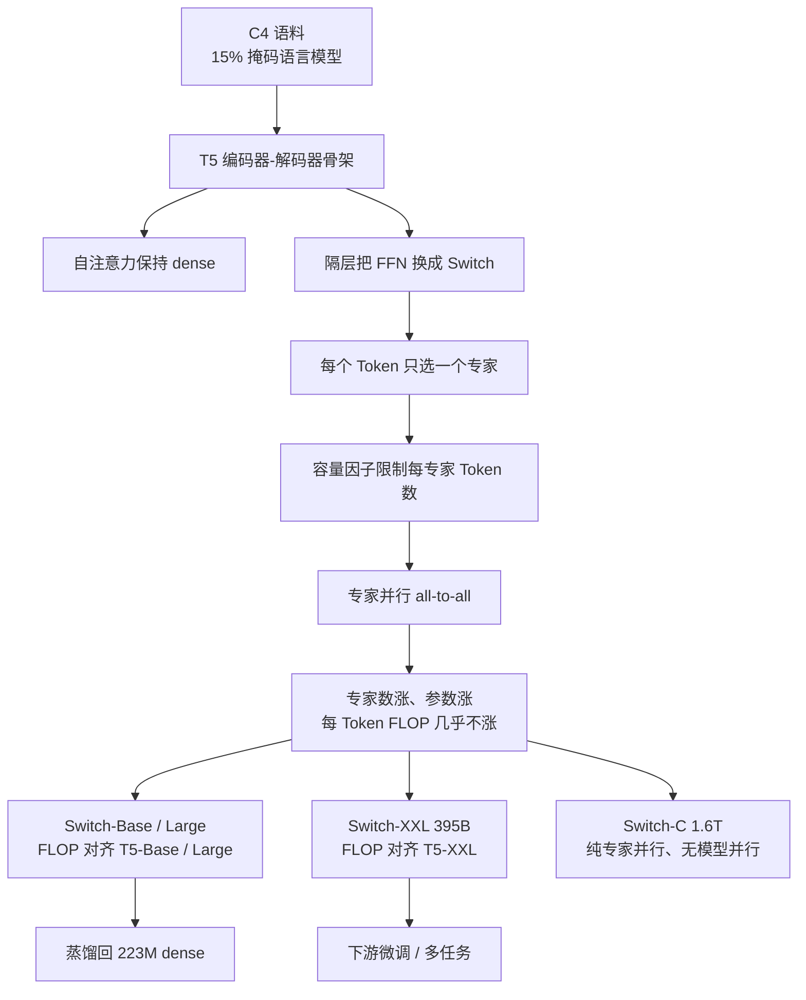
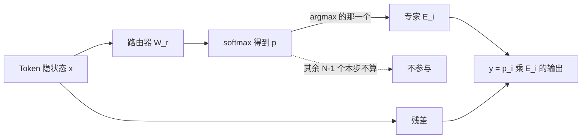

# 每个 Token 只进一个专家，参数就能涨到万亿

<!-- release-date: 2021-01-11 -->

> 本文依据 Google 的 **Switch Transformers: Scaling to Trillion Parameter Models with Simple and Efficient Sparsity**，即 arXiv:2101.03961v3（2022-06-16），共 40 页。JMLR 23 (2022)。截至核验 arXiv 最新是 v3。页码均指这份 PDF。全文把三件事分开标注：**报告明确写了什么**、**我们如何解释或验算它**、**哪些是外部资料补充**。

## 读前先把几个词说成人话

这篇论文难读的地方，不是公式多，而是它把「模型里存了多少权重」和「每个 Token 这一步要算多少」故意拆成两件事。后面所有表，都踩在这道缝上。

先把会反复出现的词说清楚：

- **Token（词元）**：模型读写文本时的最小单位。
- **Dense（稠密模型）**：每一层的全部参数，对每一个 Token 都要算一遍。参数翻倍，单次计算量大致也翻倍。
- **MoE（Mixture-of-Experts，混合专家）**：把某一层的前馈网络拆成很多个小网络（专家）。每个 Token 只让其中少数几个干活。总参数可以很大，单次浮点运算却不必跟着涨。
- **条件计算（conditional computation）**：按输入决定「算哪一部分」，而不是每次把整张网跑完。MoE 是它在 Transformer 里最常用的实现。
- **FLOPs（浮点运算次数）**：一次前向实际做了多少加减乘。本文拿「每个 Token 的 FLOPs」当计算账单，不拿总参数当账单。
- **专家容量（expert capacity）**：一个 batch 里每个专家最多接多少 Token。接满了，多出来的 Token 从残差连接「漏」过去，这一层等于没走专家。
- **容量因子（capacity factor）**：给专家容量留的余量。大于 1 是在均匀路由之外再垫一层缓冲，少溢出，但会多通信、多空转。
- **bfloat16 / float32**：两种浮点精度。bfloat16 更快、更省通信，但路由里的 softmax 更容易炸。

论文自己反复出现的几个专有设定：

- **Switch 层（Switch layer）**：每个 Token 只激活得分最高的 **一个** 专家，也就是 $k = 1$（PDF p. 5–6）。
- **隔层专家（every other feed-forward layer）**：不是每一层都换成 Switch。表 1 和大部分 Switch-Base / Large / XXL 都是每隔一层换一次前馈（PDF p. 9、p. 23）。
- **负载均衡损失（load balancing loss）**：额外一项辅助损失，逼 Token 在专家之间尽量均摊，避免所有人挤进同一个专家（PDF p. 7）。
- **选择性精度（selective precision）**：只有路由那一小段用 float32，其余仍用 bfloat16（PDF p. 9–10）。

这篇不是后来细粒度 MoE 的复述。它要证明的是更窄的一句话：把 GShard 那种 top-2 收成 top-1，路由更简单、通信更少，参数仍然能涨到万亿。本站已有 [Efficient Large Scale MoE](/reports/Meta/Efficient-Large-Scale-MoE)，那是 2022 年另一组按 FLOPs 配对的自回归对照；本文不搬它的表，也不用它的加速比口径。

## 一句话先说清

2021 年初，想把语言模型做强，通行做法还是把 Transformer 加宽、加深。Kaplan 等人已经把这条路写成幂律：模型更大、数据更多、算力更多，三者一起涨（PDF p. 4）。Dense 的麻烦在于，这三件事几乎焊死——参数翻一倍，每个 Token 的矩阵乘也大致翻一倍。

Switch Transformer 要加的是第四根轴：

> **参数可以单独涨。每个 Token 的 FLOPs 可以几乎不涨。办法是：每个 Token 只进一个专家。**

摘要把结论写得很硬（PDF p. 1）：

- 简化 MoE 路由，降低通信和计算；
- 用选择性精度、更小初始化和专家 dropout，第一次让大规模稀疏模型能用 bfloat16 稳住；
- 以 T5-Base / T5-Large 为骨架，同样计算资源下预训练最多快约 7 倍；
- 多语言上相对 mT5-Base，101 种语言都有收益，其中 91% 至少快 4 倍；
- 把语言模型推到万亿参数，相对 T5-XXL 大约快 4 倍。

对推理服务来说，口号不如边界要紧。你买到的是「同样每 Token FLOPs 下大得多的容量」，以及一条可以把稀疏老师压回小 dense 的蒸馏路径。你没有买到一份服务延迟表，也没有买到「万亿参数直接上线」的部署方案。

### 一条阅读路线

如果只有半小时读原文，建议按这个顺序：

1. **p. 5 图 2**：Switch 编码器块。两个 Token 各自只进一个 FFN 专家，输出再乘上门控值。
2. **p. 6 图 3、p. 7 式 (3)**：容量因子。均匀就刚好装满；不均就溢出，走残差。
3. **p. 9 表 1**：同一套 128 专家、32 核 TPUv3 上，Switch 对 dense T5、对 top-2 MoE。
4. **p. 10 表 2、表 3，p. 11 表 4**：精度、初始化、专家 dropout。没有这三招，万亿训不起来。
5. **p. 12 图 4、p. 13 图 5、p. 14 图 6**：专家数涨、FLOP 几乎不涨；墙钟 7 倍、相对更大 dense 仍有 2.5 倍。
6. **p. 16 表 5、p. 17 表 6–8、p. 23 表 9**：下游、蒸馏、万亿规格。服务侧真正能搬走的，多半在蒸馏和表 9。

第 5 节的三种并行第一次可以只看 5.4 和 5.6。附录 B 的「不丢 Token」和附录 A 的注意力 Switch，知道作者试过、没进主模型即可。

## 主要矛盾：参数和 FLOP 被绑在同一张账单上

论文没有从「我们做了一个万亿 MoE」开场。它先指出一条已经走通、但越来越贵的路（PDF p. 3–4）：

- 大模型有效，简单架构加数据和算力，能压过更复杂的算法；
- GPT、T5、GPT-3 走的是把 dense Transformer 做大；
- 这条路极其耗算力。

稀疏训练当时已经是活跃方向，但硬件和库仍然按稠密矩阵乘来设计（PDF p. 3）。作者因此不从任意稀疏入手，而是从 MoE 往回收：Shazeer 等人 2017、Mesh-TensorFlow、GShard 已经在机器翻译上证明「参数可以变多、计算不必等比例变多」，可是普及被三件事挡住——复杂、通信贵、训练不稳（PDF p. 3）。

于是矛盾变成：

> dense 把「能记住多少」和「每次要算多少」焊在一起。旧 MoE 声称能拆开，但 top-2 路由、两套辅助损失、float32 全精度，把节省出来的算力又花回通信和稳定性上。Switch 要问的是：每个 Token 只进一个专家，这根轴还在不在。

「用稀疏换规模」这句口号，必须被四件事分别定价：预训练墙钟、比自己更大的 dense、下游微调、以及能不能压回可部署的小模型。不能只用验证集困惑度宣布胜利。

## 先看全景：这不是一座新注意力，是一个开关

这张图是按 PDF p. 4–8、p. 22–23 的叙事重画的流程示意，不是论文原图。它要表达的是：主路径不是新注意力，而是「只改前馈 → top-1 路由 → 三种并行叠参数」。

贯穿全文的对照尺是表 9（PDF p. 23）。同一档的 Switch 和 T5，论文认为 **每个序列的 FLOPs 对齐**，参数则可以差一个数量级以上：

| 模型 | 参数 | FLOPs / 序列 | $d_{\text{model}}$ | $d_{\text{ff}}$ | 层 | 专家频率 | 专家数 |
|---|---:|---:|---:|---:|---:|---:|---:|
| T5-Base | 0.2B | 124B | 768 | 2048 | 12 | — | — |
| Switch-Base | 7B | 124B | 768 | 2048 | 12 | 1/2 | 128 |
| T5-Large | 0.7B | 425B | 1024 | 2816 | 24 | — | — |
| Switch-Large | 26B | 425B | 1024 | 2816 | 24 | 1/2 | 128 |
| T5-XXL | 11B | 6.3T | 4096 | 10240 | 24 | — | — |
| Switch-XXL | 395B | 6.3T | 4096 | 10240 | 24 | 1/2 | 64 |
| Switch-C | 1571B | 890B | 2080 | 6144 | 15 | 1 | 2048 |

表 9 上半还有 GEGLU 一列：Base / Large / XXL 都打了叉，表示前馈用 Shazeer 2020 年那种把门控乘进去的变体；**Switch-C 这一格是空的**，宽度、深度、头数都比 T5-XXL 小，因为它只用专家并行、不用模型并行（PDF p. 22–23）。

有两个数字对必须先钉住。

第一，**7B 对上的不是「另一个 7B」，是 0.2B 的 T5-Base**。两边每序列都是 124B FLOPs。$7 / 0.2 = 35$，也就是同样每 Token 计算量，总参数大约 35 倍。这句话论文没写成「35 倍」，是我们用表 9 两个参数量相除得到的。

第二，**1.6T 对上的不是 11B 的计算量，是更窄的 890B FLOPs / 序列**。$890\text{B} / 6.3\text{T} \approx 0.14$，Switch-C 每个序列大约只算 T5-XXL 的七分之一，参数却是 $1571 / 11 \approx 143$ 倍。论文说的「相对 T5-XXL 快 4 倍」（PDF p. 1、p. 23），量的是到达固定困惑度的速度，不是这道除法。两句话不要混。

图 2 把开关画成人能跟上的样子（PDF p. 5）。左边仍是标准 Transformer 块：自注意力 → 残差归一化 → 前馈 → 残差归一化。右边把那层前馈换成浅蓝色的 Switch FFN。例子里两个 Token 是「More」和「Parameters」，各自经过独立的路由器：

- 「More」以 $p = 0.65$ 进 FFN 2；
- 「Parameters」以 $p = 0.8$ 进 FFN 1；
- 其余专家这一步完全不算。

输出不是专家的裸向量，而是再乘上门控值。图注写得很清楚：实线是路由，虚线是门控缩放（PDF p. 5）。

## 核心设计：把 top-2 收成 top-1

### 旧问题：大家都觉得至少要看两个专家，梯度才不是零

Shazeer 等人 2017 年的 MoE 层，对每个 Token 表示 $x$，从 $N$ 个专家 $\{E_i(x)\}$ 里挑 **top-$k$** 个（PDF p. 5）。路由器先做一次线性投影

$$
h(x) = W_r \cdot x
$$

再 softmax 成门控

$$
p_i(x) = \frac{e^{h(x)_i}}{\sum_{j=1}^{N} e^{h(x)_j}}
$$

若 $T$ 是被选中的专家下标，层输出是门控加权和：

$$
y = \sum_{i \in T} p_i(x)\, E_i(x)
$$

当时的直觉是：$k > 1$ 才给路由器「比较两个专家」的非平凡梯度；Ramachandran 和 Le 2018 年还发现，层数多的时候，下面几层 $k$ 还得更大（PDF p. 5–6）。GShard 把这套 top-2 放进 Transformer 的前馈，做成了跨 100 种语言的翻译模型（PDF p. 24–25）。

代价是三笔同时发生的账：每个 Token 要跑两个 FFN；每个专家的 batch 至少按「接两份 Token」来预留；all-to-all 通信按两份走。论文后来说，普及被复杂度、通信和不稳定挡住，指的就是这类开销叠在一起（PDF p. 3）。

### 新设计：只留得分最高的那一个，门控值负责把梯度传回去

Switch 的改动几乎小到不像一篇论文的主贡献：$k = 1$。每个 Token 只进一个专家。层仍用式 (2)，只是 $T$ 里只剩一个下标（PDF p. 6）。

作者强调，**门控值 $p_i(x)$ 本身是可微的**。路由器并不需要第二个专家来「对比」——softmax 对没被选中的专家也有梯度，选中那一项再乘上 $p_i(x)$，梯度就能流回 $W_r$（PDF p. 6）。

人话版：门不是一把只能开或关的机械锁，它还输出一个 0 到 1 的信心。Token 只去信心最高的那间屋子干活，但「为什么是这间屋子」仍然能被学习。

这张图是按 PDF p. 5–6 的文字重画的机制示意，不是论文原图，也不表示实测耗时。残差那条线在溢出时才会真正「替专家干活」，下一小节单独讲。

论文把收益写成三条（PDF p. 6）：

1. 路由器只给一个专家派活，路由计算减少；
2. 每个专家的容量至少可以减半，因为每个 Token 不再占两个槽；
3. 实现更简单，通信更少。

### 工作机制：静态形状碰上动态路由，容量必须提前写死

实现栈是 Mesh-TensorFlow（PDF p. 6）。TPU 要求张量形状在编译期就定下来，但路由是训练和推理时才决定的。于是「每个专家算多少 Token」不能随 batch 涨落，必须写成固定容量（PDF p. 7）：

$$
\text{expert capacity} = \frac{\text{tokens per batch}}{\text{number of experts}} \times \text{capacity factor}
$$

容量因子大于 1.0，是给不均衡留缓冲。某个专家接到的 Token 超过容量，多出来的叫 **dropped tokens（丢弃的 Token）**：这一层跳过专家计算，表示沿着残差传到下一层（PDF p. 7）。容量因子太大，又会多出空白槽，白做通信和占内存。图 3 把这件事画成左右两栏（PDF p. 6）：

- 左栏容量因子 1.0：三个专家、三个设备。有的专家槽满了，红虚线标溢出，那个 Token 本层不处理。
- 右栏容量因子 1.5：同样三个专家，槽更深。溢出少了，但出现白色空槽，通信和计算都被垫高。

作者写他们实验里丢弃率通常低于 1%，而且**没有观察到丢弃率和专家数有关**；只要辅助损失的系数够大，负载就能平衡（PDF p. 7）。

附录 F 的伪代码把同一套机制写成可执行的形状变换（PDF p. 33–35）。人话顺序是：

1. 把 `[batch, seq, d_model]` 收成 `[核数, 每核 Token 数, d_model]`；
2. 路由器产出布尔的 **dispatch tensor（分发张量）** 和带门控值的 **combine tensor（合并张量）**；
3. einsum 把 Token 收成 `[专家数, 核数, 容量, d_model]`；
4. 一次 all-to-all，让「按核切分」变成「按专家切分」；
5. 每个专家跑自己的前馈，参数量是 $E \times (d_{\text{model}} \times d_{\text{ff}} \times 2)$；
6. 再一次 all-to-all 送回去，用 combine 张量乘上门控，拼回原形状。

对推理服务，这六步比「MoE」这个词更有用：你要为静态容量付空槽，要为两次 all-to-all 付延迟，还要为溢出付「这一层等于没算」。论文没有报服务延迟，但 serving 的账单已经写在这套形状里。

### 负载均衡：只留一项辅助损失，系数钉在 $10^{-2}$

旧 MoE 有两套辅助目标：负载均衡和重要性加权。Switch 跟 Mesh-TensorFlow、GShard 一样，收成一项（PDF p. 7）。对 $N$ 个专家、一个含 $T$ 个 Token 的 batch $B$：

$$
\text{loss} = \alpha \cdot N \cdot \sum_{i=1}^{N} f_i P_i
$$

其中 $f_i$ 是真正被派到专家 $i$ 的 Token 比例（argmax 之后，不可微），$P_i$ 是路由器概率在专家 $i$ 上的平均（可微）。两边都想靠近 $1/N$。乘上 $N$ 是为了让专家数变化时损失尺度不变：均匀时 $\sum (1/N \cdot 1/N) = 1/N$，再乘 $N$ 得到 1（PDF p. 8）。

$\alpha$ 扫过 $10^{-1}$ 到 $10^{-5}$，全文用 $\alpha = 10^{-2}$：够把负载拉平，又不至于压过主交叉熵（PDF p. 8）。

**我们如何解释它。** $f$ 不可微、$P$ 可微，等于在说：路由器不能直接看见「你把这个 Token 派错了」，它只能看见「你给这个专家的概率是不是太高」。辅助损失推的是概率质量，不是派发计数。计数靠容量硬切。所以负载均衡和溢出是两件套在一起、但不是同一个旋钮的事。

### 表 1：同一套 128 专家，top-1 在低容量上赢 top-2

表 1 是全文最重要的头对头（PDF p. 9）。所有 MoE 和 Switch 都用 128 专家、隔层替换前馈，32 核 TPUv3，同样步数。质量用负对数困惑度，越高越好；另报到达 $-1.50$ 的墙钟小时，以及每秒样本数。

| 模型 | 容量因子 | 100k 步质量 | 到 $-1.50$ 的小时 | 样本 / 秒 |
|---|---:|---:|---:|---:|
| T5-Base | — | $-1.731$ | 100k 步内没到 | 1600 |
| T5-Large | — | $-1.550$ | 131.1 | 470 |
| MoE-Base | 2.0 | $-1.547$ | 68.7 | 840 |
| Switch-Base | 2.0 | $-1.554$ | 72.8 | 860 |
| MoE-Base | 1.25 | $-1.559$ | 80.7 | 790 |
| Switch-Base | 1.25 | $-1.553$ | 65.0 | 910 |
| MoE-Base | 1.0 | $-1.572$ | 80.1 | 860 |
| Switch-Base | 1.0 | $-1.561$ | 62.8 | 1000 |
| Switch-Base+ | 1.0 | $-1.534$ | 67.6 | 780 |

论文自己划出三条（PDF p. 8）：

1. 固定计算和墙钟，Switch 在速度–质量上优于调过的 dense 和 MoE；
2. Switch 的计算脚印更小。把隐层从 768 加到 896、头数从 14 加到 16，做成速度对齐 MoE 的 Switch-Base+，逐步质量也最好；
3. Switch 在容量因子 1.0 和 1.25 上更强。大模型内存紧的时候，容量因子会被迫尽量小，这正好是 Switch 相对 top-2 的舒适区。

脚注 5 承认：速度既是算法也是实现。MoE 从容量因子 2.0 降到 1.25，样本 / 秒从 840 掉到 790，作者也说意外（PDF p. 8–9）。不要把表 1 的每秒样本读成渐近复杂度。

**我们如何解释它。** 容量因子 2.0 时，Switch 的 100k 步质量（$-1.554$）略差于 MoE（$-1.547$），墙钟也慢 4 小时。真正拉开的是把容量往 1.0 收：Switch 从 72.8 小时收到 62.8，MoE 反而走到 80.1。top-1 的意义不是「永远比 top-2 准」，是「在内存不够给每个专家垫两份槽的时候，质量掉得更少、跑得更快」。这才是万亿规格真正会碰到的约束。

### 可迁移启发

若你在 dense 前馈和 MoE 之间犹豫，先问 serving 能不能给每个专家留 $C \ge 2$ 的槽。留得起，表 1 并不禁止 top-2；留不起，Switch 的 $k = 1$ 是按这个约束设计的。不要把「专家数」和「每 Token 激活几个专家」当成同一个旋钮。

## 训练怎么稳住：精度、初始化、专家 dropout

稀疏专家会在每层做一次硬切换，bfloat16 又会把路由器 softmax 的数值问题放大（PDF p. 8–9）。GShard 的做法是整网 float32（PDF p. 9）。Switch 认为那太贵，尤其 all-to-all 不能广播 float32 张量。于是拆成三招，分别对付三件不同的不稳。

### 选择性精度：只把路由局部升到 float32

表 2 用 32 专家的 Switch-Base，在训练早期固定步数上比三种精度（PDF p. 10）：

| 精度 | 负对数困惑度 | 样本 / 秒 |
|---|---:|---:|
| 全程 float32 | $-1.718$ | 1160 |
| 全程 bfloat16 | $-3.780$（发散） | 1390 |
| 选择性精度 | $-1.716$ | 1390 |

做法：路由器入口转到 float32，在**本设备内部**算 dispatch 和 combine，函数结束前再转回 bfloat16。跨设备 all-to-all 仍走 bfloat16，所以速度和不稳定的纯 bfloat16 一样是 1390，质量却贴着 float32（PDF p. 9–10）。附录 F 图 15 把 `mtf.to_float32` 和最后的 `mtf.to_bfloat16` 写在同一段路由器里（PDF p. 34）。

**我们如何解释它。** 不稳发生在 softmax 的指数上，不发生在专家 FFN 的矩阵乘上。所以不必把 1.6T 参数都升精度，只要让「谁该去哪」这道分类别在 32 位里做。这和混合精度训练把损失缩放、把更新留在高精度是同一类局部化，只是这里局部化的对象是路由，不是优化器。

### 更小的初始化：默认尺度除以 10

权重从截断正态分布抽样，均值 0，标准差 $\sigma = \sqrt{s / n}$，$n$ 是 fan-in，$s$ 是尺度超参；超过两倍标准差的值会重采样（PDF p. 10）。默认 Transformer 用 $s = 1.0$。Switch 建议除以 10。

表 3 仍是 32 专家、3.5k 步、3 个随机种子（PDF p. 10）：

| 初始化 | 平均质量 | 标准差 |
|---|---:|---:|
| $0.1\times$ | $-2.72$ | 0.01 |
| $1.0\times$ | $-3.60$ | 0.68 |

平均质量明显更好，方差从 0.68 收到 0.01。作者说这套初始化从 223M 基线一直用到超过一万亿参数（PDF p. 10）。

### 专家 dropout：微调时只对专家加码

预训练之后要在小数据上微调。Switch 的参数远多于 FLOP 对齐的 dense，过拟合更狠。直接把所有层的 dropout 从 0.1 加到 0.3，表 4 上 SuperGLUE 从 73.0 掉到 70.7，比 T5-Base 的 72.4 还差（PDF p. 11）。

他们改成 **expert dropout（专家 dropout）**：非专家层保持 0.1，只把专家内部前馈的 dropout 加到 0.4。四个小任务里，这一档在 GLUE 上最高（85.2），CNNDM 追平 T5-Base 的 19.6，SQuAD 和 SuperGLUE 不掉（PDF p. 11）。注意表 4 的预训练只有 34B Token，不是后面 576B 那一套；它证明的是正则化结构，不是最终绝对分。

正式微调协议把这档超参收进去：非 Switch 层 dropout 0.1，Switch 层 0.4；batch 1M Token，16k 步，每 200 步验一次，报验证集峰值（PDF p. 14–15）。

### 可迁移启发

三招打的是三件不同的事：softmax 数值、起步爆炸、小数据过拟合。不要把「MoE 不稳」当成一种病、下一剂药。路由精度、初始化尺度、专家正则，是可以分开扫的。若服务侧会把同一套权重再量化，论文没有给量化数字——稳定性证据停在 bfloat16 训练。

## 缩放：专家数是最便宜的那根轴

第 3 节把数据瓶颈拿掉：C4 超过 180B 目标 Token，训到收益递减（PDF p. 11）。作者认为，**加专家是最划算的放大方式**，因为每个 Token 仍然只选一个专家，每 Token FLOPs 近似不变。路由器要对更多专家做一次 softmax，代价是 $O(d_{\text{model}} \times N)$，相对前馈是轻的（PDF p. 11）。

**我们如何验算「轻」**。以 Switch-Base 为例，$d_{\text{model}} = 768$、$N = 128$，路由大约 $768 \times 128 \approx 9.8 \times 10^{4}$ 次乘加；单个专家 FFN 大约 $768 \times 2048 \times 2 \approx 3.1 \times 10^{6}$。路由大约是一个专家的 3%。换到 Switch-C，$d_{\text{model}} = 2080$、$N = 2048$，路由大约 $4.3 \times 10^{6}$，单个专家 FFN 大约 $2080 \times 6144 \times 2 \approx 2.6 \times 10^{7}$，路由升到约 17%。论文仍把它叫轻量；在 2048 专家这一档，它已经不是可以随口忽略的项，只是仍远小于「把 2048 个专家都算一遍」。

### 逐步：同样 FLOPs，专家越多越样本高效

图 4 左图从 T5-Base 的 223M 出发，专家数 2、4、8……一直加到 256 专家、14.7B 参数。每 Token FLOPs 固定，测试损失随稀疏参数单调下降（PDF p. 12）。右图是负对数困惑度对训练步：紫色 dense 在最下面，16 / 32 / 64 / 128 专家依次抬上去。

关键锚点：Switch-Base 64 专家在第 6 万步达到的质量，T5-Base 要到第 45 万步，逐步加速约 **7.5 倍**（PDF p. 12）。更大的模型也更样本高效，这一点和 Kaplan 等人一致。

### 墙钟：逐步优势能不能换成时间

逐步快，不等于墙上的钟快。Switch 多了跨设备通信和路由计算（PDF p. 13）。图 5 把横轴换成训练时间，32 核 TPUv3、每样本 FLOPs 对齐：64 专家的 Switch-Base 用 T5-Base **七分之一的时间**走到同一困惑度，并且还在涨（PDF p. 13）。图上标了 `7x Speedup`。这就是摘要里「最多 7 倍」的出处。

图 6 换一个更狠的对照：不跟计算量匹配的 T5-Base 比，跟 **更大的** T5-Large 比。T5-Large 每个 Token 多算 3.5 倍 FLOPs，Switch-Base 逐步仍然更高效；墙钟上相对 T5-Large 仍有 **2.5 倍**（PDF p. 13–14）。右图同时标了相对 T5-Base 的 7.0 倍和相对 T5-Large 的 2.5 倍。

作者接着说，还可以再做一个 FLOP 对齐 T5-Large 的 Switch-Large，把这根轴继续往上推（PDF p. 14）。那就是下一节表 5 的 Large 档。

附录 D 把同一句话收到「没有超算」的尺度：2、4、8 个专家仍然压过 FLOP 对齐的 T5-Base。他们的经验是一个专家放一个核（PDF p. 29–31）。图 12 里 2 专家已经离开红线，8 专家把缝拉得更开。

### 可迁移启发

加宽 $d_{\text{ff}}$ 会同时加参数和每 Token FLOPs，很快碰到单卡内存，然后被迫上模型并行、付 all-reduce。加专家主要加参数，付的是 all-to-all。表 9 后来会把这两条路做成两个万亿候选：Switch-XXL 走「对齐 T5-XXL 的 FLOPs」，Switch-C 走「把专家加到 2048、FLOPs 反而更小」。选型时先问硬件更怕显存还是更怕 all-to-all，不要默认「专家越多越好」和「每 Token 算得越多越好」是同一方向。

## 下游：预训练优势能不能搬过去

预训练协议为了跟 T5 公平，用去重后的 C4（去掉样本内重复，任务更难），每步 $2^{20} = 1{,}048{,}576$ 个 Token，550k 步，共 576B Token（PDF p. 14–15）。$2^{20} \times 550{,}000 = 5.767 \times 10^{11}$，和论文写的 576B 对得上。微调任务覆盖 GLUE / SuperGLUE 混合物、摘要、SQuAD、ARC、闭卷问答、Winogrande、ANLI（PDF p. 15）。

表 5 是 FLOP 对齐的主结果（PDF p. 16）。挑几列把形状看清：

| 任务 | T5-Base | Switch-Base | T5-Large | Switch-Large |
|---|---:|---:|---:|---:|
| GLUE | 84.3 | 86.7 | 87.8 | 88.5 |
| SQuAD | 85.5 | 87.2 | 88.1 | 88.6 |
| SuperGLUE | 75.1 | 79.5 | 82.7 | 84.7 |
| Winogrande XL | 66.6 | 73.3 | 79.1 | 83.0 |
| XSum | 18.7 | 20.3 | 20.9 | 22.3 |
| ANLI R3 | 51.8 | 54.0 | 56.6 | 58.6 |
| ARC Easy | 56.7 | 61.3 | 68.8 | 66.0 |
| ARC Challenge | 35.5 | 32.8 | 35.5 | 35.5 |
| 闭卷 TriviaQA | 24.5 | 30.7 | 29.5 | 36.9 |

SuperGLUE 上，FLOP 对齐的 Switch 相对 T5-Base、T5-Large 分别高 4.4 和 2 个点（PDF p. 15）。Winogrande、闭卷 TriviaQA、XSum 也是大头。唯一没有赚到的是 ARC：T5-Base 在 Challenge 上高于 Switch-Base（35.5 对 32.8），T5-Large 在 Easy 上高于 Switch-Large（68.8 对 66.0）（PDF p. 15–16）。

**我们如何解释它。** 闭卷问答吃的是「参数里装了多少事实」，Switch 多出来的专家容量正好用得上。ARC 这种科学问答更吃逐步推理，而逐步推理更依赖每 Token 实际算了多少，不只依赖总参数。附录 E 后来说同一句话：上游困惑度变好，下游大体变好，但 SuperGLUE 在最大档上 dense 往往在同样困惑度下更高，TriviaQA 则可能对 Switch 更友好（PDF p. 32）。表 5 的 ARC 已经是这条缝的早期信号。

## 蒸馏：万亿训完，部署用小 dense

第 7 节把部署问题问得很直白：「我部署不了一万亿参数的模型，能不能把这些模型缩小？」（PDF p. 25）答案是：质量不能全保住，但 10 到 100 倍压缩可达到，大约留下稀疏老师质量增益的 30%。

表 6 把技术拆开（PDF p. 17）。学生一律是 223M 的 T5-Base，老师是 3.8B 的 Switch-Base：

| 做法 | 参数 | 质量（相对老师增益的比例） |
|---|---:|---|
| T5-Base 从头 | 223M | $-1.636$ |
| Switch-Base 老师 | 3800M | $-1.444$ |
| 只蒸馏 | 223M | $-1.631$（3%） |
| 再加：用老师的非专家权重初始化 | 223M | $-1.598$（20%） |
| 再加：0.75 硬标签 + 0.25 教师软标签 | 223M | $-1.580$（29%） |
| 只初始化、不蒸馏 | 223M | $-1.639$ |

FLOP 对齐保证非专家层形状相同，所以学生可以先把注意力、嵌入、非专家前馈从老师拷过来，再蒸（PDF p. 16）。只拷不蒸没有帮助（$-1.639$ 甚至略差）。两项合在一起，大约 1/20 的参数留下约 30% 的增益。

表 7 把老师从 1.1B 加到 14.7B，学生架构不变（PDF p. 18）：

| 老师参数 | 1.1B | 2.0B | 3.8B | 7.4B | 14.7B |
|---|---:|---:|---:|---:|---:|
| 老师困惑度 | $-1.505$ | $-1.474$ | $-1.444$ | $-1.432$ | $-1.427$ |
| 学生困惑度 | $-1.587$ | $-1.585$ | $-1.579$ | $-1.582$ | $-1.578$ |
| 留下的老师增益 | 37% | 32% | 30% | 27% | 28% |
| 压缩比 | 82% | 90% | 95% | 97% | 99% |

1.1B 压 82% 能留 37%；压到 99% 仍留 28%。作者提醒：老师再强再大，可能需要更大的学生才能维持这个压缩率（PDF p. 18）。

表 8 把同一套办法用到已经微调过 SuperGLUE 的 7.41B Switch-Base 上：老师 81.3，T5-Base 基线 74.6，蒸完 76.6，又是约 30%，压缩 97%（PDF p. 18）。三张表的 FLOPs 都钉在 124B，和学生、老师对齐。

**我们如何解释它。** 30% 不是「学生达到老师 30% 的绝对分」，而是「老师相对 dense 基线多出来的那截，学生拿回三成」。表 6：老师相对基线好 $0.192$，学生好 $0.056$，$0.056 / 0.192 \approx 29\%$，和论文写的 29% 一致。对服务侧，这意味着 Switch 更像训练时的容量放大器，而不是部署时的默认形态。论文自己把蒸馏列为贡献，而不是把万亿推理列为贡献（PDF p. 4）。

### 可迁移启发

若线上工具链是 dense 量化、dense batch、没有专家并行，这篇给的路径是「训练用 Switch，部署用学生」，不是「服务也上 1.6T」。学生要能接住非专家权重，所以蒸馏前先保证 FLOP 对齐、层形状对齐。老师从 1.1B 加到 14.7B，学生困惑度几乎不动（$-1.587$ 到 $-1.578$）：加专家加出来的容量，很大一块蒸不进固定尺寸的 dense。

## 多语言：101 种语言都更快

数据是 mT5 的 mC4，101 种语言，因为文字系统变体，混合物里实际是 107 个任务（PDF p. 17）。对照是 FLOP 对齐的 mSwitch-Base 对 mT5-Base，都训 1M 步。

图 7 按语言排开负对数困惑度：Switch 一条点在 dense 上面，101 种语言全部更好（PDF p. 19）。图 8 是逐步加速比的直方图：均值约 5 倍，91% 的语言至少 4 倍才能走到 mT5-Base 的最终困惑度（PDF p. 19）。加速比定义是「基线步数 / Switch 走到同一质量的步数」（PDF p. 18 脚注 9）。

作者把这读成：Switch 是有效的多任务、多语言学习者（PDF p. 18）。论文没有把专家可视化成「某种语言专用专家」，所以不要补写成语言专家已经特化——证据只到「每种语言的曲线都更好、大多数更快」。

## 三种并行叠到万亿

第 5 节先承认：只加专家会边际递减，图 4 已经看见（PDF p. 18）。互补的放大是加 $d_{\text{model}}$、$d_{\text{ff}}$，也就是把每 Token FLOPs 一起抬上去。单卡放不下就上 SPMD 模型并行。于是有五种子空间，图 9 用两行 $4 \times 4$ 的核来画（PDF p. 21）：

| 策略 | 权重大致怎么切 | 数据大致怎么切 | 通信 |
|---|---|---|---|
| 纯数据并行 | 每核一份完整权重 | Token 按核切 | 整次前后向结束才聚合梯度 |
| 纯模型并行 | 每核一块 $d_{\text{ff}}$ | 每核都留全部 Token | 前向、反向都要 all-reduce |
| 模型 + 数据 | 权重和 Token 都切 | 每核 $B/n$ 个 Token、$d_{\text{ff}}/m$ 的宽 | all-reduce 张量是 $[B/n, d_{\text{model}}]$ |
| 专家 + 数据 | 每核一个（或一组）专家 | Token 按核切，再按路由重排 | all-to-all，尺寸 $[E, C, d_{\text{model}}]$ |
| 三者一起 | 专家之间切、专家内部再切 $d_{\text{ff}}$ | Token 和宽都切 | all-to-all 加上模型并行的 all-reduce |

Switch 的默认专家+数据并行：核数 $n$ 同时等于专家数；每核本地路由；用布尔矩阵 gather；再 all-to-all 把 $E$ 维切到不同核上（PDF p. 22）。bfloat16 下，前向还要再收一份 $E \times C \times d_{\text{model}}$ 的 Token。

三者一起时，加 $d_{\text{ff}}$ 会先撑爆每核内存，于是加大模型并行度 $m$；总核数 $N = n \times m$ 固定，则 $n$ 变小，batch 只能跟着收，才能保持每核 Token 数不变（PDF p. 22）。FLOPs、通信、每核内存的最佳切法，论文说是经验定的。

### 两个万亿候选：对齐 FLOPs，还是把专家加到 2048

表 9 下半给出 250k / 500k 步的 C4 负对数困惑度（PDF p. 23）：

| 模型 | 250k | 500k |
|---|---:|---:|
| T5-Base | $-1.599$ | $-1.556$ |
| T5-Large | $-1.402$ | $-1.350$ |
| T5-XXL | $-1.147$ | $-1.095$ |
| Switch-Base | $-1.370$ | $-1.306$ |
| Switch-Large | $-1.248$ | $-1.177$ |
| Switch-XXL | $-1.086$ | $-1.008$ |
| Switch-C | $-1.096$ | $-1.043$ |

250k 步时，两个 Switch 大模型都比 T5-XXL 好超过 0.061。T5-XXL 自己再训 250k 步，只提升 0.052。我们按表验算：Switch-XXL 是 $-1.086 - (-1.147) = 0.061$；Switch-C 是 $-1.096 - (-1.147) = 0.051$。论文写「两个变体都超过 0.061」，和 Switch-C 的 0.051 对不齐，更像是以 Switch-XXL 为主的概括。500k 步时 Switch-XXL 领先 T5-XXL 达到 0.087（PDF p. 23）。脚注 10 还说这是下界：T5-XXL 训在更容易的、含样本内重复的 C4 上（PDF p. 23）。

稳定性在这里分裂。1.6T、2048 专家的 Switch-C **完全没有训练不稳**。FLOPs 大约大 10 倍的 Switch-XXL 反而偶尔不稳，所以没有按 T5 论文那样训满 1M 步（PDF p. 23）。第 8 节把这件事列为未解：稳定性技巧对 Base / Large / C 够用，对 XXL 不够；他们试过正则和改过的梯度裁剪，仍没解决（PDF p. 26）。

### 半程 checkpoint 的下游：知识任务先兑现，推理任务还没

Switch-XXL 只用 503B Token 的部分预训练，大约是 T5-XXL 文本量的一半，并且是多任务一起训、不是逐任务微调（PDF p. 24）：

- SQuAD 验证准确率 89.7，当时 SOTA 91.3；
- SuperGLUE 测试平均 87.5，T5 是 89.3，SOTA 90.0；
- ANLI 准确率 65.7，此前最好 49.4。

闭卷问答没再做 Salient Span Masking：Natural Questions 34.4 对 32.8，WebQuestions 41.0 对 37.2，TriviaQA 47.5 对 42.9（PDF p. 24）。作者的判断是：上游已经是 SOTA 困惑度，下游还没有全面变成 SOTA；目前更会把优势翻译到知识任务，而不是推理任务（PDF p. 24）。

附录 E 给了一张更刺眼的对照：C4 困惑度相近时，1.6T 的 Switch-C 在 SQuAD 上只有 87.7 精确匹配，更小的 Switch-XXL 是 89.6。XXL 每 Token FLOPs 大约是 C 的 10 倍，参数大约是 C 的 1/4（395B 对 1.6T）（PDF p. 26）。微调质量和「每 Token FLOPs」「参数量」之间的依赖，论文明确说还没看懂。

### 可迁移启发

万亿有两种买法。买 Switch-XXL，是在买「和 11B dense 同样的每 Token 计算，外加 64 个专家的容量」；买 Switch-C，是在买「2048 个专家、更少的每 Token FLOPs、更稳的训练」。若下游像闭卷问答，C 这种纯容量路线有证据；若下游像 SuperGLUE / SQuAD 推理，XXL 这种「参数少一点、每步算得更多」反而更像能兑现的那条。服务侧如果只能按激活 FLOPs 计费，C 更便宜；如果延迟被 all-to-all 和专家数绑死，2048 专家不一定更便宜。

## 对推理服务意味着什么

论文几乎不写 serving。它写的是训练墙钟、每秒样本、蒸馏后的小 dense。把同一套机制搬到推理，能确定的只有下面几条；再往外就是我们的推断，会标清楚。

**报告明确写了的。**

- 推理期路由仍是动态的，但张量形状仍是静态的，所以容量在推理时同样生效（PDF p. 7）。
- 溢出 Token 走残差，等于这一层没经过专家（PDF p. 7）。
- top-1 让每专家容量至少减半，通信更少（PDF p. 6）。
- 部署万亿不方便，蒸馏可以把稀疏老师压回小 dense，留下约 30% 增益（PDF p. 16–18、p. 25）。
- 他们推荐小规模时一个专家一个核（PDF p. 30）。
- 注意力侧的 Switch 在 bfloat16 下会发散，没有进主模型（PDF p. 27–28）。

**我们如何解释它。** 一次 Switch 前馈的服务账单可以拆成四块：路由器 $O(d_{\text{model}} N)$、两次 all-to-all（尺寸跟 $E \times C \times d_{\text{model}}$ 走）、一个专家的 FFN、以及空槽和溢出的浪费。$k = 1$ 主要砍的是后三块里「每个 Token 占两个槽」那一截。它不砍注意力，也不砍把 2048 份专家权重放进设备内存的那张显存账单。所以「每 Token FLOPs 几乎不涨」只在「专家已经放好、路由比较均匀、容量因子接近 1」时成立。Batch 变小、路由变尖，空槽比例会升，激活 FLOPs 的优势会被通信和填充吃掉。论文没有测解码 batch、没有测专家并行拓扑下的尾延迟，所以这条解释不能当成原文结论。

和本站 [Efficient Large Scale MoE](/reports/Meta/Efficient-Large-Scale-MoE) 对着读：那篇 2022 年的自回归对照把 MoE 的加速比量在训练 FLOPs 上，并公开微调是例外；本文更早，量的是 T5 式掩码预训练的墙钟，微调在多数任务上是赚的。两篇都没有服务延迟表。不要把 2021 年这套隔层 top-1、T5 骨架、蒸馏 30%，直接说成今天 MoE 基座的行为。

## 附录里几件没进主文、但对实现要紧的事

**注意力里的 Switch。** 图 10 把 Switch 插进 Self-Attention：一套专家产 query，另一套产共享的 key / value（PDF p. 28）。表 10 在 float32、32 专家、每步 524k Token 下，纯专家注意力 100k 步质量 $-1.524$，比只换 FFN 的 $-1.548$ 更好；FFN 和注意力都换是 $-1.513$。bfloat16 下，凡是带专家注意力的都发散（PDF p. 28）。主模型因此只换 FFN。

**No-Token-Left-Behind。** 溢出时另一边专家往往还有空槽。附录 B 设计两阶段：先按最高概率派，溢出的再按第二高概率派，可以迭代到几乎不丢（PDF p. 29–30）。图 11 画了红虚线从满的专家改指向还有空位的专家。假设这能涨点、更能稳住，**实验没有观察到好处**。作者猜：网络一旦学会 Token 和专家的对应，把 Token 改送到第二名会破坏这种对应（PDF p. 29）。

**探索。** 路由器是离散决策，没有反事实。表 11 比了 argmax、从 softmax 抽样、输入 dropout、输入 jitter。jitter 最好（$-1.468$），argmax 是 $-1.471$，抽样最差（$-1.570$）。全文实际用输入 jitter（PDF p. 29–30）。伪代码里对应训练时给 logits 乘上 $[1-\varepsilon, 1+\varepsilon]$ 的均匀噪声（PDF p. 34）。

**上游到下游。** 图 13 左图 SuperGLUE、右图 TriviaQA，横轴都是 C4 负对数困惑度（PDF p. 32）。小中规模上 Switch 和 dense 在同样困惑度下差不多；最大档（T5-11B / T5-XXL）上，Switch 的上游优势在 SuperGLUE 微调里兑现得不完整。作者把微调动力学标成「非常复杂，依赖正则、负载均衡和微调超参」（PDF p. 32）。

## 论文承认没做的、以及它怎么看自己

相关工作把 Switch 放进条件计算这一家，前作是 Shazeer 2017 的 LSTM-MoE、Mesh-TensorFlow 的 Transformer-MoE、GShard 的翻译 MoE。注意力稀疏（Longformer、BigBird 那一类）被明确标成互补、本文没用（PDF p. 24–25）。

讨论节用问答把自己的主张收紧（PDF p. 25–26）：

- 是不是只因为参数多才好？是，而且是故意的。参数本身是一根值得加的轴。
- 没有超算有没有用？2 个专家就已经有收益。
- 速度–精度 Pareto 上稀不稀疏？逐步和墙钟都是稀疏赢。
- 部署不了万亿怎么办？蒸馏，大约 30%。
- 为什么不用模型并行的大 dense？墙钟上 Switch 可以更高效，而且两件事不互斥，Switch-XXL 就两者都用。
- 为什么稀疏还没普及？dense 缩放太成功，再加上复杂、难训、通信贵。Switch 声称这三件都缓解了。

未来工作六条，和服务最相关的是：最大模型的稳定性仍未解决；微调质量和每 Token FLOPs、参数量的依赖没看懂；还没有一张「给定计算 / 内存 / 通信，怎么切数据、模型、专家并行」的设计图；专家目前完全同构，以后可以按难度路由到更大的专家；Switch 还可以进注意力和其他模态（PDF p. 26–27）。

## 读完该留下的判断，不是另一份摘要

把预训练、微调、蒸馏、万亿规格叠在同一句「每个 Token 只进一个专家」上，会得到一张分层的价目表：

| 你真正要买的东西 | 这篇论文支不支持用 Switch 换 | 证据 |
|---|---|---|
| 同样每 Token FLOPs 下更快的 T5 式预训练 | 支持，墙钟最多约 7 倍，逐步约 7.5 倍 | 图 4、图 5、表 1 |
| 比自己更大的 dense 仍然更快 | 支持，相对 T5-Large 约 2.5 倍 | 图 6 |
| 把容量加到万亿、相对 T5-XXL 更快 | 支持，约 4 倍；Switch-C 更稳，Switch-XXL 逐步更好但不稳 | 表 9、p. 23 |
| 多数下游微调 | 支持，SuperGLUE +4.4 / +2 点；ARC 是例外 | 表 5 |
| 知识型闭卷问答 | 支持，半程 XXL 已超过此前 T5-XXL | p. 24 |
| 推理型任务在最大档上全面 SOTA | **不支持**，SuperGLUE / SQuAD 仍落后 SOTA 和部分 T5 | p. 24、附录 E |
| 把稀疏老师蒸成可部署 dense | 支持留下约 30% 增益，最多压 99% | 表 6–8 |
| 同样显存下的服务吞吐、解码延迟 | **原文没测** | 只有训练期样本 / 秒和 all-to-all 形状 |

所以这篇 2021 年（JMLR 2022）论文真正改写的，不是「MoE 能不能做语言模型」——翻译上已经做过——而是把路由收到 $k = 1$，配上三件稳定性补丁，让第四根缩放轴第一次在 T5 骨架上训到万亿。对后来的推理服务，它留下的不是一套 serving 系统，而是一条选型原则：

> **top-1 换到的是「每 Token 一份 FFN、容量因子可以贴近 1」的训练和通信预算，不是「万亿参数可以直接上线」。** 线上若必须是 dense，走蒸馏；若可以上专家并行，先按容量因子和 all-to-all 体积定价，再决定专家数。每 Token FLOPs 和总参数哪根轴对下游有用，这篇论文已经证明两根轴不是一回事，但没有给出最终配比。

## 关键词回看

- **第四根缩放轴**：参数可以独立于每 Token FLOPs 增长。本文用 Switch 层实现。
- **Switch 层 / $k = 1$**：每个 Token 只进一个专家。梯度靠门控值 $p_i(x)$，不靠第二个专家。
- **容量因子**：专家槽位数 = 均匀份额乘这个系数。1.0 最省，也最容易溢出。
- **丢弃的 Token**：专家满了就走残差。全文丢弃率通常低于 1%。
- **负载均衡损失**：$\alpha = 10^{-2}$ 的 $N \sum f_i P_i$。只平衡概率质量，真正切槽靠容量。
- **选择性精度**：路由局部 float32，all-to-all 仍 bfloat16。纯 bfloat16 会发散。
- **$0.1\times$ 初始化**：默认尺度除以 10。从 223M 用到 1.6T。
- **专家 dropout**：微调时非专家 0.1、专家 0.4。全局加大 dropout 会伤 SuperGLUE。
- **Switch-XXL 对 Switch-C**：395B、64 专家、FLOP 对齐 T5-XXL，逐步更强但不稳；1.6T、2048 专家、无模型并行，训练更稳，推理型下游更弱。
- **蒸馏 30%**：非专家权重初始化 + 0.75 硬标签，把稀疏增益的三成装进 223M dense。

## 资料与阅读边界

### 本文依据的版本

- 本地原件：`papers/Google/Switch-Transformers.pdf`，40 页，页眉 `Journal of Machine Learning Research 23 (2022) 1-40`，页边 `arXiv:2101.03961v3 [cs.LG] 16 Jun 2022`。`pdfinfo` 给出 40 页、CreationDate 2022-06-20，与 v3 一致。
- 官方页：[arXiv:2101.03961](https://arxiv.org/abs/2101.03961)。v1 于 2021-01-11 16:11:52 UTC 提交，v2 于 2022-04-30，v3 于 2022-06-16。截至撰写时最新仍是 v3，与本地页数一致。
- 期刊：JMLR 23 (2022)，页脚 `Submitted 8/21; Revised 3/22; Published 4/22`，论文页 [v23/21-0998](https://jmlr.org/papers/v23/21-0998.html)。
- `release-date` 取 **2021-01-11**。这篇文章讲的是一项公开技术（以及后来才放出的配套权重），按「该技术首次官方公开日」取值，用 arXiv v1；不用 v3 日或 JMLR 刊出日回写。

### 报告明确写了、本文覆盖了的部分

第 1 节引言与图 1；第 2 节 Switch 层、容量、负载均衡、表 1、稳定性三招；第 3 节逐步 / 墙钟 / 对更大 dense 的缩放；第 4 节微调、蒸馏、多语言；第 5 节数据 / 模型 / 专家并行与万亿规格；第 6 节相关工作；第 7 节讨论；第 8 节未来工作；第 9 节结论；附录 A 注意力 Switch；附录 B No-Token-Left-Behind；附录 C 路由探索；附录 D 小计算量；附录 E 上游与下游；附录 F Mesh-TensorFlow 伪代码。

### 外部资料补充（不是 PDF 原文）

- 论文脚注 1、2 给出两份代码：[google-research/t5x](https://github.com/google-research/t5x) 的 JAX 实现与 checkpoint，以及 [tensorflow/mesh `moe.py`](https://github.com/tensorflow/mesh/blob/master/mesh_tensorflow/transformer/moe.py)。这一点原文有；仓库后来的目录和权重列表是论文之后的状态。
- t5x 文档 [Mixture of Experts Checkpoints](https://github.com/google-research/t5x/blob/main/docs/models.md) 列出从 Switch-Base 8 专家到 Switch-C 2048 专家（1.6T）的转换后 Mesh-TensorFlow checkpoint。Switch-XXL 这一行写的是 128 专家，而表 9 正文是 64 专家——这是发布时的配置差，不能回写进 2021 年的实验表。
- 第一作者 2022-06-14 的公开说明与 v3 时间接近：T5X/JAX 放出全部 Switch 模型，包括 1.6T 的 Switch-C 和 395B 的 Switch-XXL（[Liam Fedus 的说明](https://x.com/LiamFedus/status/1536791574612303872)）。权重开放日晚于 arXiv v1，按流程不得回写 `release-date`。
- Hugging Face 上的 [`google/switch-base-16`](https://huggingface.co/google/switch-base-16) 等权重由社区模型卡说明：这些 checkpoint 是掩码语言模型，不是开箱即用的下游模型。PDF 未写 Hugging Face 发布。
- 本站相关解读：[Efficient Large Scale MoE](/reports/Meta/Efficient-Large-Scale-MoE) 是 2022 年按训练 FLOPs 配对的自回归对照，隔层 top-2、微调是例外。GShard 是条件计算加自动分片、MoE 规模化的前作，本站仍是未解读原件。不要把 2021 年这套 T5 式 top-1 直接读成后来的细粒度 MoE。

### 原文没有公开、本文也不补的缺口

- 推理延迟、服务吞吐、解码 batch 下的容量因子、专家并行拓扑；
- 溢出 Token 的逐层比例、路由是否随训练变尖、专家是否语言 / 任务特化；
- Switch-XXL 训不满 1M 步时，不稳发生在哪些层、多频繁；
- 表 9「两个变体都超过 0.061」与 Switch-C 在 250k 步 0.051 的对账；
- 蒸馏学生的 GLUE / 闭卷问答等任务分，只有 SuperGLUE 和预训练困惑度；
- 注意力 Switch 在 float32 下更好，为何不单独用 float32 训一版主模型；
- No-Token-Left-Behind 的负结果有没有按容量因子分层。
