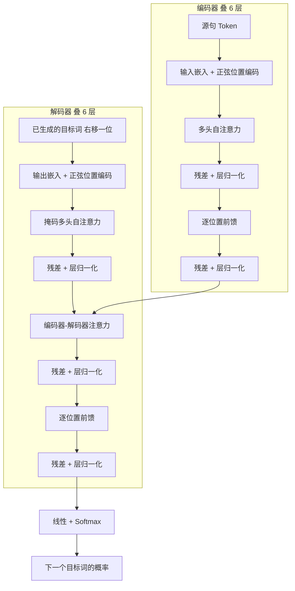
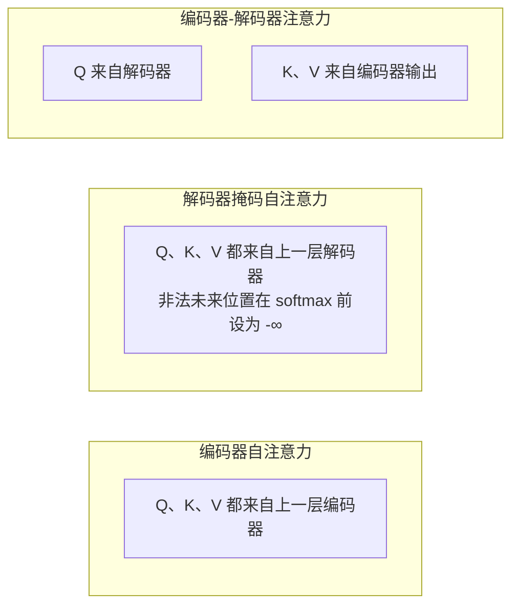
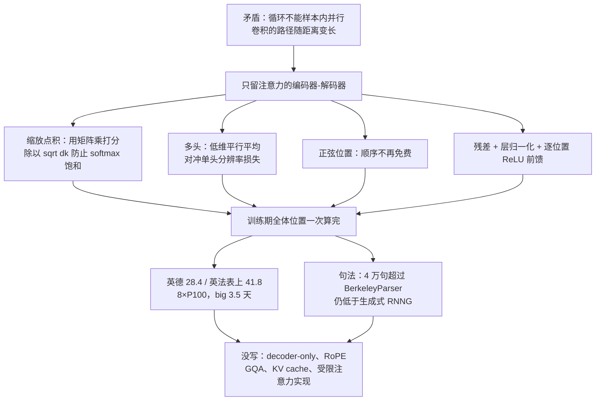

# Transformer：丢掉逐步计算之后，注意力为什么能单独撑起翻译模型

<!-- release-date: 2017-06-12 -->

> 本文依据 Google Brain / Google Research 的 **Attention Is All You Need**，即 arXiv:1706.03762v7（2023-08-02 修订），共 15 页、5 张图。动笔前已核对 [arXiv 官方页](https://arxiv.org/abs/1706.03762) 与 [官方 API](http://export.arxiv.org/api/query?id_list=1706.03762)：提交历史到 v7 为止，**本地 PDF 就是最新的 v7**，不存在更新修订。页码均指这份 15 页 PDF 本身。全文把三件事分开写：**论文明确写了什么**、**我们如何理解它**（凡属推算、换算或图上读数都会写明）、**外部资料补充**（会给出链接并标注）。

这不是当代大语言模型的入门讲义。论文写于 2017 年，任务是机器翻译，骨架是编码器—解码器。本站 [BERT](/reports/Google/BERT) 把 Transformer 编码器当已经存在的骨架，略过内部零件；本篇才是那份零件图。

## 阅读前先搭一张最小地图

后面会反复用到同一组角色。先说人话，再给名字。

- **Token（词元）**：模型读写文本时的小块。当时主要是子词，不是今天常说的 BPE 之外的新发明。
- **编码器—解码器（encoder-decoder）**：一边把源句读成一组向量，另一边按已经写出的词，一个一个吐目标句。
- **Query / Key / Value（查询 / 键 / 值）**：注意力里的三个角色。Query 是当前位置在问「我该看谁」，Key 是每个位置的索引标签，Value 是它真正带的内容。
- **自注意力（self-attention，论文也叫 intra-attention）**：Query、Key、Value 都来自同一条序列。每个位置去看这条序列里的其他位置。
- **残差连接与层归一化（residual connection + layer normalization）**：子层的输出加回输入，再按层做归一化。论文写成 $\operatorname{LayerNorm}(x + \operatorname{Sublayer}(x))$（PDF p.3）。
- **BLEU**：用 n-gram 重叠衡量译文和参考译文有多像的分数。本文所有翻译数字都是 BLEU，不是后来的人类偏好分。

这篇论文自己反复出现的名字只有一套：

- **Transformer**：完全用注意力、不用循环、不用卷积的序列转换模型。
- **缩放点积注意力（Scaled Dot-Product Attention）**：用点积打分，再除以 $\sqrt{d_k}$，然后 softmax。
- **多头注意力（Multi-Head Attention）**：把 Q、K、V 投到多个低维子空间，平行做几次注意力，再拼回来。
- **正弦位置编码（sinusoidal positional encoding）**：用不同频率的正弦 / 余弦把位置写进向量，不加可学习参数。

## 一句话先说清

2017 年最好的翻译模型，几乎都把计算按时间步排好：位置 $t$ 的隐状态必须等位置 $t-1$ 算完。注意力当时已经很常见，但论文自己写得很清楚——除了少数例外，它是**加在循环网络上的配件**，不是主干（PDF p.2）。

Transformer 要做的事更硬：

> **循环拿掉，卷积也拿掉，只留下注意力。**

它不是「注意力比 LSTM 更懂语义」这种空话。它要同时满足三件事：训练时一个句子内部可以并行；任意两个位置之间的信号路径是常数步；翻译质量还要超过当时的循环和卷积模型。

摘要里的成绩单是：WMT 2014 英德 28.4 BLEU，比此前最好结果（含集成）高 2 分以上；英法 41.8 BLEU，8 张 GPU 上训 3.5 天（PDF p.1）。句法分析是用来回答另一件事：这套骨架换任务之后还在不在。

## 先看全景：2017 年的 Transformer 长什么样

论文 Figure 1 把模型画成左右两半（PDF p.3）。左边是编码器，右边是解码器。两者都是 $N=6$ 层相同模块叠起来；解码器每层多一块「去看编码器」的注意力。

这张图根据 PDF p.3 Figure 1 重画，是**机制示意**，不代表实测耗时。图里有几处容易按后来的习惯读错，需要先钉死：

- 这是**编码器—解码器**，不是后来只留解码器的语言模型。
- 归一化在残差**之后**，也就是后来常说的 Post-LN，不是 Pre-LN。
- 解码器输入写着 shifted right：预测第 $i$ 个词时，只能看见第 $i$ 个位置之前已经生成的词（PDF p.3）。
- 层与层之间没有论文未写的「只解码器因果掩码一套打天下」。编码器的自注意力是双向的，每个位置可以看整句。

base 规格贯穿全文（PDF p.3、5、9）：

| 符号 | 含义 | base 取值 |
|---|---|---:|
| $N$ | 编码器 / 解码器层数 | 6 |
| $d_{\text{model}}$ | 残差流宽度 | 512 |
| $h$ | 注意力头数 | 8 |
| $d_k=d_v$ | 每个头的 Key / Value 维度 | 64 |
| $d_{ff}$ | 前馈中间层宽度 | 2048 |
| 参数量 | Table 3 的 base | 65M |

big 把 $d_{\text{model}}$ 提到 1024、前馈提到 4096、头数提到 16，参数 213M（PDF p.9）。英德测试集上的 28.4 BLEU 来自 big，不是 base（PDF p.8）。

## 第一层问题：循环为什么必须被拿掉

### 旧问题：一步只能走一个位置

循环网络把序列位置对齐到计算时间。位置 $t$ 的隐状态 $h_t$ 是 $h_{t-1}$ 和当前输入的函数（PDF p.2）。可以把它想成排队盖章：第 10 个人必须等前 9 个人盖完，即使这 10 个章彼此无关。

论文指出，这种顺序性会禁止**同一条训练样本内部**的并行。句子一长，显存又限制了跨样本的 batch，训练就被卡住（PDF p.2）。分解技巧和条件计算能改善效率，但「必须逐步算」这条约束还在（PDF p.2）。

### 新设计：让每个位置同时看整句

Transformer 不再沿时间展开。编码器里，一层自注意力让每个位置直接和所有位置交互；六层叠起来，仍然是常数次这种全局交互，而不是 50 个词就走 50 步循环。

### 工作机制

训练一个源句时，这一层的全部 Query 可以打成矩阵 $Q$，一次和全部 Key、Value 做完。没有「先算完第 3 个词才能算第 4 个词」这条边。解码器训练时用后面会讲的掩码，假装还没看见未来的目标词；已经合法的那些位置，仍然可以一起算。

### 收益

引言给出一个很具体的训练成本：8 张 P100 上训十二小时，就能达到新的翻译 SOTA（PDF p.2）。后文对上号：那是 base，每步约 0.4 秒，共 100,000 步（PDF p.7）。

### 代价与边界

论文自己没把推理也说成全并行。解码器生成时仍然是自回归的：吐一个词，再把它喂回去（PDF p.2）。结论甚至把「让生成少一点顺序性」列为未来工作（PDF p.10）。所以 2017 年这篇论文解决的是**训练期的逐步计算**，不是今天常说的解码期 KV 缓存。

**可迁移启发**：先分清你要消灭的顺序性发生在哪一段。训练图能并行，不等于生成也能并行。论文把这两件事分开写，是对的。

## 第二层问题：卷积也没把路径长度降到常数

当时另一条路是卷积序列模型：Extended Neural GPU、ByteNet、ConvS2S。它们可以让所有位置的隐状态一起算，这点比循环强（PDF p.2）。

但两个任意位置要发生关系，需要的运算次数会随距离增长：ConvS2S 是线性，ByteNet 是对数（PDF p.2）。卷积核宽度 $k$ 小于句子长度时，一层连不住两端；要连住，就要叠 $O(n/k)$ 层普通卷积，或者 $O(\log_k n)$ 层空洞卷积（PDF p.7）。

论文把这件事翻译成学习难度：前向和反向信号要走的路径越长，长距离依赖越难学（PDF p.6）。Transformer 把这条路径压成常数步，代价是注意力会把各个位置加权平均，分辨率变粗。论文说，多头注意力就是用来对冲这个平均效应的（PDF p.2）。

到这里，论文给自己立下的目标已经清楚：不要循环的逐步限制，也不要卷积的路径随距离变长。剩下的问题是，注意力单独上场，零件怎么接。

## 核心设计一：编码器—解码器栈

### 旧问题

2017 年有竞争力的神经序列转换模型，几乎都是编码器—解码器（PDF p.2）。源句和目标句语言不同、长度不同，一边「读懂」，一边「写出来」，这个分工当时是默认的。

### 新设计

编码器 $N=6$ 层，每层两块：多头自注意力，再加逐位置前馈。解码器也是 6 层，但每层三块：掩码自注意力、对着编码器输出的注意力、前馈（PDF p.3）。每一块外面都是残差加层归一化，输出维度统一成 $d_{\text{model}}=512$，否则残差加不回去（PDF p.3）。

### 工作机制

编码器读完整句，得到 $z=(z_1,\ldots,z_n)$。解码器每次吐一个词 $y_t$，并且把已经吐出的词再吃回去（PDF p.2–3）。解码器自注意力还加了掩码，禁止看后面的位置；再加上输出嵌入右移一位，预测位置 $i$ 时只能依赖 $i$ 之前的已生成词（PDF p.3）。

**本文的理解**：编码器在这句话上是双向的，因为它在翻译里看见了整句源文。解码器必须单向，否则训练时会偷看标准答案里还没该写的词。后来 BERT 只用编码器、GPT 只用解码器，都是从这个分叉上砍掉一半。那两件事是后话，论文没写。

### 收益

同一套残差宽度贯穿嵌入、注意力和前馈，叠层时不用改接口。6 层这个数字在消融里被比较过：2 层英德开发集 23.7 BLEU，4 层 25.3，6 层 25.8，8 层 25.5（PDF p.9）。更深不是单调变好。

### 代价与边界

论文没有解释为什么是 6 而不是别的数，也没有讨论 Post-LN 在很深的网上会不会训不动。这是 6+6、约 65M 参数的翻译模型，不是后来几百层的语言模型。

**可迁移启发**：先固定一条宽度不变的残差干线，再往上面挂子层。接口一致，消融才能只改一个旋钮。

## 核心设计二：缩放点积注意力

注意力在论文里被定义成：把一个 query 和一组 key-value 对映射成输出。输出是 Value 的加权和，权重来自 Query 与对应 Key 的相容性函数（PDF p.3–4）。

### 旧问题

当时常用的两种打分方式是加性注意力和点积注意力（PDF p.4）。点积能走高度优化的矩阵乘，更快、更省空间；但 $d_k$ 变大时，不加缩放的点积会被加性注意力超过（PDF p.4）。

论文怀疑原因是：点积的量级会随 $d_k$ 变大，把 softmax 推进梯度极小的饱和区（PDF p.4）。脚注给了一个数量级论证：若 $q$、$k$ 各维独立、均值 0、方差 1，则 $q\cdot k$ 均值 0、方差 $d_k$（PDF p.4）。方差是 $d_k$，标准差就是 $\sqrt{d_k}$。

### 新设计

把点积除以 $\sqrt{d_k}$。这就是缩放点积注意力。批量写成（PDF p.4，式 1）：

$$
\operatorname{Attention}(Q,K,V)=\operatorname{softmax}\left(\frac{QK^{\top}}{\sqrt{d_k}}\right)V
$$

Figure 2 左侧把计算图画成：Q 与 K 做矩阵乘，缩放，可选掩码，softmax，再乘 V（PDF p.4）。掩码出现在 softmax 之前，把非法位置设成 $-\infty$，经过 softmax 就变成 0（PDF p.5）。

### 工作机制

可以把它想成查表。Query 是当前要写的那个词在问问题，Key 是每个位置门上的标签，Value 是门后的内容。点积是问句和标签有多匹配；除以 $\sqrt{d_k}$ 是为了不让匹配分把 softmax 挤扁；softmax 把匹配分变成「该看谁多少」；最后按这个比例把内容加起来。

### 收益

保留点积的矩阵乘实现，又避免大维度时梯度消失。base 里 $d_k=64$，这个缩放已经够用；消融把 $d_k$ 降到 16，开发集 BLEU 从 25.8 掉到 25.1（PDF p.9）。论文据此说：判断相容性并不容易，比点积更复杂的打分函数可能有好处（PDF p.9）。

### 代价与边界

缩放是启发式。论文用「we suspect」写饱和这件事，没有单独消融「有缩放 vs 无缩放」（PDF p.4）。加性注意力也没有在 Transformer 骨架里重跑一遍，只是引用了前人在别的设定下的比较。

**可迁移启发**：换了一种更快的核，就要检查它在你真正使用的维度上会不会数值失控。除以 $\sqrt{d_k}$ 是给点积补的护栏，不是注意力的定义本身。

## 核心设计三：多头，用来对抗「平均掉细节」

### 旧问题

如果只用一个 $d_{\text{model}}$ 维的注意力头，softmax 之后是一次加权平均。论文的原话是：单头时，平均会抑制模型在不同位置关注不同表示子空间（PDF p.5）。前面已经说过，用注意力换常数路径，本来就要付「平均掉分辨率」的代价（PDF p.2）。

### 新设计

把 Q、K、V 用不同的学出来的投影，投 $h$ 次，每次投到 $d_k$、$d_k$、$d_v$ 维，平行做 $h$ 次注意力，拼起来再投回 $d_{\text{model}}$（PDF p.4–5）：

$$
\operatorname{MultiHead}(Q,K,V)=\operatorname{Concat}(\mathrm{head}_1,\ldots,\mathrm{head}_h)W^{O}
$$

$$
\mathrm{head}_i=\operatorname{Attention}(QW_i^{Q},\,KW_i^{K},\,VW_i^{V})
$$

投影矩阵的形状是 $W_i^{Q},W_i^{K}\in\mathbb{R}^{d_{\text{model}}\times d_k}$，$W_i^{V}\in\mathbb{R}^{d_{\text{model}}\times d_v}$，$W^{O}\in\mathbb{R}^{hd_v\times d_{\text{model}}}$（PDF p.5）。

base 取 $h=8$，$d_k=d_v=d_{\text{model}}/h=64$（PDF p.5）。因为每个头变窄了，总计算量和「单头、满宽度」相近（PDF p.5）。

### 工作机制

八个头不必看同一件事。附录里，同一句英文在第 5 层的不同头上，有的对齐远距离动词短语，有的对准代词所指，有的像在画句法支架（PDF p.13–15）。论文把这写成观察，不是证明「头的语义已经被监督」。

**本文的理解**：多头不是八个独立模型。它们共享同一层的输入，输出还要拼起来被 $W^{O}$ 混在一起。它更像同一双眼睛里的八个注视点，而不是八个专家网络。

### 收益

Table 3 行 (A) 在保持计算量大致不变的前提下改头数（PDF p.9）：

| 头数 $h$ | $d_k=d_v$ | 开发集 PPL | 开发集 BLEU |
|---:|---:|---:|---:|
| 1 | 512 | 5.29 | 24.9 |
| 4 | 128 | 5.00 | 25.5 |
| 8（base） | 64 | 4.92 | 25.8 |
| 16 | 32 | 4.91 | 25.8 |
| 32 | 16 | 5.01 | 25.4 |

单头比最好设置差 0.9 BLEU；头太多质量也会掉（PDF p.9）。8 和 16 在开发集 BLEU 上打平。

### 代价与边界

论文没有给出「头与头之间必须分工」的训练目标，也没有 GQA、MQA 这类让多个 Query 头共用一套 Key-Value 的设计。每个头都有自己的 $W_i^{K}$、$W_i^{V}$。那是后话，本篇没有。

**可迁移启发**：如果一条通路必须做加权平均，就准备好几条较窄的通路，让平均发生在不同子空间里。头数不是越多越好，计算量固定时存在一个够用的区间。

## 核心设计四：同一种注意力的三种用法

论文 §3.2.3 写得很短，但这是整张图能转起来的原因（PDF p.5）。多头注意力在模型里出现三次，公式相同，Q、K、V 的来源不同。

根据 PDF p.5 重画。

1. **编码器—解码器注意力**：Query 来自解码器上一层，Key 和 Value 来自编码器输出。目标句的每个位置都可以看源句所有位置。论文说这是在模仿当时 seq2seq 里已经有的那层跨注意力（PDF p.5）。
2. **编码器自注意力**：Q、K、V 都来自编码器上一层。每个源句位置看整句源句（PDF p.5）。
3. **解码器自注意力**：每个目标位置可以看自己以及左边已经生成的位置。为了保住自回归，不能让信息从右往左流；实现上就是在缩放点积里把非法连接掩成 $-\infty$（PDF p.5）。

### 收益

三种用法共用一个算子，差别只在张量从哪来、要不要掩码。训练代码可以写成同一套注意力，换输入。

### 代价与边界

编码器看见双向上下文，是因为翻译任务允许它看见整句源文。**不能**把这一层直接搬到「从左到右写文章」的语言模型里还声称论文就是这么训的。论文的解码器已经在用因果掩码；后来的 decoder-only 语言模型是把编码器整段拿掉，不是论文里的模型。

**可迁移启发**：先把算子写死，再靠 Q、K、V 的接线表达任务约束。掩码属于任务约束，不属于注意力定义。

## 核心设计五：逐位置前馈

注意力解决的是「谁该和谁说话」。说话之后，每个位置还要单独想一想。

每层的第二块（解码器是第三块）是一个对每个位置单独、但参数共享的全连接网络（PDF p.5，式 2）：

$$
\operatorname{FFN}(x)=\max(0, xW_1+b_1)W_2+b_2
$$

输入输出都是 $d_{\text{model}}=512$，中间层 $d_{ff}=2048$（PDF p.5）。不同位置用同一套 $W_1,W_2$，不同层用不同参数。论文还说，这可以看成核大小为 1 的两次卷积（PDF p.5）。

消融里，把 $d_{ff}$ 收到 1024，开发集 BLEU 25.4、参数 53M；放到 4096，BLEU 26.2、参数 90M（PDF p.9）。前馈变宽，对 base 来说是明确的加分项。

**本文的理解**：注意力混合的是位置之间的信息，前馈混合的是同一位置不同通道的信息。没有前馈，多头拼回来的向量缺少逐点非线性。论文没有把这件事说成「注意力负责检索、前馈负责记忆」——那是后来的解释，不要倒灌回去。

**可迁移启发**：位置混合和通道混合可以拆开。拆开之后，才能在消融里分别拧宽度。

## 核心设计六：正弦位置编码

### 旧问题

循环自身带着「先处理谁、后处理谁」的顺序。卷积核也有左右。Transformer 两边都没有，模型看见的只是一组向量。不把位置写进去，就无法使用词序（PDF p.6）。

### 新设计

在编码器和解码器最底部，把位置编码加到词嵌入上。两者维度都是 $d_{\text{model}}$，才能直接相加（PDF p.6）。本文用的是不同频率的正弦和余弦（PDF p.6）：

$$
PE_{(pos,2i)}=\sin(pos/10000^{2i/d_{\text{model}}})
$$

$$
PE_{(pos,2i+1)}=\cos(pos/10000^{2i/d_{\text{model}}})
$$

$pos$ 是位置，$i$ 是维度下标。每个维度对应一条正弦波，波长从 $2\pi$ 几何地排到 $10000\cdot 2\pi$（PDF p.6）。

论文选择它的假设是：对任意固定偏移 $k$，$PE_{pos+k}$ 可以写成 $PE_{pos}$ 的线性函数，因此模型容易学会相对位置（PDF p.6）。他们也试过可学习的位置嵌入，和正弦版几乎一样（Table 3 行 (E)：PPL 同为 4.92，BLEU 25.7 对 base 的 25.8）（PDF p.6、9）。选正弦是因为**可能**外推到训练时没见过的长度（PDF p.6）。

### 工作机制

可以想成给每个词发一张坐标纸。词嵌入写的是「这是什么词」，正弦编码写的是「它在第几格」。两者相加后，注意力看到的向量同时带内容和位置。

### 收益

不增加位置参数。和可学习嵌入在这篇论文的开发集上打平。

### 代价与边界

「可以外推」是假设，论文没有报更长句子上的对比实验。也没有相对位置偏置、旋转位置编码这些后来的写法。Table 3 行 (E) 只证明：在 WMT 英德开发集、训练长度分布不变时，两种写法差不多。

**可迁移启发**：顺序不是网络结构的免费附赠。拿掉循环之后，位置必须显式注入。选固定函数还是可学习表，要用「训练长度之外还要不要用」来决定，不能只看开发集打平。

## 为什么是自注意力：三条比较标准

§4 是这篇论文真正的「为什么」一节。它不比最终 BLEU，而比三种层作为序列映射时的结构性质（PDF p.6–7）。三条标准是：每层计算复杂度、最少顺序步数、任意两位置之间的最长路径。

Table 1 原文如下（PDF p.6）：

| 层类型 | 每层复杂度 | 顺序步数 | 最长路径 |
|---|---|---|---|
| 自注意力 | $O(n^{2}\cdot d)$ | $O(1)$ | $O(1)$ |
| 循环 | $O(n\cdot d^{2})$ | $O(n)$ | $O(n)$ |
| 卷积 | $O(k\cdot n\cdot d^{2})$ | $O(1)$ | $O(\log_k n)$ |
| 受限自注意力 | $O(r\cdot n\cdot d)$ | $O(1)$ | $O(n/r)$ |

$n$ 是序列长度，$d$ 是表示维度，$k$ 是卷积核宽度，$r$ 是受限注意力的邻域半径（PDF p.6）。

论文接着说：当 $n<d$ 时，自注意力比循环更快；机器翻译里用 word-piece 和 byte-pair 时，这个条件常常成立（PDF p.6–7）。句子表示的 $d$ 往往是 512 或更大，而一句翻译的 $n$ 经常更短。

他们已经看见 $O(n^{2})$ 在长序列上会疼：可以把注意力限制在半径 $r$ 的邻域，路径长度变成 $O(n/r)$，并写明这是未来工作（PDF p.7）。可分离卷积即使取 $k=n$，复杂度也只是「一层自注意力加一层逐点前馈」——而这正是他们模型里已经在用的组合（PDF p.7）。

副产品是可解释性。附录检查注意力分布：单个头会做不同的事，不少头看起来和句法、语义结构有关（PDF p.7、13–15）。这是观察，不是定量指标。

**本文的理解**：Table 1 比较的是**一层**作为序列映射的结构，不是端到端墙钟时间。卷积的顺序步数也是 $O(1)$，所以「能并行」不是 Transformer 独有的；独有的是路径长度为常数，同时还不靠把核宽拉到整句。

**可迁移启发**：论证一次架构替换时，把「算多少」「必须串行多少步」「信号要走多远」分成三张账单。只报 FLOPs，会把循环的顺序性藏起来；只报能并行，又会把卷积也算进来。

## 训练 recipe：8 张 P100、3.5 天

论文没有当代报告那种数据配比和清洗流水线。它把能复现的训练设定写在第 5 节。

### 数据与 batch

- 英德：WMT 2014，约 450 万句对，byte-pair 编码，源—目标共享词表约 37,000（PDF p.7）。
- 英法：WMT 2014，3600 万句，切成 32,000 的 word-piece 词表（PDF p.7）。
- 按近似长度组 batch；每个训练 batch 大约含 25,000 个源 Token 和 25,000 个目标 Token（PDF p.7）。

论文没写过滤规则、反翻译、还是不是用了额外单语数据。英法明显更大，这是读 Table 2 时要记住的背景。

### 硬件与步数

一台机器，8 张 NVIDIA P100（PDF p.7）：

| 模型 | 每步墙钟 | 步数 | 墙钟 | 对应结果 |
|---|---|---:|---|---|
| base | 约 0.4 秒 | 100,000 | 12 小时 | 引言里的「十二小时」；Table 3 开发集 |
| big | 1.0 秒 | 300,000 | 3.5 天 | 英德 28.4；摘要里的英法 41.8 |

big 的超参见 Table 3 最后一行（PDF p.7、9）。英法的 big 把 dropout 从 0.3 改成 0.1（PDF p.8）。

### 优化器与学习率

Adam，$\beta_1=0.9$，$\beta_2=0.98$，$\epsilon=10^{-9}$（PDF p.7）。学习率按式 (3)（PDF p.7）：

$$
\mathrm{lrate}=d_{\text{model}}^{-0.5}\cdot\min(\mathrm{step\_num}^{-0.5},\,\mathrm{step\_num}\cdot\mathrm{warmup\_steps}^{-1.5})
$$

前 $\mathrm{warmup\_steps}=4000$ 步线性升高，之后按步数平方根的倒数降（PDF p.7）。这不是后来的 cosine，也不是独立的 warmup 再接固定衰减；升和降写在同一个 min 里。

### 正则：写了「三种」，正文展开两种

§5.4 开头写「训练时使用三种正则」（PDF p.7），页底截断。下一页实际展开的是（PDF p.8）：

- **残差 Dropout**：每个子层输出在加回输入、做归一化之前 dropout；嵌入与位置编码的和也 dropout。base 的 $P_{drop}=0.1$。
- **标签平滑**：$\epsilon_{ls}=0.1$。它会伤害困惑度，因为模型被教得更不确定，但提高准确率和 BLEU。

第三种没有单独成段。句法分析一节又写：在开发集上只小范围搜索 dropout，而且点名「attention 和 residual 两种」（PDF p.9）。**本文的判断**：作者显然用过注意力 dropout，但 §5.4 没有给出独立公式或独立系数。Table 3 里只有一个 $P_{drop}$。读论文时不要把「三种正则」补写成一张完整清单。

嵌入层还做了两件和训练相关的事：输入嵌入、输出嵌入、softmax 前的线性层共享同一张权重矩阵；嵌入乘上 $\sqrt{d_{\text{model}}}$（PDF p.5）。

## 翻译实验怎么证明

评测在 WMT 2014 英德、英法 newstest2014 上。解码用 beam search，束宽 4，长度惩罚 $\alpha=0.6$，最大输出长度为输入长度 +50，能提前结束就提前结束（PDF p.8）。base 把最后 5 个每 10 分钟写一次的 checkpoint 平均成一个模型；big 平均最后 20 个（PDF p.8）。开发集消融不用 checkpoint 平均（PDF p.9）。

Table 2 是主结果（PDF p.8）。训练成本按「训练时间 × GPU 数 × 该 GPU 的单精度持续峰值估计」估算；脚注给出 P100 用 9.5 TFLOPS，K80 / K40 / M40 分别用 2.8、3.7、6.0（PDF p.8）。

| 模型 | EN-DE BLEU | EN-FR BLEU | EN-DE FLOPs | EN-FR FLOPs |
|---|---:|---:|---:|---:|
| ByteNet | 23.75 | — | — | — |
| Deep-Att + PosUnk | — | 39.2 | — | $1.0\cdot 10^{20}$ |
| GNMT + RL | 24.6 | 39.92 | $2.3\cdot 10^{19}$ | $1.4\cdot 10^{20}$ |
| ConvS2S | 25.16 | 40.46 | $9.6\cdot 10^{18}$ | $1.5\cdot 10^{20}$ |
| MoE | 26.03 | 40.56 | $2.0\cdot 10^{19}$ | $1.2\cdot 10^{20}$ |
| Deep-Att + PosUnk 集成 | — | 40.4 | — | $8.0\cdot 10^{20}$ |
| GNMT + RL 集成 | 26.30 | 41.16 | $1.8\cdot 10^{20}$ | $1.1\cdot 10^{21}$ |
| ConvS2S 集成 | 26.36 | 41.29 | $7.7\cdot 10^{19}$ | $1.2\cdot 10^{21}$ |
| Transformer base | 27.3 | 38.1 | $3.3\cdot 10^{18}$ | $3.3\cdot 10^{18}$ |
| Transformer big | **28.4** | **41.8** | $2.3\cdot 10^{19}$ | $2.3\cdot 10^{19}$ |

表中 Transformer 的 FLOPs 在原文里跨了两列，英德英法共用一个数（PDF p.8）。

几件必须分开说的事：

英德是被实验支持的硬结论。big 的 28.4 比此前最好的 ConvS2S 集成 26.36 高 2.04，对应摘要「包括集成在内高 2 分以上」（PDF p.1、8）。base 的 27.3 已经超过所有先前发表的单模型和集成，成本是 $3.3\cdot 10^{18}$（PDF p.8）。**本文换算**：这个成本大约是 ConvS2S 单模型英德 $9.6\cdot 10^{18}$ 的三分之一。

英法要读细。摘要和 Table 2 写 big 为 41.8，并称单模型新 SOTA（PDF p.1、8）。§6.1 正文却写「our big model achieves a BLEU score of 41.0」（PDF p.8）。同一份 v7 里两个数并存。本文主表跟摘要和 Table 2 的 41.8，同时标明正文是 41.0，不以我们的猜测去「修正」其中一边。base 英法只有 38.1，低于 ConvS2S 单模型的 40.46，所以「base 也超过所有先前模型」那句话出现在英德段，不能偷运到英法（PDF p.8）。

成本比较的口径是估算 FLOPs，不是延迟。英法段写 big 的训练成本不到此前 SOTA 的 1/4（PDF p.8）。用表上的数验算：ConvS2S 英法单模型 $1.5\cdot 10^{20}$，Transformer big $2.3\cdot 10^{19}$，比值约 0.15，确实小于 1/4。这是作者用持续峰值估出来的，不是机时账单。

**本文换算（不是论文原文）：** base 的 12 小时、8 卡、P100 9.5 TFLOPS，得到 $12\times 3600\times 8\times 9.5\times 10^{12}=3.283\times 10^{18}$，与表中 $3.3\cdot 10^{18}$ 一致。big 的 3.5 天同算法得到 $3.5\times 86400\times 8\times 9.5\times 10^{12}=2.298\times 10^{19}$，与 $2.3\cdot 10^{19}$ 一致。所以表上的训练成本，就是墙钟乘以这张峰值表，没有另算一次真实 FLOPs 计数器。

## 消融：哪些零件真的在干活

Table 3 全部在英德开发集 newstest2013 上，指标是按作者自己的 byte-pair 切分算的 per-wordpiece 困惑度，不能拿去和 per-word 困惑度比（PDF p.9）。未列出的超参与 base 相同。

论文自己的读表方式（PDF p.9）：

- **(A) 头数**：计算量保持不变时，单头差 0.9 BLEU；头太多也会掉。
- **(B) Key 维度**：减小 $d_k$ 伤害质量，说明相容性不好算，点积未必够。
- **(C) 深度和宽度**：更大的模型更好。$d_{\text{model}}=1024$ 到 26.0 BLEU、168M；$d_{ff}=4096$ 到 26.2 BLEU、90M。层数从 2 到 6 明显涨，8 层 BLEU 反而略低于 6 层。
- **(D) Dropout 和标签平滑**：没有 dropout（$P_{drop}=0.0$）掉到 24.6 BLEU；0.2 是 25.5，略低于 base 的 0.1 / 25.8。去掉标签平滑困惑度更好（4.67 对 4.92），BLEU 却掉到 25.3，和正文「伤害困惑度、提高 BLEU」一致。
- **(E) 可学习位置嵌入**：几乎打平。

big 在同一张开发集上是 4.33 PPL、26.4 BLEU、213M 参数、30 万步、$P_{drop}=0.3$（PDF p.9）。测试集 28.4 来自这套配置再加 checkpoint 平均和 beam search，不是开发集那一行。

消融的边界也很清楚：一次只改 base 的一个维度，没有头数×深度的交叉表，没有「去掉残差」或「去掉层归一化」，没有英法消融。

## 句法分析：换任务之后还在不在

§6.3 要回答的不是「翻译还能不能再涨 0.5 BLEU」，而是这套模型换到输出结构很强、输出比输入长得多的任务上，还能否用（PDF p.9）。论文还点了一句：RNN seq2seq 在小数据上到不了当时的句法 SOTA（PDF p.9）。

设定（PDF p.9–10）：

- 4 层，$d_{\text{model}}=1024$。
- 只在 Penn Treebank 的 WSJ 部分上：约 4 万句，词表 16K。
- 半监督：再加 high-confidence 和 BerkeleyParser 语料，约 1700 万句，词表 32K。
- 其余超参从英德 base 继承；只在 Section 22 上小范围搜 dropout（attention 与 residual）、学习率和束宽。
- 推理：最大输出长度改为输入 +300，束宽 21，$\alpha=0.3$。

Table 4，测试在 WSJ Section 23 的 F1（PDF p.10）：

| 系统 | 训练设置 | WSJ 23 F1 |
|---|---|---:|
| Vinyals & Kaiser et al. 2014 | 仅 WSJ，判别 | 88.3 |
| Petrov et al. 2006（BerkeleyParser） | 仅 WSJ，判别 | 90.4 |
| Dyer et al. 2016 | 仅 WSJ，判别 | 91.7 |
| Transformer（4 层） | 仅 WSJ，判别 | 91.3 |
| Vinyals & Kaiser et al. 2014 | 半监督 | 92.1 |
| Transformer（4 层） | 半监督 | 92.7 |
| Luong et al. 2015 | 多任务 | 93.0 |
| Dyer et al. 2016 | 生成式 | 93.3 |

论文自己的结论有两条，都不夸张（PDF p.10）：

1. 几乎没做任务特化，结果已经好于此前报道过的大多数系统，例外是 Recurrent Neural Network Grammar。
2. 和 RNN seq2seq 相反，即便只在 4 万句 WSJ 上训，也超过 BerkeleyParser。

所以句法分析证明的是**泛化到强结构输出**，不是「在句法上全面 SOTA」。生成式 RNNG 的 93.3 仍更高。

## 附录里的注意力图在看什么

附录三张图都是编码器自注意力，而且都在第 6 层里的第 5 层（PDF p.13–15）。它们不是测试集指标，是作者挑选的可视化。

Figure 3（PDF p.13）。句子大意是：自 2009 年以来，多数美国政府通过新法律，使得登记或投票过程更加困难。图上只画出动词 making 的注意力。多个头跳到远处的 more、difficult，把 making … more difficult 补完整。这是论文用来说明长距离依赖不必逐步走过去的例子。

Figure 4（PDF p.14）。句子是 The Law will never be perfect, but its application should be just …。上半张是第 5 个头的全图，下半张只画出 its 对头 5 和头 6 的注意力。its 的注意力很尖，分别指向 Law 和 application。图注写的是「apparently involved in anaphora resolution」，语气是看起来像，不是证明模型内部有一个指代模块。

Figure 5（PDF p.15）。同一句上另外两个头，图案很像在追随句子结构，而且两个头做的事明显不同。图注的原话是 heads clearly learned to perform different tasks。

**本文的判断**：这些图支持「不同头可以看不同关系」，不足以支持「头已经被解释成可命名的语言学家工具」。没有统计多少头稳定地做指代、多少头只是位置近邻。它们是附录，不是主实验。

## 论文没有公开、也没有写的部分

先说论文自己列作未来工作、因而明确**没做**的事（PDF p.10）：

- 把 Transformer 扩到文本以外的输入输出模态，例如图像、音频、视频。
- 用局部、受限注意力处理很大的输入输出。
- 让生成少一点顺序性。

再说 2017 年这篇里完全没有、后来常被倒灌进来的东西。下面每一条都标成「论文没有」，不是批评它没写。

- **Decoder-only 语言模型**：没有。这是翻译用的编码器—解码器。本站 BERT 用的是编码器一侧；GPT 一类只用解码器，都是后话。
- **RoPE、ALiBi、相对位置偏置**：没有。位置信息是正弦绝对编码，外加一次和可学习嵌入的打平实验。
- **GQA / MQA**：没有。每个头有自己的 Key、Value 投影。
- **KV Cache**：没有。论文讨论的并行是训练期；生成仍是自回归，未来工作才提到减弱生成的顺序性。
- **Pre-LN、RMSNorm、SwiGLU**：没有。归一化是子层之后的 LayerNorm，前馈中间激活是 ReLU。
- **训练数据配比、清洗、污染检查**：没有。只给了 WMT 规模和分词。
- **注意力 dropout 的独立定义**：§5.4 写「三种正则」却只展开两种；句法节提到 attention dropout，没有公式。
- **英法 41.8 与 41.0 哪一个是笔误**：论文没有勘误说明。
- **推理延迟、显存、解码吞吐量**：没有。成本全是训练 FLOPs 估算。
- **头部分工的定量统计**：附录三张图，没有表。

代码声明在 `https://github.com/tensorflow/tensor2tensor`（PDF p.10）。那是论文给出的训练与评测代码入口，不是本篇要解读的源码仓。

## 可迁移启发

### 1. 先消灭样本内的顺序边，再谈算得快不快

循环的核心限制不是矩阵乘慢，而是 $h_t$ 依赖 $h_{t-1}$，训练图无法在句子内部并行（PDF p.2）。Transformer 把这条边拆掉，十二小时的 base 才有意义。

**迁移方式**：画计算图时，把「必须等上一步」的边单独标出来。能改成同层全体位置一次算完，往往比再抠一点核性能更划算。

### 2. 路径长度是和 FLOPs 不同的一张账单

卷积已经能并行，但两端要见面，步数仍随距离长（PDF p.2、6）。自注意力用 $O(n^{2}\cdot d)$ 换 $O(1)$ 路径。这是取舍，不是免费午餐。

**迁移方式**：论证「为什么换层类型」时，至少写清复杂度、顺序步数、最长路径三项。缺一项，就可能把 ConvS2S 和 Transformer 混成「都能并行」。

### 3. 用平均换全局视野时，准备多条较窄的通路

论文自己承认注意力会平均掉分辨率，并用多头对冲（PDF p.2、5）。单头掉 0.9 BLEU，32 头也会掉（PDF p.9）。

**迁移方式**：一条 softmax 平均不够时，先加几条低维平行通路，而不是把单一注意力做宽。头数要扫，不要默认「越多越细」。

### 4. 任务约束用掩码表达，不要改算子

同一种缩放点积，靠 Q、K、V 来源和 softmax 前的 $-\infty$ 掩码，分别服务编码器、解码器和跨注意力（PDF p.5）。

**迁移方式**：能在输入和掩码上表达的约束，就不要分支出第三种注意力公式。公式分叉之后，消融和内核都会跟着裂。

### 5. 拿掉循环之后，位置必须显式给

正弦编码和可学习嵌入在这篇开发集上打平，作者仍选正弦，理由是可能外推（PDF p.6、9）。外推本身没做实验。

**迁移方式**：顺序信息从哪来，要写进设计文档。选固定函数还是查表，用「训练长度之外还用不用」当判据，不要只看现有开发集。

### 6. 报训练成本时，写清估算公式

论文把 FLOPs 定义成时间 × 卡数 × 持续峰值（PDF p.8）。我们用同一公式能对上 $3.3\cdot 10^{18}$ 和 $2.3\cdot 10^{19}$。这比只报「3.5 天、8 GPU」可核对。

**迁移方式**：成本数字至少带四件事：测的是训练还是推理、用的是 FLOPs 还是墙钟、对照谁、峰值怎么取。换一张峰值表，表 2 整列都会动。

### 7. 换任务比再刷 0.5 BLEU 更能说明骨架

句法输出更长、结构约束更强，作者几乎没改架构，只改层数、词表、束宽和长度上限（PDF p.9–10）。它没有全面超过 RNNG，但超过了小数据上的 RNN seq2seq。

**迁移方式**：宣称「通用骨架」时，至少换一个输出形态不同的任务。只在原任务上加宽加深，证明不了骨架。

## 用一张图重新串起全文

这张图是本文对全文逻辑的归纳，不对应论文中的任何一张图。

## 关键词回看

- **Transformer**：2017 年的编码器—解码器翻译模型，循环和卷积都不使用，主干是多头注意力加逐位置前馈。
- **缩放点积注意力**：$\operatorname{softmax}(QK^{\top}/\sqrt{d_k})V$。缩放是为了点积方差随 $d_k$ 变大时，softmax 还有梯度。
- **多头注意力**：h 组不同投影上的平行注意力，base 为 8 头 × 64 维，总计算量接近单头满宽度。
- **编码器—解码器注意力**：解码器的 Query 去看编码器的 Key / Value，目标词对齐源句。
- **因果掩码**：softmax 前把未来位置设为 $-\infty$，保住解码器的自回归。
- **正弦位置编码**：不同频率的 sin / cos 加到嵌入上；和可学习嵌入打平，作者因外推假设选了正弦。
- **Post-LN**：$\operatorname{LayerNorm}(x+\operatorname{Sublayer}(x))$。残差在归一化前面。
- **warmup 学习率**：前 4000 步线性升，之后按步数平方根倒数降，写在同一个 min 里。
- **BLEU 28.4 / 41.8**：测试集主结果。28.4 前后文一致；41.8 在摘要和表 2，正文 §6.1 写成 41.0。
- **受限自注意力**：只看半径 $r$ 的邻域，复杂度 $O(r n d)$，路径 $O(n/r)$。论文列为未来工作，没有实现。

## 最后的判断

这篇论文最强的叙事不是「发明了注意力」。注意力当时已经是翻译模型的配件。它真正做的是：

> **把逐步计算从训练图里拿掉，让任意两位置用常数步见面，并且用翻译和句法证明这样仍然能达到当时的质量。**

被实验支持的结论：

- 英德测试集 28.4 BLEU，超过此前包含集成在内的最好结果 2 分以上（PDF p.1、8）。
- base 英德 27.3 BLEU，训练成本约 $3.3\cdot 10^{18}$ FLOPs，低于当时的循环和卷积竞争者（PDF p.8）。
- 8 头优于 1 头 0.9 BLEU；减小 $d_k$、去掉 dropout 都会掉点（PDF p.9）。
- 4 层 Transformer 在 4 万句 WSJ 上 F1 91.3，超过 BerkeleyParser 的 90.4 和 RNN seq2seq 的 88.3（PDF p.10）。

只是作者观察或假设的部分：

- 大 $d_k$ 时点积使 softmax 饱和——原文是 we suspect，没有无缩放对照（PDF p.4）。
- 正弦编码可外推到更长序列——原文是 may allow，没有更长序列实验（PDF p.6）。
- 注意力头学到了句法 / 语义 / 指代——附录可视化，样本是挑出来的（PDF p.13–15）。
- 英法 41.8 与正文 41.0 的冲突——没有作者说明。

完全没有写、因而不能从这篇论文读出来的部分：decoder-only、旋转位置编码、分组 KV、推理期缓存、以及长序列上的稀疏注意力实现。论文已经在 §4 和结论里预告了 $n^{2}$ 和生成顺序性，但停在预告。

如果只记一句话，可以记：

> **2017 年这篇论文要换掉的不是「LSTM 不够聪明」，而是「一条句子内部必须逐步算」。注意力留下，是因为它能同时给出常数路径和可并行的训练图；多头、缩放、正弦位置和掩码，都是为了让这个替换在翻译质量上站得住。**

## 资料与阅读边界

- 原始依据：本地 `papers/Google/Transformer.pdf`，**Attention Is All You Need**，arXiv:1706.03762v7，15 页。页眉为 `arXiv:1706.03762v7 [cs.CL] 2 Aug 2023`。八位作者均等贡献、署名顺序随机。脚注写明：Jakob Uszkoreit 提出用自注意力替换 RNN 并启动评估；Ashish Vaswani 与 Illia Polosukhin 设计并实现第一版 Transformer；Noam Shazeer 提出缩放点积、多头和参数无关的位置表示；Niki Parmar 负责大量变体的实现与调参；Llion Jones 负责早期代码、高效推理和可视化；Łukasz Kaiser 与 Aidan N. Gomez 实现 tensor2tensor 并替换旧代码库（PDF p.1）。Aidan 的工作完成于 Google Brain，Illia 的工作完成于 Google Research。
- 论文页：[arXiv:1706.03762](https://arxiv.org/abs/1706.03762)。官方页显示提交历史为 v1（2017-06-12 17:57:34 UTC）至 v7（2023-08-02 00:41:18 UTC）。官方 API 的 `<id>` 为 `http://arxiv.org/abs/1706.03762v7`，`<updated>` 为 2023-08-02T00:41:18Z，**v7 即最新版，与本地原件一致**（外部核对：[arXiv API](http://export.arxiv.org/api/query?id_list=1706.03762)）。
- `release-date` 取 **2017-06-12**。理由：这是一篇技术方案，从未作为可调用的模型产品对外开放，因此按流程取「该技术首次官方公开日」。已核查的官方渠道中，最早事件是 arXiv v1（2017-06-12 17:57:34 UTC）。更晚的官方事件不回写该日期：Google Research 博客 [Transformer: A Novel Neural Network Architecture for Language Understanding](https://research.google/blog/transformer-a-novel-neural-network-architecture-for-language-understanding/) 发布于 2017-08-31；NeurIPS 2017（当时仍称 NIPS）会议论文于 2017-12-04 起收录于会议录（外部核对：[ACM DL](https://dl.acm.org/doi/10.5555/3295222.3295349) 记 Published 04 December 2017；[NeurIPS 页面](https://papers.nips.cc/paper/7181-attention-is-all-you-need)）。Hugging Face 的 `createdAt` 不采用。
- 版本差异（外部补充，不是 v7 正文）：NeurIPS 会议录摘要写单模型 1.65 亿参数、英德 27.5 BLEU、英法 41.1 BLEU，与本地 v7 摘要的 28.4 / 41.8 以及 Table 3 的 65M / 213M 不同。本地解读一律以 v7 PDF 为准，不把会议录摘要里的旧数字写进主表。v5（2017-12-06）对应会议前后修订；v6（2023-07-24）与 v7（2023-08-02）是多年后的修订，官方页未附修订说明。
- 论文给出的代码：[tensorflow/tensor2tensor](https://github.com/tensorflow/tensor2tensor)（PDF p.10）。本文没有把仓库里后来加入的实现细节冒充 2017 年论文结论。
- 本仓库内部交叉引用：编码器被单独拿去预训练，见已发布的 [BERT](/reports/Google/BERT)；把前馈换成稀疏专家，见 [Switch Transformers](/reports/Google/Switch-Transformers)。这些是后作，不是 2017 年原文的零件。
- 文中所有标为「本文的理解」「本文的判断」「本文换算」「本文的观察」的内容，都是对论文数据的二次处理，不是论文原文结论；论文原文结论一律带 PDF 页码。
