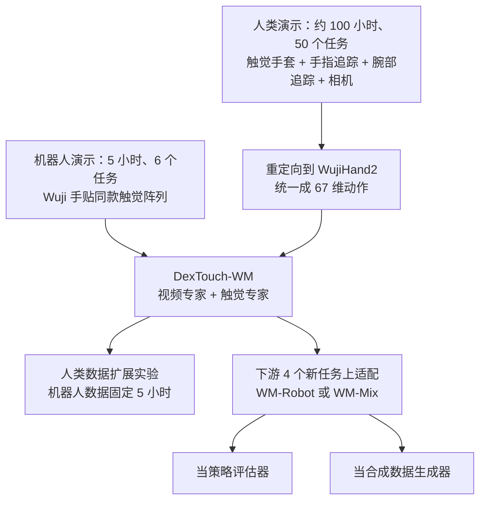
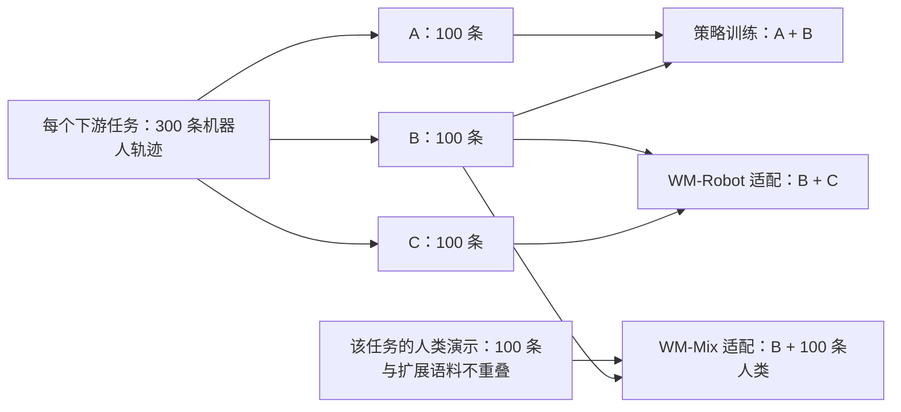

# DexTouch-WM：让戴触觉手套的人替灵巧手攒「接触经验」

<!-- release-date: 2026-09-17 -->

> 本文依据 **DexTouch-WM: Learning Action-Conditioned Tactile World Models from Human Touch for Dexterous Robot Manipulation，** 即 arXiv:2609.20649v2（v1 提交于 2026-09-17，v2 修订于 2026-09-18），共 8 页，正文 7 页加 1 页参考文献。页码均指这份 PDF 的文件页码。作者 12 人，四位共同一作；机构为 HKUST（GZ）、Xspark AI、北京大学、香港大学、清华大学，通讯作者脚注写的是 HKUST（GZ）的 Renjing Xu（PDF p. 1）。这是一篇短篇方法论文，不是基模报告：没有预训练算力、超参表与开源仓库可讲。全文把 3 件事分开写：**论文明确写了什么** （带页码）、**我们如何解释或验算它** （会写明）、**外部资料补充** （给链接并标注）。

## 读前先把几个词说成人话

这篇论文的新意不在某个网络模块，而在一个数据上的赌注：人手摸东西的经验，能不能直接拿来训练机器人手的「想象力」。先把会反复出现的词说清楚。

- **世界模型（world model）：** 给定当前观测和一串「接下来要做的动作」，预测未来会看到什么。它像一个可以反复试错的模拟器，只不过是从数据里学出来的。
- **动作条件（action-conditioned）：** 预测时把动作序列当成输入条件。同一个起点，给不同的动作，应该预测出不同的未来。
- **灵巧手（dexterous hand）：** 有多根可独立弯曲手指的机器人手，区别于只能开合的平行夹爪（parallel-jaw gripper）。本文用的是 20 个自由度的 Wuji 手（PDF p. 4）。
- **触觉图（tactile map）：** 把手上每个压力传感点的读数排成数组。一个传感点叫 **taxel** （tactile pixel，触觉像素）。
- **压阻阵列（piezoresistive array）：** 受压时电阻会变的柔性薄膜传感器，做成手套就能测整只手的压力分布。
- **双侧（bilateral）：** 左右两只手都算。本文的触觉图同时包含两只手。
- **重定向（retargeting）：** 把人手的动作换算成机器人手的关节角，因为两者的骨骼尺寸和关节结构不一样。
- **DiT（Diffusion Transformer）：** 用 Transformer 做去噪生成的网络。本文的视频部分来自预训练的视频 DiT。
- **AdaLN（Adaptive Layer Normalization，自适应层归一化）：** 用条件信号去算层归一化的缩放和偏移，常用来把扩散时间步这类条件「调制」进每一层。本文把动作也这样注入。
- **Flow matching（流匹配）：** 一种和扩散模型同族的生成训练方法，学习把噪声一步步搬运成数据的速度场（PDF p. 3 引用 Lipman 等人 2023）。
- **MoT（Mixture-of-Transformers）：** 多模态模型的一种写法：各模态保留自己的前馈层和归一化参数，只在注意力里互相看见（PDF p. 2–3）。

## 一句话先说清

接触丰富的灵巧操作，关键状态（压力、打滑、卡住）往往看不见，只能摸出来。视觉触觉世界模型能同时预测画面和触觉，但训练数据几乎都靠机器人遥操作采集，每份数据绑死在一台机器、一种传感器上，所以攒不多（PDF p. 1–2）。

DexTouch-WM 的做法是把触觉数据采集从机器人身上拆下来（PDF p. 2）：

1. 人戴一副全手压阻触觉手套干活，**机器人手上贴同一套布局的触觉阵列，** 两边的触觉观测天然同构；
2. 人的手腕、手指、头部相机运动被重定向到机器人动作空间，**两边共用一个 67 维动作向量** （PDF p. 2、p. 4）；
3. 模型是一个预训练视频专家加一个轻量触觉专家，联合预测未来 RGB 和双手触觉图（PDF p. 2–3）。

最核心的实验是控制变量式的扩展：机器人数据固定 5 小时，人类数据从 0 加到 100 小时，在没见过的机器人片段上，视觉、几何和接触预测都明显变好，而且人类任务和机器人任务完全不重叠（PDF p. 1、p. 6）。之后作者把世界模型当成策略评估器和合成数据生成器，前者效果不错，后者因策略而异（PDF p. 6–7）。

### 一条阅读路线

原文只有 7 页正文，建议按这个顺序读：

1. **p. 1 Fig. 1 与 p. 2 引言后半：** 人类数据为什么能喂机器人世界模型。
2. **p. 3 Fig. 2 与式 (2)–(4)：** 架构、残差触觉潜变量、双速率动作条件、训练目标。
3. **p. 4 Fig. 3 与式 (5)–(6)：** 共享触觉布局、67 维动作表示。
4. **p. 5 Table I：** 左半是设计消融，右半是人类数据扩展。这是全文最硬的一张表。
5. **p. 6 Table II–III：** 世界模型当策略评估器。
6. **p. 7 Table IV–V、Fig. 5：** 世界模型当数据生成器，结果有正有负。

## 主要矛盾：触觉最值钱，也最难攒

论文开场的逻辑是三步（PDF p. 1–2）：

1. 灵巧操作由看不见的物理接触状态支配。画面相似的两段动作，接触压力、打滑、是否快卡住可能完全不同，手挡住物体时更是如此。
2. 所以只预测视频的世界模型，表示不了决定操作成败的接触动力学。已有的视觉触觉世界模型（VT-WM、ViTacWorld、Dream-Tac、VT-WAM 等）用联合预测补上了这一块。
3. 但这些模型的触觉轨迹大多靠机器人遥操作采集，数据集和具体本体、具体传感器绑定。想要更多数据，就得继续开同一台机器，所以触觉数据集一直很小，而且多是平行夹爪或孤立的指尖传感器。

于是矛盾变成：

> 触觉世界模型需要大量「动作 → 接触变化」的样本，而机器人上的触觉样本又贵又不可迁移。能不能找一个不依赖机器人、规模能上去的数据来源，让它监督的正是机器人要用的那个世界模型？

作者的回答是人手。但他们也承认，硬件对上还不够（PDF p. 2）：全手触觉点分布在互不相连的指尖和手掌上，当成一张普通图片处理会引入虚假的邻接关系；第一视角的双手动作又同时混着手指运动和相机运动，还要和不同采样率的视觉、触觉流对齐。论文的方法部分，就是依次拆这几个难题。

## 先看全景

Fig. 1 的中间一行把任务定义画得很直白：输入是当前 RGB、当前触觉和动作序列，输出是未来 RGB 和未来触觉（PDF p. 1）。图上方那对「Human tactile / Robot tactile」热图之间标着「Aligned contact representation」，这就是全文的前提：两边的触觉图长得一样，才可能共享一个模型。

下面这张图按 PDF p. 2–4 的方法描述和 p. 6–7 的实验流程重画，是流程示意，不是论文原图：

要点是：人类数据和机器人数据进的是**同一个模型、同一套输入格式，** 不需要学一个「人触觉到机器人触觉」的映射（PDF p. 4）。

## 问题怎么写成一个式子

给定初始 RGB 观测 $v_0$、初始双手触觉图 $x_0$、语言指令 $\ell$ 和未来的位姿序列 $a_{1:T}$，模型学的是未来视频和触觉的联合分布（PDF p. 2，式 1）：

$$
p_\theta\bigl(v_{1:T},\, x_{1:T} \mid v_0,\, x_0,\, a_{1:T},\, \ell\bigr)
$$

注意两点。第一，视频和触觉是**联合**生成的，不是先生成视频再从视频推触觉。第二，条件里的动作 $a$ 是机器人坐标系下的位姿序列，人类数据也要先换算成这个格式才能用。

人类演示原始记录的是手腕位姿、25 个关键点的手部骨架和头部相机运动（PDF p. 2）。重定向之后，两个域都用同一个 67 维位姿表示：左右手腕运动、左右手各 20 自由度的手部构型、头部相机运动（PDF p. 2、p. 4，式 6）：

$$
a_t = \bigl[e^L_t,\; e^R_t,\; q^L_t,\; q^R_t,\; e^c_t\bigr] \in \mathbb{R}^{67}
$$

$e$ 是相对第一帧的手腕（或相机）运动，$q \in \mathbb{R}^{20}$ 是手部关节构型（PDF p. 4）。

**我们如何解释它。** $67 - 2 \times 20 = 27$，剩下 27 维分给左腕、右腕、相机三个位姿，平均每个 9 维。论文没写这 9 维怎么参数化；「3 维平移加 6 维旋转」恰好是 9 维，是常见写法，但这只是我们的推测，原文没有给。

## 核心设计一：同一套触觉布局，同时贴在人手和机器人手上

### 旧问题：触觉数据绑死在本体上

遥操作采集的触觉数据，传感器型号、贴的位置、分辨率都是那台机器专属的。换一台机器人，旧数据就用不上了（PDF p. 1–2）。

### 新设计：可穿戴的全手压阻阵列，机器人手贴同款

作者用轻量压阻手套记录人手自然操作时的双手全手压力，并把**同一套传感布局**装到机器人灵巧手上（PDF p. 2）。

具体数字（PDF p. 3–4）：

- 每只手套记录 360 个 taxel，采样率 60 Hz（PDF p. 4）；
- 训练只保留其中 320 个：5 块 4×4 指尖阵列和 1 块 15×16 手掌阵列（PDF p. 3、p. 4 Fig. 3 图注）；
- 同一套 320 点布局装在机器人手上，两个域共享一个触觉观测空间（PDF p. 4）。

我们验算过：$5 \times 16 + 15 \times 16 = 80 + 240 = 320$。被舍掉的 40 个点在哪里、为什么舍掉，论文没写。

### 人类数据怎么采：HumanTouch

采集系统叫 HumanTouch（PDF p. 3–4）。采集者在 Manus MetaGloves（手指追踪手套）里面再戴一层 Moxian 触觉手套；HTC Vive 追踪器给出手腕的 6 自由度位姿；两个腕部相机加一个头部相机分别记录局部手物交互和整体工作台。每次采集会标定相机内参、相机到追踪器的外参和统一的时间基准，还有设备监控来发现丢失或异常的数据流。手指追踪加手腕位姿合成 25 关键点的 3D 手部骨架。每条轨迹存 RGB、触觉图、骨架、手腕位姿和元数据（PDF p. 4）。

人类数据分两份（PDF p. 4）：

- 世界模型预训练：约 100 小时第一视角交互，覆盖 50 个日常双手任务，包括搬运、抓取与重新抓取、撞击、插入、铰接物体与可变形物体、持续多区域接触；
- 下游适配：另外为 4 个下游任务单独采的人类演示，与上面的预训练语料不重叠。

两份加起来就是实验设置一节说的「54 个任务」（PDF p. 4）。

**我们如何解释它。** 这里真正省掉的是「必须开着机器人才能采触觉」这一条约束。人手操作不需要遥操作系统、不怕撞坏机器，任务种类也更自然。代价是你得在机器人手上做一套和手套完全同构的传感器，这条路对传感器形态有硬要求，换一种触觉原理（比如视觉触觉传感器 GelSight 一类）就不能直接照搬。

### 可迁移启发

跨本体迁移，先想办法让**观测空间在硬件层面就对齐，** 比事后学一个跨域映射便宜得多。论文明确说这套对齐「不需要学一个触觉域映射」（PDF p. 4）。能从传感器设计上消掉的域差，就别留给模型去学。

## 核心设计二：把人手动作翻译成机器人动作

### 旧问题：触觉对上了，运动学没对上

人手和机器人手的骨骼长度、关节位置不一样。直接把人手关键点喂进模型，机器人域用的时候动作空间对不上（PDF p. 4）。

### 新设计：标定、归一化、逆运动学重定向

作者先用相机与世界坐标系的标定，把追踪到的人手运动搬到机器人参考系；再对手部几何做归一化，抹掉形态差异；最后用逆运动学映射重定向到 WujiHand2（PDF p. 4，式 5）：

$$
\bigl(e^h_t,\, J^h_t\bigr) \xrightarrow{\;\mathcal{A}\;} \bigl(e^r_t,\, q^r_t\bigr)
$$

左边是人手腕位姿 $e^h_t$ 和手部几何 $J^h_t$，右边是机器人末端位姿 $e^r_t$ 和 20 自由度手部构型 $q^r_t$。论文说这一步「去掉人特有的动作坐标，同时保留演示出的手部运动」（PDF p. 4）。所有数据流在切训练窗口之前先做同步（PDF p. 4）。

逆运动学用的具体求解器、目标函数、归一化公式，论文都没写。

### 可迁移启发

世界模型的动作条件是它和下游策略的接口。把人类数据先翻译到**目标本体的动作空间，** 训练出来的模型在机器人上直接可用；反过来，如果动作空间留在人手坐标，机器人用的时候还得再做一次翻译，误差会叠在模型外面。

## 核心设计三：大视频专家加小触觉专家，只在注意力里见面

### 旧问题：从零训一个视觉触觉模型太贵，硬拼又互相干扰

视频生成已经有很强的预训练模型，触觉没有。如果把触觉当成新模态塞进视频模型，要么破坏视频模型已学到的东西，要么触觉被视频压着学不好。

### 新设计：Mixture-of-Transformers 双专家

结构按 Fig. 2 与 p. 2–3 的正文（PDF p. 2–3）：

- **视觉专家：** 从 Wan2.2-TI2V-5B 及其视频 VAE 初始化；
- **触觉专家：** 论文只说是「轻量」的 TactileDiT，没给层数和参数量；
- **怎么交互：** 照 MoT 的做法，两路在每一层 Transformer 里通过带掩码的联合自注意力交换上下文，各自保留自己的前馈层；Fig. 2 还画出各自保留的 AdaLN 与交叉注意力；
- **条件：** 初始 RGB 帧经冻结的视频 VAE 编码，作为时间位置 0 的干净潜变量保留，后续视频潜变量加噪后被预测；语言指令过冻结文本编码器，初始触觉状态也作为上下文；
- **输出：** 冻结的视频解码器和冻结的 Split-Hands 触觉解码器，把预测的潜变量还原成未来 RGB 和压力图。

**外部补充。** 按 [Wan2.2 官方仓库](https://github.com/Wan-Video/Wan2.2) 的说明，TI2V-5B 是一个同时支持文生视频和图生视频的 5B 模型，配套的 Wan2.2-VAE 压缩比是 16×16×4。这和论文说的「未来帧在时间上压缩 4 倍」对得上（PDF p. 3），但空间压缩比、分辨率这些，论文没有写。

**我们如何解释它。** 这是一种「借大模型、挂小专家」的做法：视频先验几乎全部来自预训练，触觉专家只要学接触动力学和它与画面的对应。联合注意力让画面里的手部运动能提示触觉（比如手指靠近物体，压力快来了），也让触觉反过来约束画面。论文说两个模态之间**没有额外的对齐损失，** 只靠联合注意力耦合（PDF p. 3）。

### 可迁移启发

给一个成熟的单模态生成模型加新模态时，MoT 式的「共享注意力、分开 FFN 和归一化」是一个低风险的起点：旧模态的计算路径基本不动，新模态有自己的参数，交互只发生在注意力里。

## 核心设计四：按解剖结构切的触觉分词器 Split-Hands

### 旧问题：把全手触觉当一张图，会凭空造出邻居

手掌和指尖在手上是分开的，但如果把它们拼进一张 2D 画布，卷积核会把拇指边缘和手掌边缘当成相邻像素（PDF p. 3、p. 5）。这些「邻居」在物理上根本不相连。

### 新设计：指尖一个编码器，手掌一个编码器，再贴身份标签

做法（PDF p. 3）：

1. 先把左右两只手对齐到同一个解剖坐标系；
2. 10 个指尖共用一个编码器，2 个手掌共用另一个编码器；
3. 加上 **pad identity embeddings（阵列身份嵌入），** 让模型知道这块数据来自哪根手指、哪只手，同时局部压力特征仍然共享；
4. 这个分词器先单独用**接触加权重建**预训练，然后在世界模型训练时冻结。

接触加权的理由是：大量没被压到的 taxel 读数接近零，不加权的话它们会主导表示（PDF p. 3）。

### 证据：Fig. 4 的两条曲线

对照组叫 Grid：把整张触觉图当一个空间画布，手掌和指尖用同一个 CNN 一起编码（PDF p. 5）。

读图（PDF p. 5，读自 Fig. 4，数值为目测）：

- 重建损失：训练到 20000 步时，Split-Hands 大约在 $10^{-4}$ 量级，Grid 大约在 $2\times10^{-3}$ 到 $3\times10^{-3}$ 之间，差了一个多数量级；
- 接触 IoU：Split-Hands 在约 2500 步时已接近 1.0，Grid 要到约 7500 步以后才追上；两者最终都接近 1.0。

论文的结论是：保留解剖结构对稀疏、局部的接触模式是更有效的归纳偏置，之后所有实验都用 Split-Hands（PDF p. 5）。

**我们如何解释它。** 右图说明两者最后都能把「哪里有接触」认出来，差别主要在收敛速度；左图说明「压力值本身」的重建精度差得多。这组消融只在 5 小时机器人数据上做（PDF p. 5），也只比了分词器自身的重建，没有报告换成 Grid 之后整个世界模型的预测指标。

### 可迁移启发

传感器排布不是规则网格时，别急着把它拼成图片。**按物理拓扑分组、组内共享编码器、组间用身份嵌入区分，** 这个思路对任何「分布式、分块」的传感器都适用，比如多相机阵列、分布在不同部位的 IMU。

## 核心设计五：以初始触觉为锚的残差潜变量

### 旧问题：静态压力背景会吃掉模型的注意力

一次操作开始时，手可能已经握着物体，触觉图上有一块稳定的压力背景。如果直接预测每一帧的绝对触觉，模型可能大部分精力都花在「把这块背景原样抄一遍」上。

### 新设计：只预测相对第一帧的变化

设触觉编码器是 $E_x$、解码器是 $D_x$，$z_t = E_x(x_t)$。模型预测的是相对初始触觉潜变量的差（PDF p. 3，式 2）：

$$
r_t = z_t - z_0, \qquad \hat{x}_t = D_x\bigl(z_0 + \hat{r}_t\bigr)
$$

$r_t$ 是第 $t$ 步相对第 0 步的潜变量残差，$\hat{r}_t$ 是模型的预测。解码前把 $z_0$ 加回去。干净的 $z_0$ 一直作为上下文可见（PDF p. 3）。

论文的说法是：残差预测让模型聚焦于交互引起的变化，同时保住初始压力背景（PDF p. 3）。

**我们如何解释它。** 这和视频预测里「预测帧差」、控制里「预测状态增量」是同一个思路：把容易的部分（不变的背景）交给结构，把模型容量留给难的部分（接触怎么变）。论文没有给出「残差 vs 绝对值」的单独消融，所以这项设计的收益目前只有动机，没有数字。

## 核心设计六：双速率动作条件，AdaLN 注入

### 旧问题：视频和触觉的时间分辨率不一样

视频 VAE 是因果的：第一帧单独保留一个潜变量，之后每 4 帧压成一个潜变量；触觉分词器不压时间，保留原始观测速率（PDF p. 3）。如果用同一份动作序列去条件两个流，总有一边的时间对不上。

### 新设计：各按各的时间分辨率喂动作

每个流在自己的潜变量分辨率上接受条件（PDF p. 3，式 3）：

$$
c^v_j = \phi_v\bigl(a_{4j-3:4j}\bigr), \qquad c^x_t = \phi_x\bigl(a_t\bigr)
$$

$c^v_j$ 是第 $j$ 个未来视频块的条件，由对应的 4 帧动作经 $\phi_v$ 编码得到；$c^x_t$ 是第 $t$ 个触觉步的条件，直接用那一帧的动作；初始位置的条件 $c^v_0 = c^x_0 = 0$（PDF p. 3）。

动作内容是：相对第一帧的手腕和相机运动，加上**绝对**的手部关节角（PDF p. 3）。这些信号通过 AdaLN 注入每个专家的时间步调制里（PDF p. 3）。Fig. 2 中间那条横跨两个专家的「Pose AdaLN」就是这一步（PDF p. 3）。

**我们如何解释它。** 手腕和相机用相对量，是因为不同片段起点的绝对位置没有意义；手指关节用绝对量，是因为「手指弯到多少度」本身就决定了会不会碰到东西。视频按 4 帧一块取动作，是在迁就 VAE 的时间压缩；触觉逐帧取，保住了接触发生那一瞬间的细节。

### 为什么选 AdaLN 而不是交叉注意力

这是 Table I 左半边回答的问题（PDF p. 5–6）。三个变体都只用 5 小时机器人数据：

- **V-only：** 只预测视频，动作用交叉注意力注入；
- **Cross-Attn：** 视觉触觉联合模型，动作仍用交叉注意力注入；
- **Robot-only：** 把注入方式换成 AdaLN，即 Split-Hands 加 AdaLN。这就是后面扩展实验的起点。

结论分两步（PDF p. 5–6）：

1. **加触觉、用交叉注意力，像素指标几乎不变，高层指标变差。** PSNR、SSIM 和 LPIPS 与 V-only 基本持平，但语义对齐从 0.829 掉到 0.788，轨迹准确率从 0.884 掉到 0.850（PDF p. 5，Table I）。作者的解读是：直接用交叉注意力耦合触觉流，不伤像素重建，但会在动作条件的高层动力学上引入跨模态干扰。
2. **换成 AdaLN，干扰大部分消失。** 相对 Cross-Attn，视觉 PSNR 从 22.130 到 23.473，LPIPS 从 0.118 到 0.098，轨迹准确率恢复到 0.891，略超 V-only 的 0.884；触觉侧接触 IoU 从 0.388 到 0.415，接触 F1 从 0.523 到 0.551（PDF p. 5，Table I；p. 6 正文给的是保留一到两位小数的近似值）。

**我们如何解释它。** Table I 里也有不支持「AdaLN 全面更好」的格子：Robot-only 的几何误差 0.131 是三者里最差的（V-only 0.128），JEPA 相似度 0.864 和语义对齐 0.813 也低于 V-only 的 0.870 和 0.829（PDF p. 5）。论文正文没有讨论这几格。差距都不大，但说明「加触觉不伤视频」这件事，在只有 5 小时机器人数据时并没有完全做到。

## 训练目标

两个专家都用条件流匹配训练，总损失是视频项加权重为 $\lambda_{\mathrm{tac}}$ 的触觉项（PDF p. 3，式 4）：

$$
\mathcal{L} = \mathcal{L}^{\mathrm{FM}}_{\mathrm{video}} + \lambda_{\mathrm{tac}}\,\mathcal{L}^{\mathrm{FM}}_{\mathrm{tactile}}
$$

三个细节（PDF p. 3）：

- 初始视觉潜变量不算预测损失，它是条件，不是目标；
- 触觉项预测的是式 (2) 的残差，而且只在「有接触或随时间变化」的 token 上计算，减少静止无接触区域的影响；
- 两个模态之间没有对齐损失，只靠联合注意力耦合。

$\lambda_{\mathrm{tac}}$ 的取值、「有接触」的判定阈值，论文都没给。

**我们如何解释它。** 触觉损失只看接触和变化区域，与分词器的接触加权重建、残差潜变量是同一个方向的第三道保险：三处都在防止「大片零读数」把模型带偏。这是本文在触觉建模上最一致的一条设计原则。

## 数据与评测怎么设

### 机器人数据

机器人是 Tianji 机械臂加 20 自由度的 Wuji 灵巧手，手上装和人类采集相同的全手压阻手套（PDF p. 4）。共 10 个灵巧操作任务（PDF p. 4）：

- 6 个任务提供 5 小时世界模型预训练数据；
- 另外 4 个任务与预训练任务不重叠，用于下游适配和评估。

每条轨迹包含同步的 RGB、全手触觉和机器人关节轨迹（PDF p. 4）。

### 指标

视觉侧沿用 WorldArena 的多维评测协议和 GigaWorld 面向评估器的分析（PDF p. 4）：

| 维度 | 指标 | 测什么 |
|---|---|---|
| 像素保真 | PSNR、SSIM、LPIPS | 预测画面和真值逐像素、结构、感知上有多像 |
| 外观 | Aesthetic Quality、Image Quality | 画面本身好不好看、清不清楚 |
| 表征与语义 | JEPA Similarity、Subject Consistency、Semantic Alignment | 在表征空间和语义上是否一致 |
| 动作 | Trajectory Accuracy | 画面里的运动是否跟着给定动作走 |
| 几何 | Geometry Error | 几何一致性 |

触觉侧分两类（PDF p. 4）：

- 连续信号重建：$\mathrm{PSNR}_{\mathrm{taxel}}$、$\mathrm{SSIM}_{\mathrm{taxel}}$、$\mathrm{LPIPS}_{\mathrm{heatmap}}$、MSE、MAE；
- 接触动力学：Contact-MAE、Contact-IoU、Contact-F1。

作者专门解释了为什么要加第二类：平均重建误差会被大片无接触区域主导，掩盖稀疏但关键的接触（PDF p. 4）。

各指标的具体计算方式（比如 Trajectory Accuracy 怎么从视频里提取轨迹、Contact-IoU 的接触阈值），论文只给了名字和出处，没有展开。

## 实验一：人类数据能不能扩展机器人世界模型

这是全文的中心实验。起点是 Robot-only（Split-Hands 加 AdaLN、0 小时人类数据），机器人数据固定 5 小时不变，分别加入 10、50、100 小时人类数据；加 100 小时的那个模型就是 DexTouch-WM，也是后面下游适配的初始化（PDF p. 6）。所有变体在同一批留出的机器人片段上评估，这些片段来自 6 个机器人操作任务；人类任务集和机器人任务集不重叠，所以提升说明的是跨任务迁移，而不是同任务的数据增强（PDF p. 6）。

下表是原文 Table I 全表（PDF p. 5），左三列是设计消融，右三列是人类数据扩展。所有列都用 5 小时机器人数据；↑ 越高越好，↓ 越低越好。

| 模态 | 能力 | 指标 | V-only | Cross-Attn | Robot-only | +10h 人类 | +50h 人类 | +100h 人类 |
|---|---|---|---:|---:|---:|---:|---:|---:|
| 视觉 | 像素保真 | PSNR ↑ | 22.099 | 22.130 | 23.473 | 24.032 | 26.874 | 27.096 |
| 视觉 | 像素保真 | SSIM ↑ | 0.799 | 0.801 | 0.824 | 0.838 | 0.886 | 0.890 |
| 视觉 | 像素保真 | LPIPS ↓ | 0.117 | 0.118 | 0.098 | 0.084 | 0.048 | 0.048 |
| 视觉 | 外观 | Aesthetic Quality ↑ | 0.406 | 0.405 | 0.400 | 0.404 | 0.414 | 0.414 |
| 视觉 | 外观 | Image Quality ↑ | 0.718 | 0.717 | 0.718 | 0.717 | 0.723 | 0.724 |
| 视觉 | 表征 | JEPA Similarity ↑ | 0.870 | 0.860 | 0.864 | 0.894 | 0.917 | 0.924 |
| 视觉 | 表征 | Subject Consistency ↑ | 0.689 | 0.681 | 0.751 | 0.740 | 0.748 | 0.751 |
| 视觉 | 语义 | Semantic Alignment ↑ | 0.829 | 0.788 | 0.813 | 0.835 | 0.866 | 0.860 |
| 视觉 | 动作 | Trajectory Accuracy ↑ | 0.884 | 0.850 | 0.891 | 0.900 | 0.962 | 0.962 |
| 视觉 | 几何 | Geometry Error ↓ | 0.128 | 0.130 | 0.131 | 0.112 | 0.102 | 0.100 |
| 触觉 | 重建 | $\mathrm{PSNR}_{\mathrm{taxel}}$ ↑ | – | 24.132 | 24.813 | 24.349 | 28.401 | 29.179 |
| 触觉 | 重建 | $\mathrm{SSIM}_{\mathrm{taxel}}$ ↑ | – | 0.795 | 0.810 | 0.823 | 0.876 | 0.896 |
| 触觉 | 重建 | $\mathrm{LPIPS}_{\mathrm{heatmap}}$ ↓ | – | 0.009 | 0.008 | 0.008 | 0.003 | 0.002 |
| 触觉 | 重建 | MSE ↓ | – | 0.105 | 0.093 | 0.108 | 0.038 | 0.029 |
| 触觉 | 重建 | MAE ↓ | – | 0.075 | 0.069 | 0.069 | 0.040 | 0.035 |
| 触觉 | 接触 | Contact-MAE ↓ | – | 0.880 | 0.806 | 0.819 | 0.580 | 0.516 |
| 触觉 | 接触 | Contact-IoU ↑ | – | 0.388 | 0.415 | 0.417 | 0.534 | 0.588 |
| 触觉 | 接触 | Contact-F1 ↑ | – | 0.523 | 0.551 | 0.554 | 0.659 | 0.706 |

V-only 只预测视频，所以触觉行为空。

### 论文怎么读这张表

作者给了三条观察（PDF p. 6）：

1. **视觉全面变好。** 从 Robot-only 到 +100h，视觉 PSNR 从 23.47 到 27.10，轨迹准确率从 0.89 到 0.96，几何误差从 0.13 到 0.10。收益覆盖像素、表征、运动和几何，而美学和图像质量分几乎不变。作者据此说人类数据贡献的是可迁移的交互结构。
2. **接触迁移更强。** +100h 时触觉 PSNR 从 24.81 到 29.18，接触 IoU 从 0.42 到 0.59，接触 F1 从 0.55 到 0.71。
3. **收益集中在 50–100 小时。** +10h 在触觉指标上几乎是平的；视觉指标在 +50h 到 +100h 之间趋于饱和，而接触预测还在继续涨。

结论是：对齐后的人类交互是一条互补的扩展轴，不用多采机器人数据，就能提升留出机器人片段上的视觉和接触预测（PDF p. 6）。

### 我们怎么读这张表

**美学分和图像质量不动，是好事。** 这两项衡量的是「画面本身好不好看」，而视频专家来自 Wan2.2 预训练，画质早就够了。人类数据改善的是「画面有没有按动作正确地动」，这正是 PSNR、轨迹准确率、几何误差这些和真值对照的指标。两类指标分开走，说明提升不是来自更漂亮的画面。

**+10h 在触觉上有升有降。** $\mathrm{PSNR}_{\mathrm{taxel}}$ 从 24.813 降到 24.349，MSE 从 0.093 升到 0.108，Contact-MAE 从 0.806 升到 0.819；而 $\mathrm{SSIM}_{\mathrm{taxel}}$ 从 0.810 升到 0.823，Contact-IoU 与 Contact-F1 只多了 0.002 到 0.003（PDF p. 5）。论文说「几乎是平的」，这是准确的：少量人类数据在触觉侧既没带来明显收益，部分误差指标还略差，量上去以后才转为明显收益。这对想用少量人类数据试水的人是个提醒。

**视觉饱和、接触没饱和。** 50 到 100 小时，PSNR 只从 26.874 涨到 27.096，轨迹准确率不动（0.962），语义对齐甚至从 0.866 略降到 0.860；而接触 IoU 从 0.534 涨到 0.588，接触 F1 从 0.659 涨到 0.706（PDF p. 5）。如果这条趋势继续，触觉是更值得继续堆人类数据的那一侧。但只有 4 个点，不能外推成规模定律。

**有几件事这张表回答不了。**

- 评测片段来自 6 个机器人预训练任务的留出片段，是「见过的任务、没见过的片段」（PDF p. 6）。所谓「跨任务迁移」指的是人类任务和机器人任务不重叠，而不是在全新机器人任务上测。
- 加人类数据的变体，训练数据总量和（很可能的）训练步数都变多了。论文没说各变体是否对齐了训练算力。
- 没有「多采机器人数据」的对照，比如 10 小时机器人数据对比 5 小时机器人加 100 小时人类数据。所以我们知道人类数据有用，但不知道 1 小时人类数据值多少机器人数据。
- 没有「只用人类数据、0 小时机器人」的变体，看不出人类数据单独能走多远。
- 没有和 VT-WM、ViTacWorld 等其他视觉触觉世界模型的横向数字对比，只有内部消融。

## 实验二：世界模型当策略评估器

### 协议

这一部分换到 4 个下游任务：Place Shoes（放鞋）、Place Phone（放手机）、Stack Bowls（叠碗）、Stand Bottle（立瓶）。被评估的是三个策略：FTP-1（跨传感器的通用触觉策略）、π0.5 和 X-VLA（后两者是视觉语言动作模型）（PDF p. 6）。

数据切分是理解后两节的关键（PDF p. 6–7）：

这张图按 PDF p. 6–7 的文字重画，是切分示意。两个世界模型都从同一个 DexTouch-WM 检查点出发：WM-Robot 用 B 和 C 共 200 条机器人轨迹适配；WM-Mix 用 B 的 100 条机器人轨迹加 100 条该任务的人类演示适配（PDF p. 6）。所有策略都用 A 和 B 的 200 条真实轨迹训练，然后分别在真机和两个世界模型里评估，初始帧对齐（PDF p. 6）。

世界模型里的推演是闭环的：模型预测出的观测会作为下一步策略的输入（PDF p. 6）。

打分规则（PDF p. 6）：

| 任务 | 原始分怎么给 | 满分 |
|---|---|---:|
| Place Shoes | 每只鞋的拿起、放下各 1 分 | 4 |
| Stack Bowls | 每叠上一个碗 1 分 | 2 |
| Place Phone | 拿起手机 1 分，放到支架上 1 分 | 2 |
| Stand Bottle | 瓶子成功立起 1 分 | 1 |

世界模型里的推演如果出现明显物理不一致，扣 0.5 分；所有分数按任务细则映射到 $[0, 1]$，1 表示完全完成（PDF p. 6）。每个「策略–任务」组合在每个环境里做 10 次对齐的推演，每次由 5 名人工评分员独立打分，报告值对评分员和推演取平均（PDF p. 6）。

### 结果：Table II

原文 Table II（PDF p. 6），同一批策略在真机与两个想象环境中的得分：

| 策略 | 评估环境 | Place Shoes | Place Phone | Stack Bowls | Stand Bottle |
|---|---|---:|---:|---:|---:|
| FTP-1 | 真机 | 0.725 | 0.800 | 0.500 | 0.900 |
| FTP-1 | WM-Robot | 0.975 | 0.975 | 0.750 | 0.900 |
| FTP-1 | WM-Mix | 0.963 | 0.975 | 0.800 | 1.000 |
| π0.5 | 真机 | 0.450 | 0.700 | 0.850 | 0.500 |
| π0.5 | WM-Robot | 0.950 | 0.925 | 0.950 | 0.850 |
| π0.5 | WM-Mix | 0.900 | 0.925 | 0.950 | 0.800 |
| X-VLA | 真机 | 0.500 | 0.600 | 0.300 | 0.600 |
| X-VLA | WM-Robot | 0.600 | 0.725 | 0.150 | 0.150 |
| X-VLA | WM-Mix | 0.925 | 0.700 | 0.250 | 0.400 |

### 评估器好不好，看的是排序，不是绝对分

作者用两个指标衡量世界模型评估和真机评估是否一致（PDF p. 6）：

- **Pearson 相关：** 想象得分和真机得分的线性相关；
- **MMRV（Mean Maximum Rank Violation，平均最大排序违例）：** 看世界模型有没有把策略的真实排序弄反，弄反了按真实分差惩罚。

MMRV 的定义：对任务 $k$，$R_{ik}$、$S_{ik}$ 分别是策略 $i$ 的真机分与想象分。若两个策略 $i$、$j$ 在真机和想象里的高低顺序相反，即 $(R_{ik} - R_{jk})(S_{ik} - S_{jk}) < 0$，则 $v_{ij,k} = 1$，否则为 0。于是（PDF p. 6，式 7）：

$$
\mathrm{MMRV}_k = \frac{1}{N} \sum_{i=1}^{N} \max_j \Bigl( \lvert R_{ik} - R_{jk} \rvert \, v_{ij,k} \Bigr)
$$

这里 $N = 3$，即 3 个策略（PDF p. 6）。人话：对每个策略，找它被排错的那一对里真实分差最大的一个，再对 3 个策略取平均。越低越好，0 表示排序完全正确。

原文 Table III（PDF p. 6）：

| 模型 | 指标 | Place Shoes | Place Phone | Stack Bowls | Stand Bottle |
|---|---|---:|---:|---:|---:|
| WM-Robot | Pearson ↑ | 0.400 | 0.945 | 0.906 | 0.334 |
| WM-Robot | MMRV ↓ | 0.033 | 0 | 0 | 0.067 |
| WM-Mix | Pearson ↑ | 0.972 | 0.939 | 0.889 | 0.577 |
| WM-Mix | MMRV ↓ | 0 | 0 | 0 | 0.067 |

论文的读法（PDF p. 6–7）：

- WM-Mix 的平均 Pearson 高于 WM-Robot（0.844 对 0.646），平均 MMRV 更低（0.017 对 0.025）；
- Place Phone 和 Stack Bowls 上两者都保住了真实排序，MMRV 为 0，WM-Robot 的 Pearson 还略高；
- Place Shoes 上，WM-Robot 把 π0.5 和 X-VLA 的顺序排反了，WM-Mix 纠正了这一点；
- Stand Bottle 仍然难：Pearson 从 0.334 升到 0.577，但两个模型都把 π0.5 和 X-VLA 排反了，MMRV 都是 0.0667（PDF p. 7）。

我们用 Table II 验算过：Place Shoes 真机上 X-VLA（0.500）高于 π0.5（0.450），WM-Robot 里 π0.5（0.950）高于 X-VLA（0.600），排反了，分差 0.05，两个策略各计一次，$\mathrm{MMRV} = (0.05 + 0.05 + 0)/3 \approx 0.033$，与表一致。平均值 0.646、0.844、0.025、0.017 也都能从 Table III 四列直接算出。

### 人类数据能不能替掉一半适配数据

Table II 里 12 对（3 个策略 × 4 个任务）WM-Robot 与 WM-Mix 得分的合并 Pearson 相关是 $r = 0.925$（PDF p. 7）。作者强调这是两个适配变体之间的一致性，而 Table III 才是各自对真机的一致性。两者合起来，支持用人类演示替换一半任务专属的机器人适配数据：评估器的一致性保住了，和真机的平均对齐还更好（PDF p. 7）。

### 我们怎么读这一节

**世界模型的绝对分明显偏乐观。** π0.5 在 Place Shoes 真机只有 0.450，在 WM-Robot 里是 0.950；FTP-1 在 Place Shoes 真机 0.725，两个世界模型里都在 0.96 以上（PDF p. 6，Table II）。所以这个评估器只能用来**排序，** 不能用来估计「上线后成功率是多少」。作者选 Pearson 和 MMRV 这两个只看相对关系的指标，本身就默认了这一点。

**每个任务只有 3 个点。** Pearson 和 MMRV 都是在 3 个策略上算的（PDF p. 6）。3 个点的相关系数非常敏感，一个策略的分数动一下，Pearson 就可能从 0.4 跳到 0.9。「WM-Mix 平均 Pearson 更高」是对的，但它的统计把握并不强。

**X-VLA 在世界模型里被低估。** Stack Bowls 真机 0.300，WM-Robot 0.150、WM-Mix 0.250；Stand Bottle 真机 0.600，WM-Robot 0.150、WM-Mix 0.400（PDF p. 6）。同样两个任务上，另外两个策略的想象分都不低于真机分（FTP-1 在 Stand Bottle 的 WM-Robot 里与真机持平，都是 0.900），只有 X-VLA 被压低。论文没解释原因。

**评估用的是人工评分。** 每次推演由 5 人打分（PDF p. 6），这意味着「世界模型当评估器」目前还需要人看视频，不是全自动的。

## 实验三：世界模型当合成数据生成器

### 协议

问题是：想象出来的轨迹能不能用来训练真机策略（PDF p. 7）。

- **Real：** 用 A 和 B 共 200 条真实轨迹训练策略；
- **+WM-Robot / +WM-Mix：** 用 B 的 100 条真实轨迹，加上对应世界模型生成的 100 条合成轨迹；
- 每条合成轨迹取 A 里某条轨迹的初始观测和**记录下来的动作序列，** 未来的 RGB 和触觉由世界模型预测；A 不参与任何世界模型训练；
- 所有最终得分都在真机上测。

**我们如何解释它。** 这个设计需要看清楚：合成轨迹的动作是真的，只有观测是想象的。所以 +WM 组不是「在 200 条真实数据之外再加 100 条」，而是「把 A 的 100 条真实观测换成世界模型重新渲染的版本」。Real 组是参照。这组实验测的是：世界模型预测的观测，能在多大程度上顶替真实观测去训练策略。

Fig. 5 展示的就是这些合成演示，原图 4 列在页面上很小，这里只放大了 Place Phone 一列。作者说，两个适配模型的推演中物体运动和接触时机都跟得上留出的真实片段（PDF p. 7）。从这一列看，三行都是在第 2、3 个时刻手拿起手机时触觉图上出现亮点，其余时刻基本全黑，亮点的出现时刻和大致位置三行一致；这是目测单个示例，不是定量结论。图注说明这些是用于策略训练的合成演示，不是模型内的策略评估（PDF p. 7）。

原图有两处和正文不一致：行标签写的是「WM-R」和「WM-RE」，图注和正文叫 WM-Robot 与 WM-Mix；原图第三列标题写的是「Pack Shoes」，表格里是「Place Shoes」（PDF p. 7）。按图注，我们把第三行读作 WM-Mix。

### 结果：Table IV

原文 Table IV（PDF p. 7），所有分数都在真机上测：

| 策略 | 训练数据 | Place Shoes | Place Phone | Stack Bowls | Stand Bottle |
|---|---|---:|---:|---:|---:|
| FTP-1 | Real | 0.725 | 0.800 | 0.500 | 0.900 |
| FTP-1 | +WM-Robot | 0.750 | 0.850 | 0.350 | 0.800 |
| FTP-1 | +WM-Mix | 0.775 | 0.700 | 0.500 | 0.800 |
| π0.5 | Real | 0.450 | 0.700 | 0.850 | 0.500 |
| π0.5 | +WM-Robot | 0.400 | 0.550 | 0.800 | 0.500 |
| π0.5 | +WM-Mix | 0.375 | 0.350 | 0.850 | 0.400 |
| X-VLA | Real | 0.500 | 0.600 | 0.300 | 0.600 |
| X-VLA | +WM-Robot | 0.675 | 0.300 | 0.450 | 0.600 |
| X-VLA | +WM-Mix | 0.550 | 0.600 | 0.450 | 0.000 |

四任务平均（PDF p. 7）：

| 策略 | Real | +WM-Robot | +WM-Mix |
|---|---:|---:|---:|
| FTP-1 | 0.731 | 0.688 | 0.694 |
| π0.5 | 0.625 | 0.563 | 0.494 |
| X-VLA | 0.500 | 0.506 | 0.400 |

作者的结论写得很克制（PDF p. 7）：效果取决于策略。FTP-1 用 +WM-Mix 训练的均值 0.694，接近全真实数据的 0.731；π0.5 从 0.625 降到 0.494；X-VLA 从 0.500 降到 0.400，其中 Stand Bottle 得了 0 分。人类数据适配的世界模型能提供有用的演示，但它**当评估器时的一致性，不等于当训练数据时的同等效用；** 合成数据有没有用，取决于策略和任务，即使生成的推演看起来像真实片段、两个源模型当评估器时表现相近。

### Table V：用合成数据训练，会不会改变策略之间的排序

原文 Table V（PDF p. 7）比较的是：同一个任务上，用合成数据训练的 3 个策略，和用真实数据训练的 3 个策略，得分的相关性与排序一致性。

| 数据 | 指标 | Place Shoes | Place Phone | Stack Bowls | Stand Bottle |
|---|---|---:|---:|---:|---:|
| +WM-Robot | Pearson ↑ | 0.783 | 0.999 | 0.836 | 0.996 |
| +WM-Robot | MMRV ↓ | 0 | 0 | 0.133 | 0 |
| +WM-Mix | Pearson ↑ | 0.961 | 0.277 | 0.968 | 0.721 |
| +WM-Mix | MMRV ↓ | 0 | 0.067 | 0 | 0.067 |

正文没有专门讨论 Table V。**我们如何解释它。** 这张表问的是「换成合成数据后，哪个策略更强的结论变没变」。+WM-Robot 在 3 个任务上几乎不改变排序；+WM-Mix 在 Place Phone 上 Pearson 只有 0.277，对应 Table IV 里 π0.5 从 0.700 掉到 0.350、落到 X-VLA（0.600）之下。

### 我们怎么读这一节

**当评估器好，不等于当数据源好。** 这是整篇论文最值得记的一个负面结果。WM-Mix 当评估器时和真机更一致（Table III），但它生成的数据训出来的 π0.5 和 X-VLA 反而比 WM-Robot 那组更差（Table IV 平均 0.494 对 0.563、0.400 对 0.506）。排序正确只要求世界模型「好坏分得清」，训练数据则要求每一帧观测的细节都足够真，两者对世界模型的要求不同。

**FTP-1 受伤最小，可能和它是触觉策略有关。** FTP-1 是跨传感器的通用触觉策略（PDF p. 2、p. 6 引用），它在两种合成数据下的四任务均值都只比 Real 低 0.04 左右（我们用 PDF p. 7 的均值 0.731、0.688、0.694 算的）。π0.5 和 X-VLA 如何使用触觉输入，论文没写，所以「触觉策略更能吃合成触觉数据」只是一个可以检验的猜想，原文没有这个结论。

**个别格子高于 Real，不宜过度解读。** X-VLA 在 Place Shoes 上 +WM-Robot 得 0.675，高于 Real 的 0.500；Stack Bowls 两组都是 0.450，高于 Real 的 0.300（PDF p. 7）。作为对照，X-VLA 在 +WM-Mix 下 Stand Bottle 是 0。单任务、单次训练的波动很大，论文也没有报告多次种子的方差。

## 训练栈里写了什么、没写什么

论文是 7 页的短文，工程细节很少。写了的：

- 视觉专家从 Wan2.2-TI2V-5B 初始化，视频 VAE、文本编码器冻结（PDF p. 2–3）；
- 触觉分词器先接触加权重建预训练，再冻结（PDF p. 3）；
- 两个专家都用条件流匹配训练（PDF p. 3）；
- 触觉手套 60 Hz、每手 360 点、保留 320 点（PDF p. 4）；
- 预训练数据：约 100 小时人类数据、5 小时机器人数据（PDF p. 2、p. 4）。

没写的：

- 触觉专家的层数、宽度、参数量；
- 预测窗口长度 $T$、视频帧率与分辨率、触觉和视频的具体对齐方式；
- $\lambda_{\mathrm{tac}}$、学习率、批大小、训练步数、GPU 类型与数量、训练时长；
- 各扩展变体是否对齐训练步数或算力；
- 下游适配的训练细节；
- 推理速度、单次推演耗时、闭环评估的吞吐；
- 用到了哪些相机视角（实验设置一节提到头戴 RGB 视角，但没明确世界模型只用它）；
- 逆运动学重定向的具体实现；
- 代码、权重和数据集是否公开。论文里没有给仓库或项目页链接。

## 限制与判断

读完需要留下的判断：

- **被实验支持的：** 在 5 小时机器人数据固定时，加 50–100 小时对齐的人类数据，能明显改善同一批机器人任务留出片段上的视觉和接触预测（PDF p. 5 Table I、p. 6）。这是全文证据最扎实的结论。
- **被实验支持、但证据偏薄的：** Split-Hands 分词器比 Grid 重建更准、收敛更快（PDF p. 5 Fig. 4，只比了分词器本身）；AdaLN 注入比交叉注意力更好（PDF p. 5 Table I 左半，只在 5 小时机器人数据上做）；用人类演示替一半适配数据能改善评估器一致性（PDF p. 6 Table III，每个任务只有 3 个策略）。
- **只有动机、没有单独消融的：** 锚定残差潜变量、只在接触和变化 token 上算触觉损失、双速率动作条件。
- **明确的负面或混合结果：** 合成数据对策略训练的效用因策略和任务而异，π0.5 和 X-VLA 用 WM-Mix 数据训练后平均变差（PDF p. 7 Table IV）；Stand Bottle 上两个评估器都排错了顺序（PDF p. 6–7 Table III）。
- **论文没有回答的：** 人类数据和机器人数据的「汇率」、只用人类数据能走多远、在全新机器人任务上的预测质量、与其他视觉触觉世界模型的横向对比。
- **适用边界：** 整套方法依赖「人手套和机器人手的触觉布局完全同构」这个硬件前提。机器人手是 20 自由度五指手（PDF p. 4），才有可能和人手做逆运动学重定向；平行夹爪或其他构型的末端，这条路不直接适用。

## 可迁移启发

1. **先在硬件上消掉域差，再谈迁移。** 人手和机器人手贴同一套触觉布局，模型就不用学跨域映射。能在采集端对齐的，别留给模型。
2. **稀疏信号要三处设防。** 分词器接触加权、残差只预测变化、损失只算接触与变化区域。任何「大部分读数是零、关键信息很稀疏」的模态（事件相机、力传感、稀疏日志）都能借这三招。
3. **非网格传感器按物理拓扑分组。** 共享组内编码器、组间用身份嵌入，比硬拼成图片更好，也更省参数。
4. **给大模型加新模态，用「共享注意力、分开 FFN」起步。** 保住预训练模型的计算路径，新模态只在注意力里接入。
5. **条件注入方式会影响跨模态干扰。** 本文里交叉注意力注入动作会伤高层动力学指标，换成 AdaLN 就好转。多模态联合生成时，条件注入方式值得单独做一组消融。
6. **控制变量式扩展实验值得学。** 固定稀缺数据（机器人），只扩展廉价数据（人类），任务集不重叠，这种实验设计能干净地回答「廉价数据有没有用」。
7. **评估器和数据生成器是两种要求。** 世界模型排序准确，不代表它生成的数据能训出好策略。拿世界模型做合成数据前，要单独验证下游训练效果，不能用评估一致性代替。
8. **世界模型评估要看排序指标。** 绝对分普遍偏乐观，Pearson 和 MMRV 这种只看相对关系的指标更适合；但策略数太少时，相关系数本身就很不稳。

## 关键词回看

- **动作条件触觉世界模型：** 给当前画面、触觉和未来动作，联合预测未来画面和触觉。本文的主角。
- **共享触觉接口：** 人手手套与机器人手贴同一套 320 点布局，5 块 4×4 指尖加 1 块 15×16 手掌（PDF p. 3–4）。
- **67 维动作：** 左右手腕、左右手 20 自由度构型、头部相机，人类数据经逆运动学重定向到这个空间（PDF p. 4）。
- **MoT 双专家：** Wan2.2-TI2V-5B 视频专家加轻量触觉专家，只在联合注意力里交互，各自保留 FFN 和 AdaLN（PDF p. 2–3）。
- **Split-Hands 分词器：** 指尖共享编码器、手掌共享编码器、阵列身份嵌入，接触加权预训练后冻结。
- **锚定残差潜变量：** 只预测相对初始触觉潜变量的变化 $r_t = z_t - z_0$。
- **双速率动作条件：** 视频按 4 帧一块取动作，触觉逐帧取动作，都走 AdaLN（PDF p. 3）。
- **人类数据扩展：** 机器人 5 小时固定，人类 0、10、50、100 小时；收益集中在 50–100 小时，接触预测未饱和（PDF p. 5–6）。
- **WM-Robot / WM-Mix：** 下游 4 个任务上分别用 200 条机器人轨迹、或 100 条机器人加 100 条人类演示适配（PDF p. 6）。
- **MMRV：** 平均最大排序违例，看世界模型有没有把策略排反、排反了按真实分差计罚。
- **评估一致性不等于训练效用：** WM-Mix 当评估器更好，当数据源却让两个 VLA 策略变差（PDF p. 6–7）。

## 资料与阅读边界

### 本文依据的版本与首发日

- 本地原件：`papers/HKUST/DexTouch-WM.pdf`，8 页，页边标注 `arXiv:2609.20649v2 [cs.RO] 18 Sep 2026`。
- 官方页：[arXiv:2609.20649](https://arxiv.org/abs/2609.20649)。截至 2026-09-23 核验，最新版为 **v2** （2026-09-18 修订），v1 提交于 2026-09-17；本文依据的即 arXiv 当前最新版 v2。
- `release-date` 取 **2026-09-17。** 论文没有给出模型权重、代码仓库或在线服务，对象从未以模型形式对外可用，按流程改取该技术首次官方公开日，即 arXiv v1 提交日。v2 的修订日不回写。

### 报告明确写了、本文覆盖了的部分

摘要与 Fig. 1；第 I 节动机与三项贡献；第 II 节相关工作的定位；第 III 节问题形式化（式 1）、双专家架构与 Fig. 2、Split-Hands 分词器、锚定残差潜变量（式 2）、双速率动作条件（式 3）、训练目标（式 4）、HumanTouch 采集与 Fig. 3、人到机器人的动作对齐（式 5–6）；第 IV 节实验设置与评测指标、Table I 与 Fig. 4 的设计消融、人类数据扩展、Table II–III 与式 7 的策略评估、Fig. 5 与 Table IV–V 的数据生成；第 V 节结论。

### 外部资料补充（不是 PDF 原文）

- Wan2.2-TI2V-5B 的规格来自 [Wan2.2 官方仓库](https://github.com/Wan-Video/Wan2.2)：5B 参数、同时支持文生视频与图生视频、配套 VAE 压缩比 16×16×4。论文本身只写了从这个模型初始化、未来帧时间压缩 4 倍。
- arXiv 页面的 Comments 栏写明该文被 IROS 2026 Workshop RoBoWoMo 接收为 Lightning Talk；PDF 正文没有提到。

### 原文没有公开、本文也不补的缺口

- 触觉专家规模、训练超参、算力与训练时长；
- 各扩展变体是否对齐训练算力；
- $\lambda_{\mathrm{tac}}$、接触判定阈值、各评测指标的计算细节；
- 预测窗口长度、视频帧率与分辨率、世界模型实际使用的相机视角；
- 手套 360 点中被舍弃的 40 点位置与原因；
- 67 维动作里手腕与相机位姿的具体参数化；
- 逆运动学重定向的求解器与目标函数；
- 残差潜变量、双速率条件、接触区域损失各自的消融；
- 与其他视觉触觉世界模型的横向对比；
- 推理速度与闭环推演成本；
- 代码、权重、HumanTouch 数据集是否公开。
