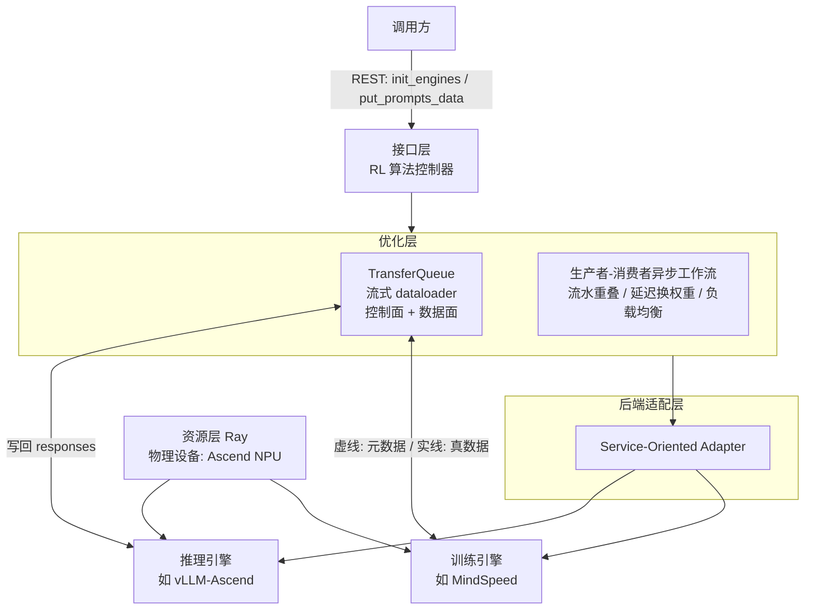
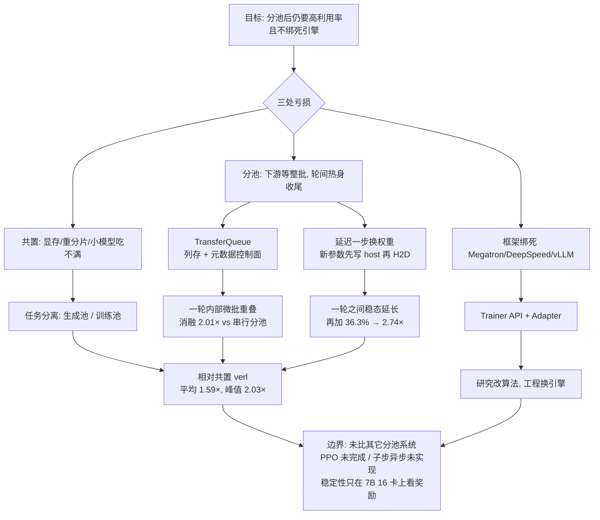

# AsyncFlow：任务分池并不能自动变成流水线，缺的是细粒度数据调度和可推迟的换权重

<!-- release-date: 2025-07-02 -->

> 本文依据 **AsyncFlow: An Asynchronous Streaming RL Framework for Efficient LLM Post-Training**，即 arXiv:2507.01663v1、2025-07-02 首次公开、共 13 页的预印本。十九位作者里，Zhenyu Han 与 Ansheng You 并列第一；多数署名 Huawei，Ansheng You 与 Wenqi Shi 标 Individual Researcher；通讯作者 Jianping Wu（Huawei），邮箱 `wujianping5@huawei.com`（PDF p. 1）。按主要归属方，本站把它放在 Huawei 目录下。下文括号中的 `(PDF p. N)` 均指这份 13 页原件的文件页码。
>
> **版本说明**：截至 2026-09-10 核验，arXiv 上只有 v1 一个版本（提交于 2025-07-02 12:45:34 UTC），与本地原件一致，无需替换。
>
> 这是一篇系统论文，不是算法论文，所以没有模型架构和预训练 recipe 可讲。它讲的是**怎样让分池之后的强化学习后训练不再空等整批数据，同时把核心调度从具体训练/推理引擎上剥下来。** 全文把三件事分开写：**论文明确写了什么**（带页码）、**本文如何解释它**（凡属推算、换算或从图上读数都会写明）、**外部资料补充**（会给出链接并标注）。
>
> 论文偶尔把框架名拼成 AsynFlow（摘要与 PDF p. 1、2），正文统一用 AsyncFlow。实验全部跑在 **Huawei Ascend NPU** 上，底层写明构建于 **MindSpeed-RL** 之上（PDF p. 2）；不要把它读成一篇 NVIDIA GPU 论文。

## 读之前需要的最少背景

这篇论文假设你已经知道「用强化学习把大模型再训一轮」大概长什么样。不熟的话，先记住下面这些。

**一轮 RL 后训练循环。** 拿一批题目（prompt），让当前模型自己写出答案，这个「让模型自己生成一批答案」的动作叫 **rollout（轨迹生成）**。生成出来的每条「题目 + 答案」序列叫一条 **trajectory（轨迹）**。再用一个 **reward（奖励）** 判断对不对，最后用这批带奖励的轨迹去更新模型参数。

**PPO 在这里不是一个损失函数那么简单。** Proximal Policy Optimization（近端策略优化）在大模型后训练里会拆成多个任务。论文点名的是六件（PDF p. 1）：

- **actor rollout**：正在被训练的那个模型去生成回答；
- **reference inference**：用一份冻结的参考策略做前向，算出参考对数概率；
- **critic inference**：评论者给每个位置估一个「后面还能拿多少分」；
- **reward inference**：给整条回答打分；
- **actor update**：更新 actor；
- **critic update**：更新 critic。

这六件事彼此有数据依赖，并行策略又往往不同，所以「谁先做完、数据怎么送到下一站」会变成系统问题，而不只是算法问题（PDF p. 1）。

还要认识三个词，它们贯穿全文：

- **on-policy（在策略）**：训练用的数据，是**当前这份参数**自己生成的。
- **off-policy（离策略）** 与 **staleness（陈旧度）**：训练用的数据来自更早的某一版参数。差了几个训练步，陈旧度就是几。
- **DP 组（Data Parallel group，数据并行组）**：把数据切开、每组拿一份完整模型算自己那份。后文 TransferQueue 的调度单位就是「一个 DP 组来要一批微批」，不是「一张卡来要一条样本」。

**这篇的实验算法其实不是 PPO。** 评测用的是 **GRPO（Group Relative Policy Optimization，组相对策略优化）**：对同一道题采多条回答，用组内相对好坏来估优势，从而不再需要单独的 critic（PDF p. 9）。PPO 的支持「目前仍在开发」（PDF p. 9）。出处上有一处需要当场说清：论文把 GRPO 标成参考文献 [20]，但 [20] 实际是 Ramesh 等人的 *Group robust preference optimization*（PDF p. 12）；正文描述的「去掉 critic、用组内相对比较」对应的是 DeepSeekMath 那条 GRPO，DeepSeek-R1 在本篇是 [4]。**这是本文核对参考文献后的观察，不是论文自己承认的笔误。** GRPO 的算法本身见本站 [DeepSeekMath 解读](/reports/DeepSeek/DeepSeekMath)。

**硬件名词只留三个。**

- **NPU（Neural Network Processing Unit，神经网络处理器）**：本篇的计算设备。论文写的是 Huawei Ascend NPU，每个节点 16 张，主机内存 2880 GB（PDF p. 9）。
- **HCCL（Huawei Collective Communication Library，华为集合通信库）**：Ascend 上的设备间通信库，地位接近 NVIDIA 侧的 NCCL。权重同步和变长张量广播都走它（PDF p. 6、7）。
- **MindSpeed-RL**：华为昇腾上的后训练框架。AsyncFlow **构建于其上**，并且论文用将来时写「将把这些优化集成进 MindSpeed-RL」（PDF p. 2）。仓库地址论文自己给了：<https://gitee.com/ascend/MindSpeed-RL>。**本文没有阅读该仓库，也不把仓库现状当作论文结论。**

**最后分清几件容易混在一起的「解耦」，后面对照邻居时会用到。** [AReaL](/reports/AntGroup/AReaL) 解耦的是**生成 GPU 与训练 GPU**。[Laminar](/reports/ByteDance/Laminar) 解耦的是**每条轨迹自己的换权重节奏**，并加了一层 relay worker。[HybridFlow](/reports/ByteDance/HybridFlow) 解耦的是**模型之间的控制权与模型内部的算子控制权**，它是 verl 的论文。[Agent Lightning](/reports/Microsoft/Agent-Lightning) 解耦的是 **Agent 运行时与训练器**。本篇解耦的是另一件事：**RL 调度核心与具体训练/推理引擎**，外加把「整批数据」拆成「随时可取的微批」。

## 一句话先说清

这篇论文要解决的矛盾可以压成一句：

> **把生成和训练分到不同的卡上，并不自动得到一条流水线。如果下游仍要等整批数据到齐，分池只是把「串行」从卡内挪到了卡间。**

旧方案被它分成两类（PDF p. 1–2）：

- **任务共置（task-collocated）**：所有 RL 任务挤在同一批设备上，同一时刻只跑一个。DeepSpeed-Chat 是它举的例子。毛病是显存被所有模型一起占、actor 生成和 actor 更新之间要重分片、小模型还吃不满整机。
- **任务分离（task-separated）**：按工作量把不同任务分到不同规模的资源池。OpenRLHF 是它举的例子。毛病立刻换了位置：reference 前向、critic 更新必须等 actor rollout 整批完成，下游空转；再叠上大模型嵌套的并行策略，跨实例的数据依赖变得又难写又难均衡。

第三层麻烦与摆放无关：多数框架和具体引擎绑死。论文点名 NeMo-Aligner 只能走 Megatron-LM + TensorRT-LLM，OpenRLHF 把 DeepSpeed 和 vLLM 当成必选后端（PDF p. 2）。工业侧往往已经有自己的训练集群和推理集群，换框架却要换引擎，这在工程上几乎不可接受。

AsyncFlow 的回答是三件套，而且三件套是咬合的（PDF p. 1–2）：

1. **TransferQueue**：控制面与数据面分开的流式 dataloader。下游按微批来取已经准备好的列，不必等整批。
2. **生产者–消费者异步工作流**：在陈旧度阈值内推迟换权重，把迭代之间的热身/收尾气泡压掉。
3. **服务化接口**：算法控制器加 REST/Ray adapter，让调度核心不绑死某一家引擎。

论文声称相对当时的 SOTA 基线平均 **1.59×** 吞吐（PDF p. 1、9），大规模集群上最高 **2.03×**（PDF p. 2、9）。这两个数字后面会连着分母拆开——**先记住一点：1.59× 和 2.03× 的分母是任务共置的 verl；消融里 2.01× 和 2.74× 的分母是作者自己关掉优化后的串行分池基线，不是 verl**（PDF p. 9–10）。

## 全景：四层叠起来，中间那一层才是新东西

论文用两张图把系统画完：Figure 1 是「用户怎么调用」，Figure 2 是「内部怎么分层」（PDF p. 2–3）。下面这张是根据这两张图重画的**机制示意图**，箭头表示请求与数据的流向，不表示实测时长。

四层各自干什么，不要混（PDF p. 2–3）：

| 层 | 论文给它的职责 | 对应章节 |
|---|---|---|
| **资源层** | Ray 管设备；硬件划分事先用执行时间模拟器搜过 | §2、§4.3 |
| **后端层** | 模块化 adapter，让 RL 任务实例化到不同训练/推理引擎上，对引擎保持无关 | §2、§5.2 |
| **优化层** | TransferQueue 管数据流；生产者–消费者工作流管气泡和换权重 | §3、§4 |
| **接口层** | 一个算法入口给研究用，一组服务化 API 给工业工作流用 | §5 |

本文读法：真正的新设计几乎全在优化层。资源层的 Ray 和接口层的 REST 都是把优化层接进已有集群的壳。读的时候按「数据怎么流 → 权重何时换 → 人怎么调用」这条因果链走，不要按摘要里的三个名词平均分配注意力。

论文还写了一句定位，值得先放在桌上：AsyncFlow 是 RL 算法的**高层调度层**，用尽量少的服务化接口包起来，去适配各种后端引擎（PDF p. 2）。后面实验确实只接了 MindSpeed 训练后端和 vLLM-Ascend 推理后端（PDF p. 9）；「各种后端」是架构目标，不是已经测过的清单。

## 旧方案为什么不行：共置有共置的税，分池有分池的税

### 共置：同一批卡既当生成器又当训练器

任务共置把所有任务塞进同一组设备，训练时同一时刻只跑一个任务、占满全部算力直到做完（PDF p. 1）。论文列了三条税：

1. **显存税。** 所有模型参数都要进设备内存，要么把能训的规模卡住，要么付出昂贵的 offload（PDF p. 1）。注意原文这里写的是 GPU memory，但后文实验全是 NPU；这是沿用领域习惯的说法，不是这篇论文在 NVIDIA GPU 上做了对照。
2. **重分片税。** actor rollout 和 actor update 要用不同的并行策略，切来切去会引入可观延迟（PDF p. 1）。
3. **并行税。** 模型有大有小，小模型在「整机被一个任务独占」的前提下吃不满算力（PDF p. 1–2）。

相关工作里它把 TRL、DeepSpeed-Chat、NeMo-Aligner、RLHFuse 和 **verl** 都归进这一类（PDF p. 10）。verl 还是后面实验唯一的外部基线。verl 自己的论文是本站 [HybridFlow 解读](/reports/ByteDance/HybridFlow)：它已经用 3D-HybridEngine 把共置场景下的重分片税压下去了，所以本篇拿它当 SOTA 共置基线，意思是「连这个优化过的共置系统，分池加流式调度仍能再快一截」。

### 分池：卡分开了，数据依赖还在

任务分离按工作量把不同 RL 任务分到不同规模的资源池（PDF p. 2）。直觉上这更合理：生成是访存受限、训练是算力受限，本该用不同的资源配比。相关工作也把这一点写成「LLM 推理偏内存密集、训练偏计算密集」（PDF p. 10–11）。

但论文立刻补了第二句话：RL 算法里的数据依赖会限制完全并行。典型例子是 **reference 前向和 critic 更新必须等 actor rollout 完成**，于是出现长时间空转（PDF p. 2）。再叠上大模型嵌套的并行策略，最小实例之间的跨任务数据流会同时伤害计算效率和算法开发体验（PDF p. 2）。

用一个小例子（本文构造，不是论文原文）。假设一批 1024 条 prompt 要生成。reference 模型其实并不需要等 1024 条全部写完——前面 64 条写完，它就可以先算这 64 条的对数概率。可是如果系统提供的数据通道只能「整批存、整批取」，那这 64 条就只能在缓冲区里躺着，reference 池的卡继续空转。**分池解决的是「卡给谁」，没有解决「数据何时能被下游拿走」。**

相关工作把 OpenRLHF、k1.5、Seed1.5-Thinking、StreamRL 和 AReaL 都列进分池阵营（PDF p. 10）。**列进相关工作不等于做过对照实验。** 本篇实验部分只和 verl 比，没有给出与这些分池系统的任何吞吐数字。

### 引擎绑死：换框架等于换栈

论文认为第三条障碍是可用性。NeMo-Aligner 只能跑在 Megatron-LM 和 TensorRT-LLM 上；OpenRLHF 把 DeepSpeed 和 vLLM 当成必选（PDF p. 2）。工业用户往往已经有定制后端的训练/推理集群，这种绑定会直接限制灵活性。它还补了一句：缺少统一的算法控制器，会加大开发开销，妨碍需要频繁改算法的研究工作流（PDF p. 2）。

这三条合在一起，决定了后面三节各自对准哪一块：TransferQueue 对准「数据何时能被拿走」，异步工作流对准「分池之后仍留下来的气泡」，服务化接口对准「不要和引擎结婚」。

## 核心设计一：TransferQueue，把「整批数据」拆成「随时可取的列」

### 旧问题：现有实现只提供整批存取

论文对现状的判断很直接：现有实现只给整个训练数据集提供基本的存储和传输，下游任务因此大量空等（PDF p. 3）。任务分离框架里，这件事会特别痛，因为下游其实可以先拿一部分样本开工，却被接口逼着等齐。

它给自己立的目标有三条（PDF p. 3）：

1. **流式。** 下游按部分样本计算，不必等整个数据集 ready。
2. **集中视图。** 每个 RL 任务都能看见数据状态，不必手工定义各 DP 组之间所有数据流。论文特意拿 OpenRLHF 和 StreamRL 当反例，说自己的编程范式更灵活（PDF p. 3）。
3. **高并发。** 大规模后训练里请求是异步、高并发的。做法是学软件定义网络（Software-Defined Networking，SDN）：控制面与数据面分离，两面都实例化多个对象，以缓解 I/O 和网络瓶颈，并允许换存储后端（PDF p. 3）。

SDN 在这里只是类比：网络设备不再自己决定转发，而是由控制器下发规则、交换机只搬数据包。TransferQueue 也是控制器只看元数据、存储单元只读写真实样本。**论文没有把 SDN 的具体协议搬进系统，这个类比到此为止。**

### 新设计：每个任务一个控制器，样本按行切开按列取出

Figure 3 把 TransferQueue 画在训练集群和推理集群中间（PDF p. 3）。训练侧是若干 actor update、reference、reward 实例，推理侧是若干 actor rollout 实例；中间上面是控制面（每个任务一个 controller），下面是数据面（若干 storage unit）。虚线走元数据，实线走真数据。整套交互被封装成一个分布式流式 dataloader，接到训练和推理引擎里（PDF p. 3）。

工作机制可以按一次读写拆开（PDF p. 3–4）：

1. **每个 RL 任务配一个 TransferQueue 控制器**，里面存训练样本的元数据：存放位置、数据状态、消费状态。控制器之间相互独立，因为不同 RL 任务在算法上本来就不会互相干扰（PDF p. 3–4）。
2. **每个存储单元只负责当前全局批次里的一部分样本**，用全局 index 寻址，好让所有分布式控制器都能找对地方（PDF p. 4）。
3. **DP 组要数据时，先向对应控制器发读请求。** 控制器从当前已经 ready 的样本里动态拼出一个 batch，把元数据返回去；DP 组再拿着元数据去存储单元取真数据（PDF p. 4）。
4. **控制器跟踪每条样本的消费记录**，保证同一 RL 任务里只有一个 DP 组拿到某条样本的元数据，避免重复（PDF p. 4）。
5. **DP 组算完，按元数据原子写回存储单元**，以保持分布式组件之间的一致性（PDF p. 4）。原文这里把 completes 写成了 competes，不影响理解。

对使用者，上述交互被封装成 PyTorch DataLoader，不必理解底层（PDF p. 4、5）。

### 数据面：二维列存，写入即通知

Figure 4 把存储画成一张二维表（PDF p. 4）：

- **行**是一条完整训练样本，用全局 index 唯一标识；
- **列**是任务相关的数据分量，例如 actor 的 responses、reference 的 log probability。

于是 reference 模型如果只需要 input token IDs 和 responses，就只取那两列，不必把别的分量一起搬过来（PDF p. 4）。不同位置还可以并发读写。存储按行切到多个 unit 上，用来摊薄存储和通信（PDF p. 4）。

写入之后不是等人来轮询。Figure 5 画的是元数据通知（PDF p. 4）：某个存储单元写完，就把「哪些行、哪些列刚刚变成 ready」广播给所有在初始化时注册过的控制器。图上左边是 Reference 控制器看到列 A 的 index `[0, 4]` 从 0 变成 1，右边是 Actor Update 控制器看到列 B 的 index `[1, 2]` 从 0 变成 1。论文的说法是：控制器会立刻知道这些位置已经可以被消费（PDF p. 4）。

本文读法：这张图要表达的不是「所有任务共享一份元数据表」，而是「同一份写入会唤醒所有可能用到它的控制器」。Reference 只关心列 A，Actor Update 只关心列 B，两边的 0/1 矩阵形状可以不同。集中的是**状态**，不是**数据本体**。

### 控制面：扫描 0/1，按负载打包微批

控制器为每个任务维护一份只属于自己的数据状态元数据，用二进制表示：0 是还不可用，1 是可以取（PDF p. 5）。这些条目在数据写入存储单元时被动态更新，回指 §3.2.2。

Figure 6 是一次调度的快照（PDF p. 5）。读请求带着 `mbs=2`（micro-batch size，微批大小为 2）进来。图上红色行表示「这一行所有列都是 1、满足当前任务」；打勾表示已经被更早的请求消费过。本文按图读出的状态是：

| index | 是否全 1 | 是否已消费 | 会不会被选 |
|---|---|---|---|
| 0 | 是 | 否 | 候选 |
| 1 | 是 | 否 | 候选 |
| 2 | 是 | 是（打勾） | 跳过 |
| 3 | 否（有 0） | — | 跳过 |
| 4 | 否（有 0） | — | 跳过 |
| 5 | 是 | 否 | 候选 |

图左侧标了返回的元数据 `[1, 5]`，也就是在候选里按负载均衡策略挑了两条交给这次 `mbs=2` 的请求。图注写「Red indexes demote that the corresponding data samples satisfies the RL task requirement」——demote 应是 denote 的笔误（PDF p. 5）。

挑完就标成已消费，防止同一任务里别的 DP 组再拿（PDF p. 5）。消费者再拿着这些元数据去分布式存储单元做真正的读取。

集中调度相对「事先把样本分给各 DP 组」的好处，论文给了两条例子（PDF p. 5）：

- **被动均衡**：更快的实例（硬件更强，或碰上更短的回复）可以动态多要数据；
- **主动均衡**：按各 DP 组已处理的 token 数做更均匀的分配，减少 actor update 时的空转。

原文把 lengths 拼成了 lenths，不影响理解。

### 给使用者看的接口：仍然是一个 DataLoader

Code 1 展示的是 `RolloutWorker.generate_sequences`（PDF p. 5）。使用者要声明三件事：当前 RL 任务名（`actor_rollout`）、需要哪些列（`prompts`、`prompt_length`）、一次取多少条（`rollout_dispatch_size`）。然后 `create_stream_data_loader(...)` 得到一个迭代器，循环里做推理，再 `collect_transfer_queue_data` 把生成的 responses 写回。代码里有一个 `use_vllm=True`，实验实际用的是 vLLM-Ascend（PDF p. 9）；这只说明接口按 vLLM 系引擎写了适配开关，不是论文在 NVIDIA 的 vLLM 上做了评测。

### 高并发的三步，而不是一个更快的队列

§3.5 把大规模下的设计收成三步（PDF p. 5–6）：

1. **控制面/数据面分离，存储单元可横向加。** I/O 或网络带宽不够时再开新的 storage unit。论文还点名将来可以换成 Mooncake Store、Redis 或其它为 LLM 训练定制的存储（PDF p. 5）。控制面的调度和数据面的 I/O 并发执行，形成处理多个请求的流水。
2. **每个 DP 组只让一个 rank 跟 TransferQueue 说话**，取回后再在组内广播。理由是：不考虑序列并行时，同一 DP 组的每个 rank 应拿到同一份数据。这样可以显著减少大规模下打到 TransferQueue 的直接请求数（PDF p. 6）。
3. **存和传都不做无谓 padding。** TransferQueue 本身支持变长传输；走 HCCL 设备间通信时，张量沿序列维拼接再广播，接收端用长度元数据还原。微批很大时，这条能砍掉 padding 带来的多余通信（PDF p. 6）。

### 收益、代价、边界

收益在消融里被单独量化：7B、512 NPU 上，只加 TransferQueue、相对「分池但串行」的基线，吞吐到 **2.01×**（PDF p. 10，Table 1）。机制上的收益是两件：下游可以提前开工（Figure 7 的流水重叠），以及 DP 组之间可以按实际速度抢活。

代价和边界，论文写得少，需要说清哪些是原文、哪些是本文推断：

- 多了一个控制面和一份分布式存储，写入要广播元数据。**论文没有单独报 TransferQueue 的延迟、带宽或 CPU 开销。**
- 「一个 rank 代理整个 DP 组」的前提是组内数据相同；论文自己把序列并行排除在外（PDF p. 6）。序列并行一旦打开，这条捷径是否还成立，原文没说。
- 存储后端可替换是架构声明，实验里实际用的是哪一种存储，论文没写。
- 与 OpenRLHF、StreamRL 的「编程范式更灵活」是定性比较，没有代码量或开发时间上的证据（PDF p. 3）。

**可迁移启发。** 凡是「上游陆续产出、下游其实可以先吃一部分，接口却只提供整批」的系统，都值得把「数据本体」和「是否 ready」拆开。ready 是元数据，应该走控制面；本体按列取，才能让不同下游各取所需。负载均衡不要事先切分，让快的实例多要——前提是有一个集中的消费记录，否则就会重复或漏取。

## 核心设计二：生产者–消费者异步工作流，在陈旧度预算里把气泡推掉

TransferQueue 解决的是**一轮内部**下游等上游的问题。分池框架还有第二种空转：**轮与轮交接时的热身和收尾**。这一节对准的是后者。

### 4.1 先把一轮之内的重叠跑起来

Figure 7 把传统工作流和流式重叠画在一起（PDF p. 6）。上面那条是串行：actor rollout 整段结束，才进入 actor / reference / reward 前向，最后才是 actor train。下面那条每个任务都变成「R / W」小段交错——读一部分、算一部分、写一部分——actor train 也可以提前插入。图右侧用红色括号标了 End-to-End Benefit（原文拼成 Benifit）。

论文的说法是：所有训练和推理实例只跟流式 dataloader 交互，由它动态调度并转发最细粒度的样本；这种结构**天然**支持跨任务流水重叠，而且不必像现有框架那样手工重排数据流，就能推广到别的 RL 算法（PDF p. 6）。点名的对比对象仍是 OpenRLHF 和 StreamRL（PDF p. 6）。

本文读法：Figure 7 是机制示意，不是甘特实测。实测甘特在 Figure 11，那张图要等到实验节。这里只需建立图像——**重叠的单位从「整批」变成了 TransferQueue 吐出的微批。**

### 4.2 一轮之间的气泡：同步 on-policy 的热身和收尾

§4.2.1 先把问题形式化（PDF p. 6）。传统 LLM 后训练大多采用同步 on-policy：actor rollout 和 actor update 用同一份参数。这有利于收敛，但严格同步会严重限制大规模下的扩展。

论文承认，业界已经在放松 on-policy 假设：k1.5 的 **partial rollout（部分生成）** 和 Seed1.5-Thinking 的 **streaming rollout（流式生成）** 都允许用旧模型生成的回复去更新（PDF p. 6，引用 [29]、[24]）。这给异步、离策略框架留了口子。

Figure 8 用四张甘特把口子越开越大（PDF p. 7）。这四张都是**机制示意**，色块表示阶段，不表示实测秒数。

**(a) 同步 on-policy。** rollout 和 update 锁在同一参数上。迭代之间能看到明显的 cooldown bubble（收尾气泡）和 warmup bubble（热身气泡）：有的池子已经做完，有的还没开始，交接处大块空着。

**(b) 基本异步。** 把 actor rollout 的全局 batch 做大，让 actor update 去用旧参数生成的回复。稳态变长，热身/收尾占的比例下降。但论文立刻加了限制：算法收敛对 rollout 和 update 之间允许的版本差有严格上限。它引用的经验是：**一步异步不会带来显著的性能或收敛退化**；超过这个阈值，性能随版本差对数下降（PDF p. 6，引用 [13]、[38]）。

[13] 是 Noukhovitch 等人的 Asynchronous RLHF，[38] 是 StreamRL。**这两个「一步没事、再多就对数掉」的结论是论文转引的，不是本篇自己测出来的。** 本篇 §6.5 只做了「开异步 vs 关异步」的奖励曲线，没有扫陈旧度档位。

**(c) 延迟参数更新。** 这是本篇真正落地的机制，下一小节展开。

**(d) 子步异步。** 让各 rollout 实例**错开**换权重，使陈旧度可以低于一个训练步。论文把它写成「重要的未来工作」，实现细节留待以后（PDF p. 7）。**不要把 Figure 8(d) 读成已经实现、已经评测的功能。**

### 4.2.2 延迟换权重：生成先继续，新权重先写到主机

旧问题可以更具体地讲。即使已经做了 (b) 那种「用旧数据训练」，迭代交界处仍要停下来换权重。生成侧一旦停，TransferQueue 再能流，上游也没有新样本可写。

新设计是：**把 actor rollout 用的那份权重，和 actor update 刚写出的那份权重，在时间上错开一步**（PDF p. 7）。Figure 8(c) 里，actor update 做完并不立刻叫停生成。rollout worker 继续用旧权重生成，同时把收到的新参数**异步写到主机内存**；等**当前这轮生成结束**，再把新参数加载进 Ascend NPU。于是暴露出来的同步开销，从「整份权重的设备间传输」收成「相对较快的主机到设备（host-to-device，H2D）拷贝」（PDF p. 7）。

工作机制按时间顺序是：

1. 训练侧完成一次 actor update，得到新权重；
2. 新权重发往推理侧，但先落在 host memory，不立刻打断当前生成；
3. 当前生成迭代继续用旧权重产出样本，这些样本对训练侧来说陈旧度是 1；
4. 当前生成迭代结束，做一次 H2D，NPU 换上新权重，开始下一轮。

论文对收益的表述很满：允许连续的一步异步之后，「通过消灭热身和收尾，稳态几乎可以无限延长」（PDF p. 7）。它承认这和 StreamRL 概念上相似，但声称自己进一步用 TransferQueue 的集中数据流管理，把训练引擎内部**所有** RL 任务都重叠起来，从而更可扩展（PDF p. 7）。**「比 StreamRL 更可扩展」是定性自我定位，本篇没有和 StreamRL 做过任何实测对比。**

同一小节还提出了 Figure 8(d) 那种子步异步：给 actor rollout 分配充足硬件，让 rollout 实例**依次**做参数更新，其余实例继续给下游供数。这样每一迭代里，都可以用「刚刚更新过的那部分实例」产出一部分数据，把异步粒度压到一步以下，并顺带减小 checkpoint 加载开销（PDF p. 7）。下一句立刻刹车：实现细节是未来工作（PDF p. 7）。结论里把这件事又说了一遍，作为 rollout 系统设计的后续方向（PDF p. 11）。

### 4.2.3 换权重本身也可以和计算重叠

延迟更新解决的是「何时换」，这一小节解决「换的时候走哪条路」（PDF p. 7）。模块拆成两边：训练集群上的 **WeightSender（权重发送器）**，推理集群上的 **WeightReceiver（权重接收器）**。两者都支持同步和异步两种模式。

- **同步模式。** actor rollout 会被参数更新堵住。为了缩短暴露的传输时间，走 Ascend NPU 之间的高带宽 HCCL 链路传权重（PDF p. 7）。
- **异步模式。** 训练引擎的权重先 offload 到主机，再经主机网络异步传到推理引擎，把计算和权重同步解耦。论文的说法是：参数更新既不打断、也不干扰正在进行的计算，从而维持连续的 RL 工作流（PDF p. 7）。

本文读法：同步模式吃的是 NPU 互联；异步模式吃的是那 2880 GB 主机内存和主机网络（PDF p. 9 的节点规格）。论文没有给出两种模式各自的传输秒数，也没有说实验里实际开的是哪一种。Figure 11 的甘特能看到任务之间空隙很小，但从图上读不出权重传输落在哪一段。

### 4.3 资源规划：用混合代价模型搜配置

要把 Figure 8(c) 那种理想工作流跑起来，还得决定每个任务分多少卡、用什么超参。论文做了一个基于图的资源规划模块，在给定资源约束下搜使端到端时间最短的配置（PDF p. 7）。

搜索空间太大，所以用混合代价模型（PDF p. 7–8）：

- **解析模型**：用硬件规格和理论上的计算/通信量估时间，快，用来收缩搜索空间；
- **Profiling 模型**：真的跑训练和推理任务，准，但更耗时。

两者搭配，论文认为能在效率和精度之间取得平衡，适合优化复杂的 RL 工作流（PDF p. 8）。**它没有报告这个模拟器的预测误差，也没有给出搜出来的具体设备配比。** 实验部分只在 Figure 11 的图例里露出一组 DP 数，那是结果而不是搜索过程。

### 收益、代价、边界

把 §4 的因果链收束如下。

| 步骤 | 消灭的气泡 | 引入的代价 | 原文有没有测 |
|---|---|---|---|
| TransferQueue 微批重叠 | 一轮内部下游等整批 | 控制面/存储开销 | 消融里算进了 2.01×，未单列开销 |
| 放大全局 batch 的基本异步 | 热身/收尾占比 | 陈旧度上升 | 未单独成行 |
| 延迟一步换权重 | 交接时的停生成 | 固定一步 off-policy；H2D 仍暴露 | 与重叠、资源规划打包成 Asyn.Opt |
| 异步权重传输 | 换权重堵住计算 | 占主机内存和主机网络 | 未单列 |
| 子步错开换权重 | 同步屏障本身 | 实现复杂度 | **未实现** |

打包后的数字在 Table 1：在已经有 TransferQueue 的 2.01× 之上，异步工作流优化再加 **36.3%**，归一化吞吐到 **2.74×**（PDF p. 10）。36.3% 是相对「只开 TransferQueue」那一行，不是相对串行基线。本文核对：`2.74 / 2.01 ≈ 1.363`，与 36.3% 一致。

边界要说硬的：

- 陈旧度预算被写成「一步」，经验依据是转引，不是本篇的扫描（PDF p. 6）；
- 「稳态几乎无限延长」是机制上的说法，实验只展示了 Figure 11 上 iteration 0–3 的一段（PDF p. 10）；
- 子步异步明确未实现（PDF p. 7、11）；
- 资源规划模块没有公开搜索结果和误差。

**可迁移启发。** 流水线里有两种「等」，不要用同一种技术打。一种是**批次内部的等**，单位是样本，该用细粒度数据通道；一种是**批次之间的等**，单位是参数版本，该用「在陈旧度预算里推迟换权重」。把换权重从「训练一步的同步尾声」改成「生成一轮的间隙里做 H2D」，等于把一次长阻塞换成一次短拷贝——前提是你接受那一轮数据是旧的。预算用尽之前不要同步，预算用尽必须同步；本篇把预算钉在一步，并且没有留下像 AReaL 的 $\eta$ 那样可拧回同步的公开旋钮。

## 核心设计三：服务化接口，让调度层和引擎层各改各的

### 旧问题：改算法和换引擎搅在一起

论文把可用性写成和效率并列的目标（PDF p. 2、8）。研究侧需要一个统一入口，才能靠标准化 API 快速改算法；工业侧需要能接不同训练/推理后端，并且不能把架构灵活性赔掉（PDF p. 8）。

### 新设计：两级接口

Figure 9 把接口画成两层（PDF p. 8）：

- **用户级**：`Trainer` 类里的 RL 算法控制器，把 `generate_sequences`、`update` 这些任务组织成主训练流程。研究者改算法主要改这个类（PDF p. 8）。
- **后端级**：`Adapter` 类，把每个 RL 任务从执行引擎上剥下来。

配的服务化 API 有四组（PDF p. 8；Figure 1 还画出了 REST 路径）：

| API | 作用 |
|---|---|
| `init_engines` | 初始化训练和推理引擎。Figure 1 写成 `POST /action/init_engines` |
| `put_prompts_data` | 把 prompt 数据集载入系统。Figure 1 写成 `POST /action/put_prompts_data` |
| `put_experience_data` / `get_experience_data` | 在训练引擎和推理引擎之间协调生成出来的经验 |
| `weight_sync_notify` | 通知两边更新模型权重 |

调用路径是 REST 或 Ray（PDF p. 2，Figure 1 两侧标了 Ray/REST API）。

Code 2 给了一个后端级例子（PDF p. 8）：`MindSpeedAdapter` 继承 `RLAdapter`，把 MindSpeed 的 `forward_backward_func` 包成 `compute_log_prob` 这种 RL 任务抽象，前向时 `forward_only=True`、`collect_non_loss_data=True`。同一份代码里 `VLLMAdapter` 的方法体是 `pass`。**这很能说明解耦当时写到了哪一步：MindSpeed 训练路径有实例，vLLM 适配器在论文展示的代码里还是空壳。** 实验确实用了 vLLM-Ascend 做推理（PDF p. 9），所以真实适配代码存在于论文未展示的部分；不要把 `pass` 读成「实验没接 vLLM」，也不要把空类读成「已经提供了完整的 vLLM 后端抽象」。

论文对这一层的自我评价是：算法研究者走高层 API，基础设施工程师走底层实现，两边的协同在学术灵活性和工业可扩展性之间取得平衡（PDF p. 8）。后端层还提到可以接 FSDP、DeepSpeed、vLLM 以及定制框架（PDF p. 9）。**这些名字是兼容性目标；评测里实际出现的训练后端是 MindSpeed，推理后端是 vLLM-Ascend 0.7.3。**

### 收益、代价、边界

收益是架构上的：核心调度不绑死引擎，工业侧可以保留已有集群（PDF p. 2）。代价是论文把「两级抽象」讲清楚了，但没有可用性实验——没有改算法要改多少行、换后端要写多少 adapter、REST 路径的延迟是多少。PPO 仍在开发（PDF p. 9），说明算法控制器这一层当时也还没覆盖 PPO 那六任务全图。

**可迁移启发。** 训练系统里最容易长成铁板的，不是计算 kernel，是「算法流程直接 new 了某个引擎的类」。把算法流程写成对 `generate_sequences` / `compute_log_prob` 的调用，把引擎差异关进 adapter，换栈时才不必重写调度。判断标准很具体：新增一个后端，应不应该改 TransferQueue 和异步工作流的代码？按本篇的分层，答案必须是不应该。

## 实验：数字都要连着分母读

### 6.1 评测台子搭在昇腾上

这一节的事实密度高，先按原文落地，再读数字（PDF p. 9）。

| 项 | 论文配置 |
|---|---|
| 模型 | Qwen2.5 系列，7B 到 32B |
| 算法 | GRPO；PPO 仍在开发 |
| 数据 | DeepScaleR，超过 4 万条数学问答对，来自 AIME、AMC 等 |
| 硬件 | 大规模 Ascend NPU 集群；每节点 16 张 NPU，主机内存 2880 GB |
| 软件 | Ascend Extension for PyTorch 7.0.0（PyTorch 2.5.1）、CANN 8.1.RC1 |
| AsyncFlow 后端 | 推理 vLLM-Ascend 0.7.3，训练 MindSpeed |
| 基线 | verl，任务共置 SOTA；训练 PyTorch FSDP，推理同样 vLLM-Ascend 0.7.3 |
| verl 版本 | 2025-04-07，commit `d13434f`，为了跑在昇腾上做了必要适配 |
| 吞吐统计 | Figure 10 取第 10–20 个 iteration 的平均，以降低开头波动 |

有几句需要当场划清：

- 硬件是 NPU，不是 GPU。verl 也是被适配到昇腾之后再比的，不是「Ascend 上的 AsyncFlow 对 NVIDIA 上的 verl」。
- 选 Qwen2.5 和 DeepScaleR 的理由是「学界和工业界常用、近期 RL 后训练框架也常用」，并点了 StreamRL 和 AReaL 的名字作为「也用这个数据」的旁证（PDF p. 9）。**这不是与这两篇的对照实验。**
- 正文写实验规模是 32 到 **1024** NPU（PDF p. 9），但 Figure 10 的横轴只画了 32、128、256、512。**1024 那一档的吞吐数字没有在图上出现，正文也没有单独给出。**
- 并行策略的具体 TP/PP 切分，§6.1 标题写了 parallelism strategies，正文却没有给出数字。唯一能看见的 DP 配置在 Figure 11 图例里。

### 6.2 端到端：平均 1.59×，峰值 2.03×，分母是 verl

Figure 10 是两张并排柱状图加线性度折线（PDF p. 9）。左 7B，右 32B；绿色柱 AsyncFlow，橙色柱 verl；左轴是 Throughput（tokens/s），7B 图为 $\times 10^5$、32B 图也是 $\times 10^5$；右轴是 Linearity，0 到 1。横轴是 NPU 数。

正文给出的精确数字如下（PDF p. 9）：

| 数字 | 含义 | 分母 |
|---|---|---|
| **1.59×** | 所有测试配置上的平均吞吐提升 | verl |
| **2.03×** | 峰值；7B、256 NPU | verl |
| **1.76× 和 1.82×** | 512 NPU 上仍保持的提升 | verl |
| **33.4%** | 即使只有 32 NPU，7B 仍高这么多 | verl |
| **0.65 和 0.88** | 集群扩大 16× 时维持的线性度 | 自身小规模 |

32 → 512 正好是 16×，与「扩大 16×」对得上。1.76× / 1.82× 正文没有写清哪个是 7B、哪个是 32B。本文按 Figure 10 柱高目视：512 NPU 时 7B 的绿柱大约是橙柱的 1.7 倍出头，32B 大约是 1.8 倍出头，因此倾向于把 **1.76× 分给 7B、1.82× 分给 32B**。这是读图，不是原文逐字指定。

线性度同理。本文按两条折线读：7B 从 32 NPU 的 1.0 落到 512 NPU 附近约 0.65，32B 仍停在约 0.88。小模型线性度更差，符合「小模型更难喂饱大规模集群」的常识，但论文自己没有解释为什么 7B 是 0.65、32B 是 0.88。

读这张图还要守一条：柱高本身（例如 7B、256 NPU 上 AsyncFlow 大约 $1.0\times 10^5$ tokens/s）是本文读图，论文正文没有写出绝对 tokens/s。比较时用正文的倍数，不要用读图的绝对值做论证。

论文对「大规模上优势更明显」的解释是：这与已有研究一致，任务分离框架在大规模场景更有潜力，引用的是 HybridFlow 和 StreamRL（PDF p. 9）。它把 0.65 / 0.88 的线性度写成「为工业规模训练 LLM 推理 agent 铺路」（PDF p. 9）。这句话是展望，不是测过 agent 任务。

**必须连着分母读。** 1.59× 不是「比所有分池系统快 1.59 倍」，是「在昇腾上、相对一份适配过的 verl、GRPO、DeepScaleR、7B/32B、32–512 NPU 这些点上的平均」。verl 在本篇相关工作里被明确归为任务共置（PDF p. 10）。所以这组数字支持的结论是：**分池 + 流式调度 + 异步工作流，相对优化过的共置系统，在大规模上更快**；它不支持「相对 StreamRL 或 AReaL 更快」。

### 6.3 消融：2.01× 来自 TransferQueue，再加 36.3% 来自异步工作流

Table 1 的分母换了，这是全文最容易读错的一张表（PDF p. 10）。

| 编号 | 设置 | 归一化吞吐 |
|---|---|---:|
| ① | Baseline | 1 |
| ② | w/ TransferQueue | 2.01 |
| ③ | ② + w/ Asyn.Opt | 2.74 |

配置是 **7B、512 NPU**。Baseline 的定义是：关掉所有提出的优化，每个 RL 任务仍分到独立硬件，但同一时刻只跑一个任务——也就是 Figure 7 上半那种串行分池（PDF p. 10）。所以：

- 2.01× 说的是「只把整批存取换成 TransferQueue」相对「分池但串行」；
- 2.74× 说的是「再打开延迟换权重、重叠和资源分配」相对同一个串行分池基线；
- 36.3% 说的是 ③ 相对 ②，不是相对 ①，也不是相对 verl。

Asyn.Opt 被明确写成三件的打包：delayed parameter update、overlapping techniques、task resource allocation strategies（PDF p. 10）。**没有这三件各自的一行。** 因此不能把 36.3% 全部记在「延迟一步换权重」头上。

和 §6.2 并排看，会得到一张更诚实的对照：

| 比较 | 倍数 | 分母 | 规模 |
|---|---|---|---|
| AsyncFlow vs verl | 平均 1.59×，峰值 2.03× | 任务共置 SOTA | 7B/32B，32–512 NPU |
| TransferQueue vs 串行分池 | 2.01× | 作者自己的无优化分池 | 仅 7B，512 NPU |
| 全优化 vs 串行分池 | 2.74× | 同上 | 仅 7B，512 NPU |

2.74× 看起来比 1.59× 更炸，只是因为分母更弱。串行分池故意关掉了重叠，本来就会很慢；verl 已经有 3D-HybridEngine，分母更强。**两个数字都真实，支持的不是同一句话。**

### 6.4 甘特图：32B、512 NPU 上任务基本铺满

Figure 11 是 32B、512 NPU、iteration 0–3 的执行时间线（PDF p. 10）。纵轴是各训练/推理实例，横轴是 0 到 2500 秒。图例给出了各任务的 DP 数：

| 任务 | DP |
|---:|---:|
| actor_rollout | 64 |
| ref_log_prob | 32 |
| rule_reward | 32 |
| advantage | 32 |
| actor_train | 20 |

这五组 DP 加起来是 180，不是 512。本文读法：DP 是数据并行组数，每组内部还有张量并行等切分，论文没写每组几张卡，所以**不能**用 180 去反推「只用了 180 张 NPU」。`rule_reward` 这个名字也值得看一眼：实验走的是规则奖励，不是单独的奖励模型，这和 GRPO + 数学数据是对得上的。

论文对这张图的文字结论只有定性一句：在优化过的数据流调度下，RL 任务达到了大量并行，任务间空闲很少；这从经验上说明任务分离框架能在资源利用和可扩展性之间取得平衡（PDF p. 10）。

本文按横轴读：四个 iteration 画在约 2500 秒里，平均每个 iteration 大约 600 多秒。这是读图，精度有限，论文没有写出每步墙钟时间。颜色上看，actor_rollout 占了最大面积，下游的 logprob / reward / advantage / train 以细条叠在时间轴上，和 Figure 7 的「微批重叠」叙事一致。开头一小段颜色较稀，之后基本铺满，这与「延迟换权重消灭热身」的机制方向相符——但 iteration 只有 0–3，**不足以验证「稳态几乎无限延长」**。

### 6.5 异步稳不稳定：只在 7B、16 张卡上看了奖励和长度

§6.5 问的是异步会不会伤模型（PDF p. 10）。指标是平均奖励和回复长度，约束写成「相同墙钟时间」，图是 Figure 12。配置是 7B、16 NPU，异步工作流开和关各跑一次。结论是：奖励分数差异可忽略，回复长度的方差呈收敛趋势（PDF p. 10）。

对 Figure 12 的读图要克制。上图 Reward 大约在 0 到 0.6，两条曲线热身之后都在 0.4 附近晃；下图 Response Length 从大约 400–500 爬到 600–800 再震荡。横轴是 Iteration，0 到 1000，**不是墙钟时间**。正文写 same clock-time constraint，图上却按 iteration 对齐——两者不是同一回事，异步更快的话，相同墙钟里应能跑更多 iteration。论文没有解释这个口径，也没有给出两条曲线对应的墙钟。本文只采用它的定性结论「奖励差异可忽略」，不从图上读具体分数去比较。

这节的边界很硬，需要单独列：

- 只有 7B、16 NPU，和 §6.2 的大规模吞吐不是同一档；
- 没有 AIME 一类下游分数，只有训练过程的 reward 和长度；
- 没有 error bar，各一条曲线；
- 没有扫陈旧度（一步 vs 两步 vs 同步），因此不能用这张图去验证它转引的「一步无害、再多对数掉」。

## 相关工作：它给自己划的三格

第 7 节把前人工作分成三格（PDF p. 10–11）。读这一节的用处，是看它**认为自己站在哪**，而不是替那些系统重写一篇。

**框架怎么摆任务。** 共置：TRL、DeepSpeed-Chat、NeMo-Aligner、RLHFuse、verl，小规模利用率高，因为同一时刻所有设备都在做同一件事（PDF p. 10）。分池：OpenRLHF、k1.5、Seed1.5-Thinking、StreamRL、AReaL，大规模上更有竞争力，因为推理偏内存、训练偏计算（PDF p. 10–11）。AsyncFlow 明确站在分池这一侧，要补的是分池之后的数据流和气泡。

**算法怎么减组件。** PPO 仍是四件套（actor / reference / reward / critic）的地基，复杂、难扩展（PDF p. 11）。GRPO 去掉 critic，DAPO 进一步用动态参考策略去掉 reference（PDF p. 11）。它提醒：简化是在拿 PPO 里显式价值函数提供的稳定性做交换。结合实验配置读：本篇评测走 GRPO + 规则奖励，critic 和奖励模型都不在场，流水线比 PPO 六任务图更短。**PPO 全图下 TransferQueue 还有没有同样收益，论文没有测。**

**系统优化打在哪。** 它认为端到端时间里 actor rollout 因为自回归，和训练任务本质不同，所以吸引了最多注意力（PDF p. 11）。RLHFuse 做阶段融合，让 rollout 和下游并发，靠自动迁移；StreamRL 用回复长度预测器把 prompt 按长度分桶、动态分发，在吞吐和长尾偏斜之间找平衡；k1.5 的 partial rollout 截断长回复，让下游不必等生成结束（PDF p. 11）。它还加了一句关键观察：后训练里的 rollout **没有**推理服务那种严格 SLO，所以可以用更宽的调度策略去最大化吞吐（PDF p. 11）。

这句话是本篇和在线推理系统的分界。vLLM 那类服务必须守延迟；后训练的生成可以更「糙」——可以偏吞吐、可以一步陈旧、可以不守尾延迟。本站 [PagedAttention 解读](/reports/Berkeley/PagedAttention) 讲的是服务侧；两边的目标函数不一样，调度器自然也不一样。

## 结论里它自己强调什么，以及明确没做完什么

结论把三件套又说了一遍（PDF p. 11）：TransferQueue 用动态路由打破「开训前写死的静态数据依赖图」；生产者–消费者异步工作流用一步参数异步在效率和稳定性之间做平衡，并把参数更新和计算重叠；服务化接口提供算法工作流和后端引擎两级抽象。实验结论里它特别高亮：**任务分离框架扩到更大集群时线性度更好**（PDF p. 11）。

未来工作只锁定一件事：在「生成的回复足够供下游」这个约束下，把各推理实例的换权重时刻错开，消掉生成过程中的同步屏障，从而把陈旧度阈值压到一个训练步以下（PDF p. 11）。这就是正文 Figure 8(d) 那条还没实现的路。

致谢列出一长串名字（PDF p. 11），对技术内容没有额外信息。参考文献到 [39] 为止，第 13 页几乎整页空白，因为最后两条参考文献跨页了（PDF p. 12–13）。

## 它和邻居各解耦了什么（对照，不搬邻居的数字）

四篇邻居都已经在本站。这里只用一句话对齐切面，**不把它们的加速比写进本篇的成绩单**。

| 系统 | 解耦的切面 | 和本篇的关系 |
|---|---|---|
| [HybridFlow](/reports/ByteDance/HybridFlow) / verl | 模型之间的控制权 vs 模型内部的算子控制权 | 本篇的外部基线；它是共置 + 同步 |
| [AReaL](/reports/AntGroup/AReaL) | 生成 GPU vs 训练 GPU；算法上改了 PPO 目标 | 相关工作里的分池同类；本篇没和它比 |
| [Laminar](/reports/ByteDance/Laminar) | 轨迹级异步 + relay worker，取消全局换权重时刻 | 本篇之后的工作；切面更靠近「谁在何时换权重」 |
| [Agent Lightning](/reports/Microsoft/Agent-Lightning) | Agent 运行时 vs 训练器 | 切面完全不同：本篇没有 Agent 编排问题 |

本篇在这条谱系上的位置可以更具体地讲。HybridFlow 把共置场景下「改一行算法要动四个程序」解决了，但执行模型仍是同步循环，生成和训练仍在同一批卡上分时。AReaL 把生成和训练拆开并允许打断式换权重，代价由算法侧的解耦 PPO 接住。AsyncFlow 走分池，但把力气花在**数据通道**（TransferQueue）和**一步延迟换权重**上，算法侧几乎没改——评测直接用 GRPO。Laminar 则认为只要还有全局换权重时刻，异步就仍是批级的。

所以不要把这几篇读成互相替代。AsyncFlow 的独特主张是：**分池框架缺的中间件，是一个带集中元数据的流式 dataloader；有了它，流水重叠和负载均衡可以不必手写跨实例数据依赖。** 换权重策略上，它停在「一步延迟 + 可选的传输重叠」，并且把更细的子步异步标成未来工作。

## 限制与未公开信息

下面这些是论文没写、写了但没测、或测了但不够支撑那句断言的地方。不把它们当成瑕疵清单，而是读完之后还知道自己缺什么。

**实验范围。**

- 外部基线只有昇腾上适配过的 verl，没有 OpenRLHF、StreamRL、AReaL 的对照数字。
- 消融只在 7B、512 NPU 上做；32B 没有 TransferQueue / Asyn.Opt 的拆分。
- Asyn.Opt 是三件打包，延迟换权重、传输重叠、资源规划没有各自一行。
- 正文写了 32–1024 NPU，Figure 10 只到 512，1024 的吞吐未给出。
- 没有绝对 tokens/s 表，倍数都相对某个基线。
- 没有报墙钟小时数、没有报训练到某个奖励所需的时间，只有吞吐和三条短曲线。

**算法与稳定性。**

- PPO 未实现，六任务全图下的数据依赖是否仍能被 TransferQueue 自动调度，没有证据。
- 稳定性实验只有 7B、16 NPU，只有 reward 和回复长度，没有下游 benchmark。
- 没有陈旧度扫描。一步无害来自转引。
- Figure 12 的横轴是 iteration，正文说的是 clock-time，口径未解释。
- GRPO 的参考文献 [20] 与正文描述的算法不是同一篇，见上文核对。

**系统细节。**

- 子步异步（Figure 8(d)）未实现。
- NPU 具体型号、卡间带宽、每 DP 组的 TP/PP 切分未给。
- TransferQueue 实际存储后端未给；Mooncake / Redis 只是「将来可替换」。
- TransferQueue 的元数据广播开销、代理 rank 的瓶颈、序列并行下是否失效，均未测。
- 两种权重传输模式没有各自的秒数；实验开的是同步还是异步，未写。
- 资源规划模拟器没有预测误差，也没有搜出的设备配比表。Figure 11 的 DP=64/32/32/32/20 是结果快照，不是搜索空间。
- 容错、失败恢复、作业抢占，全文未提。
- Code 2 里 `VLLMAdapter` 为 `pass`；FSDP / DeepSpeed 作为兼容目标出现，未进入评测。
- 「将集成进 MindSpeed-RL」是将来时（PDF p. 2）。本文不把该仓库后来发生了什么写进这篇解读。

**图表与文本的缝。**

- Figure 10 读不出 1024；线性度 0.65 / 0.88 未标明对应哪个模型，本文按折线归属，已在实验节标明。
- Figure 6 图注 demote、Figure 7 图内 Benifit、正文 lenths / competes / AsynFlow，均是原文笔误，不影响机制理解。

## 可迁移启发

### 1. 分池是布局决策，流水线是数据决策

把任务分到不同的卡上，只决定了「谁有卡」。如果接口仍是整批存取，下游照样空等。TransferQueue 的价值不在多了一个队列，而在把 ready 状态提升成一等公民：控制器看 0/1，存储单元看列，DP 组看微批。**遇到「已经分池但利用率上不去」的系统，先查数据接口的粒度，再查算力。**

### 2. 两种气泡不要用同一种刀去切

一轮内部的等，单位是样本，该用流式通道；一轮之间的等，单位是参数版本，该用陈旧度预算。本篇把前者交给 TransferQueue，把后者交给「延迟一步 + H2D」。混用会浪费：用更大全局 batch 去掩盖微批不流，或反过来用微批流动去掩盖换权重停机，都只会打到一半。

### 3. 加速比必须问分母，而且要问两次

同一篇论文里，2.03× 的分母是 verl，2.74× 的分母是关掉优化的串行分池。问完「相对谁」之后，还要问「这个谁是共置还是分池、开没开重叠」。本站 [HybridFlow](/reports/ByteDance/HybridFlow) 和 [AReaL](/reports/AntGroup/AReaL) 各自踩过同一类坑：区间上端往往来自更弱的分母。

### 4. 集中的应是元数据，不是数据本体

TransferQueue 让每个任务看见全局 ready 视图，但样本本身按行散在存储单元、按列按需取。负载均衡、去重、动态打包，全部发生在元数据扫描上。**任何「一个中心 + 很多 worker」的结构，中心都不该坐在数据的关键路径上**——本篇用「每 DP 组一个代理 rank + 组内广播」把这条路又收窄了一次。中心一旦开始搬本体，规模就是它的敌人。

### 5. 换权重可以不是训练步的尾声

默认叙事是：update 结束 → 同步屏障 → 所有 rollout 换权重 → 再生成。本篇改成：update 结束 → 新权重先写 host → 当前生成用旧权重收尾 → 间隙里 H2D。同步从「必须发生在这一秒」变成「必须发生在这一轮结束前」。推广到别的流水线：找到那个「新版本已经产生、旧版本仍在干活」的重叠窗口，把切换塞进窗口，而不是另开一段停机时间。窗口的上限由算法的陈旧度预算决定，不是由工程师的耐心决定。

### 6. 引擎是可替换零件时，调度层才值得写成框架

论文反复强调不要和 Megatron / DeepSpeed / vLLM 结婚。判断一个 RL 框架有没有真的分层，不必看架构图有几层，看一件事：新增后端会不会改数据调度和换权重逻辑。会改，说明引擎类型漏进了核心；不会改，adapter 才是 adapter。本篇的 Code 2 还停在 MindSpeed 有实现、VLLMAdapter 为 `pass`，说明分层是目标，当时并未对所有点名的后端兑现。

### 7. 后训练的生成没有 SLO，这是调度自由度，也是评测盲区

论文自己写：后训练 rollout 不像推理服务那样有严格 SLO，所以可以更激进地最大化吞吐（PDF p. 11）。这是真的，也是限制：吞吐数字不会告诉你尾延迟、不会告诉你一步陈旧对难题的伤害、不会告诉你下游准确率。评估训练框架时，吞吐只是一半；另一半是它产出的数据分布是否仍是算法假设的那个分布。本篇 §6.5 朝这个方向走了一步，但只走到 reward 曲线可忽略差异。

## 用一张图重新串起全文

这是本文按全文论证顺序整理的**结构图**，不是论文里的任何一张图；每个方框对应的证据页码已在正文中给出。

## 关键词回看

- **任务共置（task-collocated）**：所有 RL 任务放在同一批设备上，同一时刻只跑一个。DeepSpeed-Chat、verl 被归入此类。
- **任务分离（task-separated）**：按工作量把任务分到不同资源池。OpenRLHF、StreamRL、AReaL 与本篇都在此类。
- **TransferQueue**：控制面/数据面分离的流式 dataloader。控制器管元数据，存储单元管样本本体，下游按微批取已经 ready 的列。
- **元数据通知**：存储单元写完某列后，把行号和列名广播给所有控制器，0 变 1 表示可消费。
- **微批（micro-batch）**：一次从控制器拿走的样本包。它是流水重叠的调度单位，替代「整批到齐」。
- **生产者–消费者异步工作流**：生成侧持续写样本、训练侧持续取样本；用一步陈旧换掉迭代交界的停机。
- **延迟参数更新（delayed parameter update）**：update 完成后不立刻打断生成，新权重先写主机，当前生成迭代结束再 H2D 进 NPU。
- **一步异步（one-step asynchronization）**：rollout 用的权重落后 update 恰好一个训练步。本篇把预算钉在这里；子步异步未实现。
- **WeightSender / WeightReceiver**：训练侧和推理侧的权重传输对。同步走 HCCL，异步走主机网络。
- **HCCL**：华为集合通信库。本篇的设备间广播和同步权重传输走它。
- **MindSpeed-RL**：AsyncFlow 构建于其上的昇腾后训练框架；论文写的是「将把优化集成进去」。
- **服务化接口**：用户级 `Trainer` 加后端级 `Adapter`，REST/Ray 暴露 `init_engines` 等 API。
- **线性度（linearity）**：集群扩大 $N$ 倍时，吞吐是不是也接近扩大 $N$ 倍。本篇在扩大 16× 时给出 0.65 与 0.88。

## 最后的判断

这篇论文最值得记住的，不是 1.59×，而是它把分池框架里一件一直被手写的事做成了中间件：

> **「下游能不能开工」不应该编码成一张开训前写死的数据依赖图，而应该编码成一张可以扫描的 0/1 元数据表。**

三件套的咬合关系是：

- **TransferQueue** 让微批成为调度单位，一轮内部的空等开始消失；
- **延迟一步换权重** 让一轮之间的热身/收尾不再吞掉稳态，代价是固定的一步离策略；
- **服务化接口** 试图保证前两件发生在引擎之上，而不是写进某一家训练库的内部。

实验支持的部分很清楚：在昇腾、GRPO、Qwen2.5、DeepScaleR 这个台上，相对适配过的 verl，平均 1.59×、7B/256 NPU 达到 2.03×；相对串行分池，TransferQueue 单独贡献 2.01×，异步优化再加 36.3%。大规模上线性度也确实比「共置会先碰到的墙」看起来更像样。

实验没有覆盖的部分同样清楚：其它分池系统不在对照里；PPO 全图不在对照里；陈旧度不是被扫描出来的，是被钉在一步上的；「几乎无限的稳态」只展示了四个 iteration；子步异步还是图上的第四个面板。

如果只记一句话，可以记：

> **分池决定卡给谁，流式决定数据何时能被拿走，陈旧度决定权重何时必须对齐。三件事里只做第一件，得到的不是流水线，是两堆互相等的卡。**

## 资料与阅读边界

- **原始依据**：本地 `papers/Huawei/AsyncFlow.pdf`，**AsyncFlow: An Asynchronous Streaming RL Framework for Efficient LLM Post-Training**，arXiv:2507.01663v1，共 13 页（正文与结论 p. 1–11、参考文献 p. 11–13）。PDF 内嵌标记为 `arXiv:2507.01663v1 [cs.LG] 2 Jul 2025`。本文所有页码指这份 PDF 的文件页码。
- **版本核验**：[arXiv:2507.01663](https://arxiv.org/abs/2507.01663)。提交历史只有一版：v1 于 2025-07-02 12:45:34 UTC，From Zhenyu Han（外部核对：[arXiv 摘要页](https://arxiv.org/abs/2507.01663)）。**截至 2026-09-10 核验，最新版本仍是 v1，与本地原件一致，无需替换。**
- **`release-date` 取 2025-07-02。** 理由：AsyncFlow 是一套后训练系统而非对外提供的模型，按流程取「该技术首次官方公开日」。已核查的官方渠道里，最早的公开事件就是 arXiv v1 的提交。论文给出的 MindSpeed-RL 地址是集成目标，正文用将来时，不构成更早的本系统首发。
- **官方代码线索**：论文写将集成进 MindSpeed-RL，地址 <https://gitee.com/ascend/MindSpeed-RL>（PDF p. 2，参考文献 [6]）。**本文没有阅读该仓库源码，也没有把仓库里后来的实现、星标或文档数字当作论文结论。**
- **外部补充清单**（均已在正文或本节标注，不与论文内容混用）：
  - arXiv 提交历史与版本号：[arXiv:2507.01663](https://arxiv.org/abs/2507.01663)；
  - GRPO 算法出处与本篇参考文献 [20] 不是同一篇，见 [DeepSeekMath](/reports/DeepSeek/DeepSeekMath)；DeepSeek-R1 在本篇是 [4]，解读见 [DeepSeek-R1](/reports/DeepSeek/DeepSeek-R1)；
  - 基线 verl 的编程模型与 3D-HybridEngine，见 [HybridFlow](/reports/ByteDance/HybridFlow)；
  - 转引的一步异步经验来自 Asynchronous RLHF（arXiv:2410.18252）与 StreamRL（arXiv:2504.15930），本篇未复现这两篇的实验；
  - DAPO 在相关工作里作为「进一步去掉 reference」的算法被点名，见 [DAPO](/reports/ByteDance/DAPO)；
  - 生成阶段没有 SLO、因而调度目标不同于在线服务，对照见 [PagedAttention](/reports/Berkeley/PagedAttention)。
- **未公开 / 无法核实的缺口**：1024 NPU 档的吞吐、绝对 tokens/s、TransferQueue 延迟与带宽、权重传输两种模式的耗时、资源规划的搜索结果与预测误差、NPU 型号与 TP/PP 切分、存储后端类型、PPO 实现、子步异步实现、下游任务分数、陈旧度扫描、容错语义、adapter 对 FSDP/DeepSpeed 的真实完成度、MindSpeed-RL 在论文之后是否合入这些优化。
- **图表说明**：文中 Mermaid 图均为重画的**机制示意图**，已注明根据 PDF 的 Figure 1/2 或按论证顺序整理，均不表示实测时长。凡标「本文按图读」的柱高、线性度归属、甘特横轴秒数，都来自对 PDF 渲染页的目视读数，精度有限，不能替代论文正文给出的倍数。
- **跨篇参考**：生成/训练解耦与可中断换权重，见 [AReaL](/reports/AntGroup/AReaL)；轨迹级异步与 relay worker，见 [Laminar](/reports/ByteDance/Laminar)；Agent 运行时与训练器解耦，见 [Agent Lightning](/reports/Microsoft/Agent-Lightning)。这几篇的数字一律不搬进本篇正文。
