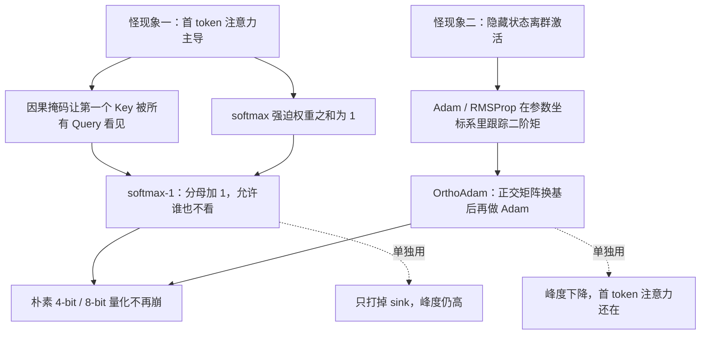
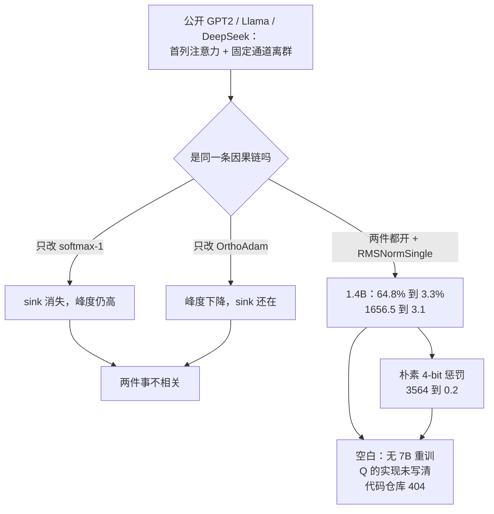

# 首 token 注意力主导和离群激活不是一件事：softmax-1 打掉 sink，OrthoAdam 换基记账

<!-- release-date: 2024-10-22 -->

> 本文依据 **From Attention to Activation: Unraveling the Enigmas of Large Language Models**，ICLR 2025 正式录用稿（封面写 Published as a conference paper at ICLR 2025），本地 PDF 共 **52 页**（正文约 10 页，参考文献与附录至 p.52）。作者 Prannay Kaul、Chengcheng Ma、Ismail Elezi、Jiankang Deng；Kaul 脚注为实习期间完成，通讯作者 Elezi，邮箱 `ismail.elezi@huawei.com`。署名机构是华为诺亚方舟实验室伦敦（Huawei Noah’s Ark Lab, London）与中科院自动化所（CASIA）。按主要归属方，本站放在 Huawei 目录下。下文括号中的 `(PDF p. N)` 一律指这份 52 页 ICLR 原件的文件页码。
>
> **版本说明**：动笔前已核 [arXiv:2410.17174](https://arxiv.org/abs/2410.17174)，**截至 2026-09-10 仍只有 v1**（2024-10-22 16:51:27 UTC 提交，官方页标注 Comments: 10 pages）。本地件是 ICLR 2025 camera-ready，PDF 元数据 CreationDate 为 2025-04-10，比预印本完整——多了量化表、消融、训练细节和全部附录图。**不要用 10 页预印本替换本地件，也不要把预印本页码写进正文。** arXiv 标题用英式拼写 Unravelling，ICLR 正式标题改为 Unraveling，以本地封面为准。OpenReview 论坛：[forum?id=IjduZQK8gM](https://openreview.net/forum?id=IjduZQK8gM)（Published 22 Jan 2025，Last Modified 09 Apr 2025，ICLR 2025 Poster）。
>
> 全文把三件事分开写：**论文明确写了什么**（带页码）、**本文如何解释它**（凡属推算、换算或从图上读数都会写明）、**外部资料补充**（会给出链接并标注）。论文引用了 StreamingLLM 与 attention sink 文献，但**没有发明、也没有复现 StreamingLLM**；那条关系放在外部补充里。

## 阅读前先搭一张最小地图

这篇论文只研究自回归 Transformer 里两件「看起来很怪、部署时又很疼」的事。先把词翻成人话。

- **Token（词元）**：模型读写文本时的基本小块。序列的第一个位置常常是 `<bos>` 这类起始符，本身几乎没有语义。
- **Query / Key / Value（查询 / 键 / 值）**：注意力的三个角色。当前 Token 用 Query 提问，历史位置用 Key 当标签、Value 当内容。
- **Softmax**：把一组实数变成一组**加起来必须等于 1** 的正权重。它强迫模型「必须选点什么」，即使这一头谁都不想看。
- **因果掩码（causal mask）**：解码器里，位置 $t$ 只能看见 $1$ 到 $t$，看不见未来。于是**第一个 Key 是唯一被所有 Query 都能看见的位置**。
- **隐藏状态（hidden states）**：每一层残差连接之后的中间特征。论文盯的就是这里，不是注意力分数本身。
- **离群激活（outlier activations）**：少数特征通道上的数值比其他通道大几个数量级，而且**换一段输入，突起的仍是那几条通道**。
- **峰度（kurtosis）**：衡量一组数尾巴有多厚。正态分布大约是 3；越大说明越「尖、偶发的极大值越多」。
- **Adam**：按每个参数单独跟踪梯度的一阶、二阶滑动平均，再据此缩放步长的自适应优化器。RMSProp 只跟踪二阶。SGD 不跟踪二阶。

论文自己造的两个名字：

- **softmax-1**：在 softmax 分母里加一个常数 1，让所有位置的注意力之和可以小于 1，头就可以「谁也不看」。
- **OrthoAdam**：先用一个固定的正交矩阵把梯度变到另一组坐标，再在那组坐标里跑 Adam，最后把更新转回参数坐标。

## 一句话先说清

这篇论文要拆的不是一个谜，是绑在一起被误认成同一个谜的两件事。

> **首 token 把注意力吸走，是 softmax 加因果掩码逼出来的「空操作」；隐藏状态长出离群通道，是 Adam 这类自适应优化器在参数自己的坐标系里记账的产物。两件事可以同时出现，但不是互为因果，也不能用同一剂药。**

旧方案把它们当成一件事来处理：有人改量化算法去「绕开」离群值，有人在推理期给序列开头留一个 sink token，有人给注意力加门控、加 register。论文的立场更硬（PDF p.2–3、10）：

1. 这两个现象在公开的 GPT2、Llama、DeepSeek 里都在，不是某个实现的偶然；
2. 它们会让最朴素的 4-bit / 8-bit 量化直接崩掉；
3. 正确的修法是**训练期就别让它们长出来**，而不是部署期再打补丁。

两剂药分别是 softmax-1 和 OrthoAdam。合在一起之后，论文给出三个被反复引用的整数（PDF p.1、2）：

| 指标 | 改之前 | 改之后 | 出处 |
|---|---:|---:|---|
| 首 token 注意力占比 | 65% | 3.3% | 摘要与贡献列表，对应 Table 2 里 GPT2-1.4B 的 64.8% → 3.3%（PDF p.8） |
| 隐藏状态峰度 | 1657 | 3.1 | 同上，对应 Table 2 首 token 峰度 1656.5 → 3.1（PDF p.8） |
| 4-bit 权重量化的困惑度惩罚 | 3565 | 0.3 | 摘要；Table 3 给出 3564.3 → 0.2，Table 1 给出 13.3 → 13.6（PDF p.2、9） |

这三个整数都来自他们**自己从零训**的 GPT2-1.4B，不是把 Llama-7B 拿来后处理。后文会把分母拆开。

## 先看全景：一篇论文、两张病、两剂药

Figure 1 把整篇文章画在一页上（PDF p.1）。上排是「现在的 Transformer」，下排是「换成 softmax-1 + OrthoAdam 之后」。

**本文读图**（打开原图核对，不是 OCR）：

- 上左（1a）：GPT2-Medium 对所有头、所有层求平均的注意力图。Query 从上到下、Key 从左到右。最左侧那一列（Key 位置 0）被红框标出，几乎整列都亮——不管 Query 在哪，最大注意力都砸在第一个 Key 上。对角线那条因果下三角还在，但被首列盖住了。
- 上右（1b）：同一模型对各层隐藏状态求平均。横轴是通道，纵轴是 Token 位置。若干条竖直亮带被红框标出，说明**特定通道**在所有位置上都异常大；最上面一行（第一个 Token）被红圈标出，是最极端的位置。
- 下左：同样画注意力图，首列不再发光，图案回到更正常的因果局部。
- 下右：竖直亮带消失，颜色在通道之间均匀得多。图注写着「不降低模型性能」。

这张图根据 Figure 1、Table 2 与 §3–§4 重画（PDF p.1、4–8），是**机制示意**，不含实测时间。虚线是消融里「只改一件」的后果，后面有表。

## 第一层问题：这两个怪现象到底有多普遍

### 怪现象一：第一个 Token 拿走了大部分注意力

论文用 GPT2-Medium 在 C4 英文验证集上定量（PDF p.3）：第一个 Key 在 **76%** 的 `(query, head)` 对里是被看得最重的那个，并拿走全部注意力质量的 **52%**。这个行为在 Llama 系列、DeepSeek、GPT2 系列里都看得到，附录 K 把这些公开模型的注意力图逐个摊开（PDF p.44–50）。

摘要写得更满：**Llama 有 98% 的头对首 token 给出最大注意力**（PDF p.1）。引言把同一数字说成「最多到 98% 的时间」（PDF p.2）。附录 C 对 Llama-3.1-8B 给出的可核对数字是 **95.45%** 的 `(query, head)` 对、首 token 累计注意力 **73.49%**（PDF p.15，Table 7）。**本文的观察**：98% 只出现在摘要和引言，没有一张表按模型列出刚好 98% 这一行；最接近、且带分母的公开模型数字是附录里的 95.45%。

这为什么奇怪？因为第一个 Token 经常是 `<bos>`，语义几乎为空。Llama2 明确用起始符，GPT2 不用，两边却都有这个现象（PDF p.3–4）。按常理，模型应该很快学会「起始符只是格式」，不该让绝大多数头把最大权重砸在它头上。

### 怪现象二：少数通道、所有位置，数值大几个数量级

Figure 1b 上排已经画出：离群不是某个 Token 的偶发尖峰，而是**固定通道**上的一条竖线，换一段输入还是那几条通道（PDF p.1、3；附录 J 用两段不同输入对照，PDF p.37–43）。最极端的值出现在第一个 Token 位置，但**其他位置同样有离群通道**。这一点后面很关键：如果离群只是「注意力汇到第一个 Token」的副作用，就不该在所有位置上复制同一组通道。

量化为什么怕它？动态范围被少数极大值撑开，非离群值能分到的有效比特变少，朴素量化就会把模型打残（PDF p.2）。Table 1 把这件事写得很不客气（PDF p.2）：

| 模型 | 参数量 | FP16 PPL | 4-bit 权重量化 PPL |
|---|---:|---:|---:|
| GPT2-Small | 137M | 37.8 | 4456.1 |
| GPT2-Medium | 350M | 28.8 | 2435.3 |
| GPT2-Large | 812M | 25.2 | 571.0 |
| GPT2-XL | 1.6B | 23.2 | 7981.8 |
| Llama2-7B | 6.7B | 7.7 | 191477.5 |
| Llama3.1-8B | 8B | 10.2 | 2087638.0 |
| GPT2（他们的） | 350M | 16.3 | 17.1 |
| GPT2（他们的） | 1.4B | 13.3 | 13.6 |

公开模型用最基本的 zeropoint 4-bit 权重量化，困惑度直接爆到不可用。他们自己用 softmax-1 + OrthoAdam 训的 350M / 1.4B，惩罚只剩 0.8 和 0.3。注意：他们的 GPT2 是在 C4 上从零训的，PPL 绝对值不能拿来和公开 GPT2（WebText）比谁更强，这张表只说明**量化崩不崩**。

先前工作把两件事连在一起讲（Xiao et al., 2023；Bondarenko et al., 2023）。论文承认：第一个 Token 位置上那些最极端的离群，看起来确实像注意力主导的后果；但它**解释不了所有位置上同一组通道的离群**（PDF p.3）。于是全文的结构性主张是：

> **两件事不相关，必须分开治。**

## 核心设计一：softmax-1，让注意力头可以「谁也不看」

### 旧问题：头必须把 1 分完，而第一个 Key 是唯一的公共垃圾桶

因果 Transformer 里，第一个 Query 只能看见自己，softmax 之后注意力必然是 1。第二个 Query 只能看见前两个 Key，两者权重之和仍是 1。注意力头又会专化到某些概念（论文引 Bansal et al., 2023；Elhage et al., 2022）。于是当当前 Query 跟这个头的专长无关时，它仍然必须把总和为 1 的权重分出去（PDF p.4）。

同时，因果掩码给了第一个 Key 特权：**它是唯一被所有 Query 都能看见的 Key**。论文的原话是，过量盯着第一个 Key，说明这个头其实在「什么都不做」（doing nothing），并引 Bondarenko et al., 2023 与 Clark et al., 2019（PDF p.2、4）。

### 先排除一批看起来像原因、其实不是的东西

GPT2 和 Llama 都有首 token 主导，所以两边不一样的部件都可以划掉（PDF p.4）：

| 部件 | GPT2 | Llama | 结论 |
|---|---|---|---|
| 位置编码 | 可学习绝对位置 | RoPE | 不是共因 |
| 起始符 | 无 `<bos>` | 有 `<bos>` | 不是共因 |
| FFN 激活 | GeLU | SiLU | 不是共因 |
| 特征归一化 | LayerNorm | RMSNorm | 不是共因 |

「是不是任何位置编码都会害？」他们另训了一个**完全去掉位置编码**的 GPT2。有 / 无位置编码时，首 token 成为最大注意力的比例是 33% / 20%，占总注意力的 17% / 10%（PDF p.4）。主导变弱了，但没有消失。论文因此说位置编码不是原因。它同时提醒：这几颗模型步数较少，训得更久的模型和公开预训练模型上，主导会更明显（PDF p.4）。

剩下两个嫌疑：因果掩码，以及注意力里的 softmax。

### 新设计：分母加 1

论文把 softmax 改成（PDF p.4，式 1）：

$$
\operatorname{softmax\text{-}1}(x_i)=\frac{\exp(x_i)}{1+\sum_{j=1}^{L}\exp(x_j)},
\qquad
\sum_{i=1}^{L}\operatorname{softmax\text{-}1}(x_i)<1
$$

人话：原来分母是「所有 Key 的 $\exp$ 之和」，现在多了一个常数 1。因为 $\exp(0)=1$，这在数学上等价于**凭空多了一个与任何 Query 点积都是 0 的假 Key**。真 Key 分到的权重加起来可以小于 1，少掉的那一份不对应任何 Value，等于被丢掉。头第一次获得「这一票我弃权」的权利。

论文自己把这个 1 解释成 register / attention sink 视角下的一个点积恒为 0 的 sink key（PDF p.4），引用 Darcet et al., 2024 与 Xiao et al., 2024。**请注意主语**：他们是在用别人的术语解释自己的公式，不是在声称发明了 StreamingLLM。与 sink 文献的对照见下一小节，标成外部补充。

### 工作机制：一条很短的因果链

- **旧问题**：softmax 强制 $\sum_i \alpha_i=1$，因果掩码又让第一个 Key 成为唯一的全局可见位置，于是「空操作」塌缩到位置 0。
- **新设计**：分母加 1，允许 $\sum_i \alpha_i<1$。
- **工作机制**：当所有真实 Key 的 logit 都很低时，分母被常数 1 主导，输出接近 0 向量，残差流几乎不被这头改写。
- **收益**：同一套训练超参下，首 token 成为最大注意力的比例从 53% 降到 2%，首 token 占总注意力从 46% 降到 4%（PDF p.4，短训对照）。主实验里 GPT2-1.4B 从 64.8% 降到 3.3%（PDF p.8）。训练曲线看不出稳定性或收敛变差（附录 L，PDF p.51–52）。
- **代价与边界**：这是训练期改注意力公式，不是推理期打补丁；已训好的 softmax 模型不能直接换成 softmax-1 而不重新训。它**打掉的是 sink，不是离群激活**——Table 2 里只开 softmax-1、不开 OrthoAdam 时，60M 的其余位置峰度仍是 81.4，对 77.9 几乎没动（PDF p.8）。

### 因果掩码的对照实验：特权不在「第一个」，在「人人都能看见的那个」

他们把前 10 个 Token 的因果掩码拿掉（损失函数也改了），让所有 Query 都能看见前 10 个 Key。Figure 2 显示：主导列不再钉在位置 0，而是前 10 个里的某一个，而且「均匀随机地」换人（PDF p.5）。**本文的读法**：垃圾桶跟随着「公共可见集合」移动，不是位置编码或 `<bos>` 的魔力。这是「因果掩码赋予特权」这条因果链最干净的一条证据。

### 外部补充：这篇不是 StreamingLLM，softmax-1 也不是 2024 年才出现的公式

论文在相关工作里把 Xiao et al., 2024 写成：长程注意力里发现了同一问题，并用 **attention sinks** 加不连续掩码做了 workaround（PDF p.10）。StreamingLLM 的做法是**承认 sink 存在、推理时把 sink token 留下来**，好让滑动窗口还能工作。本篇的目标相反：训练期就让 sink 不要长出来。两者引用关系在，发明权不在本篇。StreamingLLM 原文见 [arXiv:2309.17453](https://arxiv.org/abs/2309.17453)。本仓库里 NSA、MiMo-V2-Flash、Trinity-Large 都把 attention sink 当已知现象使用，那是那些文章自己的叙述，不是本篇的结论。

同一页还引用了 Darcet et al., 2024 的 Vision Transformer **registers**，以及 Bondarenko et al., 2023 在 BERT 上看到的「空洞 token 主导」和他们的门控 / 裁剪方案（PDF p.10）。论文的自我定位是：别人给 workaround，自己找到根因并改 softmax。

**外部补充，且必须单独说一句。** 论文把 Miller (2023) 概括成「认为激活离群是注意力机制引起的」（PDF p.10）。Miller 的原文其实走得更远：2023-07-24 的博文 [Attention Is Off By One](https://www.evanmiller.org/attention-is-off-by-one.html) **写出了和式 (1) 完全相同的 softmax-1**，并明确主张它能打断离群值的反馈环。本篇的实验不同意后半句因果：Table 2 显示只改 softmax、不换优化器，峰度几乎不掉（PDF p.8）。也就是说，**公式不是本篇首创，本篇的新意是用对照实验把「注意力主导」和「离群激活」拆开，并证明 softmax-1 只治前者。** 这是外部核对，不是论文自己承认的出处关系。

## 核心设计二：OrthoAdam，别让 Adam 在参数自己的坐标系里放大少数通道

### 旧问题：峰度可以到一千以上，而且随模型变大而变大

隐藏状态 $X\in\mathbb{R}^{M\times L\times D}$（层 × Token × 通道）。对每一层、每一个位置，沿通道算峰度（PDF p.5，式 2）：

$$
\kappa_{m,l}=\frac{\mathbb{E}_d[(X_{m,l,d}-\mu_{m,l})^4]}{\mathbb{E}_d[(X_{m,l,d}-\mu_{m,l})^2]^2},
\qquad
\mu_{m,l}=\mathbb{E}_d[X_{m,l,d}]
$$

正态分布约等于 3。Table 2 里 GPT2-1.4B 的首 token 峰度是 **1656.5**，其余位置也有 351.9（PDF p.8）。公开的 Llama-3.1-8B 首 token 峰度 1227（PDF p.15）。

### 先排除：不是 bias，也不是「有归一化」这么简单

GPT2 有 FFN bias，Llama 没有，两边都有离群，所以 bias 不像主因（PDF p.5）。两边的 LayerNorm / RMSNorm 都会给每个通道学一个缩放，看起来很像嫌疑犯。他们把 GPT2 的 LayerNorm 换成 **RMSNormSingle**：全体通道共用一个全局缩放，不再 per-channel。离群还在。Table 5 里无 bias + RMSNorm-S + Adam + softmax-1，峰度仍是 140（PDF p.5、10）。

### 真正的主因：在参数坐标系里跟踪指数滑动平均的自适应优化器

Adam 对每个参数跟踪梯度的一阶矩 $m$ 和二阶矩 $v$，超参 $\beta_1$、$\beta_2$ 控制衰减。$\beta_2=0$ 就接近带动量的 SGD；$\beta_1=0$ 就接近 RMSProp（PDF p.5）。论文的怀疑是：这些矩是在**和参数同一个基**里跟踪的，于是某些坐标上的二阶矩一旦偏小，自适应步长就会在这些坐标上走出不成比例的大更新，权重在这些坐标上被拉大，激活就在对应通道上长出尖峰（PDF p.5–6）。

对照实验（PDF p.5–6，完整数字在 Table 5，PDF p.10）：

| 优化器 | 峰度 | 最大绝对值 | PPL | 备注 |
|---|---:|---:|---:|---|
| Adam | 140.0 | 432.0 | 26.6 | 基线，RMSNorm-S + softmax-1 |
| RMSProp | 70.5 | 302.2 | 27.4 | 仍高 |
| SGD + momentum | 5.0 | 17.8 | 25.3 | 训 8 倍步数才收敛 |
| SGD 无动量 | 3.2 | 13.1 | 33.4 | 峰度接近正态，PPL 差 6.8 |
| OrthoAdam | 3.0 | 43.5 | 26.8 | 要的就是这一行 |

SGD 能把峰度打到约 3，但收敛又慢又差；Adam 收敛好，但峰度高。问题于是变成一句话（PDF p.6）：

> **怎样才能有 Adam 的速度，又有 SGD 那种接近正态的激活？**

### 理想化模型：一根钉子加一团高斯，正交旋转就能把钉子摊平

设 $x=\alpha e_i+z$，其中 $e_i$ 是第 $i$ 个坐标轴上的单位向量，$\alpha\gg 1$ 是那根钉子，$z\sim\mathcal{N}(0,I)$ 是「有信息的」激活（PDF p.6）。两个假设：只有一个离群通道；其余近似正态。

在 $D\sim 10^3$–$10^5$ 时，这个玩具模型的峰度是 $O(D)$，所以**同结构的更大模型，峰度往往更高**（PDF p.6；附录 G 把「$\alpha=D$」代入后得到 $\mathrm{Kurt}=O(D)$，PDF p.21–23）。$\ell_\infty/\ell_2$ 范数比接近 1，也是「有一根大钉子」的另一种说法。

取正交矩阵 $Q$，令 $y=Qx$，并让 $Q$ 把那根钉子转到均匀向量 $\frac{1}{\sqrt{D}}\mathbf{1}$ 上。于是 $\lVert y\rVert_2^2/\lVert y\rVert_\infty^2 \approx D$，$\mathrm{Kurt}[y_j]=3$（PDF p.6）。Figure 3 用 2D / 3D 画出这件事：一根轴上的长箭头被转到对角线上，每个坐标的绝对值都变小（PDF p.6）。附录 H 给出 $\ell_\infty/\ell_2$ 从约 1 降到 $O(1/D)$ 的推导（PDF p.24–25）。

一个很自然的想法是：把 $Q$ 直接乘在隐藏状态上，当模型的一部分冻住。论文**没有走这条路**。他们把正交变换放进优化器，作用在梯度上（PDF p.6）。

### 新设计：梯度先换基，Adam 在另一组坐标里记账

Algorithm 1 的步骤可以读成「夹心 Adam」（PDF p.7）：

1. 在参数坐标里算出梯度 $g_t$；
2. $\bar g_t = Q g_t$，变到优化器自己的坐标；
3. 对 $\bar g_t$ 做标准的 Adam 一阶 / 二阶滑动平均，得到更新 $\bar s_t$；
4. $s_t = Q^{\top}\bar s_t$，转回参数坐标再改权重。

$Q$ 对每个参数张量随机采样一次，**训练全程固定**（PDF p.6）。$\eta=0.001$，$\beta_1=0.9$，$\beta_2=0.999$，$\epsilon=10^{-8}$，和常见 Adam 默认值相同（PDF p.7）。

直觉：参数坐标里那根「二阶矩特别小、因而步长特别大」的钉子，换到随机正交基之后，大概率被摊到许多坐标上，不再对应某一个特征通道。于是不会再出现「某个输出通道被持续、不成比例地加大」。

附录 E 把这条直觉画成权重范数和二阶矩的热力图（PDF p.17–19）。**本文读图**：Figure 4（Adam）每一层 MLP 输出权重的欧氏范数都有一条刺眼的竖线，对应通道的二阶矩之和反而是**小离群**——小二阶矩 → 大学习率 → 大权重，和正文的故事一致。Figure 5（softmax-1 + OrthoAdam）同样 12 层，颜色在通道之间均匀得多，范数的动态范围从「几到几十」收成「大约 4 到 8」。

### 工作机制：再走一遍因果链

- **旧问题**：Adam / RMSProp 在参数基上跟踪二阶矩，早期尚未校准的滑动平均会给少数坐标过大的自适应步长；这些坐标对应的通道变成离群激活，且与输入无关。
- **新设计**：每个参数一张固定随机正交矩阵，矩的跟踪换基进行。
- **工作机制**：换基之后，「小二阶矩钉子」不再对齐某个特征通道；转回参数坐标的更新在通道之间更均匀。
- **收益**：主实验 GPT2-1.4B 首 token 峰度 1656.5 → 3.1，最大绝对值 56798 → 182（PDF p.8）。消融里 OrthoAdam 把峰度从 140 降到 3.0，PPL 仍与 Adam 相当（PDF p.10）。
- **代价与边界**：多一次 $Q$ 和 $Q^{\top}$ 的矩阵乘，显存略增（Table 4，PDF p.9）。更重要的边界见消融：如果归一化仍给每个通道独立缩放（LayerNorm 或 RMSNorm-M），即使上了 OrthoAdam，峰度也会回到几百（Table 5 末三行，PDF p.10）。**本文的读法**：论文贡献列表只写 softmax-1 和 OrthoAdam，但他们真正把峰度打到 3 的配方，还包含「去掉 per-channel 仿射、改用 RMSNormSingle、去掉 FFN bias」。后两项被写成实验设定，消融证明它们不是装饰。

### 一个实现上的空白：Algorithm 1 的 $Q\in O_n$ 按字面存不下

Algorithm 1 把参数写成 $\theta\in\mathbb{R}^n$、$Q\in O_n$（PDF p.7）。若 $n$ 是一张权重里元素个数，对 $2048\times 2048$ 的矩阵就要存 $(2048^2)^2$ 规模的正交阵，这在物理上不可能。附录 F 却把同一张 $Q$ 写成 $Q_i\in O_D$，$D$ 是隐藏维度（PDF p.20）。Table 4 里 1.4B 的显存只从 61.9 GB 涨到 65.0 GB（PDF p.9），也只符合「$D\times D$ 量级」而不是「$n\times n$」。**本文的判断**：实际几乎一定是按隐藏维度（或每个张量的某一维）乘 $D\times D$ 的正交阵；论文没有把张量收缩方式写清楚。附录 H 还提到可以用归一化的 Hadamard 矩阵构造 $Q$（PDF p.25），实验正文写的是随机采样。

附录 F 的 Figure 6 还做了一个「事后旋转」对照（PDF p.20）。**本文读图**：GPT2-350M 的 vanilla 层输出峰度约 $10^3$；softmax-1 + OrthoAdam 的 $X$、$XQ$、$XQ^{\top}$ 三条线都贴在约 3；用右奇异向量 $V$ 去转（这是「把峰度转到最大」的基线）则回到约 $10^3$。也就是说，**他们的模型并不是「离群被藏进了 $Q$ 的坐标、在标准基里看不见」**——在 $Q$ 基里峰度同样低。论文没有给这张图的数值表。

## 两剂药为什么必须一起用，而不能互相替代

Table 2 是全文最重要的一张表（PDF p.8）。四列开关：softmax-1 开/关 × OrthoAdam 开/关。所有模型都在 C4 英文训练集上从零训，验证用 10 万条（PDF p.7）。架构上除 softmax 外，统一改成 RMSNormSingle、去掉 FFN bias（PDF p.7）。序列长度 256，batch 512，峰值学习率 $10^{-3}$，余弦衰减加线性 warmup。

先看 GPT2-1.4B 这一行，它对应摘要那三个整数：

| softmax-1 | OrthoAdam | PPL | 首 token 峰度 | 其余位置峰度 | 首 token 最大\|激活\| | % 首 token 最大注意力 |
|---|---|---:|---:|---:|---:|---:|
| 关 | 关 | 13.4 | 1656.5 | 351.9 | 56798 | 64.8% |
| 开 | 开 | 13.3 | 3.1 | 3.0 | 182 | 3.3% |

再看「只改一件」在 60M / 130M / Llama2-130M 上的模式（350M 和 1.4B 没有把四个组合全跑完）：

- **只开 softmax-1**：首 token 注意力立刻掉到约 2%，但其余位置峰度几乎不动（60M：77.9 → 81.4；130M：141.5 → 144.2）。
- **只开 OrthoAdam**：其余位置峰度明显下降（60M：77.9 → 10.6；130M：141.5 → 20.2），但首 token 注意力仍有 36.5% / 42.4%，首 token 峰度仍是 260.8 / 446.4。
- **两件都开**：两项一起掉。Llama2-130M 的注意力基线本来就只有 10.5%，两件都开后是 1.7%，峰度 170 → 6.9（PDF p.8）。

正文把其余位置峰度概括成 77.9、141.5、161.8、351.0 → 7、7.3、3.1、3.0（PDF p.8）；表里 1.4B 的其余位置是 351.9 而不是 351.0，属四舍五入。摘要的 1657 对应的是**首 token 峰度** 1656.5，不是对其余位置的 351.9。读摘要时要把分母记清楚。

PPL 在所有组合里几乎持平。论文据此说：这两个现象**不是把模型训好所必需的**（PDF p.8）。

## 量化：这才是两剂药的「实践意义」

§5.2 用两种朴素量化（PDF p.8–9）：

- **Absmax**：用张量绝对值的最大值做缩放。三种粒度：fine（输入激活和权重 per-channel）、moderate（两者 per-tensor）、coarse（输入、输出激活和权重都 per-tensor）。
- **Zeropoint 4-bit**：只量化权重，per-channel。只动线性层；embedding、归一化、softmax 不量化。

Table 3（PDF p.9）把惩罚 $\Delta$ 写成「量化后 PPL 减满精度 PPL」：

| 模型 | 设定 | 满精度 | coarse $\Delta$ | moderate $\Delta$ | fine $\Delta$ | 4-bit $\Delta$ |
|---|---|---:|---:|---:|---:|---:|
| GPT2-60M | 原版 | 31.88 | 11.65 | 2.99 | 0.27 | 36.6 |
| GPT2-60M | S1+OA | 31.83 | 0.47 | 0.35 | 0.06 | 2.1 |
| GPT2-130M | 原版 | 22.89 | 23.60 | 5.42 | 0.18 | 657.0 |
| GPT2-130M | S1+OA | 22.78 | 0.43 | 0.32 | 0.05 | 1.2 |
| GPT2-350M | 原版 | 16.37 | 36.12 | 3.55 | 0.13 | 118490.7 |
| GPT2-350M | S1+OA | 16.31 | 0.19 | 0.15 | 0.02 | 0.8 |
| GPT2-1.4B | 原版 | 13.44 | 31.61 | 1.75 | 0.24 | **3564.3** |
| GPT2-1.4B | S1+OA | 13.33 | 0.12 | 0.10 | 0.01 | **0.2** |
| Llama2-130M | 原版 | 17.39 | 26.22 | 7.07 | 0.30 | 4.1 |
| Llama2-130M | S1+OA | 17.31 | 3.54 | 2.80 | 0.07 | 2.4 |

摘要里的「3565 → 0.3」是 GPT2-1.4B 的 4-bit 惩罚：Table 3 写 3564.3 → 0.2，Table 1 用 13.3 → 13.6 得到 0.3（PDF p.1、2、9）。**本文按有完整设定的 Table 3 引用 3564.3 和 0.2，并标明摘要做了四舍五入。**

读这张表只需要记住三件事：

1. **fine 8-bit 两边都能活**，原版的惩罚已经小于 0.3，看不出方法差异。
2. **coarse 8-bit 和 4-bit 权重是分水岭**。原版 GPT2 在 4-bit 下从 68.5 一路炸到 118507；S1+OA 的 4-bit 惩罚不超过 2.1，1.4B 只有 0.2。
3. Llama2-130M 原版 4-bit 没有炸到不可用（$\Delta=4.1$），但 coarse 仍然掉 26 点；S1+OA 把 coarse 惩罚收到 3.54。论文说「标准方法做不到、他们的模型用最基本算法就能保住」（PDF p.1、9），对 GPT2 的 4-bit 完全成立，对这颗小 Llama 要说成「惩罚显著变小」，不要说成「原版完全不能量化」。

他们没有和 SmoothQuant、LLM.int8() 做头对头比较。相关工作的表述是：那些方法要校准、要混精度；自己是把离群消掉，从而能用 Absmax / Zeropoint（PDF p.10）。**这是「我们这条路不需要那些补丁」，不是「我们比 SmoothQuant 量化得更准」。**

## 消融：真正把峰度打到 3 的配方，比贡献列表多两味药

Table 5 在 GPT2-130M、只训 40k 步（约 5B token）上扫了一圈（PDF p.10；设定见附录 A，PDF p.14）。SGD 那两行步数乘 8。

必须盯住的几行：

1. **去掉 bias、换位置编码，首 token 主导还在。** 无位置编码时从 33.3% 降到 19.7%，和 §3.1 一致；RoPE 反而是 33.6%。
2. **softmax-1 把首 token 主导打到约 2%，无论后面跟哪种归一化和优化器。** 这一列非常干净。
3. **RMSNorm-M（Llama 那种 per-channel 缩放）几乎不降峰度**（230.4）。RMSNorm-S 降约 40%，仍有 140。
4. **优化器是峰度的主开关**：Adam 140，RMSProp 70.5，SGD 3.2–5.0，OrthoAdam 3.0。
5. **末三行是全文最容易被摘要漏掉的结果**：
   - OrthoAdam + RMSNorm-S，但关掉 softmax-1：峰度 323.0，首 token 注意力回到 23.1%；
   - OrthoAdam + softmax-1 + RMSNorm-M：峰度 380.9；
   - OrthoAdam + softmax-1 + LayerNorm：峰度 188.4。

论文把末三行概括成：「拿掉 softmax-1 会重新引入首 token 主导，改用 LayerNorm 或 RMSNorm-M 会重新引入离群激活」（PDF p.9）。**本文把它读成一条实现约束**：OrthoAdam 不是「任何架构上换个优化器就行」。它依赖「模型自己不要再引入 per-channel 的基依赖」。附录 E 把这件事说得更形式（PDF p.19）：带 bias 的仿射和多尺度 RMSNorm 都不是基无关的（basis-independent）；SGD 的更新是基无关的，Adam / RMSProp 因为逐元素二阶矩而不是。他们去掉 bias、改 RMSNormSingle，就是在模型侧先拆掉基依赖，再在优化器侧拆掉剩下的那一份。

Table 4 的代价：60M 从 14 iter/s、16.4 GB 到 12 iter/s、16.8 GB；1.4B 从 1.0 iter/s、61.9 GB 到 1.1 iter/s、65.0 GB（PDF p.9）。论文说「可接受的少量增加」。1.4B 的 iter/s 略升，正文没有解释，本文不替它编原因。

## 附录里必须带走的证据

正文 10 页把故事讲完，但几个关键限定和一张机制图在附录。按字母走一遍。

### 附录 A：他们到底训了多大、训了多久（PDF p.14）

8 张 32 GB V100，PyTorch + HuggingFace Transformers。主实验 token 数：60M / 130M / 350M / 1.4B 分别是 **21B / 42B / 126B / 79B**（1.4B 因算力减步数）。消融 5B。序列长度 256——论文认为这已经够引出公开模型上那两种异常。峰值学习率 Adam / OrthoAdam 为 $10^{-3}$，SGD 为 0.2。

**本文换算**：21B = 160k steps × 512 batch × 256 长度，和正文 §5 一致。规模上限是 1.4B 从零预训练，没有 7B 级的 S1+OA 训练。

### 附录 B：把序列加到 512 / 1024，结论不变（PDF p.15，Table 6）

60M 和 130M 在 256 / 512 / 1024 三种长度上，S1+OA 的 coarse 惩罚仍在 0.06–0.60，原版仍是 11–24 点。论文据此说对更长训练序列鲁棒。没有 2k 以上，也没有把 350M / 1.4B 放进这张表。

### 附录 C：公开的大模型上，两件事都在，指令微调消不掉（PDF p.15，Table 7）

Llama-3.1-8B 与 Llama-3.1-8B-Instruct：

| 模型 | % 最大注意力在首 token | 首 token 累计注意力 | 首 token 峰度 | 平均峰度 |
|---|---:|---:|---:|---:|
| Llama-3.1-8B | 95.45 | 73.49 | 1227 | 55 |
| Llama-3.1-8B-Instruct | 95.53 | 70.13 | 1228 | 69 |

论文的解读：网络越大，头越专化，大多数头会学会「什么都不做」；盯着第一个 Token 就是 Transformer 发展出的空操作机制。指令微调几乎不改变首 token 注意力和首 token 峰度，平均峰度甚至更高。**这是观察，不是用 softmax-1 / OrthoAdam 重训 8B。** 附录 C 正文有一处把这张表叫成 Table 8，实际编号是 Table 7（PDF p.15）。

### 附录 D：他们自己做的指令微调，两剂药仍然够用（PDF p.16，Table 8）

用 Alpaca 对 GPT2-130M 做监督微调。原版满精度 PPL 18.33，coarse 掉 12.07；S1+OA 是 18.29，三种 8-bit 粒度的 $\Delta$ 为 0.02 / 0.02 / 0.0。首 token 最大注意力 65.57% → 2.4%，累计注意力 41.49% → 0.8%，首 token 峰度 564.75 → 2.97。这是「从零预训练阶段就带 S1+OA，再做指令微调」，不是对公开 GPT2 后处理。

### 附录 E：基无关语言，以及「小二阶矩 → 大权重」（PDF p.17–19）

形式结论：SGD 更新对正交变换是等变的；Adam / RMSProp 因为 $v_{t+1}$ 里有逐元素平方，换基之后不等于 $Q v_{t+1}$（PDF p.19，式 E.3–E.4）。他们相信**基依赖的函数**（模型侧或优化器侧）就是离群激活的来源。离群权重大多在每块 MLP 的输出线性层。Figure 4 / 5 已在上文读过。

正文末尾把两张图写成「Figure 6 和 Figure 5」（PDF p.19），与实际编号 Figure 4 / 5 不一致。按图注，Adam 是 Figure 4，S1+OA 是 Figure 5。

### 附录 F：离群不是被藏进 $Q$ 里（PDF p.20）

见上文 Figure 6 读图。$Q_i\in O_D$ 也是「$Q$ 作用在隐藏维度上」这条实现线索最硬的一处。

### 附录 G / H：玩具模型的数学（PDF p.21–25）

附录 G 推导 $x=\alpha e_i+z$ 的峰度；在保守假设 $\alpha=D$ 下得到 $O(D)$（PDF p.23，式 G.4）。Table 9 列出他们模型的 $D$ 和最大激活 $\alpha$（PDF p.22）：60M 的 $D=512$、$\alpha=1856$；1.4B 的 $D=2048$、$\alpha=56798$。经验上 $\alpha>D$，所以「$\alpha=D$」确实保守。附录 H 再证正交旋转把 $\ell_\infty/\ell_2$ 从约 1 降到 $O(1/D)$，峰度到 3（PDF p.25）。这是动机推导，不是新实验。

### 附录 I：层间曲线，中层才是 sink 高峰（PDF p.26–36）

对 Table 2 里每颗模型，按归一化深度画出四条曲线：首 token 最大注意力比例、首 token 峰度、$\ell_\infty/\ell_2$、最大绝对值。论文观察到一个共同形状（PDF p.26）：

- 浅层：还在处理所有输入，sink 不强；
- 中层：头开始专化，第一个 Token 变成默认空操作，sink 到高峰；
- 末层：特征被「detokenise」回词空间，sink 回落。

Figure 7 上 GPT2-60M 的原版（蓝）和只开 OrthoAdam（红虚线）都在中后段升到约 0.7–0.8，只开 softmax-1 和两件都开的两条线贴在接近 0（PDF p.26）。**本文读图**：softmax-1 是层间曲线的主开关，OrthoAdam 几乎不改这条注意力曲线，和 Table 2 一致。

峰度曲线（Figure 12–16）上，不开 OrthoAdam 的模型随深度升高；两件都开则贴在约 3。60M / 130M 的 S1+OA 在末层有一点回升，论文明确留给未来工作（PDF p.28）。$\ell_\infty/\ell_2$ 与峰度同形。Table 10 给出二者的 Pearson 相关，他们自己的模型和公开 GPT2 / Llama 大多在 0.85 以上；唯一明显偏低的是 Llama2-130M + S1+OA 的首 token，只有 0.560（PDF p.33）。论文没有讨论这个例外。

公开 GPT2 / Llama 的层间曲线（Figure 11、16、21、26）形状与「不开 S1+OA 的自训模型」同类，用来说明他们没有在玩具设定里自说自话。

### 附录 J / K：公开模型的隐藏状态和注意力图（PDF p.37–50）

J 给 GPT2-Small / Medium / Large / XL、Llama2-7B、Llama3.1-8B、DeepSeekv2-Lite，各用**两段不同输入**。共同点是：平均图和中深层图上，离群通道是竖线，两段输入的亮带位置相同。K 用同样一组模型画注意力。论文说：大约第一、二层之后，首 token 主导就稳定下来，并在后续层保持（PDF p.44）。这些图是定性证据，没有再给新的汇总数字。

### 附录 L：训练曲线几乎贴在一起（PDF p.51–52）

最终训练 loss：GPT2-60M 四条在 3.56–3.59；130M 在 3.19–3.21；350M 两条都是 2.86；1.4B 为 2.64 / 2.63；Llama-130M 在 2.83–2.84。论文用来说明 S1 和 OA **不伤害收敛**。没有验证集曲线，也没有报告 loss 尖峰。

## 和邻居优化器的一句对照（外部 / 内部补充）

OrthoAdam 用正交矩阵，Moonshot 的 Muon 也用正交化，但不是同一件事。Muon 是对二维权重的**更新矩阵**做 Newton-Schulz 近似正交，让一步更新在各方向幅度均匀；本仓库已发布的解读见 [Muon is Scalable for LLM Training](/reports/Moonshot/Muon-is-Scalable-for-LLM-Training)。OrthoAdam 不正交化更新本身，它正交化的是 **Adam 记账时所用的坐标系**。本篇参考文献里没有 Muon。这是对照阅读，不是论文结论。

本仓库里把「softmax 分母加一项、允许谁也不看」写成训练配方的，还有 [MiMo-V2-Flash](/reports/Xiaomi/MiMo-V2-Flash) 的可学习 sink 偏置，以及 [DeepSeek-V4](/reports/DeepSeek/DeepSeek-V4) 在压缩注意力里的类似项。那些是**学出来的标量**，本篇的 1 是写死的 $\exp(0)$。不要把三篇读成同一个发明。

## 论文没写、以及无法核实的

### 论文明确留下的边界

- **没有 7B 以上的 S1+OA 从零训练。** Llama-3.1-8B 只被观察，没有被这套方法重训（PDF p.15）。
- **主实验序列长度 256**，附录 B 到 1024，没有长上下文下游任务，也没有「换成 softmax-1 之后就可以不做 StreamingLLM 那种不连续掩码」的实验（PDF p.2 把长序列掩码写成动机，实验未闭合）。
- **没有和 SmoothQuant、LLM.int8()、GPTQ 等后训练量化头对头。** 比较对象是「同样的模型、朴素 Absmax / Zeropoint」（PDF p.8–10）。
- **350M 和 1.4B 没有跑满四个开关组合**，只报了「全关」和「全开」（PDF p.8）。
- **没有官方代码可核。** 摘要给出 <https://github.com/prannaykaul/OrthoAdam>（PDF p.1）。2026-09-10 访问为 404；GitHub 用户 `prannaykaul` 现有 6 个公开仓库，不含此名；Wayback Machine 在 2025-05-26 的快照已经是 404。无法核对其首次提交时间，也不能把仓库实现细节当论文结论。

### 论文没有写、本文也不替它补的空白

- $Q$ 的张量收缩、是否对所有参数张量都乘、随机正交如何采样（QR、Haar、Hadamard），Algorithm 1 与附录 F 的记号不一致。
- OrthoAdam 与 AdamW 的权重衰减、$\epsilon$ 写在分母的位置（Algorithm 1 写的是 $\sqrt{\hat v}+\epsilon$ 而非常见的 $\sqrt{\hat v+\epsilon}$）有没有做过消融。
- 只把 OrthoAdam 用在 MLP 输出层、其他层仍用 Adam，够不够。附录 E 说离群权重「一般」在 MLP 输出层（PDF p.19），没有做成实验。
- softmax-1 对 FlashAttention 内核、数值稳定性、混合精度的影响。
- 峰度在 60M / 130M 末层回升的原因（PDF p.28 明文留给未来）。
- Table 10 里 Llama2-130M + S1+OA 首 token 相关只有 0.560，未讨论（PDF p.33）。
- 预训练数据除「C4 en」之外的清洗、重复、打包方式。
- 没有把方法接到 MoE、线性注意力、GQA / MQA 的专门实验。DeepSeekv2-Lite 只出现在观察图里。

## 可迁移的五条

### 1. 先问「两件同时出现的怪事是不是同一条因果链」

全文最值钱的不是 softmax-1 这个公式，而是 Table 2 的 2×2：只改注意力，峰度不掉；只改优化器，sink 还在（PDF p.8）。量化文献习惯把 sink、离群、难量化写进同一段。

**迁移方式**：观测到 A 和 B 总是一起出现时，不要急着为 A 设计一个也顺带解释 B 的故事。做一个「只关 A、只关 B」的开关实验，比再画一百张注意力图更重要。

### 2. 当离散选择不允许弃权，系统会自己找一个垃圾桶

softmax 的 $\sum=1$ 加上因果掩码的「人人可见集」，垃圾桶就落在位置 0。放松前 10 个位置的掩码，垃圾桶跟着公共可见集移动（PDF p.5，Figure 2）。

**迁移方式**：路由、注意力、专家选择、缓存淘汰，凡是「必须把质量 1 分完」的归一化，都要问：没有任何候选合格时，质量去哪？写死一个常数分母、加一个学出来的 sink、或显式的空专家，是同一类出口。本篇选的是最便宜的那种：分母加 1。

### 3. 自适应优化器的坐标系和特征的坐标系重合时，记账方式会变成归纳偏置

Adam 的逐元素二阶矩在「刚好对齐通道」的基里，会把偶然偏小的二阶矩放大成通道级离群，而且与输入无关（PDF p.6、19）。换基之后，同样的 Adam 不再长出这些通道。

**迁移方式**：如果某种统计量（滑动平均、对角 Fisher、per-channel 缩放）和你关心的特征轴重合，它就可能把优化器噪声写进那些轴。选项有三：换统计量的基（本篇）、把模型改成基无关（RMSNormSingle）、或不用自适应优化器（SGD）。本篇的数据表明前两个要一起做。

### 4. 「能量化」有时应该在训练期制造，而不是在部署期补偿

论文刻意对比两条路：SmoothQuant / LLM.int8() 接受离群、用校准去绕；自己在训练期把离群和 sink 掐掉，然后用最笨的 Absmax / Zeropoint（PDF p.10）。1.4B 上 4-bit 惩罚从 3564 降到 0.2（PDF p.9）。

**迁移方式**：如果部署约束是「必须能用最朴素的逐张量量化」，把目标写进训练目标（换归一化、换优化器、换 softmax）可能比再发明一种量化算法更干净。反过来，如果必须复用已经训好的 70B 权重，本篇的方法帮不上——它不是后处理。

### 5. 报收益时把「公开大模型上的观察」和「小模型上的干预」分开

98%、95.45%、73.49% 来自公开 Llama 的**观察**（PDF p.1、15）。65% → 3.3%、1657 → 3.1、3565 → 0.3 来自最多 1.4B 的**干预**（PDF p.1、8–9）。两者都真，但不是同一实验。

**迁移方式**：动机数字可以来自 8B、70B；方法数字必须来自真正打上补丁的那些 run。把观察写成「我们的方法在 Llama-8B 上把 98% 打成 3%」是偷换。

## 用一张图重新串起全文

这张图是本文对全文逻辑的归纳，不对应论文中的任何一张图。

## 关键词回看

- **首 token 注意力主导（first token dominance）**：因果注意力里，第一个 Key 在绝大多数 `(query, head)` 上拿到最大权重。公开 Llama-3.1-8B 约 95%，自训 GPT2-1.4B 约 65%。
- **空操作 / doing nothing**：头与当前 Query 无关时，仍必须把总和为 1 的权重分完；盯着人人可见的第一个 Key 是一种实现。
- **softmax-1**：分母加 1 的 softmax，允许权重之和小于 1。数学上等于一个点积恒为 0 的假 Key。
- **离群激活（outlier activations）**：残差后隐藏状态里、固定通道、跨位置的大幅度值；换输入通道不变。
- **峰度（kurtosis）**：沿通道计算的尾部厚度，正态约 3；GPT2-1.4B 首 token 达到 1656.5。
- **基依赖（basis-dependent）**：函数在正交变换下不是等变的。Adam 的逐元素二阶矩、per-channel RMSNorm、带 bias 的仿射都是。
- **OrthoAdam**：用固定随机正交矩阵把梯度换基，在新基上跑 Adam，再把更新转回参数基。
- **RMSNormSingle / RMSNorm-S**：全体通道共用一个缩放。论文用来拆掉模型侧的基依赖；缺少它时 OrthoAdam 打不满离群。
- **Absmax / Zeropoint**：最朴素的量化。本篇的主张是训练期消离群之后，这两类算法就够用。

## 最后的判断

这篇论文最值得记住的，不是又一个注意力变体，而是一次成功的**拆题**。社区看到量化崩、看到 sink token、看到巨大激活，容易写成一个故事。它用一组开关实验证明那是两个故事：softmax 加因果掩码制造垃圾桶；Adam 在参数基上的二阶矩制造钉子。药也必须分成两剂。

被实验支持的结论：

- 自训 GPT2 从 60M 到 1.4B，以及自训 Llama2-130M，softmax-1 + OrthoAdam 不伤 PPL（PDF p.8）；
- 首 token 最大注意力从最多 64.8% 降到 1–3%（PDF p.8）；公开 Llama-3.1-8B 上观察到 95.45% / 累计 73.49%，但那不是干预结果（PDF p.15）；
- 1.4B 首 token 峰度 1656.5 → 3.1（PDF p.8）；
- 同模型 4-bit 权重量化惩罚 3564.3 → 0.2，coarse 8-bit 从 31.61 收到 0.12（PDF p.9）；
- 只开其中一剂，只能治对应的那一种病（PDF p.8）；
- SGD 也能把峰度打到约 3，但收敛差；OrthoAdam 同时保住 Adam 的 PPL（PDF p.10）；
- 指令微调（Alpaca、130M）不推翻上述模式（PDF p.16）。

只是作者观察或概括、需要加限定的部分：

- 摘要「Llama 98% 的头」没有对应的分模型表，附录给出的是 95.45%（PDF p.1、15）；
- 「标准方法无法在朴素量化下保住性能」对公开 GPT2 / Llama-7B 的 Table 1 成立，对他们自己训的 Llama2-130M 4-bit 并不至于不可用（PDF p.2、9）；
- 贡献列表没写 RMSNormSingle，但 Table 5 显示没有它 OrthoAdam 治不净离群（PDF p.2、10）；
- 「长序列需要复杂掩码」写在动机里（PDF p.2），没有实验证明 softmax-1 可以取代 StreamingLLM。

完全没有公开的部分：7B 级重训、$Q$ 的实际收缩与采样、与现有量化算法的头对头、官方代码。GitHub 链接在论文里，仓库在核验日不可访问。

如果只记一句话，可以记：

> **头不是真的喜欢第一个 Token，它只是被 softmax 逼着必须喜欢点什么；通道也不是真的编码了什么特殊语义，它只是被 Adam 在自己的坐标系里记账时写歪了。允许弃权，换一本账，朴素量化才会重新变得朴素。**

## 资料与阅读边界

- 原始依据：本地 `papers/Huawei/From-Attention-to-Activation.pdf`，**From Attention to Activation: Unraveling the Enigmas of Large Language Models**，ICLR 2025 camera-ready，52 页。封面署华为诺亚方舟伦敦与中科院自动化所。
- arXiv 预印本：[arXiv:2410.17174](https://arxiv.org/abs/2410.17174)，**截至 2026-09-10 只有 v1**（2024-10-22 16:51:27 UTC），官方标注 10 页。已用 [arXiv API](http://export.arxiv.org/api/query?id_list=2410.17174) 核对。本地件是更完整的 ICLR 正式版，正文、页码、附录均以 52 页 PDF 为准，不用预印本替换。
- OpenReview：[forum?id=IjduZQK8gM](https://openreview.net/forum?id=IjduZQK8gM)，Published 22 Jan 2025，Last Modified 09 Apr 2025，ICLR 2025 Poster。ICLR 2025 官方日程：Decision Notification 2025-01-22 AoE，Camera Ready Deadline 2025-04-09 AoE，会议 2025-04-24–28（[ICLR 2025 Dates](https://iclr.cc/Conferences/2025/Dates)）。
- `release-date` 取 **2024-10-22**。理由：这是一项技术方案，从未作为可用产品开放，按流程取「该技术首次官方公开日」。已核渠道中最早的官方公开事件是 arXiv v1。GitHub `prannaykaul/OrthoAdam` 在核验日 404，Wayback 2025-05-26 已是 404，**无法证明仓库早于 arXiv**。ICLR 录用公开（2025-01-22）与 camera-ready（2025-04-09）均晚于 arXiv，不回写该日期。
- 论文给出的代码地址：<https://github.com/prannaykaul/OrthoAdam>。**核验日不可访问，本文未读到任何源码，不把实现细节当论文结论。**
- 外部补充（不冒充本篇原文）：Miller 的 softmax-1 原文 [Attention Is Off By One](https://www.evanmiller.org/attention-is-off-by-one.html)（2023-07-24）；StreamingLLM [arXiv:2309.17453](https://arxiv.org/abs/2309.17453) / Xiao et al., ICLR 2024；Bondarenko et al., 2023 *Quantizable Transformers*；Darcet et al., 2024 ViT registers。本篇引用了后三篇，引用 Miller 时只概括了「离群来自注意力」这一半。
- 本仓库内部交叉引用：Muon 的正交化对象不同，见 `reports/Moonshot/Muon-is-Scalable-for-LLM-Training.md`；可学习 sink 偏置见 `reports/Xiaomi/MiMo-V2-Flash.md` 与 `reports/DeepSeek/DeepSeek-V4.md`。这些是已发布文章的记述，不是本篇结论。**不要把尚未解读的 Gated-Attention 读进本文。**
- 文中所有标为「本文换算」「本文读图」「本文的观察」「本文的判断」「本文的读法」的内容，都是对论文数据的二次处理，不是论文原文结论；论文原文结论一律带 PDF 页码。
