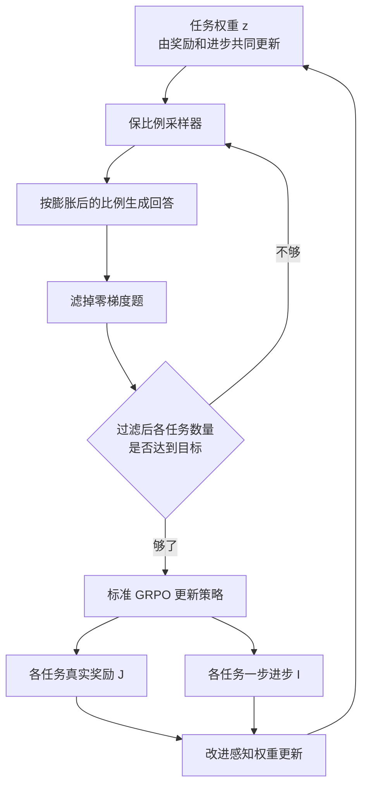

# 均匀混任务保不住最差那一项：MT-GRPO 按最差任务加权，再把滤完零梯度后的比例拧回去

<!-- release-date: 2026-02-05 -->

> 本文依据 **Multi-Task GRPO: Reliable LLM Reasoning Across Tasks**，即 arXiv:2602.05547v3、2026-08-05 修订、共 30 页的 ICML 2026 录用稿。封面写 *Proceedings of the 43rd International Conference on Machine Learning, Seoul, South Korea. PMLR 306, 2026*（PDF p. 1）。本地原件水印为 `arXiv:2602.05547v3 [cs.CL] 5 Aug 2026`。页码均指这份 30 页 PDF 本身。
>
> 八位作者里，通讯作者 Shyam Sundhar Ramesh 来自 UCL EEE 与 UCL Centre for AI；Xiaotong Ji、Matthieu Zimmer 来自 Huawei Noah’s Ark Lab；Haitham Bou Ammar 同时挂 UCL Centre for AI 与诺亚方舟；Sangwoong Yoon 来自 UNIST；Zhiyong Wang 来自爱丁堡大学；Aurelien Lucchi 与 Ilija Bogunovic 标 † 共同资深作者，分别来自巴塞尔大学、以及 UCL Centre for AI + 巴塞尔大学（PDF p. 1）。按工业实验室归属，本站把它放在 Huawei 目录下；高校合作写在正文里，不另建目录。
>
> 这是一篇**算法论文**，不是基模 Technical Report。它没有发布新的模型架构，也没有预训练配方。它讲的是：把 **组相对策略优化（Group Relative Policy Optimization，GRPO）** 直接拿去多任务后训练时，为什么平均分好看、最差任务掉队，以及怎样用动态任务权重和保比例采样把这件事拧回来。
>
> **这篇是 Multi-Task GRPO，不是 multi-turn GRPO。** 它处理的是同一模型上的多个可验证推理任务，不是多轮对话或智能体轨迹。本站另有一篇多轮多任务的系统论文 [AgentRL](/reports/Tsinghua/AgentRL)，那边对齐的是各任务优势的尺度；本篇对齐的是过滤后真正进梯度的样本比例，并且显式优化最差任务。两篇不要焊在一起读。
>
> 全文把三件事分开写：**论文明确写了什么**（带页码）、**本文如何解释它**（凡属推算、换算或从图上读数都会写明）、**外部资料补充**（会给出链接并标注）。截至 2026-09-10 核验，arXiv 最新版本是 v3，与本地原件一致。

## 读之前需要的最少背景

这篇论文默认你已经见过「用可验证奖励训语言模型」。不熟的话，先记住下面几件事。

**强化学习后训练（RL post-training）** 是在预训练和监督微调之后，让模型自己生成回答、用奖励更新参数。本篇走的是 **可验证奖励强化学习（Reinforcement Learning with Verifiable Rewards，RLVR）**：对错由程序判定，不另训一个奖励模型。本站 [DeepSeek-R1](/reports/DeepSeek/DeepSeek-R1) 是这条路上的基模例子。

更新算法是 **GRPO**。对同一道题采一组回答，用组内相对高低当优势，不再单独训价值网络。出处见 [DeepSeekMath](/reports/DeepSeek/DeepSeekMath)。你只需要记住五个动作：

1. 对同一道题采样一组回答；
2. 用规则给每个回答打分；
3. 用组内均值和标准差把分数变成优势（advantage）；
4. 用新旧策略的概率比乘优势，并做裁剪；
5. 把结果聚合成损失，更新模型。

本篇还反复用到 **DAPO** 的两项工程默认：把全对、全错的题从 batch 里滤掉（它们的组内优势恒为零，梯度也是零），以及把裁剪上界单独抬高。这两项的来龙去脉见本站 [DAPO](/reports/ByteDance/DAPO)。**DAPO 解决的是单任务里「零梯度题浪费算力」；本篇要证明，同一条过滤规则一旦进了多任务，会把有效梯度偷偷送给零梯度更少的任务。**

还要分清三个词：

- **任务权重 $z$**：下一步从每个任务里抽多少题。均匀就是每个任务 $1/K$。
- **零优势题 / 零梯度题**：一组回答的奖励全相同，组内标准差为零或优势全为零，这道题对参数更新没有贡献。
- **最差任务准确率（worst-task accuracy）**：所有任务准确率里的最小值。本篇把它当成「可靠」的主指标，平均分只作对照。

实验里的任务不是智能体环境。Countdown 是用几个数算出目标值；Zebra 是按文本约束给实体填属性；ARC 是从几个输入输出例子里归纳变换规则。它们都是单次作答、程序可判的推理题（PDF p. 6）。

## 一句话先说清

现成的多任务做法，是把几个任务的题均匀混进同一个 GRPO batch，去最大化平均奖励。

这条路有两个互相咬合的漏洞。第一，平均奖励允许「Countdown 涨很多、ARC 几乎不动」这种解，因为均值看不出来。第二，即便你故意给弱任务加权重，GRPO 还会再滤掉一组奖励全相同的题；各任务被滤掉的比例差很大，过滤后真正进梯度的样本比例，不再等于你写在权重里的那个数。

更麻烦的是：GRPO 的损失本身不能当任务成绩单。一组全错和一组全对，这项损失都可以接近零。拿它去调权重，弱任务和已经学满的任务会看起来一样（PDF p. 2、4）。

MT-GRPO 的回答是两层：

> **权重不再盯 GRPO 损失，改盯真实任务奖励和这一步有没有进步；采样不再按权重抽完就算，而要在滤掉零梯度题之后，把各任务的有效样本数拧回目标比例。**

论文在 3 任务和 9 任务设定上报告：最差任务准确率相对标准 GRPO 绝对提升 16–28 个百分点，相对 DAPO 绝对提升 6 个百分点；3 任务设定里，到达 50% 最差任务准确率所需的训练步数少 50%（PDF p. 1）。这些数字后面会拆开分母，先不要把它们读成「任意多任务、任意模型都涨这么多」。

## 全景：一次 MT-GRPO 步在干什么

先把一步训练画出来。上半是「抽谁」，下半是「更新谁」。

这是根据 PDF p. 2 的 Figure 1、p. 5 的 Algorithm 1 / Subroutine 1、p. 28 的 Algorithm 2 重画的**机制示意图**，不是实测时间轴。箭头表示控制与数据方向。

论文把它拆成四块贡献（PDF p. 2）：

| 缺口 | MT-GRPO 的设计 | 它接在哪 |
|---|---|---|
| 平均奖励不保证任务间平衡 | 带任务差距约束的目标，用 $\lambda$ 在最差任务和平均分之间调节 | 目标 |
| GRPO 损失分不清「全错」和「全对」 | 权重更新与 GRPO 损失脱钩，改用真实奖励 $J_k$ | 权重 |
| 只看当前奖励会塌成独热、忽略正在变好的任务 | 改进感知权重更新：进步 $I_k$ 加 $\lambda$ 倍奖励 | 权重 |
| 零梯度率不同，过滤后比例对不上权重 | 保比例采样：过滤后再补，并按历史过滤率提前超采 | 采样 |

实现上，实验跑在 **verl** 上，也就是本站 [HybridFlow](/reports/ByteDance/HybridFlow) 那套框架（PDF p. 27）。**HybridFlow 解决的是「四个模型之间谁下命令」；本篇解决的是「进了这口锅之后，多个推理任务的梯度份额怎么分配」。** 两边的时间轴不同，今天仓库里的代码也不在本篇范围内。

## 旧方法卡在哪

### 第一层：最大化平均奖励，等于允许最差任务被牺牲

标准多任务目标是 $K$ 个任务 KL 正则期望奖励的算术平均（PDF p. 2，式 2）。均值有一个结构性许可：某个任务暴涨，可以补偿另一个任务停滞。论文把它写成「缺乏任务级鲁棒性」，并指出这和通用推理的目标不对齐——一个竞赛数学很强、基本逻辑推理很弱的模型，平均分可以很好看，部署时并不可靠（PDF p. 1、3）。

Figure 1 把这件事画得很直白（PDF p. 2）。均匀权重下，三个任务各占 33.3%。经过标准采样和零梯度过滤之后，有效梯度是歪的：Countdown 准确率到 82%，Zebra 46%，ARC 只有 30.3%。**最差的那一项，正好是过滤后最吃亏的那一项。**

这不是「多任务一定会负迁移」的抽象警告。它是一个很具体的优化几何：平均目标的水平集允许沿着「牺牲最差任务」的方向走。

### 第二层：零梯度率不同，权重写了也不算

GRPO 用组内归一化构造优势。一道题的一组回答如果奖励全相同，优势为零，这道题对 $\theta$ 没有贡献（PDF p. 3）。DAPO 在单任务里的修法是：滤掉这些题，再重采，直到 batch 里留下「有对有错」的题。

多任务里，同一条规则会变成另一件事。各任务被滤掉的比例差很远。Figure 3 显示，训练过程中 ARC 的零梯度比例明显高于 Zebra，Countdown 夹在中间（PDF p. 6）。于是：

- 两个任务即使被写成相同的 $z_k$，零梯度更少的那个会贡献更多有效梯度；
- 你若特意给弱任务加权重，过滤后的实际份额仍可能对不上。

论文原话是：过滤后的 batch 会偏向零梯度更少的任务，而这「甚至可能伤害整体平均表现」；当弱任务被显式加权重时，实现出来的梯度贡献会大幅偏离预定比例，让它们继续欠优化（PDF p. 3）。

**本文的解释：** DAPO 的动态采样在单任务里是在修「这道题有没有信号」；进了多任务，它同时在改「哪个任务还留在桌上」。后一项不是它的设计目标，却会成为新的偏差源。

### 第三层：GRPO 损失不能当任务成绩单

分布鲁棒优化和多任务学习里，常见做法是谁损失大就给谁加权重（PDF p. 4）。前提是：损失能代表这个组现在有多差。

GRPO 的目标基于概率加权的优势。一组全错和一组全对，优势都是零，这项损失都可以是零（PDF p. 4）。对更新 $\theta$ 来说，这可以接受——没有区分度就不要更新。对比较任务来说，这是致命的：**完全失败的任务，和已经学满的任务，在 $J_{\mathrm{GRPO}}$ 上看起来可以无法区分。** 论文说，据他们所知，这个问题先前没有被讨论过，因为它是现代 LLM 后训练里 GRPO 式目标特有的结构（PDF p. 4）。

所以，不能把「鲁棒优化里用损失调权重」原样搬过来。权重信号必须和 GRPO 损失脱钩。

## 核心设计一：目标从平均改成「平均，但任务不能差太远」

### 旧问题

只最大化 $J_{\mathrm{avg}}$，没有任务间差距的约束（PDF p. 3）。

### 新设计

论文把两个愿望写成带约束的优化（PDF p. 3，式 4）：平均奖励尽量高，且任意两个任务的奖励差不超过 $\varepsilon$。$\varepsilon=0$ 是最强的任务级鲁棒，强制各任务表现相等；$\varepsilon$ 变大，约束逐渐松成普通平均。

为了好优化，它改写成对任务分布 $z$ 的 minimax 代理（PDF p. 4，式 5）：

$$
\max_{\theta}\min_{z\in\Delta_K}\sum_{k=1}^{K} z_k J_k(\theta)+\varepsilon\,\Omega(z)
$$

$z$ 是任务上的一个概率向量。正则项 $\Omega(z)$ 惩罚 $z$ 偏离均匀。附录 C.1 把它推成与均匀权重的 $\ell_1$ 距离（PDF p. 17–18，式 28）。直观上：$\varepsilon=0$ 时，内层最小化会把全部质量放到当前最差的任务上；$\varepsilon$ 变大，内层不敢把 $z$ 拉得太偏。

### 工作机制

交替更新：用当前 $z$ 做加权 GRPO 来更新 $\theta$，再用当前各任务奖励来更新 $z$ 的 logits（PDF p. 4，式 6–7）。$z=\mathrm{Softmax}(\xi)$，在 $\xi$ 上做无约束梯度下降，更新后自动落回概率单纯形。

低于当前加权平均的任务，对应梯度为负，logits 被抬高，下一步抽得更多。这就是「按最差任务加权」的原型。

### 收益与代价

原型是对的，动力学是坏的。$\varepsilon=0$ 时，内层对固定 $\theta$ 的最优 $z$ 是独热：全部质量给最低奖励的任务。Softmax 的指数映射会把这个趋势放大。Figure 2 显示，当前最差任务的权重迅速冲到接近 1，Countdown 在大部分时间里权重接近 0（PDF p. 4）。非最差任务被系统性欠优化。论文把这种严格最差任务 GRPO 当作反面教材，而不是最终算法。

**可迁移启发：** 把「不要丢掉最差任务」写进目标，比事后看平均分更老实。但严格 minimax 在任务轮换时会振荡。真正能用的，是带松弛的版本，而不是独热追逐。

## 核心设计二：改进感知权重更新，避免独热塌缩

### 旧问题

只看当前奖励 $J_k$，分不清「现在差但正在变好」和「现在差而且已经停滞」（PDF p. 5）。低奖励但进步很快的任务，不必一直加权重；奖励差不多、却不再从更新里获益的任务，才更该加。

附录 F 还试过另一条路：给 logits 加 $\ell_2$ 收缩，减轻独热（PDF p. 29，Subroutine 2）。收缩能挡住塌缩，但信号仍只有绝对奖励。加大收缩，权重被推向均匀，等于退回平均奖励最大化，弱任务重新被稀释。

### 新设计

**改进感知权重更新（Improvement-aware Weight Update，IWU）**。每一步先做完策略更新，再量每个任务的 GRPO 目标变了多少（PDF p. 5，式 8）：

$$
I_k^{(t)}:=J_{\mathrm{GRPO},k}(\theta_{t+1})-J_{\mathrm{GRPO},k}(\theta_t)
$$

权重 logits 的信号改成

$$
s_k^{(t)}=I_k^{(t)}+\lambda J_k(\theta_t)
$$

大 $\lambda$ 接近严格最差任务最大化，小 $\lambda$ 更强调各任务都要有进步（PDF p. 5）。论文说 $\lambda$ 的角色类似于式 5 里的 $\varepsilon$，都是鲁棒与平均之间的旋钮。**方向不要反着记：** 式 5 里 $\varepsilon$ 越大越接近平均；IWU 里 $\lambda$ 越大越盯最差任务。类比的是「有一个可调的折中」，不是同一个单调方向。

### 工作机制

Subroutine 1 很短（PDF p. 5）。先 $z=\mathrm{Softmax}(\xi)$，再算

$$
(g_t)_k=z_{k,t}\,s_k^{(t)}-\sum_{j}z_{j,t}\,s_j^{(t)}
$$

然后 $\xi\leftarrow\xi-\beta g$。低于当前加权平均信号的任务被加权重。附录 C.3 把这条更新从一步 minimax 的一阶泰勒展开推出来：最优策略更新方向是 $z$ 加权的任务梯度，回代之后，$z$ 的梯度正好是「进步 + $\lambda$ 倍奖励」（PDF p. 19–21）。实践上他们不做每步的完整 minimax，只沿这个代理信号走一步。

实现细节在附录 E：改进量被裁到 $\{0.1,0.2\}$ 以保稳定；权重更新本身用 AdamW，学习率 0.025（PDF p. 28）。**裁到离散两点，而不是一个连续区间。** 论文没有解释为什么是这两个值，也没有消融别的裁剪集合。

还有一个必须分开的层次：权重更新用的 $J_k$ 是真实任务奖励，进步 $I_k$ 却是用 $J_{\mathrm{GRPO},k}$ 的差分来近似（PDF p. 5）。理论部分把 $I_k$ 写成策略更新方向与任务梯度的内积（PDF p. 19，式 32）。**论文没有证明这个 GRPO 差分在「全对 / 全错」时仍然可靠**——那正是他们拒绝用 $J_{\mathrm{GRPO}}$ 当绝对成绩单的原因。IWU 等于：绝对水平用真实奖励，相对变化用 GRPO 差分来省掉任务梯度内积。这是设计选择，不是已经量过的误差界。

### 收益

IWU 要同时做两件事：别塌成独热，也别退回均匀。后文消融显示，只上 IWU、不上保比例采样，最差任务确实比均匀 GRPO 好，但平均分会掉，而且 ARC 的名义权重和实际 batch 比例仍然对不上（PDF p. 22–23）。所以它不是完整答案。

### 代价与边界

$\lambda$ 是必须扫的超参。3 任务用 0.2 / 0.25，9 任务用 0.1 / 0.3 / 0.9 / 1.2，7B 异构混合再用另一组（PDF p. 7–9、27–28）。没有「默认 $\lambda$」。任务集合一变，折中点会跟着变。

**可迁移启发：** 多任务加权至少要有两个信号：现在有多差，以及这一步有没有动。只有前者，优化器会围着当前最差任务打转；把前者正则到均匀，又等于放弃加权。两者加权求和是最便宜的实现，不一定是唯一实现。

## 核心设计三：保比例采样，让权重变成真的梯度份额

### 旧问题

按 $z$ 去抽题，只能控制「生成前」的比例。GRPO 还要滤零梯度。Figure 3 已经说明各任务过滤率不同（PDF p. 6）。于是 $z$ 是意图，过滤后的 batch 才是事实。

### 新设计

**保比例采样器（Ratio-Preserving Sampler，RP sampler）**，算法全文在附录 Algorithm 2（PDF p. 28）。它分三步：

1. 按当前 $z$ 用多项式分布抽出目标人数 $(n_1,\ldots,n_K)$，这是过滤后想要的有效样本数，不是生成前的名额。
2. 用各任务历史过滤率 $\rho_k$ 把生成分布膨胀：过滤率高的任务提前多采。膨胀因子封顶为 $M_{\mathrm{acc}}$（实验里是 5）：
   $$
   m_k=\min\Bigl\{\tfrac{1}{1-\rho_k},\,M_{\mathrm{acc}}\Bigr\},\qquad
   \hat z_k=\frac{z_k m_k}{\sum_j z_j m_j}
   $$
3. 生成、过滤，数一数各任务还缺多少；缺的任务按「缺口 × 膨胀」再采，直到凑齐或用尽重采预算 $N_{\mathrm{rs}}$。最后每个任务最多保留 $n_k$ 条，多出来的再随机补到 batch 大小 $B$。

论文把第 2 步叫 **接受感知采样（Acceptance-Aware Sampling，AAS）**。没有它，高过滤率任务会逼你一轮轮重采；有了它，第一轮就更可能凑齐（PDF p. 6、25）。

### 工作机制

可以把它想成「配额制招生」。$z$ 是各专业的录取名额。有的专业报名的人大量不合格（零梯度），如果只看报名比例，合格名单会严重偏科。RP 采样器先按不合格率多发一些准考证，再在合格名单上按名额截取。AAS 就是那个「多发准考证」的倍率，有上限，避免某个任务把生成预算吃光。

实验超参：超采因子 $M_{\mathrm{os}}=3$；3 任务最多重采 10 轮，9 任务 2 轮（PDF p. 28）。9 任务把重采预算砍掉，是算力约束，不是算法更聪明。

正文第 5 节有一处笔误：写「任务权重来自 Subroutine 2」（PDF p. 6）。主算法用的是 Subroutine 1（IWU）；Subroutine 2 是附录里那个只用奖励、加收缩的对照。本文按 Algorithm 1 理解，不把这句当成第二种主方法。

### 收益

Figure 6 下排把 ARC 的名义权重和过滤后 batch 比例并排放（PDF p. 8）。基线里 ARC 常常低于它的权重；MT-GRPO 两条曲线更齐，ARC 准确率也更高。Figure 13 是对照：固定均匀权重、只开 RP 采样器时，三个任务的过滤后比例都在 $1/3$ 附近晃，尽管零梯度率不同（PDF p. 24）。

更硬的因果在 Figure 16：把保比例约束拿掉，IWU 会把 ARC 的平均权重从 0.43 抬到 0.63 来「补偿」过滤损失，但实现出来的 batch 比例反而从 0.43 降到 0.36，ARC 准确率从 64.8% 降到 62.4%（PDF p. 25）。**加权重补偿不了过滤偏差。必须在过滤之后强制比例。**

### 代价

RP 采样器要多生成。相对同样做超采和过滤的 DAPO，3 任务设定里每步墙钟时间平均 727 秒对 659 秒，慢 10.2%，多出来的大约 67 秒主要来自额外重采；DAPO 往往一轮生成就够，MT-GRPO 随着过滤率上升会走到约 2–2.25 轮（PDF p. 26，Figure 18）。论文强调：尽管每步更贵，到达同一最差任务阈值的总时间更短。后文墙钟表会给出小时数。

**可迁移启发：** 任何「先加权、再过滤」的流水线，权重都可能在过滤口被改写。修法不是把权重再加大，而是把配额定义在过滤之后。接受率预测（这里的 $\rho_k$）是为了少重采，不是为了正确性；正确性来自过滤后的截取。

## 实验怎么证明

三条主实验，外加消融、顺序训练和墙钟。基座主要是 Qwen2.5-3B；第 3 条扩到 Qwen2.5-7B 和 OLMo-3 7B（PDF p. 6–9、22）。训练框架是 verl，两张 NVIDIA H200（141 GB），主设定 720 步（PDF p. 27）。奖励沿用 SEC 论文的协议：答对 1.0，格式对但答错 0.1，否则 0（PDF p. 27）。KL 系数设为 0；MT-GRPO 和 DAPO 都用 DAPO 的 clip-higher，上界 0.28（PDF p. 27）。

数据集来自 Chen 等人的 Self-Evolving Curriculum 工作，用 ReasoningGym 生成（PDF p. 6、27）。这里有一处原文对不上：第 6 节写每个难度「1 万条训练、200 条评测」（PDF p. 6）；附录 E 写每个变体「1000 条训练、200 条测试」（PDF p. 27）。本文两处都照录，不替它选一个。复现应以附录和开源脚本为准，但那已经超出本篇 PDF。

主指标是最差任务准确率。平均准确率和「相对 DAPO 的平均逐任务相对变化」是折中是否伤到整体的对照（PDF p. 7）。相对变化把各任务的涨幅除以该任务在 DAPO 上的准确率再平均，所以对弱任务更敏感。

四个基线（PDF p. 6–7）：

| 方法 | 采样 | 其他 |
|---|---|---|
| GRPO | 任务均匀 | 标准 GRPO |
| SEC-GRPO | 按绝对优势更大的任务加权重 | Self-evolving curriculum |
| DAPO | 任务均匀 | clip-higher + 动态采样 |
| SEC-DAPO | SEC 加权 + DAPO 的裁剪与动态采样 | 两者叠加 |

### 实验 1：三个中等难度任务

Qwen2.5-3B，Countdown / Zebra / ARC 的 medium 档（PDF p. 7）。每题 72 条 rollout，全局 batch 32（PDF p. 27）。过滤策略更严：一组全对或一组没有答对的，都丢掉（PDF p. 27）。

Figure 4 的柱上数字如下（PDF p. 7）。最差任务那一列，柱顶还标了是哪个任务在拖后腿。

| 方法 | 最差任务准确率 | 拖后腿的任务 | 平均准确率 | 相对 DAPO 的平均相对变化 |
|---|---:|---|---:|---:|
| SEC-GRPO | 24.6% | ARC | 51.0% | $-24.6$ |
| GRPO | 30.3% | ARC | 52.0% | $-22.3$ |
| SEC-DAPO | 45.8% | ARC | 61.8% | $-5.5$ |
| DAPO | 52.6% | Zebra | 65.2% | $0.0$ |
| MT-GRPO $\lambda=0.2$ | 57.5% | Zebra | 67.2% | $+5.8$ |
| MT-GRPO $\lambda=0.25$ | 58.8% | Zebra | 66.9% | $+5.1$ |

相对均匀 GRPO：58.8% − 30.3% = 28.5 个百分点，对应摘要里 16–28% 区间的上端。相对 DAPO：58.8% − 52.6% = 6.2 个百分点，对应摘要的 6%（PDF p. 1、7）。平均分没有为最差任务让路，反而略高于 DAPO。

$\lambda=0.25$ 最差任务更高，$\lambda=0.2$ 平均分更高，和 IWU 的设计一致（PDF p. 7）。

权重动力学是这条因果链的直接证据。Figure 6：训练大约 50 步后，Countdown 反超 Zebra；MT-GRPO 随即把权重从 Countdown 挪向 Zebra，并压低已经很高的 Countdown。DAPO 和 SEC-DAPO 在 Countdown 已经很高之后仍继续偏向它（PDF p. 7–8）。**基线不是不会学，是把算力留在已经会的任务上。**

SEC-GRPO 的最差任务（24.6%）比均匀 GRPO（30.3%）更差。按「绝对优势大」来排课，会把信号强、好学的任务排在前面，弱任务更没机会。这和 MT-GRPO 的加权方向相反。

Figure 5 报告到达 30% / 40% / 50% 最差任务准确率所需步数。论文在摘要和图注里写：到达 50% 所需步数少 50%；画斜线的柱表示在训练预算内没达到该阈值（PDF p. 1、7）。图上没有标出每根柱的精确步数，本文不从图上估读。能确定的是：若干基线在预算内根本到不了 40% 或 50%，MT-GRPO 两档 $\lambda$ 都到了。

### 实验 2：九个任务，三个难度一起训

同一 3B 基座，Countdown / Zebra / ARC 各 easy、medium、hard 共九个任务（PDF p. 7）。rollout 降到每题 8 条，全局 batch 提到 256；过滤改松，只要一组奖励不是常数就可以留下，例如格式分不同也算有信号（PDF p. 27）。这些改动是算力约束，读数字时不要和实验 1 直接横比绝对准确率。

Figure 7 顶部（PDF p. 8）：

| 方法 | 最差任务 | 拖后腿 | 平均 |
|---|---:|---|---:|
| GRPO | 30.4% | ARC hard | 56.0% |
| SEC-GRPO | 34.3% | ARC hard | 59.2% |
| DAPO | 40.5% | Zebra hard | 66.7% |
| SEC-DAPO | 40.9% | Zebra hard | 66.0% |
| MT-GRPO $\lambda=0.1$ | 40.4% | Zebra hard | 69.5% |
| MT-GRPO $\lambda=0.3$ | 42.1% | Zebra hard | 68.7% |
| MT-GRPO $\lambda=0.9$ | 44.3% | Zebra hard | 63.9% |
| MT-GRPO $\lambda=1.2$ | 46.3% | Zebra hard | 61.7% |

正文写：$\lambda=1.2$ 时，最差任务相对 GRPO 高 16 个百分点、相对 DAPO 高 6 个百分点（PDF p. 7）。验算：46.3 − 30.4 = 15.9，46.3 − 40.5 = 5.8，与摘要 16–28% 和 6% 的下端对应。**16–28% 不是同一次实验的置信区间，是 9 任务约 16%、3 任务约 28% 这两端。**

$\lambda$ 的折中在这里比实验 1 更刺眼：$\lambda=0.1$ 平均分最高（69.5%），最差任务几乎只打平 DAPO；$\lambda=1.2$ 最差任务最高，平均分掉到 61.7%，低于 DAPO 的 66.7%。论文没有假装「最差任务和平均可以同时任意好」。小 $\lambda$ 把力气分给进步慢的难任务，容易任务的相对变化是负的；大 $\lambda$ 把力气集中到当前最差的 Zebra-hard（PDF p. 8）。

顺序训练是自然对照：按任务族一个一个训，每族 240 步，两种顺序（Countdown→Zebra→ARC 与 Zebra→ARC→Countdown），GRPO 和 DAPO 都试。联合训练的 MT-GRPO（$\lambda=1.2$）最差任务 46.3%，超过顺序训练最强变体的 41.1%（PDF p. 8）。Figure 15 显示换族之后，前一族的 hard 档准确率会掉，掉多少取决于顺序（PDF p. 25）。论文的判断是：顺序训练对顺序敏感、会忘前面的族，部署上并不更省事；MT-GRPO 联合训、与顺序无关（PDF p. 24）。

**这证明的是「在这九个变体上，联合加加权优于先专后专」。** 它没有证明任意任务图谱都该联合训，也没有给出遗忘的定量公式。

### 实验 3：7B 与更不像的任务混合

两条。

**Qwen2.5-7B，MATH + ARC + SciKnowEval（化学、物理），150 步**（PDF p. 9）。Figure 8：

| 方法 | 平均 | 最差任务 | 拖后腿 |
|---|---:|---:|---|
| SEC-GRPO | 52.6% | 8.9% | ARC |
| GRPO | 55.4% | 15.0% | ARC |
| SEC-DAPO | 56.1% | 8.8% | ARC |
| DAPO | 58.3% | 25.0% | ARC |
| MT-GRPO $\lambda=0.05$ | 56.2% | 33.1% | ARC |
| MT-GRPO $\lambda=0.2$ | 51.8% | 37.6% | ARC |

$\lambda=0.2$ 相对最强基线 DAPO，最差任务绝对高 12.6 个百分点；到达 DAPO 最终最差任务 25.0% 的时间是 5.5 小时对 13.3 小时，正文写约 60% 的墙钟削减（PDF p. 9）。平均分这边，$\lambda=0.2$ 的 51.8% 低于 DAPO 的 58.3%。**7B 异构混合上，最差任务的涨幅比 3B 可控设定更大，平均分的代价也更明显。** 不要把摘要里的 6% 套到这条实验上。

**OLMo-3-7B-Instruct，只在 SciKnowEval 四个科学域上训 150 步，$\lambda=0.5$**（PDF p. 22）。Figure 9 取的是各方法「最差任务最好的那一步」，不是最后一步，因为若干基线先升后降。MT-GRPO 最差任务 45.8%（Biology），平均 52.7%；基线最差任务在 30.8–39.0%。右图训练曲线：基线冲高后掉，MT-GRPO 没有这截回落。论文把它读成「训练全程更平衡」（PDF p. 22）。**「取各自最好一步」让基线看起来不那么差；即便如此，MT-GRPO 仍然更高，而且曲线不回落。** 若改成统一看最后一步，基线还会更差。论文没有同时给最后一步的表。

### 消融：两块都要，缺一不可

实验 1（Figure 10，PDF p. 23）：

| 变体 | 最差任务 | 平均 |
|---|---:|---:|
| GRPO | 30.3% | 52.0% |
| 只有 IWU（$\lambda=0.25$） | 41.9% | 43.9% |
| DAPO | 52.6% | 65.2% |
| 只有 RP 采样器（均匀权重） | 54.6% | 68.9% |
| IWU + RP，$\lambda=0.2$ | 57.5% | 67.2% |
| IWU + RP，$\lambda=0.25$ | 58.8% | 66.9% |

只加权：最差任务从 30.3% 拉到 41.9%，平均分从 52.0% 掉到 43.9%。Figure 12 解释了为什么加不彻底——IWU 给 ARC 的平均权重约 0.80，过滤后真实比例只有约 0.45（PDF p. 22–23）。只保比例、权重固定均匀：最差任务 54.6%、平均 68.9%，两项都超过 DAPO。完整方法在最差任务上再高一截，平均分略低于「只保比例」。

实验 2 的消融方向相同（Figure 11，PDF p. 23）：只有 IWU（$\lambda=1.2$）最差任务 35.7%、平均 50.3%；只有 RP 采样器最差任务 36.6%、平均 66.1%；完整方法 46.3% / 61.7%。九任务里，只保比例甚至到不了 DAPO 的最差任务（图上 DAPO 为 40.9%）。**任务一多，均匀加保比例不够，必须让权重跟着最差任务走。**

读 Figure 11 时注意：图上 DAPO 平均 68.7%、最差 40.9%，与主文 Figure 7 的 66.7% / 40.5% 不完全相同。论文没有解释这两张图是不是同一次运行。比较消融图内部的相对高低是合法的；把 68.7% 和主文 66.7% 当成同一个 DAPO 分数，不行。

附录 F 把 IWU 和「只用奖励 + 收缩」比（PDF p. 29–30）。弱收缩（$\eta=10^{-5}$）仍会塌成独热，Countdown 被忽略。强收缩（$\eta=10^{-2}$）在 3 任务上最差任务与 IWU 相近，平均分更高，但多出来的分主要来自最容易的 Countdown，ARC 不如 IWU。9 任务上，中等收缩最差任务好于基线、仍低于 IWU；再加大收缩，最差任务掉到 DAPO 以下。**收缩能防止塌缩，不能可靠地把算力分给欠优化的任务。**

### 墙钟：每步更贵，到达阈值更快

实验 1、两张 H200。Table 1 把所有方法放到 GRPO 跑完 720 步所需的 80 小时预算上比（PDF p. 26）：

| 方法 | 80 小时平均 | 80 小时最差任务 | 到 40% | 到 50% |
|---|---:|---:|---:|---:|
| GRPO | 53.7% | 34.5% | 未到 | 未到 |
| DAPO | 59.4% | 43.2% | 49.2 h | 98.0 h |
| MT-GRPO $\lambda=0.2$ | 60.6% | 53.6% | 17.6 h | 38.6 h |

80 小时点上，最差任务比 DAPO 高约 10 个百分点。到 50% 最差任务：38.6 小时对 DAPO 的 98.0 小时。GRPO 在该预算内到不了 40%。Figure 19 把准确率画成墙钟小时的函数，结论与按步数的 Figure 5 同向（PDF p. 27）。

所以「50% fewer steps」和「墙钟更短」是两条相关但不同的陈述。前者是摘要对 3 任务步数的概括；后者是附录按小时算的表。每步贵 10.2%，总时间仍然更短，因为弱任务更早被喂到有效梯度。

## 限制、笔误和没写的东西

论文自己划了两条（PDF p. 9）：

1. 鲁棒性针对的是**训练任务混合内部**。混合之外的任务是否也被带起来，是未来工作。实验 3 的 MATH / SciKnowEval 仍在训练混合里，不是 OOD。
2. 流水线依赖可验证奖励，权重更新在这种奖励下才可靠。不可验证领域（偏好、开放式写作）没有表征。

下面这些是本文核对全文后认为**没有公开、或原文互相打架**的，不是论文当缺陷写出来的：

- 第 6 节 1 万条训练 vs 附录 E 1000 条（PDF p. 6、27）；
- 附录 E 写「全部实验用 Qwen-2.5-3B」（PDF p. 27），第 6.3 节和第 D.1 节明明有 7B；
- 正文把 RP 采样器的权重来源写成 Subroutine 2（PDF p. 6），主算法用的是 Subroutine 1；
- Figure 7 与 Figure 11 的 DAPO 数字不完全一致（PDF p. 8、23）；
- $I_k$ 用 $J_{\mathrm{GRPO}}$ 差分近似、再裁到 $\{0.1,0.2\}$，没有误差或替代方案的消融；
- 没有 3B / 7B 以外的规模、没有工具使用或多轮环境、没有不可验证奖励；
- 没有报告随机种子误差，柱上数字按单次运行理解更稳妥；
- 9 任务把每题 rollout 从 72 砍到 8、把重采预算从 10 砍到 2，这些算力裁剪对最差任务的影响没有单独消融。

Impact Statement 里有一句「专门用来增强 AI 推理，因此不预期任何不道德应用」（PDF p. 9–10）。这是作者立场，不是一条被论证的安全结论。

## 可迁移启发

### 1. 多任务 GRPO 的第一偏差，往往不在损失，在过滤

零优势题在单任务里是浪费；在多任务里是重新分配发言权。任何先加权、再按「这道题有没有信号」过滤的流水线，都该在过滤之后核对一次实际比例。不核对，权重只是生成前的愿望。

### 2. 不要用 GRPO 损失去比较任务

全对和全错都可以让组内优势消失。比较任务要用真实奖励，或至少用一个在两端行为不同的量。这条对所有「组内相对」目标都成立，不限于 GRPO：只要相对量在饱和时塌成零，它就不能当绝对成绩单。

### 3. 严格最差任务会振荡，改进信号是更便宜的阻尼

独热追逐当前最差，会把已经会的任务饿死，等它们变差再抢回来。加改进量，等于问「谁不但差，而且这一步没动」。收缩权重向均匀也能止振，但会把加权目标本身稀释掉。若只能改一处，优先加改进信号，而不是把正则开到均匀。

### 4. $\lambda$ 是产品决策，不是该藏起来的超参

小 $\lambda$ 保平均、照顾进步慢的难任务；大 $\lambda$ 保最差、平均分可能让路。实验 2 把这条折中画得很清楚。上线前应先决定「不允许掉到多少」，再扫 $\lambda$，而不是先追平均再事后补最差任务。

### 5. 顺序专精会忘，联合加加权更省事——在任务相近时

Countdown / Zebra / ARC 仍同属可验证推理。顺序训练既对顺序敏感，又会忘前一族。若任务族的接口和奖励尺度已经统一，联合训练加最差任务加权，比维护一套课程顺序更不容易踩坑。任务接口都对不齐时，应先看 AgentRL 那种环境层统一，而不是先搬本篇的采样器。

### 6. 每步开销要用到达阈值的时间来摊

RP 采样器每步贵约一成。用「到 50% 最差任务」当预算，它仍然便宜。评估加权或重采方法时，不要只报 step time，也不要只报最终分；把「到某个最差任务阈值的墙钟」算进去。

### 7. 和 AgentRL、DAPO 不在同一层，不要混用数字

- DAPO 修单任务零梯度浪费和裁剪默认；本篇在多任务里把它的过滤变成必须被配额约束的对象。
- AgentRL 修多轮轨迹长短差和跨环境优势尺度；本篇没有多轮环境，也不做按任务的优势标准化。
- 本篇的 16–28% / 6% 是 3B 上 Countdown–Zebra–ARC 的最差任务绝对百分点；AgentRL 的 70.4% 是另一套 AgentBench-FC 口径。两边都不能当成「多任务 RL 的通用涨幅」。

## 关键词回看

- **多任务 GRPO（MT-GRPO）**：在 GRPO 上加改进感知任务加权和保比例采样，目标是最差任务别掉队。不是多轮 GRPO。
- **最差任务准确率**：各任务准确率的最小值。本篇的主指标。
- **零优势题 / 零梯度题**：一组回答奖励全相同，对 $\theta$ 没有贡献。多任务里，它们的出现率会改写有效梯度份额。
- **任务权重 $z$**：下一步各任务的目标比例。必须定义在过滤之后，才等于梯度份额。
- **IWU**：用进步 $I_k$ 加 $\lambda$ 倍真实奖励更新 $z$，避免独热追逐当前最差任务。
- **$\lambda$**：鲁棒与平均的旋钮。越大越盯最差任务。
- **RP 采样器**：先按 $z$ 定过滤后名额，再按历史过滤率超采、不足则重采。
- **AAS**：用 $1/(1-\rho_k)$ 膨胀生成分布，少打几轮重采。正确性靠过滤后截取，不靠膨胀本身。
- **SEC**：按绝对优势更大的任务加权重的课程方法。在本篇设定里，最差任务往往更差。
- **clip-higher**：DAPO 把裁剪上界单独抬高。本篇 MT-GRPO 与 DAPO 都用上界 0.28。

## 最后的判断

这篇论文的贡献不在新骨架，而在把一句听起来正确的话拆开：**「多任务 GRPO」并不等于「把几个任务的题均匀丢进 GRPO」。** 均匀只控制生成前的比例；GRPO 的零优势结构和过滤规则，会在生成后把发言权改写掉。平均目标又允许改写的结果表现为「平均分还行、最差任务不行」。

两块设计对准两个缺口，而且必须一起上：

- 没有与 GRPO 损失脱钩的权重更新，加权重会加错对象，严格最差任务还会振荡；
- 没有过滤后的配额，加对了权重也进不了梯度，IWU 会靠继续加权重来「补偿」，越补越偏。

实验上，最硬的结果有三组。第一，3 任务和 9 任务上，最差任务相对 GRPO、DAPO 的绝对涨幅对得上摘要的 16–28% 和 6%，平均分在 3 任务上没有崩。第二，消融说明两块缺一不可，且「加权重补偿过滤」被 Figure 16 直接打假。第三，墙钟表说明每步贵 10.2% 仍然更早到达 50% 最差任务。7B 和 OLMo 是「机制还能用」的外推，不是摘要数字的来源。

它的边界同样清楚。可验证奖励、训练混合内部、3B/7B、Countdown–Zebra–ARC 这一族推理题。数据集规模两处写法打架，DAPO 对照数字在主图和消融图上不完全一致，改进量的近似没有误差分析。这些不是小瑕疵清单，而是你若要复现或迁到新任务混合时必须自己补的测量。

如果只记一句话：

> **多任务 GRPO 里，任务权重写在采样前，梯度份额发生在过滤后；不把这两件事对齐，最差任务就不是被平均目标牺牲的，而是被零梯度题悄悄拿走的。**

## 资料与阅读边界

- **原始依据**：本地 `papers/Huawei/MT-GRPO.pdf`，**Multi-Task GRPO: Reliable LLM Reasoning Across Tasks**，arXiv:2602.05547v3，共 30 页（正文约至 p. 9，参考文献 p. 10–14，附录 A–F 为 p. 15–30）。PDF 水印为 `arXiv:2602.05547v3 [cs.CL] 5 Aug 2026`。本文所有页码指 PDF 页码。`pdfinfo` 报告 30 页，抽取文本末尾有一个空页，内容止于 p. 30。
- **版本核验**：[arXiv:2602.05547](https://arxiv.org/abs/2602.05547)。提交历史三版：v1 于 2026-02-05 11:06:37 UTC（443 KB），v2 于 2026-07-27 11:11:55 UTC（689 KB），v3 于 2026-08-05 16:57:37 UTC（681 KB）。Comments 栏写 Accepted at ICML 2026。**截至 2026-09-10 核验，最新版本是 v3，与本地原件一致。**
- **正式发表**：ICML 2026，首尔，PMLR 306（PDF p. 1）。本文没有逐页比对 PMLR 相机就绪版与 arXiv v3 的差异；本地这份已是会议页脚。
- **`release-date` 取 2026-02-05**。理由：MT-GRPO 是公开的算法与实验，不是对外提供的产品模型，按流程取该技术首次官方公开日。已核查渠道里最早的公开事件是 arXiv v1。ICML 海报页时间为 2026-07-08（外部：[ICML 2026 poster](https://icml.cc/virtual/2026/poster/60544)），晚于 arXiv v1，按流程不回写。v3 修订日 2026-08-05 同样不回写。
- **官方代码仓库**：论文附录 E 给出 [https://github.com/rsshyam/MT-GRPO](https://github.com/rsshyam/MT-GRPO)（PDF p. 27）。**本文没有阅读该仓库源码，也没有把仓库里的实现细节当作论文结论。** 源码现状归本站「开源解读」模块，与本篇时间轴不同。
- **外部补充清单**（均已在正文中标注，不与论文内容混用）：
  - arXiv 提交时间戳与 v1/v2/v3 历史：[arXiv abs](https://arxiv.org/abs/2602.05547)；
  - ICML 2026 海报条目，用于排除更早的会议公开日：[ICML poster 60544](https://icml.cc/virtual/2026/poster/60544)；
  - 仓库存在、README 写明在 verl 上改编、并提供实验 1/2 脚本：[rsshyam/MT-GRPO](https://github.com/rsshyam/MT-GRPO)。README 的安装方式和脚本名不是论文内容。
- **未公开 / 无法核实的缺口**：训练集究竟是每档 1000 还是 1 万；主图与消融图 DAPO 数字为何不完全一致；$I_k$ 近似误差；随机种子方差；9 任务削减 rollout 与重采预算的单独影响；训练混合之外的任务；不可验证奖励；大于 7B 的规模。
- **跨篇参考**：GRPO 出处见 [DeepSeekMath](/reports/DeepSeek/DeepSeekMath)；规则奖励与推理 RL 见 [DeepSeek-R1](/reports/DeepSeek/DeepSeek-R1)；零梯度过滤和 clip-higher 见 [DAPO](/reports/ByteDance/DAPO)；训练框架 verl 见 [HybridFlow](/reports/ByteDance/HybridFlow)；另一条多任务 RL（多轮智能体、按任务归一化优势）见 [AgentRL](/reports/Tsinghua/AgentRL)。这些工作本篇只作为引用或对照出现，细节以各篇为准。
