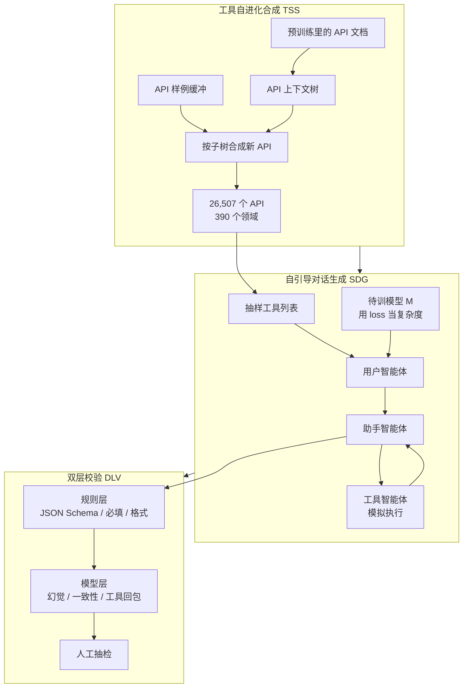
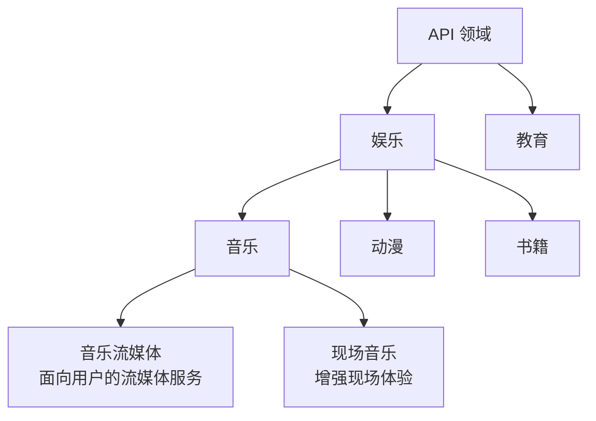

# 函数调用的泛化卡在工具太少太像：ToolACE 先自进化 26,507 个 API，再按学生自己的 loss 生成对话

<!-- release-date: 2024-09-02 -->

> 本文依据 **ToolACE: Winning the Points of LLM Function Calling**，即 arXiv:2409.00920v2、2025-07-25 提交、共 23 页的 ICLR 2025 camera-ready。封面写 *Published as a conference paper at ICLR 2025*。本地原件水印为 `arXiv:2409.00920v2 [cs.LG] 25 Jul 2025`。页码均指这份 23 页 PDF 本身。
>
> 三位共同一作（†）是上海交通大学的 Weiwen Liu、中国科学技术大学的 Xu Huang、华为诺亚方舟实验室的 Xingshan Zeng。通讯作者（*）是诺亚方舟的 Chuhan Wu、Yasheng Wang、Ruiming Tang，以及中科大的 Defu Lian。其余作者来自诺亚方舟、华为技术有限公司、清华大学、香港中文大学（PDF p. 1）。按主要归属方，本站把它放在 Huawei 目录下；高校合作写在正文里，不另建目录。
>
> 这是一篇**数据合成论文**，不是基模 Technical Report。它没有发布新的模型架构，也没有预训练配方。它讲的是：真实函数调用数据采不到、现有合成数据又窄又错，怎样用一条自动流水线同时补上 **准确（Accurate）、复杂（Complex）、多样（divErse）**——这正是 ToolACE 这个名字的来历。
>
> 全文把三件事分开写：**论文明确写了什么**（带页码）、**本文如何解释它**（凡属推算、换算或从图上读数都会写明）、**外部资料补充**（会给出链接并标注）。截至 2026-09-11 核验，arXiv 最新版本仍是 v2，与本地原件一致（MD5 相同，23 页、836,845 字节）。arXiv 摘要页 Comments 写的是「21 pages, 22 figures」、v2 文件大小 431 KB，与实际 PDF 不符；以这份 23 页文件为准。

## 读之前需要的最少背景

这篇论文默认你已经见过「让语言模型输出一段结构化的函数调用」。不熟的话，先记住下面几件事。

**函数调用（function calling）** 也叫工具使用（tool use）：模型不直接回答，而是写出「调用哪个函数、参数是什么」；外部系统真的去执行，再把返回值塞回对话。论文把 API、工具、函数、插件当作同一件事（PDF p. 1 脚注 1）。

真实场景里，一次调用很少是「一个函数、一组扁平参数、一轮就结束」。常见的四种形态贯穿全文：

- **单次调用（single）**：一个函数、一轮。
- **并行调用（parallel）**：同一轮里对同一个或同一类函数发多次、参数不同。
- **依赖调用（dependent）**：后一次调用要用前一次的返回值。
- **非工具对话（non-tool / multi-type）**：不该调工具时闭嘴，缺参数时先问，而不是硬编一个调用。

评测主战场是 **BFCL（Berkeley Function-Calling Leaderboard）**。它不看「这段话像不像人」，而看调用对不对。四个常用口径（PDF p. 14–15）：

- **AST（Abstract Syntax Tree，抽象语法树）**：把模型写出的调用解析成树，对照标准答案检查函数名、必填参数、类型和取值。
- **Exec（executable，可执行）**：真的跑这个调用，看返回值是否和标准答案一致。
- **Relevance / Irrelevance（相关 / 无关）**：该调的时候调了没有、不该调的时候有没有忍住。无关分 = 正确「不调用」的次数 ÷ 总样本。
- **Overall**：各子类准确率的**未加权平均**。所以多轮这一项哪怕样本结构不同，也会同等拉低总分。

论文还用 **API-Bank**：314 段对话、753 次 API 调用，分 Call（工具已知，直接调）、Retrieval+Call（工具未知，先检索再调）、Plan+Retrieval+Call（连续规划）三档（PDF p. 15）。主表只报了前两档。

训练对象叫 **ToolACE-8B**：在 LLaMA-3.1-8B-Instruct 上做 **LoRA（Low-Rank Adaptation，低秩适配）**，rank 16、alpha 32，不是全参数微调（PDF p. 6、15）。

## 一句话先说清

现成的工具学习数据有两条路，两条都走不通。

第一条是去采真实日志。函数调用一旦涉及第三方服务、内部系统和用户隐私，日志几乎拿不到，标注更贵。第二条是用公开 API 让大模型编对话。Gorilla、ToolAlpaca、ToolLLM、xLAM 都是这条路。问题是公开 API 本身就少、领域窄、参数结构简单，编出来的对话也就跟着窄；数据一复杂，编错的比例还会上去（PDF p. 1–2）。

ToolACE 的回答是把「工具」和「对话」拆开做，再加一层校验：

> **先不要在现成 API 上编对话。先从预训练语料里长出一棵覆盖 390 个领域、26,507 个接口的 API 树；再用三个智能体演戏，并且让即将被微调的那个模型用自己的 loss 当复杂度计分器；最后用规则加模型双层过滤。**

论文声称这样训出的 8B 模型在 BFCL-v3 上「达到 SOTA、可与最新 GPT-4 媲美」（PDF p. 1）。后面会把这张榜拆开：它在 2024-09-20 快照上总分排第 3，距 GPT-4-turbo 0.27 分；非直播可执行调用确实是表里最高，**多轮只有 14.37，几乎是短板**（PDF p. 7）。

## 全景：三个模块各补一处缺口

先把流水线画出来。左中右三块对应论文的三项贡献。

这是根据 PDF p. 3 的 Figure 1 重画的**机制示意图**，不是实测时间轴。箭头表示数据与控制方向。

三项工作的分工可以压成一张表（PDF p. 2）：

| 缺口 | 模块 | 它实际在干什么 |
|---|---|---|
| 公开 API 太少、领域太窄、几乎没有嵌套参数 | **TSS（Tool Self-Evolution Synthesis，工具自进化合成）** | 从预训练文档抽领域树，再按「物种形成—适应—进化」合成新 API |
| 数据对这个模型要么太简单、要么太难 | **SDG（Self-Guided Dialog Generation，自引导对话生成）** | 用户 / 助手 / 工具三个智能体演戏；待训模型用 loss 把对话调到「稍难一点」 |
| 合成一复杂就编错 | **DLV（Dual-Layer Verification，双层校验）** | 规则检查格式和可执行性，模型检查幻觉和语义，人再盯一层 |

论文自称这是**第一份**把「合成多样化 API」本身当成函数调用泛化手段的工作（PDF p. 2）。这个「第一」是作者的定位，不是本文能独立核实的历史判断。

## 第一层矛盾：公开 API 上编对话，模型出了这几个工具就不会了

### 真实世界要的，和现有数据给的，对不上

函数调用在真实应用里有三个麻烦（PDF p. 1）：

1. **API 更新很快**，模型必须零样本认没见过的接口；
2. **用户需求含糊**，经常要并行、依赖或多轮；
3. **一次调用必须精确**：函数名、必填项、类型、取值，错一个就不能跑。

现有工具增强模型主要在简单、单轮、扁平参数上做文章，而且几乎都绑在公开 API 上（PDF p. 1–2）。论文用 Table 1 把家底摊开（PDF p. 2）：

| 模型 | API 数 | 领域数 | 嵌套参数 | 并行 | 依赖 | 多类型（含不该调） |
|---|---:|---:|:---:|:---:|:---:|:---:|
| Gorilla | 1,645 | 3 | 否 | 否 | 否 | 否 |
| ToolAlpaca | 3,938 | 50 | 否 | 否 | 否 | 否 |
| ToolLLM | 16,464 | 49 | 否 | 否 | 是 | 否 |
| Functionary | n/a | n/a | 否 | 是 | 否 | 否 |
| xLAM | 3,673 | 21 | 否 | 是 | 否 | 否 |
| Granite | n/a | n/a | 否 | 是 | 否 | 是 |
| **ToolACE** | **26,507** | **390** | **是** | **是** | **是** | **是** |

读这张表时有两点要自己补上（本文的判断，不是论文原话）：

- 「API 数」和「领域数」是覆盖面，不是数据质量。ToolLLM 已经有 16,464 个真实世界 API，但没有嵌套、没有并行、没有「不该调」的样本。
- Functionary 和 Granite 的 API 数是 n/a，所以「最广」这个冠军只在「报了数的几家」里成立。

数据一多样、一复杂，用现有那种简单流水线编准确样本会显著变难（PDF p. 2）。这就是后面为什么必须上双层校验——不是锦上添花，是复杂度抬上去之后的配套工程。

## 核心设计一：工具自进化合成（TSS）——先把工具池长出来

### 旧问题：对话再多，工具还是那几个

多数工作的合成对象是**对话**：给定一份公开 API 文档，让大模型扮演用户和助手。API 文档本身不动。于是模型见到的「工具世界」上限就是那份公开清单。零样本泛化要的恰恰是「没见过的接口长什么样」，这个上限会直接变成天花板。

### 新设计：物种形成、适应、进化

TSS 不从零幻想 API，也不只爬公开文档。它分三步（PDF p. 3）。

**物种形成（Speciation）。** 预训练语料是人类文本里覆盖面最广的来源之一。论文从中抽出 API 相关的原始文档——技术手册、API 文档、产品说明、用户指南、教程——让一个前沿大模型驱动的智能体，从每篇文档里抽出一个 API 领域，以及所有可能的功能或用例。子节点递归往下长，每个节点是一种功能，例如「查天气预报」「查股价」「发邮件」（PDF p. 3）。

附录 Figure 9 给了一棵娱乐领域的子树（PDF p. 14）：

这是根据 PDF p. 14 的 Figure 9 重画的**机制示意图**，只展示论文给出的那一小枝，不是整棵 390 领域的树。

**适应（Adaptation）。** 论文原文写成 adaption，应是 adaptation 的笔误。这一步给每个 API 指定领域和「多样性级别」：从上下文树上采一棵子树，让不同 API 拥有不同的功能集合。有的 API 覆盖很多节点，能力细、偏领域；有的只含一个节点，目的很直白（PDF p. 3）。

**进化（Evolution）。** 用一个 LLM，根据采到的子树和一份 API 样例，合成新的 API 定义。定义必须清楚、完整。然后施加一组多样性算子：加功能或参数、加约束、改参数类型、改返回结果。系统维护一个 API 样例缓冲，迭代地「取样例 → 适配到当前子树 → 产出下一代」（PDF p. 3）。

最后，TSS 能产出带嵌套类型的文档，包括「列表的列表」和「字典的列表」（PDF p. 4）。论文说 API 池里**同时包含真实 API 和合成 API**（PDF p. 3），但没有给出两者的比例。

### 工作机制：缓冲让进化有锚，子树让进化有方向

这一段是本文的解释。物种形成解决的是「从哪儿来」：预训练文档提供领域先验，避免模型在真空里编一套谁也不用的接口。适应解决的是「同一个领域里工具不能长得一样」：子树大小就是复杂度旋钮。进化解决的是「怎样持续变」：样例缓冲相当于遗传算法里的种群，多样性算子相当于突变。

它和 WizardLM 的 Evol-Instruct 是同一类动作——让模型改写已有对象、而不是从零生成——但对象从「指令」换成了「API 定义」。WizardLM 那条线见本站 [WizardLM](/reports/Microsoft/WizardLM)。

### 收益、代价、边界

**收益**：Table 1 上的 26,507 个 API、390 个领域、嵌套参数，都从这里来。后面多样性消融会试图证明「API 种类变多，总体准确率跟着涨」（PDF p. 9）。

**代价与未公开信息**（论文没写、本文标成缺口）：

- 物种形成用的「前沿 LLM」没有点名，成本、失败率和树的总节点数都没有；
- 真实 API 与合成 API 的比例没有；
- 多样性算子是启发式列表，没有消融「哪一种突变最有用」；
- 合成 API **不会被真的调用**，后面的工具智能体只模拟返回值。

**可迁移的部分**：如果你的任务缺的是「对象的种类」而不是「对象上的标注」，先扩对象空间，再生成交互。工具学习如此，工作流自动化、企业插件、内部 RPC 也如此。继续在 3,000 个公开 API 上堆对话，堆不出来对第 3,001 个接口的零样本。

## 核心设计二：自引导对话生成（SDG）——难度必须对着这个学生调

### 旧问题：同一批数据，0.5B 吃不消，70B 又太简单

不同模型预训练阶段学到的东西不一样，它们需要的函数调用数据也不该一样（PDF p. 4）。论文举的例子很直白：0.5B 的模型看不懂 API 之间的长依赖；70B 的模型对意图清楚、接口简单的查询已经会了。这两种数据对「当前这个要被微调的模型」都是浪费。

现有工作几乎不管「模型能力」和「训练数据」之间的匹配，数据效率因此上不去（PDF p. 4）。

### 新设计：三个智能体演戏，学生自己当裁判

SDG 由复杂度评估器和多智能体生成器组成（PDF p. 4）。生成四种对话：单次、并行、依赖、非工具。

三个角色都由 LLM 模拟（PDF p. 4）：

| 角色 | 干什么 | 动作空间 |
|---|---|---|
| 用户智能体 | 发起请求，或按评估器的指示把问题变难 / 变简单 | 提问、补充信息、把查询写得更绕 |
| 助手智能体 | 拿着抽样到的 API 回应用户 | 调 API、追问、总结工具返回、给出不调工具的回答 |
| 工具智能体 | 当 API 执行器 | 吃工具描述和参数，吐**模拟**执行结果 |

质量上有两道工序，都只在正文里点到为止（PDF p. 4）：

1. 助手的每个动作生成**多次**，只有多次决策一致才采纳——这是一种自洽性过滤，论文没说生成几次；
2. 一套「专门为函数调用设计的结构化思维过程」用来增强助手的工具决策。思维过程的模板全文没有给出。

一轮的时序是（PDF p. 4）：用户先按抽样 API 开口 → 助手决定调不调、问不问 → 需要调用则工具智能体给模拟结果 → 助手总结给用户 → 用户再问或回答，直到目标轮数。

### 复杂度到底怎么量化

评估器不是另请一个裁判模型，就是**即将被微调的那个模型 $M$**。一条样本 $(x,y)$ 的复杂度定义为它在 $M$ 上的平均负对数似然（PDF p. 4，式 1）：

$$
H_M(x,y)=-\frac{1}{n_y}\sum_{i=1}^{n_y}\log p(t_i\mid x,t_1,\ldots,t_{i-1})
$$

- $x$：用户查询（加上系统里那份工具列表）；
- $y=[t_1,\ldots,t_{n_y}]$：助手回复；
- $p$：模型预测下一个 token 的概率。

loss 高，说明 $M$ 觉得这条难。公式本身没有新东西，就是普通的 token 平均交叉熵。新意在用法：把它当成数据难度计，而不是训练目标。

论文用 Figure 2 的三张小提琴图，说明这个 loss 和三个可操作变量正相关（PDF p. 5）：

| 横轴 | 范围 | 论文给的直觉 |
|---|---|---|
| 候选 API 数量 | 0–9 | 选项越多，选对越难 |
| 实际用到的 API 数量 | 0–7 | 用得越多，查询越复杂 |
| 用户查询与 API 描述的不相似度 | 0.1–0.9 | 问法和文档差得越远，越要推理 |

图上没有标均值或相关系数。横轴 (a) 的英文是 `Availabel tools`，少了一个字母。从形状上看，候选数和已用数往右，loss 的主体和上尾都在抬；不相似度那张更平，正相关性弱于前两张。这是本文读图的观察，不是论文统计结论。

合适的复杂度区间这样定（PDF p. 5）：先做一份覆盖不同难度的小先验集。$M$ 已经能正确生成的样本，说明它会了，对应 loss 当**下界**；微调之后 loss 仍然很高的样本，说明太难学，对应 loss 当**上界**。评估器把这个区间，连同当前样本的 loss，一起交给多智能体生成器。

### 自引导变难：用户智能体是被拧的那颗螺丝

拿到当前样本的复杂度之后，用户智能体的指令会动态改写（PDF p. 5）：

- 太简单：让用户把查询写得更复杂——多用几个 API，或者写得更不像 API 文档；
- 太难：让用户把查询写简单。

于是生成过程持续对准「这个学生现在的能力」。论文把这个策略叫 **self-guided complication（自引导复杂化）**。

### 收益、代价、边界

**收益**：后面 Table 8 显示，用学生自己当评估器，总体 59.22，高于用 Qwen-7B（57.61）或更强的 Qwen-14B（57.67）来评估（PDF p. 18）。评估器和学习者错位时，会出现「把学生觉得难的简单题滤掉」或「把学生觉得简单的难题留下」——这正好支持「必须用这个学生自己的 loss」这一主张。

**代价**（论文自己在附录 H 写了，PDF p. 19）：

- 复杂度评估的计算量跟着被训模型的规模走，模型和样本量一起涨时，可扩展性差；
- 非均匀采样可能让模型一轮之后仍留在舒适区，难样本学不够。

**边界**（本文的判断）：

- 工具返回是模拟的，依赖调用学到的是「文本上的依赖」，不是真实 API 的失败模式、限流和字段漂移；
- 「多次生成取一致」没有报次数，也没有报因此扔掉了多少；
- 结构化思维过程没有公开，外部无法复现这一支。

**可迁移的部分**：合成数据时不要只问「难不难」，要问「对这个学生难不难」。用学生自己的 loss 当难度计，比请一个更强的模型打分更对齐。这条对指令微调、代码数据和工具数据都适用。配套成本是：每条候选都要在学生模型上跑一遍前向。

## 核心设计三：双层校验（DLV）——函数调用比普通问答更容易验

### 旧问题：数据一复杂，编错的样本会直接教坏模型

不一致、不准确的数据会妨碍模型解释和执行函数（PDF p. 5）。普通问答对错很难自动判；函数调用不一样——一次成功的调用必须严格匹配 API 定义里的格式。这是整套校验能做起来的前提。

### 新设计：规则看结构，模型看内容，人再盯一层

DLV 两层，结果都接受人类专家监督（PDF p. 5）。论文没有报人工抽检的比例或否决率。

**规则层**覆盖四件事：API 定义是否清楚、调用是否可执行、对话是否正确、样本是否自洽。附录 Table 4 列出了规则样例（PDF p. 14）：

| 方面 | 规则（论文原文的检查项） |
|---|---|
| API 定义清楚 | 是否符合 JSON Schema；是否含必要字段 |
| 调用可执行 | 函数名是否在工具列表里；必填参数是否都给了；参数格式和模式是否匹配文档 |
| 对话正确 | 是否含必要字段；助手回复是否过长；是否有非法字符；是否中英混杂；回复是否完整 |
| 样本自洽 | 调用里的 API 名和工具回包是否一致；是否和系统提示的格式冲突；角色顺序对不对；工具回包是否紧跟调用 |

可执行性这一项，论文写明是**不真跑 API** 的：对函数名、必填项、正则格式做静态检查，以减少部署开销（PDF p. 5–6）。

**模型层**处理规则看不住的内容错误。直接把整条样本丢给 LLM 问「对不对」太难，效果不好，所以拆成三个专家智能体（PDF p. 6）：

- **幻觉检测**：调用里的参数值是不是用户查询和系统提示里都没出现过；
- **一致性**：回复是否真能完成用户任务，是否遵守查询和系统提示里的约束；
- **工具回包检查**：模拟的工具返回是否符合 API 定义。

另外还有提示去重、去掉无意义 token（PDF p. 6）。

### 收益、代价、边界

**收益**见下一节 Figure 3：双层都开时，非直播总体从 89.59 升到 91.41（PDF p. 8）。

**代价**：每多一层过滤，数据量就少一截。论文自己写了「过滤层越多，剩下的数据越少」（PDF p. 8），但**没有报每层扔掉了百分之多少**。

**边界**：

- 规则层验的是格式，验不了「这个日期在业务上有没有意义」；
- 模型层自己也可能幻觉，三个专家智能体用的是哪个 LLM、温度多少，都没写；
- 静态可执行 ≠ 真可执行。参数写对了，真实服务仍可能 404。

**可迁移的部分**：能被形式规格约束的数据（API、SQL、DSL、配置文件），不要把质检做成一次「你看这对不对」。拆成「机器可判定的结构」和「只能语义判定的内容」，结构用规则，内容再上模型。函数调用只是这一类数据里最好做的那种。

## 实验配置：先把分母摆清楚

主实验（PDF p. 6、15）：

| 项目 | 取值 |
|---|---|
| 基座 | LLaMA-3.1-8B-Instruct，得到 ToolACE-8B |
| 训练方式 | LoRA，rank 16，alpha 32，打在所有模块 |
| 学习率 / warmup / 调度 | $10^{-4}$ / 0.1 / cosine |
| batch / epoch | 48 / 3 |
| 对照基座 | Qwen-1.5 系列、LLaMA-3-8B-Instruct |
| 主评测 | BFCL-v3（2024-09-20 榜），API-Bank |
| 榜上快照 | Table 2 注明 *updated on 09/20/2024* |

有一条脚注必须记住，否则后面的数字会对不上（PDF p. 6）：

> 总体表现在最新的 BFCL-v3 上评；**后续研究只评非直播（non-live）类别**，因为这些类别样本更多、结果更稳。

所以 Table 2 的 Overall 是全榜未加权平均，含多轮和直播；Figure 3–7 里动辄 90 分的 Overall，是**非直播子集**上的数。两套分母不要混着读。

还有一个更大的缺口：**主实验的训练样本数全文没有写。** 消融里出现过 60,000（复杂度三档各取）、约 30,000（多样性三档各取）、25,000（和其他数据集对比）。若复杂度三档是互不重叠的「最易 / 中间 / 最难」各 60,000，则全量至少 180,000——这是本文按「三个 distinct subsets」做的下界推算，论文没有确认。公开子集另说，见文末外部补充。

## 主结果：8B 排第 3，赢在非直播执行，输在多轮

### BFCL-v3：先读总分，再读每一列

Table 2 列出 21 个模型，尽管图注写的是 top 20（PDF p. 7）。FC 表示针对函数调用做了适配。ToolACE-8B 那一行是：

| 指标 | ToolACE-8B | 这一列的第一名 | 差值 |
|---|---:|---|---:|
| Overall | 59.22（第 3） | GPT-4-turbo-2024-04-09 (FC) 59.49 | −0.27 |
| Non-live AST | 89.27 | GPT-4-turbo (Prompt) 91.31 | −2.04 |
| Non-live Exec | **90.07** | 本行即最高 | — |
| Live AST | 73.21 | GPT-4o (Prompt) 73.88 | −0.67 |
| Multi-turn | 14.37 | GPT-4o-mini (FC) 25.75 | −11.38 |
| Relevance | 85.37 | xLAM-8x22b-r 97.56 | −12.19 |
| Irrelevance | 83.81 | GPT-4o (Prompt) 89.56 | −5.75 |

「可与 GPT-4 媲美」在总分上成立：59.22 对 59.49 / 59.29，中间只隔了两个 GPT-4 变体。开源模型里它确实最高，也高于 xLAM-8x22b 这种大得多的 MoE。

但「SOTA」要连着分母读：

1. **多轮是硬伤。** 14.37 只有 GPT-4o-mini 多轮分数的大约一半，也低于 Claude-3.5-Sonnet 的 23.50。总分能排第 3，是靠非直播执行和相对均衡的幻觉指标把多轮缺口填上了。
2. **相关性 85.37 不是最高**，xLAM-8x22b 到了 97.56；ToolACE 的卖点是相关和无关比较均衡（85.37 / 83.81），不像 GPT-3.5 那样相关 97.56、无关只有 35.83（PDF p. 7）。
3. 这是 2024-09-20 的榜。今天的 BFCL 已经换过版本、换过模型，这个名次不能外推。
4. Table 2 第 12 行写成 `GPT-4o1-mini-2024-09-12`，按命名应是 o1-mini，论文没解释这个写法。

### API-Bank：开源第一，但第三档没报

Table 3（PDF p. 7）：

| 组别 | 模型 | Call | Retrieval+Call |
|---|---|---:|---:|
| API-based | gpt-3.5-turbo-0125 | 70.43 | **52.59** |
| API-based | gpt-4-0613 | 75.94 | 48.89 |
| API-based | gpt-4-turbo-2024-04-09 | 72.43 | 39.26 |
| API-based | gpt-4o-mini-2024-07-18 | 74.69 | 45.93 |
| API-based | gpt-4o-2024-05-13 | **76.19** | 42.96 |
| 开源 | Alpaca-7B | 24.06 | 5.19 |
| 开源 | ChatGLM-6B | 23.62 | 13.33 |
| 开源 | Lynx-7B | 49.87 | 30.37 |
| 开源 | xLAM-7b-fc-r | 32.83 | 21.48 |
| 开源 | LLaMA-3.1-8B-Instruct | 71.18 | 37.04 |
| 开源 | **ToolACE-8B** | **75.94** | **47.41** |

相对基座 LLaMA-3.1-8B-Instruct，Call 从 71.18 到 75.94，Retrieval+Call 从 37.04 到 47.41。开源组里两项都是最高；Call 追平 gpt-4-0613，仍低于 gpt-4o 的 76.19。Retrieval+Call 仍低于 gpt-3.5 的 52.59。

附录把 API-Bank 定义成三档能力，第三档 **Plan+Retrieval+Call 主表完全没有**（PDF p. 15）。这是本文核对后留下的缺口，不是论文声明的省略。

## 消融：三条主张，三条证据的硬度不一样

后续消融都在非直播 BFCL 上，分数落在 80–92，不要和 Table 2 的 59 分总体去比。

### 准确：双层校验有用，但不是每一列都单调变好

Figure 3 三组数据：完全不校验（w.o. dual）、只走规则（w.o. model）、规则+模型（Final）。数字读自 PDF p. 8 的柱状图：

| | AST | Exec | Irrelevance | Overall |
|---|---:|---:|---:|---:|
| w.o. dual | 90.82 | 91.18 | 82.92 | 89.59 |
| w.o. model | 90.56 | **92.79** | **90.00** | 90.47 |
| Final | **91.90** | 91.81 | 89.17 | **91.41** |

论文的原话是：只走规则已经在可执行和总体上超过未校验；双层再在 AST 和总体上显著超过两个对照（PDF p. 8）。这两句和表一致。

**论文没说的是：Final 在 Exec 和 Irrelevance 上反而低于只走规则。** Exec 从 92.79 掉到 91.81，无关从 90.00 掉到 89.17。一种可能的解释（本文的推测，不是论文结论）：模型层按「内容质量」又滤掉一批样本，总体和 AST 涨了，可执行和无关检测却伤到了；再加上「过滤后数据更少」，两件事缠在一起，这张图**不能**把收益单独归给「更准」，因为数据量同时变了。

### 复杂度：中档略好，幅度很小

从全量里按式 1 排序，取最易、中间、最难各 60,000 条（PDF p. 8）。Figure 4 读数（PDF p. 8）：

| | Tool-use | Irrelevance | Overall |
|---|---:|---:|---:|
| Easy | 91.13 | **90.42** | 90.47 |
| Medium | **91.21** | 88.75 | **90.71** |
| Hard | 90.80 | 86.25 | 89.65 |

论文说中档在总体和工具使用上都略优，符合「太简单或太难都不是最好」的假设（PDF p. 8）。总体只比 Easy 高 0.24，比 Hard 高 1.06。无关检测反而是 Easy 最好、Hard 最差，单调下降。所以「中档最优」只对工具使用和总体成立，而且总体那 0.24 在没有误差条的情况下非常弱。

### 多样性：方向对，幅度更弱

API 按上下文树聚成 30 簇，再分别从 6、14、30 簇里抽 API，每档随机约 30,000 条（PDF p. 9）。Figure 5 读数（PDF p. 8）：

| | Tool-use | Irrelevance | Overall |
|---|---:|---:|---:|
| Low | **88.34** | 87.92 | 88.18 |
| Medium | 88.20 | 88.75 | 88.35 |
| High | 88.24 | 88.75 | **88.41** |

论文说多样性和总体准确率正相关，无关检测的提升尤其明显（PDF p. 9；正文先写 relevance，紧接着又说 irrelevance）。总体从 88.18 到 88.41，只有 0.23；无关从 87.92 到 88.75，是 0.83。工具使用几乎是平的，Low 甚至略高。正文里那句「尤其明显」和柱高对不上。这张图更像「没有变差，略有好处」，撑不起「多样性是关键」这么强的因果。

一个对照：把训练数据换成别人的 25,000 条时，差距立刻拉大。Table 6（PDF p. 17）：

| 训练数据 | Overall | Non-live AST | Non-live Exec | Live AST | Multi-turn | Rel | Irrel |
|---|---:|---:|---:|---:|---:|---:|---:|
| ToolLLM（2.5 万） | 24.90 | 42.46 | 36.36 | 39.45 | 0.00 | 100.00 | 4.41 |
| xLAM（2.5 万） | 40.51 | 81.94 | 81.77 | 43.18 | 4.38 | 73.17 | 11.87 |
| ToolACE（2.5 万） | **58.19** | 86.96 | 84.73 | 71.35 | 16.50 | 75.61 | 86.42 |

同样 25,000 条、同一个 LLaMA-3.1-8B-Instruct，ToolACE 把总体从 24.90 / 40.51 拉到 58.19。xLAM 那一套几乎不会说「不」：无关只有 11.87；ToolLLM 相关 100、无关 4.41，是另一头的极端。这张表比 Figure 5 更能支持「数据类型要全」，因为它比的是别人的数据，不是自己数据里再切一刀。

### 数据类型：拿掉并行和「不该调」，洞最大

保持 25,000 条不变，把 Nested / Parallel / Dependent / Multi-type 四类分别换成其他类型。Table 7（PDF p. 18）：

| 子集 | Overall | Non-live AST | Non-live Exec | Live AST | Multi-turn | Rel | Irrel |
|---|---:|---:|---:|---:|---:|---:|---:|
| 去掉并行 | 50.60 | 74.75 | 77.30 | 72.19 | 1.75 | 78.05 | 85.05 |
| 去掉依赖 | 57.97 | 87.63 | 85.55 | 71.17 | 15.50 | 80.49 | 85.62 |
| 去掉嵌套 | 57.19 | 85.46 | 84.48 | 70.19 | 15.38 | 78.05 | 86.45 |
| 去掉多类型 | 42.71 | 89.46 | 85.50 | 47.89 | 1.75 | 95.12 | **6.99** |
| ToolACE | 58.19 | 86.96 | 84.73 | 71.35 | 16.50 | 75.61 | 86.42 |

两处大洞：

- 去掉并行：非直播 AST / Exec 明显下降，多轮只剩 1.75。BFCL 的非直播和多轮都大量依赖「一轮调多次」。
- 去掉多类型（含不该调、缺参先问）：无关掉到 6.99，多轮同样只剩 1.75。模型几乎不会拒绝。

去掉依赖和嵌套，总体只掉 0.22 和 1.00。论文自己解释：BFCL 里几乎没有依赖调用，嵌套参数的测试也很少（PDF p. 17）。所以这两类对**这张榜**贡献小，不代表它们在真实系统里没用。把「榜上不敏感」读成「可以不合成」，是错的。

### 评估器必须是学生自己

Table 8（PDF p. 18）：

| 评估器 | 学习者 | Overall | Non-live AST | Live AST | Multi-turn | Rel | Irrel |
|---|---|---:|---:|---:|---:|---:|---:|
| Qwen-7B | LLaMA-8B | 57.61 | 90.42 | 71.30 | 13.12 | 87.80 | 78.12 |
| Qwen-14B | LLaMA-8B | 57.67 | 87.98 | 73.30 | 11.75 | 87.80 | 84.00 |
| LLaMA-8B | LLaMA-8B | **59.22** | 89.27 | 73.21 | 14.37 | 85.37 | 83.81 |

最后一行的 Overall 59.22 和 Table 2 的 ToolACE-8B **是同一个数**，说明这组评估器用的是全量流水线，不是 2.5 万那一档。更强的 Qwen-14B 当评估器，Live AST 略升到 73.30，但非直播 AST 和多轮都掉了——论文的解释是：强评估器会把「它觉得简单、学生未必会」的样本丢掉（PDF p. 18）。弱评估器则相反，非直播 AST 最高（90.42），Live AST 最低。

### 换基座、换规模：数据是可迁移的，上限仍是基座

Figure 7 三个约 8B 的基座，微调前后的非直播总体（PDF p. 10）：

| 基座 | Raw | ToolACE 微调后 | 绝对提升 |
|---|---:|---:|---:|
| Qwen1.5-7B-Chat | 49.12 | 86.47 | +37.35 |
| LLaMA-3-8B-Instruct | 53.25 | 89.29 | +36.04 |
| LLaMA-3.1-8B-Instruct | 75.06 | 91.41 | +16.35 |

三个基座都大涨。LLaMA-3.1 起点最高，微调后仍然最高，但差距在缩小。论文把 Qwen 起点低归因于预训练里中文对话更多（PDF p. 9）。

Figure 6 用 Qwen-1.5-0.5B / 1.8B / 4B / 7B 看规模（PDF p. 9，读自三张折线图）：

| 规模 | AST Raw → 微调 | Exec Raw → 微调 | Overall Raw → 微调 |
|---|---|---|---|
| 0.5B | 0.00 → 58.95 | 0.00 → 55.10 | 14.12 → 61.41 |
| 1.8B | 4.99 → 70.89 | 3.41 → 72.79 | 17.18 → 73.00 |
| 4B | 40.30 → 83.03 | 23.34 → 82.69 | 41.35 → 82.94 |
| 7B | 55.33 → 85.69 | 26.24 → 84.58 | 49.12 → 85.24 |

0.5B 和 1.8B 的原始模型几乎不会输出结构化调用；微调之后可以。曲线两边都随规模上升。论文说这「显示了 ToolACE 继续抬更大模型的潜力」（PDF p. 9）——这是外推，实验停在 7B。

### 通用能力：函数调用涨了，别的没有明显塌

Figure 8 是雷达图，五个轴是 BFCL、MMLU、HumanEval、GSM8K、CSQA，对照 xLAM-7B-fc-r、LLaMA-3-8B-Instruct、LLaMA-3.1-8B-Instruct、ToolACE-8B、GPT-4（PDF p. 10）。**图上没有标精确数值。** 读图能确定的只有形状：

- ToolACE-8B 的 BFCL 轴明显高于 xLAM 和两个原始 LLaMA，接近 GPT-4 那一圈；
- MMLU / HumanEval / GSM8K / CSQA 上，ToolACE-8B 和原始 LLaMA-3.1-8B-Instruct 几乎贴在一起，明显高于 xLAM；
- GPT-4 在推理和理解轴上仍明显更大。

论文的文字结论是：相对 xLAM，MMLU、GSM8K、CSQA 提升明显；相对 GPT-4，推理和理解仍有明显差距，主因是模型规模和语料；相对原始 LLaMA-3.1-8B-Instruct，通用能力「可忽略的下降」，函数调用显著增强（PDF p. 10）。「可忽略」没有量化，雷达图也读不出 0.1 量级的差。附录 H 把「同时抬多种能力和函数调用」列为未解决问题（PDF p. 19）。

### 微调对少样本：3-shot 会抄示例里的工具

Table 9（PDF p. 18）：

| 方法 | Non-live AST | Non-live Exec | Live AST | Rel | Irrel |
|---|---:|---:|---:|---:|---:|
| LLaMA-8B（3-shot） | 58.81 | 53.32 | 36.83 | 82.93 | 23.66 |
| ToolACE 微调 | 89.27 | 90.07 | 73.21 | 85.37 | 83.81 |

论文还做了用 BGE 检索训练样本、取 top-3 做 RAG 式少样本；文字说这个设置既不如微调，也不如零样本，因为模型会被示例里的工具带跑，去调测试样本里根本没有的函数（PDF p. 19）。Table 9 只列出了 3-shot 和微调，没有列出零样本和 RAG 那一行的数字。Figure 16 给了一个具体翻车例子：用户要解二次方程 $a=3,b=-11,c=-4$，3-shot 模型却去调了示例里的积分求解器（PDF p. 23）。

这个失败和本站 [DeepSeek-V4](/reports/DeepSeek/DeepSeek-V4) 里「工具协议同时是模型要学习的语言」是同一件事：少样本把协议、示例工具、当前工具混在同一段上下文里，弱模型分不清「示例」和「当前可用清单」。

## 案例：合成数据长什么样

附录 D 给了三类样本，用来说明 SDG 到底在教什么。这里只保留结构，不把长 JSON 整段搬进来。

**并行（Figure 10，PDF p. 16）。** 用户一次要 Theatre、Dance、Music 三个品类、同一段日期的演出。助手对同一个 `performanceArt.get_upcoming_events` 调三次，只改 `category`。教的是：从一句并列里拆出多次调用，而不是编一个不存在的「批量查询」接口。

**多函数（Figure 11，PDF p. 16）。** 工具列表里有五个互不相关的体育 / 博彩接口。用户要足球直播场次、2025 赛季 NBA 数据和湖人队最新媒体。助手从五个里挑对三个，并补上 locale、timezone、page 这些查询里没直接说、但接口要求的字段。`timezone=-4.0`、`team_id=13.0` 这种补参，正好踩在「幻觉检测」的边界上——值不是用户说的，是模型按常识填的。论文把这个案例当正例，和模型层「参数必须在查询里出现」的规则之间，有一层没有写明的张力。

**无关与缺参（Figure 12，PDF p. 17）。** 用户要查影院场次，可用工具却是活动过滤和小说人物查询，助手拒绝；用户要启动 Android 模拟器，缺 device_name / system_image / api_level，助手追问而不是瞎填。Table 7 去掉多类型之后无关掉到 6.99，就是缺了这类样本。

Figure 13、14 是 BFCL 和 API-Bank 的提示模板（PDF p. 20–21）。两者都要求模型**只输出** `[func(k=v, ...)]` 这种方括号调用，不要夹解释。API-Bank 的例子里还有一处拼写 `passward`。Figure 15 展示微调后的零样本做对了绝对压力计算；Figure 16 展示 3-shot 把积分工具抄到了二次方程上（PDF p. 22–23）。

## 论文自己划的边界

附录 H 只写了两条（PDF p. 19）：

1. **复杂度评估不便宜，采样可能有偏。** 计算量随学生模型变大；非均匀采样可能让模型留在舒适区。未来想做多轮「评估—训练—再采样」。
2. **通用能力仍落后 GPT-4。** 专精函数调用是成功的，同时抬多种能力仍是开放问题。论文建议探索多个小的领域智能体协作。

正文里还有一些它没列为限制、但读下来就是限制的点（本文的判断）：

- 主训练样本数未公开；公开数据只是子集。
- 工具返回全部是模拟的，没有真实执行闭环。
- 主实验是 LoRA 不是全参，和全参微调的差距没有比。
- 多轮 14.37，和「支持多轮」的宣传之间落差很大。
- API-Bank 的规划档没报。
- 消融主指标走非直播，和总榜不是同一个分母。
- 「前沿 LLM」「结构化思维过程」「助手自洽采样次数」都没有规格。

## 外部补充：论文之后，这条线还在长

**以下全部不是本篇论文的内容。** 本篇只负责 2024 年 9 月那条流水线和 2024-09-20 的 BFCL 快照。

- 公开数据在 [Team-ACE/ToolACE](https://huggingface.co/datasets/Team-ACE/ToolACE)，页面写明是训练集约 11,300 条的子集，不是消融里那 6 万档。本站 [rStar2-Agent](/reports/Microsoft/rStar2-Agent) 的冷启动函数调用数据里，有 117K 来自 ToolACE-11K、APIGen-MT-5K 和 Glaive 的拼接——那边用的就是这个公开子集。
- 公开模型在 [Team-ACE/ToolACE-8B](https://huggingface.co/Team-ACE/ToolACE-8B)，基座是 LLaMA-3.1-8B-Instruct。组织页后来挂出 ToolACE-2、ToolACE-2.5，官方说明 2.5 加强了多轮。这些是后续工作，不能用来改写本篇的 14.37。
- 同一团队后续论文（均未在本篇出现，列在这里只为断时间线）：[ToolACE-R](https://arxiv.org/abs/2504.01400)（2025-04-02，模型感知迭代训练与自适应精化）、[ToolACE-DEV](https://arxiv.org/abs/2505.07512)、[ToolACE-MT](https://arxiv.org/abs/2508.12685)。多轮短板正是这些后续要补的方向。
- 同一方向、本篇引用过的前作：ToolLLM（16k 真实 API）、xLAM / APIGen、Gorilla、ToolAlpaca、Granite。本站尚未解读它们；Meta 的 Toolformer 在索引里，解读还没写。不要用这些后续或前作的数字来改本篇结论。

## 可迁移启发

### 1. 缺的如果是对象种类，就先合成对象，再合成交互

在公开 API 上堆对话，堆不出对第 N+1 个接口的零样本。TSS 的动作是：从更广的先验（预训练文档）抽出对象空间，再用突变算子把每个对象变出结构差异。内部 RPC、企业插件、工作流节点，都可以先问「对象池有没有覆盖到要泛化的那些形状」。

### 2. 难度计要装在学生身上，不要装在老师身上

Table 8 是这条最硬的证据：更强的评估器并不更好。合成数据时，用学生自己的 loss 当「太易 / 刚好 / 太难」，比请一个更强模型打分更对齐。代价是每条候选都要在学生上前向一次。

### 3. 「不该动」和「该并行」往往比「该依赖」更值钱

在 BFCL 这个分母上，拿掉多类型和并行，洞比拿掉依赖、嵌套大一个数量级（PDF p. 18）。设计工具数据时，拒绝、缺参追问、一轮多次调用，值得单独成类，不要只生成「成功调一次」的幸福路径。

### 4. 能被规格约束的数据，质检要拆成规则层和语义层

函数调用比普通问答容易验，是因为 JSON Schema、必填项、正则这些东西机器就能判。先把能自动判的判完，再把幻觉、任务是否完成交给模型。不要一上来就让 LLM 做端到端质检——论文自己说那样「太复杂，结果不好」（PDF p. 6）。

### 5. 加速比和 SOTA 都要连着分母读

总分第 3、距 GPT-4-turbo 0.27，和「非直播执行第 1」「多轮 14.37」是三件不同的事。后续消融的 90 分和总榜的 59 分也不是同一个分母。看到「8B 达到 SOTA」，第一件事是问：哪张榜、哪一天、哪几列、是不是 LoRA、是不是只看非直播。

### 6. 模拟执行教不会真实失败

工具智能体吐的是编出来的 JSON。依赖调用、错误处理、鉴权、分页，在模拟器里都偏干净。若目标是生产 agent，合成流水线之后仍缺一个真实执行闭环——本篇没做，后续 ToolACE-R 那条线才往「自适应精化」走。

## 关键词回看

- **函数调用 / 工具使用**：模型输出结构化调用，外部系统执行后再读返回值。
- **TSS（Tool Self-Evolution Synthesis）**：从预训练文档长 API 上下文树，再按物种形成—适应—进化合成新接口。
- **API 上下文树**：领域—功能的层次树，节点是一种能力，子树大小控制单个 API 的复杂度。
- **SDG（Self-Guided Dialog Generation）**：用户 / 助手 / 工具三智能体生成四种对话，复杂度由学生模型的 loss 调节。
- **自引导复杂化**：太易就让用户把查询写绕、多用工具；太难就写简单。
- **$H_M(x,y)$**：学生模型在该样本上的平均负对数似然，被当作复杂度。
- **DLV（Dual-Layer Verification）**：规则层查结构与可执行性，模型层查幻觉、一致性和工具回包，人再监督。
- **AST / Exec / Rel / Irrel**：BFCL 的四类口径，总体是它们的未加权平均。
- **Multi-type**：含不该调、缺参先问等「不是一次成功调用」的样本。
- **ToolACE-8B**：LLaMA-3.1-8B-Instruct 的 LoRA 微调版，rank 16、alpha 32。
- **BFCL-v3 快照**：Table 2 停在 2024-09-20；后续消融只走非直播子集。

## 最后的判断

这篇论文的贡献不在某个损失函数，也不在某个 8B 权重。它做的是一件更朴素的事：**把函数调用数据里「工具太少」「难度不对」「一复杂就编错」拆成三个可以单独设计的模块。**

三块咬合的方式值得记住：

- TSS 解决对象空间——先有 26,507 个带嵌套的 API，对话才有的可编；
- SDG 解决匹配——用学生自己的 loss 当旋钮，而不是按老师的审美堆难度；
- DLV 解决复杂度抬上去之后必然出现的脏数据。

实验里真正硬的证据有三块：同规模 25,000 条对比 ToolLLM / xLAM 拉开的那一截（Table 6）；拿掉并行和多类型之后的两处大洞（Table 7）；评估器必须是学生自己（Table 8）。相对地，多样性消融的 0.23、复杂度消融的 0.24，以及双层校验在 Exec / Irrel 上的非单调，都撑不起摘要那么强的因果叙事。

它的边界同样清楚：样本总量不公开、工具只模拟、主实验是 LoRA、多轮明显弱、通用能力只证明「没有明显塌」而不是「一起涨」、SOTA 是 2024-09-20 那张榜上的第 3 名。这些不是瑕疵清单，而是下一批工作的题目——同一团队后来的 ToolACE-R / MT，以及别人把 ToolACE-11K 拿去当 agent 冷启动数据，都长在这些边界之外。

如果只记一句话，可以记：

> **工具学习的泛化上限，经常不是对话写得不够巧，而是模型一辈子没见过那种形状的工具。先把对象空间长出来，再对着这个学生调难度，最后用规格把编错的滤掉。**

## 资料与阅读边界

- **原始依据**：本地 `papers/Huawei/ToolACE.pdf`，**ToolACE: Winning the Points of LLM Function Calling**，arXiv:2409.00920v2，共 23 页（正文与结论 10 页、参考文献 3 页、附录 A–H 共 10 页）。PDF 内嵌水印 `arXiv:2409.00920v2 [cs.LG] 25 Jul 2025`，版式为 ICLR 2025 会议模板。本文所有页码指 PDF 页码。文中编号 Figure 1–16，其中 Figure 2、Figure 6 各含 3 个子图。
- **版本核验**：[arXiv:2409.00920](https://arxiv.org/abs/2409.00920)。提交历史两版：v1 于 2024-09-02T03:19:56Z（1,756 KB），v2 于 2025-07-25T08:26:54Z（页面标注 431 KB）。**截至 2026-09-11 核验，最新版本仍是 v2。** 本地文件与当天从 `https://arxiv.org/pdf/2409.00920.pdf` 下载的官方 PDF 字节数和 MD5 均一致（836,845 字节，MD5 `5df2cbc56aa8933ad341403ca8b7eb43`）。arXiv 摘要页 Comments 仍写「21 pages, 22 figures」，与实际 23 页 PDF 不一致，以文件为准。v2 是 ICLR camera-ready：摘要把 v1 的「formalized thinking process」改成了「complexity evaluator」，正文 2.2.1 仍保留结构化思维过程这一句。
- **正式发表**：ICLR 2025 Poster。OpenReview 论坛 [forum?id=8EB8k6DdCU](https://openreview.net/forum?id=8EB8k6DdCU) 标注 Published 22 Jan 2025、Last Modified 01 Mar 2025。会议论文页：[proceedings.iclr.cc … 663865ea…](https://proceedings.iclr.cc/paper_files/paper/2025/hash/663865ea167425c6c562cb0b6bcf76c7-Abstract-Conference.html)，页面 Published 2025-05-01。本文**没有**逐页比对 ICLR 正式版 PDF 与 arXiv v2 的差异；本地这份已经是会议版式。
- **`release-date` 取 2024-09-02**。理由：本篇讲的是一条数据合成技术加一次实验模型，按流程取该技术首次官方公开日。已核查渠道里，可确认向公众开放的最早事件是 arXiv v1（2024-09-02T03:19:56Z）。**为什么不是其他候选日**：① Hugging Face 数据集 `Team-ACE/ToolACE` 的 `data.json` 提交于 2024-08-21T18:21:27Z，模型 `Team-ACE/ToolACE-8B` 权重提交于 2024-08-29T02:41:00Z（[数据集提交](https://huggingface.co/api/datasets/Team-ACE/ToolACE/commits/main)、[模型提交](https://huggingface.co/api/models/Team-ACE/ToolACE-8B/commits/main)）。按流程，仓库 `createdAt` 不能当首发日；文件提交时间可以佐证，但无法证明当时仓库已公开而非私有。没有官方博客或发布日志早于 arXiv v1。故不把 8 月的提交写成首发。② ICLR 录用（2025-01-22）与 camera-ready（2025-07-25）都是后续事件，不回写。③ Hugging Face Papers 卡片写 Published on Sep 1, 2024，是 v1 时间戳的时区显示，不是更早的公开事件。
- **官方代码与数据**：[huggingface.co/Team-ACE](https://huggingface.co/Team-ACE)。论文写「模型与数据的一个子集公开」。**本文没有把该子集的 11,300 条当成论文全量，也没有阅读后续 ToolACE-2 / 2.5 的权重或论文来补写本篇。**
- **外部补充清单**（均已在正文中标注，不与论文内容混用）：
  - 公开子集规模 11,300 条：[Team-ACE/ToolACE](https://huggingface.co/datasets/Team-ACE/ToolACE)；
  - 公开模型卡与后续 2 / 2.5 版本说明：[Team-ACE/ToolACE-8B](https://huggingface.co/Team-ACE/ToolACE-8B)；
  - 后续论文 arXiv：ToolACE-R `2504.01400`、ToolACE-DEV `2505.07512`、ToolACE-MT `2508.12685`；
  - 公开子集在别处被用作冷启动数据，见 [rStar2-Agent](/reports/Microsoft/rStar2-Agent)。
- **未公开 / 无法核实的缺口**：主实验训练样本总数、真实 API 与合成 API 的比例、物种形成所用的前沿模型名称、结构化思维过程模板、助手自洽采样次数、DLV 各层过滤比例与人工否决率、模型层三个专家用的 LLM 规格、API-Bank 的 Plan+Retrieval+Call、Figure 8 雷达图的精确数值、Table 9 中零样本与 RAG 少样本的完整数字、simu 式工具返回与真实 API 的一致率。Figure 3 在 Exec / Irrel 上的非单调，论文没有解释。
- **跨篇参考**：Evol-Instruct 那种「改写已有对象而不是从零生成」见 [WizardLM](/reports/Microsoft/WizardLM)；工具协议是模型要学的语言见 [DeepSeek-V4](/reports/DeepSeek/DeepSeek-V4)；ToolACE-11K 被拼进 agent 冷启动见 [rStar2-Agent](/reports/Microsoft/rStar2-Agent)。本篇没有展开这些工作。
