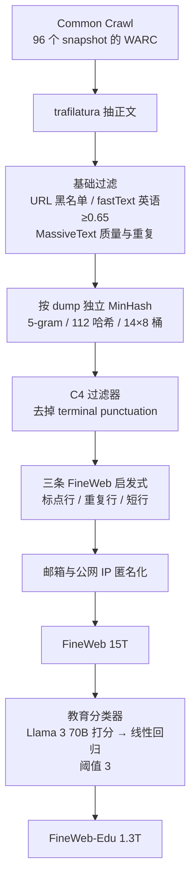

# FineWeb：公开网页并不缺，缺的是把每一步过滤做成可证伪实验

<!-- release-date: 2024-04-21 -->

> **本文依据**：Hugging Face 的 *The FineWeb Datasets: Decanting the Web for the Finest Text Data at Scale*，本地原件 `papers/HuggingFace/FineWeb.pdf`，即 arXiv:2406.17557**v2**（2024-10-31），NeurIPS 2024 Datasets and Benchmarks，共 38 页。作者 Guilherme Penedo、Hynek Kydlíček、Loubna Ben allal、Anton Lozhkov、Margaret Mitchell、Colin Raffel、Leandro Von Werra、Thomas Wolf，机构 Hugging Face。页码均指这份 PDF。全文把三件事分开标注：**论文写了什么**、**我们如何解释它**、**哪些是外部资料补充**。
>
> **版本先说清楚。** arXiv v1 是 2024-06-25，本地是 v2。解读依据 v2，不沿用 v1 的页码。v2 相对 v1 主要是会议相机就绪修订，核心主张（15T FineWeb、1.3T FineWeb-Edu、按 dump 去重、启发式与教育分类器）没有换成另一套配方。
>
> **`release-date` 不是论文上传日。** 这篇覆盖的是 FineWeb 数据集家族，按手册取该对象最早官方公开日。核到的证据链如下，没有更早的官方公开事件：
>
> 1. HuggingFaceFW/fineweb 官方 README changelog 写明 **v1.0.0 (21-04-2024) Initial version**（[数据集页](https://huggingface.co/datasets/HuggingFaceFW/fineweb)）。
> 2. 同日仓库有 README 提交（例如 `fa3ba60`，2024-04-21），作者 Guilherme Penedo 同日公开宣布放出 15T FineWeb。
> 3. **不用** Hugging Face 仓库的 `createdAt`：按手册，那不是首发日。
> 4. 论文 v1（2024-06-25）只是论文日，不是数据集首发。
>
> **FineWeb-Edu 晚于 FineWeb。** 官方 changelog 写 **v1.0.0 (02-06-2024) Initial version**（[fineweb-edu](https://huggingface.co/datasets/HuggingFaceFW/fineweb-edu)）。一篇覆盖该家族的文章仍取更早的 FineWeb 公开日 2024-04-21。Edu 的分类器、1.3T 规模与 MMLU/ARC 数字是后文单独讲的后续成员，不是首发事件。

## 阅读前先认识几个词

这篇论文几乎没有新的神经网络结构。它研究的是：网页怎样变成能训语言模型的文本。几个词会反复出现，先说人话：

- **Token（词元）**：模型读写文本时的最小单位。本文所有「多少 T」都按 GPT-2 tokenizer 计。1T 就是大约 1 万亿个词元。
- **Common Crawl**：从 2007 年起持续抓取公共网页的非营利存档。每次大规模抓取叫一个 **snapshot / dump / crawl**，文件名形如 `CC-MAIN-2024-10`。
- **WARC 与 WET**：同一趟爬虫的两种交付物。WARC 是带 HTML 的原始抓取包；WET 是 Common Crawl 自己抽过的纯文本。看起来 WET 更省事，论文却证明它抽得太脏。
- **过滤（filtering）**：按规则丢掉一批文档或一行文本。规则可以是「不像英语」「太短」「重复太多」「不像教育内容」。
- **去重（deduplication）**：识别并删掉重复或近似重复的文本。听起来像去重数据库，真正难的是：按行、按段、按文档？全库一起去，还是每个 dump 分开去？模糊匹配还是精确匹配？
- **MinHash**：一种模糊去重算法。它不直接比全文，而是把文档切成短片段（n-gram），再保留一组「最小哈希」当指纹。指纹足够像，就判为重复。
- **消融（ablation）**：每次只改管线里的一步，其他训练条件锁死，看下游分数动不动。FineWeb 的方法贡献，几乎全靠这件事。
- **启发式过滤器（heuristic filter）**：不训练模型，只用可计算的统计量卡阈值，例如「以标点结尾的行占比太低就丢掉」。
- **教育分类器**：先让大模型给网页打「像不像教材」的分数，再训练一个小回归器，把这个分数打到全部 15T 上。

论文里最常出现的三个专有名字是：

- **FineWeb**：从 96 个 Common Crawl snapshot 得到的 15T 英文网页数据集。
- **FineWeb-Edu**：用教育分类器从 FineWeb 里滤出的 1.3T 子集。
- **datatrove**：作者为了做这套管线写的大规模数据处理库，代码公开。

## 一句话先说清

FineWeb 不是「我们又爬了一次网，数据比别人多」。

它真正做的事情，是把网页预训练数据里那些通常被当成商业秘密或口头经验的步骤，拆成可以单独证伪的实验：

- 用 **WARC + trafilatura** 抽正文，而不是直接吃 WET；
- 用 **URL 黑名单、fastText 英语、MassiveText 质量/重复规则** 做第一层粗过滤；
- 用实验否定「全库一起 MinHash 一定更好」，改成 **每个 dump 独立去重**；
- 从 C4 的过滤器里只借走「去掉的数据不太多、分数还上涨」的那几条；
- 用高低质量数据的统计分布差，从五十多个统计量、16 个候选阈值里留下三条真的抬分的启发式；
- 再用 Llama 3 70B 的合成标注训练教育分类器，把 15T 压成 1.3T 的 FineWeb-Edu。

因此最值得记住的不是 15T 这个整数，而是一种做数据的态度：

> **过滤规则如果不能被一次小规模训练证伪，它就还只是口味，不是配方。**

这也是全文最重要的 insight。

消融模型是 **1.71B、Llama 结构、GPT-2 词表** 的小模型，过滤实验大约训 28B Token，去重与最终对比大约训 350B Token。论文没有训一个 Llama 3，也没有把 Llama 3 的预训练数据复原出来。Llama-3-70B-Instruct 只出现在 FineWeb-Edu 的打分教师里。（PDF p.3–4、8）

## 先看全景：从 Common Crawl 到 FineWeb 的管线

这张图是机制示意，依据 §3.7 与 §4 的最终配方（PDF p.7–8），不代表真实墙钟或各步丢掉的绝对时间。附录 A 的 datasheet 把 MinHash 写在自定义过滤器之后（PDF p.18）；正文消融顺序是 **先按 dump 去重，再上 C4 与自定义过滤器**。后文以正文实验顺序为准，datasheet 的顺序差会单独标出。

各步大约把数据收到什么规模，论文给过这些锚点（都按 GPT-2 tokenizer）：

| 阶段 | 大约规模 | 出处 |
|---|---:|---|
| 96 个 snapshot，基础过滤之后 | 36T | PDF p.4 §3.3 |
| 全局 MinHash（实验，最终没用） | 4T | PDF p.5 §3.4 |
| 按 dump 独立 MinHash | 20T | PDF p.5 §3.4 |
| 再加 C4 与自定义过滤器 | **FineWeb 15T** | PDF p.7 §3.7 |
| 教育分类器，阈值 3 | **FineWeb-Edu 1.3T** | PDF p.8 §4 |

## 第一层问题：开源模型把数据做成了商业秘密

### 旧问题

语言模型变强，一个很硬的原因是模型变大，模型变大就要求预训练数据也变大（PDF p.1）。规模之外，另外两件事同样关键：把「低质量」内容滤掉，以及把重复文本去掉。

这两步听起来像数据工程常识。论文指出，它们在产业里常常是 **机密**。许多所谓「开源」模型只公开参数，预训练数据既不发布，也几乎不写清楚怎么做。Llama 3 和 Mixtral 是摘要里点名的例子（PDF p.1 Abstract）。后果是：公开知识与私有实验室之间出现一条越来越宽的缝——外面的人能复现架构，复现不了「数据到底怎样被做成能训的」。

网页本身并不缺。Common Crawl 从 2007 年跑到论文写作时，已经产出约 100 个 snapshot，体量到 PB 级（PDF p.2）。缺的是一套 **可公开、可复现、并且每一步都有下游证据** 的清洗配方。

过滤还有一个内在矛盾（PDF p.2）：

- 滤得太松：网页里有大量「不像人写的话」——导航菜单、样板文字、乱码。用这些东西训模型，会伤害下游，因为真正用模型时几乎不会去读菜单。
- 滤得太紧：数据集变太小。预训练通常只过一遍或很少几遍数据，一般用途的大模型需要足够多的 Token。

去重也不是「删掉重复行」这么一句话能结束。按行、按段还是按文档？模糊还是精确？在几个 dump 之间去，还是只在一个 dump 里去？这些选择会改变留下来的是什么。

### 新设计要回答的问题

FineWeb 给自己定的任务不是发明一种新注意力，而是（PDF p.1–2）：

1. 放出一个足够大的公开网页数据集，大到按 Chinchilla 最优配比可以支撑超过 500B 参数的模型；
2. 把过滤启发式的选择与阈值写成可消融的流程，从 50 多个候选里留下一小撮真的有用的规则；
3. 把去重策略和粒度做成深度实验，而不是默认「去得越干净越好」；
4. 再做一个教育向子集 FineWeb-Edu，看「更像教材」会怎样改变知识与推理型基准。

数据集用宽松的 ODC-By 许可证发布，处理代码是 datatrove，消融过程中训过的模型也全部公开（PDF p.2）。

**解释：** 这是把「数据配方」从手艺变成实验科学。手艺的特征是老师傅知道哪条规则该留，但说不清为什么、也没法让别人在同一设置下证伪。FineWeb 强迫每条规则面对同一套小模型、同一组基准。它的代价也很明确：小模型短训看到的信号，不一定等于 70B、15T 训练上的信号。论文后面自己承认了这一点。

## 前人已经做过的网页清洗，为什么还不够

§2 不是在写教科书，而是在给 FineWeb 后面每一步实验找对照物。预训练还有书籍、维基、论文这些来源，但网页是最常见、也最脏的一种（PDF p.2）。OpenAI、Anthropic 会自己爬；多数实验室没有这个能力，于是从 Common Crawl 开工。

论文把已有公开数据集的过滤与去重，压缩成一张「前人用过什么武器」的地图。下面这张表按论文叙述整理，不是原文表格（PDF p.2–3）：

| 数据集 | 语言识别 | 抽取 / 过滤 | 去重 |
|---|---|---|---|
| OSCAR | fastText | 偏 Touvron 等的管线 | 行级非加密哈希 |
| C4 | langdetect | 只要以句末标点结尾的行、去短行、bad words、javascript / cookie / lorem ipsum / `{` | 三行窗口去重 |
| CC-100 | fastText（cc_net） | 维基 n-gram 语言模型的低困惑度 | 段级哈希 |
| The Pile（Pile-CC） | pycld2 | jusText 去样板；分类器靠近 WebText | MinHash 模糊去重 |
| ROOTS | 基于 OSCAR | 额外启发式 | SimHash |
| RedPajama | cc_net | 分类器区分「维基级」与随机 CC | 后续 SlimPajama 再做 MinHash |
| SlimPajama | 继承 RedPajama | 去掉过短文档 | 额外模糊 MinHash |
| RefinedWeb | fastText | trafilatura 抽取；MassiveText 风格启发式 | MinHash + ExactSubstr |
| RedPajama v2 | 给出标签，本身几乎不过滤 | 带上 cc_net / C4 / MassiveText / RefinedWeb 等标签 | 精确（Bloom）与模糊（MinHash）标签 |
| Dolma（CC 部分） | fastText | MassiveText + C4 启发式；规则与分类器毒性过滤 | URL / 文档 / 段级 Bloom |

闭源报告里偶尔也会露一口：WebText 只收 Reddit 上至少 3 karma 的外链；GPT-3 用分类器把 CC 往 WebText / 维基 / 书上靠，再用 MinHash；MassiveText（Gopher）用 SafeSearch 加文档统计启发式和 MinHash（PDF p.3）。

**解释：** 这一节的信息量很大，但真正要带走的只有两句。第一，公开配方并不少，可它们很少把「为什么留这条规则」写成消融。第二，FineWeb 后面几乎每一步都能在这张表里找到前身——trafilatura 来自 RefinedWeb，MassiveText 规则来自 Gopher，C4 过滤器来自 T5，MinHash 来自一大串前作。它的新意不在发明过滤器，而在 **用同一套小模型把这些零件重新排过序、测过粒度、扔掉会伤分数的步骤**。

## 实验怎么设：小模型短训，不是再训一个 Llama 3

§3 开篇就把方法定成经验性的：管线每一步都做数据消融。每组对比只改数据，不改参数量、结构超参和训练 Token 数。为了减轻「碰巧抽到哪一段数据」的噪声，每个数据版本训 **两个** 模型，不同随机子集、不同初始化种子，再比平均分（PDF p.3）。

训练用 nanotron，评测用 lighteval。消融模型的固定骨架（PDF p.3、20 Appendix D）：

| 项 | 值 |
|---|---|
| 结构 | Llama |
| 总参数（含 embedding） | 1.71B |
| 层数 | 24 |
| 注意力头 / KV 头 | 32 / 32 |
| 序列长度 | 2048 |
| 词表 | GPT-2，50257 |
| 绑定输入输出 embedding | 是 |
| 数据并行 | 64 |
| 张量 / 流水线并行 | 1 / 1 |
| micro-batch | 4 |
| 每副本梯度累积 | 4 |
| 全局 batch | 约 2M Token |
| 优化器 | Adam，$\beta_1=0.9$，$\beta_2=0.95$ |
| 学习率 | $3\times 10^{-4}$，500 step 线性升温，余弦降到 $3\times 10^{-5}$ |
| 权重衰减 / 梯度裁剪 | 0.1 / 1.0 |

全局 batch 可以验算：$64\times 4\times 4\times 2048=2{,}097{,}152$，与论文写的「约 2 million tokens」一致（PDF p.20–21）。这是我们的验算，不是论文另给的公式。

训练预算按实验类型分开（PDF p.3）：

- **过滤消融**：约 28B Token，大约是这个模型规模的 Chinchilla 最优训练量；
- **去重消融、以及确认每步累积收益**：350B Token。

全部超过 70 个模型，内部集群估计 **80,000 H100 GPU 小时**。消融模型都公开在数据集仓库里。

评测基准不是「越大越好」的榜单堆砌。作者给了三条选基准的理由（PDF p.3–4）：

1. 同一数据集的不同随机子集之间，分数方差要小；
2. 训练过程中分数要近似单调上升；
3. 这个小模型的分数要明显高于随机基线。

最终留下：CommonSenseQA、HellaSwag、OpenBookQA、PIQA、SIQA、WinoGrande、ARC、MMLU。大基准截到 1000 条，以便训练过程中反复评。精确评测脚本公开。

**解释：** 这套设置决定了后文所有「涨了 1 个点」该怎么读。它能比较 **同一规模、同一训练量下，数据配方谁更干净**，不能直接外推「用 FineWeb 训 70B 一定比用 C4 训 70B 强多少」。28B Token 的过滤实验尤其看不到跨 dump 的重复——附录 E.2 专门证明了这件事。所以作者没有在 28B 上做去重结论，这是实验设计里最清醒的一刀。

**可迁移启发：** 做数据消融时，先问「我选的基准会不会只是换了随机种子就跳」。分数乱跳的任务，不适合当过滤器的法官。另外，去重这种「全库统计效应」，小切片会假装问题不存在，必须把训练量拉到重复开始出现的尺度。

## 核心设计一：从 WARC 抽正文，不要直接用 WET

### 旧问题

多数数据集图省事，直接从 WET 起步。WET 已经是「纯文本」。Gao 等人做 The Pile 时就发现 WET 会留下太多样板和菜单。FineWeb 用肉眼对比开源抽取库，认为 trafilatura 抽 WARC 时样板和菜单更少（PDF p.4）。

自定义抽取更贵。论文没有报精确的 CPU 小时，但明确说 **相对更贵，而效果能在模型分数上感觉到**。

### 实验

消融只加最少过滤：fastText 语言识别，保留英语概率最高的样本；**不去重**。一边是 trafilatura(WARC)，一边是 WET。28B Token。Fig. 1 显示 WARC 抽取的曲线全程压过 WET（PDF p.4 Fig.1）。从图上读，28B 附近聚合准确率大约是 WARC 略高于 40%、WET 约 37%–38%，不要把读图当成论文表格。

于是后续全部实验都改用 WARC。

**解释：** WET 像是别人帮你切好的菜。问题是切菜的人并不为你的下游任务负责，菜单、页脚、侧边栏会混进「正文」。trafilatura 的工作可以想成：先找到「这篇文章真正要给人读的那一块」，再交给过滤器。如果这一步已经把导航条当成段落留下，后面的启发式会被迫去处理一种本不该存在的文本统计——比如短行特别多、标点特别少。

**代价：** 必须存 WARC、跑 HTML 解析，比读 WET 贵。如果预算只够从 WET 做研究，论文的结论是：你一开始就站在更差的起点上。

## 核心设计二：先上一层粗过滤，把 96 个 snapshot 收到 36T

基础过滤几乎整段借自 RefinedWeb 的前半段（PDF p.4）：

1. **URL 黑名单**（UT1）去掉成人内容；
2. **fastText 语言分类器**，只留英语且分数 $\ge 0.65$；
3. **MassiveText 的质量与重复过滤器**，阈值用原论文的原值。

对当时能拿到的 96 个 snapshot 的 WARC 正文跑完这三步，得到约 **36T** Token。Fig. 2 显示这一步相对「只抽 WARC、几乎不滤」有明显上涨（PDF p.4 Fig.2）。

**解释：** 这一步不是 FineWeb 的招牌贡献，它是后面所有实验的地板。没有这层粗过滤，去重实验会把大量成人页、非英语页和明显垃圾一起送进 MinHash，结果会变得无法解释。$\ge 0.65$ 这个英语阈值也不是本文调出来的，是沿用；论文没有单独消融 0.5 对 0.8。

URL 过滤只能去掉「域名已经被列进黑名单」的那类站点。附录 datasheet 后来说，最终集里仍有可被视为有毒或有害的文档（PDF p.19）。所以这一步是减毒，不是消毒。

## 核心设计三：去重粒度——全局 MinHash 为什么会把好数据扔掉

这是全文最关键的实验之一。因果链必须走完：旧假设 → 全局实验失败 → 追查被扔掉的数据 → 改成按 dump 去重 → 更轻的全局去重也失败 → 作者给的假说 → 可迁移的边界。

### 旧问题：去重听起来总是好事

网页上有聚合站、镜像、模板页，同一段文字会穿梭在不同域名之间。去掉重复与更好的模型分数、更少的背诵（memorization）相关（PDF p.4）。可「重复」有很多定义：行、段、文档；模糊或精确。

FineWeb 跟随 RefinedWeb，选用 **MinHash**。原因写得很工程：它能扩到很多 CPU 节点，并且相似阈值、子序列长度都可以调（PDF p.5）。

具体参数（PDF p.5、21 Appendix E.1）：

- 用英语词 tokenizer 切 **5-gram**；
- 一共 **112** 个哈希函数；
- 分成 **14 个桶，每桶 8 个哈希**；
- 目标是抓住至少约 **75%** 相似的文档。

判定规则：任意一个桶里 8 个 MinHash 完全相同，就视为重复。然后再做 **传递闭包聚类**：若 A 与 C 重复、B 与 C 重复，则 A、B、C 进同一簇，哪怕 A 与 B 从来没有在任何一个桶里对上。每簇随机留一篇，其余删除。

两个文档 n-gram 相似度为 $s$ 时，被判为重复的概率是：

$$
P(\text{match})=1-(1-s^{8})^{14}
$$

论文给出四档（PDF p.21）：$s=0.7,0.75,0.8,0.85$ 时，大约是 56%、77%、92%、98.8%。也就是：75% 附近已经比较容易抓住，85% 以上几乎一定会抓住。

RefinedWeb 用了 9000 个哈希、450 桶 × 20 哈希，切得更陡，但计算和存储贵得多。FineWeb 认为省下的资源，配得上阈值附近更高的不确定性（PDF p.21–22 Fig.13）。

### 第一次尝试：全局、从新到旧迭代去重——失败

作者的第一反应很符合直觉：96 个 snapshot 应当放在一起去重，否则同一页面被爬了十年，会在训练集里出现十次。

做法是迭代式的：从当时最新的 `2023-50` 开始，按时间倒着走向最老的 dump。老 dump 要跟后面所有更新的 dump 去重，所以最老的 snapshot 会被砍掉最多，论文写 **高达 90%** 的基础过滤数据被删。全库这样处理得到 **4T**（PDF p.5）。

然后用随机抽的 350B Token 训练。结果：相对不去重只有 **很小** 的提升，并且远远落后于 RefinedWeb（PDF p.5 Fig.3）。

这直接打脸了一个默认假设：**全局去重不一定带来更高基准分。**

### 追查：被扔掉的 90% 其实更好

作者没有在「去重没用」上停住，而是打开一个老 dump `2013-48`，把它切成两堆：

| 切片 | 规模 | 含义 |
|---|---|---|
| Originally kept | 约 31B | 全局去重之后真正留下的，约占原 dump 的 10% |
| Originally removed | 从被扔掉的约 460B 里，**单独**再做一次 dump 内去重，得到 171B | 全局步骤认为是重复而丢掉的 |

两堆都拿去训 28B 量级的消融（Fig.4 横轴到 30B）。**留下的那 10% 比扔掉的 90% 更差**（PDF p.5 Fig.4）。肉眼看：留下的更多广告、语无伦次的关键词列表、格式很差的文本。

**解释：** 全局、从新到旧的去重有一个隐蔽的偏置。新 dump 先发言，老 dump 只能吃剩。若某个模板页、新闻稿、镜像在很多 snapshot 里反复出现，算法会在新 dump 里留下一份，把老 dump 里同类文档几乎删光。老 dump 最后剩下的，往往是 **谁也不跟它重复的长尾**——而长尾并不等于高质量。它更可能是没人愿意复制的垃圾。

可以想成整理旧杂志：如果你规定「全图书馆只留每篇文章最新的一版」，十几年前那叠杂志会被撕得只剩没人转载的小广告。小广告确实「独特」，但不是你想读的东西。

### 改成按 dump 独立去重——追上 RefinedWeb

于是改成：每个 snapshot **自己** 做 MinHash，不看别的 snapshot。参数不变。得到 **20T**。从所有 snapshot 里随机抽样训练，分数 **追上了 RefinedWeb**（PDF p.5–6 Fig.5）。

作者给的假说是（PDF p.5–6）：

> 去重的主要收益，来自删掉那些在所有 crawl 里都存在、动辄几十万篇的巨大重复簇；继续去重那些重复次数少于大约 100（也就是 crawl 个数量级）的小簇，反而可能伤害性能。长尾质量问题，更适合用过滤而不是去重来处理。

这是假说，不是被单独控制变量证明的定理。后文的启发式过滤器，正是沿着「用过滤打长尾」这条路走。

### 更轻的全局去重也补不回来

独立去重之后，作者还想「再轻轻全局去一次」。对象是已经按 dump 去重后的 20T。试了（PDF p.23 Appendix E.3 Fig.15）：

| 方法 | 丢掉的 Token | 剩下 | 相对独立 MinHash |
|---|---:|---:|---|
| URL 去重（规范化小写 URL 只留一篇） | 71.5% | 5.6T | 更差 |
| 行去重（重复行只留随机一次） | 77.8% | 4.4T | 更差 |
| 行去重 + 至少 10 词才删，去重后少于 3 句的文档丢掉 | 85% | 2.9T | 更差 |
| 三行窗口去重（数字都当成 0） | 80.9% | 3.7T | 更差 |

没有任何一种超过「只做 dump 内 MinHash」。所以最终配方 **不再追加任何全局去重**。

### 为什么过滤消融用 28B，去重必须用 350B

附录 E.2 用一个极端思想实验说明尺度问题（PDF p.22 Fig.14）。假设 100 个 snapshot、每个 200B、且每个 snapshot 是另外 99 个的精确拷贝（最坏的跨 dump 重复）。从 20T 里随机抽样：

- 抽 1B：几乎所有文档在样本里都是独一无二的；
- 抽 100B：开始出现重复 2 次、少数 4–8 次；
- 抽 1T：大部分文档重复最多 8 次，有些到 16 次。

所以：最大的那些重复簇被去掉之后，去重的剩余效应在 28B 这种小切片上会 **假装不存在**。作者把去重评估放到 350B，就是为了让重复开始在训练分布里露面。

**代价与边界：**

- 按 dump 独立去重，意味着同一页面在 2013 和 2024 各出现一次，会作为两条样本留下。这是有意的，不是没做成。
- 传递闭包可能把「并不两两相似」的文档链进同一簇，存在误杀。
- 75% 的 MinHash 阈值附近有相当概率漏掉或误抓，这是用 112 个哈希换算力时主动接受的。
- 假说「小簇不该去」没有在论文里被做成「按簇大小分层删除」的精确消融。

**可迁移启发：**

> **去重的对象是「有害的重复」，不是「一切不唯一的文本」。粒度选错时，独特会长得像质量。**

做自己的数据管线时，不要默认 `dedup_over=all`。先问重复是跨时间的镜像，还是同一 dump 里的模板海。前者可能是历史抽样，后者才是典型垃圾。若只能做一次去重，FineWeb 的证据更支持 **先在自然分区（这里是 crawl）内部砍掉巨大模板簇**。

## 核心设计四：C4 的过滤器，只借有用的那几条

独立 MinHash 之后，平均分已经和 RefinedWeb 持平。但 C4 虽然更小，在他们的评测套件里、尤其是 **HellaSwag** 上仍然更强。HellaSwag 是这组基准里信噪比最高的任务之一。C4 尽管老，仍出现在 Llama 1 的预训练混合里（PDF p.6）。

于是问题变成：怎样在已经追上 RefinedWeb 的地板上，再把 C4 的那截优势借过来，同时不要像 C4 那样丢掉 30% 数据。

C4 源自 `2019-18` 这一个 crawl，规则包括（PDF p.6）：

- 丢掉不以句末标点结尾的行；
- 提到 javascript 的行；
- 含 terms-of-use / cookie policy 的行；
- 文档太短；
- 含 lorem ipsum；
- 含花括号 `{`。

FineWeb 把这些规则打在「基础过滤 + 独立去重后的 2019-18」上，并直接和 C4 比。Fig.6 / 正文给出的定量结果（PDF p.6）：

| C4 规则 | 去掉的 Token | 效果（HellaSwag，Fig.6） |
|---|---:|---|
| 全部规则一起 | — | 能追上 C4 |
| 花括号 | 2.8% | 小幅提升 |
| 词长 | 4.3% | 小幅提升 |
| **句末标点（terminal punctuation）** | 约 30% | 单条提升最大 |
| lorem ipsum / javascript / policy | 各 $<0.5\%$ | 未单独训练 |
| **除句末标点以外的全部** | 合计约 7% | 比单用句末标点更好，而且少扔很多 |

最终决定：**采用上述 C4 过滤器，但丢掉 terminal punctuation**。因为它删得太多。

**解释：** 句末标点规则的直觉是「真正的句子会用句号问号感叹号收尾，菜单和列表不会」。它对 HellaSwag 很灵，因为 HellaSwag 考的就是把一句日常英语写完。可它也误杀大量格式略不规范、但仍是连贯段落的网页——论坛、问答、非英文标点习惯的英语页、标题党较少的笔记。FineWeb 的选择很像做菜时把盐留下、把把整勺倒进锅里的那一步拿掉：要的是 C4 的方向，不要 C4 的损耗。

后文三条自定义启发式，有一条专门打「以标点结尾的行占比」，等价于用文档级比例代替 C4 的行级一刀切，损耗从 30% 降到 10.14%。这是下一节的伏笔。

## 核心设计五：用高低质量分布差，系统性地发明启发式

### 旧问题：启发式通常靠「看数据」

过去工作多半靠人工看样本来写规则（PDF p.7）。这很难复制：你看不到作者看过的那 200 个坏例子，也就调不准阈值。

### 新设计：先找到高低质量数据在统计上分叉的地方

作者收集了 **50 多个** 文档级与重复级统计量，从行数、平均行长/词长，到 MassiveText 风格的跨文档重复指标。关键是对比的两端不是「维基 vs 网页」，而是同一 snapshot 的两种去重结果（PDF p.7）：

- **高质量代理**：`2013-48` 的 **独立** MinHash 版本；
- **低质量代理**：同一 dump 的 **全局** MinHash 版本——也就是上一节证明更差、广告和关键词列表更多的那一堆。

然后找「两个分布差得最明显」的指标，看直方图，把阈值卡在低质量分布明显更密的区间。Fig.8 是「以标点结尾的行占比」：低质量在 $<0.12$ 处鼓起一块，高质量没有。于是把 $0.12$ 当成候选阈值（PDF p.7 Fig.8）。

对所有指标走完，得到 **16 个指标-阈值对**。再拿到 `2019-18` 上做 28B 消融。附录 Table 2 是完整清单（PDF p.24）。下面按聚合分数从高到低抄原表；**阈值列是 Table 2 的写法，保留条件**，与正文「丢掉满足某某条件的文档」方向相反：

| 指标 | Table 2 阈值 | 聚合准确率 (%) | 去掉 Token (%) |
|---|---|---:|---:|
| avg-line-length-0.5-sampling | $\ge 56$ | 42.93 | 3.24 |
| lines-with-punct-ratio | $\ge 0.12$ | 42.85 | 10.14 |
| duplicated-line-char-ratio | $\le 0.01$ | 42.78 | 12.47 |
| lines-with-punct-ratio | $\ge 0.12$ 或 $=0$ | 42.72 | 5.82 |
| lines-shorter-30-ratio | $\le 0.67$ | 42.65 | 3.37 |
| line-with-most-3-words-ratio | $\le 0.49$ | 42.61 | 2.51 |
| duplicate-(5-10)-grams-char-ratio | $\le 0.1,0.084,\ldots$ | 42.60 | 10.92 |
| lines-with-punct-ratio | $\ge 0.08$ 或 $=0$ | 42.59 | 3.42 |
| top-(2,3,4)-gram-char-ratio | $\le 0.13,0.087,0.079$ | 42.58 | 56.71 |
| lines-shorter-30-ratio | $0.69$ | 42.58 | 3.73 |
| avg-words-per-line | $\ge 7$ | 42.56 | 2.32 |
| lines-shorter-30-ratio | $\le 0.5$ | 42.53 | 11.17 |
| avg-words-per-line | $\ge 5$ | 42.39 | 0.83 |
| avg-words-per-line | $\ge 9$ | 42.27 | 4.47 |
| avg-line-length | $\ge 56$ | 42.12 | 6.48 |
| avg-line-length-0.5-sampling | $\ge 40$ | 42.03 | 1.50 |

有一处正文与表格不完全对齐，必须并列写出来，不替论文抹平：

- 正文选定的三条是（PDF p.7）：以标点结尾的行占比 $\le 0.12$（去掉 10.14%，对照 C4 句末标点的 30%）；重复行中的字符占比 $\ge 0.1$（去掉 12.47%，MassiveText 原阈值是 $\ge 0.2$）；短于 30 字符的行占比 $\ge 0.67$（去掉 3.73%）。
- Table 2 把第二条写成 `duplicated-line-char-ratio ≤ 0.01`，把短行那条的 3.73% 写在阈值 `0.69` 那一行，而 $\le 0.67$ 那行是 3.37%。丢掉比例 12.47% 与 10.14% 能对上正文，短行 3.73% 对上的是 0.69 那行。

**解释：** 更可能是表格排版把 $0.1$ 写成了 $0.01$，或把「丢掉条件」和「保留条件」混在同一列。正文是最终配方的叙述，后文以正文三条为准，并把表格当作 16 个候选的分数清单。

三条一起用，去掉约 **22%** Token，28B 消融上聚合分数大约 **+1%**。Fig.7 显示组合过滤器既超过基础过滤基线，也超过最好的那条 C4 规则（terminal punctuation），同时丢掉的更少（PDF p.6–7 Fig.7）。作者据此宣称：在过滤掉更小比例数据的前提下，超过了 C4。

为什么不单用 Table 2 里分数最高的 `avg-line-length-0.5-sampling ≥ 56`（42.93）？论文没有单独解释。它只说在全部 run 里识别出三条「对聚合分数提升最显著」的过滤器，并在 Fig.7 里画了标点、重复行、短行以及三者组合。0.5-sampling 那条只出现在附录表，没有进入最终管线。

**解释这条因果链：**

1. 全局去重制造了一堆「独特但更脏」的文档，这本来是失败；
2. 失败被翻转成探针：脏堆和干净堆在哪些统计量上分叉；
3. 分叉处变成阈值，阈值再被 28B 训练审判；
4. 审判留下的三条，正好打在广告/关键词列表/格式崩溃上——也就是 Fig.4 肉眼看到的那种垃圾。

这比「我们觉得短文档不好」更可复现。别人可以在自己的高低质量代理上重画直方图。危险也在这里：高低质量代理如果选错，整组启发式会跟着错。FineWeb 的代理来自上一节已经被模型分数验证的对比，不是「维基=好、论坛=坏」。

**可迁移启发：** 写启发式之前，先构造一对 **已经被下游分数分开** 的数据，再让统计量去解释这对数据差在哪。不要从「好文本应该怎样」的审美出发。阈值要卡在两堆直方图分叉的地方，并且必须拿去训练，不能只看直方图。

## 最终的 FineWeb：15T，每一步都留下了分数

把前面的决定串起来，对 96 个 Common Crawl snapshot 跑完整条管线，得到 **15T** 的 FineWeb（PDF p.7）：

1. 从 WARC 抽正文（§3.2）；
2. 基础过滤（§3.3）；
3. 按 crawl 独立 MinHash（§3.4）；
4. 选用的 C4 过滤器（§3.5）；
5. 三条自定义启发式（§3.6）；
6. 对外发布前，用正则把 **邮箱和公网 IP** 匿名化。

Fig.9 把每一步的 350B 训练曲线叠在一起：相对基础过滤，独立 MinHash、C4 过滤器、自定义启发式各自再抬一截（PDF p.8 Fig.9）。这是「累积相对收益」图，不是四条完全独立的正交消融。

然后用同一套 1.71B、350B Token、不向上采样任何一个 snapshot 的协议，去对比当时常用的公开网页数据集（PDF p.7–8 Fig.10）：

| 数据集 | 论文给出的规模 |
|---|---:|
| FineWeb | 15T |
| FineWeb-Edu | 1.3T |
| RefinedWeb | 500B |
| C4 | 172B |
| Dolma 1.6 的 CC 部分 | 3T |
| Dolma 1.7 的 CC 部分 | 1.2T |
| The Pile | 340B |
| SlimPajama | 627B |
| RedPajama2 去重版 | 20T |
| Matrix 的英文 CC | 1.3T |
| CC-100 英文 | 70B |
| Colossal-OSCAR | 850B |

脚注很重要：RedPajama2 带 40 多个质量标注，但 **真正过滤只用了 CCNet 管线**（PDF p.7）。也就是说，把它放进「过滤后的数据集」对比里，会偏向上看一个几乎没滤过的 20T。

Fig.10 的结论：FineWeb 本身已经强，FineWeb-Edu 在聚合任务上超过所有对比的公开集，并且把聚合分数再抬大约 **2%**（PDF p.8 Fig.10）。后文会看到，这 2% 主要来自知识/推理型任务，不是每一项都涨。

**解释：** 15T 这个数字容易被当成「我们比别人大」。对照表说明另一件事：C4 只有 172B，却曾在 HellaSwag 上很难打；RedPajama2 有 20T，却因为几乎没滤，分数上不去。规模是入场券，配方决定名次。FineWeb 的 15T 是「滤完还剩 15T」，不是「爬到 15T 就停」。

## 核心设计六：教育分类器把 15T 再压成 1.3T

第三条因果链：用合成标注做教育过滤。Llama 3 和 Phi-3 的非公开预训练数据都用过类似技术，但「它在网页尺度上到底会怎样」当时没有被公开拆开（PDF p.8）。

### 旧问题

网页均值很差。即便 FineWeb 已经去掉菜单、重复模板和明显垃圾，剩下的仍是互联网：新闻、购物、论坛、教程、广告软文混在一起。Phi-3、Llama 3 的报告暗示「更像教材」的网页特别值钱，可他们的分类器和过滤后的数据都不公开。

### 新设计：先让 70B 模型按加分制打分，再把打分能力蒸馏到小回归器

**第一步，合成标注。** 从 FineWeb 的 `CC-MAIN-2024-10` 随机抽 **460,000** 个网页，用 Llama-3-70B-Instruct 按 0 到 5 打教育质量（PDF p.8）。试过多种提示，**加分制**（Yuan 等的 additive scale）最好：模型必须按条目往上加分，而不是对着几个固定档位打一个印象分。为了避免模型偏爱 arXiv 摘要那种过难的页，提示明确要求关注 **小学到初中** 程度。完整提示在附录 F.1（PDF p.25），结构是：

- 加 1 分：有一点与教育相关的基本信息，即便夹杂广告；
- 再加 1 分：沾边但不够课程标准，或写得很乱；
- 第 3 分：适合教学，引入关键概念，像教材引言或基础教程，可有明显缺陷；
- 第 4 分：对不超过小学/初中的程度高度有用，像教材章节或带练习的教程；
- 第 5 分：出色，推理清楚，没有非教育或过难内容。

最后要求用 `Educational score: <total points>` 这种格式收尾。

**第二步，可扩放的回归器。** 在 Snowflake-arctic-embed-m 的 embedding 上接线性回归。用 410,000 条合成标注训 20 个 epoch，学习率 $3\times 10^{-4}$，**embedding 和 encoder 冻结**。剩下 50,000 条当验证集，Llama 3 的分数当作真值，选 F1 最高的 checkpoint。输出再四舍五入成 0–5 的整数（PDF p.8）。

**第三步，选阈值。** 阈值 3 在「知识/推理基准」和 HellaSwag 这类更日常的基准之间折中最好。阈值 3 时验证集 F1 为 **82%**。附录 Fig.17 是 28B Token 上阈值 2 / 3 / 4 的对比：FW-Edu-3 的聚合曲线最高，FW-Edu-4 与 FW-Edu-2 接近，都高于未过滤的 FineWeb（PDF p.27 Fig.17）。从图上读，28B 附近 Edu-3 大约 45%，FineWeb 大约 43.5%，这是读图，不是表格。

把分类器打到全部 15T 上花了 **6,000 H100 GPU 小时**（PDF p.8）。阈值 3 得到 **1.3T** 的 FineWeb-Edu。

### 350B 上的收益集中在知识和推理

更大的消融仍是 1.71B 训 350B Token。MMLU 从 **33% 到 37%**，相对约 **12%**；ARC 从 **46% 到 57%**，约 **24%**（PDF p.9）。Fig.11：FineWeb-Edu 在 **38B Token** 就达到 MMLU **33.6%**，而当时该指标第二好的 Matrix 要到约 **300B** 才到同一水平，大约 **10 倍 Token 差**（PDF p.9 Fig.11）。

附录 Fig.16 按分项画出各基准（PDF p.26）。论文强调的是 MMLU、ARC、OpenBookQA 这类知识与推理任务；HellaSwag 并不保证同样大的优势——这也是为什么阈值不能无脑调到 4。正文只写阈值 3 是知识/推理基准与 HellaSwag 等其他基准之间的折中（PDF p.8）。**外部补充：** FineWeb-Edu 数据集卡写得更直白——阈值高于 3 会继续帮知识和推理，但显著伤害 HellaSwag 和 PIQA；那是卡片口径，不是 v2 正文的句子。

**解释这条因果链：**

1. 大模型已经从海量网页里学会「什么叫讲得清楚」；
2. 用加分制提示，把这种判断变成 0–5 的可加分数，而不是「好/坏」二分类，避免模型只会喊极端值；
3. 把 70B 的判断蒸馏到冻结的小 embedding + 线性头，才能在 15T 上买得起；
4. 阈值 3 不是「只要教材」，而是「去掉明显不像在教人的页，同时别把互联网的常识推理页杀光」。

它的风险同样清楚：

- 教师是 Llama 3，学生会继承 Llama 3 对「教育」的刻板印象——后文主题分布证明了这一点；
- 提示故意压低大学/论文难度，所以 FineWeb-Edu 不是「学术语料」，更像「好懂的讲解」；
- 460k 标注全部来自一个 snapshot（2024-10），分类器对 2013 年网页的迁移，论文没有单独报；
- 消融仍是 1.71B。MMLU 从 33% 到 37% 是小模型上的大相对涨幅，不能读成「换了 Edu，70B 也会涨 4 个点」。

**可迁移启发：** 当过滤目标是一种 **人类能判断、但规则写不全** 的属性（像不像教材、像不像代码讲解、像不像安全说明），合成标注 + 小分类器是目前唯一能打到万亿 Token 的办法。不要一上来就用分类器打全库。先在一个 dump 上把提示、阈值、负向任务（这里是 HellaSwag）看清楚，再花钱打 15T。

## 分类器同时改了主题和领域

教育过滤不是在原分布上均匀变稀。它在改数据集的身份。

### 主题分布（§4.1）

从 FineWeb 和 FineWeb-Edu 各取 50k 条，用 `all-MiniLM-L6-v2` 做句向量，UMAP 降到 2 维，DBSCAN 找两个集合并上最密的 100 个主题簇，再用 Llama 3.1 70B 给簇起名。Fig.18 画每个簇在两个数据集里所占百分比的差，只显示绝对值至少 0.5% 的主题（PDF p.9、28）。

教育分类器明显偏向 `Education, Learning, Teaching`、`History, Culture, Politics`，以及健康、生物、自然、气候、航天、数学这类簇；同时压低 `Business, Finance, Law`、`Entertainment, Film, Theater`、`Places, Travel, Real Estate`，还有餐饮、体育、音乐、时尚、游戏等。Fig.18 上，教育/学习/教学大约 **+3.2%**，商业/金融/法律大约 **−3.2%**（PDF p.28 Fig.18）。

**解释：** 「教育质量」在操作上接近「像学校会讲的话题」。历史和政治被留下，并不因为它们更真，而是因为它们更像课文。商业合同、影视通稿、房产描述被稀释，也不因为它们更假。若你的目标模型要做电商客服或娱乐写作，FineWeb-Edu 可能是错的子集，哪怕 MMLU 更高。

### 领域拟合（§4.2）

作者用 Paloma 的宏平均困惑度看消融模型对各个领域的拟合，**故意不做去污染**，为的是比较覆盖，而不是刷一个干净分数（PDF p.9 Fig.12、29–30 Table 3）。方向很整齐：

- **FineWeb 更适配广义网页**：C4、mC4、Falcon、Dolma V1.5、RedPajama 的 CommonCrawl；以及 Twitter AAE、Manosphere、Gab、100 个 subreddit、4chan。
- **FineWeb-Edu 更适配维基与学术**：WikiText-103、M2D2 Wikipedia、M2D2 S2ORC、RedPajama 的 Arxiv；编程（100 PLs）也略好。

Table 3 里几个刺眼的数字（越低越好，PDF p.29–30）：

| 来源 | FineWeb ppl | FineWeb-Edu ppl |
|---|---:|---:|
| Dolma V1.5 common-crawl | 14.499 | 18.336 |
| Dolma V1.5 pes2o | 12.226 | 10.242 |
| Dolma V1.5 reddit uniform | 23.814 | 29.864 |
| RedPajama arxiv | 32.338 | 23.368 |
| RedPajama github | 5.613 | 5.247 |
| Twitter AAE（AA） | 246.907 | 575.106 |
| Twitter AAE（white） | 98.536 | 192.374 |

Twitter AAE 上两者困惑度都极高，Edu 更高出一个数量级的量级差。这不是「Edu 不会说英语」，而是教育过滤把方言、网络口语、社区黑话一起当作非教育内容稀释了。

**解释：** MMLU 上涨和 Twitter 困惑度爆炸，是同一枚硬币的两面。分类器在买教科书覆盖，付的钱是互联网长尾。Paloma 这里不做去污染，所以一部分「拟合好」也可能是训练集里已经见过类似文本；论文明确说对比的是覆盖，不是声称无泄漏的泛化。

## 偏见分析：网页的主流规范被保留了下来

§5 与附录 G 做的是简报式分析，不是完整的社会影响评估。对象是英语国家语境里常被当作敏感/受保护的子群，且只覆盖性别、宗教、年龄这三项（PDF p.9、31）。样本是约 10B GPT-2 Token 的 FineWeb / FineWeb-Edu 子集。词表 4（PDF p.31）：

| 子群 | 用语 |
|---|---|
| 年龄 | `old`, `young` |
| 性别 | `man`, `woman`, `non-binary` |
| 宗教 | `muslim`, `christian`, `jewish`, `hindu`, `buddhist`, `atheist` |

全部小写后再计。分布上：`man` 远多于 `woman` 和 `non-binary`，`christian` 远多于其他宗教词（PDF p.31 Fig.19–21）。作者说这符合互联网文本里对主导规范的过度代表。

关联分析用 TF-IDF：先建至少出现两次的词表，抽出含有某个子群词的文档，算共现词的 TF-IDF，再减去其他共现词的平均 TF-IDF，留下差分为正的词（PDF p.32）。结果：

- FineWeb 里，`man` 靠近 `god` / `police` / `said` / `good`；`woman` 靠近 `said` / `women` / `police` / `life` / `love` / `dating` / `family`；`non-binary` 靠近 `gender` 以及 `trans` / `queer` 等。
- FineWeb-Edu 里，亲密关系词减少，更像历史与健康：`man` 靠近 `god`，并略靠近 `war` / `great` / `king`；`woman` 靠近 `pregnancy` / `cancer` / `mother` / `children` / `family`。
- 宗教词在 FineWeb 上最歪的是与线上亲密关系的共现：`christian dating`、`jewish singles`，以及 `online` / `singles` / `sex` / `mature` / `girls`。
- 年龄上，`young` 偏向与 `women` 共现，论文把它连到英语社会里把女性幼龄化、过度强调年轻的倾向；同时也有更「字面」的共现，如 `children`、`school`。

作者自己的概括是：三项上的偏见「并不强」，最歪的是宗教词与亲密关系；Edu 把亲密关系冲淡，换成更像教材的历史/健康联想（PDF p.9）。

**解释：** 这套分析能证明的是词频和共现，不能证明模型会如何歧视。TF-IDF 差分为正只说明「这个词在该子群文档里比在平均文档里更特异」，不是因果。`non-binary` 靠近 LGBTQIA+ 词汇，很大程度是因为这些词本来就在同一批文档里一起出现，并不自动等于伤害。论文把范围说成 brief picture，阅读时不要升级成「FineWeb 已做完公平性审计」。

datasheet 还补了两条使用限制（PDF p.19）：即便做了 URL 过滤，有毒和有害文档仍显著存在；网页上常见的有害偏见会被再现。作者故意 **不用**「跟维基有多像」或毒性分类器来定义质量，因为这类方法已知会过度删除特定方言、并把与特定社会身份相关的文本打成有毒。

## 论文自己承认的边界

§6 的态度比较老实（PDF p.10）：

- 两个数据集都 **只含 Common Crawl 网页**。加上书、语音转写等其他类型，有可能再涨；论文没做。
- 实验规模受算力限制，多数是小模型。更真实的规模「可能给出更可靠的指导」。
- 评测只在学术基准上，没有指令微调或对齐。更贴近今天 LLM 用法的评测，可能会更可靠。
- 希望公开的数据、代码和消融模型能继续推高公开知识。

datasheet 与附录 B 还有更具体的产品级限制（PDF p.17–19）：

- 许可证是 **ODC-By v1.0**，使用还要遵守 Common Crawl 的 ToU。
- 语言字段全部是 `en`，`language_score` 来自 fastText。
- PII 处理只有邮箱和公网 IP 的正则匿名化，不是通用脱敏。
- **代码内容很可能不多。** 建议与专门代码数据、以及维基这类格式更好的精选源混合。FineWeb 里的维基页没有按站点做定制抽取，格式不如官方维基转储。
- 计划随新的 Common Crawl snapshot 定期更新——这是论文当时的计划，不是 v2 PDF 里已经完成的 2025 年追加。

附录 A 与 §3.7 的步骤顺序不一致，再次标出：datasheet 写成 URL → trafilatura → fastText → MassiveText → C4 → 自定义过滤器 → MinHash → PII；正文实验是抽取 → 基础过滤 → **MinHash** → C4 → 自定义 → PII。以正文消融为准。

**解释：** 「在公开网页集里 SOTA」这个句子，被评测协议钉死在：1.71B、最多 350B Token、一组截断过的学术基准、聚合分数。它没有覆盖指令跟随、代码、多语言、长上下文，也没有覆盖「同一配方训到 7B/70B 是否保持排序」。这不是苛责，这是论文自己划的圈。圈外面的结论，都属于外推。

## 论文之后发生了什么（外部补充，不是 v2 正文）

下面这些 **不是** 38 页 PDF 的结果，不能写进「论文证明了」。

**官方 changelog（FineWeb）。** [HuggingFaceFW/fineweb](https://huggingface.co/datasets/HuggingFaceFW/fineweb) 目前摘要已写成「超过 18.5T Token（最初 15T）」。版本记录：

- v1.0.0（2024-04-21）：初始版本，也就是本篇 `release-date`。
- v1.1.0（2024-05-31）：重跑并重传 `CC-MAIN-2021-49` 到 `CC-MAIN-2023-40` 共 11 个 dump（去重 bug），并加入 `CC-MAIN-2024-18`。
- v1.2.0（2025-01-03）：追加 8 个 2024 年 5 月至 12 月的 snapshot。
- v1.3.0（2025-01-31）：修复部分 dump 未处理完的问题，约 +400B Token；并因 C&D 删除特定域名。
- v1.4.0（2025-07-11）：追加 2025 年 1 月至 6 月共 6 个 snapshot。

v1.2 以后追加的 crawl **不得当作 v2 论文的 96 个 snapshot / 15T 结果**。论文写作时用的是当时能拿到的 96 个 dump，英文网页，约 15T。

**FineWeb-Edu changelog。** 初始版本 2024-06-02。后续同样追加 dump；v1.3.0 称约 +35B Token。数据集卡还写：阈值 2 的宽松版是 5.4T 的 FineWeb-Edu-score-2；打分样本在卡上写成 500k，论文正文是 460,000——以论文为准，500k 当卡片口径。卡上另有论文未写的实验：试过 Mixtral 8x7B / 8x22B 当教师，以及多模型 jury，jury 因为 8x7B 打分偏松而变差。这些是外部补充。

**博客。** 处理决策的叙述性版本在 [HuggingFaceFW/blogpost-fineweb-v1](https://huggingface.co/spaces/HuggingFaceFW/blogpost-fineweb-v1)。它与论文同主题，不是另一套结果。

**FineWeb2。** 多语言后续，arXiv:2506.20920，数据集 [HuggingFaceFW/fineweb-2](https://huggingface.co/datasets/HuggingFaceFW/fineweb-2)，changelog 写 v2.0.0（2024-12-08）。**不是这篇 PDF。** 不要把「1000 种语言 / 3T 词」写进 FineWeb v2 的贡献列表。

**代码。** 复现入口仍是 [datatrove 的 fineweb 示例](https://github.com/huggingface/datatrove/blob/main/examples/fineweb.py)。当前线上代码若与 2024-10 的论文描述有出入，以论文为这一篇的事实原件，源码现状走开源解读模块，不要为了对齐而改这一边。

## 最值得带回自己项目的启发

1. **让每条过滤规则面对一次小训练。** 没有消融的启发式只是口味。预算不够训 70B 时，1.7B × 28B Token、两个种子，已经能杀掉很多「看起来很合理」的规则。
2. **去重先砍巨大模板簇，再决定要不要跨分区去重。** 全局唯一不一定等于全局更好。自然分区（crawl、语言、站点、时间桶）内部去重，常常比「全库只留一份」更稳。
3. **失败的去重可以变成高质量探针。** FineWeb 最漂亮的一招，是把全局 MinHash 的失败堆当成低质量代理，再从分布差里长出启发式。不要把失败实验扔掉。
4. **借别人的过滤器时，单独测损耗。** C4 的句末标点对 HellaSwag 极强，但吃掉 30% 数据。可以留下方向、改成文档级比例，把损耗打到 10%。
5. **分类器过滤会改变主题身份，不只是提高平均分。** 上 FineWeb-Edu 之前先问：我的产品是不是真的想更像教材、更不像论坛。MMLU 与 Twitter 困惑度会一起动。
6. **合成标注要写加分制，并显式压住教师的审美偏差。** 「像教材」很容易变成「像 arXiv」。提示里把年级天花板写死，是在保护数据集的广度。
7. **评测协议要先过三关：方差、单调、高于随机。** 否则过滤器会优化噪声。去重还要再加第四关：训练量是否大到让重复开始出现。
8. **公开的是配方加消融模型，而不只是最终 parquet。** 没有中间模型，后来者只能信最终分数，不能信中间决策。

这些里，1–4 几乎不依赖 FineWeb 的具体规模，可以直接搬到自己的数据管线；5–6 依赖「你也有一个 70B 教师」；7–8 是实验卫生，与网页无关。

## 关键词回看

- **WARC / WET**：原始 HTML 包 vs Common Crawl 预抽文本；FineWeb 用前者。
- **trafilatura**：从 HTML 里抽正文的开源库，减少菜单和样板。
- **fastText 语言识别**：便宜的语种分类；FineWeb 只留英语且分数 $\ge 0.65$。
- **MassiveText 过滤器**：Gopher 用过的文档统计与重复规则，FineWeb 当基础过滤。
- **MinHash**：用 n-gram 最小哈希做模糊文档去重；本文是 5-gram、14×8 桶。
- **按 dump 独立去重**：每个 Common Crawl snapshot 单独去重，不跨 snapshot 追求全局唯一。
- **C4 terminal punctuation**：丢掉不以句末标点结尾的行；单条很强，损耗约 30%，FineWeb 没用。
- **启发式过滤器**：用统计阈值丢文档。最终三条打标点行比例、重复行字符比例、短行比例。
- **教育分类器**：Llama 3 70B 加分制标注 → 冻结 embedding 上的线性回归 → 阈值 3。
- **FineWeb / FineWeb-Edu**：15T 英文网页 vs 1.3T 教育向子集。
- **datatrove**：这条管线的处理库。
- **Paloma**：用多领域困惑度看数据覆盖；本文故意不去污染。
- **ODC-By**：数据集许可证；另外还要遵守 Common Crawl ToU。

## 最后的判断

FineWeb 最强的叙事不是「我们做出了 15T 公开网页」，而是：**它把预训练数据里那些通常无法证伪的口诀，变成了一串可以单独失败的实验。**

抽取、粗过滤、去重粒度、C4 规则、自定义启发式、教育分类器，每一步都留下了小模型曲线。其中去重粒度是真正的反常识结果——全局更干净并不更强；教育分类器是真正的能力结果——MMLU 与 ARC 大幅上涨，同时主题和领域被改写。两者都有证据，也都有清楚的适用边界。

它留下的圈同样清楚：英语、网页、1.71B、学术基准、没有指令对齐、代码很少、PII 只做了邮箱和 IP。圈外的成功故事，属于后来用 FineWeb 训更大模型的人，不属于这篇 PDF。

如果只记一句话，可以记：

> **数据配方的单位不是「我们滤过了」，而是「哪一步在同一训练协议下改变了分数」。**

## 资料与阅读边界

- 原始依据：本地 `papers/HuggingFace/FineWeb.pdf`，arXiv:2406.17557v2，2024-10-31，38 页。
- 数据集：[HuggingFaceFW/fineweb](https://huggingface.co/datasets/HuggingFaceFW/fineweb)，[HuggingFaceFW/fineweb-edu](https://huggingface.co/datasets/HuggingFaceFW/fineweb-edu)。
- 处理代码：[datatrove examples/fineweb.py](https://github.com/huggingface/datatrove/blob/main/examples/fineweb.py)。
- 消融模型与评测脚本见 PDF 附录 C（PDF p.20）。
- 外部补充：[FineWeb changelog](https://huggingface.co/datasets/HuggingFaceFW/fineweb)、[FineWeb-Edu changelog](https://huggingface.co/datasets/HuggingFaceFW/fineweb-edu)、[blogpost-fineweb-v1](https://huggingface.co/spaces/HuggingFaceFW/blogpost-fineweb-v1)。这些会随时间原地改动；追加的 2024–2025 crawl 不是 v2 论文结果。
- FineWeb2（arXiv:2506.20920）是另一篇多语言工作，不在本文覆盖范围内。
