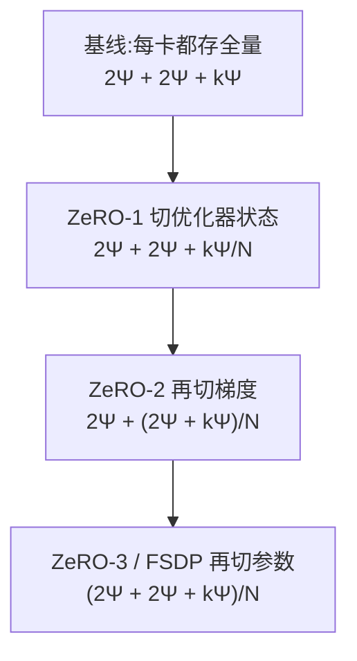

# Ultra-Scale Playbook:把「几千张卡怎么协同」写成一本可复现的账本

<!-- release-date: 2025-02-19 -->

> **本文依据**:HuggingFace 的 *The Ultra-Scale Playbook: Training LLMs on GPU Clusters*,原件是网页,访问日期 **2026-09-07**,地址见 [HuggingFace Space:nanotron/ultrascale-playbook](https://huggingface.co/spaces/nanotron/ultrascale-playbook)(正文实际托管在 该 Space 的静态页 `index.html`)。作者 Nouamane Tazi、Ferdinand Mom、Haojun Zhao、Phuc Nguyen、Mohamed Mekkouri、Leandro Werra、Thomas Wolf,机构 Hugging Face,页面标注发布日 2025-02-19。
>
> **版本必须先说清楚。** 网页原件会原地改动且不留版本号,本站保存的本地打印件生成于 2025-02-20,而线上版在我访问时已被编辑过——小节标题从 `High level overview` 改成了 `High-Level Overview`、`Diving in the GPUs – fusing, threading, mixing` 改成了 `Diving into the GPUs – Fusing, Threading, and Mixing`,并新增了整个 `Appendix`(A0–A3)。**本文一律以 2026-09-07 的线上版为准**,证据标注原文小节名而非页码。
>
> 本地打印件另有一个技术性问题,顺带记在这里:它是整页网页打印成的单页 PDF,尺寸 1133 × 102047 pt、20 万字符,没有任何可引用的页码锚点,整页渲染会得到一张几十米长、缩到看不清的图。所以这一篇没有走 PDF 路线。

## 先说清楚这是一份什么材料

它不是模型报告,也不是论文,而是一本**书**——原文自报「Reading time: 2-4 days」,并建议不要用手机读。全书 13 个一级章节、88 个标题、80 张图、8 张表、254 处公式,外加四个附录。

它和本库已收录的报告有一个根本差别:**报告讲「我们做了什么」,这本书讲「你该怎么做」**。它的证据不是某个模型的评测分数,而是一组基准实验:原文在前言里写明,在最多 512 张 GPU 上跑了 **4,100 多次分布式实验**(含测试跑超过 16,000 次),扫遍各种分布式布局与模型规模。

所以读它的正确姿势是:**把它当成一本带实测数据的操作手册,而不是一篇有新方法的论文。** 它几乎没有原创技术;它的价值在于把散落在十几篇论文和几个私有代码库里的东西,用一条连贯的叙事串起来,并且每一步都给了自家集群上的真实数字。

## 一句话结论与阅读路线

一句话:**分布式训练的全部工作,是在显存、计算效率、通信开销这三者之间反复换手;五个并行维度各自砍其中一项,代价是把另一项顶上去,而没有任何一维是免费的。**

原文在「High-Level Overview」一节把这三个约束摆得很干脆:

- **显存**是硬约束——一个训练步塞不进显存,训练就无法进行;
- **计算效率**要求硬件把大部分时间花在算上,而不是搬数据或等别的 GPU;
- **通信开销**要压到最小,手段是尽量用节点内的快带宽、并把通信和计算重叠起来。

建议这样读本文:先看第三节的显存账本(所有决策的起点)、再看四到八节的五个维度各砍什么、然后**重点看第九节的三步决策法与热力图**(全书最可操作的部分)、最后看第十一节的基准测试教训(全书最诚实的部分)。

## 全景:一个训练步的显存去了哪里

一切从这个问题开始:显存被谁吃掉了。原文「Memory usage in transformers」一节把它拆成四项——模型权重、梯度、优化器状态、以及**为反向传播保存的激活**。

前三项好算。参数量本身有闭式(原文「Memory for weights/grads/optimizer states」):

$$
N = h \cdot v + L \cdot (12h^2 + 13h) + 2h
$$

其中 $h$ 是隐藏维度、$v$ 是词表大小、$L$ 是层数。随着规模变大,$12h^2$ 那一项二次增长,会主导一切。

按字节算,FP32 全精度下参数 4 字节、梯度 4 字节、Adam 的动量与方差各 4 字节,合计 **16 字节/参数**。BF16 混合精度看起来该更省,但原文点破了一个反直觉的事实:

> **混合精度本身并不省显存**,它只是把显存重新分配到三个部件上;如果还要用 FP32 累积梯度,反而比全精度多出 4 字节。

它划算的原因是另外两条:半精度的前反向能用上 GPU 更快的低精度算子,以及**它压低了前向的激活显存**——而激活恰恰是大头。

换算成绝对量级(原文同节给了表):

| 参数量 | FP32,或 BF16 不做 FP32 梯度累积 | BF16 + FP32 梯度累积 |
|---|---:|---:|
| 1B | 16 GB | 20 GB |
| 7B | 112 GB | 140 GB |
| 70B | 1120 GB | 1400 GB |
| 405B | 6480 GB | 8100 GB |

**7B 就已经越过单张 H100 的 80 GB 了。** 顺带一个实用细节:CUDA kernel 本身要占 1–2 GB,这部分原文明说略去不计。

第四项激活才是真正会爆的:

$$
m_{act} = L \cdot seq \cdot bs \cdot h \cdot C
$$

其中系数 $C = 34 + 5 \cdot n_{heads} \cdot seq / h$,$L$ 是层数、$seq$ 是序列长度、$bs$ 是批大小、$h$ 是隐藏维、$n_{heads}$ 是头数。

读法:主项随 $seq$ 线性,而 $C$ 里还藏着一个 $seq$,所以**总体随批大小线性增长、随序列长度二次增长**。前三项与批大小、序列长度基本无关,而这一项在序列超过 2–4k 之后迅速成为最大头。这条不等式决定了后面所有维度的分工——谁在砍激活,谁在砍参数。

## 单卡上的两把刀:重计算与梯度累积

**激活重计算**(又叫梯度检查点)的做法是前向时扔掉一部分激活,反向时按需重算。原文「Activation recomputation」给了两档的代价:

- **全量**:在每个 Transformer 层的边界存一次,反向时等于多做一次完整前向,计算时间涨 **30%–40%**,「很明显能感觉到」;
- **选择性**:只丢弃那些「又大又便宜重算」的激活(注意力那部分正好符合),保留昂贵的前馈计算。原文引用重计算论文的结论——在 GPT-3(175B)上,**激活显存降 70%,计算代价只有 2.7%**。

这两个数字放在一起,基本就宣判了全量重计算的地位:除非显存实在紧张,否则不该用。原文还补了一句很有用的事实:**今天大多数框架用的 FlashAttention 已经原生集成了这种选择性重计算**——反向时重算注意力分数而不是存下来,所以很多人其实已经在用选择性重计算而不自知。

**梯度累积**则把一个批拆成多个微批依次前反向,梯度求和后再更新。它让全局批大小可以任意放大而显存不变,代价是多次串行的前反向拖慢训练。原文顺手把批大小的口径也定了:

$$
gbs = mbs \times grad\_acc
$$

以及一条行业现状:近期 LLM 的批大小甜点大约在**每批 4–60M token**。Llama 1 用约 4M token 的批训了 1.4T token,DeepSeek 用约 60M 训了 14T;DeepSeek-V3/R1 的批量在前 469B token 里从 3,072 条序列渐增到 15,360,之后保持不变。

原文这里埋了一个漂亮的过渡:梯度累积的各个微批**本来就是彼此独立的**,那为什么要串行做?于是数据并行登场——它只是梯度累积的并行版。

## 维度一:数据并行与 ZeRO

数据并行把模型复制到多卡,各自吃不同微批,反向后用 all-reduce 平均梯度。原文强调的重点不是这个人人都懂的定义,而是**三层优化**:

1. **通信与反向重叠**——最后一层的梯度算完就可以立刻开始 all-reduce,不必等整个反向结束。做法是给每个参数挂 hook;
2. **梯度分桶**——把梯度攒成桶再发一次,而不是每个张量发一次,因为大张量的通信效率高得多;
3. **与梯度累积的配合**——累积中间那几次反向不该触发同步,PyTorch 里用 `model.no_sync()` 关掉。

代价在规模上现形。原文给了自家集群的实测(「Data Parallelism」一节的吞吐曲线,横轴是 DP 度):

| DP | 8 → 16 | 16 → 32 | 32 → 64 | 64 → 128 | 128 → 256 |
|---|---:|---:|---:|---:|---:|
| 每卡吞吐降幅 | −6.3% | −6.0% | −12.0% | −15.0% | **−40.6%** |

而每卡显存**完全不降**——DP 增加多少张卡,单卡显存占用都一样。这就把两个结论钉死了:DP 只买吞吐不买显存,且它的边际收益在上百卡之后崩塌。

**ZeRO** 补的正是「不买显存」这个洞。它沿 DP 轴把优化器状态、梯度、参数依次切开:

这张图按原文「Zero Redundancy Optimizer (ZeRO)」一节的显存公式重画,是机制示意,不含实测数据。$\Psi$ 是参数量、$k$ 是优化器状态的字节倍数(Adam 为 12)、$N$ 是 DP 度。

有三处值得单独记:

- **激活切不了。** 原文明说:每个 DP 副本吃的是不同微批,激活天生就不重复,因此无从分片。ZeRO 解决不了激活爆炸,那是重计算和后面几个维度的活。
- **ZeRO-2 相对 ZeRO-1 几乎没有额外代价**,通信量一样(都是一次 reduce-scatter 加一次 all-gather),所以原文直接说「ZeRO-2 通常是更好的选择」。
- **ZeRO-3 的通信涨到 $3\Psi$**(前向 all-gather、反向 all-gather、梯度 reduce-scatter),而 ZeRO-2 是 $2\Psi$。它靠**预取**把这部分藏起来——算第 $n$ 层时 all-gather 第 $n+1$ 层的权重。但原文给了一条经验红线:**这种重叠只在 DP 不超过 512 时成立**。

## 维度二:张量并行与序列并行

TP 利用矩阵乘的分配律,把权重按列或按行切开。原文的讲法很清晰:列切需要把输入广播出去、结果 all-gather;行切需要把输入 scatter、结果 all-reduce。放进 Transformer 块里,前馈用「先列切后行切」最省(中间那次 all-reduce 可以跳过),注意力则天然沿注意力头切。

两条硬边界原文都写了:

- **TP 度不能超过注意力头数**,因为 QKV 投影是沿头维切的。用 GQA 时可以超过 KV 头数,但要自己保证 K/V 头在各卡间同步——原文举例 Llama-3 8B 有 32 个 query 头、8 个 KV 头,理论上 TP 可以到 32,但需要小心实现;
- **TP 的通信在计算的关键路径上**,藏不住。这与 ZeRO 不同,后者的通信可以靠预取重叠。

实测代价(原文「Tensor Parallelism」一节,3B 模型):

| TP | 2 → 4 | 4 → 8 | 8 → 16 | 16 → 32 |
|---|---:|---:|---:|---:|
| 纯 TP 吞吐降幅 | −10.8% | −12.2% | **−42.7%** | −65.6% |
| TP+SP 吞吐降幅 | −5.0% | −19.1% | **−43.4%** | −41.4% |

两行都在 8 → 16 那一格断崖。原因原文说得很直接:**那是从节点内 NVLink 走到跨节点网络的分界**。这条实测把一条工程惯例变成了数字——**TP 一般不跨节点,即 TP ≤ 每节点 GPU 数**。

**序列并行(SP)** 是 TP 的天然补丁。LayerNorm 和 dropout 需要完整的隐藏维,没法沿 $h$ 切,于是 SP 改沿序列维切它们。TP 区与 SP 区之间用一对共轭算子换手:前向进 TP 区是 all-gather、出 TP 区是 reduce-scatter,反向反过来。

原文澄清了一个很容易混的命名:**这里的「序列并行」与 TP 紧耦合、只管 dropout 和 LayerNorm;而长序列下切注意力的那种(Ring Attention)本书一律叫「上下文并行」**,两者不是一回事。

收益是最大激活尺寸从 $b \cdot s \cdot h$ 降到 $b \cdot s \cdot h / tp$。通信量呢?原文的回答很干净:**没变**——因为一次 all-reduce 本来就等于一次 all-gather 加一次 reduce-scatter。

## 维度三:上下文并行与 Ring Attention

TP+SP 之后还有两个洞:序列继续拉长时 TP 区内的激活还是会爆,以及模型大到 TP=8 装不下时会被跨节点带宽拖死。前者归上下文并行,后者归流水线并行。

CP 沿序列维切**整个模型**(而不只是 SP 区)。大部分模块(MLP、LayerNorm)逐 token 独立,切了没影响;唯一的例外是注意力——每个 token 要看到全序列的 K/V。

**Ring Attention** 的做法是让 K/V 在卡之间转圈:每一步先异步把自己的 K/V 发给下一张卡,同时用手上已有的 K/V 算注意力,算完正好收到上一张卡的 K/V,进入下一轮。

但朴素的环形有一个原文点名的问题:**因果掩码让负载严重不均**。softmax 按行算,持有前几个 token 的 GPU 立刻就能算完,持有后面 token 的要等好几轮;第一张卡的工作量远小于其他卡。**Zig-Zag Ring Attention** 的修法是不按顺序分配 token,而是让每张卡都拿到一些早 token 和一些晚 token,把彩色格子的数量摊平。

原文还给了两种重叠实现的对照:**all-gather 式**一次把所有 K/V 收齐,简单但临时显存大;**all-to-all(环形)式**一次只收一块,显存省但多几次通信的基础延迟。

## 维度四:流水线并行与气泡

先看一组决定性的实测。原文在「Pipeline Parallelism」开头给了自家集群 256MB all-reduce 的跨节点带宽:

| 节点数 | 1 | 2 | 4 | 8 | 16 | 32 | 64 |
|---|---:|---:|---:|---:|---:|---:|---:|
| 带宽(GB/s) | 436.0 | 361.7 | 160.1 | 99.6 | 84.7 | 64.9 | 32.9 |

**从 1 节点到 64 节点掉了 13 倍。** 这条曲线是后面所有「什么该跨节点、什么不该」的物理依据。

PP 把层切到不同卡上,好处是**只在少数几个位置传激活**,带宽需求远低于 TP。坏处是天然串行,产生「气泡」。原文把气泡量化得很清楚:

朴素做法下,气泡与理想时间之比是

$$
r_{bubble} = \frac{(p-1)(t_f+t_b)}{t_f+t_b} = p-1
$$

拆成 $m$ 个微批后(AFAB 调度):

$$
r_{bubble} = \frac{p-1}{m}
$$

再把每张卡的层交错成 $v$ 个块(interleaved):

$$
r_{bubble} = \frac{p-1}{v \cdot m}
$$

代价是通信量也涨 $v$ 倍。原文给了 PP=8 下各种 $(m, v)$ 组合的气泡值,从 $m=1,v=1$ 的 7.00 一路降到 $m=32,v=8$ 的 **0.03**。

调度的演进链条很清楚:

这张图按原文「Pipeline Parallelism」下四个小节的顺序重画,是演进示意,不含时间比例。

其中两处值得记住:

- **1F1B 不减小气泡,它减小显存。** 原文说得很明白:气泡还是同样大,但只需要存 $p$ 个微批的激活而不是 $m$ 个。省下的显存可以换更多微批,那才间接减小了气泡。
- **零气泡的关键洞察**是:矩阵乘的反向其实是两个独立操作——对输入求梯度($B$)和对权重求梯度($W$)。$B$ 必须尽快做完好让下层继续,$W$ 却只要在优化器步之前做完就行。于是 $W$ 可以被灵活地塞进气泡里。DeepSeek-V3 的 **DualPipe** 是这个思路的扩展,再叠加从流水线两端同时推进的双流。原文也老实说了:完全优化这类调度要测量各个细粒度操作的耗时并求解一个整数线性规划,复杂到无法给代码片段。

还有一条对选型极重要的实测:**微批数较少时,PP 从 1 节点扩到 2 节点只掉 14%,而 TP 在同样的跨节点场景下通常掉约 43%。** 这解释了为什么跨节点优先用 PP 而不是 TP。

## 维度五:专家并行

EP 是全书最短的一节,原文自己也说「我们打算之后在 Picotron/Nanotron 里补一个更完整的例子」。要点只有三条:

- MoE 的各专家前馈层完全独立,直接把不同专家放到不同卡上即可,**比 TP 轻得多**——不用切矩阵乘,只要把 token 路由到对的专家;
- **EP 必须和 DP 一起用**。因为 EP 只影响 MoE 层、不切输入 token,单用 EP 会让所有非 MoE 块做重复计算;
- 路由要设约束。原文举例 DeepSeek-V3 限制每个 token 最多发到 4 个节点,把 token 尽量留在单节点内以压低通信;DeepSeek-V3 用了 256 个专家。

## 五维合起来:PP 与 ZeRO-3 到底差在哪

这是原文「5D Parallelism in a Nutshell」最有价值的一段。PP 和 ZeRO-3 表面上都在沿模型深度切分并沿深度做通信,但:

| | ZeRO-3 | 流水线并行 |
|---|---|---|
| 每个计算单元存的是 | 一层的一部分 | 完整的一层 |
| 通信传的是 | **权重** | **激活** |
| 编排 | 与模型无关 | 与模型无关 |
| 实现难点 | 分片与通信 | 高效调度 |
| 扩展偏好 | 需要大 $mbs$ 和 $seq$ 来藏通信 | 需要大 $m$ 来藏气泡 |

**这一行「通信传权重还是传激活」是选型的分水岭。** 原文的结论是两者可以结合但实践中很少这么做,因为要显著加大全局批才能摊薄通信成本;真要合用,应让 ZeRO-3 在一串 PP 微批期间把权重留在显存里。而 ZeRO-1/ZeRO-2 与 PP 是互补的、可以放心叠——**DeepSeek-V3 用的就是 PP 加 ZeRO-1**。

全书把五个维度的分工压成了一张表(原文「Summarizing it all」):

| 方法 | 省的是哪部分显存 | 切分维度 | 主要代价 |
|---|---|---|---|
| DP | 激活(靠减小本地批) | 批 | 受最大批大小限制 |
| PP | 模型参数 | 模型层 | 气泡与复杂调度 |
| TP+SP | 参数与激活 | 隐藏维 / 序列 | 需要高带宽通信 |
| CP | 激活 | 序列 | 注意力里多出通信 |
| EP | 专家参数 | 专家 | 需要 MoE,多出路由通信 |
| ZeRO-1/2/3 | 优化器态 / +梯度 / +参数 | 沿 DP 分片 | 参数通信开销 |

## 怎么选:三步法与那张热力图

原文「Finding the Best Training Configuration」给的是一套可照做的决策流程:

**第 1 步,先把一个训练步塞进显存。** 卡多的情况下:10B 以下用单一维度即可(比如 TP 或 ZeRO-3 配全量重计算跑满 8 卡);10B–100B 需要超过 8 卡,可选 TP=8 配 PP、TP=8 配 ZeRO-3、或纯 ZeRO-3。**512 卡以上纯 ZeRO-3 开始因通信而低效**,该叠 TP 或 PP;**1024 卡以上推荐 TP=8 + ZeRO-2 + PP**。长序列另加 CP,MoE 另加 EP。卡少的情况下:开全量重计算、加梯度累积。

**第 2 步,把全局批大小顶到目标。** 不够就加 DP 或加累积步(长序列可用 CP);超了就反过来减。

**第 3 步,压吞吐。** 先把 TP 加到接近单节点卡数(吃满节点内带宽),再用 ZeRO-3 加 DP,DP 通信成为瓶颈后转 PP,最后逐个维度试并调微批大小。

然后是全书最硬的一张图。原文在 1–64 个节点(每节点 8 张 H100)上,以序列长 4,096、全局批 1M token 跑遍配置,把每个「模型规模 × 节点数」的最优结果画成热力图。**以下数字是我从该图中逐格读出的,原文没有给对应的数值表**:

| 节点数 \ 模型 | 1.34B | 3.57B | 8.86B | 80.0B |
|---|---|---|---|---|
| 1 | 44.32 / 41.76GB | **46.68** / 56.87GB | 45.22 / 63.07GB | 装不下 |
| 2 | 41.59 / 19.45GB | 43.77 / 54.31GB | 43.94 / 58.34GB | 装不下 |
| 4 | 38.38 / 16.39GB | 40.39 / 53.33GB | 43.31 / 61.10GB | 14.76 / 65.97GB |
| 8 | 32.47 / 16.27GB | 35.53 / 36.73GB | 39.50 / 59.09GB | 30.65 / 63.07GB |
| 16 | 29.46 / 38.84GB | 34.59 / 66.20GB | 36.33 / 66.88GB | 34.29 / 61.18GB |
| 32 | 23.20 / 19.57GB | 26.77 / 38.98GB | 32.71 / 63.39GB | 30.75 / 64.21GB |
| 64 | **5.25** / 8.40GB | 10.49 / 16.42GB | 18.69 / 57.76GB | 17.79 / 53.46GB |

(每格为 MFU% / 每卡显存)

这张表讲了三件事,原文也逐条点了出来:

1. **节点数越多效率越低,小模型尤其惨。** 1.34B 从单节点的 44.32% MFU 掉到 64 节点的 5.25%。原因是小模型的「计算量 / 模型大小」比值低,本来该靠加大批来补,但全局批被 1M token 的上限卡死了;
2. **大模型是另一种困境。** 80B 在 1–2 节点上根本装不下,在 4 节点上虽然装下了却只有 14.76% MFU——因为贴着显存上限跑;
3. **性能高度依赖实现质量。** 原文很坦率:他们最初实现时 TP 快过 PP,把 PP 代码优化之后 PP 反超;而当时正在改进 TP 的通信重叠,预期 TP 会再夺回优势。**换句话说,这张图测的是「这份代码在这个集群上」,不是「这些方法本身」。**

配套的最优配置图(同一张图的右半)也能读出清晰的模式:小模型在少节点上偏好 `TP=1、PP=2、ZeRO-1` 加高梯度累积;中等模型在多节点上偏好 `TP=4–8、PP=1、ZeRO-0/1`;而 80B 一律靠重流水线(PP 16–32)配 TP=4–8,梯度累积高达 256。**具体格子的数字我不逐个转录,因为该图分辨率下部分位数无法确证。**

## 下到 GPU:kernel、FlashAttention 与低精度

最后一大章从「怎么摆放计算」下沉到「每个算子怎么跑」。

**GPU 的层级结构**先立住:H100 有 132 个 SM、每个 SM 128 个核,合计 16,896 个核;显存侧从寄存器、共享内存/L1、L2 一路到全局显存,越大越慢。原文给了一条很实用的工具阶梯:

> PyTorch:简单但慢 → `@torch.compile`:简单、快,但不灵活 → Triton:更难、更快、更灵活 → CUDA:最难、最快、最灵活(前提是你写对了)

**三个 CUDA 优化技巧**给了实测:

- **内存合并**(让一个 warp 里的 32 个线程访问连续地址):把朴素矩阵乘的 2D 块换成 1D 块并重算坐标之后,显存吞吐涨约 **10 倍**,kernel 耗时降到 **1/10**;
- **Tiling**(把分块搬进共享内存复用):显存吞吐到 410 GB/s,耗时再降约 **43%**,达到约 6.6 TFLOPS;
- **线程粗化**:tiling 之后 warp 卡在等共享内存,把多个线程合并成一个「粗线程」来减少共享内存访问次数。

**FlashAttention** 被原文称作「kernel 工程的杰作」。它的核心不是改数学,而是**不把 $S = QK^T$ 和 $P = \text{softmax}(S)$ 这两个大矩阵物化到 HBM**,而是分块在 SRAM 里算、只保留 softmax 归一化所需的统计量。原文点出了它的一个后果,值得单独记:

> 所有线性注意力与次二次近似方案(Transformer 出现后不久就有了),大多因为这个**精确且快**的实现而被搁置。

FA-2 与 FA-3 的改进则不在注意力机制本身,而在更贴硬件:减少非矩阵乘操作、在 warp 与线程块之间更好地划分工作(FA-2)、以及针对 Hopper 的 FP8 与 Tensor Core 优化(FA-3)。

**混合精度**部分先摆格式表:

| 格式 | 总位数 | 符号 | 指数 | 尾数 |
|---|---:|---:|---:|---:|
| float32 | 32 | 1 | 8 | 23 |
| float16 | 16 | 1 | 5 | 10 |
| bfloat16 | 16 | 1 | 8 | 7 |
| float8(e4m3) | 8 | 1 | 4 | 3 |
| float8(e5m2) | 8 | 1 | 5 | 2 |

关键对照是:**bfloat16 保住了 float32 的动态范围,代价是精度**。原文用一个很直观的实验说明——在 $[1, 2]$ 区间里取 1 万个点,看每种格式能表示多少个不同的数:**e4m3 只有 7 个,e5m2 只有 3 个**。

FP16/BF16 训练能稳住,靠的是原始混合精度论文的三招:权重保一份 FP32 主副本、损失缩放(防梯度下溢)、以及在 FP32 里做累加。

**FP8 预训练**的动机是硬件红线:H100 上 FP8 的矩阵乘理论 FLOPS 是 BF16 的 **2 倍**。但原文明说它的问题是**稳定性**,并给了一条典型的发散 loss 曲线。首个公开报告的大规模 FP8 混合精度训练是 DeepSeek-V3,做法是逐个分析前向、对激活求梯度、对权重求梯度三条路径,并引入**分块量化**——输入与激活按 1×128、权重与缩放元素按 128×128 归一化,让离群值不至于毁掉整块的精度。

各家方案的显存账(原文表):

| 方案 | GEMM 精度 | 总字节/参数 |
|---|---|---|
| BF16 + FP32 混合精度基线 | BF16 | 20 |
| 同上但不做 FP32 梯度累积 | BF16 | 16(−20%) |
| Transformer Engine | FP8 | 16(−20%) |
| FP8-LM 的 O3 档 | FP8 | **9(−55%)** |
| DeepSeek-V3 | FP8 | 15(−25%) |
| Nanotron 的 FP8 | FP8 | 10(−50%) |

原文对 FP8 的定性很克制:**截至 2025 年初仍是实验性技术**,方法仍在演进,但因收益明显,很可能会成为标准并取代 BF16 混合精度。它还预告了 Blackwell 将支持 FP4 训练,「毫无疑问会带来新的稳定性挑战」。

## 全书最诚实的一段:基准测试的教训

原文「Lessons learned on benchmarking」把跑这几千次实验的狼狈写了出来,这在同类材料里很少见:

- PyTorch 进程有时不能正确清理;
- Slurm 会强制终止作业,导致节点故障;
- 本该几分钟的简单基准会拖成几小时;
- 有些作业会无限期挂起。

为了在有限时间内跑完,他们额外花了大量精力在:压缩集群重启时间与空闲时间、分析 NCCL 调试日志、理解显存使用模式与 CUDA 显存分配器行为、以及改进多节点上的 PP 性能。原文的总结是一句很朴素的话:「**理论上看起来简单的事,实践中往往需要照顾很多活动部件。**」

他们还顺带向同事道了个歉——因为占用了科研集群的大部分资源。

## 这本书没有写的东西

按契约点名,以下内容原件确实没有:

- **没有模型质量结论。** 全书只谈吞吐、显存与 MFU,完全不涉及某种并行配置是否影响收敛或最终效果;
- **没有集群硬件的完整规格。** 只知道是 8×H100 的节点、跨节点走 EFA,没有给网络拓扑、交换机层级或具体 SKU;
- **没有成本数字。** 没有 GPU 小时、没有电费、没有折算美元;
- **没有 EP 的实现与实测。** 这一节只有两页概念,原文自认待补;
- **没有 CP 的吞吐基准。** CP 一节只给了显存曲线,没有像 DP/TP/PP 那样的吞吐降幅实测;
- **没有零气泡与 DualPipe 的代码或复现。** 原文明说这类调度太复杂,不给代码片段;
- **没有热力图对应的数值表。** 上面那张表是我逐格读图得到的;
- **没有 FP4。** 只在结尾提了一句 Blackwell 会支持。

另外有一处内在限制值得点破:**全书的基准都固定在序列长 4,096、全局批 1M token**。这两个数一变,热力图的结论未必成立——而原文自己也说了,小模型在多节点上效率崩塌的原因正是被 1M 这个上限卡住。

## 哪些结论有实测支撑,哪些只是经验

**有自家集群实测支撑的:**

- DP、TP、TP+SP、PP 各自的吞吐降幅曲线,以及跨节点带宽随节点数的衰减;
- 跨节点场景下 PP(掉 14%)优于 TP(掉约 43%);
- 热力图里 1–64 节点 × 四个模型规模的 MFU 与显存;
- 三个 CUDA 技巧的加速倍数(10 倍吞吐、43% 耗时、6.6 TFLOPS)。

**引自他人工作、原文未复现的:**

- 选择性重计算在 GPT-3 175B 上「显存降 70%、计算涨 2.7%」——来自重计算论文;
- FP8 各方案的字节账——来自 Transformer Engine、FP8-LM、DeepSeek-V3 各自的报告;
- DeepSeek-V3 的 DualPipe、分块量化、每 token 至多 4 节点的路由约束——来自其技术报告。

**属于工程经验、没有实验隔离的:**

- 「DP 不宜超过 512」这条预取重叠的红线;
- 三步决策法里 512+ / 1024+ 那两个门槛;
- 「TP 不跨节点」——虽然有断崖实测支持,但门槛值本身依赖具体网络。

**最需要打折的一条**,是原文自己说破的:PP 与 TP 谁更快取决于他们各自的实现成熟度,而且在书写作期间就已经翻转过一次。

## 可以带走的六条

### 1. 先建显存账本,再谈并行

四项占用里只有激活是随批大小和序列长度爆炸的,而且是二次项。任何并行方案的第一个问题都该是「它砍的是四项里的哪一项」——DP 砍不了参数,ZeRO 砍不了激活,PP 砍不了激活,TP+SP 两样都砍一点。**搞错了要砍的对象,加多少卡都没用。**

### 2. 通信在不在关键路径上,比通信量大小更重要

ZeRO-3 的通信量($3\Psi$)比 TP 大,但它能靠预取藏起来;TP 的 all-reduce 量不大却卡在前向的关键路径上,藏不住。**评估一个方案时先问「这次通信能不能和计算重叠」,再问「它有多少字节」。**

### 3. 硬件的物理边界会直接印在曲线上

TP 在 8 → 16 的断崖、PP 跨节点只掉 14%、带宽从 436 掉到 32.9 GB/s——这三条都是同一个事实的不同侧面:**节点内和节点间是两个世界**。所有并行分组的第一原则是把高频通信关在节点内。

### 4. 拆开一个操作,往往能找到调度自由度

零气泡的全部洞察就是:反向传播其实是两个操作,其中一个($W$)没有下游依赖,可以任意挪动。**遇到「这一步必须等那一步」的时候,先确认它真的是一个原子操作。**

### 5. 省下来的显存要换成别的东西

1F1B 本身不减小气泡,它减小显存;而省下的显存换成更多微批,才真正减小了气泡。**优化很少是一步到位的,通常是「A 省出资源 → 资源投给 B → B 产生收益」这样的两跳。**

### 6. 基准数据要连实现质量一起报

原文最有价值的自我限定是承认 PP 反超 TP 是因为他们优化了 PP 的代码。**任何「方法 A 比方法 B 快」的结论,都应该附上「在谁的实现上」。**

## 关键词回看

- **MFU 与 HFU**:HFU 把重计算的额外运算也算进 FLOPs,反映硬件真实做了多少;MFU 只算模型前反向必需的运算,更能跨实现比较。原文建议关注 MFU。
- **激活重计算**:前向丢弃、反向重算。全量代价 30%–40%,选择性只要 2.7%。
- **ZeRO-1/2/3**:沿 DP 轴依次切优化器状态、梯度、参数;ZeRO-3 即 PyTorch 的 FSDP。
- **序列并行 vs 上下文并行**:前者与 TP 紧耦合、只管 LayerNorm 与 dropout;后者独立使用、靠 Ring Attention 切注意力。
- **Zig-Zag Ring Attention**:打乱 token 到卡的分配,消除因果掩码造成的负载不均。
- **气泡比**:朴素 $p-1$,分微批后 $(p-1)/m$,再交错后 $(p-1)/(v \cdot m)$。
- **零气泡 / DualPipe**:把反向拆成对输入求梯度与对权重求梯度,用后者填气泡。
- **内存合并 / Tiling / 线程粗化**:三个 CUDA kernel 优化手段,分别针对全局显存访问模式、共享内存复用、共享内存访问次数。
- **分块量化**:FP8 下按 1×128(激活)与 128×128(权重)分块归一化,削弱离群值的影响。

## 最后的判断

这本书的价值不在于任何一项技术——里面几乎没有原创方法。它的价值在两件别人不做的事上:**把五个并行维度放在同一条叙事里讲清楚彼此的取舍关系**,以及**把自家集群上四千多次实验的真实数字摊开**,包括那些不好看的(1.34B 在 64 节点上只有 5.25% MFU、80B 在 4 节点上只有 14.76%)。

它最该被引用的一段不是任何一个技术小节,而是「Lessons learned on benchmarking」——因为它把「跑基准」这件事从一句轻描淡写的方法论,还原成了一堆进程清理、Slurm 杀作业和 NCCL 日志。任何打算自己做扩展实验的人,应该先读那一段再排期。

它最需要警惕的地方也在同一处:**所有曲线都是「这份代码在这个集群上」的结果**,而原文自己就记录了一次 PP 与 TP 的排名翻转。把这些数字当作量级参考可以,当作方法优劣的判决则不行。

如果只带走一句话:

> **分布式训练没有免费的维度。每加一维并行,你都在用一种资源换另一种;真正的工作是先算清账本,再决定这一次要卖掉什么。**

## 资料与阅读边界

- **原始依据**:*The Ultra-Scale Playbook: Training LLMs on GPU Clusters*,HuggingFace,页面标注发布日 2025-02-19。原件是网页,**访问日期 2026-09-07**,地址见 [HuggingFace Space:nanotron/ultrascale-playbook](https://huggingface.co/spaces/nanotron/ultrascale-playbook),正文托管于 该 Space 的静态页 `index.html`。全文取自该页 `d-article` 元素,约 18.5 万字符;公式取自页面的 254 个 `d-math` 元素(其中 25 个块级),因为它们不出现在纯文本抽取里。
- **版本说明**:网页会原地改动且不留版本号。本站保存的本地打印件生成于 2025-02-20,与本次访问的线上版存在差异(小节标题措辞、新增 `Appendix` A0–A3),**本文一律以线上版为准**。若日后线上版再变,应以新的访问日期重新核对。
- **`release-date` 依据**:取页面自报的 **2025-02-19**。这是一本书而非模型,按流程取该材料首次官方公开日;后续的原地改稿不回写此日期。
- **链接跟进**(按流程第八条,均已验证可达):
  - **前作**:本书自称是三部曲的第二部,前作是处理预训练数据的 [FineWeb 博文](https://huggingface.co/spaces/HuggingFaceFW/blogpost-fineweb-v1);第三部(数据配比与架构选择)在写作时尚未发布。
  - **配套代码**:[Picotron](https://github.com/huggingface/picotron)(教学用,单文件自包含实现)与 [Nanotron](https://github.com/huggingface/nanotron)(Hugging Face 的生产训练代码库)。原文的 DP 重叠、分桶、AFAB、1F1B 等实现均链向这两处。
  - 页面模板来自 [distill.pub](https://distill.pub/)。
- **本文中属于「我们的读数或解读」而非原文结论的部分**,均已在正文就地标注,包括:热力图那张 MFU / 显存表(逐格读自原文图,原文未给数值表)、最优配置的模式归纳(部分格子的位数在该分辨率下无法确证,故只述模式不逐格转录)、以及对「1F1B 省的是显存不是气泡」这类因果关系的复述性解释。
- **本文没有做的事**:没有复现任何基准,没有核对 Picotron / Nanotron 的源码实现是否与书中描述一致(那属于开源解读模块的职责),也没有跟进书中引用的每一篇原始论文——涉及它们的结论一律标注为「原文引自某工作」。
