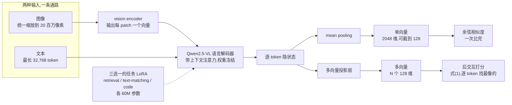
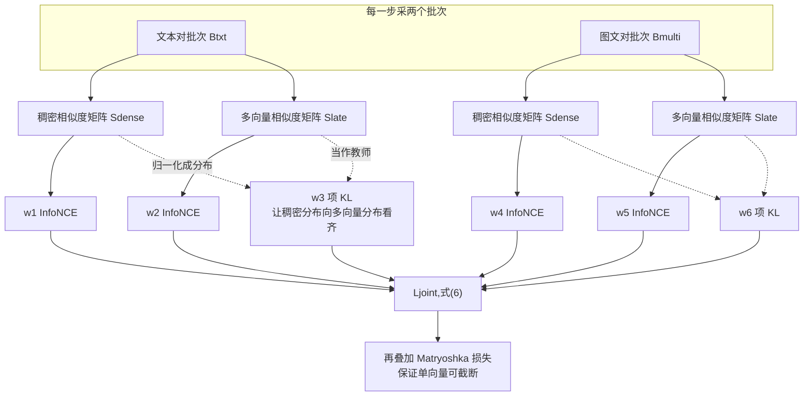

# jina-embeddings-v4：一个 VLM 怎样同时当稠密检索器、多向量检索器和代码检索器

<!-- release-date: 2025-05-07 -->

> 本文依据 **jina-embeddings-v4: Universal Embeddings for Multimodal Multilingual Retrieval**，即 arXiv:2506.18902v3（2025-07-07 提交，本地原件 21 页）的版本，作者署名机构为 Jina AI GmbH（PDF p. 1）。下文括号中的 `PDF p. N` 指这份 21 页原件的 PDF 物理页码。文中区分「报告明确写了什么」「我的理解是」和「外部资料补充」三类。

## 阅读前的最小词汇表

这篇报告站在检索这条线上，先把八个词说成人话：

- **Embedding 模型（向量表征模型）**：把一个对象（一段文字、一张图、一段代码）映射成一个向量，让「语义接近」变成「距离接近」。检索时把候选文档全部编码存好，查询时只编码一次，再比距离。
- **稠密向量（single-vector / dense embedding）**：整个输入压成**一个**向量。比一次余弦相似度就能排序，索引便宜、查询快，代价是把几千个 token 的信息硬塞进一个向量。
- **多向量表征（multi-vector embedding）与 late interaction（后交互）**：不压成一个向量，而是**每个 token 留一个向量**。查询和文档比对时不是一次点积，而是按式（1）那种「每个查询 token 去找文档里最像它的那个 token」再求和的方式打分（PDF p. 3）。名字里的「后」是指：两个序列各自编码完、**最后**才交互。精度通常更高，代价是存储和计算都翻几十倍。
- **ColBERT 与 ColPali**：后交互范式的两个代表。ColBERT 做纯文本，ColPali 把文档页面截图当输入，同样输出每 token 一个向量（PDF p. 2、p. 4）。jina-embeddings-v4 明确说自己的多向量输出「与 ColBERT、ColPali 产生的未池化表征直接可比」（PDF p. 4）。
- **交叉编码器（cross-encoder）与重排器（reranker）**：第三种打分方式——把查询和文档**拼在一起**送进模型，让注意力在两者之间充分来回，再输出一个相关性分数。它比后交互更精细，但每个候选都要跑一次完整前向，只能用在「先粗召回、再精排几十条」的位置上。
- **LoRA 适配器（Low-Rank Adaptation）**：不动原有权重，只在若干层旁边加一对低秩小矩阵。训练时只训小矩阵，推理时按需要挂上哪一副。报告里一副适配器 60M 参数（PDF p. 3、p. 4）。
- **Matryoshka 表征学习（MRL，套娃式表征）**：训练时让「向量的前 128 维、前 256 维……一直到前 2048 维」各自都尽量可用，于是同一个向量可以按需截断，报告说截到 128 维只损失很少精度（PDF p. 4）。
- **nDCG@10 与 Recall@5**：两个排序指标。nDCG@10 看前 10 条排得对不对（越高越好），Recall@5 看前 5 条里捞到正确答案的比例。STS（语义文本相似度）任务用的是 Spearman 相关系数，衡量模型打的分和人工标注分数的秩相关（PDF p. 9 表注）。

## 先说矛盾：一套检索系统为什么要挂四个模型

一个真实的「搜图 + 搜文档 + 搜代码」系统，2024 年的标准配法是四到五个模型：

- 搜自然语言段落，一个文本 embedding 模型；
- 搜照片和图的语义，一个 CLIP 这类双塔模型；
- 搜「长得像网页截图、报表、扫描件」的视觉文档，又一个模型（ColPali 那条线）；
- 搜代码，再一个专用模型；
- 想要更高精度，最后再挂一个后交互或者交叉编码的精排器。

报告在背景一节把「特化」这件事的维度列了一遍：模态可以特化、域可以特化（代码、法律）、任务可以特化（检索、聚类、分类）、连输出形态都能特化（单向量还是多向量）（PDF p. 2）。报告给的事实是一句很平的话：**单个模型只支持它被设计和训练时的那些模态**（PDF p. 2）。我的理解是，把这句话和上面那四个维度放在一起读，结论就是这些特化方向彼此独立，而业界一直在为每一个方向单独训一个模型。

这套配法有两个具体的病灶，报告各点了一处。

**病灶一：双塔模型有「模态鸿沟」。** CLIP 那种「文本一个塔、图像一个塔、训练时对齐」的结构，会让跨模态匹配对在向量空间里离得比同模态的相似对还远——两段语义无关的文本之间的余弦相似度，可能高过一段文本和它真正对应的图片（PDF p. 3、p. 10）。报告第 8 节专门用实验展示这件事：OpenAI CLIP 的跨模态对齐分数只有 0.15 到 0.20，jina-clip-v2 是 0.32 到 0.38（PDF p. 11，Table 4）。

**病灶二：后交互虽准，但账很贵。** 报告直接承认，后交互「通常是更精确的语义相似度度量，但存储和计算成本显著更高」（PDF p. 2）。一个文档不再是 1 个向量而是 $N$ 个向量，$N$ 与输入 token 数成正比（PDF p. 4）。

于是这篇报告的立论方式很清楚：**不是再做一个更好的特化模型，而是让一个模型同时覆盖上面那些格子，并且把「贵的那种用法」做成用户可选项而不是默认负担。** 报告的原话是，这种单模型方案相对为不同任务和模态部署多个模型，在实践中带来显著节省（PDF p. 2）。

我的理解是，这个立论里最容易被低估的一条是**它选择用 VLM 而不是双塔当底座**。这不是「换个更强的骨干」这种性能动机，而是结构动机：只有让图像和文本走同一条通路，模态鸿沟才可能从根上少掉，而第 8 节的实验正是冲着这一点去验证的。

## 一句话结论

jina-embeddings-v4 是一个 **3.8B 参数的多模态 embedding 模型**，底座是 Qwen2.5-VL-3B-Instruct，骨干权重冻结，上面挂**三副任务专用 LoRA 适配器**（各 60M 参数），并且**一次前向可以同时产出两种形态的表征**（PDF p. 1、p. 3、p. 4）：

- **单向量**：2048 维，用 mean pooling 得到，可用 Matryoshka 截到 128 维；
- **多向量**：每个 token 一个 128 维向量，走 ColBERT 式后交互打分。

规格上的硬数字（PDF p. 3，Table 1）：文本输入最长 **32,768 token**，图像**全部缩放到 20 百万像素**（原文 `All images resized to 20 megapixels`），参数量 3.8B 加每副 LoRA 的 60M。

它同时交出了三样东西：一个模型、一套新基准（**Jina-VDR**，在 ViDoRe 之外新增 30 个任务，语种最多到 20 种，PDF p. 7、p. 8）、以及一份横跨 9 个榜单的成绩表（PDF p. 9，Table 3）。

如果只记一句：**这篇报告真正的技术主张不是「精度更高」，而是「一个冻结的 VLM 骨干，靠 60M 的适配器和一个投影层，就能同时当稠密检索器、后交互检索器、代码检索器和跨模态检索器用」——而它在英文纯文本检索上并没有打赢自己上一代。** 后半句是报告表格里的既有事实，见「实验：它输在哪里」。

## 这篇怎么读

这份 21 页原件的正文只有 11 页，剩下 10 页是参考文献和附录表格（PDF p. 12–21）。给一条路线：

- **只想知道它是怎么搭的**：读「全景」「统一多模态主干」「双模式输出」「三个 LoRA 适配器」四节。全部架构内容集中在原文第 4 节，两页纸（PDF p. 3–5）。
- **想复现训练**：读「训练」和「数据」两节。要提前有心理准备——**报告给了损失函数的完整形式，却没给 LoRA 的秩、目标模块、batch size、学习率和训练时长**，recipe 是半公开的。
- **想知道它到底多能打**：读「实验：它赢在哪里」和「实验：它输在哪里」。这两节合起来才是 Table 3 与附录十六张表的完整读法。
- **想拿它做系统设计参考**：读「效率」「代价与边界」「可迁移启发」。

需要提前建立的预期：**这是一份「模型 + 基准」双主角的报告，其中基准那半的篇幅和严谨度都不输模型那半**，而且基准是自家模型的评价场，读成绩时要把这层关系记住。

## 全景：共享主干，两种收法

这张图按报告 Figure 1（PDF p. 4）与 Table 1（PDF p. 3）重画，**是机制示意，不含任何实测时间或吞吐数据**。

三个要点，接住了后面所有细节：

1. **只有一条主干。** 图像不是走「另一个塔」，而是先被 vision encoder 变成一串向量，再当作「一串已经向量化好的 token」喂给语言模型。报告的原话是：图像嵌入模型在这里充当语言模型的**预处理器**，把图像转换成实质上的「图像 token」序列（PDF p. 3）。
2. **两种输出共享同一次前向。** 分叉发生在最后：走 mean pooling 得单向量，走投影层得多向量。骨干、LoRA、注意力全部共用（PDF p. 4，Figure 1）。
3. **任务切换靠换适配器，不靠写提示词。** 三副 LoRA 各自对应一类任务，骨干权重全程不动（PDF p. 4–5）。

## 统一多模态主干：图像是「另一种 token」，不是「另一个塔」

### 旧问题：对齐两个塔，不如只有一个塔

CLIP 式双塔的做法是：文本一个 transformer、图像一个 transformer，两边各自编码，训练时把语义相近的图文对拉近（PDF p. 3）。这套结构在零样本分类和跨模态检索上很成功，但它有一个结构性后果：**两个塔各自有各自的表示习惯**，训练只是在两套坐标系之间搭一座桥。

报告引用 Liang et al. 的工作指出，正是这种「分开编码再对齐」的结构带来了模态鸿沟；而 Jiang et al. 的工作显示 VLM 式结构的模态鸿沟更小（PDF p. 2、p. 10）。

### 新设计：把图像编码器降级成「预处理器」

jina-embeddings-v4 的做法是走 Qwen2.5-VL-3B-Instruct 那条路，报告称其为「真正多模态的单处理通路」（PDF p. 3）：

- 文本照旧：分词 → 查表得到 token 向量 → 送进语言模型；
- 图像：先由 **vision encoder** 转成 token 序列，然后**和文本 token 一起**送进同一个语言模型解码器，由带上下文注意力的层联合处理（PDF p. 3）。

报告特意强调：图像编码器「确实是一个独立的图像模型，但用法不同」——它输出的是一个**多向量结果**，形式上和后交互模型的输出同类，然后被语言模型当作「一串已经向量化的文本 token」接住（PDF p. 3）。

这说明一件挺有意思的事：**在这套架构里，后交互表征不是外挂的第二功能，而是图像进入语言模型的必经形态。** 图像必须先变成多向量，才能进 LLM；而 LLM 输出的隐状态又被第二次投影成多向量。多向量在这条链路上出现了两次，作用完全不同——一次是「图像的 token 化」，一次是「可检索的表征」。报告没有把这层对称性讲出来，这是我从 Figure 1（PDF p. 4）读出来的。

### 收益：模态鸿沟被实测压掉了

报告第 8 节用三组实验验证这件事，这也是全文机制解释最扎实的部分。

**其一，配对余弦相似度的分布。** Figure 2（PDF p. 10）把 OpenAI CLIP、jina-clip-v2 和 jina-embeddings-v4 在 Flickr8K 上的「图文配对相似度分布」与「文文配对相似度分布」并排画出来。报告的说法是：jina-embeddings-v4 由于跨模态共用的编码器，鸿沟被显著缩小（PDF p. 10）。

**其二，跨模态对齐分数。** Table 4（PDF p. 11）在 Flickr30K、MSCOCO、CIFAR-100 各随机取 1000 个样本，算配对图文的平均余弦相似度：

| 模型 | Flickr30K | MSCOCO | CIFAR-100 |
|---|---:|---:|---:|
| OpenAI-CLIP | 0.15 | 0.14 | 0.20 |
| jina-clip-v2 | 0.38 | 0.37 | 0.32 |
| jina-embeddings-v4 | **0.71** | **0.72** | **0.56** |

分数翻倍以上。报告还主动给了一个不好听的注脚：CIFAR-100 上只有 0.56，明显低于另外两个数据集，原因是 CIFAR-100 是分类数据集，标签的信息量远不如 MSCOCO 和 Flickr30K 的描述性文本（PDF p. 11）。我的理解是，这一句很关键——**它说明这个分数同时也在测标注质量，不纯是模型能力**，读者不该把 0.71 当成「跨模态检索精度」。

**其三，锥体效应（cone effect）。** 报告引 Liang et al. 的说法：对比学习会让每个模态各自聚成一团，跨模态配对于是被拉成一个高维锥体，而不均匀地铺满整个空间。Figure 3（PDF p. 11）比较「正确配对」与「错误配对」的余弦相似度分布：OpenAI CLIP 两者差别很小，jina-clip-v2 明显拉开，jina-embeddings-v4 则「相似度跨度大得多、正负峰分得很开」（PDF p. 11）。报告的解读是：这说明它用掉了更多的嵌入空间（PDF p. 11）。

**代价与边界**：这三组实验比的是**表示空间的几何性质**，不是检索精度。空间铺开、正负峰分开，通常意味着阈值更好定、召回更稳，但报告没有给「几何改善 → nDCG 提升」的因果链实验。另外，被比的两个对手（OpenAI CLIP、jina-clip-v2）都是双塔结构，**没有和同期其他 VLM 式嵌入模型（报告自己在相关工作里提到 E5-V、GME、Zhang et al. 那条线，PDF p. 2）做同一组几何对比**。

**可迁移启发**：判断一个多模态模型是不是「真多模态」，别看它能不能同时吃图和文，看**它有没有让两种模态走同一套上下文注意力**。如果图像是被另一个塔编码完再拼接上去的，模态鸿沟就是结构自带的，不是数据能补掉的。

## 双模式输出：稠密向量与 COLBERT 式多向量在哪里分叉

报告第 4.2 节把这件事讲得很短，但它是全篇最实用的设计。

**单向量**：对骨干最后一层的输出做 **mean pooling**，得到 2048 维；用 Matryoshka 表征学习训练过，所以标量值大致按语义重要性排序，砍掉最不重要的维度只损失很少精度，最少可截到 128 维（PDF p. 4）。

**多向量**：直接取未经池化的逐 token 表征，每个 token 一个 128 维向量，输出长度与输入 token 数（含「图像 token」）成正比。报告明确说这是「ColBERT 与 ColPali 未池化表征的直接可比物」，用于后交互比对（PDF p. 4）。

后交互的打分函数是式（1）（PDF p. 3）：

$$
s_{\text{late}}(q,p)=\sum_{i=1}^{n}\ \max_{j\in\{1,\dots,m\}} q_i\cdot p_j^{\mathsf T}
$$

它在算什么：查询有 $n$ 个向量、文档有 $m$ 个向量，**逐个查询 token 去文档里找最像它的那个 token**，把这些最大值加起来。操作上有三点要盯住：

- 它是**非对称**的——max 只作用在文档那一侧，求和只作用在查询那一侧。所以 $q$ 和 $p$ 换位置分数不一样，这正好对上「查询短、文档长」的真实检索场景；
- 它**不是余弦相似度的平均**，而是「每个查询词的最好命中」之和，所以它能表达「查询里的每个词都得在文档里找到着落」，这是单向量做不到的；
- 代价是文档侧要存 $m$ 个向量而不是 1 个。

一个容易被跳过的细节：训练时式（1）被改成了式（2），把后交互分数**除以查询的 token 数** $t$（PDF p. 5）。报告给的理由很实在——它用的损失函数要求分数是归一化过的；而检索应用里查询本身就是固定的，所以**这个归一化只在训练时做，推理时不需要**（PDF p. 5）。

这说明一个更一般的道理：**多向量分数天然带长度偏置**（文档越长、命中机会越多，求和越大），报告用「除以查询长度」在训练侧把它按住。推理侧之所以可以不除，是因为同一批候选的查询是同一个；但如果要跨查询比较分数（比如把两路召回的分数合并排序），这一步就不该省。报告没有讨论跨查询比较这件事。

**代价与边界**：报告说 Matryoshka 截断「损失极小」，但**没有给截断到各维度的精度曲线**。Table 1 只给了「2048 维，可截到 128」这个区间（PDF p. 3），全文没有 128 / 256 / 512 / 1024 各档的分数对照。所以「砍到 128 维还能用」这句话在这份报告里是**断言，不是测量**。

**可迁移启发**：把「精度—成本」做成一次前向、两种收法，比训两个模型好在**两边共享同一份语义空间**：用户先用便宜的单向量粗召回，再对前几百条用多向量精排，两阶段用的是同一个模型、同一个适配器，分数语义一致。这是这份报告最值得抄走的一条系统结构。

## 三个 LoRA 适配器：任务切换靠可训练模块与前缀

报告第 4.3 节列出三副任务适配器，Table 2（PDF p. 6）给出正式定义：

| 适配器名 | 报告给的任务描述 | 适用场景 |
|---|---|---|
| `retrieval` | 查询与文档的非对称嵌入 | 问答式检索、关键词找文档 |
| `text-matching` | 语义文本相似度与对称检索 | 找重复内容、聚类、STS |
| `code` | 检索代码片段 | 自然语言找代码、代码找代码、技术问答 |

三副都同时支持文本和图像编码，用户**在推理时选择挂哪一副**（PDF p. 5）。成本上，一副 60M，三副全留着「只给 jina-embeddings-v4 的内存占用增加不到 2%」（PDF p. 4–5）。

### 它不用提示词，也不用任务向量

这一点值得单独澄清，因为很容易按 jina-embeddings-v3 或通用 embedding 模型的习惯去猜。

报告在相关工作一节明确划线：与 Zhang et al. 的工作不同，jina-embeddings-v4 用多语数据训练、同时支持单向量与多向量检索，**并且不需要任务专用指令**（PDF p. 2）。任务信息的注入位置是可训练模块，不是输入文本。

那查询和文档怎么区分？报告给的答案是**前缀（prefix）**。它说 Sturua et al. 证明过两条路：训两副独立适配器，或者用两个不同前缀；而 jina-embeddings-v4 选了前缀法，并且「先前工作显示两种方法叠加收益很小」（PDF p. 6）。评测时前缀确实是写进查询里的，例如 ArguAna 任务前面会加一句 `Given a claim, find documents that refute the claim`，用来表明要找的是**反驳**该论点的文档而不是支持它的（PDF p. 8）。附录表里也注明 `†` 标记的任务用的是 text-matching 适配器（PDF p. 20，Table A11 表注）。

我的理解是，这里形成了一个清晰的两层分工：

- **任务大类**（检索 / 相似度 / 代码）→ 换适配器，改变的是权重；
- **同一任务内的角色与细调**（查询还是文档、要不要反驳）→ 换前缀，改变的是输入。

这个分工比「全靠提示词」更硬，也比「每个任务训一个模型」更省。代价是**任务集合是闭集**：想要一个报告没训过的任务类型（比如「按时间近因排序」），换前缀大概率不够，得自己再训一副适配器。报告没有讨论在已有适配器基础上继续加任务的可行性与代价。

### 代码适配器有一个少见的好性质

报告写了一句容易被划过去的话：因为代码嵌入不涉及图像处理，**训练 code 适配器不会影响视觉那部分**（PDF p. 7）。底座 Qwen2.5-VL-3B-Instruct 本身在 StackExchangeQA 与 CodeSearchNet 之类数据上预训练过，所以骨干已经带一点代码能力，LoRA 只是再拉一把（PDF p. 7）。训练三元组来自 CodeSearchNet、CodeFeedback、APPS 和 CornStack（PDF p. 7）。

这说明 LoRA 的模块化在真实系统里给了一个可验证的**隔离边界**：加一个纯文本域的适配器，不会把多模态能力悄悄洗掉。报告没有做「加 code 适配器前后视觉成绩对比」的实验来支撑这个论断，所以它目前是结构上的推理，不是实测。

## 它不支持什么：没有交叉编码打分，也没有精排器

报告只交付两种表征：单向量与多向量（PDF p. 3、p. 4）。它**没有**第三种用法——把查询和文档拼在一起、让注意力充分互看之后输出一个相关性分数的交叉编码打分，也没有端到端训练过这样的重排头。

那它怎么承担精排这一层？我的理解是，**式（1）的后交互在这里就是「精排」角色的承担者**：文档侧的多向量离线算好，查询侧在线算，打分比一次余弦贵得多、比完整交叉编码便宜得多。报告的实验设计也印证了这个定位——它在 Jina-VDR 和 ViDoRe 上把 `dense` 与 `late` 两种模式**并列报分**（PDF p. 9，Table 3），而不是把 late 当成对 dense 结果做二次打分的阶段。

这条边界要讲清楚，因为它直接影响使用方式：

- 报告**没有**给出「dense 召回 top-100，再用 late 重排」这种两阶段流水线的实验数字，也没给两阶段相对单阶段的收益；
- 报告**没有**与任何专门的交叉编码重排模型做对照，Table 3 与附录各表的对比对象全部是 embedding 模型（PDF p. 9、p. 16–21）；
- 后交互在这里是**一种可选的表征形态**，不是一个可选的打分器。

**可迁移启发**：当有人说「我这个 embedding 模型也能当 reranker 用」，先分清他指的是哪一种——是像 jina-embeddings-v4 这样提供逐 token 表征、可以按式（1）打分的后交互形态，还是真的有一个交叉编码的打分头。前者的成本随文档长度线性增长、且文档侧可以离线预存；后者每个候选都要跑一次完整前向、文档侧无法预存。这两件事在系统里的位置和账完全不同。

## 长文档：32,768 个 token 怎么吃

Table 1（PDF p. 3）给的两个上限是全文唯一的长度规格：

- **文本输入：最长 32,768 token**；
- **图像输入：所有图像统一缩放到 20 百万像素**。

关于「超长怎么办」，报告**没有描述任何分块、滑窗或聚合机制**——第 4 节到第 5 节通篇只讲一次前向、一次 mean pooling（PDF p. 3–5）。我的理解是，长文本能力是从骨干继承来的（Qwen2.5-VL 本身就是长上下文模型），而不是像 jina-embeddings-v2 那条线那样靠专门的长文档训练技巧挣来的；报告没有把这件事说明，所以这是推断。

聚合方式在两种形态下不同，这点报告写清了：

- **单向量**：对最终层做 mean pooling，把 32,768 个 token 压成 1 个 2048 维向量（PDF p. 4）；
- **多向量**：不聚合，输出长度直接等于 token 数（PDF p. 4）。

这说明**长文档对两种形态的代价完全不对称**：单向量下长文档只是「信息被平均稀释」，索引体积不变；多向量下长文档直接把索引体积按 token 数线性放大。报告没有量化这个稀释（比如「同一篇文档，32k 输入的 nDCG 相对 2k 输入掉多少」），也没有给不同长度的向量存储对照。

长文档这一侧唯一的实测来自 LongEmbed 基准（PDF p. 9，附录 Table A13 在 PDF p. 20）：

| 模型 | Avg | NaQA | Needle | Passkey | QMSum | SummScreen | Wikim |
|---|---:|---:|---:|---:|---:|---:|---:|
| jina-embeddings-v3 | 55.66 | 34.30 | 64.00 | 38.00 | 39.34 | 92.33 | 66.02 |
| **jina-embeddings-v4** | **67.11** | 57.52 | **51.75** | 65.50 | 46.49 | 96.30 | 85.08 |
| voyage-3 | 74.07 | 54.12 | 57.75 | 94.75 | 51.05 | 97.82 | 88.90 |
| voyage-multilingual-2 | 79.17 | 64.69 | 75.25 | 97.00 | 51.50 | 99.11 | 87.49 |

两处值得盯：

1. **相对自家上一代，总分涨了 11.45 分，但 Needle 这一项从 64.00 掉到 51.75**（PDF p. 20）。Passkey 同时从 38.00 涨到 65.50。这说明「长文档整体变强」和「每个长文子任务都变强」不是一回事。报告正文只写了「长文档表现显著超过竞争模型，除 voyage-3 系列之外」（PDF p. 9），没有点出这个子任务回退。
2. **Passkey 65.50 对 voyage-3 的 94.75**，差近 30 分。Passkey 测的是「在一大段无关文本里插入一个密钥、看模型还能不能定位到它」，是典型的「逐字定位」任务。我的理解是，这恰好是 mean pooling 的软肋：把一个 32k token 的序列平均成一个向量，**位置信息几乎全丢**，模型能记住「密钥出现过」的语义，却很难保住「它在哪、具体是什么」。报告没有给出这个解释，这是我从结构推的判断，并且和上一节「没有分块机制」相互印证。

**代价与边界**：报告没给 32,768 这个上限下的任何延迟、显存或吞吐数字，也没说这个长度是训练时真实见过的序列长度还是骨干的名义窗口。Table 1 只写「Up to 32,768 tokens」（PDF p. 3）。

**可迁移启发**：如果系统里有长文档，**别默认「模型支持 32k」等于「32k 检索得好」**。要按子任务测：摘要式定位（SummScreen、QMSum）和逐字定位（Needle、Passkey）会给出完全不同的结论，而后者恰恰是 mean pooling 类稠密表征的短板。

## 训练：两阶段、只训适配器、六项联合损失

### 骨架：什么冻、什么动

报告的训练设置很短但很清楚（PDF p. 5）：

- 权重初始化为 `Qwen/Qwen2.5-VL-3B-Instruct`；
- **多向量投影层和 LoRA 适配器随机初始化**；
- **骨干权重在整个训练过程中不修改**，只有适配器和投影层参与训练。

分两阶段：

1. **第一阶段**：只训一副 LoRA，用对比式的文本对与图文对，**不做任何任务特化**；
2. **第二阶段**：把这副适配器**复制成三份**，各自用任务专用的三元组继续训，得到 `retrieval`、`text-matching`、`code`。

我的理解是，「先训一副通用适配器再复制」这个顺序是有讲究的：它让三副任务适配器**共享同一个已收敛的起点**，于是第二阶段每个任务只需学「差异」，而不是各自从零学一遍检索。这也解释了为什么三副可以互不干扰地并存（PDF p. 7 关于 code 不动视觉那段的结构性前提）。报告没有给「两阶段 vs 直接从零训三副」的消融，所以这仍是合理推测。

### 损失：一个六项加权和

这是全篇公式最密的一段，但目标只有一句话：**一次训练同时把单向量和多向量都学好。**

这张图按报告式（5）与式（6）及其上下文（PDF p. 5）重画，**是机制示意，不含任何实测数据**；$w_1,\dots,w_6$ 的具体取值报告没有给。

先按式（3）–（4）把相似度矩阵套上 InfoNCE 损失 $L_{\text{NCE}}$（PDF p. 5）。然后关键一步：单向量的分数分布和多向量的分数分布，误差量级差得很远——后交互分数是许多个 max 的和，天然比一次余弦的噪声小。如果直接把两个损失相加，梯度会被噪声大的那一路主导。

报告的解法是借知识蒸馏的形式，加一项 KL（式（5），PDF p. 5）：

$$
L_{D}(B,\tau) = D_{\mathrm{KL}}\big(S'_{\text{dense}}(B)\ \|\ S'_{\text{late}}(B)\big),\qquad S'_{i,j}=\mathrm{softmax}(S,\tau,i,j)
$$

它在算的是：**把多向量那一路的归一化相似度分布当作「教师」，让单向量那一路的分布去贴近它**（报告在这里引的是 Hinton et al.，PDF p. 5）。报告给的理由是：这让我们能同时训练单向量与多向量输出，即便后交互分数的误差小得多（PDF p. 5）。

最后总损失是式（6）的六项加权和（PDF p. 5）：

$$
\begin{aligned}
L_{\text{joint}}(B_{\text{txt}},B_{\text{multi}},\tau):=\;& w_1\,L_{\text{NCE}}(S_{\text{dense}}(B_{\text{txt}}),\tau)+w_2\,L_{\text{NCE}}(S_{\text{late}}(B_{\text{txt}}),\tau)+w_3\,L_{D}(B_{\text{txt}})\\
&+w_4\,L_{\text{NCE}}(S_{\text{dense}}(B_{\text{multi}}),\tau)+w_5\,L_{\text{NCE}}(S_{\text{late}}(B_{\text{multi}}),\tau)+w_6\,L_{D}(B_{\text{multi}})
\end{aligned}
$$

符号读法：$B_{\text{txt}}$ 是纯文本对批次，$B_{\text{multi}}$ 是图文对批次，$S_{\text{dense}}$ 与 $S_{\text{late}}$ 是同一批数据在两种表征下的相似度矩阵，$\tau$ 是温度。**结构就是「两个批次 × 两种表征 × 三种损失」的六格**，报告说 $w_1,\dots,w_6$ 与 $\tau$ 是训练超参数（PDF p. 6）。

每一步训练还同时加 Matryoshka 损失，保证单向量可截断（PDF p. 5）。

### 难负例：靠批次内共享

难负例的做法写在式（7）（PDF p. 6）：每个样本带 $m$ 个显式挖出来的难负例，和批次里其他样本的正例一起当负例。报告的说法是，对批次里的一对 $(q_i,p_i)$，$p_i$ 是它的好匹配，而**所有其他 $p_j$（$j\neq i$）都被假定为 $q_i$ 的坏匹配**（PDF p. 6）——这就是 in-batch negatives。文本难负例沿用 jina-embeddings-v3 的数据，多模态难负例则用 Wiki-SS 和 VDR multilingual 等现成数据集，外加从策展好的多模态数据里自己挖（PDF p. 6）。

### text-matching 用另一个损失

对称相似度任务需要不同的训练：报告说**带真值相似度分数的数据效果最好**，于是用 CoSENT 损失（式（8），PDF p. 6），它作用在两组配对 $(q_1,p_1)$、$(q_2,p_2)$ 上，要求已知相似度更高的一组分数也更高。有真值的用 CoSENT，没有真值的仍退回 InfoNCE（PDF p. 6–7）。温度在三元组训练阶段统一取 **0.02**，前缀 token 也保持一致（PDF p. 7）。

### 报告没给的那一半 recipe

这一节必须老实列缺口。以下都是复现时一定会问、而这份报告没写的：

- **LoRA 的秩 $r$、缩放系数、目标模块**（改了哪些层）——全文只给「一副 60M 参数」（PDF p. 3、p. 4）；
- **训练数据总量**（多少对、多少 token）、数据配比、去重与过滤规则；
- **batch size、epoch 数、优化器、学习率、warmup、硬件规模、训练时长**；
- 六个权重 $w_1,\dots,w_6$ 的**具体取值**（PDF p. 6 只说它们是超参数）；
- 投影层的结构（几层、什么激活）——Figure 1 只画了一个「projector」方块（PDF p. 4）。

我的理解是，这份报告的 recipe 公开程度是「**损失函数全给、优化细节全不给**」。对一个企业实验室的开源模型来说这很典型：可复现的是想法，不是产品。

**可迁移启发**：当两个子目标的损失量级差很多时，**不要调权重，改成让它们互相拟合归一化后的分布**。式（5）那一项 KL 就是这个套路——把「谁更重要」的问题换成「谁的信息量更大、谁向谁看齐」，比在 $w_1/w_2$ 上做网格搜索稳得多。

## 数据：300 多个来源，以及「野生意象」这一类

报告的数据部分只有两页多，但里面有一句我认为全篇最有价值的观察。

**规模与来源**：文本-文本对与文本-图像对来自**超过 300 个来源**，文本对的筛选沿用 jina-embeddings-v3 的做法（PDF p. 6）。

**关键分歧点在图像那侧。** 报告写道：与先前依赖「图片-说明文字」对、或从文档里派生「查询-图片」对的做法不同，**他们还从别的文档类型自己造图像**。训练数据里包含网站截图、渲染出来的 Markdown 文件、图表、表格，以及其他各种「在真实世界里能找到的」材料（PDF p. 6）。

我的理解是，这一句是这篇报告和 CLIP 那条线的真正分水岭，而且它讲的是**数据分布**而不是模型结构：

- CLIP 式数据的图像是**自然照片 + 人写的说明**，语义单位是「物体和场景」；
- 文档截图的图像是**排过版的文字 + 图形**，语义单位是「一段论证、一张表、一条趋势」；
- 后者的图像里，**文字本身就是内容**，所以「能不能把图里的字读进表示空间」变成硬要求。这正好回上了统一主干那一节的动机——双塔模型对齐的是「照片 ↔ 描述」，它没被要求去读图里的字。

**查询形态也被刻意放宽。** 报告说查询主要由问题、关键词与关键短语、长描述、事实陈述构成（PDF p. 6）。这个多样性在后面 Jina-VDR 一节变成了它的主要卖点。

**STS 与代码数据**：text-matching 阶段用 STS12、SICK 这类带真值相似度分数的数据集，量不够就补无真值的对、退回 InfoNCE（PDF p. 6–7）；code 阶段用 CodeSearchNet、CodeFeedback、APPS、CornStack 派生三元组（PDF p. 7）。

**代价与边界**：报告没给任何数据集的样本数、清洗流程、质量模型，也没给「300 多个来源」的清单。多模态难负例点名了两个来源（Wiki-SS 与 VDR multilingual，PDF p. 6），后者和评测基准 ViDoRe 同属视觉文档检索这条线，**报告没有讨论训练数据与评测基准之间是否存在重叠**。这是我标记出来、但无法在原件内证实或证伪的一点。

## Jina-VDR：为什么再造一个视觉文档基准

报告第 6 节（PDF p. 7–8）与附录 A.1（Table A1，PDF p. 15–16）讲的是这件事。

**动机写得很直白。** ViDoRe 这个当时主流的视觉文档检索基准，被报告批为「局限于英法两种语言、只有图表表格和 PDF 页面、而且任务都是问答形式」（PDF p. 3）。而 Xiao et al. 的 MIEB 通过给视觉文档加 STS 任务把范围扩了一层（PDF p. 3）。报告要的是第三种扩展：**多语、多域、多查询类型、多材料形态**。

它给 Jina-VDR 的定位是「在 ViDoRe 之外新增 30 个测试」，并且明确列出四条扩展点（PDF p. 8）：

- 30 个新任务，真实数据与合成数据都有；
- 全部数据集为检索改造过、且与 ViDoRe 格式兼容；
- 用 LLM 做过滤，确保查询反映真实的信息需求；
- **非问题形式的查询**——比如 GitHub 描述去匹配渲染出来的 Markdown 图像、Wikimedia Commons 的地图配文字说明；
- 多语覆盖，部分数据集跨最多 20 种语言。

**三条数据来源，各自的成本结构不同**（PDF p. 7–8）：

1. **改造现成 VQA/OCR 数据集**：DonutVQA、TableVQA、MP-MQA、CharXiv、PlotQA 用结构化模板加生成式模型造文本查询；JDocQA、HungarianDocQA 几乎不用处理；OurWorldInData 与 WikimediaMaps 用百科片段和图像描述当查询。
2. **人工标注**：Stanford 课程幻灯片、TQA 教学图、Jina 2024 年鉴、日本拉面指南、上海城市总体规划，配上「认真写的、不是模板套出来的」查询；另外并入 ChartQA 与阿拉伯语版 ChartQA。
3. **合成**：一批主要来自欧洲的历史、法律与新闻扫描件（德法西意荷五种语言）用 Qwen2 生成查询；HindiGovernmentVQA、RussianBeverages 同样处理；TweetStockRetrieval 是图表配多语模板查询；AirBnBRetrieval 是渲染表格配 10 种语言的模板查询。跨语例子（法/英）的问题与答案用 Gemini 1.5 Pro、Claude 3.5 Sonnet 这类多语 LLM 合成（PDF p. 8）。

Table A1（PDF p. 15–16）逐条列了数据集名、领域、文档格式、查询格式、查询/文档数量与语种。规模差异极大：`github-readme-retrieval-multilingual` 有 16,953 个查询对 16,998 个文档、跨 17 种语言，而 `automobile_catalogue_jp` 只有 45 对 15、`ramen_benchmark_jp` 之类是几十条量级。

**一个必须知道的评测口径。** 稠密检索模型没法直接吃「图里的字」，所以报告给文本模型的做法是：**用 EasyOCR 加 ViDoRe 原始数据集自带的抽取文本**来评文本检索模型（PDF p. 9，Table 3 表注）。也就是说 `bm25 + OCR`、`jev3 + OCR` 这两列都是「先 OCR 成文字再检索」的结果。

这说明 Table 3 与 Table A2 里那条「jina-embeddings-v4 大幅超过 bm25+OCR（75.47 对 46.88，PDF p. 16）」的对比，**混入了 OCR 质量这个第三方变量**：OCR 读错、读漏、读乱顺序，都会同时惩罚 bm25 和 jev3。报告在正文里没有把这层说破。我的判断是：这条对比更适合读成「端到端多模态编码 vs 两阶段 OCR 级联」的架构对比，而不是「同一个信息条件下谁排序更准」。

**边界**：Jina-VDR 由模型的开发方自己构造、又用它来给自己的模型判 SOTA，这层循环关系是客观存在的。报告对此的处理是**把全部 40 个任务的逐任务分数公开**（PDF p. 16），并给出数据集名称与规模（PDF p. 15–16），这让第三方可以复算，是缓解循环性的正确做法。但它仍然没有回答「这些任务是否被 v4 的训练数据覆盖」——见上一节末尾那条。

## 实验：它赢在哪里

主表是 Table 3（PDF p. 9），九个榜单的平均分。指标口径写在表注里：J-VDR、ViDoRe、CLIPB 用 nDCG@5，MMTEB、MTEB-en、COIR、LEMB 用 nDCG@10，两个 STS 用 Spearman 系数；多语任务的平均先单独算成一个分数再参与总平均（PDF p. 9）。

| 模型 | J-VDR | ViDoRe | CLIPB | MMTEB | MTEB-en | COIR | LEMB | STS-m | STS-en |
|---|---:|---:|---:|---:|---:|---:|---:|---:|---:|
| **jina-v4（dense）** | 73.98 | 84.11 | 84.11 | 66.49 | 55.97 | 71.59 | 67.11 | 72.70 | 85.89 |
| **jina-v4（late）** | **80.55** | **90.17** | – | – | – | – | – | – | – |
| jina-v3 | 47.82 | 26.02 | – | 58.58 | 54.33 | 55.07 | 55.66 | 75.77 | 85.82 |
| gemini-embedding-001 | – | – | – | 67.71 | **64.35** | **73.11** | – | 78.35 | 85.29 |
| text-embedding-3-large | – | – | – | 59.27 | 57.98 | 62.36 | 52.42 | 70.17 | 81.44 |
| voyage-3 | – | – | – | 66.13 | 53.46 | 67.23 | 74.06 | 68.33 | 78.59 |
| bge-m3 | – | – | – | 55.36 | – | – | 58.73 | – | – |
| colpali-v1.2（late） | 63.80 | 83.90 | – | – | – | – | – | – | – |
| dse-qwen2-2b-mrl-v1（dense） | 67.25 | 85.80 | – | – | – | – | – | – | – |
| nllb-clip-large-siglip | – | – | 83.19 | – | – | – | – | – | – |
| jina-clip-v2 | 40.52 | 53.61 | 81.12 | – | – | – | – | – | – |

四条真正站得住的结论：

**1. 视觉文档检索是它的主场，而且是断档领先。** Jina-VDR 上 late 模式 80.55、dense 模式 73.98，而上一代 jina-v3 只有 47.82（PDF p. 9）。逐任务表（Table A2，PDF p. 16）更直观：40 个任务的平均，jev4-multi **81.52** > jev4-single **75.47** > dse-qwen2 68.89 > colpali-v1.2 65.39 > jev3+OCR 48.97 > bm25+OCR 46.88 > j-clip-v2 40.96。个别任务差距夸张：`medical-prescriptions` 上 jev4-multi 97.69 对 colpali 66.22、j-clip-v2 15.68。

**2. 后交互确实比稠密向量准，在这个榜上一路成立。** ViDoRe 从 84.11 涨到 90.17，Jina-VDR 从 73.98 涨到 80.55（PDF p. 9）。报告的说法是：后交互在其他应用里通常被认为比单向量更精确，**在 Jina-VDR 上这一点依然成立**（PDF p. 9–10）。这是全文最干净的一条内部对照——同一个模型、同一份适配器，只换表征形态。

**3. 跨模态检索上，它第一次让 VLM 式模型打赢了 CLIP 式模型的平均分。** Table A8（PDF p. 19）四项 Recall@5 平均：jina-v4 **84.11** > nllb-clip-large-siglip 83.19 > jina-clip-v2 81.12；其中 mscoco_captions 76.18 对 70.84 / 68.35 领先最多。报告在正文里也诚实标了另一面：nllb-siglip 在 Crossmodal3600 上更高（PDF p. 9）。

**4. 英文语义相似度是它唯一被报告称为 best-in-class 的文本项。** Table A14（PDF p. 21）STS 平均 85.89，高于 gemini-embedding-001 的 85.29、jina-v3 的 85.82、bge-m3 的 80.61。

## 实验：它输在哪里，以及输给的对手说明了什么

这一节是读 Table 3 时最容易漏的，因为主表只放平均分，把败绩藏进了附录。

**其一：英文纯文本检索，它没有打赢自己的上一代。** Table A11（PDF p. 20）十个 MTEB 检索任务平均：jina-v4 **55.91**，jina-v3 **55.39**，而 gemini-embedding-001 是 **64.35**、text-embedding-3-large 57.98、e5-mistral-7b-instruct 57.62。也就是说在英文检索上，v4 相对 v3 只涨 0.52 分，且明显落后于两个专用文本模型。报告正文的说法是「普遍好于上一代、与 SOTA 大致可比」（PDF p. 8），这个「大致可比」需要按上面的数字理解。

**其二：多语 STS 相对自家上一代是回退的。** Table A15（PDF p. 21）：jina-v4 **72.70** < jina-v3 **75.77** < bge-m3 72.99 < gemini 78.35。分项里 FinParaSTS 14.43 对 v3 的 22.38、IndicCrosslingualSTS 35.22 对 54.66、SemRel24STS 56.46 对 64.58，都是明显倒退。这与正文「结果与 SOTA 有竞争力、英文相似度任务同类最佳」（PDF p. 9）并不矛盾，但正文只讲了英文那一半。

**其三：稠密模式在 ViDoRe 上其实没赢。** Table A3（PDF p. 17）：jina-v4 dense **84.11** < dse-qwen2-2b-mrl-v1 **85.80**，也略低于 voyage-multimodal-3 的 84.20（Table 3 里给的是 84.24，PDF p. 9）。分项里 DVQA 上 dense 只有 50.54，而 colpali-v1.2 是 57.20、dse 是 57.10、v4 自己的 late 模式是 59.98。**「ViDoRe 上 SOTA」这句话只在 late 模式下成立**（90.17 对第二名的 85.80）。

**其四：低资源语言的跨模态检索输给 CLIP 式模型，而且原因写在骨干上。** Table A10（PDF p. 19）26 种语言逐条拆开看：jina-v4 平均 79.42 < jina-clip-v2 81.43 < nllb-clip-large-siglip 82.07。分项差距很大：芬兰语 66.67 对 86.42、印地语 47.81 对 60.31、孟加拉语 57.97 对 75.19、土耳其语 73.08 对 83.47。报告给的解释是：对手支持而 Qwen2.5-VL-3B-Instruct 骨干不支持的低资源语言内容拉低了 v4 的分数（PDF p. 9）。我的理解是，这是这篇报告最重要的一条**结构性天花板**：把骨干换成 VLM 换来了模态对齐，但**多语覆盖的上限从此由语言骨干决定**，适配器救不回来。

**其五：代码检索输给专用模型。** Table A16（PDF p. 21）：jina-v4 **71.59** < voyage-code-3 **77.33** < gemini-embedding-001 **73.11**；AppsRetrieval 上 v4 76.08 对 voyage-code-3 的 93.62、gemini 的 93.75。报告自己承认：与通用模型相比有竞争力，但**专门的 voyage-code 模型基准表现略好**（PDF p. 10）。

**其六：AirBnB 那个任务上，dense 模式只勉强赢过 bm25，反而被 colpali 和 dse 反超。** Table A7（PDF p. 18）平均：jev4-multi **37.51** > dse 11.10 > colpali 10.42 > **jev4-single 8.18** > bm25+OCR 7.20 >> jev3+OCR 1.13。绝对分本身极低（最好的也就 37.51），而且 dense 模式排在两个对手之后。报告正文没有讨论这张表。我的理解是，这多半是任务本身太难或标注噪声太大，而不是模型的普遍弱点，但**报告没有给出任何解释**，读者不该把「Jina-VDR 上 SOTA」读成「每个任务都赢」。

**最后一条是表格之间对不上，得说明白。** Table 3（PDF p. 9）的 J-VDR 是 73.98 / 80.55，而 Table A2（PDF p. 16）的 40 任务平均是 75.47 / 81.52；这一处能由 Table 3 的表注解释——多语任务的平均先单独算成一个分数再进总平均（PDF p. 9），两种算法本来就不该相等。但 **MTEB-en 那一列两处都对不上**：v4 在主表是 55.97、在 Table A11 是 55.91（PDF p. 9、p. 20），v3 在主表是 54.33、在 Table A11 是 55.39。同一列上、两个模型、都不差 0.06 而是差到 1.06，报告没有给出解释。其余八列（MMTEB、COIR、LEMB、两个 STS、ViDoRe）主表与附录逐项一致，所以这不是系统性的口径差异。引用时建议以主表 Table 3 为准，并知道 MTEB-en 这一列存在未说明的出入。

## 效率：维度裁剪的收益与多向量的存储账

这一节报告给的东西很少，先把「给了什么」说清，再把我算的和我没拿到的分开。

**报告给的硬数字**（PDF p. 3，Table 1；PDF p. 4）：

- 单向量 **2048 维，可截到 128** → 名义上最多 16 倍的体积裁剪；
- 多向量 **每 token 128 维**，输出长度与输入 token 数（含图像 token）成正比；
- 一副 LoRA **60M 参数**，三副合计给内存占用增加**不到 2%**；
- 定性判断：后交互「显著更高的存储与计算成本」（PDF p. 2）。

**报告没给的**：任何绝对字节数、索引体积、延迟、QPS、显存占用、硬件型号，以及**Matryoshka 各维度档位的精度曲线**。全文没有任何 GB / 毫秒 / 每秒查询数级别的效率实测。

**我的推算**（**这不是报告数据，只是量级感受**）：按 fp16 每维 2 字节算，一篇文档

| 表征形态 | 每文档字节数 | 相对 2048 维稠密 |
|---|---:|---:|
| 稠密 2048 维 | 4.0 KB | 1× |
| 稠密截到 128 维 | 0.25 KB | **1/16** |
| 多向量，100 token（约一张小图或一小段文字） | 25 KB | 6.4× |
| 多向量，1,000 token | 250 KB | 64× |
| 多向量，32,768 token（Table 1 的文本上限） | 8.2 MB | **约 2,000×** |

这张表说明两件事。第一，**「稠密截到 128 维」比「稠密 2048 维」小 16 倍，而「多向量、100 token」比「稠密 2048 维」大 6.4 倍**——两头加起来，同一篇文档在这两种选择之间的存储差着一个数量级以上。所以它们不是同一档成本的两个选项，是两种系统。第二，最后一行是真正值得警惕的：**如果把所有输入都按多向量存，长文档会把索引体积放大到稠密方案的两千倍**，而报告明确说了多向量的长度与 token 数成正比（PDF p. 4），却没有给任何长度分布下的体积测算。

这说明一个可操作的设计：**多向量应该按内容类型选择性启用，而不是全局默认。** 报告的实验数据其实支持这一点——late 相对 dense 的增益在视觉文档榜上很大（ViDoRe +6.06、Jina-VDR +6.57，PDF p. 9），而稠密截断在纯文本检索上几乎没有被单独测过。

**可迁移启发**：给检索系统设计成本档位时，**把「表征形态」当成一等公民的开关，而不是把「模型大小」当开关**。同一个模型、同一份权重，dense-128 / dense-2048 / multi-vector 三档的成本差可以拉到三个数量级，而精度差远小于这个比例。

## 关键词回看

- **统一多模态主干（unified multimodal backbone）**：图像经 vision encoder 变成一串向量后，和文本 token 一起进同一个语言模型解码器，由同一套上下文注意力处理。这是模态鸿沟被压小的结构原因（PDF p. 3）。
- **单向量 / 稠密向量**：mean pooling 后的 2048 维向量，Matryoshka 训练使其可截到 128 维（PDF p. 4）。
- **多向量 / 后交互**：每 token 一个 128 维向量，按式（1）逐 token 找最相似再求和打分；长度与输入 token 数成正比（PDF p. 3、p. 4）。
- **任务 LoRA 适配器**：`retrieval`、`text-matching`、`code` 三副各 60M 参数，推理时三选一，骨干全程冻结（PDF p. 4–6，Table 2）。
- **前缀（prefix）**：区分查询与文档角色、以及同一任务内细分意图的手段，与适配器分工不重叠（PDF p. 6、p. 8）。
- **联合损失 $L_{\text{joint}}$**：两个批次 × 两种表征 × 三种损失的六项加权和，其中 KL 项把稠密分布向多向量分布对齐（PDF p. 5，式（6））。
- **锥体效应（cone effect）**：对比学习使跨模态配对挤成高维锥体、表征不能均匀铺满空间的偏置；报告用 Figure 3 的正负峰分离度来展示它被削弱（PDF p. 11）。
- **视觉文档（visually rich document）**：混排文字与图形、含表格图表的材料，如截图、扫描件、报表。它是这篇报告的主要靶子（PDF p. 1）。
- **Jina-VDR**：报告自建基准，在 ViDoRe 之外新增 30 个任务，覆盖多语、多域、多查询类型，最多 20 种语言（PDF p. 7–8，Table A1 在 PDF p. 15–16）。
- **Matryoshka 表征学习（MRL）**：让向量前缀自足，从而可按预算截维；报告只给了维度区间，没给截维后的精度曲线（PDF p. 3、p. 4）。

## 代价与边界

这一节把全文的缺口集中列一遍，按「方法 / 评测 / 系统」三类，只列报告确实没给的东西。

**方法与训练侧：**

- **LoRA 的关键超参全缺**：秩、缩放系数、目标模块、是否含 bias 都没写；只有一副 60M 参数这个数字（PDF p. 3、p. 4）。
- **优化细节全缺**：batch size、epoch、优化器、学习率、warmup、硬件规模、训练时长、数据总量与配比，一个都没有（PDF p. 5–7）。
- **六项联合损失的权重取值没给**：$w_1,\dots,w_6$ 只被称作超参数（PDF p. 6），所以这六项的相对重要性无法复原。
- **没有消融**。两阶段 vs 一阶段、KL 项有没有用、复制适配器 vs 独立训三副、前缀 vs 双适配器——报告在 PDF p. 6 明确说了「先前工作显示两种方法叠加收益很小」，但引用的是先前工作，不是本篇实验。
- **投影层结构未知**：Figure 1 只画了一个 projector 方块（PDF p. 4）。

**评测侧：**

- **Matryoshka 截维没有精度曲线**，2048 → 128 的 16 倍压缩只以断言形式出现（PDF p. 3、p. 4）。
- **两阶段检索（稠密召回 + 后交互精排）没有被测过**，dense 与 late 是并列报分的两种模式（PDF p. 9）。
- **没有与任何交叉编码重排模型对照**，全部对比对象都是 embedding 模型（PDF p. 9、p. 16–21）。
- **报告引用了 MIEB 这个基准，却没有在它上面报分**（PDF p. 3 只把它当作 ViDoRe 扩展线的说明）。
- **评测覆盖面比常见的「全套检索基准」窄**。报告实际跑的是九组：Jina-VDR、ViDoRe、CLIP Benchmark、MMTEB、MTEB(eng)、CoIR、LongEmbed、MMTEB-STS、MTEB-STS（PDF p. 9，Table 3）。指令遵循检索、跨语言问答检索那几组常见基准不在这份评测里；MLQA 只以 MMTEB 子任务 MLQARetrieval 的形式出现在附录中，v4 该项 74.9、v3 73.4、gemini-embedding-001 84.2（PDF p. 20，Table A12）。所以「它在多语检索上领先」这句话，证据只覆盖到它自己选的那几组。
- **文本模型在 Jina-VDR 上靠 EasyOCR 喂文本**（PDF p. 9 表注），这条对比里混进了 OCR 质量这个第三方变量。
- **自建基准与自家模型同场**：Jina-VDR 由开发方构造并用于判定 SOTA（PDF p. 7–9）。报告把 40 个任务逐条公开，可复算，但训练数据与评测任务是否重叠没有讨论（PDF p. 6）。
- **附录里若干任务的绝对分低到不可用**（AirBnB 平均 37.51 已是最高，student-enrollment 最高 11.55，PDF p. 16、p. 18），报告没有解释这些任务为什么这么难，也没有把它们从「SOTA」的叙事里剔除。
- **主表与附录表在 MTEB-en 这一列两处对不上**：v4 是 55.97 对 55.91、v3 是 54.33 对 55.39（PDF p. 9、p. 20），其余八列逐项一致，报告未说明原因。

**系统侧：**

- **零效率实测**：没有延迟、吞吐、显存、索引体积、硬件型号中的任何一项（全文 PDF p. 1–11）。
- **32,768 token 是名义窗口还是训练时真实见过的长度**，没有说明（PDF p. 3）。
- **超长输入没有任何分块或聚合机制**（PDF p. 3–5）。
- **图像侧只给了一句「所有图像缩放到 20 百万像素」**（PDF p. 3，Table 1），没有说这对应多少个图像 token 进语言模型，也没说不同长宽比怎么处理——而这直接决定了多向量输出有多大。
- **推理时怎么挂适配器、能不能同时挂两副**，报告没写。

**最后一条判断**：这份报告最强的部分是**架构选择的动机 + 表示空间几何的实测**（PDF p. 3、p. 10–11），最弱的部分是**训练 recipe 与效率账**（前者只给了损失函数，后者完全缺席）。所以它适合作为「为什么该用 VLM 做嵌入」的论证来读，不适合作为「怎么训一个多模态嵌入模型」的复现手册来用。

## 可迁移启发

### 1. 想消除两个模态之间的鸿沟，先合并编码器，再谈数据

双塔结构里模态鸿沟是**结构自带**的：两个塔各自编码，训练只是在两套坐标系之间搭桥。jina-embeddings-v4 把图像编码器降级成语言模型的预处理器，让两种模态走同一套上下文注意力，跨模态对齐分数从 CLIP 的 0.15–0.20 涨到 0.71–0.72（PDF p. 3、p. 11）。

放到自己的系统里：任何「两套表征事后对齐」的设计（多语言双塔、多域嵌入、用户塔与物品塔），第一优先级是**问能不能让两边共享主干**，而不是问能不能加更多对齐数据。

### 2. 把「成本档位」做成模型内部的形态选择，而不是模型大小的选择

同一份权重、同一次前向，dense-128 / dense-2048 / multi-vector 三档的每文档存储可以差三个数量级（我按 fp16 估的量级，PDF p. 3、p. 4 只给了维度），而精度差远小于这个比例（ViDoRe 上 dense 与 late 差 6.06 分，PDF p. 9）。

**这比「训一个大模型一个小模型」省太多了**：一份索引、一套服务、一个语义空间，档位是推理时的参数。

### 3. 两个损失量级差很多时，让它们互相拟合分布，别调权重

式（5）那一项 KL 把「稠密与多向量谁更重要」换成了「谁的信息量大、谁向谁看齐」（PDF p. 5）。这是从知识蒸馏借来的形式，用在一对**同源但噪声水平不同**的预测上。

任何多目标训练里遇到「一路损失数值大、一路小，加起来总是大的一方在走」的情况，都可以套这一招：把两路各自 softmax 归一化成分布，再算 KL。

### 4. 任务切换有两条路，选硬的那条，把软的留给细粒度

报告的做法是：**任务大类换 LoRA（改权重），任务内角色换前缀（改输入）**，并且明确说不需要任务专用指令（PDF p. 2、p. 5–6）。

我的理解是，这个分工的价值在于「硬的那条不会失效」——提示词可以被模型忽略，权重不会。代价是任务集合成了闭集。判断标准很朴素：**如果某个分支是产品承诺的一部分，就把它训进权重里；如果只是用户偏好，就留在提示词里。**

### 5. 换骨干会连带继承它的天花板，这条一定要提前算

把骨干换成 Qwen2.5-VL 换来了模态对齐，但多语覆盖的上限从此由这个骨干决定：低资源语言的跨模态检索成片输给 CLIP 式对手（芬兰语 66.67 对 86.42、印地语 47.81 对 60.31，PDF p. 19），报告自己也承认是骨干不支持（PDF p. 9）。

**选底座时不要只看它最强的那一维**，要看「它不支持的东西，是不是我的业务必须支持的」。适配器能改行为，改不了词表和分词器。

### 6. 「支持 32k」不等于「32k 检索得好」，要按子任务拆开测

LongEmbed 上 v4 总分比上一代涨 11.45，但 Needle 从 64.00 掉到 51.75，Passkey 落后 voyage-3 近 30 分（PDF p. 20）。摘要式定位和逐字定位会给出完全相反的结论——后者恰是 mean pooling 的软肋，因为平均会抹掉位置信息。

**评测集要按「信息是被稀释了还是被丢掉了」来分组**，不要只看一个平均分。

### 7. 自建基准要配得上它的用途，就得公开到能复算

Jina-VDR 值得抄的是它的**做法**而不是它的内容：逐任务公开分数（40 行，PDF p. 16）、公开每个数据集的领域/文档格式/查询格式/规模/语种（PDF p. 15–16）、明确写出与既有基准的兼容关系、并且**明说文本模型是靠 OCR 喂进来的**（PDF p. 9 表注）。这几条让第三方能判定「这个 SOTA 到底赢在哪一步」，是自建基准最少要付的代价。

## 资料与阅读边界

- **原始依据**：本地 `papers/Jina/jina-embeddings-v4.pdf`，即 arXiv:2506.18902**v3**，标题 *jina-embeddings-v4: Universal Embeddings for Multimodal Multilingual Retrieval*，Jina AI GmbH，21 页。文中所有 `PDF p. N` 均指这一份。
- **版本核验**：arXiv 的提交历史截至 2026-09-19 只有 v1（2025-06-23）、v2（2025-06-24）、v3（2025-07-07）三版，**v3 即当前官方版，本地原件未过期**。arXiv 元数据的页数说明写的是 22 页、正文 1–10、实验与基准表 14–22，与本地 v3 的 21 页有一页出入；正文与附录内容逐项对得上，本文页码一律以本地原件为准。
- **会议归属：核不到，按「无会议归属」处理**。原件首页只有左侧的 `arXiv:2506.18902v3 [cs.AI] 7 Jul 2025` 水印，页脚只有「Equal contribution.」这一条注释，没有任何会议页脚、录用横幅或版权行（PDF p. 1）；参考文献列表里出现的 ACL、EMNLP、ICLR、SIGIR 全部是被引工作的出处，不是本文的（PDF p. 12–14）；arXiv 元数据的备注字段也只写页数与内容分布，没有录用信息。因此本文不把它当作 ACL 录用论文对待。
- **`release-date` 取 2025-05-07**。依据是权重仓库 [jinaai/jina-embeddings-v4](https://huggingface.co/jinaai/jina-embeddings-v4) `main` 分支的最早一次提交（`7719ff1c212acce05fb0b35171e8ddab25bd07f2`，标题 `initial commit`，时间 2025-05-07T12:19:27Z）：那一刻仓库文件树里已经有**完整的合并权重** `model-00001-of-00002.safetensors`（4,997,750,728 字节）与 `model-00002-of-00002.safetensors`（2,512,111,904 字节）、三副适配器打包成的 `adapters/adapter_model.safetensors`（359,863,776 字节），以及 README、LICENSE 和全部 tokenizer 文件。也就是说模型在那一刻已经可以被任何人下载并实际编码文本与图像，早于 arXiv v1（2025-06-23）约六周。仓库自身的创建时间不作为首发日依据。
- **关于「只发 LoRA 适配器算不算模型对外可用」的判断**：这篇的实际情况让这个问题不需要裁决——该仓库不是纯适配器仓库，同一份提交里就带着完整的 3.8B 合并权重（约 7.5 GB，与 3.8B 参数按 bf16 存放的量级一致），适配器只是附加的 360 MB。所以首发日成立不依赖「适配器是否算权重」这个前提。作为一般口径，我的判断是：**适配器本身不足以算作模型对外可用**，因为它要求用户已经能取到同一个基座；只有当基座与适配器**同时**可获取时，那一天才算这个模型的对外可用日。本文按这条口径复核过，结论不变。
- **外部补充**：无。Jina 官方新闻页与产品文档在本次写作期间不可访问，因此正文里的所有技术论断、规格与分数**一律只来自这份 21 页原件**，没有引用官方博客、模型卡或第三方复现的任何内容。原件之外唯一的非报告信息就是上面权重仓库的提交时间戳，它只用于确定首发日。
- **本文中属于我的解释或推算、而非报告原话的部分**，都已在原地标出。集中列一下：把「图像必须先变成多向量才能进 LLM、LLM 输出又被第二次投影成多向量」读成架构里的对称性；式（2）的长度归一化在跨查询比较时不该省；多向量任务切换与前缀的两层分工；两阶段训练让三副适配器共享收敛起点的推测；长文本能力继承自骨干、没有分块机制的推断；Passkey 与 Needle 回退是 mean pooling 抹掉位置信息所致；AirBnB 与 student-enrollment 的低分更可能是任务难度或标注噪声；每文档字节数与「约 2,000 倍」那张表完全按 fp16 自行估算，报告没有任何存储实测；`bm25 + OCR` 对比中混入 OCR 质量这一判断；训练用多模态难负例（含 VDR multilingual）与评测基准 ViDoRe 可能同源、报告未讨论这一点，属于我标出但无法在原件内证实的风险。
