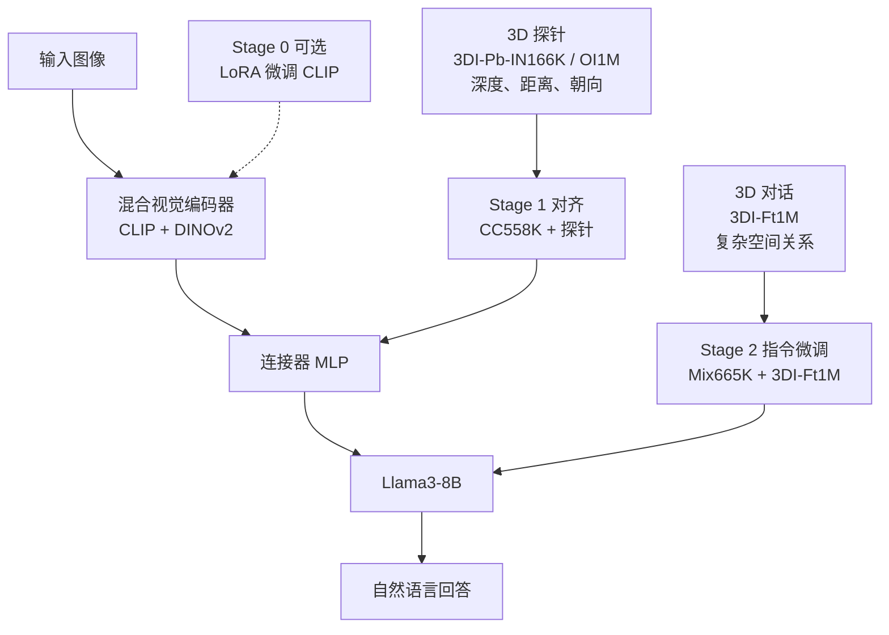

# SpatialLLM：多模态模型缺的不是认物体，是 3D 方位与碰撞

<!-- release-date: 2025-05-01 -->

> 本文依据约翰霍普金斯大学与 DEVCOM Army Research Laboratory 的 **SpatialLLM: A Compound 3D-Informed Design towards Spatially-Intelligent Large Multimodal Models**，即 [arXiv:2505.00788v3](https://arxiv.org/abs/2505.00788)（2025-06-10，14 页），**CVPR 2025 highlight**。动笔前核过 arXiv 官方提交历史：v1 于 2025-05-01 18:36:17 UTC 上传，v2 于 2025-06-02，v3 于 2025-06-10 17:54:02 UTC；本地件封面水印为 `arXiv:2505.00788v3 [cs.CV] 10 Jun 2025`，14 页，与官方最新件一致，**未做替换**。第一作者 Wufei Ma、Luoxin Ye、Nessa McWeeney、Jieneng Chen、Alan Yuille 署 Johns Hopkins University；Celso M de Melo 署 DEVCOM Army Research Laboratory。按高校主导，目录放在 JohnsHopkins。
>
> 全文页码指 PDF 自身页码。正文第 1–8 页页脚印着 `1` 到 `8`，与 PDF 页码一致；第 9–12 页是参考文献，第 13–14 页是附录。引用时按 PDF 页对照即可，不要用 CVPR 论文集的 17249–17260。
>
> `release-date` 取 **2025-05-01**。这是一篇方法论文：SpatialLLM 本身没有单独开放权重或可调用服务，按「技术首次官方公开日」取值。证据是 arXiv v1 提交时间 2025-05-01 18:36:17 UTC。项目页仓库 [`3d-spatial-reasoning/spatial-llm`](https://github.com/3d-spatial-reasoning/spatial-llm) 的 `createdAt` 为 2025-03-24，但当日提交仍是 ImageNet3D 项目页模板；3 月 25 日改名后仍写「arXiv (link pending)」「Code (by June)」，真正换成 SpatialLLM 内容的提交是 2025-06-10。Hugging Face `createdAt` 不是首发日；本工作也没有独立的 SpatialLLM 权重仓。CVPR 2025 会议是 2025-06-10 至 2025-06-17，晚于 arXiv v1。
>
> 文中始终区分三件事：**报告写了什么**、**我们如何解释**、**哪些是外部补充**。凡是从图里读出来的、从项目页 / 后续工作补进来的，都会当场说明。
>
> 边界说明：同方向已发布的 World Tracing、HunyuanWorld 1.0 讲的是像素对齐几何和图生 3D 世界，**不要把那些篇的人评、秒数或参数量读成本报告的实验**。本篇是 LMM 的 3D 空间推理，不是生成 mesh。

## 先讲矛盾：会认物体，不等于知道谁朝谁、会不会撞

先把场景摊开，再上名词。

一张街景里有一辆面包车、一个行人和一辆自行车。现有的大模型多半能把三样东西都叫对名字，也能写一句「街上有车和人」的说明。报告认为这还不够。人看同一张图，会立刻多问三件事（PDF p. 1，Figure 1）：

1. 行人离相机更近，还是自行车更近？
2. 白面包车正对着谁——行人，还是自行车？
3. 如果我站在行人的位置、顺着他的朝向看，面包车在我的哪一侧？

第一问是距离。第二问是朝向。第三问要把距离和朝向叠在一起，才能判断会不会撞、该往哪让。报告把这类能力叫 **3D 空间推理**（3D spatial reasoning）：不是认出物体，而是把物体放进三维世界，再推断它们之间的关系（PDF p. 1）。

现有 **大多模态模型**（Large Multimodal Model，LMM）卡在这里。报告点名 GPT-4、Gemini、LLaVA、Qwen-VL 一类系统：认物体、写描述很强，但一碰到「预测物体会不会相撞、理解物理事件」就弱（PDF p. 1）。原因写成两条，不是一条（PDF p. 1–2、p. 4）：

**数据偏 2D。** 网上能大规模抓到的，是图像配说明、图像配问答。这些文本大量讲外观、场景和动作，对「谁在谁前面、谁朝哪、两个物体在三维里相距多远」含糊其辞。高质量 3D 关系数据本来就少。更具体的缺口是：近期工作已经能用深度估计器做出「谁更远」这类伪标注，但几乎没人在真实照片上做 **3D 朝向** 的问答——因为可靠的 6D 位姿估计器一直不好用（PDF p. 1–2）。

**模型也偏 2D。** 常见 LMM 的视觉编码器是 CLIP 这类语言监督模型，在海量图文对上训练。图文对擅长「这是一只猫」，不擅长「这只猫的鼻子朝相机左侧 40 度」。报告引用 Probe3D、ImageNet3D 的线性探针结果：语言监督的视觉编码器，对物体 3D 姿态的意识有限；后面的语言模型再强，也只能在一份缺 3D 的视觉表征上做推理（PDF p. 4）。

就算有人开始往训练里塞 3D 数据，也只塞在最后一阶段。报告举 **SpatialVLM**（CVPR 2024）：它在指令微调时用了 3D 数据，但没有回答「这种数据能不能用在视觉编码器预训练，或图文对齐」；也没有朝向关系。报告的判断是：缺的不是再加一点空间问答，而是一次把数据、架构、训练阶段放在一起搜（PDF p. 2）。

SpatialLLM 的回答可以压成一句：

> **先用物体级的位置和朝向，把视觉表征对齐到 3D；再用复杂空间对话，教语言模型在这些表征上推理。视觉编码器要冻住，不要为了 3D 把原来的泛化能力微调坏。**

## 读之前只需要这几个词

下面这些词正文都会用到。这一节是读前背景，不全是报告自己定义的。

**LMM（大多模态模型）。** 一张图进视觉编码器，变成一组视觉 token，再经连接器送进大语言模型。报告的骨架是 LLaVA-v1.5：CLIP 编码器、MLP 连接器、Vicuna / Llama 语言模型（PDF p. 3）。它不是生成 3D 网格的模型。

**VQA（Visual Question Answering，视觉问答）。** 给图和一句问，模型用自然语言答。本报告的训练数据和评测，主体都是 VQA，不是检测框或点云。

**2D 空间 vs 3D 空间。** 「图里左边那个」是图像平面上的左右，会随相机转动而变。3D 空间问的是真实世界里的前后左右和朝向。报告强调：SpatialVQA 里的题不能只靠 2D 左右答出来（PDF p. 4）。

**深度 vs 3D 距离。** 深度是「这个物体离相机多远」，常常能从物体在图里的大小粗估。3D 距离还包括「两个物体彼此相距多远」，往往更难（PDF p. 3）。

**3D 朝向 / 6D 位姿。** 朝向回答「物体的正面朝哪」。6D 位姿是三维位置加三维旋转。两辆车是否对向行驶、会不会对撞，取决于朝向，不取决于谁离相机更近（PDF p. 2）。

**轴对齐框 vs 有朝向的 3D 框。** 前人用深度把像素抬回相机坐标系，得到的往往是轴对齐盒子，没有朝向。报告多走一步：用 ImageNet3D 上预训练的位姿估计器，给真实图里的物体加上朝向，得到有方向的 3D 框（PDF p. 13）。

**LLaVA 的两阶段。** Stage 1 用图文对训练连接器，做特征对齐（报告里的数据是 CC558K）；Stage 2 用图+指令微调整个模型（Mix665K）。报告在这两段之前又试了一段 Stage 0：用 3D 探针数据去 LoRA 微调 CLIP 编码器，称为 **pre-pretraining**（PDF p. 3、p. 5）。

**探针数据 vs 对话数据。** 探针问的是单个物体的基本 3D 属性：离相机多远、方位角、俯仰角、两物间距。对话问的是更高层的关系：谁朝谁、谁在谁的左侧、两物是否同向。报告把前者用于对齐，把后者用于指令微调（PDF p. 5）。

**混合视觉编码器。** 不只跑 CLIP，还把 DINOv2 或 MAE 的特征拼进去。CLIP 见过图文，DINOv2 / MAE 只在图像上自监督。报告想测：自监督特征会不会补上 CLIP 缺的 3D（PDF p. 5–6）。

**SpatialVLM 与 SpatialRGPT。** 两条近期的「给 LMM 加空间」路线。SpatialVLM 只在指令微调阶段加 3D 数据；SpatialRGPT 在推理时还要额外喂区域掩膜和深度图。报告不跟后者比，因为输入条件不同（PDF p. 2、p. 7）。

**Omni3D。** 一个带 3D 框标注的真实图像集合，覆盖 KITTI、nuScenes 等城市场景，以及 ARKitScenes、Hypersim、SUN RGB-D 等室内场景。SpatialVQA 建在它上面（PDF p. 4、p. 13）。

**ImageNet3D。** 同一组作者更早的物体级 3D 数据集，有人工标注的姿态。本报告把它转成图文对，作为高质量朝向探针（PDF p. 2、p. 5）。

## 一句话先说清

SpatialLLM 不是新发明一种注意力，也不是从零训一个视觉编码器。它是一次针对 3D 空间推理的 **复合设计搜索**：在 LLaVA-v1.5 骨架上，同时改数据、改编码器组合、改训练阶段（PDF p. 2、p. 5）。

数据分成两类。**3D-informed probing data**（3D 知情探针）盯物体级的位置和朝向；**3D-informed conversation data**（3D 知情对话）盯复杂空间关系。报告自称首次在真实图像上整理出带 3D 朝向关系的 VQA（PDF p. 1）。

评测基准叫 **SpatialVQA**，1,323 道题，全部要求不同程度的 3D 意识，不能只靠图像平面上的左右作答（PDF p. 2、p. 4）。最终模型在这套基准上达到 **62.7%**，相对 GPT-4o 的 54.0% 高 **8.7%**，相对空间专项开源模型 SpatialVLM-13B 的 52.2% 高 **10.5%**（PDF p. 1–2、p. 7，Table 1）。

拆开增益来源，报告自己写：架构改进贡献 **1.3%**，把 3D 数据塞进不同训练阶段贡献 **13.7%**（PDF p. 2、p. 8）。最大的一跳来自 Stage 2 的 100 万条 3D 对话（+10.7%），其次是 Stage 1 用人工标注的 ImageNet3D 探针做对齐（+3%）（PDF p. 6–7）。在视觉编码器上再做一段 3D LoRA，反而掉点（PDF p. 8）。

## 整条设计怎么连起来

下面这张图是机制示意，根据 PDF 第 5 页 Figure 3、第 6 页 Figure 5 重画，不是实测耗时。

读这张图时记住三件报告写明的事：

- 虚线的 Stage 0 是搜过、最后不用的。最终 SpatialLLM 冻结视觉编码器（PDF p. 8）。
- 探针数据主要进 Stage 1，对话数据主要进 Stage 2。把对话数据提前塞进对齐，平均分会掉（PDF p. 8，Table 2）。
- 架构上相对 LLaVA-v1.5 只多了混合编码器和把 Vicuna-7B 换成 Llama3-8B。连接器仍是 MLP，推理时只吃原始图像，不另喂深度或掩膜（PDF p. 5–7）。

## 报告地图：14 页里各写了什么

先摊开篇幅。正文到第 8 页，第 9–12 页是参考文献，附录只有第 13–14 两页。密度在数据、训练阶段和 Table 2 的组合搜索上；超参、通用视觉基准和数据分布，报告说了「见附录」，但这两页附录里并没有。

| 报告章节 | PDF 页 | 讲了什么 | 密度 |
|---|---|---|---|
| 标题、摘要、Figure 1、§1 起 | p. 1 | 3D 推理缺口；两类数据；相对 GPT-4o +8.7% | 高 |
| §1 贡献、§2 相关工作起 | p. 2 | 1,323 题 SpatialVQA；架构 +1.3%、数据 +13.7%；SpatialVLM / SpatialRGPT 划界 | 高 |
| §2 续、§3–3.2 | p. 3 | LMM 预备：数据形态、编码器 / 连接器 / LLM、三阶段训练；距离 / 朝向 / 空间推理三种关系 | 高 |
| Figure 2、§3.2.1–3.3 起 | p. 4 | 缺 3D 意识 vs 缺 3D 推理；SpatialVQA 定义 | 高 |
| Figure 3–4、§3.3.1 | p. 5 | 设计空间；探针 vs 对话的数据卡；Stage 0/1/2 配方 | 高 |
| Figure 5–6、路线图 | p. 6 | 与 LLaVA、SpatialVLM 对照；47.7 → 48.0 → 49.0 → 59.7 | 高 |
| Table 1、§4.1–4.2 起 | p. 7 | 主表；1M+1M 数据；8×A100；+3% 对齐 | 高 |
| Table 2、结论、Figure 7 | p. 8 | 全设计空间；Stage 0 掉点；定性对照 | 高 |
| 致谢、参考文献 | p. 9–12 | ONR / ARL / Siebel；70 条引用 | 低 |
| 附录 A | p. 13 | 有朝向的 3D 框如何生成；探针与 3DI-Ft1M | 高 |
| Figure 8、附录 B–C | p. 14 | 七类题型；1,323 题统计；公开说明改指向项目页 | 高 |

四件事必须先知道，否则会以为自己漏看了：

- **这是设计搜索论文，不是新架构论文。** 没有新注意力公式，没有新连接器。全文没有编号公式。
- **技术描述集中在 p. 3–8。** 附录只有数据生成和评测题型，没有训练曲线、没有通用基准数字。
- **正文承诺「通用视觉推理见附录」「数据分布见附录」**（PDF p. 7），v3 附录里都没有对应表。
- **最终模型的名字在图里不完全统一。** 正文称 SpatialLLM，Figure 7 的对话框写成 3DI-LMM（PDF p. 8）。本文一律用 SpatialLLM，提到 Figure 7 时再标明图上的叫法。

阅读路线：先读「先讲矛盾」和「核心一到核心五」，再看 Table 1 / Table 2。十分钟版本读矛盾、核心二、核心四和评测即可。

## 核心设计一：先把 3D 关系拆成三类，再决定数据长什么样

### 旧问题：一提「空间」，2D 左右、深度远近、朝向对撞被混在一起

早期空间基准有的建在 3D 扫描上而不是普通照片上，有的只问图像平面的左右，有的只问距离（PDF p. 4）。LMM 在这些基准上的失败，不能告诉你失败在「看不见深度」，还是「看不见朝向」，还是「看见了但不会组合」。

### 新设计：三种关系，对应三种难度

报告把 3D 空间关系分成三类（PDF p. 3）：

1. **距离关系。** 两个物体谁离相机更近，或谁离第三个物体更近。需要的不只是深度，还有物体之间的 3D 距离。
2. **朝向关系。** 两物是否同向、哪一面朝向相机、第三个物体正对着谁。
3. **复杂空间推理。** 同时用位置和朝向，例如「从 A 的朝向看，B 在左还是在右」。

评测基准 SpatialVQA 按这三类出题，共 1,323 道，图像来自 Omni3D 的城市场景和室内场景，用 3D 框按规则生成问答，而不是让模型在扫描网格上点选（PDF p. 2、p. 4）。附录列出七种具体题型（PDF p. 13–14）：

| 题型 | 报告归类 | 人话 |
|---|---|---|
| Closer to camera | 距离 | 两个物体谁离相机更近 |
| Closer to object | 距离 | 两个物体谁离第三个物体更近 |
| Facing camera | 朝向 | 物体哪一面朝向相机 |
| Facing object | 朝向 | 第三个物体正对着哪一个 |
| Same direction | 空间关系 | 两物是否同向 |
| Higher | 空间关系 | 谁的 3D 位置更高 |
| On which side | 空间关系 | 从一物的朝向看，另一物在前 / 后 / 左 / 右 |

Figure 2 给了四张样例（PDF p. 4）。书房里问「书柜和椅子谁离 Region[0] 的椅子更近」，只要 3D 位置；路口两辆车问「是否同向」，只要朝向；雨天公路问「Region[0] 的车是否朝向 Region[1] 的车」，位置和朝向都要。

### 工作机制：题必须逼出 3D，不能被 2D 捷径答掉

报告写 SpatialVQA「区别于以往所有空间推理基准」的一点：每道题都要求不同程度的 3D 意识，不能只靠 2D 空间推理作答（PDF p. 4）。附录补充：答案大致平衡，例如约 240 道「是否同向」里，120 道是 yes、120 道是 no；真实照片里天然稀少的答案会更少，例如「物体底面朝向相机」（PDF p. 14）。

这里有一处报告自己的数字对不齐，**这是我们的核对，不是报告原话**：七类题若每类约 240 道，总数应接近 1,680，但正文和附录都写总数 1,323。1,323 除以 7 约 189。后文引用时以 1,323 为准，把「每类约 240」当作报告自己的粗略说法。

### 收益、代价、边界

收益是评测不再把「图里的左右」和「三维里的左右」混成一个分。Table 1 把平均分拆成 3D Dist. / 3D Orient. / 3D Spatial Rel. 三列，后面能直接看到：增益几乎全部落在距离上（PDF p. 7）。

代价是基准仍然小、仍然规则生成。1,323 道、约 240 道一类，没有报告中的跨数据集泛化表。题是从 3D 真值用预定义规则造出来的，和训练时 3DI-Ft1M 的造题方式同类（PDF p. 4、p. 13）。这不表示训练和测试图像重叠——训练对话用的是 OpenImages，测试用的是 Omni3D——但题型家族是近亲。

### 可迁移启发

要测 3D 能力，先写清「这道题 2D 能不能蒙对」。能被图像左右、物体像素大小直接答掉的题，测不到朝向，也测不到碰撞。把距离、朝向、组合分开记分，比只报一个平均分更有用——本报告如果只报 62.7%，会把距离上的大跃迁，说成朝向和组合关系同样大。

## 核心设计二：两类 3D 数据，职责不同

### 旧问题：只有最后一阶段的空间对话，视觉表征里可能根本没有 3D

SpatialVLM 的做法是：LLaVA 原样两阶段训练，只在指令微调时加入 3D 问答（PDF p. 2、p. 6）。如果 CLIP 特征里没有朝向，语言模型再怎么微调，也是在一份 2D 表征上编空间故事。报告把这个缺口写成：至今没有工作系统回答「3D 意识该在哪一阶段、注入网络的哪一部分」（PDF p. 2）。

### 新设计：探针负责把 3D 写进视觉 token，对话负责教推理

报告明确拆成两种数据，目标不同（PDF p. 5）：

**3D-aware probing data（3D 知情探针）。** 物体级基本属性：方位角、俯仰角、物体到相机的深度、两物 3D 距离。目的是「有效地把基础 3D 意识注入模型，供后续推理使用」。实例有两个：

- **3DI-Pb-IN166K**：从人工标注的 ImageNet3D 转换，约 16.6 万，用于对齐（PDF p. 5）。
- **3DI-Pb-OI1M**：OpenImages 上用半自动工具标深度和距离，约 100 万（PDF p. 5）。

**3D-informed instruction tuning data（3D 知情指令微调数据，3DI-Ft1M / 3DI-Ft-1M）。** 100 万条关于 3D 空间关系的问答，图像来自 OpenImages，由探针里那些基本量组合而成（PDF p. 5、p. 13）。Figure 8 的样例包括：两辆车是否同向、哪张椅子离观察者更近、从投手的朝向看另一名球员在哪一侧（PDF p. 14）。

标准 LLaVA 数据仍保留：CC558K 的细粒度描述用于对齐，Mix665K 的多轮对话用于指令微调（PDF p. 5）。3D 数据是加进去的，不是替换。

### 工作机制：同一条视觉工具链，多产出一份有朝向的 3D 框

数据引擎画在 Figure 4 右侧（PDF p. 5），附录 A 把步骤写全（PDF p. 13）：

1. 用 RAM 做物体打标、SAM 做分割，得到图中有哪些物体。
2. 用 DepthAnything / DepthAnything v2 估度量深度，用 WildCamera、PerspectiveFields 或 RANSAC 做相机标定，把像素抬回相机坐标系，得到轴对齐 3D 框。这一步和 SpatialVLM、SpatialRGPT 同类。
3. **多出来的一步：** 用 ImageNet3D 上预训练的 6D 位姿估计器，给未标注自然图里的刚性物体预测朝向；有 3D 标注的数据（ImageNet3D、Apollo 合成数据）则直接用真值。输出从轴对齐框变成有朝向的 3D 框。
4. 把这些 3D 量聚合成探针问答；再用 GPT-4 一类 LLM 写成多轮空间对话。

附录写探针阶段「只预训练视觉连接器、冻结其他模块」，让视觉 token 带上 3D 信息（PDF p. 13）。这和正文 Stage 1「CC558K + 探针一起做多模态对齐」是同一阶段的两种说法：对齐时编码器冻结、主要训练连接器，符合 LLaVA 惯例。

### 收益、代价、边界

收益在 Table 2 上非常硬：同样的 CLIP+DINOv2+Llama3-8B，Stage 2 加上 3DI-Ft1M，平均分从 49.0 升到 59.7，**+10.7%**；再在 Stage 1 加上 3DI-Pb-IN166K，升到 62.7，**再 +3%**（PDF p. 6–8）。距离子项从 56.3 升到 86.3（PDF p. 8）。

代价和边界同样硬：

- 半自动的 OpenImages 探针（OI1M）不如人工标注的 ImageNet3D 探针（IN166K）：Stage 1 用 OI1M 是 60.0，用 IN166K 是 62.7（PDF p. 8）。报告把原因写成：人工标注提供更准确的 3D 朝向（PDF p. 7）。
- 把 3DI-Ft1M 这种对话数据提前塞进 Stage 1，平均分从 59.7 降到 57.5（PDF p. 8）。复杂问答不是越好越早放。
- 位姿估计器本身会错。报告没有给出伪标签准确率，也没有「去掉朝向估计、只留深度」的消融。朝向相关的训练信号，质量上限就是这个估计器。
- GPT-4 写对话的模板、过滤规则、每张图问几轮，PDF 没有。

### 可迁移启发

**基础属性和组合推理不要写成同一种数据、塞进同一阶段。** 探针像词汇表：先让视觉 token 能说出深度、方位、朝向；对话像作文：再让语言模型用这些词做关系判断。作文数据拿去训连接器，会干扰对齐——Table 2 里 57.5 那一行就是证据。

**对齐阶段对标注质量更敏感。** 100 万半自动样本（OI1M）赢不过 16.6 万人工姿态（IN166K）。需要朝向时，宁可用更小、更准的人工集，不要用更大、朝向是估出来的集。

## 核心设计三：朝向必须进入真实图像上的 VQA

### 旧问题：有深度就能问远近，但问不了对撞

报告认为前人卡在 3D 距离，是因为缺少可靠的 6D 位姿估计器（PDF p. 2）。没有朝向，就无法问「两辆车是否同向」，也无法问「从这辆车的车头看，那辆车在左侧还是右侧」。Depth ordering 只能告诉你谁更近，不能告诉你谁会不会撞上谁。

Figure 1 的街景把这件事画死了：行人比骑车人离观察者更近，是距离；白面包车正对着行人而不是骑车人，是朝向；从行人的视角看，面包车在右侧，是组合（PDF p. 1）。缺任何一项，碰撞判断都做不成。

### 新设计：把 ImageNet3D 的姿态变成图文，并在真实图上估朝向

报告写自己是「第一个把 3D 朝向关系做成真实图像 VQA 的工作」（PDF p. 1）。做法有两条腿（PDF p. 2、p. 5、p. 13）：

- 有人工姿态的 ImageNet3D，直接把图像–姿态对转成图像–文本对，得到 3DI-Pb-IN166K。
- 没有姿态的 OpenImages，用预训练位姿估计器补朝向，再生成朝向相关的对话，进入 3DI-Ft1M。

相对 SpatialVLM，报告特别点出：对方的 3D 指令数据里没有朝向（PDF p. 6）。

### 工作机制：有朝向的 3D 框，才能生成「从谁的视角」这类题

轴对齐框可以比较中心点距离，可以比较谁离相机近。一旦盒子带了朝向，就可以定义物体自己的前 / 后 / 左 / 右，于是「从 Region[0] 那辆车的朝向看，Region[1] 的巴士在左侧」这种题才合法（PDF p. 4，Figure 2）。附录把这一步写成：聚合全部 3D 信息，产出 **oriented 3D bounding boxes**，而不是前人的轴对齐框（PDF p. 13）。

### 收益、代价、边界

Table 1 上，SpatialVLM-13B 的距离是 64.3，高于 LLaVA-v1.5 的 50.6，但朝向是 48.5，只比 LLaVA 的 46.4 高一点，低于 GPT-4o 的 52.4（PDF p. 7）。报告的解释是：SpatialVLM 没有朝向专项微调数据（PDF p. 7）。SpatialLLM 的朝向是 52.9，略高于 GPT-4o。

必须把这句话和平均分拆开看。**这是我们的读表，不是报告原话：**

| 模型 | 平均 | 3D 距离 | 3D 朝向 | 3D 空间关系 |
|---|---:|---:|---:|---:|
| GPT-4o | 54.0 | 59.4 | 52.4 | 50.8 |
| Claude 3.5 Sonnet | 49.3 | 50.8 | 44.5 | 51.5 |
| SpatialVLM-13B | 52.2 | 64.3 | 48.5 | 45.8 |
| SpatialLLM | 62.7 | 86.3 | 52.9 | 50.8 |

平均分 +8.7% 几乎完全来自距离（86.3 vs 59.4）。朝向只高 0.5 分；空间关系与 GPT-4o 持平，还略低于 Claude 的 51.5。报告正文写「在 3D 距离、3D 朝向和 3D 空间关系的所有方面都更优」（PDF p. 7），与 Table 1 的空间关系列并不严格一致。Table 2 里最终模型的空间关系是 51.0，与 Table 1 的 50.8 也差 0.2——以 Table 1 主结果为准，把 0.2 当作表间出入。

代价是：朝向题依赖位姿估计器和「哪一面是正面」的定义。非刚性物体、截断严重的物体、底面朝向相机这种稀有姿态，附录自己承认频率低（PDF p. 14）。报告没有按物体类别拆朝向准确率。

### 可迁移启发

给 LMM 加空间，只加深度排序会在「会不会撞」上静默失败。先问自己的数据能不能生成「从物体自己的朝向看」这种题；如果不能，模型学到的是深度比较，不是 3D 方位。评测时把朝向和组合关系单独报，避免被距离项拉高的平均分带偏。

## 核心设计四：在数据 × 架构 × 训练阶段上做组合搜索

### 旧问题：改一处、报一个分，不知道增益从哪来

只换 Llama、只混 DINOv2、只在微调时加 3D 对话，都可以让平均分动一点。没有一张表把这些改动按顺序叠上去，就无法回答「该先改架构还是先改数据」，也无法回答「3D 数据该进 Stage 0、Stage 1 还是 Stage 2」。

### 新设计：一条从 LLaVA-v1.5 走到 SpatialLLM 的路线图

Figure 6 和 Table 2 的非灰色行是同一条路（PDF p. 6、p. 8）。数字是 SpatialVQA 平均准确率：

| 步骤 | 改了什么 | 平均 | 相对上一步 |
|---|---|---:|---:|
| LLaVA-v1.5 | CLIP + Vicuna-7B，CC558K / Mix665K | 47.7 | 基线 |
| + 混合编码器 | 加上 DINOv2 | 48.0 | +0.3 |
| Vicuna → Llama3-8B | 语言模型换成 Llama3-8B | 49.0 | +1.0 |
| + 3DI-Ft1M | Stage 2 加入 100 万 3D 对话 | 59.7 | +10.7 |
| + 3DI-Pb-IN166K | Stage 1 加入 ImageNet3D 探针 | 62.7 | +3.0 |

报告把前两步叫架构改进，合计 **1.3%**；后两步叫 3D 知情数据，合计 **13.7%**（PDF p. 2、p. 8）。GPT-4o 在同一张条形图上是 54.0 的紫条，被最后两步超过（PDF p. 6，Figure 6）。

Llama3 这一步，报告给的理由是：Llama3-8B 在 MMLU 上比 Vicuna-v1.5-7B 高 20%，更好的语言推理也可能帮助空间推理（PDF p. 6）。这 20% 是作者引用的语言模型通用分，不是本报告在 SpatialVQA 上测的。

### 工作机制：同一骨架上只打开一个开关

所有实验默认超参跟 LLaVA-v1.5，除非显式改动；计算资源是 8 张 Nvidia A100（PDF p. 7）。Table 2 灰色行是在最终配方附近的对照，不是路线图的一部分（PDF p. 8）：

- Stage 1 用 3DI-Ft1M 而不是探针：57.5，低于「Stage 1 不用 3D、只在 Stage 2 用对话」的 59.7。
- Stage 1 用半自动 OI1M：60.0，低于人工 IN166K 的 62.7。
- Stage 0 用 OI1M 按 CLIP 对比学习目标 LoRA 编码器：60.3。
- Stage 0 用 next-token prediction 目标 LoRA 编码器：62.6，与最终 62.7 基本持平，没有额外好处。

混合编码器内部还有一条 MAE 支路：CLIP+MAE 是 47.9，略低于 CLIP+DINOv2 的 48.0，且朝向从 46.4 降到 45.7（PDF p. 8）。路线图因此选了 DINOv2。

Figure 5 把三条系统画在一起（PDF p. 6）：LLaVA 全程传统数据；SpatialVLM 只在最后一阶段涂上 3D；SpatialLLM 在对齐和微调都涂上 3D，并且编码器是混合的。图例用蓝色表示传统数据训练的模块、橙色表示 3D 数据训练的模块。

### 收益、代价、边界

收益是一张可执行的配方：冻编码器、混 DINOv2、换更强 LLM、Stage 2 加 3D 对话、Stage 1 加高质量探针。相对「只在微调加空间数据」的 SpatialVLM，这条配方在同一套 SpatialVQA 上高 10.5 个点（PDF p. 7）。

代价和边界：

- 这是 7B–8B 量级、8 张 A100 上的搜索，不是 70B 或闭源 API 的搜索。换底座之后，Stage 1 / Stage 2 的相对重要性不一定不变。
- 超参「与 LLaVA-v1.5 相同」意味着学习率、epoch、batch size 正文都没重写。无法从 PDF 复现出逐步训练日程。
- Llama3 把空间关系子项从 45.6 降到 41.5，再靠 3D 数据拉回来（PDF p. 8）。更强的 LLM 不是单调帮助所有 3D 子项。
- 没有「同一数据、只换连接器结构」或「同一数据、只改图像分辨率」的消融。设计空间比 LLaVA 大，但比完整的 LMM 设计空间小。

### 可迁移启发

**先标出「改架构」和「改数据」各自能搬多少分，再决定工时投哪。** 本报告里数据是架构的十倍（13.7 vs 1.3）。若自己的任务也是「现有 LMM 骨架 + 缺一种关系数据」，应优先造对数据、选对阶段，而不是先上混合编码器。

**阶段和数据类型要匹配。** 基础属性 → 对齐；组合推理 → 指令微调。反着放会掉点。这比「3D 数据越多越好」更具体。

## 核心设计五：视觉编码器要冻，3D LoRA 会伤泛化

### 旧问题：CLIP 缺 3D，直觉是再预训练一下

Probe3D 已经说明 CLIP 这类对比学习编码器 3D 意识弱（PDF p. 7）。报告的假设是：用 3DI-Pb-OI1M 再训一段编码器，3D 意识应该上升。他们试了两种目标：CLIP 对比学习，以及 next-token prediction；都只 LoRA 微调 ViT 的层，而不是全量改权重（PDF p. 5、p. 8）。

### 新设计：搜完之后，最终模型不做这段

最终 SpatialLLM 的 Stage 0 是空的（PDF p. 8，Table 2 橙色行）。混合编码器保持预训练权重冻结。

### 工作机制：3D 微调换来的意识，可能以泛化为代价

Stage 0 加上之后：

- CLIP 目标：平均 60.3，低于不做的 62.7；朝向 50.5，空间关系 47.5，两列都掉。
- NTP 目标：平均 62.6，与 62.7 持平，没有增益。

报告的解释是：微调视觉基础模型可能损害特征泛化能力；这与主张冻结或锁定视觉编码器的前人工作一致（PDF p. 8）。项目页把同一结论写成更口号的句子：「Finetuning CLIP with our 3D-informed data hurts final performance — trade-off between 3D awareness and generalization abilities.」**那是项目页的表述；PDF 写的是「may compromise feature generalizability」。**

### 收益、代价、边界

收益是一条否定结果：在这份 8B 配方里，3D 意识不该靠改 CLIP 权重获得，而该靠连接器对齐和 LLM 微调吸收。代价是：报告没有单独测 Stage 0 之后编码器在 ImageNet3D 线性探针上的 3D 意识是否真的提高——我们只看到下游 SpatialVQA 掉点或持平。因此「伤了泛化」是对下游分数的解释，不是另一次探针实验。

LoRA 秩、学习率、训了多少 step，PDF 没有。不能把「Stage 0 无用」外推成「任何 3D 视觉预训练都无用」；它只排除了「在已经选好的最终配方上，再用 OI1M 对 CLIP 做 LoRA」这一种。

### 可迁移启发

缺某种能力时，先分清是「表征里没有」还是「表征里有、语言模型不会用」。若线性探针已经显示编码器弱，按理该改编码器；但改完若下游掉点，说明你改掉的可能是别的任务还在用的特征。更稳的顺序是：冻结编码器，用对齐数据把已有特征里能用的 3D 抽出来；只有对齐也抽不出来时，再碰编码器。

## 实验怎么证明

### 主结果：赢在平均分和距离，不赢在所有子项

Table 1 把模型分成专有、开源、空间专项三组（PDF p. 7）。SpatialLLM 平均 62.7，高于 GPT-4o 54.0、Claude 3.5 Sonnet 49.3、GPT-4o Mini 45.4，也高于 LLaVA-v1.5-7B 47.7、LLaVA-NeXT-8B 50.6、Cambrian-8B 51.7、SpatialVLM-13B 52.2。

报告写「超过最强专有模型 8.7%、最强开源模型 10.5%」（PDF p. 7）。8.7% 对应 GPT-4o（62.7 − 54.0）；10.5% 对应 SpatialVLM-13B（62.7 − 52.2）。开源组里若只看非空间专项，Cambrian-8B 是 51.7，差距会更大；报告把「最佳开源」算在空间专项上。

排除 SpatialRGPT 的理由写得很清楚：推理时依赖物体框、分割掩膜和深度图；本报告和 LLaVA、Cambrian 一样，只从原始图像学习空间意识（PDF p. 7）。这是公平性选择，不是说 SpatialRGPT 更弱。

### 定性：GPT-4o 会拒绝，或把朝向看反

Figure 7 两例（PDF p. 8）。左图问三辆车谁离 Region[0] 更近，GPT-4o 回答自己「无法在视觉上评估图像」，SpatialLLM（图上写 3DI-LMM）答 Region[1]。右图问两把椅子是否同向，GPT-4o 说方向相似，模型答「非常不同」。这是作者挑选的成功例，不是错误分析集。

### 这些数字没有证明什么

- **没有公开的通用视觉基准数字。** 正文说空间能力提升的同时「仍保持通用视觉推理（详见附录）」（PDF p. 7），附录没有这张表。不能从 PDF 判断 MMBench、VQAv2、POPE 是否掉点。
- **没有与 GPT-4o 的人评、没有 CoT 对照。** 专有模型按什么提示、是否允许解释再给答案，正文没写。Figure 7 里 GPT-4o 甚至表现出「没看见图」，评测接口可能和开源模型不一致。
- **没有统计显著性、没有多次种子。** 62.7 是单次点估计。
- **测试集 1,323 道、规则生成、与训练题型近亲。** 换一套人手标注、题型不同的基准，本 PDF 没有数字。
- **13B 的 SpatialVLM 对 8B 的 SpatialLLM。** 参数量不占优的一方赢了，但实现来自 SpaceLLaVA 的复现（PDF p. 7），不是原作者检查点的官方数。

## 报告没有写的部分

**架构与系统**

- 连接器是 MLP，但层数、隐层宽度、是否两层 GELU，只说「follow LLaVA」（PDF p. 3）。
- CLIP 和 DINOv2 如何拼接：通道拼接、token 拼接还是加权，PDF 没有。
- 图像分辨率、视觉 token 数、是否 anyres / 动态切图，没有。LLaVA-NeXT 在主表里作为基线出现，但 SpatialLLM 自己不是 LLaVA-NeXT 骨架。
- LoRA 的秩、作用层、学习率，Stage 0 和 Stage 2 都没写。
- 8 张 A100 的墙钟、epoch、全局 batch、精度（FP16 / BF16），没有。

**数据**

- 3DI-Ft1M 的题型分布、每张图问几轮、GPT-4 提示词，没有。正文说「数据分布见附录」（PDF p. 7），附录没有分布表。
- 位姿估计器的类别覆盖、失败率、是否只用于刚性物体，只有「rigid objects」这一句（PDF p. 13）。
- 训练图像与 SpatialVQA 的 Omni3D 图像是否有重叠，没有去重说明。来源数据集不同（OpenImages / ImageNet3D vs Omni3D），但不等于无重叠场景。

**评测**

- SpatialVQA 的计分是精确匹配、关键词匹配还是 GPT 判分，没有写。
- 七类题的分项准确率没有表，只有三列粗分。
- 「每类约 240 道」与总数 1,323 冲突，没有解释。
- 没有跨基准：ScanQA、GSR-Bench、CV-Bench、EmbSpatial 这些相关工作里出现过的名字，没有拿来测最终模型。

**不要把论文之后的仓库更新读回这篇。** 项目页现在把数据与代码指向后续工作 SpatialReasoner（NeurIPS 2025），以及另一套人手标注基准 3DSRBench。那些分数、Qwen2.5-VL 的 SFT / RL 配方，都不是本 PDF 的实验。

## 可以带回自己项目的几条

**LMM 缺的 3D，多半不是新骨干，而是没在对的阶段看见对的监督。** 本报告把架构开关全打开，只搬了 1.3 分；把探针放进对齐、把对话放进微调，搬了 13.7 分。若自己已经有 LLaVA / Qwen-VL 骨架，先问数据，再问编码器。

**基础 3D 属性和关系推理是两种数据。** 深度、方位、朝向像词汇；「从 A 看 B 在左侧」像句子。词汇进对齐，句子进指令微调。把句子提前塞进对齐，本报告掉 2.2 分。

**朝向是距离数据补不上的一维。** 只有深度排序，模型可以学会谁更近，学不会谁正对谁。需要碰撞、让行、物体交互时，训练信号里必须出现有朝向的 3D 框，评测也必须单独报朝向和组合关系。

**对齐阶段宁小而准，不要大而噪。** 16.6 万人工姿态赢过 100 万半自动 OpenImages。伪标签的朝向误差会在对齐时写进连接器，后面的 100 万对话救不回来。

**下游掉点，不一定该继续微调视觉编码器。** CLIP 缺 3D 是事实，但用 3D 数据 LoRA CLIP 在本配方里掉点或空转。先冻编码器、改对齐数据和 LLM 微调；只有对齐也抽不出该有的信息时，再碰视觉权重。

**平均分会掩盖子项。** 62.7 vs 54.0 很好看；拆开后，空间关系与 GPT-4o 持平。自己报空间能力时，至少拆距离 / 朝向 / 组合三列。

这些做法不依赖 8 张 A100 的某次具体超参，也不依赖 DINOv2 这个特定名字。它们依赖的是：关系类型要拆开、阶段要匹配、编码器冻结是默认而不是失败。

## 关键词回看

- **3D 空间推理**：在三维世界里推断物体之间的距离、朝向和组合关系，不是认物体，也不是生成网格。
- **LMM**：视觉编码器 + 连接器 + 语言模型；本报告的骨架是 LLaVA-v1.5。
- **SpatialVQA**：1,323 道 3D VQA，基于 Omni3D 的 3D 框规则生成，分距离 / 朝向 / 空间关系。
- **探针数据（3DI-Pb-IN166K / OI1M）**：物体级深度、距离、方位、朝向；主要进 Stage 1 对齐。
- **对话数据（3DI-Ft1M）**：复杂空间关系的 100 万条问答；进 Stage 2 指令微调。
- **有朝向的 3D 框**：相对轴对齐框多了物体正面方向，才能生成「从谁的视角」类题。
- **Stage 0 / 1 / 2**：编码器 LoRA、连接器对齐、指令微调。最终模型不用 Stage 0。
- **混合视觉编码器**：CLIP 拼 DINOv2；相对纯 CLIP 只 +0.3%。
- **复合设计（compound design）**：数据、架构、训练阶段一起搜，而不是只在微调加空间问答。
- **SpatialVLM**：只在指令微调加 3D、且缺少朝向数据的对照路线。
- **SpatialRGPT**：推理时额外吃掩膜和深度，本报告故意不比。

## 最后的判断

SpatialLLM 没有提出新的注意力，也没有公开一份可下载的 8B 权重。它留下的是一张 8B LLaVA 骨架上的 3D 空间配方，以及一张把增益拆开的表。

哪些结论有表或图支撑：

- 在 SpatialVQA 上平均 62.7，相对 GPT-4o +8.7、相对 SpatialVLM-13B +10.5（Table 1）。
- 架构约 +1.3，3D 数据约 +13.7；其中 3DI-Ft1M +10.7、IN166K 对齐 +3（Figure 6，Table 2）。
- Stage 1 放对话数据会掉到 57.5；OI1M 弱于 IN166K；Stage 0 LoRA CLIP 无益或有害（Table 2）。
- SpatialVLM 距离强、朝向弱，与「没有朝向微调数据」的文字解释一致（Table 1）。
- 混合 DINOv2 略优于混合 MAE（Table 2）。

哪些是作者观察或定位：

- 「首次在真实图像上做 3D 朝向 VQA」是声明，对比范围是文中引用的 SpatialVLM / SpatialRGPT / Cambrian。
- 「在所有方面都更优」与 Table 1 空间关系列不完全一致。
- Llama3 因 MMLU +20% 而帮助空间推理，是迁移解释；空间关系子项在这一步其实下降。
- Stage 0「损害泛化」是对下游分数的解释，没有另附编码器探针。
- 「保持通用视觉推理」在 v3 PDF 里没有数字。

哪些没有公开：超参、拼接方式、3DI-Ft1M 题型分布、SpatialVQA 计分规则、通用基准、权重。项目页把实现指向后续的 SpatialReasoner，那是另一条显式 3D 表征路线，不能回写成这篇的模型。

如果只带走一条设计原则：

> **多模态模型认得出物体，只说明视觉 token 里有类别。要判断方位和碰撞，必须在对齐阶段写入位置和朝向，在微调阶段练习组合，并且把这三件事分开计分。**

## 资料与阅读边界

**原件与版本**

- 原始依据：本地 `papers/JohnsHopkins/SpatialLLM.pdf`，即 [arXiv:2505.00788v3](https://arxiv.org/abs/2505.00788)，2025-06-10，14 页。CVPR 2025 highlight，会议论文集页码 17249–17260，DOI 10.1109/CVPR52734.2025.01608。
- 版本核对：arXiv 提交历史三版——v1（2025-05-01 18:36:17 UTC，10,171 KB）、v2（2025-06-02 12:45:13 UTC，6,821 KB）、v3（2025-06-10 17:54:02 UTC，6,819 KB）。v3 为当前最新。本地件首页水印与官方 v3 一致，未做替换。
- 署名：PDF 作者为 Wufei Ma、Luoxin Ye、Nessa McWeeney、Celso M de Melo、Jieneng Chen、Alan Yuille。通讯作者 Jieneng Chen（`jchen293@jh.edu`）。arXiv 摘要页与 CVPR Open Access bibtex 未列出 Nessa McWeeney；CVPR 虚拟海报页列出了她。解读按 PDF 首页。
- 项目页：[https://3d-spatial-reasoning.github.io/spatial-llm/](https://3d-spatial-reasoning.github.io/spatial-llm/)

**首发日证据**

`release-date` 取 **2025-05-01**。文章讲的是一项公开技术，配套权重未随论文独立开放，按首次官方公开日取值：

- arXiv v1 于 2025-05-01 18:36:17 UTC 提交，是可核验的最早全文公开。
- 项目页仓库 [`3d-spatial-reasoning/spatial-llm`](https://github.com/3d-spatial-reasoning/spatial-llm) `createdAt` 为 2025-03-24T05:16:30Z，**不当作首发日**：初始提交的 README 仍写 ImageNet3D；3 月 25 日改标题后 arXiv 链接仍是 pending。内容更新到 2025-06-10 才与 v3 论文对齐。
- CVPR 2025 会议 2025-06-10 至 17 日，highlight 身份见 [CVPR 虚拟海报页](https://cvpr.thecvf.com/virtual/2025/poster/34108) 与会议手册条目 137。晚于 arXiv v1。
- 没有独立的 SpatialLLM Hugging Face 权重仓；项目页把数据与代码转到后续 SpatialReasoner。Hugging Face `createdAt` 规则在这里不适用。

**外部补充（不是本 PDF 的实验）**

- 项目页「Data & Code」指向 [SpatialReasoner](https://spatial-reasoner.github.io/)（NeurIPS 2025，[arXiv:2504.20024](https://arxiv.org/abs/2504.20024)）、[3DSRBench](https://3dsrbench.github.io/)、[SpatialReasonerDataGen](https://github.com/wufeim/SpatialReasonerDataGen) 与 Hugging Face collection `ccvl/spatialreasoner`。那是显式 3D 表征 + SFT / RL 的后续路线，基准也换成 3DSRBench，分数不能读回 Table 1。
- CVPR Open Access 另有一份 [supplemental PDF](https://openaccess.thecvf.com/content/CVPR2025/supplemental/Ma_SpatialLLM_A_Compound_CVPR_2025_supplemental.pdf)。本地 v3 已把附录收成第 13–14 页；公开说明从「录用后释放数据与匿名代码」改成「见项目页」。本文以本地 v3 为准。
- 武汉大学另有同名工作 *SpatialLLM: From Multi-modality Data to Urban Spatial Intelligence*（[arXiv:2505.12703](https://arxiv.org/abs/2505.12703)），做城市空间分析，与本篇无关。

**同方向已发布、不要串数字**

- [World Tracing](/reports/WorldLabs/World-Tracing)：像素对齐的多层几何，输出是点叠，不是 VQA。
- [HunyuanWorld 1.0](/reports/Tencent/HunyuanWorld-1.0)：全景代理再剥成可导出网格，是生成世界，不是空间问答。
