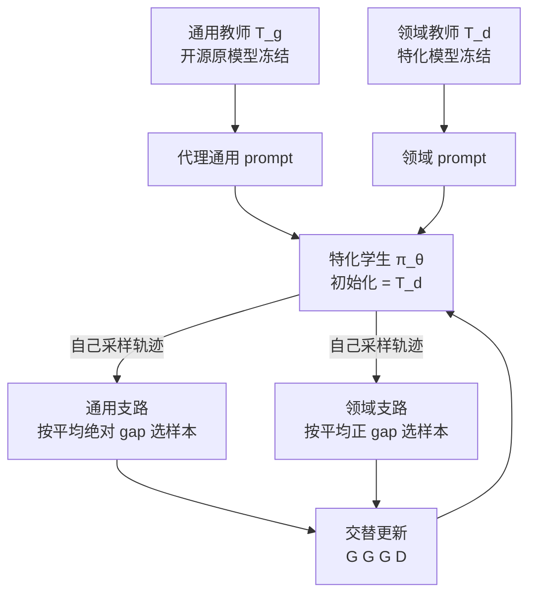

# CaMOPD：通用教师的原始数据对不齐时，恢复和保住不能混在同一次更新里

<!-- release-date: 2026-05-26 -->

> 本文依据快手（Kuaishou Technology）发布的 **Counteraction-Aware Multi-Teacher On-Policy Distillation for General Capability Recovery with Domain Preservation**，即 arXiv:2605.27115v1、2026-05-26 首次公开、共 17 页的版本。页码均指这份 PDF 本身的页码。截至 2026-09-10 核验，arXiv 上只有 v1，与本地原件一致。Tianlei Chen 与 Jiao Ou 并列第一；通讯作者是 Jiao Ou 与 Ruiming Tang。署名机构只有 Kuaishou Technology, Beijing。全文把三件事分开标注：**论文写了什么**、**我们如何解释它**、**哪些是外部资料补充**。
>
> 这是一篇后训练方法论文，不是基模报告。模型架构、预训练和推理加速不在范围内。
>
> **和邻居的切面，先划清。** 本仓库已发布的 [MOPD](/reports/Xiaomi/MOPD) 讲多教师在线策略蒸馏怎样把多个领域教师合进一个学生，前提是训练 prompt 能对上教师自己的数据分布。本篇引用的也是这条假设（来源是 MiMo-V2-Flash 技术报告，不是后来那篇独立方法论文），但实验设定正好把它拿掉：通用教师是开源原模型，后训练数据未知，只能用公开的 **proxy prompts（代理 prompt）** 做通用恢复。Ant Group 那篇 *When Top-K Misses the Decision* 讲的是教师 top-K 丢掉「该不该调工具」的决策坐标，不是本篇的恢复–保住梯度对抗。三篇不要混数字。Open-MOPD 只在文末作为后作点名。

## 读前需要的最少背景

这篇论文假设读者已经知道：语言模型可以在后训练阶段用强化学习把某个垂直领域往上推；也知道知识蒸馏是让一个模型去拟合另一个模型的输出分布。往下读只再补六件事。

- **策略 $\pi_\theta$**：正在训练的那个语言模型。给它一道题 $x$，它写出一条回答 $y$。
- **教师 $T_g$ / $T_d$**：通用教师是开源原模型，冻结；领域教师是特化之后的模型，也冻结。学生的初始化就是这份领域教师，不是从通用教师重新出发。
- **On-policy（在线策略）**：训练数据是学生**自己当前**采样出来的轨迹，教师只在这些前缀上给逐 token 反馈。相对的做法叫 off-policy（离策略），教师先写范文再让学生去背。
- **Token 级 log-probability gap（对数概率差）**：每个位置上，教师和学生对「学生实际写出的那个词」各打一个对数概率，两者相减。人话见下一节，公式放到方法里。
- **Catastrophic forgetting（灾难性遗忘）**：把模型特化到一个领域之后，原来的通用能力掉下去。经典补救是把通用数据混进去，或者定期回放旧任务。
- **Proxy prompts（代理 prompt）**：不是教师当年真正训过的那批题，只是你现在能搞到的、看起来像通用分布的公开题。覆盖是否对得上，观察不到。

组相对策略优化（Group Relative Policy Optimization，GRPO）和 DAPO 只出现在医学教师的既有训练史里，本 PDF 没有重训它们。机制见本站 DeepSeek-R1 篇与 DAPO 相关材料，这里不重复。

## 一句话先说清

垂直领域特化能把角色扮演、医学问答这类行为推上去，但常常把从原模型继承来的通用能力踩下去。（PDF p.1）

已有的 **多教师在线策略蒸馏（Multi-Teacher On-Policy Distillation，MOPD）** 想靠教师的逐 token 反馈，把丢掉的能力捞回来。它通常默认一件事：**训练时用的 prompt，要和教师自己的训练分布对齐**。通用教师如果是开源模型，后训练数据未知，这个假设很难满足。（PDF p.1）

论文不打算把那份隐藏分布重建出来，而是问：只用手头的公开通用题当代理，能不能在保住领域行为的同时，把通用能力找回来？（PDF p.1）

Vanilla MOPD 在这种不完整覆盖下会踩进两种失败。第一种叫 **recovery-preservation counteraction（恢复–保住对抗）**：通用恢复和领域保住的梯度方向相反，混进同一次更新就互相抵消。第二种叫 **weak-signal flattening（弱信号抹平）**：一个 batch 里样本的纠正需求差很多，均匀平均会把真正该改的高需求样本冲淡。（PDF p.1–2）

他们提出 **CaMOPD（Counteraction-Aware Multi-Teacher On-Policy Distillation，对抗抵消的多教师在线策略蒸馏）**。两招：

1. **解耦交替训练（decoupled alternating training）**：默认连续三步只做通用恢复，第四步才回看领域 prompt。
2. **基于 gap 的样本选择（gap-based sample selection）**：在当前支路里，按 token 级师生对数概率差把纠正需求大的样本挑出来再更新。（PDF p.1–2）

实验走两条风格差得很远的垂直领域：角色扮演对话，以及医学推理问答。在保住领域行为的前提下，CaMOPD 的通用恢复超过所有对照；梯度一致性分析用来支撑「选出来的子集更新方向更齐」。（PDF p.1–2）

全文最值得带走的不是「又改了一版蒸馏损失」，而是这句话背后的分工：

> **教师对齐的 prompt 覆盖拿不到时，先不要把恢复和保住平均进同一次更新；再在每一路里，只把更新预算花在师生差距真正大的那些样本上。**（PDF p.2、p.8；这是本文对论文主张的归纳。）

## 旧方法卡在哪：假设的是教师对齐，手里却只有代理题

论文把问题放在特化之后，而不是从零整合多个领域。（PDF p.1、p.3）

具体流水线是：

1. 从一个开源通用模型出发；
2. 把它后训练成垂直领域模型；
3. 再用 MOPD 把丢掉的通用能力捞回来。

此时角色已经定死：原开源模型当通用教师 $T_g$；特化模型既是学生的初始化，也是领域教师 $T_d$。领域 prompt 来自特化流水线，通用教师的原始后训练数据未知。（PDF p.1）

**我们的解释：** 这和 [MOPD](/reports/Xiaomi/MOPD) 那篇「多个领域教师并行生产、再一次性合进学生」不是同一张地图。那边每道题都能路由到对口教师，训练 prompt 被假定盖住了教师分布。这边只有一个已经特化过的学生，要同时做两件方向可能相反的事：听通用教师找回能力，听领域教师别把垂直行为改丢。通用那一侧还故意用对不齐的代理题。

经典缓解遗忘的办法，是把通用数据混进特化、或者回放旧样本。论文认为它们严重依赖海量高质量原数据，训练日程也难排。（PDF p.1）MOPD 用学生自己采样的轨迹加教师逐 token 反馈，看起来更省数据，但现有管线往往假定 prompt 充分匹配教师数据——引用的例子是 Xiaomi 的 MiMo-V2-Flash 与 Baichuan-M3。（PDF p.1、p.3）通用教师一旦是开源模型，这份数据可能根本拿不到。

于是设定被收成 **incomplete-coverage（不完整覆盖）**：公开通用题当 $\mathcal{D}_g$，领域题当 $\mathcal{D}_d$，不试图重建教师的真实训练分布。（PDF p.2–3）

附录把「故意预算有限」写得更硬。Nemotron-Post-Training-Dataset-v1 一共 25,659,642 条，五个官方划分是 chat 746,622、code 1,896,395、math 2,044,407、stem 20,662,167、tool calling 310,051。他们只按官方类别比例抽 10K 条做通用恢复。（PDF p.12）**我们的换算：** 10K 相对 2566 万大约是 0.039%。论文认为，在这份有限且对不齐的代理语料上还能恢复，才能支撑中心主张——完整教师数据覆盖拿不到时，真正要处理的是恢复–保住信号互相踩。（PDF p.12）

## 用一张图看整条流水线

这是根据 PDF p.4 Figure 2 重画的机制示意，不含实测时间。原图分三块：A 是不完整覆盖设定，B 是 Vanilla MOPD 的两种失败，C 是 CaMOPD 的交替日程加按 gap 选样本。学生始终从特化模型出发，两个教师都不更新。

有一个细节必须先看清：领域教师和学生一开始是**同一份权重**。通用恢复会把学生从这份特化点拉走；领域保住则定期把它往特化行为上拉回来。所以这不是「大模型教小模型」，也不是「多个同源领域教师合进一个通才」，而是特化之后的能力找回，外加别把垂直行为改丢。

## 先把 token 级 logprob gap 说成人话

后面所有公式都围着同一个标量转。先不要看符号。

学生已经按自己的策略写出了一个词 $y_t$。通用教师或领域教师看到同一个前缀，也会给这个词一个概率。把两个对数概率相减：

- 教师比学生更喜欢这个词 → 差为正 → 训练鼓励学生以后多写它；
- 教师比学生更不喜欢这个词 → 差为负 → 训练把它压下去。

这就是 **teacher-student log-probability gap（师生对数概率差）**。论文把它直接写成该位置的 advantage（优势），再拿去乘策略梯度。它不需要环境打分，也不需要标准答案：教师在学生自己走出来的前缀上，对「这个词该有多大概率」表态。（PDF p.3，式 1）

和整条轨迹只给一个对错奖励相比，这条信号密得多：每个 token 都有一个有符号的纠正量。和「教师先写范文、学生去模仿」相比，前缀来自学生自己，所以是 on-policy。

论文还强调：gap 的大小可以当 **correction demand（纠正需求）** 的无标签指标。有的样本师生差很多，有的几乎贴在一起。Vanilla MOPD 把它们平均进同一个 batch；CaMOPD 则按这个需求挑人。（PDF p.4–5）

## Vanilla MOPD 在不完整覆盖下怎么写

### 设定与两条支路

记 $x\sim\mathcal{D}_b$，$b\in\{g,d\}$，学生生成 $y=(y_1,\ldots,y_T)$，前缀 $h_t=(x,y_{<t})$。token 级优势是（PDF p.3，式 1）

$$
\hat{A}_{b,t}(\theta)
=
\operatorname{sg}
\left[
\log\frac{\pi_{T_b}(y_t\mid h_t)}{\pi_\theta(y_t\mid h_t)}
\right]
$$

$\operatorname{sg}[\cdot]$ 是停梯度，只取数值、不回传。人话就是上一节那个对数差。

支路损失再乘一个训练–推理重要性采样系数 $w_t(\theta)$：（PDF p.3，式 2）

$$
\mathcal{L}^{b}_{\mathrm{MOPD}}(\theta)
=
-\mathbb{E}_{x\sim\mathcal{D}_b,\,y\sim\pi_\theta}
\left[
\frac{1}{T}
\sum_{t=1}^{T}
w_t(\theta)\,
\hat{A}_{b,t}(\theta)\,
\log\pi_\theta(y_t\mid h_t)
\right]
$$

**论文没写的：** $w_t(\theta)$ 的具体公式、截断范围、是训练引擎和推理引擎之间的概率比还是新旧策略比，全文都没有展开。后文只说 CaMOPD「完整保留 MOPD 的重要性采样核心」（PDF p.4）。我们只能把它当成已有 MOPD 实现里的一个系数，不能从本 PDF 复原。

### 失败一：恢复–保住对抗

Vanilla MOPD 每一步无条件把两条支路的梯度加在一起：（PDF p.3，式 3）

$$
g_{\mathrm{mix}}(\theta)=g_g(\theta)+g_d(\theta),
\qquad
g_b(\theta)=\nabla_\theta\mathcal{L}^{b}_{\mathrm{MOPD}}(\theta)
$$

如果 $g_g$ 和 $g_d$ 方向长期相反，混合更新里恢复方向会被保住方向顶回去。

证据是 Figure 1 下半的跨域梯度点积曲线。角色扮演和医学两条设定上，Vanilla MOPD 训练过程中这条点积**持续为负**。论文把这当成恢复–保住对抗的经验支持，并称两种失败首先是解释性假说。（PDF p.2，Figure 1）

**读图补充，不是论文逐点给出的数字：** 横轴都是 Training Step，大约 0 到 120，和附录里 120 步预算一致。医学曲线在前 20 步从 0 附近掉到大约 $-0.5$，之后贴着 $-0.5$ 到 $-0.6$。角色扮演更吵，大约在 $-0.4$ 到 $-1.0$ 之间抖，但同样不回到正值。这些是看 Figure 1 底图的印象；正文只强调「持续为负」。

**我们的解释：** 点积为负只说明两条梯度在参数空间里夹角大于 90 度，不能单独证明「所以通用恢复失败」。它要和后面的消融一起读：把混合更新改成交替之后，通用指标涨、领域平均至少能保住。若只把混合比例改成 3:1 而不拆开更新，角色扮演领域平均还会从 42.86 掉到 41.99（PDF p.8，Table 3）。

Figure 1 上半用两张参数空间示意图把失败画出来：左边恢复锥和保住锥指向不同方向，黑色平均箭头夹在中间，互相抵消；右边少数高需求梯度被一堆又小又散的梯度平均掉。这是概念图，不是实测轨迹。

### 失败二：弱信号抹平

第二种失败发生在**同一条**反馈源内部。全 batch 均匀平均：（PDF p.4，式 4）

$$
g_g
=
\frac{1}{|\mathcal{B}_g|}
\left(
\sum_{x_i\in S_g} g_g(x_i)
+
\sum_{x_j\notin S_g} g_g(x_j)
\right)
$$

$S_g$ 是纠正需求强的子集。低需求尾巴占着 batch 权重，把高需求样本的贡献摊薄。论文还补了一句更关键的：弱有效学习信号的样本，跨样本梯度一致性往往也差，分散的方向会进一步稀释那些范数大、真正有用的梯度。（PDF p.4）

**我们的解释：** 对抗是跨支路的加法问题；抹平是支路内部的加权问题。前者即使两条梯度都很「干净」，加在一起也会对冲；后者即使只训通用支路，把几乎已经对齐的样本和差得很远的样本平均，更新仍会被拽歪。所以后文必须两招一起上：时间上拆开两条支路，空间上在支路内部再按需求挑样本。

论文把这两种失败明确写成 **claim / explanatory hypotheses（主张 / 解释性假说）**（PDF p.2）。后面的实验是在两条垂直领域上验证这套分析，不是在任意 MOPD 管线上证明定理。

## 方法：先拆开更新，再按 gap 挑人

CaMOPD 的目标是：跨域不再在同一次更新里对冲，支路内部把纠正密度提高，同时不改 MOPD 的重要性采样核心。（PDF p.4）

### 解耦交替训练：三步恢复，一步回看

灵感来自持续学习里用 replay（回放）减轻跨任务梯度干扰。日程是（PDF p.4，式 5）

$$
\mathcal{S}
=
\underbrace{G,\ldots,G}_{n_g},D
$$

连续 $n_g$ 个通用恢复步 $G$，再跟一个领域保住步 $D$。每一步只更新当前活跃支路 $b=\mathcal{S}(t)$。两条梯度算在不同的参数点上，而不是加进同一个 $g_{\mathrm{mix}}$。

主实验取 $n_g=3$，也就是 **3-1 日程**。（PDF p.2、p.8、p.13–14）论文写：这样既给通用恢复专用更新，又定期回看领域行为，从而减轻恢复和保住之间的梯度对抗。

**我们的解释：** 这不是简单把数据比例改成 3:1。Table 3 里 `w/o dec (3:1)` 仍是混合更新，只是恢复数据更多；领域平均掉了。真正起作用的是「这一步的梯度里根本没有另一条支路」。代价是领域信号的更新频率变成 1/4。超参里 5-1 的通用平均还行，领域已经开始掉（PDF p.8、p.16），说明回看不能无限稀。

可迁移的原则很朴素：两个目标的梯度若持续点积为负，先把它们放到不同 step，再谈怎么加权。

### 按角色不对称的 gap 选样本

活跃支路里，用 **rollout 生成时的初始 token 级 gap** 当无标签指标：（PDF p.5）

$$
\Delta_{b,i,t}
=
\log\pi_{T_b}(y_{i,t}\mid h_{i,t})
-
\log\pi_\theta(y_{i,t}\mid h_{i,t})
$$

通用恢复看的是整条轨迹上绝对差的平均，任何与通用教师的大偏离都算恢复信号：（PDF p.5，式 6）

$$
s_g(x_i)=\frac{1}{T_i}\sum_{t=1}^{T_i}\lvert\Delta_{g,i,t}\rvert
$$

领域保住只看正差的平均，也就是领域教师仍比学生更喜欢的那些 token：（PDF p.5，式 7）

$$
s_d(x_i)=\frac{1}{T_i}\sum_{t=1}^{T_i}[\Delta_{d,i,t}]_{+}
$$

$[\cdot]_{+}$ 就是 $\max(\cdot,0)$。论文说，这种不对称对应两条支路的不同职责：通用恢复把大偏离都当有用信号；领域保住优先保护「教师还想保住」的行为，避免对已经像样的领域 token 过度惩罚。（PDF p.5）

**我们的解释，分三步。**

第一，通用侧用绝对值，是因为特化之后学生相对通用教师的偏离可正可负。只看正差会漏掉「学生把通用教师不喜欢的词写得太高」这种该压的位置。

第二，领域侧只用正差，等于承认学生在特化点附近已经会写领域风格。若学生比领域教师还自信，不把它当成保住需求，可以减少「把已经对的领域行为再按教师概率往回拧」。

第三，这个分数在生成当下就算出来，不需要标准答案，也不需要另训一个打分模型。代价是：它测量的是「当前师生在这条轨迹上差多少」，不是「这道题对评测集有多重要」。代理 prompt 本身对不齐时，gap 大也可能只是分布外噪声。论文用梯度一致性正增益来辩护「至少更新方向更齐」，没有直接证明 gap 大的样本就是评测上该补的能力。

给定活跃支路 $b$ 和 gap-score mass target（gap 分质量目标）$\rho_b$，先按 $s_b$ 从大到小排序，再取能覆盖累计质量 $\rho_b$ 的最短前缀：（PDF p.5，式 8）

$$
k_b
=
\min
\left\{
k:
\frac{\sum_{j=1}^{k}s_b(x_{(j)})}
{\sum_{j=1}^{|\mathcal{B}_b|}s_b(x_{(j)})}
\ge\rho_b
\right\}
$$

选中集合 $S_b=\{x_{(1)},\ldots,x_{(k_b)}\}$，损失只在这个子集上算。主实验两条支路都取 $\rho=0.8$。（PDF p.7、p.14）

人话是：不要固定「只留 top 20% 条数」，而是留最少的样本去覆盖 80% 的总纠正需求。若需求集中在少数题上，$k_b$ 会很小；若需求很散，几乎整批都得留。Figure 3 后文会显示：角色扮演的领域支路很稀疏，医学的领域支路仍然很宽。

### 支路缩放和最终损失

为了加强优先样本上的优化力度，再乘一个支路缩放 $r_b$。例子是 $r_g=2$、$r_d=1$，只放大通用支路的教师反馈。（PDF p.5）活跃支路 $b$ 的目标是（PDF p.5，式 9）

$$
\mathcal{L}^{\mathrm{CaMOPD}}_{b}(\theta)
=
-\frac{1}{|S_b|}
\sum_{x_i\in S_b}
\left[
\frac{1}{T_i}
\sum_{t=1}^{T_i}
w_t(\theta)\cdot
\bigl(r_b\,\hat{A}_{b,t}(\theta)\bigr)
\log\pi_\theta(y_{i,t}\mid h_{i,t})
\right]
$$

和式 2 相比，变化只有三处：期望换成选中子集上的平均；优势乘了 $r_b$；每一步只碰当前支路。

端到端步骤写成 Algorithm 1：定活跃支路 → 定 $r_b$ → 采样 prompt → 学生 on-policy 生成 → 算初始 gap → 按式 6 或式 7 打分 → 按 $\rho_b$ 取前缀 → 用式 9 更新。（PDF p.5）

**我们的判断：** 公式层面 CaMOPD 没有换散度、也没有改 on-policy 骨架。它改的是**什么时候更新哪条支路**，以及**这条支路的哪些样本进入损失**。贡献在调度和选样，不在新的 KL 写法。

## 实验怎么证明

### 两条风格差得很远的特化

（PDF p.5–6、p.12–14）

| 项目 | 角色扮演对话 | 医学推理问答 |
|---|---|---|
| 基座 / 通用教师 $T_g$ | Qwen3-4B-Instruct-2507 | Qwen3-8B |
| 领域教师 $T_d$ 与学生初始化 | 同一基座在 CoSER 上 SFT | 公开的 II-Medical-8B（Qwen3-8B 上医学 SFT + DAPO RL） |
| 通用恢复数据 | 10K Nemotron 代理 prompt，按官方类别比例抽 | 同样 10K Nemotron |
| 领域保住数据 | 10K 长轮次 CoSER 留出 prompt | 10K 仅 prompt 的医学题，训练不用金标 |

角色扮演的数据切分值得单独说。CoSER 来自 771 本小说的多轮、多角色对话。他们先按轮次排序，轮次最多的 10K 段留作 MOPD 领域数据：用前 $n-1$ 轮当 prompt，最后一轮留给学生 on-policy 续写，且**从不进入角色扮演 SFT**。其余约 300K 段用来 SFT 出领域教师。（PDF p.12，Table 4）论文的理由是：MOPD 问的是学生对自己续写的反馈，留出的 prompt 比回放 SFT 已经拟合过的题更能提供新的领域梯度；长轮次还逼模型在更富的上下文里维持人设、对话状态和情节一致性。（PDF p.12）

医学侧把 II-Medical-8B 既当起点也当保住教师，不在本工作里从零训医学模型。（PDF p.12）领域保住流是 prompt-only：学生先写，领域教师只对这条学生轨迹给 token 级对数概率。10K 题来自与 II-Medical 数据生态相关的来源：MedMCQA 4K、MedReason 3K、Medical-R1-Distill-Data 英文 2K、m23k-tokenized 1K。（PDF p.13）

所有 MOPD 类方法：每条 prompt 只生成 1 条回答，120 step，prompt batch 512，学习率 $2\times 10^{-6}$，prompt 截断 4096，rollout 上限 32768。CaMOPD 默认 3-1 日程，$\rho=0.8$，$r_g=2$，$r_d=1$。训练在 4 机 × 8 张 H100 上，每次 32 卡大约 7 小时，约 224 GPU hours。（PDF p.13–14）

**我们的换算：** $120\times 512=61{,}440$ 条 prompt 实例。3-1 下大约 90 步通用、30 步领域，也就是通用约 46K、领域约 15K 次采样，都来自各自那 10K 题，必然重复使用。论文没有讨论 epoch 数或去重。

### 评测怎么打分，决定你怎么读表

通用能力九项：（PDF p.6、p.14–15，Table 5）

| 基准 | 生成 | 计分 |
|---|---|---|
| GPQA-Diamond | $T=0.7$，$n=4$，max 32K | 用 Qwen2.5-14B-Instruct 抽答案并判是否等价，报 pass@1 估计（$k=1$，不是 oracle pass@$n$） |
| HMMT25 | $T=0.6$，$n=16$，max 32K | 同上 |
| ZebraLogic | $T=0$，$n=1$，max 32K | 官方网格规则 |
| LiveCodeBench v5 / v6 | $T=0$，$n=1$，max 32K | 官方执行 |
| IF-Eval | $T=0$，$n=1$，max 16K | 官方确定性约束 |
| Arena-Hard v2 Hard Prompt / Creative Writing | $T=0$，$n=1$，max 32K | GPT-4.1 成对偏好 |
| LiveBench 1125 | $T=0$，$n=1$，max 32K | 官方混合判分 |

角色扮演跟 CoSER 的 Given-Circumstance Acting（GCA）协议：环境模型、下一说话人预测、LLM 评委都固定为 Qwen2.5-72B-Instruct，只换被评的 `actor_model`。四个维度是 Storyline Consistency、Anthropomorphism、Character Fidelity、Storyline Quality，算术平均当 Role-Play Avg。（PDF p.14–15）

医学领域：MedXpertQA Text 全量 2,450 题、MedQA-USMLE 四选测试集 1,273 题，都从最终选项字母做 exact match。（PDF p.15–16，Table 6）

**必须先记住的读表规则。** Table 1、Table 2 的加粗是「对照里该列最好」，CaMOPD 另起一行；但排版上 CaMOPD 取胜的格子也被加粗了。不要把加粗理解成「只在基线内部比」。更重要的是：论文**没有**给医学实验报九项通用的算术平均，角色扮演的 General Avg 出现在 Figure 4 / Table 7，是我们后面讨论超参时才会用到的汇总。

### 对照：同一套 Vanilla MOPD 外壳里塞两种 OPD

每个领域比较 Vanilla MOPD、CaMOPD，以及两种在同一套 Vanilla MOPD 训练机制下复现的 OPD：同一学生初始化、同一对教师、同一数据流、同一 batch、同一 rollout 预算、同一优化器和步数。（PDF p.6）

- **Relaxed OPD（Ko et al., 2026）**：把师生对数似然比当成 token 奖励，用奖励裁剪和基于熵的 token 采样放松严格模仿。
- **SelecTKD（Huang et al., 2025a）**：propose-and-verify 的 token 选择，接受的 token 走完整蒸馏损失，拒绝的 mask 或降权。

**我们的观察：** 这两个对照改的是**局部 token 信号**，不改「每一步是否混合两条支路」。论文在相关工作里也把它们归为 refine local signals，而把自己的选样说成提高跨样本梯度一致性（PDF p.2–3）。所以 Table 1 / 2 比较的是：在同样的混合更新外壳里修 token，对上「拆开支路 + 按样本挑人」。没有「只交替、不选样」的主表行——那一行在 Table 3 的 `w/o sel`。

### Table 1：角色扮演，通用恢复的主战场在写作和代码

（PDF p.6，Table 1。分数越高越好。）

| 模型 | GPQA | Zebra | HMMT25 | LCB v5 | LCB v6 | IF-Eval | Arena-HP | Arena-CW | LiveBench | Story Cons. | Anthro. | Char. Fid. | Story Qual. | RP Avg. |
|---|---:|---:|---:|---:|---:|---:|---:|---:|---:|---:|---:|---:|---:|---:|
| General Teacher | 61.49 | 79.50 | 33.12 | 34.76 | 20.57 | 83.18 | 36.50 | 65.80 | 65.60 | 34.74 | 23.09 | 23.89 | 41.98 | 30.92 |
| Role-Play Teacher | 54.29 | 31.50 | 26.67 | 25.09 | 16.00 | 67.65 | 9.70 | 4.20 | 42.80 | 42.27 | 33.42 | 38.75 | 49.89 | 41.08 |
| Vanilla MOPD | 61.99 | 71.30 | 29.17 | 31.54 | 22.29 | 79.67 | 25.50 | 13.70 | 58.90 | 43.57 | 34.91 | 41.45 | 51.50 | 42.86 |
| Relaxed OPD | 63.51 | 71.40 | 31.25 | 32.26 | 22.86 | 79.67 | 30.10 | 17.30 | 59.00 | 45.42 | 33.35 | 41.53 | 52.84 | 43.28 |
| SelecTKD | 60.98 | 70.60 | 31.04 | 34.41 | 24.00 | 78.93 | 27.10 | 16.90 | 58.90 | 43.87 | 32.28 | 39.46 | 51.54 | 41.79 |
| CaMOPD | 62.63 | 76.30 | 31.04 | 37.28 | 24.00 | 80.41 | 33.20 | 33.30 | 63.50 | 47.81 | 33.96 | 44.65 | 53.47 | 45.00 |

论文点名的三处通用涨幅，对照的是 Vanilla MOPD：LCB v5 31.54→37.28，Arena-Hard v2 Creative Writing 13.7→33.3，LiveBench 1125 58.90→63.50。它还在 ZebraLogic、IF-Eval、Arena-HP 等多列上拿到最强分。（PDF p.6）

领域侧，所有 MOPD 类方法都贴近或超过领域教师的 RP Avg 41.08；CaMOPD 到 45.00，四个维度里三项最高，Anthropomorphism 33.96 低于 Vanilla 的 34.91。（PDF p.6–7）

**必须同时看清、论文没有当成头条的几件事。**

第一，特化把通用能力切得很深，而且不是均匀切。Arena-CW 从通用教师的 65.80 掉到领域教师的 4.20，Arena-HP 36.50→9.70，ZebraLogic 79.50→31.50；GPQA 只从 61.49 掉到 54.29。CaMOPD 把 Arena-CW 拉回 33.30，仍只有通用教师的一半。说「通用恢复最好」是相对对照，不是已经回到开源原模型。

第二，CaMOPD **不是每一列的冠军**。GPQA 上 Relaxed OPD 的 63.51 高于 62.63，也高于通用教师；HMMT25 上 Relaxed 的 31.25 略高；Anthropomorphism 上 Vanilla 更高。CaMOPD 赢的是写作、代码、综合榜和领域平均这组更难同时拉起来的组合。

第三，LCB v6 上 Vanilla 已经以 22.29 超过通用教师的 20.57，CaMOPD / SelecTKD 到 24.00。附录 A.3 写过：对齐足够时，on-policy 蒸馏有时能靠学生侧探索超过教师（PDF p.12）。角色扮演这条上，代码短基准并不完全符合「特化之后全面落后」的叙事。

第四，领域平均 45.00 超过领域教师 41.08。论文把「MOPD 机制本身足以保护已获得的领域能力」写成所有 MOPD 类方法的共同观察（PDF p.7）。CaMOPD 在领域上再往上走，更像选样把保住信号变纯，而不是「特化点不可逾越」。

**我们的验算：** Figure 4 的 General Avg 是九项算术平均。Vanilla 为 43.78，CaMOPD 为 49.07，通用教师九项平均约 53.39（我们计算，论文没写这一个教师通用平均）。也就是说，相对 Vanilla 收回了一大截，相对原模型仍差约 4 个点的平均分，缺口主要在 Arena-CW。

### Table 2：医学，指令跟随是最大一块通用缺口

（PDF p.6，Table 2）

| 模型 | GPQA | Zebra | HMMT25 | LCB v5 | LCB v6 | IF-Eval | Arena-HP | Arena-CW | LiveBench | MedQA | MedXpertQA | Med. Avg. |
|---|---:|---:|---:|---:|---:|---:|---:|---:|---:|---:|---:|---:|
| General Teacher | 62.50 | 84.80 | 45.00 | 58.42 | 31.43 | 84.66 | 24.80 | 36.50 | 52.10 | 79.03 | 17.22 | 48.13 |
| Medical Teacher | 62.37 | 71.60 | 28.33 | 48.75 | 27.43 | 48.98 | 10.90 | 36.40 | 34.40 | 86.17 | 22.90 | 54.54 |
| Vanilla MOPD | 60.10 | 72.60 | 33.96 | 51.25 | 24.00 | 48.06 | 14.80 | 33.00 | 42.80 | 86.02 | 23.55 | 54.79 |
| Relaxed OPD | 61.49 | 73.20 | 32.92 | 53.76 | 29.14 | 48.61 | 15.40 | 34.90 | 40.70 | 85.94 | 24.12 | 55.03 |
| SelecTKD | 58.46 | 72.10 | 33.54 | 54.48 | 29.71 | 49.17 | 15.20 | 35.60 | 41.80 | 85.78 | 23.51 | 54.65 |
| CaMOPD | 61.99 | 72.60 | 34.58 | 56.63 | 29.71 | 59.89 | 16.40 | 31.80 | 49.00 | 85.78 | 23.63 | 54.71 |

论文写：九项通用里 CaMOPD 在其中七项上超过对照，大头在 LCB v5 51.25→56.63、IF-Eval 48.06→59.89、LiveBench 42.80→49.00。（PDF p.6–7）没赢的两项是 ZebraLogic（72.60，低于 Relaxed 的 73.20，与 Vanilla 持平）和 Arena-CW（31.80，低于 SelecTKD 的 35.60，也低于两个教师的约 36.4–36.5）。

领域平均全部贴着教师的 54.54：Vanilla 54.79、Relaxed 55.03、SelecTKD 54.65、CaMOPD 54.71。论文的结论是 MOPD 训练机制本身足以保护领域能力。（PDF p.7）CaMOPD 并不是医学领域平均的第一名。

**我们的解释：** 医学特化对 GPQA 几乎没伤（62.50→62.37），伤的是 IF-Eval（84.66→48.98）、LiveBench（52.10→34.40）、代码和 HMMT。CaMOPD 把 IF-Eval 从约 49 拉到 59.89，仍离 84.66 很远；LiveBench 49.00 已经接近通用教师的 52.10。所以「七项更好」成立，但不同能力的可恢复程度差很多。Arena-CW 在医学设定里甚至往下走，说明通用恢复不是单调的全能回升。

领域数字几乎动不了，和角色扮演形成对照：CoSER 的 GCA 平均还能从 41.08 推到 45.00，医学两项客观题已经在教师附近饱和。保住的成功标准，在医学这条线上更像「别掉」，不像「再涨」。

### Figure 3：同样覆盖 80% 的 gap 质量，留下来的条数可以差三倍

论文用训练动态检查选样是不是按设计在工作。（PDF p.7）

**选中比例。** 四张选中比例图都在同一个 80% gap-score mass 目标下。论文原话：通用支路在两个领域都需要较宽的覆盖；领域支路在角色扮演里稀疏，在医学推理问答里仍然较宽，说明领域纠正需求会随任务差很多。（PDF p.7）

**读图补充：** 角色扮演通用支路的选中比例大约从 0.64 升到 0.69 附近；领域支路大约从 0.26 降到 0.22。医学两条都在 0.73–0.75。也就是说，角色扮演领域 batch 里大约四分之一的样本就集中了 80% 的正 gap 质量；医学领域则几乎得留四分之三。这些是看 Figure 3c/d/g/h 的印象，正文没有写出逐点比例。

**我们的解释：** 这正好回扣式 8 的「按质量覆盖、不按固定条数」。角色扮演的领域信号很尖，均匀平均会浪费大量低需求样本——和弱信号抹平的假说同方向。医学领域 gap 更散，选样能扔掉的尾巴更短，所以后文医学的 GCG 增益也更小。

**支路内梯度一致性。** 对样本集合 $A$，定义（PDF p.7）

$$
\mathrm{Coh}(A)=\frac{\lVert\sum_{i\in A}g_i\rVert}{\sum_{i\in A}\lVert g_i\rVert}
$$

$g_i$ 是样本 $i$ 的参数梯度。若方向完全一致，Coh 接近 1；若互相抵消，接近 0。再报 **gradient coherence gain（梯度一致性增益，GCG）**：选中子集相对完整候选 batch 的相对提升。

$$
\mathrm{GCG}
=
\frac{\mathrm{Coh}(A_{\mathrm{selected}})-\mathrm{Coh}(A_{\mathrm{full}})}{\mathrm{Coh}(A_{\mathrm{full}})}\times 100\%
$$

论文说两个领域的 GCG 都为正，角色扮演领域支路增益尤其大，医学更小但方向一致。结合选中比例，他们认为 gap 选样减轻了弱信号抹平，更新方向更齐。（PDF p.7–8）

**读图补充：** 角色扮演领域 GCG 的纵轴可到约 80%，通用支路多在 0 到 20% 之间波动、偶有短暂为负；医学两条大约在 0 到 15%–20%。正文只用「正增益 / 尤其大 / 更小但一致」，没有给均值。

**我们的判断：** GCG 证明的是「按 gap 丢掉的那些样本，梯度更不齐」，不是「这些样本对评测无用」。它支持抹平假说的机制侧，不能单独解释 Table 1 的 Arena-CW 大涨。另外，GCG 是选中子集对完整 batch 的相对量，交替训练那一招并不出现在这四张图里——对抗假说主要靠 Figure 1 的负点积和 Table 3 的 `w/o dec`。

### 超参：3-1、$r_g=2$、$\rho_g=0.8$ 是权衡，不是单项冠军

只在角色扮演上扫日程、$r_g$ 和 $\rho_g$。（PDF p.8、p.16–17，Figure 4，Table 7）

Figure 4 把九项通用算术平均和 Role-Play Avg 画成条：

| 配置 | General Avg. | Role-Play Avg. |
|---|---:|---:|
| Vanilla MOPD | 43.78 | 42.86 |
| 1-1，$r_g=2$，$\rho_g=0.8$ | 47.64 | 43.93 |
| **3-1，$r_g=2$，$\rho_g=0.8$** | **49.07** | **45.00** |
| 5-1，$r_g=2$，$\rho_g=0.8$ | 48.53 | 43.86 |
| 3-1，$r_g=1$，$\rho_g=0.6$ | 46.03 | 44.45 |
| 3-1，$r_g=1$，$\rho_g=0.8$ | 46.09 | 44.01 |
| 3-1，$r_g=2$，$\rho_g=0.6$ | 47.72 | 44.56 |
| 3-1，$r_g=3$，$\rho_g=0.6$ | 47.03 | 44.70 |
| 3-1，$r_g=3$，$\rho_g=0.8$ | 47.89 | 44.54 |

（PDF p.8 Figure 4；明细在 p.17 Table 7。General Avg. 是九项算术平均，论文写明。）

论文的读法：3-1 给出最好的恢复–保住权衡；5-1 通用差不多，领域开始掉；$r_g=2$ 且 $\rho_g=0.8$ 给出最强的汇总通用恢复，因为质量目标更大、覆盖更宽，同时恢复缩放放大高需求样本。（PDF p.8、p.16）1-1 对恢复更保守，领域平均也低于 3-1。

**读 Table 7 时不要被汇总骗。** 5-1 的 Arena-HP 是 35.20，高于主配置的 33.20；ZebraLogic 76.70 也略高。1-1 的 LCB v5 是全表最高的 37.99。主配置赢在 Arena-CW 33.30、LiveBench 63.50、Story Cons. 47.81 和领域平均 45.00 这一组。论文自己写：其他组合能改进单项，但更不稳定；最终配置优先稳健的通用恢复，同时保持有竞争力的角色扮演保住，而不是优化单一基准族或只优化领域平均。（PDF p.16）

医学设定没有做同样的超参表。3-1 / $r_g=2$ / $\rho=0.8$ 是从角色扮演搬过去的默认。

### Table 3：两招都要，改混合比例代替不了解耦

（PDF p.8，Table 3。只在角色扮演上做。）

| 指标 | w/o dec (1:1) | w/o dec (3:1) | w/o sel | CaMOPD |
|---|---:|---:|---:|---:|
| GPQA | 61.99 | 61.49 | 61.74 | 62.63 |
| Zebra | 71.30 | 75.20 | 74.70 | 76.30 |
| HMMT25 | 29.17 | 31.04 | 27.29 | 31.04 |
| LCB v5 | 31.54 | 35.13 | 35.48 | 37.28 |
| LCB v6 | 22.29 | 21.71 | 24.57 | 24.00 |
| IF-Eval | 79.67 | 78.19 | 78.00 | 80.41 |
| Arena-HP | 25.50 | 29.50 | 30.20 | 33.20 |
| Arena-CW | 13.70 | 22.10 | 25.50 | 33.30 |
| LiveBench | 58.90 | 60.50 | 61.10 | 63.50 |
| Story Cons. | 43.57 | 43.36 | 44.75 | 47.81 |
| Anthro. | 34.91 | 34.49 | 31.92 | 33.96 |
| Char. Fid. | 41.45 | 39.36 | 41.22 | 44.65 |
| Story Qual. | 51.50 | 50.79 | 52.50 | 53.47 |
| RP Avg. | 42.86 | 41.99 | 42.60 | 45.00 |

`w/o dec` 保持混合更新，括号里是恢复：保住的数据比。`w/o sel` 用解耦交替，但关掉 gap 选样。

论文两条观察。（PDF p.8）

1. **解耦的作用不是改比例能替代的。** `w/o dec (3:1)` 相对 `w/o dec (1:1)` 抬了若干通用列（Zebra 71.30→75.20，LCB v5 31.54→35.13，Arena-CW 13.70→22.10），但 RP Avg. 从 42.86 掉到 41.99。恢复更重的混合有助于通用，仍受混合更新对抗之害。
2. **只交替已经有用，再加上选样才是最好权衡。** `w/o sel` 已经靠交替把多项恢复指标抬起来；完整 CaMOPD 给出最强角色扮演平均，以及多数通用列上最好或并列最好。

**我们的读表。** `w/o dec (1:1)` 和 Table 1 的 Vanilla MOPD 逐列相同，说明 Vanilla 就是 1:1 混合更新。`w/o sel` 的 LCB v6 24.57 高于完整方法的 24.00，Anthropomorphism 却掉到 31.92。选样不是免费午餐，但对 Arena-CW（25.50→33.30）和 Story Cons.（44.75→47.81）帮助很大——这两列正是「需求可能很不均匀」的生成任务。消融只跑角色扮演、没有多种子，不能当成两招贡献的精确分解。

## 相关工作：它站在哪一条线上

§2 分三块，论文用来定位，不是新实验。（PDF p.2–3）

**在线策略蒸馏。** OPD 在学生自己生成的轨迹上问教师，适合后训练。引用 Agarwal et al. 2024、MiniLLM、Qwen3、DeepSeek-V4。论文立刻限制：OPD 信号在轨迹和 token 上不是均匀有用。一条线研究信号失衡、师生兼容性和低一致性反馈；另一条线在 token / 样本级校准、放松、选择或重加权，包括后文拿来当对照的 Relaxed OPD、SelecTKD。CaMOPD 认为这些是在 refine local signals；自己多出来的是用 gap 选样去提高**跨样本**梯度一致性。（PDF p.2–3）

**多教师 OPD。** MiMo-V2-Flash 和 DeepSeek-V4 用 MOPD 风格蒸馏做基模后训练和宽能力整合；Baichuan-M3、Nemotron-Cascade 2、GLM-5 把相关想法用到垂直领域或分阶段后训练，后两者还用跨阶段蒸馏整合或找回训练过程中掉下去的能力。论文认为这些管线假定教师数据完全对齐；CaMOPD 针对代理 prompt 的不完整覆盖，焦点是减少跨域梯度冲突、提高信号一致性。（PDF p.3）

**缓解灾难性遗忘。** 特化中的能力退化被连到持续适应里的 catastrophic forgetting。常见办法是混通用 / 预训练数据，或回放旧任务、合成样本。CaMOPD 从 replay 借来的是「定期回看」，不是把旧数据重新混进同一个梯度。（PDF p.3）

**外部补充，后作，只点名。** 本 PDF 发表于 2026-05-26，引用的 Xiaomi 来源是 MiMo-V2-Flash 技术报告（arXiv:2601.02780），不是 2026-06-29 那篇独立的 MOPD 方法论文。后者把「教师对齐的 prompt 覆盖」写成可并行的多域整合范式，评测尺度和本篇不同，数字不能搬过来。2026-08-19 的 Open-MOPD 是另一套小模型上的后作，本篇不引用它的结论。Ant Group 那篇诊断的是 top-K 支撑缺失，与本篇的恢复–保住对抗不是同一条因果链。

## 它怎么支撑基模的后训练

这篇论文的交付物是特化之后的恢复配方，不是新模型。对基模后训练的支撑可以收成三句话。

**第一，把 MOPD 从「教师数据齐备的能力整合」拉到「教师数据缺失的能力找回」。** 工业报告里的多教师蒸馏，往往默认你能按领域把 prompt 路由到对口教师。开源通用教师不满足这一条。CaMOPD 给出的是：领域 prompt 用特化流水线里已有的，通用 prompt 用公开代理，然后用调度处理冲突。

**第二，冲突先按时间拆，再按样本筛。** 式 3 的混合加法和式 4 的均匀平均是两种不同的失败。只改 3:1 数据比会伤领域；只交替不选样，角色扮演平均到不了 45.00。这给后训练系统一个可检查的顺序：先看跨目标梯度点积，再看 batch 内 Coh。

**第三，选样分数可以是教师已经在算的对数概率，不必另训价值网络。** 通用用绝对 gap，领域用正 gap，对应「找回一切偏离」和「只保教师还想保的」。$\rho=0.8$ 按质量覆盖而不是按固定条数，能适应角色扮演那种尖需求和医学那种散需求。

适用前提也很清楚：

1. 学生从领域特化点出发，通用教师是同一家族的开源原模型，初始 KL 还不至于崩；
2. 领域 prompt 可得，通用教师原始数据不可得，只能用代理题；
3. 训练时知道当前 step 属于恢复还是保住，不靠样本级路由把两个教师混在同一次反传里；
4. 接受固定 32K rollout、4B / 8B 这种规模上的证据，不把结果直接外推到更大基模。

第四条把 CaMOPD 和「从外部更强模型偷能力」区分开。本 PDF 的通用教师就是学生特化之前的那个原模型，不是更大的外部教师。

## 边界与未公开信息

论文自己的 Limitations：（PDF p.9）

- 实验是 4B 角色扮演和 8B 医学。算力所限，没有更大特化模型；扩到更大是未来工作。
- on-policy rollout 固定 32K 响应长度，为的是不人为限制长推理模型的输出容量，但没有研究不同长度预算怎样改变恢复–保住权衡。

Ethical Considerations 把医学线限制在研究与教育基准，明确说结果不应被当成专业医疗建议、诊断或治疗；临床部署需要更强验证、专家监督、安全护栏和合规。训练和评测只用公开数据集与开源模型，不用私人病历或可识别医疗信息。（PDF p.9）

另外对照原文能看到、但没有当成头条的缺口：

- 两种失败先写成解释性假说。负点积支持对抗，GCG 支持抹平；没有把「点积由负转正」和「评测上涨」做成逐步因果链。
- 没有「单个通才教师做 on-policy 蒸馏」的对照，所以不能把收益完全归给「多教师」而不是「交替 + 选样」。
- 没有多种子、没有显著性。Arena-Hard 用 GPT-4.1，角色扮演评委是 Qwen2.5-72B-Instruct，GPQA / HMMT 的等价判定是 Qwen2.5-14B-Instruct。
- 医学没有超参扫描和消融表；3-1 是从角色扮演搬过去的。
- $w_t(\theta)$ 没有公式。教师 prefill 的卡数、是否异步重叠、墙钟开销没有写。
- 没有代码或数据发布页。
- 通用恢复没有回到通用教师：角色扮演 Arena-CW 33.30 对 65.80；医学 IF-Eval 59.89 对 84.66。摘要里的「best in general recovery over baselines」不能读成「已恢复到特化前」。
- 医学 Arena-CW 相对对照下降；角色扮演 Anthropomorphism 不是最高。保住是「贴近或超过领域教师」，不是每个子维度都升。

**主张与证据要分开的地方。**

- 「MOPD 机制本身足以保护领域能力」是两条设定上领域平均不掉的观察，不是消融掉领域支路的证明。
- 「风格迥异因此方法具有广泛适用性」（PDF p.2）只有两个领域、两个尺度。
- GCG 全程为正是机制侧支持，不是评测因果。

## 可迁移启发

1. **先画跨目标梯度点积。** 两条损失若持续为负点积，优先把它们拆到不同 step，而不是继续调混合权重。Table 3 的 3:1 混合已经说明：给恢复加数据会伤保住。
2. **「改数据比例」和「改更新日程」不是一件事。** 3:1 混合仍在同一次反传里对冲；3-1 交替让两条梯度落在不同参数点。日志里应分开记录。
3. **纠正需求用教师已经在算的对数差就能打分。** 不必另训一个 selector。通用用绝对值，保住用正部，先问这一支路要的是「拉开的偏离」还是「教师仍想抬的行为」。
4. **按质量覆盖选样本，不要死守 top-$k$ 条数。** 同样 $\rho=0.8$，角色扮演领域只留约两成，医学领域要留约四分之三。固定条数会在尖需求任务上留太多垃圾，在散需求任务上丢掉有用尾巴。
5. **选样之后可以只放大需要更猛恢复的那一支。** $r_g=2$、$r_d=1$ 是不对称缩放。超参表显示 $r_g=3$ 并没有更好的汇总，放大不是越大越好。
6. **代理语料可以很少，但类别比例要留下。** 10K / 2566 万。主张能成立，靠的是冲突处理，不是把教师数据找全。若你只能从公开 SFT 池里抽一小撮，先别假设「再多抽一个数量级就能代替调度」。
7. **领域留出集要故意比 SFT 更难、更新鲜。** CoSER 把最长的 10K 轮次留到 MOPD，且不进 SFT。On-policy 保住问的是学生现在会怎么续写，不是把已经背过的范文再喂一次。
8. **对照要放进同一训练外壳。** Relaxed OPD 和 SelecTKD 被复现在 Vanilla MOPD 机制里，比「各跑各的官方配方」更能回答「局部修 token 能不能替代拆支路」。

## 关键词回看

- **Domain specialization（领域特化）：** 把通用模型后训练到垂直行为，常常伤通用能力。
- **Teacher-aligned prompt coverage（教师对齐的 prompt 覆盖）：** 现有 MOPD 常作的假设：蒸馏用的题要盖住教师自己的训练分布。
- **Proxy prompts（代理 prompt）：** 公开通用题，用来代替未知的教师后训练数据。本实验是 10K Nemotron。
- **Incomplete-coverage setting（不完整覆盖设定）：** 领域 prompt 可得，通用教师真实分布不可得。
- **Recovery-preservation counteraction（恢复–保住对抗）：** 通用恢复与领域保住梯度方向冲突，混进同一次更新则互相抵消。Figure 1 里跨域点积持续为负。
- **Weak-signal flattening（弱信号抹平）：** 均匀平均把高需求样本的大范数梯度摊薄，弱样本方向还更散。
- **CaMOPD：** 解耦交替训练 + 基于 gap 的样本选择。
- **Token-level log-probability gap：** $\log\pi_T(y_t\mid h_t)-\log\pi_\theta(y_t\mid h_t)$，即教师和学生对学生已写 token 的对数概率差，也是式 1 的 advantage。
- **绝对 gap / 正 gap：** 通用支路对 $|\Delta|$ 取平均，领域支路对 $[\Delta]_{+}$ 取平均。
- **Gap-score mass target $\rho$：** 选中前缀至少覆盖这么多累计 gap 质量，主实验 0.8。
- **3-1 schedule：** 三步通用恢复、一步领域回看。主配置。
- **GCG：** 选中子集相对完整 batch 的梯度一致性相对提升。
- **Vanilla MOPD / Relaxed OPD / SelecTKD：** 混合更新基线，以及两种修局部 token 信号的对照。

## 最后的判断

CaMOPD 的公式几乎就是带重要性采样的 on-policy 反向 KL，优势仍是师生对数概率差。新东西是承认：在代理 prompt 下，失败可能来自**跨支路对冲**和**支路内抹平**，然后用日程和选样去处理，而不是再写一种蒸馏损失。

被实验支撑的：

- 角色扮演上，相对 Vanilla，LCB v5 31.54→37.28，Arena-CW 13.7→33.3，LiveBench 58.90→63.50，RP Avg. 42.86→45.00（PDF p.6，Table 1）；
- 九项通用平均 43.78→49.07（PDF p.8，Figure 4）；
- 医学九项里七项超过对照，IF-Eval 48.06→59.89，LCB v5 51.25→56.63，LiveBench 42.80→49.00，领域平均 54.71，贴近教师 54.54（PDF p.6–7，Table 2）；
- Vanilla 的跨域梯度点积在两条设定上持续为负（PDF p.2，Figure 1）；
- 同一 80% 质量目标下，角色扮演领域选中比例明显更稀，GCG 为正且该支路增益更大（PDF p.7–8，Figure 3）；
- 混合 3:1 伤领域平均（42.86→41.99）；交替但不选样到不了完整方法的 45.00（PDF p.8，Table 3）；
- 3-1、$r_g=2$、$\rho_g=0.8$ 是角色扮演扫描里最好的汇总权衡（PDF p.8、p.16–17）。

是作者观察或组织主张的：

- 两种失败首先是解释性假说；
- 「风格迥异因此具有广泛适用性」；
- 「MOPD 机制本身足以保护领域能力」；
- GCG 正增益等于减轻了弱信号抹平。

明确没做到的：

- 通用能力没有回到原教师，角色扮演 Arena-CW、医学 IF-Eval 缺口仍大；
- 医学 Arena-CW 下降，角色扮演 Anthropomorphism 不是最高，医学领域平均也不是第一；
- 没有更大模型、没有变长 rollout、没有多种子、没有代码；
- $w_t(\theta)$ 和教师服务成本未公开。

如果只记一句话：

> **教师对齐的题集拿不到时，稀缺的不是再发明一种蒸馏公式，而是不要让恢复和保住在同一次更新里对打，并把预算留给师生对数概率真正差得远的那些样本。**

## 资料与阅读边界

- 原始依据：本地 `papers/Kuaishou/Counteraction-Aware-OPD.pdf`，即 [arXiv:2605.27115v1](https://arxiv.org/abs/2605.27115)，2026-05-26 提交，17 页。截至 2026-09-10 核验，arXiv 只有 v1，与本地一致。
- `release-date` 依据：这是后训练方法，不存在单独对外开放使用的模型对象，取该技术首次官方公开日，即 arXiv v1 的 2026-05-26。
- 同设定但不是这篇：已发布 [MOPD](/reports/Xiaomi/MOPD)（方法论文 [arXiv:2606.30406](https://arxiv.org/abs/2606.30406)，晚于本 PDF）。本篇引用的 Xiaomi 来源是更早的 [MiMo-V2-Flash 技术报告](https://arxiv.org/abs/2601.02780)。数字不得互改。
- 切面不同、本篇不引用细节的邻居：`Behavior-Leverage-Imbalance`（教师 top-K 丢掉决策坐标）。
- **外部补充，后作，只点名：** [Open-MOPD](https://arxiv.org/abs/2608.19098)（arXiv:2608.19098，2026-08-19）。另一套模型与评测，数字不能改写本 PDF。
- 数据与模型卡，论文附录给出： [CoSER](https://huggingface.co/datasets/Neph0s/CoSER)、[II-Medical-8B](https://huggingface.co/Intelligent-Internet/II-Medical-8B)、[Nemotron-Post-Training-Dataset-v1](https://huggingface.co/datasets/nvidia/Nemotron-Post-Training-Dataset-v1)、[MedMCQA](https://huggingface.co/datasets/openlifescienceai/medmcqa)、[MedReason](https://huggingface.co/datasets/UCSC-VLAA/MedReason)、[Medical-R1-Distill-Data](https://huggingface.co/datasets/FreedomIntelligence/Medical-R1-Distill-Data)、[m23k-tokenized](https://huggingface.co/datasets/UCSC-VLAA/m23k-tokenized)、[MedXpertQA](https://huggingface.co/datasets/TsinghuaC3I/MedXpertQA)。
- 论文引用、本文只用来标明范式出处的工作：Agarwal 等人的 on-policy distillation（[arXiv:2306.13649](https://arxiv.org/abs/2306.13649)）；MiniLLM（[arXiv:2306.08543](https://arxiv.org/abs/2306.08543)）；Relaxed OPD（[arXiv:2603.11137](https://arxiv.org/abs/2603.11137)）；SelecTKD（[arXiv:2510.24021](https://arxiv.org/abs/2510.24021)）；Baichuan-M3（[arXiv:2602.06570](https://arxiv.org/abs/2602.06570)）；Nemotron-Cascade 2（[arXiv:2603.19220](https://arxiv.org/abs/2603.19220)）；GLM-5（[arXiv:2602.15763](https://arxiv.org/abs/2602.15763)）；DAPO（[arXiv:2503.14476](https://arxiv.org/abs/2503.14476)）。这些不是本实验的对照实现细节。
- 本 PDF 没有给出代码仓库。
