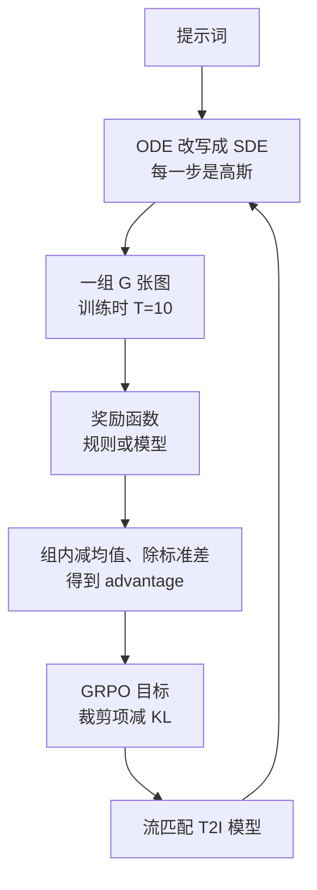
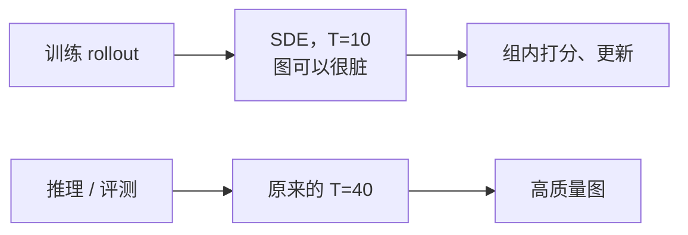
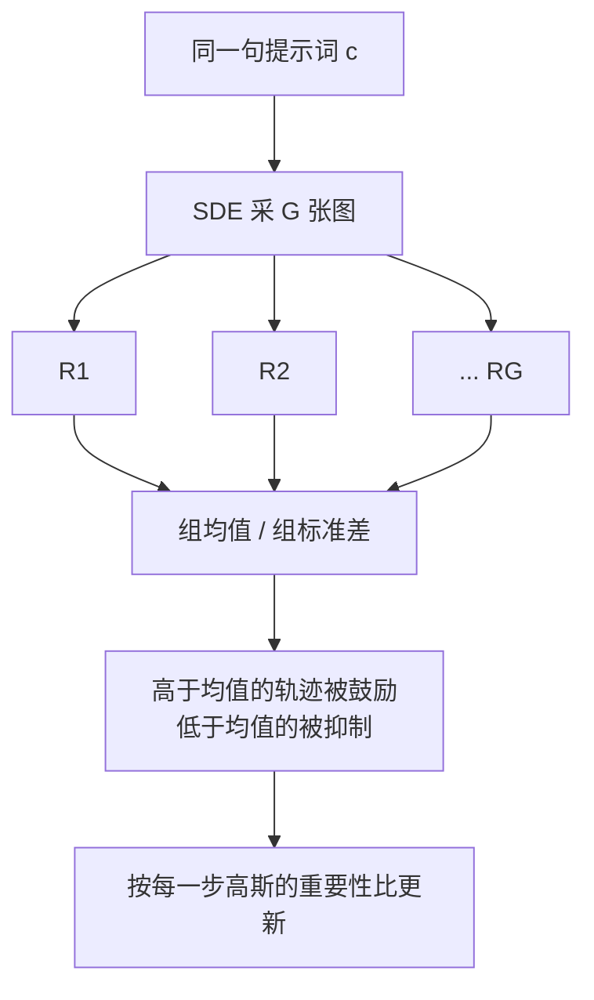

# Flow-GRPO：流匹配的 ODE 是确定的，怎么才能做在线 RL

<!-- release-date: 2025-05-08 -->

> 本文依据快手可灵团队与港中文 MMLab、清华大学、南京大学、上海人工智能实验室合作的 **Flow-GRPO: Training Flow Matching Models via Online RL**，即 arXiv:2505.05470v5（封面水印 `arXiv:2505.05470v5 [cs.CV] 27 Oct 2025`），共 29 页，录用为 NeurIPS 2025。本地件就是官方最新版，不必再换 PDF。下文括号里的 `(PDF p. N)` 一律指这份 29 页原件的自身页码，与页脚印刷页码一致。
>
> 文中始终分开三件事：**报告写了什么**、**我们如何解释**、**哪些是外部补充**。从图里读出来的数会明说。
>
> 署名以港中文 MMLab 的欧阳万力（Wanli Ouyang）为通讯作者；并列第一作者是 Jie Liu（港中文 / 可灵 / 上海 AI Lab）与 Gongye Liu（清华 / 可灵）。可灵团队（Kling Team, Kuaishou Technology）是企业主导方，所以本站目录是 Kuaishou。代码在论文首页给出：<https://github.com/yifan123/flow_grpo>。
>
> `release-date` 取 **2025-05-08**。这是一篇方法论文，没有对外可用的产品模型；按本模块规则取该技术首次官方公开日。GitHub 仓库 `created_at` 为 2025-05-08T13:07:56Z，首次 commit「first commit」为 2025-05-08T13:11:39Z；arXiv v1 提交于同日 17:58:45 UTC。代码公开略早于论文上传，日历日相同。Hugging Face 权重仓库的 `createdAt` 按规则不是首发日。证据见文末。

## 读这篇之前只需要这几个词

这篇论文踩在两条已经分开很远的路上。一条是今天文生图的主干，一条是大语言模型里突然好用的在线强化学习。读正文前，只把会反复出现的六个名字说清楚。

**流匹配（flow matching）与校正流（rectified flow）**：不把图一步加噪成弯路，而是在「干净数据」和「高斯噪声」之间拉一条直线，让网络学这条线上每一点的速度。推理时从噪声出发，沿速度场走回去。本站 [Stable Diffusion 3 篇](../StabilityAI/Stable-Diffusion-3.md) 讲的就是这条直线怎么被选成文生图的默认目标。本篇实验的底板 **SD3.5 Medium（SD3.5-M）** 是同一条线上后来的中等规模模型，校正流加 MMDiT，本篇把它当已经训好的生成器来做强化学习，不再重讲架构。

**常微分方程（Ordinary Differential Equation，ODE）**：给定当前位置和速度，下一步被完全决定。同一份噪声加同一句提示词，走 ODE 永远得到同一张图。

**随机微分方程（Stochastic Differential Equation，SDE）**：速度之外再加一项布朗运动。同一步可以走出许多条不同的路。

**策略（policy）$\pi_\theta$**：强化学习把「正在被训练的那个模型」叫策略。在这篇里，策略就是流匹配模型在每一步给出的「下一张半成品图」的分布。

**优势（advantage）**：这次采样比「本来该期待的水平」好多少。强化学习更新参数靠的是这个差值，不是原始分数。

**组相对策略优化（Group Relative Policy Optimization，GRPO）**：同一道题一次采一组回答，用组内平均分当基线，不再另训一个价值网络。它的出处是本站 [DeepSeekMath 篇](../DeepSeek/DeepSeekMath.md)。本篇只借用这个想法，不要把那边数学 LLM 的数字带过来。

## 一句话先说清

流匹配之所以采样又快又稳，是因为它走一条确定的 ODE：起点定了，整条轨迹就定了。

在线强化学习之所以能把模型往奖励上推，恰恰需要相反的东西：同一步必须能走出不同的结果，并且能写出「走这条路的概率」，才能做策略梯度。

这两件事对着干。此前的在线 RL 多半做在早期扩散模型上；流匹配这边更常见的是离线偏好对齐，比如 DPO。论文的判断是：在线 RL 对流匹配几乎还没被认真试过（PDF p. 1）。

Flow-GRPO 的回答不是再训一个会随机的新模型，而是两步改采样、一步接算法（PDF p. 1–2）：

1. 把确定的 ODE 改写成**边际分布不变的等价 SDE**，让每一步变成可以对着写概率的高斯采样；
2. 训练时把去噪步数砍到 10，推理仍用原来的 40 步，让在线采样变得负担得起；
3. 对同一句提示词采一组图，用 GRPO 的组内相对优势更新模型。

头条数字在摘要里（PDF p. 1），后面会回到表里核对口径：

- 组合生成：SD3.5-M 的 GenEval 从 63% 到 95%；
- 视觉文字：准确率从 59% 到 92%；
- 作者强调奖励上升时，图像质量和多样性没有被明显拿去换。

如果只记一句：

> **确定轨迹没有探索，也就没有策略梯度。先把 ODE 改成边际不变的 SDE，再承认训练不需要好看的图，在线 RL 才能接到流匹配上。**

## 这份 PDF 各页写了什么

29 页里，正文到第 10 页结束，第 11–15 页是参考文献，第 16 页起才是附录。方法的公式证明和质量、超参、算力，都在附录里，不在主文。

| 报告章节 | PDF 页 | 讲了什么 | 密度 |
|---|---|---|---|
| 摘要 + Figure 1 | p. 1–2 | 两个策略、GenEval 63%→95%、文字 59%→92%；训练曲线与质量柱 | 高 |
| §1 引言 | p. 1–2 | ODE 不能随机采样；多步生成让在线 RL 太贵；三条贡献 | 高 |
| §2 相关工作 | p. 3 | LLM 的 GRPO、扩散/流匹配、五类 T2I 对齐；并发的语音 GRPO 与推理期 SDE | 中 |
| §3 预备 | p. 3 | 校正流公式；去噪写成多步 MDP | 高 |
| §4 + Figure 2 | p. 3–5 | GRPO 接到流上；ODE-to-SDE；Denoising Reduction | 高 |
| §5.1 | p. 5–6 | 三个任务、规则奖励、质量指标 | 高 |
| Table 1 + Figure 3 | p. 7 | GenEval 主表与定性对比 | 高 |
| Table 2 + Figure 4–5 | p. 8 | 三任务总表；和其他对齐方法比；组大小 $G$ | 高 |
| Figure 6–7 + Table 3–4 | p. 8–10 | KL、步数、噪声强度；T2I-CompBench++ 与未见物体/计数 | 高 |
| §6 结论与限制 | p. 10 | 视频、多奖励、规模、偶发奖励黑客 | 中 |
| 附录 A | p. 17–18 | ODE 与 SDE 边际等价的推导 | 高 |
| 附录 B | p. 18–19 | 质量指标、模型链接、超参、24 张 A800 | 高 |
| 附录 C.1–C.5 | p. 19–23 | SFT/DPO/RWR、DDPO、ReFL、ORW；FLUX.1-Dev；有无 KL 的曲线 | 高 |
| 附录 C.6–D | p. 22–29 | 定性墙、训练过程可视化、10 步脏图仍能训 | 中 |

三件事先知道：

1. **主文把「几乎没有奖励黑客」说得很满，表把条件写在 KL 上。** 拿掉 KL 以后，GenEval 和 OCR 的质量指标明显掉，PickScore 任务则是多样性塌成一种风格（PDF p. 8，Table 2，Figure 6）。正文的那句「very little reward hacking」对应的是加了 KL 的设定。
2. **训练用 LoRA，不是全参数。** 这件事写在附录 B.3：$\alpha=64$、$r=32$，分辨率 512（PDF p. 19）。主文几乎不提。
3. **视频只作为未来工作出现。** 限制节点了奖励设计、多目标权衡和规模，没有视频实验（PDF p. 10）。

## 卡住在线 RL 的不是「流匹配不够强」，是两件互相冲突的事

报告没有单开一节骂 ODE，但引言把要拆的东西点得很清楚（PDF p. 1–2）。

### 裂缝一：轨迹是确定的，策略梯度没有东西可乘

校正流把干净图 $x_0$ 和噪声 $x_1$ 用直线连起来（PDF p. 3，式 1）：

$$
x_t=(1-t)\,x_0+t\,x_1,\qquad t\in[0,1]
$$

$t=0$ 是数据，$t=1$ 是噪声，和 SD3 篇同一套两端。网络学的是速度 $v_\theta(x_t,t)$，目标速度就是 $x_1-x_0$（PDF p. 3，式 2）。推理沿这条 ODE 走（PDF p. 4，式 6）：

$$
\mathrm{d}x_t=v_t\,\mathrm{d}t
$$

人话：现在站在 $x_t$，速度告诉你下一步精确落在哪。离散之后，相邻两步是一对一映射。

策略梯度要的是另一件事。它必须能写出「在这个状态下选这个动作的概率」，并且同一步要能试出好坏不同的动作。ODE 给不出这个概率：转移是狄拉克函数，对数概率要么是 0、要么是 $-\infty$。随机性只剩最初那一粒噪声种子。种子一固定，整张图就定了。

可以把它想成考试。ODE 是把标准答案手抄一遍，抄十次还是同一份。强化学习要的是让同一个学生就同一道题交 24 份不同的卷，再告诉他哪几份更好。手抄给不了这 24 份。

### 裂缝二：在线 RL 靠采样堆数据，而流模型每张图都要走很多步

在线方法每更新一次，都要当场生成新样本、打分、再更新。流模型为了出好看的图，通常要几十步网络前向。模型一大，这个代价更刺眼。论文原话是：要把 RL 用到图像或视频生成上，提高采样效率是必要的（PDF p. 2）。

离线 DPO 可以事先做好偏好对，不跟这个矛盾硬撞。在线 RL 躲不开。

两条裂缝互相独立。只把 ODE 改成 SDE，采样仍按 40 步收数据，训练会慢到不实用。只砍步数、却还走确定 ODE，组内 24 张图会挤成几乎一样的东西，优势估计没有区分度。这篇要两条一起修。

## 全景：先让每一步能随机，再让训练不必出好看的图

下图按 Figure 2（PDF p. 4）重画，属于**机制示意**，不含实测时间。原图用「A photo of four cups」当例子，训练采样写的是 $T=10$。

读这张图时抓住四件事：

- 随机性加在每一步去噪上，不只加在初始噪声里；
- 训练轨迹可以很脏，因为 GRPO 只用组内相对名次；
- 奖励只在最后一张干净图上给一次，中间步的优势从这一个标量广播出去（PDF p. 3–4）；
- 推理时仍走原来的步数，不把 10 步训练日程带到用户面前（PDF p. 5）。

去噪被写成一个马尔可夫决策过程，沿用的是 DDPO 那套扩散 RL 的写法（PDF p. 3）：状态是 $(c,t,x_t)$，动作是下一步 $x_{t-1}$，策略是 $p_\theta(x_{t-1}\mid x_t,c)$，转移是确定的，奖励只在 $t=0$ 出现。后面所有公式都站在这套 MDP 上。

注意时间方向：校正流的 $t$ 从 0（图）走到 1（噪声）；MDP 的下标从 $T$（噪声）走到 $0$（图）。同一条生成过程，两套计数。读公式时先看这一步是在加噪还是在去噪，不要混。

## 设计一：ODE-to-SDE——边际不变，路径却能分叉

### 旧问题

GRPO 的优势估计和重要性比，都要求你能从当前策略里**采样出一组不同的轨迹**，并且写出每一步的条件概率 $p(x_{t-1}\mid x_t,c)$（PDF p. 4–5）。扩散模型天生接近这件事：正向逐步加高斯噪声，反向是方差递减的马尔可夫链。流匹配不是。它的前向是确定 ODE，常用采样器把相邻时刻做成一对一映射。

论文把失败写成两条（PDF p. 5）：

1. 确定性动力学下要算 $p(x_{t-1}\mid x_t,c)$，得去估散度，计算上不划算；
2. 更致命的是没有探索。随机性只剩初始种子时，训练效率会明显掉下去。§5.3 后面用噪声强度 $a$ 把这件事画出来。

### 新设计

不重新训一个随机模型，而是给现成的速度场配一条**等价 SDE**：每一步有噪声，但任意时刻 $t$ 上 $x_t$ 的边际分布，仍和原来的 ODE 一样（PDF p. 5）。

关键的反向 SDE 是（PDF p. 5，式 7）：

$$
\mathrm{d}x_t=\Bigl(v_t(x_t)-\frac{\sigma_t^2}{2}\nabla\log p_t(x_t)\Bigr)\mathrm{d}t+\sigma_t\,\mathrm{d}w
$$

$\mathrm{d}w$ 是维纳过程增量，$\sigma_t$ 控制随机性有多强。$\nabla\log p_t$ 是当前噪声水平下的分数函数，也就是「现在这点相对于该时刻的分布，处在更密还是更稀的地方」。

人话分两层：

- 如果只在 ODE 上硬加噪声，边际会被噪声撑宽，模型原来学到的「这一刻图应该长什么样」就被改掉了；
- 分数项是补偿。它把漂移往回拉一点，让分布的形状保持原样，但单条路径仍然会左右分叉。

校正流里，分数可以由速度场反写出来，不必另训一个分数网络。代入 $\alpha_t=1-t$、$\beta_t=t$ 之后，生成用的 SDE 变成（PDF p. 5，式 8）：

$$
\mathrm{d}x_t=\Bigl[v_t(x_t)+\frac{\sigma_t^2}{2t}\bigl(x_t+(1-t)v_t(x_t)\bigr)\Bigr]\mathrm{d}t+\sigma_t\,\mathrm{d}w
$$

附录 A 把 Fokker–Planck 方程怎么对上 ODE 的连续性方程、正向 SDE 怎么翻成反向 SDE、速度怎么解出分数，写了一整页（PDF p. 17–18）。主文只保留这一步：现成的 $v_\theta$ 已经够用。

### 工作机制：每一步变成各向同性高斯

欧拉–丸山离散之后，一步更新是（PDF p. 5，式 9）：

$$
x_{t+\Delta t}=x_t+\Bigl[v_\theta(x_t,t)+\frac{\sigma_t^2}{2t}\bigl(x_t+(1-t)v_\theta(x_t,t)\bigr)\Bigr]\Delta t+\sigma_t\sqrt{\Delta t}\,\epsilon
$$

其中 $\epsilon\sim\mathcal N(0,I)$。噪声日程取

$$
\sigma_t=a\sqrt{\frac{t}{1-t}}
$$

$a$ 是标量超参。靠近数据（$t\to 0$）时 $\sigma_t$ 变小，细节阶段少搅；靠近噪声时随机性更大。

这一步的政策含义很具体：**策略 $\pi_\theta(x_{t-1}\mid x_t,c)$ 是各向同性高斯**（PDF p. 5）。对数概率是闭式的，两个高斯之间的 KL 也是闭式的，而且最后能写成速度差的平方：

$$
D_{\mathrm{KL}}(\pi_\theta\|\pi_{\mathrm{ref}})\propto\bigl\|v_\theta(x_t,t)-v_{\mathrm{ref}}(x_t,t)\bigr\|^2
$$

完整系数见 PDF p. 5。我们只需要记住：KL 不再需要用蒙特卡洛去估散度，它就是「当前速度场离参考速度场有多远」。

附录 D 的 Figure 19 把这件事画成四格：40 步 ODE 和 40 步 SDE 看起来几乎一样；SDE 收到 10 步、5 步，颜色开始漂、细节发糊（PDF p. 23、29）。论文的读法是：SDE 没有把质量改坏；变糊的是步数，不是随机项。

### 收益

没有这条转换，后面的 GRPO 公式写不出来。有了它，同一句提示词可以走出一组不同的图，每一步都能算重要性比。§5.3 用噪声强度 $a$ 做消融：太小（$a=0.1$）探索不够，奖励爬得慢；加到 $a=0.7$ 明显加快；再加到 $1.0$ 没有额外好处，继续加大则图像质量崩掉、奖励归零、训练失败（PDF p. 9，Figure 7b）。默认取 $a=0.7$（PDF p. 19）。

### 代价与边界

- **等价的是边际，不是单条路径。** 每张图的走法变了，只保证「这一刻看起来还像原来那个噪声档的图」。
- **$a$ 是新的主超参。** 太小等于没改；太大等于把预训练分布搅烂。论文只在 OCR 任务上扫了 0.1 / 0.4 / 0.7 / 1.0，没有给出跨任务的自动日程。
- **时间符号在离散式里写得比较跳。** 校正流的 $t$ 往噪声方向增大，生成往数据方向走。式 9 写成 $x_{t+\Delta t}$，实现时步长符号要自己对齐。这是我们的阅读提醒，不是报告的缺陷声明。
- **并发路线被论文自己排除了。** 同期有人把速度预测改成同时输出均值和方差的高斯，从而直接做 GRPO，但那要重训预训练模型（PDF p. 3，引 [56]）。Flow-GRPO 的选择是：预训练权重不动，只改采样器。

### 可迁移启发

当你的生成器走的是确定动力学，却想接策略梯度，先问「随机性加在哪、补偿写在哪」。只加噪声、不改漂移，等于换了一个模型；写出边际不变的补偿项，才是在原来的模型上要探索。能把分数从现成速度场解出来，就不要再训一个网络。

## 设计二：Denoising Reduction——训练不需要好看的图

### 旧问题

即便每一步都能随机采样了，在线 RL 仍要为每一次更新生成整组图像。SD3.5-M 默认推理是 40 步（PDF p. 5）。一组 24 张、再乘上提示词数量，前向次数会把墙钟吃满。这就是引言里的第二条裂缝。

### 新设计

训练采样用很少的去噪步，推理仍用原来的步数（PDF p. 5）。论文把训练步数 $T$ 设为 10，推理保持 SD3.5-M 的默认 40 步。

它依赖一个看起来不像真的观察：在线 RL 不需要用高质量图像当训练数据。GRPO 要的是组内相对名次。10 步的图可以很脏，只要 24 张里「更像四个杯子」的那几张仍然排得出来，优势就有信号。

Figure 2 右下角那句英文是论文自己写的：*Wow, few-step, low-quality samples suffice for RL*（PDF p. 4）。

### 工作机制

采集数据和最终给人看，用两套日程：

这是根据 PDF p. 5 与附录 D 重画的机制示意图。附录 C.7 还写明：训练过程可视化一律用 40 步 ODE 采样，为的是看模型真正交给用户的质量，而不是看 10 步脏图（PDF p. 22）。

### 收益

Figure 7a 把采集步数从 40 收到 10，三个任务上都给出超过 4 倍的加速，而且最终奖励几乎不变（PDF p. 8–9）。再收到 5 步，并不稳定地更快，有时反而更慢，所以后面实验固定 10 步。这些步数消融关掉了 KL，为的是单独看采样成本（PDF p. 8）。OCR 和 PickScore 的同类曲线在 Figure 9（PDF p. 21）：横轴是 GPU 小时，10 步明显比 40 步先到平台。

### 代价与边界

- **10 步不是新的推理日程。** 把它拿到产品推理上，会得到附录 D 那种偏色、发糊的图。加速发生在训练采集，不发生在用户侧。
- **5 步的失败说明「越少越好」不成立。** 步数太少，相对名次也会乱，优化信号变差。
- **这篇没有证明 10 步对所有流模型都对。** 底板是 SD3.5-M，默认 40 步；FLUX.1-Dev 的补充实验没有再扫一遍步数（PDF p. 22）。

### 可迁移启发

在线 RL 的采样质量和部署质量，不必是同一个东西。只要奖励看的是相对排序，训练样本可以比产品输出更糙、更便宜。先问「我的学习信号是绝对分数还是组内名次」，再决定采集要多精。

## 设计三：接到 GRPO——同一句提示词的一组图互相当尺子

### 旧问题

即便有了随机轨迹，还要决定优势从哪来。PPO 会再训一个和策略一样大的价值网络，去估「走到这一步，最后大概能得几分」。图像这里奖励本来就只在最后一张图上出现一次（PDF p. 3），中间几十步都是零。用一个末端标量去训逐时刻的价值函数，贵，而且信号极稀。论文选择 GRPO，理由写得很短：去掉价值网络更省显存；PPO 也可以按同样方式接到流匹配上，他们只是没走那条（PDF p. 3）。

GRPO 在语言模型里的完整来龙去脉见 DeepSeekMath 篇。下面只讲它在去噪 MDP 上变成了什么。不要把那边 MATH 的百分点写进来。

### 新设计

对同一句提示词 $c$，当前策略采 $G$ 张图 $\{x_0^i\}_{i=1}^{G}$，以及各自的反向轨迹。奖励只看最终图。第 $i$ 张图的优势是组内标准化（PDF p. 4，式 4）：

$$
\hat A_t^i=\frac{R(x_0^i,c)-\operatorname{mean}\bigl(\{R(x_0^i,c)\}_{i=1}^{G}\bigr)}{\operatorname{std}\bigl(\{R(x_0^i,c)\}_{i=1}^{G}\bigr)}
$$

式子带了 $t$ 下标，但右边没有 $t$。也就是说，这是结果监督：整条轨迹的每一步共用同一个优势。谁比这组的平均更好，整条去噪路径都被鼓励；谁更差，整条都被压。

然后用带裁剪的重要性比去更新，再减去一项 KL（PDF p. 4，式 5）。把密集下标拆开：

第 $i$ 张图、第 $t$ 步的重要性比

$$
r_t^i(\theta)=\frac{p_\theta(x_{t-1}^i\mid x_t^i,c)}{p_{\theta_{\mathrm{old}}}(x_{t-1}^i\mid x_t^i,c)}
$$

衡量的是：当前策略比采样时的旧策略，更偏爱这一个高斯跳变多少。因为每一步是高斯，这个比是闭式的。

目标函数对 $G$ 张图、$T$ 个去噪步求平均，每一步取

$$
\min\bigl(r_t^i\hat A_t^i,\ \operatorname{clip}(r_t^i,1-\varepsilon,1+\varepsilon)\,\hat A_t^i\bigr)-\beta\,D_{\mathrm{KL}}(\pi_\theta\|\pi_{\mathrm{ref}})
$$

和语言模型里的 GRPO 同构，只是「Token」换成了「去噪步」，「回答」换成了「一张图的整条轨迹」。

### 工作机制

这是根据 PDF p. 4 的 Figure 2 右半与式 4–5 重画的机制示意图，不含实测分数。

组大小 $G$ 不是装饰。Figure 5 用 PickScore 做奖励：$G=24$ 全程稳定；$G=12$ 和 $G=6$ 后半段崩溃（PDF p. 8–9）。论文的解释是：组太小，优势估得不准，方差变大。默认 $G=24$（PDF p. 19）。

初始噪声也要够乱。附录 C.3 比较「每条 rollout 换一份初始噪声」和「同一份初始噪声」：换噪声的那条奖励一直更高（PDF p. 21–22，Figure 10）。SDE 给的是路径上的随机性；初始噪声给的是起点上的随机性。两处都要。

### 收益

这套接法让流匹配能直接吃不可微的奖励。检测器、OCR、VLM 打分，只要最后吐一个标量就行。附录拿这件事对比 ReFL：ReFL 要把奖励梯度反传到随机挑的靠后时间步 $t\in[30,40]$，因此奖励必须可微；GRPO 没有这个限制（PDF p. 20）。

### 代价与边界

- **优势是轨迹级的，不是逐步的。** 一张图只在最后得分，中间哪一步真正帮了倒忙，算法并不知道。这是结果监督的固有稀疏，论文没有做逐步奖励。
- **$G$ 和显存绑在一起。** 24 是他们能稳定住的数，不是被证明的最优。更小会崩，更大的成本论文没扫。
- **超参跨任务几乎锁死，只有 KL 系数 $\beta$ 在变**：GenEval 和文字渲染 $\beta=0.04$，PickScore $\beta=0.01$（PDF p. 19）。学习率、裁剪半径 $\varepsilon$ 的具体数值，正文和附录 B.3 都没写。

### 可迁移启发

把生成器的每一步写成「可以对着写概率的条件分布」之后，语言模型里那套组内相对优势可以直接搬过来。基线不一定要预测，能负担组采样，就用组内经验分布。组太小的崩溃，在这边和在 LLM 里是同一类病。

## 设计四：KL 不是早停，是把模型拴在预训练附近

### 旧问题

T2I 的奖励几乎都是代理。检测器只看框和颜色，OCR 只看编辑距离，PickScore 只看它被训过的那种人类偏好。把代理分数最大化，模型很容易找到捷径：数量对了但苹果缩成一排小点，字对了但场景没了，或者所有种子都画出同一种漂亮风格。论文把这叫做奖励黑客（PDF p. 6、p. 8）。

### 新设计

在 GRPO 目标里保留 KL 项，把系数调到训练过程中散度小且几乎不变，让策略贴着预训练权重走（PDF p. 8）。论文特别写了一句：KL 在实验上不等于早停。合适的 KL 能达到无 KL 版本同样高的任务奖励，同时保住质量，只是训练更长（PDF p. 2、p. 22）。

### 工作机制与收益

Table 2 把有无 KL 拆开写（PDF p. 8）。任务分数在测试提示词上评，图像质量和偏好分数在 DrawBench 上评。

| 设定 | GenEval | OCR | 任务 PickScore | Aesthetic | DeQA | ImageReward | DrawBench PickScore | UnifiedReward |
|---|---:|---:|---:|---:|---:|---:|---:|---:|
| SD3.5-M 原模型 | 0.63 | 0.59 | 21.72 | 5.39 | 4.07 | 0.87 | 22.34 | 3.33 |
| GenEval，无 KL | 0.95 | — | — | 4.93 | 2.77 | 0.44 | 21.16 | 2.94 |
| GenEval，有 KL | 0.95 | — | — | 5.25 | 4.01 | 1.03 | 22.37 | 3.51 |
| OCR，无 KL | — | 0.93 | — | 5.13 | 3.66 | 0.58 | 21.79 | 3.15 |
| OCR，有 KL | — | 0.92 | — | 5.32 | 4.06 | 0.95 | 22.44 | 3.42 |
| PickScore，无 KL | — | — | 23.41 | 6.15 | 4.16 | 1.24 | 23.56 | 3.57 |
| PickScore，有 KL | — | — | 23.31 | 5.92 | 4.22 | 1.28 | 23.53 | 3.66 |

读这张表时分三层：

**第一，任务分数几乎不靠牺牲 KL 来换。** GenEval 有无 KL 都是 0.95；OCR 无 KL 0.93、有 KL 0.92，摘要里的 59%→92% 取的是有 KL 这一档（PDF p. 1、p. 8）。

**第二，GenEval 和 OCR 拿掉 KL，质量会被掏空。** DeQA 从 4.07 掉到 2.77，ImageReward 从 0.87 掉到 0.44。Figure 6 左栏把「四个苹果」变成一排小红点，把「驾驶舱屏幕写 fuel low」变成一块只剩大字的黑牌（PDF p. 9）。

**第三，PickScore 任务更阴。** 拿掉 KL 以后，Aesthetic、DeQA 这些质量分数不降反升，但视觉多样性塌掉：不同种子画出几乎同一张林肯演讲图（PDF p. 8–9，Figure 6 右栏）。质量指标和多样性不是一回事。论文认为，这里是因为 PickScore 和评测指标有重叠，质量柱看不出黑客，多样性才会暴露。

Figure 12 的三条学习曲线对应「KL 不是早停」：有 KL 的任务分数爬得慢，但能爬到和无 KL 差不多的高度（PDF p. 22–23）。早停会把无 KL 曲线在质量崩溃前截断，那会同时截掉还没到的任务分；KL 是换一种优化路径。

### 代价与边界

- **KL 让训练变长。** 这是论文自己承认的代价（PDF p. 2）。
- **它挡不住所有提示词。** 限制节写：偶发的奖励黑客仍会出现在某些提示上（PDF p. 10）。
- **$\beta$ 靠手调。** 两个任务 0.04、一个任务 0.01，没有扫描表。

### 可迁移启发

代理奖励上涨时，至少同时看三类东西：任务准确率、独立的质量指标、多样性。前两类在 PickScore 实验里同时上涨，第三类已经塌了。KL 的位置也值得学：它是独立正则，没有混进优势里，所以「这张图好不好」和「离预训练有多远」还分得开。

## 三个任务：规则奖励和模型奖励都能推

实验底板是 SD3.5-M，LoRA 微调，分辨率 512，24 张 NVIDIA A800（PDF p. 19）。超参除 $\beta$ 外跨任务共用。

### 组合生成：GenEval

GenEval 测的是计数、空间关系、颜色、属性绑定这类组合能力，官方流水线用检测框和颜色去自动打分（PDF p. 6）。训练提示词由官方脚本套模板随机组合；测试集做了严格去重，连「A and B」与「B and A」都视为同一条，并从训练集删掉。因为底座在六项上的初始准确率差很多，提示词比例被设成

**Position : Counting : Attribute Binding : Colors : Two Objects : Single Object = 7 : 5 : 3 : 1 : 1 : 0**

单物体已经是 0.98，不再喂。奖励是规则：计数用 $r=1-|N_{\mathrm{gen}}-N_{\mathrm{ref}}|/N_{\mathrm{ref}}$；位置和颜色先看数量对不对，对了给部分分，位置或颜色也对了再给剩下的（PDF p. 6）。

Table 1 是主结果（PDF p. 7）。其他模型的数字来自 [7] 或原论文，只有 SD3.5-M 一行是他们自己跑的。

| 模型 | Overall | Single | Two | Counting | Colors | Position | Attr. Binding |
|---|---:|---:|---:|---:|---:|---:|---:|
| DALL-E 3 | 0.67 | 0.96 | 0.87 | 0.47 | 0.83 | 0.43 | 0.45 |
| Janus-Pro-7B | 0.80 | 0.99 | 0.89 | 0.59 | 0.90 | 0.79 | 0.66 |
| GPT-4o | 0.84 | 0.99 | 0.92 | 0.85 | 0.92 | 0.75 | 0.61 |
| FLUX.1 Dev | 0.66 | 0.98 | 0.81 | 0.74 | 0.79 | 0.22 | 0.45 |
| SD3.5-L | 0.71 | 0.98 | 0.89 | 0.73 | 0.83 | 0.34 | 0.47 |
| SANA-1.5 4.8B | 0.81 | 0.99 | 0.93 | 0.86 | 0.84 | 0.59 | 0.65 |
| SD3.5-M | 0.63 | 0.98 | 0.78 | 0.50 | 0.81 | 0.24 | 0.52 |
| SD3.5-M+Flow-GRPO | 0.95 | 1.00 | 0.99 | 0.95 | 0.92 | 0.99 | 0.86 |

几件必须读出来的事：

- **总体从 0.63 到 0.95，超过表里的 GPT-4o 0.84。** Figure 1a 的训练曲线也画了这条跨越（PDF p. 2、p. 7）。GPT-4o 的图像来自别人的评测，不是同一套采样预算下的公平对打。
- **涨得最狠的是原来最差的位置和计数。** Position 0.24→0.99，Counting 0.50→0.95。提示词比例把力气压在这两项上，这个涨幅不能当成「六项被同等对待」。
- **属性绑定仍是短板。** 0.86 已经是表内最高，但离 1.00 最远。Figure 3 的定性墙对应计数、颜色、属性绑定和位置四类提示（PDF p. 7）。

DrawBench 上的质量柱在 Figure 1b–c：Aesthetic 5.39→5.25，DeQA 4.07→4.01，几乎持平；ImageReward 0.87→1.03，UnifiedReward 3.33→3.51，略升（PDF p. 2）。这些柱对应的是有 KL 的 GenEval 模型，和 Table 2 第一块一致。

### 视觉文字

提示词模板是 `A sign that says "text"`，引号里的字符串就是图上必须出现的字。训练 20K、测试 1K，由 GPT-4o 生成（PDF p. 6）。奖励是编辑距离：

$$
r=\max\bigl(1-N_e/N_{\mathrm{ref}},\,0\bigr)
$$

$N_e$ 是渲染文字与目标的最小编辑距离，$N_{\mathrm{ref}}$ 是引号内字符数。这个奖励同时当准确率。底座 0.59，有 KL 的 Flow-GRPO 到 0.92，无 KL 到 0.93（PDF p. 1、p. 8）。

### 人类偏好

奖励模型是 PickScore，来自大规模「同一提示词的两张图，人更喜欢哪张」（PDF p. 6）。任务测试集上的 PickScore 从 21.72 到 23.31（有 KL）或 23.41（无 KL）。前面已经说过：无 KL 时质量柱不降，多样性降。

### 泛化：同一套 GenEval 模型，换一套没见过的题

Table 4：训练用 60 类物体，测试 20 个未见类，总体 0.64→0.90；计数只训 2、3、4 个物体，测 5–6 个从 0.13 到 0.48，测 12 个从 0.02 到 0.12（PDF p. 10）。12 个物体仍然很低。论文说「泛化很好」，表显示的是：**关系能搬，极端计数搬不远。**

Table 3 把同一套 GenEval 训出来的模型丢到 T2I-CompBench++ 上，物体类别和关系与训练分布差得很远（PDF p. 10）。2D-Spatial 从 0.2850 到 0.5447，Numeracy 从 0.5927 到 0.6752，Color 从 0.7994 到 0.8379。Texture 从 0.7338 掉到 0.7236，是这张表里少数没涨的格子。不要把「组合能力全面提升」读成每一列都升。

## 和其他对齐方法比：在线、组内、相对，三件事缺一就弱

对照实验的采集方式对齐到和 Flow-GRPO 同一组大小，只改更新规则（PDF p. 6、p. 19）：

- **SFT**：一组里只留奖励最高的那张，做监督微调；
- **Flow-DPO**：最高当 chosen、最低当 rejected，走 DPO；
- **Flow-RWR**：组内对奖励做 softmax，再做加权似然。

离线变体用冻结的预训练模型采集；在线变体每 40 步更新一次采集模型。

Figure 4 在组合生成上画：Flow-GRPO 把所有基线甩开；在线 DPO 优于离线 DPO；在线 DPO 的 $\beta$ 不是越小越好，太小会崩（PDF p. 7–8）。Figure 8 换到 PickScore 任务，横轴改成训练提示词条数，因为 DPO 一类的 batch 和 Flow-GRPO 不同（PDF p. 20）。读图能看到：离线 RWR 几乎不涨，和 DDPO 原论文对 RWR 的观察一致；DDPO 被他们用同一套 ODE-to-SDE 接到 SD3.5-M 上之后，奖励涨得慢，后半段崩溃；ReFL 可微、能涨，但低于 GRPO，而且用不了 OCR、检测器这种不可微奖励（PDF p. 20）。

ORW 是在线奖励加权回归，用 Wasserstein-2 正则代替 KL。同一套人类偏好设定下，ORW 的测试奖励从 28.79 爬到 29.15 后掉到 23.05；Flow-GRPO 从 28.79 爬到 29.89（PDF p. 21，Table 5）。CLIP 与多样性分数上 Flow-GRPO 也更高（Table 6：CLIP 30.18 对 28.40，多样性 1.02 对 0.97）。

这里有一个必须标成「本文读表」的不一致：Table 5 的起点 28.79 和 Table 2 的任务 PickScore 21.72 不在一个量纲上。论文没解释这两张表的计分是否同一套预处理。不要把 28.79 和 21.72 当成同一个 PickScore。

FLUX.1-Dev 上只做了 PickScore 这一项补充。Figure 11 的评测曲线从 21.94 到 23.43；Table 7 的 DrawBench 上 Aesthetic 5.71→6.02，ImageReward 0.85→1.32，PickScore 22.62→23.97，DeQA 从 4.31 微降到 4.24（PDF p. 22）。说明这套接法不绑死在 SD3.5-M 上，但 FLUX 没有 GenEval、没有 OCR、没有 KL 消融。

## 报告自己写下的限制，和它没写的东西

限制节很短，三条都指向视频（PDF p. 10）：

1. **奖励设计。** 检测器、跟踪器当规则奖励，可以逼物理真实和时序一致，但更强的奖励模型还没有；
2. **多奖励权衡。** 真实、平滑、连贯会打架，要小心调；
3. **规模。** 视频比文生图贵得多，需要更高效的采集和训练。KL 有用，但让训练变长，而且某些提示词上仍会奖励黑客。

### 报告没写、读的人容易以为有的

- 学习率、优化器、$\varepsilon$、训练步数、每张 GPU 的 batch。附录 B.3 只给了 $T$、$G$、$a$、分辨率、$\beta$、LoRA 的 $\alpha$ 和 $r$；
- 总 GPU 小时的单一数字。正文和附录只说 24 张 A800，具体小时数散落在 Figure 1、7、9 的横轴上，没有汇总；
- 全参数微调。实际是 LoRA；
- 1024 分辨率。训练是 512；
- 逐步奖励或过程监督。优势是轨迹级广播；
- 视频、图像编辑、多奖励联合训练的实验。限制节点名了，表里没有；
- CFG 在 RL 过程中怎么处理。论文没讨论。

### 被实验支持 / 只是作者观察 / 尚未公开

**被表支持的：** GenEval 0.63→0.95、OCR 0.59→0.92；有 KL 时 DrawBench 质量不崩；无 KL 时 GenEval/OCR 质量掉、PickScore 多样性掉；采集 40→10 步加速超过 4 倍；$G=6/12$ 会崩、$G=24$ 稳定；$a=0.7$ 在 OCR 上最好；在线 DPO/SFT 弱于 Flow-GRPO；未见物体总体 0.64→0.90。

**作者观察、没有单独对照的：** 「几乎没有奖励黑客」这句，取决于你把多样性算不算进去；Texture 在 T2I-CompBench++ 上微降，论文没有讨论；12 个物体 0.12 仍低，却被放进「强泛化」那一段。

**没有公开、因而无法核实的：** 完整优化器配方；每项实验精确的墙钟；LoRA 插在哪些层；SDE 离散实现的步长符号与代码是否完全一致——代码是外部补充，不是 PDF 内容。

## 可迁移启发

1. **确定动力学要接策略梯度，先改采样器，再改网络。** 边际不变的 SDE 让预训练权重还能用。把速度改成显式高斯、重训底座，是另一条更贵的路，论文自己没有走。
2. **探索要有补偿。** 只加噪声会换模型；写出分数补偿，才是在原来的边际上要多样性。$a$ 就是这根旋钮。
3. **训练样本的质量和产品样本的质量，可以不是同一个数。** 相对排序算法吃得了脏样本。把采集步数和推理步数绑死，是在为用户体验付训练账单。
4. **组太小，相对优势就变成噪声。** $G=6$ 的崩溃和「省一点采样」的直觉对着干。组大小是稳定性超参，不是吞吐量旋钮。
5. **代理奖励至少配三面镜子：任务分、质量分、多样性。** 两面上涨、第三面塌掉，在 PickScore 无 KL 里发生过。
6. **KL 不要当成早停的替代品来调。** 早停截的是时间，KL 改的是可行域。论文用曲线证明这两件事经验上不等价。
7. **规则奖励能把短板推到接近满分，并不自动等于开放世界能力。** GenEval 位置 0.99，T2I-CompBench++ 的 2D-Spatial 只有 0.54，12 个物体只有 0.12。评测长什么样，模型就被推成什么样。
8. **能闭式写 KL，就不要用样本去估。** 各向同性高斯这一步，把图像 RL 的正则从「又一个网络」变成「速度差的平方」。换生成器时，先看转移分布是不是高斯。

## 关键词回看

| 词 | 在这篇报告里指什么 |
|---|---|
| **流匹配 / 校正流** | 数据与噪声之间的直线速度场。本篇 $t=0$ 为数据、$t=1$ 为噪声（PDF p. 3） |
| **ODE** | $\mathrm{d}x_t=v_t\mathrm{d}t$。确定轨迹，不能直接做策略梯度（PDF p. 1、p. 4） |
| **SDE** | 在速度上加维纳增量，并用分数项保持边际（PDF p. 5） |
| **ODE-to-SDE** | 不重训网络，只改采样器，让每一步变成高斯（PDF p. 5） |
| **边际分布不变** | 每个 $t$ 上 $x_t$ 的分布仍与原 ODE 相同，变的是单条路径（PDF p. 5、p. 17） |
| **Denoising Reduction** | 训练采集 $T=10$，推理 $T=40$（PDF p. 5） |
| **去噪 MDP** | 状态 $(c,t,x_t)$，动作 $x_{t-1}$，奖励只在最终图（PDF p. 3） |
| **GRPO** | 同一提示词采 $G$ 张图，组内标准化当优势，无价值网络（PDF p. 4） |
| **组大小 $G$** | 默认 24；12 和 6 会崩（PDF p. 8–9、p. 19） |
| **噪声水平 $a$** | $\sigma_t=a\sqrt{t/(1-t)}$，默认 0.7（PDF p. 5、p. 9） |
| **重要性比 $r_t^i$** | 当前与旧策略在该高斯跳变上的概率比（PDF p. 4） |
| **KL 系数 $\beta$** | GenEval/OCR 为 0.04，PickScore 为 0.01；不是早停（PDF p. 8、p. 19） |
| **LoRA** | $r=32$，$\alpha=64$，分辨率 512（PDF p. 19） |
| **GenEval** | 组合生成的规则评测；本篇主指标 0.63→0.95（PDF p. 7） |
| **奖励黑客** | 任务分涨、质量或多样性被拿去换。有 KL 时被压住，并非完全消失（PDF p. 8–10） |

## 最后的判断

这篇论文最值得记住的，不是 GenEval 到了 95%。

它真正做对的是把一个被说成「流匹配不能做在线 RL」的障碍，拆成两个可以单独打的工程问题：

> **没有随机性，是采样器的问题，不是速度场的问题；训练太贵，是你坚持采集必须好看，不是 RL 必须走满推理步数。**

ODE-to-SDE 让策略梯度的对数概率重新可写；Denoising Reduction 让在线采集重新可负担；GRPO 让优势不再依赖一个价值网络。三件事缺一，实验里都能看到失败模式：没有足够 $a$ 就爬不动，步数不砍就慢四倍以上，组太小就崩，没有 KL 就黑客。

它不是免费午餐。主结果绑在 SD3.5-M、512 分辨率、LoRA、规则可验证的组合任务上；开放世界的 Texture 没有涨；12 个物体仍然不会数；视频只停留在限制节。把摘要读成「流匹配加上 GRPO 就已经对齐完了」，作者自己的无 KL 表和 12 物体那一格都不支持。

若只带走一条能用在自己项目里的原则：当你的模型和你的学习算法对随机性的需求相反，先改采样过程的数学，再谈奖励和规模。

## 资料与阅读边界

**本篇依据的唯一原件**：`papers/Kuaishou/Flow-GRPO.pdf` = arXiv:2505.05470v5（2025-10-27，29 页）。所有 `(PDF p. N)` 均指该文件页码。封面正式标题为 *Flow-GRPO: Training Flow Matching Models via Online RL*。水印为 `arXiv:2505.05470v5 [cs.CV] 27 Oct 2025`。NeurIPS 2025。

**版本核验**：arXiv 官方提交历史为 v1（2025-05-08）、v2（2025-05-11）、v3（2025-06-04）、v4（2025-07-16）、v5（2025-10-27）。动笔前核过 [abs/2505.05470](https://arxiv.org/abs/2505.05470)，本地件与 v5 一致，未做替换。没有对 v1–v4 做逐句差分。

**本文自己读图或对表得到、报告未直接写成结论的：**

- Figure 1 的 Aesthetic / DeQA / ImageReward / PickScore / UnifiedReward 柱，与 Table 2 有 KL 的 GenEval 行一致；
- Table 5 起点 28.79 与 Table 2 任务 PickScore 21.72 量纲不同，不能混用；
- Figure 11 的 21.94→23.43 与 Table 7 DrawBench PickScore 22.62→23.97 不是同一列数；
- T2I-CompBench++ 的 Texture 从 0.7338 降到 0.7236；
- 未见 12 物体只有 0.12，与「强泛化」的措辞不完全同尺度。

**跨篇：** 校正流、时间步抽样和 MMDiT 的源头见本站 [Stable Diffusion 3 篇](../StabilityAI/Stable-Diffusion-3.md)。GRPO 在数学 LLM 里被提出的原始形态见 [DeepSeekMath 篇](../DeepSeek/DeepSeekMath.md)；本篇不重复那边的语料流水线和 MATH 数字。

**外部补充**（均非本报告内容，不把后续工作的数字写进正文）：

- 官方代码：<https://github.com/yifan123/flow_grpo>。首次 commit 2025-05-08T13:11:39Z。仓库后来加了 FLUX、Qwen-Image、Wan2.1、Flow-GRPO-Fast、GRPO-Guard 等，这些都不在 v5 PDF 里。
- 论文附录还指向可视化页 <https://gongyeliu.github.io/Flow-GRPO>。
- 三个任务的 LoRA 权重在 Hugging Face collection [jieliu/sd35m-flowgrpo](https://huggingface.co/collections/jieliu/sd35m-flowgrpo-68298ec27a27af64b0654120)。`createdAt` 不是首发日。
- 作者在 2025-05-11 发推宣布代码和模型开源，晚于 5 月 8 日的仓库与 arXiv v1。
- 论文相关工作里点名的并发语音工作 F5R-TTS（arXiv:2504.02407）和推理期 SDE（arXiv:2503.19385），只作为 PDF 已引用的对照，不展开。
- 本篇之后把「流匹配 + GRPO」继续往下做的工作，包括 [DanceGRPO](https://arxiv.org/abs/2505.07818)（扩散与流的统一视觉 RL）、[MixGRPO](https://arxiv.org/abs/2507.21802)（混合 ODE-SDE 提速，本站索引已有行）、[Pave-GRPO](https://arxiv.org/abs/2606.01636)（平均速度分解）。**它们不是本报告的内容。**

**release-date 取证**：`2025-05-08`。对象是公开技术，无对外可用产品模型，取该技术首次官方公开日。GitHub 仓库创建于 2025-05-08T13:07:56Z，首次代码提交于 13:11:39Z（[yifan123/flow_grpo](https://github.com/yifan123/flow_grpo)）；arXiv v1 提交于同日 17:58:45 UTC（[abs/2505.05470](https://arxiv.org/abs/2505.05470)）。代码公开略早于论文，日历日相同。Hugging Face 权重页按规则不采用 `createdAt`。证据强度：**强**（GitHub 与 arXiv 官方时间戳；无更早的官方产品发布）。
