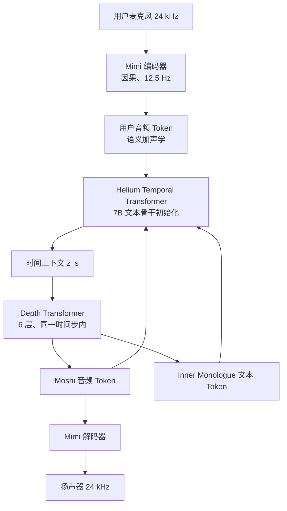
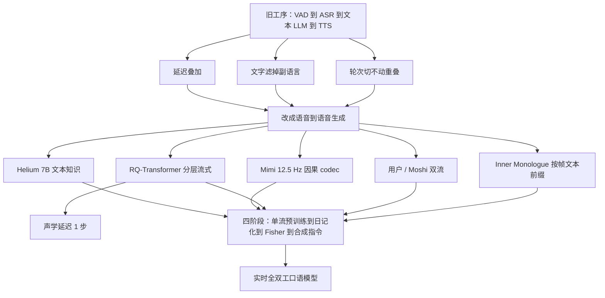

# Moshi：对话不必先变成字，也不必等轮到你

<!-- release-date: 2024-09-17 -->

> 本文依据 Kyutai 的 **Moshi: a speech-text foundation model for real-time dialogue**，即 arXiv:2410.00037v2（2024-10-02 修订，67 页）。封面水印为 `arXiv:2410.00037v2 [eess.AS] 2 Oct 2024`。动笔前核过 [arXiv 摘要页](https://arxiv.org/abs/2410.00037)：v1 于 2024-09-17 提交，v2 于 2024-10-02 修订；本地件与当前官方 v2 一致，**未做替换**。全文页码均指这份 67 页 PDF 自身的页码。
>
> `release-date` 取 **2024-09-17**。这篇文章讲的是对外开源的 Moshi / Mimi，按「官方博客 / demo / GitHub 实质公开 / 权重提交」里最早可核对的可用日取值，不用 v2 修订日，也不用 Hugging Face 仓库的 `createdAt`。证据见文末「资料与阅读边界」。
>
> 全文严格区分三件事：报告明确写了什么、我们如何解释它、哪些是外部资料补充。凡是外部补充都会给出链接并标明；报告没写的地方会直接写「报告没写」，不拿别处的做法去填。

## 一段对话被切成了三次等待

假设你对着语音助手说：

> 「等下——不对，你先听我说完——其实我想改成周二。」

真人对话里，这句话几乎不会被当成「一轮完整输入」。中间有停顿、有自我打断、有抢话，听的人一边听一边已经在准备接口。现有多数语音助手做不到这件事。它们走的是一条**级联流水线**：先用语音活动检测（Voice Activity Detection，VAD）判断你说完了没有，再用自动语音识别（Automatic Speech Recognition，ASR）把声音变成字，再把字交给文本大语言模型，最后用文本转语音（Text-to-Speech，TTS）把回复读出来。（PDF p.1–2）

这条流水线把同一句话弄丢三次。

**第一次丢在等待。** 每一段都要等上一段结束。识别要等你说完，语言模型要等转写出来，合成要等整句文本写完。延迟会沿组件叠加，报告写的典型体验是「数秒」；而自然语言对话的回应时间只有几百毫秒。（PDF p.2）

**第二次丢在文字。** 中间那段「思考」发生在文本里。情绪、口音、周围的非语音声音，以及「等下」这种还没变成完整句子的信号，都过不了文字瓶颈。报告把这类东西叫非书面信息：副语言（paralinguistic）信息，以及非语音音频。（PDF p.2）

**第三次丢在轮次。** 流水线默认对话是「你说完 → 我说完」的单说话人片段。口语不是这样。重叠语占说话时间的 10% 到 20%；「嗯」「我懂了」这种不打断对方的附和（backchanneling）更常见。把对话切成轮次，抢话和重叠就没有位置可放。（PDF p.2）

Moshi 的主张不是把这三段各做快一点，而是换问题本身：

> **把口语对话写成语音到语音的生成。** 模型一直在听，也一直在出声（说话或沉默）；用户和系统各走一条音频流；系统在出声学 Token 之前，先给自己对齐一串文本 Token 当腹稿。

后面每一节都在给这三件事补机制和证据。

## 读之前：把语音这条线补到刚好够用

这一节是**通用背景**，不是这份报告的内容。报告自己讲到的地方，正文会另外标页码。

### 声音要先变成编号，模型才写得出来

原始波形是一串采样点。常见配置是一秒采两万四千次。这个密度直接喂给语言模型不现实，中间必须压缩。

压缩后常见两种形态：

- **连续特征**：一小段声音压成浮点向量。细节多，但不是词表里的编号，模型没法像写字一样一个个吐出来。
- **离散音频 Token**：一小段声音映射成词表里的整数编号，和文字 Token 平级。信息更少，但因为是编号，可以自回归生成，再交给解码器还原成波形。

Moshi 走的是第二条路：进出都是离散音频 Token。

### 帧率：一秒钟占几个位置

压缩之后，一秒声音变成多少个 Token，叫**帧率**（frame rate）。12.5 Hz 就是一秒 12.5 个时间步。帧率直接决定两件事：语言模型一秒要跑几步，以及理论延迟下限——一步还没算完，声音就出不去。

### 残差向量量化：同一小段声音切成好几层编号

**残差向量量化**（Residual Vector Quantization，RVQ）可以先记住这个比喻：先用一把粗尺子量，再用下一把尺子量剩下的误差，一层层把细节补上。每一层量化器吐出一个编号。所以同一个时间步会有多个音频 Token：第一层更粗、更靠近「说了什么」，后面几层更细、更靠近「嗓子和房间听起来什么样」。

报告沿用前人的叫法，把这两类信息分别叫**语义 Token** 和**声学 Token**。（PDF p.9）

### 全双工：不是「听完再答」

电话里的全双工，意思是两边可以同时说话。用在这里就是：模型**一直在听，也一直在生成**——生成的不一定是话，也可以是接近静音的波形。它不再需要一个显式的「现在轮到谁」开关。

### 会反复出现的词，先认一遍

- **Helium**：Moshi 底下那根 7B 参数的文本语言模型骨干。
- **Mimi**：把 24 kHz 波形编成 12.5 Hz 离散 Token、再解回去的流式神经音频编解码器（neural audio codec）。
- **Temporal Transformer / Depth Transformer**：时间轴上的大 Transformer，以及同一个时间步里、负责把多层 Token 按层次吐出来的小 Transformer。
- **Inner Monologue（内心独白）**：系统侧先预测与音频对齐的文本 Token，再预测语义和声学 Token。
- **Moshiko / Moshika**：开源权重用的两个合成音色名。报告正文几乎不这么叫，后文会分开写。

## 一句话先说清

Moshi 是一个**语音—文本基础模型**，也是一套**全双工口语对话框架**。它从文本语言模型 Helium 出发，用 Mimi 把声音变成离散 Token，再用一个较小的音频语言模型，按层次、可流式地生成这些 Token；同时把「自己的声音」和「用户的声音」写成两条并行流，从而取消显式轮次。（PDF p.1–3、p.6–7）

它还把前人「先语义、后声学」的层次往前伸了一层：每个时间步先出对齐好的文本 Token，再出音频 Token。这套训练和推理安排叫 Inner Monologue。摘要给出理论延迟 160 ms、实践约 200 ms；160 ms 的拆法在正文，200 ms 的测法正文没写，后文单独核对。（PDF p.1、p.27）

如果只记一个判断，可以记这个：

> **口语对话的三个旧瓶颈——叠加延迟、文字过滤、轮次假设——不是三个独立 bug，而是同一种建模方式的后果。Moshi 用「双流语音生成 + 每帧一份文本腹稿」把它们一次换掉。**

## 报告地图：67 页里真正要跟的几条线

这份 PDF 很长，附录又占了后三分之一。先按原报告自己的章节把主张和数字钉住，避免后文被附录带着走。

| 原报告位置 | 它在主张什么 | 关键数字 / 图表 | PDF 页码 |
|---|---|---|---|
| 摘要、§1 | 级联流水线有三病；Moshi 改成语音到语音 | 理论 160 ms、实践 200 ms；重叠语 10%–20%；自然对话约 230 ms | p.1–3 |
| §2 | 音频语言模型、语音—文本模型、口语对话模型三条前史 | 把 Inner Monologue 和双流放进这个坐标 | p.4–6 |
| §3.1–3.2、表 1 | Helium 7B 文本骨干 | 32 层、维度 4096、词表 32 000、上下文 4096、2.1T Token | p.6–9、p.8 |
| §3.3、图 2 | Mimi：因果 codec + 语义蒸馏 + 分裂 RVQ | 12.5 Hz、1.1 kbps、80 ms 帧、8 个码本、码本大小 2048 | p.9–12 |
| §3.4、图 3–4 | RQ-Transformer、声学延迟、双流、Inner Monologue | 每步 $K=2Q+1=17$ 条流；Depth Transformer 6 层 | p.12–17 |
| §4、表 1 | 四阶段训练和数据 | 700 万小时无监督音频；Fisher 2 000 小时；合成指令约 2 万小时 | p.8、p.17–21 |
| §5.1–5.5、表 2–8 | 文本、codec、生成消融、音频语言建模、口语问答 | Inner Monologue 把口语问答几乎翻三倍 | p.22–30 |
| §5.6–5.8、表 9–12 | 对话动态、流式 ASR/TTS、量化 | TTS WER 4.7%；ASR WER 5.7%；演示用 8 bit | p.31–35 |
| §6、表 13–16 | 毒性、复读、音色一致性、水印 | ALERT 综合 83.05；音色一致约 98.7% | p.36–40 |
| §7 | 收束 | 160 ms 理论延迟、约 5 分钟上下文 | p.41–42 |
| 附录 A–F | codec 补消融、音频指纹、ASR/TTS 推演、量化伪影、毒性细表、合成稿样例 | 只在正文需要数字时引用 | p.54–67 |

附录 C 的图 8、图 9 对理解「改一个延迟就能从对话模型变成流式 ASR / TTS」有用；附录 F 只是合成对话样例，不必当实验读。附录 B 的音频指纹、附录 D 的熵谱，属于安全与量化的证据链，正文点到即可。

## 先看全景：一次对话在模型里怎么走

报告图 1（PDF p.7）把系统画成三条并行流：用户音频、Moshi 音频、Moshi 的文本腹稿。下面这张按它重画，只表示机制，**不是实测时间轴**。

读这张图时先抓住四件事：

1. **用户流在推理时不是模型「编」出来的。** 真实麦克风音频经 Mimi 编码后写入用户流；模型对用户流的预测只在离线模拟对话时才用。（PDF p.17）
2. **Moshi 流一直在生成。** 用户说话时，这条流解码成接近静音的自然波形，而不是一个固定的「静音符号」；对应的文本流则填 PAD。（PDF p.17）
3. **文本流只属于 Moshi。** 报告明确说，他们不对用户流做实时转写，因为那会重新引入外部 ASR，和端到端语音到语音打架。（PDF p.16）
4. **大模型跑在 12.5 Hz 上。** 一秒音频只需要 12.5 次 Temporal Transformer 前向，而不是按 RVQ 层数乘出 100 步。（PDF p.13）

这套东西要成立，得先有一个不太差的文本骨干、一个又低帧率又流式的 codec，以及一种能在「同一个时间步吐 17 个 Token」的生成结构。下面按这个顺序讲。

## 核心设计一：Helium，一根从零训的 7B 文本骨干

### 旧问题：纯语音模型会说话，但没有世界知识

报告在相关工作里写得很直白：只在原始语音上做自回归的模型，能学到词法、句法和一点语义，但事实知识和推理「差到接近没有」。所以后来的语音—文本模型都想把文本 LLM 的知识接进来。（PDF p.4）

Moshi 没有去微调一颗现成的开源 7B，而是自己训了 Helium。

### Helium 长什么样

Helium 是标准的自回归 Transformer，改了几处现在已经很常见的零件（PDF p.7）：

- 注意力块、前馈块和最后线性层的入口用 RMSNorm；
- 旋转位置编码（RoPE），上下文 4 096 个文本 Token；
- 训练时用 FlashAttention；
- 前馈是带 SiLU 门控的 GLU；
- 分词器是 SentencePiece 的 unigram 模型，词表 32 000，主要面向英语；数字拆成单个数字，并保留 byte-backoff，避免信息被分词器丢掉。

优化器是 AdamW，先固定学习率再余弦衰减。规模写在表 1：隐藏维度 4 096，MLP 维度 11 264，32 个头，32 层。（PDF p.8）

### 文本数据怎么滤

Helium 的预训练数据是高质量来源和过滤后的网页各占一块。报告后文给出配比：12.5% 来自 Wikipedia、Wikibooks、Wikisource、Wikinews、StackExchange 和科学论文集 peS2o；其余 87.5% 来自 CommonCrawl 的十次抓取（2018-30 到 2023-40）。Wikipedia 用了 2017、2018、2019、2021、2022 五个 dump，而不是反复扫同一版。（PDF p.17）

网页这边的过滤分三步（PDF p.8–9）：

1. **去重。** 从 CommonCrawl 的 WET 文本起步，按行做 FNV-1a 哈希加 bloom filter，去掉导航栏一类 boilerplate；再用 fastText 做模糊去重，连续至少 3 行被判为重复才删。
2. **语言识别。** 文档级 fastText，只留英语，阈值 0.85。
3. **质量过滤。** 用高质量来源和随机网页训练一个 9 类 fastText，按行打分再按长度加权汇总，超过阈值才留。动机是不但要「像高质量」，还要能按领域（维基、STEM、人文）做更细的控制。

报告没有公开这 2.1T Token 的精确配比表，也没有给过滤阈值的具体数字。2.1T 这个总量来自「500k 步、每步 4.2M Token」（PDF p.3、p.8、p.20）。

### 它接在系统哪里

Helium 不是 Moshi 旁边的另一个模型。Moshi 的 Temporal Transformer **用 Helium 初始化**，之后在音频数据上继续训；为了防止灾难性遗忘，音频预训练阶段有一半时间仍在打纯文本 batch，而且文本和音频用两套优化器状态。（PDF p.8、p.20）

可迁移的点很具体：把文本 LLM 接进语音系统时，不只是「用它的权重当初始化」，还要在后续音频训练里给文本一条活路。后文口语问答会显示，关掉这条活路，分数会掉。（PDF p.29–30）

## 核心设计二：Mimi，把语义蒸馏进一个流式 codec

### 旧问题：高质量重建和「能当语言来建模」互相打架

音频语言模型常用两套 Token：

- **声学 Token** 来自神经 codec，重建好听，但不太像语言；
- **语义 Token** 来自自监督语音模型，和音素、词语更相关，却几乎不能重建高保真波形。

前人的做法是两套编码器一起用：先生成语义，再生成声学。报告指出这条路不适合实时——语义 Token 往往不是因果的，只能离线算；两套编码器本身也贵。（PDF p.9）

Mimi 要的是：**一个因果模型，同时给出语义和声学，帧率还要低到 LLM 跑得动。**

### 基本规格

Mimi 的骨架来自 SoundStream / EnCodec 一类 SeaNet 自动编码器加 RVQ。波形是单声道 24 kHz。编码器由 4 个残差卷积块组成，步幅分别是 $(4,5,6,8)$，最后再接一个步幅为 2 的一维卷积，于是：

$$
\frac{24000}{4\times 5\times 6\times 8\times 2}=12.5\ \text{Hz}
$$

潜在维度 $D=512$。解码器结构对称，用转置卷积回到 24 kHz。所有卷积都是因果的，所以编解码都能流式跑。（PDF p.10）

量化用 $Q=8$ 个码本，每个码本 $N_A=2048$。在 12.5 Hz 下，比特率是 1.1 kbps。量化前先把 512 维投影到 256 维，解完再投影回去。训练时还做了两件提高可扩展性的事：quantizer dropout，以及「一个序列有 50% 的概率完全不量化、把未量化嵌入直接送给解码器」。（PDF p.11）

帧长和步幅都是 80 ms：送进第一帧 80 ms 音频，Mimi 就吐出第一个潜在时间步，解码后还是 80 ms 声音。这是后面 160 ms 理论延迟的一半来源。（PDF p.11）

### 瓶颈里加 Transformer，是为了「压得更狠还能听」

在量化和反量化两侧，Mimi 各放了一个 8 层、8 头、维度 512 的因果 Transformer，上下文 250 帧（20 秒），RoPE，GELU，并用 LayerScale（对角线初值 0.01）稳住训练。报告的消融说：解码器侧的 Transformer 对听感有帮助，编码器侧的 Transformer 则有助于后面的语义蒸馏。（PDF p.10–11、p.23–24）

因为加了 Transformer，优化器从纯卷积 codec 常用的 Adam 换成 AdamW，只对 Transformer 参数做权重衰减 $5\cdot 10^{-2}$。学习率 $8\cdot 10^{-4}$，batch 128，随机 12 秒窗口，训 400 万步；Transformer 实际上下文限制在 10 秒。（PDF p.11）

### 蒸馏语义，但不要让声学去吃残差

Mimi 把 WavLM 的非因果表示蒸馏进第一层量化器。WavLM 吃 16 kHz、50 Hz、1 024 维；Mimi 是 24 kHz、12.5 Hz、512 维。训练时把波形降到 16 kHz，算 WavLM，再做步幅 4、核 8 的平均池化对到 12.5 Hz。报告特别写了一句：这个平均池化必须做成**非因果**才有效，而它只在训练时用，所以不破坏推理时的流式。（PDF p.12）

第一层量化器的输出经线性层对齐到 1 024 维，和 WavLM 目标算余弦距离。

如果把这层语义 VQ 当作一条普通 RVQ 的第 0 层，后面 7 层就只能去量化「语义层吃剩的残差」。语义和声学于是在同一条残差链上抢容量：ABX 音素可分性变好，重建质量变差。报告的数字是：蒸馏后 ABX 明显下降，MUSHRA 也一起掉。（PDF p.12、p.23）

于是他们把 RVQ **劈开**：一路是单独的语义 VQ，另一路是 7 层声学 RVQ，两路输出相加再送给解码器。语义不必再为声学让出残差。图 2 画的就是这个分裂结构。（PDF p.10、p.12）

### 只留对抗损失，客观指标会骗人

基线训练沿用 EnCodec 的多尺度梅尔重建损失加多尺度 STFT 判别器。他们另外试了**纯对抗训练**：只留特征匹配损失和判别器损失。客观指标 VisQOL 会崩，但主观 MUSHRA 反而大幅变好。表 4 里，纯对抗训练的 Mimi 是 MUSHRA 81.0，混用重建损失的是 58.8；前者 VisQOL 只有 1.84，后者是 2.82。（PDF p.11、p.24）

这是报告里一个很值得记住的负结果：**改训练目标时，VisQOL / MOSNet 可能和听感走反。** 他们因此以 MUSHRA 为主来选 codec。（PDF p.24–25）

### 和报告自己的对照放在一张表里

表 4 是 PDF 自己的主 codec 表。这里只抄它写过的对照，不另加外部主表。

| 模型 | 采样率 | 帧率 | 比特率 | 因果 | ABX ↓ | MUSHRA ↑ |
|---|---|---|---|---|---:|---:|
| Ground Truth | 24 kHz | — | — | — | — | 90.6 |
| RVQGAN | 24 kHz | 75 Hz | 1.5 kbps | 否 | — | 31.3 |
| SemantiCodec | 16 kHz | 50 Hz | 1.3 kbps | 否 | 42.2% | 64.8 |
| SpeechTokenizer | 16 kHz | 50 Hz | 1.5 / 4.0 kbps | 否 | 3.3% | 45.1 / 74.3 |
| Mimi，仅对抗损失 | 24 kHz | 12.5 Hz | 1.1 kbps | 是 | 8.7% | 81.0 |
| Mimi，非仅对抗 | 24 kHz | 12.5 Hz | 1.1 kbps | 是 | 8.1% | 58.8 |

（PDF p.24，表 4）

Mimi 的 ABX 不如 SpeechTokenizer 漂亮，但它在更低帧率、更低比特率、而且完全因果的约束下拿到了更高的 MUSHRA。对 Moshi 来说，12.5 Hz 比 50 Hz 更关键：Temporal Transformer 每秒少跑四倍。

### 代价和边界

- 语义蒸馏和重建确实冲突，分裂 RVQ 是折中，不是两头都拿到最优。表 3 里，加蒸馏后 ABX 从 23.3% 降到大约 6.5%–8.1%，MUSHRA 从 65.9 降到 57.8，再靠分裂 RVQ 拉回到 64.0。（PDF p.24）
- 纯对抗训练让客观指标失效，以后做 codec 搜索时不能只看 VisQOL。
- 报告没有把「最终装进 Moshi 的那份 Mimi checkpoint」和表 4 的哪一行一一钉死。能确定的是：Moshi 用的是 12.5 Hz、8 码本、带语义蒸馏、因果流式的 Mimi。（PDF p.8、p.14）

对自己的项目：如果生成模型必须实时，codec 的第一约束往往不是「重建分数最高」，而是**因果 + 帧率低到骨干网跑得起**。语义信息用蒸馏塞进第一码本，比再跑一个非因果语义编码器更适合这条约束。

## 核心设计三：RQ-Transformer，让「一步里的多层 Token」跑得动

### 旧问题：8 个码本若展平，一秒要预测 100 次

Mimi 每个时间步吐 8 个音频 Token。如果把它们展平成一条普通语言模型序列，12.5 Hz 会变成每秒 100 个自回归步。五分钟音频就是 30 000 步。报告拿英语文本做对照：同样一秒钟大约只要 3 到 4 个文本 Token。（PDF p.13）

这既贵，也无法流式。

### 新设计：时间用大模型，深度用小模型

RQ-Transformer 把序列拆成两个轴（PDF p.13–14，图 3）：

- **Temporal Transformer**：沿时间 $s=1,\ldots,S$ 走，结构就是 Helium 那根 7B；
- **Depth Transformer**：在同一个时间步内部，沿码本深度 $k=1,\ldots,K$ 走，只有 6 层、维度 1 024、MLP 4 096、16 个头。

记 $V_s=(V_{s,1},\ldots,V_{s,K})$ 为第 $s$ 步所有子序列。时间模型先根据过去所有步，给出一个上下文向量：

$$
z_s=\operatorname{Tr}_{\mathrm{Temp}}(V_0,\ldots,V_{s-1})\in\mathbb{R}^{d}
$$

第一个子序列（后面会是文本 Token）直接用一层线性打到词表；从第二个子序列起，深度模型吃 $z_s$ 和本步已经生成的 Token：

$$
\ell_{s,k}=\operatorname{Tr}_{\mathrm{Depth}}(z_s,V_{s,1},\ldots,V_{s,k-1})\in\mathbb{R}^{N_k}
$$

训练目标是让 $\mathrm{softmax}(\ell_{s,k})$ 逼近正确的条件分布：第一步只看历史，后面的步还看本步已经吐出的更粗 Token。（PDF p.13–14，式 1–3）

实现上还有两个细节：

- Temporal Transformer 每个时间步的输入，是 $K$ 张嵌入表在上一步各 Token 上的**求和**；
- Depth Transformer 不用共享参数。每个码本有自己的线性层、投影和全连接。报告说不同子序列可能需要不同变换；这个 Transformer 很小，所以训练和推理时间几乎不受影响。表 6 显示这种按深度参数化是有益的。（PDF p.14）

### 声学延迟：让大模型去管「语义和音色怎么配合」

如果同一个时间步里 8 个码本互相依赖太强，6 层的 Depth Transformer 会扛不住。他们给声学 Token 加一个延迟 $\tau$：语义 Token 仍在当前步，声学 Token 挪到 $\tau$ 步之后。

$$
\begin{aligned}
V_{s,1} &= A_{s,1}\\
V_{s,q} &= A_{s-\tau,q} && s\ge \tau+1,\ q>1\\
V_{s,q} &= 0 && s<\tau+1,\ q>1
\end{aligned}
$$

（PDF p.14，式 4）

直觉是：语义「这一帧在说什么」先由 7B 的时间模型看完，声学「这一帧嗓子细成什么样」再跟上来。延迟越大，同一步内的码本越接近条件独立，小模型越好学；但延迟本身就是延迟。

表 5、表 6 把这笔账算清楚了（PDF p.25–26）：

- 做成 MusicGen 那种 $[0,1,2,3,4,5,6,7]$，理论延迟 8 步 = 640 ms，实时对话不能用；这时 RQ-Transformer 相对独立分类头几乎没优势。
- 改成 $[0,2,2,2,2,2,2,2]$（240 ms）后，不用 RQ-Transformer 的困惑度是 135.4，用了是 36.8。低延迟下，深度模型从「可有可无」变成「关键零件」。
- 零延迟 $[0,0,\ldots,0]$ 是 80 ms 下限，可懂度明显差一截；加 80 ms（一步延迟）就有明显提升，再加到 240 ms 还有一点，但边际变小。

最终配方：预训练用声学延迟 2，微调用延迟 1，对应理论延迟 160 ms。（PDF p.8、p.27）

### 语义 Token 的损失要加重

即便有了延迟，各 RVQ 层的损失仍会互相打架。他们把语义 Token 的损失权重设成 100，其余音频层（以及后面 Inner Monologue 的文本 Token）保持 1。再配上按深度参数化，生成语音的转录负对数似然从 4.09 降到 3.65，转录长度从 519 升到 602。真正的大跳，要等 Inner Monologue。（PDF p.21、p.26）

## 核心设计四：双流，取消「现在轮到谁」

### 旧问题：一条 Token 流装不下两个人同时说话

即便已经是语音到语音，如果用户和系统仍被排进同一条序列，模型还是得假设某一刻只有一个人在响。重叠一旦出现，这条流就得在同一个位置表示两个声源。报告认为这正是级联系统和多数「语音—文本交错」模型处理不了抢话的原因。（PDF p.5–6、p.15）

前人里，dGSLM 已经把用户和系统分成两条语义 Token 流，并用 Siamese 网络联合处理。报告把它写成概念验证：不在线、没有文本 LLM 的知识、也不建模声学。（PDF p.6）

### 新设计：用户一条，Moshi 一条，延迟规则相同

给定 Moshi 的音频流 $A_{t,q}$ 和用户的音频流 $A'_{t,q}$，两边都套上同样的声学延迟，再拼进同一个 $V$。推理时：

- 虚线以下、属于 Moshi 的 Token（文本 + Moshi 音频）由模型采样；
- 虚线以上、属于用户的 Token 来自真实输入，模型对它们的预测被丢掉。（PDF p.15、图 4；p.17）

没有「切换说话人」的特殊符号。Moshi 可以一直说、一直听，也可以同时做两件事。用户在说、Moshi 不说时，Moshi 音频流解码成「自然静音」——接近静音的波形，而不是一个固定取值；文本流则填 PAD。反过来，强制采样一个 EPAD，就可以让 Moshi 马上开口。（PDF p.17）

图 4 还展示了重叠：Moshi 说「Hello, I'm Moshi.」的后半段，用户已经在说「Hey Moshi!」。两段话在同一批时间步里各自占自己的流，不需要先做说话人分离再排队。（PDF p.15）

### 它是怎么被训出来的，而不是「架构画出来就有」

双流不是预训练一开始就有的。报告把能力分成四段往上加（PDF p.8、p.18–21）：

1. **单流音频预训练。** 700 万小时无监督音频，所有说话人混在一条流里，文本流是所有人的词。这一阶段还不会全双工。
2. **用日记化模拟双流。** 对无监督音频跑 PyAnnote，随机抽一个说话人当「主说话人」，其余当「别人」。两路分别编码。这能让模型看见「有人在、有人静」，但静音是人工切出来的，没有真实重叠。
3. **Fisher 上学真的双流。** Fisher 是电话对话，左右声道本来就是分开录的。这是 Moshi 获得「同时听和说」的关键阶段。原始 8 kHz，用 AudioSR 升到 24 kHz。
4. **指令微调。** 把第一说话人的身份固定成 Moshi，用合成对话脚本做成「一个助手 + 一个用户」。

所以双流是**数据形态和损失共同训出来的行为**，不是推理时插一个开关。没有分轨数据，这个架构会退化成「假装有两路、其实还是单声道切分」。

对自己的项目：如果产品需要抢话、附和、重叠，优先去找或造「分轨对话」，而不是在单流模型上后加 VAD。架构能表达重叠，训练数据不能，最后还是不会。

## 核心设计五：Inner Monologue，每帧先写一句腹稿

### 旧问题：纯音频生成能出声，但事实和句子质量撑不住

报告自己做了对照：只在音频域生成已经「像样」，但让 Moshi 同时建模自己语音的文本表示，会明显抬高语言质量。（PDF p.15、表 7）

前人有两条路，报告都觉得不够：

- **Chain-of-Modality**（Spectron、SpeechGPT）：先把整句答成文本，再拿这句文本当前缀去生成语音。文本质量好，但必须等整句写完才开口，和直播对话不相容。（PDF p.5）
- **并行文本和语音**（PSLM）：降低了等待，但报告认为回答质量会掉，而且仍然依赖 ASR，副语言还是没了。（PDF p.5–6）

Spirit-LM 则是在序列中途做模态切换：这段是语音 Token，下一段改成文本 Token。Moshi 不要切换，它要**每一句既是文本也是语音**。（PDF p.5、p.16）

### 新设计：文本是语义前面的那一层前缀

Inner Monologue 把 Moshi 自己的转写写成一条文本流 $W$，插入 $V$ 的第一条子序列。于是每个时间步的层次变成：

**文本 → 语义 → 延迟后的声学。**

这是把 AudioLM 那套「从粗到细」往前伸了一层：最粗的不是语义音频，而是字。（PDF p.16）

转写本身来自 Whisper large-v3 和词级时间戳；这是训练数据的构造工具，不是推理时的级联 ASR。用户流故意不写文本。（PDF p.16、p.18）

### 文本和 12.5 Hz 音频怎么对齐

文本 Token 疏，音频 Token 密。英语对话里，大约 65% 的文本位置其实是填充。他们引入两个永远不会出现在词里的特殊 Token：PAD 和 EPAD。（PDF p.16）

对齐规则用人话讲：

1. 整条 $W$ 先填满 PAD；
2. 第 $i$ 个词从 Whisper 时间戳换算到帧下标 $t_i$；
3. 在 $t_i$ 处写入这个词的文本 Token，后面继续 PAD，直到下一个词；
4. 下一个词开始前写一个 EPAD，表示「填充到此结束」。

形式化是：

$$
\begin{aligned}
W_{t_i-1} &\leftarrow \mathrm{EPAD}\\
W_{t_i+j} &\leftarrow w_{i,j} && j\le n_i
\end{aligned}
$$

若 $t_i=1$，EPAD 放在位置 1，文本 Token 往后挪。EPAD 不允许覆盖上一个词的真实 Token。报告说 EPAD 不是严格必需，但能把「要不要结束这个词」拆成两步决策，训练更稳。（PDF p.16，式 5）

图 4 里可以看到：`Hello,` 占一帧，随后 PAD、EPAD，再写出 `I'm Moshi.` 的后续 Token。用户那句 `Hey Moshi!` 只出现在用户音频流，文本流仍是 Moshi 自己的腹稿。（PDF p.15）

### 改一个延迟，同一套模型可以变成流式 ASR 或 TTS

文本和音频之间再加延迟，等于在选「谁先决定内容」（PDF p.16–17）：

- **音频领先文本**：模型先听见，再写字。推理时强制用真音频 Token、只采样文本，就得到流式 ASR，并且自带 80 ms 精度的词级时间戳。
- **文本领先音频**：模型先写字，再出声。推理时强制喂入已经 PAD 好的文本，就得到流式 TTS。

附录 C 还写了一种零样本造 PAD 序列的办法：让模型自由采样 PAD / EPAD，一旦它想吐真实词，就改喂下一个要读的词。用前缀里的文本和音频还可以控音色。（PDF p.56–58，图 8–9）

这些 ASR / TTS 不是 Moshi 对话系统的主任务。报告在 §5.7 写得很克制：这组实验是为了说明 Inner Monologue 灵活，不是为了打最强 ASR。（PDF p.32）

### 拼起来：Moshi 真正在建模的那条联合序列

双流加上 Inner Monologue 之后，$V$ 的定义是式 6（PDF p.17）：

$$
\begin{aligned}
V_{s,1} &= W_s && \text{对齐后的文本}\\
V_{s,2} &= A_{s,1} && \text{Moshi 语义}\\
V_{s,1+q} &= A_{s-\tau,q} && \text{Moshi 延迟声学},\ 1<q\le Q\\
V_{s,1+Q+1} &= A'_{s,1} && \text{用户语义}\\
V_{s,1+Q+q} &= A'_{s-\tau,q} && \text{用户延迟声学},\ 1<q\le Q
\end{aligned}
$$

$Q=8$，所以 $K=2Q+1=17$。文本 Token（$k=1$）由 $z_s$ 经一层线性直接打出；其余子序列走 Depth Transformer。Temporal Transformer 始终只走 $S$ 步，也就是 12.5 Hz。

损失把文本和「所有音频合在一起」放在同一档重要性上。语义层权重 100，声学层权重 1（PDF p.21，式 7）：

$$
\mathcal{L}(V,\ell)
=\frac{1}{S}\sum_{s=1}^{S}
\Bigg[
\mathrm{CE}(\ell_{s,1},V_{s,1})
+\frac{1}{\sum_{k=2}^{K}\alpha_k}
\sum_{k=2}^{K}\alpha_k\,\mathrm{CE}(\ell_{s,k},V_{s,k})
\Bigg]
$$

### 消融：这是整份报告里最猛的一跳

表 6 在同一套 Helium 初始化、同一套音频预训练、同一个 RQ-Transformer 上，把 Inner Monologue 打开。评价方式是：从 3 秒提示生成续写，用外部模型转写，再拿一个小文本模型打负对数似然，并看转写长度——弱模型会塌成沉默，所以长度本身就是质量代理。（PDF p.25–26）

| 声学延迟 | 语义权重 | 按深度参数化 | Inner Monologue | 转写 NLL ↓ | 转写长度 ↑ |
|---|---:|---|---|---:|---:|
| 全 0 | 1 | 是 | 否 | 4.36 | 486 |
| 全 1 | 1 | 是 | 否 | 4.12 | 529 |
| 语义 0、声学 2 | 1 | 是 | 否 | 4.09 | 519 |
| 同上 | 100 | 否 | 否 | 3.75 | 538 |
| 同上 | 100 | 是 | 否 | 3.65 | 602 |
| 同上 | 100 | 是 | 是 | **2.77** | **1920** |

（PDF p.26，表 6）

口语问答上更明显。没有 Inner Monologue 的 Moshi，在 Spoken Web Questions / LlaMA-Questions / Audio TriviaQA 上是 9.2 / 21.0 / 7.3；打开之后变成 26.6 / 62.3 / 22.8，报告说「几乎翻三倍」。推理代价只是每步从 16 个 Token 变成 17 个。（PDF p.29–30，表 8）

对自己的项目：如果输出已经是分层的离散 Token，把「更像语言的那一层」放到最前面当前缀，往往比把文本和音频平行预测更稳。关键约束是**按帧对齐，而不是按整句对齐**——整句对齐会把你送回 Chain-of-Modality 的等待。

## 160 ms 和 200 ms 到底是怎么来的

这两个数字最容易被口口相传，所以单独核一次。

### 理论 160 ms：报告正文有公式

一步音频 = 80 ms（Mimi 的帧长，也是 12.5 Hz 的倒数）。（PDF p.11）

微调阶段声学延迟 $\tau=1$，再加 80 ms。（PDF p.8、p.27）

$$
80\ \text{ms（第一帧）}+80\ \text{ms（一步声学延迟）}=160\ \text{ms}
$$

报告把它和跨 10 种语言测到的自然对话平均回应时间 230 ms 比，认为低于这个数。（PDF p.2）

预训练用 $\tau=2$，对应 240 ms；那是为了更好学，不是部署延迟。表 1 把两列都写了。（PDF p.8）

### 实践约 200 ms：摘要有，正文没有测法

「200 ms in practice」出现在摘要（PDF p.1）。§5 的评测表、量化节、对话动态节，都没有一张延迟表，也没有标硬件、百分位、是否含网络、是否含 Mimi 编解码。

所以更准确的说法是：

- **160 ms 是设定推出来的理论下界**，由帧长和 $\tau=1$ 决定；
- **200 ms 是作者在摘要里给出的实践数字**，测量协议这份 PDF 没写。

外部补充，不是报告原文：开源仓库 README 写过，在 L4 GPU 上整体延迟可以低到 200 ms。见 [kyutai-labs/moshi](https://github.com/kyutai-labs/moshi)。这只能当作实现侧的旁证，不能回写成 PDF 的实验。

## 数据与训练 recipe

表 1 是总表。下面按阶段把「为什么这样安排」补上，数字仍以该表和 §4.4 为准。（PDF p.8、p.20–21）

### 阶段 0：Helium 文本预训练

- 500k 步，batch 4.2M Token，余弦学习率，峰值 $3\cdot 10^{-4}$，线性 warmup；
- AdamW，权重衰减 0.1，动量 0.9，二阶动量 0.95；
- 硬件只写了 H100、FSDP、activation checkpointing，没有卡数和总 GPU 小时。（PDF p.20）

### 阶段 1：单流音频预训练

Temporal Transformer 从 Helium 初始化，Depth Transformer 随机初始化。

- 数据：700 万小时无监督音频，多数是英语语音，全部 24 kHz、单声道，并用 Whisper large-v3 转写；（PDF p.18）
- batch 覆盖 16 小时音频，每条 5 分钟。注意表 1 把上下文写成「3000 步，例如 4 分钟」（$3000/12.5=240$ 秒），§1 和 §7 又写实验里能建模约 5 分钟。报告自己这两处没有对齐，本文两边都保留，不擅自改成一个数；（PDF p.3、p.8、p.20、p.41）
- 文本 Token 以 30% 概率遮掉；
- 文本相对音频的延迟在 $-0.6$ 到 $+0.6$ 秒之间随机，为后面 ASR / TTS 那套「谁先决定」打基础；
- 一半时间打纯文本 batch，两套优化器状态；音频 batch 里，文本嵌入和文本线性层的学习率再乘 0.75；
- PAD 太多，交叉熵里 PAD 权重减半；
- 共 100 万步；Temporal 学习率 $3\cdot 10^{-5}$，Depth $2\cdot 10^{-4}$，都带余弦和线性 warmup；
- 声学延迟 2。（PDF p.8、p.20）

### 阶段 2：日记化模拟双流

无监督音频上用 PyAnnote 做说话人日记化，抽出「主说话人 vs 其他人」两路波形。文本流只含主说话人。文本—音频延迟固定为 0。

- 100k 步，batch 8 小时；
- Temporal $3\cdot 10^{-6}$，Depth $5\cdot 10^{-5}$；
- 10% 时间仍打纯文本 batch。（PDF p.20）

这一阶段的静音是「把别人的声道抹掉」，不是对话里那种你来我往的真静音，所以还不够。

### 阶段 3：Fisher 上的真全双工

Fisher 提供分轨电话对话。随机选一侧当 Moshi，另一侧当用户；文本流只含主说话人。长静音下的时间戳用 whisper-timestamped 加 medium Whisper。（PDF p.18）

- 10k 步，batch 40 分钟；
- 学习率 Temporal $2\cdot 10^{-6}$ / Depth $4\cdot 10^{-6}$；
- 不再打纯文本 batch。（PDF p.8、p.21）

### 阶段 4：合成指令微调，把第一说话人变成 Moshi

早期他们试过把 OpenHermes 这类文本指令数据直接拿来用，发现不适合口语：URL 念不出来，列表和长枚举也不像人说话。于是改成：

1. 先用在 OpenHermes 和真实对话转写上微调过的 Helium 写脚本；
2. 再用他们自己的多流流式 TTS（附录 C 那套，音频相对文本延迟 2 秒）把脚本合成双轨对话；
3. 一共得到超过 2 万小时合成语音。（PDF p.18–20）

Moshi 这一侧的声音来自同一位演员。正文写「70 多种说话风格」，表 19 实际列出 92 项（情绪、语速和角色混在一张表里）；用户一侧每次随机采样不同音色、录音条件和口音。报告后文会证明：指令微调时把系统音色固定住，推理时几乎不会串到用户的声音上，不需要再加一个音色控制器。（PDF p.18、p.38、p.67）

脚本覆盖的交互类型包括：从维基 / StackExchange 段落扩写成带附和的短轮次闲聊、自我介绍和实验室设定、指定情绪或角色的声音指令、用户口误、错误事实纠正、简单算术和 trivia、以及拒绝不安全请求。（PDF p.19–20）

这一阶段的用户流还做了很重的数据增强，目的是让真实麦克风环境不至于把模型打崩（PDF p.21）：

- 50% 概率给用户流加 $-24$ dB 到 $+15$ dB 的增益；
- 30% 概率叠 Deep Noise Suppression Challenge 的噪声，相对音量 $-30$ dB 到 $+6$ dB；需要新噪声时，一半概率改成最长 30 秒的静音，让模型习惯「吵 ↔ 静」切换；
- 把 Moshi 自己的声音按 $[0,0.2]$ 的比例、延迟 $100$–$500$ ms 混回用户流，模拟回声；
- 30% 概率再加混响。回声和混响一起用。

注意区间里的方括号是报告自己的采样范围，不是「从某值到某值都可以当设定」。

训练 30k 步，batch 2.7 小时，两个 Transformer 学习率都是 $2\cdot 10^{-6}$。声学延迟改为 1。（PDF p.8、p.21）

还有一件报告写明、容易漏的事：**Moshi 本身不在那 170 小时高质量分轨数据上训练。** 这 170 小时只用来训多流 TTS，以及给 Helium 做对话转写微调。Moshi 的指令数据是合成的。（PDF p.18、p.21）

### TTS 那条平行线

多流 TTS 和 Moshi 共享音频预训练；post-training 起音频相对文本延迟 2 秒，再在 170 小时监督分轨数据上微调。它是合成指令数据的引擎，不是对话 Moshi 自己。（PDF p.21）

## 实验怎么证明这些设计

§5 的评测轴很多。下面按「它到底证明了哪一环」来读，不按表格编号平移。

### Helium 作为 7B 文本模型是够用的，不是最强的

表 2 把 Helium 放进「训练量小于 2.5T Token 的 7B 级」对照，并额外列出算力明显更大的 Mistral 和 Gemma 1。Helium 的 MMLU 是 54.3，高于同算力的 Llama 2（45.3）和 OLMo（52.0），低于 Mistral（62.5）和 Gemma 1（64.3）。ARC、Open-Book QA、Natural Questions 上和更大算力的模型接近。协议沿用 GPT-3 / Llama：TriviaQA、NQ、MMLU 做 5-shot，其余 0-shot。（PDF p.22）

结论应当说成：Helium 证明「这批过滤后的 2.1T 英语数据训得出一颗能用的 7B」，不是「7B 文本 SOTA」。

### 音频语言建模：Moshi 能建模任意音色，但指令微调会伤词汇判断

表 7 分三档：从随机初始化只训音频、从文本 LLM 热启动只训音频、语音和文本一起训。评分用的是「无文本 NLP」：sWUGGY 看词表，sBLIMP 看句法，Spoken StoryCloze / Topic-StoryCloze 看常识。Moshi 即便有 Inner Monologue，这张表也**不把文本 Token 算进似然**，以便和只建模语义 Token 的前人比。（PDF p.27–28）

几个值得记住的点：

- 冷启动的 Moshi 已经在 sTopic-StoryCloze 上明显高过 GSLM / AudioLM / TWIST。
- 热启动后，多数指标超过同类「文本 LLM + 只训音频」。
- 多模态训练让常识（sStoryCloze）变好，但 sWUGGY / sBLIMP 变差；指令微调后 sWUGGY 掉得更狠（74.8 → 63.0）。报告的假设是：指令阶段用户流被加了噪声、混响、回声，而这张表的用户流正是拿来打分的那条，细词汇判断被环境变化打乱了。（PDF p.28）
- 指令后的 MMLU 是 49.7，Helium 原数 54.3，掉了约 4.6 分；仍比表中 Spirit-LM 的 36.9 高。文本知识没有被音频训练洗掉，但也不是无损。（PDF p.22、p.27）

报告还强调一个对照口径上的不对称：这张表里，Moshi 是唯一把语义和声学放进**同一个生成模型**的；AudioLM 分三阶段，VoxTLM / TWIST / Spirit-LM 只建模语义、外面再接声码器。所以「任意音色、任意声学条件」是 Moshi 多出来的能力，不是大家共有的轴。（PDF p.28）

### 口语问答：Inner Monologue 几乎就是这条能力本身

评测方式：把问题的音频 Token 写进用户流，再塞一个 EPAD，强迫 Moshi 马上答。（PDF p.29）

| 设定 | Web Q. | LlaMA Q. | Audio Trivia QA |
|---|---:|---:|---:|
| GSLM / AudioLM / TWIST（音频-only 前人） | 1.5 / 2.3 / 1.1 | 4.0 / 7.0 / 0.5 | — |
| Moshi，无 Inner Monologue | 9.2 | 21.0 | 7.3 |
| SpeechGPT 7B / Spectron 1B | 6.5 / 6.1 | 21.6 / 22.9 | 14.8 / — |
| Moshi | **26.6** | **62.3** | **22.8** |
| Moshi，预训练不保留文本 batch | 23.2 | 61.3 | 18.3 |
| Helium（纯文本上界） | 32.3 | 75.0 | 56.4 |

（PDF p.29，表 8）

三件事同时成立：

1. 没有 Inner Monologue，Moshi 只是「还行的音频模型」，过不了需要事实的对话；
2. 有 Inner Monologue 之后，它超过 Chain-of-Modality 那批模型，而且仍然是流式的；
3. 它仍明显低于 Helium 文本上界，TriviaQA 的缺口最大（22.8 vs 56.4）。报告检查错误后认为：多句题、特定句法结构，和它在口语短轮次上微调的分布不匹配。（PDF p.30）

预训练还保留 50% 文本 batch 不是装饰：拿掉之后三套分数都掉，尤其 TriviaQA。（PDF p.30）

### 生成对话的轮次统计：像级联系统，但不必真的级联

因为双流模型可以自己生成两边，他们用 Fisher 的 1 000 条 10 秒提示，每个温度采样 32 条续写，用 DialoGPT 打困惑度，并统计 IPU / Pause / Gap / Overlap。定义沿用 dGSLM：IPU 是两侧至少 0.2 秒静音夹着的一段连续语音；Pause 是同一说话人 IPU 之间的静音；Gap 是不同说话人之间的静音；Overlap 是两边 IPU 重叠的时间。（PDF p.31，表 9）

温度 1.0 时，Moshi 的 overlap 4.1 s，接近他们自己的 Ground Truth 3.3 s；级联基线 overlap 是 0，因为它按设计不会重叠。条件困惑度 79.3，好于 dGSLM 的非级联 195.9，差于级联 45.9。报告的解释是：级联系统的文本更像 DialoGPT 的训练分布，Fisher 口语并不像。（PDF p.31）

这张表证明的是「双流确实学到了重叠和间隙」，不是「语言质量已经超过 ASR + LLM + TTS」。

### 流式 ASR / TTS：同一套层次，换延迟就能干活

设定（PDF p.31–32）：

- TTS：音频落后文本 2 秒；LibriSpeech test-clean，只保留 4–10 秒；生成音频再用 HuBERT-Large 转写算 WER；训练没见过 LibriSpeech。
- ASR：文本落后音频 2 秒；温度 0.6，贪心解码。

结果：TTS WER 4.7%，报告写它好于 Vall-E 的 5.9%，差于 NaturalSpeech 3 的 1.81%；后两者需要看完整序列，Moshi 这条 TTS 只要 2 秒前瞻。ASR WER 5.7%，同前瞻的 Streaming FastConformer 是 3.6%。时间戳精度是 Temporal Transformer 的 80 ms。

报告自己把边界划清：这不是去打最强 ASR / TTS，而是证明 Inner Monologue 能把多种任务收进同一框架。LibriSpeech test-clean 也展示不了他们更在意的事——双说话人、五分钟、自发、有表情的语音。（PDF p.32）

### 量化：听感比 MMLU 更扛压，演示仍用 8 bit

他们做的是训练后量化（PTQ），不是量化感知训练。激活动态量化到 8 bit（AbsMax）；权重用非对称 MinMax，扫不同位宽和 block。文本 / 音频嵌入、RMSNorm 和 Mimi 保持不量化。Depth Transformer 量化后对听感影响不大，所以没有单独保高精度。（PDF p.32–33）

Helium 本身很抗压：4 bit、block 32，MMLU 从 54.3 降到 52.97，体积大约小 3.43 倍。同样配方打到 Moshi 上，MMLU 掉 5 到 10 分。在线 demo 因此保持 8 bit，MMLU 大约只掉 2 分，模型大约小一半。（PDF p.33）

音频侧，MOSNet 在 4 bit 仍然接近未量化；3 bit 起伪影变多，2 bit 明显崩。MOSNet 对「重复说话、乱语」这类模式伪影不敏感，他们另外用文本 / 音频 Token 的熵谱做检测：乱语、噪声、背景噪声、重复文本。4 bit 时「无伪影」比例仍约 95%；2 bit、block 256 时乱语 83.1%，无伪影只剩 5.9%。（PDF p.34–35，表 12）

## 安全：毒性中等，复读可压，音色稳，水印几乎没用

§6 是四个独立问题，不是一条安全分数。

**毒性。** 只评 Inner Monologue 产出来的文本，基准是 ALERT。Moshi 综合 83.05，落在开源 7B 级中间；GPT-4 / Llama 2 更高，Alpaca / Mistral 更低。附录 E 的细表显示，毒品、犯罪、部分仇恨类别明显更红。报告把行业模型的优势归因于私有标注和红队，没有声称 Moshi 已经「安全」。（PDF p.36、p.62）

**复读。** 无条件生成时，未去重的单流预训练模型会以很高比例复读训练集里最常见的 16 秒片段；温度 0.6–1.0 更严重。去重之后，即便温度 0 也不再精确复读；指令微调后的多流模型同样是 0 / 100 000。报告自己加了免责声明：微调不是理论上的防护，有可能被绕过。（PDF p.36–38，表 13）

**系统音色。** 生成 100 小时「Moshi vs 另一个合成说话人」，用 WavLM large 抽说话人嵌入。98.7% 的片段里，Moshi 更像自己的参考段而不是用户。按时间切片，20–45 秒仍然 98.4%–99.3%，没有越聊越漂的趋势。结论：指令微调时把系统音色固定住，就够用，不必在推理时再加约束。（PDF p.38，表 14）

**水印。** 信号水印 Audioseal 在干净音频上很好使，但经过 Mimi 或 RVQGAN 的压缩—重建之后，检测分数掉到和未加水印几乎一样。原因是 codec 本来就会丢掉重建不需要的东西。生成式离散水印也不顺：Mimi 不是幂等的——Token 解码成波形再编码回去，索引会变，时间上平移几十毫秒就更差。语义层相对稳一点，越高层越不稳。（PDF p.39–40，表 15–16）

报告把水印写成探索性负结果，并列出几条未验证的出路：只标记语义层、在离散潜在空间加幂等损失、改标文本。这些都不是已经做成的系统。（PDF p.41）

## 限制、没写清楚的，以及不要过度解读的地方

**有实验支撑的能力：**

- 在报告自己的口语问答和音频语言建模表上，Moshi 高于表内已发表的语音—文本模型，并且是其中唯一流式、还同时建模声学的；（PDF p.27–30）
- Inner Monologue 对语言质量和事实性的贡献，有表 6 和表 8 双重消融；
- 双流能产生非零重叠，表 9 有统计；
- 系统音色在合成对话里稳定；去重加微调后，针对「最常见训练片段」的精确复读是 0。

**只是作者观察、或者证据偏弱的：**

- 「第一个实时全双工口语大模型」是报告自己的定位，判据是同时满足实时、双流、文本知识和声学生成。它不是某一张公开榜上的第一名。（PDF p.2–3、p.6）
- 实践 200 ms 没有测量协议。
- 「指令微调伤 sWUGGY 是因为噪声增强」是假设，没有把增强关掉再打一次分。（PDF p.28）
- TriviaQA 的失败模式分析是定性的。（PDF p.30）

**报告没写、本文也不补的：**

- Helium / Moshi 的训练卡数、总 GPU 小时、电费；
- 700 万小时音频的具体来源清单和许可证；
- 最终发布权重对应表 7 里「演员音色」还是「合成音色」哪一行——开源仓库另有命名，见下一节；
- 推理实现（内核、批处理、KV cache 布局）几乎空白；
- 多语言：Helium 词表「主要面向英语」，音频也是多数英语，没有多语结果；
- 真实用户对话的盲评，只有离线生成和合成问答。

**不要把 Moshi 读成「级联系统的全面替代」。** 表 8 显示它离 Helium 文本上界还远；表 7 显示指令微调会牺牲一部分音频侧的细词汇能力；表 9 显示 DialoGPT 困惑度仍不如级联。它赢的是建模范围：重叠、副语言、流式开口，以及不必先把声音降级成字。

## Moshiko 和 Moshika：报告怎么写，开源怎么命名

PDF 自己的话是：指令微调时 Moshi 一侧用一位演员的固定声音；他们另外评估过「用合成音色当 Moshi」的版本，表 7 最后一行就是这个变体，MMLU 48.7，音频指标略低于演员音色那一行。（PDF p.18、p.27）

PDF **没有**出现 Moshiko / Moshika 这两个名字。

外部补充：2024-09-18 的官方博客 [Moshi open-source release](https://kyutai.org/blog/2024-09-18-moshi-release/) 和 GitHub README 写明，开源的是两个从演示模型改音色后的权重——男性合成音 Moshiko、女性合成音 Moshika，外加 Mimi。演示里那位演员叫 Alice，致谢里点了名（PDF p.42）；开源时把这副嗓子换成了合成音。这是发布渠道上的命名，不是论文里的模型族谱。不要把「Moshiko = 论文主结果那一行」写死。

## 能带回自己项目的七条

### 1. 级联的三病要一起换问题，不要分开打补丁

延迟、文字瓶颈、轮次假设来自同一种「先切段、再转写、再生成」的工序。只加速 ASR，或者只把 LLM 换成流式，抢话仍然没有表示空间。

### 2. codec 先满足因果和帧率，再谈重建分数

Mimi 把帧率压到 12.5 Hz，是为了让 7B 骨干一秒只跑 12.5 次。主观听感靠对抗损失拉起来；VisQOL 在换训练目标时会骗人。（PDF p.11、p.24–25）

### 3. 语义不要和声学抢同一条残差链

把语义 VQ 和声学 RVQ 并行相加，比「第一层语义、后面全是它的残差」更不容易两头受损。（PDF p.12）

### 4. 低延迟下，同一步的多层 Token 需要一个小的深度模型

延迟模式越「平」，码本间依赖越强，独立分类头就越不够。RQ-Transformer 的价值在 240 ms 设定里才爆发，在 640 ms 设定里几乎看不出来。（PDF p.25–26）

### 5. 全双工是分轨数据训出来的

日记化只能造假静音。真重叠来自 Fisher 这种本来就分轨的对话，再加上合成脚本里的附和和抢话。（PDF p.18–21）

### 6. 文本腹稿要按帧对齐，不要按整句对齐

Inner Monologue 之所以能直播，是因为它每 80 ms 都先写一个文本 Token（或 PAD），而不是先写完整答案。PAD / EPAD 把「这个词结束了没有」从内容决策里拆出来。（PDF p.16）

### 7. 接音频之后，文本知识要有一条活路

50% 纯文本 batch、两套优化器、文本层更小的学习率，这些看起来像工程琐事，表 8 证明它们对 TriviaQA 有可测量的影响。（PDF p.20、p.30）

## 用一张图把因果链收起来

## 关键词回看

- **级联流水线**：VAD → ASR → 文本 LLM → TTS。中间是文字世界，两端才是声音。
- **全双工**：模型一直听、一直生成；生成内容可以是话，也可以是自然静音。
- **Helium**：从零预训练的 7B 文本 Transformer，2.1T 英语 Token，作为 Moshi 的 Temporal Transformer 初始化。
- **Mimi**：24 kHz → 12.5 Hz、1.1 kbps 的因果神经 codec；WavLM 蒸馏进独立语义 VQ，再与 7 层声学 RVQ 相加。
- **RVQ / 分裂 RVQ**：多层残差量化；分裂之后语义不再占用声学的残差。
- **RQ-Transformer**：时间轴上用 7B，同一时间步的多层 Token 用 6 层 Depth Transformer。
- **声学延迟 $\tau$**：让声学 Token 晚若干帧出现；微调 $\tau=1$ 对应 +80 ms。
- **双流**：用户音频和 Moshi 音频各一条自回归流，取消显式轮次。
- **Inner Monologue**：每个时间步先出对齐文本 Token，再出语义和声学 Token；PAD / EPAD 负责把词和 12.5 Hz 帧对齐。
- **EPAD**：结束填充的特殊 Token；推理时强制采样它可以让 Moshi 立刻开口。
- **理论延迟 160 ms**：80 ms 帧长加 80 ms 一步声学延迟。实践 200 ms 只有摘要陈述。

## 最后的判断

Moshi 最值得记住的，不是又一个「也能说话的 7B」，而是它把口语对话的表示问题说清楚了：

**如果表示里没有重叠的位置，系统就学不会抢话；如果思考只能发生在整句文本之后，系统就不可能边听边开口；如果 codec 不能因果、帧率又高，前面两句话再漂亮也跑不成实时。**

Helium 负责把世界知识留在骨干里，Mimi 负责把声音压成 LLM 吃得下的因果 Token，RQ-Transformer 负责在低延迟下生成多层音频，双流负责给两个人同时响的空间，Inner Monologue 负责在不增加时间步的前提下，把「字」重新变成每一帧的前缀。五件零件对着同一个矛盾。

它留下的边界同样清楚。知识仍低于纯文本 Helium；指令微调会牺牲一部分音频侧的细词汇能力；实践延迟的测法没写；开源音色和论文主实验用的演员音色不是同一件事；水印在这个 codec 面前基本失效。这些不是这篇文章的失败，而是把它当设计材料时必须带着走的条件。

如果只记一句话：

> **不要把口语先切成轮次、再降级成字；给用户和系统各留一条声音，让字成为每一帧的腹稿，而不是整段话的入口。**

## 你读到的可能不是这一版

[arXiv:2410.00037](https://arxiv.org/abs/2410.00037) 目前两个版本：

| 版本 | 提交时间 | 页数 | 体积 |
|---|---|---:|---:|
| v1 | 2024-09-17 17:55 UTC | 与 v2 同为长报告 | 2 627 KB |
| v2 | 2024-10-02 09:11 UTC | 67 | 2 630 KB |

本地件封面是 v2，页数 67，`pdfinfo` 创建时间为 2024-10-03 08:41 CST，与 v2 修订日一致。两个版本体积只差约 3 KB，主张结构和主表没有换一套数字。本文页码全部按 v2。不要用 v1 的页码来对这篇文章。

更不要把 2024-07 的线上演示、2024-09-17 的开源、和 2024-10-02 的 v2 修订混成同一个「发布日」。卡片上的首发日是开源权重可核对的那天，理由见下一节。

## 资料与阅读边界

- 原始依据：本地 `papers/Kyutai/Moshi.pdf`，arXiv:2410.00037v2，67 页。官方摘要页：<https://arxiv.org/abs/2410.00037>。
- 代码：<https://github.com/kyutai-labs/moshi>。仓库 `created_at` 为 2024-08-07，属于发布前预置，**不当作首发日**。公开 fork 从 2024-09-18 前后开始出现。
- 官方开源博客：[Moshi open-source release](https://kyutai.org/blog/2024-09-18-moshi-release/)，页面日期 18 September 2024，正文写「Today, we release」权重、技术报告和 PyTorch / Rust / MLX 推理代码。
- 更早的hosted 演示：[Meet Moshi](https://kyutai.org/blog/2024-07-03-meet-moshi/)，2024-07-03。当时是线上可聊的原型，权重和代码并未开放；演示音色是演员 Alice，不是后来开源的合成音。按任务口径，这篇讲的是对外开源的 Moshi / Mimi，故不用 7 月演示日。
- Hugging Face 权重提交（不用 `createdAt`）：`kyutai/moshiko-pytorch-bf16` 的模型文件于 **2024-09-17 17:54 UTC** 上传（`moshiko_pt_301e30bf@120.safetensors`），README 于 2024-09-18 才创建。仓库 `createdAt` 为 2024-09-11，按本模块规则忽略。arXiv v1 时间戳 2024-09-17 17:55 UTC，与权重提交几乎同一分钟。按「权重提交 / 最早官方公开」取 **2024-09-17**。
- 官方账号宣布开源的帖子在 2024-09-18 15:29 UTC，晚于权重提交，不回写首发日。
- 开源权重命名 Moshiko / Moshika、以及「L4 GPU 上约 200 ms」来自 GitHub README 与上述博客，已在正文标成外部补充。
- 演示站 <https://moshi.chat/> 是报告脚注 5 给出的地址；本文没有把演示站现状写成论文结论。
- Hugging Face 模型卡另写过 127 个 DGX 节点、1 016 张 H100。PDF 只写在 Scaleway 的 H100 上训练，**没有卡数**。这个算力数字不进入正文主张。
