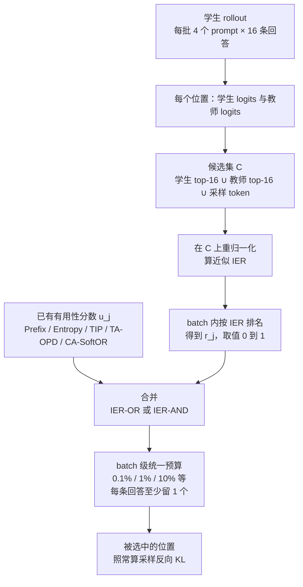

# IER-OPD：稀疏蒸馏不只要问哪个 token 有用，还要问它的梯度估得准不准

<!-- release-date: 2026-09-21 -->

> 本文依据 MBZUAI 与蚂蚁集团（Ant Group）联合署名的 **1% of Tokens Can Be Enough: On Gradient Estimation in On-Policy Distillation**，alphaXiv 编号 2609.ier-opd，2026-09-21 首次公开，共 29 页。页码均指这份 PDF 的物理页码。第一作者 Huanxin Sheng 同时挂 MBZUAI 与蚂蚁集团，通讯邮箱是 MBZUAI 的 Huanxin Sheng 与 Jian Kang；6 位作者里 3 位来自 MBZUAI、4 位挂蚂蚁集团（第一作者两边都挂）（PDF p. 1）。全文把 3 件事分开标注：**论文写了什么**、**我们如何解释或验算它**、**哪些是外部资料补充**。
>
> 这是一篇方法论文，不是基模报告。它只改 on-policy 蒸馏里「挑哪些 token 来算损失」这一步，训练目标仍是采样反向 KL（PDF p. 1）。实验模型最大 4B，都是数学推理与医学问答（PDF p. 5）。

## 读前先把几个词说成人话

这篇论文要回答的问题很窄：一条学生生成的回答里有几千个 token，预算只允许监督其中 1% 甚至 0.1%，该挑哪些？

过去的答案都在问「这个位置有没有用」。这篇论文加了第二问：就算有用，**在这个位置上用一个采样 token 估出来的梯度，靠不靠谱**。

先把会反复出现的词说清楚：

- **OPD（On-Policy Distillation，在策略蒸馏）**：学生模型自己写回答（rollout），教师模型在学生写出的每个前缀上给出「下一个 token 应该是什么分布」，学生向这个分布靠拢。好处是教师监督的恰好是学生自己会走到的状态（PDF p. 1）。
- **前缀（prefix）**：回答写到第 $j$ 个位置之前的全部内容。每个位置对应一个前缀，也对应一次「下一个 token」的预测。
- **反向 KL（reverse KL）**：$D_{\mathrm{KL}}(p\|q)$，期望在学生分布 $p$ 下取。标准 OPD 在每个 token 位置上用它把学生对齐到教师（PDF p. 1、p. 3）。
- **采样反向 KL（sampled reverse KL）**：完整的反向 KL 要对整个词表求和；实践里只拿学生实际采样出的那一个 token 来估它（PDF p. 1）。这是这篇论文所有问题的源头。
- **稀疏 OPD（sparse OPD）**：只在一小部分位置上加监督。预算写成百分比，如 1% 就是整个 rollout batch 里只有 1% 的 token 参与损失（PDF p. 5）。
- **有用性分数（usefulness score）**：已有方法用来挑 token 的启发式指标，如学生熵、师生分歧、位置靠前（PDF p. 1–2）。
- **梯度估计可靠性（gradient-estimation reliability）**：这篇论文的新轴。同一个前缀下换一个采样 token，梯度估计会变；变得越厉害，这一位置的单样本梯度越不可信。
- **Fisher 信息矩阵（Fisher information matrix）**：衡量「参数稍微动一下，分布变了多少」的局部度量。用它量误差，量的是分布层面的偏差，不是 logits 数值上的偏差（PDF p. 3）。
- **IER（Information-Efficiency Ratio，信息效率比）**：这篇论文定义的分数，等于梯度信号与采样噪声之比，噪声取的是最优基线下的最小值（PDF p. 4）。

## 一句话先说清

标准 OPD 在每个位置用一个采样 token 估反向 KL 的梯度。这个估计是无偏的，但方差可以很大。已有的稀疏 OPD 方法只问「这个位置有没有用」，于是可能挑中一堆「有用但估不准」的位置（PDF p. 1）。

这篇论文在固定前缀下，用 Fisher 几何把单样本梯度拆成**信号**和**噪声** 2 份，得到闭式解：信号是学生分布下对数似然比的方差，噪声由一个「杠杆因子」加权（PDF p. 3–4，定理 1）。两者之比就是 IER，它的倒数恰好是单样本估计的相对均方误差（PDF p. 16，推论 1）。

工程上，IER 在「学生 top-16 ∪ 教师 top-16 ∪ 采样 token」这个小候选集上近似计算（PDF p. 4、p. 17），再在 batch 内转成排名，用软或（IER-OR）、软与（IER-AND）和已有的有用性分数合并（PDF p. 5）。

摘要的结论是：在数学与医学推理上，加入 IER 能改进多种已有选择器；在 0.1%–1% 的 token 预算下，稀疏配置可以打平甚至超过不做选择的全量 OPD（PDF p. 1）。读完全文要补一句限定：这个结论在 2 组数学师生对上不对称，在 Nemotron 对的 0.1% 预算下没有任何稀疏配置的均值超过全量 OPD（PDF p. 20，Figure 9），后文会拆开讲。

### 一条阅读路线

如果只有半小时读原文，建议按这个顺序：

1. **p. 3 式 (1)–(4)**：先看清「采样一个 token 估梯度」是怎么写的，基线 $b$ 为什么不改期望。
2. **p. 3–4 定理 1 与定义 1**：信号、噪声、最优基线、IER 4 个式子。
3. **p. 4 式 (12)–(14)**：候选集近似，这是它能落地的关键。
4. **p. 5 式 (15)**：软或、软与怎么把可靠性和有用性合起来。
5. **p. 6 的 Figure 1 与 Table 1、p. 8 的 Table 2**：主结果。
6. **p. 16 推论 1、p. 17 Table 3、p. 18 Figure 5**：IER 的统计含义、训练开销、IER 随位置下降。
7. **p. 19–21 的 Figure 6–11**：把 Table 2 按均值重排，并加了并发工作的 2 个基线，这几张图比 Table 2 更好读出「谁真的赢了全量 OPD」。

## 主要矛盾：有用的监督，也可能给出一个方向错的梯度

### 旧问题：稀疏 OPD 只看有用性

OPD 的逐 token 信号比序列级损失或只看最终答案的可验证奖励密得多（PDF p. 1）。但近来一批工作发现，token 的贡献并不均等，于是出现了各种挑选或重加权的方法（PDF p. 1–2）：

- 按重要性：如 TIP，把学生熵和师生分歧合起来（PDF p. 2）；
- 按学生不确定性：如只挑高熵位置；
- 按可教性（teachability）：如 TA-OPD，看教师在学生 top-K 候选上的概率质量与分歧（PDF p. 2）；
- 按位置：只蒸馏前面若干 token，依据是推理链越往后监督质量越差（PDF p. 1）。

论文把这些统称为**基于有用性的方法**：它们问的是「在这里监督，大概会不会帮到学生」（PDF p. 1）。

### 被忽略的一面：单样本估计的采样误差

在一个固定前缀上，反向 KL 的梯度本来是对整个词表的期望。采样 OPD 只用一个（或少数几个）学生采出的 token 去估这个期望（PDF p. 1）。于是：

- 即使这个位置真正该做的修正很有价值，采出的那个 token 给出的梯度也可能离真值很远；
- 论文指出，只有一小部分 token 参与更新时，这个问题更加关键（PDF p. 1）。我们的解释是：全量 OPD 时，几千个位置的噪声还能互相平均；**只留 1% 时，每个被选中位置在更新里的份量变大，它的噪声也被放大**。

论文由此给出的矛盾是：只看有用性，可能留下估不准的位置；只看可靠性，可能留下估得准但没什么价值的位置。2 个维度都要看（PDF p. 1）。

> 旧的稀疏 OPD 在问「这里值不值得教」。这篇论文补问「在这里教，用一个样本能不能教对方向」。

## 先看全景：只改选择这一步

这张图按 PDF p. 4–5 的第 4 节与 p. 17 的附录 C.1–C.2 重画，是流程示意，不是论文原图。IER 也可以不和有用性合并、单独当选择器用（PDF p. 5）。

有 3 点要先记住，后面谈收益与代价时都会用到：

1. **训练目标没变**。仍是采样反向 KL，IER 只决定哪些位置参与（PDF p. 1）。
2. **rollout 没变短**。所有回答仍然完整生成、完整打分，稀疏只发生在损失上，所以不会按比例省算力（PDF p. 17）。
3. **预算是 batch 级的**。所有回答的 token 在同一个预算下竞争，每条回答至少留 1 个，因此不同回答被选中的比例可以不同（PDF p. 17）。

## 核心设计一：把单样本梯度拆成信号和噪声

### 要算什么：一个固定前缀上的局部梯度

先固定一个学生写出的前缀 $s$，把它从记号里省掉。词表 $\mathcal{A}$ 至少有 2 个 token。记学生的下一 token 概率为 $p_a$，教师为 $q_a$，并假设都大于 0（PDF p. 3）。OPD 在这个前缀上要最小化的是反向 KL：

$$
D_{\mathrm{KL}}(p\|q)=\mathbb{E}_{a\sim p}\left[\log\frac{p_a}{q_a}\right]
$$

对数里那一项后面会反复出现，单独起个名字，叫**对数似然比**：$\rho(a)=\log(p_a/q_a)$。它为正说明学生在 $a$ 上比教师自信，为负说明学生低估了 $a$。

接着要算这个 KL 对学生 logits $z_\theta$ 的梯度。softmax 下有一个标准结果：$\phi_a=\nabla_{z_\theta}\log p_a=e_a-p$，其中 $e_a$ 是 $a$ 的 one-hot 向量；并且 $\mathbb{E}_p[\phi_a]=0$（PDF p. 3）。利用这一点，局部梯度可以写成（PDF p. 3，式 2）：

$$
g=\mathbb{E}_{p}\bigl[\rho(a)\,\phi_a\bigr]
$$

它的意思是：把每个候选 token 的「方向」$\phi_a$ 按它的对数似然比 $\rho(a)$ 加权，再按学生概率求平均。

### 采样估计：一个 token 代替整个期望

采样 OPD 只采一个 $a\sim p$。借用策略梯度里的控制变量（control variate）做法，论文引入一个与动作无关的标量基线 $b$（PDF p. 3，式 3–4）：

$$
\hat g_b(a)=\bigl(\rho(a)-b\bigr)\phi_a,\qquad \mathbb{E}_p[\hat g_b]=g
$$

因为 $\mathbb{E}_p[\phi_a]=0$，减去任何常数 $b$ 都不改期望，只改方差。估计误差记为 $\delta_b(a)=\hat g_b(a)-g$。把 logits 空间的梯度乘上雅可比 $J_s=\partial z_\theta/\partial\theta$ 的转置，就回到参数空间（PDF p. 3）。

### 为什么不用欧氏距离量误差

最直接的做法是量 $\hat g_b$ 和 $g$ 的欧氏均方误差（PDF p. 3，式 5）。论文认为这不合适：反向 KL 衡量的是 2 个分布的差异，而欧氏距离把概率值当成普通坐标，不理会它们是一个分布（PDF p. 3）。

于是改用 KL 自己诱导的局部几何。logits 挪动一个很小的 $\Delta z$ 时，分布变化的 KL 近似为二次型（PDF p. 3，式 6）：

$$
D_{\mathrm{KL}}\bigl(p\,\|\,p^{\Delta}\bigr)\approx\tfrac12\,\Delta z^{\top}F\,\Delta z,\qquad F=\mathrm{diag}(p)-pp^{\top}
$$

$F$ 就是 softmax 分布的 Fisher 信息矩阵。它是奇异的（全 1 向量方向上加常数不改 softmax），所以用伪逆 $F^{+}$。比较 2 个梯度对应的**自然梯度** $F^{+}g$ 与 $F^{+}\hat g_b$，它们的差在 $F$ 度量下的长度平方是 $\delta_b^{\top}F^{+}\delta_b$，记为 $\|\delta_b\|^2_{F^{+}}$（PDF p. 3）。

人话版：误差不按「logits 数值差了多少」算，而按「这一步更新会把分布推偏多少」算。

### 定理 1：信号、噪声、最优基线

先定义一个**杠杆因子**（leverage factor）：

$$
L(a)=\frac{1-p_a}{p_a}
$$

学生越不常采的 token，$L(a)$ 越大。论文证明（PDF p. 3–4，定理 1；证明在 PDF p. 14–15）：

信号的平方长度，等于对数似然比在学生分布下的方差：

$$
\|g\|^2_{F^{+}}=\mathrm{Var}_p\bigl[\rho(a)\bigr]
$$

任一基线 $b$ 下的均方估计误差：

$$
\mathbb{E}_p\bigl[\|\hat g_b-g\|^2_{F^{+}}\bigr]=\mathbb{E}_p\Bigl[\bigl(\rho(a)-b\bigr)^2L(a)\Bigr]-\mathrm{Var}_p\bigl[\rho(a)\bigr]
$$

让误差最小的基线：

$$
b^{\star}=\frac{\mathbb{E}_p\bigl[\rho(a)L(a)\bigr]}{\mathbb{E}_p\bigl[L(a)\bigr]}
$$

证明里有 2 步值得记住（PDF p. 15）：

- 单个 token 方向的 Fisher 长度恰好是杠杆因子：$\|\phi_a\|^2_{F^{+}}=L(a)$。所以一个低概率 token 被采中时，它带来的那一步在分布层面「很长」。
- $\mathbb{E}_p[L(a)]=\sum_a(1-p_a)=m-1>0$，$m$ 是词表大小。二阶导为 $2(m-1)>0$，所以 $b^{\star}$ 是唯一全局最小点。

**我们如何解释它。** 信号是 $\rho$ 的方差：如果学生在所有 token 上都比教师「同样多自信一点」，$\rho$ 是常数，就没有要修的方向（定理 1 也要求 $\rho$ 非常数）。噪声的主体是 $(\rho-b)^2L$：一个 token 的对数似然比偏离基线越远、学生越少采到它，采中时的那一步就越「猛」，而大多数时候又采不到它。这正是单样本估计在「真正要修的东西藏在学生很少写的 token 上」时最不可靠的原因。

### 定义 1：IER

有了信号和最优基线下的噪声，IER 定义为（PDF p. 4，定义 1，式 10–11）：

$$
\mathrm{IER}=\frac{\mathrm{Signal}}{\mathrm{Noise}}=\frac{\|g\|^2_{F^{+}}}{\mathbb{E}_p\bigl[\|\hat g_{b^\star}-g\|^2_{F^{+}}\bigr]}
$$

只在噪声大于 0 时有定义。论文强调 2 点：IER 高意味着梯度方向估得更准；**IER 高不代表这个监督有用**（PDF p. 4）。

### 推论 1：IER 的倒数就是相对均方误差

如果在同一个前缀上独立采 $K$ 个 token 取平均，得到 $\bar g_K$，那么相对均方误差是（PDF p. 16，推论 1，式 34）：

$$
\frac{\mathbb{E}_p\bigl[\|\bar g_K-g\|^2_{F^{+}}\bigr]}{\|g\|^2_{F^{+}}}=\frac{1}{K\cdot\mathrm{IER}}
$$

$K=1$ 时，$1/\mathrm{IER}$ 就是单样本估计的相对误差。反过来，要把相对误差压到 $\epsilon$ 以下，这个前缀上至少要采 $K\ge 1/(\epsilon\cdot\mathrm{IER})$ 个样本（PDF p. 16）。论文把「按 IER 自适应分配每个位置的采样数」留作未来工作（PDF p. 16）。

同页还补了一句限定：IER 衡量的是相对估计精度，不是梯度大小；高 IER 对梯度幅度、与任务是否对齐、更新是否有益都没有保证（PDF p. 16）。

### 我们的验算：2 个 3 词表小例子

下面 2 组数是我们按定理 1 手算的，不在原文里，只用来建立直觉。学生分布都取 $p=(0.7,\,0.2,\,0.1)$。

| 情形 | 教师 $q$ | 分歧落在哪 | 信号 | 噪声 | IER |
|---|---|---|---:|---:|---:|
| A | $(0.5,\,0.4,\,0.1)$ | 学生常写的前 2 个 token | 0.166 | 0.150 | 1.11 |
| B | $(0.7,\,0.1,\,0.2)$ | 第二个与最冷门的第三个 token | 0.139 | 0.675 | 0.21 |

2 种情形的信号差不多，噪声却差了约 4.5 倍。B 里要修的是学生只有 10% 机会写出的那个 token，单样本大多数时候采不到它，一旦采到又是一步很长的更新，所以估计很不稳。

另一个验算结果：词表只有 2 个 token 时，最优基线下的噪声恰好为 0。因为此时 $\phi_a$ 只有一个自由方向，一个标量基线就能把它完全抵消。这也说明 IER 里的噪声来自「多个方向、只有一个标量基线」的结构性不足。

### 可迁移启发

用单样本估计期望时，先问「这个期望本来有多难估」。把误差放在任务本身的几何里量（这里是 KL 的 Fisher 几何），常常能得到闭式的信噪比；它可以直接当成挑样本、分配采样预算的依据。同一思路可以搬到任何「每个位置只采一次」的 token 级 RL 或蒸馏目标上，但这篇论文只推导了反向 KL 这一种。

## 核心设计二：候选集近似，让 IER 算得起

### 旧问题：精确 IER 要遍历整个词表

定义 1 的每一项都是对全词表的期望。每个位置都算一遍，在实践里不可行（PDF p. 4）。

### 新设计：只在学生与教师都看好的 token 上算

在每个前缀上，取学生 logits 的 top-K、教师 logits 的 top-K，再并上实际采到的 token，构成候选集（PDF p. 4，式 12）：

$$
\mathcal{C}=\mathrm{TopK}(z_\theta)\cup\mathrm{TopK}(z_T)\cup\{a\}
$$

然后在 $\mathcal{C}$ 上分别对学生和教师做 softmax 重归一化，得到 $\hat p$ 与 $\hat q$（PDF p. 4，式 13）。其余量全部换成候选集版本：$\hat\rho$、$\hat L$、$\hat b^{\star}$，最终（PDF p. 4，式 14）：

$$
\widehat{\mathrm{IER}}=\frac{\mathrm{Var}_{\hat p}\bigl[\hat\rho(a)\bigr]}{\mathbb{E}_{\hat p}\Bigl[\bigl(\hat\rho(a)-\hat b^{\star}\bigr)^2\hat L(a)\Bigr]-\mathrm{Var}_{\hat p}\bigl[\hat\rho(a)\bigr]}
$$

### 工程细节

附录 C.1 给出了全部实现参数（PDF p. 17）：

| 项 | 取值 |
|---|---|
| top-K 的 K | 16 |
| 候选集大小 | $16\le|\mathcal{C}|\le 33$ |
| 一方 top-K 里没有的 token 的 logit | 填 −12，再在候选集上 softmax |
| 对数似然比 $\hat\rho$ 截断 | $[-30,\,30]$，所有相关计算都用截断后的值 |
| 分母防除零 | $\epsilon=10^{-8}$，用于杠杆因子与最终 IER |

正文第 4 节写的是「给缺失 logit 赋一个小值 $\epsilon$」（PDF p. 4），附录给的具体值是 −12（PDF p. 17），以附录为准。

**我们如何解释它。** 候选集把 IER 变成一个只依赖两边 top-16 logits 的小计算，学生和教师的前向本来就要做，增量很小。代价是近似：学生很少写、教师也不看好的长尾 token 被整体丢掉，而前面的小例子说明噪声恰恰可能集中在冷门 token 上。论文没有给出近似 IER 与精确 IER 的误差分析，也没有 K 的消融。

## 核心设计三：可靠性与有用性，用软或与软与合并

IER 只管「估得准不准」，不管「有没有用」。论文因此不打算用它取代已有分数，而是和它们合并（PDF p. 5）。

做法：在一个 rollout batch 内，先按近似 IER 排序，把位置 $j$ 的排名归一化为 $r_j\in[0,1]$；已有的有用性分数同样在 batch 内归一化为 $u_j\in[0,1]$。然后（PDF p. 5，式 15）：

$$
s^{\mathrm{OR}}_j=1-(1-u_j)(1-r_j),\qquad s^{\mathrm{AND}}_j=u_j\,r_j
$$

- **IER-OR**：两者任一高，分数就高，一边可以弥补另一边。倾向留下「最有用或最可靠」的位置。
- **IER-AND**：两者都高才高。倾向留下「又有用又可靠」的位置（PDF p. 5）。

注意合并用的是 IER 的**排名**而不是原始值。原始 IER 极度长尾（下一节讲），直接相乘会被少数极端值主导；排名把它压到与有用性同一个尺度上。这是我们的解释，原文只写了「归一化排名」（PDF p. 5）。

附录 B.1 还给了一个更一般的表述：在预算 $\alpha$ 下，从全部 rollout token 里选至多 $\alpha$ 比例的子集 $S$ 并赋权，目标是最大化选中位置加权梯度带来的期望改进（PDF p. 14，式 16）。论文把它类比为高维统计里的变量筛选，并指出 token 之间天然相关、采样又是动态的，传统统计筛选不能直接套用（PDF p. 14）。这一节是问题表述，实验里的方法仍是上面的排名加软逻辑合并。

### 可迁移启发

2 个维度的分数不在同一尺度上时，先各自转成 batch 内排名，再用软逻辑合并，是一种很省事的组合方式，不需要调权重。OR 与 AND 的直觉分工是：基线本身弱时，OR 能把可靠位置补进来；基线强时，AND 更像在它的候选里再过一道筛。这是我们的读法：医学上弱基线 Prefix 配 OR 明显好于配 AND（Table 1），但数学结果并不整齐，论文也没有给出何时选 OR、何时选 AND 的规则。

## 实验怎么设

### 任务与师生对

论文考虑 2 种蒸馏情形（PDF p. 5）：

- **强到弱（strong-to-weak）**：师生同尺寸同架构，学生没有在该推理任务上做过后训练；
- **大到小（big-to-small）**：教师更大更强，与学生共享分词器。

| 任务 | 教师 → 学生 | 类型 | 训练数据与轮数 | 评测 |
|---|---|---|---|---|
| 数学 | JustRL-Nemotron-1.5B → OpenMath-Nemotron-1.5B | 强到弱 | DAPO-Math-17k，50 轮 rollout | AIME 2025/2026、HMMT-Feb 2025/2026，每题 32 个样本，报 Bayes@32 均值与标准误 |
| 数学 | JustRL-Qwen3-4B → Qwen3-1.7B | 大到小 | 同上 | 同上 |
| 医学 | ClinAlign-4B → Qwen3-4B | 论文未单独归类 | RaR-Medicine，100 轮 rollout | HealthBench 整体分与 Hard 分 |

2 个数学教师都由 JustRL 训练（PDF p. 5）。医学的 ClinAlign-4B 与 Qwen3-4B 同为 4B，论文没有把这一对明确归到强到弱或大到小。

医学回答由 gpt-oss-120B 打分。它在 HealthBench 元评测上的宏 F1 是 0.6614（PDF p. 5）；附录补充了对照：HealthBench 默认评委 GPT-4.1 为 0.709，但按实验规模用它会超出作者的评测经费（PDF p. 17）。

### 训练与评测超参

| 项 | 取值（PDF p. 17） |
|---|---|
| 每个 rollout batch | 4 个 prompt × 每个 16 条学生回答 |
| rollout 采样 | 温度 1，top-p 1 |
| 最大 prompt / 回答 / 上下文 | 2,048 / 8,192 / 16,384 token |
| minibatch | 每个 rollout batch 切 8 个，每个 batch size 8 |
| 优化器 | Adam，学习率 $10^{-6}$，权重衰减 0.1，$(\beta_1,\beta_2)=(0.9,\,0.98)$ |
| 数学评测解码 | 温度 0.7，top-p 0.9，最大回答 32,768 token；规则验证器判答案 |

主实验里 Qwen3 用的是关闭思考（thinking-off）模式，思考模式另做一节（PDF p. 9）。

### 对照组

5 个基于有用性的选择器（PDF p. 5）：

1. **Prefix**：选回答里靠前的位置；
2. **Entropy**：按学生下一 token 熵的归一化值；
3. **TIP**：对归一化熵与师生分歧做软或；
4. **TA-OPD**：归一化局部分歧乘以教师在学生 top-k 上的归一化概率质量；
5. **CA-SoftOR**：TA-OPD 的变体，把归一化熵与「兼容性加权分歧」做软或。

另有：随机选择；全量 OPD（不做选择）；学生与教师本身；以及并发工作 Liu 等人 2026d 的 2 个选择器 Sampled RKL max / min，按作者自己的设置复现（PDF p. 8、p. 18）。

预算主要取 0.1%、1%、10%，参数分析再加 5%、20%、50%、80%（PDF p. 5）。

## 实验一：IER 分数极度长尾，单独用它挑 0.1% 就有效

### 大多数位置的噪声大于信号

论文观察到 IER 分数分布极度长尾：通常不到 0.1% 的 token 分数超过 1（PDF p. 6）。按定义，这意味着在候选集近似下，绝大多数位置估出的噪声大于信号。作者由此推断：不管梯度可靠性、把所有位置都拿来监督的全量 OPD，可能并不是最优的（PDF p. 6）。

附录的 Figure 5 把 IER 按回答中的归一化位置分桶（PDF p. 18）。从图上读：中位数一直在 $10^{-4}$ 量级，均值在 $10^{-2}$ 上下，都远低于 1；只有最大值常年在 1 以上，并在回答末尾一段掉到 1 附近或以下（PDF p. 18，读自 Figure 5）。图注的结论是 IER 在靠后的位置趋于下降（PDF p. 18）。这与「推理链越往后监督质量越差」的前缀类方法依据方向一致，但 IER 给出的是一个连续分数，而不是一刀切的截断点。

### 单独当选择器

IER 单独用、预算 0.1% 时（PDF p. 6，Table 2 在 PDF p. 8）：

- Nemotron 对：AIME26 上 58.9 对全量 OPD 的 59.9，HMMT26 上 34.1 对 34.7，接近但没超过（PDF p. 8）；
- Qwen3 对：4 项里有 3 项超过全量 OPD（AIME25 15.8 对 14.4、AIME26 15.2 对 12.5、HMMT25 9.5 对 8.7，HMMT26 13.0 对 13.4 例外）（PDF p. 8）；
- 医学：这个预算大约相当于每条回答只选 1 个 token。IER 的 HealthBench 整体分 45.25，全量 OPD 45.77；同预算下 Prefix 只有 38.30，与学生本身的 38.23 几乎一样（PDF p. 6）。

论文的读法：挑一个很小的 IER 子集就能实现有效蒸馏；加入更多 token 未必更好，梯度估计嘈杂时它们贡献甚少（PDF p. 6）。

## 实验二：可靠性与有用性挑中的是不同的 token

Figure 1 回答一个问题：IER 挑的 token 和有用性选择器挑的是不是同一批（PDF p. 6）。从图上读：

- **全体排名很像**。除 Prefix 外，各选择器之间的 Spearman 相关大多很高；如 Qwen3 对上 IER 与 Entropy、TIP、CA-SoftOR 都是 0.94，Nemotron 对上 IER 与它们在 0.81–0.82（PDF p. 6，读自 Figure 1）。
- **头部挑选差得远**。只看 top-10% 的交集，IER 与 TIP 的 Jaccard 在 Nemotron 对上只有 0.15，在 Qwen3 对上是 0.39；与 TA-OPD 分别是 0.23 和 0.22（PDF p. 6，读自 Figure 1）。
- Prefix 与其他所有选择器几乎不相关，Jaccard 与 Spearman 都在 0.1 以下（PDF p. 6，读自 Figure 1）。

论文的说法是：梯度估得可靠的 token，有用性分数可能不高；有用性分数高的 token，梯度可能很嘈杂，把更新带向错误方向；预算越小，Jaccard 还会进一步下降（PDF p. 6）。这就是合并两者的直接动机。

**我们如何解释它。** 「整体排序相关但头部不重合」是一个很实用的诊断：2 个分数在大多数平庸位置上意见一致，真正决定稀疏预算的是最头部那一小撮，而那一小撮恰恰分歧最大。稀疏程度越高，选择器之间的差异越重要。

## 实验三：主结果

### 医学推理：Table 1

Table 1 给出 HealthBench 整体分 / Hard 分（PDF p. 6）。参照行：学生 38.23 / 8.78，全量 OPD 45.77 / 19.77，教师 46.37 / 20.24；标准误约为 0.5 / 1。

| 选择器 | 10% | 1% | 0.1% |
|---|---|---|---|
| IER（单独） | 45.85 / 19.68 | 44.95 / 18.39 | 45.25 / 18.37 |
| Prefix | 42.17 / 14.11 | 39.91 / 10.97 | 38.30 / 8.68 |
| +IER-OR | 45.34 / 19.68 | 44.79 / 19.07 | 44.98 / 19.49 |
| +IER-AND | 44.48 / 16.25 | 42.58 / 14.96 | 41.55 / 12.72 |
| Entropy | 45.47 / 19.00 | 44.20 / 17.32 | 42.75 / 15.36 |
| +IER-OR | 45.97 / 20.07 | 45.09 / 20.10 | 45.64 / 19.91 |
| +IER-AND | 45.19 / 19.01 | 45.40 / 19.02 | 44.92 / 18.77 |
| TIP | 45.03 / 19.96 | 43.99 / 16.85 | 42.87 / 14.27 |
| +IER-OR | 45.59 / 20.17 | 44.92 / 19.05 | 46.08 / 19.61 |
| +IER-AND | 45.18 / 19.61 | 44.41 / 19.44 | 45.05 / 19.37 |
| TA-OPD | 44.02 / 18.02 | 45.19 / 19.22 | 44.71 / 18.61 |
| +IER-OR | 45.21 / 18.26 | 45.05 / 20.31 | 45.69 / 19.68 |
| +IER-AND | 46.11 / 20.45 | 45.10 / 20.01 | 44.46 / 19.38 |
| CA-SoftOR | 45.14 / 19.88 | 44.02 / 17.23 | 41.98 / 14.86 |
| +IER-OR | 44.16 / 19.37 | 44.82 / 19.58 | 44.63 / 18.44 |
| +IER-AND | 45.56 / 19.26 | 44.49 / 19.68 | 42.37 / 18.41 |

读这张表要看 3 件事（PDF p. 6–7）：

1. **预算越小，IER 帮得越多**。0.1% 时，每个有用性选择器的 Hard 分都在加入 IER 后上升，Prefix 从 8.68 到 19.49（IER-OR），TIP 从 14.27 到 19.61（IER-OR）。
2. **弱基线收益最大**。Prefix+IER-OR 在 0.1% 下把整体 / Hard 从 38.30 / 8.68 拉到 44.98 / 19.49。
3. **接近甚至越过全量与教师**。0.1% 下 TIP+IER-OR 是 46.08 / 19.61，TA-OPD+IER-OR 是 45.69 / 19.68，与全量 OPD 的 45.77 / 19.77 相当；10% 下 TA-OPD+IER-AND 是 46.11 / 20.45，与教师 46.37 / 20.24 相当。

同时也有反例：10% 下 CA-SoftOR+IER-OR 整体分从 45.14 降到 44.16；Prefix+IER-AND 始终明显不如 Prefix+IER-OR。

还要记得标准误约 0.5 / 1（PDF p. 6）。按这个量级读（我们的读法）：整体分在 44–46 之间的大部分差距落在 1–2 个标准误以内；远超噪声的是 Prefix 类的大幅提升，以及 0.1% 下 Prefix、Entropy、TIP、CA-SoftOR 4 个基线加入 IER 后 Hard 分约 3.4–10.8 分的上升。TA-OPD 在 0.1% 下的 Hard 分只升了约 1 分（18.61 → 19.68 / 19.38），仍在 1 个标准误上下。

### 数学推理：Table 2 的关键行

Table 2 是 Bayes@32（%），标准误在 0.4–1 之间（PDF p. 8）。全表 3 档预算 × 18 行 × 8 列，这里只摘读表必需的行。

| 方法 | Nemotron AIME25 | AIME26 | HMMT25 | HMMT26 | Qwen3 AIME25 | AIME26 | HMMT25 | HMMT26 |
|---|---:|---:|---:|---:|---:|---:|---:|---:|
| 学生 | 47.3 | 53.3 | 32.8 | 32.6 | 11.6 | 10.3 | 8.4 | 10.4 |
| 教师 | 58.6 | 62.3 | 40.6 | 35.7 | 22.5 | 19.9 | 13.7 | 20.2 |
| 全量 OPD | 56.3 | 59.9 | 36.9 | 34.7 | 14.4 | 12.5 | 8.7 | 13.4 |
| 0.1% 随机 | 49.6 | 55.4 | 33.5 | 32.9 | 13.6 | 12.4 | 8.7 | 10.6 |
| 0.1% IER | 53.5 | 58.9 | 34.8 | 34.1 | 15.8 | 15.2 | 9.5 | 13.0 |
| 0.1% TIP | 53.2 | 57.5 | 36.2 | 35.3 | 14.9 | 13.4 | 8.9 | 11.6 |
| 0.1% TIP+IER-AND | 52.1 | 56.1 | 35.8 | 34.8 | 19.4 | 16.3 | 11.7 | 14.4 |
| 1% TA-OPD | 52.4 | 57.8 | 36.4 | 33.1 | 16.8 | 13.3 | 8.3 | 14.1 |
| 1% TA-OPD+IER-AND | 54.6 | 59.8 | 37.8 | 36.2 | 17.6 | 13.5 | 9.7 | 14.4 |
| 10% TIP | 56.6 | 59.3 | 37.0 | 37.2 | 15.8 | 14.1 | 9.9 | 14.7 |

论文点名的 2 个例子（PDF p. 7）：

- TIP+IER-AND 在 0.1% 下对 Qwen3 对 4 项都超过全量 OPD（AIME25 为 19.4，全量 OPD 14.4，教师 22.5；PDF p. 8）；
- TA-OPD+IER-AND 在 1% 下对 Nemotron 对与全量 OPD 相当。

另外，10% 预算下 TIP 在 HMMT26 上的 37.2 甚至高过教师的 35.7（PDF p. 6）。论文同时承认，有用性选择器本身仍有竞争力，如 Nemotron 对上 10% 的 TA-OPD、1% 的 CA-SoftOR（PDF p. 6）。

但 Table 2 同样写着反例。Nemotron 对 0.1% 下，TIP+IER-AND 4 项全部低于 TIP 本身；Entropy+IER-OR 在 1% 下 AIME25 从 53.6 掉到 49.7（PDF p. 8）。论文明说：收益取决于选择器与设置，基于 Entropy 的组合尤其会让数学性能下降，IER-OR 和 IER-AND 都不能稳定改进 Entropy；有用性分数与 IER 都是近似，不保证选得更好（PDF p. 7）。

### 把 Table 2 按均值重排：Figure 6–11

附录 C.4 把每个设置下各方法在 4 个数学基准上的 Bayes@32 取平均排序，并加入随机（3 个种子）与 2 个 Sampled RKL 选择器（PDF p. 18–21）。下表是我们从 Figure 6–11 的均值列摘出的关键行。

| 方法 | Qwen3 0.1% | Qwen3 1% | Qwen3 10% | Nemotron 0.1% | Nemotron 1% | Nemotron 10% |
|---|---:|---:|---:|---:|---:|---:|
| 教师 | 19.08 | 19.08 | 19.08 | 49.30 | 49.30 | 49.30 |
| 全量 OPD | 12.25 | 12.25 | 12.25 | 46.95 | 46.95 | 46.95 |
| 最好的 IER 组合 | 15.45（TIP+AND） | 14.40（Entropy+AND） | 13.85（TIP+AND） | 45.73（Prefix+OR） | 47.10（TA-OPD+AND） | 47.83（TIP+OR） |
| 最好的有用性基线 | 12.25（CA-SoftOR） | 13.55（TIP） | 13.63（TIP） | 45.55（TIP） | 45.80（Entropy） | 47.78（TA-OPD） |
| IER 单独 | 13.38 | 12.70 | 12.90 | 45.33 | 45.60 | 46.88 |
| Sampled RKL max | 12.15 | 11.38 | 12.73 | 45.70 | 47.22 | 46.95 |
| Sampled RKL min | 11.07 | 12.02 | 12.95 | 45.83 | 48.17 | 47.67 |
| 随机（3 种子） | 11.31 | 11.33 | 12.02 | 42.87 | 43.02 | 45.08 |
| 学生 | 10.18 | 10.18 | 10.18 | 41.50 | 41.50 | 41.50 |

来源：Figure 6（PDF p. 19）、Figure 7（PDF p. 19）、Figure 8（PDF p. 20）、Figure 9（PDF p. 20）、Figure 10（PDF p. 21）、Figure 11（PDF p. 21）。

这张表把摘要那句话拆开了：

- **Qwen3 对（大到小）**：3 档预算下，最好的 IER 组合都高过全量 OPD，IER 单独也 3 档都高过全量 OPD。
- **Nemotron 对（强到弱）**：0.1% 下全量 OPD 的 46.95 排在教师之后第一，没有任何稀疏配置超过它；1% 下有 2 个 IER 组合（TA-OPD+IER-AND 47.10、Prefix+IER-AND 47.08）略超全量，但 Sampled RKL min 以 48.17 排第一；10% 下多个组合与基线都超过全量。IER 单独 3 档都低于全量。

论文自己对 Sampled RKL 的总结是：它们在 Nemotron 对的 0.1% 与 1% 下几乎胜过所有其他选择器，但换到 Qwen3 对就明显退化，与随机和 Prefix 相当甚至更差；6 个设置里没有哪个选择器处处最好，「有用性 + IER」仍是一个有前景的选项（PDF p. 18）。

我们按 Figure 6–11 的均值数了一遍：5 个基线 × 2 种合并 × 6 个设置共 60 组对比，加入 IER 后均值上升的有 45 组，Qwen3 对 0.1% 一档是 10 组全升。这与论文「多数设置下加入 IER 提高均值 Bayes@32」的说法一致（PDF p. 18）。

**我们如何解释它。** Qwen3 对上全量 OPD 本身很弱：50 轮之后均值只从学生的 10.18 走到 12.25，离教师的 19.08 很远，10% 随机选择已到 12.02（PDF p. 19–20，Figure 6–8）。在这样一个「全量也没学到多少」的设置里，稀疏配置超过全量更容易。Nemotron 对的全量 OPD 已经拿到师生差距的大半（41.50 → 46.95，教师 49.30；PDF p. 20，Figure 9），稀疏要追上它难得多。摘要里「0.1%–1% 打平或超过全量」在 2 组师生对上的分量并不相同。

## 实验四：预算越大不一定越好

论文把预算扫过 0.1%、1%、5%、10%、20%、50%、80%（PDF p. 7）。数学上的观察（PDF p. 9）：

- 基线弱（Prefix）或预算极小（0.1%、1%）时，IER 通常能改进蒸馏后的学生；
- 这和「只有很小一部分 token 有可靠梯度」「只靠有用性可能给出的监督不够」的观察一致；
- 改进幅度随预算变化，但在若干设置下，用有用性加 IER 选 1%–5% 的 token 就能打平或超过全量 OPD。

读图要注意一处原文不一致：Figure 3 的图注写下半幅是 TIP（PDF p. 7），但图中图例写的是 TA-OPD，第 5.4 节正文也说比较的是 Prefix 与 TA-OPD（PDF p. 7）。图注还写「Nemotron 对用 IER-OR，Qwen3 对用 IER-OR」，2 处都是 IER-OR。这里按图例把下半幅当作 TA-OPD。

医学上的图更干净（PDF p. 7、p. 9）。左幅 Prefix 单独用时，整体分从 0.1% 的约 0.38 随预算一路爬到 80% 的约 0.46；加了 IER-OR 的实线在 0.1% 就已在 0.44 以上，5% 起基本贴着全量 OPD 的虚线。右幅 TIP 本身已强，加 IER-OR 的差别主要在 0.1% 这一个点上（PDF p. 7，读自 Figure 2）。论文的总结：有用性选择器表现差（Prefix）、预算小时 IER 有益；二者组合能在 0.1% 与 1% 预算下打平或超过全量 OPD（PDF p. 9）。

论文对「预算与效果不单调」给了 2 个候选原因（PDF p. 9）：

1. 启发式有用性分数只是真实有用性的粗糙代理，本身可能失效；
2. 即使 token 有用，它的梯度也可能估得很差，从而误导训练。

两者都会让加大预算收益变小甚至反降。论文没有做实验把这 2 个原因分开。

## 实验五：思考模式开与关

前面 Qwen3 的实验都关闭了思考。这一节打开思考，并让推理 token 也参与选择；有用性选择器取 TIP，因为它在 Table 2 里表现强，合并方式取 IER-AND（PDF p. 9）。

论文的观察（PDF p. 9）：

- TIP+IER-AND 在 0.1% 或 1% 预算下收益最大；
- 关闭思考时，稀疏方法（TIP 与 TIP+IER-AND）常常打平或超过全量 OPD；
- 开启思考时，TIP 单独可能不如全量 OPD，甚至可能比学生本身还差；
- 无论开关，TIP+IER-AND 在多数情况下都改进了数学推理。

从图上读一个最显眼的点：开启思考、1% 预算下，TIP+IER-AND 在 AIME2025 上到了约 0.45，而 TIP 约 0.39、全量 OPD 约 0.40（PDF p. 9，读自 Figure 4）。但同一幅图里 HMMT2026 开启思考时，TIP+IER-AND 在 0.1% 与 1% 反而低于 TIP 与全量 OPD（PDF p. 9，读自 Figure 4）。「多数情况改进」是准确的描述，「处处改进」不是。

## 训练开销：选得更少，不代表算得更少

Table 3 在 Qwen3-4B → Qwen3-1.7B、DAPO-Math-17k 上测了 30 个稳态 rollout 步（PDF p. 17）：

| 方法 | 保留比例 | 步时（秒） | 相对全量 | P95（秒） | 峰值显存（GiB，8 卡合计） |
|---|---:|---:|---:|---:|---:|
| 全量 OPD | 100% | 2.103 ± 0.255 | — | 2.687 | 235.95 |
| IER | 10% | 2.152 ± 0.270 | +2.3% | 2.667 | 236.03 |
| TIP | 10% | 2.123 ± 0.318 | +1.0% | 2.809 | 235.95 |
| TIP + IER | 10% | 2.150 ± 0.291 | +2.2% | 2.738 | 238.12 |
| TA-OPD | 10% | 2.120 ± 0.341 | +0.8% | 3.010 | 235.94 |
| TA-OPD + IER | 10% | 2.155 ± 0.277 | +2.5% | 2.631 | 234.81 |

论文的结论：IER 及其组合让平均步时增加 2.2%–2.5%，聚合峰值显存最多增加 2.17 GiB，即 0.92%（PDF p. 17）。

更重要的是这句限定：实验里虽然只选 10% 甚至更少的 token，但**不裁剪、不截断任何推理轨迹**，仍然完整生成并在全部位置上评估监督质量，再额外算分数与选择。因此在这个实现里，稀疏监督不带来成比例的算力节省（PDF p. 17）。表里的 TIP+IER 与 TA-OPD+IER 没有注明是 OR 还是 AND，GPU 型号也没写。

论文据此提了一个未来方向：既然 IER 在靠后位置下降（Figure 5），而 Prefix+IER-OR 在 0.1% 下表现强，可以在「前面已经攒够预算数量的可靠 token」时就截断轨迹，从而真正省下生成开销（PDF p. 17–18）。这一条没有实现、没有实验。

### 可迁移启发

评估一个「稀疏训练」方法的收益时，先问稀疏发生在哪一段。这里稀疏只在损失上，生成与教师打分都照旧，所以省下的只有反向传播里很小的一部分，净开销反而略增。要把稀疏变成真正的吞吐收益，必须让它反过来影响 rollout 长度或教师调用次数。

## 附录 D：IER 改变了哪些 token

附录 D 给了 7 个样例，全部在 10% 预算下：4 个数学样例对比 Entropy、CA-SoftOR 与其 IER-OR / IER-AND 变体，每个只展示回答的前 350 个 token；3 个医学样例对比 TA-OPD、TIP 与其变体，展示完整回答（PDF p. 22）。颜色标注的是基线选中且保留、IER 新加入、重排后被移除 3 类。

论文的观察：加入 IER 后新选中的 token 既有技术表达，也有普通用语。数学样例 35 里，Entropy+IER-OR 新加了「polynomial remainder」「divisor」「constants」「degree」这类词，也加了「Wait」「So」；医学样例 889 里，TA-OPD+IER-OR 新加的是与算术计算和最终数值答案相关的 token（PDF p. 22）。

论文在同页也提醒：IER 衡量的是梯度估计可靠性，不决定哪些 token 对下游性能贡献最大；加入 IER 可能加入也可能移除看起来对推理很重要的 token（PDF p. 22）。这些样例是定性展示，没有配统计。

## 和相关工作的分界

论文把自己放在 2 条线的交叉处（PDF p. 2、p. 13–14）：

- **OPD 的 token 选择**：TIP、TA-OPD、各种熵方法、前缀截断方法都在量「有用性」的不同侧面。并发工作 Liu 等人 2026d 发现，按奖励值在每条轨迹里只选 1 个 token 也可能有效（PDF p. 2）。
- **策略梯度估计**：REINFORCE、方差缩减基线、自然策略梯度、策略梯度的信噪比分析是理论来源（PDF p. 2）。在 OPD 里最接近的是 vOPD：它也用控制变量基线降低单样本 OPD 梯度的方差，但基于参数空间的欧氏梯度范数（PDF p. 2）。

与 vOPD 的差别，在这篇论文里是 2 点：误差在 Fisher 几何而非欧氏范数下量；IER 被用来**挑位置**，而不是只用基线降方差（PDF p. 1–2）。论文也列出了其他用信噪比或可靠性的 OPD 工作，并分别说明它们量的不是单样本采样误差：SA-OPD 的梯度信噪比区分的是输入驱动与先验驱动的更新；TrOPD 用教师接受概率当可靠性（PDF p. 2）。

本站已有的几篇 OPD 解读可以对照读：RetireOPD 一篇讲的是教师何时退出，Privileged-Info-OPSD 一篇讲的是带特权信息的自蒸馏，Rethinking-OPD 一篇讨论强教师为什么不等于可学。IER-OPD 不涉及教师调度与教师构造，只处理「给定师生，每个位置的单样本梯度信不信得过」。

## 限制、边界，以及不要补进去的实现

论文自己承认的（PDF p. 7、p. 9、p. 16–18、p. 22）：

- **收益依赖选择器与设置**。基于 Entropy 的组合在数学上会掉点；没有哪个选择器在 6 个数学设置里处处最好。
- **IER 与有用性分数都是近似**，不保证选得更好。
- **IER 不代表有用**，也不代表梯度幅度或任务对齐。
- **不省算力**。完整生成、全位置打分，净开销略增。
- **如何最好地选 token、加权 token 仍是开放问题**；更好的 token 重要性理解与训练目标设计留作未来工作（PDF p. 9）。

我们读完必须留下的判断：

- **「0.1%–1% 打平全量」在 2 组数学师生对上不对称**。Nemotron 对 0.1% 下没有稀疏配置的均值超过全量 OPD（PDF p. 20，Figure 9）；Qwen3 对的全量 OPD 本身离教师很远，稀疏超过它的门槛低。
- **理论只覆盖单个固定前缀**。定理与推论都在固定前缀下成立；跨位置的相关性、选择后如何加权，论文在 B.1 提出问题（PDF p. 14），没有给出理论保证。
- **候选集近似没有误差分析**。top-16 并集丢掉了长尾，而按定理 1，冷门 token 恰是噪声的主要来源；K 取 16 也没有消融。
- **规模与领域有限**。学生最大 4B，教师最大 4B，训练 50 或 100 轮 rollout；只有数学与医学问答，医学评分依赖一个宏 F1 为 0.6614 的开源评委（PDF p. 5、p. 17）。
- **没有报告多种子**。Table 2 标准误来自每题 32 个样本的评测（PDF p. 5、p. 8），不是多次独立训练；只有随机基线在附录里跑了 3 个种子（PDF p. 18）。
- **原文有几处前后不一**。Figure 3 图注与图例、正文对下半幅方法的写法不一致（PDF p. 7）；第 4 节说缺失 logit 赋「小值 $\epsilon$」，附录写的是 −12（PDF p. 4、p. 17）。

## 可迁移启发

1. **稀疏监督要看 2 本账**。一本是「这里值不值得教」，一本是「在这里用一个样本能不能教对方向」。2 本账挑出的头部 token 重合度很低（Figure 1），所以只看一本会漏掉另一本的好位置。
2. **在目标自己的几何里量误差**。反向 KL 的梯度误差用 Fisher 度量来量，得到的是闭式的信号（$\rho$ 的方差）与噪声（杠杆加权的偏差），不需要重复采样就能算。
3. **IER 的倒数就是相对均方误差**。这让它不只是一个排序分数，还能反推「这个位置要采几个样本才够」，是自适应采样预算的现成依据。
4. **冷门 token 上的分歧最难用单样本修**。杠杆因子 $L(a)=(1-p_a)/p_a$ 直接说明了这一点；如果任务里关键修正常落在学生很少写的 token 上，单样本 OPD 的方差会很大，要么多采样、要么换更低方差的估计。
5. **组合异质分数时先转排名再软逻辑合并**。直觉上弱基线用 OR 补位，强基线用 AND 过筛；医学上 Prefix 配 OR 明显优于配 AND 支持前半句，但论文没有给出选 OR 还是 AND 的一般规则，数学结果也不整齐。
6. **损失稀疏不等于训练便宜**。只有让选择反过来缩短 rollout 或减少教师调用，才会有吞吐收益；IER 随位置下降这一观察给了一个提前截断的方向，但论文没有实现。
7. **预算扫描是必需的**。预算与效果不单调，只报一个预算点，很容易把噪声当成方法收益。

## 关键词回看

- **采样反向 KL**：每个位置只用学生采出的一个 token 估反向 KL 的梯度。无偏，但方差可以很大，这是全文的出发点。
- **对数似然比 $\rho(a)$**：$\log(p_a/q_a)$。它的方差就是信号。
- **杠杆因子 $L(a)$**：$(1-p_a)/p_a$，也是 $\phi_a$ 的 Fisher 长度平方。学生越少写的 token 杠杆越大，噪声越集中在这里。
- **最优标量基线 $b^\star$**：$\mathbb{E}_p[\rho L]/\mathbb{E}_p[L]$，唯一全局最小点。
- **IER**：信号除以最优基线下的噪声。倒数等于单样本相对均方误差。只量可靠性，不量有用性。
- **候选集近似**：学生 top-16 ∪ 教师 top-16 ∪ 采样 token，缺失 logit 填 −12，$\hat\rho$ 截断到 ±30。
- **IER-OR / IER-AND**：用 IER 排名与有用性分数做软或 / 软与。
- **batch 级预算**：全部回答共用一个预算，每条至少留 1 个 token。
- **Jaccard 与 Spearman**：整体排名高度相关，头部挑选重合很低，这是合并 2 类分数的依据。
- **不到 0.1% 的 token IER 大于 1**：候选集近似下，大多数位置噪声大于信号。

## 资料与阅读边界

### 本文依据的版本

- 原件：`papers/MBZUAI/IER-OPD.pdf`，29 页；PDF 内嵌创建时间为 2026-09-21。
- 版本与首发日：alphaXiv 编号 2609.ier-opd，首次公开于 **2026-09-21**，`release-date` 取这一天。这是一篇方法论文，没有对外可用的模型，按「技术首次官方公开日」取值。是否有后续修订版未能核实，页码以这份 29 页 PDF 为准。
- 代码：原文给出官方仓库 <https://github.com/BruceSheng1202/IER-OPD>（PDF p. 1）。仓库内容未作核对，本文所有实现细节都来自 PDF 正文与附录。

### 报告明确写了、本文覆盖了的部分

摘要与第 1 节的动机和 3 项贡献；第 2 节相关工作；第 3 节式 (1)–(11)、定理 1 与定义 1；第 4 节候选集近似式 (12)–(14) 与软或 / 软与式 (15)；第 5 节全部实验设置、Table 1–2、Figure 1–4；第 6 节结论；附录 A 相关工作；附录 B.1 的选择问题表述、B.2 证明要点、B.3 推论 1；附录 C.1 实现参数、C.2 训练与评测细节、C.3 Table 3 与截断设想、C.4 与 Figure 5–11；附录 D 的样例说明。

### 我们的解释与验算（不是原文）

- 3 词表小例子的信号、噪声与 IER，以及「2 个 token 时最优基线下噪声为 0」，都是我们按定理 1 手算的。
- 「合并时用排名是为了压住长尾」是我们的解释。
- 从 Figure 6–11 摘出的均值对照表，以及「60 组对比里 45 组上升」的计数，是我们按图中均值列整理的。
- 「Qwen3 对全量 OPD 本身很弱，所以稀疏更容易超过它」是我们的读法。

### 原文没有公开、本文也不补的缺口

- 近似 IER 与精确全词表 IER 的误差分析，以及 top-K 中 K 的消融；
- 多次独立训练的种子方差（只有随机基线跑了 3 个种子）；
- 选中位置之外的损失如何归一化、选中位置是否再加权（B.1 有权重 $w_j$ 的表述，实验设置没写具体取值）；
- Table 3 用的 GPU 型号，以及其中 TIP+IER、TA-OPD+IER 是 OR 还是 AND；
- 按 IER 截断轨迹、按 IER 自适应分配采样数这 2 个设想的实现与实验；
- 大于 4B 的模型、数学与医学之外的任务。
