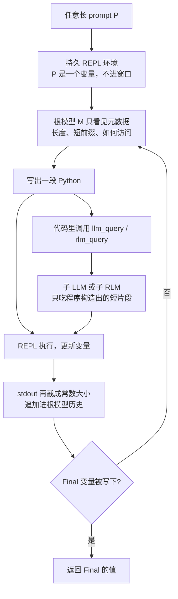
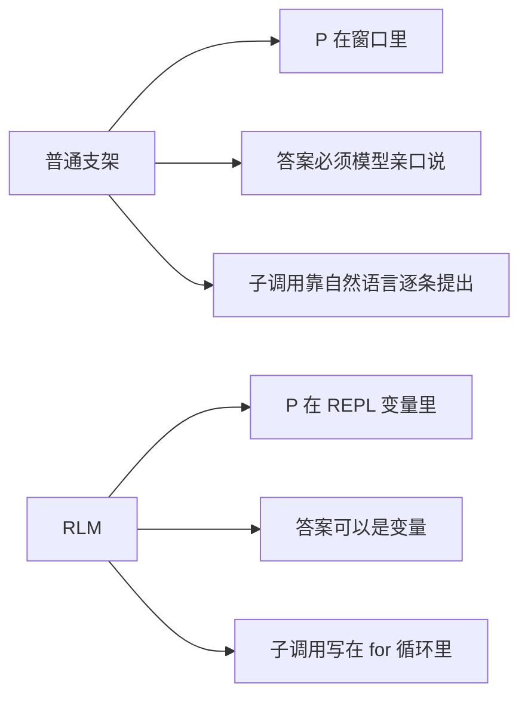
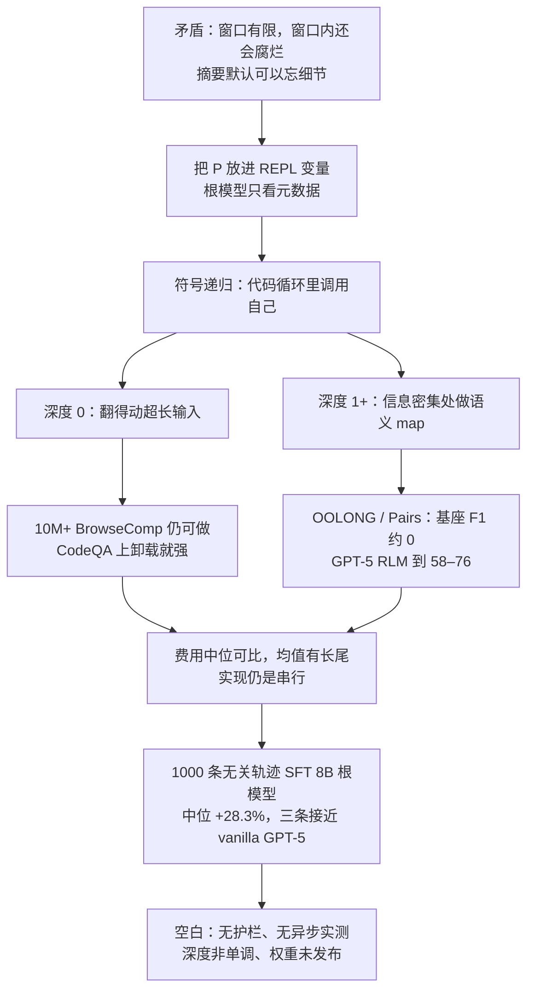

# Recursive Language Models：超长 prompt 不要塞进窗口，把它当成外部环境，用代码去翻、去切、再递归调用自己

<!-- release-date: 2025-10-15 -->

> 本文依据 MIT CSAIL 的 **Recursive Language Models**，即 arXiv:2512.24601**v3**、2026-05-11 修订版，共 43 页（正文与参考文献 15 页，附录 28 页）。封面作者三人：Alex L. Zhang、Tim Kraska、Omar Khattab，均挂 MIT CSAIL。封面水印为 `arXiv:2512.24601v3 [cs.AI] 11 May 2026`。动笔前已核验：arXiv 官方页提交历史为 v1（2025-12-31）、v2（2026-01-28）、v3（2026-05-11），**本地 PDF 就是最新的 v3**，页数与官方「9 pages, 43 with Appendix」一致。页码均指这份 43 页 PDF 本身。本文会把三件事分开写：**报告明确写了什么**、**我们如何理解它**（凡属推算、换算或图上读数都会写明）、**外部资料补充**（会给出链接并标注）。
>
> 这篇论文是**推理期范式**，不是改 Transformer 内部结构的长上下文训练 recipe。不要把它读成「递归层」或「把窗口训到 10M」。

## 阅读前先搭一张最小地图

这篇论文几乎不改模型权重，却借了不少系统和编程的词。先把关键概念翻成人话。

- **Token（词元）**：模型读写文本时的基本小块。一百万字的材料会被切成几十万到上百万个 Token。
- **上下文窗口（context window）**：一次模型调用里，模型真正「看见」的 Token 上限。GPT-5 在本文实验里是 272K（PDF p.1 图注）。超出这个上限，普通调用要么截断，要么根本发不出去。
- **Context rot（上下文腐烂）**：即使还没撑破窗口，prompt 变长以后，模型从这段上下文里准确取用信息的能力也会下降（PDF p.1，引 Hong et al. 2025）。人话就是：不是看不见，是越看越糊。
- **Compaction / condensation（压缩、摘要式挤窗口）**：上下文快满时，把旧内容总结成更短的一段，腾出位置给新内容。论文把它当作当时最流行的通用长上下文办法（PDF p.2）。
- **REPL（Read-Eval-Print Loop，读–求值–打印循环）**：一个持久的编程环境。模型写一段代码，环境执行，把打印结果（通常还要截断）送回模型，变量还留在环境里。本文实例用的是 Python REPL。
- **Root LM / sub-LM（根模型 / 子模型）**：一次 RLM 调用最外层那个模型叫 root；它在代码里再发起的模型调用叫 sub-call。深度 0 只有根模型；深度 1 可以调普通 LLM；深度大于 1 可以再调一整套 RLM。
- **Symbolic recursion（符号递归）**：不是在神经网络层里递归，而是**在代码里**对 prompt 的切片、变换结果再调用模型，并把中间结果存成变量。论文把它写成 $\Omega(|P|)$ 甚至 $\Omega(|P|^2)$ 的语义工作量（PDF p.3）。

这篇论文自己造的名字只有一个：

- **Recursive Language Model（RLM，递归语言模型）**：一套推理期支架。它对外仍是「字符串进、字符串出」，对内却不把超长 prompt 喂进 Transformer，而是把它当成外部环境里的一个变量，让模型用代码去检查、切分，并递归调用自己处理片段。

## 一句话先说清

今天处理超长材料，主流有三条路：把窗口做大、把旧内容摘要掉、让 agent 去文件系统或语料库里检索。三条路共享一个默认动作——**总有一个时刻，模型必须把「当前要处理的文本」直接放进自己的上下文窗口。**

RLM 反对的就是这个默认动作。

它把任意长的用户 prompt $P$ 装进一个持久 REPL，根模型第一次看见的不是 $P$ 本身，而是一段常数大小的元数据：长度、一小段前缀、以及怎么访问它。然后根模型写代码：peek 几行、用正则缩小范围、按块切开、在循环里对切片调用子模型，把中间结果存成变量。需要交卷时，既可以自己写答案，也可以返回环境里已经拼好的那个变量。

所以这是 **inference-time scaling（推理期缩放）**：多花一些测试时计算，换来远超窗口的有效输入、有效输出，以及按任务复杂度伸缩的语义工作量。它不训练一个更长窗口的 Transformer，也不把递归做进注意力层。

论文用 GPT-5 和 Qwen3-Coder-480B-A35B 在四个任务上对照 vanilla 调用、compaction、CodeAct、OpenCode 和 Claude Code。摘要给出的 GPT-5 中位提升是：相对 compaction **26%**，相对带 sub-call 的 CodeAct **130%**，相对 Claude Code **13%**，成本同量级（PDF p.1）。小规模后训练得到的 **RLM-Qwen3-8B**，相对同一套 RLM 支架里的 Qwen3-8B，四个评测任务上中位提升 **28.3%**，并在三个长上下文任务上接近 vanilla GPT-5（PDF p.1、p.3）。

这也是全文最重要的 insight：

> **窗口是模型一次能读的预算，不是系统一次能处理的预算。把 prompt 留在窗外，让模型用代码决定每次读哪一段、对哪一段再调用自己，有效上下文就可以按推理计算去缩放。**

这句话是本文的归纳，论文没有用这一句收束；但它的算法、消融和四个任务都在测这件事。

## 先看全景：一次 RLM 调用里到底发生了什么

这张图根据论文 Figure 2、Algorithm 1 与 §2 重画（PDF p.2–4），画的是**机制顺序**，不代表每一步的耗时比例。论文实验里默认递归深度为 1：子调用是普通 LLM，不是再套一层完整 RLM（PDF p.5）。

三个必须先记住的设定，后面每一处都会回到出处：

| 项目 | 取值 | 出处 |
|---|---|---|
| GPT-5 上下文窗口 | 272K Token | PDF p.1 图注 |
| 主实验两个骨干 | GPT-5（中等推理）根模型 + GPT-5-mini 子模型；Qwen3-Coder-480B-A35B | PDF p.5 |
| 递归深度 | 主表报 0 / 1 / 2 / 3；未写明时默认 1 | PDF p.5 |
| 后训练 | Qwen3-8B，约 1000 条过滤后的蒸馏轨迹 | PDF p.3、p.5、p.16 |

## 第一层问题：长上下文到底卡在哪

### 卡点一：窗口是硬上限，腐烂是软上限

论文开篇把两个事实叠在一起（PDF p.1）：

1. 前沿推理模型的上下文窗口有限；
2. **即使还在窗口以内**，质量也会随 prompt 变长而陡降，也就是 context rot。

Figure 1 把这件事画得很具体。横轴从 $2^{13}$（8k）拉到 $2^{20}$（约 1M），左图是 vanilla GPT-5，右图是 RLM(GPT-5, depth=1)。红色区域是超过 272K、GPT-5 根本塞不进去的部分（PDF p.1）。

**本文从图上看到**：GPT-5 在 S-NIAH（大海捞针）上还能撑到较长输入；OOLONG 掉得更早；OOLONG-Pairs 掉得最早、也掉得最狠。同一条模型，任务越「每个位置都有用」，腐烂来得越早。RLM 一侧三条线都平得多，并且红区里仍然有分。这些是图上读数，论文没有给 Figure 1 的数值表。

所以「把窗口从 128K 改成 1M」解决不了 Figure 1 里窗口内部那一段下降。论文关心的问题更狠：有没有办法让通用 LLM 的有效上下文再放大几个数量级（PDF p.1）。

口径必须写清楚。PDF 封面摘要写的是 **more than an order of magnitude**（超过一个数量级，PDF p.1）；正文写 RLMs 在 **10M+ token** 尺度上仍然很强（PDF p.3、p.6）；BrowseComp-Plus（1K 文档）的任务长度是 **6M–11M**（PDF p.6）。相对 GPT-5 的 272K 窗口，6M–11M 大约是 22–40 倍，超过一个数量级，不到两个。arXiv 网页摘要另写「up to two orders of magnitude」，与这份 v3 PDF 封面摘要不一致。**本文以 PDF 为准**，不把网页摘要里的「两个数量级」写成论文原话。若以常见 100K 级窗口为参照，10M 确实靠近两个数量级——那是换分母之后的读法，不是 PDF 原句。

### 卡点二：摘要式挤窗口默认「前面的细节可以忘」

当时最流行的通用办法是 compaction：上下文超阈值就做摘要（PDF p.2）。论文对它的定性很硬：

> compaction is rarely expressive enough for tasks that require dense access throughout the prompt. It presumes that some details that appear early in the prompt can safely be forgotten to make room for new content.（PDF p.2）

人话就是：摘要默认「旧细节可以扔」。这对聊天记录也许成立；对「几乎每一行都要参与最终答案」的聚合题，扔就是错。

### 卡点三：已有的代码 agent、检索 agent、子 agent，都还在窗口里干活

论文把已有支架的表达力上限写得很清楚（PDF p.2–3）：

- 代码 agent 和检索 agent 把**某个外部数据源**（文件系统、文档库）当成环境，但捞回来的片段最终仍要填进模型窗口，填满了还是要 compaction；
- 子 agent / 自委托允许模型调用自己，但子调用是**用自然语言逐条说出来的**，不是在代码循环里程序化地发 $\Omega(|P|)$ 次请求；它们还受底层模型输出长度限制。

三句话收口：**外部世界可以很大，但模型每次真正读到的那一截仍然很小；而且「再读一截」这件事，不能靠模型把调用一个一个用嘴说完。**

## 核心设计：把 prompt 留在窗外，把递归写进代码

### 旧问题：一次 `completion(prompt)` 把 $P$ 和模型绑死了

普通调用是：

$$
Y = \mathcal{M}(P),\qquad |P| \le K
$$

$\mathcal{M}$ 是基座模型，$K$ 是窗口。$|P|>K$ 时这条式子直接不成立；$|P|$ 接近 $K$ 时，即使成立，context rot 也会让 $Y$ 变差。

RLM 要的是另一条接口（PDF p.3）：同样是字符串进、字符串出，但允许 $|P|\gg K$、输出也可以超过 $K$，并且语义工作量可以是 $\Omega(|P|)$ 或 $\Omega(|P|^2)$。

### 新设计：REPL 里的变量 + 根模型循环 + 程序化的子调用

Algorithm 1 的骨架只有这几步（PDF p.4）：

1. `InitREPL(prompt=P)`：把 $P$ 放进环境，**不**放进根模型历史；
2. 给环境登记 `sub_RLM`，作为代码里可调用的函数；
3. 根模型历史一开始只有环境的元数据；
4. 循环：模型写代码 → REPL 执行 → 把 stdout 的元数据（短前缀 + 长度）追加进历史；
5. 环境里的 `Final` 被赋值，就返回。

脚注 2 把「为什么 stdout 也要截断」说死了：这是为了逼模型靠变量和子调用管理长字符串，而不是把环境输出又倒回窗口。若每轮只留 $c$ 个 Token，根循环最多大约 $K/c$ 轮，但每一轮可以发起任意多次子调用（PDF p.3）。论文承认这不是理论上限——可以把根历史自己也变成变量——但实践上仍会限制每一层的迭代次数。

GPT-5 实验里，子模型用 GPT-5-mini、根模型用 GPT-5，论文说这是能力和成本的折中（PDF p.5）。深度记号是 `RLM(model, depth=N)`：0 不能子调用，1 调 LLM，大于 1 调 RLM；未写明时默认 1（PDF p.5）。

### 工作机制：一次循环里模型实际在干什么

系统提示（附录 C）把这件事写得很操作性（PDF p.18–19）：

- 环境里有 `context` 变量和 `llm_query`；
- `print()` 能看执行结果，但输出会被截断，所以真正要分析的长字符串应该交给 `llm_query`；
- 交卷用 `FINAL(答案)` 或 `FINAL_VAR(变量名)`。

论文在轨迹分析里观察到几类反复出现的动作（PDF p.8、p.31 Figure 8）：

1. **Peek**：先看前几行、总长度、分隔符，弄清数据长什么样；
2. **Grep / 正则**：用关键词把搜索空间缩小，而不是一上来做语义检索；
3. **切块 + map**：对语义问题按块调用子模型，把标签、摘要、局部答案写入 buffer；
4. **在 REPL 里拼接长输出**：OOLONG-Pairs 这种「答案本身是一长串 pair 列表」的题，靠子调用的返回值在变量里拼起来，而不是让根模型一次性生成整份名单。

附录 E.1 是一条完整的 BrowseComp-Plus 轨迹：1000 篇文档、约 8.3M Token，总费用 **$0.079**。根模型先对文档列表做正则，在 index 6 的片段上发起子调用，把可能答案 `Maria Dalmacio` 存进变量，再用两次子调用复核，最后交卷，答案正确（PDF p.31–33）。

### 收益：窗口不再是系统的输入上限

因为 $P$ 不在根窗口里，输入长度的上限变成「REPL 能装下多少字符串」，不是「Transformer 一次能 attend 多少位置」。子调用每次只吃程序构造出来的短片段，所以单个模型调用仍然可以很短。这就是它能处理 10M+ Token 的机制，而不是把注意力做成线性或稀疏。

### 代价与边界

- 根模型必须会写能跑的代码。附录 B 明确说：编码能力不够的小模型（如未经后训练的 Qwen3-8B）很难当 RLM 用（PDF p.17）。
- 子调用默认是**阻塞、串行**的，尾延迟会拉得很长（PDF p.7、p.17、p.41）。
- `FINAL` / `FINAL_VAR` 这种交卷协议很脆：模型可能把计划当成最终答案（PDF p.17）。
- 没有内建的费用护栏。深度加大、每行一次子调用，成本可以爆掉。这是 §7 自己写下的未来工作（PDF p.9）。

**可迁移的启发**：当你的系统卡在「上下文太长」时，先问一句——是不是整个系统都在假装「一次模型调用必须看见全部输入」？如果可以把输入变成环境里的对象，让模型用代码选择每次看哪一块，窗口大小就不再等于任务大小。这个技巧不依赖某个注意力变体，但依赖模型会写代码、以及一个真能持久保存变量的沙箱。

## 三个看起来像、其实差很远的设计选择

论文特意放了 Algorithm 2，用来展示「有代码、有搜索、有子调用」仍然可以很弱（PDF p.3–4）。三个 Flaw 对应三条必须成立的设计：

### Flaw 1：把 $P$ 放进根历史

Algorithm 2 一上来就把 prompt 塞进 `hist`。于是整个支架继承了 $\mathcal{M}$ 的窗口，超了只能 compaction。即使后来有 Search，它能搜外部数据，对**用户输入本身**仍然受窗口约束（PDF p.3）。

RLM 的对应选择是：给 $\mathcal{M}$ 一个指向 $P$ 的**符号句柄**（变量名），而不是 $P$ 的副本。

### Flaw 2：用 Finish 动作让模型直接把答案说出来

看起来无害，但输出长度不能超过 $\mathcal{M}$ 的窗口（PDF p.4）。OOLONG-Pairs 的答案是一长串 pair 列表，正好踩中这条。

RLM 允许答案来自 REPL 变量。长输出是「在环境里拼好再返回」，不是「根模型一次性生成」。

### Flaw 3：子调用只能口头委托，不能写进循环

这是论文称为 **symbolic recursion** 的那一条。Algorithm 2 虽然同时有 Exec 和 sub-LLM，但不能在代码里对 $P$ 的切片程序化地调用子模型，因此委托次数是「模型愿意用嘴说几句」，不是 $\Omega(|P|)$（PDF p.4）。

RLM 要求：跑在环境里的代码必须能对程序构造出的 $P$ 的变换再调用 $\mathcal{M}$，并把中间结果符号地存下来。没有这一条，REPL 只是一个计算器；有了这一条，REPL 才是递归的控制器。

这张图是本文对 Algorithm 1 / 2 的对照，不是论文原图。

**可迁移的启发**：给 agent 加「能跑代码」和「能叫子模型」并不自动得到无界上下文。真正要问的是三件事：用户输入住在哪、最终答案住在哪、子调用能不能被程序触发。三件事里任何一件仍绑在窗口上，系统就还是窗口系统。

## 四个任务：复杂度必须跟着长度一起变

论文的假说是：有效上下文窗口不能脱离具体任务来谈。更复杂的题，会在更短的长度上开始掉点（PDF p.4）。因此评测必须能改 prompt 长度，并且任务难度随长度的缩放方式要不一样。

四个任务如下（PDF p.4–5）。

| 任务 | 在测什么 | 随长度的处理复杂度 | 规模 | 指标 |
|---|---|---|---|---|
| S-NIAH | RULER 风格的单针大海捞针，50 题 | $O(1)$：针的数量不随长度涨 | Figure 1 用；主表没有单独一列 | 正确率 |
| BrowseComp-Plus（1K 文档） | DeepResearch 式多跳问答，150 条随机样本；输入保证含金标和证据文档 | 仍是常数篇文档，但要跨多篇拼事实，难于 S-NIAH | 6M–11M Token | 正确率 |
| OOLONG（`trec_coarse`） | 几乎每一行都要做语义标注再聚合，50 题 | 线性 | 131K Token | 正确率 |
| OOLONG-Pairs | 改写自同一 split，20 条；答案是 pair 列表 | 二次：几乎要看所有 pair | 32K Token | F1 |
| LongBench-v2 CodeQA | 代码仓库理解，多选 | 文件数固定，仓库可很长 | 23K–4.2M Token | 正确率 |

OOLONG-Pairs 的全部查询写在附录 D。它们的共同形态是：输入是带 User ID 的问题列表，标签并不写在数据里，模型必须从问题语义判断它属于 description / entity / human / numeric / location / abbreviation 中的哪一类，再按「两个用户是否都满足某组标签约束」列出 pair（PDF p.27–30）。这就是「信息密度」的人话：**几乎每个位置都有用，而且位置之间还要两两组合。**

S-NIAH 只出现在 Figure 1 的缩放曲线里，没有进 Table 1。主表四列是 CodeQA、BrowseComp+、OOLONG、OOLONG-Pairs。

## 对照什么：论文在和谁比

对照原则写在 §3.2：只比**任务无关**的推理期方法，同一套系统提示打所有任务（PDF p.5、p.18）。两个骨干：

- GPT-5，中等推理，默认采样；费用按 OpenAI（PDF p.5–6）；
- Qwen3-Coder-480B-A35B，采样按 Qwen 官方说明；费用按 Fireworks（PDF p.5–6）。

基线是：

- **Base Model**：直接把上下文和问题塞给模型。打星号 `*` 表示有时撞上输入窗口（PDF p.6）。
- **CodeAct**：ReAct 循环里执行 Python。论文强调它**不**把用户 prompt 卸载到代码环境，而是直接提供给 LM（PDF p.5）。两个变体：带 BM25 检索（主要用于 BrowseComp+）；REPL 里带 sub-call 工具。
- **Compaction agent**：上下文填满就摘要。单篇文档超过窗口时先切块再摘要。GPT-5 这组因为费用太高，摘要用 GPT-5-nano、最终作答用 GPT-5（PDF p.5、p.24）。附录 C.2 说，这解释了 Table 1 里 GPT-5 与 Qwen3-Coder 在 BrowseComp-Plus 上巨大的费用差：Qwen3-Coder 的摘要 agent 平均贵了将近 **15×**；他们在 20 条小样本上觉得 GPT-5 与 GPT-5-nano 做摘要的质量差不多（PDF p.24）。
- **OpenCode / Claude Code**：各做「上下文作为初始 prompt」和「上下文卸载到文件」两个变体。Claude Code 用 Claude Opus 4.1 + Claude Code v2.0.0，论文写这是为了和主实验用的 GPT-5 大致同期（PDF p.5）。闭源 coding agent 的费用，OpenCode 在表里是 N/A，Claude Code 按 Anthropic 计。

RLM 自己的系统提示几乎全任务共用。Qwen3-Coder 只多了一句：不要滥用 `llm_query`，尽量按约 200k 字符一批来调用——否则它会对每一行都发起子调用（PDF p.18、p.19）。深度大于 1 时，环境额外提供 `rlm_query(context, query)`，会再开一个带自己 REPL 的 RLM 循环；触到最大深度就退回 `llm_query`（PDF p.19）。

## 主结果：Table 1 里的数字，以及摘要里那三个中位数

Table 1 是全文最重要的一张表（PDF p.6）。灰色是平均 API 费用 ± 标准差。非零分数至少修约到 0.1。

### GPT-5 一组（子调用是 GPT-5-mini）

| 方法 | CodeQA | BrowseComp+ (1K) | OOLONG | OOLONG-Pairs |
|---|---:|---:|---:|---:|
| 任务长度 | 23K–4.2M | 6M–11M | 131K | 32K |
| Base Model | 24.0\* ($0.13±$0.07) | 0.0\* | 44.0 ($0.14±$0.02) | 0.1 ($0.16±$0.10) |
| CodeAct (+ BM25) | 22.0\* ($0.06±$0.08) | 51.0 ($0.71±$1.20) | 38.0 ($0.61±$1.06) | 24.7 ($0.75±$0.43) |
| CodeAct (+ sub-calls) | 24.0\* ($0.06±$0.08) | 0.0\* | 40.0 ($0.85±$1.27) | 28.4 ($1.11±$0.62) |
| Compaction agent | 58.0 ($1.31±$1.46) | 70.5 ($0.57±$0.10) | 46.0 ($0.13±$0.01) | 0.1 ($0.13±$0.09) |
| OpenCode | 18.0\* | 0.0\* | 32.0 | 3.1 |
| OpenCode (+ offloading) | 64.0 | 94.0 | 52.0 | 4.8 |
| RLM (depth=0) | 58.0 ($0.18±$0.56) | 88.0 ($0.44±$0.90) | 36.0 ($0.37±$0.42) | 43.9 ($0.69±$1.16) |
| RLM (depth=1) | 62.0 ($0.11±$0.10) | 91.3 ($0.99±$1.22) | 56.0 ($0.43±$0.85) | 58.0 ($0.33±$0.20) |
| RLM (depth=2) | 66.0 ($0.15±$0.30) | 92.0 ($0.55±$0.69) | 56.5 ($1.10±$3.25) | 65.5 ($0.33±$0.44) |
| RLM (depth=3) | 58.0 ($0.15±$0.27) | 92.0 ($0.51±$0.54) | 58.0 ($0.51±$0.54) | 76.0 ($0.39±$0.32) |

### Qwen3-Coder-480B-A35B 一组

| 方法 | CodeQA | BrowseComp+ | OOLONG | OOLONG-Pairs |
|---|---:|---:|---:|---:|
| Base Model | 20.0\* ($0.13±$0.08) | 0.0\* | 36.0 ($0.06±$0.00) | 0.1 ($0.05±$0.01) |
| CodeAct (+ BM25) | 24.0\* | 12.7 ($0.39±$0.50) | 38.0 ($1.51±$1.09) | 0.3 ($1.54±$0.35) |
| CodeAct (+ sub-calls) | 26.0\* | 0.0\* | 32.0 ($1.83±$1.14) | 0.1 ($1.49±$0.46) |
| Compaction agent | 50.0 ($1.26±$1.50) | 38.0 ($8.98±$2.12) | 44.1 ($0.15±$0.01) | 0.31 ($0.05±$0.00) |
| OpenCode | 12.0\* | 0.0\* | 36.0 | 0.0 |
| OpenCode (+ offloading) | 40.0 | 58.0 | 24.0 | 2.1 |
| RLM (depth=0) | **66.0** ($0.18±$0.58) | 46.0 ($0.82±$0.69) | 43.5 ($0.32±$0.13) | 17.3 ($1.77±$1.23) |
| RLM (depth=1) | 56.0 ($0.92±$1.23) | 44.7 ($0.84±$0.63) | **48.0** ($0.61±$0.49) | **23.1** ($1.02±$0.52) |
| RLM (depth=2) | 54.0 | 68.0 ($1.05±$0.67) | 26.0 | 19.0 |
| RLM (depth=3) | 44.0 | **68.7** ($1.10±$0.80) | 32.0 | 21.1 |

### Claude Opus 4.1

| 方法 | CodeQA | BrowseComp+ | OOLONG | OOLONG-Pairs |
|---|---:|---:|---:|---:|
| Claude Code | 12.0\* ($2.03±$0.57) | 0.0\* | 40.2 ($3.43±$1.60) | 0.1 ($6.75±$3.57) |
| Claude Code (+ offloading) | 62.0 ($1.25±$0.54) | 84.0 ($2.03±$1.49) | 48.0 ($0.98±$0.55) | 6.5 ($2.99±$1.16) |

封面摘要说：在 GPT-5 上，跨评测的中位提升是相对 compaction **26%**、相对带 sub-call 的 CodeAct **130%**、相对 Claude Code **13%**（PDF p.1）。**本文核对了其中两条的原始表。**

相对 compaction，用 RLM(depth=1) 的四个分数 62.0 / 91.3 / 56.0 / 58.0 对 58.0 / 70.5 / 46.0 / 0.1，相对提升分别约为 6.9%、29.5%、21.7% 以及一个被 0.1 分母放大的极端值；四个数的中位数落在约 26%。相对 Claude Code（**带 offloading 的那一行**）62.0 / 84.0 / 48.0 / 6.5，相对提升约为 0%、8.7%、16.7% 和一个极端值，中位数约 13%。这两条与摘要一致。

相对 CodeAct(+ sub-calls) 的 130%，用同一张表不能无歧义地复原：BrowseComp+ 上该基线是 0.0\*，相对提升没有有限值。**本文按摘要原文引用 130%，不替论文补一种它没写明的聚合方式。**

## 论文自己的六条观察

§4 把 Table 1 和 Figure 1 收成六条。下面按原文顺序写，并标出哪些是被表支持的，哪些是作者读法。

### Observation 1：能上 10M+，而且常常比现有支架高出一个大档

跨四个任务，RLM 在远超有效窗口的 prompt 上仍然强，相对基座和常见支架最多大约 2×，平均 token 费用相当或更便宜（PDF p.6）。

两个被写明的例子：

- BrowseComp-Plus（1K）：若按线性外推，让 GPT-5-mini 直接吃 6–11M 输入，费用约 **$1.50–$2.75**；RLM(GPT-5, depth=1) 平均 **$0.99**，并且相对 compaction 和检索基线都高出 **29% 以上**（PDF p.6）。91.3 对 compaction 的 70.5，相对提升约 29.5%，对得上「over 29%」里较小的那一头。
- 即使任务还在窗口内，信息密集时提升也很大。OOLONG 上 RLM(depth=1) 相对基座：GPT-5 **+28.4%**，Qwen3-Coder **+33.3%**（PDF p.6）。Qwen3-Coder 的 48.0 对 36.0 正好是 33.3%；GPT-5 的 56.0 对 44.0 是 27.3%，与正文 28.4% 有一个百分点的差，论文没有解释。OOLONG-Pairs 上两个基座的 F1 都是 $\le 0.1\%$，RLM(depth=1) 分别到 **58.0%** 和 **23.1%**（PDF p.6）。

**本文的读法**：这一条被 Table 1 和 Figure 1 共同支撑。需要记住的限定是——BrowseComp+ 的 0.0\* 对基座并不等于「模型很笨」，它首先是窗口装不下；compaction 在 OOLONG-Pairs 上几乎也是 0.1，说明「摘要掉细节」正好打中二次聚合。

### Observation 2：REPL 负责「超出窗口」，递归子调用负责「信息密集」

RLM(depth=0) 以及 Claude Code / OpenCode 这类能把上下文卸载到文件的 coding agent，都能越过模型窗口，并在多数长上下文设定上超过其他任务无关基线（PDF p.7）。

最值得记住的反例：Qwen3-Coder 在 CodeQA 上，**depth=0 的 66.0 高于所有带递归的变体**（depth=1/2/3 分别是 56.0 / 54.0 / 44.0）（PDF p.6–7）。论文的解释是：不是所有长上下文题都需要子调用；有的题，会写代码、能在 REPL 里翻仓库就够了。

反过来，OOLONG / OOLONG-Pairs 这类信息密集题，论文观察到程序化的递归子调用是必要的。没有子调用的消融会被迫改用关键词启发式；GPT-5 的更高深度变体在 OOLONG-Pairs 上大幅超过 Claude Code 和 OpenCode（PDF p.7）。Table 1 对得上：GPT-5 的 RLM depth=3 在 OOLONG-Pairs 上是 **76.0**，Claude Code(+ offloading) 只有 **6.5**，OpenCode(+ offloading) 只有 **4.8**。

Qwen3-Coder 的深度曲线却是另一回事：深度加大，CodeQA 和 OOLONG 反而变差。论文把原因放到 §5 的语法错误上，下面会写。

### Observation 3：基座随长度和复杂度一起掉，RLM 掉得慢，费用跟复杂度走

S-NIAH / OOLONG / OOLONG-Pairs 的输入从 $2^{13}$ 拉到 $2^{20}$，处理复杂度大致是常数、线性、二次（PDF p.7）。Figure 1 里，超过 $2^{14}$（16k）之后 RLM 就稳定超过 GPT-5。费用仍与 GPT-5 同量级，但按任务复杂度比例增长，见附录 Figure 16（PDF p.7、p.43）。

**本文从图 16 看到**：S-NIAH 上 RLM 的费用几乎不随长度涨；OOLONG、尤其 OOLONG-Pairs 上，到 1M 附近 RLM 的平均费用明显抬升，GPT-5 则在窗口内相对平坦。这些是图上趋势，论文没有给 Figure 16 的数值表。它想说明的是：RLM 不是「不管题目多难都固定花一份钱」，它把钱花在题目真正需要的那类遍历上。

### Observation 4：平均费用可比，中位数甚至更便宜，均值被长尾拉高

Table 1 的平均费用上，RLM 通常不比 coding agent 贵。Figure 11 进一步说：中位数 RLM 跑得比中位数基座调用还便宜，平均值更贵，是因为少数找不到答案的轨迹拖了后腿（PDF p.7、p.41）。

运行时间的图是 Figure 12、13。论文自己加了几条很重要的限定：这些数字严重依赖机器、API 延迟、以及子调用是否异步；**他们自己的实现里所有 LM 调用都是阻塞 / 串行的**（PDF p.7）。95 分位会到极长，主要就是串行子调用；论文说这种情况不频繁，可以用超时掐掉（PDF p.41）。

**本文的判断**：费用「可比」是被 Table 1 和 Figure 11 支持的；「更快」不是这篇论文的主张，它甚至明确说自己的实现很慢。任何把 RLM 说成延迟方案的转述，都超出了原文。

### Observation 5：不止长输入，还能做更长的组合推理

Table 2 换了一件事：LongCoT-mini，组合型长推理，子问题互相依赖（PDF p.7）。对照是该基准论文里最好的 GPT-5.2：

| 模型 | Overall | MATH | CHEM | CS | LOGIC | CHESS |
|---|---:|---:|---:|---:|---:|---:|
| GPT-5.2（基座） | 38.7 | 26.0 | 37.0 | 40.4 | 53.6 | 36.6 |
| RLM(GPT-5.2, depth=1) | 50.6 | 5.6 | 50.0 | 11.0 | 86.7 | 93.0 |
| 同上 + 分解提示 | **65.6** | 32.0 | 52.0 | 46.0 | 99.0 | 99.0 |

加了分解提示之后，总体相对基座提升 **69.5%**（PDF p.7）。$(65.6-38.7)/38.7 \approx 69.5\%$，对得上。论文描述的工作方式是：RLM 先生成问题的图，再按图用子调用解每个节点，并在 REPL 里程序化地遍历（PDF p.7）。

但 Table 2 不能当「RLM 无条件更强」来读。不加提示时，MATH 从 26.0 掉到 5.6，CS 从 40.4 掉到 11.0。REPL 把模型从「一条思维链做到底」拉成「编排子问题」，对本来就适合一条链做完的数学题，可能是伤害。附录 Table 3 把这件事说得更白：给 GPT-5.2 **只加分解提示、不加 RLM**，总体反而从 38.7 掉到 **28.6**；MATH 升到 37.0，LOGIC 从 53.6 掉到 19.1（PDF p.24）。论文的解释是：没有 REPL 把子任务隔离开，模型会在程序性任务上把自己搞混。

附录 C.3 还交代了一处实现差异：LongCoT-mini 用的是 Prime Intellect 的 `rlm-harness`，从 Table 1 那套实现 fork 出来，交卷机制也不一样（PDF p.24）。所以 Table 2 和 Table 1 **不是同一套脚手架上的数字**。

### Observation 6：一个域上的训练可以迁到别的长上下文任务，而且有长度外推

这一条接到下一节的后训练。先记住论文的主张：探测输入、对更短上下文做递归子调用，这些行为跨域是共通的；所以可以在无关任务上训根模型（PDF p.7–8）。

## 小规模后训练：先把根模型教会「当 RLM」，叶子调用先借用现成 LLM

### 旧问题：8B 模型即使塞进 RLM 支架也几乎不会做

Figure 3(a) 的灰色柱是 Base Qwen3-8B。**本文读柱上标注**：CodeQA 4.00，BrowseComp+ 0.00，OOLONG 0.00，OOLONG-Pairs 0.07（PDF p.8）。把它放进 RLM 支架（橙色柱）会好一些：26.00 / 6.00 / 24.85 / 6.26，但离 GPT-5 还很远。附录 B 把原因说成编码能力不够（PDF p.17）。

### 新设计：只训根模型怎么操作 REPL，叶子仍当普通 LLM

附录 A 的关键洞察是：一次 RLM 轨迹可以因为子调用而极长，可能 $\Omega(|P|)$，但**叶子子调用本质上就是通用 LLM 请求**；真正难学的是当根模型——怎么摆弄 prompt 的程序化表示、什么时候该发起子调用（PDF p.5、p.16）。

于是 recipe 可以做得很小：

1. 用更大的 Qwen3-Coder-480B-A35B 当 RLM，子调用用 Qwen3-8B，在 750 道英文 LongBenchPro 上采轨迹，共 2250 条候选（PDF p.16）；
2. 丢掉分数恰好 0.0、以及不超过一轮的轨迹，剩下 1072 条；
3. 把每个根模型 turn 拆成一条 SFT 样本（输入是到该步为止的完整历史，输出是根模型这一步写的内容）；
4. 丢掉超过 Qwen3-8B 窗口的 turn（他们用约 100k 字符近似）；
5. 再做一步**程序化修补**：教师模型自己就会用错模板。16% 的 turn 错用了 `FINAL`，13% 的 turn 把 REPL 变量错当成 `FINAL_VAR` 的用法。修补这些模板错误后，学生好了很多（PDF p.16）；
6. 用 prime-rl，batch 64，300 step，**48 个 H100 小时**（PDF p.16）。

过滤后大约 1000 条轨迹，对应正文「only 1,000 samples from unrelated domains」（PDF p.3）。LongBenchPro 与四个评测任务无关，这是他们主张「跨域迁移」的依据。

Figure 5 给了过滤前后的轨迹统计（PDF p.16）。**本文读图注与图内数字**：过滤前每条轨迹平均 5.33 个 turn（$n=2243$）；过滤后平均 4.96 个 turn（$n=953$）。Token 直方图从「每 turn 输入均值约 9734、输出约 1032」变成更短的分布。左右两列是同一批轨迹的过滤前 / 后，不是两个模型。

### 收益：四个任务都涨，而且更快

Figure 3(a) 蓝色柱是后训练的 **RLM-Qwen3-8B**。**本文读柱上标注**：CodeQA **32.00**，BrowseComp+ **14.00**，OOLONG **32.04**，OOLONG-Pairs **9.97**（PDF p.8）。

正文说，相对底层 Qwen3-8B，四个评测任务上中位提升 **28.3%**（PDF p.3）；封面摘要把这个数写成中位 **28%**（PDF p.1）。arXiv 网页摘要另写「28.3% on average」，与 PDF 的 median 用词不一致，**本文以 PDF 为准**。论文没有写出 28.3% 是对「裸 8B」还是对「8B+RLM 支架」、以及四个相对提升如何取中位。对照柱状图，更像是支架内后训练相对支架内基座的提升；本文不替它重算，只并列给出柱上原始分数。

「在三个长上下文任务上接近 vanilla GPT-5」（PDF p.1）对照 Table 1 的 GPT-5 基座 24.0 / 0.0 / 44.0 / 0.1：CodeQA 32.00 超过 24.0；OOLONG 32.04 接近 44.0；OOLONG-Pairs 9.97 远超 0.1。BrowseComp+ 仍是 14.00 对 0.0，两边绝对值都低。论文没有点名是哪三个任务。

Figure 6 还给出运行时间（PDF p.17）。**本文读柱上标注与图内标签**：

| 任务 | RLM(Qwen3-8B) | RLM-Qwen3-8B | 图内标注 |
|---|---:|---:|---|
| CodeQA | 272 s | 86 s | 68% runtime，3.2× faster |
| BrowseComp+ | 341 s | 101 s | 70% runtime，3.4× faster |
| OOLONG | 12649 s | 1649 s | 87% runtime，7.5× faster |
| OOLONG-Pairs | 5113 s | 532 s | 90% runtime，9.6× faster |

正文写「more than 3× faster」（PDF p.8），对应的是最保守的那一档；OOLONG 系更快。论文把加速归因于更好的决策和更少的 RLM 错误（PDF p.8），不是内核变快。

### 长度外推：64k 上学，1M 上考

Figure 3(b) 把同一套想法换成 RLVR（reinforcement learning with verifiable rewards，带可验证奖励的强化学习）。骨干换成 Qwen3-4B-Instruct-0527，在 MRCRv2 上训：要在语料里计数并复现某段文本的出现（PDF p.8、p.17）。

训练设定（PDF p.17）：

- 平台：Prime Intellect 的 Lab，库仍是 prime-rl；
- 训练 split：32k–64k Token、2 needle，150 step，batch 128，每条 4 条 rollout；
- 每轮最大输出 4096 Token，最大 RLM 迭代 20；
- 每 50 step（从 0 开始）在 512K–1M Token、8 needle 的 split 上评估。

论文的结论是：只在较短、较易的 split 上做 RL，RLM(Qwen3-4B-Instruct-0527) 能泛化到更长、更难的 split（PDF p.8）。图上还画了一条 Gemini 3.1 Pro 在 1M 上下文上的参考水平。**本文不从图上读具体分数**，论文没有给数值表；只保留「短训长测仍然向上」这条被 Figure 3(b) 支持的趋势。

### 代价：这是一次小规模练习，不是 native RLM 的完整配方

论文自己的用词是 small-scale exercise（PDF p.16）。他们点名还缺：更大模型、更多样的例子、以及理想情况下 on-policy、在线的 rollout（PDF p.16）。教师轨迹里 16% / 13% 的模板错误要靠程序修补，说明「用现成大模型当 RLM 采数据」本身就不干净。

**可迁移的启发**：若一种推理行为看起来很复杂（递归、多跳、长轨迹），先分清「叶子」和「根」。叶子若已是现成能力，就不要在小模型上从零学叶子；把学习信号集中在根策略——何时切、切多细、何时调用、如何把变量交卷。RLM 的后训练是这条原则的一次具体化。

## 轨迹里真正决定上限的，往往是第一次怎么切

§5 和附录 E、F 是这篇论文最有工程味道的部分。

### 第一次分解会被 in-context 例子撬动

Figure 4(a) 在 OOLONG 上改系统提示里的 in-context 例子，并给每条 rollout 的**第一次**任务分解打标签（PDF p.8–9）。三种提示：没有例子、一个正确例子、一个显式的错误例子。论文的发现是：即使例子和当前题无关，带 RLM 轨迹的 in-context 例子也会同时提高总分和第一次分解的质量；RLM 常常能从一开始切错的模式里恢复，但第一次仍然重要（PDF p.8–9）。

**本文读 Figure 4(a)**：最底下那一行（带显式错误例子）的正确 rollout 里，绿色「第一次分解就切对」明显变多。这是图上观察，论文没有给这张图的数值表。它说明 RLM 目前还高度依赖提示里的分解示范，不是一种已经「内化」的根策略。

### 语法错误会沿着递归深度传播

Figure 4(b) 按对错分桶，统计 Table 1 里 RLM(depth=1) 轨迹中至少出现一次语法错误的比例（PDF p.8–9）。论文的发现：Qwen3-Coder 即使在**答对**的轨迹里，语法错误也显著多于 GPT-5。这解释了为什么 Qwen3-Coder 加深递归反而变差——语法错误导致失败输出，子 RLM 会把错误传下去（PDF p.9）。

GPT-5 一侧加深递归在 OOLONG-Pairs 上从 58.0 到 65.5 再到 76.0，是单调变好的；Qwen3-Coder 一侧不是。同一套支架，深度不是免费的杠杆，它放大的是根模型已经有的代码纪律。

### 子调用次数可以差两个数量级

Figure 10 按任务、按对错，画 RLM(depth=1) 的平均子调用次数（PDF p.40）。正文写：GPT-5 在 BrowseComp-Plus 上子调用显著更多；OOLONG 上 Qwen3-Coder 答对时平均约 **500** 次，远多于 GPT-5；Qwen3-8B 则倾向于在**答错**的轨迹上用更多子调用（PDF p.40）。

附录 E.3 把 500 这个量级变成故事：OOLONG 的一条题，Qwen3-Coder 定义的分类函数对**每一行**都发起一次子调用，应用到全文就是成千上万次；总费用 **$0.38**，最终答案仍然正确（「description and abstract concept is less common than numeric value」），但论文明说它本可以用少得多的子调用做完（PDF p.36–38）。系统提示里那句「请按约 200k 字符一批来调用」，就是为这个失败模式加的补丁（PDF p.19）。

### 一个已经做对、却在交卷时丢掉的例子

附录 E.2：Qwen3-Coder 在 OOLONG-Pairs Query 3 上，第一步就已经用子调用加代码把 pair 列表做出来了，存在变量里。随后它反复验证、再生成，重复约 5 次，最后在被催交卷时让**根模型自己生成**一份答案——这份答案是错的，环境里那份正确变量从未被返回。总费用 **$1.12**（PDF p.33–36）。论文把这类行为部分归因于提示没为该模型单独调、以及模型没有被训成 RLM。

这不是「RLM 不会做题」，这是「RLM 会做题，但交卷协议和停止条件还没训好」。附录 B 把 `FINAL` / `FINAL_VAR` 的脆性单列一条（PDF p.17），和这个例子是同一件事。

### 并集图：RLM 多半是「多做对一些」，不是「换一批题」

Figure 9 比较 RLM(depth=1) 与各基线在同一批题上的对错并集（PDF p.40）。绿色是只有 RLM 对，灰色两边都对，红色只有基线对。论文的读法：RLM 通常能做对基线会的题，并且再多做对一些，GPT-5 一侧尤其如此。

**本文的读法**：这张图支持「支架带来的是覆盖面，不是换题」。红色块没有消失，说明 RLM 不是处处支配；CodeQA 上 Qwen3-Coder 的 depth=0 已经提示过，有的题加递归会把已经对的做回错。

## 失败模式、负结果，以及论文自己划的边界

附录 B 的标题就是 Negative Results（PDF p.17）。值得单独记住的有五条。

1. **同一套 RLM 系统提示不能通吃所有模型。** 提示最初按 GPT-5 写，带 in-context 例子；原样给 Qwen3-Coder 会引出很差的轨迹，必须加一句「别滥用子调用」。
2. **编码能力不够就当不成 RLM。** 小模型如 Qwen3-8B，小规模实验里明显吃力。
3. **会思考但输出预算不够的模型也会塌。** 他们试过 Qwen3-235B-A22B：OOLONG 从基座 30% 升到 38%，提升小于主实验，原因是思考 token 把单次调用的最大输出长度吃光，轨迹直接跑死（PDF p.17）。
4. **没有异步，RLM 就慢。** 所有子查询都是朴素阻塞调用。论文写「我们有信心这能被稳健实现解决」，但主实验没有这个实现。
5. **最终答案和中间思考的区分很脆。** `FINAL()` / `FINAL_VAR()` 会引出奇怪决定，例如把计划当成答案。他们加了少量防护，并认为模型被训成 RLM 之后应彻底避开这个问题。

§7 的限制清单更短、也更根本（PDF p.9）：

- 更难、更自然的长上下文任务，以及 RLM 的护栏机制，都还很欠研究；
- RLM 在现有 LM 上又加了一层复杂度，可能带来爆炸的子调用费用；
- 异步子调用和沙箱化 REPL 有望降延迟和费用，但会再加复杂度。

**本文补一条从 Table 1 直接能读出、正文没有当限制写的观察**：深度不是单调的。GPT-5 在 OOLONG-Pairs 上 depth=3 最好；Qwen3-Coder 在 CodeQA 上 depth=0 最好，OOLONG 上 depth=1 最好。把「再递归一层」当成固定增益，会被这张表打脸。

## 它和「把窗口做大」「把注意力做稀疏」不是一条路

§6 把长上下文工作分成两条正交方向（PDF p.9）：

1. 改架构、再训练，让基座自己吃更长上下文；
2. 在 LM 外面做支架，隐式地管理上下文。RLM 走第二条。

在支架内部，它又和两类常见方法分开：

- **有损上下文管理**（compaction、截断、ReSum 那种定期摘要工具）：用丢失细粒度信息换窗口。RLM 把窗口管理交给模型自己，用变量而不是摘要来保留细节。
- **显式记忆层级**（MemGPT、Mem0 等）：支架规定记忆怎么分层。RLM 不规定层级，只提供 REPL。
- **任务分解式的子调用**（ViperGPT、THREAD、ReDel、Context Folding、AgentFold）：让模型决定何时调子模型，但仍然处理不了超过基座窗口的输入。DisCIPL 能生成带了子调用的程序，可程序是一步生成的，错了不能靠执行反馈改。

论文把 RLM 的直觉压缩成一句：把 prompt 放进外部环境，从而符号地操纵任意长字符串，并靠持久 REPL 的执行反馈迭代地修正递归（PDF p.9）。

**本文的定位**：NSA、DeepSeek-V4 的 CSA/HCA 改的是一次前向里「怎么看历史」；RLM 改的是一次用户请求里「要不要让任何一次前向看见全部历史」。两条路可以并存——RLM 的叶子调用仍然可以跑在带稀疏注意力的基座上——但本篇实验完全没有碰基座内部。

## 论文没写、以及无法核实的

### 论文明确留下的边界

- 没有把 RLM 做成产品，也没有发布一份叫 RLM-Qwen3-8B 的公开权重；公开的是范式、提示、轨迹过滤办法和 GitHub 推理库。
- 主实验两个骨干、四个（主表）任务，没有规模定律。
- 递归深度只扫到 3，而且不是处处单调。
- 所有子调用在主实验里都是串行的，延迟数字不能外推到异步系统（PDF p.7、p.17）。
- LongCoT-mini 与 Table 1 不是同一套实现（PDF p.24）。
- 更自然的长上下文任务和费用护栏，作者自己列为未来工作（PDF p.9）。

### 论文没有写、本文也不替它补的空白

- **没有端到端吞吐的优化数字。** 没有前缀缓存、没有批处理子调用、没有并行 map 的实现描述。附录只说「有信心能解决」。
- **REPL 沙箱的安全模型几乎没写。** §7 提到 sandboxed REPLs 是未来工作，正文没有讲执行隔离、权限、文件系统和网络。
- **没有与「把基座窗口训到 1M / 10M」的对照。** Figure 3(b) 只放了 Gemini 3.1 Pro 的 1M 参考线，没有同任务、同预算的长窗口训练基线。
- **S-NIAH 没有进 Table 1**，只有 Figure 1 的曲线。
- **28.3% 中位提升的四则运算没有展开。** 摘要 28% 与正文 28.3%、网页摘要的 average，三者用词不完全相同。
- **130% 相对 CodeAct(+ sub-calls) 的中位提升，在 BrowseComp+ 该基线为 0.0\* 时无法按普通相对提升复原。**
- **GPT-5 在 OOLONG 上 +28.4% 与表中 56.0 对 44.0（+27.3%）差一个百分点**，论文未解释。
- **RLM-Qwen3-8B 的超参不全。** 有 batch、step、小时数，没有学习率、调度、LoRA 与否、教师温度。
- **Figure 1、3(b)、4、9–16 多数没有数值表**，只有图。
- **没有人类评测，也没有多随机种子的置信区间。** OOLONG-Pairs 只有 20 条，BrowseComp+ 150 条，小样本方差被讨论得很少。

### 外部核实的部分

这些不是论文原文，只用于核对身份、日期和代码是否存在。

- 官方论文页：[arXiv:2512.24601](https://arxiv.org/abs/2512.24601)。提交历史：v1 2025-12-31 03:43:41 UTC；v2 2026-01-28 18:59:39 UTC；v3 2026-05-11 15:26:31 UTC。网页摘要在「两个数量级」和 RLM-Qwen3-8B「平均 28.3%」上与 v3 PDF 封面摘要不一致，解读以 PDF 为准。
- 官方代码仓：[alexzhang13/rlm](https://github.com/alexzhang13/rlm)。GitHub API：`created_at` 2025-12-20T23:12:43Z；首次提交 `a08dfb5152` 同日 23:12:44Z，内容只有 `.gitignore` 和两行 README；「Working RLM version」一类提交出现在 2025-12-26。**本文没有阅读该仓库源码，也不把源码现状写成论文结论。**
- 更早的公开：作者博客 [Recursive Language Models](https://alexzhang13.github.io/blog/2025/rlm/)（文内自引 2025 年 10 月），以及同步的推文 [status/1978469116542337259](https://x.com/a1zhang/status/1978469116542337259)（Snowflake 时间戳 2025-10-15 14:32:50 UTC）。最小实现仓 [alexzhang13/rlm-minimal](https://github.com/alexzhang13/rlm-minimal) 创建于 2025-10-16，当天即有 「Minimal working version」。博客是想法与早期实验的公开，不是本篇 v3 论文；其中的 OOLONG / BrowseComp 数字、GPT-5-mini 对照，一律不当作本篇证据。

## 可迁移的六条

### 1. 先把「一次调用必须看见全部输入」这个假设拆掉

RLM 最根本的一步不是递归，是 **$P$ 不住在窗口里**（PDF p.2–3）。窗口变成每次叶子调用的局部预算。

**迁移方式**：检索、日志分析、仓库问答、长 PDF 抽取，都可以先问——根控制器是否真的需要看见全文？若否，把全文留在对象存储或 REPL 变量里，只把句柄和元数据给模型。

### 2. 子调用必须能被程序触发，不能只被嘴触发

Algorithm 2 的 Flaw 3 是：有 sub-LLM 动作，但不能写在循环里（PDF p.4）。OOLONG-Pairs 这种 $\Omega(|P|^2)$ 的题，靠口头委托次数不够。

**迁移方式**：工具接口如果只接受「模型说一次、系统跑一次」，规模就被模型的输出长度卡住。把 `llm_query(snippet)` 暴露成代码里的函数，规模才跟数据走。

### 3. 长输出也走变量，不走根模型的生成长度

Finish 动作把输出绑死在窗口上（PDF p.4）。RLM 用 `FINAL_VAR` 返回环境里拼好的字符串。

**迁移方式**：需要列出全部 pair、全部 diff、全部引用的任务，优先「在程序里累积、最后返回变量」，而不是「让模型把名单背出来」。

### 4. 深度和子调用次数是放大器，放大器两边都能用

GPT-5 加深递归，OOLONG-Pairs 从 58.0 到 76.0；Qwen3-Coder 加深递归，CodeQA 从 66.0 掉到 44.0（PDF p.6、p.9）。同一套深度，放大的是代码纪律，也放大语法错误。

**迁移方式**：给支架加递归层之前，先量「答对轨迹里已经有多少语法错误、多少无用子调用」。错误率高时，加深度是在加失败的表面积。

### 5. 训练可以只对准根策略，而且可以在无关任务上做

附录 A 不训叶子怎么答题，只训根模型怎么操作 REPL（PDF p.16）。1000 条 LongBenchPro 轨迹就能在四个无关任务上拉动 8B。

**迁移方式**：agent 后训练不必从「全轨迹 on-policy RL」起步。若叶子能力已经够，先用大模型采根轨迹、过滤、修补模板、对小根模型做 SFT，是更便宜的起点。论文自己也说这只是练习，更大的 on-policy 仍有必要。

### 6. 报「成本可比」时，把中位数、平均值和尾部拆开

Observation 4 写得很老实：中位数更便宜，平均值被找不到答案的长尾拉高（PDF p.7、p.41）。Table 1 的 ± 标准差经常和均值同量级。

**迁移方式**：agent 费用报告至少给四要素——中位、平均、标准差或分位数、以及是否含超时/失败重试。只报平均，长尾会消失；只报中位，爆炸轨迹会消失。

## 用一张图重新串起全文

这张图是本文对全文逻辑的归纳，不对应论文中的任何一张图。

## 关键词回看

- **RLM（Recursive Language Model，递归语言模型）**：推理期支架。对外仍是字符串进、字符串出；对内把 prompt 当外部环境，用代码检查、切分并递归调用自己。
- **REPL**：持久 Python 环境。`context` 是变量，`llm_query` / `rlm_query` 是函数，`FINAL` / `FINAL_VAR` 是交卷协议。
- **Symbolic recursion（符号递归）**：在代码里对 $P$ 的程序化切片调用模型，中间结果存变量；不是 Transformer 层间递归。
- **Root / sub-call / depth**：根模型不看全文；depth=0 无子调用，depth=1 调 LLM，depth>1 调 RLM。
- **Context rot**：窗口内质量随长度下降，与「塞不进窗口」是两件事。
- **Compaction**：摘要式挤窗口，默认旧细节可丢；OOLONG-Pairs 上接近失效。
- **CodeAct**：能跑代码，但用户 prompt 仍在模型上下文里，不卸载。
- **RLM-Qwen3-8B**：用约 1000 条过滤后的 Qwen3-Coder 根轨迹做 SFT 的 8B 根模型；叶子仍是普通 LLM。
- **OOLONG / OOLONG-Pairs**：线性 / 二次的信息密集聚合；后者答案是 pair 列表，同时是长输入和长输出。
- **LongCoT-mini**：组合推理，不是长文档。RLM+分解提示总体 65.6 对 GPT-5.2 的 38.7；不加 REPL 只加提示会掉点。

## 最后的判断

RLM 最值得记住的不是「我们又做了一个 agent」，而是它把长上下文从**模型内部问题**重新定义成了**推理期接口问题**。一次前向仍可以只看见 8k、32k 或 272K；一次用户请求却可以在 REPL 里对 10M Token 做程序化的 peek、grep、切块和递归。

被实验支持的结论：

- 四个长上下文任务上，RLM 能在 10M+ Token 的 BrowseComp-Plus 和 23K–4.2M 的 CodeQA 上工作，而 vanilla GPT-5 / Qwen3-Coder 在这些长度上大量打出 0.0\*（PDF p.6）；
- GPT-5 的 RLM(depth=1) 相对 compaction 的跨任务中位提升约 26%，相对 Claude Code（带 offloading）约 13%，这两条能从 Table 1 复原；摘要里相对 CodeAct(+ sub-calls) 的 130% 按原文引用（PDF p.1、p.6）；
- 信息密集的 OOLONG-Pairs 上，两个基座 F1 $\le 0.1$，GPT-5 RLM(depth=1/3) 到 58.0 / 76.0（PDF p.6）；
- REPL 卸载和递归子调用不是一回事：CodeQA 上 Qwen3-Coder 的 depth=0 最强，OOLONG-Pairs 上 GPT-5 的更高深度更强（PDF p.6–7）；
- 约 1000 条无关域轨迹的 SFT，让 8B 根模型在四个任务上相对 Qwen3-8B 中位 +28.3%，并在三个任务上接近 vanilla GPT-5；同一套后训练还把轨迹变快 3× 以上（PDF p.3、p.8、p.16–17）；
- LongCoT-mini 上，RLM(GPT-5.2)+分解提示总体 65.6 对 38.7，+69.5%；不加 RLM 只加提示会掉到 28.6（PDF p.7、p.24）。

只是作者观察或摘要聚合的部分：

- 「两个数量级」是 arXiv 网页摘要的用词，v3 PDF 封面写的是超过一个数量级；10M+ 对 272K 约 22–40 倍（PDF p.1、p.6）；
- 130% 相对 CodeAct(+ sub-calls) 的中位，在 0.0\* 分母下无法按普通相对提升复原；
- 「稀疏 / 卸载迫使模型聚焦」这类机制解释，论文几乎没做；轨迹分析是定性的；
- Figure 1、16 的曲线趋势支持「RLM 随复杂度花钱」，但没有数值表。

完全没有公开的部分：RLM-Qwen3-8B 权重、异步/前缀缓存实现、费用护栏、沙箱安全模型、与「把窗口训到 10M」的同预算对照、以及 28.3% 中位数的四则展开。

如果只记一句话，可以记：

> **长上下文的上限不一定是注意力的上限。把 prompt 留在窗外，让模型用代码决定下一次读哪一段、对哪一段再调用自己，推理计算就可以把有效上下文拉到窗口的一个数量级以外。RLM 证明这件事在现成前沿模型上已经能跑；它没有证明递归深度可以随便加，也没有证明费用的长尾已经被驯服。**

## 资料与阅读边界

- 原始依据：本地 `papers/MIT/Recursive-Language-Models.pdf`，**Recursive Language Models**，arXiv:2512.24601v3，43 页。封面水印 `arXiv:2512.24601v3 [cs.AI] 11 May 2026`。
- 论文页：[arXiv:2512.24601](https://arxiv.org/abs/2512.24601)。官方页显示 v1（2025-12-31 03:43:41 UTC）、v2（2026-01-28）、v3（2026-05-11 15:26:31 UTC），**v3 即最新版，与本地原件一致**。
- `release-date` 取 **2025-10-15**。理由：RLM 是一项技术方案，附带代码，从未作为可用产品对外开放，按流程取「该技术首次官方公开日」。已核查的官方渠道中，最早事件是作者推文 [status/1978469116542337259](https://x.com/a1zhang/status/1978469116542337259)（Snowflake 解码为 2025-10-15 14:32:50 UTC）及其指向的博客 [alexzhang13.github.io/blog/2025/rlm](https://alexzhang13.github.io/blog/2025/rlm/)。次日 2025-10-16，最小实现仓 [alexzhang13/rlm-minimal](https://github.com/alexzhang13/rlm-minimal) 提交可运行代码。任务指定核对的两条更晚：官方仓 [alexzhang13/rlm](https://github.com/alexzhang13/rlm) 于 2025-12-20 创建并做首次提交（当日仅 README），工作代码约 2025-12-25–26；arXiv v1 于 2025-12-31 公开。**v2 / v3 修订不回写这个日期。**
- 官方推理库（**本文未读源码，不作为论文结论引用**）：[alexzhang13/rlm](https://github.com/alexzhang13/rlm)。
- 文中所有标为「本文换算」「本文从图上读到」「本文的观察」「本文的判断」「本文的读法」的内容，都是对论文数据的二次处理，不是论文原文结论；论文原文结论一律带 PDF 页码。
