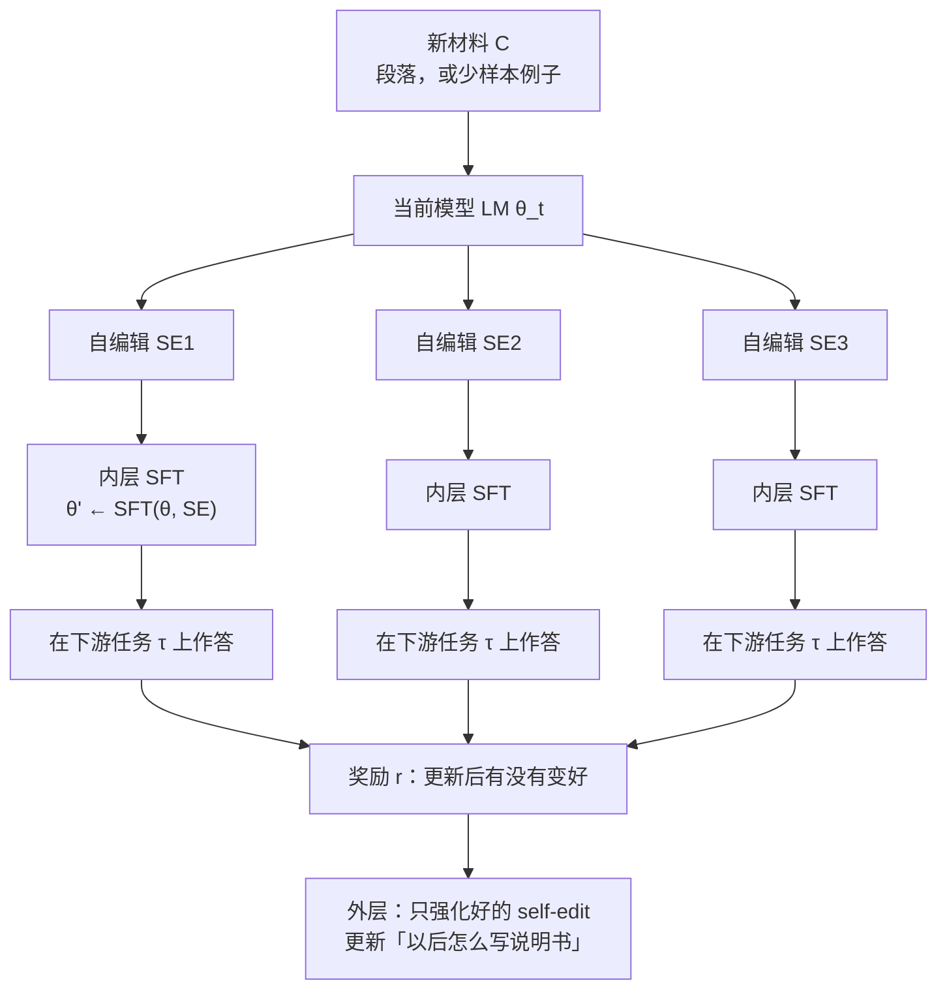

# SEAL：原文原样微调几乎白做，真正涨分的是模型给自己写的那页笔记

<!-- release-date: 2025-06-12 -->

> 本文依据 MIT CSAIL 的 **Self-Adapting Language Models**，即 arXiv:2506.10943v2、2025-09-18 提交、本地 25 页的版本。封面作者为 Adam Zweiger、Jyothish Pari、Han Guo、Ekin Akyürek、Yoon Kim、Pulkit Agrawal；前两人同等贡献，Pari 与 Agrawal 同时挂 Improbable AI Lab。页脚写着 39th NeurIPS 2025。动笔前已核验：arXiv 当前最新就是 v2，本地原件页数与 v2 一致。`release-date` 取 arXiv v1 首次公开日 2025-06-12，不用 v2 或会议日期回写。页码均指这份 PDF 本身。文中会严格区分三件事： **论文写了什么** 、 **我们如何解释它** 、 **哪些是外部资料补充** 。

## 读前：先把这几个词说成人话

这篇论文的名词不多，但每一个都在做很重的活。先花两分钟把它们讲清楚，后面就不用反复解释。

- **权重更新（weight update）**：改模型内部那些决定「下一个词怎么写」的数字。改完之后，这份能力会留下去，不像提示词那样用完就消失。
- **监督微调（Supervised Finetuning，SFT）**：拿一段文本，让模型按「预测下一个词」的标准损失再学一遍。这是内层真正改权重的动作。
- **低秩适配器（Low-Rank Adaptation，LoRA）**：不改原模型全部参数，只在旁边加一小块可训练的低秩矩阵。论文用它，是因为每次更新的数据很少、更新次数却很多（PDF p. 5）。
- **测试时训练（Test-Time Training，TTT）**：拿到眼前这一道题或这一段新材料之后，临时用梯度改一下权重再作答。SEAL 的内层就是一轮 TTT。
- **自编辑（self-edit）**：人话是——模型看到新材料之后，不把原文原样拿去微调，而是先写一份「我该怎么学」的说明书。这份说明书可以是改写后的笔记，也可以是数据增强开关和学习率。论文把它统称为 self-edit（PDF p. 2）。
- **自适应语言模型（Self-Adapting LLMs，SEAL）**：一套框架，让同一个模型既负责写出这份说明书，又用说明书去更新自己的权重，并且用更新之后能不能把下游任务做对，反过来教它以后把说明书写得更好。

两个评测场景后面会反复出现，先各给一句：

- **知识写入（knowledge incorporation）**：给一段新文章，希望模型把内容装进权重，之后 **不再把原文放进上下文** 也能答题。评测用的是去掉段落的 SQuAD（PDF p. 5）。
- **少样本泛化（few-shot generalization）**：只给几个输入–输出例子，希望模型学会这道新题。评测用的是 ARC-AGI 的一个被筛过的小子集（PDF p. 6）。

外层用的强化学习算法叫 **$\mathrm{ReST}^{EM}$** （Rejection Sampling + SFT 的一种，论文引用 Singh 等人 2024，PDF p. 4）。人话就是：先让当前模型多写几份说明书，只留下「用完之后真的变强」的那些，再拿这些好样本做一次 SFT。它不是 PPO，也不是 GRPO。

## 一句话先说清

今天的大模型预训练完基本是静态的。来了新任务、新知识、新例子，常见两条路：把原文塞进上下文（in-context learning），或者把原文原样拿去微调。两条路都默认一件事： **数据以什么形态出现，模型就按什么形态学。**

人不是这样学习的。论文开篇用的比喻很直白：备考的学生很少抱着教材原文死记，而会把讲座、课本、网上的材料改写成自己的笔记；不同的人还会改写成图、改写成文字、改写成公式（PDF p. 1）。

SEAL 要做的，就是把「改写成笔记」这件事交给模型自己，并且用 **改完权重之后的下游表现** 当老师，教它把笔记写得更适合被梯度吃进去。

它不是一个新的基座模型，也没有公开一份叫 SEAL 的权重。它是一套 **让模型用自己的生成，去参数化自己的权重更新** 的训练框架（PDF p. 1，摘要）。

如果只带走一句，可以先记：

> **模型吃不进去的，往往不是信息本身，而是信息还没被改写成「适合拿去算梯度」的形状。SEAL 学的不是答案，是怎么给自己出那份形状。**

这句话是本文的归纳，论文没有用这一句收束；但它的两个实验确实都在测这件事。

## 先看全景：self-edit 怎样变成一次持久的权重更新

先把整条循环画出来。这是机制示意图，不是实测时间轴，根据 PDF p. 2 的 Figure 1 与 p. 4 的 Algorithm 1 重画。

对应到记号，论文的最小单元是一对 $(C,\tau)$（PDF p. 3–4）：

- $C$ 是上下文，里面装着这次要学的东西；
- $\tau$ 是用来验收这次学习有没有成功的下游任务。

知识写入里，$C$ 是一篇短文，$\tau$ 是关于这篇短文的若干问答；少样本里，$C$ 是几个演示，$\tau$ 是留出的测试输入和标准输出。

模型看到 $C$ 之后生成一份 self-edit，记作 $\mathrm{SE}$。然后走内层：

$$
\theta' \leftarrow \mathrm{SFT}(\theta, \mathrm{SE})
$$

$\theta'$ 才拿去答 $\tau$。答得好，这份 $\mathrm{SE}$ 就得到正奖励，外层再去强化「下次遇到类似的 $C$，更愿意写出这样的 $\mathrm{SE}$」。

所以 SEAL 是嵌套的两层循环（PDF p. 3）：

| 层 | 优化什么 | 用什么算法 | 产出 |
|---|---|---|---|
| 内层 | 当前这一次怎么改权重 | 用 self-edit 做 SFT / LoRA | 一个临时的 $\theta'$ |
| 外层 | 以后怎样写出更有用的 self-edit | $\mathrm{ReST}^{EM}$（过滤后的行为克隆） | 一个更好的生成策略 |

论文自己把它看成元学习：外层学的是「如何从任务上下文里高效地学习」（PDF p. 3）。本文补充一句解释：内层是普通微调，外层才是这篇论文真正新的那一刀—— **它不直接优化答案，而优化「用来改权重的那份数据或指令」。**

和两条邻近路线的差别，用一句话就够，不在这里展开：

- 本站 `reports/Meta/` 即将有的 Self-Rewarding-LM，改的也是权重，但奖励来自模型给自己打分；SEAL 的奖励来自「用 self-edit 更新之后，外部任务有没有做对」。
- 本站 [AIDE2](../Weco/AIDE2.md) 改的是包在模型外面的 harness，不改权重。SEAL 改的是权重本身。

## 旧方案卡在哪

论文第 1 节把矛盾写得很具体，不是「模型不会学习」这种空话（PDF p. 1–2）。

**第一，任务数据通常又少、又不一定适合拿去微调。** 适配到特定任务、写入新信息、掌握新的推理技能，都受制于任务数据不够（PDF p. 1）。

**第二，现有做法把数据「原样」吃进去。** 微调或上下文学习都默认：你给我什么格式，我就按什么格式学。论文认为这样的数据在格式或体量上往往不是最优的，而且模型没有机会发展出「针对这份材料，我该怎样改写再学」的策略（PDF p. 1–2）。

**第三，人会改写，模型不会。** 笔记不是原文的压缩副本，而是一种为了以后提取而做的再编码。不同的人编码方式还不一样（PDF p. 1）。

所以 SEAL 要解决的具体矛盾是：

> **梯度只能从「拿去算损失的那串 token」里学到东西。如果那串 token 还是原文，模型可能已经「看懂了」，但权重仍然记不住。**

这一点后面会被单段实验直接打出来：把 SQuAD 段落原样拿去微调，准确率只从 32.7% 挪到 33.5%，几乎没动；改写成模型自己写的 implications 再微调，才能明显涨分（PDF p. 7，Table 2）。

## 核心设计一：self-edit 不是新模块，就是模型自己生成的一段话

### 旧问题

要让模型「自己改自己」，一条常见路是再训一个旁路网络：定位某几个事实对应的参数、预测一组 LoRA、给每个 token 打权重。论文在相关工作里点了这些（PDF p. 2–3）：ROME 这类定位编辑、Hu 等人训一个小模型输出 token 级权重、Chen 等人的 Generative Adapter 用超网络从上下文生成 LoRA。

这些方法的共同代价是： **适应机制不在语言模型已经会的那件事——写文本——里面。** 换一种更新类型、换一个基座、把生成出的数据拿去继续预训练，都要另做一套。

### 新设计

SEAL 的选择是：让模型用 **普通的自回归生成** 写出 self-edit，再用这段生成去参数化更新（PDF p. 1、p. 3）。self-edit 的形态按领域而变，框架本身不绑死某一种格式（PDF p. 2）。

人话是：不要另造一个「会改权重的头」，让模型把「我准备怎么改」写出来。写得对不对，看改完之后会不会做题。

### 工作机制

一次外层迭代里，算法做的事就是 Algorithm 1（PDF p. 4）：

1. 从数据集里抽一条 $(C,\tau)$；
2. 让当前模型按 $C$ 生成一份 $\mathrm{SE}$；
3. 内层：$\theta'_t \leftarrow \mathrm{SFT}(\theta_t, \mathrm{SE})$；
4. 用 $\theta'_t$ 在 $\tau$ 上生成答案；
5. 按答案对不对给奖励 $r$；
6. 用这份 $(\mathrm{SE}, r)$ 更新生成策略。

奖励的形式目标写在式 1（PDF p. 4）：

$$
\mathcal{L}_{\mathrm{RL}}(\theta_t) := -\mathbb{E}_{(C,\tau)\sim\mathcal{D}}\Big[\mathbb{E}_{\mathrm{SE}\sim\mathrm{LM}_{\theta_t}(\cdot\mid C)}\big[r(\mathrm{SE},\tau,\theta_t)\big]\Big]
$$

读法只有一句：希望当前策略生成的 self-edit，在拿去更新之后，对 $\tau$ 的期望表现尽量高。

### 收益、代价、可迁移启发

收益是通用性。论文后来说得很明确：用合成数据来参数化更新，而不是直接预测 LoRA，有三条好处——生成出的数据可以拿去继续预训练、可以套到别的基座上；文档变长变复杂时，模型可以先推理、再改写；更新类型也不限于 LoRA，理论上还能接环境交互（PDF p. 22，B.8 节）。这三条是论文自己的主张。

代价立刻跟上：self-edit 只是文本，它 **不直接改权重** 。中间必须跑一次真正的 SFT，才能知道这页笔记有没有用。于是奖励变得又慢又贵，这是第 5 节会单独展开的限制。

可迁移的部分：如果你正在做「模型帮模型造训练数据」，问一句——你的合成数据目标是像人类、还是像「被梯度吃完之后下游会涨分」？这两件事不是同一个优化问题。SEAL 选的是后者。

## 核心设计二：奖励依赖当前权重，所以必须在线；PPO / GRPO 不稳，最后用了 $\mathrm{ReST}^{EM}$

### 旧问题

普通 RL 里，一个动作的奖励通常不依赖「此刻策略的参数本身」。SEAL 不是。把 $\theta$ 更新成 $\theta'$ 再评测，$\theta$ 不同，$\theta'$ 就不同，同一份 self-edit 的分数也会变（PDF p. 4）。

于是真正的 RL 状态是 $(C,\theta)$，尽管模型看见的只有 $C$——论文说把 $\theta$ 直接塞进上下文不可行（PDF p. 4）。旧模型上采到的 $(\text{state}, \text{action}, \text{reward})$ 对当前模型会过时。所以他们采用 **on-policy（在线策略）** ：self-edit 必须从当前模型采，奖励也必须用当前模型算（PDF p. 4）。

### 新设计

他们试过 GRPO 和 PPO，发现训练不稳定，于是改用 $\mathrm{ReST}^{EM}$：过滤后的行为克隆，也就是「拒绝采样 + SFT」（PDF p. 4）。

$\mathrm{ReST}^{EM}$ 被看成一个 EM 过程：

- E 步：从当前策略采样候选 self-edit；
- M 步：只对拿到正奖励的那些做 SFT。

奖励被写成二元的（PDF p. 4，式 2）：

$$
r(\mathrm{SE},\tau,\theta_t)=\begin{cases}
1 & \text{用这份 SE 做适配之后，在 }\tau\text{ 上变好}\\
0 & \text{否则}
\end{cases}
$$

脚注还补了一刀：知识写入里，他们不是把所有「变好了」的 self-edit 都留下，而是 **每个上下文只留采样里提升最大的那一份** （PDF p. 4，脚注 2）。少样本则是凡是改完能答对测试输入的，都留下（PDF p. 6）。

### 工作机制：为什么「只对好样本做 SFT」能对上式 1

奖励 $r(\mathrm{SE},\tau,\theta_t)$ 依赖 $\theta_t$，又不可微。他们的处理是：把奖励相对 $\theta_t$ 视为常数，也就是对奖励做 stop-gradient（PDF p. 4）。在这个近似下，一批 $N$ 个上下文、每个上下文 $M$ 份 self-edit 的蒙特卡洛梯度是式 3 和式 4（PDF p. 4）：

$$
\nabla_{\theta_t}\mathcal{L}_{\mathrm{RL}}\approx -\frac{1}{NM}\sum_{i=1}^{N}\sum_{j=1}^{M} r_{ij}\,\nabla_{\theta_t}\log p_{\theta_t}(\mathrm{SE}_{ij}\mid C_i)
$$

$r_{ij}=0$ 的项整个消失，于是梯度只来自那些好的 self-edit。这正是「对好的 self-edit 做 SFT」。论文由此声称：在二元奖励加 stop-gradient 的前提下，$\mathrm{ReST}^{EM}$ 优化的是式 1 的一个近似（PDF p. 4）。

本文补一句解释，不是论文原话：这套外层看起来像强化学习，实现上更像 **带验证器的拒绝采样** 。它能用，是因为奖励被压成了 0/1，坏样本可以直接扔掉；它不稳的那两种方法（PPO、GRPO）论文只说了「不稳定」，没有给曲线，也没有分析为什么不稳。

### 收益、代价、边界

收益是实现简单，而且和「生成一段文本、再用文本去微调」这条链路匹配——外层更新的对象就是「写出这段文本的那个模型」。

代价有三：

1. 样本利用率低。大部分 self-edit 的奖励是 0，对梯度没有贡献。
2. 奖励定义依赖「有没有变好」。知识写入里「变好」是相对什么、少样本里「变好」是对不对，两个领域并不相同，论文用同一套符号盖过去了。
3. 同一套权重既当老师又当学生。论文提过可以拆成 teacher–student：老师写编辑，学生被更新，老师再按学生的进步来 RL（PDF p. 4）。 **这只是设想，正文没有实验。**

可迁移的部分：只要奖励必须「先改模型、再评一次」才能算出来，on-policy 几乎是被迫的。离线攒一大桶 self-edit 再反复用，会踩论文写明的那条坑——旧 $\theta$ 上的奖励，对新 $\theta$ 是错的。

## 两个实例：同一套框架，两种完全不同的 self-edit

第 3.2 节把框架落到两个领域，用来展示两种互补的适应：一种是把新信息写进权重、以后不再依赖上下文；一种是看几个例子就泛化到新任务（PDF p. 5）。

### 实例一：知识写入——把段落改写成 implications

旧做法是直接在段落上做语言建模，或者先用另一个模型写出派生文本再微调。论文采用他们认为最「正典」的格式：从段落推出若干 **implications（推论 / 含义）** ，来自 Akyürek 等人的 deductive closure training（PDF p. 5）。提示词大意是：「列出若干由这段内容直接或间接得到的推论。」输出可以是推断、逻辑后果，或对原文的转述（PDF p. 5）。

根据 PDF p. 5 的 Figure 2，这条链路是：

内层对每条 $s_i$ 算标准因果语言建模损失，得到 $\theta'$；因为单次数据少、总更新次数多，他们用 LoRA（PDF p. 5）。适配后的模型在 $\tau$ 上的准确率，就是外层 RL 的奖励。这一步训练的是： **把段落改写成「最容易被微调吸收」的形状。**

附录 B.11 还试了改写、自问自答、加长、思维链、甚至不给格式。结论先记在这里，数字放到后面：换提示词，RL 仍然能再涨一截；但 **完全不给格式，模型自己决定 self-edit 长什么样，效果很差** （PDF p. 23–24）。

### 实例二：少样本——self-edit 是一份 JSON 配置，不是一篇笔记

少样本用的是 ARC（Abstraction and Reasoning Corpus，抽象推理语料）。每道题带几个输入–输出格子，再留一个测试输入（PDF p. 6）。他们沿用同一实验室 Akyürek 等人 2025 年那篇 TTT 工作的协议：把少样本例子做增强，再拿去梯度适配。SEAL 要学的不是格子本身，而是 **增强怎么做、学习率取多少、loss 算在全部 token 上还是只算输出 token** （PDF p. 6）。

工具都是现成的，来自那篇 TTT 论文，不是 SEAL 新发明的（PDF p. 6）：

- 数据增强：旋转、翻转、反射、转置、改格子分辨率，以及把变换串起来或重复；
- 优化参数：学习率、epoch 数、loss 覆盖范围。

模型看到演示之后，要吐一份合法 JSON。附录 A.2 把提示词写得很死：必须输出 JSON，不要解释，不要 markdown（PDF p. 19）。Figure 3 给的例子是（PDF p. 5）：

- `basic_augmentations: true`
- `size_augmentations / chain_augmentations / repeat_augmentations: false`
- `strategy: loss on all tokens`
- `learning_rate: 1e-05`
- `epochs: 3`

然后用这份配置做 LoRA 微调，在留出的测试输入上对不对，就是这份 self-edit 的奖励（PDF p. 6）。

**这两个实例的差别值得单独说清楚。** 知识写入的 self-edit 是训练数据本身；少样本的 self-edit 是训练数据怎么造、优化器怎么设。框架能把两者写成同一种「生成 → 更新 → 打分」，是因为更新被定义成「由一段生成来参数化」，而不是「由一段生成来当语料」。本文认为这是这篇论文真正可迁移的抽象，比「implications 比原文好」这个单点结论更重要。

## 少样本实验：在已经能被 Oracle TTT 解开的题上，学一个会配工具的策略

### 题目被筛过，读数字之前必须先接受这一点

基座是 Llama-3.2-1B-Instruct，没有针对 ARC 的预训练（PDF p. 6）。因为多数 ARC 题对这种小模型太难，他们从训练集里挑了 11 道、从评测集里挑了 8 道，过滤条件是： **在最优 TTT 配置下，这个 1B 模型解得开** （PDF p. 6、p. 18）。

论文自己也承认样本很少，并给了一个理由：Akyürek 等人对所有题用的是 **同一套** TTT 配置，所以学一个固定的 self-edit 不需要很大的训练集（PDF p. 6）。本文的读法是：这 8 道评测题测量的不是「SEAL 会不会做 ARC」，而是「在已经知道 TTT 能解的题上，模型能不能自己选出一套能工作的配置」。Oracle TTT 被他们写成 100%，正是因为题目就是按「最优配置能解」筛出来的（PDF p. 6–7）。

### 训练与评测怎么做

外层只跑一轮 $\mathrm{ReST}^{EM}$。每道训练题采 15 份 self-edit，各自更新出 15 个模型，在对应的留出测试例子上评分；只强化那些更新后能给出正确输出的配置（PDF p. 6）。为了控制成本，超过 375 个训练 step 的配置直接丢掉（PDF p. 18）。

评测时，每道留出题生成 5 份 self-edit，各自独立应用，一共 40 份配置；成功率是「这些配置里有多少能在适配后给出正确答案」（PDF p. 6、p. 19）。

三个对照（PDF p. 6）：

1. **ICL**：按 Akyürek 等人的协议，把例子放进上下文直接问测试输入；
2. **TTT + Self-Edit（没有先做 RL）**：基座自己写配置再 TTT，但外层没训过；
3. **Oracle TTT**：人手工调好的那套最优配置，作为上界。

### 数字（PDF p. 7，Table 1）

| 方法 | 成功率 |
|---|---:|
| ICL | 0% |
| TTT + Self-Edit（无先验 RL） | 20% |
| SEAL | 72.5% |
| Oracle TTT | 100% |

ICL 为 0，说明这个 1B 模型单靠上下文几乎做不出这些格子题。没有 RL 的 self-edit 已经有 20%，说明基座有时能蒙对一套配置；RL 把它抬到 72.5%。论文说这证明 SEAL 比标准 ICL、也比未训练的 self-edit 更强，但仍低于 Oracle，还有改进空间（PDF p. 6）。

本文的判断：这张表 **实验支持** 「外层 RL 能把工具配置策略从 20% 拉到 72.5%」；它 **不支持** 「SEAL 在完整 ARC 上有效」——完整评测集没有跑，题目还经过「Oracle 能解」的预筛选。

附录里 Oracle 的配置是：LoRA rank 128、alpha 16、2 个 epoch、batch size 2、学习率 $1\times 10^{-4}$（PDF p. 19）。内层 TTT 的 LoRA 插在 `q_proj`、`v_proj`、`gate_proj`、`down_proj`、`up_proj`，rank 同样是 128；学习率和 epoch 由模型自己选（PDF p. 18）。外层用来强化好 self-edit 的 SFT 则是另一组更小的 LoRA：rank 16、alpha 16、8 个 epoch、每设备 batch 5、学习率 $5\times 10^{-5}$（PDF p. 18）。 **内层适配和外层策略更新用的不是同一组 LoRA 超参。** 论文没讨论这两套 rank 为什么差 8 倍。

算力：少样本全部训练跑在单张 A100、H100 或 H200 上；每次 TTT 大约半分钟到几分钟，$\mathrm{ReST}^{EM}$ 整体大约 2–3 小时（PDF p. 19）。论文没有写推理 serving，也没有写适配之后如何把 LoRA 合并回基座。

## 知识写入实验：原文微调几乎不动，改写之后才能进权重

### 为什么选 SQuAD

基座换成 Qwen2.5-7B 的 **base** 模型，不是 instruct（PDF p. 7、p. 20）。数据是 SQuAD v1.1，改成「不把段落放进上下文」的问答（PDF p. 20）。论文选这套数据的理由很克制：段落在上下文里能被基座完全「读懂」，但拿掉上下文之后就不能可靠作答（PDF p. 7）。训练集拿来做 RL，评测用评测集里 200 篇的子集；两个集合的主题可能重叠，但段落不重叠，所以测试段落没有被 RL 直接见过（PDF p. 20）。

本文要单独标出一层解释，避免把实验读成「注入了预训练从未见过的新事实」。SQuAD 来自维基百科，Qwen2.5 几乎必然在预训练里见过相关文本。基座不给段落也能到 32.7%，本身就说明一部分知识已经在权重里。论文测量的是： **把上下文里已经能理解的信息，压进权重，让你之后不必再把原文摆在眼前。** 它没有做污染检查，也没有用真正的时效新闻当测试。

### 外层怎么训

两轮 $\mathrm{ReST}^{EM}$。每轮 50 条「段落–问题–答案」，每条段落按温度 1 采 5 份 self-edit；每份 self-edit 用 3 个随机种子做内层训练和评测，取平均后，50 个上下文各自只留最好的一份，再对这 50 对 prompt–completion 做 SFT（PDF p. 20）。外层这次 SFT 的配置是：batch 10、2 个 epoch、学习率 $3\times 10^{-4}$、LoRA rank 64、alpha 128，打在全部 MLP 和注意力投影层上（PDF p. 20）。

合成数据的默认提示词是 implications（PDF p. 20）。单段设定里，生成结果按换行切成多条训练文档；多段继续预训练里，整段生成当作一篇文档。GPT-4.1（`gpt-4.1-2025-04-14`）作为对照时，他们加了一条清洗规则：如果第二行以 `1.` 开头，就丢掉第一行，因为 instruct 模型常先写「好的，下面是推论列表：」这种废话（PDF p. 20）。

评测用 GPT-4.1 做自动打分，贪婪解码，只许回答 yes 或 no；学生答案可以多说，但必须覆盖金答案且不能矛盾（PDF p. 21）。200 篇对应大约 974 道题（PDF p. 21）。 **打分模型也是 GPT-4.1，和「GPT-4.1 写合成数据」这个强基线是同一个模型家族。** 论文没有讨论这会不会偏向某一种写法。

内层微调的超参是搜出来的。Table 3、Table 4 把搜索空间列成表，部分取值被加粗；论文没有另写一句「加粗即最终选用」，但表题就是 Search Space，加粗项分别是（PDF p. 20–21）：

| 设定 | 加粗取值 |
|---|---|
| 单段 LoRA | rank 32，alpha 64，学习率 $1\times 10^{-3}$，10 个 epoch，batch 1 |
| 多段 LoRA / 全量微调相关 | rank 32，alpha 64，学习率 $1\times 10^{-3}$，3 个 epoch，batch 8 |

正文还说「全部结果都用调过的超参」（PDF p. 7）。合理读法是：每个方法都过了这一套搜索，不是只给 SEAL 调参。

### 主结果：三列数字不要混着读（PDF p. 8，Table 2）

| 方法 | 单段 $n=1$，LoRA | 继续预训练 $n=200$，全量微调 | 继续预训练 $n=2067$，全量微调 |
|---|---:|---:|---:|
| 基座，不改编、不给段落 | 32.7 | 32.7 | 29.0 |
| 只在原文上训练 | 33.5 | 36.0 | 31.2 |
| 原文 + 基座自己写的合成数据 | 39.7 | 50.6 | 43.4 |
| 原文 + GPT-4.1 合成数据 | 46.3 | 59.4 | 49.2 |
| SEAL | 47.0 | 58.2 | 46.4 |

先读单段这一列，它是外层 RL 真正优化的设定。

- 原文微调相对基座只涨 0.8 个百分点：33.5% 对 32.7%。论文的原话是：这证实 **只用原始数据是不够的** （PDF p. 7）。
- 基座自己写 implications，不经 RL，已经到 39.7%，比只训原文高 6.2 个百分点。
- GPT-4.1 写 implications 到 46.3%，比只训原文高 12.8 个百分点。
- 两轮 RL 之后，SEAL 到 47.0%，略超过 GPT-4.1。论文特别强调：尽管模型小得多，仍然超过了 GPT-4.1 的合成数据（PDF p. 7）。

引言里那句「从 33.5% 到 47.0%」（PDF p. 2）比的是「只训原文」和 SEAL，不是基座和 SEAL。基座到 SEAL 是 32.7% → 47.0%。两处都对，比较对象不同。

再读继续预训练两列。这里不再是「一篇文章、一次 LoRA」，而是把很多段落的 self-edit 聚在一起做一次持续预训练，然后在全部对应问题上评测（PDF p. 7）。每段采 5 份 self-edit，全部放进训练集。$n=200$ 时 SEAL 到 58.2%，高于它自己的单段成绩，论文把增益归因于多份生成的聚合（PDF p. 7）。但这一列里 **GPT-4.1 仍略高：59.4% 对 58.2%** ；$n=2067$ 时差距更明显：49.2% 对 46.4%。论文的表述是「方法排序与单段类似，但 GPT-4.1 的合成数据略胜 SEAL」（PDF p. 7）。

所以「SEAL 超过 GPT-4.1」这个标题句， **实验支持的范围只覆盖单段 LoRA** 。换到多文档继续预训练，证据反过来了。论文把 CPT 上仍然接近 GPT-4.1、并且明显超过「基座自己写、不经 RL」，解读成：在单段 TTT 上训出来的编辑策略，能泛化到「上下文已经塞不下、只能靠继续预训练」的制度（PDF p. 3、p. 7）。这个泛化方向是有表支持的；「全面超过 GPT-4.1」没有。

$n=2067$ 那一列基座是 29.0%，和前两列的 32.7% 不同。论文没有解释为什么同一套「不改编」基线会掉 3.7 个百分点。可能是题量从 200 篇扩到全验证集后的分布变化，但这是本文的猜测，不是论文结论。

还有一处论文自己没对齐的地方：Table 2 把 $n=200$ 和 $n=2067$ 标成 full-FT（全量微调），附录 Table 4 却给多段设定列出了 LoRA rank / alpha 的搜索空间（PDF p. 8、p. 21）。正文明确说单段用 LoRA、继续预训练用全量微调（PDF p. 7）。本文按正文与 Table 2 表头读 CPT 为全量微调；Table 4 更像是多段 LoRA 的搜索记录，还是 CPT 实际也搜过 LoRA，论文没有说清。

### Figure 4：两轮就够越过 GPT-4.1 的单段线

Figure 4 画的是单段知识写入随外层迭代的准确率（PDF p. 7）。读自该图，不是正文另给的表：

- 四条对照都是水平线：基座大约 32.7，原文大约 33.5，基座合成数据大约 39.7，GPT-4.1 大约 46.3；
- SEAL 从第 0 轮的基座合成数据出发，第 1 轮升到大约 43–44，第 2 轮到 47.0，越过 GPT-4.1。

这和附录 Table 10 的 implications 一行完全对得上：39.7 → 43.7 → 47.0（PDF p. 24）。论文说两轮就够超过 GPT-4.1，再往后收益递减，策略很快收敛到一种把段落蒸馏成易学原子事实的编辑风格（PDF p. 7）。 **他们实际只跑了两轮** ，所谓「再往后递减」是观察加推断，没有第 3、第 4 轮的点。

### Figure 5：笔记变长、变细，答对了；但也开始往原文外面补

Figure 5 给了一篇亚马逊遥感保护部落土地的段落，以及三轮 self-edit 和三道题的回答（PDF p. 8）。图中能直接读到的事实：

- 第 0 轮：模型把技术说成无人机，部落说成 Yanomami，三题只对了「为什么用遥感」这一题；
- 第 1 轮：第一题回答是空的，部落改口 Kayapo，仍错；第三题对；
- 第 2 轮：三题全对，第二题已经能写出 Trio Tribe、苏里南南部雨林这些原文里的专有名词。

论文把这读成：RL 带来更细的 self-edit，从而更好的表现；也承认别的例子里轮次之间的差别更细微（PDF p. 8）。

本文读图时要加一条论文没写的观察：第 2 轮 implications 的第 3 到第 7 条，写的是开牧场、非法挖金、修路修坝、识别易毁林区域—— **这些句子在输入段落里并不存在。** 模型显然把关于亚马逊毁林的先验知识补进了「推论」。论文把它当作「更详细」，没有讨论有多少细节是编出来的。后面答题变准，主要是因为 Trio Tribe、GPS、遥感这些原文明细被写进了笔记，不必然是因为那些额外的毁林条目。

## 附录里真正改变解读的几张表

主文的 47.0% 不是他们拿到的最好单段数字。把 B.7–B.11 读完，排序会变。

### 提示词比 RL 更先决定下限（PDF p. 24，Table 10）

| 提示词 | 不经 RL | 第 1 轮 | 第 2 轮 | 同格式的 GPT-4.1 合成数据 |
|---|---:|---:|---:|---:|
| 不写 self-edit，只训原文 | 33.5 | — | — | — |
| implications（主文用的） | 39.7 | 43.7 | 47.0 | 46.3 |
| implications-long | 49.3 | 52.4 | 54.4 | 54.1 |
| implications-very-long | 45.0 | 51.5 | 52.1 | 40.9 |
| rewrite | 49.4 | 55.3 | 55.6 | 54.4 |
| self-qa | 37.3 | 42.8 | 48.7 | 39.2 |
| 不给格式 | 13.8 | 12.7 | 18.9 | 28.6 |
| implications + 写合成数据前先思维链 | 38.7 | — | — | — |
| 答题前先思维链 | 37.8 | — | — | — |

论文自己写的结论有三句，都重要（PDF p. 23）：

1. implications-long 和 rewrite 的 **不经 RL 基线，已经超过主文那个训过 RL 的 implications** （49.3 / 49.4 对 47.0）；
2. 把这些更好的提示词再拿去做 RL，还能再涨，rewrite 第 2 轮到 55.6；
3. 所有做过 RL 的格式，大约都能再涨 6 到 11 个百分点。

另外两句同样硬：让模型自己决定格式（no-prompt）两轮之后只有 18.9%，比「什么 self-edit 都不写、只训原文」的 33.5% 还差；思维链无论加在写笔记前还是答题前，都没有实质帮助（PDF p. 23）。

本文的判断：主文把 implications 当「正典格式」，数字叙事也围着 47.0% 写，这会让人以为 RL 是从 39.7 爬到超过 GPT-4.1 的关键。Table 10 说明另一件事—— **先把笔记写成「长一点的推论」或「换几种方式复述」，不经 RL 就已经比主文 SEAL 强。** RL 仍然普遍有用，但它不是唯一旋钮，甚至不是最大的旋钮。论文把这张表放在附录，主文只在 Figure 5 的图注里提了一句「提示要更长的 self-edit 有效，RL 还能再涨类似幅度」（PDF p. 8）。

### 3B 和 7B：RL 相对基座合成数据的倍率略增（PDF p. 22，Table 6）

同一套单段设定：

| 模型 | 不训练 | 基座自己写 self-edit | SEAL |
|---|---:|---:|---:|
| Qwen2.5-3B | 25.1 | 31.9 | 37.0 |
| Qwen2.5-7B | 32.7 | 39.7 | 47.0 |

论文算的是：SEAL 相对「不训练」的增益，除以「基座 self-edit」相对「不训练」的增益，3B 是 $1.75\times$，7B 是 $2.04\times$（PDF p. 21）。他们把这读成：更强的基座不但更会用合成数据，RL 的收益还可能随容量放大；同时承认没有继续往上扩，很难下结论（PDF p. 22）。两个点的曲线不是定律。 **实验支持「7B 上 RL 的相对增益不比 3B 小」；「会随规模复合增长」只是观察。**

### 和 Generative Adapter、Entigraph 比：赢的位置不一样

Generative Adapter 是用超网络从上下文一次前向生成 LoRA 的方法。他们拿最接近的 Mistral-7B 版本，在同一套评测上比（PDF p. 22，Table 7）：

| 模型 | 基座 | 单段 $n=1$ | CPT $n=200$ |
|---|---:|---:|---:|
| SEAL | 32.0 | 47.0 | 58.2 |
| Generative Adapter | 24.4 | 66.8 | 28.0 |

单段上 Generative Adapter 到 66.8%，明显高于 SEAL 的 47.0%；继续预训练上它几乎掉回基座附近，SEAL 反而到 58.2%。论文强调：合成数据可以复用到 CPT、可以换基座、不限于 LoRA；超网络这些事不好做（PDF p. 22）。

必须把口径说清楚：两个方法的基座不是同一个（Qwen2.5-7B 对 Mistral-7B），基座分数差 7.6 个百分点。 **不能把 66.8 对 47.0 读成「同一模型上超网络完胜」。** 能读的是形态差异：一次前向出 LoRA，在「一篇文档、一个适配器」上很强，把多篇文档批在一起时不会自动变成可复用的语料。

另外，Table 7 的 SEAL 基座写成 32.0，Table 2 写成 32.7，Table 9 又是 32.0。论文没有解释这 0.7 个百分点从哪来。本文按表各报各的，不把它们平均。

Entigraph 是用实体对、实体三元组做图提示、生成合成数据再继续预训练的方法。同一套 SQuAD、不给原文（PDF p. 23，Table 8）：

| 方法 | $n=200$ | $n=2067$ |
|---|---:|---:|
| SEAL（每篇 5 份生成） | 58.2 | 46.4 |
| Entigraph（pairs） | 46.2 | 38.6 |
| Entigraph（pairs + triples，共 10 份） | 56.0 | 48.6 |

$n=200$ 时 SEAL 略高；$n=2067$ 时 Entigraph 的 10 份采样反而到 48.6，超过 SEAL 的 46.4。论文的结论是：RL 训出来的 self-edit，和有结构的启发式合成数据，都是强方法（PDF p. 22–23）。 **在最大的那一档上，SEAL 并没有赢。**

### 代理奖励：6 小时的内层，5 分钟的打分器能换到接近的分（PDF p. 23，Table 9）

他们试过把内层微调整段换成一个人工量规：长度、多样性、质量、正确性四项，GPT-4.1 各打 1–5 分，加总当 RL 奖励。

| 设定 | 基座 | RL 之后 | 时间 |
|---|---:|---:|---|
| 完整 SEAL（内层真微调） | 32.0 | 47.0 | 约 6 小时 |
| 代理奖励 | 32.0 | 45.6 | 约 5 分钟 |

完整循环的好处是：不必手写「什么样的笔记是好笔记」，模型直接学「什么编辑能让自己变强」。论文也承认，代理指标再调一调，甚至可能超过这个「真实」奖励（PDF p. 23）。45.6 对 47.0，用时从小时级掉到分钟级，这是附录里对工程最有用的一张表。它同时说明：外层真正贵的不是「对好样本做 SFT」，而是 **每一次打分都要微调并评测整个模型** 。

## 限制：论文自己写了三刀，每一刀都打在方法的根上

第 5 节不是客套。三个限制分别对应「能不能连续改」「改一次有多贵」「没有现成考题时还能不能训」。

### 灾难性遗忘：连续 self-edit 会把旧的冲掉

他们做 SEAL 的一个动机，是走向持续学习：模型随着和环境交互、随着常规训练，不断写入新信息（PDF p. 8）。前面的实验都是 **一次编辑、单独验收** 。更难的问题是：一连串编辑之后，旧知识还在不在？

当前训练 **没有为保持旧知识做任何优化** ，他们只是想先给一个没有专门抗遗忘机制时的基线（PDF p. 8）。设定是：知识写入领域里，模型按流接收测试段落，每篇触发一次新的 self-edit；每次更新之后，在所有已经见过的任务上再评一遍（PDF p. 8–9）。

Figure 6 是一张热力图（PDF p. 8）。读自该图，正文没有列出格子里的精确数字；附录 Table 5 只给了每个格子的标准误（PDF p. 22）。图上能看清的形状是：

- 横轴 Passage Index 0–7，纵轴 Self-Edit Iteration 0–8；
- 迭代 0、尚未连续改的时候，各篇准确率大约在 0.25–0.34，接近「不改编 / 只训原文」那个量级；
- 越往下（编辑次数越多），左侧那些早先的段落颜色越冷，最早一篇大约掉到 0.19；
- 刚学完的那一篇相对更亮，大约 0.34–0.50；
- 没有整张图掉到 0。

论文的定性结论：SEAL 仍然会灾难性遗忘；但多次更新还不至于完全崩掉，说明还有改进空间（PDF p. 9）。他们点名的后续方向包括：用奖励塑形惩罚旧任务回退、空空间约束编辑、表征叠加；以及把内层 SFT 换成 RL，因为有工作表明 RL 比 SFT 忘得少（PDF p. 9）。这些都没有在本文实验里做。

本文补一句读图的限制：这张图的绝对水平明显低于单段 47%。它测量的是「连续打补丁」而不是「单次 LoRA 的峰值」。不要把 0.19 和 47.0% 放在同一条叙事里当「从 47 忘到 19」。

### 算力：一次奖励等于微调加评测一个模型

普通 LLM-RL 的奖励，可能是一次奖励模型前向，或一次正则匹配。SEAL 的奖励要先微调、再评测整个模型。每次 self-edit 评估大约 30–45 秒（PDF p. 9）。

附录把账算得更清楚。知识写入的 E 步：50 篇 × 5 份生成 × 3 个种子 = 750 次内层循环，一轮大约 6 小时、2×H100；训练用 DeepSpeed ZeRO-3，推理用 vLLM（PDF p. 21）。主文跑两轮，光外层采样打分就大约 12 小时量级，还不含超参搜索。少样本那边相对轻：2–3 小时、单卡（PDF p. 19）。

论文没有给出端到端墙钟对比 ICL 的数字，也没有给出「训完之后，推理时还要不要再做 TTT」的 serving 方案。 **训练 recipe 写到了 LoRA 搜索空间和 $\mathrm{ReST}^{EM}$ 轮次；推理 serving 没写。**

### 奖励绑在「每条材料都自带考题」上

现在的两个实例都假设 $C$ 配好了 $\tau$：少样本自带留出题，段落自带参考问答（PDF p. 9）。这样算奖励简单，但外层 RL **没法直接扩到没有标签的语料** 。论文给的潜在出路是：让模型不但写 self-edit，还自己出验收题——趁原文还在上下文里，起草 QA 或合成测试；这些模型自出的题，提供 RL 需要的即时监督（PDF p. 9）。

这只是设想。一旦验收题也是模型写的，就回到了他们在相关工作里批评过的那条路：自我改进受限于模型当前的评价能力（PDF p. 3）。论文没有做「自出题当奖励」的实验，因此也没有证明这条出路走得通。

## 第 6 节：作者想去的地方，和实验已经走到的地方，不是同一张地图

讨论部分的语气从实验结果切到了展望，需要把层次分开。

**论文当作背景事实引用的：** Villalobos 等人估计，到 2028 年前沿模型会把公开的人类文本用完（PDF p. 9）。SEAL 作者据此主张：即将到来的「数据墙」会迫使人们采用合成数据增强；网页规模的语料耗尽之后，进步将取决于模型能不能给自己造高效用的训练信号（PDF p. 9）。下一步很自然的是：元训练一个专门的 SEAL 合成数据生成器，给未来模型产预训练语料（PDF p. 9）。

**论文明确没做、只是在想象的：**

- 让模型读论文，结合已有知识和上下文，给自己生成大量解释和推论，在缺少额外外部监督时仍能在稀有主题上进步（PDF p. 9）；
- 与思维链 RL 协同：推理中途决定要不要改权重，或者推理结束后把关键洞见蒸馏进参数（PDF p. 9）；
- 给智能体用：一次交互之后合成 self-edit、触发权重更新，减少对反复监督的依赖（PDF p. 9）。

这些句子的情态都是 could / envision / imagine。 **没有对应实验。** 把它们读成「SEAL 已经能在推理中改权重」或「已经能做持续智能体」，是在替作者加戏。

收束段回到已经做了的事，这一句是有实验托底的（PDF p. 9）：

> 大语言模型预训练之后不必保持静态：通过学习生成自己的合成 self-edit 数据，并用轻量权重更新去应用它，它们可以自主写入新知识、适配新任务。

「轻量」指 LoRA / 单次 TTT，不是指外层 RL 便宜。外层一点都不轻。

## 可迁移启发：哪些能带走，哪些绑死在这套实验上

先把能带走的设计原则说清楚。这些是本文从论文里抽的，不是论文原句。

**1. 先问数据是不是「适合被梯度吃」。** 原文微调 33.5%、implications 39.7%、rewrite 49.4%，同一段落三种形状三种分数。做知识写入、做领域适应、做继续预训练，值得先花一次搜索去找「改写格式」，再决定要不要上 RL。Table 10 说的就是这件事。

**2. 用下游效用当合成数据的目标，而不是用像不像人。** SEAL 和外层 RL 的真正对象是「这份合成数据拿去 SFT 之后涨不涨分」。这和「让 GPT-4 写得更像教材」不是同一个损失。

**3. 让生成去参数化更新，而不是再训一个更新头。** 文本格式的 self-edit 可以当语料复用、可以换基座、可以换成 JSON 配置。超网络一次前向很香，但到 CPT 这种「要把中间产物留下来」的制度就会卡。Table 7 是这条原则的证据。

**4. 奖励如果依赖「当前权重」，就不要离线重放。** 论文把 on-policy 写成被迫选项，不是风格偏好。

**5. 打分太贵时，先问能不能用代理量规。** 45.6% 对 47.0%、5 分钟对 6 小时，说明完整内层不是唯一能干活的奖励。真正省下来的是 750 次微调，不是外层那一次 SFT。

绑死在实验设定、不能直接搬的：

- 少样本 72.5% 绑在「Oracle TTT 能解」的 8 道题上，绑在 1B 模型和现成 TTT 工具集上；
- 知识写入的涨分绑在「段落在上下文里已经能被读懂」的 SQuAD 上，绑在有参考 QA 的奖励上；
- 外层是 $\mathrm{ReST}^{EM}$ 不是 PPO，PPO / GRPO 在他们手里不稳，原因没公开；
- 连续写入会忘，论文没有给出可用的抗遗忘配方；
- 没有公开训好的 SEAL 权重，GitHub 给的是代码和数据，跑知识写入还要 OpenAI API 去打分。最后这一条是外部补充，来自项目页和仓库 README，不是 PDF 原文。

## 关键词回看

- **self-edit（自编辑）**：模型根据新材料生成的、用来参数化权重更新的那段输出。可以是笔记，也可以是配置。
- **SEAL（Self-Adapting LLMs，自适应语言模型）**：用外层 RL 教模型写 self-edit、用内层 SFT 把 self-edit 写进权重的框架。
- **内层 / 外层**：内层用当前 self-edit 做 TTT 式更新并评测；外层用这次评测当奖励，改进以后怎么写 self-edit。
- **$\mathrm{ReST}^{EM}$**：拒绝采样 + SFT。只对奖励为 1 的 self-edit 做监督微调，作为式 1 在二元奖励、stop-gradient 下的近似。
- **on-policy**：因为 $r$ 依赖当前 $\theta$，旧模型上采的编辑–奖励对会过时。
- **implications**：把段落改写成若干推论，知识写入的默认 self-edit 格式，来自 deductive closure training。
- **no-context SQuAD**：不把段落放进提示，只靠权重答题。用来测「信息有没有进参数」。
- **TTT 工具集**：少样本里的增强与优化超参，来自 Akyürek 等人，不是 SEAL 新造的算子。
- **Oracle TTT**：人调好的那套配置；本题集按它能解来筛选，所以上界是 100%。
- **CPT（continued pretraining，继续预训练）**：把多篇 self-edit 聚在一起做一次全量微调。SEAL 的编辑策略是在单段 TTT 上训的，CPT 是泛化测试。
- **灾难性遗忘**：连续 self-edit 冲掉旧任务表现。Figure 6 给出了没有抗遗忘机制时的基线。

## 最后的判断

SEAL 最值得记住的不是 47.0% 这个数，而是它把「学习」拆成了两个可分开优化的问题：

1. 眼前这份材料，应该被改写成什么形状、配什么超参，才适合进梯度；
2. 怎样用更新之后的对错，反过来改进第 1 步。

第 1 步，人早就在做，叫做记笔记、做数据增强、调学习率。第 2 步才是这篇论文的贡献：让笔记的写法成为一个可用下游效用优化的策略。

把结论按证据强度拆开：

**实验支持的：**

- 原文原样微调，在他们的无上下文 SQuAD 上几乎不涨分（32.7 → 33.5）；
- 改写成合成数据再微调会涨，RL 再训写合成数据的策略还会涨；单段设定上，implications + 两轮 $\mathrm{ReST}^{EM}$ 到 47.0，略超过 GPT-4.1 的 46.3；
- 同一策略采 5 份生成做 $n=200$ 的继续预训练，能到 58.2，明显高于单段，说明单段 TTT 上学到的编辑方式可以当语料复用；
- 在筛过的 ARC 小子集上，外层 RL 把配置成功率从 20% 拉到 72.5%；
- 换提示词，RL 仍然普遍有 6–11 个点的增益；代理奖励能用大约 1/70 的时间换到接近的分数。

**只是观察、或者被附录削弱的：**

- 「SEAL 超过 GPT-4.1」只在单段成立，CPT 两档都是 GPT-4.1 更高，最大档上 Entigraph 也更高；
- 主文 47.0 不是他们最好的单段结果，rewrite + RL 到 55.6，而且 rewrite 不经 RL 已经 49.4；
- Figure 5 的「笔记变细」伴随着向原文外补先验，论文没有当问题讨论；
- 7B 相对 3B 的 RL 倍率从 $1.75\times$ 到 $2.04\times$，两点不能外推；
- 连续编辑会遗忘，但「还能多次更新而不完全崩」只是热力图上的定性形状。

**没有公开、因而不能当成已经做成的：**

- PPO / GRPO 为什么不稳，没有曲线；
- teacher–student、自出验收题、推理中途改权重、智能体交互后改权重、专门的预训练数据生成器，都没有实验；
- 没有推理 serving、没有合并 LoRA 的配方、没有训好的权重放出来；
- 少样本没有在未筛选的 ARC 上报告；
- 知识写入没有在非维基、非 SQuAD、无现成 QA 的语料上报告。

如果只记一句话，可以记：

> **别把原文原样塞进梯度。先让模型给自己写一页能被微调吃进去的笔记，再用「改完会不会做题」教它把笔记写得更像笔记。**

这页笔记现在还很贵，会忘，而且离不开一张现成的考卷。它证明的是方向，不是一套可以上线的持续学习系统。

## 资料与阅读边界

- 原始依据：本地 `papers/MIT/SEAL.pdf`，即 arXiv:2506.10943v2，2025-09-18 提交，25 页，页脚标注 39th NeurIPS 2025。
- arXiv 页面：<https://arxiv.org/abs/2506.10943>。提交历史为 v1（2025-06-12）与 v2（2025-09-18）；截至撰写时官方最新仍是 v2，与本地原件页数一致。`release-date` 取 v1。
- 论文自己给出的项目页：<https://jyopari.github.io/posts/seal>。文中方法概述与 PDF 一致。有一处数字不要和 v2 混用：项目页把 $n=200$ 继续预训练写成 SEAL 43.8% 且最高，v2 的 Table 2 是 58.2%，且该列最高是 GPT-4.1 的 59.4%。项目页这部分应按 v1 残留处理，本文以 PDF 为准。
- 官方代码仓库（外部补充）：<https://github.com/Continual-Intelligence/SEAL>。两个子目录 `general-knowledge` 与 `few-shot` 对应论文两个实例；README 要求配置 `OPENAI_API_KEY`，与论文用 GPT-4.1 自动打分一致。仓库声明实验可在 2 张 A100 / H100 上跑。本文没有把仓库里未写入论文的实现细节冒充论文结论，也没有发现官方放出训好的 SEAL 权重。
- $\mathrm{ReST}^{EM}$ 出处（论文参考文献 [40]）：Singh 等人，*Beyond human data: Scaling self-training for problem-solving with language models*，TMLR 2024。
- 少样本 TTT 工具与协议（论文参考文献 [36]）：Akyürek 等人，*The surprising effectiveness of test-time training for few-shot learning*，arXiv:2411.07279。作者名单与本文高度重叠，SEAL 的少样本实例是在那篇工作的工具集上再包一层 RL。
- implications 格式的前作（论文参考文献 [30]）：Akyürek 等人，Deductive closure training。
- 跨篇指针：同为改权重的自我改进，见即将写入 `reports/Meta/` 的 Self-Rewarding-LM——那边是模型兼任奖励模型、给自己打分；这边是生成自编辑指令、用更新后的任务对错当奖励。改 harness 而不是改权重的路线，见 [AIDE2](../Weco/AIDE2.md)。
