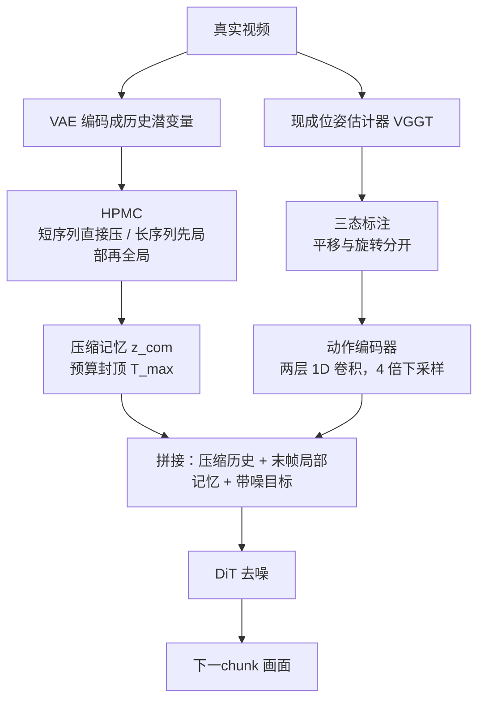

# Infinite-World：真实视频没有干净位姿，1000 帧回环只能自己压出来

<!-- release-date: 2026-02-05 -->

> 本文依据美团与南开大学等合作的 **Infinite-World: Scaling Interactive World Models to 1000-Frame Horizons via Pose-Free Hierarchical Memory**，即 arXiv:2602.02393v2（2026-02-03 修订），本地原件共 14 页。封面预印本标注 February 4, 2026。页码一律指这份本地 PDF 自身的页码。截至 2026-09-11 核验，arXiv 提交历史只有 v1（2026-02-02）与 v2，没有更新修订，因此未换件。
>
> 文中会明确区分三层：**报告写了什么**、**我们如何解释或推算**、**哪些是外部资料补充**。外部补充一律标出来源并给链接。
>
> 关于 `release-date`：论文当天没有 Web / App / API 可玩。Hugging Face 上的 DiT 权重 `infinite_world_model.ckpt` 于 2026-02-05 上传且仓库未 gated，按本模块约定取这一天为首次官方开放使用日。证据链见文末。

## 它问的不是「再画长一点」

站内已经有两篇可交互世界模型。[Genie](/reports/Google/Genie) 问的是：没有动作标签，能不能从纯视频里学出一套「按键」。[LingBot-World](/reports/AntGroup/LingBot-World) 问的是：开源这边能不能同时做到动作跟得上、记性撑到分钟级、并且快到可以实时按。

Infinite-World 问的是第三件事，而且卡在真实视频上：

> **合成引擎里位姿是真值，模型好训。真实视频的位姿是估出来的，噪声大，镜头几乎不回头。这种数据上，可交互世界模型能不能在 1000 帧以上还认得回来路过的那扇窗，并且全程不要显式位姿。**

封面 Figure 1 把这件事画成一条室内轨迹：键盘式 WASD 加方向键，从 0 帧逛到 1134 帧。窗、梁和书桌在后半段仍然对得上；810 帧附近镜头转到书架，之后又回到同一扇窗（PDF p.1，读自 Figure 1）。这是作者给出的能力上限展示，不是评测分数。

## 读之前：几个词先各用一句话说清

- **世界模型（World Model）**：给定已经看到的画面和这一步的动作，预测接下来世界长什么样。它和普通视频生成器的差别只有一条：中途能不能接控制。
- **位姿（pose）**：相机在三维空间里的位置和朝向。合成数据可以直接从引擎读真值；真实视频只能事后估计。
- **回环（loop-closure）**：走了一大圈之后再回到早先路过的视点，画面还应该对得上。没有回环，模型很难学会「这个房间是同一个」。
- **潜变量 / 潜空间（latent）**：画面先被编码器压成更短的内部表示，后面的生成网络在这个表示上工作，而不是直接在像素上工作。
- **扩散 Transformer（Diffusion Transformer，DiT）**：先给画面加噪声，再让 transformer 一步步去噪。本篇的生成骨干就是它。
- **固定预算记忆**：无论历史有多长，留给生成网络看的记忆条目数有一个上限。超过上限就继续压缩，而不是让上下文线性变长。

本篇自己反复使用的三个名字是：

- **层级无位姿记忆压缩器（Hierarchical Pose-free Memory Compressor，HPMC）**
- **不确定性感知动作标注（Uncertainty-aware Action Labeling，UAL）**
- **回访稠密微调（Revisit-Dense Finetuning）**，用到的那份数据叫 **RDD（Revisit-Dense Dataset）**

## 旧问题：合成世界好训，真实视频卡在三件事

报告把同期可交互长视频的成功，明确归因于 Unreal Engine 5 这类仿真器：相机外参是真值，动作和画面成对出现，动作—响应映射可以在干净流形上学习（PDF p.1–2）。

换到真实视频，例如 Sekai 这类未精修的探索录像，报告列出三道墙（PDF p.2）：

1. **位姿不准，控制就脏。** 真实视频没有按键日志，连续运动要靠位姿估计器从画面反推。估错的位姿会把「轻微抖动」写成一次前进，动作空间被污染。
2. **视点几乎不回头。** 自然视频大多是「一直往前走」。模型很少看见「离开后再回来」，也就学不会全局几何。
3. **没有又省算力、又不靠位姿的记忆。** 标准注意力是 $O(L^2)$。现成出路两条：用相机位姿去检索该看哪几帧，位姿一错记忆就错；或者均匀下采样，信息丢得太狠。

相关工作把对照写得很具体（PDF p.3）：

| 路线 | 报告点名的例子 | 卡在哪 |
|---|---|---|
| 几何依赖 | WorldMem、Context-as-Memory、HY-World-1.5 的 FOV 检索 | 真实位姿噪声大，检索会跟错 |
| 均匀压缩 | Hunyuan-GameCraft、RELIC、Yume 1.5，思路来自 FramePack | 潜变量涨得慢，但信息损失重 |
| 推理时记忆 | SlowFastGen 用推理期 LoRA 背场景 | 每到一个新场景都要再优化，贵 |
| 固定压缩比 | PFP 先训一个保帧压缩器 | 压缩比固定，显存仍随长度线性涨 |

Genie-3 被写成真实世界仿真的闭源上限，训练范式和架构都不公开。作者把自己的位置写成：给长时域、真实世界交互提供一个开放且高效的框架（PDF p.3）。论文正文没有写权重是否已放；后来的代码与权重是外部事件，见文末。

## 一句话先说清

Infinite-World 不是把视频模型的上下文窗口拉到 1000 帧。它做的是三件必须一起成立的事：

- 用 **HPMC** 把历史潜变量递归压进固定预算，压缩器和 DiT 一起训，不把显式几何当检索钥匙；
- 用 **三态动作** 把连续运动收成「没动 / 确定动作 / 不确定」，脏轨迹继续贡献像素，但不去污染确定性按键；
- 用 **30 分钟回访稠密数据** 做一次微调，把长程回环从「训练窗口里没见过」变成「见过就会」。

所以最值得记住的不是某一个分数，而是这条判断：

> **真实视频上的长记忆，瓶颈不在再堆多少小时直线录像，而在单条轨迹够不够长、回访够不够密；位姿太吵时，记忆不能靠位姿来捡，动作也不能被位姿写死。**

## 全景：压缩记忆、三态动作、30 分钟激活

报告把系统拆成三个核心部件（PDF p.3）：常数复杂度的记忆、抗噪声的动作、回访稠密的训练目标。Figure 2 是总图（PDF p.4）。

这张图根据 Figure 2（PDF p.4）重画，表达的是数据流，不是实测延迟。火焰标记在原图里画在两个 HPMC 模块上：压缩器与 DiT **联合训练**，不是先冻一个再训一个。

底座写得很清楚：Wanx-2.1-1.3B，480P，AdamW、学习率 $1\times 10^{-5}$，16 张 NVIDIA H800（PDF p.6）。预训练只用直接压缩、历史最多四个时间块；微调把历史从一张图扩到 16 个块，并改用层级压缩（PDF p.5–6）。

## 核心设计一：HPMC，把无限变长的历史收成固定预算

### 旧问题

1000 帧如果每一帧都进注意力，算力和显存都会按长度涨。用位姿去挑「该看哪几帧」在合成数据上可行，真实估计一抖，挑到的就是错的邻居。均匀下采样能让序列变短，但报告认为信息损失太重；PFP 即使压得很狠，占用仍随长度线性增加（PDF p.2–3）。

### 新设计

HPMC 按历史长度切换两种模式，压缩目标都是同一份固定预算 $T_{\max}$（PDF p.4）。

**模式 1：短程直接压缩。** 当长度还在门槛内，$L \le k \cdot T_{\max}$，一个时间编码器 $f_{\phi}$ 直接作用在原始潜变量 $z_{1:L}$ 上，时间分辨率降为 $1/k$，$k=4$：

$$
z_{\mathrm{com}} = f_{\phi}(z_{1:L}),
\qquad
z_{\mathrm{com}} \in \mathbb{R}^{\frac{L}{4} \times d}
$$

$d$ 是隐藏维度。这份 $z_{\mathrm{com}}$ 直接作为 DiT 的条件（PDF p.4，式 1）。

**模式 2：长程层级压缩。** 历史超出预算后，先用滑动窗口把原始潜变量切成 $N$ 个重叠块，窗口宽 $W$、步长 $S$ 随总长度自适应。每个块先做局部压缩，抓住短程动态；再把这些中间结果拼起来，用**同一个** $f_{\phi}$ 做第二次全局压缩：

$$
z_{\mathrm{com}} = f_{\phi}\bigl(\mathrm{Concat}(\{f_{\phi}(\mathrm{Chunk}_{i})\}_{i=1}^{N})\bigr)
$$

报告把这写成递归蒸馏：宽跨度历史被收成一份统一的全局表示，记忆占用被硬封顶（PDF p.4，式 2）。

实现上，压缩器是 3D-ResNet；$N=5$ 个重叠块，$W=64$ 帧，$T_{\max}=20$。这一套一次能覆盖最多 320 帧历史，再递归压进 20 个记忆位（PDF p.6）。320 不是生成地平线——生成可以到 1000 帧以上；320 是「一次层级压缩看见的上下文宽度」。

### 它怎么接到 DiT 上

送进 DiT 的不是压缩记忆单独一条，而是三段在时间上拼起来（PDF p.4）：

| 片段 | 记号 | 作用 |
|---|---|---|
| 压缩后的历史 | $z_{\mathrm{com}}$ | 远距离地标，预算固定 |
| 最后一帧潜变量 | $z_{\mathrm{loc}}$ | 眼前的局部记忆 |
| 带噪的目标潜变量 | $z_t$ | 当前正在去噪的那一段 |
| 二值掩码 | $m$ | 告诉网络哪一段是上下文、哪一段是生成目标 |

可以把它想成记笔记：全局摘要、眼前这一页、正在写的下一页，三者分辨率不同，但必须同时在桌上。

### 为什么必须和生成骨干一起训

如果压缩器是一个冻住的下采样器，它只会按「重建自己」来取舍，不一定保回环需要的那些线索。HPMC 的 $f_{\phi}$ 与 DiT 端到端联合优化，压缩器的训练信号来自**未来帧的生成损失**。于是它要自己决定：为了把几百帧之后的窗和书桌画对，历史里该留下什么（PDF p.4）。

这就是「无位姿」四个字的技术含义：**记忆检索不读相机外参，也不做 FOV 重叠判断。** 几何一致性被当成生成任务里的涌现，而不是显式先验。

### 收益和边界

收益是计算占用有上限。80GB H800 上，无压缩超过 180 帧就 OOM；直接压缩斜率变缓，但仍线性；层级压缩在初期增长后进入平台，稳定在大约 45GB，探索地平线可以到 1300 帧以上（PDF p.8，Figure 5）。这些是显存曲线，不是画质曲线。

代价也很清楚：固定预算意味着远处细节必须被丢掉。报告没有给出「压缩后还能分辨多细的纹理」这类测量；它用回环和用户研究来证明留下的那些线索够用。

### 可迁移启发

长序列系统里，「检索钥匙」和「记忆内容」可以分开设计。位姿、时间戳、哈希，都是钥匙。钥匙一脏，再好的仓库也取错货。HPMC 的选择是：不要钥匙，让下游任务的损失直接教压缩器什么该留。适用边界是——你得有一个明确的下游损失（这里是未来帧生成），而且愿意把压缩器放进同一张计算图。

## 核心设计二：三态动作，脏轨迹可以留，确定按键不能脏

### 旧问题

交互世界模型要学的是「按了什么，画面怎么变」。合成数据里按键是真值。真实视频里只有连续相机运动，还得靠现成估计器从像素反推。报告用的是 VGGT（Wang et al., 2025a）（PDF p.4）。

如果把估计出来的连续位移直接当成动作，抖动会被写成 WASD，缓慢漂移会被写成「没动」。如果把不可靠片段整段丢掉，视频模型又缺了时间连续性。两条路都会伤：一条伤动作空间，一条伤画面先验。

### 新设计

先把 6 自由度相对位姿变化 $\Delta P$ 拆成平移幅度 $\|\Delta P_{\mathrm{trans}}\|$ 和旋转幅度 $\|\Delta P_{\mathrm{rot}}\|$，两路各自做三态判定。阈值有两个：$\tau_1$ 是噪声地板，$\tau_2$ 是动作触发。报告没有给出这两个数的具体取值，只说它们是领域相关的（PDF p.5，式 3）：

$$
a = \mathcal{M}(\Delta P;\tau_1,\tau_2) =
\begin{cases}
\text{No-operation} & \text{if }\|\Delta P\| < \tau_1 \\
\text{Discrete Action} & \text{if }\|\Delta P\| > \tau_2 \\
\text{Uncertain} & \text{otherwise}
\end{cases}
$$

确定动作再映射成语义方向：平移是 $\{W,A,S,D\}$，旋转是 $\{\text{Left},\text{Right},\text{Up},\text{Down}\}$（PDF p.5）。Figure 2(b) 画的就是这张决策树：中间那档既不是「没动」，也不是「按了键」，而是 **Uncertain**（PDF p.4）。

中间档为什么必须留下？因为它承担两种相反的错误：

- 慢速运动如果被标成 No-operation，模型会以为「画面在变但没人操作」，动作—响应被拆开；
- 抖动如果被标成 Discrete Action，确定性按键空间会被噪声轨迹写脏。

Uncertain 的作用是：**像素还在训练里，按键监督不从这条轨迹里学。** 报告原话说，这样能尽量用上原始视频，同时把确定性动作空间从噪声轨迹里隔开（PDF p.2）。

### 动作怎么灌进网络

标注是给监督用的。真正进 DiT 的是一条动作嵌入 $e_{\mathrm{act}}$。动作编码器是两层 stride 为 2 的一维卷积，正好 4 倍下采样，和时间压缩因子 $k=4$ 对齐。它的有效段长度与打过补丁的目标潜变量 $z_t$ 相同；历史段用零填充。最后加到视频 token 上（PDF p.5，式 4）：

$$
x = \mathrm{Patch}(z_{\mathrm{com}}, z_{\mathrm{loc}}, z_t, m) + e_{\mathrm{act}}
$$

加性注入而不是另开一条很长的条件分支，报告给的理由是：时间对齐精确、开销小，动作可以直接调制带噪潜空间（PDF p.5）。

### 可迁移启发

从连续、有噪声的传感器读数学离散控制，不要只做「阈值以上就是动作」。中间带应该是一等公民：它让你继续用脏数据的外观，同时保护那个必须干净的标签空间。机器人里的接触力、语音里的端点检测、日志里的「是否发生了事件」，都可以问同一句话——不确定时，是丢掉样本，还是换一种监督。

## 核心设计三：30 分钟回访稠密数据，为的是激活，不是堆量

### 旧问题

互联网探索视频能提供外观和局部动态，但几乎不回头。只在这种数据上训，模型会塌成「不管你按什么都往前走」——后面 Yume 1.5 的定性失败，报告就是这么解释的（PDF p.8）。

### 先做的玩具实验

作者用合成三维场景、一个简化 DiT，把历史潜变量直接拼进上下文，看空间记忆最少要什么（PDF p.5，Figure 3）。两条观察：

1. **样本效率很高。** 10 到 50 条已经能开始引用历史（Figure 3 第 1–2 行红框对）；100 条就足以建立带三维一致性的空间记忆（第 3 行红框和蓝框对）；扩到 1000 条收益很小。记忆更取决于拓扑多样性，而不是绝对条数。
2. **外推被训练窗口绑死。** 最多在 4 个块上训过的模型，推理拉到 6 个块就会灾难性崩掉，出现明显漂和幻觉。Figure 3 第 4 行是 1000 帧推理崩溃的例子。

我们的读图补充：Figure 3 每张小图是一个块的第一帧，室内房间来回看；前三行越多样本，回看时房间布局越稳；第四行在更长地平线上结构散掉。这是玩具设定上的现象，不是主模型的正式消融。

结论被写成一句很硬的话：长时域世界建模的瓶颈，是**单条轨迹的时长和拓扑密度**，不是数据总量（PDF p.2、p.5）。

### 两阶段数据

因此正式训练拆成两截（PDF p.5–6，Figure 2(c)）：

| 阶段 | 数据 | 压缩模式 | 它补什么 |
|---|---|---|---|
| 开放域预训练 | 网上收集的第一人称 / 探索录像，超过 30 小时 | 只用直接压缩，历史最多 4 个块 | 多样外观和局部动态；这类数据本来就缺少长程回访 |
| RDD 微调 | 30 分钟自制长视频，频繁回环 | 历史从 1 张图到 16 个块，改用层级压缩 | 把长程一致性和回环「激活」出来 |

RDD 用 iPhone 17 Pro 的 Action Mode 拍，目的是压相机抖动和运动模糊（PDF p.6）。30 分钟相对 30 小时预训练是 1/60。报告认为量小没关系，因为它要的不是再学一遍「世界长什么样」，而是让已经会画的模型看见「走远再回来」这件事。

微调历史扩到 16 个块。结合 $W=64$ 帧，16 个块大约是一千帧量级——这是我们按实现数字做的对齐，报告没有把「1 个块 = 64 帧」写成评测定义。正式评测轨迹也是 16 个块（PDF p.6）。

### 可迁移启发

如果失败模式是「训练时没见过这种时间尺度，推理时就会崩」，补数据的正确姿势往往不是把同类短样本再翻十倍，而是专门造一小批**长度和拓扑都对得上目标地平线**的样本。30 分钟能激活，前提是预训练已经把画布和局部动态铺好；没有前一阶段，这 30 分钟撑不起开放域外观。

## 实验怎么证明这三件事成立

### 评测怎么搭

作者自建了 100 个开放域场景：用 Gemini 写 Indoor / Street / Nature / Fantasy 四类提示，再用 Nanobanana（即 Gemini 2.5 Flash Image）生成首帧，作为世界的初始状态。动作侧是 10 条手写长轨迹，每条 16 个块，每个场景分配一条（PDF p.6）。

对照四个同期可交互世界模型（PDF p.6–7）：

| 模型 | 报告给的定位 |
|---|---|
| HY-World-1.5 | FOV 注意力做记忆；合成 + 真实混合 |
| Hunyuan-GameCraft | AAA 游戏画面，高保真渲染 |
| Yume 1.5 | 真实世界，均匀时间下采样做记忆；参数 5B |
| Matrix-Game 2.0 | UE5 / GTA5 合成管线，强调三维一致 |

客观指标用 VBench 的运动平滑、动态程度、美学、成像质量。**故意不用**主体一致性和背景一致性：探索轨迹里视点大转，主体和背景本来就不该静止（PDF p.7）。

用户研究补的是 VBench 测不到的交互体验。附录写了协议：30 名计算机视觉或交互媒体背景的志愿者；五方法两两抽，双盲，左右随机；同一首帧、同一动作序列；每人 10 次、每次约 3 分钟，共 300 组；三个 5 分维度再加总体偏好，用 ELO 汇总。分数越低越好（PDF p.7、p.11）。Figure 6 是那张网页：Method A / B 并排视频，Visual Quality、Memory Ability、Action Response Ability 各 1 到 5，底部再选谁更好或平局（PDF p.12）。

### 主结果

Table 1 的数字如下（PDF p.7）：

| 模型 | 运动平滑 ↑ | 动态程度 ↑ | 美学 ↑ | 成像 ↑ | VBench 均分 ↑ | 记忆 ↓ | 保真 ↓ | 动作 ↓ | ELO ↑ |
|---|---:|---:|---:|---:|---:|---:|---:|---:|---:|
| Hunyuan-GameCraft | 0.9855 | 0.9896 | 0.5380 | 0.6010 | 0.7785 | 2.67 | 2.49 | 2.56 | 1311 |
| Matrix-Game 2.0 | 0.9788 | 1.0000 | 0.5267 | 0.7215 | 0.8068 | 2.98 | 2.91 | 1.78 | 1432 |
| Yume 1.5 | 0.9861 | 0.9896 | **0.5840** | 0.6969 | **0.8141** | 2.43 | 1.91 | 2.47 | 1495 |
| HY-World-1.5 | **0.9905** | 1.0000 | 0.5280 | 0.6611 | 0.7949 | 2.59 | 2.78 | **1.50** | 1542 |
| Infinite-World | 0.9876 | 1.0000 | 0.5440 | 0.7159 | 0.8119 | **1.92** | **1.67** | 1.54 | **1719** |

读这张表时有三件报告自己强调、不能省略的事：

1. **VBench 均分 Infinite-World 不是第一。** Yume 1.5 以 0.8141 对 0.8119 略高，主要来自美学 0.5840，作者把它归因于参数量大（5B 对 1.3B）。作者还认为 Yume 经常塌成「往前走」，视野几乎不离开首帧，于是避开了生成未见区域的难题（PDF p.7）。
2. **用户研究里记忆和保真是 Infinite-World 拉开的。** 记忆 1.92、保真 1.67 都是最好；ELO 1719，比第二名 HY-World-1.5 的 1542 高 177 分（PDF p.7）。
3. **动作响应不是第一。** HY-World-1.5 的动作名次 1.50，略好于 Infinite-World 的 1.54。作者的论点是：HY-World-1.5 用的是带完美标签的合成数据，Infinite-World 用的是带噪声的真实视频，两者已经可比（PDF p.7）。这是作者的解释，不是「真实数据已经全面超过合成标签」。

### 定性对照

Figure 4 是户外咖啡馆一条轨迹：第 2 块与第 6 块应对得上，第 8 块是首帧的拉近（PDF p.6）。读图可见：Matrix-Game 2.0 单块好看，但报告说它没有视野外记忆；Hunyuan-GameCraft 粗结构还在，细结构撑不久；HY-World-1.5 短程稳，长了出现重影和结构扭曲；Yume 1.5 画面滑向另一条前行通道，难以完成回头。Infinite-World 在后段仍能对上桌椅和地面透视（PDF p.8）。

附录 Figure 7、Figure 8 只拿用户研究第二名 HY-World-1.5 做长程对照（PDF p.11、13–14）。读图：禅意水池里 HY-World-1.5 后段墙面碎成噪声，Infinite-World 的盆栽和圆形天光还在；树屋街景里 HY-World-1.5 枝叶糊成纹理墙，Infinite-World 仍能分出建筑开口；玻璃幕墙校园和钢琴房两条，HY-World-1.5 在钢琴房后段天花板碎裂，Infinite-World 钢琴和窗外树林还对得上。这些是作者挑选的展示，不是随机抽样统计。

### 消融：三件套各自干什么

没有 RDD 的变体主要在短视频上训，所以消融统一在五个块的地平线上比，不是 1000 帧（PDF p.8）。Table 2（PDF p.8）：

| 配置 | 保真 ↓ | 记忆 ↓ | 动作 ↓ |
|---|---:|---:|---:|
| Baseline | 2.10 | 2.40 | 2.95 |
| + UAL | 1.78 | 2.17 | 2.17 |
| + RDD FT | 1.83 | 1.83 | 1.61 |
| Full Model | 1.75 | 1.69 | 1.38 |

报告自己的因果对齐是：

- **RDD 是激活长程空间记忆的主因。** 记忆从 2.40 到 1.83；动作也从 2.95 到 1.61，因为 RDD 轨迹的动作幅度更稳、拓扑更密，比嘈杂的直线开放域视频更好学映射（PDF p.8）。
- **UAL 在不同阶段都改善动作响应。** Baseline 加上 UAL 后动作从 2.95 到 2.17；完整模型上同样有贡献（PDF p.8）。
- **完整模型三项都最好。** 记忆 1.69、动作 1.38，说明两件事不是互相替代。

HPMC 的定量证据主要是那条显存平台，而不是 Table 2 里单独一列「去掉 HPMC」。作者把 1000 帧还能回环、以及用户研究的记忆名次，当作 HPMC 在起作用的支持（PDF p.7–8）。这比「压缩器单独贡献了多少分」更间接。

## 限制：作者写了的，以及报告没写的

结论节把未来工作写在明处，相当于一份限制清单（PDF p.8–9）：

1. **累积漂移和画质衰减还在。** 作者点名以后可以试 self-forcing 或更细的噪声日程，说明当前 1000 帧方案没有把漂移关掉，只是先把记忆立住。
2. **推理速度和保真度还有空间。** 出路写成蒸馏，以及换更大的骨干。当前公开规格是 1.3B、480P，没有给 FPS、首块延迟或实时交互数字。
3. **高保真视频生成的误用风险。** Impact Statement 只提到仿真、具身智能的好处，以及防止误用的伦理责任，没有展开具体防护（PDF p.9）。

报告没写、因此本文也不补的实现包括：

- $\tau_1$、$\tau_2$ 的数值；
- RDD 有多少条、每条多长、预训练 30 小时的具体来源与清洗；
- DiT 层数、去噪步数、chunk 与帧率的精确定义；
- 训练步数、墙钟时间和钱；
- 1000 帧展示与五块消融之间，中间地平线上记忆如何掉下来；
- 训练代码是否开源、RDD 原始视频是否开源。

论文相关工作写的是「开放且高效的框架」（PDF p.3），但 14 页正文没有给出权重或推理代码链接。代码和权重是论文之后的外部事件，不能倒写成这篇预印本已经附带可运行系统。

## 可迁移启发

1. **脏监督不要硬阈值成干净标签。** 三态比两态多出来的那一档，买到的是「数据还能用、标签不被污染」。任何从估计量反推控制信号的系统都可以先问：中间带是丢掉，还是单独建模。
2. **记忆模块的训练信号应来自未来任务，而不是来自重建自己。** HPMC 和 DiT 共用生成损失，所以压缩器保的是回环需要的线索。先训一个重建压缩器再冻住，容易留下对重建友好、对回环无用的信息。
3. **固定预算比固定压缩比更接近「无限地平线」。** 固定压缩比仍随长度线性涨；递归压进 $T_{\max}$ 才出现显存平台。换到语言模型或日志系统，对应的是「摘要条数封顶」，而不是「每 $k$ 个 token 留 1 个、总数继续涨」。
4. **长程能力往往是被激活的，不是被堆出来的。** 玩具实验里 100 条饱和、训练窗口外一格就崩。产品含义是：先用短数据把外观和局部动态铺上，再用一小批长度、回访密度都对得上目标地平线的数据做一次专门微调。
5. **评交互世界模型时，生成基准的「一致性」项可能在帮倒忙。** 主体 / 背景一致性惩罚的是视点大转。Infinite-World 把它们从 VBench 里拿掉，改用回环和用户研究。迁移时先问指标是在奖「老实待在首帧附近」，还是在奖「走远还能回来」。

## 关键词回看

- **现实鸿沟（reality gap）**：合成器真值位姿上好训的世界模型，迁到真实视频后动作和记忆一起掉。
- **HPMC**：短序列直接 4 倍时间压缩，长序列先局部再全局，递归收进 $T_{\max}$；与 DiT 联合训练，不读显式位姿。
- **$T_{\max}=20$**：一次层级压缩的记忆预算；实现上 $N=5$、$W=64$，覆盖最多 320 帧历史。
- **UAL / 三态逻辑**：No-operation、Discrete Action、Uncertain；平移与旋转分开判定。
- **VGGT**：现成的视觉几何估计器，用来从真实视频估计相对位姿，不是本篇提出的模块。
- **RDD**：30 分钟 iPhone Action Mode 自拍的回访稠密视频，用来激活长程回环。
- **Wanx-2.1-1.3B**：被微调的视频生成底座，480P。
- **回环**：离开后再回到旧视点，地标仍应可识别。

## 最后的判断

Infinite-World 最强的叙事不是「我们把交互世界模型画到了 1000 帧」，而是：**在真实视频上，长记忆、干净动作和回访密度是三笔必须分开还的账；位姿太吵时，前两笔都不能把位姿当真相。**

被实验撑住的是：用户研究里记忆和保真明显好于四个开源对照，ELO 领先第二名 177 分；动作在噪声真实数据上接近用完美合成标签训练的 HY-World-1.5；显存在层级压缩下进入约 45GB 的平台，能看到 1300 帧；消融里 RDD 主要抬记忆、UAL 主要抬动作，完整模型三项最好。

没有被撑住、或只被部分撑住的是：VBench 均分没有超过 5B 的 Yume 1.5；动作名次没有超过 HY-World-1.5；消融地平线只有五个块；HPMC 没有单独一列「去掉压缩器」的画质对比，1000 帧回环更多是展示加用户研究。作者自己也把漂移、速度和保真度留在未来工作里。

如果只记一句话，可以记：

> **真实世界很少给你干净位姿，也很少让你走回头路。能撑到 1000 帧的记忆，往往不是捡回来的，是被压进固定预算、再用一小批真正回头的数据激活出来的。**

## 资料与阅读边界

- **原始依据**：本地 `papers/Meituan/Infinite-World.pdf`，arXiv:2602.02393v2，2026-02-03 修订，14 页。官方页：[arXiv abs/2602.02393](https://arxiv.org/abs/2602.02393)。提交历史：v1 于 2026-02-02 17:52:56 UTC，v2 于 2026-02-03 15:06:38 UTC；封面印刷日期为 February 4, 2026。本稿核验时没有 v3，未换件。
- **项目页**：论文印刷的 URL `https://RQ-Wu.github.io/projects/infinite-world.html` 当前 404。arXiv 摘要栏给出的可打开地址是 [https://rq-wu.github.io/projects/infinite-world/index.html](https://rq-wu.github.io/projects/infinite-world/index.html)。页面内容与论文摘要、Table 1 数字一致，并链到 GitHub。
- **归属**：第一作者 Ruiqi Wu、Xuanhua He 在美团实习期间完成；通讯作者 Chunle Guo（南开 / NKIARI）；项目负责人 Yong Zhang（美团）。合作方还包括香港科技大学。目录按主要机构放在 `Meituan`，不另建南开目录。
- **`release-date` 的取值依据**：这篇工作没有官方 Web / App / API 可交互产品。Hugging Face 仓库 [MeiGen-AI/Infinite-World](https://huggingface.co/MeiGen-AI/Infinite-World) 的 `createdAt` 为 2026-02-05T01:01:06Z，按本模块约定**仓库创建日不是首发日**。权重文件 `checkpoints/infinite_world_model.ckpt`（3.52 GB）出现在 2026-02-05T08:12:38Z 的提交 `4794722`，仓库 `gated=false`。同日稍早的 `01c7703`（07:29:18Z）已上传推理脚本。故取 2026-02-05 为首次官方开放使用日。GitHub 代码仓 [MeiGen-AI/Infinite-World](https://github.com/MeiGen-AI/Infinite-World) 的 `created_at` 为 2026-01-27T02:22:51Z，但第一条内容提交 `2af24b8`（message: `infinite-world`）在 2026-02-06T15:19:21Z，晚于权重，不回写日期。
- **外部补充，不得冒充 PDF 原文**：GitHub README 现标题带 `[ICML 2026]`；ICML 2026 虚拟站点有对应 poster 页（[icml.cc/virtual/2026/poster/66617](https://icml.cc/virtual/2026/poster/66617)，时间写为 2026-07-08）。14 页预印本未写录用信息。GitHub README 后来改为从 Hugging Face 下载权重；HF 上较早的 `readme.md` 仍写着 DiT checkpoint `TBD`，与实际已上传的 `infinite_world_model.ckpt` 不一致。许可证 MIT 来自该仓库，不是 PDF 原文。HF 模型卡另挂了 WBench 导航分数 72.9，论文未评这项，不写入上文结论。
- **本文明确标为读图或推算的内容**：Figure 1 / 3 / 4 / 7 / 8 的场景内容与「第 8 块是首帧拉近」的视觉核对；16 个块与 $W=64$ 对齐到约一千帧，是实现数字上的对照，不是报告给出的评测公式。
- **底座来源**（报告点名、实现细节以对方仓库为准）：[Wan-AI/Wan2.1-T2V-1.3B](https://huggingface.co/Wan-AI/Wan2.1-T2V-1.3B)。论文写作是 Wanx-2.1-1.3B。
