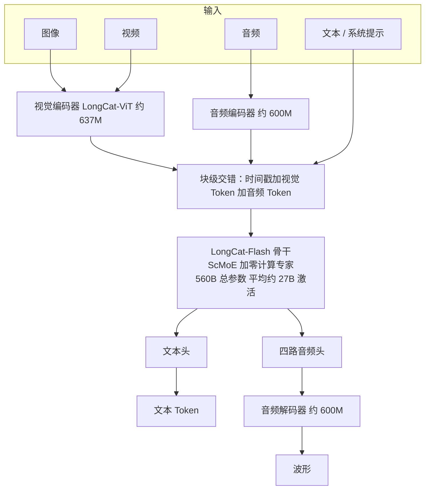
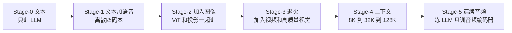
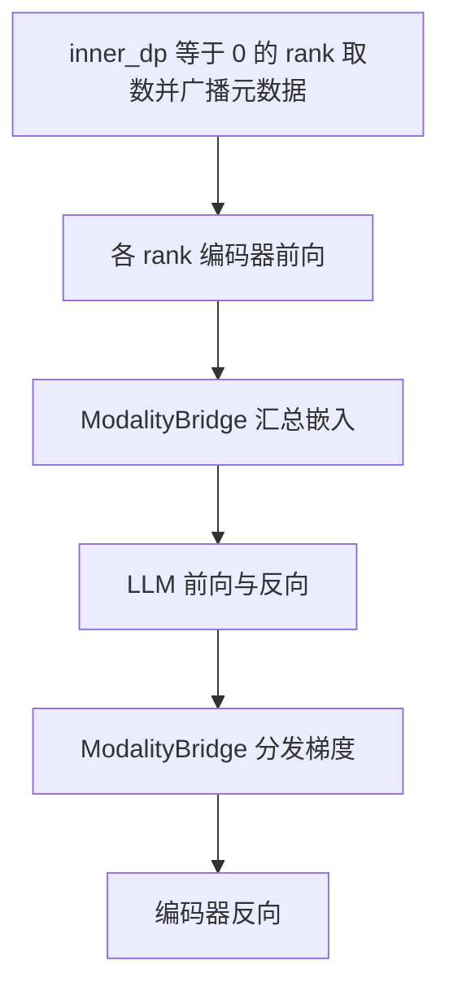
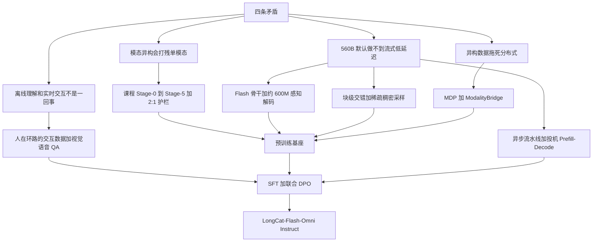

# LongCat-Flash-Omni：课程训练保住单模态，轻量感知和块级交错让 560B 也能实时听看说

<!-- release-date: 2025-11-01 -->

> 本文依据美团 LongCat 团队发布的 **LongCat-Flash-Omni Technical Report**，即 arXiv:2511.00279v2，2025-11-28 提交的修订版，共 40 页（正文与结论 1–32 页，作者名单 33 页，参考文献 34–40 页）。封面左侧栏为 `arXiv:2511.00279v2 [cs.MM] 28 Nov 2025`。动笔前已核对 arXiv 官方页：这篇报告只有 v1（2025-10-31）与 v2（2025-11-28）两个版本，本地 `papers/Meituan/LongCat-Flash-Omni.pdf` 就是最新的 v2，不需要替换。页码均指 PDF 本身的页码；原件的印刷页码与 PDF 页码一致，不用换算。文中会把「报告明确写了什么」「我们如何理解它」「哪些是外部资料补充」三层分开。
>
> `release-date` 取 **2025-11-01**。这是对外开源的 560B Omni 模型，按最早官方可用日取值。GitHub 实质根提交的提交者时间是 2025-10-31T22:10:35Z（北京 2025-11-01）。仓库创建日、Hugging Face `createdAt` 与权重预上传日不用；美团博客 2025-11-03 与 arXiv v1 2025-10-31 都不回写。完整证据见文末。
>
> 它不是一份从零发明骨干的语言基模报告。LongCat-Flash-Omni 建立在已经开源的 [LongCat-Flash](/reports/Meituan/LongCat-Flash) 上：沿用 Shortcut-connected MoE 与零计算专家，再接轻量视觉 / 音频感知和语音重建。同系列的 [LongCat-Flash-Thinking](/reports/Meituan/LongCat-Flash-Thinking) 是在 Flash-Base 上做推理后训练，本文不展开。Flash 语言基模自己的主表、训练账单和推理 TPS，不是 Omni 的实验，后文只用 Omni 这份 PDF 自己报的数字。

## 阅读前先搭一张最小地图

先认识几个底层概念：

- **Token（词元）**：模型读写时的基本小块。文本是字词，语音是离散码本或连续特征，图像和视频是视觉编码器切出来的补丁。
- **全模态（Omni-modal）**：一份模型同时吃文本、图像、视频、音频，并且能直接吐语音，而不是「看图模型 + 语音模型」拼装。
- **混合专家（Mixture-of-Experts，MoE）**：前馈网络拆成很多专家，每个 Token 只跑其中几个。总参数可以很大，激活参数很小。
- **快捷连接 MoE（Shortcut-connected MoE，ScMoE）与零计算专家（Zero-Computation Experts）**：LongCat-Flash 的两块骨干设计。前者把上一块的稠密计算挪到专家通信旁边，让通信被计算遮住；后者是「什么都不算、把输入原样返回」的专家，路由器选中它，这一层就少算一个专家。细节见 Flash 那篇，本文只讲 Omni 怎么沿用它们。
- **多头潜在注意力（Multi-head Latent Attention，MLA）**：Flash 沿用的注意力变体，把 Key 和 Value 压成低维潜向量再缓存。Omni 的 LLM 骨干同样带着它。
- **早期融合（Early Fusion）**：视觉、音频特征投影进 LLM 的同一条 Token 序列，和文本一起做下一词预测，而不是各模态各训一个塔、最后再拼。
- **块级交错（Chunk-wise Interleaving）**：音视频不是整段拼完再送进模型，而是按时间切成对齐的小块，一块一块交错预填进 LLM。
- **模态解耦并行（Modality-Decoupled Parallelism，MDP）**：训练时把视觉编码器、音频编码器和 LLM 骨干拆开调度，各自用自己的并行策略。

这篇报告最常出现的几个名字是：

- **LongCat-ViT**：Omni 的视觉编码器，原生分辨率、图视频共用。
- **LongCat-Audio-Codec**：四码本音频分词器和波形解码器。
- **课程式预训练 Stage-0 到 Stage-5**：文本 → 语音 → 图像 → 视频与退火 → 128K 上下文 → 连续音频对齐。
- **ModalityBridge**：MDP 里编码器与 LLM 之间的通信层，负责把两种并行策略下的嵌入和梯度对上。
- **OmniBench / WorldSense / DailyOmni / UNO-Bench**：跨模态理解的四张主表。
- **投机式 Prefill–Decode 切换**：服务端不等完整静音窗，提前开始解码，用户又开口就回滚。

## 一句话先说清

560B 总参数、平均约 27B 激活的 MoE，要做实时音视频交互，通常会撞上两堵墙：模型太大太慢，或者把所有模态塞进一份权重后，单模态被打残。

LongCat-Flash-Omni 的回答很具体：

> **模态按从简到繁的课程往里加，保住单模态；感知和语音重建做成大约 600M 的轻模块；音视频按时间块交错预填；训练把编码器和 LLM 拆开并行。**

报告自己列的结果是：开源全模态基准上达到 SOTA，文本、图像、视频、语音理解和生成也有竞争力；560B 规模下仍做实时音视频；训练吞吐保持纯文本训练的 90% 以上。最后这一句没有写测量设定，后文会原样保留这个缺口。（PDF p.1、4–5）

如果只记一句话，可以记：

> **全模态的难点不是再加一个编码器，而是让新模态进来时，旧模态别塌、大模型别慢、训练别被异构数据拖死。**

## 先看全景：Omni 到底由哪几块拼起来

根据 PDF p.6 Figure 2 重画。这是机制示意，不是实测时间轴。



报告把整条链路写成端到端：任意组合的文本、音频、图像、视频进模型，LLM 同时产文本 Token 和多码本语音 Token，解码器把语音 Token 还原成波形。三个外围模块——视觉编码器、音频编码器、音频解码器——各自大约 600M 参数；视觉编码器在 Table 1 里写明 637M。真正的容量和稀疏性都在 Flash 那根 LLM 骨干上。（PDF p.5–6）

后面每个设计都会回到这张图：课程训练决定「什么时候把哪根线接上」；块级交错决定「音视频怎么排进 LLM 的序列」；MDP 决定「训练时这三块怎么分卡」。

## 先讲矛盾：560B 做全模态，卡在四件事上

报告在引言里把困难写成四条，不是口号，每一条都对应后面一节设计。（PDF p.4）

### 矛盾一：模态差太远，一锅炖容易把单模态炖坏

文本是高度压缩的符号；语音也是序列，但语义密度低得多——报告举的例子是：典型 12.5 Hz 语音分词器每秒大约要吐 12.5 个 Token，人说话大约只有每秒 3 到 4 个文本 Token。图像是空间结构，视频再叠上时间。把它们一次性倒进同一个下一词预测目标，常见结果是「什么都会一点，什么都不如专模」。（PDF p.4、12）

### 矛盾二：离线理解和实时交互不是同一种能力

离线评测可以等整段视频、整段音频到齐再拼。实时对话还要相对时间、音画同步、多轮上下文，以及用户随时插话。报告后来说，现成的音视频理解数据几乎都是离线的，大规模真实交互数据又采不起。（PDF p.4、15）

### 矛盾三：实时意味着流式进、流式出，大模型默认做不到

既要流式音视频输入，又要流式语音输出，还要低延迟。560B 总参数即使只激活约 27B，若外围编码器很重、序列要等全部到齐、解码还要再走扩散式 vocoder，交互还是会卡。（PDF p.4–5）

### 矛盾四：数据和模型都异构，分布式策略会被拖死

SFT 阶段一个 micro-batch 里，音频编码器平均 3.29 TFLOPs，视觉编码器 89.85，LLM 解码器 3531.32；三者的最大最小值差一个数量级以上。序列长度分布也随模态剧烈抖动。FSDP 一类「整网切分」对 560B 不现实。（PDF p.17–18，Table 2、Figure 7）

Omni 对这四条分别给了架构和训练上的回答。下面按「旧问题 → 新设计 → 机制 → 收益 → 边界」展开。

## 核心设计一：骨干不重做，把 Flash 的稀疏和通信重叠直接接到多模态上

### 旧问题：全模态若换一根更重的骨干，实时交互先死

若为了「看得更细、听得更清」把 LLM 换成稠密大模型，560B 这个量级的服务延迟会先把产品打死。报告的选择是：不重做骨干。

### 新设计：沿用 LongCat-Flash 的 ScMoE 加零计算专家

Omni 的 LLM 就是 LongCat-Flash：MLA、快捷连接 MoE、零计算专家；每个 Token 激活 18.6B 到 31.3B，平均约 27B。这些性质被「保留并扩展到多模态理解和音视频交互」。（PDF p.7–8）

这里必须分清两层事实：

- **报告写了什么**：Omni 用的就是这套骨干，激活区间与 Flash 相同。
- **不能据此把 Flash 那篇的主表当成 Omni 的实验**：Flash 的 20T Token、30 天、98.48% 可用率、H800 上每百万输出 Token 0.7 美元、单用户 100 TPS，都是语言基模报告的数字。Omni 这份 PDF 没有重报这些账单。

零计算专家在 Flash 里的作用，是让路由器替每个 Token 做算力预算：简单位置可以「少算一个专家」。接到 Omni 之后，这条机制仍然在。报告没有在 Omni 里重做零计算专家的消融，也没有给出「多模态 Token 比文本 Token 更常选零计算专家」这类统计。可以迁移的判断是：稀疏骨干先把单 Token 算力压到可服务的量级，外围编码器才有资格做轻。

### 收益与边界

收益写在引言：尽管总参数 560B、激活 27B，模型仍能做实时音视频交互。（PDF p.4）边界同样清楚：骨干怎么训稳、怎么做确定性 kernel、推理侧 SBO 怎么藏通信，Omni 只说「LLM 部署沿用 Flash 的 Prefill–Decode 分离和 ScMoE 单批重叠」，细节指向 Flash，不在本文重写。（PDF p.22）

对自己项目的用处：先有一条已经能服务的稀疏骨干，再往上挂模态；不要指望在稠密大模型上靠「再加一个投影层」得到实时全模态。

## 核心设计二：感知和解码做成轻模块，语音生成不走扩散

### 旧问题：外围模块若和骨干一样重，流式推理会被编码器拖死

实时交互里，每一秒都有新的视频帧和音频帧要编码，生成端还要把语音 Token 还原成波形。若视觉塔很重、语音重建再叠一层扩散式 code2mel 加 vocoder，首包延迟会先爆。

### 视觉：原生分辨率的轻量 ViT

LongCat-ViT 保留标准 Vision Transformer 骨架，加了几处改动：图视频统一的 patch 化、二维旋转位置编码（2D-RoPE）、SwiGLU、RMSNorm、LayerScale、Query-Key 归一化。配置是刻意偏轻的：（PDF p.5–6，Table 1）

| 项 | 数值 |
|---|---:|
| Patch 大小 | 14 |
| 位置编码 | 2D-RoPE |
| 隐藏维 | 1280 |
| 中间维 | 5184 |
| 层数 | 32 |
| 头数 | 16 |
| 参数量 | 637M |

原生分辨率的意思是：尽量不把图强行缩到固定正方形。训练时，若补丁数落在 576 到 5832，只做最小缩放，让两边能被 112 整除；否则按宽高比缩进这个区间。视觉–语言投影是带预归一化的两层 MLP；空间上再做 $2\times$ pixel-unshuffle，减轻高分辨率的平方复杂度。（PDF p.6）

ViT 自己也走课程：先在固定低分辨率（例如 224）上对比学习，再转到原生分辨率；视频数据留到最后一阶段才加。早期用冻结的预训练视觉模型做特征蒸馏，权重逐渐降到零。对比预训练从零开始，一共 146 亿个样本。（PDF p.6–7）

### 音频：训练前半用离散码本，后半才接连续特征

这里有一个很具体的工程判断：离散码本适合和文本一起做下一词预测，但会丢掉细声学细节。所以：

- 预训练 Stage-1 到 Stage-4：音频分词器把波形打成四码本离散 Token；
- 从 Stage-5 起：音频编码器把波形打成连续特征再送进 LLM；
- 生成端始终吐四码本离散 Token，由解码器还原波形。

分词器和解码器来自 LongCat-Audio-Codec：16.67 Hz，四个码本，一个语义、三个声学。解码不走扩散或 flow matching 的 code2mel，直接用 Codec 的解码器，流式解码只向前看 3 帧。结构是 LSTM、卷积块和因果转置卷积，对抗训练（GAN）。（PDF p.7）

编码器吃 80 维 Fbank。Pre-FFN 用帧拼接把序列长度压到八分之一，每帧对应 80 毫秒。主干把自注意力换成 FSMN（前馈序列记忆网络），只在有限上下文里做特征；最后六层允许看一帧未来，前面严格因果。它先用语音识别数据和 CTC 损失单独训过，Stage-5 再对齐到 LLM。（PDF p.7）

### 收益与边界

三个外围模块各自大约 600M，相对 27B 激活可以忽略。生成端少了一级扩散，是报告明确用来换低延迟的手段。没有写这三个 600M 模块各自的推理毫秒数，也没有写「不用扩散比用扩散快多少」。边界是：声学细节靠 Stage-5 的连续特征和 Codec 的三个声学码本补，报告没有给出离散码本相对连续特征的消融表。

对自己项目的用处：生成走下一词预测时，解码器越接近「Token 直接变波形」，越容易流式；输入侧可以先离散对齐、再连续补细节，不必一上来就上连续音频编码器。

## 核心设计三：音视频按时间块交错，而不是等整段到齐

### 旧问题：离线拼接和实时预填是两种序列

离线任务可以把整段音频特征和整段视觉特征在序列维拼起来。实时交互里，用户问完话的那一刻，模型必须已经把前面若干秒的画面和声音预填进 KV Cache。等整段结束再拼，首包一定晚。

### 视频怎么压进预算

视频时长从几秒到几小时、分辨率跨度很大。报告用三件事压预算：（PDF p.8）

1. **动态抽帧**：默认 2 FPS；短视频提高帧率，至少 16 帧；过长的视频按最大帧数均匀抽。
2. **文本时间戳**：抽到第 $i$ 秒的帧，前面加纯文本 `Second{i}`，序列长成 `Second{i}||Vi||Second{j}||Vj||...`。时间戳走文本空间，不另训一套时间编码。
3. **三级压缩**：先按补丁上限缩放；再在进视觉编码器前做时间步为 2 的三维卷积，把 $N$ 帧压成 $N/2$；投影成视觉 Token 后若还超上限，再做插值下采样。

### 流式交错长什么样

块的结构是：（PDF p.8）

```text
<|timestamp|>:<|video-tokens|><|audio-start-token|><|audio-tokens|>
<|timestamp|>:<|video-tokens|><|audio-tokens|>...
<|audio-end-token|>
```

时间戳仍是文本。音频、视觉各自编码，再按时间对齐切块、交错送进 LLM。

### 稀疏–稠密采样：用户说话时看细，模型说话时看粗

交互是轮流的。用户输入期用 1 秒一块、2 FPS，尽量保住音画；模型回答期改成 2 秒一块、0.5 FPS，帧先缓存，拼到下一轮用户输入前面。报告把这写成「区别于社区里其他全模态模型的核心能力」。（PDF p.8）

服务端还有一套对应实现，见后文推理节：用户说话时稠密采样，否则只稀疏跟踪视频大意。（PDF p.22–23）

### 收益与边界

机制上，KV Cache 在用户还没说完时就已经在长；回答期少算视频，是用信息换算力。报告没有给出「1 秒块 vs 整段拼接」的延迟消融，也没有给出 0.5 FPS 相对 2 FPS 掉了多少视频理解分。可迁移的是原则：实时交互的序列形状应由「何时必须作答」决定，而不是由离线 benchmark 的拼接习惯决定。

## 核心设计四：课程训练——先文本，再语音，再图像，最后才是视频和连续音频

### 旧问题：模态异构，不能当同一种序列来训

报告把课程的理由写得很直白。文本已经有成熟的 LLM 训练；语音和文本同为序列，只是多了音色、情感、韵律、口音，语义更稀；图像是空间；视频是空间加时间，最难。所以从简单序列建模逐步过渡到复杂序列建模。（PDF p.12，Figure 5）

### 六个阶段

根据 PDF p.11 Figure 5 与 3.2 节重画。火焰表示该模块在训，雪花表示冻结。这是机制示意。



| 阶段 | 报告写明的做法 | 规模 |
|---|---|---|
| Stage-0 | 跟 LongCat-Flash 初始阶段同一套文本预训练，恒定学习率，推理和代码数据占比逐渐升高 | 约 16T Token（PDF p.12） |
| Stage-1 | 文本、语音–文本交错、少量 ASR；语音打成四码本；文本嵌入与音频嵌入相加后进 LLM；四个音频预测头；语义码本与声学码本错开一步 | 约 5.1T Token，文本:音频 = 2:1（PDF p.12–13） |
| Stage-2 | 加入图像描述和图文交错；ViT 从 LongCat-ViT 初始化，投影随机初始化，与 LLM 一起训 | 超过 3T Token，文本:音频 = 2:1，文本:视觉 = 2:1；视觉损失权重 0.25（PDF p.13） |
| Stage-3 | 退火学习率；加入视频，以及 OCR、定位、GUI、多图、STEM | 0.33T Token，文本:视觉:语音 = 2:1:1（PDF p.13） |
| Stage-4 | 先 8K→32K（RoPE 底频 1M→5M，100B Token），再 →128K（底频 10M，20B Token）；混合物再加 25% 长上下文多模态数据 | 同上 2:1:1（PDF p.13–14） |
| Stage-5 | 冻结 LLM，只训音频编码器；编码器从 CTC 预训练初始化，投影随机初始化；损失只算「LLM 回复」段 | 未给 Token 数（PDF p.14） |

Stage-1 的总损失写成：（PDF p.12）

$$
L_{\text{total}}=a\,L_{\text{pure-text}}+b\,L_{\text{audio}}+c\,L_{\text{audio-text}}+d\,L_{\text{first-audio}}
$$

调完以后取 $a=1.75$、$b=0.25$、$c=1.5$、$d=0.1$。$L_{\text{first-audio}}$ 只加在语义音频 Token 上。ASR 对模态对齐帮助很小，所以只留一小部分。

Figure 6 把多头预测画清楚了：一个文本头、一个语义音频头、三个声学音频头；声学相对语义错开一个时间步；文本与音频嵌入在进 LLM 之前相加。（PDF p.13）

Stage-3 还用 PPL 缺口自动调采样：按语义和任务切子集，谁收敛慢就加权重；每个子集用现成视觉–语言模型在验证集上算参考 PPL。和高价值样本会被单独拆出来，避免被平均数稀释。（PDF p.13）

Stage-5 试过「先单独训音频投影再端到端」，和直接端到端差别可以忽略，所以省掉了这一步。（PDF p.14）

### 数据配比本身就是护栏

多模态预训练语料超过 2.5T Token，覆盖音频、通用图文、OCR / 定位 / GUI、STEM、多图、视频、长上下文多模态。（PDF p.9）几个写了数字的子集：

- 语音–文本交错：数千万小时音频；VAD 切段、两套自研 ASR 交叉校验、强制对齐、按时长/文本比丢掉 0.5 和 99.5 百分位以外的段，静音短于 10 秒的相邻段合并；再按标点切成 $(A_i,T_i)$，随机遮掉音频或文本。（PDF p.9）
- 图文交错：开源数据过滤后按密度剪枝和语义聚类，原始集合大约丢掉 74%。（PDF p.9–10）
- STEM：1500 万图文对，从 K12 到大学。（PDF p.10）
- 长上下文：超过三分钟的视频，以及「同主题单图拼接 / 把长文某些段落渲染成图」的针检索数据。（PDF p.11）
- Stage-4 语音：处理后的中英录音超过 1000 万小时。（PDF p.14）

2:1 和 2:1:1 在后面几阶段被反复强调。报告的意思是：文本始终占一半，避免新模态把语言冲掉。

### 收益与边界

Stage-1 到 Stage-4 的基座已经能做 ASR / TTS / 语音续写（Table 7–8，后文）。Instruct 模型的文本能力相对 Flash 没有掉，部分项还更高（Table 12–13）。这是「课程保住单模态」最硬的证据。

边界：Stage-0 的 16T 是「Flash 初始阶段同一套程序」，不是 Flash 报告里那条 20T 以上的完整预训练账单。Stage-5 没有 Token 数。PPL 缺口调度没有给出「调之前 vs 调之后」的表。2:1 是经验配比，不是消融出来的最优解。

对自己项目的用处：新模态按「和旧模态有多像」排序接入；接入时用比例护栏，而不是靠事后回放文本数据。离散对齐可以先于连续对齐。

## 核心设计五：模态解耦并行，让编码器和 LLM 各算各的

### 旧问题：数据和模型都异构，一种并行罩不住

Figure 7 显示 SFT 里视觉和音频的序列长度分布完全不是一个形状。Table 2 显示三个模块的计算量差两个数量级。报告对比了两条路：（PDF p.17–18）

- FSDP 类：切参数、靠数据并行抹平异构。560B 太大，走不通。
- 按并行维解耦：DistTrain、PipeWeaver、Optimus 这类工作。Omni 在 Optimus「编码器和 LLM 用不同并行、把编码器塞进 LLM 空档」的思路上，做成更彻底的 MDP——编码器与 LLM 在分布式层面完全拆开。

### MDP 的四个相位

编码器就地和 LLM 放在一起。编码器走混合分片数据并行（HSDP）加全激活重计算；LLM 走流水线并行（PP）+ ZeRO-1 数据并行（DP）+ 上下文并行（CP）+ 专家并行（EP）。为了对齐两边的数据切分，引入 InnerDP：（PDF p.18）

$$
d_{\text{inner\_dp}}=d_{\text{lm\_cp}}\times d_{\text{lm\_pp}},\qquad d_{\text{world}}=d_{\text{dp}}\times d_{\text{inner\_dp}}
$$

一次迭代四步（PDF p.18–19，Figure 8）：

1. **取数**：只有 `inner_dp = 0` 的 rank 读全部 micro-batch，把元数据广播出去。micro-batch 按文本长度排序，减轻 EP 空泡。
2. **编码器前向**：BalanceData 把模态数据分到各 InnerDP rank；各 rank 算视觉 / 音频嵌入；ModalityBridge 把嵌入汇总回 `inner_dp = 0`。
3. **LLM 前向反向**：嵌入按 CP 切开，LLM 完整走完；视觉 / 音频嵌入的梯度交回编码器。
4. **编码器反向**：ModalityBridge 把梯度再分回去。

根据 Figure 8 重画的相位图（机制示意）：



### ModalityBridge：用分块把峰值显存除以 chunk 数

长上下文时，`inner_dp = 0` 要 gather / scatter 全部嵌入和梯度，显存会爆。ModalityBridge 把一次变换拆成 `num_chunk` 次：先把 InnerDP 上的嵌入聚到 0 号 rank，再沿 `hidden_size` 切开分给各 CP rank。每次峰值先升后降；整体峰值大约变成原来的 $1/\text{num\_chunk}$，并且保持按位数值一致。反向走同样路径的逆过程。（PDF p.19–20，Figure 9）

### 算子、通信、显存

性能调优的顺序是：先按核心算子效率选分布式配置，再靠显存优化把配置塞进 80GB 卡。（PDF p.20）

- Figure 10：8K 序列下不同 CP / EP 的 MoE GEMM MFU；选中的配置是 EP=32、CP=2。（PDF p.21）
- 快捷架构让 EP 通信和计算在同一 micro-batch 内重叠；通信和计算核的 SM 数量按场景分开调；PP 的 P2P 用独立通信组和流，避免阶段互相抢。（PDF p.20）
- Grouped GEMM 在评测场景大约 75% MFU，含 Dynamic SwapAB、可配置 SM、细调 Tile / Pipeline / Cluster、swizzle 提高 L2 命中、反向 ping-pong 遮梯度写回。（PDF p.21）
- 融合 permute、把 RoPE 融进 MLA 前序核（相对基线 3 倍）、用信号量做确定性 FlashAttention 反向（大约是非确定性版本的 0.8 倍）。（PDF p.21）

未优化时目标配置大约每卡 137GB。80GB 卡还要给 EP 不均衡留余量，理论占用压到大约 72GB。Table 3–4 的路径是：（PDF p.21–22）

| 设置 | 总计（GB） |
|---|---:|
| 基线 | 137.0 |
| 加编码器 HSDP | 134.1 |
| 加 V 形 PP（Vhalf） | 89.4 |
| 加选择性重计算 | 80.1 |
| 加省显存 permute | 73.6 |
| 加 NCCL 显存优化 | 69.1 |

另外还有动态专家重计算：某 rank 分到过多 Token 时，重算 down-projection，只留下 down-projection 的输入，避免专家不均衡把训练打崩。（PDF p.21）

数值一致性沿用 Flash 那套：能按位对齐的新特性（fused permute、fused SwiGLU、非 Split-K 的 Grouped / Router GEMM）就按位对齐；不能对齐的，对照黄金实现把误差源找出来，例如 DeepEP 和 All2All 的累加顺序。（PDF p.22）

### 90% 吞吐：报告怎么写就怎么写

摘要、引言、第 5 节三次出现同一句话：多模态设定下，系统保持纯文本训练吞吐的 90% 以上。（PDF p.1、4、17）

**报告没有写**：在哪一阶段测的、序列长度多少、什么 GPU、对比的「纯文本训练」是 Flash 的哪次 run、MFU 还是 tokens/s。所以本文不把「90%」写成某一张卡上的实测值，只把它当作作者给出的系统效率主张。

对自己项目的用处：异构模态不要强行共用一种并行；让轻编码器走数据并行加重计算，让重 LLM 走自己的 PP / EP / CP，中间用一层可分块的桥来换格式。桥必须保持数值一致，否则「拆开」会变成「拆错」。

## 后训练：SFT 教会说话，DPO 把文本头和音频头绑在一起

预训练解决「能感知、能生成」；后训练解决「听得懂指令、聊得像人」。两段：监督微调，再 DPO。报告把 DPO 称作强化学习阶段，算法本身是 Direct Preference Optimization。（PDF p.14、16）

### SFT 数据

- 图文：基础 caption / VQA，加上文档、图表、OCR、定位、Agent、STEM。LLM-as-judge 过滤后大约 300 万条。（PDF p.14–15）
- 视频：约 300 万视频的池子，48 类能力标签，定向补弱项，人工标注最难点，最后约 70 万条。（PDF p.15）
- 音频理解：从 Stage-5 的数据里再采样，覆盖 ASR、语音翻译、副语言、音频问答。（PDF p.15）
- 视觉–语音 QA：已有文本 QA 里适合 TTS 的，改写成口语再合成语音。（PDF p.15）
- 音视频理解：片内音画都用得上的 QA，按交错块组织。（PDF p.15）
- 语音对话：滤掉公式、代码、Markdown，改写成能说的话；再用演员覆盖情绪、风格和主要汉语方言（四川、北京、东北）去微调 TTS。（PDF p.15）
- 音视频交互：先按记忆、理解、分析、创造、应用、娱乐六维自动生成多轮 QA，再人工改事实错误、答不全、指代含糊、语言别扭、答非所问；长上下文版会把问题和对应画面拉开时间距离。最后 TTS 合成，嵌回视频。（PDF p.15–16）

SFT 还混入 Flash 用过的纯文本 SFT，覆盖推理、数学、代码、工具和日常对话。（PDF p.16）

### SFT 配方

冻音频编码器，其余都训。经验上这样更稳，也不容易忘掉底层声学。AdamW，$\beta_1=0.9$，$\beta_2=0.95$，权重衰减 0.1；前 4% 步线性升温，余弦从 $1\times 10^{-5}$ 降到 0；一个 epoch，batch 1024。（PDF p.16）

### 联合 DPO：文本头和多个音频头一起比偏好

多数 DPO 变体只优化文本，或把文本和语音拆开优化。报告认为拆开会破坏两者一致性。损失写成：（PDF p.16–17）

$$
L_{\text{DPO}}=\alpha\,L_{\text{DPO}}(\text{text}_{\text{chosen}},\text{text}_{\text{rejected}})+\beta\sum_{i=1}^{N}L_{\text{DPO}}(\text{audio}^{i}_{\text{chosen}},\text{audio}^{i}_{\text{rejected}})
$$

$N$ 是音频头数。$\alpha:\beta=1:1$，再加系数 0.1 的 KL，避免离开 SFT 模型太远。一个 epoch，batch 256，模态配平；学习率从 $1\times 10^{-6}$ 余弦降到 0，升温比例 0.03。每个 prompt 采 6 条 rollout，人工加多模态裁判模型挑偏好对。提示覆盖 SFT 全部类型。（PDF p.17）

边界：没有 RL 算法对比（例如不用 GRPO、不用分开优化的基线表）；没有写 DPO 数据条数。

## 推理：模块分卡，预填与解码抢静音窗

### 解耦部署

编码器 / 解码器和 LLM 分到各自合适的硬件，避免抢算力。LLM 侧沿用 Flash 的 Prefill–Decode 分离和 ScMoE 单批重叠。相对混合部署，报告说延迟更低、吞吐更高，代价是多一点通信。（PDF p.22）没有给出分卡方案的实测毫秒表。

### 异步流式流水线

Figure 11 把一次回合画成四段并发：VAD 与抽帧、音视频编码、LLM 预填与解码、音频解码。（PDF p.22–23）

三个关键动作：

1. **稀疏–稠密**：VAD 判断用户是否在说话。在说，就用稠密帧加音频；没说，只用稀疏帧跟踪视频大意。
2. **投机式切换**：完整静音窗是 $[t_2,t_4]$。若等到 $t_4$ 才从预填切到解码，首包会晚。系统在更早的 $t_3$ 就开始解码；用户又开口，则丢掉已生成内容，滚回预填。
3. **送音频与打断**：真正把声音递给用户，仍以 VAD 确认的 $t_4$ 为准。用户在 $t_5$ 打断，则停，并在最近的自然断点（例如标点）截断。

实现里，用户侧每个数据包是 1 秒音频加对应 2 帧视频，到了就预填，不必等这轮说完。VAD 端点检测大约 600 到 700 毫秒，与预填重叠后，用户可以在端点检测之后 100 毫秒内听到回复。（PDF p.23）

注意口径：这 100 毫秒是「端点检测之后」，不是「用户停口到首包」的端到端延迟，更不是 560B 模型的单 Token 解码时延。引言里的「毫秒级响应」没有另给测量条件。（PDF p.4、23）

## 实验怎么证明

评测覆盖视觉、音频、文本、跨模态理解和实时音视频交互。对照模型以这份 PDF 自己报的为准；Qwen3-Omni、Qwen3-VL 等只引用本表，不引入那些模型自己的主表。带 `*` 的数字是报告从其他公开材料转引的。

### 跨模态：开源 SOTA，但不是全面超过 Gemini

Table 14 用了内部修正过的 OmniBench，因为公开版有计分缺陷。UNO-Bench 是团队自建：1880 道人工题、44 类任务，98% 需要跨模态推理，含多步开放题。（PDF p.29）

| 基准 | LongCat-Flash-Omni Instruct | Gemini-2.5-Pro ThinkingBudget128 | Gemini-2.5-Flash non-thinking | Qwen3-Omni Instruct | Qwen2.5-Omni Instruct |
|---|---:|---:|---:|---:|---:|
| OmniBench | 61.38 | 66.80 | 54.99 | 58.41 | 48.16 |
| WorldSense | 60.89 | 63.96 | 58.72 | 52.01 | 46.69 |
| DailyOmni | 82.38 | 80.61 | 80.78 | 69.33 | 47.45 |
| UNO-Bench | 49.90 | 64.48 | 54.30 | 42.10 | 32.60 |

（PDF p.29，Table 14）

开源对照里 Omni 全面领先 Qwen3-Omni 与 Qwen2.5-Omni。相对 Gemini-2.5-Flash 非思考，OmniBench / WorldSense / DailyOmni 更高，UNO-Bench 更低。相对 Gemini-2.5-Pro（思考预算 128），四项里三项落后，DailyOmni 略高。Figure 1 的柱状图是四舍五入后的展示值，例如 OmniBench 61.4、WorldSense 60.9，精确值以 Table 14 为准。（PDF p.1、29）

### 图像：和 Gemini-2.5-Flash 同一档，多图更强

Table 5 把图理解拆成六组。报告自己的总结是：整体与 Gemini-2.5-Flash 相当，超过开源 Qwen3-Omni；优势集中在多图，归因于交错图文、多图和视频数据。（PDF p.24）

摘一组最能说明「没有被全模态打残」的数字（PDF p.24，Table 5）：

| 基准 | Omni Instruct | Gemini-2.5-Flash | Qwen3-Omni Instruct |
|---|---:|---:|---:|
| MMBench-EN / ZH | 87.5 / 88.7 | 89.3 / 88.5 | 86.8 / 86.4 |
| RealWorldQA | 74.8 | 73.9 | 72.9 |
| MuirBench | 77.1 | 73.7 | 62.1 |
| Mantis | 84.8 | 83.4 | 80.7 |
| RefCOCO-avg | 93.9 | 74.8 | 91.6 |
| ScreenSpot-v2 | 91.2 | 63.9 | 94.7 |

STEM 和文档上并不全面占优：MMMU 70.7 低于 Gemini-2.5-Flash 的 76.3；DocVQA 91.8 低于 Qwen3-Omni 的 95.7。这是「有竞争力」而不是「样样第一」。

### 视频：短视频明显领先，长视频和 omni 模型比不差

全部视频基准把上下文上限设在 32K。VideoMME 分有音频 / 无音频，无字幕协议。（PDF p.25）

| 基准 | Omni Instruct | Gemini-2.5-Flash | Qwen3-Omni Instruct |
|---|---:|---:|---:|
| MVBench | 75.2 | 63.0 | 69.3* |
| NextQA | 86.2 | 81.4 | 82.4 |
| TempCompass | 82.2 | 80.2 | 73.5 |
| VideoMME 无音频 / 有音频 | 76.2 / 78.2 | — / 78.5 | 70.5* / 73.0 |
| LongVideoBench | 69.3 | 66.4 | 65.4 |
| Video-MMMU | 67.5 | 76.6 | 60.3 |

（PDF p.25，Table 6）

短视频三项都是表内最高。VideoMME 有音频 78.2，是表里 omni 模型中最好的，仍低于 Gemini-2.5-Pro 的 80.6*。STEM 视频明显落后 Gemini。报告把短视频优势归因于动态抽帧、分层压缩和骨干的长上下文能力。

### 音频：基座已经能听会说，Instruct 在理解上很强、识别不是处处第一

Table 7–8 测的是 Stage-1 到 Stage-4 的基座，输入仍是离散音频特征。（PDF p.25–26）

| 基座 | SpeechIO02 ASR↓ | LibriSpeech clean / other↓ | Speech 续写 音频入文本出 / 音频出 |
|---|---:|---:|---:|
| Stage-1 | 2.93 | 1.98 / 3.96 | 88.80 / 84.80 |
| Stage-3 | 3.01 | 1.93 / 3.74 | 92.80 / 92.00 |
| Stage-4 128K | 3.46 | 2.12 / 4.15 | 90.40 / 90.40 |

TTS 用 teacher-forcing 生成语音 Token 再解码，用 ASR 回打 WER / CER。Stage-3 的 LibriSpeech TTS 是 3.68，Stage-4 128K 升到 7.38，说明拉长上下文后语音生成并不是单调变好。（PDF p.26，Table 7–8）

Instruct 的 ASR 并不全面压过 Qwen3-Omni 或 Kimi-Audio，例如 LibriSpeech test-clean 1.57，Qwen3-Omni 是 1.22。音频理解上 Omni 更突出：MMAU 75.90、TUT2017 65.43，表内高于 Gemini-2.5-Pro 和 GPT-4o-Audio；MMAU 略低于 Qwen3-Omni 的 77.50。VoiceBench 子集里 AlpacaEval 4.94、AdvBench 100、IFEval 77.99。Figure 1 把音频理解平均画成 74.8、VoiceBench 平均画成 88.7，表中没有写出这两个平均是怎么加权的，只当作封面图的展示值。（PDF p.1、26–28，Table 9–11）

### 文本：这份 PDF 自己拿 Omni 和 Flash 比，结论是没被打残

Table 12 是 Stage-5 之后的 Base，Table 13 是 Instruct。对照里的 LongCat-Flash 是 Omni 这份表里的列，不是从 Flash 那篇主表抄来的。（PDF p.27–28）

Base 摘几项：

| 基准 | Omni Base | Flash Base |
|---|---:|---:|
| MMLU | 86.81 | 87.05 |
| MMLU-Pro | 69.05 | 70.32 |
| GPQA | 51.76 | 51.09 |
| MATH | 66.80 | 64.82 |
| HumanEval+ | 69.51 | 65.85 |

Instruct 摘几项（非思考模式）：

| 基准 | Omni Instruct | Flash | DeepSeek-V3.1 | Qwen3 MoE-2507 |
|---|---:|---:|---:|---:|
| MMLU | 90.30 | 89.71 | 90.96 | 90.23 |
| CMMLU | 89.39 | 84.34 | 88.04 | 88.14 |
| IFEval | 82.44 | 89.65 | 86.69 | 88.54 |
| MATH500 | 97.60 | 96.40 | 96.08 | 98.80 |
| AIME24 avg@10 | 72.92 | 70.42 | 66.30* | 81.67 |
| LiveCodeBench | 52.64 | 48.02 | 56.40* | 46.48 |

（PDF p.27–28，Table 12–13）

知识项和数学大体持平或略升，指令遵循（IFEval、COLLIE、Meeseeks）明显低于 Flash。报告写「没有退化、某些域甚至更好」，后半句主要落在中文知识、数学和代码；指令遵循并不是「全面更好」。这是读表时要自己留下的判断。

### 实时音视频：开源第一，闭源产品仍有一段

现成基准测不到「实时音画进、语音出」的体验，团队自己搭了一套。10 名受训对话员，每人与各模型进行约三分钟多轮会话，每模型 200 场，覆盖解题、娱乐、自我提升、情感支持各 50 场；250 名真实用户三人标注，自然度 0 到 3 分。（PDF p.30–31）

| 模型 | 得分 | 95% 置信区间 |
|---|---:|---|
| 豆包 | 1.92 | [1.85, 1.98] |
| GPT-4o | 1.79 | [1.72, 1.85] |
| LongCat-Flash-Omni | 1.37 | [1.30, 1.44] |
| 讯飞星火 | 1.25 | [1.18, 1.32] |
| StepFun | 1.22 | [1.15, 1.28] |
| ChatGLM | 0.99 | [0.93, 1.05] |
| Qwen2.5-Omni | 0.96 | [0.89, 1.02] |
| Qwen3-Omni | 0.81 | [0.75, 0.87] |

（PDF p.30，Table 15）

Omni 在开源里高 Qwen3-Omni 0.56，排全部产品第三，仍明显低于豆包和 GPT-4o。评测窗口写在脚注：豆包 8 月 11–15 日，GPT-4o 8 月 18–22 日，星火 8 月 25–29 日，ChatGLM 9 月 1–5 日，StepFun 9 月 8–12 日，均为 2025 年。（PDF p.31）

定性「好案例」比例（PDF p.31，Table 16）：

| 维度 | 豆包 | GPT-4o | Omni | Qwen3-Omni |
|---|---:|---:|---:|---:|
| 实时性 | 65.5 | 71.5 | 49.5 | 1.5 |
| 像人 | 93.5 | 69.0 | 62.5 | 13.5 |
| 副语言 | 88.0 | 87.5 | 91.5 | 89.0 |
| 相关性 | 66.5 | 60.0 | 54.5 | 8.0 |
| 准确性 | 65.0 | 55.0 | 36.0 | 40.0 |
| 记忆 | 98.0 | 98.0 | 94.5 | 36.0 |

Omni 的长处是副语言、相关性和记忆：会从表情和声音里读情绪，能追话题，能回忆很多轮之前的信息。短处报告写得很具体：对停顿过敏感、抢话；偶发发音错误、结巴、电音；动态物体还行，文字和数字会掉；倾向于顺着用户说，忽略画面里的反证。（PDF p.31–32）

## 限制与未公开信息

结论段承认的未来工作：扩大数据多样性与规模、加入自适应思考模式、继续打磨流式和生成、探索更富身的交互。（PDF p.32）结合正文，缺口可以列得更死：

- **90% 训练吞吐**：三次出现，没有测量设定。
- **「毫秒级」**：引言定性；唯一带数字的服务延迟是「端点检测之后 100 毫秒」，外加 VAD 600 到 700 毫秒。没有 560B 在某张卡上的 TPOT。
- **零计算专家在多模态上的行为**：没有路由统计或消融。
- **块大小、FPS、离散 vs 连续音频**：没有对照实验。
- **Stage-5 Token 数、DPO 条数、各阶段学习率绝对值**（除 SFT / DPO 写明的以外）：没写。
- **OmniBench 内部修正版、UNO-Bench、实时交互评测**：UNO-Bench 在参考文献里指向 GitHub `meituan-longcat/UNO-Bench`；实时评测协议和 200 场会话未随报告开源。
- **Instruct 的指令遵循低于 Flash**：表上可见，正文没有单独解释。
- **思考模式**：结论当作未来工作，当前评测按 Instruct / 非思考口径。

这些是报告没写或只写了观察、没有实验支撑的部分，不应当成已经做成的能力。

## 最值得带回自己项目的启发

### 1. 全模态先排序，再融合

课程不是「多训一会儿」，而是按序列建模难度排队：文本 → 语音 → 图像 → 视频 → 连续音频。新模态进来时，用 2:1 这类比例护栏，而不是事后补文本。

### 2. 对齐可以分两截：先离散、再连续

离散码本让语音和文本共享下一词预测；连续编码器补细节。生成端保持离散，才能流式解码。不必一上来就上连续音频编码器。

### 3. 实时序列形状应由「何时必须作答」决定

离线拼接和块级预填是两种产品。用户说话时细采样、模型说话时粗采样，是把算力花在必须听清的那几秒。

### 4. 外围模块按延迟预算做轻，骨干按容量做稀疏

三个大约 600M 的感知 / 重建模块，加上已经能服务的 27B 激活骨干。重活留给 MoE，轻活留给流式编码器。语音重建能不走扩散就别走。

### 5. 异构训练不要共用一种并行

编码器走 HSDP 加重计算，LLM 走 PP / EP / CP，中间一座保持按位一致的桥。桥用分块把峰值显存除以 chunk 数。这比「整网 FSDP」更接近 560B 的现实。

### 6. 文本头和语音头不要分开对齐

联合 DPO 把多个音频头和文本头绑在同一条偏好损失里。任何「能同时吐两个通道」的模型，都可以问：两个通道的偏好是不是被拆开优化了。

### 7. 交互数据要承认幻觉，把人放进循环

自动生成多轮 QA 会出事实错误和指代混乱，报告没有假装再叫一次 LLM 就能改对。人工改五类错误，再 TTS。长上下文还故意把问题和画面拉开。

### 8. 服务延迟要拆成 VAD、预填、解码三截

投机式切到解码，是用回滚换首包。100 毫秒这个数字只在「与 600 到 700 毫秒端点检测重叠」这个前提下成立。优化交互，先画时间轴，再改模型。

## 用一张图重新串起全文



## 关键词回看

- **ScMoE / 零计算专家**：Flash 骨干，Omni 沿用；每个 Token 激活 18.6B 到 31.3B，平均约 27B。
- **LongCat-ViT**：637M，原生分辨率，图视频共用，补丁区间 576–5832。
- **LongCat-Audio-Codec**：16.67 Hz 四码本，解码看 3 帧未来，不走扩散。
- **早期融合**：视觉 / 音频投影进 LLM 的同一条序列。
- **块级交错**：按时间戳把视频 Token 和音频 Token 交错预填。
- **稀疏–稠密采样**：输入期 1 秒 / 2 FPS，回答期 2 秒 / 0.5 FPS。
- **课程预训练**：Stage-0 到 Stage-5，从文本到连续音频。
- **MDP / InnerDP / ModalityBridge**：编码器与 LLM 解耦并行，桥用分块控制显存。
- **联合 DPO**：文本头加 $N$ 个音频头共享偏好损失。
- **投机 Prefill–Decode**：在完整静音窗结束前开始解码，打断则回滚。
- **UNO-Bench**：自建跨模态基准，1880 题，98% 要跨模态。

## 最后的判断

报告真正被实验托住的，有三块。

第一，课程加比例护栏确实保住了单模态：Omni Base / Instruct 的文本表相对 Flash 没有塌；图像和短视频在开源 omni 模型里是第一档；音频理解明显强于「只会 ASR」的印象。第二，轻量感知、离散语音生成、块级交错和异步流水线，构成一条说得通的实时路径；服务端给出了「端点检测之后 100 毫秒」这个有前提的数字。第三，MDP 把 560B 全模态训练从「FSDP 罩不住」变成「编码器和 LLM 各走各的」，显存从 137GB 压到约 69GB，逻辑完整。

没有被托住、或只被部分托住的，也有三块。「开源全模态 SOTA」在 OmniBench / WorldSense / DailyOmni 上成立，UNO-Bench 和带思考预算的 Gemini-2.5-Pro 仍有明显差距。「实时」在开源产品对比里成立，在豆包 / GPT-4o 的自然度分数和实时性好案例比例上还不成立。训练「90% 吞吐」和引言「毫秒级」缺少测量设定，不能当硬件指标用。

可迁移的不是 560B 本身，而是三条设计原则：模态按难度排队接入；实时序列按作答时刻切块；异构模块不要共用一种并行。Flash 解决的是「每个 Token 不必花同样多算力、通信不必让计算干等」；Omni 在这根骨干上又加了一句——「每个模态也不必在同一天、用同一种并行、以同一种序列形状进模型」。

## 资料与阅读边界

- 原始依据：本地 `papers/Meituan/LongCat-Flash-Omni.pdf`，即 LongCat-Flash-Omni Technical Report，arXiv:2511.00279v2，40 页。
- 论文页与版本核验：[arXiv:2511.00279](https://arxiv.org/abs/2511.00279)。官方提交历史为 v1（2025-10-31 21:58:15 UTC）与 v2（2025-11-28 09:10:07 UTC）。截至 2026-09-10 核验，v2 就是最新版，与本地原件一致，不需要替换。
- `release-date` 取 **2025-11-01**。理由与证据：这篇文章讲的是对外开源的 560B Omni 模型，按「任一官方渠道最早向公众开放使用」取值。官方代码仓库 [meituan-longcat/LongCat-Flash-Omni](https://github.com/meituan-longcat/LongCat-Flash-Omni) 的 `created_at` 为 2025-10-24T12:33:35Z，按任务约定不能当首发日——当天仓库还没有实质内容。唯一的根提交 `Initial commit`（`9df66a877ccf72a112d1fbd8d242efbbe40f7ec8`）作者时间为 2025-10-24T14:14:06Z，提交者时间为 **2025-10-31T22:10:35Z**，含 README、MIT 许可证、推理 demo 和模型下载说明，换算北京时间为 2025-11-01 06:10；这是已知最早能证明「代码与使用说明已对公众可见」的官方事件，按与 LongCat-Flash 相同的口径取事件发生地的日历日 2025-11-01。权重仓库 [meituan-longcat/LongCat-Flash-Omni](https://huggingface.co/meituan-longcat/LongCat-Flash-Omni) 的 `createdAt` 为 2025-10-23T09:42:24Z，按流程禁用；safetensors 等权重文件从 2025-10-23T11:05Z 起用 `upload-large-folder` 上传，早于 GitHub 实质提交，但无法证明当时仓库已对公众可见，不作为首发日。美团技术团队博客 [LongCat-Flash-Omni正式发布并开源](https://tech.meituan.com/2025/11/03/LongCat-Flash-Omni.html) 标注 2025-11-03，晚于 GitHub 实质提交，按最早官方公开事件不取。arXiv v1（2025-10-31）是论文事件，不是模型可用日，不回写首发日。
- 官方聊天入口 [longcat.ai](https://longcat.ai) 在 GitHub README 与博客中与开源同时列出；GitHub 初版 README 写明网页当时「目前只支持音频交互，完整服务后续提供」。本文未能独立核实该网站上 Omni 的确切上线时刻，不以它作为更早的首发证据。
- 同系列已发布解读：[LongCat-Flash](/reports/Meituan/LongCat-Flash)（骨干：ScMoE、零计算专家、MLA）、[LongCat-Flash-Thinking](/reports/Meituan/LongCat-Flash-Thinking)（Flash-Base 上的推理后训练）。本文只在需要说明继承关系时指向它们，不把那些报告的主表数字当作 Omni 的实验。
- 外部补充，用于核实报告引用的出处，不冒充本报告结论：
  - 骨干来源：本仓库 [LongCat-Flash](/reports/Meituan/LongCat-Flash)，对应 arXiv:2509.01322；Thinking 对应 arXiv:2509.18883。
  - ScMoE 原始论文：[Shortcut-connected Expert Parallelism](https://arxiv.org/abs/2404.05019)（Cai 等，2024）。
  - MLA：[DeepSeek-V2](https://arxiv.org/abs/2405.04434)。
  - LongCat-ViT / UniViT：[arXiv:2504.01792](https://arxiv.org/abs/2504.01792)。
  - LongCat-Audio-Codec：[arXiv:2510.15227](https://arxiv.org/abs/2510.15227)。
  - DPO：[Direct Preference Optimization](https://arxiv.org/abs/2305.18290)。
  - 2D-RoPE / RoPE：[RoFormer](https://arxiv.org/abs/2104.09864)。
  - FSMN：[Deep-FSMN](https://ieeexplore.ieee.org/document/8462105)（Zhang 等，ICASSP 2018）。
  - Optimus（MDP 所参考的解耦思路）：USENIX ATC 2025，Feng 等。
  - OmniBench：[arXiv:2409.15272](https://arxiv.org/abs/2409.15272)；WorldSense：[arXiv:2502.04326](https://arxiv.org/abs/2502.04326)；DailyOmni：[arXiv:2505.17862](https://arxiv.org/abs/2505.17862)；UNO-Bench 代码指向 [meituan-longcat/UNO-Bench](https://github.com/meituan-longcat/UNO-Bench)。
- 官方开源页（外部补充，只用于核对下载与体验入口，不补充报告未写的架构数字）：[GitHub](https://github.com/meituan-longcat/LongCat-Flash-Omni)、[Hugging Face](https://huggingface.co/meituan-longcat/LongCat-Flash-Omni)、[美团技术博客 2025-11-03](https://tech.meituan.com/2025/11/03/LongCat-Flash-Omni.html)。
- 本文所有 Mermaid 图都是根据报告图或文字重画的机制示意，不含实测时长；表格里的数字都能回到标注的 PDF 页码。封面 Figure 1 的平均分若表中没有对应加权说明，会标明读自该图。
