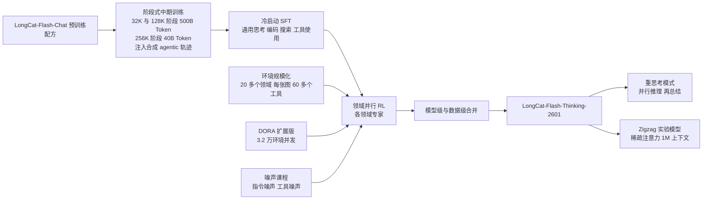
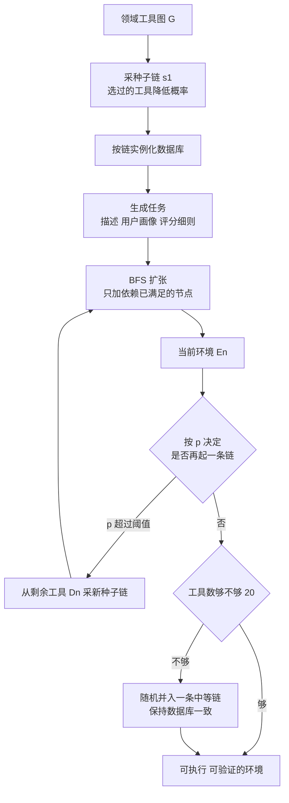
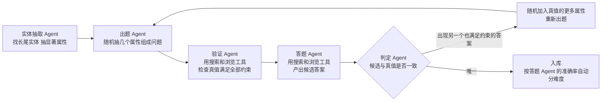
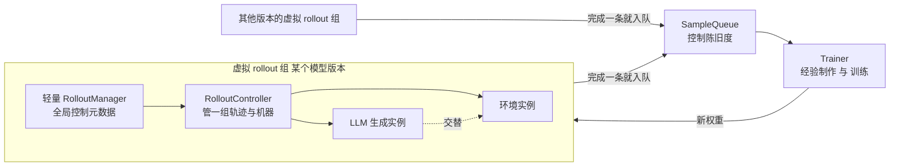
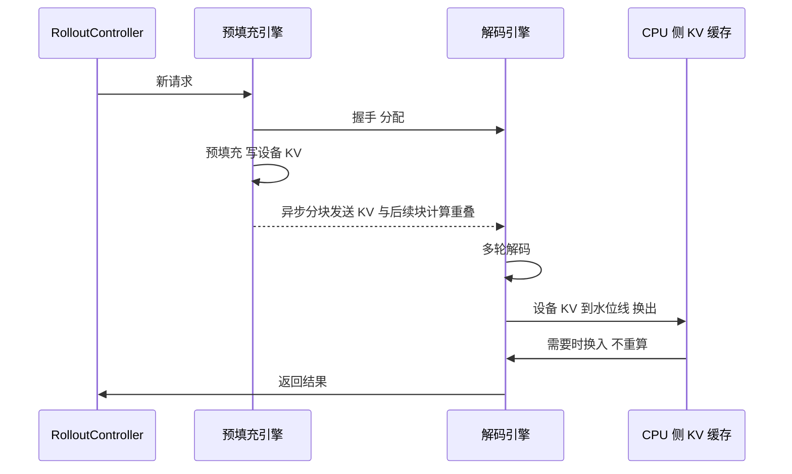
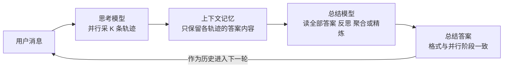
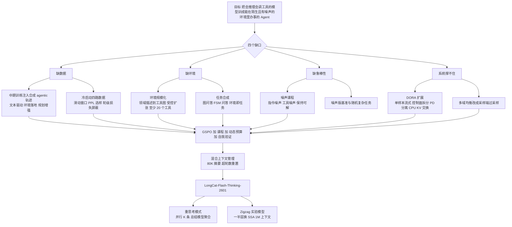

# LongCat-Flash-Thinking-2601：环境不够就自己造上万个，再把真实世界的噪声故意加回去

<!-- release-date: 2026-01-14 -->

> 本文依据美团 LongCat 团队发布的 **LongCat-Flash-Thinking-2601 Technical Report**，即 arXiv:2601.16725v2，2026-02-01 提交的修订版，共 27 页（正文与结论 1–21 页，作者名单与参考文献 22–26 页，附录 27 页）。动笔前已核对 arXiv 官方页：这篇报告只有 v1（2026-01-23）与 v2（2026-02-01）两个版本，本地 PDF 封面标注 v2，就是最新版，不需要替换。页码均指 PDF 本身的页码；原件的印刷页码与 PDF 页码一致，不用换算。它是 [LongCat-Flash-Thinking 解读](/reports/Meituan/LongCat-Flash-Thinking) 那份报告的续作，本文只讲这一版新增和改变的内容；凡引用前作的地方都注明「前作报告 PDF p.N」。文中会把「报告明确写了什么」「我们如何理解它」「哪些是外部资料补充」三层分开。

## 阅读前先搭一张最小地图

这份报告讲的是**怎样把一个已经会长篇推理、会调工具的模型，训练成能在陌生环境里、在工具会出错的条件下把事情办完的模型**。它没有新的模型结构（除了最后附带的一个实验性注意力），几乎全部篇幅都在讲三件事：环境从哪里来、强化学习怎么在成千上万个环境上跑起来、推理时怎么再多花一点算力。先认识几个概念：

- **Agentic 推理（agentic reasoning）**：报告的定义是「通过与外部环境的自适应交互来解决复杂问题的能力」（PDF p.2）。模型不只在脑子里想，还要决定什么时候调用哪个工具，把工具返回的结果接进推理里继续想。
- **环境（environment）与工具依赖图（tool dependency graph）**：一个环境由一组工具和它们背后的数据库状态组成。工具之间有依赖：比如「删除文件」要先有「文件存在」；把工具当节点、把参数依赖当边，就得到一张有向图。本报告的核心动作是**批量生产这种图和它背后的数据库**。
- **轨迹（trajectory）与多轮 rollout**：Agent 解一道题会经历很多轮「模型输出 → 工具执行 → 模型再输出」。一整条记录叫轨迹；强化学习里让模型自己生成轨迹这一步叫 rollout。多轮 rollout 的耗时由模型生成和环境执行两部分交替组成，两部分都会拖长尾。
- **上下文窗口与上下文管理**：工具返回的内容会一轮轮堆进上下文，几十轮之后就会撑爆窗口。上下文管理是决定「留什么、扔什么、什么时候扔」的规则。
- **异步 RL 与陈旧度（staleness）**：生成和训练各自跑、不互相等，代价是训练用到的样本可能来自几个版本之前的策略。前作把这套系统叫 DORA，本站 [LongCat-Flash-Thinking 解读](/reports/Meituan/LongCat-Flash-Thinking) 从头讲过，本文只讲这一版给它加了什么。
- **pass@k 与 Avg@k**：pass@k 是「采 $k$ 次至少一次答对」的概率，衡量能力上限；Avg@k 是 $k$ 次采样的平均正确率，衡量稳定发挥。报告的主表几乎全用 Avg@k。
- **测试时扩展（Test-Time Scaling，TTS）**：推理时多花算力换更好的答案。沿「深度」扩展是把一条思维链写得更长；沿「宽度」扩展是并行采多条再选。
- **用户模拟器（user simulator）**：τ²-Bench 这类评测里，扮演用户和 Agent 对话的另一个大模型。它的行为会直接影响分数，本报告为此换掉了默认模拟器。

这份报告最常出现的几个名字是：

- **环境规模化（Environment Scaling）**：从一句领域描述出发，自动生成工具、数据库、测试和依赖图，再从图上采样、扩张出成千上万个可执行、可验证的环境。
- **DORA 扩展版**：前作的异步 rollout 系统，这一版改成生产者—消费者结构、按单样本流式、支持 3.2 万个环境并发，并给 560B 模型加了预填充—解码分离与 CPU 侧 KV 缓存交换。
- **GSPO（Group Sequence Policy Optimization，组序列策略优化）**：这一版的 RL 目标函数，重要性比在整条序列上算，而不是逐 Token 算；前作用的是改造过的 GRPO。
- **混合上下文管理（hybrid context management）**：超过 80K Token 就把历史工具结果压成摘要，超过最大轮数就整段丢掉重来。
- **鲁棒 RL（Robust RL）与噪声注入**：把「用户说话含糊」和「工具会出错」两类真实世界噪声按课程加进训练环境。
- **重思考模式（Heavy Thinking Mode）**：并行采多条推理轨迹，再用一个「总结模型」读完所有轨迹给出最终答案；总结能力单独用一段 RL 训练。
- **Zigzag Attention**：报告最后附带的实验性稀疏注意力，把大约一半的全注意力层换成滑动窗口加前缀锚点，作为一个独立 checkpoint 发布。

## 一句话先说清

LongCat-Flash-Thinking-2601 是 LongCat-Flash-Thinking 的升级版，560B 总参数、平均每 Token 激活 27B（PDF p.2）。报告自己列的三项贡献是（PDF p.2–3）：

1. **环境规模化与多域环境训练**：一套可扩展的环境构建与任务生成框架，产出大批高质量、可执行、可验证的 Agent 环境；再把异步 RL 基础设施扩展到能在这些环境上稳定训练。
2. **噪声环境下的鲁棒训练**：系统分析真实环境的噪声来源，自动把多类型、多强度的噪声注入训练环境，用课程式 RL 逐步加大噪声。
3. **重思考模式**：通过并行探索多条轨迹加迭代式精炼，同时扩展推理的宽度与深度。

报告给出的代表性数字是 BrowseComp 73.1、τ²-Bench 88.2、VitaBench 29.3（PDF p.2、18）。如果只记一句话，可以记：

> **Agent 的泛化能力来自见过足够多、足够不一样的环境。环境不够就自己造，造的时候把「可验证」当成第一约束；训练时再把真实世界的噪声加回去，别让模型只见过干净的世界。**

这份报告最有价值的地方，是它把「造环境」这件事写到了可以照着做的粒度：怎么从领域描述生成工具和数据库、扩张图的时候为什么会把奖励信号弄坏、怎么避免。

## 它与前作的关系：哪些沿用，哪些是新的

这一版**没有**重讲基座和前作已经讲过的机制，读者需要先知道哪些东西是继承来的。基座仍是 LongCat-Flash 的 560B MoE，靠零计算专家让平均激活停在 27B 左右，机制见本站 [LongCat-Flash 解读](/reports/Meituan/LongCat-Flash)。下表把两份报告对齐（前作页码来自前作报告 PDF）：

| 环节 | 前作 LongCat-Flash-Thinking | 本报告 LongCat-Flash-Thinking-2601 |
|---|---|---|
| 预训练 | LongCat-Flash-Base（前作报告 PDF p.2） | 沿用 LongCat-Flash-Chat 的预训练配方与数据分布（PDF p.2–3） |
| 中期训练 | 注入推理密集课程，小模型上 AIME-24 pass@1 提升 27.7（前作报告 PDF p.4） | 阶段式长上下文中期训练：32K/128K 阶段 500B Token、256K 阶段 40B Token；注入合成的结构化 agentic 轨迹（PDF p.3） |
| 冷启动 SFT | 通用推理、形式化推理、Agentic 推理三路（前作报告 PDF p.3–7） | 通用思考、Agentic 编码、Agentic 搜索、Agentic 工具使用四路，全部围绕 RL 阶段要做的任务准备（PDF p.7–8） |
| RL 目标函数 | 改造过的 GRPO：去 KL、Token 级常数分母、三段裁剪、截断重要性采样（前作报告 PDF p.10） | GSPO，序列级重要性比（PDF p.11–12） |
| RL 系统 | DORA：独立生成组加弹性角色组，多版本流式 rollout（前作报告 PDF p.8） | DORA 扩展：生产者—消费者控制面、单样本粒度流式、3.2 万环境并发、预填充—解码分离加 CPU KV 交换（PDF p.9–11） |
| 领域并行与融合 | STEM、代码、Agent 三个专家分别训，任务向量归一化、丢弃、擦除后融合（前作报告 PDF p.12–13） | 沿用「专家分别训、再做模型级与数据级合并」（PDF p.4），这一版的专家分组与融合细节未重述 |
| 新增部分 | 形式化证明流水线、GenRM 奖励（前作报告 PDF p.5–6、11） | 环境规模化（PDF p.5–7）、RL 任务集合成（PDF p.8–9）、上下文管理（PDF p.13）、多域环境训练与噪声课程（PDF p.14–16）、重思考（PDF p.16–17）、Zigzag Attention（PDF p.20–21） |
| 评测重心 | 数学、代码、形式化证明、安全（前作报告 PDF p.14） | Agentic 搜索、Agentic 工具使用、带工具的数学，另加两个噪声版基准与一个随机复杂任务协议（PDF p.17–19） |

这张表也说明了本文的取舍：**前作已经讲透的 DORA 三阶段、GRPO 改造与融合三步，本文不再复述；只讲这一版改了哪里、为什么改。**

## 先看全景：从预训练到重思考

根据 PDF p.2–4 正文重画的整体流水线（机制示意，不含实测时长）：

报告把 RL 阶段的要求拆成三条（PDF p.4）：一是准备工作，包括可扩展的环境、高质量冷启动数据和校准过的任务集；二是能撑住高吞吐、异步、长尾多轮 rollout 的基础设施；三是在异构领域和不同难度上都稳定的训练策略。后面的章节就按这三条走。

## 第一层问题：训练一个 Agent，缺的是什么

报告在引言里把问题说得很直接（PDF p.2）：推理模型在数学和编程上已经逼近人类专家，下一步是把这种能力用到真实任务上；而当模型内部的推理能力接近极限时，**与外部环境交互**成了继续进步的主要途径。但 Agent 任务有三个特征——长程轨迹、异构环境、长尾的交互动态——每一个都在给现有的训练流程出难题。把报告各节的动机汇总起来，缺的东西有四样：

1. **缺数据**。真实语料里几乎全是自然语言，主动调工具的多轮轨迹极其稀缺；一个没见过这种模式的模型进了 RL 阶段会「探索得很低效」（PDF p.2–3）。
2. **缺环境**。传统推理是「无环境」的，纯粹在语言空间里完成；Agent 的环境决定了它能感知什么、能做什么。搜索和工具使用这两类任务，现成的高质量环境和任务「稀缺或根本不存在」（PDF p.5、8）。
3. **缺鲁棒性**。现有 Agent 模型都在精心整理的指令和稳定可控的环境里训练，一到没见过的或有缺陷的环境里就大幅退化（PDF p.15）。
4. **系统撑不住**。多轮 rollout 里模型生成、环境执行、奖励评估交替进行，轨迹既长尾又带不可预测的环境延迟；生产集群还是显存只有约 60GB 的中端加速器（PDF p.9）。

前三样是「训练材料」的问题，第四样是「训练机器」的问题。报告的解法也分成这两条线：材料靠合成，机器靠改 DORA。

## 中期训练：先让模型见过 Agent 是怎么做事的

### 矛盾：RL 探索需要起点，但语料里没有起点

报告的判断是：没有一个「已经具备基本 agentic 行为」的模型，大规模 RL 通常既低效又不稳定；所以选择在中期训练就让模型接触「中等规模」的 agentic 数据（PDF p.3）。这一步同时要解决 Agent 任务对长上下文的要求，于是中期训练按上下文长度分阶段推进：**32K 与 128K 两个阶段共 500B Token，256K 阶段再加 40B Token**（PDF p.3）。中期训练的超参数不是靠网格搜索，而是用附录 A 的方法从任意预训练 checkpoint 预测出来的，后面单独讲。

### 两条合成来源：从文本里挖，从环境里跑

报告构建了一套「混合数据合成框架」，两条来源互补（PDF p.3）：**文本驱动**提供广泛的语义与任务多样性，**环境落地**保证逻辑一致与可执行。

**文本驱动合成**（PDF p.3）。大规模文本里藏着大量隐式的过程性知识——教程、操作说明、多步骤解题——报告把它们挖出来重构成显式的 Agent 交互轨迹。流水线两步：

1. **文本过滤与工具抽取**：找出含有丰富多步工作流的文本段，从中定义「潜在函数」，抽取对应的函数调用列表，把隐式过程转成显式的工具 schema；
2. **合成与精炼**：把抽象工作流和原始文本翻译成具体的多轮用户—Agent 交互；再做「agentic 模式多样性增强」和严格的质量过滤。

这条流水线出自同团队的另一篇论文（Xu 等，2026，外部核实见文末）。在此之上，报告再做两种「分解式」增强来提高结构复杂度（PDF p.3–4）：

- **工具分解**：从简单的工具调用轨迹出发，迭代地把工具参数的一部分「藏进环境里」，再合成模型去取回这些参数的交互，逐步堆出更复杂的轨迹；
- **推理分解**：对模型输出的每一个动作步，生成多个备选动作替换原动作，再合成模型「从备选里选出最合适的一个」的推理步，把线性轨迹变成多步决策过程。

**环境落地合成**（PDF p.4）。为已收集的工具集实现轻量的 Python 环境，显式建模工具之间的逻辑依赖：节点是工具，边是参数依赖，得到一张有向图。从图上采样合法的执行路径，再**反向合成**与这条路径对齐的用户模拟器系统提示词；每条轨迹的正确性靠真的执行代码、检查环境数据库的最终状态来验证。这里的「反向」值得注意：不是先写任务再找工具链，而是先定工具链、再反推出一个需要这条链的用户。

**面向规划的增强**（PDF p.4）。报告认为规划能力——怎么分解目标、探索备选、承诺中间决策——是 Agent 推理的核心，但现有数据里几乎没有。两类数据：第一类合成「有效的问题分解轨迹」配上正确的初始动作选择，监督从粗到细的规划和早期决策；第二类从完整轨迹出发，在每个决策步生成多个备选，训练模型在备选间推理和选择。第二类与上面的「推理分解」在做法上高度相似，报告没有说明两者的区别，我们理解为同一思路分别用在文本驱动数据和完整轨迹上。

### 证据：pass@k 曲线整体上移

报告用 τ²-Bench 三个子集上的 pass@k 对比「旧中期训练配方」与「agentic 增强配方」（PDF p.3–4，Figure 2）。从图上读（$k$ 从 1 到 32，数值为近似）：

| 子集 | 旧配方 pass@1 → pass@32 | 增强配方 pass@1 → pass@32 |
|---|---|---|
| Airline | 约 0.42 → 0.86 | 约 0.58 → 0.88 |
| Retail | 约 0.25 → 0.95 | 约 0.51 → 0.97 |
| Telecom | 约 0.05 → 0.56 | 约 0.19 → 0.71 |

三条曲线在每个 $k$ 上都在旧配方之上；差距在小 $k$ 最大，到 $k=32$ 时 Airline 与 Retail 几乎追平，Telecom 仍差约 15 个点（读自 PDF p.4 Figure 2）。报告的解读是「agentic 能力边界更宽」（PDF p.3）。按前作解读里讲过的「RL 主要是把基座能采到的正确解采得更频繁」这条线索，小 $k$ 的提升意味着 RL 的起点更好，大 $k$ 的提升意味着上限被推出去了——Telecom 上大 $k$ 也拉开差距，说明这个子集上旧配方的模型有些任务根本采不到正确解。这是我们的解读，报告只说到「边界更宽」。

### 附录 A：不搜超参数，从 checkpoint 预测超参数

中期训练是在已有 checkpoint 上继续训，超参数搜索空间大、算力贵。报告的方法分两步（PDF p.27）：

1. **超参映射**：训练一批小模型，用验证损失与 FLOPS 把「最优超参数」映射到「算力」上，得到最优 batch size 与学习率随算力变化的幂律曲线（Figure 14：MoE-100M 与 MoE-1.8B 实测，MoE-3B 与 MoE-6B 验证，再外推到 MoE-26B）；
2. **超参预测**：对一个给定的继续训练 checkpoint，用它的验证损失估计「等价算力」——也就是在继续训练的数据上从头训到同样损失需要多少算力——再结合实际的训练负载，从曲线上读出最优超参数。

从 Figure 14 上读，最优 batch size 的横轴范围是 2000–8000，最优学习率的横轴范围是 $5\times10^{-5}$ 到 $10^{-3}$；每个点对应的 FLOPS 以对数刻度画在纵轴（读自 PDF p.27 Figure 14，图上没有标出各点的具体数值，本文不再细读）。这里的关键思想是**把「已经训了多久」折算成「相当于从头训了多少算力」**，让预训练的 scaling law 也能用在继续训练上。26B 是预测目标，报告没有说它对应哪个实际模型；本文不做猜测。

### 边界

合成轨迹的数量、两条来源的配比、agentic 数据在中期训练里占多少、Figure 2 用的是多大的模型，报告都未公开。附录 A 只给了方法和曲线，没有给预测出来的超参数值。

## 核心设计一：环境规模化，把「可验证」当第一约束

### 矛盾：泛化要靠多样的环境，但环境多了就验不准

报告对 Agent 泛化的假设很明确：可迁移的工具使用能力应当来自「接触多样的工具集和交互模式」；设计一个能覆盖真实世界全部复杂性的元环境不可行，但一批足够多样的环境可以作为基础（PDF p.5）。难点在于不同领域对交互接口、执行机制和评判标准的要求都不一样，环境不能靠人一个个写。

更隐蔽的矛盾在后面（PDF p.6）：环境一旦变大，工具之间的数据库状态就难以保持一致。往环境里随手加一个工具，可能连锁触发一串没满足的依赖，需要补一大堆辅助工具和数据库；一旦数据库状态不一致，工具调用的结果就不可预测，**明明正确的轨迹会执行失败，被判成错误，RL 就收到了有偏的负奖励**。也就是说，环境复杂度和奖励信号的可靠性天然打架。整个环境规模化流水线的设计目标，就是在扩张复杂度的同时守住可验证性。

### 第一步：从一句领域描述到一张可执行的工具图

流水线全自动（PDF p.5–6，Figure 3）。输入是一段高层的领域定义，比如「文件系统：一个提供结构化方法来存储、组织、检索和管理数据的系统」；输出是一张经过验证的工具依赖图。中间步骤按 Figure 3 依次是：

1. **Schema 生成**：从领域定义合成一组领域专属的工具，把它们的功能抽象成统一的数据库 schema，并给出显式的工具—数据库映射。图中的例子是工具 `delete_file` 带前置条件「文件存在」和后置条件「减少……」，数据库表 `file` 带 `path`、`content` 列和主键；
2. **代码生成**：基于 schema 自动生成数据库实现和工具代码；
3. **验证**：生成的代码要过单元测试，另有一个辅助的调试 Agent 修问题；
4. **依赖分析**：从验证过的工具集构建工具依赖图 $G$。

报告给的成功率是：从 schema 级设计到完全可执行的工具实现，成功率超过 95%（PDF p.6）。用这套流水线造出了覆盖 20 多个领域的工具图集合，每张图包含 60 多个工具，组成稠密的依赖图，并配有可执行的数据库实现（PDF p.6）。

### 第二步：从一张图上长出一个环境

有了图 $G$，环境是这样长出来的（PDF p.6）：

1. **采一条种子工具链** $s_1 \subset G$，规模适中。之前被选过的工具，再次被采到的概率逐步降低，用来保证任务多样性；
2. **按链实例化数据库**：对 $s_1$ 里的每个工具依次构造数据库状态，保证所有依赖都被满足；
3. **生成任务**：任务由三部分组成——任务描述、用户画像、评分细则。为了避免人的先验偏见，任务生成器被限制为「必须用到整条工具链，不做刻意的任务设计」；
4. **校验细则**：评分细则要经过多轮一致性检查，保证任何一条可执行的工具链都会被判为正确、不正确或不完整的轨迹会被稳定地拒绝。

任务难度来自两个互补的来源（PDF p.6）：**交互复杂度**由用户提示词决定——需要多少澄清、规划和多步交互；**环境复杂度**用工具图的结构性质量化——涉及的工具节点数和它们之间的连接密度。

### 第三步：受控扩张，只加「依赖已经满足」的节点

要提高环境复杂度，自然的做法是把 $s_1$ 扩成更大的子图 $R(s_1)$，加入更多工具节点并维护它们的数据库实例；扩完之后环境里可能有多条合法的工具链（PDF p.6）。前面说过盲目加节点会破坏一致性，报告的规则是：从 $s_1$ 出发做 **BFS 式扩张，只有当一个新节点的所有依赖都已经被「数据库状态已完整构造」的工具满足时，才把它加进来**（PDF p.6–7）。

扩张完一条链之后，还要决定要不要再起一条链。记当前环境为 $E_1 = R(s_1)$，剩下没用到的工具为 $D_1 = G \setminus E_1$；可以从 $D_1$ 里再采一条种子链 $s_2$，扩成 $R(s_2)$，环境变成 $E_2 = R(s_1)\cup R(s_2)$。一般地，扩了 $n$ 条链之后（PDF p.7）：

$$
E_n=\bigcup_{i=1}^{n}R(s_i),\qquad D_n=G\setminus E_n
$$

是否再采第 $n+1$ 条种子链，按一个概率决定：

$$
p=f\big(c(E_n),\ g(D_n),\ |D_n|\big)
$$

- $c(E_n)$：当前环境的结构复杂度；
- $g(D_n)$：从剩余工具里找出另一条合法工具链有多难，用「一个强求解器需要尝试多少次才能找到」来度量；
- $|D_n|$：剩余没用的节点数；
- $f(\cdot)$：单调的决策函数。

当 $p$ 超过预设阈值 $\tau$ 时，从 $D_n$ 里初始化一条新的「黄金工具链」$s_{n+1}$ 并扩张（PDF p.7）。报告没有给 $f$ 的具体形式和 $\tau$ 的取值。最后有一道兜底：如果扩出来的 $E_n$ 节点太少，就从 $G$ 里随机再采一条中等规模的链并入，同时保证与现有链的数据库一致；这样每个环境**至少有 20 个工具**（PDF p.7）。

根据 PDF p.6 Figure 4 与 p.6–7 正文重画的扩张过程（机制示意）：

### 代码沙箱：另一类环境

Agentic 编码用的不是工具图，而是可执行的代码沙箱（PDF p.5）。两个挑战：大规模资源调度，以及工具与执行环境的异构。做法是把常用工具——搜索、文件读写、代码编辑、shell 执行——统一成标准化的环境接口；再实现一个高并发的沙箱调度器，异步地创建和回收沙箱实例、把任务分发到工作节点、并行执行数千个沙箱，把环境启动和阻塞开销从训练的关键路径上拿掉。沙箱的具体实现、隔离方式和规模，报告未展开。

### 收益、代价与可迁移启发

收益要到后面的训练曲线里看：Figure 9 显示只用这些合成环境训练，τ²-Bench 和 VitaBench 这些外部基准同步上涨（PDF p.15），这是「合成环境能泛化到真实基准」的直接证据。

代价与边界：

- 20 多个领域的名单、总环境数（摘要说「超过 10,000 个」，正文说「数万个」，PDF p.1、14）、每个环境平均多少工具、多少条链，报告没有给出明细；
- 「强求解器」是哪个模型、评分细则的一致性检查怎么做、任务生成器用什么模型，未公开；
- 整条流水线依赖大模型生成代码和 schema，95% 的成功率是「能执行」，不等于「语义正确」；语义层面的错误只能靠后面的评分细则一致性检查兜住。

可迁移的原则有三条：

- **扩张环境时，可验证性优先于复杂度**。加节点前先问依赖是否已满足；一个验不准的复杂环境比一个验得准的简单环境更伤 RL，因为它制造的是有偏的负奖励，而不是噪声。
- **任务从工具链反推，而不是从任务找工具**。这保证每个任务至少有一条可执行解，也让「解对没解对」可以用数据库终态判定。
- **用采样概率衰减做多样性**，比事后去重便宜，而且天然把覆盖面推向没用过的工具。

## 冷启动：为 RL 准备一个「会探索」的起点

### 目标不是刷分，是让后面的探索有效

报告把冷启动的定位说得很清楚（PDF p.7）：它的首要目标不是在标准基准上立刻涨分，而是让模型具备**多样的推理模式**和**稳定的交互格式**，这样 RL 阶段才能高效探索，同时不丢通用思考能力。所以冷启动模型的评价方式也变了：一看它在 RL 阶段要做的那些具体任务上熟不熟练，二看推理路径的多样性——这一条靠人工定性检查。标准基准上的 pass@k 只当参考，不是优化目标。

数据来源分两种情况（PDF p.7）：数学、通用编码、Agentic 编码这些领域有大规模真实数据，核心工作是严格的质量控制和可执行性验证；搜索和工具使用这些领域几乎没有高质量的真实轨迹，只能靠合成。

### 通用思考数据：用「最难的那一段」而不是「平均难度」选样本

这是冷启动里最有方法论价值的一段（PDF p.7）。要从大规模语料里挑一个高质量子集，报告用 **K-Center-Greedy（KCG）选样**配合**困惑度（Perplexity，PPL）**。KCG 是一种覆盖式选样：每次挑离已选集合最远的样本，保证选出来的子集覆盖原分布。PPL 衡量模型对一段文本有多「意外」，越高说明模型越不会。

问题出在怎么算 PPL。现有做法要么忽略序列长度，要么对整条序列求平均——平均会把局部的「难 Token」冲淡，一条大部分很简单、只有一小段很难的样本会被当成简单样本扔掉。报告的做法是**滑动窗口 PPL**：在序列上滑一个 512 Token 的窗口，算每个窗口内的平均 PPL，取所有窗口里的最大值。它捕捉的是「模型不确定性的峰值」，不被全局平均稀释。然后在 KCG 选样时，把候选样本到已选集合的距离乘上它的滑动窗口 PPL 作为权重。两个目标各管一边：KCG 保覆盖，滑动窗口 PPL 把「暴露模型当前推理缺口」的样本往前排。

结果是从大语料里降采样出 **210K 条**通用思考样本，在这个子集上训的模型在多个推理基准上超过用全量语料训的模型（PDF p.7）。基准名称和具体分数，报告未给。

### 三路 Agentic 数据：各自的质量门

| 领域 | 来源 | 质量控制（PDF p.8） |
|---|---|---|
| Agentic 编码 | 大规模软件开发平台上的真实轨迹，原始数据常有噪声、部分错误或不可复现 | 只留在可复现环境里完全可执行、可验证的；只留「解决了目标问题且没破坏既有功能」的；**动作级过滤**去掉错误、冗余、投机性的操作；为了保留真实调试过程里的长程推理模式，把早期步骤压缩后保留长而迭代的调试轨迹 |
| Agentic 搜索 | 真实搜索日志里几乎没有结构化的推理痕迹，于是合成 | 优先正确性、推理完整性、抗捷径；去掉平凡样本；统一推理与工具格式；**要求轨迹显式验证查询里的每一个条件**，防止靠部分证据「猜中」；同样用压缩早期步骤的办法保留长程探索；后期用 RL 阶段的 rollout 轨迹回填扩大规模 |
| Agentic 工具使用 | 建在环境规模化流水线之上，覆盖 33 个代表性领域，联合定义领域、工具 schema、数据库状态和任务目标 | 在领域覆盖、轨迹结构、交互长度三方面显式提高多样性；每个任务允许多条不同的正确轨迹；用基于评分细则的结果验证加轮级质量控制，只留到达目标终态的轨迹；**轮级损失屏蔽**——失败的工具调用、格式违规这些低质量轮不参与损失计算，但保留在上下文里 |

「压缩早期步骤」出现了两次，值得单独说一句：它解决的是「长轨迹超出训练长度」和「想保留长程模式」之间的矛盾——不是截断，而是把已经过去的步骤压短，让一条几十轮的调试或搜索轨迹能整体装进训练窗口。压缩用什么方法、压到多短，报告未说。「轮级损失屏蔽」则是一个很实用的技巧：一条轨迹里有几步走错了，与其整条扔掉，不如让模型看见错误上下文、但不从错误动作上学。

### 边界

三路数据各自的样本量、33 个领域是哪些、动作级过滤的规则、搜索轨迹用什么模型合成，报告都未公开。通用思考数据的 210K 是唯一的数量。

## RL 任务集：环境决定「能做什么」，任务决定「练什么」

报告把两者分开讲（PDF p.8）：环境定义 Agent 能做什么，任务集定义 Agent 被训练去做什么。好的任务集要既有信息量又难度合适，常规做法是先构造跨领域、跨难度的环境与任务，再按模型的通过率筛掉太简单和太难的。编码领域已有大量复杂任务可以直接收集；搜索和工具使用的任务「稀缺或没有可直接用的形式」，所以要合成。

### 搜索任务：两种难度因子，两条合成流水线

报告把搜索问题的难度归结为两个基本因子（PDF p.8）：一是**沿关系链的多跳推理**，二是**在多个模糊约束下确定单个实体**。大多数复杂搜索任务都是这两者的组合或迭代。两条流水线各对一种：

**基于图的问答合成**（对付多跳，PDF p.8–9）：从 Wikipedia 抽低频实体作种子；从已有实体集合里采样、取它们的页面、把相关实体和关系加进图，直到达到预设规模；再采多个固定大小的连通子图生成问答对。生成问题时让大模型对应子图信息出题，然后**刻意模糊化**数值、实体名、地点、时间这些显式细节，把推理复杂度推到最大。关系抽取、出题、模糊化每一步都用 LLM-as-a-Judge 把关。最后用一个 Agent 去找「还有没有其他也说得通的答案」，只保留原答案正确、且找到的其他候选全部错误的问答对——这一步保证答案唯一。

**基于 Agent 的问答合成**（对付模糊约束，PDF p.9）：多个 Agent 由一个有限状态机（Finite State Machine，FSM）编排。根据 PDF p.9 正文重画（机制示意）：

这里最巧的是**多答案冲突的处理**：如果判定 Agent 发现一个「不是真值但也满足题目全部约束」的答案，说明题目约束不够，系统就随机往题目里加真值实体的更多属性、重新出题，直到答案唯一。答题 Agent 的准确率还顺便给出了自动难度分级。

### 工具使用任务：环境本身就是任务

工具使用的任务集直接来自环境规模化流水线：每个合成出来的环境天然定义了一个独立任务，一批环境就是任务集（PDF p.9）。这与前面「任务从工具链反推」是同一件事的两面。

### 边界

图的规模阈值、子图大小、两条流水线各产出多少题、难度分级的具体阈值，报告未公开。

## 核心设计二：把 DORA 从单轮推理扩到多轮多环境

### 矛盾：多轮 rollout 的长尾不只来自模型

前作的 DORA 解决的是「一批回答等最长的那条」：让先生成完的样本立刻流向下一阶段，用多个旧版本策略同时活着来吸收长尾（前作报告 PDF p.8–9）。到了 Agent 场景，长尾多了一个来源（PDF p.9）：一条轨迹要反复交替「模型生成 → 环境执行 → 奖励评估」，环境执行的延迟不可预测、也是偏斜的。按 batch 组织的话，加速器会在等待一批环境调用返回时空转。再加上硬件约束——生产集群是显存约 60GB 的中端加速器——一个 560B 的 MoE 在多轮长上下文下的 KV 缓存很快就放不下。

于是报告把 DORA 扩展成一套「生产者—消费者」结构（PDF p.9–10，Figure 5）：

- **RolloutManager**：管 rollout 阶段；
- **SampleQueue**：控制样本陈旧度；
- **Trainer**：管经验制作与训练阶段。

三者跑在不同节点上，只负责逻辑控制与协调，通过 RPC 通信；真正干活的是 CPU 或加速器上的 worker。根据 PDF p.9 Figure 5 重画（机制示意）：

### 三处扩展，各对一种瓶颈

**一、完全流式的异步流水线**（PDF p.10）。前作的流式是「样本之间」的：完成一条流走一条。这一版把流式推进到「样本内部」：在 RolloutManager 的 rollout 循环里去掉 batch 屏障，LLM 生成、环境执行、奖励计算都以**单个样本**为粒度在远程 worker 上执行，加速器不再等一批环境调用一起返回。多版本设计沿用：不同版本策略生成的轨迹一完成就入队；一步之内，生成实例继续用多个旧版本 rollout，Trainer 只要条件满足就开始训练，训练设备空闲时还能弹性扩出更多生成实例白赚吞吐。

**二、控制面拆分与「哪台机器闲就去哪台」**（PDF p.10）。算法上需要非常多的环境——**最多 3.2 万个环境同时运行，横跨约 400 台物理机、数千个加速器**。环境之间的密集交互让原来的单个 RolloutManager 成了单机瓶颈：每次交互都要几个 CPU 操作，量一大就堆在一台机器上。两处改动：

- 把原设计拆成一个**轻量 RolloutManager**（只管全局控制元数据）和多个 **RolloutController**（各自以数据并行的方式管理一个「虚拟 rollout 组」的生命周期；一个虚拟组包含若干轨迹和对应的物理机，含生成实例与环境实例）；
- 扩展 PyTorch RPC，提供**感知 CPU 空闲度的远程函数调用与对象实例化**，让环境可以在任意或空闲的机器上实例化和执行。

前作已经给 PyTorch RPC 加过双向流式能力（前作报告 PDF p.9）；这一版加的是「按空闲度选机器」。

**三、预填充—解码分离加 CPU 侧 KV 交换**（PDF p.10–11，Figure 6）。生成 560B MoE 用的是高度专家并行加解码阶段的图级编译（前作报告 PDF p.9 说图编译让 rollout 提速 1.5 倍）。多轮场景带来一个新问题：长上下文的新请求不断进来，一个专家并行组里分到更长上下文的 rank 要消耗不成比例的计算和通信带宽，成为整组的瓶颈。解法是把**预填充节点和解码节点部署到不同的设备组**，解码的执行图不再被新请求的预填充打断。分离带来两笔新开销，报告各给一个对策：

| 新开销 | 对策 |
|---|---|
| KV 缓存要从预填充节点传到解码节点 | 按块（chunk）聚合 KV 缓存、异步传输；前一块的传输与后一块的计算重叠 |
| 解码节点显存放不下 KV 缓存时要重算，在 60GB 的加速器上尤其贵 | **驻留在 CPU 内存里的 KV 缓存**，按需把 KV 块换进换出，消除因显存不足导致的重算 |

Figure 6 的流程是：新请求到来时预填充引擎与解码引擎先握手，然后启动异步分块的 KV 传输；当设备侧 KV 缓存的使用量到达一个水位线，就触发交换，交换可以在预填充和解码两侧并发执行（PDF p.10）。用一条时序图表达（根据 PDF p.10 Figure 6 与图注重画，机制示意）：

### 系统的账：63% 的请求负载率与 2–4 倍

报告给了一个不常见的指标：**请求负载率（request load ratio）约 63%**（PDF p.11）。它的定义在脚注里：一个 0 到 1 之间的连续值，在整个 rollout 期间对所有生成设备聚合；例如最大回答长度设为 64K 时，一台加速器只考虑设备上可用的 KV 块、要避免重算的话大约能容纳 4 个请求，那么只跑 1 个请求就是 25%，一个请求都没有就是 0%——长尾阶段就会出现这种情况（PDF p.11 脚注 1）。这个数字直接量化了长尾请求对生成吞吐的伤害。

没到 100% 的原因报告说得很坦白：为了控制平均陈旧度，他们**限制了分配给旧版本模型的新请求数量**，牺牲了一部分效率。另外一步之内可能做多次负载均衡，他们用两阶段策略：第一次负载均衡之前还没有长尾，允许每台设备跑更多请求（例如 8 个）；之后限制到一个最优值（例如 4 个）以避免重算（PDF p.11）。这个「先多后少」的策略和 KV 缓存容量是绑在一起的：请求一多，KV 块不够就要重算，反而更慢。

最终的结论是：在覆盖不同场景的生产任务上，DORA 比同步训练**快 2 到 4 倍**（PDF p.11）。前作给的是「3 倍以上」（前作报告 PDF p.9）；两个数字对应的场景、规模和同步基线都不同，报告没有解释差异，本文也不把它读成「变慢了」。

### 代价与边界

- 「3.2 万环境、约 400 台物理机、数千加速器」是规模，不是效率；加速器的具体型号、训练时长、总算力，未公开。
- 预填充与解码两组设备的比例、KV 分块大小、CPU 侧缓存的容量与换入换出的延迟，未公开。
- 63% 是全程平均，长尾阶段更低；报告自己也说未来要采用「更乐观的陈旧度控制」和「陈旧度感知的稳定性技术」（PDF p.11），意味着当前的陈旧度上限是偏保守的。
- 这一版没有像前作那样画出陈旧度的示意时间线，多版本的具体淘汰策略沿用前作。

### 可迁移启发

- **流式要推进到样本内部**。多轮 Agent 的每一轮都是一次「生成—执行—评估」，任何一处按 batch 同步都会让另外两处等；单样本粒度的远程调用是根治办法。
- **控制面也会成为瓶颈**。当环境数上万时，每次交互几个 CPU 操作就足以压垮单个管理进程；把全局元数据与组内生命周期分开管，是把控制面做成数据并行。
- **显存小不一定要买大卡**。预填充—解码分离加 CPU 侧 KV 交换，是在 60GB 加速器上跑 560B 模型长上下文 rollout 的具体答案；它用 CPU 内存和传输带宽换显存。
- **把利用率指标定义到硬件约束上**。请求负载率的分母是「这台加速器在不重算的前提下能放几个请求」，这比 GPU 利用率更贴近 RL rollout 的真实瓶颈。

## 核心设计三：训练策略，把有限的 rollout 预算花在刀刃上

报告在 3.3 节开头把训练策略分成三层（PDF p.11）：所有 RL 配方都用的**通用策略**（课程学习、动态预算分配、自我验证），多轮 Agent 场景专用的**上下文管理**，以及在规模化环境上训练时的**多域训练与噪声**。这一节讲前两层里的通用策略，后面两节分别讲上下文管理和多域训练。

### 目标函数换成了 GSPO：从逐 Token 的比值换成整条序列的比值

前作用的是改造过的 GRPO，重要性比逐 Token 算，为了压住 MoE 路由变化带来的异常比值，加了三段裁剪和截断重要性采样（前作报告 PDF p.10）。这一版换成 **GSPO（Group Sequence Policy Optimization，组序列策略优化）**，理由是它在 MoE 模型上的经验效果，以及对长程 Agent 轨迹「序列级优化更稳定」（PDF p.11）。

目标函数是（PDF p.12，式 1）：给定输入 $x$，从旧策略 $\pi_{\theta_{\text{old}}}$ 采一组 $G$ 条轨迹 $\{y_i\}_{i=1}^{G}$，优化

$$
\mathcal J_{\text{GSPO}}(\theta)=\mathbb E_{x\sim\mathcal D,\ \{y_i\}_{i=1}^{G}\sim\pi_{\theta_{\text{old}}}(\cdot\mid x)}\left[\frac{1}{G}\sum_{i=1}^{G}\min\Big(s_i(\theta)\hat A_i,\ \operatorname{clip}\big(s_i(\theta),1-\epsilon,1+\epsilon\big)\hat A_i\Big)\right]
$$

- $s_i(\theta)$：第 $i$ 条**整条序列**的重要性比，报告说它「基于归一化似然在序列级定义」；
- $\hat A_i$：组内相对优势，整条序列一个值；
- $\epsilon$：裁剪阈值，取值未公开。

「归一化似然」的具体形式报告没有写，按 GSPO 原论文的定义（Zheng 等，2025，外部核实见文末）是把序列似然比开 $|y_i|$ 次方根：

$$
s_i(\theta)=\left(\frac{\pi_\theta(y_i\mid x)}{\pi_{\theta_{\text{old}}}(y_i\mid x)}\right)^{1/|y_i|}
=\exp\left(\frac{1}{|y_i|}\sum_{t=1}^{|y_i|}\log\frac{\pi_\theta(y_{i,t}\mid x,y_{i,<t})}{\pi_{\theta_{\text{old}}}(y_{i,t}\mid x,y_{i,<t})}\right)
$$

这是外部补充，不是本报告的原文。它的直觉是：**序列比值是逐 Token 对数比值的平均再取指数**。前作担心的那种 Token——路由一变、单个 Token 的比值大到失控——在这里被 $1/|y_i|$ 摊薄了；一条几千 Token 的轨迹里个别 Token 的异常，对整条序列的比值影响很小。这就是为什么报告说它对 MoE 更稳。代价也来自同一处：裁剪是对整条序列做的，一条轨迹要么整体进梯度、要么整体被裁掉，比 Token 级裁剪粗。这是我们的理解。

报告还说了两条设定（PDF p.12）：主要依赖**面向结果的监督**，并且**放松对长轨迹的惩罚**，让有效的策略在训练中自然涌现。前作那些针对异步漂移的补丁——截断重要性采样、三段裁剪、去 KL——这一版有没有保留，报告没有说；去掉了什么、留下了什么，都不能从文中推出。

### 课程学习：两个轴，而不是一个「难度」

课程沿两个互补的轴组织（PDF p.12）：

1. **任务难度**：用优化前估计的模型通过率量化，通过率越低越难；
2. **能力要求**：按任务主要练的 agentic 能力分类，例如基本工具调用、多步规划、自主决策。

早期优先选「容易学」或「能暴露出后面会被复用的能力」的任务；随训练推进，逐步转向「更难、且需要更高级能力组合」的任务。报告说这让模型先学到可复用的 agentic 技能，再把它们组合起来解更复杂的问题；经验上整体通过率提高，最难的任务上提升最明显。他们归因为三个因素（PDF p.12）：

- **工具使用的泛化**：简单任务上学到的工具选择、约束处理迁移到复杂场景，工具调用失败显著减少；
- **交互效率**：对任务指令理解更好，内部推理更充分，冗余澄清和不必要的工具调用减少，交互轮数下降；
- **规划能力**：对时间、地点、实体等多重约束的联合推理更强，纠错迭代更少。

这三条都是定性观察，报告没有给通过率曲线或消融数字。第二个轴是这一版相对前作的新东西：前作 STEM RL 的课程只沿「通过率阈值」一个轴（前作报告 PDF p.12）。

### 动态预算分配：给「当前学得最多」的任务多采样

固定 rollout 预算下，难度与模型当前能力匹配的任务带来的学习收益明显更高；现有大规模 RL 流水线通常给所有任务同样的 rollout 预算（PDF p.12）。近期有工作探索自适应分配（报告引 Li 等 2025，即 Knapsack RL，外部核实见文末），但多数依赖预定义的价值函数——模型能力在训练中持续变化，「哪些任务最有信息量」也跟着变，预定义的价值函数会失效。

报告的做法是让价值函数跟着训练状态走（PDF p.12，式 2）：用实时训练指标 $m_t$（例如通过率）刻画当前策略 $\pi_{\theta_t}$ 的能力，把任务 $\tau_i$ 和 $m_t$ 一起映射成一个动态价值

$$
v_{i,t}=V(\tau_i\mid\pi_{\theta_t},m_t)
$$

$v_{i,t}$ 表示任务 $\tau_i$ 在时刻 $t$ 的估计价值，刻画模型在任务空间上「不断演化的偏好分布」。有了每个任务的价值，用一个**基于堆的贪心算法**算出 rollout 分配，最大化当前 batch 的总学习价值。$V$ 的具体形式、堆里排的是什么、每个任务的预算上下限，报告都未给出。后面会看到，在异步系统里这一套被换成了一个更简单的近似——按历史通过率设过采样系数（PDF p.14）。

### 自我验证：把「判自己对不对」当辅助任务

报告观察到一个不对称（PDF p.12）：即使是能生成高质量轨迹的先进推理模型，在没有标准答案的情况下也很难可靠地判断这些轨迹对不对。于是显式地增强模型的自我验证能力，并把它当作辅助信号来改进特定领域的推理。

做法是把**在线策略自我验证**做成一个**动态激活的训练阶段**：当生成器出现停滞或收敛到局部最优的迹象时，触发一个验证阶段，让模型评估自己的 rollout 轨迹。相对生成，验证是更容易的任务，通常能拿到更高的奖励。为了不让它变成走捷径，配方里有两条约束：验证要**侧重难样本**；验证的影响要**与对应生成轨迹的质量耦合**，让辅助信号推动生成的真实改进而不是退化行为。报告说它加速了收敛、提高了生成性能（PDF p.12）。

验证的奖励怎么算（有没有标准答案参与）、「停滞」怎么判、验证阶段占多少步，报告未公开。

### 可迁移启发

- **目标函数的粒度要和「异常来自哪里」匹配**。MoE 的路由异常是 Token 级的，把比值提到序列级就把它摊薄了；这比在 Token 级上一层层加裁剪更根本，但也更粗。
- **课程多一个轴**。除了难度，把「练的是哪种能力」作为第二个轴，可以让早期训练刻意积累后面要复用的技能。
- **价值函数要随训练状态更新**。任何「先估价、再分配预算」的做法都要问一句：估价用的是不是训练前的模型。

## 核心设计四：上下文管理，超过 80K 就摘要，超过轮数就重来

### 矛盾：多轮 Agent 的上下文长度不受控

单轮推理的上下文长度只取决于模型自己写多长；多轮 Agent 的上下文里还要塞进每一轮的工具返回。任务越复杂，轮数越多、工具返回越长，总长度「高度可变且常常难以控制」，实践中经常出现窗口溢出、推理链被截断、任务做到一半（PDF p.13）。所以在有限的上下文窗口下做工具使用的 RL，上下文管理是必需品，不是优化项。

### 两种已有策略

报告先列了现有 Agent 模型的两种做法（PDF p.13）：

- **基于摘要的管理**：累计上下文超过某个 Token 阈值时，把历史工具调用结果蒸馏成一段简洁摘要，替换原文以保持连续性。报告基于 ReSum 框架（Wu 等，2025，外部核实见文末），**让模型自己当摘要工具**，并用一系列对比实验确定最优阈值是 **80K Token**（细节在附录 B）。为了提高摘要能力，他们还合成了 **15K 条**高质量摘要样本专门用于冷启动，报告说这带来约 **3%** 的准确率提升。
- **基于丢弃的管理**：上下文超过阈值时，丢掉全部或部分历史，在截断后的上下文上恢复或重启生成。报告沿用 DeepSeek-V3.2 的 **discard-all**（全部丢弃）策略。

### 混合策略：两个触发条件各管一件事

两者合起来（PDF p.13）：**上下文超过 80K Token 时做摘要压缩；交互超过最大轮数时触发 discard-all 重置，用原始问题重新生成系统提示和用户提示，从头开始**。另外还有一个**渐进式丢弃计划**：逐步提高丢弃阈值，让更难的样本能逐渐获得更多推理步数。

两个条件分别针对两种失败：摘要对付的是「上下文太长」，重置对付的是「转了太多轮还没做完」。前者保留了关键推理上下文，后者把陷入死循环的轨迹拉回起点，代价是丢掉全部进度。报告说混合策略的优势正来自「在压缩与重置之间按上下文窗口和轮数约束动态切换」，在关键上下文保留与计算开销之间取得了更好的平衡。

### 证据：Figure 7 与附录 B

三种策略在 BrowseComp 上的对比画在 Figure 7（PDF p.13）：横轴是「真实步数」（Real Steps），纵轴是 Pass@1。报告正文给的数字是**混合策略从 55.8% 起步，峰值 73.1%**。从图上读（近似）：三条曲线都随步数上升；纯摘要（蓝）早期上升最快，但在约 300 步处停在 71 左右；纯丢弃（绿）起点最低，约 54，一直跑到 500 步以上才到 72.5 左右；混合（橙）在约 400 步时达到 73 左右，曲线到此为止（读自 PDF p.13 Figure 7）。报告的结论是混合策略「在多数情况下优于另外两种，且全程效率最高」。这里的「效率」指同样的步数下分数更高。

附录 B 给了摘要阈值的扫描（PDF p.27，Figure 15；最大轮数上限 500）：

| 摘要触发阈值 | 20K | 40K | 60K | 80K | 100K |
|---|---:|---:|---:|---:|---:|
| BrowseComp Pass@1 | 63.86 | 64.22 | 66.46 | 66.58 | 65.9 |

从 20K 到 80K 稳步上升、100K 回落，所以定 80K。注意这组数字（峰值 66.58）低于 Figure 7 的 73.1 和主表的 73.1，说明附录 B 的扫描是在另一个训练阶段或另一套设置下做的；报告没有说明两者的关系，本文不把它们放在一张图上比。

另一个要分清的地方：Figure 7 的横轴是「步数」而不是「Token 数」，上下文管理让模型能用更多步数换分数——报告把这叫「扩展测试时计算」（PDF p.13）。所以 73.1 是一个「允许很多轮、允许摘要和重置」的分数；主表把它和「不做上下文管理」的 56.6 并列（PDF p.18），读者要一起看。

### 边界与启发

最大轮数是多少、渐进式丢弃计划的具体节奏、摘要的提示模板、15K 摘要样本怎么合成，报告未公开。

可迁移的是这个二维触发结构：**用长度触发压缩，用轮数触发重置**。两种失败模式不同，用一个阈值管不住。另外「让模型自己做摘要」意味着摘要能力也要训——15K 冷启动样本带来 3% 就是这项训练的价格和回报。

## 核心设计五：多域环境训练，与异步系统「打架」之后怎么和解

### 矛盾：每个 batch 都要各领域均衡，异步就没法异步了

规模化环境之后，RL 要在跨领域、高度异构的环境上同时训练。报告的期望是多样环境让模型学到「超越领域特定模式」的可迁移行为（PDF p.13–14）。做法是**多域环境训练**：每个训练 batch 里联合优化来自多个领域的任务；环境规模化造出了「覆盖 20 多个领域的数万个环境」（PDF p.14）。

系统层面立刻出问题（PDF p.14）。为了训练稳定，需要所有领域对训练的贡献相当，不能让某个 batch 被少数领域主导。这个约束**破坏了 DORA 的异步原则**：Trainer 可能被迫等待慢的或稀有的长尾领域凑够样本，而快的领域已经堆积了大量 rollout 轨迹，造成调度气泡和设备空转。前作解决长尾的办法是「不等最慢的那条」，多域均衡却要求「等每个领域都到齐」。

### 和解：按领域设过采样比例，按任务设过采样系数

报告的答案是**放松逐 batch 的严格均衡，改成在采样端调比例**（PDF p.14）：

- **按数据类型和领域配置不同的过采样比例**：给更难或吞吐更低的领域更多的 rollout 配额，让它们不阻塞流水线也能贡献足够样本；快的领域按更低的有效比例采样。训练端拿到的数据混合仍然「大致均衡」，报告称仍有收敛保证。
- **按任务设过采样系数**，用来在异步系统里近似前面讲的动态预算分配：每个任务根据历史通过率得到一个过采样系数，通过率越低系数越高；具体做法是把一个任务**复制成多个组**，每组在训练时**独立计算优势**。这在保持 DORA 简单、完全异步调度的前提下，近似实现了动态的 Token 预算控制。

「复制成多个组、各组独立算优势」这一句值得展开。GSPO 的优势是组内相对的（PDF p.12）；一个难任务复制成三组，等于它在 batch 里出现三次、采样次数是别的任务的三倍，但每组还是各自和自己组内的平均比，不会因为组变大而改变优势的尺度。这就是「用复制近似预算分配」的原理，是我们的解读，报告只写了做法。

### 证据一：奖励曲线从 20.75% 涨到 82.78%

Figure 8 是多环境 agentic RL 期间的训练奖励（PDF p.14）。图内文字框给了四个数：初始准确率 **20.75%**，峰值 **82.78%**，绝对提升 **+62.03**，相对提升 **+298.90%**；横轴训练步数到约 1000（读自 PDF p.14 Figure 8）。曲线在约 200 步内从 0.2 附近升到 0.5 附近，之后稳步上升，末段在 0.8 上下波动。报告的解读是「稳定且持续上升，说明算法与基础设施的协同设计保证了大规模训练的稳定性」。这条曲线是训练集上的奖励，不是外部基准。

### 证据二：只用合成环境训练，外部基准同步上涨

Figure 9 更有说服力（PDF p.15）：九个小图画的是**只用合成的通用 agentic 数据做 RL**时，τ²-Bench 三个子集与总分、VitaBench 跨域与三个子域、以及 VitaBench 跨域噪声版随训练步数的变化，横轴到约 1440 步。从图上读（近似）：

| 基准 | 起点 | 终点 |
|---|---:|---:|
| τ²-Bench 总分 | 约 0.64 | 约 0.86 |
| τ²-Bench Telecom | 约 0.55 | 约 0.99 |
| τ²-Bench Retail | 约 0.71 | 约 0.85 |
| τ²-Bench Airline | 约 0.70 | 约 0.735 |
| VitaBench 跨域 | 约 0.10 | 约 0.28 |
| VitaBench 跨域噪声版 | 约 0.06 | 约 0.20 |

（读自 PDF p.15 Figure 9；Airline 曲线波动大、上升幅度最小。）训练数据里没有 τ²-Bench 和 VitaBench 的任务，分数却跟着涨，这是「合成环境上学到的东西能迁移到真实基准」的直接证据，也是整个环境规模化最关键的实验支撑。报告另说多域训练在各环境上的平均任务完成率更高，最难的环境上提升尤其显著，并且在随机生成的环境上表现很强（PDF p.15）——后两条没有给数字。

## 核心设计六：鲁棒 RL，把噪声加回去

**矛盾**（PDF p.15）：现有 Agent 模型一到没见过的或有缺陷的环境就显著退化，根源是训练范式的一个默认假设——用精心整理的指令、在稳定可控的环境里训练。真实世界不是这样：用户的交互风格多样、行为不可预测；工具会失败、返回带噪声的输出、给出不完整的结果。与其假设理想环境再指望模型事后适应，不如在训练时就把缺陷放进去。

**两类噪声**（PDF p.16）：

- **指令噪声**：刻画用户交互模式里的歧义和多变；
- **工具噪声**：模拟执行失败、不一致的响应、外部工具的部分结果。

一条硬约束：注入的缺陷**不能让任务变得不可解**，只能增加交互过程的难度和随机性；否则奖励信号本身就不可靠了（PDF p.16）。这条约束和环境规模化里「扩张不能破坏可验证性」是同一个原则。

**课程**（PDF p.16）：噪声按课程逐步引入。鲁棒性被定义为**同一任务在完美环境与不完美环境之间的性能差距**；从轻微扰动开始，当模型在当前噪声水平上表现出足够的鲁棒性时，再提高噪声的难度和多样性。报告说这让训练「保持有信息量而不是被淹没」，避免在过度嘈杂的区域低效探索。

**证据：Table 1**（PDF p.15）。三个模型——冷启动、不加噪声训练、加噪声训练——在两个基准及其噪声版上的 Avg@4：

| 数据集 | 冷启动 | 不加噪声训练 | 加噪声训练 |
|---|---:|---:|---:|
| VitaBench | 10.0 | 28.6 | 29.3 |
| VitaBench-Noise | 6.3 | 13.3 | 20.5 |
| τ²-Bench | 78.8 | 87.1 | 88.2 |
| τ²-Bench-Noise | 58.8 | 62.2 | 67.1 |

三点读法：

1. **加噪声没有伤害干净环境的分数**：VitaBench 28.6 → 29.3，τ²-Bench 87.1 → 88.2，报告的措辞是「相当甚至略好」；
2. **噪声版上的提升是主要收益**：VitaBench-Noise 13.3 → 20.5（+7.2），τ²-Bench-Noise 62.2 → 67.1（+4.9）；
3. **不加噪声的 RL 在噪声版上也有提升但很有限**：VitaBench-Noise 只从 6.3 到 13.3，而干净版从 10.0 涨到 28.6——RL 学到的能力大部分没有自动转化为对噪声的鲁棒性，这正是要显式加噪声的理由。

一个附带观察：冷启动模型的 τ²-Bench 已经是 78.8，高于前作最终模型的 74.0（前作报告 PDF p.14）。但两份报告的评测口径不同——这一版换了用户模拟器、修了 Airline 子集（PDF p.18）——所以不能直接读成「冷启动就超过了前作」。

### 边界

- 20 多个领域的过采样比例、任务过采样系数与通过率的映射、复制的组数，未公开；
- 噪声的具体类型清单、强度等级、课程推进的判据阈值，未公开；报告说会开源噪声注入流水线（PDF p.19）；
- Table 1 的三个模型是否用了相同的训练步数，未说明；「不加噪声训练」与「加噪声训练」是否只差噪声这一个变量，报告称之为消融，但没有写明控制了什么。

### 可迁移启发

- **均衡可以在采样端做，不必在 batch 端做**。逐 batch 的硬约束会让异步系统退化成同步；把约束换成采样比例，期望上仍均衡，但不阻塞。
- **复制任务是最便宜的预算分配**。不改优化器、不改调度，只改数据里每个任务出现几次。
- **鲁棒性要单独测、单独训**。用「干净版减噪声版」定义鲁棒性缺口，既是课程推进的判据，也是评测指标。
- **噪声必须保持可解**。不可解的噪声制造的是有偏奖励，与环境扩张时的数据库不一致是同一种毒。

## 核心设计七：重思考模式，让宽度和深度一起扩

### 矛盾：只加深或只加宽，都有天花板

测试时扩展有两个方向（PDF p.16）：沿**深度**——更长的思维链加自我反思，o1、DeepSeek-R1 一路都是这样；沿**宽度**——自一致性（self-consistency，多采几条取多数）和蒙特卡洛树搜索这类方法，并行探索多条轨迹去逼近模型的推理边界。近期几个前沿模型推出了「重思考」模式，同时扩深度和宽度，经验上优于只扩一个方向；但它们的实现细节「基本没有公开」，难以复现和系统研究。报告的定位是给出一个「简单有效」的版本。

### 两个阶段加一个记忆

框架把测试时计算拆成两个互补阶段（PDF p.16，Figure 10）：

1. **并行推理**：让思考模型并行生成，产出多条候选推理轨迹，扩展探索的宽度；
2. **重思考（总结）**：用一个总结模型对这些轨迹做反思式推理，综合它们的中间推理和结果，给出最终决定。

为了支持工具使用和多轮对话，还有一个**上下文记忆模块**存放消息历史（PDF p.16）。每一轮，总结模型收到并行推理阶段的历史消息来感知上下文；一个专门的提示模板把当前轮的并行轨迹按某种排列组织起来——**只保留答案内容，不保留各条轨迹的思考过程**——再让总结模型生成最终回复，目标是聚合或精炼并行阶段得到的答案（PDF p.16–17）。

Figure 10 的例子是一道数学题（求 $n+t$，多条轨迹都算到 149）：思考模型并行跑出若干个 Thinker，各自给出答案；总结模型看到「多数 thinker 采用一致且正确的方法……对与高频答案不一致的答案……」之后给出 $\boxed{149}$（读自 PDF p.16 Figure 10）。它不是简单投票：总结模型要读每条轨迹的解法、判断哪些可信，再决定。

Figure 11 画的是多轮场景下的消息管理（PDF p.17）。用文字复述：

| 轮次 | 并行推理阶段的输入 → 输出 | 重思考阶段的输入 → 输出 |
|---|---|---|
| 第 1 轮 | 系统提示 + 用户消息 1 → K 条（思考 1-k，答案 1-k） | 系统提示 + 用户消息 1 + 答案 1-1 … 1-K → 总结思考 1，总结答案 1 |
| 第 2 轮 | 系统提示 + 用户消息 1 + **总结答案 1** + 用户消息 2 → K 条（思考 2-k，答案 2-k） | 系统提示 + 用户消息 1 + 总结答案 1 + 用户消息 2 + 答案 2-1 … 2-K → 总结思考 2，总结答案 2 |
| 第 3 轮 | 历史里只带各轮的总结答案，再加用户消息 3 → … | … |

要点是：**进入下一轮历史的只有总结答案**，并行轨迹的思考过程和各自的答案都不带走。为此报告约束了总结模型的最终输出，使其风格和格式与并行推理阶段一致，这样总结的回复才能直接拼进消息历史（PDF p.17）。思考模块与总结模块**可以共享同一套参数，也可以是两个不同的模型**（PDF p.17）。

根据 PDF p.16 Figure 10 与 p.17 Figure 11 重画（机制示意）：

### 总结能力单独用 RL 练

报告为总结阶段专门加了一段 RL（PDF p.17）；引言里把它描述为「强化模型聚合和精炼中间推理结果的能力」（PDF p.2）。这一段 RL 的数据、奖励和规模，报告都没有写。经验结论是：重思考在长思维链推理、工具集成推理和完全 agentic 的工具使用场景下都有效；随着测试时算力预算增加，它**持续优于自一致性**，且优势越来越明显（PDF p.17）。这句话没有配数字或曲线，主表里带 ‡ 的那一列是唯一的量化证据。

### 证据：主表里带 ‡ 的数字

Table 2 里同时给了普通模式和重思考模式的分数（PDF p.18）：

| 基准 | 普通模式 | 重思考模式 | 提升 |
|---|---:|---:|---:|
| AIME-25（Avg@16） | 99.6 | 100.0 | +0.4 |
| HMMT-25（Avg@16） | 93.4 | 97.5 | +4.1 |
| IMO-AnswerBench（Avg@4） | 78.6 | 86.8 | +8.2 |
| AMO-Bench EN（Avg@16） | 61.6 | 66.0 | +4.4 |
| AMO-Bench CH（Avg@16） | 56.8 | 67.5 | +10.7 |
| GPQA-Diamond（Avg@16） | 80.5 | 85.2 | +4.7 |

越难的基准提升越大：AIME-25 已接近满分，只剩 0.4 可涨；AMO-Bench 中文版涨了 10.7。报告说重思考让模型在 IMO-AnswerBench 上拿到 86.8 的最高分、在 AMO-Bench 上取得开源最好成绩（PDF p.19）。要注意这一列只在数学和 GPQA 上给出，搜索、工具使用、编码基准没有重思考分数——尽管报告说它在 agentic 场景下也有效。

### 外部补充：并行几条

报告没有写并行推理采多少条轨迹。美团官方新闻稿（2026-01-16，外部补充，链接见文末）的说法是「同时启动 8 个大脑飞速运转」，并称它是「首个完整开源并支持在线免费体验『重思考模式』的模型」；Hugging Face 模型卡（外部补充）补充了两点：并行阶段用「相当高的推理温度」保证多样性，总结阶段精炼过的轨迹可以「递归地送回总结模型」形成迭代循环以加深推理。这些都是产品和模型卡的描述，不是报告正文的结论。

### 代价与边界

- **成本没有账**。$K$ 条轨迹意味着大约 $K$ 倍的生成 Token；报告在 Zigzag 一节承认「重思考模式下多条并行轨迹同时解码，推理延迟被进一步放大」（PDF p.20），但没有给出重思考相对普通模式的 Token 或延迟倍数。
- **与自一致性的对比没有数字**，只有一句定性结论。
- 总结模型的提示模板、「排列」怎么组织、总结阶段 RL 的奖励，未公开。
- 是否与前作的「用工具省 Token」路线冲突（前作靠工具把 AIME-25 的平均 Token 从 19,653 降到 6,965，前作报告 PDF p.16），报告未讨论；两者作用在不同的维度上，一个省单条轨迹的长度，一个加轨迹的条数。

### 可迁移启发

- **宽度扩展的瓶颈在聚合，不在采样**。多采几条很容易，难的是怎么从多条里选；把「选」做成一个可训练的总结任务，比投票多了判断解法的能力。
- **进入历史的只带结论**。多轮场景下，并行轨迹的中间思考不进上下文，否则 $K$ 条轨迹会把窗口撑爆。
- **总结与生成可以同一个模型**，这意味着不用额外维护一个裁判模型；但总结能力要单独训。

## 评测：哪些结论有证据，哪些要留问号

### 五类基准与口径

评测覆盖五个方面：数学推理、Agentic 搜索、Agentic 工具使用、通用推理、编码（PDF p.17）。几处影响读数的口径（PDF p.17–19）：

- **数学带工具**：AIME-25、HMMT-25（二月）、IMO-AnswerBench，另加同团队发布的 AMO-Bench（50 道人类专家出的题，中英两版，英文版与评测脚本开源）。IMO-AnswerBench 取 Avg@4，其余取 Avg@16。「工具」指代码执行；外部模型支持代码执行的就开启，不支持的报官方结果或无工具成绩（表中标 ∗）。
- **搜索**：BrowseComp 与 BrowseComp-ZH，同时报「有」和「无」上下文管理的成绩；BrowseComp-ZH 原标注有错，人工修正了 24 条。报告尝试在自己的搜索框架下复现其他模型，结果「一致低于其报告值」，所以外部模型一律用官方数字（表中标 †）。另建 **RWSearch**：200 条真实世界的复杂搜索查询，所有模型都不开上下文管理。
- **工具使用**：τ²-Bench 的默认用户模拟器偶尔行为异常，全部换成 GPT-4.1 并调整提示；Airline 子集修正了 19 个有问题的样例，修正版已公开。VitaBench 把验证器升级到最强的公开版本并采用更严格的判据，更新版已公开。**τ²-Noise 与 Vita-Noise** 用噪声注入流水线对两个基准反复随机注入噪声，报多个噪声实例的平均。**随机复杂任务（Random Complex Tasks）**：每次评测随机采 100 个跨四个以上领域的任务，算 Avg@4，重复三次独立运行取平均。报告说会开源噪声注入流水线，并把随机复杂任务接入一个开放评测平台。
- **通用问答**：GPQA-Diamond 取 Avg@16；HLE 只用纯文本子集，所有模型用官方推荐的提示模板、由官方的 o3-mini 打分模型评分。
- **编码**：LiveCodeBench 取 2408–2505 子集共 454 题、Avg@4；OJBench 与 OIBench 因评测成本高只报 Pass@1；SWE-bench Verified 用第三方框架 R2E-Gym 作执行骨架，并手工修了少量 Docker 镜像的依赖问题以保证所有金标补丁可执行。
- **推理参数**：temperature 1.0，top-k 关闭（−1），top-p 1.0（PDF p.19）。前作是 top-p 0.95（前作报告 PDF p.15）。

三处自建或自改的东西——RWSearch、噪声版基准、随机复杂任务——是这份报告评测的特色，也是最难独立复核的部分。

### 主表

（PDF p.18，Table 2；† 取自外部报告，‡ 为重思考模式，∗ 为无工具成绩；斜线左右分别是「无 / 有」上下文管理；报告用粗体和下划线标第一与开源第一，本表不复制这两种标记）

| 基准 | DeepSeek-V3.2-Thinking | Kimi-K2-Thinking | Qwen3-235B-A22B-Thinking-2507 | GLM-4.7-Thinking | Claude-Opus-4.5-Thinking | Gemini-3-Pro | GPT-5.2-Thinking-xhigh | LongCat-Flash-Thinking-2601 |
|---|---:|---:|---:|---:|---:|---:|---:|---:|
| 总参数 / 激活参数 | 671B / 37B | 1T / 32B | 235B / 22B | 355B / 32B | – | – | – | 560B / 27B |
| AIME-25（Avg@16） | 93.5∗ | 99.1† | 92.6∗ | 95.3∗ | 100.0 | 99.8 | 100.0 | 99.6 / 100.0‡ |
| HMMT-25（Avg@16） | 93.5∗ | 95.1† | 83.9∗ | 98.1∗ | 98.6 | 99.8 | 99.6 | 93.4 / 97.5‡ |
| IMO-AnswerBench（Avg@4） | 77.7∗ | 78.7∗ | 73.0∗ | 84.0∗ | 82.8 | 86.7 | – | 78.6 / 86.8‡ |
| AMO-Bench EN（Avg@16） | 51.9∗ | 56.0∗ | 47.8∗ | 62.4∗ | 66.0 | 72.5 | – | 61.6 / 66.0‡ |
| AMO-Bench CH（Avg@16） | 52.0∗ | 51.8∗ | 28.8∗ | 35.1∗ | 67.7 | 74.9 | – | 56.8 / 67.5‡ |
| BrowseComp（Pass@1） | 51.4† / 67.6† | – / 60.2† | – | 52.0† / 67.5† | – | – | 65.8† / – | 56.6 / 73.1 |
| BrowseComp-zh（Pass@1） | 65.0† / – | – / 62.3† | – | 66.6† / – | – | – | – | 69.0 / 77.7 |
| RW Search（Pass@1） | 74.0 | 63.0 | 20.5 | 69.0 | 75.5 | 74.5 | 82.0 | 79.5 |
| τ²-Retail（Avg@4） | 81.8† | – | 71.9† | – | 88.9† | – | 82.0† | 88.6 |
| τ²-Airline（Avg@4） | 63.8† | – | 58.6† | – | – | – | – | 76.5 |
| τ²-Telecom（Avg@4） | 96.2† | – | 47.3 | – | 98.2† | – | 98.7† | 99.3 |
| τ²-Avg（Avg@4） | 80.6 | 74.3† | 59.3 | 87.4† | 82.4 | 90.7† | 80.6 | 88.2 |
| τ²-Noise（Avg@4） | 64.1 | 63.1 | 44.3 | 66.0 | 59.4 | 57.3 | 65.0 | 67.1 |
| VitaBench（Avg@4） | 24.0 | 12.8 | 14.5 | 18.3 | 28.5 | 31.5 | 24.3 | 29.3 |
| VitaBench-Noise（Avg@4） | 14.0 | 9.2 | 6.5 | 10.8 | 20.3 | 20.8 | 19.0 | 20.5 |
| Random Complex Tasks（Avg@4） | 32.5 | 29.7 | 28.3 | 25.3 | 32.6 | 32.5 | 17.2 | 35.8 |
| HLE 纯文本（无工具） | 24.1 | 24.4 | 17.8 | 26.9 | 32.0 | 40.3 | 34.5† | 25.2 |
| GPQA-Diamond（Avg@16） | 86.9 | 85.4 | 80.5 | 84.9 | 86.9 | 91.9 | 92.9 | 80.5 / 85.2‡ |
| LCB（24.08–25.05，Avg@4） | 82.4 | 75.1 | 76.2 | 84.8 | 82.8 | 88.1 | – | 82.8 |
| OJBench（Pass@1） | 41.8 | 42.3 | 35.6 | 44.6 | 46.7 | 61.2 | – | 42.2 |
| OIBench EN（Pass@1） | 43.3 | 39.0 | 36.8 | 30.8 | 50.0 | 58.2 | – | 47.7 |
| SWE-bench Verified（Avg@5） | 73.1 | 71.3 | – | 73.8 | 80.9 | 76.2 | 80.0 | 70.0 |

### 逐类看：强在哪、弱在哪

报告的自我评价是「在传统推理任务上高度有竞争力，在 agentic 推理能力上有强优势」（PDF p.19）。逐栏对照：

- **Agentic 搜索是最硬的一栏，但要看清比较对象**。开启上下文管理后 BrowseComp 73.1、BrowseComp-zh 77.7，高于同样开启上下文管理的 DeepSeek-V3.2（67.6）和 GLM-4.7（67.5）。但不开上下文管理时是 56.6，低于 GPT-5.2 的 65.8（GPT-5.2 只有无管理的数字）。报告写「超过所有被评测的模型」（PDF p.19），这句话在「有管理」那一列成立，在「无管理」那一列不成立。RWSearch 79.5 仅次于 GPT-5.2 的 82.0，报告自己把它标为「私有基准」（PDF p.19）。
- **Agentic 工具使用：开源第一，总分不是全表第一**。τ²-Avg 88.2 低于 Gemini-3-Pro 的 90.7（取自外部报告）；Airline 76.5 是全表最高，Telecom 99.3 最高，Retail 88.6 略低于 Claude 的 88.9。**噪声版是它最突出的一栏**：τ²-Noise 67.1 全表第一，Claude 与 Gemini 在噪声下分别掉到 59.4 和 57.3，掉幅比它大得多。VitaBench 29.3 低于 Gemini 的 31.5、高于 Claude 的 28.5；VitaBench-Noise 20.5 与 Gemini 20.8、Claude 20.3 在一个点之内。随机复杂任务 35.8 全表第一；这一栏里 GPT-5.2 只有 17.2，远低于其他模型，报告没有解释原因。
- **数学：重思考模式下进入第一梯队**。普通模式的 HMMT-25 93.4 低于三个闭源模型，也低于 Kimi 与 GLM-4.7 的无工具成绩；重思考后 AIME-25 满分、IMO-AnswerBench 86.8 全表最高。AMO-Bench 上重思考模式仍低于 Gemini（EN 72.5、CH 74.9），与 Claude 基本持平（EN 同为 66.0，CH 67.5 对 67.7），报告自己承认「略落后于最强闭源模型」但是开源最好（PDF p.19）。注意四个开源对手全是无工具成绩（∗），这一栏的开源对比不是同一口径。
- **通用问答是弱项**。GPQA-Diamond 普通模式 80.5 与 Qwen3 并列全表最低，重思考的 85.2 仍低于 DeepSeek-V3.2 的 86.9；HLE 25.2 居中，远低于 Gemini 的 40.3。报告的措辞是「接近开源最优」（PDF p.20），从数字看要靠重思考才接近。
- **编码：竞赛题接近，工程题落后**。LCB 82.8 与 Claude 持平、低于 GLM-4.7 的 84.8；OIBench EN 47.7 开源第一。OJBench 42.2 在开源模型里排第三——Kimi-K2 的 42.3 高 0.1、GLM-4.7 的 44.6 更高——报告正文写的「开源第二」（PDF p.20）与它自己的表不符。SWE-bench Verified 70.0 在有数字的七个模型里最低。报告特别指出与 GLM-4.7 相比，在相近成绩下推理成本明显更低：每题约 **45k Token**，GLM-4.7 约 **57k**（PDF p.20）。

所以更准确的说法是：**它在带上下文管理的搜索、带噪声的工具使用、随机新环境上是全表最强；在对话式工具使用总分、VitaBench 上是开源最强、闭源第二；在通用知识问答、软件工程 Agent 上不领先。**

### 与前作对照：进步是真的，但口径变了

把前作 Table 2（前作报告 PDF p.14）与本报告 Table 2 放在一起，能看到这一版的重心（前作数字来自前作报告 PDF p.14）：

| 基准 | 前作 | 本报告 | 口径差异 |
|---|---:|---:|---|
| τ²-Retail | 71.5 | 88.6 | 本报告换 GPT-4.1 模拟器 |
| τ²-Airline | 67.5 | 76.5 | 本报告修正 19 个样例 |
| τ²-Telecom | 83.1 | 99.3 | 同上模拟器差异 |
| VitaBench | 29.5 | 29.3 | 本报告升级验证器并收紧判据，不可直接比 |
| SWE-Bench | 59.4（Pass@1） | 70.0（Verified，Avg@5，R2E-Gym） | 基准子集与框架都不同 |
| LiveCodeBench（24.08–25.05） | 79.4（Mean@4） | 82.8（Avg@4） | 基本可比 |
| OJBench | 40.7 | 42.2 | 基本可比 |
| GPQA-Diamond | 81.5 | 80.5 / 85.2‡ | 基本可比 |
| AIME-25 | 90.6（无工具，Mean@32） | 99.6 / 100.0‡（带工具，Avg@16） | 一个不带工具一个带工具 |

三点判断：τ²-Bench 的大幅提升方向是可信的，但绝对数字受模拟器与修正影响；VitaBench 持平不代表没进步，因为判据变严了；GPQA 略降，说明这一版的重心确实从通用推理挪到了 Agent。

### 一处正文与主表不一致

引言写「77.7% on RWSearch」（PDF p.2），但 Table 2 里 RWSearch 是 79.5，77.7 是 BrowseComp-zh 开启上下文管理的分数（PDF p.18）；摘要和 Figure 1 与主表一致。我们判断引言这一句是笔误，以 Table 2 为准。

### 训练曲线与 Figure 1

PDF p.1 的 Figure 1 是 Table 2 中八项的柱状图汇总（LCB、OIBench EN、AIME-25、IMO-AnswerBench、τ²-Bench、VitaBench、BrowseComp、RW Search），数字与 Table 2 一致，不另含信息。Figure 8 与 Figure 9 前面已经讲过。

## 附带的一件事：Zigzag Attention，把一半的全注意力层换成滑动窗口

### 矛盾：推理轨迹越来越长，全注意力的平方复杂度撑不住，但换架构要重训

报告在第 6 节给了一个「one more thing」（PDF p.20）。动机有两层：推理轨迹越来越长，全注意力的平方复杂度让长上下文的 Agent 训练和推理都太贵；重思考模式下多条轨迹同时解码，延迟被进一步放大。现有的稀疏和线性注意力方法都能降复杂度，但通常要大量重训才能适应新架构，算力和工程成本都高。报告的探索是一种能**在中期训练阶段把现有全注意力模型转成稀疏变体**的机制，转换开销「可忽略」，并支持最长 1M Token；对应的实验模型 **LongCat-Flash-Thinking-ZigZag** 作为独立 checkpoint 开源。

### 机制：局部窗口加前缀锚点，逐层交错

Zigzag Attention 把 MLA（Multi-head Latent Attention，多头潜在注意力）与 **流式稀疏注意力（Streaming Sparse Attention，SSA）** 结合（PDF p.20，引 DuoAttention）。对每个查询 Token $h_t$，注意力只看一个固定的键值集合：最近的一段局部窗口，加上序列开头的一小段初始 Token。写成式子（PDF p.20，式 3）：

$$
u_t=\operatorname{Attn}\big(h_t,\ \{h_s\mid s\in[t-W,\,t]\cup[0,\,B)\}\big)
$$

- $W$：局部窗口大小；
- $B$：保留的前缀 Token 数（「锚点」）；
- $u_t$：位置 $t$ 的注意力输出。

相对全注意力，每个位置只看 $W+B$ 个键值，计算和显存都不再随全长平方增长，同时保住了短期上下文和全局锚点。

**连接方式**（PDF p.20–21）：采用**逐层交错**的稀疏化——大约 50% 的全注意力层换成 SSA 层，其余保持 MLA 全注意力。选层级而不是头级稀疏的理由是：头级稀疏容易造成计算不均衡和 GPU 线程分歧，层级稀疏硬件利用率更高。单个 SSA 层只看局部，但全局信息通过跨层组合保留：稀疏层与全注意力层交替，信息在多层之间沿序列传到远处，形成一条「之」字形的连接路径——名字就是这么来的。

### 集成：先测层的重要性，再换掉最不重要的一半

三步（PDF p.21）：

1. 用一个校准数据集估计预训练模型里各注意力层的相对重要性；
2. 把重要性最低的那一批层替换成 SSA 层；
3. 替换后继续做长上下文中期训练，配合 YaRN 位置编码扩展，把上下文推到 1M Token。

具体参数：块大小 128，1 个 sink 块加 7 个局部块，每层的有效注意力跨度 **1,024 Token**（PDF p.21）。把「大约一半」的全注意力层换成 Zigzag 之后，端到端推理约 **1.5 倍**加速，报告称推理与 agentic 能力「在各基准上得以保持」。

### 证据：Figure 12 与 Figure 13

Figure 12 是生产推理集群上实测的加速比（PDF p.20）：横轴上下文长度从 4K 到 256K。从图上读（近似）：预填充阶段的加速在 4K 时约 1.0，随长度单调上升，256K 时约 1.55 倍；解码阶段 256K 时约 1.45 倍（读自 PDF p.20 Figure 12）。短上下文几乎没有收益，收益全在长上下文——这符合「只省了平方项」的预期。

Figure 13 是性能与相对成本（PDF p.21）：箭头上的百分数是 ZigZag 版相对原版的成本比例。从图上读：

| 基准 | 相对成本 | 原版 → ZigZag 版分数（近似） |
|---|---:|---|
| OJBench | 82% | 42.2 → 约 41.3 |
| AMO-Bench EN | 84% | 61.6 → 约 60.5 |
| GPQA-Diamond | 92% | 80.5 → 约 80.6 |
| BrowseComp | 72% | 56.6 → 约 55.2 |
| BrowseComp-zh | 72% | 69.0 → 约 71.5 |
| τ²-Bench | 83% | 88.2 → 约 87.0 |

（百分数是图上标注的数字，分数读自 PDF p.21 Figure 13 的点位，原版分数与 Table 2 对应项一致。）成本降到 72%–92%，分数变化在 −1.5 到 +2.5 之间；搜索类任务省得最多，因为轨迹最长。

### 边界

- Zigzag Attention 本身有一篇独立论文（Zhang 等，2026，外部核实见文末），报告只给了摘要级描述；层重要性怎么算、校准数据集是什么、中期训练用了多少 Token，都在本报告之外。
- 「约 1.5 倍」是 256K 附近的数字，短上下文没有收益；Figure 13 的成本口径（Token、时间还是算力）报告没有说明。
- ZigZag 版是实验模型，与主模型不是同一个 checkpoint；主表的成绩全部来自主模型。

### 可迁移启发

- **换注意力不一定要重训**：先测层重要性、只换最不重要的一半、再用中期训练修复，是把架构改动的成本压到最低的路径。
- **层级稀疏比头级稀疏更友好硬件**：如果稀疏化的目的是省时间而不是省 FLOPs，先看它会不会制造不均衡的计算。

## 报告没有告诉我们的事

结论一节只重申了三项贡献，没有列限制或未来工作（PDF p.21）；只在 DORA 一节提到未来要做「更乐观的陈旧度控制」（PDF p.11）。下面的边界是我们对照正文归纳的，不是作者自陈。

- **中期训练**：合成 agentic 轨迹的数量、两条合成来源的配比、agentic 数据占中期训练的比例、Figure 2 实验用的模型规模，未公开；附录 A 只给方法与曲线，没有预测出的超参数值。
- **环境规模化**：20 多个领域的名单、环境总数的精确值（摘要「超过 10,000」、正文「数万」）、每个环境的工具数分布、决策函数 $f$ 与阈值 $\tau$、「强求解器」是哪个模型、评分细则一致性检查的具体做法，未公开。
- **冷启动**：除通用思考的 210K 外，三路 agentic 数据的样本量、33 个领域的名单、动作级过滤规则、搜索轨迹的合成模型，未公开。
- **RL 任务集**：两条搜索合成流水线各产出多少题、图规模阈值、子图大小、难度分级阈值，未公开。
- **DORA**：加速器型号、总算力、训练时长、预填充与解码的设备比例、KV 分块大小、CPU 侧缓存容量与换入换出延迟、多版本的淘汰策略（沿用前作但未重述）、「2 到 4 倍」对比的同步基线，未公开；63% 的负载率没有按阶段拆分。
- **训练策略**：GSPO 的 $\epsilon$、分组大小 $G$、各阶段上下文长度、是否保留前作的截断重要性采样与三段裁剪、价值函数 $V$ 的形式、堆贪心的细节、自我验证的奖励与触发判据、课程两个轴的具体标注方式，一个都没有。
- **上下文管理**：最大轮数、渐进式丢弃计划、摘要提示模板、15K 摘要样本的合成方式、附录 B 的扫描与 Figure 7 是什么关系，未说明。
- **多域训练与噪声**：各领域的过采样比例、任务过采样系数的映射、复制的组数、噪声类型清单与强度等级、课程推进的阈值、Table 1 三个模型是否等步数训练，未公开。
- **重思考**：并行轨迹数 $K$、总结提示模板、总结阶段 RL 的数据与奖励、相对普通模式的 Token 与延迟倍数、与自一致性对比的数字，未公开；重思考在搜索与工具使用基准上没有报分数。
- **评测**：RWSearch 是私有基准；噪声版基准与随机复杂任务的流水线报告说会开源，写作时以报告为准；SWE-bench Verified 修改了哪些 Docker 镜像未列出；随机复杂任务里 GPT-5.2 只有 17.2 的原因未讨论。
- **领域并行与融合**：这一版的专家怎么分组、融合用什么方法、「数据级合并」具体指什么，全部只有 PDF p.4 的一句话。
- **Zigzag**：层重要性的计算、校准数据集、中期训练 Token 数、Figure 13 的成本口径，在本报告之外。
- **引言笔误**：「77.7% on RWSearch」与 Table 2 不符。

## 最值得带回自己项目的十条启发

### 1. 环境是可以批量生产的，但要把可验证当第一约束

从领域描述到工具、数据库、测试、依赖图的流水线，95% 的可执行率不是靠人审出来的。扩张环境时只加依赖已满足的节点，是在用一条硬规则守住「正确的轨迹一定能执行成功」。

### 2. 有偏的负奖励比噪声更毒

数据库不一致让正确轨迹失败、噪声注入让任务不可解，两者制造的都是**系统性**的负奖励，RL 会朝着错误方向稳定地学。加环境、加噪声之前，先问「解还在不在」。

### 3. 任务从解反推

工具链先定、任务后生成、用户画像和评分细则一起合成；搜索题从实体图和属性反推问题、再用 Agent 排除多解。所有这些都保证了每道题至少有一条可验证的解。

### 4. 选数据时看「最难的那一段」

滑动窗口 PPL 用 512 Token 窗口内的最大平均困惑度代替全序列平均，避免局部难点被稀释；配合 KCG 保覆盖。这个思路可以直接搬到任何长样本的筛选上。

### 5. 轮级损失屏蔽：让模型看见错误，但不从错误上学

一条多轮轨迹里几步走错，不必整条扔掉；保留上下文、屏蔽损失，既留下了长程模式，又不学坏动作。

### 6. 流式要推进到样本内部，控制面要做成数据并行

多轮 Agent 的每一轮都是「生成—执行—评估」，任何按 batch 的同步都会让另外两处等；上万环境的交互会先压垮单个管理进程，而不是加速器。

### 7. 显存小就分离预填充与解码，再把 KV 缓存挪到 CPU

在 60GB 加速器上跑 560B 模型的长上下文 rollout，靠的是分离两种负载、分块异步传 KV、用 CPU 内存兜底。这套组合不依赖大显存卡。

### 8. 均衡在采样端做，预算用复制近似

逐 batch 的领域均衡会把异步系统拖成同步；改成按领域设过采样比例、按任务通过率设过采样系数、把难任务复制成多组各算优势，既近似了动态预算分配，又不碰调度。

### 9. 上下文管理用两个触发条件

长度触发摘要、轮数触发重置。两种失败模式不同，一个阈值管不住；摘要能力要单独训（15K 样本换 3%）。

### 10. 宽度扩展的关键在聚合

并行采 $K$ 条容易，难的是从中选出答案。把聚合做成可训练的总结任务、只把总结结论带进下一轮历史，是重思考模式与自一致性的区别所在。

## 用一张图重新串起全文

## 关键词回看

- **环境规模化**：领域描述 → 工具与数据库 schema → 代码与测试 → 依赖图 → 采种子链 → BFS 受控扩张 → 至少 20 个工具的可验证环境。
- **受控扩张**：只加依赖已被「数据库状态已构造」的工具满足的节点；再起一条链的概率 $p=f(c(E_n),g(D_n),|D_n|)$。
- **滑动窗口 PPL**：512 Token 窗口内平均困惑度的最大值，作 KCG 选样的距离权重；210K 条通用思考样本。
- **轮级损失屏蔽**：失败的工具调用与格式违规不进损失，但保留在上下文里。
- **图问答与 FSM 问答**：分别对付多跳推理与多约束歧义；后者用「加属性重出题」保证答案唯一。
- **DORA 扩展**：RolloutManager、SampleQueue、Trainer 的生产者—消费者结构；单样本流式；3.2 万环境；请求负载率 63%；2–4 倍。
- **PD 分离与 CPU KV 交换**：预填充与解码分设备组；分块异步传 KV；显存到水位线就换到 CPU。
- **GSPO**：序列级重要性比 $s_i(\theta)$，组内相对优势，序列级裁剪。
- **两轴课程**：任务难度（通过率）与能力要求（工具调用、规划、决策）。
- **动态预算分配**：$v_{i,t}=V(\tau_i\mid\pi_{\theta_t},m_t)$ 加堆贪心；异步下用按通过率的过采样系数与任务复制近似。
- **自我验证**：生成停滞时触发，模型评估自己的轨迹，侧重难样本、与生成质量耦合。
- **混合上下文管理**：80K 触发摘要（模型自己做），超最大轮数触发 discard-all；BrowseComp 55.8 → 73.1。
- **鲁棒 RL**：指令噪声与工具噪声，保持可解，按「干净减噪声」的鲁棒性缺口推进课程；τ²-Noise 62.2 → 67.1。
- **重思考**：并行推理 + 总结模型 + 上下文记忆；总结单独 RL；IMO-AnswerBench 78.6 → 86.8。
- **Zigzag Attention**：约一半层换成局部窗口加前缀锚点的 SSA，块 128、1 sink + 7 局部 = 1,024 跨度；约 1.5 倍。

## 最后的判断

这份报告最有价值的地方不是主表，而是它把「Agent 训练的原材料从哪里来」写到了可以照着做的粒度：环境怎么从一句话长出来，扩张的时候奖励信号为什么会坏、怎么防；搜索题怎么从实体图和属性反推、怎么排除多解；多轮 rollout 怎么在 60GB 的卡上跑、多域均衡怎么和异步和解。每一处都有一条明确的规则，而不是一句「我们构建了高质量数据」。

它的证据也分得清楚：合成环境上训练、外部基准同步上涨（Figure 9）是硬的；噪声训练在噪声版基准上的提升（Table 1）是硬的；带上下文管理的搜索和带噪声的工具使用是全表最强。通用问答和软件工程 Agent 上它不领先，报告的措辞基本诚实。真正缺的是账：环境总数没有精确值，RL 超参一个没有，重思考没有成本，2–4 倍没有分母。

如果只记一句话，可以记：

> **Agent 的泛化来自环境的多样性，环境的价值取决于它能不能验证；先把「可验证」守住，再把复杂度和噪声一点点加上去。**

## 资料与阅读边界

- 原始依据：本地 `papers/Meituan/LongCat-Flash-Thinking-2601.pdf`，即 LongCat-Flash-Thinking-2601 Technical Report，arXiv:2601.16725v2，27 页。
- 论文页与版本核验：[arXiv:2601.16725](https://arxiv.org/abs/2601.16725)。官方提交历史为 v1（2026-01-23 13:20:09 UTC）与 v2（2026-02-01 16:43:19 UTC）；截至 2026-09-08 核验，v3 不存在，**v2 就是最新版，与本地原件一致，不需要替换**。
- `release-date` 取 **2026-01-14**。证据与推理：权重仓库 [meituan-longcat/LongCat-Flash-Thinking-2601](https://huggingface.co/meituan-longcat/LongCat-Flash-Thinking-2601) 的权重文件上传提交为 2026-01-14T10:36Z、10:39Z、14:49Z，LICENSE 提交为 16:02Z，README 修改从 16:46Z 持续到当日 19:15Z（Hugging Face commits API 查得；仓库 `createdAt` 为 2026-01-14T07:04Z，按流程不作为证据）。官方代码仓库 [meituan-longcat/LongCat-Flash-Thinking-2601](https://github.com/meituan-longcat/LongCat-Flash-Thinking-2601) 创建于 2026-01-14T18:22:54Z，首个提交 18:41Z（GitHub API 查得）。Wayback Machine 的 availability API 显示该 GitHub 仓库在 2026-01-14T20:10:53Z 已有状态 200 的公开快照、权重仓库在 2026-01-15T00:24:08Z 已有状态 200 的公开快照，证明代码与权重在 2026-01-14（UTC）已对公众可见；换算北京时间，权重文件提交在 1 月 14 日晚间，GitHub 公开快照在 1 月 15 日凌晨。LongCat API 开放平台的[更新日志](https://longcat.chat/platform/docs/zh/ChangeLog.html)把该模型的发布条目标为 2026-01-14（写作与验收时该页均无法从本机抓取，日期取自搜索引擎摘要，只作旁证；IT 之家 2026-01-16 的报道与官方新闻同日，属后续官宣）。美团官方新闻页 [美团 LongCat-Flash-Thinking-2601 发布，工具调用能力登顶开源 SOTA！](https://www.meituan.com/news/NN260116211001625) 标注 2026-01-16，技术团队博客同题文章为 2026-01-20，两者是后续官宣，按「取最早的官方公开事件」不取。arXiv v1（2026-01-23）是论文事件，不回写首发日。
- 官方模型卡（外部补充）：写明 560B 总参数、MIT 许可、聊天模板默认「交错思考」（保留最终回复与工具调用记录、丢弃历史轮的思考内容，可用 `save_history_reasoning_content=True` 保留）、以 `/think_on` 开启推理；并称重思考模式已在 longcat.chat 上线，并行阶段用较高温度、总结可递归。这些是仓库信息，不是报告结论。
- 美团官方新闻页（外部补充）：「同时启动 8 个大脑飞速运转」「每套集成60余种工具并形成密集依赖关系图谱」「在依赖工具调用的随机复杂任务中性能超越了 Claude」。并行轨迹数 8 只出自这里，报告正文未给。
- 对前作与同类论文的引用口径：文中凡标「前作报告 PDF p.N」的内容，依据本地 `papers/Meituan/LongCat-Flash-Thinking.pdf`（arXiv:2509.18883v2）；机制解释依据本站 [LongCat-Flash-Thinking 解读](/reports/Meituan/LongCat-Flash-Thinking)；基座机制依据本站 [LongCat-Flash 解读](/reports/Meituan/LongCat-Flash)；异步 RL 的另一条路线可对照本站 [AReaL 解读](/reports/AntGroup/AReaL)。这些都不是本报告的原话。
- 外部补充，用于核实报告引用的出处，均已逐个打开 arXiv 页面核对题目：
  - Zigzag Attention：[Efficient Context Scaling with LongCat ZigZag Attention](https://arxiv.org/abs/2512.23966)（Zhang 等，2026；v1 提交于 2025-12-30）；配套模型 [LongCat-Flash-Thinking-ZigZag](https://huggingface.co/meituan-longcat/LongCat-Flash-Thinking-ZigZag)。
  - 文本驱动轨迹合成：[Unlocking Implicit Experience: Synthesizing Tool-Use Trajectories from Text](https://arxiv.org/abs/2601.10355)（Xu 等，2026）。
  - GSPO：[Group Sequence Policy Optimization](https://arxiv.org/abs/2507.18071)（Zheng 等，2025）；文中序列级重要性比的显式公式取自这篇。
  - 摘要式上下文管理：[ReSum: Unlocking Long-Horizon Search Intelligence via Context Summarization](https://arxiv.org/abs/2509.13313)（Wu 等，2025）；丢弃式管理：[DeepSeek-V3.2: Pushing the Frontier of Open Large Language Models](https://arxiv.org/abs/2512.02556)（DeepSeek-AI，2025）。
  - 自适应 rollout 预算：[Knapsack RL: Unlocking Exploration of LLMs via Optimizing Budget Allocation](https://arxiv.org/abs/2509.25849)（Li 等，2025）。
  - 中期训练背景：[Expanding Reasoning Potential in Foundation Model by Learning Diverse Chains of Thought Patterns](https://arxiv.org/abs/2509.21124)（Zhang 等，2025）；[A Survey on LLM Mid-Training](https://arxiv.org/abs/2510.23081)（Tu 等，2025）。
  - 流式稀疏注意力的来源：[DuoAttention: Efficient Long-Context LLM Inference with Retrieval and Streaming Heads](https://arxiv.org/abs/2410.10819)（Xiao 等，2024）。
  - 多轮 Agent RL 系统：[AgentRL](https://arxiv.org/abs/2510.04206)（Zhang 等，2025）、[ROLL Flash](https://arxiv.org/abs/2510.11345)（Lu 等，2025）、[AReaL](https://arxiv.org/abs/2505.24298)（Fu 等，2025）。
  - 评测：[AMO-Bench](https://arxiv.org/abs/2510.26768)（An 等，2025；[评测脚本](https://github.com/meituan-longcat/AMO-Bench/)）、[VitaBench](https://arxiv.org/abs/2509.26490)（He 等，2025；[更新版](https://github.com/meituan-longcat/vitabench)）、[τ²-Bench](https://arxiv.org/abs/2506.07982)（Barres 等，2025；[修正版](https://github.com/AGI-Eval-Official/tau2-bench-revised)）、[BrowseComp](https://arxiv.org/abs/2504.12516)（Wei 等，2025）、[BrowseComp-ZH](https://arxiv.org/abs/2504.19314)（Zhou 等，2025；[修订版](https://github.com/AGI-Eval-Official/BrowseComp-ZH-revised)）、[RWSearch](https://github.com/AGI-Eval-Official/RW-Search)、[OIBench](https://arxiv.org/abs/2506.10481)（Zhu 等，2025）、[IMO-AnswerBench 所在论文 Towards Robust Mathematical Reasoning](https://arxiv.org/abs/2511.01846)（Luong 等，2025）、[R2E-Gym](https://github.com/R2E-Gym/R2E-Gym)。
- 本文所有 Mermaid 图都是根据报告图或正文重画的机制示意，不含实测时长；Figure 2、7、8、9、10、12、13、14 的读数已逐一标注为「读自图」；所有表格里的数字都能回到标注的 PDF 页码。

