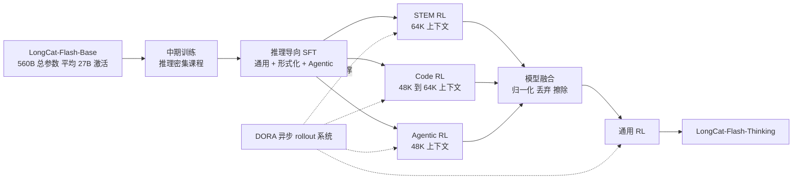
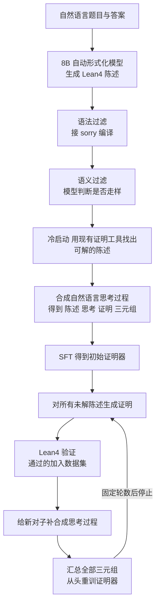
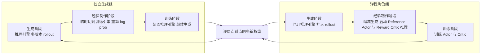
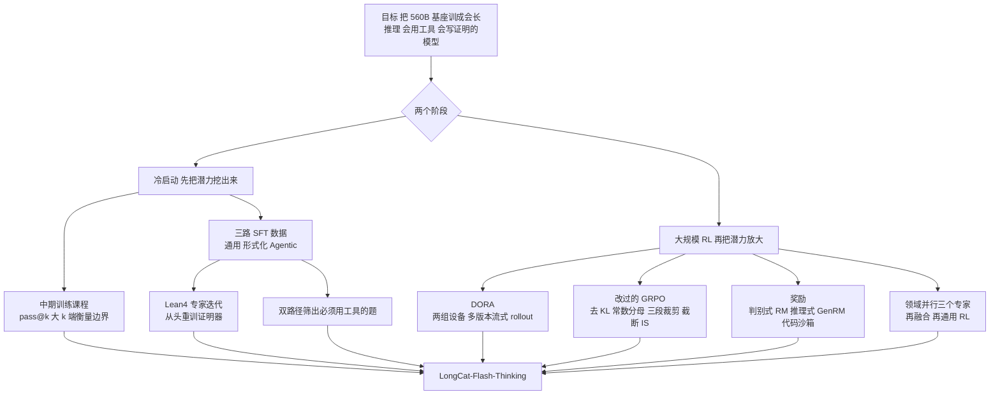

# LongCat-Flash-Thinking：三个领域各练各的再合成一个，让 rollout 不再等最慢的那条回答

<!-- release-date: 2025-09-22 -->

> 本文依据美团 LongCat 团队发布的 **Introducing LongCat-Flash-Thinking: A Technical Report**，即 arXiv:2509.18883v2，2025-11-07 提交的修订版，共 24 页（正文与结论 1–17 页，作者名单 18 页，参考文献 19–22 页，附录 23–24 页）。动笔前已核对 arXiv 官方页：这篇报告只有 v1（2025-09-23）与 v2（2025-11-07）两个版本，本地 PDF 就是最新的 v2，不需要替换。页码均指 PDF 本身的页码；原件的印刷页码与 PDF 页码一致，不用换算。文中会把「报告明确写了什么」「我们如何理解它」「哪些是外部资料补充」三层分开。

## 阅读前先搭一张最小地图

这份报告讲的不是一个新的模型结构，而是**怎样把一个已经训好的基座模型，用后训练变成会长篇推理、会调工具、会写形式化证明的模型**。所以先认识几个后训练里的底层概念：

- **思维链（Chain-of-Thought，CoT）与长思维链**：模型在给出答案之前先写出的推理过程。「长」指几千到几万个 Token 的推理，中间会有试错、检查和改路。
- **冷启动（Cold Start）**：在正式强化学习之前，先用少量高质量数据把模型「教会」一种行为格式，让后面的强化学习有一个像样的起点。
- **监督微调（Supervised Fine-Tuning，SFT）**：拿「问题 + 标准回答」直接教模型模仿。
- **强化学习（Reinforcement Learning，RL）与 rollout**：让模型自己生成回答（这一步叫 rollout），给回答打分（奖励），再按分数调整模型。生成回答的那份模型叫**策略（policy）**。
- **同步与异步 RL、陈旧度（staleness）**：同步是「一批回答全生成完，再统一训练一次」；异步是「生成和训练各自跑，不互相等」。异步的代价是训练用到的样本可能来自几个版本之前的策略，这种「落后了几个版本」就叫陈旧度。
- **组相对策略优化（Group Relative Policy Optimization，GRPO）**：一种不训练额外「估分模型」的强化学习算法，对同一道题采样一组回答，用组内平均分当基线。本站 [DeepSeek-R1 解读](/reports/DeepSeek/DeepSeek-R1) 从头讲过它，本文只讲这份报告改了它哪里。
- **pass@k**：对同一道题采 $k$ 次，只要有一次答对就算通过。它衡量的是模型「有没有能力答对」，而不是「一次就答对的概率」。
- **自动定理证明（Automatic Theorem Proving，ATP）与 Lean4**：把数学命题写成形式语言，由程序逐步检查证明是否严格成立。Lean4 是当前最常用的形式化证明系统之一。
- **任务向量（task vector）与模型融合（model merging）**：把「微调后的权重减去微调前的权重」叫任务向量；把几个模型的任务向量按某种规则加回同一个起点，就是融合。

这份报告最常出现的几个名字是：

- **DORA（Dynamic ORchestration for Asynchronous rollout，异步 rollout 的动态编排）**：美团自研的大规模异步强化学习系统，让先生成完的样本立刻往下走，不等最慢的那条。
- **领域并行训练（Domain-Parallel Training）与模型融合（Model Fusion）**：STEM、代码、Agent 三个领域分别训出三个「专家模型」，再把三份权重合成一个。
- **双路径推理（Dual-Path Reasoning）与工具必要性（tool necessity）**：同一道题分别在「有工具」和「没工具」两种设定下做，用两边通过率之差衡量这道题有多需要工具。
- **专家迭代（Expert Iteration）**：证明器自己生成证明、由 Lean4 验证、通过的加进训练集、再重训证明器，循环若干轮。
- **生成式奖励模型（Generative Reward Model，GenRM）**：先写推理再下判断的打分模型，与只输出一个分数的判别式奖励模型相对。
- **三段裁剪（triplet clipping）与截断重要性采样（truncated importance sampling）**：报告给 GRPO 加的两道保险，分别对付「策略太旧」和「推理引擎与训练引擎算得不一样」。

## 一句话先说清

LongCat-Flash-Thinking 是在 LongCat-Flash-Base 上做后训练得到的推理模型，560B 总参数、平均 27B 激活（PDF p.2）。报告自己列的三项贡献是（PDF p.2–3）：

1. **领域并行的 RL 训练与融合**：STEM、代码、Agent 三个领域解耦各自训练，再融成一个「接近帕累托最优」的模型。帕累托最优的意思是：找不到另一个模型能在某个领域更好、同时其他领域不变差。
2. **工业规模的 RL 基础设施 DORA**：异步架构比同步框架快三倍以上，在数万加速器上稳定训练；这轮 RL 的投入接近预训练算力的 20%。
3. **更宽、更省的高级推理**：Agentic 场景下用工具把 AIME-25 的平均 Token 消耗从 19,653 降到 6,965（少 64.5%），准确率基本不变；形式化证明上用 Lean4 服务器做专家迭代，MiniF2F-Test 的 pass@1 达到 67.6。

如果只记一句话，可以记：

> **RL 里互相打架的东西，先拆开：领域拆开分别训，生成和训练拆开各自跑，每条回答从头到尾只用一个策略版本。拆完再用融合、重要性采样和陈旧度上限把它们接回来。**

这份报告最有价值的不是某个 benchmark 数字，而是它把「拆开」与「接回来」两步都写得相当具体。

## 先看全景：从基座到 Thinking 要走几步

根据 PDF p.2 Figure 2 重画的训练流水线（机制示意）：

两大阶段、六个步骤。先把每一步的关键设定放到一张表上，后面每一节都会回到这里（页码见各节）：

| 步骤 | 做什么 | 报告给出的关键设定 |
|---|---|---|
| 中期训练 | 往训练语料里注入推理密集数据 | 小规模同架构 MoE 上验证，pass@1 在 AIME-24 提升 27.7（PDF p.4） |
| 推理导向 SFT | 通用推理、形式化推理、Agentic 推理三路数据 | AdamW，学习率 3e-5，2 个 epoch，上下文 48K（PDF p.7） |
| 领域并行 RL | STEM、代码、Agent 各训一个专家 | 上下文分别为 64K、48K 到 64K、48K（PDF p.12–13） |
| 模型融合 | 三份任务向量合成一份 | 归一化 + DARE 式丢弃 + SCE 式擦除（PDF p.13） |
| 通用 RL | 补通用能力、防安全回退 | 「最后一轮 PPO 训练」（PDF p.13） |
| 系统底座 | DORA | 同步框架的 3 倍以上速度；RL 算力约为预训练的 20%（PDF p.3、9） |

## 它站在谁的肩膀上：基座一句话

模型结构完全沿用 LongCat-Flash-Base：560B 总参数的 MoE，靠零计算专家让每个 Token 激活 18.6B 到 31.3B 不等的参数（平均约 27B），靠快捷连接 MoE 把通信藏进计算。这些机制本报告只在一句话里提到，说它们让模型「相比性能相当的模型有很大效率优势」（PDF p.3）；机制本身请看本站 [LongCat-Flash 解读](/reports/Meituan/LongCat-Flash)。

前作解读里指出过一件事：LongCat-Flash 报告的后训练一节只写了数据怎么合成，没有写训练算法。本报告正好补上这一块——它几乎全部篇幅都在讲后训练怎么做。

## 第一阶段：冷启动，先把「会想」的潜力挖出来

### 矛盾：基座模型的推理模式太单一

报告先承认一个观察：基座模型直接微调再做 RL，推理性能确实会涨，但这些模型常常产生**同质化的推理模式**，遇到难题不会深入反思、也就拿不到正确答案（PDF p.3）。

报告把原因归到预训练语料的两层缺口（PDF p.4）：

1. 语料整体偏向通用文本，STEM 和代码这类推理密集领域占比不足；
2. 更关键的是，即使在这些领域的数据里，**显式的长思维链模式也天然稀缺**。

这两层缺口叠在一起，压住了模型的推理潜力。所以冷启动的目标不是「教会答案」，而是把潜在的推理能力先激发出来，同时不损伤通用知识（PDF p.4）。

### 中期训练：把推理课程排进预训练尾段

**做法**（PDF p.4）：把中期训练改造成一个平衡过的课程。数据来自两块：

- **STEM**：数学、物理、化学题，来源是学术档案、教材和自有数据，强调竞赛级难度；筛选时优先保留需要多步逻辑推理的题，而不是靠事实检索就能答的；
- **算法编程**：从多个开源代码竞赛数据集汇总。

质量控制用启发式规则加 LLM-as-a-Judge（让一个大模型当评审）做过滤、去重和去污染。报告强调「仔细调整混合比例」，让推理密集数据与原有中期训练数据平衡，以免损伤通用能力（PDF p.4）。

附录 A.1 补了细节（PDF p.23）：用 URL、多表格、HTML/XML 标签等规则过滤掉依赖外部信息或本身无法回答的题；合成答案先按规则去掉重复生成、截断、语言混杂、格式不合规的；再用模型加规则与标准答案比对等价性；难度上，标一小批数据训练一个神经打分器给每篇文档打难度分，低难度样本不全删而是按比例降采样；一题多答时限制答案数量；去污染与去重沿用 LongCat-Flash-Chat 的语义相似度方法。

数据总量、混合比例的具体数值，报告没有公开。

### 用 pass@k 验证「推理边界」是否被撑宽

报告没有直接在 560B 模型上做对照，而是先在一个**架构相同的小规模自有 MoE** 上做了预实验（PDF p.4）。评测指标选的是 pass@k，并用 Chen 等人的无偏估计。

先说 pass@k 要算什么：对一道题采 $N$ 个回答，其中 $C$ 个正确；问「随机从这 $N$ 个里抽 $k$ 个，至少有一个正确」的概率是多少。报告的式 1 是（PDF p.4）：

$$
\text{pass@}k=\mathbb{E}_{x\sim\mathcal{D}}\left[1-\frac{\binom{N-C_x}{k}}{\binom{N}{k}}\right]
$$

- $\mathcal D$ 是题集，$x$ 是一道题；
- $\binom{N-C_x}{k}$ 是「从 $N-C_x$ 个错误回答里抽 $k$ 个」的组合数，除以 $\binom{N}{k}$ 就是「抽到的 $k$ 个全错」的概率；
- 1 减去它，就是至少一个对的概率；最后对所有题取平均。

为什么不直接数「$k$ 次里有没有对的」？因为那样的估计方差大，且依赖抽样顺序；用全部 $N$ 个样本算组合数，是对同一个量的无偏、低方差估计。

**结果**（PDF p.4–5，Figure 4）：在 AIME-24、BeyondAIME、LiveCodeBench（24.08–25.05）三个基准上，加了推理课程的模型在从 pass@1 到 pass@128 的每一个 $k$ 上都更高。报告写的 pass@1 提升是 AIME-24 27.7%、BeyondAIME 9.3%、LCB 6.5%。从图上读，AIME-24 的 pass@1 大约从 0.10 升到 0.38，BeyondAIME 约从 0.05 到 0.15，LCB 约从 0.22 到 0.28，所以这三个百分数是**绝对百分点**，不是相对提升（读自 PDF p.5 Figure 4，报告没有明说口径）。

更值得注意的是大 $k$ 的那一端：AIME-24 的 pass@128 大约从 0.47 升到 0.87（读自 Figure 4）。报告的解读是，这说明课程「有效拓宽了模型的推理边界」（PDF p.4）。

这个解读背后有一条理论线索：报告引用的 Yue 等人的工作提出，RL 主要是把基座模型本来就能采到的正确解「采得更频繁」，而不是创造基座采不到的解；用大 $k$ 的 pass@k 衡量的正是「基座到底能采到多少」这条边界（外部补充，出处见文末）。按这条线索，中期训练的价值就很清楚了：**它是在 RL 之前把边界推出去，RL 再把边界内的正确解变成高概率**。这是我们的理解，报告只说到「边界被拓宽」为止。

**边界**：这是小模型上的实验，报告没有给这个小模型的规模，也没有在 560B 上重做对照；数据比例的具体数字未公开。

### 推理导向 SFT：三种数据，三条流水线

中期训练之后是一段「紧凑的」SFT（PDF p.3）。它分三路：通用推理、形式化推理、Agentic 推理。三路数据的合成流水线画在 PDF p.3 Figure 3 上，下面逐条讲。

#### 通用推理：先筛题，再拒绝采样

**筛题分三步**（PDF p.4–5）：

1. **初筛**：LLM-as-a-Judge 去掉低质量或无法回答的题，比如陈述不完整的；代码题要求描述清楚、至少五个单元测试、有可执行的判题脚本；
2. **标准答案校验**：自动生成多样化回答，做模型投票，把「投票结果与标注答案不一致」的题剔掉——这些题的标准答案可能本身就错了；
3. **难度过滤**：除通用问答外，用专家模型的通过率估计难度，通过率高于阈值的题视为太简单直接丢弃，最后按难度分布采样。

**回答用拒绝采样**（PDF p.5）：以 LongCat-Flash-Chat 为主要生成器，对每道题合成多个候选，用规则加模型两种评判挑出最好的一条。

附录 A.2.1 按领域补了细节（PDF p.23–24）：

| 领域 | 数据来源与处理 |
|---|---|
| STEM | 数十万条带可验证答案的题，覆盖数学、物理、化学、生物；多个先进推理模型各答一遍做投票，过滤掉标准答案与投票不一致的 |
| 代码 | 主要来自开源竞赛数据；题面须含问题、运行开销约束和输入输出样例；自建沙箱，所有先进推理模型都过不了全部测试的题剔除；训一个小分类器标知识点与难度，再做难度过滤 |
| 逻辑 | 演绎、归纳、溯因三类；每类写一个生成器，自动合成难度可控（易、中、难）的题；先用 RLVR 训一个小模型，再从它蒸馏多条长思维链，取答案正确的 |
| 通用问答 | 单轮与多轮指令遵循，用「反向生成」保证回答满足全部约束；阅读理解、表格问答、自定义任务三类常识题；安全上把查询分到 40 多个安全类别、五种回答类型，并专门优化「不过度拒答」 |

RLVR 是 Reinforcement Learning with Verifiable Rewards 的缩写，指用可自动验证的奖励做强化学习；「反向生成」指先写一个保证满足约束的答案，再从答案反推问题——这两处做法与前作的思路一致，可参照 [LongCat-Flash 解读](/reports/Meituan/LongCat-Flash) 的后训练一节。

一处小的不一致值得指出：正文说代码题「至少五个单元测试」（PDF p.5），附录说「多于 5 个」（PDF p.24）。差一个测试用例无关紧要，但读者不必纠结哪个对。

#### 形式化推理：让模型学会写 Lean4 证明

这是本报告最有辨识度的数据流水线之一，因为大多数开源模型根本没有这项能力（PDF p.3）。

**先把任务定义清楚**（PDF p.5）。一道自然语言题由问题 $x$ 和答案 $y$ 组成；先用一个自动形式化器 $\mathcal I_s$ 把它翻译成形式化陈述 $s=\mathcal I_s(x,y)$；模型 $\pi_\theta$ 对陈述生成一份证明 $\mathcal P=\pi_\theta(s)$；验证器 $\mathcal V$ 检查证明，给出 $\mathcal V(\mathcal P,s)\in\{\text{PASS},\text{FAIL}\}$。报告聚焦「整证明生成」：一次生成整份证明，不做逐步交互。

**陈述形式化**（PDF p.5）：

- 收集多个竞赛级数学题集，去重去污染；
- 训练一个 **8B 规模的自动形式化模型**，把「题目 + 答案」翻译成 Lean4 陈述；
- **语法过滤**：沿 Kimina-Prover 的做法搭一个 Lean4 服务器（v4.15），把每条陈述接上占位符 `:= by sorry` 编译一遍，编译不过的丢掉。`sorry` 在 Lean 里表示「证明先空着」，所以这一步只检查陈述本身合不合语法；
- **语义过滤**：报告发现自动形式化偶尔会改掉题目的原意，所以再用一个模型判断形式化陈述与原题是否一致，不一致的丢掉。

**迭代式证明合成**（PDF p.6）。证明器的起点是经过中期训练的 LongCat-Flash-Base。流程分两段（根据 PDF p.3 Figure 3 左下与 p.6 正文重画，机制示意）：

- **冷启动**：先用现成的定理证明工具在形式化陈述里找出一批能被验证的，得到初始的（陈述，证明）对；再用模型给每对合成一段自然语言「思考过程」，组成（陈述，思考过程，证明）三元组，对 LongCat-Flash-Base 做初始 SFT。
- **专家迭代**：每一轮四步——当前证明器对所有仍未解决的陈述生成证明；验证，通过的加入数据集；给新对子补合成思考过程；汇总全部三元组，**从头重训**证明器。循环固定轮数。

「从头重训」而不是接着训，是这条流水线里一个值得注意的选择。我们的理解是：每轮都从同一个起点、用全部数据重训，能避免多轮增量训练把早期偏差一层层累积下去；代价是每轮训练成本不随数据增量摊薄。报告没有解释这个选择的理由。

**为什么要合成「思考过程」**：Lean4 证明本身是形式语言，没有自然语言的推理痕迹；直接用（陈述，证明）训练，模型学到的是「照抄证明」而不是「想出证明」。加一段思考过程，让形式化证明也能走长思维链的路径。这是我们的解释，报告只写了做法。

**边界**：形式化陈述有多少条、迭代了几轮、每轮解决率多少、8B 形式化器怎么训的，报告都未公开。

#### Agentic 推理：只留「必须用工具」的题

**矛盾**（PDF p.6）：现有的工具使用数据集里，很多题模型不调工具也能答好。这种数据对训练真实的 Agent 行为没什么用，因为它没有「必须借助外部工具」的挑战。

**双路径评估**（PDF p.6，式 2）：候选题汇总自 ToolBench、ToolLLM 等开源数据集和自有数据，去重去污染后，对每道题 $x$ 让一个基线模型在两种设定下各生成 $N$ 条解答轨迹：

$$
\mathcal Y_{\text{w/ tool}}=\{y_i\mid y_i=\pi_\theta(\mathcal I_{\text{w/ tool}}(x))\}_{i=1}^{N},\qquad
\mathcal Y_{\text{w/o tool}}=\{y_i\mid y_i=\pi_\theta(\mathcal I_{\text{w/o tool}}(x))\}_{i=1}^{N}
$$

$\mathcal I_{\text{w/ tool}}$ 和 $\mathcal I_{\text{w/o tool}}$ 分别是「给工具」和「不给工具」两种提示。用 LLM-as-a-Judge 算两边的通过率 $s_{\text{w/ tool}}(x)$ 与 $s_{\text{w/o tool}}(x)$，定义**工具必要性**为两者之差：

$$
v_x=s_{\text{w/ tool}}(x)-s_{\text{w/o tool}}(x)
$$

$v_x$ 大，说明这道题靠内部知识难解、有了工具就能解。最终用三个阈值筛选（PDF p.6）：

$$
\{x\mid v_x>\tau_1\ \wedge\ s_{\text{w/ tool}}(x)>\tau_2\ \wedge\ s_{\text{w/o tool}}(x)<\tau_3,\ x\in\mathcal D\}
$$

三个条件各管一件事（我们的解读）：$\tau_1$ 保证工具带来的增益够大；$\tau_2$ 保证有工具时确实能解——否则这道题连正例都采不到，没法学；$\tau_3$ 保证没工具时确实解不了——否则模型会学到「不用工具也行」。三个阈值的取值报告未公开。

**轨迹合成**（PDF p.6）：先搭一个环境，工具 API 包括 MCP 服务器和模拟工具，支持单轮与多轮；对每道选中的题，用一个强生成模型产出多条候选轨迹，从简单的单次调用到多步工作流；一组模型评审按正确性、逻辑一致性、工具使用完整性打分，只留通过的；再统一格式；最后按复杂度分层——工具调用次数（单次或多轮）、依赖结构（串行或并行）、推理深度（查找、多跳、规划）——为课程学习和定向增强做准备。

这一段的可迁移价值很高：**衡量「需不需要 X」的最干净方法，是让同一个体在有 X 和没 X 两种条件下各做一遍，看差值**。它不依赖人工标注「这题需要工具」，也不依赖生成模型的自我判断。同样的对比法可以用来筛「需不需要检索」「需不需要长思考」「需不需要多轮」。

### SFT 的训练配方

三路数据混在一起时的配比（读自 PDF p.23 Figure 10）：

| 数据类型 | 占比 |
|---|---:|
| STEM | 35% |
| 代码 | 20% |
| 通用问答 | 20% |
| Agent | 14% |
| 证明 | 8% |
| 逻辑 | 3% |

报告还提了几处配方细节（PDF p.7）：为了强化通用推理，对 STEM 和代码做了上采样；按几个自定义的「回答行为特征」筛最终样本，包括平均回答长度、反思密度、查询聚类；目标是大幅提升广泛推理任务的表现，同时不丢 Agent 工具使用与形式化证明这两项专门能力。

训练设置：在中期训练后的模型上做，AdamW 优化器，学习率 $3\times10^{-5}$，训 2 个 epoch，上下文长度 48K（PDF p.7）。SFT 数据的绝对数量报告未公开，只有 STEM 一项说了「数十万条」（PDF p.23）。

## 第二阶段：大规模 RL，三层各解决一个矛盾

报告对 RL 的定位很直接：它比 SFT 更省 Token、泛化更好，但训练不稳、对超参敏感、系统开销大，工业规模部署很难（PDF p.7）。于是把解法分成三层，每层对付一个矛盾：

1. **系统层**：DORA，支持异步训练与灵活的加速器用法；
2. **算法层**：对 GRPO 做几处修改，让它吃得下异步数据；
3. **奖励层**：一套同时覆盖可验证与不可验证任务的奖励系统。

下面按这个顺序讲，最后再讲把三层串起来的训练配方。

## 核心设计一：DORA，让先完成的样本立刻往下走

### 旧问题一：调度——分离架构会空转，共卡架构会互相拖累

RL 训练有好几个角色：生成回答的 Generator、被更新的 Actor、算参考概率的 Reference、打分的 Reward、估值的 Critic。把它们放到设备上有两种传统方式（PDF p.7）：

- **分离架构**：不同角色用不同设备。阶段之间有依赖（生成完才能打分，打完分才能训练），所以总有一批设备在等另一批；
- **共卡架构**：所有角色共用同一批设备。没有互相等待，但生成是**访存受限**的（逐 Token 解码，权重搬进来只做很少的乘加），训练是**算力受限**的（整批 Token 一起前向反向），两种性质相反的负载绑在同一套硬件上，谁都跑不到最优。

### 旧问题二：生成偏斜——一整批人等最长的那条

同步训练里，整个 batch 要等最长的那条回答生成完（PDF p.7）。推理和 Agent 场景把这个问题放大了：报告 Figure 7 画了 RL 训练中四个领域的回答长度分布，STEM 和代码的长尾一直拖到 48K，Agent 工具使用和通用任务则集中在几千 Token 以内（读自 PDF p.12 Figure 7）。一批里只要有几条 48K 的回答，其他设备就得等。

### 前人的补丁为什么不够：partial rollout

已有的异步方案里，partial rollout（部分 rollout）把长回答切成几段，每段用当时最新的 Actor 生成，跨迭代拼起来（PDF p.7）。报告在实践中看到两个问题：

1. **重新 prefill 的开销大**：换了新 Actor 之后，被打断的样本要把已生成的前缀重新算一遍 KV cache；
2. **同一条回答混了多个策略版本**：理论上会伤害收敛。

本站 [AReaL 解读](/reports/AntGroup/AReaL) 讲的正是这条路线的代表：AReaL 收到新权重就打断生成、用新权重重算 KV cache，再用解耦的 PPO 目标处理「一条轨迹由几个版本拼成」的问题。DORA 走的是相反的路：**不打断任何一条回答的策略版本**，而是让几个旧版本同时活着。

### 新设计：两组设备，多版本流式 rollout

DORA 的核心思想是：**通过流式 rollout 同时利用 Actor 的多个旧版本来优化长尾生成，同时保持采样一致性**；再用角色的弹性共卡消除设备空转（PDF p.8）。它把集群分成两组：

- **独立生成组（Standalone Generator Group）**：只做 Generator，是 Actor 的一个推理专用副本；
- **弹性角色组（Elastic Role Group）**：角色可以动态切换，既能当 Generator，也能执行 Reference & Actor、Reward & Critic 等训练相关角色。

一轮 RL 分三个阶段（根据 PDF p.8 正文重画，机制示意）：

三个阶段各自在做什么（PDF p.8）：

1. **生成阶段**：两组设备都开推理引擎做 rollout，扩大生成吞吐。推理实例最多保留「陈旧度」个数的策略权重版本。负载均衡控制器在各版本之间重新分配资源，并在推理引擎内复用 KV cache。**完成的样本立刻流向下一阶段，不阻塞后面的步骤**。
2. **经验制作阶段**：生成的样本满足训练条件后，弹性组缩减 Generator 角色、启动其他 RL 角色；Reference & Actor 与 Reward & Critic 并行做推理。同时，独立生成组**临时切换到训练引擎重算 log 概率**——报告说这是把推理引擎与训练引擎之间系统级不一致降到最小的关键一步。算完之后独立组切回推理引擎，继续用之前的策略版本生成。
3. **训练阶段**：Actor 与 Critic 在收集到的经验上训练。独立组同时继续生成，不阻塞，并重新平衡负载。某个策略版本满足用户定义的淘汰策略后被删除。训练完成后，新权重通过**逐层点对点通信**同步回 Generator。

「经验制作阶段独立组切到训练引擎重算 log 概率」这一步值得记住，后面讲算法时会看到，它算出来的量正是截断重要性采样的分子。

### 用 Figure 5 把一步走完

报告 Figure 5 给了一个陈旧度设为 2 的示意时间线（PDF p.7）。陈旧度 2 意味着最多三个策略版本并存：$\theta_{n-2}$、$\theta_{n-1}$、$\theta_n$。把图上的事件按顺序列出来：

| 时间点 | 图上发生了什么 | 说明 |
|---|---|---|
| 第 $n$ 步开始 | 8 台设备（独立组 4 台、弹性组 4 台）都在生成，样本按颜色分属三个版本 | 每条回答从头到尾只用一个版本 |
| 生成中 | 提示 5、8、3、1、6、2 依次完成 | 完成一条就流走一条 |
| 提示 2 完成 | batch 凑满，进入经验制作与训练 | 图上标为「生成中断」 |
| 中断时 | 提示 10 和 12 被丢弃，安排重新生成 | 图上这两条的颜色是最旧的 $\theta_{n-2}$；训练得到 $\theta_{n+1}$ 后该版本超出陈旧度上限——这是我们对图色的解读，图注只说「被丢弃」 |
| 其余提示 | 继续 rollout，靠 KV cache 复用或迁移 | 图上橙色块是 KV cache 迁移 |
| 第 $n+1$ 步 | 弹性组 4 台先做训练，再用 $\theta_{n+1}$ 开始新的 prefill；独立组全程在生成 | 训练期间弹性组不生成 |

这张图把 DORA 的三条设计一次展示完了：流式（完成即流走）、多版本（同一步里三种颜色并存）、弹性（弹性组在一步之内从生成切到训练再切回来）。

### 负载均衡控制器

多版本并存带来一个新问题：不同版本的样本数会失衡，某个版本的设备可能空转。报告的负载均衡控制器监控每台设备的负载，达到预设阈值就重新分配资源，手段有两种：**权重迁移**（让一台设备换一个策略版本）和 **KV cache 迁移**（把正在生成的样本连同 KV cache 搬到另一台设备）（PDF p.8，Figure 6）。

Figure 6 的例子（我们对图的读法）：均衡前，四台设备两台跑版本 0、两台跑版本 1；均衡后，版本 0 的未完成样本被集中到一台设备（样本 4 通过 KV cache 迁移搬过去），腾出来的那台通过权重迁移切到版本 1，接了新样本。这样最旧版本占的设备越来越少，新版本占的越来越多，与陈旧度淘汰的方向一致。

### 报告总结的三个收益

（PDF p.9）

1. **流式**：先完成的回答立刻进入后续阶段，不被最长的那条挡住；
2. **多版本**：每条回答完全由同一个 Actor 生成到结束，消除了段与段之间的不一致；也因此被打断的样本可以直接复用 KV cache，在 prefill 占比高的场景里显著省开销；
3. **弹性共卡**：设备空转接近零，只剩进程内上下文切换与卸载这点可忽略的时间；同时保留了分离架构的好处——加速器的数量和类型都能按负载灵活分配。

### 把系统撑到数万卡：RPC 与图编译

两处工程优化（PDF p.9）：

- **大规模流式 RPC**：控制面建在 PyTorch RPC 上（为张量优化的远程调用，省去序列化开销）。为了支撑大规模，他们给 TCPStore 加了分组键原语和 RPC 初始化时的数据压缩，把通信复杂度从 $O(N^2)$ 降到 $O(N)$；运行时又加了**双向流式 RPC**（PyTorch 原生只有一元 RPC），让推理引擎在异步训练里做高性能流式 rollout。
- **大规模 MoE 并行**：生成用高度专家并行，既分摊计算，也让每张加速器有更多显存放长上下文的 KV cache。但专家并行规模一大，跨设备同步就卡在主机侧的 kernel 启动开销上，导致执行不同步。解法是图级编译降低 kernel 派发频率，顺带做图级优化和通信计算重叠，rollout 提速 **1.5 倍**（相对标准的即时执行）。

合起来的账单：对 560B 的 LongCat-Flash 模型，在数万加速器上比同步训练快 **3 倍以上**（PDF p.9）；这轮 RL 用掉的算力接近预训练的 20%（PDF p.3）。

### 代价与边界

- **陈旧度是代价的来源**。几个旧版本同时生成，训练用的样本天然是 off-policy 的；这笔账没有消失，只是从系统层挪到了算法层，下一节全是在还它。
- **3 倍的分母没写**。报告没说对比的是哪套同步框架、同样的加速器数量下绝对吞吐是多少，也没有把「流式」「多版本」「弹性共卡」三项各贡献多少拆开。
- **被丢弃的样本是白算的**。Figure 5 里 10 和 12 两条要重新生成，报告没有量化这类浪费的比例。
- **引擎切换和 KV cache 迁移都有开销**。独立组在经验制作阶段切到训练引擎再切回来，样本跨设备迁移要搬 KV cache；报告只说「可忽略」，没有数字。
- **加速器数量只有「数万」**。具体规模、训练时长、成本都未公开。

### 与 AReaL 的对照

两套系统面对同一个矛盾，给了两种回答（AReaL 的内容依据本站 [AReaL 解读](/reports/AntGroup/AReaL)）：

| 维度 | AReaL | DORA |
|---|---|---|
| 新权重到来时 | 打断生成，用新权重重算 KV cache，接着写 | 不打断，旧版本继续把这条写完 |
| 一条回答的策略版本 | 可能由多个版本拼成，靠解耦 PPO 目标接住 | 始终一个版本，靠多版本并存实现 |
| 陈旧度控制 | 参数 $\eta$ 限制生成侧最多领先几个 batch | 最大陈旧度作为中断策略的一部分，超限样本丢弃重生成 |
| 设备划分 | 生成与训练固定 3:1 | 独立生成组固定，弹性组按阶段切换角色 |

两条路都要付出「训练数据 off-policy」的代价。AReaL 的代价集中在 KV cache 重算与目标函数改动；DORA 的代价集中在多版本占用的显存、样本丢弃与负载均衡的复杂度。哪条更划算，取决于 prefill 占比与版本更新频率——报告没有做这个对比，本文也不替它下结论。

### 可迁移启发

- **以「完成」为事件驱动，不以 batch 为同步单位**。只要下游能接受乱序到达的样本，流式几乎总是比等齐更省。
- **用「多版本并存」换「每条样本一致」**。当一致性比新鲜度更重要时，让旧版本活到把手头的活干完，比中途换版本更干净。
- **角色可以是状态，不必是设备**。弹性组在一步之内切换角色，是分离与共卡之外的第三种选择。
- **把陈旧度做成显式旋钮**，作用点在中断与丢弃上；下游算法要知道这个旋钮的取值。

## 核心设计二：把 GRPO 改到能吃异步数据

### 起点：GRPO 目标

报告从 GRPO 出发（PDF p.9，式 3）。记 $\pi_\theta$ 为当前策略，$\pi_\mu$ 为生成样本的行为策略，对一道题 $x$ 采一组 $G$ 条回答 $\{y_i\}$，则：

$$
\mathcal J_{\text{GRPO}}(\theta)=\mathbb E\left[\frac{1}{G}\sum_{i=1}^{G}\frac{1}{|y_i|}\sum_{t=1}^{|y_i|}\Big(\min\big(r_{i,t}(\theta)\hat A_{i,t},\ \operatorname{clip}_\varepsilon(r_{i,t}(\theta))\hat A_{i,t}\big)-\beta D_{\mathrm{KL}}[\pi_\theta\|\pi_{\text{ref}}]\Big)\right]
$$

- $r_{i,t}(\theta)=\pi_\theta(y_{i,t}\mid x,y_{i,<t})\,/\,\pi_\mu(y_{i,t}\mid x,y_{i,<t})$ 是第 $i$ 条回答第 $t$ 个 Token 的重要性比：当前策略比行为策略更偏爱这个 Token 多少倍；
- $\operatorname{clip}_\varepsilon$ 把比值截到 $[1-\varepsilon,1+\varepsilon]$；
- $\hat A_{i,t}$ 是优势估计，GRPO 用组内相对分数算；
- $\pi_{\text{ref}}$ 是 SFT 模型，$\beta$ 是 KL 惩罚系数。

GRPO 的来龙去脉见本站 [DeepSeek-R1 解读](/reports/DeepSeek/DeepSeek-R1)。这里只需要记住：这个目标默认「采样的策略与被优化的策略几乎一样」。

### 异步带来的两种漂移

报告说，把式 3 直接用到异步的复杂推理场景，会因为**分布漂移**破坏收敛，甚至快速崩溃。漂移有两个来源（PDF p.9–10）：

1. **引擎数值差**：为了吞吐，采样用的是 vLLM 这类高度优化的推理引擎，它们做 kernel 融合等优化，不保证与训练引擎（如 Megatron）逐位一致。即使把推理引擎给出的采样概率当作 $\pi_\mu$，后端不匹配累积的数值误差也会带来不稳定。
2. **策略陈旧**：异步训练里每条样本可能来自多个旧版本策略，与正在优化的目标策略之间有差距。式 3 假设两者高度对齐，对这种偏差不鲁棒。

报告还特别指出**稀疏 MoE 让陈旧问题更严重**：不同策略版本的专家路由可能不同，同一个 Token 在两个版本下的概率可能差得很远；当优势为负时，这会产生极大的重要性比和无界的方差（PDF p.10）。

### 四处修改，各对一种病

（PDF p.10）

1. **去掉 KL 项**。原因不是「长思维链应该远离参考模型」（那是 DAPO 的理由，见本站 [DAPO 解读](/reports/ByteDance/DAPO)），而是默认的 $k_3$ 估计量虽然期望无偏，梯度却是有偏的（引 Zang 2025 的博客）。去掉之后也方便做幅度较大的策略更新。
2. **Token 级损失，且分母用全局常数 $T_{\max}$**。样本级损失先在每条回答内部平均、再跨回答平均，长回答里每个 Token 的权重被 $1/|y_i|$ 压扁；改成 Token 级已是共识（DAPO 用「本组总 Token 数」当分母）。报告更进一步，沿 Liu 等人的做法，用**训练中的最大生成长度**这个常数当分母。这样每个 Token 的权重不随回答长度变、也不随本 batch 的长短构成变，从根上去掉了长度偏置。代价是回答普遍很短时，有效梯度会偏小，相当于隐式降低了学习率（这是我们的推断，报告只说它「缓解了长度偏置」）。
3. **三段裁剪**。为了可读，下面把三个裁剪参数记为 $\varepsilon_{\text{nl}}$、$\varepsilon_{\text{nh}}$、$\varepsilon_{\text{ph}}$，分别对应报告的 $\epsilon_{\text{neg}_{\text{low}}}$、$\epsilon_{\text{neg}_{\text{high}}}$、$\epsilon_{\text{pos}_{\text{high}}}$。$\varepsilon_{\text{nl}}$ 与 $\varepsilon_{\text{nh}}$ 约束负优势 Token 的重要性比，$\varepsilon_{\text{ph}}$ 给正优势 Token 一个上界。报告说这沿自 DAPO（Yu 等，2025）与 Ye 等 2020 年的双重裁剪 PPO，作用是防止崩溃、保住足够的熵。
4. **截断重要性采样**。引擎数值差会在训练中累积，于是用截断的重要性采样（Yao 等 2025；Ionides 2008）校正推理引擎与训练引擎之间的分布错配。

### 把式 4 拆开读

最终目标是（PDF p.10，式 4；期望的下标 $x\sim\mathcal D$、$\{y_i\}_{i=1}^{G}\sim\pi_\mu(\cdot\mid x)$ 为省篇幅略去）：

$$
\begin{aligned}
\mathcal J(\theta)=\mathbb E\Bigg[\frac{1}{G\cdot T_{\max}}\sum_{i=1}^{G}\sum_{t=1}^{|y_i|}\ &\min\big(r_{i,t}(\mu),\,C\big)\cdot\\
&\max\Big(\min\big(r_{i,t}(\theta)\hat A_{i,t},\ \operatorname{clip}(r_{i,t}(\theta),\,1-\varepsilon_{\text{nl}},\,1+\varepsilon_{\text{ph}})\,\hat A_{i,t}\big),\ \varepsilon_{\text{nh}}\hat A_{i,t}\Big)\Bigg]
\end{aligned}
$$

- $T_{\max}$：最大生成长度；
- $r_{i,t}(\mu)=\pi_\mu^{\text{train}}/\pi_\mu^{\text{infer}}$：**同一个行为策略** $\mu$，用训练引擎算出的概率除以用推理引擎算出的概率。理想情况它恒等于 1；两个引擎算得不一样时它偏离 1；
- $C$：截断常数。

分三层读：

**第一层是归一化** $\frac{1}{G\cdot T_{\max}}$：每个 Token 的权重是同一个常数，与它待在多长的回答里无关。

**第二层是引擎校正** $\min(r_{i,t}(\mu),C)$：把「推理引擎采出来的样本」折算到「训练引擎眼中的分布」。这个比值本身是标准的重要性采样权重；截到 $C$ 是为了防止个别 Token 上两个引擎差异过大，把整条样本的梯度放大到失控。前面 DORA 一节说的「独立生成组在经验制作阶段切到训练引擎重算 log 概率」，算的就是这里的分子 $\pi_\mu^{\text{train}}$；分母 $\pi_\mu^{\text{infer}}$ 由推理引擎在采样时给出。

**第三层是策略项**，里面套了两次：

- 内层 $\min(r\hat A,\ \operatorname{clip}(r,1-\varepsilon_{\text{nl}},1+\varepsilon_{\text{ph}})\hat A)$ 就是 PPO 的裁剪，只是上下界不对称。用 DAPO 那篇讲过的道理：优势为正时起作用的是上界 $1+\varepsilon_{\text{ph}}$（比值涨过上界就不再给奖励），优势为负时起作用的是下界 $1-\varepsilon_{\text{nl}}$（比值跌破下界就不再罚）。这就是两个参数分别叫「pos_high」和「neg_low」的原因。
- 外层 $\max(\cdot,\ \varepsilon_{\text{nh}}\hat A)$ 是双重裁剪。考虑优势为负、但当前策略比行为策略**更偏爱**这个 Token 的情况：$r$ 很大，$r\hat A$ 是一个很大的负数，内层的 $\min$ 会选中它，梯度会猛烈地把这个 Token 往下压。MoE 的路由变化正会制造这种 Token。外层的 $\max$ 给它铺了一层地板：一旦 $r$ 超过 $\varepsilon_{\text{nh}}$，这一项就变成常数 $\varepsilon_{\text{nh}}\hat A$，梯度归零。所以 $\varepsilon_{\text{nh}}$ 不是一个「小 epsilon」，而是一个大于 1 的倍数（Ye 等人的原文里用的是 3；报告未公开自己的取值）。

一处需要按意图读的地方：按 Ye 等人的原始定义，外层的 $\max$ 只在优势为负时启用；式 4 把它写成了无条件的 $\max$。若 $\varepsilon_{\text{nh}}>1+\varepsilon_{\text{ph}}$，按字面理解，正优势的 Token 会永远被外层选中常数项而失去梯度。结合正文「$\epsilon_{\text{neg}_{\text{high}}}$ 约束负优势」的说法，应理解为只对负优势生效。这是我们核对公式后的判断，报告没有说明。

### 三个训练策略

（PDF p.10–11）

**有放回的在线过滤**。流式生成阶段直接去掉准确率为 1（全对）或 0（全错）的提示，只留「一直有挑战」的样本，因为全对或全错的组内优势为零，不产生梯度（这与 DAPO 的动态采样同源）。不同的是采样方式：DAPO 是不放回，报告用**有放回**，以保证「每条数据至少被消费一次」与完整性（引 Xiao 等 2024）。同步场景下，被过采样的提示每一步重新生成；异步场景下，陈旧度没超上限的提示直接复用，超了才重新生成。

**陈旧度控制**。最大陈旧度是中断策略的一部分（就是 Figure 5 里丢弃 10 和 12 的那条规则）。为了提高样本效率，在线过滤过采样出来的数据存进回放缓冲区，按预设的**复用比例**在后续迭代中重新采样，与新样本按比例混合；混合后的 batch 要打乱，以稳住缓冲区内的陈旧度分布。报告承认这不可避免地抬高了平均陈旧度，但认为样本效率的收益值得。

**不完整信号屏蔽**。两类样本不进损失：一是打分出了问题的（比如代码评测时沙箱执行报错），屏蔽后梯度略有偏但方差低；二是**达到最大生成长度、且没有被识别为重复**的样本，避免因长度截断而失真的输出干扰损失。注意后半句的限定：被识别为「陷入重复」的截断样本不屏蔽，仍然吃负分——报告没有明说这一点，但从「没有被识别为重复的才屏蔽」可以反推。DAPO 的超长过滤是不分原因一律屏蔽，这里多了一层区分。

### 边界

分组大小 $G$、各领域的 $T_{\max}$、三个裁剪参数、截断常数 $C$、最大陈旧度、复用比例、学习率与 batch 大小，报告都未公开。式 4 是一个可复现的**形状**，不是一份可复现的配置。

### 可迁移启发

- **每一处修改对应一种明确的漂移来源**：引擎差用截断重要性采样，版本差用三段裁剪，长度差用常数分母。改目标函数前先列清楚自己的系统里有哪几种漂移。
- **重要性比值的两端都要设防**：小于 1 的一端靠裁剪下界，大于 1 的一端靠双重裁剪的地板。MoE 模型尤其需要后者。
- **「至少消费一次」是数据完整性约束**，在异步系统里要靠有放回采样和陈旧度阈值一起保证。

## 核心设计三：奖励系统，可验证的也用生成式裁判

（PDF p.11）

### 不可验证任务：判别式奖励模型

创意写作、知识问答这类没有标准答案的任务，用一个判别式奖励模型打分。它从 LongCat-Flash 的 SFT 检查点初始化，在人与模型联合标注的偏好数据集上训练。一个细节：对长思维链回答，**推理过程不作为输入**，奖励模型只看答案部分。

### 可验证任务：让裁判先推理再判

STEM 领域没有用规则匹配，而是训练了一个**带推理过程的生成式奖励模型**（GenRM，引 Zhou 等 2025）。给定问题、参考答案和模型回答，GenRM 先写推理再判对错。好处有三：能识别同义不同形的答案（报告举的例子是 $a^2-b^2$ 与 $(a+b)(a-b)$）；能处理复杂表达式；判断带理由，便于持续改进 GenRM 本身。

报告在一个人工标注的测试集上对比了三种奖励方式（PDF p.11，Table 1）：

| 奖励方式 | 判断准确率 |
|---|---:|
| 规则奖励 | 80.9% |
| 不带推理的 GenRM（直接输出对错） | 94.0% |
| 带推理的 GenRM（报告的方案） | 98.8% |

从 80.9 到 98.8，说明在 STEM 这种答案形式多样的领域，规则奖励每五道题就会判错一道；这些错判会直接变成 RL 的噪声信号。测试集规模、GenRM 的规模与训练细节，报告未公开；GenRM 本身出自同团队的 Libra 论文（外部核实见文末）。

### 代码沙箱：让验证器跟得上异步 RL

代码任务用一个分布式沙箱集群做验证，管理**百万级并发**的代码执行，支持 20 多种编程语言。为了应对异步 RL 起伏的负载，设计了异步接口批量处理代码，不再靠轮询；一次编译多次运行以减少开销；用压缩与缓存分片保证传输与存储的速度与可靠性。

这一段的启发是：**验证器的吞吐是 RL 系统的一部分**。奖励算得慢，异步流水线再快也会在打分这一步堆积。

## 核心设计四：领域并行训练与模型融合

### 矛盾：混着训会负迁移

报告在大规模 RL 中观察到：把多个领域混在一起的训练流水线，在异步训练下常出现**负迁移**——效率低、效果次优。原因被归结为训练 batch 之间显著的分布偏移，源头是各领域回答特征差别太大，Figure 7 的长度分布就是证据（PDF p.12）。

顺序训练（一次一个领域）能部分缓解，但报告说它「天生低效且不灵活」：后面的阶段一开始，就很难回头修早期领域的能力（PDF p.12）。

为什么长度差异在异步训练下格外伤人，报告没有展开。我们的理解有两层：一是不同领域的回答长度差几倍到十几倍，一个 batch 里领域比例稍有波动，梯度的构成就大变；二是长回答生成得慢、陈旧度天然更高，混合训练等于把不同陈旧度的样本也混在了一起。这两条都是推断，不是报告的原话。

于是报告的做法是**领域并行**：先为各推理领域分别训练「专家」模型，再融成一个在各项专长上接近帕累托最优的模型，最后用一段通用 RL 收尾（PDF p.12）。

### 每条赛道的 RL 数据

（PDF p.12）

- **STEM 与代码**：先对已知基准去污染、去重；STEM 剔除多问、选择题、判断题这类不适合的格式；代码题的测试用例统一改成标准的输入输出结构。关键一步是**防奖励信号偏差**：用 SFT 模型对每道题生成多条回答，只保留「对错分布均衡」的题，把全对的简单题与全错的不可能题都去掉。代码题还用沙箱执行反馈找出有歧义的题或对不上的测试用例，避免假阴性。
- **Agent**：专门整理了一批需要复杂推理与工具调用的数学题，每条是（题目、参考答案、评分细则）三元组，用细则引导模型学习合适的工具调用轨迹。

### 每条赛道的配置

（PDF p.12–13）

| 赛道 | 上下文 | 课程 | 其他 |
|---|---|---|---|
| STEM RL | 固定 64K | 逐步调低「纳入训练」的通过率阈值，难度递增 | 动态调整裁剪上界 $\varepsilon_{\text{ph}}$ 以保稳定 |
| Code RL | 48K 到 56K 到 64K | 生成长度的第 90 百分位接近当前上限时扩窗 | — |
| Agentic RL | 固定 48K | — | 用 `<longcat_think>` 与 `<longcat_tool_call>` 标签的结构化对话模板；加一项**工具调用格式奖励**，激励语法正确的调用 |

Code RL 的扩窗规则很实用：不是按步数定时扩，而是**看分布的尾巴碰没碰到天花板**。STEM RL 的「逐步调低通过率阈值」也值得注意：它把课程难度做成了一个可以随训练进度拧的旋钮，而不是事先切好的几个数据包。

PDF p.2 Figure 2 的下排给了四段 RL 的训练曲线（奖励与第 90 百分位回答长度随流式全局步数变化）。从图上读，STEM RL 的奖励在 0.375–0.500 之间波动上行，长度轴刻度 30K–65K；Code RL 奖励在 0.40–0.65 之间上行，长度轴 25K–60K；Agentic RL 奖励在 0.58–0.64 之间，长度轴 8K–13K；General RL 奖励在 0.62–0.68 之间，长度轴 4.4K–4.9K。这四张小图只有轴刻度、没有标注具体数值，本文不从中读更细的数字；它们证明的是四段训练各自在涨，且长度尺度差一个数量级——这正是领域并行的动机。

### 融合：归一化、丢弃、擦除

三个专家训完，要合成一个。做法是把参数直接合并（PDF p.13）。先定义第 $i$ 个领域的**任务向量**：

$$
\tau_i=\theta^{i}_{\text{RL}}-\theta_{\text{SFT}}
$$

即该领域 RL 后的权重减去共同起点 SFT 模型的权重。三个任务向量分别记录了「这个领域把模型往哪个方向推了多少」。合并的难点是**参数干扰**：三个向量在同一个参数上可能方向相反、大小悬殊。报告用三步处理：

1. **归一化**：把各任务向量的幅度归一化，平衡不同领域的贡献。否则更新幅度大的领域会盖过其他领域。
2. **丢弃**：类似 DARE，随机丢掉一部分冗余的增量参数。DARE 的原始做法是按概率置零增量、再把留下的按比例放大，以保持期望不变（外部补充，出处见文末）。
3. **擦除**：受 SCE 启发，擦掉「少数方向」的参数元素——同一个参数上，若多数领域往正推、少数往负推，把往负推的那部分擦掉，避免互相抵消（外部补充：SCE 出自 FuseChat，「Select、Calculate、Erase」三步中的最后一步）。

用一个最小的例子感受一下（我们构造的）：某个参数上，STEM 的增量是 $+0.8$，代码是 $+0.3$，Agent 是 $-0.4$。直接相加得 $+0.7$，Agent 的意见被抵消了一部分，STEM 的也被削了一块，三家都不满意。擦除少数方向后是 $+1.1$（再按归一化缩放），至少多数方向的信息完整保留了。融合永远是有损的，这三步是在选择「损失落在谁头上」。

丢弃率、擦除阈值、归一化的具体方式，报告未公开；三步各自的贡献也没有消融。

### 融合之后掉不掉分：Figure 8

报告用 Figure 8 证明融合「几乎无损」（PDF p.13）。把专家模型、融合模型和最终模型（Table 2）放到一起看：

| 基准 | 领域专家 | 融合模型 | 最终模型（PDF p.14 Table 2） |
|---|---:|---:|---:|
| AIME-24 | 93.6（STEM） | 94.3 | 93.3 |
| AIME-25 | 90.8（STEM） | 90.8 | 90.6 |
| HMMT-25 | 84.8（STEM） | 85.4 | 83.7 |
| BeyondAIME | 70.8（STEM） | 71.2 | 69.5 |
| LiveCodeBench（24.08–25.05） | 78.0（Code） | 80.1 | 79.4 |
| τ²-Bench 平均 | 70.3（Agentic） | 70.6 | 74.0 |

前两列读自 PDF p.13 Figure 8。融合模型在六项上都不低于对应专家，LiveCodeBench 还高了 2.1 个点——这支持「接近帕累托最优」的说法：合并没有让任何一个领域付出代价。

第三列是我们补的对照，报告自己没有把这两张表放在一起比。它显示通用 RL 这一段让四项数学基准各回落 0.2 到 1.7 个点、LiveCodeBench 回落 0.7，同时 τ²-Bench 平均从 70.6 涨到 74.0。这符合通用 RL 的定位——它优化的是广泛场景与对齐，不是数学——但报告没有讨论这段回落，也没有说明 Figure 8 与 Table 2 是否用了完全相同的评测配置（Figure 8 没有标注 Mean@k）。τ²-Bench 的最终值 74.0 由 Table 2 的三个子集（71.5、67.5、83.1）平均而来，与 Figure 1 上的 74.0 一致。

### 通用 RL 收尾

最后一段通用 RL 的目标有两个：提升创意写作、指令遵循这类广泛场景的能力；防止融合后安全等核心能力回退（PDF p.13）。数据来自开源与合成查询，用聚类算法去重并筛出高质量、有挑战的样本，然后做「最后一轮 PPO 训练」。

这里的措辞是 PPO 而不是 GRPO。结合 DORA 一节里出现的「Reward & Critic」角色和「训练 Actor 与 Critic」，通用 RL 这一段可能用了带 Critic 的 PPO；但报告没有明说这一段的目标函数、奖励构成与数据量，本文不替它补。

### 代价与边界

- **没有「混合训练 vs 领域并行」的直接对比数字**。负迁移的证据只有长度分布图与作者的观察，报告没有给出混合训练的分数曲线。
- **三个专家要三份 RL 算力**。它们各用各的数据，总数据量未必比混合训练多，但并行意味着同时占用三组设备；报告没有说算力怎么分。
- **融合要求同一个起点**。任务向量是相对 $\theta_{\text{SFT}}$ 定义的，三个专家必须从同一个 SFT 检查点出发。MoE 模型的路由权重怎么合并、合并后专家负载会不会失衡，报告没有讨论。
- **通用 RL 之后数学小幅回落**，报告未提及。

### 可迁移启发

- **训练时分、部署时合**。领域并行让每条赛道用自己的上下文长度、课程和奖励，这是混合训练做不到的；融合把它们收回一个模型，部署成本不变。
- **专家训完再合，比顺序训更能回头**。任何一个领域退化了，只需重训那一个专家再融合，不用从头来。
- **融合是有损的，先决定损失落在谁头上**。归一化管幅度，丢弃管冗余，擦除管方向冲突。
- **融合之后的收尾阶段要单独评测**。它可能让专项能力小幅回落，这笔账应该摆在台面上。

## 评测：哪些结论有证据，哪些要留问号

### 基准与口径

报告把评测分成八类：通用问答、对齐、数学、通用推理、代码、Agent 工具使用、形式化定理证明、安全（PDF p.13–15）。对比对象是三个开放权重推理模型（DeepSeek-V3.1-Thinking、Qwen3-235B-A22B-Thinking-2507、GLM-4.5）和三个闭源模型（OpenAI-o3、Gemini2.5-Pro、GPT-5-Thinking）（PDF p.15）。

几处影响读数的口径（PDF p.15）：

- 通用问答用**打分模型**判断回答与参考答案是否语义一致，而不是精确匹配；报告自己承认这会让分数略高于原始文档；
- AIME 与 HMMT 取 32 次采样的平均（Mean@32），BeyondAIME 取 Mean@10，GPQA-Diamond 取 Mean@16，MATH-500、ZebraLogic、Sudoku-Bench、ARC-AGI 取 Mean@1；
- 代码用通过率（全部测试通过才计 1 分），LiveCodeBench 用 Python 3.11，取 2024 年 8 月到 2025 年 5 月的题；
- Agent 类与代码类都用官方评测框架；
- MiniF2F-Test 共 244 题，报告 pass@1、pass@8、pass@32，证明通过 Lean4 服务器的语法检查即算通过；
- 安全用四类**私有**测试集，经人工复核；
- Sudoku-Bench 用的是 nikoli_100 子集；
- 推理参数：temperature 1.0，top-k 关闭（−1），top-p 0.95；
- 表中带 † 的分数取自外部报告，不是本报告复现的。

VitaBench 是同团队在 LongCat-Flash 报告里自建的真实场景 Agent 基准，前作解读已说明它当时未公开（PDF p.15 引 Meituan 2025）。

### 主表

（PDF p.14，Table 2；粗体与下划线是报告标的第一、第二，本表不再复制这两种标记）

| 基准 | DeepSeek-V3.1-Thinking | Qwen3-235B-A22B-Thinking-2507 | GLM-4.5 | OpenAI-o3 | Gemini2.5-Pro | GPT-5-Thinking | LongCat-Flash-Thinking |
|---|---:|---:|---:|---:|---:|---:|---:|
| 总参数 / 激活参数 | 671B / 37B | 235B / 22B | 355B / 32B | – | – | – | 560B / 27B |
| MMLU-Pro | 84.4 | 84.4 | 81.5 | 85.3 | 86.7 | 84.5 | 82.6 |
| MMLU-Redux | 90.5 | 91.4 | 89.9 | 93.1 | 90.1 | 92.6 | 89.3 |
| IFEval（strict prompt） | 86.3 | 89.3 | 85.4 | 90.2 | 92.4 | 92.8 | 86.9 |
| Arena-Hard（hard prompt gemini） | 57.1 | 74.5 | 67.7 | 87.1 | 87.1 | 87.7 | 69.9 |
| MATH-500 | 98.8 | 99.6 | 95.4 | 98.4 | 98.0 | 99.2 | 99.2 |
| HMMT-25 | 80.4 | 83.8 | 76.3 | 71.9 | 79.3 | 84.8 | 83.7 |
| AIME-24 | 93.9 | 93.9 | 89.3 | 91.6† | 90.7 | 92.0 | 93.3 |
| AIME-25 | 87.9 | 92.5 | 85.5 | 88.9† | 89.2 | 94.6† | 90.6 |
| BeyondAIME | 71.8 | 71.5 | 66.0 | 63.2 | 63.0 | 70.0 | 69.5 |
| GPQA-Diamond | 84.2 | 80.4 | 78.3 | 81.9 | 84.0 | 84.4 | 81.5 |
| ZebraLogic | 96.1 | 97.5 | 90.9 | 94.3 | 92.4 | 92.7 | 95.5 |
| Sudoku-Bench | 1.0 | 2.0 | 1.0 | 70.0 | 0.0 | 63.0 | 56.0 |
| ARC-AGI | 37.5 | 45.3 | 21.4 | 47.3 | 46.8 | 59.0 | 50.3 |
| LiveCodeBench（24.08–25.05） | 73.5 | 75.4 | 61.1 | 76.2 | 74.2 | 80.6 | 79.4 |
| OJBench | 33.6 | 32.1 | 19.0 | 38.4 | 41.6 | 34.1 | 40.7 |
| SWE-Bench | 66.0† | 34.4 | 64.2† | 69.1† | 59.6† | 74.9† | 59.4 |
| BFCL V3 | 55.4 | 75.7 | 79.1 | 72.4† | 63.2 | 60.1 | 74.4 |
| τ²-Bench-Retail | 65.4 | 68.2 | 69.3 | 72.8 | 70.9 | 81.1† | 71.5 |
| τ²-Bench-Airline | 44.0 | 58.0 | 66.0 | 62.5 | 58.0 | 62.6† | 67.5 |
| τ²-Bench-Telecom | 23.7 | 47.3 | 56.1 | 67.5 | 38.3 | 96.7† | 83.1 |
| VitaBench | 13.5 | 21.5 | 26.8 | 35.3 | 24.3 | 29.3 | 29.5 |
| MiniF2F-Test pass@1 | 49.6 | 11.9 | 10.9 | 15.2 | 13.9 | 21.4 | 67.6 |
| MiniF2F-Test pass@8 | 74.4 | 20.9 | 22.1 | 29.6 | 29.4 | 39.7 | 79.4 |
| MiniF2F-Test pass@32 | 79.5 | 26.6 | 27.0 | 37.7 | 41.8 | 51.2 | 81.6 |
| 安全 Harmful | 79.2 | 84.3 | 70.4 | 64.8 | 44.3 | 56.8 | 93.7 |
| 安全 Criminal | 89.7 | 92.7 | 88.8 | 85.7 | 77.4 | 87.3 | 97.1 |
| 安全 Misinformation | 81.1 | 80.9 | 67.1 | 42.7 | 31.0 | 41.9 | 93.0 |
| 安全 Privacy | 96.2 | 100.0 | 97.6 | 100.0 | 95.0 | 98.8 | 98.8 |

### 逐类看：强在哪、弱在哪

报告的自我评价是「在一系列复杂推理任务上达到开源模型的最先进水平」（PDF p.1）。逐类对照表格，这句话在哪些栏成立、在哪些栏不成立，可以说得更准：

- **通用问答与对齐是弱项**。MMLU-Pro 82.6、MMLU-Redux 89.3，在七个模型里都是偏低的；IFEval 86.9 只高于 DeepSeek-V3.1 与 GLM-4.5；Arena-Hard 69.9 落后 Qwen3 的 74.5 与三个闭源模型的 87 左右。报告对这两类的措辞是「有竞争力」（PDF p.16），从数字看，这是实话。
- **数学是第一梯队，不是第一名**。HMMT-25 83.7 仅次于 GPT-5 的 84.8；AIME-24 93.3、AIME-25 90.6 都排第三；BeyondAIME 69.5 排第四。报告说它「超过 OpenAI-o3、与 Qwen3 和 GPT-5 相当」（PDF p.16），前半句成立，后半句要看具体基准。
- **通用推理里结构化谜题很强，GPQA 偏弱**。ARC-AGI 50.3 仅次于 GPT-5 的 59.0，高于 o3 与 Gemini；Sudoku-Bench 56.0 是开源模型里唯一超过 2 分的（另外三个开源模型是 1.0、2.0、1.0），但低于 o3 的 70.0 与 GPT-5 的 63.0；ZebraLogic 95.5 排第三。GPQA-Diamond 81.5 低于 DeepSeek-V3.1 的 84.2 和三个闭源模型。
- **代码是最硬的证据**。LiveCodeBench 79.4 是开源模型最高，仅次于 GPT-5 的 80.6；OJBench 40.7 仅次于 Gemini 的 41.6。这两项都是新题（LiveCodeBench 只取 2024-08 之后的题），污染风险相对小。
- **Agent 分两半**。τ²-Bench-Airline 67.5 是全表第一；Telecom 83.1 第二（GPT-5 的 96.7 取自外部报告）；Retail 71.5 排第四；VitaBench 29.5 第二。但 SWE-Bench 59.4 在七个模型里只高于 Qwen3 的 34.4（其余五个都取自外部报告），BFCL V3 74.4 低于 GLM-4.5 的 79.1 与 Qwen3 的 75.7。「Agent 很强」要限定在 τ²-Bench 这类对话式工具使用上，软件工程类的 SWE-Bench 不在其中。
- **形式化证明是压倒性优势**。MiniF2F-Test pass@1 67.6，第二名 DeepSeek-V3.1 是 49.6，差 18.0 个点（PDF p.17）；pass@8 与 pass@32 也都第一。这是冷启动里那条 Lean4 专家迭代流水线的直接回报，也是与其他通用推理模型差异最大的一栏。
- **安全四类里三类第一**。Harmful 93.7、Criminal 97.1、Misinformation 93.0 都远高于其他模型；Privacy 98.8 低于 Qwen3 与 o3 的 100.0。这是私有测试集，无法独立复现；闭源模型在 Misinformation 上只有 31 到 43，这个差距大得需要保留一个问号——测试集的构造方式可能对不同模型的拒答策略不公平，报告没有给出样例。

所以更准确的说法是：**在代码、形式化证明、对话式工具使用、结构化谜题与安全上，它是开源模型里最强的；在通用知识、对齐、GPQA 与软件工程 Agent 上，它不是**。

### 用工具省 Token：Figure 9

报告最醒目的一个数字来自 Figure 9（PDF p.16）：横轴是 AIME-25 上的平均 Token 数，纵轴是准确率。正文给的两个数是：不用工具时 19,653 个 Token，用工具后 6,965 个，少了约 64.5%，准确率「保持不变」。

从图上读各点的位置（Token 数为近似值，只有 19,653 与 6,965 两个数出自正文）：

| 模型 | 准确率 | 平均 Token 数 |
|---|---:|---:|
| GPT-5-Thinking | 94.60 | 约 7,000 |
| LongCat-Flash-Thinking（用工具） | 90.00 | 6,965 |
| OpenAI o3 | 88.90 | 约 8,600 |
| DeepSeek V3.1-Thinking | 87.90 | 约 12,500 |
| LongCat-Flash-Thinking（不用工具） | 90.60 | 19,653 |
| Qwen3-235B-A22B-Thinking | 92.50 | 约 22,000 |
| Gemini 2.5-Pro | 89.20 | 约 23,000 |
| GLM 4.5 | 85.50 | 约 22,500 |

两点要说清：第一，「保持不变」严格说是从 90.6 降到 90.0，掉了 0.6 个点，在 Mean@32 的噪声范围内，但不是零；第二，用工具之后它进入了 GPT-5 与 o3 所在的「低 Token」区域，但同一 Token 预算下 GPT-5 仍高 4.6 个点。报告的结论是「Agent 系统不只靠延长纯模型推理，也能把部分推理步骤卸载给外部工具，高效地接近最先进水平」（PDF p.16）；数据支持「高效」这半句，「接近」要看和谁比。

这个实验用的工具是什么、允许调用几次、Token 数是否包含工具返回的内容，报告未说明。

### 训练曲线与 Figure 1

PDF p.1 Figure 1 是 Table 2 中八项的柱状图汇总（LiveCodeBench、OJBench、AIME-24、HMMT-25、τ²-Bench 平均、VitaBench、MiniF2F pass@32、ARC-AGI），数字与 Table 2 一致，不另含信息。PDF p.2 Figure 2 下排的四条训练曲线前面已经讲过。

## 报告没有告诉我们的事

结论一节只重申了三项贡献，没有列限制或未来工作（PDF p.17）。所以下面这些边界是我们对照正文归纳的，不是作者自陈。

- **数据量**：中期训练的推理数据量与混合比例、SFT 各领域的绝对样本数（只有 STEM 的「数十万」和 Figure 10 的比例）、RL 各领域的题量，都没有数字。
- **小规模预实验**：验证中期训练课程的那个「同架构小 MoE」多大、训了多少 Token，未公开。
- **形式化流水线的规模**：形式化陈述有多少条、专家迭代几轮、每轮解决率、8B 形式化器怎么训，未公开。
- **双路径筛选**：三个阈值 $\tau_1,\tau_2,\tau_3$ 的取值、每题采样次数 $N$、用的基线模型，未公开。
- **RL 超参数**：分组大小 $G$、各领域 $T_{\max}$、三个裁剪参数、截断常数 $C$、最大陈旧度、复用比例、学习率、batch 大小，一个都没有。
- **DORA 的账**：加速器数量只有「数万」，没有绝对吞吐、训练时长、成本；「3 倍以上」对比的是哪套同步框架未说明；流式、多版本、弹性共卡三项没有分别消融；被丢弃样本的比例、引擎切换与 KV cache 迁移的开销，没有数字。
- **领域并行的对照**：没有混合训练或顺序训练的分数曲线，「负迁移」只有定性观察与长度分布图。
- **融合超参数**：丢弃率、擦除阈值、归一化方式，以及三步各自的消融，未公开。
- **通用 RL**：数据量、奖励构成、是否用 Critic、目标函数，都只有一句「最后一轮 PPO」。
- **奖励模型**：判别式奖励模型与 GenRM 的规模、GenRM 测试集的大小，未公开。
- **两个私有基准**：VitaBench 与安全测试集都无法独立复现。
- **Figure 8 与 Table 2 的口径**是否一致、通用 RL 后数学回落的原因，报告未讨论。

## 最值得带回自己项目的十条启发

### 1. 先把边界推出去，再让 RL 收窄

中期训练用大 $k$ 的 pass@k 衡量「模型能不能采到正确解」，RL 再把边界内的正确解变成高概率。做 RL 之前先问一句：这个基座在 pass@128 上够不够高？不够，RL 再多也只能在边界内打转。

### 2. 「需不需要 X」用对比测，不用标注

双路径筛选让同一个模型在有工具和没工具两种条件下各做 $N$ 遍，差值就是必要性。这个方法可以直接搬到「需不需要检索」「需不需要长思考」「需不需要多轮」的数据筛选上。

### 3. 把验证器放进数据闭环

Lean4 服务器、代码沙箱、带推理的 GenRM，三处都是「验证器在环」：数据不是生成出来就算，而是验证通过才算。验证器的准确率（Table 1 的 80.9 对 98.8）直接决定 RL 信号的信噪比。

### 4. 以「完成」驱动流水线，不以 batch 为单位

DORA 的流式设计让先完成的样本立刻往下走。只要下游能接受乱序，就不要等齐。

### 5. 用多版本并存换每条样本一致

不打断任何一条回答的策略版本，让旧版本把手头的活干完。代价是显存与陈旧度，收益是 KV cache 直接复用、目标函数不用处理「一条轨迹多个版本」。

### 6. 角色是状态，不是设备

弹性组在一步之内从生成切到训练再切回来。分离与共卡之外，还有「按阶段切换」这第三种选择。

### 7. 目标函数的每一处修改对应一种漂移

引擎差用截断重要性采样，版本差用三段裁剪，长度差用常数分母。先列清系统里有几种漂移，再决定改哪里。

### 8. 重要性比值的两端都要设防

裁剪下界管「比值太小」，双重裁剪的地板管「比值太大且优势为负」。MoE 的路由变化会制造后一种 Token，尤其需要那层地板。

### 9. 训练时分、部署时合

领域并行让每条赛道用自己的上下文、课程与奖励；融合把它们收回一个模型。专家退化了只重训那一个，不用从头来。

### 10. 融合是有损的，收尾阶段要单独评测

归一化、丢弃、擦除是在选择损失落在谁头上；融合之后的通用 RL 又会让专项能力小幅回落。把 Figure 8 和 Table 2 放在一起看，才知道每一段各花了多少。

## 用一张图重新串起全文

## 关键词回看

- **长思维链冷启动**：中期训练课程加推理导向 SFT，目标是激发潜力而不是教答案。
- **pass@k**：采 $k$ 次至少一次答对的概率；大 $k$ 端衡量推理边界。
- **自动形式化器**：把自然语言题翻译成 Lean4 陈述的 8B 模型；语法用 `sorry` 编译检查，语义用模型检查。
- **专家迭代**：证明器生成、Lean4 验证、通过的入库、从头重训，循环固定轮数。
- **工具必要性 $v_x$**：有工具与没工具两种设定下通过率之差，配三个阈值筛题。
- **DORA**：独立生成组 + 弹性角色组；生成、经验制作、训练三阶段；流式、多版本、弹性共卡。
- **陈旧度**：允许并存的旧策略版本数；超限样本丢弃重生成。
- **负载均衡控制器**：按阈值触发权重迁移与 KV cache 迁移。
- **$T_{\max}$ 分母**：用最大生成长度这个常数归一化 Token 级损失，去掉长度偏置。
- **三段裁剪**：$\varepsilon_{\text{nl}}$、$\varepsilon_{\text{ph}}$ 是不对称的 PPO 裁剪，$\varepsilon_{\text{nh}}$ 是负优势的双重裁剪地板。
- **截断重要性采样**：$\min(\pi_\mu^{\text{train}}/\pi_\mu^{\text{infer}},C)$，校正推理引擎与训练引擎的数值差。
- **有放回在线过滤**：去掉全对与全错的题，且保证每题至少被消费一次。
- **GenRM**：先写推理再判对错的奖励模型；人工测试集上 98.8% 对规则的 80.9%。
- **任务向量**：$\theta^{i}_{\text{RL}}-\theta_{\text{SFT}}$；融合靠归一化、丢弃、擦除处理干扰。
- **帕累托最优**：没有任何一个领域能在不损害其他领域的前提下更好；报告用「接近」修饰。

## 最后的判断

LongCat-Flash-Thinking 最有价值的地方，是它把后训练里几组天然打架的东西一一拆开，并且把「拆开之后怎么接回来」写得足够具体：领域拆开训、用任务向量融合；生成与训练拆开跑、用陈旧度上限和三段裁剪接住；推理引擎与训练引擎算得不一样、用截断重要性采样折算。每一处「接回来」都有一个明确的公式或规则，这比一句「我们做了异步 RL」有用得多。

它的证据也分得清楚：代码与形式化证明的领先是硬的，τ²-Bench 与 ARC-AGI 的成绩是硬的；通用问答、对齐、GPQA、SWE-Bench 上它并不领先，报告的措辞也基本诚实。真正缺的是**账**：DORA 的 3 倍没有分母，领域并行没有混合训练的对照，融合没有消融，RL 超参一个都没给。作为一份设计材料，它足够启发；作为一份复现手册，它和前作一样还差很多。

如果只记一句话，可以记：

> **异步与并行省下的时间，都要用目标函数和融合规则还回去；先把要还的账列清楚，再决定拆多开。**

## 资料与阅读边界

- 原始依据：本地 `papers/Meituan/LongCat-Flash-Thinking.pdf`，即 Introducing LongCat-Flash-Thinking: A Technical Report，arXiv:2509.18883v2，24 页。
- 论文页与版本核验：[arXiv:2509.18883](https://arxiv.org/abs/2509.18883)。官方提交历史为 v1（2025-09-23 10:25:48 UTC）与 v2（2025-11-07 11:10:02 UTC）；截至 2026-09-08 核验，v3 不存在，**v2 就是最新版，与本地原件一致，不需要替换**。
- `release-date` 取 **2025-09-22**。证据与推理：官方新闻页 [LongCat-Flash-Thinking 正式发布，更强、更专业，保持极速！](https://www.meituan.com/news/NN250922124002165) 标注 2025-09-22，写明「已在 HuggingFace、Github 全面开源」并可在 longcat.ai 体验；美团技术团队博客同日发布同题文章（[tech.meituan.com/2025/09/22](https://tech.meituan.com/2025/09/22/longcat-flash-thinking.html)，写作时该页无法从本机抓取正文，日期取自 URL 与搜索摘要）。官方代码仓库 [meituan-longcat/LongCat-Flash-Thinking](https://github.com/meituan-longcat/LongCat-Flash-Thinking) 的创建时间为 2025-09-21T12:28:03Z，首个提交 `Initial Commit` 为 2025-09-21T17:50:40Z（GitHub API `repos` 与 `commits` 查得），换算北京时间为 2025-09-22 01:50，与官方新闻同一日历日。权重仓库 [meituan-longcat/LongCat-Flash-Thinking](https://huggingface.co/meituan-longcat/LongCat-Flash-Thinking) 的初始提交为 2025-09-21T07:46:09Z，权重文件上传提交在 2025-09-21T10:36 到 10:40Z，README 修改持续到 2025-09-21T17:15Z；这些早于 GitHub 首个提交，但无法证明当时仓库已对公众可见，按流程不作为首发日证据。arXiv v1 的提交（2025-09-23）是论文事件，不回写首发日；英文媒体报道给出的 9 月 23 日是报道日期，不是发布事件，同样不取。
- 官方仓库 README（外部补充）：写明模型激活参数为 18.6B 到 31.3B（平均约 27B），提供 SGLang 与 vLLM 的基础部署适配，聊天模板用 `/think_on` 前缀开启推理、用 `<longcat_tool_call>` 标签包工具调用，权重为 MIT 许可。这些是仓库信息，不是报告结论。
- 同团队后续发布了 LongCat-Flash-Thinking-2601（arXiv:2601.16725），本文不展开。
- 对前作与同类论文的引用口径：文中凡提到 LongCat-Flash 的零计算专家、ScMoE 与后训练数据合成，依据的是本站 [LongCat-Flash 解读](/reports/Meituan/LongCat-Flash)；凡提到 AReaL 的可中断生成与解耦 PPO，依据本站 [AReaL 解读](/reports/AntGroup/AReaL)；凡提到 DAPO 的 clip-higher、动态采样、Token 级损失与超长过滤，依据本站 [DAPO 解读](/reports/ByteDance/DAPO)；GRPO 的背景依据本站 [DeepSeek-R1 解读](/reports/DeepSeek/DeepSeek-R1)。这些都不是本报告的原话。
- 外部补充，用于核实报告引用的出处，均已通过 arXiv API 逐个核对题目：
  - GRPO 出处：[DeepSeekMath: Pushing the Limits of Mathematical Reasoning in Open Language Models](https://arxiv.org/abs/2402.03300)（Shao 等，2024）。
  - 三段裁剪与动态采样的来源：[DAPO: An Open-Source LLM Reinforcement Learning System at Scale](https://arxiv.org/abs/2503.14476)（Yu 等，2025）；双重裁剪 PPO：[Mastering Complex Control in MOBA Games with Deep Reinforcement Learning](https://arxiv.org/abs/1912.09729)（Ye 等，2020）。
  - 常数分母的来源：[Understanding R1-Zero-Like Training: A Critical Perspective](https://arxiv.org/abs/2503.20783)（Liu 等，2025）。
  - 推理边界与 pass@k：[Does Reinforcement Learning Really Incentivize Reasoning Capacity in LLMs Beyond the Base Model?](https://arxiv.org/abs/2504.13837)（Yue 等，2025）；[Large Language Monkeys: Scaling Inference Compute with Repeated Sampling](https://arxiv.org/abs/2407.21787)（Brown 等，2024）。
  - GenRM 出处：[Libra: Assessing and Improving Reward Model by Learning to Think](https://arxiv.org/abs/2507.21645)（Zhou 等，2025）。
  - 模型融合：[TIES-Merging: Resolving Interference When Merging Models](https://arxiv.org/abs/2306.01708)（Yadav 等，2023）；DARE 出自 [Language Models are Super Mario: Absorbing Abilities from Homologous Models as a Free Lunch](https://arxiv.org/abs/2311.03099)（Yu 等，2024）；SCE 出自 [FuseChat: Knowledge Fusion of Chat Models](https://arxiv.org/abs/2408.07990)（Wan 等，2024）。
  - 异步 RL 系统：[AReaL](https://arxiv.org/abs/2505.24298)（Fu 等，2025）、[StreamRL](https://arxiv.org/abs/2504.15930)（Zhong 等，2025）、[LlamaRL](https://arxiv.org/abs/2505.24034)（Wu 等，2025）、[OpenRLHF](https://arxiv.org/abs/2405.11143)（Hu 等，2024）、[An Adaptive Placement and Parallelism Framework for Accelerating RLHF Training](https://arxiv.org/abs/2312.11819)（Xiao 等，2023）。
  - 基座机制出处：[MoE++](https://arxiv.org/abs/2410.07348)（零计算专家，Jin 等，2024）与 [Shortcut-connected Expert Parallelism](https://arxiv.org/abs/2404.05019)（ScMoE，Cai 等，2024）。
  - 形式化推理：[Kimina-Prover Preview](https://arxiv.org/abs/2504.11354)（Wang 等，2025）与其 [Lean4 服务器](https://github.com/project-numina/kimina-lean-server)；[MiniF2F](https://arxiv.org/abs/2109.00110)（Zheng 等，2021）。
  - 评测：[τ²-Bench](https://arxiv.org/abs/2506.07982)（Barres 等，2025）、[OJBench](https://arxiv.org/abs/2506.16395)（Wang 等，2025）。
  - 两处非 arXiv 的引用：KL 项 $k_3$ 估计量梯度有偏的讨论出自 Zang 2025 的 Notion 博客，截断重要性采样用于修正引擎差的做法出自 Yao 等 2025 的 Notion 博客（报告参考文献给出了两个 Notion 链接）；本文未能独立核实两篇博客的内容，只转述报告对它们的引用。
- 本文所有 Mermaid 图都是根据报告图或正文重画的机制示意，不含实测时长；Figure 4、7、9 与 Figure 2 下排的曲线读数已逐一标注为「读自图」；所有表格里的数字都能回到标注的 PDF 页码。
