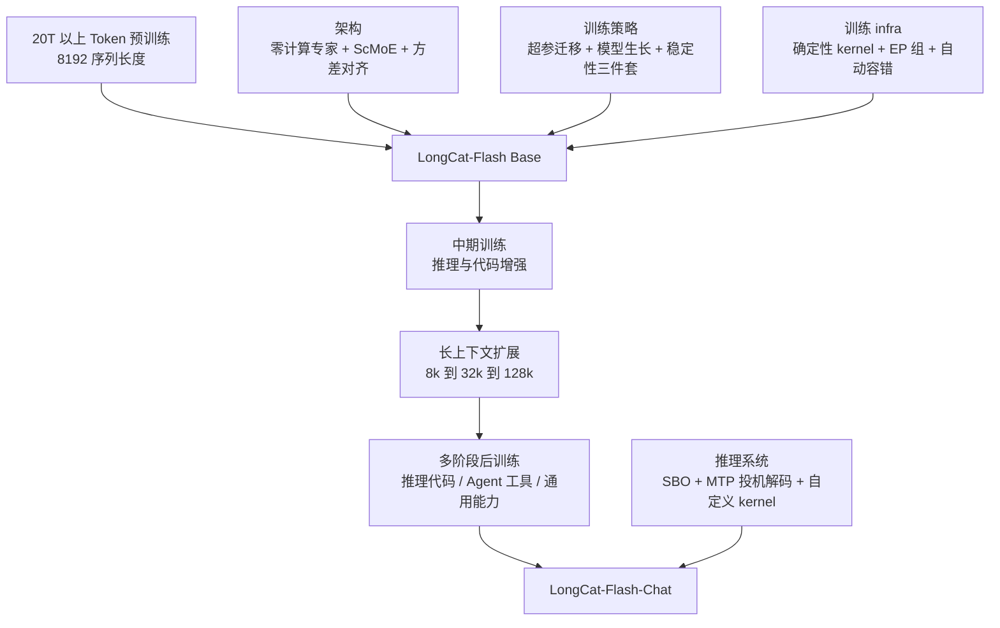
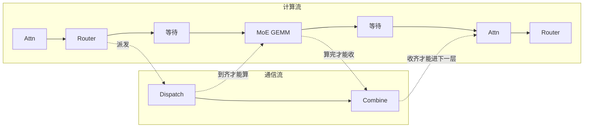
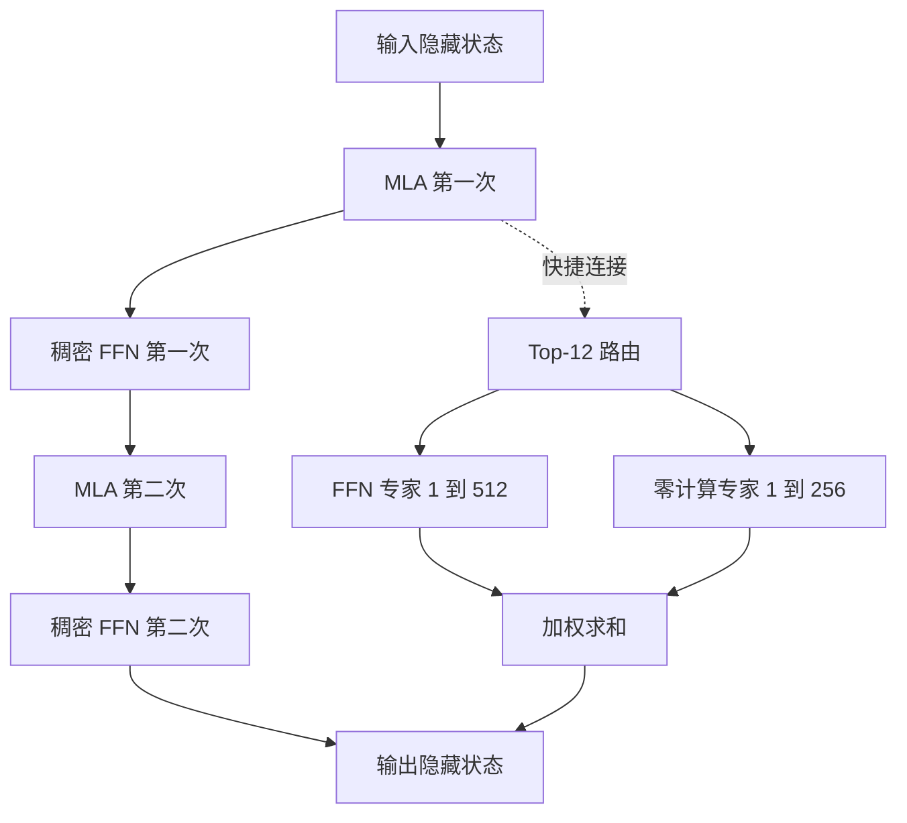
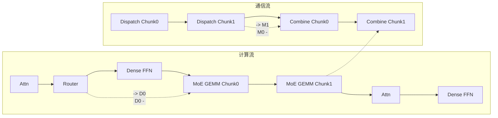
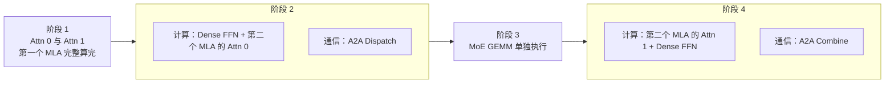
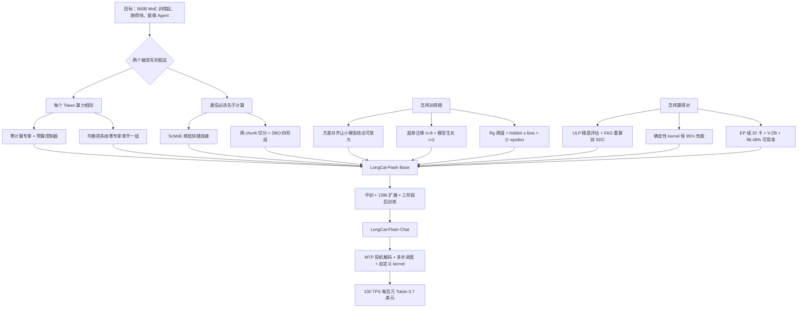

# LongCat-Flash：让每个 Token 自己决定花多少算力，再把通信等待藏进计算里

<!-- release-date: 2025-08-31 -->

> 本文依据美团 LongCat 团队发布的 **LongCat-Flash Technical Report**，即 arXiv:2509.01322v2，2025-09-19 提交的修订版，共 36 页（正文与结论 28 页，作者名单与参考文献 6 页，附录 2 页）。动笔前已核对 arXiv 官方页：这篇报告只有 v1（2025-09-01）与 v2（2025-09-19）两个版本，本地 PDF 就是最新的 v2，不需要替换。页码均指 PDF 本身的页码；原件的印刷页码与 PDF 页码一致，不用换算。文中会把「报告明确写了什么」「我们如何理解它」「哪些是外部资料补充」三层分开。

## 阅读前先搭一张最小地图

先认识几个底层概念：

- **Token（词元）**：模型读写文本的基本小块。一个汉字、一个英文单词片段或一个标点，都可能是一个 Token。
- **混合专家（Mixture-of-Experts，MoE）**：把 Transformer 里的前馈网络（Feed-Forward Network，FFN）拆成很多个「专家」，每个 Token 只交给其中几个专家处理。总参数可以很大，每个 Token 真正用到的参数（激活参数）却很少。
- **路由器（Router）**：MoE 里负责决定「这个 Token 交给哪几个专家」的小网络。它给每个专家打分，取分数最高的 K 个。
- **专家并行（Expert Parallelism，EP）**：专家太多，一张卡放不下，就把不同专家放到不同卡上。于是每个 Token 要先被「派发」（dispatch）到目标专家所在的卡，算完再「收回」（combine）。这两步都是跨卡通信。
- **多头潜在注意力（Multi-head Latent Attention，MLA）**：DeepSeek-V2 提出的注意力变体，把 Key 和 Value 压成一条低维的潜向量再缓存，用来省显存。LongCat-Flash 直接沿用了它。
- **TPS 与 TPOT**：TPS 是每秒生成多少 Token；TPOT（Time-Per-Output-Token）是生成一个 Token 要多少毫秒。两者互为倒数，是衡量推理快慢的两把尺子。

这篇报告最常出现的几个名字是：

- **零计算专家（Zero-Computation Experts）**：一种「什么都不算、把输入原样返回」的专家。路由器选中它，就等于这个 Token 在这一层少算一个专家。
- **快捷连接 MoE（Shortcut-connected MoE，ScMoE）**：把上一个块的稠密 FFN 通过一条跨层快捷连接挪到 MoE 通信旁边，让通信有更大的「被计算遮住」的窗口。
- **方差对齐（Variance Alignment）**：让 MLA 与细粒度专家在初始化时的输出方差，不随着模型变宽、专家变多而漂移。
- **超参迁移（Hyperparameter Transfer）与模型生长（Model Growth）**：分别回答「大模型的学习率怎么定」和「大模型的初始权重从哪来」。
- **hidden z-loss**：一条极小系数的辅助损失，用来压住训练中偶尔冒出的巨大激活值。
- **确定性计算（Deterministic Computation）**：同样的输入重跑一次，loss 逐位相同。它既是复现实验的基础，也是检测硬件静默错误的工具。
- **单批重叠（Single Batch Overlap，SBO）**：推理时在一个 batch 内部就把通信藏进计算，是 ScMoE 在推理侧的直接兑现。

## 一句话先说清

LongCat-Flash 是一个 560B 总参数的 MoE 语言模型，但它最值得记住的不是参数量，而是它对 MoE 两条默认规则的改写：

- 传统 MoE 让每个 Token 激活同样多的专家；LongCat-Flash 让每个 Token 激活 18.6B 到 31.3B 不等的参数，平均约 27B，由路由器按上下文自己决定（PDF p.1、10）。
- 传统专家并行必须先把 Token 派发出去、等通信结束再计算；LongCat-Flash 用一条跨层快捷连接，把上一块的稠密 FFN 计算挪到通信旁边，让通信被计算遮住（PDF p.8）。

再加上一整套「训得稳、算得对、跑得快」的工程：超参迁移与模型生长解决初始化，三件稳定性工具压住 loss 尖峰，确定性 kernel 让每一步都可复现，推理侧用 SBO 与 MTP 投机解码把速度推到单用户 100 TPS。最终报告给出的账单是：30 天训完 20T 以上 Token，训练可用率 98.48%，H800 上每百万输出 Token 0.7 美元（PDF p.4）。

如果只记一句话，可以记：

> **不是所有 Token 都值得同样多的计算，也不是所有通信都必须让计算等着。把这两件事做成架构，而不是做成事后优化。**

## 先看全景：LongCat-Flash 到底由哪几块拼起来

先给出模型的基本尺寸，后面每个设计都会回到这张表上（PDF p.10）：

| 配置 | 数值 |
|---|---:|
| Transformer 层数（不含 MTP 层） | 28 |
| 隐藏维度 | 6144 |
| 注意力头数 × 每头维度 | 64 × 128 |
| MLA 的 KV 压缩维度 / Query 压缩维度 | 512 / 1536 |
| 稠密 FFN 中间维度 | 12288 |
| 每个 FFN 专家的中间维度 | 2048 |
| 每层 FFN 专家数 / 零计算专家数 | 512 / 256 |
| 每个 Token 选中的专家数 K | 12 |
| 总参数 | 560B |
| 每 Token 激活参数 | 18.6B 到 31.3B，平均约 27B |
| 词表大小 | 131,072 |

注意「每个 Token 选中 12 个专家」不等于「每个 Token 激活 12 个 FFN 专家」。12 个名额里有一部分会被零计算专家占掉，占掉几个，取决于路由器怎么判断这个 Token。这正是全文的第一个核心设计。

## 先讲矛盾：MoE 省算力的两个默认假设

MoE 的初衷很朴素：参数多一点，每个 Token 用到的少一点。但它默认了两件事，而这两件事都不太对。

### 假设一：每个 Token 花同样多的算力

传统 Top-K 路由给每个 Token 都分配 K 个专家。预测「的」「，」这样几乎不用思考的 Token，和预测一道数学题的最后一步答案，花的算力一模一样。

报告用投机解码的经验来说明这不合理：小草稿模型能稳定猜中大模型对大多数「简单」Token 的输出，说明那些位置根本不需要大模型的全部算力（PDF p.5）。算力平均分配，等于把简单 Token 上省下来的钱扔掉了。

### 假设二：通信必须先做完，计算才能开始

在专家并行里，一个 MoE 层的执行顺序是固定的：先把 Token 派发到专家所在的卡（dispatch 通信），算专家，再收回结果（combine 通信）。计算依赖通信的结果，所以通信期间计算单元只能干等。模型越大、卡越多，通信占比越高，卡的利用率越低（PDF p.8）。

共享专家架构（如 DeepSeek 的 MoE 系列）的做法是：每个 Token 都要经过的那个专家，可以在通信时先算。但共享专家只有一个，计算量小，能遮住的通信也就那么一点（PDF p.8）。

LongCat-Flash 对这两个假设各给了一个架构层面的回答。

## 核心设计一：零计算专家，让路由器替每个 Token 做算力预算

### 新设计：把「什么都不做」也做成一个专家

LongCat-Flash 在每层的 512 个普通 FFN 专家之外，再放 256 个零计算专家。零计算专家的定义极简单：输入是什么，输出就是什么，不做任何矩阵乘法（PDF p.5–6）。

路由器照常选 Top-12。如果 12 个名额里有 4 个落在零计算专家上，这个 Token 在这一层就只跑 8 个 FFN 专家；如果 12 个全落在 FFN 专家上，就跑 12 个。于是「每个 Token 激活多少参数」变成了路由器的一个输出，而不是一个超参数。

报告把 MoE 模块写成（PDF p.6，式 1）：

$$
\text{MoE}(x_t)=\sum_{i=1}^{N+Z} g_i\,E_i(x_t)
$$

其中

$$
g_i=
\begin{cases}
R(x_t)_i, & \text{若 } R(x_t)_i \in \text{TopK}\big(R(x_t)_i + b_i \mid 1\le i\le N+Z,\ K\big)\\
0, & \text{否则}
\end{cases}
\qquad
E_i(x_t)=
\begin{cases}
\text{FFN}_i(x_t), & 1\le i\le N\\
x_t, & N<i\le N+Z
\end{cases}
$$

符号含义：

- $x_t$：第 $t$ 个 Token 进入 MoE 时的隐藏状态；
- $N=512$ 个 FFN 专家，$Z=256$ 个零计算专家；
- $R$：softmax 路由器，输出每个专家的概率；
- $b_i$：第 $i$ 个专家的偏置，只参与「选谁」，不参与「加权多少」；
- $K=12$：每个 Token 选中的专家数。

有一个细节很值得注意：选择时用的是 $R(x_t)_i+b_i$，但真正的加权系数 $g_i$ 用的是不含偏置的 $R(x_t)_i$。偏置只改排名，不改权重。这与 DeepSeek-V3 的无辅助损失负载均衡是同一种思路（本仓库 DeepSeek-V3 解读里专门讨论过「只改排序、不改权重」为什么是关键）。差别在于，LongCat-Flash 把这条机制从「让专家负载均衡」扩展成了「顺便控制零计算专家被选中的比例」。

### 旧问题：模型不会自己学会省算力

直觉上，模型应该会自己学会「简单 Token 走零计算专家」。报告说事实相反：不加约束时，模型倾向于少用零计算专家，把算力用满（PDF p.6）。

原因不难理解。从语言模型损失的角度看，多算一个专家几乎总是「不亏」的，路由器没有动机把名额让给一个什么都不做的专家。要让动态分配真的发生，必须从外面给它一个预算。

### 预算控制：一个不进梯度的控制器

报告的做法是给每个专家维护一个偏置 $b_i$，每步按下面的增量更新（PDF p.6，式 2）：

$$
\Delta b_i=
\begin{cases}
\mu\left(\dfrac{K_e}{K}\cdot\dfrac{1}{N}-\dfrac{T_i}{K\,T_{\text{all}}}\right), & 1\le i\le N\\[8pt]
0, & N<i\le N+Z
\end{cases}
$$

- $\mu$：偏置的调整速率；
- $T_{\text{all}}$：全局 batch 里的 Token 总数，$T_i$：被路由到第 $i$ 个专家的 Token 数；
- $K_e$：期望每个 Token 平均激活的 FFN 专家数，它小于 $K$。LongCat-Flash 的 $K=12$；$K_e$ 的值报告没有直接写出，但 Figure 3b 的均值收敛在 8、对应 27B 激活参数（PDF p.6），所以 $K_e=8$。

括号里是两个比例的差：前一项是「如果 FFN 专家平均恰好被用 $K_e$ 次，第 $i$ 个专家应占的份额」，后一项是「它实际占了多少份额」。用多了偏置就降，用少了偏置就升。报告称这是一个 PID 控制器（PDF p.6）。

我们的理解是：式 2 显式写出的只有比例项；但偏置本身是逐步累加的，累加就是对误差做积分，所以整个机制的行为更接近积分控制。不必纠结名字，重点在于三件事：

1. 这条更新完全不进语言模型的梯度，与 loss 解耦；
2. 目标不是「每个专家负载相同」，而是「FFN 专家的总使用量落在 $K_e$」，所以它同时管住了零计算专家的份额；
3. 报告把它与 Wang 等人无辅助损失策略里的固定步长增减做对比，说这种按误差比例的更新在专家数增多时，softmax 路由的概率分布更稳（PDF p.7）。DeepSeek-V3 采用的正是那条固定增量的策略，见本仓库 DeepSeek-V3 解读。

零计算专家自己不更新偏置。报告的解释是：它们只是恒等映射，彼此没有区别，需要的只是一个「总量约束」；当所有 FFN 专家都达到各自的期望份额时，零计算专家的总份额自动就等于 $K-K_e$（PDF p.7）。

报告还给了两条经验：大 batch 和对 $\mu$ 做衰减能让预算控制更稳；小 batch 可能需要降低更新频率（PDF p.7）。

### 负载均衡损失也要给零计算专家留位置

偏置解决的是「全语料级别」的均衡。为了防止单个序列内极端不均衡拖垮某个 EP 组，报告另加了一条设备级负载均衡损失，出处标为 DeepSeek-V3（PDF p.7）。把 $N$ 个 FFN 专家分成 $D$ 组，每组 $G=N/D$ 个（PDF p.7，式 3–5）：

$$
\mathcal{L}_{\text{LB}}=\alpha\sum_{j=1}^{D+1} f_j P_j,
\qquad
P_j=\frac{1}{T}\sum_{i\in\text{Group}_j}\sum_{t=1}^{T}R(x_t)_i
$$

$$
f_j=
\begin{cases}
\dfrac{D}{K_e T}\displaystyle\sum_{t=1}^{T}\mathbb{I}(\text{token } t \text{ 选中 Group}_j), & 1\le j\le D\\[10pt]
\dfrac{1}{(K-K_e)T}\displaystyle\sum_{t=1}^{T}\mathbb{I}(\text{token } t \text{ 选中零计算专家}), & j=D+1
\end{cases}
$$

- $T$：一个 micro batch 的 Token 数；$\alpha$：损失系数；$\mathbb{I}$：指示函数；
- $P_j$：第 $j$ 组专家拿到的平均路由概率；$f_j$：第 $j$ 组实际被选中的频率。

关键动作是第 $D+1$ 组：所有零计算专家单独成一组，频率的归一化分母用 $K-K_e$，而 FFN 组用 $K_e$。这样损失收敛时，FFN 专家与零计算专家的使用比恰好趋向 $K_e:(K-K_e)$，即 8:4（PDF p.7）。这条损失不是新发明，但「给零计算专家单开一组、分母按预算配」是让老机制兼容新专家的必要改动。

### 收益：同样算力下 loss 更低

报告用一个对照实验证明零计算专家有效（PDF p.6，Figure 3a）：

| 配置 | Top-K | 每 Token 激活参数 | 平均 FFN 专家数 |
|---|---:|---|---:|
| 基线 | 8 | 固定 6B | 8 |
| 加零计算专家 | 12 | 动态 4.2B 到 7.0B | 8（波动小于 1%） |

两者的平均算力相同，加零计算专家的那条验证 loss 曲线全程更低。图的横轴是训练 Token 数，到约 500B 为止，两条曲线之间的差距稳定存在（读自 PDF p.6 Figure 3a；报告没有给出具体的 loss 差值）。

这个实验的设计值得学：它没有比较「加零专家 vs 不加」，而是比较「同样平均算力下，固定分配 vs 动态分配」。否则读者无法分辨收益来自动态性还是来自 Top-K 变大。

### 训练中真的学会了按需分配吗

报告跟踪了 LongCat-Flash 正式训练中每个 Token 激活的 FFN 专家数（PDF p.6–7，Figure 3b、3c）：

- 平均值在约 20B Token 的调整后收敛到 8，之后所有层的波动小于 1%；
- 标准差却一直维持在较高水平。图注说它「增长到 3」；从图上读，曲线末端在 2.4 到 2.5 附近，仍在缓慢上升（读自 PDF p.6 Figure 3c）。

平均值稳、标准差大，正是「预算被控住、分配却不均匀」的证据。附录给了更细的观察（PDF p.35–36）：

- 按评测集统计，平均激活 FFN 专家数从 GSM8K 的 7.46、CMMLU 的 7.71，到 MATH 的 8.03、HumanEval 的 8.13、MBPP 的 8.24、MMLU 的 8.32。报告的总结是英文 Token 比中文与数学 Token 分到更多算力（读自 PDF p.35 Figure 11）；
- 逐 Token 看，第一层里冠词、连词、介词这类功能词以及数字和标点，稳定地拿到较少算力；第 28 层的分配没有第一层那么「专门化」，但仍有可辨的模式，例如中文里标点前的 Token 往往少算（PDF p.35–36，Table 8）。

报告对此的假设是：浅层按 Token 自身语义分配，深层按预测难度分配（PDF p.35）。这是作者的观察和猜想，不是被消融实验证明的结论。

### 算一笔参数账

报告只给了 18.6B、31.3B 和 27B 三个数（PDF p.1、10）。我们可以用配置表反推它们的来历，作为理解「动态激活」到底动了什么的练习：

- 一个 FFN 专家若用 SwiGLU 结构，有三个 $6144\times 2048$ 的矩阵，约 37.7M 参数；28 层叠起来，一个「专家名额」约 1.06B；
- 12 个名额的差额正好是 $31.3-18.6=12.7\text{B}$，即 $12\times 1.06$；
- 于是 18.6B 是「12 个名额全给零计算专家」时的固定部分（两个 MLA、两个稠密 FFN、嵌入等），31.3B 是「12 个名额全给 FFN 专家」；
- 平均 8 个 FFN 专家：$18.6+8\times 1.06\approx 27.1\text{B}$；
- 专家总量：$512\times 28\times 37.7\text{M}\approx 541\text{B}$，加上约 18.6B 的稠密部分，约 560B。

四个数字互相吻合。这是我们的推算，报告没有写这套账；它的用处是提醒读者：动态激活只动 FFN 专家这一块，注意力与稠密 FFN 是每个 Token 都要跑的固定成本。

### 代价与边界

- **推理系统要认识零计算专家**。部署时 DeepEP 与 EPLB 都被改过，让零计算专家的输出不需要通信（PDF p.26）。任何想复用这个设计的人，都要在推理框架里补同样的特判。
- **收益的证据来自 6B 激活的小模型对照**，正式模型上只有「平均值收敛、标准差大」的间接证据，没有 560B 规模的 A/B。
- **英文比中文和数学分到更多算力**这件事，报告只陈述、没解释，也没说是否影响中文任务表现（PDF p.35）。
- 动态激活让每个 Token 的计算量不同，batch 内负载会更不齐；报告在训练侧用 EP 组内的均衡损失、推理侧用 EPLB 兜底，但没有量化这带来的额外不均衡。

### 可迁移启发

- **给「不做」一个显式选项，往往比让模型学会「少做」更容易**。路由器天然倾向用满预算，需要一个不进梯度的控制器从外面设总量。
- **控制目标要写成比例而不是布尔**。式 2 的目标不是「谁超载」，而是「实际份额减去期望份额」，这让同一条规则同时管住了均衡与预算。
- **对照实验要固定平均算力**，否则动态分配的收益无法与「多选几个专家」的收益分开。
## 核心设计二：ScMoE，把上一块的稠密 FFN 挪到通信旁边

### 旧问题：专家并行里的串行等待

先看没有快捷连接时，两个连续 MoE 层的时间线（根据 PDF p.22 Figure 8a 重画，机制示意，不代表真实时长）：

计算流里有两段空白：dispatch 没到齐之前不能算专家，专家没算完之前不能 combine，combine 没结束之前下一层不能开始。共享专家能填一小段，因为它的计算量只相当于一个专家（PDF p.8）。

### 新设计：让稠密 FFN 与 MoE 并排，而不是串联

LongCat-Flash 的每一层不是「注意力 + MoE」，而是「MLA → 稠密 FFN → MLA → 稠密 FFN」这条主干，外加一个 MoE 块；MoE 块的输入不是取自紧邻的前一步，而是通过一条快捷连接，直接取自**第一个 MLA 的输出**（PDF p.5，Figure 2）。报告称这是 ScMoE（Shortcut-connected MoE），出处是 Cai 等人 2024 年的论文（PDF p.8；论文题目见文末资料节）。

把结构画出来（根据 PDF p.5 Figure 2 重画，机制示意）：

关键在于依赖关系：MoE 块只依赖第一个 MLA 的输出，所以它的 dispatch 可以在第一个 MLA 算完的那一刻就发出；而此时主干上还有「稠密 FFN → 第二个 MLA → 稠密 FFN」一整段计算要做。这一整段就是通信可以躲进去的窗口。用报告的话说，上一块的稠密 FFN 与当前 MoE 层的 dispatch/combine 并行执行（PDF p.8）。

再看时间线怎么变（根据 PDF p.22 Figure 8b、8c 重画，机制示意）：

报告还把 MoE 层沿 Token 维度切成两个 chunk：Chunk0 的 dispatch 到了先算 Chunk0，同时 Chunk1 还在路上；Chunk0 算完立刻 combine，同时算 Chunk1（PDF p.22）。两个 chunk 之间互相遮，加上稠密 FFN 遮 dispatch、下一层的注意力与稠密 FFN 遮 combine，通信裸露的部分就很小了。

### 收益一：质量中性

任何改执行顺序的架构都要回答「模型会不会变差」。报告在三种规模、三种注意力上做了带与不带 ScMoE 的对照（PDF p.7–8，Figure 4）：

| 配置 | 激活参数 / 总参数 | 注意力类型 |
|---|---|---|
| a | 2.4B / 16B | MLA |
| b | 3B / 20B | MHA |
| c | 15B / 193B | GQA |

三组的训练 loss 曲线几乎重合（读自 PDF p.7 Figure 4）。报告的结论是 ScMoE 对质量中性，且其收益与模型规模、注意力类型无关（PDF p.8）。

这里要保留一点谨慎：三组实验的最大规模是 193B 总参数，且比较的是训练 loss，不是下游任务；正式的 560B 模型没有做「不带 ScMoE」的对照，那太贵了。

### 收益二：训练侧通信裸露从 25.3% 降到 8.4%

报告的训练并行策略里，dispatch/combine 没有用原生 all-to-all，而是用带流水的 all-gather/reduce-scatter kernel。原因有两个：原生 all-to-all 会把本地数据放大 top-k 倍再走 200Gb/s 的 RDMA 网络，且拥塞控制不足导致性能不稳（PDF p.22）。在这套通信方案下，加上 ScMoE 后，不能被计算遮住的 dispatch/combine 通信占比从 25.3% 降到 8.4%（PDF p.22）。

### 收益三：推理侧理论 TPOT 降近一半

报告称，ScMoE 让推理可以用「单批重叠」（SBO）流水线，理论上把 TPOT 比 DeepSeek-V3 这类模型降低近 50%；而且稠密 FFN 上的张量并行通信走节点内 NVLink，专家并行通信走节点间 RDMA，两条网络可以同时跑满（PDF p.8）。具体怎么做，本文放到推理一节讲。

### 代价与边界

- 每层有两个 MLA 和两个稠密 FFN，比常规的「一个注意力 + 一个 MoE」多出一个 MLA 和两个稠密 FFN，这是每个 Token 都要跑的固定成本。前面的参数账里，18.6B 的固定部分正是这么来的。报告在推理分析里也承认，LongCat-Flash 暴露出一个无法被通信遮住的 MLA，同 batch 下每层时间反而比 DeepSeek-V3 略长，靠层数少（28 层对 61 层）才把总延迟压下来（PDF p.28）。
- 「通信被遮住」依赖稠密 FFN 的计算量足够大。稠密 FFN 中间维度 12288 是隐藏维度的 2 倍（PDF p.10），这个比例是否为最优，报告没有讨论。
- ScMoE 是已有工作（Cai 等，2024），不是这篇报告新提出的；报告的贡献是把它做进 560B 规模，并给出规模与注意力类型上的中性证据。

### 可迁移启发

- **重叠窗口的大小由数据依赖决定，不由调度技巧决定**。想遮住通信，先看有没有一段不依赖通信结果的计算可以并排放；没有，就在架构上造一段。
- **把大块切成 chunk 让通信与计算互相遮**，是通用手法；ScMoE 的特别之处只是让第一个 chunk 也有东西可遮。

## 核心设计三：方差对齐，让小模型上好用的设计放大后不失灵

### 旧问题：小规模验证过的结构，放大后表现不可预测

报告观察到，一些在小模型上表现好的架构选择，放大后会变差，反之亦然，使得小规模实验的结论不可靠。他们把原因归结为特定模块的**方差失配**：初始化时某些向量的方差随维度变化而漂移，导致不稳定与性能退化（PDF p.8）。两处修正分别针对 MLA 与细粒度专家。

### MLA 的尺度修正

MLA 把 Query 和 Key 各拆成两部分：一部分从低秩压缩向量恢复（记作 $q^C$、$k^C$），另一部分带旋转位置编码（记作 $q^R$、$k^R$）。LongCat-Flash 在压缩向量上乘了两个修正系数（PDF p.8，式 6）：

$$
c^Q_t=\alpha_q\,W^{DQ}h_t,\qquad c^{KV}_t=\alpha_{kv}\,W^{DKV}h_t
$$

问题出在初始化时各分量的方差来源不同（PDF p.9）：

- $q^C$、$q^R$ 的方差正比于 Query 压缩维度 $d_q$（1536）；
- $k^C$ 的方差正比于 KV 压缩维度 $d_{kv}$（512）；
- 而 $k^R$ 直接从 $h_t$ 算出，方差正比于整个模型维度 $d_{\text{model}}$（6144）。

三个不同的维度混在一个点积里，$d_q$、$d_{kv}$、$d_{\text{model}}$ 一变，注意力分数的尺度就变。修正的办法是把低秩路径都缩放到以 $d_{\text{model}}$ 为参考（PDF p.9，式 7）：

$$
\alpha_q=\sqrt{\frac{d_{\text{model}}}{d_q}},\qquad \alpha_{kv}=\sqrt{\frac{d_{\text{model}}}{d_{kv}}}
$$

代入 LongCat-Flash 的数字，$\alpha_q=\sqrt{6144/1536}=2$，$\alpha_{kv}=\sqrt{6144/512}\approx 3.46$（这是我们按式 7 代入配置得到的，报告没有直接写出这两个值）。报告在一个 1B 激活参数的 MoE 上验证，加修正后 loss 更低（PDF p.9，Figure 5a）。

### 细粒度专家的初始化补偿

LongCat-Flash 沿用 DeepSeekMoE 的细粒度专家：把每个专家切成 $m$ 个更小的专家（DeepSeekMoE 的出处与动机见本仓库 DeepSeek-V2 解读）。报告发现这个设计对专家数、top-k、$m$ 等其他选择很敏感，原因是切分让 MoE 层初始化时的输出方差缩小了（PDF p.9）。

补偿方法是给专家加权和整体乘一个系数 $\gamma$（PDF p.9，式 8）：

$$
\text{MoE}(x_t)=\gamma\left(\sum_{i=1}^{mN}g_i\cdot E_i(x_t)\right)
$$

$\gamma$ 的来源是两个各缩小 $m$ 倍的效应（PDF p.9）：

1. **门控稀释**：专家从 $N$ 个变成 $mN$ 个，softmax 的概率要分给更多专家，单个 $g_i$ 的量级约缩小 $m$ 倍，输出方差随之约缩小 $m$ 倍；
2. **维度缩减**：每个细粒度专家的中间维度缩小 $m$ 倍，单个专家输出的方差也约缩小 $m$ 倍。

两个效应叠起来方差缩小 $m^2$ 倍，标准差缩小 $m$ 倍，所以 $\gamma=\sqrt{m\cdot m}=m$。

### 可迁移启发

这一节的方法论比公式更值得带走：**每引入一个改变维度或专家数的设计，就问一次「初始化时的方差还对不对」**。小模型上不显眼的方差漂移，往往在放大时变成不可解释的退化。方差对齐不能替代消融，但它能让小规模实验的结论更可能在大规模上成立，这对「用小模型定超参、再迁移到大模型」的整套流程至关重要，下一节马上会用到。

## 其他模型信息：分词器与 MTP

分词器是 BPE，词表 131,072，在 GPT-4 的预分词框架上做了两处改动：加强中日韩字符切分；数字独立切分以帮助数学能力（PDF p.10）。

多 Token 预测（Multi-Token Prediction，MTP）作为辅助训练目标被保留，用途是推理时做投机解码的草稿模型。两个选择值得注意（PDF p.10）：

- MTP 头用**单个稠密层**而不是 MoE 层；
- 报告观察到 MTP loss 收敛很快，所以把 MTP 训练放在训练流程中段才引入，在模型性能与草稿准确率之间取平衡。

MTP 头在评测中的接受率超过 90%（PDF p.10）。为什么选稠密层、接受率怎么换算成速度，推理一节再展开。

## 训练策略：怎样把一个 560B 模型训得稳

架构解决「算什么」，训练策略解决「怎么把它训出来」。报告在这里的三块内容都是奔着一个目标去的：不要在大模型上做昂贵的试错。

### 超参迁移：在 768 宽的代理模型上搜，按规则迁到 6144

大模型的学习率和初始化方差不能靠在大模型上搜索，太贵。LongCat-Flash 用的是基于宽度缩放的超参迁移：先在一个小的代理模型上找到最优超参，再按理论推导的规则迁到目标模型（PDF p.10）。

核心量是宽度缩放因子 $s=n_{\text{target}}/n_{\text{proxy}}$，$n$ 是隐藏维度。报告采用 Everett 等人提出的「Adam LR Full Align」规则，针对标准参数化（Standard Parameterization），规则见下表（PDF p.10，Table 1）：

| 层与参数 | 目标模型设置 |
|---|---|
| 嵌入层初始化方差 | $\sigma^2_{\text{target}}=\sigma^2_{\text{proxy}}$ |
| 嵌入层学习率 | $\eta_{\text{target}}=\eta_{\text{proxy}}$ |
| 隐藏层与输出层初始化方差 | $\sigma^2_{\text{target}}=\sigma^2_{\text{proxy}}/s$ |
| 隐藏层与输出层学习率 | $\eta_{\text{target}}=\eta_{\text{proxy}}/s$ |

实际步骤是（PDF p.11）：

1. 取 $s=8$，代理模型宽度 768（$768\times 8=6144$，正好是目标隐藏维度）；这个 $s$ 是在计算成本与迁移效果之间权衡出来的；
2. 在代理模型上做完整的超参搜索，找到逐层的最优初始化方差与学习率；
3. 按 Table 1 迁移到目标模型。深度、稀疏度、batch size 在迁移中保持不变。

报告称这显著降低了为大模型寻找最优超参的计算成本，但没有公开搜出来的具体学习率、方差值，也没有给出「迁移后的超参与大模型直接搜索的结果差多少」这类验证数据（PDF p.11）。读者能拿到的是方法与规则，拿不到数字。

### 模型生长：先训一个 14 层的，再叠成 28 层

初始化不用随机，而是从一个「半尺寸」模型开始。做法是层堆叠（PDF p.11）：

$$
L_{\text{small}}=l_1\circ l_2\circ\cdots\circ l_n,\qquad
L_{\text{target}}=\underbrace{L_{\text{small}}\circ L_{\text{small}}\circ\cdots\circ L_{\text{small}}}_{r}
$$

- $l_i$：小模型第 $i$ 层的变换；$L_{\text{small}}$：小模型从嵌入到最终隐藏状态的整体变换；
- $r$：扩展倍数，LongCat-Flash 取 $r=2$。

具体到正式训练：先用随机初始化训一个 14 层、结构与目标完全相同的模型，在数据的起始段上训数百亿 Token；然后把它叠成 28 层的 checkpoint，并保留全部训练状态，包括样本计数器与学习率调度（PDF p.11）。

报告观察到一条特征曲线：生长初始化的模型 loss 先上升，随后加速收敛，最终优于随机初始化（PDF p.11，Figure 5b，一个 6B 激活参数的对照）。报告给出两个猜想（PDF p.11）：

1. 小模型收敛更快，给大模型提供了更好的初始参数；
2. 生长操作可能起到了隐式正则化的作用，防止参数塌缩。

还有一条实用警告：把前身模型训过头，反而会伤害目标模型的 Token 效率，所以生长的时机要拿捏（PDF p.11）。报告没有说 14 层模型具体训了多少 Token 才生长，只说「数百亿」。

### 稳定性三件套

报告从路由、激活、优化器三个方向处理稳定性（PDF p.11）。

#### 路由稳定：给均衡损失的系数一个可测的上限

MoE 路由器同时受两股梯度拉扯（PDF p.11）：

- 语言模型损失，推动专家分工（把 Token 送给最合适的专家）；
- 负载均衡损失，推动路由均匀（把 Token 平均撒开）。

当均衡梯度占上风，所有专家的路由权重会趋同，路由变得与输入无关，条件计算的意义就没了。报告提出两个监控指标（PDF p.12）：

- **路由权重相似度**：各专家路由权重向量 $\{w_i\}$ 两两余弦相似度的平均值。相似度高，就是均衡损失过强的直接信号；
- **梯度范数比** $R_g$：两条损失对 batch 平均专家概率向量 $\vec P$ 的梯度范数之比（PDF p.12，式 9）：

$$
R_g=\frac{\lVert\alpha\nabla_{\vec P}\mathcal{L}_{\text{LB}}\rVert_2}{\lVert\nabla_{\vec P}\mathcal{L}_{\text{LM}}\rVert_2}
$$

这里 $\mathcal{L}_{\text{LB}}$ 是不含系数 $\alpha$ 的均衡损失。报告的准则是让均衡项只做正则项、不压过语言模型损失，建议把 $R_g$ 控制在一个小阈值之下，例如 $R_g<0.1$（PDF p.12）。

这条准则的价值在于它把「$\alpha$ 取多大」从经验数字变成了可测量的目标：不同规模、不同专家数下，$\alpha$ 的合理值会变，但 $R_g<0.1$ 这个判据可以沿用。

#### 激活稳定：hidden z-loss 压住巨大激活值

大模型训练中会出现「巨大激活」：个别隐藏状态元素的量级远超其他。报告观察到这种现象与严重的 loss 尖峰相关联（PDF p.12）。受 ST-MoE 的 router z-loss 启发，报告设计了 hidden z-loss，作用在最后一层输出（做最终层归一化之前）上（PDF p.12，式 10）：

$$
\mathcal{L}_Z=\frac{\lambda}{T}\sum_{t=1}^{T}\left(\log\sum_{i=1}^{|z_t|}\exp(\text{abs}(z_t^i))\right)^2
$$

- $z_t$：第 $t$ 个 Token 的最后一层输出，$|z_t|$ 是隐藏维度，$z_t^i$ 是第 $i$ 个分量；
- $\text{abs}$：取绝对值；$\lambda$：系数；$T$：Token 数。

$\log\sum\exp$ 近似于「最大的那个绝对值」，平方后只有量级极大的元素会贡献显著的损失，所以它专门惩罚离群值，不扰动正常范围的激活。报告在一个超参不理想的小模型上演示：不加时最后一层隐藏状态的 L2 范数从 1000 量级一路飙到 $10^7$ 量级，训练 loss 在约 20k 步处出现尖峰；加了系数 $10^{-7}$ 的 hidden z-loss 之后范数曲线平稳，训练 loss 没有变差（读自 PDF p.12 Figure 6；系数值来自图例）。报告称这降低了 BF16 训练中数值错误的风险。

#### 优化器稳定：Adam 的 epsilon 不是可以忽略的常数

Adam 更新里的 $\epsilon$ 传统上被当作防止除零的小常数。报告指出，模型越大它越关键，因为大模型用更小的初始化和更大的 batch，梯度二阶矩会变得很小；当 $\epsilon$ 与二阶矩的量级相当甚至更大时，自适应机制就被破坏了（PDF p.12）。

报告跟踪了从 390K 到 400M 参数一系列模型的梯度 RMS 范围，发现两条规律（PDF p.12–13，Figure 7）：

1. **阈值效应**：$\epsilon$ 接近梯度 RMS 时，loss 迅速恶化；
2. **下界稳定**：$\epsilon$ 一旦低于这个阈值，再降对性能几乎没有影响。

所以建议把 $\epsilon$ 设得比预期梯度 RMS 小好几个数量级。LongCat-Flash 用 $\epsilon=10^{-16}$（PDF p.12）。报告还引了 OLMo 的经验，说 $10^{-8}$ 比「默认的 $10^{-5}$」好；这里的「默认」是报告原话，与常见框架的默认值可能不一致，读者不必纠结。

### 这一节的可迁移启发

- **昂贵模型上不搜超参**，在有理论保证的规则下从代理模型迁移；方差对齐是让迁移成立的前提。
- **初始化可以是训练的一部分**：先训一半深度再叠，前身不要训过头。
- **稳定性问题先做成可监控的指标**：路由相似度、$R_g$、最后一层范数、梯度 RMS 与 $\epsilon$ 的距离。指标先于修复。
- hidden z-loss 与 $\epsilon$ 这两条几乎零成本，是最容易直接复用的。
## 数据与训练 recipe：三阶段课程

预训练分三段（PDF p.10）：

1. **通用预训练**：约 20T Token，序列长度 8192，建立基础模型；
2. **推理与代码增强**：报告称使用「数万亿」数据，属于中期训练；
3. **长上下文扩展**：把上下文扩到 128k。

每段都有自己的数据策略和去污染流程。

### 通用预训练的数据管线

报告只给了流程形状，没有给各来源占比（PDF p.13）：

- **内容抽取**：网页用定制版 trafilatura；STEM 材料另走一条流程，专门处理公式、代码和表格；
- **质量过滤**：两步，先用分类器去掉明显低质文档，再按流畅度、完整性等指标细筛；
- **去重**：MinHash 大规模去重，外加识别重复网页模板的策略。

数据配比走两段（PDF p.13）：

- **第一阶段**：通用数据用 SampleMix 的实例级混合策略，先由质量分与多样性分算出初始采样分布，再按细粒度领域与写作风格标签调整。广告、体育、招聘这类低价值领域降采样，科学这类推理密集领域升采样；
- **第二阶段**：STEM 与代码占最终配比的 70%。报告提到一条踩过的坑：突然减少通用数据会让模型能力暂时下降，所以代码比例是逐步提高的，并用外部验证集的困惑度持续监控，保证过渡平滑。

### 中期训练：合成数据的三个机制

为了给后训练准备一个更强的底子，中期训练用了「预训练数据检索 + 数据合成」得到的高质量推理与代码数据。合成流程有三个机制（PDF p.13）：

1. 知识图谱遍历与节点组合，保证概念复杂度与领域覆盖；
2. 多阶段迭代精炼，逐步提高难度与思维链质量；
3. 文本与计算两种模态的生成与验证，保证数学准确性与解答有效性。

规则过滤与模型过滤并用，最终数据量为「数千亿 Token」（PDF p.13）。

### 长上下文扩展：两步走，RoPE 底数分两次抬

| 阶段 | 上下文 | 训练 Token | RoPE 底数 |
|---|---:|---:|---:|
| 第一步 | 8k 到 32k | 80B | 1,000,000 到 5,000,000 |
| 第二步 | 32k 到 128k | 20B | 提到 10,000,000 |

（PDF p.14）语料以自然长文本为主，如高质量书籍和小说；另外专门整理了仓库级源码：挑选高质量仓库，多阶段过滤掉非文本内容、构建产物和自动生成代码，得到一个 20B Token 的长上下文代码集（PDF p.14）。为了不伤通用能力，数据配比与主预训练相同，再额外加入 25% 的长上下文数据（PDF p.14）。

### 去污染

两套标准（PDF p.14）：

- 网页与代码数据：与预定义测试集有任何 13-gram 重叠就删；
- 合成数据与问答对：用 BGE-m3 嵌入做语义相似度，满足任一条件就删——与任一测试样本语义相似度大于 0.9；或词面重叠（稀疏嵌入）且相似度落在 0.7 到 0.9。

### Base 模型的评测

报告把 LongCat-Flash Base 与 DeepSeek-V3.1 Base、Llama-4-Maverick Base、Kimi-K2 Base 放在同一套评测流水线下比较；少数无法复现的结果直接取自公开报告并加星号标注（PDF p.14）。几个代表性数字（PDF p.15，Table 2）：

| Benchmark | DeepSeek-V3.1 Base | Llama-4-Maverick Base | Kimi-K2 Base | LongCat-Flash Base |
|---|---:|---:|---:|---:|
| 总参数 / 激活参数 | 671B / 37B | 402B / 17B | 1043B / 32B | 560B / 27B |
| MMLU | 87.46 | 84.41 | 87.47 | 87.05 |
| MMLU-Pro | 59.29 | 63.90 | 68.36 | 70.32 |
| GPQA | 47.16 | 48.08 | 45.89 | 51.09 |
| SuperGPQA | – | 40.58* | 44.70* | 54.19 |
| GSM8K | 92.22 | 84.61 | 92.27 | 92.19 |
| MATH | 61.56 | 63.34 | 66.74 | 64.82 |
| MBPP+ | 59.26 | 70.11 | 80.49 | 77.25 |
| HumanEval+ | 67.07 | 60.37 | 69.84 | 65.85 |
| MultiPL-E | 62.00 | 58.35 | 59.22 | 69.25 |
| CRUXEval-O | 71.25 | 64.25 | 68.75 | 75.88 |

报告的自我评价是：以更少的参数与 DeepSeek-V3.1 Base 打平，MMLU-Pro 上明显领先；对 Kimi-K2 Base，通用任务略低，推理、数学、代码持平或领先（PDF p.15）。从表上看这个评价基本成立，但也要看到 HumanEval+ 与 CEval、CMMLU 都不是最高。「参数效率高」是合理结论，「全面领先」不是。

## 后训练：把一个 Base 往 Agent 方向拉

### 先说报告没写的

报告把后训练称为「常规的多阶段框架」，分推理与代码、Agent 工具使用、通用能力三个阶段（PDF p.15）。它详细写了每个阶段的**数据怎么来**，却几乎没写训练本身：用了哪种强化学习算法、有没有奖励模型、每阶段 SFT 与 RL 的数据量、训练步数、超参，报告都未公开。读这一节要有一个预期：这是一份「数据合成方法」的说明，不是一份可复现的后训练 recipe。本仓库另有同团队后续的 LongCat-Flash-Thinking 原件（索引登记为讲领域并行训练与异步 rollout），本文不展开。

### 阶段一：推理与代码

**数学**用「角色（persona）+ self-instruct」生成新题（PDF p.16）：先构造一批带 STEM 学科标签的数学相关角色，来源包括预训练数据、已有数学题和 Persona Hub，用 MinHash 挑出多样的角色集；再让模型以这些角色的口吻出题，覆盖从初等到高等的完整框架，并要求答案带思维链。答案验证分两步：多个模型各答一遍取最一致的解；再训一个用推理数据强化过的生成式奖励模型，给解题步骤的逻辑打分。

**代码**的查询来自公开数据集、GitHub 代码片段生成、编程论坛和 Code Evol-Instruct 演化，按主题多样性与难度平衡分布；训一个模型挑选清晰、一致、正确、解释充分的查询，再用过滤管线去掉乱码、重复和逻辑错误的回答（PDF p.16）。软件工程任务上，报告整理并验证了「数万个」带测试用例的 Docker 镜像，用一个基于 Agent 的系统自主分析代码结构、定位文件、修 bug、加功能，产出「数千条」通过全部测试的轨迹（PDF p.16）。

**逻辑推理**覆盖演绎、假设、归纳三类，包括 LogicPro、PODA 和 Zebra 类谜题。难度控制先用 Pass@k 做初步平衡，再剔除先进思考模型也解不出的题；选择题改成填空题以防猜对（PDF p.16）。

### 阶段二：Agent 工具使用，把「难」拆成三个轴

这是报告在后训练里写得最用心的部分。它先给了一个定义：Agent 任务是通过系统性的环境交互解决复杂问题；环境由**用户**和**工具**组成，两者性格不同（PDF p.16）：

- 用户是独立的信息提供者，没有上下游依赖，但不愿被打扰、不会主动透露信息，所以模型要尽量少问，问就要问到点子上；
- 工具可以频繁调用，但工具之间有复杂的依赖关系。

在此基础上，报告把任务难度归结为三个可控的维度（PDF p.16）：

1. **信息处理复杂度**：需要多少推理才能把信息整合、转换成所需的形式；
2. **工具集复杂度**：把工具集建模成依赖关系的有向图，用节点数和边密度量化；
3. **用户交互复杂度**：多轮策略性提问，适应不同的对话风格、沟通意愿和信息披露模式。

然后用一组分工明确的 Agent 合成任务（PDF p.17）：

| Agent | 负责什么 |
|---|---|
| UserProfileAgent | 生成用户画像，并控制对话风格、沟通意愿、信息披露模式 |
| ToolSetAgent | 枚举 40 个领域、1,600 个应用、80,000 个模拟工具，构成工具图；随机游走采样指定节点数的子图，从而控制工具复杂度。报告说这一步的思路类似 Kimi-K2 |
| InstructionAgent | 按约束复杂度、推理点数量、推理链长度三个维度生成完整任务描述 |
| EnvironmentAgent | 补充物品、地点、时间、天气等环境信息，并加入干扰项 |
| RubricAgent | 生成任务相关的检查清单；评估时用滑动窗口扫整条轨迹，持续更新清单完成状态 |
| ValidatorAgent 与 DeduplicatorAgent | 多角度查质量，去掉过于相似的任务 |

有了任务，再做严格的回答筛选，构建冷启动训练集；另外挑出一部分任务留给后续训练，「让每个任务都值得大量探索」（PDF p.17）。「后续训练」是什么、怎么探索，报告没有展开。

这套框架里最值得学的不是六个 Agent 的分工，而是**先定义难度轴、再让每个轴可控**：工具复杂度由子图节点数控制，用户复杂度由画像参数控制，信息复杂度由指令生成的三个维度控制。可控才能做课程，才能分析模型在哪个轴上弱。

### 阶段三：通用能力

- **指令遵循**：单轮与多轮，约束复杂度与数量分档；多约束查询按 Ye 等人的方法过滤语义质量低或约束冲突的；用可验证规则、模型验证和定制策略保证回答满足全部约束。报告有一个实用发现：某些约束类型本身就很难遵守，直接生成合格的问答对不可靠，于是改用**反向生成**——先写一个保证满足约束的答案，再从答案反推问题（PDF p.17）。
- **长上下文**：阅读理解、表格问答和自定义任务三类；把主题相关的片段聚合起来构造数据，强化多跳推理、多轮对话与复杂计算；对不完整的上下文，专门优化拒答能力以减少幻觉（PDF p.17）。
- **安全**：在 Mu 等人的框架上，把查询分成 40 多个安全类别，回答分五种类型——遵从、按指引遵从、软拒绝、按指引软拒绝、硬拒绝。查询来源包括开放语料、内部业务风险报告、政府问答和对抗式红队合成；自动标注加人工校验后，映射到回答类型并生成优化过的回答，经人工评估后作为训练目标（PDF p.17）。

### Chat 模型的评测口径

报告比较的对象都是**非思考**模式的聊天模型：DeepSeek-V3.1、Qwen3-235B-A22B（2507 版）、Kimi-K2、GPT-4.1、Claude4-Sonnet、Gemini2.5-Flash；闭源模型走官方 API，支持思考模式的模型显式关闭思考（PDF p.18）。几个影响读数的口径（PDF p.18–19）：

- 通用领域 benchmark 不用精确匹配，而是用一个打分模型判断回答是否与参考答案一致；报告自己承认这会让分数略高于原始文档；
- AIME 类取 10 次平均；
- SWE-Bench-Verified 用 R2E-Gym（OpenHands 脚手架），限 100 次迭代；DeepSeek-V3.1 例外，用 OpenHands；TerminalBench 用 Terminus 框架直接提示；
- AceBench 用直接提示而不是函数调用；
- 自建的 VitaBench 用滑动窗口沿整条轨迹更新检查清单状态。

VitaBench 取材于美团的真实业务场景，跨领域的日常任务，明确标出工具间依赖，刻意不提供大量领域策略；平均每个任务超过 30 个可用工具，被评模型平均超过 60 轮交互。报告说完整数据集与构建方法「将在后续工作中发布」（PDF p.18），所以本文写作时它仍是私有 benchmark。Meeseeks 则是同团队另一篇论文提出的多轮指令遵循评测，用迭代反馈模拟真实的人机交互（PDF p.18）。

### 结果：强在 Agent 与指令遵循，弱在长上下文结构化推理

代表性数字（PDF p.20，Table 3；带星号的取自其他公开报告）：

| Benchmark | DeepSeek-V3.1 | Qwen3-235B-A22B | Kimi-K2 | GPT-4.1 | Claude4-Sonnet | Gemini2.5-Flash | LongCat-Flash |
|---|---:|---:|---:|---:|---:|---:|---:|
| ArenaHard-V2 | 84.10 | 88.20 | 85.70 | 61.50 | 62.10 | 77.00 | 86.50 |
| IFEval | 86.69 | 88.54 | 88.91 | 85.58 | 88.35 | 83.92 | 89.65 |
| COLLIE | 43.80 | 49.71 | 56.34 | 50.00 | 51.22 | 48.60 | 57.10 |
| Meeseeks-zh | 33.83 | 35.32 | 42.79 | 41.54 | 35.07 | 34.84 | 43.03 |
| AIME25（avg@10） | 49.27 | 68.33 | 50.66 | 32.00 | 37.00 | 67.33 | 61.25 |
| GPQA-diamond | 74.90* | 77.43 | 75.76 | 67.68 | 70.71 | 80.30 | 73.23 |
| GraphWalks-128k | 73.54 | 80.72 | 47.50 | 85.02 | 80.57 | 64.83 | 51.05 |
| Humaneval+ | 92.68 | 94.51 | 85.98 | 93.29 | 94.51 | 87.80 | 88.41 |
| SWE-Bench-Verified | 66.00* | 42.00 | 64.60 | 48.60 | 68.00* | 40.60 | 60.40 |
| TerminalBench | 31.30* | 17.28 | 25.93 | 28.40 | 40.74 | 12.35 | 39.51 |
| τ²-Bench telecom（avg@4） | 38.50 | 22.50 | 67.50 | 35.20 | 46.20 | 16.50 | 73.68 |
| τ²-Bench airline（avg@4） | 46.00 | 36.00 | 54.20 | 56.00 | 60.00 | 41.50 | 58.00 |
| τ²-Bench retail（avg@4） | 64.90 | 70.50 | 70.80 | 74.10 | 80.00 | 64.80 | 71.27 |
| VitaBench（avg@4） | 20.30 | 8.50 | 18.20 | 19.00 | 23.00 | 8.00 | 24.30 |

报告自己的分项判断，与表上数字对得上（PDF p.19）：

- 指令遵循是最强项：IFEval、COLLIE、Meeseeks-zh 三项第一；
- Agent 工具使用有明显优势：τ²-Bench 的 telecom 子集 73.68 领先第二名 Kimi-K2 六分以上，airline 与 retail 则低于 Claude4-Sonnet，retail 还低于 GPT-4.1；VitaBench 24.30 第一；
- 数学上 AIME25 61.25、BeyondAIME 43.00 属于第一梯队，但低于 Qwen3-235B-A22B 与 Gemini2.5-Flash；
- 明确的短板：GPQA-diamond 73.23 与 GraphWalks-128k 51.05。报告把 GraphWalks 的差距归为「在超长上下文中分析结构化数据的能力」有待提升；
- 代码上 TerminalBench 39.51 排第二，SWE-Bench-Verified 60.40 有竞争力，但 Humaneval+ 与 MBPP+ 这类基础代码生成落后于领先模型。

安全评测是私有测试集，分有害、犯罪、错误信息、隐私四类（PDF p.18）；LongCat-Flash 在有害（83.98）与犯罪（91.24）两类最高，错误信息 81.72 低于 DeepSeek-V3.1 的 83.17，隐私 93.98 低于所有给出了数字的对比模型（PDF p.20，Table 3）。报告只提了前两类的优势，没有解释隐私一项为什么偏低。

对这张表要保留三点边界：VitaBench 与安全集都是私有的；通用领域用打分模型判分，与原始 benchmark 的口径不完全可比；Agent 类 benchmark 对脚手架敏感，SWE-Bench 上各家用的框架并不完全一致。

## 训练 infra：先保证算对，再追求算快

报告给训练基础设施定的原则是「带精度的可扩展」：先用系统化方法验证算子精度，把静默数据损坏（Silent Data Corruption，SDC）的在线检测嵌进空闲计算，再对所有计算与通信算子强制确定性，做到任意一步重跑 loss 逐位一致；在此之上才谈加速（PDF p.20–21）。最终账单：数万加速器近线性扩展，可用率 98.48%，30 天训完（PDF p.21）。

### 精度：用 ULP 给每个算子打分

浮点误差受很多因素影响，同一厂商不同代的加速器都不一样。报告用 ULP（Unit in the Last Place，最后一位单位）作指标：把加速器上 BF16 的结果与 CPU 上 FP32 的真值比较，差多少个最后一位。收集训练中用到的全部算子类型与形状逐一比较（PDF p.21）。Table 4 给了 GEMM 两种实现的对比，例如输出形状 [1024, 576]、取值范围 [−5, 5] 的那一组，方案一的 ULP 误差最大 65362、最小 −82046，方案二只有 6.5 与 −9（PDF p.21，Table 4）。八组里方案二全面更准。

报告随后补了一句很诚实的话：算子精度控制是必要的，但不充分——不同算子实现的训练 loss 差异可能只有 $10^{-3}$ 到 $10^{-4}$，benchmark 上却能差 5 个百分点以上；如何低成本地评估算子精度对模型性能的影响，仍是开放问题（PDF p.21）。

### SDC 检测：挑最敏感的算子原地重算一遍

大规模训练里 SDC 几乎不可避免：硬件悄悄算错，系统不报警，数据就被污染了。报告的检测手段是**片上原地重算**：找到对 SDC 最敏感的算子——FlashAttention 的反向梯度（FAG），因为它同时混合张量计算与向量计算——重算一遍，逐位比较，有差异就是潜在 SDC。检测编排在计算流里，重算间隔可手动调，在覆盖率与开销之间取舍（PDF p.21）。

这件事有一个前提：算子必须是确定性的，否则「重算一遍逐位比较」无从谈起。这就是下一节。

### 确定性 kernel：不为确定性付太多性能

确定性通常有性能代价，报告的做法是重写 kernel（PDF p.21–22）：

| kernel | 为什么默认不确定 | 做法 | 结果 |
|---|---|---|---|
| FAG | dQ、dK、dV 沿不同维度归约，原子加法不保序 | 用少量额外工作区按确定顺序累加 tile；配合双缓冲流水、调优的分块与负载均衡 | 比原确定性版本快 1.6 倍，达到非确定性版本的 0.95 倍 |
| ScatterAdd | 输入输出操作数数量不匹配，默认实现只能在单个计算单元里串行 | 分层归约，把梯度聚合并行到所有处理器 | 从最多 50 倍的减速恢复到与非确定性版本持平 |
| Grouped GEMM | 计算量大但计算密度低 | 双缓冲流水；对角线分块避免 L2 冲突；限制计算单元数控制 HBM 带宽，以便与 dispatch/combine 重叠 | 比默认版本快 5% 到 45% |
| Fused GemmAdd | 权重梯度累加是带宽瓶颈 | 把 FP32 加法融进 GEMM 尾声，不写回中间结果 | 3.12 到 3.86 倍，且消除了 BF16 写回 HBM 的精度损失 |

MoE 层的 permute/unpermute 这类 IO 密集 kernel 也重写了，顺带把 drop-token 与零计算专家的处理集成进去（PDF p.22）。

### 并行策略：32 卡一个 EP 组，注意力用 CP 不用 TP

训练架构以专家并行组为中心，每组 32 个加速器（PDF p.22）：

- 组内注意力用上下文并行（Context Parallelism，CP=8）而不是张量并行（TP），以减少通信；
- FFN 层用 EP 切分，也不用 TP；
- 多个 EP 组再沿流水线并行（PP）与数据并行（DP）扩展。

EP 省的是权重与优化器状态这类静态显存，代价是 dispatch/combine。这里 ScMoE 与两 chunk 切分派上用场，前面已经讲过：通信裸露占比 25.3% 降到 8.4%（PDF p.22）。

流水线用 V-ZB 算法，因为 1F1B、交错 1F1B、Zero-bubble 等策略都有各阶段显存不均衡的问题；V-ZB 把各阶段显存拉平，LongCat-Flash 训练的峰值显存降到 60GB 以下。再启用 zero bubble 的事后验证策略，做到理论零气泡。一个细节是：优化器状态回滚时，用上一步的备份数据替代求逆运算，以保住数值的逐位对齐（PDF p.22–23）。

### 可靠性与可观测性

可用率定义为「对最终训练轨迹有贡献的时间」占比，不可用时间包括故障恢复和最后一个 checkpoint 到故障之间浪费的时间（PDF p.23）。三个数字：

- 异步 checkpoint 把训练停顿压到 2 到 4 秒，于是可以存得更频繁；
- 在线关键日志过滤、优化的初始化和全自动流程，把恢复时间压到 10 分钟以内；
- 最终 98.48% 可用率，训练期间全部 20 次故障自动处理，无人工干预（PDF p.23）。

可观测性分粗细两层：PyTorch profiler 的细粒度时间线做分布式的、并行感知的联合分析，找流水线气泡与跨 rank 通信等待；粗粒度的低开销运行时分析抓慢节点；指标平台跟踪 loss、权重、梯度、激活（PDF p.23）。

### 这一节的可迁移启发

- **确定性不是洁癖，是工具**：它让「重算一遍比一比」成为可行的 SDC 探针，也让复现实验成为可能。报告用 kernel 重写把 FAG 的代价压到 5%，ScatterAdd 做到与非确定性版本持平。
- **精度要在算子级别量化**，但别指望 loss 曲线告诉你 benchmark 会差多少——报告自己说了这中间的鸿沟。
- **可用率的定义要把「最后一个 checkpoint 之后浪费的时间」算进去**，否则异步 checkpoint 的价值体现不出来。
## 推理与部署：把 ScMoE 的窗口兑现成 100 TPS

报告把推理优化分成两类：与模型结构绑定的，和系统层面通用的。目标是同时提高吞吐、并把单用户速度推到 H800 上 100 TPS（PDF p.23）。

### 第四种重叠粒度：模块级

已有的通信计算重叠有三种粒度（PDF p.23）：算子级如 NanoFlow，专家级如 EPS-MoE，层级如 DeepSeek-V3 的 TBO（Two Batch Overlap，两批重叠，用第二个 batch 的计算遮第一个 batch 的通信）。ScMoE 提供了第四种：模块级。报告为它设计了 SBO（Single Batch Overlap，单批重叠），在一个 batch 内部就完成重叠，不需要凑两个 batch（PDF p.23–24）。

SBO 是一条四阶段流水线（根据 PDF p.23 Figure 9 重画，机制示意；Attn 0 指 QKV 投影，Attn 1 指核心注意力与输出投影）：

四个阶段的逻辑（PDF p.24）：

1. 第一个 MLA 必须单独算，因为它的输出是后面所有东西的输入；
2. all-to-all dispatch 与第一个稠密 FFN、第二个 MLA 的 QKV 投影重叠。报告说通信开销大到必须把注意力拆开，才能凑够遮它的计算；
3. MoE GEMM 单独执行，这一阶段的延迟受益于宽 EP 部署（专家摊得越开，每卡算得越少）；
4. all-to-all combine 与第二个 MLA 的核心注意力和输出投影、第二个稠密 FFN 重叠。

另外两个细节：宽 EP 下，节点内 NVLink 与节点间 GPUDirect RDMA 可以同时跑；稠密 FFN 中间维度大，用张量并行部署以省显存，为了减少它前后的 all-gather 与 reduce-scatter 开销，写了定制 kernel，并用 TP2 或 TP4 而不是 TP8（PDF p.24）。

### MTP 投机解码：三个可以拧的旋钮

投机解码的加速可以拆成三项。报告引用 MagicDec 的分解（PDF p.24）：

$$
\frac{T^{SD}_{\text{Avg}}}{T_T}=\frac{1}{\Omega(\gamma,\alpha)}\left(\frac{\gamma\cdot T_D}{T_T}+\frac{T_V(\gamma)}{T_T}\right)
$$

- $T^{SD}_{\text{Avg}}$、$T_T$、$T_D$：投机解码、目标模型、草稿模型的每 Token 期望延迟；
- $\gamma$：一步里草稿 Token 的数量；$\alpha$：草稿的接受率；
- $\Omega(\gamma,\alpha)$：一步里期望被接受的长度；$T_V(\gamma)$：目标模型验证的期望延迟。

左边是投机解码相对目标模型的时间比，越小越好。三个旋钮各对应报告的一个动作（PDF p.24）：

| 旋钮 | 方向 | 报告的做法 |
|---|---|---|
| 期望接受长度 $\Omega$ | 越大越好，与接受率 $\alpha$ 正相关 | 用 MTP 做草稿，预训练后期集成一个 MTP 头，测试集上约 90% 接受率 |
| 草稿成本比 $\gamma T_D/T_T$ | 越小越好 | MTP 头用单个稠密层而不是 ScMoE 层，参数少、延迟低 |
| 验证成本比 $T_V(\gamma)/T_T$ | 越小越好 | 用 C2T 方法，先用一个分类模型过滤掉不太可能被接受的草稿 Token，再验证 |

稠密层与 ScMoE 层做 MTP 头的对比（PDF p.24，Table 5，6B 激活模型，MT-Bench）：

| MTP 头结构 | 头参数占主模型比例 | 接受率 |
|---|---:|---:|
| 稠密层 | 1.41% | 92.1% |
| ScMoE 层 | 4.17% | 92.9% |

ScMoE 头只多 0.8 个百分点的接受率，参数却是 3 倍，延迟上不划算。这是一个典型的「草稿质量与草稿速度要平衡」的选择。

### MLA 在推理侧的两个作用

MLA 用 64 个头，一是减少注意力的计算量，二是 KV cache 压缩得极小，降低存储与带宽压力。报告特别指出，在 SBO 流水线里注意力是那个永远无法被通信遮住的计算，所以把它做小尤其重要（PDF p.24）。实现上，MLA 的「矩阵吸收」形式让 64 个头共享 KV，形状恰好对齐 Hopper 的 WGMMA 指令，硬件利用率最高（PDF p.24）。

### 调度开销：GPU 太快，CPU 会成为瓶颈

LongCat-Flash 的一次前向很快，加上投机解码要分别调度验证 kernel 和草稿前向，解码阶段容易变成「kernel 启动受限」（PDF p.25）。两个措施：

- **TVD 融合**：把目标模型前向（Target）、验证（Verification）、草稿前向（Draft）融进一个 CUDA graph；
- **多步重叠调度器**：单步预调度不够，因为前向太快；于是一次调度未来多步的 kernel，让 CPU 的调度与同步完全藏在 GPU 前向里（PDF p.25，Figure 10 以 4 步为例）。

多步调度带来一个问题：投机解码每步接受多少 Token 事先不知道，KV cache 槽位要提前给多步分配，会不会分歧？报告用归纳法证明不会。设 MTP=1、步数 $n=4$，$R_i$ 是 GPU 第 $i$ 次迭代时可用的 KV 条目，$U_{i,s}\in[1,2]$ 是第 $i$ 次迭代第 $s$ 步的接受长度，初值 $U_{-1,s}=2$。调度器在 GPU 做第 $i$ 次迭代时，按第 $i-1$ 次的接受长度给第 $i+1$ 次分配 $A_i$ 个槽位（PDF p.25）：

$$
A_i=\sum_{s=0}^{n-1}U_{i-1,s},\qquad
R_i=R_{i-1}-\sum_{s=0}^{n-1}U_{i-1,s}+A_{i-1}
$$

归纳可得闭式（PDF p.25）：

$$
R_i=4n-\sum_{s=0}^{n-1}U_{i-1,s}\ \Rightarrow\ R_i\in[2n,3n]
$$

可用槽位被夹在 $2n$ 与 $3n$ 之间，永远够下一轮用，也不会无限增长。这个小证明的价值在于：它让「用上一轮的接受长度预估下一轮」这个看似不安全的做法有了保证。

### 自定义 kernel

- **MoE GEMM 的 SwapAB**：DeepGEMM 这类库把权重当右矩阵、激活当左矩阵，左矩阵的 m 维（Token 数）最小 64，小 batch 时要补零。SwapAB 把两者对调，让激活走 n 维，n 维的粒度是 8，小 batch 时张量核利用率更高（PDF p.26）。
- **通信 kernel**：用 NVLink Sharp 的硬件广播（multimem.st）与交换机内归约（multimem.ld_reduce），内联 PTX 汇编写 reduce-scatter 与 all-gather，支持各卡 Token 数不均匀的情况；4KB 到 96MB 的消息尺寸上全面优于 NCCL 与 MSCCL++，只占 4 个线程块（PDF p.26）。「只占 4 个线程块」的意义是把 SM 留给计算，这在 SBO 这种通信计算并排跑的流水线里很关键。

### 量化：块量化加逐层混合精度

量化方案与 DeepSeek-V3 相同：激活按 [1, 128] 块、权重按 [128, 128] 块做细粒度 FP8 量化（PDF p.26）。在此之上做逐层混合精度，用两套方法找出不该量化的层（PDF p.26）：

1. 沿用团队在 FPTQ 与 Super-Expert 里的观察：某些线性层（尤其是 Downproj）的输入激活有 $10^6$ 量级的极端值；
2. 逐层计算块量化的 FP8 相对误差与绝对误差，发现特定专家层误差显著。

取两套方法的交集保留高精度，报告称精度显著改善（PDF p.26）。哪些层、多少层被保留，报告未公开。

### 部署形态与实测数字

部署采用 PD 分离（prefill 与 decode 分开），难点是把 KV cache 从 prefill 节点传到 decode 节点；报告用逐层传输，高 QPS 下显著降低首 Token 延迟（TTFT）。最小部署单元是 2 个节点 16 张 H800-80GB；用 DeepEP 做宽 EP，并改造 DeepEP 与 EPLB 以支持零计算专家——它们的输出不需要通信就能拿到（PDF p.26）。

实测吞吐与速度（PDF p.26，Table 6）：

| 模型 | 精度 | 平均上下文 | Hopper GPU 数 | TGS | TPS/u |
|---|---|---:|---:|---:|---:|
| DeepSeek-V3-profile | bf16 | 4096 | 128 | 2324 | 20 |
| DeepSeek-V3-blog | bf16 | 4989 | 144 | 1850 | 20–22 |
| LongCat-Flash | bf16 | 5000 | 128 | 3785 | 35 |
| LongCat-Flash | bf16 | 5000 | 128 | 2205 | 68.9 |
| LongCat-Flash | bf16 | 5000 | 128 | 804 | 100.5 |
| LongCat-Flash | fp8 | 5000 | 128 | 4230 | 26.4 |
| LongCat-Flash | fp8 | 8192 | 128 | 3240 | 33.8 |

TGS 是每卡每秒生成的 Token 数，越高成本越低；TPS/u 是单用户每秒拿到的 Token 数，越高越快。两个 DeepSeek-V3 的数字分别来自 DeepSeek 的 profile 数据与博客（PDF p.26）。同为 bf16、128 卡，LongCat-Flash 在 35 TPS/u 时吞吐 3785，是 V3 的 1.6 倍以上；把速度推到 100.5 TPS/u 时吞吐降到 804。吞吐和速度是一对此消彼长的旋钮，Table 6 给的是同一套系统上三个不同的工作点，不是三个不同的系统。

### 为什么盯着 100 TPS：Agent 的两种输出

报告对 ReACT 模式的 Agent 调用做了分析，发现模型输出分两种，速度要求不同（PDF p.26–27）：

- **推理内容**（用户可见）：解释和思考过程，只需匹配人的阅读速度，约 20 tokens/s；
- **动作指令**（用户不可见）：函数名与参数这类结构化数据，通常 30 到 100 个 Token，却直接决定工具调用的启动时间，要越快越好。

LongCat-Flash 在动作指令上做到接近 100 tokens/s。按每小时 2 美元的 H800 价格，折合每百万输出 Token 0.7 美元；单轮工具调用的延迟被压到 1 秒以内（PDF p.27）。这个换算可以用 Table 6 复核：804 TGS 乘 3600 秒约 289 万 Token 每卡每小时，2 美元除以 289 万约 0.69 美元每百万，与 0.7 吻合（这是我们的复核，报告只给了结论）。

「100 TPS」因此不是一个炫技指标，而是从「一次工具调用要多久」倒推出来的产品需求。

### 理论极限：一层要多少微秒

报告最后做了一个理论分析，把一层解码的时间拆成注意力、dispatch、MoE、combine 四段，与 DeepSeek-V3、Qwen3-235B-A22B 对比（PDF p.27）。假设条件：EP=128；DeepSeek-V3 与 LongCat-Flash 的 MLA 用 DP，Qwen3 的 GQA 用 TP4（它有 4 个 KV 头）；每卡 batch 96（报告承认 Qwen3 的 GQA 显存开销大，实际很难达到这个 batch，此处只为理论分析）；FlashMLA 在 H800 上可达 660 TFlops，DeepEP 带宽 40GB/s；H800 每小时 2 美元；MTP=1 且接受率 80%，Qwen3 不原生支持 MTP，假设一个接受率相当的投机采样（PDF p.27）。

| 每层各模块耗时 | DeepSeek-V3 | Qwen3-235B-A22B | LongCat-Flash |
|---|---:|---:|---:|
| 层数 | 61 | 94 | 28 |
| 注意力 | 471 us | 314 us | 264 us |
| all-to-all dispatch | 275 us | 157 us | 236 us |
| MoE | 77 us | 29 us | 60 us |
| all-to-all combine | 551 us | 315 us | 472 us |
| 重叠策略 | TBO | TBO | SBO |
| TPOT | 30 ms | 26.2 ms | 16 ms |
| 每百万输出 Token | 0.17 美元 | 0.15 美元 | 0.09 美元 |

（PDF p.27，Table 7）LongCat-Flash 的理论算法是（PDF p.27）：

$$
\text{TPL}=264+236+60+472=1032\ \mu\text{s},\qquad
\text{TPOT}=\frac{28\times\text{TPL}}{1000\times 1.8}\approx 16\ \text{ms}
$$

TPL 是每层耗时；分母里的 1.8 是 MTP=1、接受率 80% 时每步期望产出的 Token 数；除以 1000 把微秒换成毫秒。这条算式把注意力、dispatch、MoE、combine 四段直接相加，要结合报告后面的两点观察才能读懂（我们的理解）：解码阶段这个 batch 下通信是长板，SBO 做的是把两个稠密 FFN 与第二个 MLA 藏到 dispatch 与 combine 底下，所以它们不出现在算式里；而第一个 MLA、两次 all-to-all 与 MoE GEMM 是遮不住的部分，加起来就是每层 1032 微秒的下限。

实测在 batch 96 下 TPOT 约 26 ms，是理论值的 61.5%，与 DeepSeek-V3 的约 64% 相当；差距主要来自小算子的开销与通信带宽的损失（PDF p.27）。

报告从这张表里提炼了两条观察（PDF p.28）：

1. LongCat-Flash 暴露的不只是 all-to-all 与 MoE，还有一个 MLA，所以同 batch 下每层时间比 DeepSeek-V3 略长；靠 28 层对 61 层的层数优势，总延迟反而更低；
2. 第二个 MLA 被 combine 遮住了，这意味着解码时序列长度可以在一定范围内增加而不显著增加延迟。

这两条把架构与延迟的关系说透了：ScMoE 的代价是每层多一个 MLA，收益是层数少一半、第二个 MLA 免费。它是否划算，取决于「每层多算的注意力」与「少掉的层数」哪个更大；报告在这个配置下的答案是划算。

### 外部补充：开源部署

报告上传 arXiv 的同一天（2025-09-01），团队与 SGLang 社区合作发表了部署博客，描述了 SBO、单稠密层 MTP、TVD 融合、宽 EP 与 FP8/BF16 两种部署配置（单节点 8 张 H20 用 FP8，双节点 16 张 H800 用 BF16），并报告了与 Table 6 一致的 100 tps 与 68.9 tokens/s/GPU 两个工作点。这是外部资料，链接见文末；它证明 SBO 这套流水线已经进入开源推理框架，但博客没有公开比报告更多的机制细节。

## 报告没有告诉我们的事

一份 36 页的报告能写的有限。以下是读完后仍然拿不到的：

- **后训练的训练本身**：RL 算法、奖励模型设计、各阶段数据量与超参、SFT 与 RL 的顺序。报告只写了数据怎么合成。
- **预训练数据的构成**：各来源占比、过滤阈值、合成数据比例；只有「20T 以上」「STEM 与代码 70%」「数千亿合成」几个总量。
- **算力账**：加速器型号与数量（只说「数万」）、总 GPU 小时、训练成本。「30 天」是唯一的时间锚。
- **超参迁移的结果**：搜出来的学习率与初始化方差、迁移后与直接搜索的差距。
- **零计算专家在 560B 规模上的直接对照**：收益证据来自 6B 激活的小模型；正式模型只有分配统计。
- **ScMoE 在 560B 上的对照**：质量中性的证据最大到 193B 总参数。
- **英文比中文和数学分到更多算力**的原因与后果。
- **VitaBench 与安全测试集**：写作时仍未公开，无法独立复现。
- **量化时保留高精度的层**：方法有，清单没有。
- **MTP 头的引入时机**：「训练中段」，没有具体的 Token 数。
- **前身 14 层模型的训练量**：「数百亿 Token」，无精确值。

报告的结论一节没有列限制或未来工作，只重申了三项贡献（PDF p.28）。所以上面这些边界是我们对照正文归纳的，不是作者自陈。

## 最值得带回自己项目的十条启发

### 1. 把「不计算」做成一个可路由的选项

零计算专家的本质是让算力分配成为模型输出。任何有固定 Top-K 的稀疏结构——专家、检索块、工具——都可以问：能不能加一个「跳过」选项，再从外面控制它的份额？

### 2. 预算控制器不进梯度，目标写成比例

式 2 的偏置更新与 loss 解耦，目标是「实际份额减期望份额」。这让同一条规则同时管住负载均衡与算力预算，且在专家数变多时比固定步长更稳。

### 3. 重叠窗口是架构问题，不是调度问题

想让通信被遮住，先找一段不依赖通信结果的计算。ScMoE 用一条快捷连接把稠密 FFN 变成了这段计算。调度技巧（chunk、SBO）只是把已有的窗口用满。

### 4. 每改一次维度或专家数，检查一次初始化方差

MLA 的尺度修正与专家的 $\gamma=m$ 补偿都不复杂，但它们决定了小模型的结论能否放大。这是超参迁移能成立的前提。

### 5. 大模型上不搜超参，从代理模型迁移

宽度缩放因子 $s=8$、代理宽度 768、Table 1 的四条规则。规则有理论出处，成本只有一个小模型的搜索。

### 6. 初始化可以是「先训一半再叠」

模型生长的 loss 曲线先升后加速收敛，最终更好；前身不要训过头。它与超参迁移一起，构成了「用小换大」的两条腿。

### 7. 稳定性先做成指标，再做成修复

路由权重相似度、$R_g<0.1$、最后一层范数、$\epsilon$ 与梯度 RMS 的距离。有了指标，hidden z-loss 与 $\epsilon=10^{-16}$ 这类几乎零成本的修复才知道该不该开。

### 8. 确定性是工具，不是负担

逐位可复现让「重算一遍比一比」成为 SDC 探针，让实验可复现。报告证明确定性 kernel 可以做到非确定性版本的 95%。

### 9. 从产品需求倒推指标

「100 TPS」来自「一次工具调用要在 1 秒内」，「阅读内容 20 tokens/s 就够」。先分清输出的两种用途，再决定优化哪一种。

### 10. 理论极限要连着实测一起给

Table 7 的 16 ms 与实测 26 ms、61.5% 的比例，比单独一个「16 ms」诚实得多。它告诉读者剩下的 38.5% 在哪里：小算子与通信带宽损失。

## 用一张图重新串起全文

## 关键词回看

- **零计算专家**：恒等映射的专家，被选中即少算一个 FFN 专家；每层 256 个。
- **预算控制器**：不进梯度的专家偏置更新，把 FFN 专家平均使用量控在 $K_e=8$。
- **ScMoE**：MoE 块从第一个 MLA 取输入的跨层快捷连接，让稠密 FFN 与 dispatch/combine 并行。
- **SBO**：单批重叠，ScMoE 在推理侧的四阶段流水线。
- **TBO**：两批重叠，DeepSeek-V3 的做法，用第二个 batch 遮第一个 batch 的通信。
- **方差对齐**：MLA 的 $\alpha_q$、$\alpha_{kv}$ 与专家的 $\gamma=m$，让初始化方差不随维度漂移。
- **超参迁移**：按宽度缩放因子 $s$ 把代理模型的学习率与初始化方差按规则迁到大模型。
- **模型生长**：14 层训到一半再叠成 28 层，保留训练状态。
- **$R_g$**：均衡损失与语言模型损失对路由概率的梯度范数比，建议小于 0.1。
- **hidden z-loss**：对最后一层输出的 log-sum-exp 平方做惩罚，专压巨大激活。
- **ULP**：以「最后一位单位」计的算子误差。
- **SDC**：静默数据损坏，用确定性 FAG 原地重算检测。
- **V-ZB**：显存均衡的零气泡流水线并行。
- **MTP**：多 Token 预测，训练时是辅助目标，推理时是投机解码的草稿头。
- **TVD 融合**：把目标前向、验证、草稿前向融进一个 CUDA graph。
- **SwapAB**：GEMM 里对调权重与激活的左右位置，避免小 batch 补零。
- **PD 分离**：prefill 与 decode 分别部署。

## 最后的判断

LongCat-Flash 最有价值的地方，是它把两个大家默认的规则当成了可以改的设计变量。「每个 Token 算力相同」被零计算专家改掉了，代价是要给路由器配一个外部控制器；「通信先于计算」被 ScMoE 改掉了，代价是每层多一个 MLA 和一个稠密 FFN。两处改动都不是免费的，报告也没有假装它们免费：Table 7 里那个「暴露的 MLA」和 18.6B 的固定激活，就是账单。

围绕这两处改动，报告展示了一套完整的「用小换大」方法论：方差对齐让小模型的结论可放大，超参迁移与模型生长让大模型不用从零试错，确定性计算让每一步可复现可检错。这些工具不依赖 560B 这个规模，几乎每一条都能在更小的项目里用上。

它的边界也清楚：后训练只讲了数据没讲训练，核心设计的对照实验停在 6B 激活与 193B 总参数，两个自建 benchmark 未公开，算力账单没有细节。作为一份设计材料，它足够具体；作为一份复现手册，它还差很多。

## 资料与阅读边界

- 原始依据：本地 `papers/Meituan/LongCat-Flash.pdf`，即 LongCat-Flash Technical Report，arXiv:2509.01322v2，36 页。
- 论文页与版本核验：[arXiv:2509.01322](https://arxiv.org/abs/2509.01322)。官方提交历史为 v1（2025-09-01 10:05:45 UTC）与 v2（2025-09-19 13:34:47 UTC），截至 2026-09-07 核验，**v2 就是最新版，与本地原件一致，不需要替换**。本地 PDF 的生成日期为 2025-09-22，是 arXiv 为 v2 重新生成的时间，不是第三个版本。
- `release-date` 取 **2025-08-31**。理由与证据：官方代码仓库 [meituan-longcat/LongCat-Flash-Chat](https://github.com/meituan-longcat/LongCat-Flash-Chat) 的首个提交 `Initial Commit` 时间为 2025-08-30T16:01:03Z，仓库创建时间为 2025-08-30T16:00:04Z（外部核对：GitHub API `repos/meituan-longcat/LongCat-Flash-Chat` 与 `commits`），换算北京时间为 2025-08-31 00:01，与第三方记录的「8 月 31 日凌晨开源」一致；这是已知最早的官方公开事件，按流程取事件发生地的日历日 2025-08-31。权重仓库 [meituan-longcat/LongCat-Flash-Chat](https://huggingface.co/meituan-longcat/LongCat-Flash-Chat) 的 safetensors 文件提交于 2025-08-29T08:37Z、README 提交于 2025-08-30，早于 GitHub 首个提交，但无法证明当时仓库已对公众可见，按流程不作为首发日证据。官方新闻页 [美团正式发布并开源 LongCat-Flash-Chat](https://www.meituan.com/news/NN250901129002898) 与美团技术团队博客均标注 2025-09-01，晚于仓库公开，按「最早的官方公开事件」不取。arXiv v1 的提交（2025-09-01）是论文事件，不回写首发日。
- 官方聊天入口 [longcat.ai](https://longcat.ai) 在官方新闻页中与 GitHub、Hugging Face 同日列出；本文未能独立核实该网站的确切上线时刻，不以它作为更早的首发证据。
- 同团队后续报告（本仓库另有原件，本文不展开）：LongCat-Flash-Thinking、LongCat-Flash-Thinking-2601、LongCat-Flash-Omni。
- 外部补充，用于核实报告引用的出处，均已通过 arXiv API 逐个核对题目：
  - ScMoE 出处：[Shortcut-connected Expert Parallelism for Accelerating Mixture-of-Experts](https://arxiv.org/abs/2404.05019)（Cai 等，2024）。
  - 零计算专家出处：[MoE++: Accelerating Mixture-of-Experts Methods with Zero-Computation Experts](https://arxiv.org/abs/2410.07348)（Jin 等，2024）与 [AdaMoE: Token-Adaptive Routing with Null Experts](https://arxiv.org/abs/2406.13233)（Zeng 等，2024）。
  - 无辅助损失负载均衡出处：[Auxiliary-Loss-Free Load Balancing Strategy for Mixture-of-Experts](https://arxiv.org/abs/2408.15664)。
  - 超参迁移规则出处：[Scaling Exponents Across Parameterizations and Optimizers](https://arxiv.org/abs/2407.05872)（Everett 等，2024）。
  - 模型生长的层堆叠出处之一：[Stacking Your Transformers](https://arxiv.org/abs/2405.15319)。
  - hidden z-loss 的灵感来源：[ST-MoE](https://arxiv.org/abs/2202.08906)；巨大激活现象：[Massive Activations in Large Language Models](https://arxiv.org/abs/2402.17762)。
  - 数据混合：[SampleMix](https://arxiv.org/abs/2503.01506)。
  - 流水线并行：[Zero Bubble Pipeline Parallelism](https://arxiv.org/abs/2401.10241) 与 V-ZB 所在的 [Pipeline Parallelism with Controllable Memory](https://arxiv.org/abs/2405.15362)。
  - 投机解码分解式出处：[MagicDec](https://arxiv.org/abs/2408.11049)；草稿过滤：[C2T](https://arxiv.org/abs/2502.13652)；MTP：[Better & Faster Large Language Models via Multi-token Prediction](https://arxiv.org/abs/2404.19737)。
  - 评测：[τ²-Bench](https://arxiv.org/abs/2506.07982)、[ACEBench](https://arxiv.org/abs/2501.12851)。
- 外部补充，部署：[LongCat-Flash: Deploying Meituan's Agentic Model with SGLang](https://www.lmsys.org/blog/2025-09-01-sglang-longcat-flash/)（2025-09-01）。只用于说明 SBO 已进入开源推理框架，不作为报告结论的证据。
- 对前作的引用口径：文中凡提到 DeepSeek-V3 的无辅助损失负载均衡与 DeepSeekMoE 的细粒度专家，依据的是本仓库已发布的 DeepSeek-V3 与 DeepSeek-V2 解读，不是本报告的原话。
- 本文所有 Mermaid 图都是根据报告图重画的机制示意，不含实测时长；所有表格里的数字都能回到标注的 PDF 页码。
