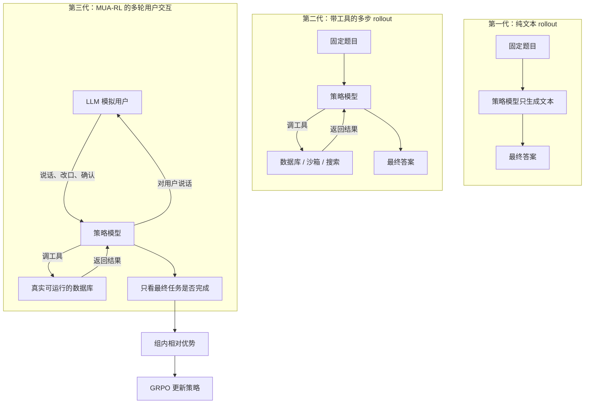

# 工具使用 RL 一直对着固定题目练，问题出在循环里没有会改口的用户

<!-- release-date: 2025-08-26 -->

> 本文依据 **MUA-RL: Multi-turn User-interacting Agent Reinforcement Learning for agentic tool use**，即 arXiv:2508.18669v1、2025-08-26 提交、共 25 页的预印本。九位作者中，共同一作 Weikang Zhao 同时挂美团与中国科学院自动化研究所，共同一作兼通讯作者 Xili Wang 同时挂美团与北京大学，Chengdi Ma 来自北京大学，其余作者来自美团；Yitao Zhai 为另一位通讯作者（PDF p. 1）。按主要归属方，本站把它放在 Meituan 目录下。页码均指 PDF 本身的页码。截至 2026-09-10 核验，arXiv 上只有 v1，与本地 `papers/Meituan/MUA-RL.pdf` 一致。
>
> 这是一篇技术论文，不是基模报告。它没有发布新的模型架构，而是在 Qwen3-8B / 14B / 32B 的非思考模式上，做多轮用户交互的工具使用强化学习。全文把三件事分开写：**论文明确写了什么**（带页码）、**本文如何解释它**、**外部资料补充**（会给出链接并标注）。

## 读之前需要的最少背景

这篇论文假设你已经知道「让语言模型调工具」大概在干什么。不熟的话，先记住下面这几件事就够读完全文。

**Agentic tool use（智能体式工具使用）** 不是让模型把答案一次性写完。它要在对话里反复做两件事：跟用户把需求问清楚，同时对数据库、订单系统或外部接口发出结构化调用。论文把一次交互写成一个三元组空间 $(\mathcal{T},\mathcal{M},\mathcal{O})$：$\mathcal{T}$ 是工具集合，$\mathcal{M}$ 是对用户说的话，$\mathcal{O}$ 是观察，再拆成数据库观察 $\mathcal{O}_{\text{db}}$ 和用户观察 $\mathcal{O}_{\text{user}}$（PDF p. 3）。

一条多轮轨迹不是「一问一答」，而是很多个回合串起来。每个回合里，智能体自己决定要不要调工具、调几次，最后再给用户发一条消息：

$$
(\underbrace{o_{1,\text{user}}\to t_1\to o_{1,\text{db}}\to\ldots\to m_1}_{\text{turn 1}},\;\ldots,\;\underbrace{o_{k,\text{user}}\to t_j\to o_{j,\text{db}}\to\ldots\to m_k}_{\text{turn }k},\;\ldots)
$$

这里 $t_i$ 是一次工具调用，$o_{i,\text{db}}$ 是数据库返回，$m_i$ 是对用户说的话（PDF p. 3，式 1）。

还要认识四个会反复出现的词：

- **Rollout（轨迹生成）**：让当前策略在一个任务上完整跑一局。跑出来的「用户话—工具调用—数据库返回—对用户回复」序列就是轨迹。
- **Cold-start（冷启动）**：强化学习开始前，先用少量高质量轨迹做监督微调，让模型学会最基本的工具调用格式和对话规矩。
- **GRPO（Group Relative Policy Optimization，组相对策略优化）**：DeepSeek-Math 提出的强化学习算法。同一道题采样一组回答，用组内平均分和标准差当基线，不再单独训练一个价值网络（PDF p. 5）。
- **Non-thinking（非思考模式）**：Qwen3 可以把内部长推理关掉，直接输出动作。这篇论文的训练和评测全部锁在这个模式（PDF p. 6、7）。

评测里会出现四个名字，先知道它们测什么：

| 名字 | 测什么 |
|---|---|
| TAU1-Bench | 零售和航空客服：智能体必须遵守领域政策，用工具改真实风格的数据库 |
| TAU2-Bench | TAU1 的升级版；零售和航空改了工具集与判分，并新增电信双控域（用户也能调工具） |
| BFCL-V3 Multi Turn | 多轮函数调用，含缺参数、缺函数、长上下文三类加难集 |
| ACEBench Agent | 机票、外卖、金融、通信等真实场景的多轮 / 多步工具使用 |

## 一句话先说清

现有的工具使用强化学习，几乎都把用户写成了剧本。

题目在训练开始前就固定好了。智能体面对的是代码沙箱、搜索引擎或 Docker，不是一个会根据刚才那句话改口的人。论文点名的 Retool、SkyRL、RAGEN 都是这个结构：环境是预定的，查询是预写的（PDF p. 2）。

真实客服不是这样。用户会补一句「价格必须更低」、会改成「我要无防水的那款」、会在你已经改完订单之后再反悔。智能体不但要调对工具，还要在对话里把意图问清楚，并且在改数据库之前拿到明确确认。

MUA-RL 的回答很具体：

> **把一个由大模型扮演的用户，放进强化学习的 rollout 循环里；奖励只看任务最终有没有按系统提示完成，不问中间工具调用的格式对不对。**

它不是一个新基座。骨干是 Qwen3-8B、Qwen3-14B、Qwen3-32B 的非思考模式（PDF p. 6）。冷启动大约两千条合成轨迹，强化学习用 TAU1-Bench 的 115 条零售任务和 50 条航空任务，用户模拟器是 GPT-4o-2024-11-20，框架搭在 VeRL 上（PDF p. 6–7）。

32B 训完以后，在 TAU2 Retail 拿到 67.3、Airline 45.4、Telecom 28.3，BFCL-V3 Multi Turn 28.4，ACEBench Agent 82.5（PDF p. 1、8–9）。这些数字要连着评测口径一起看：全部是非思考、温度 0、函数调用模式；TAU1 还是训练域。后文会把「超过更大开源模型」这句话拆开。

## 全景：一次 rollout 里其实有三方

论文 Figure 4 把工具使用 RL 的 rollout 画成三代（PDF p. 6）。下面按它的论证顺序重画，这是机制示意图，不是实测时间轴。

第一代就是数学 RL：模型写完一段，拿一个对错分，推理时甚至不用代码解释器（PDF p. 5）。

第二代把工具执行嵌进生成。论文把这里的「数据库」说得很宽：代码沙箱、互联网检索都可以算（PDF p. 5）。题目本身仍然是预写的。智能体不用学会问用户「你要改成哪一个蓝色款」。

第三代多了用户这一方。策略模型必须同时做两件事：用文本把用户意图问清楚，用工具去改数据库。整条轨迹里同时出现模型自己的话、工具调用、用户消息和工具返回（PDF p. 5）。论文认为，正是这四样东西叠在一起，才把 rollout 的动态性、随机性和不确定性拉到接近真实客服。

奖励算完之后，同一道题的一组轨迹做组内标准化，得到优势 $A_i$，再用 GRPO 更新策略。这个循环的形状才是 MUA-RL，不是某一个新注意力层。

## 第一层矛盾：现有工具 RL 把用户写成了剧本

论文第 1 节把这条矛盾说得很直（PDF p. 2）。

监督微调（Supervised Fine-Tuning，SFT）一直是工具使用的主流做法：合成一批「该怎么调工具」的轨迹，让模型去模仿。强化学习被认为泛化更好，于是出现了两类工作：

- 数学、代码这类静态、定义清楚的任务，DeepSeek-Math 是代表；
- 把外部环境接进 RL，Retool 接代码解释器，SkyRL 接 Docker，RAGEN 接符号或预指定环境。

论文的判断是：这些系统仍然运行在预定环境里，查询是预写的。它们学到的是「给定一个不会动的需求，怎么把工具调对」，不是「需求会随着你刚才说的话一起变，你怎么边问边调」。

真实用户不是测试集里的一条 instruction。用户会根据模型刚才的回复调整问题和预期，形成一个双向适应的反馈环（PDF p. 2）。现有 RL 框架把这个环漏掉了。

漏掉的后果，用后文附录 B 的零售改单就能看清。基座 Qwen3-32B 看到「把耳机改成蓝色」，立刻调用 `modify_pending_order_items`，没有先列出可选款、没有报价差、没有要用户说 yes。政策规定改物品只能调一次，订单状态变成 `pending (item modified)` 之后就不能再改。用户后来说「我要无防水的那款」，模型只能报错并转人工（PDF p. 18、21–22）。

工具调用的格式是对的。任务却失败了。失败点不在 JSON，在它没把用户当成一个会改口、必须先确认的对手。

这就是 MUA-RL 要解的问题。不是「再给工具调用加一条格式奖励」，而是把用户从剧本改成环境的一部分。

## 核心设计一：把 LLM 用户放进 RL 循环

### 旧问题

第二代多步 rollout 已经有真实工具执行了。看起来很「agentic」，缺的其实是对方。

如果用户是一条写死的查询，智能体的最优策略会退化成：尽快调工具、尽快改库。确认、报价、列出选项这些动作，在最终奖励里没有位置，训练时就不会长出来。附录 B 的抢跑改单，就是这条退化的现场。

### 新设计

论文把由大模型扮演的自动用户，嵌进 rollout（PDF p. 5）。训练时这个用户是 GPT-4o-2024-11-20；评测 TAU1 / TAU2 时换成 GPT-4.1，每个测试集跑四次取平均（PDF p. 7）。

它同时接了一个真实可运行的数据库，用来验证工具调用到底有没有改对状态（PDF p. 2、6–7）。用户是模拟的，数据库不是。论文强调这一点：工具结果必须能被真实环境核对，不能再让另一个 LLM 假装工具成功。

### 工作机制

每个任务最多 30 轮，序列长度上限 32768 token，智能体采样温度 1.0（PDF p. 7）。一轮里智能体只能走两条路中的一条：对数据库调工具，或对用户说话（任务形式化见 PDF p. 3）。用户模拟器根据当前对话继续给新的观察 $o_{\text{user}}$，可能补充信息，也可能改需求，也可能说 yes。

同一条查询会采样一组轨迹，组大小 $G=8$，也就是论文写的 rollout number of 8（PDF p. 7）。组内每条轨迹拿到一个 0/1 奖励，再算相对优势。

Figure 4 右侧用「预订会议室」把这条循环画具体了（PDF p. 6）：用户说要订会议室 → 智能体要求认证 → 用户给工号和邮箱 → 智能体调用 `authenticate_user` → 数据库返回员工档案 → 智能体再问日期和人数 → 用户补信息 → 智能体调用 `book_meeting_room` → 数据库返回预订号。工具调用和用户对话是交错的，不是「先问完再一次性调」。

### 收益

动态用户把「确认」「报价」「列出选项」变成了拿分的必要动作。附录 B 里，同一笔改单在 MUA-RL 之后变成：先按姓名和邮编认证，再列出三款蓝色耳机和价差，明确要用户回复 yes，然后才调用一次 `modify_pending_order_items`（PDF p. 18、22–24）。论文自己的评语是：这不是把模型训成死背政策，而是把交互策略改成谨慎、以政策为地、以用户为中心（PDF p. 18）。

### 代价和边界

用户仍然是 LLM，不是真人。训练用户是 GPT-4o，评测用户是 GPT-4.1，论文没有讨论这两套模拟器之间的分布差。30 轮上限是为了算力，不是因为真实对话只会有 30 轮（PDF p. 7）。数据库是「真实可运行」，但公开材料没有写它的实现、是否与 TAU 官方环境同一份、每条 rollout 是否重建环境。

### 可迁移启发

如果任务的本质是「对面会改口」，rollout 里就必须有一个会改口的对象。只把工具环境做真、用户还是一条固定 instruction，训练信号会把模型推向抢跑。用户模拟器不必完美，但必须能根据智能体刚才的话改变下一句。这条比「我们用了 GRPO」更值得带走。

## 核心设计二：先用两条合成管线做冷启动

### 旧问题

多轮工具使用对基座太难。智能体要在陌生工具、文本沟通、调用、纠错之间来回切（PDF p. 3）。直接做强化学习，模型可能还不会发出合法的工具调用，组内全是 0 分，GRPO 没有相对信号。

真实交互日志又几乎采不到：成本、系统复杂度、隐私、接口权限，论文把这四条都写了（PDF p. 3）。

### 新设计

先做一轮轻量监督微调。数据不用真实客服录音，而是两条合成管线（PDF p. 3–4，Figure 3）。

第一条：工具结果也由 LLM 模拟。先人工定一个领域和最简数据库 schema，再让 LLM 生成工具描述、参数和领域政策，人来审核和迭代。然后三个 LLM 分工：一个当智能体，一个当用户，最关键的一个当工具。构造查询时，先生成一份符合 schema 的小数据库当记忆，交给工具 LLM；智能体调用时只传工具名和参数，工具 LLM 按记忆生成返回。

第二条：工具结果来自真实的 MCP 服务器。MCP 是 Model Context Protocol（模型上下文协议）。这条管线不用手写工具，MCP 服务器自己执行。剩下的工作是：按这个服务器生成领域查询，再让用户 LLM、智能体 LLM 和 MCP 服务器三方交互出轨迹。

两条管线的轨迹都要过双重过滤：人类专家标注，加上 DeepSeek-R1 评估，丢掉无效轨迹（PDF p. 5）。附录 A 各给了一条例子：大学选课系统走 LLM 模拟工具，AniList 动漫检索走真实 MCP（PDF p. 15–18）。

规模很小。论文写大约两千条轨迹，覆盖 9 个场景：5 个合成场景，4 个真实 MCP 场景（PDF p. 6）。训练 2 个 epoch，batch 128，AdamW，初始学习率 $5\times 10^{-6}$，余弦衰减（PDF p. 6）。

### 工作机制

冷启动的目标不是把下游分数拉满，而是让模型在进入 RL 之前，已经会「一次只调一个工具、改库前要确认、按政策说话」。附录 A 的选课例子几乎就是在教这三件事：先认证学号和出生日期，再复述「把电话改成 555-123-4321」，用户说 yes 之后才调用 `update_address_or_phone`（PDF p. 16）。

### 收益

消融说明冷启动不是可选项。把冷启动拿掉、直接对 Qwen3-32B 做 MUA-RL，TAU2 三个域还能涨（Retail 50.2→61.6，Airline 23.5→41.0，Telecom 24.8→28.1），但 BFCL-V3 Multi Turn 整体准确率从 19.6 掉到 19.3，相对完整 MUA-RL-32B 的 28.4 差 9.1 分（PDF p. 11，Table 3）。

本文的解释是：冷启动提供的是「会调陌生工具、会走多轮格式」的先验；没有它，RL 在训练域（零售 / 航空）里仍能靠结果奖励摸索，换到 BFCL 这种工具集完全不同的基准就塌。

### 代价和边界

冷启动会写入领域偏见。三个尺度上，冷启动模型在 TAU Telecom 都比基座更差：8B 从 19.1 掉到 9.0，14B 从 29.9 掉到 23.5，32B 从 24.8 掉到 19.3（PDF p. 8，Table 1）。论文把原因写清楚了：冷启动数据把模型拉向训练分布附近的模式，遇到差得远的电信双控域就会伤泛化（PDF p. 8）。

公开材料没有列出 5 个合成场景和 4 个 MCP 服务器的完整名单，只在附录里看到大学选课和 AniList。大约两千条是约数，没有按场景拆开的条数。

### 可迁移启发

工具 RL 的冷启动数据不必大，但必须同时覆盖「假工具」和「真工具」。假工具便宜、好控 schema；真 MCP 防止模型学会和另一个 LLM 对打的捷径。更重要的是：SFT 会注入偏见，后面必须有一个能把偏见洗掉的 RL 阶段。只做冷启动，Telecom 这种离训练域远的任务会退步。

## 核心设计三：只给最终成败分，并且把别人的 token 掩掉

### 旧问题

工具调用是高度结构化的行为，现有工作喜欢把奖励做复杂：格式分、工具名 / 参数名匹配分、成功调用比例分（PDF p. 5）。论文认为，复杂奖励在动态多轮里不一定教会有效行为，反而可能让模型不敢试错（PDF p. 5）。

TAU1-Bench 原版奖励还有一项对话内容要求：任务做成了，但没在对话里提到「库存还有几件衣服」，也给 0 分。论文在 RL 训练时把这项拿掉了，因为他们观察到：对话内容要求会妨碍模型学习正确的工具调用模式（PDF p. 7）。

### 新设计

奖励极简。任务按系统提示成功完成，$r=1$；否则 $r=0$（PDF p. 6）。

论文给了两条理由（PDF p. 6）：

- **对对话路径鲁棒**：不管走了哪条对话、工具调用顺序如何，只要最终结果对，就给分。
- **减轻奖励黑客**：模型不能靠输出格式或工具语法刷分，只能靠把任务做完。

优势函数是标准 GRPO。同一查询采 $G$ 条轨迹，组内标准化：

$$
A_i=\frac{r_i-\operatorname{mean}(\{r_i\}_{i=1}^{G})}{\operatorname{std}(\{r_i\}_{i=1}^{G})}
$$

策略目标带 clip 和 KL 惩罚（PDF p. 5，式 2–3）：

$$
\mathcal{J}_{\mathrm{GRPO}}(\theta)=\mathbb{E}\Bigg[\frac{1}{G}\sum_{i=1}^{G}\min\Big(
\frac{\pi_\theta(y_i\mid q)}{\pi_{\mathrm{old}}(y_i\mid q)}A_i,\;
\operatorname{clip}\big(\tfrac{\pi_\theta(y_i\mid q)}{\pi_{\mathrm{old}}(y_i\mid q)},1-\epsilon,1+\epsilon\big)A_i
\Big)-\beta\,\mathbb{D}_{\mathrm{KL}}(\pi_\theta\Vert\pi_{\mathrm{ref}})\Bigg]
$$

KL 系数 $\beta=0.001$。$\epsilon$ 的具体数值论文没给（PDF p. 7）。

训练时还有一条 **loss mask（损失掩码）**：工具返回和用户消息的 token 不进损失，只让模型对自己发出的话和工具调用负责（PDF p. 7）。

### 工作机制

0/1 奖励意味着：同一组 8 条轨迹里，如果 3 条做成了、5 条没做成，做成的三条拿到正优势，没做成的拿到负优势。模型不会因为「JSON 更漂亮」或多调了一次 `think` 而多拿分。

掩码的意义更具体。用户模拟器的话、数据库返回，都不是策略模型生成的。如果对这些 token 也算梯度，模型会浪费容量去模仿 GPT-4o 的口吻或数据库 JSON 的字段顺序。掩掉之后，梯度只落在「该不该问确认」「该调哪一个工具」这些策略动作上。

### 收益

这条设计在案例里最清楚。基座抢跑改单，工具调用本身是合法的，按「调用成功比例」甚至能拿正分；按最终任务完成则是 0。MUA-RL 用后一种信号，才把「先列选项、先报价、先要 yes」选出来（PDF p. 18）。

训练动态也支持「不是靠把回复写长」。响应长度在 RL 过程中基本不变，rollout 轮数先升后稳定在大约 21–23 轮（PDF p. 9；曲线在 Figure 5e–f，PDF p. 10）。论文把它和 GLM-4.5 的观察放在一起：涨分来自更有结构的多轮交互，不是测试时把思维链写长（PDF p. 9）。

### 代价和边界

稀疏奖励的老问题还在。组内 8 条全错时，标准差为 0，这一题没有可用的相对信号。论文没有写他们如何处理全 0 组。

他们自己也知道极简奖励不是终点。结论里把「更细的奖励塑形」和「与人类偏好进一步对齐」列为未来工作（PDF p. 11）。Loss mask 没有单独消融，不能证明它比「不掩」一定更好，只知道完整系统里用了它。

训练奖励还改过 TAU1 原版规则：不再要求对话里提到特定信息。这意味着训练信号和官方 TAU1 评测不完全同构。论文在评测时用的是官方评测代码（PDF p. 24–25），所以 TAU1 上的数字是官方口径；但训练时模型从未被要求「把库存件数说出来」。

### 可迁移启发

工具 RL 里，过程奖励很容易变成捷径。格式分会让模型把 JSON 写得很标准却抢跑改库；「必须在对话里提到 X」会让模型把容量花在措辞上。如果你真正想要的是「把数据库改对，并且政策允许」，最终结果奖励更干净。过程约束可以放进环境（改物品只能一次、没确认就调用会失败），不必再写进奖励公式。

## 训练配方：在哪训、用什么骨干、跑多少步

骨干不是新架构。三个尺度都是 Qwen3 非思考模式：8B、14B、32B，用来看缩放（PDF p. 6）。

两段训练可以压成一张表：

| 阶段 | 数据 | 优化 | 关键超参 |
|---|---|---|---|
| 冷启动 SFT | 约两千条合成轨迹，9 个场景（5 合成 + 4 MCP） | AdamW，余弦衰减 | batch 128，2 epoch，lr $5\times 10^{-6}$ |
| MUA-RL | TAU1-Bench 115 零售 + 50 航空 | GRPO，基于 VeRL | 25 epoch，batch 32，组大小 8，$\beta=0.001$，最长 32768 token，最多 30 轮，温度 1.0 |

用户模拟器训练时是 GPT-4o-2024-11-20，评测 TAU1 / TAU2 时是 GPT-4.1（PDF p. 7）。评测温度固定 0.0，非思考，全部走函数调用（Function Calling，FC）而不是提示词里塞工具说明（PDF p. 7）。ACEBench 官方默认是提示词评测，他们改了官方评测代码以支持 FC（PDF p. 25）。

Figure 5 的横轴大约到 120 step（PDF p. 10）。本文按公开超参估算：165 条训练任务、batch 32，大约每 epoch 5 步，25 epoch 约 125 步，和曲线横轴对得上。这是推算，论文没有直接写总 step 数。

论文感谢 VeRL 团队提供基础设施（PDF p. 11）。VeRL 就是本站 [HybridFlow](/reports/ByteDance/HybridFlow) 那套框架。MUA-RL 是锅里炒的菜：多轮用户 + 真实数据库 + 0/1 奖励；锅本身怎么做分布式，这篇没有展开。

算力账单没有公开。没有 GPU 型号、卡时、墙钟时间，也没有和「不接用户模拟器」的同算法对照——消融比的是「去掉冷启动」和「去掉 RL」，不是「去掉动态用户」。

## 实验怎么证明

先把评测口径钉死，再看数字。否则摘要里那句「超过或持平更大的开源模型」会被读成全面超越。

共同设定（PDF p. 7）：

- 非思考模式，温度 0.0；
- 函数调用模式；
- TAU1 / TAU2 用 GPT-4.1 当用户，每个测试集跑四次取平均；
- TAU2 Telecom 额外报 **TCR（Task Completion Rate，任务完成率）**，按该题验证条件满足了多少比例，而不是只报成或不成：

$$
\mathrm{TCR}(q)=\frac{|\{c_i\in C_q:\mathrm{satisfied}(c_i)\}|}{|C_q|}
$$

- BFCL-V3 Multi Turn 用可执行函数准确率；
- ACEBench Agent 的用户模拟器与 TAU-Bench 相同。

RL 训练数据是 TAU1 的零售和航空。所以 **TAU1 的数字是训练域**，TAU2 零售 / 航空是同领域但改了工具集、政策和更严的判分，TAU2 Telecom、BFCL、ACEBench 才更接近「换一套工具还能否用」（PDF p. 7、24–25）。

### TAU1 / TAU2：同领域能追上更大模型，双控电信没有

Table 1 全文如下，全部是非思考（PDF p. 8）：

| 模型 | TAU1 Retail | TAU1 Airline | TAU2 Retail | TAU2 Airline | TAU2 Telecom | Telecom TCR |
|---|---:|---:|---:|---:|---:|---:|
| GPT-4o-2024-11-20 | 63.0 | 45.5 | 67.3 | 46.9 | 24.1 | – |
| GPT-4.1 | 66.5 | 42.5 | 70.2 | 53.0 | 38.9 | – |
| DeepSeek-V3-0324 | 70.4 | 42.4 | 64.7 | 37.0 | 32.9 | – |
| Qwen3-235B-A22B Non-thinking | 65.2 | 32.0 | 64.9 | 36.0 | 24.6 | – |
| Qwen3-30B-A3B Non-thinking | 38.3 | 18.0 | 31.6 | 18.0 | 18.4 | – |
| Qwen3-4B Non-thinking | 24.3 | 16.0 | 28.1 | 12.0 | 17.5 | – |
| Qwen3-8B Non-thinking | 40.0 | 11.0 | 41.0 | 12.5 | 19.1 | 22.9% |
| Qwen3-8B Cold-start | 36.7 | 12.0 | 31.4 | 16.0 | 9.0 | 12.1% |
| MUA-RL-8B | 56.5 | 29.5 | 49.8 | 19.0 | 21.8 | 25.2% |
| Qwen3-14B Non-thinking | 46.9 | 13.0 | 43.1 | 14.8 | 29.9 | 46.6% |
| Qwen3-14B Cold-start | 50.8 | 23.0 | 53.7 | 24.0 | 23.5 | 32.9% |
| MUA-RL-14B | 65.9 | 42.0 | 66.0 | 38.0 | 33.4 | 54.3% |
| Qwen3-32B Non-thinking | 47.6 | 18.5 | 50.2 | 23.5 | 24.8 | 23.7% |
| Qwen3-32B Cold-start | 58.9 | 36.0 | 58.2 | 31.1 | 19.3 | 21.6% |
| MUA-RL-32B | 72.6 | 46.5 | 67.3 | 45.4 | 28.3 | 45.1% |

读这张表时，有四件事实比摘要更重要。

第一，MUA-RL-32B 在 TAU1 Retail 的 72.6 超过 DeepSeek-V3-0324 的 70.4、GPT-4.1 的 66.5（PDF p. 8）。但 TAU1 零售是训练数据。把它当成跨基准的全面超越不公平。

第二，同领域、换了工具和更严判分的 TAU2 Retail / Airline，32B 仍然强：Retail 67.3 持平 GPT-4o、超过 DeepSeek-V3-0324 的 64.7 和 Qwen3-235B-A22B 的 64.9；Airline 45.4 超过这两个开源模型，但仍低于 GPT-4.1 的 53.0 和 GPT-4o 的 46.9（PDF p. 8）。摘要说的「超过或持平更大开源模型」，主要落在这两列。

第三，真正的双控域 TAU2 Telecom，32B 只有 28.3，低于 DeepSeek-V3-0324 的 32.9 和 GPT-4.1 的 38.9，只超过 Qwen3-235B-A22B 的 24.6（PDF p. 8）。更值得看的是 14B：Telecom 准确率 33.4，TCR 54.3%，两项都高于 32B 的 28.3 和 45.1%，也高于 GPT-4o 的 24.1 和 DeepSeek-V3-0324 的 32.9（PDF p. 8）。论文把 14B 在电信上的表现单独标出来，这个选择是诚实的——最大的 MUA-RL 并不是双控域最强的。

第四，冷启动在零售 / 航空涨分，在电信掉分；RL 把三个尺度的电信都拉回来，并且超过各自的基座（PDF p. 8）。这是「SFT 注入偏见、结果奖励再洗掉」这条因果链的直接证据。

### BFCL 和 ACEBench：换工具集之后还在，但不是全面第一

Table 2（PDF p. 9）：

| 模型 | BFCL Base | Miss Func | Miss Param | Long Context | BFCL Overall | ACE Multi Turn | ACE Multi Step | ACE Overall |
|---|---:|---:|---:|---:|---:|---:|---:|---:|
| GPT-4.1 | 48.0 | 34.0 | 35.0 | 45.5 | 40.5 | 83.3 | 90.0 | 86.7 |
| DeepSeek-V3-0324 | 41.0 | 21.0 | 23.0 | 34.5 | 29.8 | 73.3 | 75.0 | 74.2 |
| Qwen3-235B-A22B Non-thinking | 42.5 | 23.5 | 28.5 | 25.5 | 30.0 | 63.3 | 80.0 | 71.7 |
| Qwen3-30B-A3B Non-thinking | 14.0 | 1.5 | 7.5 | 8.5 | 7.9 | 36.7 | 30.0 | 33.4 |
| Qwen3-8B Non-thinking | 20.0 | 4.0 | 13.0 | 10.0 | 11.8 | 33.3 | 45.0 | 39.2 |
| Qwen3-8B Cold-start | 24.0 | 11.0 | 16.5 | 10.0 | 15.4 | 36.7 | 55.0 | 45.9 |
| MUA-RL-8B | 21.0 | 11.5 | 15.0 | 11.0 | 14.6 | 46.7 | 60.0 | 53.3 |
| Qwen3-14B Non-thinking | 30.0 | 8.0 | 16.0 | 16.5 | 17.6 | 40.0 | 80.0 | 60.0 |
| Qwen3-14B Cold-start | 35.0 | 13.5 | 21.5 | 19.5 | 22.4 | 50.0 | 90.0 | 70.0 |
| MUA-RL-14B | 40.5 | 14.0 | 25.0 | 21.5 | 25.3 | 56.7 | 100.0 | 78.3 |
| Qwen3-32B Non-thinking | 29.5 | 11.0 | 20.0 | 18.0 | 19.6 | 60.0 | 85.0 | 72.5 |
| Qwen3-32B Cold-start | 35.0 | 21.0 | 28.5 | 19.5 | 26.0 | 53.3 | 100.0 | 76.6 |
| MUA-RL-32B | 42.0 | 20.0 | 30.0 | 21.5 | 28.4 | 70.0 | 95.0 | 82.5 |

ACEBench Agent 上，MUA-RL-32B 的 82.5 是表内除 GPT-4.1（86.7）以外最高，超过 DeepSeek-V3-0324 的 74.2 和 Qwen3-235B-A22B 的 71.7（PDF p. 8–9）。论文说 ACEBench 有 50 道题、22 个工具，场景含机票、外卖、金融、通信（PDF p. 25）。50 道题的粒度粗，14B 的 Multi Step 已经到 100.0，32B 反而掉到 95.0，不宜把 82.5 读成稳定的「接近 GPT-4.1」。

BFCL 上，32B 的 28.4 超过自己的基座 19.6 和冷启动 26.0，接近但没有超过 DeepSeek-V3-0324 的 29.8 和 Qwen3-235B-A22B 的 30.0（PDF p. 9）。Long Context 一列尤其弱：32B 只有 21.5，两个更大开源模型是 34.5 和 25.5。摘要把 BFCL 28.4 和「超过更大开源模型」写在同一句里，表上并不是这样。

8B 在 BFCL Overall 上，RL 之后 14.6，略低于冷启动的 15.4（PDF p. 9）。小模型吃到动态用户 RL，不是每个基准都单调上升。

### 消融：两段都要，缺一段就缺一块能力

Table 3 只做 32B（PDF p. 11）：

| 模型 | TAU2 Retail | TAU2 Airline | TAU2 Telecom | BFCL Overall |
|---|---:|---:|---:|---:|
| Qwen3-32B Non-thinking | 50.2 | 23.5 | 24.8 | 19.6 |
| 只有冷启动（w/o RL） | 58.2 | 31.1 | 19.3 | 26.0 |
| 只有 RL（w/o cold-start） | 61.6 | 41.0 | 28.1 | 19.3 |
| 完整 MUA-RL-32B | 67.3 | 45.4 | 28.3 | 28.4 |

括号里论文还标了对基座和对完整系统的升降（PDF p. 11）。本文只把绝对值摊开，升降可以自己减。

只有冷启动：训练域附近的零售 / 航空涨，电信掉，BFCL 小涨。这就是 SFT 的典型形状——像训练数据的任务变好，不像的变差。

只有 RL：TAU2 三个域都涨，Telecom 已经非常接近完整系统（28.1 vs 28.3），但 BFCL 几乎没动（19.3 vs 基座 19.6）。没有冷启动教会的「陌生工具格式」，结果奖励在训练域够用，换工具集不够用。

完整系统在所有列出的列上都最高。论文的结论是：去掉任何一段都会明显掉点（PDF p. 10）。这个结论成立，但成立的方式不一样：冷启动主要买 BFCL 这种换工具集的泛化，RL 主要买 TAU2 这种「同领域、更动态」的完成率。

缺的对照是「RL 循环里不放用户模拟器」。没有这组，就不能从实验上把收益单独归因到「动态用户」，只能归因到「冷启动 + 接了真实数据库的 GRPO」。动态用户的必要性，目前主要靠任务形式化、Figure 4 的三代对比和附录 B 的案例支撑，不是靠消融。

## 训练动态里真正涨的是什么

Figure 5 把 8B / 14B / 32B 的学习曲线画在一起，横轴到大约 120 step（PDF p. 10）。论文正文只对其中几条给了定性结论，下面按正文走，不从图上估具体 y 值。

KL 散度在上升，说明策略在离开冷启动模型。8B 的 KL 波动明显大于 14B 和 32B，论文归因于小模型容量不够，探索和正则之间抖得更厉害；大模型能把噪声更新平均掉（PDF p. 9）。8B 的熵在早期快速下降，从广探索转到确定利用。梯度范数没有爆炸或发散（PDF p. 9）。

轮数先升，再稳定在大约 21–23 轮；响应长度几乎不变（PDF p. 9）。这是全文最有用的一条训练观察：涨分不是因为模型把每句话写长，而是因为多轮结构被用起来了。客服任务里，「多问一轮、少说废话」比「把思维链拉到几千 token」更对症。

Unique 4-gram Ratio 衡量生成文本的词面多样性。8B 早期多样性更高，32B 更低而且持续下降。论文的解释是：大模型靠增强工具使用来完成任务，而不是靠把话说得花样更多（PDF p. 9）。

All Correct Query Ratio 是「一组 rollout 全对」的题目比例，All Wrong 是「一组全错」。训练中前者上升、后者下降（PDF p. 9–10）。附录 B 被明确标成：从全错变成全对的一条案例（PDF p. 10、18）。

Figure 6 跟踪三个通用工具的平均调用次数：Calculate、Think、Transfer to Human Agent（PDF p. 11）。三条都下降。Think 是给非思考模型的一个推理接口，Transfer 是模型觉得自己搞不定时转人工。论文的解释是：MUA-RL 降低了对「对完成任务贡献有限」的工具的依赖；少调 Think，决策路径更短（PDF p. 10）。

本文补一句边界：少调 Transfer 既可能是真的更能自己做完，也可能是模型被 0/1 奖励逼着「不要轻易认输」。论文没有把 Transfer 下降和最终成功率做因果分析，只能当现象记下。

## 附录案例：同一笔改单，基座抢跑、训完才肯问

附录 B 值得单独看，因为它把「动态用户 + 最终奖励」到底改了什么策略，写到了可复述的粒度（PDF p. 18–24）。

任务是 TAU2 Retail：用户 Chen Johnson，邮编 77004，要把订单 `#W5061109` 里的白色无线耳机换成蓝色，并且价格必须相同或更低。政策规定：改物品的工具每个订单只能调一次，调完状态变成 `pending (item modified)`，不能再改、也不能取消（PDF p. 20）。

Qwen3-32B 非思考的错误轨迹（PDF p. 21–22）：

1. 先用一个编出来的邮箱 `find_user_id_by_email`，失败；
2. 再用姓名 + 邮编找到用户，拉订单，拉商品变体；
3. **没有列出选项，没有报价，没有要 yes**，直接把白色款改成蓝色 IPX4、8 小时续航的 `$226.49` 那一款；
4. 用户这时才说：想要无防水的蓝色款；
5. 模型再调一次 `modify_pending_order_items`，环境返回 `Non-pending order cannot be modified`；
6. 转人工，任务失败。

MUA-RL 之后的正确轨迹（PDF p. 22–24）：

1. 直接用姓名 + 邮编认证；
2. 拉订单和变体后，把三款在售蓝色耳机连价格一起列给用户：`$232.49` / `$226.49` / `$242.92`；
3. 用户选了无防水的 `$242.92`；
4. 模型先算价差：原价 `$256.67`，新价 `$242.92`，退 `$13.75`，再明确要求回复 yes；
5. 用户说 yes 之后，只调一次修改工具，任务完成。

两种轨迹的工具都是合法 JSON。差别在交互策略：基座把「改成蓝色」理解成立刻写库；训完的模型把「改成蓝色」理解成一个还没被充分指定的意图，必须先展开选项、锁价、拿确认。论文说这不是把政策背死，而是交互策略被改成了谨慎、以政策为地、以用户为中心（PDF p. 18）。

这和 0/1 最终奖励是对得上的。抢跑在过程上每一步都「成功」，在结果上是 0 分。只有最终成败才会惩罚「先改再问」。

## 论文没写、不能外推的边界

这篇没有独立的 Limitations 节。能确定的缺口如下。

**没有新的基座架构。** 三个 MUA-RL 模型都是 Qwen3 非思考模式的后训练产物（PDF p. 6）。不要把它写成美团发了一个 8B / 14B / 32B 新模型家族。

**动态用户没有消融。** 实验证明了「冷启动 + RL」比只做其中一段好，没有证明「循环里有用户模拟器」比「循环里没有」好。这是把论文主主张和实验证据分开之后，最需要记住的一条。

**TAU1 是训练域。** 115 + 50 条既是 RL 数据，也是 TAU1 测试来源（PDF p. 7、24）。TAU1 上超过 GPT-4.1、DeepSeek-V3-0324 的数字，不能直接当成跨基准泛化。

**摘要的对比不均一。** MUA-RL-32B 在 TAU2 Retail / Airline 和 ACEBench Agent 上确实超过或持平 DeepSeek-V3-0324 与 Qwen3-235B-A22B 非思考；在 TAU2 Telecom 低于 DeepSeek-V3-0324；在 BFCL-V3 Multi Turn 低于这两个更大模型（PDF p. 8–9）。「超过或持平」是摘要的概括，不是五列都成立。

**用户是模拟的。** 训练 GPT-4o、评测 GPT-4.1，没有真人用户实验。模拟器自己的偏见会写进策略。论文也把「与人类偏好进一步对齐」列为未来工作（PDF p. 11）。

**没公开的实现细节：** GPU 型号与卡时；RL 学习率；GRPO 的 $\epsilon$；全 0 组怎么处理；loss mask 有没有对照；5 个合成场景和 4 个 MCP 服务器的完整名单；用户模拟器的提示词；数据库是否每条 rollout 重建；Qwen3 思考模式下这套方法是否还成立。

**小模型不是单调变好。** 8B 的 BFCL Overall 在 RL 之后略降；32B 的 ACEBench Multi Step 从冷启动的 100.0 降到 95.0；Telecom 上 14B 强于 32B（PDF p. 8–9）。不要把「MUA-RL 一律涨点」当成结论。

**评测题量有的很小。** ACEBench Agent 50 题，TAU1 Airline 50 题。四次平均能降方差，改一两题仍会摆动几个点。

结论里写的未来方向是：更丰富的多模态环境、更细的奖励塑形、开放交互里与人类偏好对齐（PDF p. 11）。这些都还没做。

## 可迁移启发

如果只从这篇带走几条能用在自己项目里的原则，下面这几条不依赖美团的数据，也不依赖 Qwen3。

**1. 先问训练循环里有没有「会改口的对方」。**  
工具环境做真，只解决「调用有没有改对状态」。用户如果还是一条写死的 instruction，策略会被推向抢跑。客服、技术支持、改订单这类任务，用户必须是环境的一部分。

**2. 过程约束放进环境，不要塞进奖励。**  
「改物品只能一次」「没 yes 就写库会失败」是环境规则。奖励只看最终状态对不对，模型才会把确认问出来。格式分、提及分、调用成功率，都会让模型优化代理指标。

**3. 冷启动要小、要真假工具都有，并且预期它会写入偏见。**  
大约两千条就够让 Qwen3 学会基本格式。假工具便宜，真 MCP 防捷径。SFT 之后离训练域远的任务可能变差，这不是失败，是后续 RL 要洗的东西。

**4. 梯度只落在策略自己发出的 token 上。**  
用户话和工具返回是环境，不是动作。掩掉它们，模型才把容量用在「问什么、调什么」上。这条在多轮 Agent RL 里几乎是默认动作，这篇把它写进了方法。

**5. 看轮数和长度，不要默认涨分来自写长。**  
这篇的响应长度几乎不变，轮数稳定在 21–23。如果自己的客服 RL 曲线是长度狂涨、轮数不动，多半在学啰嗦，不是在学交互结构。

**6. 换工具集和同领域加难，要分开看。**  
只有 RL、没有冷启动，TAU2 仍涨、BFCL 不涨。只有冷启动，BFCL 小涨、电信掉。完整管道的意义是两块能力都要买，不是某一段「更强」。

**7. 声称超过更大模型时，先核训练域。**  
TAU1 零售是训练数据。TAU2 零售 / 航空是近域。Telecom、BFCL、ACEBench 才是换设定。把五列摘要成一句「超过 DeepSeek-V3-0324」，会把近域成绩说成泛化成绩。

## 关键词回看

- **MUA-RL（Multi-turn User-interacting Agent Reinforcement Learning）**：把 LLM 模拟用户放进工具使用 RL 循环的框架，不是新基座。
- **三代 rollout**：纯文本 → 带工具的多步 → 用户和数据库同时在场的多轮。MUA-RL 做的是第三代。
- **冷启动两条管线**：LLM 模拟工具返回，或真实 MCP 服务器执行；都要过人 + DeepSeek-R1 双过滤。
- **GRPO**：组内相对优势，不训 critic；本文 $\beta=0.001$，组大小 8。
- **0/1 最终奖励**：只有按系统提示把任务做完才给 1；训练时还去掉了 TAU1「必须在对话里提到某信息」的要求。
- **Loss mask**：用户消息和工具返回不进损失。
- **TCR**：TAU2 Telecom 的细粒度完成率，按验证条件满足比例计，不是 0/1。
- **Non-thinking / FC**：全部训练和评测关掉 Qwen3 思考模式，用函数调用而不是提示词调工具。

如果只记一句：

> **工具调用 RL 的环境里如果没有会改口的用户，你训练的就不是客服问题。把用户放进循环，奖励只看最终状态，确认、报价和一次改对才会变成策略，而不是提示词里的礼貌用语。**

## 参考资料

- 论文页：[arXiv:2508.18669](https://arxiv.org/abs/2508.18669)（v1，2025-08-26 提交；截至 2026-09-10 仍无更新版本）
- PDF：[arXiv pdf](https://arxiv.org/pdf/2508.18669)
- 论文写明将开源的代码：[github.com/zzwkk/MUA-RL](https://github.com/zzwkk/MUA-RL)
- 论文写明将开源的权重：[MUA-RL-8B](https://huggingface.co/zzwkk/MUA-RL-8B)、[MUA-RL-14B](https://huggingface.co/zzwkk/MUA-RL-14B)、[MUA-RL-32B](https://huggingface.co/zzwkk/MUA-RL-32B)
- 论文写明将开源的冷启动数据：[zzwkk/MUA-RL-Dataset](https://huggingface.co/datasets/zzwkk/MUA-RL-Dataset)

`release-date` 取 **2025-08-26**。这篇文章讲的是一项公开技术及配套后训练权重，按「任一官方渠道最早对外公开」取值。已核对的最早官方事件是 arXiv v1，时间戳 2025-08-26 04:26:29 UTC。Hugging Face 权重仓库的 `createdAt` 按本模块规则不是首发日，不用来回写。

外部补充，不进入上面的日期判断：

- GitHub 仓库现在是公开的 Apache-2.0 实现，内含 `verl/` 目录和 `examples/sglang_multiturn/` 训练脚本；README 另写了 4×8 GPU、建议 H200 141GB 等论文未写的部署细节，那些数字以仓库为准，不能回写进对 PDF 的转述。
- Hugging Face 数据集卡片写公开子集有 1580 条，并声明完整数据还含未公开任务；与论文「大约两千条」并不矛盾，也不能精确替代论文的约数。
- `zzwkk/MUA-RL-8B` 的模型卡把基座写成 Qwen3-32B，与论文「Qwen3-8B Non-thinking 为 8B 骨干」不一致，以 PDF 为准。
